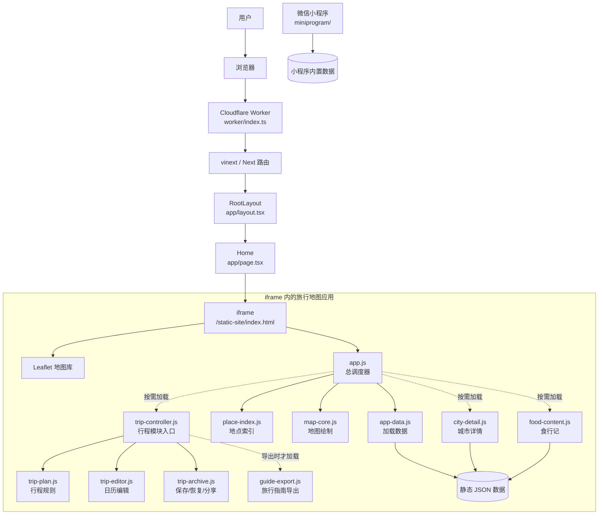
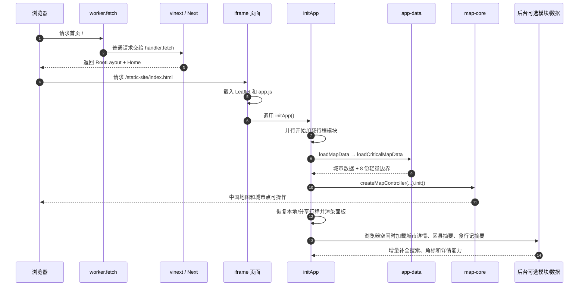

# 旅行地图项目：零基础工程导读

> 面向没有 JavaScript 基础的读者。本文先建立项目全景，再沿真实启动链路拆到函数。分析基于当前分支 `codex/mini-program-map` 的实际代码；README 中“网页是纯静态项目”的部分已经落后于当前架构。

## 0. 阅读约定：怎样确保讲的是事实

每个部分在讲解前都按五个问题核验：

1. 它是什么，边界在哪里？
2. 为什么需要它？
3. 谁调用它，它又调用谁？
4. 它读写什么数据或状态？
5. 它失败时会影响什么，有没有更合适的替代方案？

正文给出核验后的结论、代码位置和设计取舍，不把猜测当作架构事实。

## 1. 先用一句话认识项目

这是一个“中国城市旅行路线规划器”：用户可以在地图上选择城市或区县，形成跨城路线，估算铁路距离和时间，把路线排进日历，补充活动与住宿，查看城市内的景点、地铁、火车站和食行记，最后保存、分享或导出旅行指南。

仓库里有两个相互独立的用户端：

- 当前网页端：功能最完整，也是本导读首先拆解的对象。
- 微信小程序端：较轻量的原生实现，入口在 `miniprogram/`，没有直接复用网页界面代码。

## 2. 零基础先记住七个词

| 词 | 通俗解释 | 本项目中的例子 |
| --- | --- | --- |
| 函数 | 一台有名字的小机器：收原料，做一件事，给出结果或产生效果 | `loadMapData()` 读取地图数据 |
| 模块 | 一个工具箱，里面放一组职责相近的函数 | `map-core.js` 放地图绘制工具 |
| 状态 | 程序此刻记住的事实 | 当前选择的城市、路线列表、地图模式 |
| 事件 | 用户或浏览器发出的通知 | 点击城市、输入搜索词、页面加载完成 |
| DOM | 浏览器中的“页面零件树” | 搜索框、按钮、地图容器 |
| JSON | 只装数据、不装行为的文本格式 | 城市坐标、区县、站点、文章索引 |
| Promise / `async` | “现在开始，稍后才有结果”的任务凭据 | 从磁盘或网络加载 JSON、动态加载模块 |

看到 `function A(...)`，先把它读成“定义一台叫 A 的小机器”；看到 `A()`，再读成“现在启动这台机器”。

## 3. 当前真实架构

最容易产生误解的地方是 `iframe`。外层 React 页面没有重新实现地图，它只创建了一个占满页面的“内嵌浏览器窗口”；真正的旅行地图仍运行在这个窗口里的 `public/static-site/`。

## 4. 哪些文件才是当前源码

| 路径 | 身份 | 初学者现在要不要改 |
| --- | --- | --- |
| `app/layout.tsx` | Next 页面最外层骨架和页面元信息 | 偶尔 |
| `app/page.tsx` | 网页首页，创建地图 iframe | 偶尔 |
| `public/static-site/` | 当前网页地图的主要手写源码 | 是，重点 |
| `worker/index.ts` | Cloudflare 上的请求入口 | 部署或图片功能时 |
| `vite.config.ts` | 开发/构建工具的总配置 | 构建方式变化时 |
| `build/sites-vite-plugin.ts` | 构建结束后复制部署元数据 | 很少 |
| `tests/` | 自动验证程序行为的测试 | 改功能时要看 |
| `scripts/` | 生成数据、抓取文章、压缩资源的离线工具 | 更新数据时 |
| `miniprogram/` | 微信小程序的独立源码 | 改小程序时 |
| `dist/`、大部分 `build` 产物 | 机器生成的部署结果 | 不直接手改 |
| 根目录的 `index.html`、`app.js` 等 | 较早的静态版副本；与当前 `public/static-site/` 已不完全相同 | 不作为当前网页入口修改 |

判断依据很直接：`Home()` 的 iframe 明确指向 `/static-site/index.html`，而这个 HTML 又明确加载同目录的 `app.js`。

## 5. 浏览器启动时发生了什么

这里存在两条速度不同的路径：

- 关键路径：城市数据和 8 份轻量边界。没有城市数据，应用无法正常工作；少数边界块失败时，地图仍尽量启动并显示警告。
- 可选路径：2,789 条区县摘要、456 篇食行记摘要、城市详情模块等。它们失败时进入“降级可用”，不应该拖死首屏地图。

这就是“渐进加载”：先把最有用的部分交给用户，再补齐次要内容。

## 6. 第一条调用链：从首页到地图可操作

下面把这条链上的函数逐个拆开。此处覆盖的是启动架构，不是当前发布 Web 的全部 929 个函数节点，更不是整个仓库的 2,500 个第一方可执行函数节点；完整核算见第 17 章。

### 6.1 `RootLayout()` — HTML 最外壳

位置：`app/layout.tsx:9`

- 输入：Next 交给它的 `children`，也就是页面主体。
- 输出：`<html lang="zh-CN"><body>...</body></html>`。
- 作用：声明中文页面并给所有页面提供共同外壳。
- 谁调用：Next 路由框架自动调用，不是 `app.js` 手动调用。
- 为什么这样设计：这是 Next App Router 规定的根布局入口。
- 可替代方案：当前只有一个页面，理论上可以完全不用 Next；但这样会失去现有 vinext/Cloudflare 的统一构建外壳。

文件上方的 `metadata` 不是函数，而是一份页面标题和描述数据，Next 会把它转换为浏览器 `<head>` 中的元信息。

### 6.2 `Home()` — 创建 iframe

位置：`app/page.tsx:1`

- 输入：没有显式参数。
- 输出：一个指向 `/static-site/index.html` 的 iframe。
- 作用：把原有静态地图完整嵌入当前 React/Next 页面。
- 谁调用：用户访问 `/` 时由 Next 自动调用。
- 为什么这样设计：迁移成本低，原有地图代码几乎不用改就能进入新部署体系。
- 代价：页面里出现“外层文档 + iframe 内层文档”两套 DOM；样式、可访问性、路由和跨窗口通信都会更复杂。
- 更长期的方案：逐步把静态 HTML 和直接 DOM 操作迁成 React 组件，最后去掉 iframe。工作量较大，不适合只为形式统一而仓促重写。

### 6.3 `worker.fetch()` — 云端总门卫

位置：`worker/index.ts:27`

- 输入：一次 HTTP `request`、Cloudflare 环境 `env`、执行上下文 `ctx`。
- 输出：一个 HTTP `Response`。
- 判断：如果路径是 `/_vinext/image`，走图片优化；其他请求全部交给 `handler.fetch()`。
- 为什么这样设计：Cloudflare Worker 只有一个公开请求入口，所以这里必须做最上层分流。
- 失败影响：这里出错会影响整个站点；因此它保持很薄，不放旅行规划业务。
- 当前事实：旅行路线、城市搜索等都在浏览器中运行，Worker 不是业务 API 服务器。

### 6.4 `createJsonLoader()` — 制造两个数据搬运工

位置：`public/static-site/app-data.js:68`

- 输入：可替换的 `fetchImpl` 和资源版本号。
- 输出：`loadJson` 与 `loadOptionalJson` 两个函数。
- `loadJson`：请求失败会抛出错误，适合关键数据。
- `loadOptionalJson`：捕获错误并返回 `null`，适合缺了也能继续运行的数据。
- 内部调用：`withVersion()` 给 URL 加版本；`createAttemptSignal()` 组合超时和外部取消信号。
- 为什么返回函数而不是直接加载：它把缓存版本、测试替身、重试和超时政策集中在一个地方。
- 更好的可能：项目更大时可以换成带模式验证、监控和统一错误类型的数据客户端；当前实现已经足够轻量。

### 6.5 `loadCriticalMapData()` — 只搬首屏必需品

位置：`public/static-site/app-data.js:110`

- 输入：上一步制造的 `loadJson`。
- 同时请求：`china-cities.json` 和 8 个轻量城市边界分片。
- 输出：`cities`、合并后的 GeoJSON `mapData`、加载失败的边界路径列表。
- 关键规则：城市数组为空会直接报错；边界使用 `Promise.allSettled`，允许个别分片失败。
- 为什么边界拆成 8 份：减小单次文件体积，并允许部分成功；当前 8 份合计 372 个边界要素。
- 可替代方案：把边界放进矢量瓦片服务，更适合更高缩放层级和更大数据量，但会增加服务端和部署复杂度。

### 6.6 `loadMapData()` — 把原始数据整理成应用可用的地点

位置：`public/static-site/app.js:436`

- 调用 `loadCriticalMapData()`。
- 对直辖市做显示去重，并修正北京、上海、天津、重庆的地图坐标。
- 额外加入台湾区域记录。
- 调用 `createPlaceIndex()` 建立城市/地点查询索引。
- 调用 `syncPlaceIndex()` 把索引引用同步到全局 `state`。
- 为什么不直接把 JSON 塞进状态：原始数据不等于可搜索、可按 ID 查询的数据；建立 `Map` 索引能把重复遍历数组变成快速查找。

### 6.7 `createMapController()` — 组装地图专用控制器

位置：`public/static-site/map-core.js:35`

- 输入：Leaflet 对象 `L`、共享 `state`、页面元素、回调函数和帮助函数。
- 输出：包含 `init`、`renderRoutes`、`enterCityView`、`fitChina`、`destroy` 等方法的控制器对象。
- 作用：把所有直接使用 Leaflet 的代码关在 `map-core.js` 内。
- 依赖方向：地图模块可以通过回调通知 `app.js`，但不反向导入 `app.js`，避免循环依赖。
- 为什么先检查参数类型：控制器依赖很多外部能力，启动时尽早报出“哪个契约不对”，比运行到某次点击才神秘失败更容易排查。
- 更好的可能：可以进一步为这些输入定义 TypeScript 接口；当前静态模块是 JavaScript，只能靠运行时校验和测试守边界。

### 6.8 地图控制器内部的 `init()` — 真正创建 Leaflet 地图

位置：`public/static-site/map-core.js:238`

- 防止重复初始化或在控制器销毁后初始化。
- 创建 Leaflet 地图、Canvas 渲染器和多个图层。
- 调用 `renderChinaLayer()`、`renderCities()`、`fitChina()`、`updateVisibleLabels()`。
- 监听移动/缩放事件，让城市标签随视口更新。
- 为什么使用 Canvas：全国边界、城市点和路线数量较多时，Canvas 通常比大量 SVG/DOM 节点更省开销。
- 失败影响：没有地图实例，后续选择城市和绘制路线都无法工作，因此属于关键路径。

### 6.9 `initApp()` — 浏览器内的总启动导演

位置：`public/static-site/app.js:2484`

它按严格顺序做这些事：

1. 把状态文字改成“正在启动”。
2. 先异步启动 `loadTripControllerModule()`，让行程代码与地图数据并行加载。
3. `await loadMapData()`，等待关键地图数据。
4. `createMapController(...)`，注入状态、DOM、回调和帮助函数。
5. `mapController.init()`，让地图真正出现。
6. 把 `data-app-ready` 标记成 `map`。
7. 等行程模块就绪，调用 `restoreTripState()` 恢复保存/分享的路线。
8. 渲染路线、侧栏和食行记占位状态。
9. 用 `scheduleIdle()` 安排非关键加载。
10. 捕获顶层错误，在页面上给出“地图渲染启动失败”。

为什么它仍然较大：`app.js` 既是模块组装处，也还保留了大量 DOM 协调与行程界面逻辑。设计文档的目标是让它只做“总调度”，但当前重构尚未完全走到这个终点。

更好的方案：建立明确的应用上下文或状态机，把“启动阶段”“地图阶段”“详情阶段”“降级阶段”变成可枚举状态；同时把行程表单协调继续移出 `app.js`。

### 6.10 `scheduleIdle()` — 等浏览器喘口气再干活

位置：`public/static-site/app-data.js:182`

- 优先用 `requestIdleCallback`，浏览器空闲时执行任务。
- 不支持时退化为 50 毫秒的 `setTimeout`。
- 设 1.5 秒超时，防止浏览器一直很忙导致可选功能永远不加载。
- 为什么需要：城市详情和摘要并非首屏必需，抢占关键渲染只会让用户更晚看到地图。

### 6.11 `createDeferredDataLoaders()` — 保证可选数据只请求一次

位置：`public/static-site/app-data.js:139`

- 输出 `loadCountySummary()` 与 `loadFoodSummary()`。
- 每个函数第一次调用时保存 Promise，以后复用同一个 Promise。
- 为什么缓存的是 Promise：请求还没结束时，第二个调用者也能等待同一任务，不会重复发请求。
- 这是本项目很重要的并发设计模式：动态模块、区县分片、美食分片也使用相似的“共享中的任务”。

### 6.12 `hydrateDeferredSummaries()` — 后台数据到达后的增量装配

位置：`public/static-site/app.js:474`

- 并行等待区县摘要和食行记摘要，使用 `Promise.allSettled` 防止互相拖累。
- 调用 `classifyDeferredSummaryData()` 判断是完整还是降级。
- 区县有效：合并进地点索引，必要时再次尝试恢复包含区县的旧行程。
- 食行记有效：按需加载 food 控制器，刷新地点引用并灌入摘要。
- 最后刷新搜索、侧栏和就绪标记。
- 为什么要“增量合并”而不是重启应用：用户可能已经开始操作；只补新数据可以保留当前地图、选择和行程。
- 主要风险：异步结果到达时用户已经切换选择。项目通过共享 Promise、代次编号和 `isCurrent()` 检查抑制过期结果。

## 7. `state` 到底是什么

`public/static-site/app.js:324` 的 `state` 是网页应用共同使用的“当前事实账本”。它不是数据库，刷新页面后只有被 `trip-archive.js` 保存到浏览器存储的行程能恢复。

| 状态分组 | 代表字段 | 含义 |
| --- | --- | --- |
| 当前选择 | `selectedCityId`、`viewMode`、`activeCityViewId` | 用户正在看全国还是某个城市、选中了谁 |
| 行程 | `tripPlan`、`tripHistory`、`routes` | 日历模型、撤销历史、地图路线段 |
| 地图对象 | `map`、`chinaLayer`、`cityLayer`、`routeLayer` | Leaflet 创建的运行时对象 |
| 快速索引 | `cityById`、`placeById`、`cityByKey` | 从 ID/拼音快速找到地点 |
| 缓存 | `cityBoundaryCache`、`stationCache`、`landmarkCache` | 避免同一城市反复请求和计算 |
| 并发任务 | `metroNetworkPromise`、`countyLoadPromises` | 正在进行或已经共享的异步任务 |
| 降级信息 | `failedBoundaryPaths`、`missingOptionalDatasets` | 哪些非致命数据没有加载成功 |

当前方案的优点是直观、与原生 DOM/Leaflet 配合简单；缺点是任何拿到 `state` 的模块都可能修改它，规模继续增大后很难追踪“是谁改的”。更稳健的演进方向是：行程使用纯函数 + 命令（项目已经部分做到），地图状态通过控制器方法修改，剩余 UI 状态再逐步收拢到 reducer/状态机。

## 8. 关键设计选择：为什么这样做，是否有更好方案

### 8.1 React 外壳 + iframe 旧应用

- 当前理由：最快接入 Next/vinext/Cloudflare，不必一次重写成熟地图。
- 优点：迁移风险低，旧应用隔离清楚。
- 缺点：两套 DOM、两套样式上下文；端到端测试和可访问性更复杂。
- 更好方案何时成立：团队有时间逐功能迁移，并能用测试保证行为不丢失时，逐步去 iframe。

### 8.2 关键数据先行，可选数据后台加载

- 当前理由：数据规模大、网络不稳定，首屏不能等待全部区县和文章。
- 优点：地图更早可用，单个可选数据失败不会白屏。
- 缺点：异步状态和竞态处理更复杂，功能会分阶段出现。
- 更好方案：可以在服务端预聚合更小的首屏包或使用矢量瓦片；但不能消除“分阶段加载”本身的必要性。

### 8.3 动态 `import()` + 共享 Promise

- 当前理由：城市详情、食行记、指南导出不是每位用户都会使用。
- 优点：减少首屏 JavaScript；并发点击不会重复加载。
- 缺点：第一次使用某功能可能短暂等待；必须处理模块加载失败。
- 判断：这是目前架构中方向正确、应保留的设计。

### 8.4 纯函数行程模型 + DOM 编辑器

- 当前理由：`trip-plan.js` 不依赖浏览器页面，容易测试；`trip-editor.js` 专门负责 HTML 和交互命令。
- 优点：规则与界面分开，导入、迁移、校验更可靠。
- 缺点：`app.js` 仍承担不少协调工作。
- 更好方案：继续把表单弹窗、保存提示和控制绑定移入专用 trip UI controller，而不是重写领域模型。

### 8.5 直线距离估算铁路时间

- 当前理由：不依赖付费或不稳定的实时铁路 API；离线也能给出大致结果。
- 优点：快速、确定、无外部费用。
- 缺点：不是实际线路、班次或票价，弯路系数和平均速度只是估算。
- 更好方案：若产品目标变成真实订票，应接入可靠的时刻表/铁路网络图服务，并明确数据授权；当前界面应继续标注“估算”。

### 8.6 网页和小程序各写一套逻辑

- 当前理由：Leaflet 与微信原生 `map` API 完全不同，界面层难直接共用。
- 优点：各端可以用最合适的平台能力。
- 缺点：距离计算、搜索规范化、路线规则存在重复，修复可能漏掉另一端。
- 更好方案：把不依赖 DOM、Leaflet、`wx` 的纯逻辑整理成共享包；地图渲染仍各端实现。

## 9. 函数级拆解路线

静态扫描当前网页核心模块得到约 438 个具名函数/方法（不含大量匿名事件回调）。合理的学习顺序不是按文件名从头背，而是沿用户动作拆成章节：

| 章节 | 主要文件 | 要回答的用户问题 |
| --- | --- | --- |
| 0. 外壳与启动 | `app/`、`worker/`、`vite.config.ts`、`app-data.js` | 输入网址后，页面为什么会出现？ |
| 1. 数据与地点索引 | `app-data.js`、`place-index.js` | 城市、区县怎样被读入并快速搜索？ |
| 2. 全国地图 | `map-core.js` | 边界、城市点、标签怎样画出来？ |
| 3. 点击城市形成路线 | `app.js`、`map-core.js` | 一次点击怎样改变状态、日历和地图线？ |
| 4. 城市详情 | `city-detail.js` | 区县、景点、地铁、车站来自哪里，如何降级？ |
| 5. 食行记 | `food-content.js` | 文章怎样匹配城市、进入搜索、变成卡片和标记？ |
| 6. 行程模型 | `trip-plan.js` | 日、城市、交通、活动、住宿怎样建模和校验？ |
| 7. 日历编辑 | `trip-editor.js`、`app.js` | 表单/拖动怎样变成命令并支持撤销？ |
| 8. 保存与分享 | `trip-archive.js`、`app.js` | localStorage、旧版迁移、导入回滚怎样保证数据安全？ |
| 9. 指南导出 | `guide-export.js` | 同一行程怎样生成 Markdown 和可打印 HTML？ |
| 10. 微信小程序 | `miniprogram/` | 同一产品在微信原生地图中怎样重新实现？ |
| 11. 数据生产与部署 | `scripts/`、`build/`、`worker/` | 原始数据怎样变成线上静态资源？ |

每一章继续采用同一模板：先画调用图，再逐函数说明输入、输出、状态变化、调用关系、设计理由、错误路径和替代方案。

## 10. 第一次自己读代码的推荐顺序

1. 先看 `app/page.tsx`，确认 iframe 指向哪里。
2. 看 `public/static-site/index.html` 最后两行脚本，确认先加载 Leaflet，再加载 `app.js`。
3. 跳到 `app.js` 最后一行 `initApp()`，再向上读 `initApp` 定义。
4. 跟进 `loadMapData()`，然后转到 `app-data.js` 的 `loadCriticalMapData()`。
5. 跟进 `createMapController()`，只先读它返回的方法列表和内部 `init()`。
6. 暂时不要从 `app.js` 第一行一路读到最后；总调度文件接近 2,600 行，顺读很容易失去因果主线。

下一章应从“城市数据如何变成可搜索地点”开始，因为它能用较少的 JavaScript 概念串起数组、对象、`Map`、纯函数和增量更新，是进入整个工程最平滑的一条路。

继续阅读：[第 1 章：城市数据如何变成可搜索地点](./01-data-and-place-index.md)
