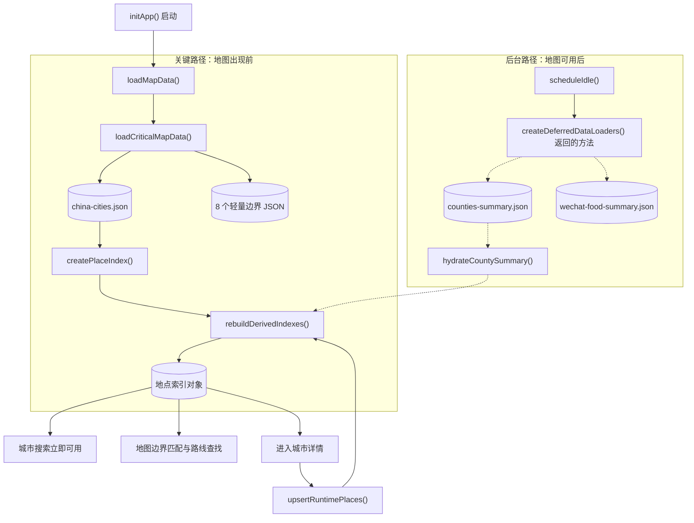
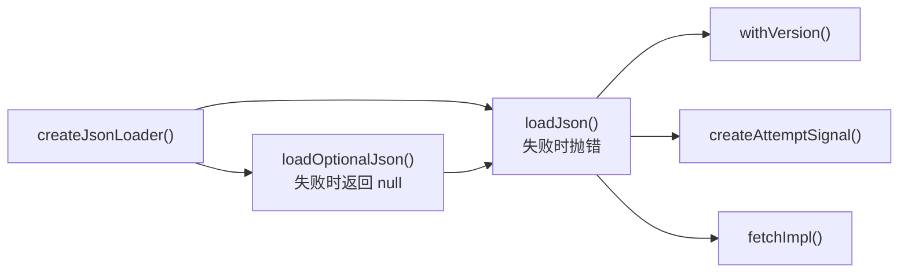
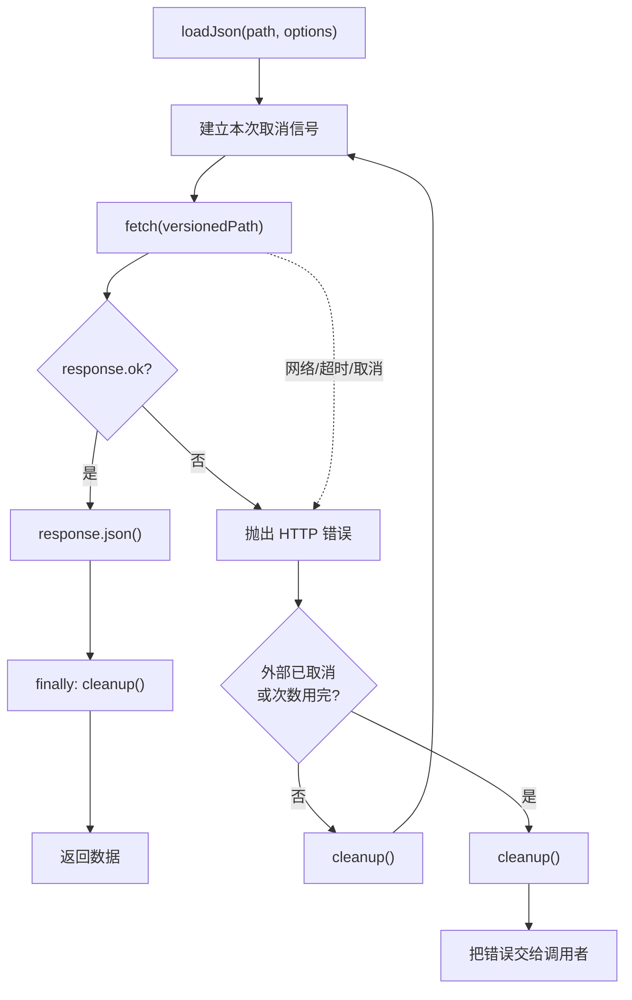
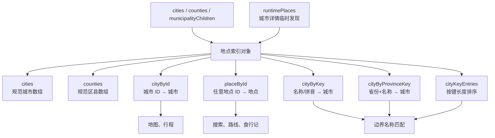

# 第 1 章：城市数据如何变成可搜索地点

> 本章完整拆解 `public/static-site/app-data.js` 和 `public/static-site/place-index.js`。它们一共包含 66 个 JavaScript 函数节点：27 个位于数据加载模块，39 个位于地点索引模块。这里的“函数节点”既包括有名字的普通函数，也包括对象方法、默认空函数和数组处理回调。

## 1. 学完本章能回答什么

1. 城市 JSON 是怎样被浏览器读进来的？
2. 为什么同一个请求会有超时、取消、重试和缓存版本？
3. 为什么地图可以先出现，区县和食行记稍后再出现？
4. 为什么不能每次搜索都从头遍历和猜测原始数据？
5. `Array`、`Object`、`Map` 和 `Set` 在这里各自负责什么？
6. 新区县数据到达后，为什么不会重复或抹掉城市详情里临时发现的地点？

## 2. 五问核验后的架构结论

| 核验问题 | 结论 |
| --- | --- |
| 这两个模块是什么？ | `app-data.js` 是“数据运输层”；`place-index.js` 是“地点整理和查询层”。 |
| 为什么要分开？ | 下载 JSON 与理解地点含义是两种职责。分开后可以独立测试，也可以在 Node 测试中建立索引而不需要浏览器。 |
| 谁调用它们？ | `app.js` 在启动和后台补全时调用；`city-detail.js` 会向地点索引加入运行时行政区；地图、搜索、行程和食行记读取索引结果。 |
| 它们读写什么？ | 数据模块读取静态 JSON；索引模块接收普通数组，创建或更新一个内存索引对象。它们都不直接绘制页面。 |
| 失败会怎样？ | 城市数据失败会阻止启动；个别边界失败会降级；区县和食行记摘要失败不会阻止地图；非法地点记录会被过滤。 |

## 3. 先补齐本章需要的 JavaScript 概念

### 3.1 数组 `Array`

数组像一排有顺序的抽屉：

```js
const cities = [北京, 上海, 广州];
```

它适合“按顺序处理全部城市”，但如果要按 ID 找广州，通常要从第一项一路寻找。

### 3.2 对象 `Object`

对象像一张信息卡：

```js
const city = {
  id: "guangdong-guangzhou-0",
  name: "广州",
  province: "广东"
};
```

`city.name` 就是读取卡片上的“名称”字段。

### 3.3 映射表 `Map`

`Map` 像一本已经按编号做好的电话簿：

```js
const cityById = new Map();
cityById.set("guangzhou", city);
cityById.get("guangzhou");
```

本项目频繁按 ID、拼音或“省份 + 城市名”查地点，所以提前建立 `Map` 比每次扫描完整数组更合适。

### 3.4 集合 `Set`

`Set` 是“不会出现重复值的袋子”。本章用它收集直辖市名称。

### 3.5 `map`、`filter`、`flatMap`、`forEach`

它们都接收一个小函数，也就是“每个元素要怎样处理”的规则：

| 写法 | 通俗意思 | 返回新数组吗 |
| --- | --- | --- |
| `array.map(fn)` | 每项变成另一项 | 是 |
| `array.filter(fn)` | 只留下符合条件的项 | 是 |
| `array.flatMap(fn)` | 每项可以变成零项、一项或多项，然后铺平 | 是 |
| `array.forEach(fn)` | 依次做动作 | 否 |

`(city) => city.id` 是箭头函数，可以读成：“拿到一个 city，交出它的 id”。

### 3.6 展开运算符 `...`

```js
const updated = { ...oldCity, name: "新名称" };
```

意思是先复制旧卡片的所有字段，再用后面的字段覆盖同名内容。它只做浅层复制；嵌套对象仍可能共用引用。

### 3.7 `async`、`await` 和 Promise

加载文件不会瞬间完成。Promise 是“未来会成功或失败的结果”；`await` 表示当前函数在这里等结果，但不会把整个浏览器冻住。

### 3.8 三个容易看错的符号

| 符号 | 含义 | 本章例子 |
| --- | --- | --- |
| `?.` | 左边不存在就停止，不报错 | `cityData?.cities` |
| `??` | 左边只有在 `null/undefined` 时才使用右边 | 选择浏览器空闲 API 的测试替身 |
| `??=` | 左边还没有值时才赋值 | 第一次请求时保存共享 Promise |

## 4. 数据从文件走到搜索框的全流程



实线代表首屏关键流程；虚线代表稍后发生的增量补全。`rebuildDerivedIndexes()` 是汇合点：无论是初始城市、后台区县，还是城市详情临时发现的行政区，最终都要重建统一查询视图。

## 5. 实际数据长什么样

城市记录示例：

```json
{
  "id": "hebei-shijiazhuang-0",
  "name": "石家庄",
  "province": "河北",
  "pinyin": "shijiazhuang",
  "lon": 114.5025,
  "lat": 38.0455,
  "anchor": "石家庄"
}
```

区县摘要示例：

```json
{
  "id": "hebei-shijiazhuang-0-jingxing-CN101090102",
  "name": "井陉",
  "pinyin": "jingxing",
  "province": "河北",
  "parentCityId": "hebei-shijiazhuang-0",
  "parentCityName": "石家庄",
  "parentCityPinyin": "shijiazhuang"
}
```

当前网页数据中有 391 条城市记录和 2,789 条区县摘要。边界数据只有形状和行政属性；地点记录则承担搜索、选择和行程引用。两者有关联，但不是同一种数据。

---

## 6. `app-data.js`：数据运输层逐函数拆解

### 6.1 三个常量不是函数，但决定加载政策

| 常量 | 值 | 用途 |
| --- | --- | --- |
| `ASSET_VERSION` | `progressive-2` | 给资源 URL 加版本，发布新版本时绕过旧缓存 |
| `PREFECTURE_CHUNK_COUNT` | `8` | 固定首屏要尝试加载 8 个边界分片 |
| `DEFERRED_DATASET_IDS` | 区县、食行记标识 | 在降级状态中准确记录缺的是谁 |

`Object.freeze()` 冻结最外层对象，防止运行时误改数据集标识。

### 6.2 `isCountyRecordsPayload(value)`

位置：`app-data.js:8`

| 项目 | 说明 |
| --- | --- |
| 输入 | 任意 `value` |
| 输出 | `true` 或 `false` |
| 判断 | 值存在、是对象、并且 `value.counties` 是数组 |
| 谁调用 | `classifyDeferredSummaryData()`、城市详情区县加载 |
| 状态修改 | 无 |

它是一个很浅的“外包装验货员”，只确认箱子上有数组，不检查每条区县记录的字段。这样做便宜，但不能替代完整 schema 校验。

### 6.3 `isFoodArticlesPayload(value)`

位置：`app-data.js:12`

逻辑与上一个函数相同，只是检查 `articles` 数组。两个函数分开可以让错误报告明确指向区县或食行记，而不是一个含义模糊的 `isValidPayload()`。

### 6.4 `classifyDeferredSummaryData({ countyData, foodData })`

位置：`app-data.js:16`

1. 调用前两个验货函数。
2. 把无效数据集的 ID 放进 `missingDatasets`。
3. 只要有一个缺失，`readiness` 就是 `degraded`；全部有效才是 `complete`。
4. 返回完整判断结果，不修改页面。

输入与输出示例：

```js
classifyDeferredSummaryData({
  countyData: null,
  foodData: { articles: [] }
});

// 返回：
{
  readiness: "degraded",
  countyValid: false,
  foodValid: true,
  missingDatasets: ["counties-summary"]
}
```

为什么不直接抛错：这两份数据是可选增强。区县失败不应该让已有城市地图和行程功能一起白屏。

### 6.5 `withVersion(path, version)`

位置：`app-data.js:31`

- 输入：资源路径和版本字符串。
- 输出：带 `v=` 查询参数的新路径。
- 如果原路径已有 `?`，使用 `&`；否则使用 `?`。
- `encodeURIComponent()` 避免版本中的空格或特殊字符破坏 URL。

示例：

```text
./data/chunk.json
→ ./data/chunk.json?v=progressive-2

./data/chunk.json?part=1
→ ./data/chunk.json?part=1&v=progressive-2
```

为什么需要：请求使用 `force-cache`。版本不变时复用缓存，版本改变时浏览器会把它当作新 URL。

更好的生产方案是构建阶段生成内容哈希文件名，例如 `chunk.a81c9d.json`。当前手动单版本号更简单，但发布者必须记得更新。

### 6.6 `createAttemptSignal(externalSignal, timeoutMs)`

位置：`app-data.js:36`

这是一台“为单次请求制造取消开关”的机器。

- 创建自己的 `AbortController`。
- 如果调用者传入外部取消信号，就把外部取消转发到内部控制器。
- 如果设置超时，就安排定时取消。
- 返回 `{ signal, cleanup }`。

为什么不直接用外部 `signal`：同一次请求既可能被用户/上层取消，也可能因为超时被内部取消，需要一个可以接收两种原因的组合信号。代码没有依赖较新的 `AbortSignal.any()` 与 `AbortSignal.timeout()`，因此兼容性更宽。

#### 6.6.1 `forwardExternalAbort`

位置：`app-data.js:42`

这是定义在函数内部的箭头函数。外部信号取消时，它调用内部控制器的 `abort()`，并原样传递取消原因。

#### 6.6.2 `removeExternalListener`

位置：`app-data.js:47`

它移除刚才注册的 `abort` 监听器。只在确实注册过监听器时才会被赋值。

为什么必须移除：请求结束后继续让外部信号持有回调引用没有价值，长期反复请求时还可能积累监听器。

#### 6.6.3 超时回调

位置：`app-data.js:54`

计时结束时，使用 `TimeoutError` 作为原因取消内部控制器。之后 `fetch` 会因信号中止而拒绝 Promise。

#### 6.6.4 `cleanup()`

位置：`app-data.js:61`

- 清除尚未触发的定时器。
- 如果存在 `removeExternalListener`，调用它。
- `?.()` 表示函数存在才调用。

这个方法由 `loadJson()` 的 `finally` 保证执行；无论成功、失败还是重试，都不会漏清理。

### 6.7 `createJsonLoader({ fetchImpl, version })`

位置：`app-data.js:68`

它本身不下载任何文件，而是制造两个带有共同政策的函数：



`fetchImpl` 默认是浏览器的 `fetch`，测试可以传入假的函数。这叫依赖注入：代码不把外部能力焊死，因此能够精确模拟断网、503、超时和取消。

### 6.8 内部函数 `loadJson(path, options)`

位置：`app-data.js:69`

执行步骤：

1. 把 `retries` 转换为总尝试次数：重试 1 次等于最多尝试 2 次。
2. 每次尝试都创建一个新的组合取消信号。
3. 用带版本的 URL 调用 `fetchImpl()`。
4. 默认使用 `force-cache`。
5. HTTP 状态不是成功时，抛出包含路径和状态码的错误。
6. 成功时解析并返回 JSON。
7. 失败时判断是否还可以重试。
8. `finally` 中清理本次尝试的计时器和监听器。



为什么外部取消后不重试：调用者已经明确表示“不需要这个结果”，继续请求既浪费资源也可能造成过期结果覆盖新状态。

当前不足：重试之间没有退避等待，也没有只针对特定错误重试。两次立即尝试适合本地静态文件和偶发网络抖动；若访问远程 API，更适合指数退避、随机抖动和错误分类。

### 6.9 内部函数 `loadOptionalJson(path, options)`

位置：`app-data.js:93`

- 内部仍调用严格的 `loadJson()`，所以缓存、重试、取消和超时政策完全一致。
- 捕获最终错误。
- 默认打印警告；`quiet: true` 时不打印。
- 返回 `null`，让调用者选择降级策略。

注意：它不会自动记住失败。下一次调用仍会重新尝试。是否“只请求一次”由下一节的共享 Promise 决定。

### 6.10 `loadCriticalMapData({ loadJson })`

位置：`app-data.js:110`

这是首屏关键数据的编排函数。

| 数据 | 请求策略 | 失败结果 |
| --- | --- | --- |
| 8 个轻量边界分片 | 并行、每个重试一次、20 秒超时、`allSettled` | 保留成功分片，记录失败路径 |
| 城市坐标数据 | 与边界并行、重试一次、20 秒超时 | 请求失败或城市数组为空时终止启动 |

为什么城市比边界更严格：没有城市列表，搜索、点击、路线端点和边界匹配都没有可靠实体；缺少一个边界分片时，其他城市点和七个分片仍然可以工作。

返回的 `mapData` 遵循 GeoJSON `FeatureCollection` 形状：

```js
{
  type: "FeatureCollection",
  features: [/* 所有成功分片中的边界 */]
}
```

#### 6.10.1 边界路径生成回调

位置：`app-data.js:113`

`Array.from({ length: 8 }, (_, index) => ...)` 根据索引生成 1 到 8 的文件名。下划线 `_` 表示第一个参数存在但这里不用。

#### 6.10.2 边界请求回调

位置：`app-data.js:117`

对每条边界路径调用 `loadJson(path, requestOptions)`，得到 8 个 Promise。

#### 6.10.3 成功结果筛选回调

位置：`app-data.js:124`

只保留 `status === "fulfilled"` 的 `allSettled` 结果。

#### 6.10.4 成功值提取回调

位置：`app-data.js:125`

把 `{ status, value }` 变成真正的 JSON `value`。

#### 6.10.5 边界要素铺平回调

位置：`app-data.js:131`

每个成功分片交出自己的 `features`；格式不对时交出空数组；`flatMap` 把它们拼成一层数组。

#### 6.10.6 失败路径筛选回调

位置：`app-data.js:134`

根据 `boundaryResults[index]` 找到拒绝的请求，再返回同位置的原始路径。这里依赖两个数组的索引严格对应。

### 6.11 `createDeferredDataLoaders({ loadOptionalJson })`

位置：`app-data.js:139`

这个工厂保存两个尚未赋值的变量：

```js
let countySummaryPromise;
let foodSummaryPromise;
```

它们缓存的不是最终数据，而是“正在进行或已经完成的任务”。因此后台预取和用户操作即使同时触发，也只会发一份请求。

### 6.12 方法 `loadCountySummary()`

位置：`app-data.js:144`

- 第一次调用：请求 `counties-summary.json`，设置 30 秒超时和一次重试，并保存 Promise。
- 后续调用：直接返回同一个 Promise。
- 使用 `Promise.resolve(...)` 把普通值或 Promise 统一包装成 Promise。

### 6.13 方法 `loadFoodSummary()`

位置：`app-data.js:151`

与上一个方法完全独立，只负责 `wechat-food-summary.json`。两份数据分别缓存，因此一份失败或较慢不会改变另一份 Promise。

为什么没有抽成一个“按路径字典加载器”：目前只有两份数据，写成具名方法能让调用处和错误状态更清楚。数据集大幅增加时再考虑通用注册表。

### 6.14 `createLatestAsyncRefresh({ load, apply, refresh })`

位置：`app-data.js:161`

它解决一种竞态：用户快速从旧行程切到新行程，而懒加载模块稍后才完成。旧任务不能用旧选择覆盖当前页面。

创建时检查 `load`、`apply`、`refresh` 都是函数，然后维护一个递增的 `generation`（代次编号）。

#### 6.14.1 默认 `refresh = () => {}`

位置：`app-data.js:161`

这是一个什么都不做的默认函数。这样 `schedule()` 不必到处判断 `refresh` 是否存在，同时仍会在创建时验证最终值是函数。

#### 6.14.2 方法 `schedule(value, options)`

位置：`app-data.js:168`

1. 代次加一，并记住本次编号。
2. 异步调用 `load`。
3. 资源回来后比较本次编号与最新编号。
4. 不是最新：返回 `{ status: "stale" }`，不改页面。
5. 是最新：调用 `apply(resource, value)`。
6. 需要时再调用 `refresh(resource, value)`。

#### 6.14.3 资源完成回调

位置：`app-data.js:172`

这就是 `.then((resource) => {...})` 中的箭头函数。它承担“过期检查 → 应用 → 可选刷新”的原子顺序。

这个设计只阻止过期结果生效，不会主动取消旧的模块加载。对于动态 `import()`，取消通常没有必要，而且浏览器也没有通用取消接口。

### 6.15 `scheduleIdle(task, options)`

位置：`app-data.js:182`

- 优先使用 `requestIdleCallback(task, { timeout: 1500 })`。
- 浏览器不支持时，使用 `setTimeout(task, 50)`。
- `options` 可以注入测试替身。

1.5 秒的 deadline 不是“1.5 秒后执行”，而是告诉浏览器：即使一直没有理想空闲，也不要无限推迟。回退的 50 毫秒同样是在让首次绘制先获得机会。

---

## 7. `place-index.js`：地点整理和查询层逐函数拆解

### 7.1 为什么需要多套索引



这些表看似重复，其实查询问题不同：

- “ID 是谁？”用 `placeById`。
- “GeoJSON 写着吕梁地区，对应哪个城市？”用规范化键和别名。
- “同名城市属于哪个省？”用 `cityByProvinceKey` 消歧。
- “没有完全相等的名字，哪个长键是前缀？”用排好序的 `cityKeyEntries`。

### 7.2 `normalizeKey(value)`

位置：`place-index.js:1`

处理顺序：

1. 任何输入先转为字符串，空值变成空字符串。
2. 转小写。
3. 使用 Unicode `NFD` 把带音调字母拆成“基础字母 + 音调符号”。
4. 删除音调符号。
5. 删除所有非英文字母和数字。
6. 删除结尾行政后缀 `meng`、`diqu`、`zhou`。

示例：

```text
Lǚ-liáng Dìqū
→ lu-liang diqu（去掉分解后的声调符号）
→ luliangdiqu
→ luliang
```

它主要服务地图边界名称匹配，不适合直接拿来做用户全文搜索，因为中文会被删除。

设计风险：通用地删除后缀可能造成键碰撞。更稳健的长期方案是保留标准键，并用显式别名表表达行政后缀差异。

### 7.3 `normalizeSearchText(value)`

位置：`place-index.js:12`

它也转小写、拆声调、去音调，但只删除空白，不删除中文和标点。

```text
" 北 京  Běi Jīng " → "北京beijing"
```

为什么与 `normalizeKey()` 分开：搜索希望“北京”和“beijing”都留下；边界匹配则需要高度统一的机器键。两种需求不能用一个模糊函数兼顾。

### 7.4 `buildMunicipalityCountyEntries(children, displayCities)`

位置：`place-index.js:20`

背景：城市原始数据中，北京、上海、天津、重庆下面可能还有区级记录。全国地图只显示直辖市本身，但搜索仍应找到朝阳区等下辖区。

这个函数把隐藏的直辖市子记录转换成普通“区县地点”：

1. 收集子记录涉及的直辖市名称。
2. 建立“直辖市名称 → 全国地图父城市”的 Map。
3. 遍历子记录。
4. 缺少拼音或找不到父城市时跳过。
5. 生成带 `parentCityId` 的区县形状记录。

它不直接添加 `placeType` 和搜索文字；后面统一交给 `deduplicateCounties()` 与 `normalizeCountyRecord()`。

#### 7.4.1 子记录省份提取回调

位置：`place-index.js:23`

每个 child 交出 `child.province`；空 child 交出空值。

#### 7.4.2 `filter(Boolean)`

位置：`place-index.js:28`

这里传入的是 JavaScript 内置 `Boolean` 函数，而不是新写的箭头函数。它把空字符串、`null`、`undefined` 等假值过滤掉。

#### 7.4.3 父城市筛选与映射回调

位置：`place-index.js:28-29`

- `filter` 只保留名称属于直辖市集合的显示城市。
- `map` 把每个城市变成 `[city.name, city]`，供 `new Map()` 使用。

#### 7.4.4 子记录 `flatMap` 回调

位置：`place-index.js:32`

有效记录返回 `[countyObject]`，无效记录返回 `[]`。因此同一个回调同时完成校验和“零或一条记录”的生成。

### 7.5 `normalizeCountyRecord(county)`

位置：`place-index.js:51`

- 非对象或没有 ID：返回 `null`。
- 保留原字段。
- 强制 `placeType` 和 `searchType` 为 `county`。
- 已有非空字符串 `searchText`：尊重调用者提供的内容。
- 否则使用名称、省份、拼音、父城市名称和父城市拼音重新生成搜索文本。

为什么每次身份字段变化都可能重算搜索文本：如果“旧县名”变成“新县名”，继续保留由旧字段派生的搜索文本会让新名称搜不到，旧名称却仍命中。

### 7.6 `buildPlaceMap(cities, counties)`

位置：`place-index.js:64`

创建统一的 `placeById`：

- 城市记录复制后标记 `placeType: "city"`。
- 区县记录复制后标记 `placeType: "county"`。
- 使用 ID 作为 Map 的键。

#### 7.6.1 城市 `forEach` 回调

位置：`place-index.js:66`

只写入存在 ID 的城市。

#### 7.6.2 区县 `forEach` 回调

位置：`place-index.js:69`

只写入存在 ID 的区县。如果城市和区县 ID 意外相同，后写入的区县会覆盖；上层通过数据约束和运行时城市保护避免这种冲突。

### 7.7 `buildCityKeyMap(cities, municipalityChildren)`

位置：`place-index.js:75`

目标是建立“不同写法 → 同一个城市对象”的表。

处理内容：

- 城市拼音和中文名都成为键。
- 直辖市子区的名称/拼音指向父直辖市。
- 少数历史拼音或边界命名差异通过硬编码 aliases 修正，例如 `luliang` 对应 `lvliang`。

#### 7.7.1 城市遍历回调

位置：`place-index.js:85`

每个城市写入两个键：规范化拼音、规范化中文名。由于 `normalizeKey` 会删除中文，纯中文键可能变成空字符串；实际边界匹配主要依赖拼音/罗马化名称和后续省份消歧。

这是当前实现值得改进的一点：写入空键没有业务价值，应在未来显式跳过空键。

#### 7.7.2 直辖市子区回调及内部 `find` 回调

位置：`place-index.js:90-96`

- `find` 从城市列表中找到名称等于 `child.province` 的父直辖市。
- 找到后，让子区拼音和名称也指向父城市。

这样地图边界出现“朝阳区”时可以归属北京，而全国地图不会创建一个独立的“朝阳城市”。

#### 7.7.3 aliases 回调

位置：`place-index.js:97`

遍历“外部特征键 → 项目城市键”的别名表。先找到项目里的城市，再给外部写法增加一条指向同一城市的记录。

### 7.8 `buildCityProvinceKeyMap(cities, municipalityChildren)`

位置：`place-index.js:104`

普通 `cityByKey` 遇到同名或近似名可能歧义，因此再建立：

```text
省份|规范键 → 城市
```

例如 `河北|shijiazhuang`。地图边界记录通常带行政代码，可以先推导省份，再在省内匹配，提高准确度。

#### 7.8.1 内部箭头函数 `setCity(city, province, keyValue)`

位置：`place-index.js:107`

- 规范化候选键。
- 省份或键为空时跳过。
- 写入组合键。

它把四处重复的检查和字符串拼接收拢到一个小函数中。

#### 7.8.2 城市遍历回调

位置：`place-index.js:113`

对每个城市分别用拼音和名称调用 `setCity`。

#### 7.8.3 直辖市子区回调及 `find` 回调

位置：`place-index.js:118-124`

找到父直辖市后，用子区拼音和名称建立省内组合键，值仍是父城市。

### 7.9 `deduplicateCounties(counties)`

位置：`place-index.js:128`

这是区县增量加载安全性的核心。

1. 创建 `byId` Map。
2. 按输入顺序遍历记录。
3. 同 ID 已存在时，用新字段覆盖旧字段；新记录没提供的字段继续保留。
4. 判断身份字段是否变化。
5. 新的 `searchText` 不合法，或身份变化但没有有效新搜索文本时，删除旧的派生搜索文本。
6. 全部合并完成后再规范化，而不是每来一条先规范化。

为什么“先合并原始字段，再派生搜索文本”很重要：

```text
第一条：旧县 + Jiuxian + 吕梁
第二条：同 ID，只提供新县名

正确结果：新县 + Jiuxian + 吕梁，并按三者生成新搜索文本
```

如果先把第一条变成完整派生对象，再粗暴覆盖第二条，旧搜索文本可能残留。

#### 7.9.1 区县遍历回调

位置：`place-index.js:130`

负责校验、读取旧值、合并字段、决定是否删除搜索文本并写回 `byId`。

#### 7.9.2 身份字段 `some` 回调

位置：`place-index.js:142`

检查新记录是否明确提供了某个身份字段，并且值与旧记录不同。只要一个字段变化，`some()` 就返回 `true` 并停止继续检查。

#### 7.9.3 最后的 `map(normalizeCountyRecord)` 与 `filter(Boolean)`

位置：`place-index.js:151`

先把合并后的每条记录规范化，再过滤规范化失败返回的 `null`。`normalizeCountyRecord` 是函数引用，不是新定义的回调函数；`Boolean` 同样是内置函数引用。

### 7.10 `rebuildDerivedIndexes(index)`

位置：`place-index.js:154`

这是索引的统一重建入口：

1. 重建 `cityById`。
2. 用规范城市和区县重建基础 `placeById`。
3. 把 `runtimePlaces` 作为覆盖层合并进去，但绝不覆盖正式城市。
4. 重建名称/拼音键表。
5. 重建省份组合键表。
6. 把城市键条目按键长从长到短排序。
7. 返回同一个 `index` 对象。

为什么返回同一个对象：`app.js` 持有 `placeIndex` 引用；原地更新内部派生表可以保留这个顶层引用。不过各个 Map 会换成新对象，所以 `syncPlaceIndex()` 仍要把新 Map 引用同步到应用状态。

#### 7.10.1 `cityById` 映射回调

位置：`place-index.js:155`

每个城市变成 `[city.id, city]`。

#### 7.10.2 `runtimePlaces.forEach` 回调

位置：`place-index.js:157`

- 正式城市同 ID 时跳过，防止运行时数据伪装成区县覆盖城市。
- 其他记录与正式区县合并，运行时字段优先。
- 只影响派生的 `placeById`，不会偷偷进入规范 `counties` 数组。

这就是“双层数据”：规范集合保存可信摘要，运行时覆盖层保存城市详情中刚发现的更丰富坐标或名称。

#### 7.10.3 排序回调

位置：`place-index.js:170`

`(a, b) => b[0].length - a[0].length` 让较长键排在前面。模糊前缀匹配时先尝试更具体的名称，减少短名称抢先误匹配。

### 7.11 `createPlaceIndex({ cities, counties, municipalityChildren })`

位置：`place-index.js:174`

这是对外公开的索引构造函数。

执行顺序：

1. 过滤没有 ID 的城市。
2. 浅复制每个城市，并补充搜索文本。
3. 过滤、浅复制直辖市子记录，隔离调用者之后的修改。
4. 把直辖市子记录变成区县候选。
5. 把这些候选与传入区县一起去重和规范化。
6. 创建空的 `runtimePlaces` Map。
7. 调用 `rebuildDerivedIndexes()`。

为什么要复制输入：调用者如果稍后修改原数组或原对象，不应该悄悄改变已经建立的索引。测试会故意修改输入，确认索引保持不变。

#### 7.11.1 城市筛选回调

位置：`place-index.js:176`

只接受存在且有 ID 的城市。

#### 7.11.2 城市复制/搜索文本回调

位置：`place-index.js:177`

浅复制城市，并在没有 `searchText` 时用名称、省份和拼音生成。

#### 7.11.3 直辖市子记录筛选回调

位置：`place-index.js:182`

只接受非空对象。

#### 7.11.4 直辖市子记录复制回调

位置：`place-index.js:183`

使用 `{ ...child }` 创建浅副本。

### 7.12 `upsertRuntimePlaces(index, records)`

位置：`place-index.js:194`

`upsert` 是 update + insert 的缩写：存在则更新，不存在则插入。

- 首先验证 `index` 结构。
- 忽略非法记录、无 ID 记录和与正式城市同 ID 的记录。
- 同 ID 运行时记录按“旧字段 + 新字段”合并。
- 收集本次真正接受的记录。
- 无论接受几条，都调用 `rebuildDerivedIndexes()`。
- 返回本次接受的运行时地点数组。

典型调用者是 `city-detail.js` 的 `districtPlaceFromFeature()`：在线边界返回某个行政区后，它创建地点记录并放入运行时覆盖层。

#### 7.12.1 记录遍历回调

位置：`place-index.js:199`

完成每条记录的校验、合并、写入和结果收集。正式城市保护也在这里执行。

当前改进空间：即使所有记录都无效也会完整重建索引。数据量目前不大，简单和一致性优先；若高频实时更新，可在没有变化时提前返回。

### 7.13 `hydrateCountySummary(index, records)`

位置：`place-index.js:212`

`hydrate` 可以理解为“把原来只有骨架的数据灌满”。后台区县摘要到达后：

1. 验证索引。
2. 过滤非法新记录。
3. 把旧区县和新记录拼在一起交给 `deduplicateCounties()`。
4. 重建全部派生索引。
5. 建立最新的 `countyById`。
6. 按输入有效记录的顺序，返回它们在最终索引中的规范版本。

为什么它是幂等的：同一批记录调用两次，`deduplicateCounties()` 仍以 ID 只保留一条，最终内容不继续膨胀。

#### 7.13.1 有效记录筛选回调

位置：`place-index.js:217`

只保留对象且有 ID 的记录。

#### 7.13.2 `countyById` 映射回调

位置：`place-index.js:220`

把最终区县数组变成 `[county.id, county]` 键值对。

#### 7.13.3 返回记录映射回调

位置：`place-index.js:221`

用每条原始有效记录的 ID 取出最终规范记录，随后 `filter(Boolean)` 排除意外不存在的项。

---

## 8. 三条真实业务路径

### 8.1 首次打开网页

```text
createJsonLoader()
  → 得到 loadJson / loadOptionalJson
loadCriticalMapData({ loadJson })
  → 得到城市和成功边界
createPlaceIndex({ cities, counties: [] })
  → 城市搜索、ID 查询和边界匹配立即可用
```

此时还没有全量区县，但地图不需要等待。

### 8.2 后台区县摘要到达

```text
loadCountySummary()
  → counties-summary.json
hydrateCountySummary(placeIndex, data.counties)
  → 按 ID 合并
  → 重建全部派生 Map
syncPlaceIndex()
  → app.state 改用新 Map
updateSearchResults()
  → 区县开始出现在搜索结果
```

### 8.3 城市详情发现一个新行政区

```text
city-detail.js 获取实时边界
  → districtPlaceFromFeature()
  → upsertRuntimePlaces()
  → runtimePlaces 保存丰富记录
  → rebuildDerivedIndexes()
  → placeById 立即可以查到
```

以后另一个城市的区县摘要到达时，`runtimePlaces` 会重新覆盖到新的 `placeById` 上，所以之前发现的地点不会丢失。

## 9. 为什么这样设计，以及更好的方案

| 当前设计 | 为什么合理 | 局限 | 建议演进条件 |
| --- | --- | --- | --- |
| 手动资源版本 `progressive-2` | 简单，所有静态资源统一失效 | 容易忘记修改，任何小改动都使全部资源换版本 | 构建稳定后改内容哈希清单 |
| 关键/可选两个加载函数 | 调用处能明确表达失败政策 | schema 校验较浅 | 外部数据源增多时引入 JSON Schema/Zod 类验证 |
| 单次立即重试 | 适合静态资源短暂网络抖动 | 没有退避、错误分类 | 远程 API 或高并发时加入指数退避与监控 |
| 共享 Promise | 防重复请求，代码很轻 | 一次失败后 Promise 仍被缓存，当前页面内不自动重试摘要 | 产品要求无刷新恢复时，增加显式 reset/retry |
| 每次增量都重建派生索引 | 一致性强、容易证明正确 | 更新成本是 O(城市 + 区县 + 运行时地点) | 地点数量达到数十万或更新很频繁时改增量更新 |
| 可变顶层 index + 新 Map | 兼顾固定入口引用与刷新派生数据 | 谁修改了 index 需要靠约定追踪 | 模块继续扩大时返回不可变新快照或封装成 class |
| 硬编码名称别名和后缀删除 | 快速解决现实数据命名差异 | 规则隐蔽、可能碰撞 | 把行政名称映射做成带测试的数据表 |
| 正式数据 + runtime 覆盖层 | 在线详情不会污染规范摘要，也不会被后续刷新抹掉 | 同一地点可能有两份不同版本 | 明确字段来源/更新时间，必要时建立合并优先级表 |

### 9.1 我认为最值得优先改的两点

第一，给 `normalizeKey()` 的结果为空或碰撞增加诊断测试。目前中文名规范化后可能得到空键，虽然主要路径依赖拼音，但索引中不应静默保留无意义键。

第二，为共享的可选摘要 Promise 增加显式重试入口。当前首次后台请求失败后，本次页面生命周期内会继续得到同一个失败/空结果；用户只能刷新页面重新尝试。网络不稳定场景下，可以在警告区域提供“重试补全数据”。

不建议为了“看起来现代”立刻换成数据库 API。这里的数据大多是发布时生成、读取远多于写入的静态数据，浏览器缓存和分片 JSON 仍是成本很低的合理方案。

## 10. 函数覆盖清单

下面的清单来自 JavaScript AST，而不是只用正则寻找 `function` 文本。

### 10.1 `app-data.js`：27 个函数节点

| 行 | 函数节点 | 是否已讲 |
| --- | --- | --- |
| 8 | `isCountyRecordsPayload` | 是，6.2 |
| 12 | `isFoodArticlesPayload` | 是，6.3 |
| 16 | `classifyDeferredSummaryData` | 是，6.4 |
| 31 | `withVersion` | 是，6.5 |
| 36 | `createAttemptSignal` | 是，6.6 |
| 42 | `forwardExternalAbort` | 是，6.6.1 |
| 47 | `removeExternalListener` | 是，6.6.2 |
| 54 | 超时回调 | 是，6.6.3 |
| 61 | `cleanup` | 是，6.6.4 |
| 68 | `createJsonLoader` | 是，6.7 |
| 69 | `loadJson` | 是，6.8 |
| 93 | `loadOptionalJson` | 是，6.9 |
| 110 | `loadCriticalMapData` | 是，6.10 |
| 113 | 边界路径生成回调 | 是，6.10.1 |
| 117 | 边界请求回调 | 是，6.10.2 |
| 124 | 成功结果筛选回调 | 是，6.10.3 |
| 125 | 成功值提取回调 | 是，6.10.4 |
| 131 | 边界要素铺平回调 | 是，6.10.5 |
| 134 | 失败路径筛选回调 | 是，6.10.6 |
| 139 | `createDeferredDataLoaders` | 是，6.11 |
| 144 | `loadCountySummary` | 是，6.12 |
| 151 | `loadFoodSummary` | 是，6.13 |
| 161 | `createLatestAsyncRefresh` | 是，6.14 |
| 161 | 默认空 `refresh` | 是，6.14.1 |
| 168 | `schedule` | 是，6.14.2 |
| 172 | 资源完成回调 | 是，6.14.3 |
| 182 | `scheduleIdle` | 是，6.15 |

### 10.2 `place-index.js`：39 个函数节点

| 行 | 函数节点 | 是否已讲 |
| --- | --- | --- |
| 1 | `normalizeKey` | 是，7.2 |
| 12 | `normalizeSearchText` | 是，7.3 |
| 20 | `buildMunicipalityCountyEntries` | 是，7.4 |
| 23 | 子记录省份提取回调 | 是，7.4.1 |
| 28 | 父城市筛选回调 | 是，7.4.3 |
| 29 | 父城市键值映射回调 | 是，7.4.3 |
| 32 | 子记录 `flatMap` 回调 | 是，7.4.4 |
| 51 | `normalizeCountyRecord` | 是，7.5 |
| 64 | `buildPlaceMap` | 是，7.6 |
| 66 | 城市写入回调 | 是，7.6.1 |
| 69 | 区县写入回调 | 是，7.6.2 |
| 75 | `buildCityKeyMap` | 是，7.7 |
| 85 | 城市键写入回调 | 是，7.7.1 |
| 90 | 直辖市子区回调 | 是，7.7.2 |
| 92 | 父城市 `find` 回调 | 是，7.7.2 |
| 97 | aliases 回调 | 是，7.7.3 |
| 104 | `buildCityProvinceKeyMap` | 是，7.8 |
| 107 | `setCity` | 是，7.8.1 |
| 113 | 省份城市写入回调 | 是，7.8.2 |
| 118 | 省份直辖市子区回调 | 是，7.8.3 |
| 120 | 省份父城市 `find` 回调 | 是，7.8.3 |
| 128 | `deduplicateCounties` | 是，7.9 |
| 130 | 区县去重回调 | 是，7.9.1 |
| 142 | 身份字段 `some` 回调 | 是，7.9.2 |
| 154 | `rebuildDerivedIndexes` | 是，7.10 |
| 155 | `cityById` 映射回调 | 是，7.10.1 |
| 157 | runtime 覆盖回调 | 是，7.10.2 |
| 170 | 键长度排序回调 | 是，7.10.3 |
| 174 | `createPlaceIndex` | 是，7.11 |
| 176 | 城市筛选回调 | 是，7.11.1 |
| 177 | 城市复制回调 | 是，7.11.2 |
| 182 | 子记录筛选回调 | 是，7.11.3 |
| 183 | 子记录复制回调 | 是，7.11.4 |
| 194 | `upsertRuntimePlaces` | 是，7.12 |
| 199 | 运行时记录回调 | 是，7.12.1 |
| 212 | `hydrateCountySummary` | 是，7.13 |
| 217 | 有效记录筛选回调 | 是，7.13.1 |
| 220 | `countyById` 映射回调 | 是，7.13.2 |
| 221 | 返回记录映射回调 | 是，7.13.3 |

说明：`filter(Boolean)`、`map(normalizeCountyRecord)` 等传入的是已经存在的内置/具名函数引用，AST 不会把调用位置再计为一个新函数节点；正文仍解释了它们在流水线中的作用。

## 11. 用测试证明我们没有误解

相关自动测试位于：

- `tests/app-data.test.mjs`
- `tests/place-index.test.mjs`
- `tests/rendered-html.test.mjs`

它们实际验证了：

- 关键加载只请求城市和 8 个边界分片；
- 单个边界失败不会丢掉其他七个分片；
- 城市数据必须存在；
- 超时与外部取消会到达 `fetch`；
- 可选 JSON 失败返回 `null`；
- 区县和食行记 Promise 各自只创建一次；
- 过期异步刷新不会覆盖最新选择；
- 输入数组被外部修改不会污染索引；
- 区县重复灌入不会产生重复 ID；
- 运行时地点能跨多次区县补全继续存在；
- 运行时地点不能覆盖正式城市；
- 身份字段变化会重新生成搜索文本；
- 所有派生 Map 都会重建。

本章完成时，这些测试均通过。

## 12. 下一章预告

下一章进入 `map-core.js`：地点索引怎样与 GeoJSON 边界匹配，Leaflet 怎样创建地图、图层、城市点、标签和路线。那一章会重点讲“控制器”“回调注入”“闭包”“生命周期”和地图坐标，并覆盖该模块的全部函数节点。

继续阅读：[第 2 章：地图怎样被创建、绘制和安全销毁](./02-map-core.md)
