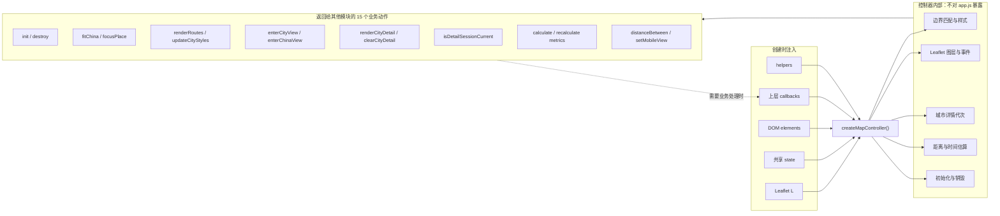
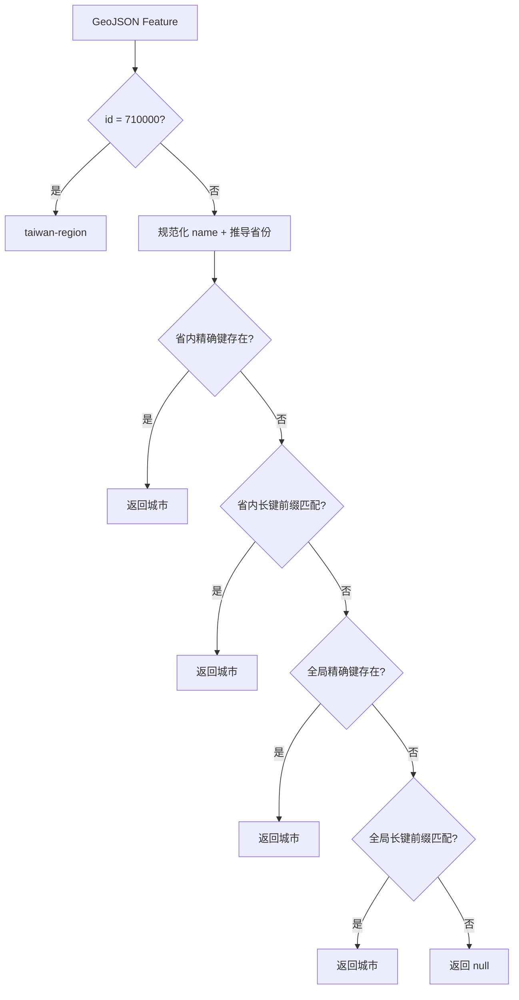
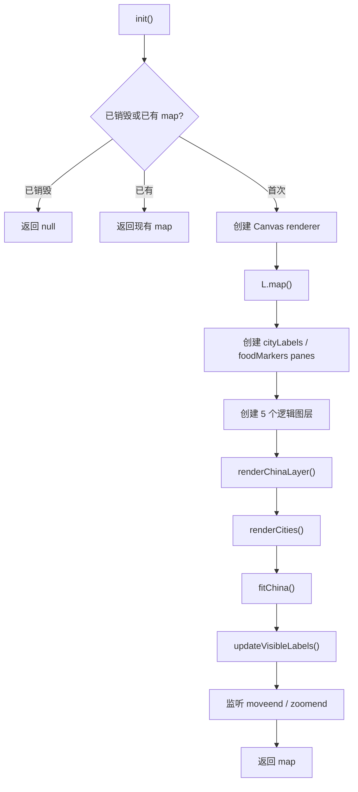
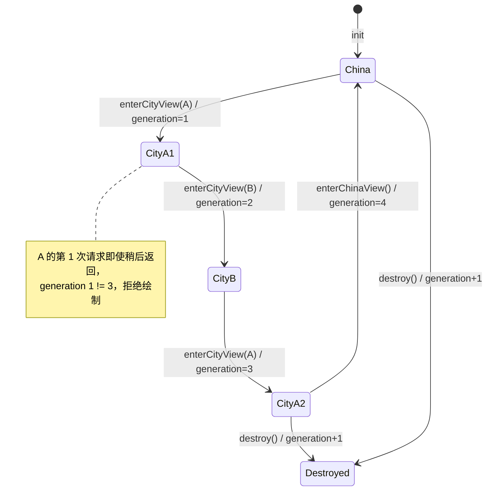
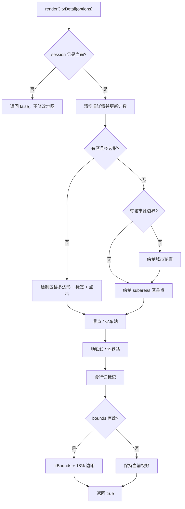
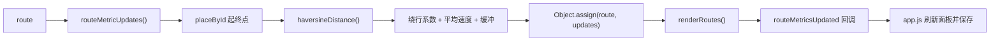

# 第 2 章：地图怎样被创建、绘制和安全销毁

> 本章完整拆解 `public/static-site/map-core.js`。该文件共 791 行，AST 识别出 88 个函数节点：38 个具名函数，以及 50 个默认函数、数组回调和 Leaflet 事件处理函数。

## 1. 学完本章能回答什么

1. Leaflet 是什么，它与项目自身代码怎样分工？
2. `createMapController()` 为什么叫控制器，而不是普通工具函数？
3. 全国边界、城市点、文字标签、路线和城市详情分别放在哪里？
4. GeoJSON 边界名称怎样匹配到城市数据？
5. 单击、双击、缩放和移动地图分别触发什么？
6. 从全国进入城市后，为什么旧城市的异步数据不会覆盖新城市？
7. 路线为什么是弯线，距离和时间又是怎样估算的？
8. 为什么销毁地图不仅是清空一个变量？

## 2. 五问核验后的架构结论

| 核验问题 | 结论 |
| --- | --- |
| `map-core.js` 是什么？ | 网页端唯一直接拥有 Leaflet 渲染和地图生命周期的模块。 |
| 为什么单独存在？ | 让 `app.js` 只表达“进入城市、画路线”等业务动作，不直接拼装图层和 Marker。 |
| 谁调用它？ | `app.js` 创建并调用控制器；`city-detail.js` 把整理好的详情数据交给它绘制。 |
| 它读写什么？ | 读取注入的地点、路线和 UI 状态；把 Leaflet 地图、图层、Marker 引用及视图计数写入共享 `state`。 |
| 失败或过期怎么办？ | 创建时验证协作者；绘制前检查控制器状态；城市详情使用代次 session 拒绝过期结果；`destroy()` 解除事件并清空引用。 |

自动测试还明确规定：`app.js` 不能直接出现 `L.map()`、`L.geoJSON()`、`.addTo()` 或通用的 `fitBounds/flyTo` 转发接口。这是一条真正受测试保护的模块边界。

## 3. 本章需要的地图概念

### 3.1 Leaflet

Leaflet 是浏览器地图库。项目把它以全局对象 `window.L` 注入控制器。常见 API 可以先这样理解：

| Leaflet API | 通俗解释 |
| --- | --- |
| `L.map()` | 创建一张可以缩放、拖动的地图 |
| `L.geoJSON()` | 把 GeoJSON 边界数据变成可画图层 |
| `L.circleMarker()` | 画一个圆点 |
| `L.marker()` | 放一个可以使用自定义 HTML 图标的标记 |
| `L.polyline()` | 画一条折线 |
| `L.layerGroup()` | 创建一个可整体清空、添加或移除的图层组 |
| `L.latLngBounds()` | 创建一个能不断扩展的经纬度包围盒 |
| `fitBounds()` | 调整视野，使包围盒内容全部可见 |

### 3.2 GeoJSON

GeoJSON 是描述地理形状的 JSON 标准。全国轻量边界文件的核心形状是：

```js
{
  type: "FeatureCollection",
  features: [
    {
      type: "Feature",
      properties: { id: "460300", name: "Sansha" },
      geometry: { /* 多边形坐标 */ }
    }
  ]
}
```

`properties` 是属性卡片，`geometry` 是实际边界坐标。

### 3.3 图层

图层像放在透明桌面上的胶片。可以只移走某一张胶片，而不用重建整张地图。本项目逻辑上使用：

| 图层/Pane | 放什么 | 何时显示 |
| --- | --- | --- |
| `chinaLayer` | 全国城市级边界 | 全国视图 |
| `cityLayer` | 全国城市圆点 | 全国视图 |
| `labelLayer` | 城市名称文字 | 全国视图 |
| `routeLayer` | 跨城路线 | 全国和城市视图都可保留 |
| `cityDetailLayer` | 区县、景点、车站、地铁等 | 城市视图 |
| `cityLabels` pane | 不接收鼠标的城市文字，`z-index: 650` | 全国视图 |
| `foodMarkers` pane | 食行记标记，`z-index: 720` | 城市视图 |

### 3.4 控制器、闭包和依赖注入

`createMapController()` 调用一次后，会返回一组方法。内部变量 `destroyed`、`detailGeneration` 和几十个私有函数仍然被这些方法记住，这种“函数记住创建环境”的机制叫闭包。

控制器不自己导入 `app.js`，而是接收：

- `L`：Leaflet 能力；
- `state`：共享运行状态；
- `elements`：少量页面元素；
- `callbacks`：需要通知上层时调用；
- `helpers`：查询地点、转义文本、取得交通参数等能力。

这叫依赖注入。测试可以传入小型假 Leaflet，而不需要真的打开浏览器地图。

## 4. 控制器边界总图



箭头从依赖指向控制器，表示控制器“使用”它们；虚线回到 callbacks，表示地图事件只发业务通知，不直接执行行程规则。

---

## 5. 文件开头的省份表

`provinceCodeNames` 不是函数。它把行政区代码前两位映射成省级名称，例如 `11 → 北京`、`44 → 广东`。

为什么需要：边界 Feature 的 `id` 是行政代码。先知道省份，再匹配城市，可以降低同名或近似名称选错省份的概率。

它目前是硬编码常量。行政编码长期变化时，需要数据生成脚本或权威行政区数据来更新；不应依靠开发者记忆手改。

## 6. 安全与控制器创建

### 6.1 `defaultEscapeHtml(value)`

位置：`map-core.js:11`

- 输入：要放进 Tooltip 或自定义 Marker HTML 的文字。
- 输出：HTML 特殊字符被实体替换后的安全字符串。
- 替换：`& < > " '` 分别变成安全实体。
- 状态修改：无。

为什么需要：Leaflet 的 `bindTooltip()` 和 `divIcon({ html })` 可以接收 HTML。如果城市名含 `` 而不转义，浏览器可能把数据当代码执行。

#### 6.1.1 `replace` 回调

位置：`map-core.js:12`

正则每找到一个特殊字符，就把字符作为参数交给箭头函数；箭头函数从映射对象取出对应实体。

Popup 为什么没有在这里统一转义：景点和食行记 Popup 需要真正的结构化 HTML，它们由上游模块负责逐字段转义后生成。这里把 `popupHtml` 当作已经过安全处理的受信任接口。这个信任边界必须继续由测试守住。

### 6.2 `requireObject(value, label)`

位置：`map-core.js:21`

确认输入存在、是对象、且不是数组；否则立即抛出 `TypeError`。`label` 用于形成清楚的错误信息。

为什么尽早失败：如果 `state` 传错，却等到用户双击城市才出现 `undefined has no method`，错误位置会非常难找。

### 6.3 `validateFunctionRecord(record, label)`

位置：`map-core.js:27`

遍历 `callbacks` 或 `helpers` 的每个已提供字段，要求值都是函数。

#### 6.3.1 `Object.entries(...).forEach` 回调

位置：`map-core.js:28`

每次拿到 `[name, value]`：如果 value 不是函数，错误会准确指出 `callbacks.queueCityClick` 或 `helpers.escapeHtml`。

它只验证“提供的字段”，没有强制所有回调都存在，因为很多能力是可选的。

### 6.4 `createMapController(options)`

位置：`map-core.js:35`

这是整个模块唯一导出的函数，也是控制器工厂。

执行的第一阶段：

1. 验证 `options`、`L`、`state`、`elements`、`callbacks`、`helpers`。
2. 验证移动视图按钮必须是数组。
3. 验证 app shell 能切换 CSS class。
4. 验证每个按钮能切 class 和写属性。
5. 验证退出城市按钮是对象。
6. 为未注入的 helper 准备默认实现。
7. 创建私有生命周期状态。
8. 定义所有内部函数。
9. 返回业务 API 集合；私有变量和内部函数仍留在闭包中，不对外暴露。

为什么是一个长工厂而不是很多导出函数：内部函数共享同一份 `state`、`L`、配置和生命周期标志，不必每次重复传递；同时外部只看到稳定的 15 个动作。

当前代价：工厂体长达 740 多行。功能继续增加时，应把“全国图层渲染”“详情渲染”“路线指标”拆成内部子组件，但仍保留一个对外控制器边界。

### 6.5 移动按钮验证回调

位置：`map-core.js:51`

遍历 `elements.mobileViewButtons`，逐个确认按钮对象提供 `classList.toggle` 与 `setAttribute`。错误信息带数组索引，便于找到坏按钮。

### 6.6 六个默认 helper 函数

位置：`map-core.js:60-72`

这些都是 `helpers.xxx || 默认箭头函数`：调用者提供时使用注入版本，否则使用安全的最低能力版本。

| 行 | 默认函数 | 作用 |
| --- | --- | --- |
| 60 | 默认 `normalizeKey` | 转字符串并去首尾空白，不处理拼音；正式应用会注入完整版本 |
| 62 | 默认 `articleCountForCity` | 永远返回 0，地图仍可工作但不显示食行记强调 |
| 63 | 默认 `cityById` | 从 `state.cityById` 查询 |
| 64 | 默认 `placeById` | 先查 `state.placeById`，再退回城市查询 |
| 65 | 默认 `transportProfile` | 使用 250 km/h、1.12 绕行系数、35 分钟缓冲 |
| 71 | 默认 `hasCoordinates` | 经度纬度转数字后都必须是有限数 |

`escapeHtml` 的默认值不是新箭头函数，而是前面的具名 `defaultEscapeHtml`。

为什么提供默认函数：单元测试和部分功能可以只注入真正需要的协作者。但生产启动仍明确注入完整 normalize、查询和交通配置。

### 6.7 `invokeCallback(name, ...args)`

位置：`map-core.js:77`

- 控制器销毁后直接忽略。
- 否则用可选调用 `callbacks[name]?.(...args)` 通知上层。
- `...args` 表示参数个数可变。

它是地图到业务层的唯一通知出口。地图知道“用户点了城市”，但不负责创建 TripPlan。

### 6.8 `invalidateDetailWork()`

位置：`map-core.js:82`

把私有 `detailGeneration` 加一并返回新数字。每次进入新城市、返回全国或销毁都会使旧详情任务失效。

### 6.9 `isDetailSessionCurrent(session)`

位置：`map-core.js:87`

只有以下条件全部成立才返回 `true`：

- 控制器未销毁；
- 地图仍存在；
- session 存在；
- session 代次等于最新代次；
- session 城市等于当前 active city；
- 当前视图仍是 `city`。

只比较 city ID 不够。用户可能经历 A 城 → B 城 → 再回 A 城；第一次 A 的旧请求和第二次 A 的当前请求城市 ID 相同，必须再比较代次。

## 7. 边界怎样匹配城市并决定样式

### 7.1 `provinceNameFromFeature(feature)`

位置：`map-core.js:98`

读取 `feature.properties.id`，取前两位，在 `provinceCodeNames` 中查省份；格式不对时返回空字符串。

### 7.2 `matchFeatureToCity(feature)`

位置：`map-core.js:103`

匹配优先级：

1. 行政代码 `710000` 特判为项目添加的台湾区域。
2. 规范化 Feature 名称。
3. 从行政代码推导省份。
4. 尝试 `省份|完整键` 精确匹配。
5. 在同省键中尝试前缀近似匹配。
6. 没有省份时尝试全局完整键。
7. 最后尝试全局前缀近似匹配。

返回城市对象或 `null`。



#### 7.2.1 省内 `filter` 回调

位置：`map-core.js:113`

只保留键以 `省份|` 开头的记录。

#### 7.2.2 省内 `sort` 回调

位置：`map-core.js:114`

按完整组合键长度从长到短排序，更具体的城市键先尝试。

#### 7.2.3 省内 `find` 回调

位置：`map-core.js:115`

取出 `|` 后的 cityKey，要求长度至少 3，并判断 Feature 键与城市键是否互为前缀。

#### 7.2.4 全局 `find` 回调

位置：`map-core.js:122`

逻辑与省内版本相同，但数据已经由 `place-index.js` 预先按键长排序。

设计局限：前缀启发式不是严格行政编码关联。如果生成边界时直接带稳定 city ID，就能删除大量别名和模糊匹配，这是更可靠的长期方案。

### 7.3 `featureStyle(feature)`

位置：`map-core.js:127`

先匹配城市，再根据状态返回边界样式：

- 选中城市：红色边、浅黄色填充、最粗线；
- 行程经过：绿色边、浅绿色填充；
- 普通城市：灰绿色边和填充。

#### 7.3.1 `state.routes.some` 回调

位置：`map-core.js:130`

只要任一路线的起点或终点等于该城市 ID，就认为城市已经访问；`some` 找到后立即停止。

### 7.4 `cityStyle(cityId)`

位置：`map-core.js:140`

返回城市圆点样式。优先级是：选中 → 已访问 → 有食行记 → 普通。

#### 7.4.1 `state.routes.flatMap` 回调

位置：`map-core.js:141`

每条路线交出 `[from, to]`，`flatMap` 铺平成所有端点，再由 `Set` 去重。

当前效率改进：每为一个城市算样式都会重新扫描全部路线并创建 Set。当前城市和路线规模很小，问题不明显；若城市频繁重绘，可在一次刷新前先计算 visited Set 并复用。

## 8. 全国地图初始化和交互

### 8.1 `renderChinaLayer()`

位置：`map-core.js:155`

调用 `L.geoJSON(state.mapData, options)` 创建全国边界图层：

- 使用共享 Canvas renderer；
- 边界可交互；
- `featureStyle` 决定样式；
- `onEachFeature` 为每个边界绑定城市和事件；
- 最后 `.addTo(state.map)`。

#### 8.1.1 `onEachFeature(feature, layer)`

位置：`map-core.js:160`

1. 调用 `matchFeatureToCity()`。
2. 匹配失败则不绑定业务事件。
3. 记录 layer → city ID、city ID → layer、city ID → adcode。
4. 绑定已转义的 Tooltip。
5. 绑定点击、双击、移入和移出事件。

`featureCityIds` 使用 WeakMap：图层对象不再被其他地方引用时，这张映射不会单独阻止垃圾回收。

#### 8.1.2 边界单击回调 `click`

位置：`map-core.js:173`

调用 `invokeCallback("queueCityClick", city.id)`。之所以叫 queue，是上层会短暂等待，判断用户是否其实在双击。

#### 8.1.3 边界双击回调 `dblclick`

位置：`map-core.js:174`

- 阻止 Leaflet/浏览器继续处理原始双击事件；地图配置本身也关闭 doubleClickZoom。
- 通知上层进入城市详情。

这样双击是“进入城市”，不是“地图放大”。

#### 8.1.4 `mouseover` 回调

位置：`map-core.js:178`

临时加强边界填充透明度、粗细和颜色，形成悬停反馈。

#### 8.1.5 `mouseout` 回调

位置：`map-core.js:179`

重新调用 `featureStyle(feature)`，根据最新选择和路线恢复，而不是恢复一份可能已经过期的旧样式。

### 8.2 `renderCities()`

位置：`map-core.js:185`

先清空旧城市点，再为每个城市创建 Canvas `circleMarker`：

- 使用 `cityStyle()`；
- 关闭鼠标事件向地图冒泡；
- 绑定安全 Tooltip；
- 单击排队选择，双击进入详情；
- 加入 `cityLayer`；
- 把 Marker 引用存回 `city.marker`，供以后只更新样式。

#### 8.2.1 城市 `forEach` 回调

位置：`map-core.js:187`

包含每个城市 Marker 从创建到保存引用的完整生命周期。

#### 8.2.2 城市 Marker 单击回调

位置：`map-core.js:200`

通知 `queueCityClick(city.id)`。

#### 8.2.3 城市 Marker 双击回调

位置：`map-core.js:201`

停止原始双击事件后通知 `enterCityView(city.id)`。

边界和城市点重复绑定相同业务事件，是因为用户可能点到多边形或圆点；两种视觉对象都应表现一致。

### 8.3 `updateVisibleLabels()`

位置：`map-core.js:210`

职责是重新决定哪些城市名称值得显示：

1. 缺地图、标签层或城市时退出。
2. 城市视图中清空全国城市标签。
3. 获取当前视野并向外扩 8%。
4. 根据缩放级别计算 10–20 px 字号。
5. 清空旧标签。
6. 只绘制视野内城市；选中城市即使稍出视野也保留。
7. 使用不可交互的 `divIcon`，避免文字遮挡地图点击。

#### 8.3.1 城市标签 `forEach` 回调

位置：`map-core.js:221`

完成视野判断、HTML 转义、Marker 创建和加入标签层。HTML 只包含受控的字号数字和已转义城市名。

为什么每次移动都清空重建：逻辑简单，不会留下过期标签。城市只有几百个，且只在 `moveend/zoomend` 触发，不是每个动画帧执行。

### 8.4 `init()`

位置：`map-core.js:238`



关键配置：

- `preferCanvas: true`：大量矢量对象优先走 Canvas；
- 缩放范围 3–14；
- `zoomSnap: 0.25`：允许四分之一缩放级别；
- `doubleClickZoom: false`：双击留给进入城市；
- 标签 pane 不接收鼠标；
- 食行记 pane 位于较高层。

它具有幂等保护：重复调用不会创建第二张地图；销毁后也不允许重新初始化同一个控制器。

### 8.5 `fitChina()`

位置：`map-core.js:271`

优先使用全国边界图层的包围盒，并留 28 px 边距。若边界包围盒无效，就使用全部城市坐标创建 fallback bounds。

#### 8.5.1 城市坐标 `map` 回调

位置：`map-core.js:282`

每个城市转成 Leaflet 接受的 `[lat, lon]`。注意 Leaflet 常用纬度在前，而原始数据对象保存 `lon/lat` 字段。

为什么需要 fallback：边界分片允许部分失败；即使 GeoJSON 全部异常，只要城市坐标存在，仍可把视野定位到中国范围，而不是停在默认空地图。

## 9. 路线怎样绘制和估算

### 9.1 `curvedRoutePoints(from, to)`

位置：`map-core.js:291`

它生成视觉曲线，不是真实铁路轨迹：

1. 取起终点经纬度。
2. 计算二维差值和直线长度。
3. 两点重合时直接返回两个相同坐标。
4. 计算垂直于直线的单位法向量。
5. 把中点沿法向量偏移，得到控制点。
6. 使用二次贝塞尔公式生成 18 个采样点。

曲率最多限制为 0.16 度，避免远距离路线弯得过分夸张。

#### 9.1.1 `Array.from` 采样回调

位置：`map-core.js:305`

`index` 从 0 到 17，换算成 `t = index / 17`，再用贝塞尔公式计算当前纬度和经度。

为什么画弯线：多条往返或交叉路线比完全重合的直线更容易辨认，也更有路线图视觉感。缺点是可能让用户误以为这是实际轨道走向，因此路线时间仍应标为估算。

### 9.2 `renderRoutes()`

位置：`map-core.js:315`

先清空路线层，再为每条有效路线画两条相同轨迹：

- 底层：9 px、低透明度，形成柔和外发光/底衬；
- 上层：3.2 px，根据状态使用绿色、黄色或红色，并设置虚线节奏。

#### 9.2.1 路线 `forEach` 回调

位置：`map-core.js:318`

1. 用 `placeById` 查起终点。
2. 任一不存在则跳过。
3. 生成曲线点。
4. 创建底衬 polyline。
5. 创建状态 polyline。

路线设为 `interactive: false`，避免粗线抢走地图和城市点击。

### 9.3 `updateCityStyles()`

位置：`map-core.js:342`

- 更新每个城市 Marker；
- 让整个全国边界层重新调用 `featureStyle`；
- 更新可见标签。

#### 9.3.1 城市样式回调

位置：`map-core.js:344`

使用可选链调用 `city.marker?.setStyle(...)`。某城市 Marker 尚未建立时不会报错。

## 10. 全国视图与城市详情视图

### 10.1 详情代次状态机



### 10.2 `enterCityView(cityId)`

位置：`map-core.js:349`

- 拒绝销毁、无地图或空 ID。
- 取消上层等待中的单击。
- 增加代次，创建并冻结 `{ generation, cityId }` session。
- 把状态切到 city。
- 移除全国边界、城市点和全国标签。
- 确保路线层和城市详情层仍在地图中。
- 返回 session 给异步详情加载过程。

它只切换地图生命周期，不负责显示退出按钮；`city-detail.js` 在业务进入流程中处理按钮和提示。

#### 10.2.1 全国图层移除回调

位置：`map-core.js:355`

遍历三个全国图层，只有图层存在且当前真的挂在地图上才移除。

### 10.3 `districtBoundaryStyle(feature)`

位置：`map-core.js:363`

根据 `subFeatureIndex` 在五种浅色填充间循环，使相邻区县更容易区分；边框保持统一绿色。

这不是行政含义配色，只是视觉分隔。若未来颜色代表统计指标，应使用带图例的连续/分类色板，不能复用这段装饰规则。

### 10.4 `metroColor(color)`

位置：`map-core.js:375`

- 去掉开头 `#` 和首尾空白。
- 只接受 6 位十六进制颜色。
- 合法则补回 `#`，否则回退青绿色 `#0f8f83`。

它既防止无效 CSS，也阻止把任意字符串插进样式值。

### 10.5 `markerClassToken(value, fallback)`

位置：`map-core.js:380`

只保留字母、数字、下划线和连字符，生成安全 CSS class token；清洗后为空则使用 `scenic`。

### 10.6 `addDetailLabel(detailBounds, data)`

位置：`map-core.js:385`

做两件总是一起发生的事：

1. 把坐标加入详情包围盒；
2. 创建不可交互的文字 Marker 并加入 `cityDetailLayer`。

城市详情中区县、景点和火车站都复用它，只传不同 class 和字号。

### 10.7 `clearCityDetail()`

位置：`map-core.js:399`

控制器未销毁时清空 `cityDetailLayer` 中全部对象。使用可选链，图层尚未建立时也安全。

### 10.8 `resetDetailState()`

位置：`map-core.js:404`

把视图改回 `china`，清空 active city，并把区县、景点、车站、地铁和食行记计数全部归零。

它只重置状态，不操作 Leaflet 图层，所以通常与 `clearCityDetail()` 一起调用。

### 10.9 `renderCityDetail(options)`

位置：`map-core.js:415`

这是文件中最大的渲染函数。输入不是原始 API 响应，而是 `city-detail.js` 和 `food-content.js` 已经整理好的显示模型。

第一道门：城市存在、详情层存在、session 仍是最新、城市 ID 与 session 相同；否则返回 `false`，不碰当前地图。

通过后：

1. 清空旧详情。
2. 创建详情 bounds。
3. 更新各类对象计数。
4. 有区县多边形时绘制区县边界。
5. 没有区县多边形时，可绘制城市轮廓，并同时用区县点回退。
6. 绘制景点、火车站、地铁线、地铁站、食行记。
7. bounds 有效时自动适配视野。
8. 返回 `true`。



#### 10.9.1 城市轮廓 `style` 回调

位置：`map-core.js:443`

没有区县边界但有城市源 Feature 时，返回固定轮廓样式。它是函数而不是静态对象，以符合 Leaflet GeoJSON style 接口。

#### 10.9.2 `districts.map` 键值回调

位置：`map-core.js:455`

每个 district 变成 `[district.feature, district]`，创建以 Feature 对象为键的 Map，便于 Leaflet 回调重新找到整理后的名称、placeId 和 labelPoint。

#### 10.9.3 `districts.map` Feature 回调

位置：`map-core.js:458`

只取每个 district 的 GeoJSON Feature，组装新的 FeatureCollection 交给 Leaflet。

#### 10.9.4 区县 `onEachFeature`

位置：`map-core.js:463`

- 通过对象身份找到 district 显示模型；
- 决定区县名称；
- 绑定安全 Tooltip；
- 绑定区县点击和悬停；
- 有 labelPoint 时调用 `addDetailLabel()`。

#### 10.9.5 区县 `click`

位置：`map-core.js:473`

有 `placeId` 才通知 `queuePlaceClick`，让区县可以成为行程地点。

#### 10.9.6 区县 `mouseover`

位置：`map-core.js:474`

临时强化当前区县边界。

#### 10.9.7 区县 `mouseout`

位置：`map-core.js:475`

重新使用 `districtBoundaryStyle(feature)` 恢复对应色带。

#### 10.9.8 `subareas.forEach` 回调

位置：`map-core.js:490`

只有在没有区县多边形时执行。每个区县画圆点、Tooltip、点击事件和文字标签。

#### 10.9.9 区县点点击回调

位置：`map-core.js:508`

通知上层选择 `area.id`。

#### 10.9.10 `landmarks.forEach` 回调

位置：`map-core.js:514`

- 扩展 bounds；
- 创建自定义景点图标；
- 用 `markerClassToken` 清洗类型 class；
- 用 `escapeHtml` 清洗 symbol、名称和类型文字；
- 绑定上游已安全生成的 Popup；
- 添加文字标签。

#### 10.9.11 `stations.forEach` 回调

位置：`map-core.js:540`

为火车站创建“火”图标、Tooltip 和文字标签。

#### 10.9.12 `metroLines.forEach` 回调

位置：`map-core.js:561`

每条地铁线：转换坐标、过滤非法点、扩展 bounds，并画两条线：白色宽底衬 + 线路色主线。

#### 10.9.13 地铁坐标 `map` 回调

位置：`map-core.js:563`

原数据是 `[lon, lat]`，Leaflet 需要 `[lat, lon]`；同时显式转成 Number。

#### 10.9.14 地铁坐标 `filter` 回调

位置：`map-core.js:564`

经纬度都必须是有限数；不足两个有效点就不画线。

#### 10.9.15 地铁点 bounds 回调

位置：`map-core.js:566`

把每个有效线路点加入详情包围盒。

#### 10.9.16 `subwayStations.forEach` 回调

位置：`map-core.js:594`

地铁网络数据中的站点画得稍小，其他来源稍大；线路颜色经过 `metroColor` 校验，Tooltip 可显示线路名。

#### 10.9.17 `foodMarkers.forEach` 回调

位置：`map-core.js:615`

把食行记放进高层 `foodMarkers` pane，创建“食”图标、安全 Tooltip 和上游安全 Popup。

### 10.10 `enterChinaView(options)`

位置：`map-core.js:652`

返回全国视图的完整事务：

1. 使所有进行中的详情 session 失效。
2. 取消排队的城市单击。
3. 重置详情状态并清空图层。
4. 地图不存在时停止。
5. 把全国边界、路线、城市点和标签重新加回地图。
6. 隐藏退出城市按钮。
7. 重画路线和城市状态。
8. 默认适配全国视野；`fit: false` 时保持视野。
9. 通知上层重画侧栏。

#### 10.10.1 全国图层恢复回调

位置：`map-core.js:659`

只把存在且当前未挂载的图层加回去，避免重复添加。

## 11. 移动视图与路线指标

### 11.1 `setMobileView(view)`

位置：`map-core.js:669`

只接受 `plan` 或 `map`：

- 在 app shell 上切换 `mobile-plan/mobile-map` class；
- 更新每个切换按钮的 active class；
- 写入 `aria-selected`，让辅助技术知道当前页签。

#### 11.1.1 移动按钮回调

位置：`map-core.js:673`

比较 `button.dataset.mobileView` 与目标 view，并同步视觉状态和无障碍属性。

### 11.2 `estimateRailRoute(from, to, mode)`

位置：`map-core.js:680`

1. 取得交通配置。
2. 用 haversine 计算地球表面直线距离。
3. 乘 `detourFactor` 模拟铁路并非完全直线。
4. 用平均速度换算行驶时间。
5. 加固定进出站缓冲分钟。
6. 返回距离、秒数、模式和标签。

它是启发式估算，不读取真实铁路线路、时刻表、换乘或停站时间。

### 11.3 `routeMetricUpdates(route)`

位置：`map-core.js:692`

- 找不到起终点：返回 `null`，表示当前无法处理。
- 地点存在但缺坐标：返回明确的 error 更新对象。
- 坐标完整：调用 `estimateRailRoute()`，返回 success 更新对象。
- `fallback: true` 明确表示这是本地估算值。

它只制造更新对象，不直接修改 route。

### 11.4 `calculateRouteMetrics(route)`

位置：`map-core.js:709`



保护条件：控制器未销毁、确实得到 updates、route 仍存在于 `state.routes`。最后一个检查防止异步/旧 route 被移除后又写回。

当前实现实际上是同步估算，但保留身份检查仍能避免对脱离状态的对象产生副作用。

### 11.5 `recalculateRoutesForTransport()`

位置：`map-core.js:718`

遍历现有路线，用当前全局交通模式重新生成更新并原地合并。它不自己渲染、也不触发保存回调；调用者 `setTransportMode()` 随后统一渲染面板。

#### 11.5.1 路线重算回调

位置：`map-core.js:720`

使用 `{ ...route, transportMode: state.transportMode }` 创建临时输入，避免在计算成功前先改原路线模式；有结果才 `Object.assign`。

### 11.6 `distanceBetween(from, to)`

位置：`map-core.js:726`

只是公开包装 `haversineDistance()`。`city-detail.js` 用它计算在线站点到城市中心的距离，而不需要自己复制地理公式。

### 11.7 `focusPlace(place, options)`

位置：`map-core.js:727`

- 拒绝已销毁、无地图或无有效坐标。
- 调用 `flyTo([lat, lon], zoom, { duration })`。
- 目标缩放取“当前 zoom 与 minimumZoom 中较大者”，所以只会至少放大到目标级别，不会把已经更近的视野拉远。

它用于从搜索结果定位城市或区县。

## 12. `destroy()`：完整结束生命周期

位置：`map-core.js:736`

重复调用只执行第一次。首次调用顺序：

1. 取消排队点击。
2. 让详情任务失效。
3. 清空详情和详情状态。
4. 把 `destroyed` 设为 true。
5. 解除 `moveend/zoomend` 监听。
6. 调用 Leaflet `map.remove()`。
7. 清空每个城市保存的 Marker 引用。
8. 清空城市 Feature 图层 Map。
9. 替换 WeakMap。
10. 把地图、renderer 和所有图层引用设为 null。

为什么在 `destroyed = true` 之前调用 callback 和 clear：`invokeCallback()`、`clearCityDetail()` 在销毁标志为 true 时会拒绝工作，所以清理动作必须先完成。

#### 12.1 城市 Marker 清理回调

位置：`map-core.js:748`

遍历城市，把 `city.marker = null`。否则城市数据对象会继续持有已被 Leaflet 移除的 Marker。

销毁后的同一控制器不能再次 init；如果页面需要重新创建地图，应重新调用 `createMapController()`，获得全新的闭包状态。

## 13. 地球距离数学函数

### 13.1 `haversineDistance(from, to)`

位置：`map-core.js:779`

使用 Haversine 公式估算地球球面上两点的大圆距离：

- 地球半径取 6,371,000 米；
- 经纬度先转弧度；
- 计算纬度差、经度差；
- 通过三角函数求两点球面夹角；
- 返回米。

它比在平面上直接用经纬度勾股更适合跨中国范围的长距离，但仍把地球近似成球体，不是测绘级椭球计算。

### 13.2 `toRadians(degrees)`

位置：`map-core.js:789`

角度乘 `π / 180` 变成弧度。JavaScript 的 `Math.sin/cos` 接受弧度，所以 Haversine 必须先转换。

## 14. 对外 15 个方法分别由谁使用

| 控制器方法 | 主要调用者 | 工程职责 |
| --- | --- | --- |
| `init` | `app.js/initApp` | 创建地图和首批图层 |
| `fitChina` | 重置视图 | 适配全国范围 |
| `renderRoutes` | 行程提交、交通切换 | 根据 state 重画路线 |
| `updateCityStyles` | 侧栏/选择刷新 | 同步城市点与边界状态 |
| `enterCityView` | `city-detail.js`、重置城市详情 | 切换图层并签发 session |
| `enterChinaView` | `app.js` | 退出城市并恢复全国层 |
| `isDetailSessionCurrent` | `city-detail.js`、`app.js` | 判断异步结果是否过期 |
| `renderCityDetail` | `city-detail.js` | 一次性绘制完整城市显示模型 |
| `clearCityDetail` | `city-detail.js` | 清空旧详情 |
| `setMobileView` | 移动端切换按钮 | 切 CSS 和 ARIA 状态 |
| `calculateRouteMetrics` | 路线同步 | 估算单段并通知保存 |
| `recalculateRoutesForTransport` | 交通模式切换 | 重算所有段 |
| `distanceBetween` | `city-detail.js` | 给站点筛选复用球面距离 |
| `focusPlace` | 搜索结果 | 飞到地点 |
| `destroy` | 生命周期/测试 | 解除事件和所有引用 |

为什么没有 `addMarker()`、`addPolyline()` 之类方法：那会把控制器退化为 Leaflet 的薄转发器，让上层重新掌握渲染细节。当前 API 表达的是完整业务动作，边界更稳定。

## 15. 设计取舍和改进方向

| 当前设计 | 优点 | 局限 | 更好方案成立的条件 |
| --- | --- | --- | --- |
| 单一 Map Controller | Leaflet 所有权清晰，测试可替换依赖 | 工厂过长，详情绘制函数很大 | 继续增长时拆内部 renderer，但不泄漏 Leaflet API |
| 共享可变 `state` | 与旧 DOM/Leaflet 代码结合简单 | 修改来源较难追踪 | 用专门 state adapter 或命令更新关键字段 |
| Canvas 绘制大量矢量 | 全国边界和点位性能较好 | HTML 标签仍需 DOM Marker | 点位达到数万时用 WebGL/vector tiles |
| 名称与前缀匹配边界 | 兼容多种来源命名 | 有误匹配和别名维护成本 | 数据构建阶段写入稳定 cityId |
| session generation | 很轻量地解决 A-B-A 竞态 | 每个异步子任务仍需遵守检查契约 | 更复杂流程可使用 AbortController + 状态机双保险 |
| 详情一次全量重画 | 一致性强，不易残留旧对象 | 小更新也清空重建 | 高频实时数据才需要 keyed 增量图层 |
| 双层路线/地铁线 | 清晰、易实现视觉底衬 | 每条逻辑线创建两个图层对象 | 大规模线网可用自定义 Canvas/WebGL renderer |
| Haversine + 参数估算 | 离线、快速、确定 | 不是实际铁路路线或时刻 | 需要真实出行决策时接授权线路/时刻 API |
| Popup HTML 由上游生成 | 允许丰富卡片 | 安全责任跨模块 | 统一安全模板函数或结构化 Popup model |

### 15.1 我认为最值得优先改的三点

第一，在数据构建阶段把 `cityId` 写进边界 Feature，减少运行时名称猜测。它同时提升正确性、速度和可维护性。

第二，把 `renderCityDetail()` 内部拆成私有的 `renderDistricts`、`renderLandmarks`、`renderMetro`、`renderFoodMarkers`。对外仍保持一次完整业务调用，但每个渲染器更容易单测和阅读。

第三，把 Popup 的接口从任意 `popupHtml` 收紧为经过品牌模板生成的对象，或至少标记为 `trustedPopupHtml` 并集中审计。当前测试覆盖了恶意输入，但命名上的信任边界还不够显眼。

不建议现在把 Leaflet 全部换成 React 地图库。地图渲染已经与上层业务隔离，且生命周期测试完整；重写只有在需要 WebGL、大规模动态点位或 React 组件化 Popup 时才有足够收益。

## 16. 88 个函数节点覆盖清单

此表来自 Acorn AST，包含嵌套箭头函数，不把传入已有函数引用的调用误算成新函数。

| 行 | 函数节点 | 已讲位置 |
| --- | --- | --- |
| 11 | `defaultEscapeHtml` | 6.1 |
| 12 | HTML 字符替换回调 | 6.1.1 |
| 21 | `requireObject` | 6.2 |
| 27 | `validateFunctionRecord` | 6.3 |
| 28 | function record 遍历回调 | 6.3.1 |
| 35 | `createMapController` | 6.4 |
| 51 | 移动按钮验证回调 | 6.5 |
| 60 | 默认 `normalizeKey` | 6.6 |
| 62 | 默认 `articleCountForCity` | 6.6 |
| 63 | 默认 `cityById` | 6.6 |
| 64 | 默认 `placeById` | 6.6 |
| 65 | 默认 `transportProfile` | 6.6 |
| 71 | 默认 `hasCoordinates` | 6.6 |
| 77 | `invokeCallback` | 6.7 |
| 82 | `invalidateDetailWork` | 6.8 |
| 87 | `isDetailSessionCurrent` | 6.9 |
| 98 | `provinceNameFromFeature` | 7.1 |
| 103 | `matchFeatureToCity` | 7.2 |
| 113 | 省内键筛选回调 | 7.2.1 |
| 114 | 省内键排序回调 | 7.2.2 |
| 115 | 省内近似查找回调 | 7.2.3 |
| 122 | 全局近似查找回调 | 7.2.4 |
| 127 | `featureStyle` | 7.3 |
| 130 | 已访问路线 `some` 回调 | 7.3.1 |
| 140 | `cityStyle` | 7.4 |
| 141 | 路线端点 `flatMap` 回调 | 7.4.1 |
| 155 | `renderChinaLayer` | 8.1 |
| 160 | 全国边界 `onEachFeature` | 8.1.1 |
| 173 | 边界单击回调 | 8.1.2 |
| 174 | 边界双击回调 | 8.1.3 |
| 178 | 边界 mouseover 回调 | 8.1.4 |
| 179 | 边界 mouseout 回调 | 8.1.5 |
| 185 | `renderCities` | 8.2 |
| 187 | 城市遍历回调 | 8.2.1 |
| 200 | 城市点单击回调 | 8.2.2 |
| 201 | 城市点双击回调 | 8.2.3 |
| 210 | `updateVisibleLabels` | 8.3 |
| 221 | 城市标签遍历回调 | 8.3.1 |
| 238 | `init` | 8.4 |
| 271 | `fitChina` | 8.5 |
| 282 | fallback 城市坐标回调 | 8.5.1 |
| 291 | `curvedRoutePoints` | 9.1 |
| 305 | 贝塞尔采样回调 | 9.1.1 |
| 315 | `renderRoutes` | 9.2 |
| 318 | 路线绘制回调 | 9.2.1 |
| 342 | `updateCityStyles` | 9.3 |
| 344 | 城市 Marker 样式回调 | 9.3.1 |
| 349 | `enterCityView` | 10.2 |
| 355 | 全国图层移除回调 | 10.2.1 |
| 363 | `districtBoundaryStyle` | 10.3 |
| 375 | `metroColor` | 10.4 |
| 380 | `markerClassToken` | 10.5 |
| 385 | `addDetailLabel` | 10.6 |
| 399 | `clearCityDetail` | 10.7 |
| 404 | `resetDetailState` | 10.8 |
| 415 | `renderCityDetail` | 10.9 |
| 443 | 城市轮廓 style 回调 | 10.9.1 |
| 455 | district 键值映射回调 | 10.9.2 |
| 458 | district Feature 映射回调 | 10.9.3 |
| 463 | 区县 `onEachFeature` | 10.9.4 |
| 473 | 区县 click 回调 | 10.9.5 |
| 474 | 区县 mouseover 回调 | 10.9.6 |
| 475 | 区县 mouseout 回调 | 10.9.7 |
| 490 | subareas 回退渲染回调 | 10.9.8 |
| 508 | 区县点 click 回调 | 10.9.9 |
| 514 | landmarks 渲染回调 | 10.9.10 |
| 540 | stations 渲染回调 | 10.9.11 |
| 561 | metroLines 渲染回调 | 10.9.12 |
| 563 | 地铁坐标转换回调 | 10.9.13 |
| 564 | 地铁坐标过滤回调 | 10.9.14 |
| 566 | 地铁点 bounds 回调 | 10.9.15 |
| 594 | subwayStations 渲染回调 | 10.9.16 |
| 615 | foodMarkers 渲染回调 | 10.9.17 |
| 652 | `enterChinaView` | 10.10 |
| 659 | 全国图层恢复回调 | 10.10.1 |
| 669 | `setMobileView` | 11.1 |
| 673 | 移动按钮状态回调 | 11.1.1 |
| 680 | `estimateRailRoute` | 11.2 |
| 692 | `routeMetricUpdates` | 11.3 |
| 709 | `calculateRouteMetrics` | 11.4 |
| 718 | `recalculateRoutesForTransport` | 11.5 |
| 720 | 路线重算回调 | 11.5.1 |
| 726 | `distanceBetween` | 11.6 |
| 727 | `focusPlace` | 11.7 |
| 736 | `destroy` | 12 |
| 748 | 城市 Marker 清理回调 | 12.1 |
| 779 | `haversineDistance` | 13.1 |
| 789 | `toRadians` | 13.2 |

## 17. 测试怎样证明本章结论

地图相关测试主要位于 `tests/module-boundaries.test.mjs`，实际验证：

- Leaflet 所有权只在 `map-core.js`；
- `app.js` 不直接添加或清空图层；
- 控制器能用注入的假 Leaflet 初始化；
- `init()`、`destroy()` 都是幂等的；
- 点击和双击回调能到达上层，销毁后被抑制；
- 全国/城市图层正确切换；
- 景点、站点、地铁和食行记都能绘制；
- A → B → A 的旧异步结果被拒绝；
- 返回全国后的详情结果被拒绝；
- 交通配置能注入，路线距离和时间会更新；
- 移动视图 class 与 `aria-selected` 同步；
- 非法 collaborator 会在创建时报告；
- 恶意名称、图标和食行记文本不能进入可执行 Marker/Tooltip HTML；
- 销毁会解绑事件、移除地图并清空 Leaflet 引用。

本章完成时，完整项目测试共 200 项，均通过。

## 18. 下一章预告

下一章拆解“用户点击城市后怎样形成一条行程”：从 `app.js` 的点击排队、`handlePlaceClick()`、`commitTripPlan()`、`syncRoutesFromTripPlan()`，一路跟到地图控制器的路线计算和侧栏重绘。它会第一次把 UI 事件、共享状态、TripPlan 领域模型和地图渲染串成一条完整业务调用链。

继续阅读：[第 3 章：一次点击怎样变成行程、路线、侧栏和本地存档](./03-click-to-trip.md)
