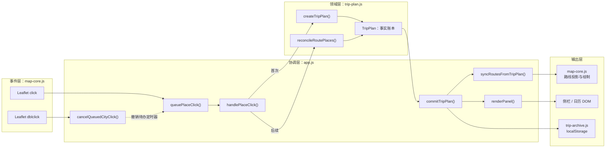
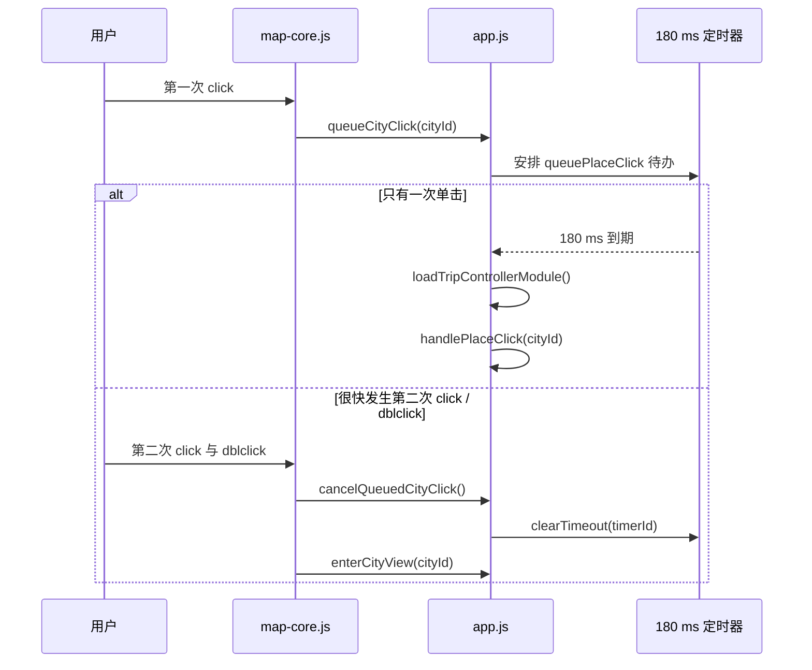
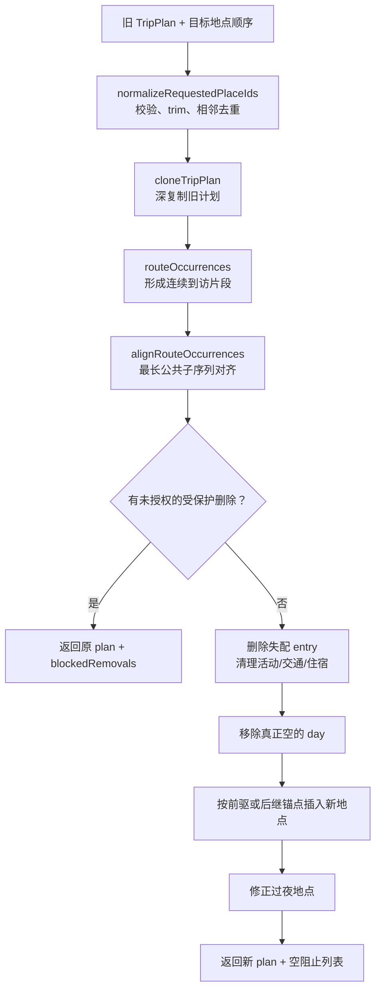
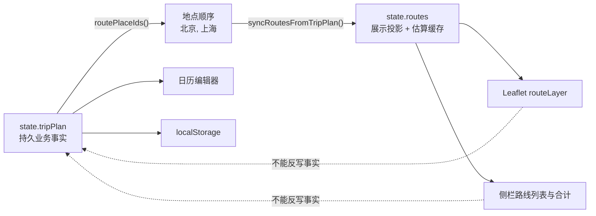
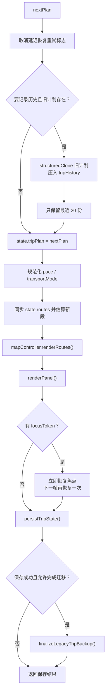
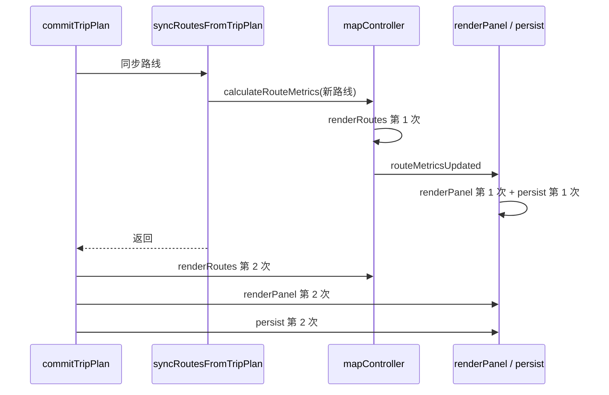
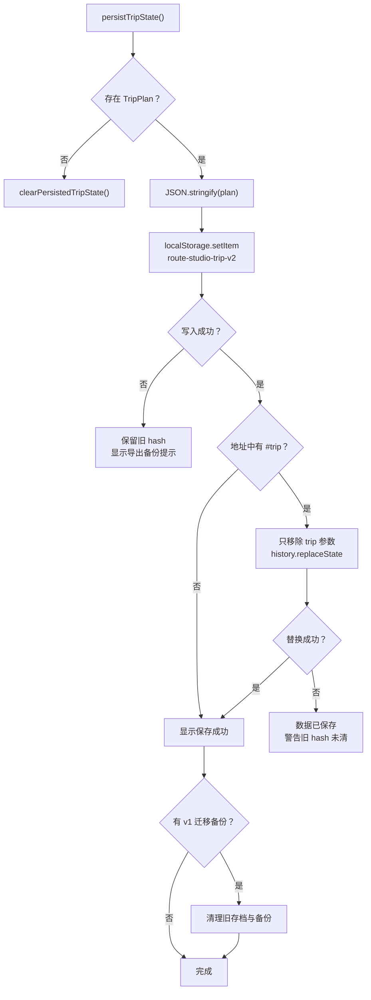
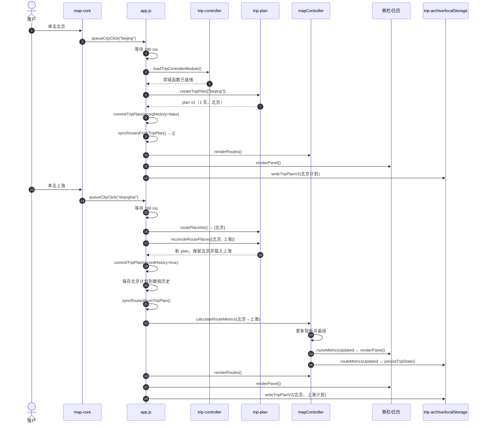

# 第 3 章：一次点击怎样变成行程、路线、侧栏和本地存档

> 本章跟踪一个具体动作：先单击北京，再单击上海。范围覆盖 `public/static-site/app.js` 的点击与提交主干、`trip-controller.js` 的模块入口、`trip-plan.js` 的创建与路线协调逻辑，以及 `trip-archive.js` 的本机保存写路径。AST 在这些选定入口及其内部识别出 134 个函数节点；地图绘线内部已在第 2 章逐函数拆解，本章只说明它在整条业务链中的位置。

## 1. 学完本章能回答什么

1. 为什么单击城市后要等 180 毫秒，而不是立刻加入行程？
2. 动态 `import()` 是否意味着行程代码一定等到第一次点击才下载？
3. 第一次点击为什么没有路线，第二次点击才出现一条线？
4. `TripPlan`、`state.routes`、地图线和侧栏文字为什么不是同一份数据？
5. 添加上海时，为什么要用看似复杂的“路线协调算法”，而不是直接 `push()`？
6. 旧路线的 ID、距离和时间为什么尽量复用？
7. `commitTripPlan()` 为什么是唯一提交入口？
8. 页面为什么会在一次提交中发生多次渲染和保存？
9. 自动保存究竟存在哪里，刷新网页后为什么还能恢复？
10. 当前设计哪里可靠，哪里还能继续改进？

## 2. 五问核验后的架构结论

| 核验问题 | 结论 |
| --- | --- |
| 用户真正做了什么？ | Leaflet 捕获地图单击，把地点 ID 作为业务事件交给 `app.js`；地图模块不直接修改行程。 |
| 为什么不能立刻处理？ | 同一个城市还支持双击进入城市详情。程序等待 180 ms，让双击有机会取消第一次单击的待办任务。 |
| 哪份数据代表真实行程？ | `state.tripPlan`。日历中的天、地点停留、活动、交通和住宿都以它为事实来源。 |
| 那么 `state.routes` 是什么？ | 从 `TripPlan` 地点顺序派生的展示投影，额外缓存地图画线所需的状态、距离和时间。 |
| 怎样让变化可靠落地？ | 所有正常变更进入 `commitTripPlan()`：记录撤销快照、同步派生路线、刷新地图与侧栏、写入浏览器 `localStorage`。 |

一句话总结：

> 地图点击只表达“用户选择了这个地点”；`TripPlan` 决定行程事实；`app.js` 把事实投影成路线和界面；`trip-archive.js` 把事实保存到本机。

## 3. 先认识本章中的 JavaScript 概念

### 3.1 事件与回调

“事件”是已经发生的动作，例如单击。回调是“发生这个动作后，请调用这个函数”。第 2 章的地图控制器不知道怎样规划行程，所以只调用注入的 `queueCityClick(cityId)`。

### 3.2 定时器

`window.setTimeout(callback, 180)` 可以理解为：把一张写着 callback 的任务卡放进队列，至少 180 ms 后再执行。它不会暂停整个网页。

`window.clearTimeout(timerId)` 则是按编号撤掉还没执行的任务卡。

### 3.3 Promise 与动态导入

`import("./trip-controller.js")` 返回 Promise。Promise 代表“现在还没有结果，但以后可能成功或失败的任务”。

- `.then(...)`：成功后做什么；
- `.catch(...)`：失败后做什么；
- `await`：在当前异步函数里等它完成，再继续下一句。

### 3.4 状态、领域模型与投影

- 状态：程序此刻记住的内容，例如选中的城市和路线数组。
- 领域模型：按照业务规则组织的数据。本项目的核心领域模型是 `TripPlan`。
- 投影：为了某个用途，从事实数据计算出的另一种形态。`state.routes` 是为了地图和侧栏而产生的投影。

可以把它类比成银行：账户流水是真实账本，月度图表是从流水计算出来的投影。图表坏了可以重算，不能反过来把图表当成流水。

### 3.5 克隆与“不改原对象”

`structuredClone(plan)` 深复制整个行程。协调函数修改副本，不碰调用者传入的旧计划。这样取消操作、撤销和失败回滚都更容易证明正确。

---

## 4. 五个模块怎样接力



箭头表达调用或数据流，不表示这些文件互相随意引用：

- `map-core.js` 通过回调通知 `app.js`；
- `app.js` 通过 `trip-controller.js` 取得行程领域函数；
- `trip-plan.js` 不知道 Leaflet 和 DOM 的存在；
- `trip-archive.js` 不负责画界面。

这种依赖方向让领域规则可以在 Node 测试里运行，不必真的打开地图。

## 5. 用北京和上海观察状态变化

为了便于阅读，下表把随机长 ID 简写成 `trip-1`、`day-1` 等。真实代码会产生更长且更不容易重复的 ID。

| 时刻 | `state.tripPlan` | `state.routes` | 地图/侧栏 | 本机存档 |
| --- | --- | --- | --- | --- |
| 启动后尚未选择 | `null` | `[]` | 无路线，提示选择起点 | 可能为空或刚恢复旧行程 |
| 第一次单击北京完成 | 1 天，地点为北京，过夜地北京 | `[]` | 北京被选中；没有线，因为还没有“从 → 到” | 保存包含北京的 v2 行程 |
| 第二次单击上海完成 | 同一天依次有北京、上海，过夜地上海 | `[北京 → 上海]` | 画一段曲线，显示估算距离/时间 | 覆盖保存包含两地的新 v2 行程 |

第一次点击后的核心对象近似如下：

```js
{
  version: 2,
  id: "trip-1",
  name: "我的旅行",
  startDate: null,
  pace: "standard",
  transportMode: "highspeed",
  days: [
    {
      id: "day-1",
      cityEntries: [
        {
          id: "city-entry-1",
          visitId: "visit-1",
          placeId: "beijing",
          manuallyPlaced: false
        }
      ],
      overnightPlaceId: "beijing",
      items: [],
      lodging: null,
      manuallyEdited: false
    }
  ],
  savedAt: "某个 ISO 时间"
}
```

第二次点击后，原来的北京 entry 和 ID 会保留，只新增上海 entry：

```text
day-1
├─ city-entry-1 / visit-1 / beijing   ← 保留
└─ city-entry-2 / visit-2 / shanghai  ← 新增

overnightPlaceId = shanghai
```

“保留旧 ID”很重要。活动、住宿、编辑焦点和撤销历史可能间接依赖这些身份；全部推倒重建会让界面看似相同，内部关联却断掉。

---

## 6. 单击为什么要等 180 毫秒

### 6.1 地图模块只发通知

全国边界或城市 Marker 的单击处理已在第 2 章拆解。它最终调用：

```text
invokeCallback("queueCityClick", city.id)
```

双击则调用 `enterCityView(city.id)`。进入城市视图之前，地图控制器会请求上层取消待处理的单击。

### 6.2 时间线



这不是为了等网络，而是为了判断用户意图。

### 6.3 `queuePlaceClick(placeId)`

位置：`app.js:2116`

执行顺序：

1. 如果已有待办单击，先取消；
2. 建立新的 180 ms 定时器；
3. 到期后把 `pendingCityClickTimer` 清为 `null`；
4. 确保行程模块可用；
5. 调用 `handlePlaceClick(placeId)`；
6. 模块加载失败只写控制台错误，不让未处理 Promise 异常扩散。

它内部有三个回调节点：

| 行 | 回调 | 作用 |
| --- | --- | --- |
| 2118 | `setTimeout` 回调 | 180 ms 后启动真正业务动作 |
| 2121 | `.then` 回调 | 模块可用后处理地点 |
| 2122 | `.catch` 回调 | 记录模块加载失败 |

连续快速单击两个不同地点时，后一次会取消前一次。这让双击可靠，但也意味着极快地单击北京后立刻单击上海，可能只留下上海。对常规鼠标操作影响很小，触屏和无障碍输入仍值得单独测试。

### 6.4 `queueCityClick(cityId)`

位置：`app.js:2126`

它只是把城市 ID 交给更通用的 `queuePlaceClick()`。项目不只支持城市，也支持区县地点，因此真正的业务名是 Place。

### 6.5 `cancelQueuedCityClick()`

位置：`app.js:2130`

- 没有定时器：直接返回；
- 有定时器：取消并清空 ID。

“取消 + 清空”必须同时做。只取消不清空，后续代码会误以为仍有任务；只清空不取消，旧任务仍会执行。

### 6.6 当前方案是否最好

当前方案代码少，能兼容 Leaflet 的 click/dblclick 模型。代价是每次真正单击都增加 180 ms 延迟，而且快速选择不同城市会相互覆盖。

可选改进：

- 使用一个明确的手势状态机，按地点分别跟踪 click；
- 在触屏端将“进入详情”改成独立按钮或长按，单击即可立即选点；
- 给键盘操作提供无延迟的“加入行程”动作；
- 把 `180` 提升成按输入类型配置的常量并增加计时器测试。

---

## 7. 行程模块怎样进入页面

### 7.1 `loadTripControllerModule()`

位置：`app.js:76`

它的关键写法是：

```js
tripControllerModulePromise ||= import("./trip-controller.js?v=progressive-2")
```

`||=` 表示“左边已有真值就保留，否则才执行右边”。所以无论多少次点击，都共享同一个模块加载 Promise，不会并发重复下载和初始化。

成功回调依次做四件事：

1. 从模块对象中取出 TripPlan、编辑器和存档函数，赋给 `app.js` 预先声明的变量；
2. 创建惰性存储适配器；
3. 创建一次 `tripController`；
4. `await tripController.init()` 后返回模块。

这里有两个内部回调：

- 第 77 行 `.then(async module => ...)`：装配整个行程子系统；
- 第 119 行 `() => window.localStorage`：真正访问存储的解析器。

一个容易误解的事实：它使用动态导入，但正常启动时 `initApp()` 已经立即调用它，并与地图数据并行加载；随后恢复本机行程还要等待它完成。所以它当前主要是“拆分模块边界和并行加载”，不是严格意义上的“第一次点击才下载”。

为什么这样做合理：启动阶段需要尽早恢复本机存档。若真的推迟到首次点击，用户刷新后会先看到空行程，点击后才突然恢复旧内容。

### 7.2 `queueTripAction(action)`

位置：`app.js:132`

它是其他按钮动作使用的统一包装器：先加载行程模块，再执行传入的 `action`；失败时记录错误并把可读提示写入侧栏。

地图单击没有直接使用它，而是在定时器里调用相同的加载函数。两条错误路径的用户体验因此不一致：按钮会显示提示，地图点击目前只写控制台。更好的方案是让二者共享一个错误报告函数。

### 7.3 `trip-controller.js`

这个文件只有 31 行，是一个很薄的门面：

| 函数节点 | 作用 |
| --- | --- |
| `loadGuideModule()` | 缓存并动态加载导出指南模块；本次点击链不调用 |
| `createTripController()` | 创建带生命周期的冻结控制器 |
| `init()` 方法 | 已销毁则报错；有 `onReady` 就等待它；返回控制器自身 |
| `destroy()` 方法 | 把闭包中的 `destroyed` 标为 `true` |

`domain: Object.freeze({ ...tripPlan, ...tripEditor, ...tripArchive })` 把三个模块的导出合成只读门面。与此同时，文件还用 `export *` 继续公开原始函数。

为什么保留这么薄的一层：它给“行程子系统”提供统一加载点，以后可以加入初始化、资源预取和销毁逻辑。当前代价是抽象收益还不大，而且 `app.js` 仍一次解构很多符号。若门面长期不增长，可以直接按模块导入；若继续演进，则应让 controller 暴露更少、更高层的命令，而不是整个 domain。

---

## 8. 第一次单击：从北京 ID 创建 TripPlan

### 8.1 `cityById(id)` 与 `placeById(id)`

位置：`app.js:2108`、`app.js:2112`

- `cityById` 从城市 Map 查找；
- `placeById` 先查包含城市、区县和运行时地点的统一 Map，没找到再查城市 Map。

后备查询让启动或增量补全期间的索引差异不至于立刻让城市失效。长期更理想的状态是统一索引始终包含全部城市，后备分支只作为防御。

### 8.2 `handlePlaceClick(placeId)` 的首次分支

位置：`app.js:2266`

先用 `placeById` 验证 ID。找不到就直接返回，避免把无效地点写入行程。

若 `state.tripPlan` 还是 `null`：

1. 读取用户可能已经填写的行程名；
2. 收集开始日期、节奏和交通方式；
3. 调用 `createTripPlan({ placeIds: [placeId], ... })`；
4. 用 `commitTripPlan(plan, { recordHistory: false })` 提交。

首次创建不记录撤销历史，因为没有旧计划可恢复。否则历史栈里只能放一个没有意义的 `null`。

### 8.3 `handleCityClick(cityId)`

位置：`app.js:2294`

这是一个向后兼容/语义适配别名，只调用 `handlePlaceClick(cityId)`。当前地图排队路径最后直接调用 `handlePlaceClick`，但保留 city 版本能让旧调用者或读者仍按“城市点击”理解。

### 8.4 `defaultIdFactory(prefix)`

位置：`trip-plan.js:9`

它按能力从强到弱生成 ID：

1. 浏览器支持 `crypto.randomUUID()`：使用安全 UUID；
2. 不支持 UUID 但支持 `crypto.getRandomValues()`：生成两个安全随机 32 位数；
3. 连安全随机数也没有：退回 `Math.random()`；
4. 再拼接当前时间与单调递增计数器，降低同一毫秒碰撞概率。

第 21 行 `Array.from(randomPart, value => value.toString(36))` 的回调把两个数字转成更短的 36 进制文本。

这里追求的是前端对象身份唯一，不是密码或授权令牌。测试还专门模拟没有 `randomUUID` 的公开 HTTP 环境，验证同一次创建产生的 ID 仍互不重复。

### 8.5 `blankDay(idFactory)`

位置：`trip-plan.js:24`

返回一个结构完整的空日程：

- 有 day ID；
- 没有地点、活动、住宿和过夜地；
- `manuallyEdited` 为 `false`。

集中创建默认结构比在多个调用点复制对象字面量更安全。将来增加字段时只需改一个地方。

### 8.6 `createTripPlan(options)`

位置：`trip-plan.js:35`

函数先创建一个空 day，再用 `placeIds.forEach` 为每个地点创建：

- 独立 `visitId`：代表一次连续停留；
- 独立 entry ID：代表某一天中的地点条目；
- `manuallyPlaced: false`：说明这是程序生成，不是用户手工拖放。

每加入一个地点就把 `overnightPlaceId` 更新为它，因此最终过夜地是当天最后一个地点。

返回的计划固定使用版本 2。交通方式只允许 `highspeed` 或 `train`，非法值回退到 `highspeed`。若 `placeIds` 为空，`days` 也是空数组，不保留刚创建的无内容 day。

为什么 `visitId` 和 entry ID 要分开：一次停留可能跨多天，每天会有不同 entry，但可以共享同一个 visit。首次创建只有一天，这层区分暂时看不出价值，到自动排期和跨日编辑时才发挥作用。

### 8.7 `resolveTripPace()` 与 `resolveTripTransportMode()`

位置：`trip-plan.js:118`、`trip-plan.js:123`

两者都是防御性读取：

- 先把调用方给的 fallback 校验成合法值；
- 再读取 plan 中的值；
- plan 无效就退回安全 fallback。

这让旧存档、手工编辑文件或 `null` 计划不会把非法枚举扩散到整个应用。

### 8.8 `cloneTripPlan(plan)`

位置：`trip-plan.js:61`

只做 `structuredClone(plan)`。它很短，却明确建立了领域规则：协调函数默认返回新计划，而不是原地修改输入。

---

## 9. 第二次单击：为什么不只是 `push("shanghai")`

### 9.1 `routePlaceIds(plan)` 先还原路线顺序

位置：`trip-plan.js:113`

它分两步：

1. `flatMap` 遍历每一天，内部 `map` 取出每个 entry 的 `placeId`；
2. `filter` 删除相邻重复地点。

例如：

```text
日历条目：北京, 郑州 | 郑州, 武汉 | 北京
路线地点：北京 → 郑州 → 武汉 → 北京
```

跨日时，前一天终点和后一天起点可能都是郑州。相邻去重可以避免生成“郑州 → 郑州”的零长度路线；但不相邻的再次到访会保留。

### 9.2 `handlePlaceClick()` 的后续分支

已有计划时：

```js
const currentPlaceIds = routePlaceIds(state.tripPlan);
```

- 若最后一个地点已经等于本次地点，只更新选中项并重绘，不重复添加；
- 否则把新地点接到目标顺序末尾，交给 `reconcileRoutePlaces()`；
- 协调成功后提交返回的新计划。

北京后点上海，目标顺序就是 `["beijing", "shanghai"]`。

### 9.3 为什么协调函数必须处理得更复杂

今天这里只是追加地点，但同一个公共函数还服务于撤销末段、重新排序、重复到访和保护手工日程。直接重建数组会丢失：

- 原 day/entry/visit ID；
- 用户手工放置标记；
- 活动、交通和住宿；
- 跨日抵达关系；
- 编辑器焦点和可撤销身份。

所以它解决的真实问题不是“追加字符串”，而是：

> 在目标路线顺序改变时，尽可能保留仍有意义的旧日历对象，只创建、删除和清理真正变化的部分。

## 10. `reconcileRoutePlaces()` 的完整算法

### 10.1 总图



### 10.2 `normalizeRequestedPlaceIds(nextPlaceIds)`

位置：`trip-plan.js:251`

- 输入必须是数组；
- 每项必须是非空字符串；
- 每项执行 `trim()`；
- 最后用 `filter` 去掉相邻重复。

验证发生在克隆和修改之前，因此非法输入不会留下半成品。测试验证 `undefined`、`null`、对象、空字符串和数字都会抛出 `TypeError`，同时原计划保持不变。

### 10.3 `routeOccurrences(plan)`

位置：`trip-plan.js:172`

它把连续相同地点合成一次 occurrence，并记录每个 entry 所在的天、day ID 和对象引用。

```text
entries:      A, A | B | A
occurrences: [A    ] [B] [A]
```

两个 `forEach` 回调分别遍历 days 和 entries。若当前 entry 与最后一个 occurrence 地点不同，就创建新 occurrence；否则追加到现有 occurrence。

为什么不能只用地点 ID 集合：集合无法区分“第一次北京”和“后来又回北京”，也无法表达顺序。

### 10.4 `alignRouteOccurrences(current, requested)`

位置：`trip-plan.js:187`

它用最长公共子序列（LCS）对齐旧路线与新路线。通俗地说：在保持相对顺序的前提下，找出最多可以原样保留的旧 occurrence。

例如旧路线 `A → B → C`，目标 `A → X → B → C`，可保留 `A、B、C`，只插入 `X`。

算法先创建二维数字表：

```text
行：旧 occurrence 的位置
列：目标地点的位置
格子：从这里往后最多还能匹配多少项
```

第 190 行 `Array.from` 回调创建每一行。两个倒序 `for` 填表，再从左上角向右下角走出匹配项。

复杂度是 O(n × m) 时间和 O(n × m) 空间。普通旅行通常只有个位数或几十个地点，非常合适；如果产品允许数千个节点，才值得换成更节省内存的差分算法。

### 10.5 `dayHasPlace(day, placeId)`

位置：`trip-plan.js:128`

先验证 ID 和 `cityEntries`，再用 `some` 判断这一天是否包含地点。它是移动日程项等规则的基础辅助函数；本次简单追加不会直接走移动规则，但属于同一领域约束。

### 10.6 `ensureValidOvernightPlace(day)`

位置：`trip-plan.js:145`

若原 `overnightPlaceId` 已不在当天 entry 中，就改成当天最后一个地点；当天已空则设为 `null`。内部 `some` 回调负责存在性判断。

删除地点而不修正过夜地，会产生“这一天没有武汉，却住在武汉”的悬空引用。

### 10.7 `itemReferencesPlace(item, placeIds)`

位置：`trip-plan.js:151`

检查一个日程项的 `placeId`、`fromPlaceId` 或 `toPlaceId` 是否引用待删除地点。活动通常用 `placeId`，交通通常用起终点，因此三个字段都要查。

### 10.8 `protectedDayIds(plan, placeId)`

位置：`trip-plan.js:155`

遍历每一天，若删除地点会影响以下任一内容，就记录 day ID：

- 该地点位于手工编辑过的 day；
- 住宿引用该地点；
- 活动或交通引用该地点。

`seenDayIds` 防止同一天因多个条件重复出现。函数含一个 day `forEach`、两个 `some` 回调。

### 10.9 `previousArrivalReferences(plan, targetDayIndex, placeId)`

位置：`trip-plan.js:697`

检查前一天是否有一条跨日交通在目标日抵达该地点：

- `type === "transport"`；
- `toPlaceId` 相同；
- `endDayOffset === 1`。

`flatMap` 回调返回匹配的 `{ dayIndex, item }`，否则返回空数组。删除第二天地点时，不能遗留“前一天坐车抵达一个已不存在的目的地”。

### 10.10 `occurrenceProtectedDayIds(...)`

位置：`trip-plan.js:217`

它比 `protectedDayIds` 更精细：当路线有多次同地到访时，只判断准备删除的那一次 occurrence 会影响哪些 day。

内部回调依次完成：

1. `map` 收集 occurrence 所在 day 索引；
2. `forEach` 检查每一天；
3. `some` 判断删除候选后该地点是否仍留在当天；
4. `some` 判断日程项是否引用地点；
5. 内层 `forEach` 把跨日抵达的前一天也标为受影响；
6. `sort` 按日历顺序排列；
7. `flatMap` 去重并返回 day ID。

这正是“路线第二次来到北京，只删后一次北京”仍能保护正确内容的关键。

### 10.11 `locateEntry(plan, entryId)`

位置：`trip-plan.js:645`

按天扫描，用 `findIndex` 找 entry ID，返回 `{ dayIndex, entryIndex }`；找不到返回 `null`。

协调算法保存的是稳定 entry ID，而不是容易因删除插入而变化的数组下标。真正插入前再定位，可以避免旧下标失效。

### 10.12 `reconcileRoutePlaces()` 分阶段拆解

位置：`trip-plan.js:265`

#### 阶段 A：标准化、克隆和建立锚点

1. 标准化目标顺序；
2. 深复制计划；
3. 提取旧 occurrences；
4. LCS 对齐；
5. 为每个匹配的目标位置保存首尾 entry ID 作为锚点。

北京 → 北京、上海时，北京成为锚点，上海没有锚点。

#### 阶段 B：识别完整删除与重复 occurrence 删除

- 目标集合中完全不存在的地点进入“完整删除”候选；
- 地点仍存在、但某次重复 occurrence 没匹配上，进入“局部删除”候选；
- `allowRemovalIds` 是用户明确批准清理关联内容的白名单。

内部 `addBlockedRemoval` 回调把同一地点涉及的 day ID 聚合进 Set。

#### 阶段 C：事务式阻止

只要发现未授权的受保护删除，就立即返回：

```js
{ plan, blockedRemovals }
```

注意返回的是原始 `plan`，不是已经做过一部分处理的副本。这叫事务式行为：要么整个变更成功，要么外部看到的计划完全不变。

#### 阶段 D：删除并清理依赖

允许删除时：

- 过滤对应 `cityEntries`；
- 只有当地点在某天彻底消失，才清理该天对它的活动、交通和住宿；
- 清理前一天跨日抵达项目；
- 修正过夜地；
- 最后删除既无地点、也无日程项和住宿的空 day。

#### 阶段 E：插入没有锚点的新地点

对每个新地点：

1. 先向前找最近已锚定的前驱，插在它后面；
2. 找不到前驱，再向后找最近后继，插在它前面；
3. 两边都没有，创建新 day；
4. 生成新的 visit ID 和 entry ID；
5. 插入并把当天过夜地修正为最后一个 entry；
6. 新 entry 自己也成为锚点，供后续插入使用。

北京 → 北京、上海时，上海找到北京前驱，插入同一天北京之后。

### 10.13 协调函数自身的 27 个内部回调节点

这些回调没有独立业务名字，但每一个都参与算法：

| 行 | 回调 | 精确职责 |
| --- | --- | --- |
| 274 | `matches.map` | 收集已匹配的旧 occurrence 下标 |
| 276 | `matches.forEach` | 把旧 occurrence 首尾 ID 写成目标锚点 |
| 286 | `currentOccurrences.map` | 给 occurrence 附加旧下标 |
| 287 | `.filter` | 找仍同名但未匹配的重复 occurrence |
| 291 | `unmatchedRetainedOccurrences.forEach` | 按地点聚合候选 entry |
| 293 | `occurrence.entries.forEach` | 把 entry 放进候选 Set |
| 299 | `next.days.map` | 保存修改前 day ID 顺序 |
| 302 | `addBlockedRemoval` | 合并某地点的受保护 day |
| 304 | `dayIds.forEach` | 把每个 day ID 放入 Set |
| 308 | `currentOccurrences.forEach` | 识别整地点删除 |
| 319 | `unmatchedRetainedOccurrences.forEach` | 检查重复 occurrence 的局部删除 |
| 329 | `occurrence.entries.forEach` | 标记待删除 entry 与所在日 |
| 337 | `blockedDayIdsByPlace.map` | 生成对外的阻止结果 |
| 339 | `originalDayIds.filter` | 保持原日历顺序并去重 |
| 345 | `next.days.forEach` | 对每一天应用 entry 删除 |
| 346 | `cityEntries.filter` | 保留未被完整/局部删除的 entry |
| 352 | `localRemovalTargets.forEach` | 计算逐日清理目标 |
| 354 | 展开数组的 `.filter` | 只清理当天已完全消失的地点 |
| 355 | `cityEntries.some` | 判断地点是否仍留在当天 |
| 361 | `cleanupTargets.forEach` | 查找跨日抵达依赖 |
| 362 | `placeIds.forEach` | 逐地点查询前一天到达项 |
| 363 | `previousArrivalReferences.forEach` | 按前一天聚合待删交通项 |
| 370 | `next.days.forEach` | 清活动/交通/住宿并修正过夜地 |
| 376 | `day.items.filter` | 移除引用已删地点的 item |
| 380 | `day.items.filter` | 移除跨日抵达 item |
| 383 | `next.days.filter` | 移除真正空白的 day |
| 387 | `requested.forEach` | 为每个未匹配目标寻找位置并插入 |

它调用的标准化、occurrence、保护、定位和跨日辅助函数也各有数组回调，已经在 10.2 至 10.11 按职责说明，不重复混进这张表。

### 10.14 为什么当前算法值得保留

优点：

- 对调用者不可变；
- 保留稳定身份；
- 支持重复到访；
- 删除受保护内容前要求授权；
- 失败是事务式的；
- 测试覆盖插入、重复、删除、重排和跨日依赖。

代价：函数较长，多个 Map/Set 的含义需要读者在脑中保持。更好的组织方式不是改成简单 `push()`，而是把五个阶段拆成带明确输入输出的纯函数，例如 `planRemoval()`、`applyRemoval()`、`insertMissingOccurrences()`，再为每阶段写表驱动测试。

---

## 11. TripPlan 怎样变成地图路线

### 11.1 两份数据的职责不同



`TripPlan` 会保存活动、住宿等业务内容，但不保存地图折线对象。`state.routes` 会保存 `distance`、`duration`、`status` 和 `fallback`，却不是完整行程。

为什么不把估算值直接写回 TripPlan：路线估算是可重新计算的展示数据，可能随交通模式或算法改变。把它与用户内容分开，能避免缓存过期污染存档。

### 11.2 `isValidRouteId(routeId)`

位置：`app.js:638`

合法 ID 可以是：

- 大于 0 的安全整数；
- trim 后非空的字符串。

兼容字符串是为了接纳恢复或迁移得到的旧路线身份。新路线由当前计数器产生正整数。

### 11.3 `syncRoutesFromTripPlan()`

位置：`app.js:643`

这个函数把事实模型投影成路线数组。

#### 第一步：取得路线地点

没有计划就使用空数组；有计划就调用 `routePlaceIds()`。

#### 第二步：保护旧 ID 空间

函数从 `previousRoutes` 收集：

- 已合法使用的所有 ID，放入 `reservedRouteIds`；
- 最大数字 ID；
- 已被本轮复用的对象和 ID。

随后让 `state.nextRouteId` 至少大于历史最大数字 ID。即使计数器因为恢复旧存档而落后，也不会撞号。

内部 `allocateRouteId()` 使用 `while` 跳过保留 ID，返回当前计数后自增，并立即把 ID 加入保留集合。

#### 第三步：一对相邻地点生成一段路线

`placeIds.slice(1).map((to, index) => ...)` 中：

```text
to   = 当前终点
from = 原数组同一 index 的前一个地点
```

例如 `[北京, 上海, 杭州]` 生成：

```text
index 0: 北京 → 上海
index 1: 上海 → 杭州
```

#### 第四步：优先复用旧路线对象

`previousRoutes.find` 要同时满足：

- 该对象本轮尚未使用；
- ID 合法且本轮未重复；
- `from`、`to` 相同；
- `transportMode` 相同。

符合时直接返回旧对象，连同已算出的距离、时长、状态和 ID 一并保留。

为什么交通方式也必须相同：高铁和普通火车的速度、绕行系数与缓冲时间不同，复用旧估算会显示错误结果。

#### 第五步：只为新增段创建 loading 路线

没有可复用对象时创建：

```js
{
  id,
  from,
  to,
  status: "loading",
  distance: null,
  duration: null,
  fallback: false,
  error: null,
  transportMode,
  transportLabel
}
```

它先进入 `routesToEstimate`，等整个新数组建立后再计算。

#### 第六步：一次替换投影，再估算新增段

先设置 `state.routes = nextRoutes`，再把选中地点设为最后一个地点，最后逐段调用 `mapController.calculateRouteMetrics(route)`。

先替换数组很关键。地图控制器在写回估算前会检查 `state.routes.includes(route)`，拒绝已经过期的路线对象。

### 11.4 这个函数的 7 个函数节点

| 行 | 回调 | 作用 |
| --- | --- | --- |
| 643 | `syncRoutesFromTripPlan` | 路线投影主函数 |
| 649 | `previousRoutes.map` | 提取旧 ID |
| 652 | `previousRoutes.reduce` | 找最大数字 ID |
| 660 | `allocateRouteId` | 安全分配新路线 ID |
| 668 | `placeIds.slice(1).map` | 从相邻地点构造路线 |
| 670 | `previousRoutes.find` | 查找可复用旧路线 |
| 703 | `routesToEstimate.forEach` | 只估算新路线 |

AST 实际把本节识别为 1 个具名函数、1 个 `allocateRouteId` 箭头函数和 5 个数组回调，共 7 个函数节点。第 668 行的 `(to, index)` 是 map 回调的参数，不是额外函数。

### 11.5 北京 → 上海时的投影结果

第一次点击北京：

```text
placeIds.slice(1) = []
state.routes       = []
```

第二次点击上海：

```text
placeIds.slice(1) = [shanghai]
from              = beijing
旧路线            = []，无法复用
新路线 ID         = 1
需要估算          = route-1
```

再次提交内容完全相同的计划时，只要路线对象还在且交通模式不变，它会被复用，不再估算。

### 11.6 当前缺少的一层测试

现有测试明确验证地图控制器的指标计算，也用源码结构测试约束唯一的 `commitTripPlan` 和 `syncRoutesFromTripPlan` 存在；但没有把 `syncRoutesFromTripPlan` 导出后直接做行为测试。

建议把路线投影提取成纯函数：

```text
projectRoutes({ placeIds, previousRoutes, transportMode, nextRouteId })
→ { routes, routesToEstimate, nextRouteId }
```

这样可以直接测试重复路段、字符串旧 ID、损坏计数器、交通模式变化和 ID 复用，而无需加载整页 DOM。

---

## 12. `commitTripPlan()`：唯一提交入口

位置：`app.js:706`

### 12.1 为什么需要唯一入口

如果每个按钮都自己改计划、画地图和保存，很容易出现：日历已变但地图没变，或界面已变但刷新后丢失。统一提交入口把这些后果排成固定顺序。

### 12.2 执行顺序



### 12.3 每一步为什么存在

1. `shouldRetryTripRestoreAfterCountyHydration = false`：用户刚提交的内容比启动时延迟恢复的旧存档更新，不能让后台恢复稍后覆盖它。
2. 历史快照：支持撤销编辑；首次创建传 `recordHistory: false`。
3. `slice(-20)`：限制内存增长。保存的是深副本，大计划的历史成本不低。
4. 赋值计划：从此刻起它成为新事实。
5. 规范化元数据：防止无效节奏/交通值流入路线估算。
6. 同步路线：从新事实重建展示投影。
7. 地图和面板重绘：让用户看到新事实。
8. 焦点恢复：日历 DOM 被重建后，尽量把键盘焦点放回原编辑位置。
9. 持久化：让刷新后仍能恢复。
10. 旧版迁移收尾：仅在新版存档写成功后清理旧备份，避免先删后存造成数据丢失。

第 727 行 `requestAnimationFrame` 回调是本函数唯一内部回调。立即恢复一次、浏览器下一帧再恢复一次，是为了应对 DOM 更新和布局后焦点被再次打断的情况。地图点击不传 `focusToken`，所以不会走这条支路。

### 12.4 同步命名与实际行为

`commitTripPlan` 不是 `async`，当前路线估算也完全同步：地图控制器立即计算直线球面距离和经验时间，而不是请求铁路 API。随后 `localStorage.setItem` 也是同步调用。因此函数返回的是布尔值，不是 Promise。

若未来接入真实网络路线服务，不能简单把内部函数改成异步后继续沿用现有顺序。需要为路线请求增加版本/取消机制，并明确“计划已提交”和“估算稍后完成”是两个状态。

### 12.5 当前存在的重复工作

新增路线时，`syncRoutesFromTripPlan()` 调用 `calculateRouteMetrics()`。地图控制器会：

1. 更新 route；
2. 自己 `renderRoutes()`；
3. 调用注入的 `routeMetricsUpdated`；
4. 回调又执行 `renderPanel()` 和 `persistTripState()`。

回到 `commitTripPlan()` 后，它还会再执行一次 `renderRoutes()`、`renderPanel()` 和 `persistTripState()`。



这不是正确性错误，但会重复重建日历 DOM、重新挂载事件、调度食行记刷新和同步写存储。路线越多，一次批量提交的重复次数越明显。

更好的方案：让 `calculateRouteMetrics` 只返回/写入结果，由提交入口在全部新段计算完后统一通知一次；或者为批处理增加 `silent` 选项，最后集中 render/persist。

---

## 13. 路线距离和地图线怎样更新

详细公式与 15 个地图控制器公开方法见[第 2 章](./02-map-core.md)。本章只连接主线：

```text
syncRoutesFromTripPlan()
└─ mapController.calculateRouteMetrics(route)
   ├─ routeMetricUpdates(route)
   │  └─ estimateRailRoute(from, to, mode)
   │     └─ haversineDistance(...)
   ├─ Object.assign(route, updates)
   ├─ renderRoutes()
   └─ routeMetricsUpdated(route)
      ├─ renderPanel()
      └─ persistTripState()
```

估算成功后，route 大致从：

```js
{ status: "loading", distance: null, duration: null }
```

变成：

```js
{
  status: "success",
  distance: 约多少米,
  duration: 约多少秒,
  fallback: true,
  transportMode: "highspeed",
  transportLabel: "高铁"
}
```

`fallback: true` 表示这是经验估算，不是真实班次导航结果。地图会按起终点计算二次贝塞尔弯线，再画宽底线和窄前景线；视觉上像一条有描边的路线。

---

## 14. `renderPanel()` 怎样重建侧栏

位置：`app.js:1104`

它不是一个小组件渲染器，而是侧栏总协调函数。一次调用会处理至少九类工作：

1. 查当前选中地点；
2. 同步交通与节奏按钮；
3. 根据全国/城市视图生成标题和提示；
4. 合并运行警告；
5. 清空并重建路线 `<li>`；
6. 更新撤销、清空、保存和导出按钮；
7. 更新地点数、路线数和地图 badge；
8. 更新地图地点样式、总距离、总时长和地点链；
9. 重建日历编辑器，并调度食行记面板刷新。

### 14.1 标题分支

- 城市视图：显示当前城市及区县、景点、车站、地铁和文章计数；
- 全国视图且有选中地点：显示“从某地出发”和继续点击提示；
- 尚未选择：显示起点提示。

随后把基础提示存进 `state.panelBaseHint`，再由 `renderOperationalWarnings()` 叠加可选数据缺失等运行警告。

### 14.2 路线列表回调

第 1130 行 `state.routes.forEach((route, index) => ...)`：

1. 查起终点对象；
2. 任一不存在就跳过；
3. 创建 `<li>`；
4. class 中加入 loading/success/error；
5. 生成路线名称、上下文、状态与元数据；
6. append 到列表。

当前用 `innerHTML` 拼入地点名称和上下文。规范城市来自项目数据，但运行时区县名称可能来自外部 GeoJSON。更稳妥的实现是用 `textContent` 和 DOM 节点组装，或至少统一调用 `escapeHtml()`，让这里与地图 Tooltip 的安全策略一致。

### 14.3 `placeContext(place)`

位置：`app.js:2063`

- 空地点返回空字符串；
- 区县返回“父城市或省 / 区县名”；
- 普通城市返回省名。

它让两个同名区县在路线列表里有上下文。

### 14.4 `statusLabel(route)`

位置：`app.js:2069`

- success：交通标签 + 成功说明；
- error：具体错误，没有则使用降级提示；
- 其他状态：loading 文本。

### 14.5 `routeMeta(route, index)`

位置：`app.js:2075`

先生成“第 N 段”：

- loading：显示计算中；
- 没有数字指标：显示待计算；
- 有指标：显示交通方式、格式化距离和时间。

### 14.6 `hasMetrics(route)`

位置：`app.js:2084`

只要求 `distance` 和 `duration` 的类型都是 number。它没有排除 `NaN`、`Infinity` 或负数；当前估算器不会产生这些值，但从健壮性看使用 `Number.isFinite()` 并检查非负更可靠。

### 14.7 `formatDistance(meters)`

位置：`app.js:2088`

- 大于等于 100 km：四舍五入成整数公里，并按中文地区格式加千分位；
- 小于 100 km：保留 1 位小数。

### 14.8 `formatDuration(seconds)`

位置：`app.js:2093`

1. 转分钟、四舍五入，最少显示 1 分钟；
2. 小于 60 分钟：只显示分钟；
3. 小于 24 小时：小时 + 剩余分钟；
4. 更长：天 + 剩余小时。

它按 24 小时换算“天”，不是旅行日历中的自然日。

### 14.9 `updateTotals()` 与 `routeTotals()`

位置：`app.js:1217`、`app.js:1225`

`routeTotals` 先用 `filter(hasMetrics)` 留下可计数路线，再返回：

- 距离总米数；
- 时长总秒数；
- 已计算段数；
- 是否有降级估算；
- 是否仍有 loading。

运行时会调用 `filter(hasMetrics)`、两个 `reduce` 和两个 `some`。其中 `hasMetrics` 是第 14.6 节已单独统计的现成函数引用；本函数源码只新建 4 个箭头回调。因此 AST 口径是 `routeTotals` 主函数 + 4 个内部回调，共 5 个函数节点。

`updateTotals` 决定后缀：仍在计算优先显示 `+`，否则有降级值就显示“估”。没有任何已计算段时显示待计算。

这种设计允许多段路线部分完成时先显示已知合计，但 `+` 明确提醒还有未计入内容。

### 14.10 `buildChainLabel()`

位置：`app.js:1236`

- 没有路线但有起点：显示起点名；
- 什么都没有：显示“尚未开始”；
- 有路线：先放第一段起点，再用 `forEach` 追加每段终点，最后用 ` → ` 连接。

### 14.11 `syncTripArchiveControls()` 与 `hasSerializableTrip()`

位置：`app.js:1538`、`app.js:1542`

- 只要有 TripPlan，就可保存和分享；
- 只有 `days` 非空，才可导出 Markdown/HTML 指南；
- 行程文件按钮还调用 `canExportTripFile`，允许在正常计划不可用时导出紧急旧版原文。

这体现“可保存计划”和“可生成日历指南”不是同一个条件。

### 14.12 `renderTripPlanner()`

位置：`app.js:1168`

它是日历子系统的装配边界：

1. 调用旧的 destroy 函数解除事件；
2. 清空日历根节点；
3. 在用户没有正编辑输入框时同步名称和日期；
4. 更新自动排期、撤销按钮和空状态；
5. 无日历就清空健康提示并返回；
6. 有日历则解析节奏、取地点顺序并校验计划；
7. 汇总领域警告和路线 loading/error；
8. 调 `renderTripEditorMarkup` 生成 HTML；
9. 调 `mountTripEditor` 重新挂事件，并保存新的 destroy 函数。

本函数共有 4 个函数节点：主函数和 3 个新建回调。

| 行 | 回调 | 作用 |
| --- | --- | --- |
| 1168 | `renderTripPlanner` | 日历装配主函数 |
| 1194 | `state.routes.filter` | 统计 error 路线 |
| 1195 | `state.routes.filter` | 统计 loading 路线 |
| 1208 | `placeName` | 把地点 ID 显示成人名可读名称 |

挂载参数 `onCommand` 和 `onEditRequest` 传的是已有函数引用，不新建函数节点。

`validateTripPlan`、`renderTripEditorMarkup` 和 `mountTripEditor` 的内部会在“行程模型”和“日历编辑”章节完整展开。本章只确认点击提交如何到达它们。

### 14.13 `transportProfile()` 与 `tripPaceProfile()`

位置：`app.js:2203`、`app.js:2207`

两个函数按 mode 查配置表，找不到时分别回退高铁和标准节奏。前者提供标签、平均速度、绕行系数和缓冲时间；后者提供每日交通上限、地点数和游玩窗口。

### 14.14 `queueFoodPanelRender()` 是一条旁支

位置：`app.js:1068`

侧栏每次刷新也可能影响食行记选择，因此最后调度食行记面板：

1. 应用还没 ready 就返回；
2. 读取当前地点选择；
3. 交给 `createLatestAsyncRefresh` 创建的调度器；
4. 只接受最新选择对应的异步结果；
5. 失败交给 `reportFoodModuleFailure`。

食行记不是“北京 → 上海路线”成立的必要条件。它失败时路线和行程仍然可用；详细异步防竞态机制放在食行记章节。

### 14.15 `renderPanel()` 为什么值得拆分

当前一个函数同时重建路线列表、日历、统计和旁支内容。它正确但刷新粒度过粗，正是第 12.5 节重复工作成本较高的原因。

更好的演进顺序：

1. 先拆成 `renderSelectionSummary`、`renderRouteList`、`renderRouteTotals`、`renderTripPlanner`；
2. 为每块建立明确输入；
3. 只有相关输入变化时才刷新该块；
4. 最后再考虑 React 或其他响应式框架，不必为了“框架化”一次性重写稳定逻辑。

---

## 15. 自动保存到底做了什么

### 15.1 它保存到哪里

当前写入浏览器当前站点的 `localStorage`，键名是：

```text
route-studio-trip-v2
```

它不是：

- 云端账户；
- 项目仓库文件；
- 数据库；
- 可在不同浏览器自动同步的存档。

清理站点数据、隐私模式限制或浏览器配额都可能让保存失败。

### 15.2 `createLazyStorageAdapter(resolveStorage)`

位置：`trip-archive.js:20`

创建时先验证 resolver 是函数，但不立刻读取 `window.localStorage`。真正调用 `getItem`、`setItem` 或 `removeItem` 时，内部 `callStorage(method, args)` 才：

1. 调 resolver 取得 Storage；
2. 查对应方法；
3. 不可用则抛 TypeError；
4. 用 `Reflect.apply(operation, storage, args)` 保持原 Storage 为 `this`。

返回对象被冻结，包含三个方法节点：`getItem`、`setItem`、`removeItem`。

为什么要惰性访问：某些浏览器环境读取 `window.localStorage` 属性本身就会抛 `SecurityError`。延迟访问让模块加载仍可成功，并把错误收拢到具体存档操作的 try/catch 中。

测试明确验证：创建适配器时 getter 读取次数为 0；真正读取候选或写入时才触发，并能返回可诊断错误。

### 15.3 `persistTripState(message)`

位置：`app.js:1583`

有计划时调用：

```js
writeTripPlanV2({
  storage: tripArchiveStorage,
  plan: state.tripPlan,
  currentUrl: window.location.href,
  replaceUrl: replaceBrowserUrl
})
```

然后区分三种结果：

| 结果 | 用户看到什么 | 返回值 |
| --- | --- | --- |
| 存储失败 | 错误提示，建议立刻导出文件备份 | `false` |
| 存储成功但旧 hash 清理失败 | 已保存但地址栏仍有旧快照的警告 | `true` |
| 两者都成功 | 成功消息 | `true` |

没有计划时会转入 `clearPersistedTripState()`；正常点击创建/追加不会走清空分支。

### 15.4 `writeTripPlanV2(...)`

位置：`trip-archive.js:190`

先在同一个 try 中：

1. `JSON.stringify(plan)`；
2. `storage.setItem(TRIP_STORAGE_KEY, serialized)`。

任一步失败都返回 `stored: false`，并且不会清理地址栏旧快照。只有新版存档成功，才调用 `retireTripHash()`。

这是很重要的数据安全顺序：

> 先确认新副本落盘，再删除旧恢复来源。

### 15.5 `tripHashState(currentUrl)`

位置：`trip-archive.js:54`

1. 用 `new URL` 解析当前地址；
2. 去掉 hash 开头的 `#`；
3. 用 `URLSearchParams` 解析参数；
4. 返回 URL、参数对象和是否存在 `trip`。

### 15.6 `retireTripHash({ currentUrl, replaceUrl })`

位置：`trip-archive.js:60`

- URL 无法解析：返回失败，不抛到外层；
- 没有 `trip`：返回成功且未变化；
- 有 `trip`：只删除该参数，保留其他 hash 参数；
- 调 `replaceUrl(nextUrl)`，成功才报告已变化；
- history API 被拒绝时，报告“存档成功但 hash 未清”。

### 15.7 `replaceBrowserUrl(nextUrl)`

位置：`app.js:1579`

调用 `window.history.replaceState(null, "", nextUrl)`，替换当前历史项，不新增一条浏览器后退记录。

### 15.8 `updateArchiveStatus(message, tone)`

位置：`app.js:2057`

若状态元素存在，更新文本和 class。`tone` 为空时只有基础 class；传 `success` 或 `error` 时追加对应样式。

### 15.9 `finalizeLegacyTripBackup(message)`

位置：`app.js:1606`

普通新用户的 `legacyTripBackupPending` 为 false，函数立即返回 true。

只有旧 v1 存档迁移过来的用户才进入清理：新版保存成功后删除旧 v1 存档和迁移备份；任何一步失败都保留 pending 标志并提示用户。若新版保存失败，本函数根本不会被调用。

这体现迁移的保守原则：宁可留下重复旧副本，也不在新副本尚未可靠保存时删除恢复来源。

### 15.10 保存流程图



### 15.11 当前保存策略的取舍

优点：无服务器、即时、离线可用、隐私边界直观；写新存档后才清旧来源，顺序安全。

不足：`localStorage` 是同步 API；每次写入都串行化整个计划，且当前一次新增路线可能重复写两次。计划和撤销历史变大后会阻塞主线程。

推荐的渐进改进：

1. 先把同一事件循环内的多次保存合并成一次；
2. 比较序列化内容，无变化则跳过；
3. 体积明显增大后改用 IndexedDB；
4. 若要跨设备同步，再设计账户、冲突合并、加密和隐私策略，不能把 localStorage 适配器简单替换成网络请求。

---

## 16. 两次点击的完整时序



这张图也暴露了当前重复渲染和重复保存：不是推测，而是由同步调用顺序直接得出的结果。

---

## 17. 函数节点覆盖清单

“函数节点”包括具名函数、对象方法、箭头函数和数组回调。下面的清单用于防止讲解只覆盖大函数、漏掉真正执行逻辑的小回调。

### 17.1 `app.js`：54 个节点

| 范围 | 节点数 | 本章位置 |
| --- | ---: | --- |
| `loadTripControllerModule` 及 `.then`、storage resolver | 3 | 7.1 |
| `queueTripAction` 及 `.catch` | 2 | 7.2 |
| `isValidRouteId` | 1 | 11.2 |
| `syncRoutesFromTripPlan` 及 6 个内部函数/回调 | 7 | 11.3–11.4 |
| `commitTripPlan` 及下一帧回调 | 2 | 12 |
| `queueFoodPanelRender` | 1 | 14.14 |
| `renderPanel` 及路线列表回调 | 2 | 14–14.2 |
| `renderTripPlanner` 及 3 个新建回调 | 4 | 14.12 |
| `updateTotals` | 1 | 14.9 |
| `routeTotals` 及 4 个新建数组回调 | 5 | 14.9 |
| `buildChainLabel` 及 `forEach` | 2 | 14.10 |
| `hasSerializableTrip`、`syncTripArchiveControls` | 2 | 14.11 |
| `replaceBrowserUrl`、`persistTripState`、`finalizeLegacyTripBackup` | 3 | 15.3、15.7、15.9 |
| `updateArchiveStatus` | 1 | 15.8 |
| `placeContext`、`statusLabel`、`routeMeta`、`hasMetrics`、两个格式化函数 | 6 | 14.3–14.8 |
| `cityById`、`placeById` | 2 | 8.1 |
| `queuePlaceClick` 及 3 个回调 | 4 | 6.3 |
| `queueCityClick`、`cancelQueuedCityClick` | 2 | 6.4–6.5 |
| `transportProfile`、`tripPaceProfile` | 2 | 14.13 |
| `handlePlaceClick`、`handleCityClick` | 2 | 8.2–8.3、9.2 |
| **合计** | **54** | 逐项覆盖 |

说明：AST 将 `renderTripPlanner` 识别为函数本身 + 两个 `filter` + `placeName`，共 4 个；传入的 `handleTripCommand` 和 `openTripItemDialog` 是已有函数引用，不重复计数。

### 17.2 `trip-plan.js`：68 个节点

| 范围 | 节点数 | 本章位置 |
| --- | ---: | --- |
| `defaultIdFactory` 及随机数组映射回调 | 2 | 8.4 |
| `blankDay` | 1 | 8.5 |
| `createTripPlan` 及地点 `forEach` | 2 | 8.6 |
| `cloneTripPlan` | 1 | 8.8 |
| `routePlaceIds` 及 `flatMap`、内层 `map`、`filter` | 4 | 9.1 |
| 两个元数据 resolver | 2 | 8.7 |
| `dayHasPlace` 及 `some` | 2 | 10.5 |
| `ensureValidOvernightPlace` 及 `some` | 2 | 10.6 |
| `itemReferencesPlace` | 1 | 10.7 |
| `protectedDayIds` 及 3 个回调 | 4 | 10.8 |
| `routeOccurrences` 及 2 个 `forEach` | 3 | 10.3 |
| `alignRouteOccurrences` 及二维数组回调 | 2 | 10.4 |
| `occurrenceProtectedDayIds` 及 7 个回调 | 8 | 10.10 |
| `normalizeRequestedPlaceIds` 及 `filter` | 2 | 10.2 |
| `reconcileRoutePlaces` 及 27 个内部回调 | 28 | 10.12–10.13 |
| `locateEntry` 及 `findIndex` | 2 | 10.11 |
| `previousArrivalReferences` 及 `flatMap` | 2 | 10.9 |
| **合计** | **68** | 逐项覆盖 |

### 17.3 `trip-archive.js`：8 个节点

| 节点 | 本章位置 |
| --- | --- |
| `createLazyStorageAdapter` | 15.2 |
| 内部 `callStorage` | 15.2 |
| 返回对象的 `getItem` 方法 | 15.2 |
| 返回对象的 `setItem` 方法 | 15.2 |
| 返回对象的 `removeItem` 方法 | 15.2 |
| `tripHashState` | 15.5 |
| `retireTripHash` | 15.6 |
| `writeTripPlanV2` | 15.4 |

### 17.4 `trip-controller.js`：4 个节点

| 节点 | 本章位置 |
| --- | --- |
| `loadGuideModule` | 7.3 |
| `createTripController` | 7.3 |
| `init` 方法 | 7.3 |
| `destroy` 方法 | 7.3 |

合计：`54 + 68 + 8 + 4 = 134` 个函数节点。

### 17.5 为什么没有在本章重复统计地图函数

本次链路还会调用 `map-core.js` 的 `calculateRouteMetrics`、`routeMetricUpdates`、`estimateRailRoute`、`haversineDistance`、`renderRoutes` 和 `updateCityStyles`。它们已包含在第 2 章的 88 个节点中；本章第 13 节连接调用关系，不用重复制造一个看似更大的覆盖数字。

日历校验、编辑器和食行记也是明确的下游边界，会在各自章节按完整 AST 清单拆解。本章没有把“调用到公共 API”错误说成“已经解释完其所有内部实现”。

---

## 18. 测试怎样支撑这些结论

| 测试文件 | 已验证的关键事实 |
| --- | --- |
| `tests/module-boundaries.test.mjs` | 地图 click/dblclick 能到达不同回调；销毁后事件被抑制；路线指标会写回并通知上层 |
| `tests/trip-plan.test.mjs` | v2 初始计划结构、无 UUID 时 ID 唯一、交通方式回退、相邻地点去重 |
| `tests/trip-plan.test.mjs` | 插入不移动手工 day；非法输入不修改原计划；重复到访得到不同 visit |
| `tests/trip-plan.test.mjs` | 受保护删除会阻止且保持事务性；授权删除会清理关联内容；空 day 会删除；新增地点修正过夜地 |
| `tests/trip-archive.test.mjs` | storage 访问确实惰性；新版写入成功才清旧 hash；写入失败保留旧存档/hash；history 失败被单独报告 |
| `tests/rendered-html.test.mjs` | `app.js` 通过行程模块协调；只有一个 `commitTripPlan` 定义；交通元数据先同步后渲染；日历从 `renderPanel` 进入真实编辑器 |

测试能证明很多领域和模块边界，但不能自动证明所有浏览器交互体验都好。仍建议新增：

- 180 ms 单击/双击假时钟测试；
- 快速点击不同地点的产品预期测试；
- 路线投影与 ID 复用纯函数测试；
- 一次 commit 最多渲染/持久化一次的计数测试；
- 恶意运行时地点名称不能进入 `innerHTML` 的安全测试。

本章完成时实际运行 `npm test`：共 200 项测试，200 项通过，0 项失败。

---

## 19. 设计评价：保留什么，优先改什么

### 19.1 应保留的核心设计

1. 地图事件通过回调上报，Leaflet 不拥有业务规则。
2. TripPlan 是唯一事实来源，地图路线是可重建投影。
3. 领域协调默认克隆，受保护删除是事务式的。
4. 路线对象按身份和交通方式复用，避免无谓重算。
5. 所有变化汇入一个提交入口。
6. 新版存档成功后才清理旧恢复来源。

### 19.2 优先级最高的改进

第一，消除一次提交中的重复渲染和重复保存。这是源码调用顺序已经证明的具体成本，而且改动边界清晰。

第二，把路线投影从 `app.js` 提取成纯函数并补行为测试。当前逻辑严谨，但只能靠源码阅读确认 ID 复用细节。

第三，用 `textContent` 重写路线列表的动态文字节点，统一外部地点名称的安全边界。

### 19.3 中期改进

- 把 `renderPanel` 拆成按输入更新的小渲染器；
- 把 `reconcileRoutePlaces` 五阶段拆成纯函数，但保留现有事务语义；
- 合并 `queueTripAction` 和地图点击的加载失败提示；
- 保存操作做去重/批处理；
- 让点击延迟按鼠标、触控和键盘分别设计。

### 19.4 不建议为了“更现代”立刻做的事

- 不要把协调算法退化成数组 `push/splice`；那会丢失身份和用户内容保护。
- 不要只因为项目外层使用 React，就一次性把整个静态地图重写成 React；先缩小 `app.js` 的职责更有价值。
- 不要把 `localStorage` 直接换成云 API 而忽略离线、账户、冲突、加密和迁移。
- 不要把 TripPlan 与路线估算缓存合并成一份“大对象”；事实与投影分离是正确方向。

---

## 20. 建议你怎样亲手读这条链路

1. 打开 `public/static-site/app.js:2116`，只读三个排队函数。
2. 跳到 `app.js:2266`，分别沿“没有 plan”和“已有 plan”两个分支读。
3. 打开 `trip-plan.js:35`，对照第 5 节手写第一次点击后的对象。
4. 回到 `trip-plan.js:265`，先只读五个阶段，不要立刻钻进每个回调。
5. 打开 `app.js:643`，拿 `[北京, 上海, 杭州]` 手算两段 route。
6. 打开 `app.js:706`，按第 12.2 节逐行标记副作用。
7. 打开 `app.js:1104`，观察一次 render 为什么会影响多个面板。
8. 最后读 `trip-archive.js:190`，确认“先写新存档，再清旧 hash”的顺序。

如果你只记住一条工程原则，请记住：

> 先找事实来源，再找由它派生的投影，最后找统一提交入口。这样读大型前端项目时，不容易被大量 DOM 和回调带迷路。

## 21. 下一章预告

下一章拆解城市详情：双击城市后，区县边界、景点、铁路站、地铁线和站点怎样分阶段加载；城市 session 如何拒绝过期异步结果；外部数据失败时如何退回内置摘要。

回看：[第 2 章：地图怎样被创建、绘制和安全销毁](./02-map-core.md)

继续阅读：[第 4 章：双击城市后，详情怎样异步加载且不串台](./04-city-detail.md)
