# 第 4 章：双击城市后，详情怎样异步加载且不串台

> 本章完整拆解 `public/static-site/city-detail.js`，并连接 `app.js` 与 `map-core.js` 的城市详情协作边界。该文件共 1,134 行、52,292 字节；AST 识别出 110 个函数节点：57 个函数声明、1 个对象方法和 52 个箭头回调。`app.js` 还有 18 个专门负责加载和转接城市详情的函数节点。

## 1. 学完本章能回答什么

1. 为什么双击城市不会直接在 `app.js` 里请求区县和景点？
2. 城市详情模块为什么使用动态导入，它与行程模块的加载时机有何不同？
3. 区县点、真实区县边界、景点、火车站、地铁线和食行记分别来自哪里？
4. 在线数据失败后为什么有些内容仍能显示，有些会消失？
5. 快速打开 A 城、B 城、再回 A 城时，旧请求为什么不能覆盖新页面？
6. “缓存结果”和“缓存正在执行的 Promise”有什么区别？
7. 在线 OSM 点位为什么还要经过行政边界过滤、白名单和名称清洗？
8. 一个区县边界怎样变成可搜索、可加入行程的普通地点？
9. 点是否位于多边形内是怎样计算的？
10. 当前实现为什么可靠，又有哪些可以被测试证明的改进空间？

## 2. 五问核验后的架构结论

| 核验问题 | 结论 |
| --- | --- |
| 城市详情模块是什么？ | 一个“详情数据控制器”：负责取得、清洗、合并和缓存城市内数据，但不直接调用 Leaflet。 |
| 为什么从 `app.js` 分离？ | 在线地址、精选目录、站点规则和几何过滤合计超过千行；留在总调度器会破坏模块边界，也会增加首屏脚本负担。 |
| 谁负责真正画图？ | `map-core.js`。详情控制器只把标准化后的 `districts/landmarks/stations/...` 一次性交给 `renderCityDetail()`。 |
| 异步结果怎样保证属于当前城市？ | 地图控制器为每次进入生成递增 generation session；每次 await 后检查 session、城市 ID 和视图模式。 |
| 网络失败怎么办？ | 按数据类型使用本地分片、内置精选目录、本地地铁网络或空数组降级；失败不应阻止返回全国地图和已有行程。 |

一句话总结：

> `city-detail.js` 像城市资料编辑部：从多个来源收稿，校验、去重和裁剪后交给 `map-core.js` 排版；generation session 是每期稿件的期号，过期稿件不能登上当前页面。

## 3. 本章需要的 JavaScript 与地图概念

### 3.1 控制器工厂

`createCityDetailController(options)` 调用一次，返回 8 个公开方法。其余 56 个具名函数都留在闭包里，外部不能随意调用。

### 3.2 异步流水线

异步流水线不是“一次拿到全部数据”，而是：

```text
取得 A → 检查是否过期 → 取得 B → 再检查 → 整理结果 → 渲染
```

检查放在每个 `await` 后，防止等待期间用户已经切换城市。

### 3.3 降级

降级表示理想数据不可用时，改用信息更少但仍安全的来源。例如在线景点失败后使用内置精选景点；在线区县边界失败后显示城市轮廓和区县中心点。

降级不是伪装成功。路线估算和详情计数仍应让用户知道展示内容可能不完整。

### 3.4 值缓存与 Promise 缓存

- 值缓存：请求完成后保存结果，例如 `landmarkCache`。
- Promise 缓存：请求还没完成时就保存任务，例如 `metroNetworkPromise`。

只缓存值时，两个同时到来的请求都可能发出网络请求；缓存 Promise 可以让它们等待同一个任务。

### 3.5 包围盒与点在多边形内

- 包围盒 bbox：能包住一个区域的最小经纬度矩形，形式为南、西、北、东。
- 点在多边形内：判断一个景点或车站是否真的落在行政边界里，而不只是在附近矩形中。

---

## 4. 三个模块的所有权边界

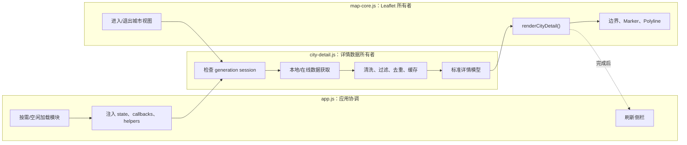

自动测试明确守住这条边界：

- `app.js` 不包含 DataV、Overpass、地铁网络和 12306 文件地址；
- `app.js` 不定义四类详情请求函数；
- `city-detail.js` 不反向导入 `app.js`；
- `city-detail.js` 不直接出现 Leaflet `L.*` 调用；
- 只有 `map-core.js` 创建和清理地图图层。

## 5. 数据源全景

当前工作区的静态数据规模是：

- 339 个按城市拆分的区县文件，共 2,789 条区县记录；
- 地铁网络文件 726,618 字节，覆盖 39 个网络、221 条线路记录和 3,897 个站点记录；
- 12306 站名文件 588,316 字节，含 3,367 条客运站记录；
- 内置基础景点 15 城 45 条，扩展精选景点 9 城 38 条；
- 内置火车站 15 城 48 条，内置地铁站 10 城 50 条。

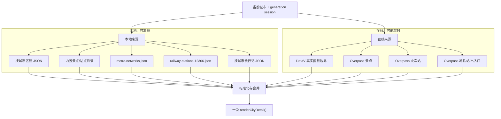

| 内容 | 首选来源 | 后备来源 | 缓存位置 | 失败后的结果 |
| --- | --- | --- | --- | --- |
| 区县基础记录 | 本地 `counties/by-city` | 已有摘要/直辖市子城市 | place index + loaded Set | 仍可显示已有区县点 |
| 区县真实边界 | DataV `{adcode}_full.json` | 当前城市轮廓 + 区县中心点 | `cityBoundaryCache` | 没有区县面，但城市视图仍成立 |
| 景点 | 精选目录 + OSM | 精选目录 | `landmarkCache` | 有精选城市仍显示景点 |
| 火车站 | 精选候选或 OSM + 本地 12306 白名单 | 无可靠名单时为空 | `stationCache` + 全局名单 | 站点可能完全不显示 |
| 地铁线/站 | 本地完整地铁网络 | 精选站 + OSM | 全局网络 + `subwayStationCache` | 有精选城市可显示部分站，线路可能为空 |
| 食行记 | 独立 food controller 的本地分片 | 已有摘要 | food store | 不影响其他详情 |

表中“火车站后备为空”是当前真实行为：12306 文件加载失败时，精选站也会被空白名单过滤掉。它比展示未经确认的货运/设施站更保守，但“内置站点”并不是真正独立的离线 fallback。

---

## 6. `app.js` 怎样加载和装配控制器

### 6.1 `loadCityDetailModule()`

位置：`app.js:141`

```js
cityDetailModulePromise ||= import("./city-detail.js?v=progressive-2");
```

第一次调用创建动态导入 Promise，后续共享。与行程模块不同，城市详情不是恢复首屏状态的必要条件：`initApp()` 先让地图可用，再在 `scheduleIdle` 回调中预加载控制器；如果用户在空闲加载前双击，也会立即触发相同加载函数。

所以这里是真正的“空闲时或首次使用时加载”。

### 6.2 `loadCityDetailController()`

位置：`app.js:146`

成功回调取得 `createCityDetailController` 并注入四组东西：

- `state`：共享数据、缓存和当前视图；
- `mapController`：地图生命周期和渲染能力；
- `elements`：退出城市按钮；
- `callbacks/helpers`：查询城市、食行记、索引合并、文本安全、JSON 加载和 fetch。

本函数有 4 个函数节点：主函数、`.then` 装配回调、`getPlaceIndex` 箭头函数和 `.catch` 回调。

失败时把 `cityDetailControllerPromise` 还原为 `null`，允许再次创建控制器。一个细节是 `cityDetailModulePromise` 没有清空：若失败原因是动态 import 本身失败，后续仍会复用同一个 rejected Promise；若失败发生在控制器创建阶段，则可以重试。更彻底的重试需要同时决定何时重置模块 Promise。

### 6.3 `reportCityDetailModuleFailure(error)`

位置：`app.js:181`

- 控制台警告只报告一次，避免反复刷屏；
- 每次都把 `state.deferredInternalError` 设为 true；
- 调 `renderOperationalWarnings()`，让页面显示降级状态。

“只记录一次”和“持续保持错误状态”分开处理是合理的。

### 6.4 `queueCityDetailModuleRefresh()`

位置：`app.js:190`

侧栏在控制器尚未加载时查询景点或计数，会调用它：

1. 已有 controller 或已排队就返回；
2. 标记 `cityDetailRefreshQueued = true`；
3. 加载成功后刷新面板；
4. 失败走统一报告；
5. `finally` 无论成败都释放排队标记。

它含主函数、`.then` 回调和 `.finally` 回调，共 3 个节点；`.catch` 传的是已有函数引用，不新建节点。

当前成功回调先 `renderPanel()`，又显式 `renderTripPlanner()`；而 `renderPanel()` 本身已经调用 `renderTripPlanner()`，因此这里会重复重建一次日历。第 3 章发现的粗粒度刷新问题在此再次出现。

### 6.5 七个轻量适配函数

| 函数 | 位置 | 控制器未就绪/失败时怎样做 |
| --- | --- | --- |
| `enterCityView(cityId)` | 2137 | 等待创建；创建失败返回 false；详情加载错误异步报告 |
| `exitCityView(options)` | 2148 | 有详情控制器就调用它，否则直接让地图返回全国 |
| `loadCityDetail(city, session)` | 2153 | 等待控制器；异常返回 false |
| `citySubareas(city)` | 2163 | 从共享区县中筛选；区域型城市再退回同省城市 |
| `cityLandmarks(city)` | 2171 | 排队加载模块，本次先返回空数组 |
| `cityDetailCounts(city)` | 2177 | 排队加载，先用现有 state 计数 |
| `ensureCityCounties(cityId, options)` | 2189 | 加载失败后返回当前已有区县 |

`citySubareas` 的两个 `filter` 是本组仅有的内部数组回调。连同前四个加载函数的回调，`app.js` 本章专用适配层共 18 个函数节点。

另有两个直接协作者属于下一章食行记：`loadFoodForCity()` 把食行记加载异常转成 `null`，`foodArticleCountForCity()` 在控制器未就绪时返回 0。

### 6.6 两个入口

城市详情不只从双击进入：

1. 地图双击城市：`map-core → app.enterCityView → controller.enter`；
2. 搜索结果选择区县：先确保父城市区县数据，再进入父城市、聚焦区县，并把区县加入行程。

两个入口最终共享同一个详情控制器和地图 session。

---

## 7. 控制器创建与依赖契约

### 7.1 `requiredFunction(group, name)`

位置：`city-detail.js:293`

从某个依赖组取函数；不是函数就立即抛 `TypeError`。它让“缺少 `loadFoodForCity`”在创建控制器时暴露，而不是等用户双击某个城市后才报模糊错误。

### 7.2 `createCityDetailController(options)`

位置：`city-detail.js:299`

先验证 options、state 和 mapController，再要求 14 个函数协作者：

| 组 | 协作者 | 用途 |
| --- | --- | --- |
| callbacks | `cityById` | ID 查城市 |
| callbacks | `loadFoodForCity` | 加载该城市食行记 |
| callbacks | `foodArticleCountForCity` | 取得文章数 |
| callbacks | `renderPanel` | 完成后刷新侧栏 |
| callbacks | `syncPlaceIndex` | 运行时区县加入后同步共享引用 |
| callbacks | `getPlaceIndex` | 取得当前地点索引对象 |
| helpers | `escapeHtml` | 安全生成景点 popup |
| helpers | `normalizeKey` | 城市目录键与 ID |
| helpers | `normalizeSearchText` | 名称比较和去重 |
| helpers | `loadOptionalJson` | 读取可失败的本地区县分片 |
| helpers | `isCountyRecordsPayload` | 校验分片结构 |
| helpers | `mergeCountyRecords` | 合并规范区县 |
| helpers | `upsertRuntimePlaces` | 加入在线边界产生的运行时地点 |
| helpers | `fetchImpl` | 可替换、可测试的 fetch |

`windowObject` 可选，默认 `globalThis`，用于注入定时器。退出按钮也有 `{ hidden: true }` 假对象，允许无 DOM 测试。

当前 `app.js` 还注入了 `helpers.hasCoordinates`，但详情控制器没有读取它，而是定义自己的同名函数；`municipalities` Set 也只声明未使用。这两项可以安全清理，或把坐标校验真正统一成注入依赖。

### 7.3 mapController 契约仍不够严格

工厂只验证 `mapController` 是对象，没有逐个检查：

- `enterCityView`；
- `isDetailSessionCurrent`；
- `clearCityDetail`；
- `renderCityDetail`；
- `distanceBetween`；
- `enterChinaView`。

这比 callbacks 的即时验证弱。更好的方案是同样用 `requiredFunction` 建立明确地图端口，错误会更早、更可读。

### 7.4 返回的 8 个公开方法

```text
enter            → enterCityView
exit             → exitCityView
load             → loadCityDetail
counts           → cityDetailCounts
subareas         → citySubareas
landmarks        → cityLandmarks
ensureCounties   → ensureCityCounties
prefetch         → 预取地铁网络与 12306 名单
```

返回对象用 `Object.freeze` 冻结，外部不能替换这些方法。冻结是浅层的，不会冻结共享 state。

---

## 8. 进入、加载和退出的主生命周期

### 8.1 `enterCityView(cityId)`

位置：`city-detail.js:392`

1. 查城市；
2. 城市、地图或控制器缺失就返回；
3. 调地图控制器进入城市视图，取得冻结 session；
4. session 无效就返回；
5. 显示“退出城市视图”按钮；
6. 等待 `loadCityDetail(city, session)`；
7. 再确认 session 当前有效；
8. 刷新侧栏。

地图控制器在第 3 步已经隐藏全国边界、城市点和标签，并保留路线层与详情层。因此用户会先看到城市视图框架，再等待详情填充。

### 8.2 `exitCityView(options)`

位置：`city-detail.js:404`

只调用 `mapController.enterChinaView(options)`。真正的 generation 失效、图层清理、全国图层恢复、按钮隐藏和面板刷新都由地图控制器负责。

这种薄方法的意义是让 app 只面对一个城市详情门面；代价是方法名与内部调用名相反，需要文档说明。

### 8.3 `loadCityDetail(city, detailSession)` 总流程

位置：`city-detail.js:408`

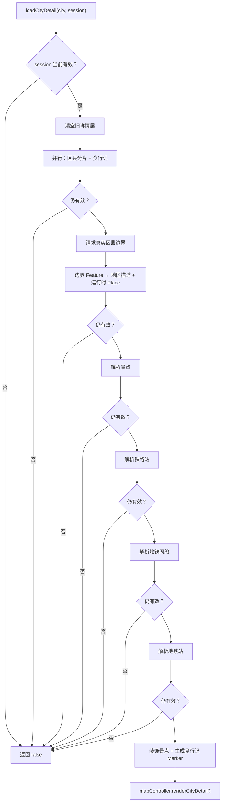

函数开头的 `isCurrent = () => ...` 是局部箭头函数。它把长表达式封成统一检查，并传给区县、食行记和各缓存函数。

两个 `.map` 回调：

- 第 423 行把每个区县 Feature 转成 `{ feature, name, placeId, labelPoint }`；
- 第 450 行给每个景点增加 symbol、typeLabel 和安全 popup HTML。

### 8.4 第一次并行，后面顺序等待

只有区县分片和食行记使用 `Promise.all` 并行。取得边界后，景点、铁路站、地铁网络、地铁站按顺序等待。

顺序的部分理由：

- 边界决定 OSM 查询 bbox 和点在行政区内过滤；
- 地铁站优先使用刚解析出的地铁网络。

但景点、铁路站与地铁网络在边界完成后彼此独立，可以并行。当前两个 Overpass 超时均可到 6.5 秒，地铁站再到 3.5 秒；网络不佳时等待会叠加。合理改进是：边界完成后并行解析景点、铁路和地铁网络，再用网络结果解析地铁站。

### 8.5 最终标准模型

交给地图控制器的数据只有一份：

```js
{
  session,
  city,
  sourceFeature,
  districts,
  subareas,
  landmarks,
  stations,
  metroLines,
  subwayStations,
  foodMarkers,
  foodArticleCount
}
```

有真实区县面时 `sourceFeature` 传 null，避免再画一层城市总轮廓；没有区县面时才用全国边界中的城市 Feature 作为背景。

### 8.6 为什么每次 await 后都检查

用户可以在任何等待点离开或切换城市。只在最终 render 前检查可以阻止错误绘制，却仍可能把旧结果写进共享缓存；当前 resolver 也只在 `isCurrent()` 时写缓存，因此中间检查同时减少后续无意义工作。

它没有真正取消已发出的 DataV/Overpass 请求，只是不采用结果。更节省资源的方案是把 session 对应的 AbortSignal 传入 fetch，在 generation 失效时主动 abort。

---

## 9. generation session：A → B → A 也不会串台

地图控制器内部有递增的 `detailGeneration`。每次进入城市都会：

```js
const session = Object.freeze({
  generation: ++detailGeneration,
  cityId
});
```

实际递增由 `invalidateDetailWork()` 完成。判断当前有效必须同时满足：

- 地图控制器未销毁；
- `state.map` 仍存在；
- session 存在；
- generation 等于最新 generation；
- session 城市等于 `activeCityViewId`；
- `viewMode === "city"`。

为什么只比较 cityId 不够：用户可以进入 A、进入 B、又进入 A。第一次 A 请求回来时，当前城市 ID 仍是 A，但它属于第一次进入，仍然过期。

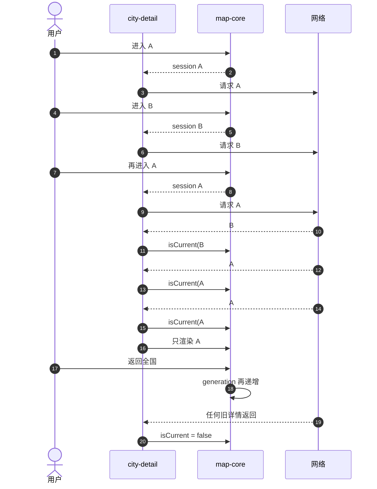

现有测试真实构造了三个 Deferred Promise，并验证 B#2、A#1 返回 false，只有 A#3 返回 true；退出全国后的旧 A 也返回 false。这比只检查最终城市名的测试强得多。

---

## 10. 区县：本地记录、在线边界与运行时地点

### 10.1 `ensureCityCounties(cityId, options)`

位置：`city-detail.js:1105`

这是按城市加载本地区县分片的入口：

1. ID 为空或已在 `loadedCountyCityIds`：直接返回现有区县；
2. 同城市没有进行中的请求：调用 `loadOptionalJson`；
3. 把 Promise 放进 `countyLoadPromises`；
4. `.finally` 删除 Promise，让失败后仍可重试；
5. 等待共享请求；
6. session 已过期：只返回现有数据，不合并；
7. payload 非法：只返回现有数据，也不标记 loaded；
8. 合并到 place index、同步 state、标记该城市已加载；
9. 返回新 counties。

默认参数中的 `isCurrent = () => true` 是函数节点；它让搜索区县等没有详情 session 的显式调用也能加载。`.finally` 是另一个回调节点。

为什么 Promise 完成后要从 Map 删除：`loadedCountyCityIds` 才代表成功缓存；Promise Map 只表示“正在进行”。若失败 Promise 永久留在 Map，后续永远无法重试。

### 10.2 `fetchCityDistrictBoundaries(city, options)`

位置：`city-detail.js:464`

读取城市行政代码并做三层短路：

- 没有 adcode：返回 null；
- 不是 6 位数字：返回 null；
- `710000`：返回 null，避免请求不存在/不适用的台湾区县边界。

缓存命中时直接返回。否则请求：

```text
https://geo.datav.aliyun.com/areas_v3/bound/{adcode}_full.json
```

响应必须成功且 `features` 非空才算 usable。成功或失败都只在 session 当前时写 `cityBoundaryCache`；失败缓存为 null，表示本次页面生命周期内不再重试该 adcode。

默认 `isCurrent` 箭头函数是本函数的第二个节点。

当前没有超时控制：DataV fetch 若长期悬而不决，会卡住后续详情。建议统一使用 `fetchJsonWithTimeout`，并区分“确定无数据”与“暂时失败”，不要把网络失败永久缓存成 null。

### 10.3 `districtLabelPoint(feature)`

位置：`city-detail.js:483`

优先使用 `properties.centroid`，否则用 `properties.center`。必须是至少两个元素的数组，返回 `{ lon, lat }`；否则 null。

它选择数据提供方给出的标注点，不自己计算复杂多边形质心。速度快，但凹多边形或飞地的 center 可能落在边界外；对标签和地点点击通常仍可接受。

### 10.4 `districtPlaceFromFeature(city, feature)`

位置：`city-detail.js:531`

这是“地图边界变成业务地点”的桥梁：

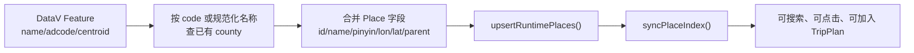

内部 `find` 回调用两种身份匹配：行政代码相同，或规范化名称相同。找到旧区县时保留其 ID/pinyin/其他字段，只用在线边界更新名称、代码和坐标；没找到时生成：

```text
{city.id}-district-{adcode 或 normalizeKey(name)}
```

然后设置父城市、所属省和 `placeType: "county"`，写入运行时覆盖层，而不是直接 `state.placeById.set()`。第 1 章解释过：统一经过 place index 才能同时重建搜索文本、别名和多张 Map。

### 10.5 `citySubareas(city)`

位置：`city-detail.js:564`

第一个 `filter` 找父城市 ID 相同且坐标有效的正式区县。有结果就返回。

若城市是 `isRegion`，第二个 `filter` 把同省其他城市当作下辖点。例如区域型入口不能得到标准区县时，仍能显示内部城市。否则返回空数组。

### 10.6 `hasCoordinates(place)`

位置：`city-detail.js:571`

把 lon/lat 转为 Number，再用 `Number.isFinite` 检查。字符串数字也能通过，空值、NaN 和 Infinity 不能通过。

### 10.7 `cityDetailQueryBounds(boundaryData, points)`

位置：`city-detail.js:490`

它递归扫描 GeoJSON 坐标和备用点，累计：

```js
{ south, west, north, east }
```

内部函数节点：

| 节点 | 作用 |
| --- | --- |
| `includePoint` | 校验一个 lon/lat 并扩展四个边界值 |
| `includeCoordinates` | 区分坐标对与更深层坐标数组，递归下钻 |
| `includeGeoJson` | 处理 FeatureCollection、Feature、GeometryCollection 和普通 geometry |
| `points.forEach` | 加入区县中心点等备用点 |

`data.features?.forEach(includeGeoJson)` 与 `data.geometries?.forEach(includeGeoJson)` 传的是已有函数引用，不创建新函数节点。

只有 south 已成为有限数才返回 bounds，否则 null。

### 10.8 `paddedQueryBounds(bounds, ratio)`

位置：`city-detail.js:519`

按边界自身宽高的比例向四周扩张。景点使用 4%，铁路和地铁使用 3%。

为什么要扩张：行政边界数据和 OSM 点坐标可能有轻微误差，车站也常位于城市边缘。为什么还要随后做点在多边形内过滤：bbox 是矩形，会包含行政区外角落。

---

## 11. 景点：精选目录与 OSM 怎样合并

### 11.1 四个 popup 安全函数

#### `landmarkPopupHtml(landmark, city)`

位置：`city-detail.js:322`

生成景点弹窗 HTML，包含城市、类型、名称、描述、可选地址、来源、坐标和可选网站。所有动态文字和 URL 在进入 HTML 前调用 `escapeHtml`。

网站链接固定使用 `target="_blank" rel="noopener"`，避免新页面取得原页面的 opener。

#### `landmarkDescription(landmark, city)`

位置：`city-detail.js:347`

优先使用清洗后的外部描述；没有时按 `scenic5a/scenic4a/museum/historic/building/park` 生成中文说明，最终退回通用景点描述。

这些文字是类型模板，不是假装掌握具体历史事实。

#### `cleanLandmarkText(value)`

位置：`city-detail.js:375`

- 转字符串；
- 连续空白压成一个空格；
- 空文本或纯 Wikidata ID（如 Q123）变成空；
- 超过 140 字符截到 138 后加省略号。

#### `safeExternalUrl(value)`

位置：`city-detail.js:381`

用 `new URL` 解析，只接受 `http:` 和 `https:`。`javascript:`、`data:`、相对路径和非法文本全部返回空字符串。

这四个函数组成“外部 OSM 文本 → 可执行 HTML”的安全边界。现有测试覆盖地图 Marker/Tooltip 与食行记转义，但没有直接调用景点 popup 的恶意 URL/HTML 用例，应补专门测试。

### 11.2 `catalogEntry(catalog, city)`

位置：`city-detail.js:575`

构造四个候选键：原 pinyin、规范化 pinyin、原城市名、规范化城市名；过滤空值，再用 `map` 查目录，`find(Boolean)` 取第一个命中。

只有 `map` 是新回调节点；`filter(Boolean)` 和 `find(Boolean)` 使用内置函数引用。

### 11.3 `cityLandmarks(city)`

位置：`city-detail.js:585`

分别取得基础目录与扩展目录，用 `mergeLandmarks` 合并。这个公开方法不发网络请求，因此侧栏随时可以快速取得精选候选。

### 11.4 `resolveCityLandmarks(...)`

位置：`city-detail.js:591`

1. 用 adcode 或 city.id 作 cache key；
2. 缓存命中直接返回；
3. `map` 给精选景点加 `source: "curated"`；
4. 请求 OSM 旅游点；
5. 有行政边界就用 `filter` 只保留边界内在线点；
6. 合并精选与在线结果；
7. session 当前才写缓存。

默认 `isCurrent`、精选 `map`、边界 `filter` 加主函数，共 4 个函数节点。

### 11.5 `fetchTourismLandmarksFromOsm(city, bounds)`

位置：`city-detail.js:629`

扩张 bbox 后构造 Overpass QL，查询：

- tourism 为 attraction、museum、theme_park、zoo、aquarium、viewpoint、gallery；
- 有 name 的 historic 节点、way 和 relation。

服务端最多输出 120 条，前端超时 6.5 秒。AbortError 静默降级，其他错误警告后返回空数组。

### 11.6 `normalizeOsmLandmarks(elements)`

位置：`city-detail.js:649`

`forEach` 回调逐条：

1. 取中文名、通用名或英文名；
2. node 用自身坐标，way/relation 用 center；
3. 缺名/坐标或不合旅游规则就跳过；
4. 以“规范化名称 + 三位小数坐标”去重；
5. 生成名称、坐标、类型、描述、地址、网站和 source。

地址中的 `[city, street, housenumber].filter(Boolean).join("")` 使用内置 Boolean，不产生新函数节点。

### 11.7 `isTourismLandmark(tags, name)`

位置：`city-detail.js:680`

排除酒店、餐厅、停车、厕所、售票处、入口、服务区和游客中心；若 tourism 值存在但不在允许集合，也排除。最后要求 tourism/historic 或中文名称含博物馆、景区、风景区之一。

这是启发式规则，不是 OSM 标准的完整验证器。它优先减少噪声。

### 11.8 `landmarkTypeFromTags(tags, name)`

位置：`city-detail.js:689`

按文本和标签推断类型，优先级为：5A → 4A → 博物馆/展馆 → 历史类 → 普通景点。无法分类也返回 scenic。

### 11.9 `mergeLandmarks(curated, live, city)`

位置：`city-detail.js:603`

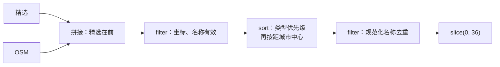

三个回调分别负责有效性过滤、排序、去重。精选不一定永远排在在线点前，因为真正排序先看类型；同类型再看距离。若同名，排序后靠前者保留。

### 11.10 `landmarkPriority(landmark)`

位置：`city-detail.js:617`

返回数字优先级：5A 为 0，4A 为 1，博物馆 2，历史 3，普通景点 4，公园 5，建筑 6，未知 9。数字越小越靠前。

### 11.11 `landmarkTypeLabel()` 与 `landmarkSymbol()`

位置：`city-detail.js:1072`、`1084`

前者把内部类型转成人类可读中文；后者转成地图符号，如 `5A`、`4A`、方框、菱形和圆点。未知类型分别退回“旅游地标”和圆点。

---

## 12. 火车站：精选候选为什么仍要过 12306 白名单

### 12.1 `cityStations(city)`

位置：`city-detail.js:701`

从内置 stationCatalog 查城市；没有就返回空数组。目录中的站点是候选，不会未经验证直接显示。

### 12.2 `fetchPassengerStationNames(options)`

位置：`city-detail.js:791`

这是全局 Promise 缓存：

1. 已有 `state.passengerStationNames` 就返回；
2. 没有 Promise 才 fetch 本地 `railway-stations-12306.json`；
3. 第一个 `.then` 验证 HTTP 并解析 JSON；
4. 第二个 `.then` 创建 Set，`forEach` 把 `name` 和 `stationName` 两种字段都标准化加入；
5. `.catch` 返回空 Set；
6. await 后仅在 session 当前时写值缓存。

主函数、默认 isCurrent、两个 `.then`、一个 `forEach`、一个 `.catch`，共 6 个节点。

Promise 本身即使失败也解析为空 Set，并永久留在 `passengerStationNamesPromise`。所以本页不会重试 12306 文件；若希望网络/静态服务短暂故障可恢复，需要在 catch 后清除 Promise 或区分 failure 状态。

### 12.3 `addPassengerStationName(names, name)`

位置：`city-detail.js:821`

调用 `normalizeStationLookupName`，非空就加入 Set。集中处理能保证原名和补“站”后的名字使用同一比较规则。

### 12.4 `resolveCityStations(...)`

位置：`city-detail.js:706`

1. 城市级 cache 命中就返回；
2. 取得内置候选和全局白名单；
3. 有内置候选：`filter` 只保留白名单认可的站，缓存并直接返回；
4. 无内置候选：白名单非空才查询 OSM；
5. 有边界时再 `filter` 到边界内；
6. session 当前才缓存。

主函数、默认 isCurrent 和两个 filter 回调，共 4 个节点。

为什么已有精选目录时不再请求 OSM：速度快、噪声少。代价是目录覆盖城市只能显示手工列出的少量站，不能自动补齐新站。

### 12.5 `fetchRailwayStationsFromOsm(...)`

位置：`city-detail.js:826`

把 bbox 扩 3%，查询 node/way/relation 的 `railway=station`，服务端最多 80 条，前端超时 6.5 秒。成功交给 `normalizeOsmStations`，失败返回空数组。

### 12.6 `normalizeOsmStations(elements, city, whitelist)`

位置：`city-detail.js:887`

`forEach` 回调依次检查：

- 必须是普通铁路站，不是地铁；
- 有坐标和名称；
- 规范名称以“站”结尾；
- 不是货场、车辆段、信号所等设施；
- 有白名单时必须匹配客运名单；
- “规范 key + 三位坐标”不能重复。

结果用 `sort` 按距城市中心排序，最多 24 个。共主函数、forEach、sort 三个节点。

### 12.7 七个铁路名称/分类辅助函数

| 函数 | 位置 | 规则 |
| --- | --- | --- |
| `isRailwayTrainStation` | 1006 | 排除 station=subway、subway=yes、地铁/轨交网络和名称，最后要求 railway=station |
| `normalizeStationName` | 1018 | 名称末尾没有“站”就补上 |
| `normalizeStationLookupName` | 1023 | 去掉末尾“站”，再规范化搜索文本 |
| `isPassengerStationName` | 1027 | lookup key 是否在 12306 Set |
| `isDisallowedRailwayFacilityName` | 1031 | 排除港区、货运、编组、线路所、车辆/机务等设施词 |
| `distanceToCity` | 1035 | 复用 mapController 的球面距离函数 |
| `hasCoordinates` | 571 | 公共坐标有限数检查，区县也使用 |

白名单匹配去掉“站”后比较，能让文件中的“北京”和 OSM 的“北京站”相等。

---

## 13. 地铁：完整网络优先，精选与 OSM 兜底

### 13.1 `loadMetroNetworkData(options)`

位置：`city-detail.js:734`

这是另一份全局 Promise 缓存：

- 有值缓存立即返回；
- 没有 Promise 才 fetch `./data/metro-networks.json`；
- `.then` 校验 HTTP 并解析 JSON；
- `.catch` 返回 `{ networks: {} }`；
- await 后仅在 session 当前时写 `metroNetworkData`。

主函数、默认 isCurrent、then、catch 共 4 个节点。

与 12306 名单一样，失败 Promise 不清除，本页不会自动重试。文件超过 700 KB，控制器公开了 prefetch，但当前 app 空闲阶段只加载 JS 模块，没有调用 prefetch；因此通常在首次城市详情时才下载。

### 13.2 `metroCityKeys(city)`

位置：`city-detail.js:752`

先规范化 pinyin 或城市名，再处理别名：

- hongkong → xianggang；
- harbin → haerbin；
- urumqi → wulumuqi；
- hohhot → huhehaote；
- xian 保持 xian。

最后用 Set 去重并返回“别名、规范 pinyin、规范中文名”候选键。

### 13.3 `resolveCityMetroNetwork(city, options)`

位置：`city-detail.js:724`

1. 定义空网络 `{ lines: [], stations: [] }`；
2. 等待本地大文件；
3. 文件或 networks 缺失就返回空网络；
4. 取得城市候选键；
5. `find` 第一个存在的网络；
6. 返回网络或空网络。

主函数、默认 isCurrent 和 find 回调，共 3 个节点。

### 13.4 `citySubwayStations(city)`

位置：`city-detail.js:787`

只从内置地铁站目录取数据，没有就返回空数组。

### 13.5 `resolveCitySubwayStations(...)`

位置：`city-detail.js:766`

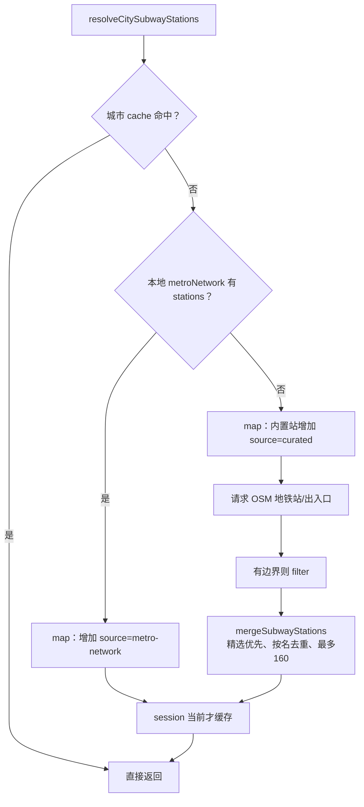

主函数、默认 isCurrent、两个 map 和边界 filter，共 5 个节点。

一个值得注意的分支：

```js
filteredStations.length ? filteredStations : liveStations
```

如果有行政边界、但所有在线点都在边界外，代码会退回未过滤的全部 liveStations。这样能避免“边界误差导致零站”，但也可能把邻市地铁站带进当前城市。更稳妥的做法是设置允许边界外的最大距离或记录降级标志，而不是从严格过滤直接跳到全收。

### 13.6 `fetchSubwayStationsFromOsm(city, bounds)`

位置：`city-detail.js:845`

查询六种 OSM 表达：正式地铁站、subway=yes、公共交通站、halt 和有名称的地铁出入口。

`["node", "way", "relation"].flatMap(...)` 为三种元素类型展开全部 filter；内层 `filters.map` 生成查询片段。它们是两个箭头回调节点。

服务端最多返回 220 条，前端超时 3.5 秒。失败返回空数组。

### 13.7 `normalizeOsmSubwayStations(elements, city)`

位置：`city-detail.js:917`

使用 `stationsByName` Map，而不是简单 Set：同名候选可能既有正式站点又有出入口，需要保留优先级更高的记录。

`forEach` 回调：

1. 用 `isSubwayStation` 判定；
2. 取 node 或 center 坐标；
3. 取名称并标准化；
4. 排除出口、电梯、通道、车辆段等；
5. 计算 lookup key 和 priority；
6. 同名已有更高或相同优先级就跳过；
7. 否则覆盖 Map。

最后：

- `map` 去掉内部 priority 字段；
- `sort` 按距城市中心排序；
- 最多保留 160 个。

主函数加三个回调，共 4 个节点。

### 13.8 `mergeSubwayStations(curated, live, city)`

位置：`city-detail.js:952`

三个回调依次：

1. 过滤无效名称/坐标；
2. 精选 source 优先，再按距城市中心排序；
3. 用规范站名 Set 去重。

最后最多 160 个。主函数加三个回调，共 4 个节点。

### 13.9 四个地铁分类与名称函数

#### `isSubwayStation(tags)` — 第 966 行

接受明确的 station=subway、subway=yes、地铁出入口，或 railway/public_transport 站且 network/operator 文本含 metro、subway、地铁、轨道交通。

#### `subwayStationPriority(tags, name)` — 第 981 行

正式 `station=subway + railway=station` 优先级 0；只有 station=subway 为 1；普通 railway=station 为 2；入口为 5；其他为 9。参数 `name` 当前没有使用，可以移除或用于进一步判别。

#### `normalizeSubwayStationName(name)` — 第 991 行

清空多余空格，删除英文 exit/entrance 后缀和中文字母数字出口后缀；空值返回空，末尾没有“站”就补上。

#### `isDisallowedSubwayStationName(name)` — 第 1002 行

排除出入口、出口、电梯、通道、换乘厅、停车场、车辆段和车库。正则里“停车场”重复出现，不影响结果但可清理。

---

## 14. 通用网络与几何函数

### 14.1 `fetchJsonWithTimeout(url, options, timeoutMs)`

位置：`city-detail.js:875`

1. 创建 `AbortController`；
2. `setTimeout` 箭头回调在超时后 abort；
3. fetch 时合并 options 并注入 signal；
4. 非 2xx 抛错；
5. 返回 `response.json()`；
6. `finally` 总是清除 timer。

主函数和定时器回调共 2 个节点。

它只被三个 Overpass 请求使用，DataV 与两个本地大 JSON 未使用统一超时。静态同源文件通常可靠，但 DataV 更应该复用它。

### 14.2 `pointInGeoJson(point, data)`

位置：`city-detail.js:1039`

按 GeoJSON 类型递归：

- FeatureCollection：`features.some`，任一 Feature 包含点即可；
- Feature：检查 geometry；
- Polygon：检查 rings；
- MultiPolygon：`coordinates.some`，任一 polygon 包含即可；
- 其他类型：false。

主函数和两个 some 回调，共 3 个节点。

### 14.3 `pointInPolygonCoordinates(point, rings)`

位置：`city-detail.js:1050`

先要求点位于第一条外环，再用 `rings.slice(1).some` 确认不位于任何洞内。主函数和一个 some 回调，共 2 个节点。

### 14.4 `pointInRing(point, ring)`

位置：`city-detail.js:1055`

使用射线法：从点向一个方向发射水平射线，遍历多边形每条边；每穿过一次边就翻转 `inside`。奇数次在内，偶数次在外。

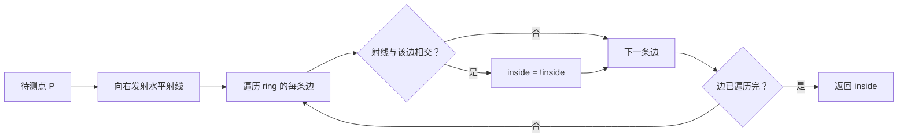

公式假设 ring 至少包含有效坐标对。调用方数据来自 GeoJSON，但函数自身没有完整结构验证；面对未知外部数据时应增加有限数和最小长度检查。

---

## 15. 计数、渲染装饰与预取

### 15.1 `cityDetailCounts(city)`

位置：`city-detail.js:1095`

返回：

- `subareas`：当前可用区县数；
- `landmarks`：地图已渲染计数，否则退回精选景点数；
- `stations`：地图已渲染火车站数；
- `subwayStations`：地图已渲染地铁站数；
- `foodArticles`：食行记控制器计数。

这里没有返回 `metroLines`，但 `renderPanel` 直接读取 `state.activeSubwayLineCount`，因此侧栏仍能显示线路数。接口字段分散是一个小型一致性问题。

### 15.2 `prefetch()` 方法

位置：`city-detail.js:1130`

用 `Promise.all` 并行预取地铁网络和 12306 名单。它是 AST 中唯一 FunctionExpression，也是公开 API 的第 8 个方法。

当前仓库没有调用 `controller.prefetch()`。如果目的是真正空闲预热，可在 `scheduleIdle` 创建 controller 后调用；如果担心空闲阶段额外下载约 1.3 MB，就应删除未使用方法或增加网络条件判断，避免 API 暗示与运行行为不一致。

### 15.3 `mapController.renderCityDetail()` 接收后的工作

地图渲染函数已在第 2 章逐节点解释。本章只列数据如何落图：

| 标准数据 | Leaflet 表现 |
| --- | --- |
| `sourceFeature` | 没有区县面时的城市轮廓 |
| `districts` | 可点击区县 GeoJSON 面与区名标签 |
| `subareas` | 无边界时的区县中心点 |
| `landmarks` | 带 symbol、typeLabel、popupHtml 的 Marker |
| `stations` | 火车站 Marker/标签 |
| `metroLines` | 每条线绘制底线和颜色前景线 |
| `subwayStations` | 按来源和线路色绘制站点 |
| `foodMarkers` | 安全 popup 的食行记 Marker |

渲染开始前再次检查 session 和 city.id，形成“详情控制器检查 + 地图控制器检查”双保险。

---

## 16. 缓存不是一种东西

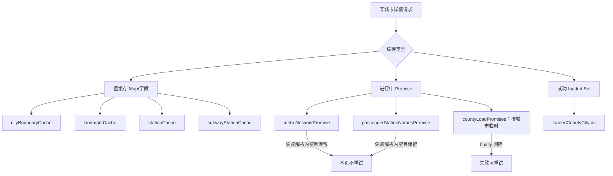

| 缓存 | key | 是否合并并发 | 失败是否缓存 | session 过期是否写值 |
| --- | --- | --- | --- | --- |
| `cityBoundaryCache` | adcode | 否 | 是，null | 否 |
| `landmarkCache` | adcode/cityId | 否 | 空结果可能缓存 | 否 |
| `stationCache` | adcode/cityId | 否 | 空结果可能缓存 | 否 |
| `subwayStationCache` | adcode/cityId | 否 | 空结果可能缓存 | 否 |
| `countyLoadPromises` | cityId | 是 | Promise 完成即删除 | 不合并、不标 loaded |
| `loadedCountyCityIds` | cityId | 不适用 | 只记录合法成功 | 不写 |
| `metroNetworkPromise` | 全局 | 是 | 是，空 networks | Promise 保留；值仅当前写 |
| `passengerStationNamesPromise` | 全局 | 是 | 是，空 Set | Promise 保留；值仅当前写 |

一致的缓存抽象会更容易理解：建议为每种资源显式记录 `idle/loading/ready/empty/error`，并统一 retry policy。当前“null 有时代表没数据，有时代表请求失败；空数组也可能是失败”会让 UI 无法准确说明降级原因。

---

## 17. 一次双击的完整时序

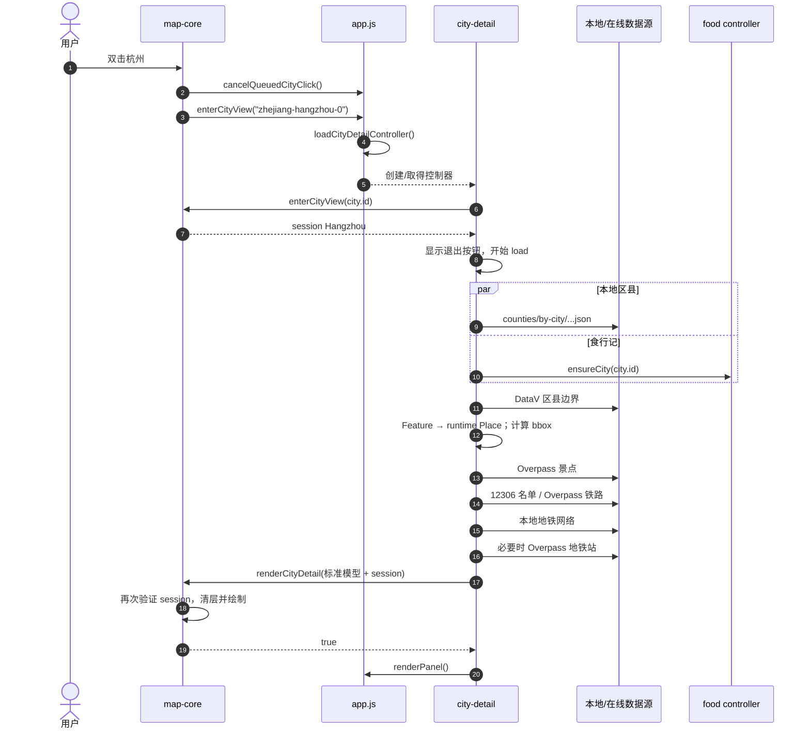

图中后四个数据请求按当前源码是顺序箭头，不是并行；这是理解首开城市详情性能的关键。

---

## 18. 58 个具名函数/方法索引

前文已经逐函数解释输入、输出、状态修改和设计理由。这里按源码顺序建立快速索引，避免遗漏。

| 行 | 函数/方法 | 所属职责 | 详解 |
| ---: | --- | --- | --- |
| 293 | `requiredFunction` | 依赖契约校验 | 7.1 |
| 299 | `createCityDetailController` | 控制器工厂与闭包边界 | 7.2–7.4 |
| 322 | `landmarkPopupHtml` | 安全景点弹窗 | 11.1 |
| 347 | `landmarkDescription` | 景点描述后备模板 | 11.1 |
| 375 | `cleanLandmarkText` | 外部文本压缩与截断 | 11.1 |
| 381 | `safeExternalUrl` | 只接受 HTTP(S) URL | 11.1 |
| 392 | `enterCityView` | 进入城市并等待详情 | 8.1 |
| 404 | `exitCityView` | 委托返回全国 | 8.2 |
| 408 | `loadCityDetail` | 详情总流水线 | 8.3–8.6 |
| 464 | `fetchCityDistrictBoundaries` | DataV 区县边界 | 10.2 |
| 483 | `districtLabelPoint` | 区县标签点 | 10.3 |
| 490 | `cityDetailQueryBounds` | 递归计算查询 bbox | 10.7 |
| 519 | `paddedQueryBounds` | bbox 外扩 | 10.8 |
| 531 | `districtPlaceFromFeature` | 边界 Feature 转 Place | 10.4 |
| 564 | `citySubareas` | 已知区县/区域子城市 | 10.5 |
| 571 | `hasCoordinates` | 坐标有限数检查 | 10.6 |
| 575 | `catalogEntry` | 多键查询内置目录 | 11.2 |
| 585 | `cityLandmarks` | 读取精选景点 | 11.3 |
| 591 | `resolveCityLandmarks` | 景点缓存与来源协调 | 11.4 |
| 603 | `mergeLandmarks` | 景点过滤、排序、去重 | 11.9 |
| 617 | `landmarkPriority` | 景点类型优先级 | 11.10 |
| 629 | `fetchTourismLandmarksFromOsm` | Overpass 景点请求 | 11.5 |
| 649 | `normalizeOsmLandmarks` | OSM 景点标准化 | 11.6 |
| 680 | `isTourismLandmark` | 排除非旅游噪声 | 11.7 |
| 689 | `landmarkTypeFromTags` | OSM 标签推断景点类型 | 11.8 |
| 701 | `cityStations` | 读取精选铁路站候选 | 12.1 |
| 706 | `resolveCityStations` | 铁路站缓存和来源协调 | 12.4 |
| 724 | `resolveCityMetroNetwork` | 城市地铁网络匹配 | 13.3 |
| 734 | `loadMetroNetworkData` | 全局地铁文件 Promise 缓存 | 13.1 |
| 752 | `metroCityKeys` | 城市拼音别名 | 13.2 |
| 766 | `resolveCitySubwayStations` | 地铁站来源协调 | 13.5 |
| 787 | `citySubwayStations` | 读取精选地铁站 | 13.4 |
| 791 | `fetchPassengerStationNames` | 12306 名单 Promise 缓存 | 12.2 |
| 821 | `addPassengerStationName` | 加入规范站名 Set | 12.3 |
| 826 | `fetchRailwayStationsFromOsm` | Overpass 铁路站请求 | 12.5 |
| 845 | `fetchSubwayStationsFromOsm` | Overpass 地铁站请求 | 13.6 |
| 875 | `fetchJsonWithTimeout` | 带 AbortController 的 JSON 请求 | 14.1 |
| 887 | `normalizeOsmStations` | OSM 铁路站标准化 | 12.6 |
| 917 | `normalizeOsmSubwayStations` | OSM 地铁站标准化 | 13.7 |
| 952 | `mergeSubwayStations` | 精选/在线地铁站合并 | 13.8 |
| 966 | `isSubwayStation` | 地铁标签判定 | 13.9 |
| 981 | `subwayStationPriority` | 同名地铁候选优先级 | 13.9 |
| 991 | `normalizeSubwayStationName` | 清出口后缀并补“站” | 13.9 |
| 1002 | `isDisallowedSubwayStationName` | 排除出口/设施名称 | 13.9 |
| 1006 | `isRailwayTrainStation` | 普铁/地铁分类 | 12.7 |
| 1018 | `normalizeStationName` | 补“站”后缀 | 12.7 |
| 1023 | `normalizeStationLookupName` | 建立比较 key | 12.7 |
| 1027 | `isPassengerStationName` | 12306 白名单判断 | 12.7 |
| 1031 | `isDisallowedRailwayFacilityName` | 排除货运/车辆设施 | 12.7 |
| 1035 | `distanceToCity` | 复用地图球面距离 | 12.7 |
| 1039 | `pointInGeoJson` | GeoJSON 类型递归 | 14.2 |
| 1050 | `pointInPolygonCoordinates` | 外环和洞判断 | 14.3 |
| 1055 | `pointInRing` | 射线法 | 14.4 |
| 1072 | `landmarkTypeLabel` | 景点类型中文标签 | 11.11 |
| 1084 | `landmarkSymbol` | 景点地图符号 | 11.11 |
| 1095 | `cityDetailCounts` | 侧栏详情计数 | 15.1 |
| 1105 | `ensureCityCounties` | 区县分片并发、校验、合并 | 10.1 |
| 1130 | `prefetch` | 预取两份全局大数据 | 15.2 |

---

## 19. 52 个箭头回调节点索引

### 19.1 生命周期、区县与查询范围：14 个

| 行 | 回调 | 作用 |
| ---: | --- | --- |
| 409 | `isCurrent` | 检查当前详情 session |
| 423 | `districtData.features.map` | Feature 转标准 district 描述 |
| 450 | `landmarks.map` | 增加符号、类型标签和 popup |
| 464 | 默认 `isCurrent` | 边界函数脱离 session 时默认允许 |
| 492 | `includePoint` | 扩展 bbox |
| 499 | `includeCoordinates` | 递归坐标数组 |
| 507 | `includeGeoJson` | 递归 GeoJSON 包装类型 |
| 515 | `points.forEach` | 加入备用区县点 |
| 538 | `citySubareas.find` | 按 code 或名称匹配旧区县 |
| 565 | `state.counties.filter` | 当前城市有效区县 |
| 567 | `state.cities.filter` | 区域型城市的同省子城市 |
| 582 | `keys.map` | 目录候选键查值 |
| 1105 | 默认 `isCurrent` | 区县显式加载默认允许应用结果 |
| 1109 | `Promise.finally` | 删除按城市进行中 Promise |

### 19.2 景点：11 个

| 行 | 回调 | 作用 |
| ---: | --- | --- |
| 591 | 默认 `isCurrent` | 景点 resolver 的缓存写保护 |
| 595 | `cityLandmarks.map` | 标记 curated 来源 |
| 597 | `live.filter` | 在线点限制在行政边界 |
| 606 | 合并后第一个 `filter` | 景点名称和坐标有效性 |
| 607 | `sort` | 类型优先，再按距离 |
| 608 | 第二个 `filter` | 按规范名称去重 |
| 653 | `elements.forEach` | OSM 元素转景点 |
| 1042 | `features.some` | 任一 Feature 包含点 |
| 1046 | `coordinates.some` | 任一 Polygon 包含点 |
| 1052 | `inner rings.some` | 点是否落入洞 |
| 877 | `setTimeout` | 超时后 abort 网络请求 |

几何与 timeout 回调也服务站点，但在调用链中首先被景点使用；这里按源码功能集中列一次。

### 19.3 铁路站：10 个

| 行 | 回调 | 作用 |
| ---: | --- | --- |
| 706 | 默认 `isCurrent` | 铁路 resolver 缓存写保护 |
| 713 | `curatedStations.filter` | 精选候选通过 12306 白名单 |
| 719 | `liveStations.filter` | 在线铁路站限制在边界 |
| 791 | 默认 `isCurrent` | 全局名单值缓存写保护 |
| 797 | 第一个 `.then` | 校验响应并解析 JSON |
| 801 | 第二个 `.then` | 构建站名 Set |
| 803 | `stations.forEach` | 加入原名和规范名 |
| 811 | `.catch` | 失败降级为空 Set |
| 892 | `elements.forEach` | OSM 元素转铁路站 |
| 913 | `sort` | 按距城市中心排序 |

### 19.4 地铁：15 个

| 行 | 回调 | 作用 |
| ---: | --- | --- |
| 724 | 默认 `isCurrent` | 地铁网络解析的值缓存保护 |
| 730 | `keys.find` | 匹配第一个城市网络键 |
| 734 | 默认 `isCurrent` | 全局地铁文件值缓存保护 |
| 738 | `.then` | 校验并解析地铁 JSON |
| 742 | `.catch` | 失败变成空 networks |
| 766 | 默认 `isCurrent` | 地铁站 cache 写保护 |
| 771 | `metroNetwork.stations.map` | 标记完整网络来源 |
| 779 | `citySubwayStations.map` | 标记精选来源 |
| 781 | `liveStations.filter` | 在线地铁站限制在边界 |
| 861 外层 | `types.flatMap` | 展开 node/way/relation |
| 861 内层 | `filters.map` | 展开六种地铁选择器 |
| 920 | `elements.forEach` | OSM 候选按站名和优先级入 Map |
| 947 | `values.map` | 删除内部 priority 字段 |
| 948 | `sort` | 按距城市中心排序 |
| 955 | 合并第一个 `filter` | 有效名称和坐标 |

### 19.5 地铁合并余下 2 个

| 行 | 回调 | 作用 |
| ---: | --- | --- |
| 956 | `sort` | curated 优先，再按距离 |
| 957 | 第二个 `filter` | 地铁站按 lookup key 去重 |

各 resolver 的默认 `() => true` 都是独立的运行时函数，已经分别列在 464、591、706、724、734、766、791、1105，不能因为代码相同而合并计数。

### 19.6 AST 分组复算

为避免上面按业务阅读时同一行的嵌套回调造成误读，按互不重叠源码范围复算：

| 源码范围 | 主题 | 函数节点数 |
| --- | --- | ---: |
| 293–321 | 契约与控制器工厂 | 2 |
| 322–390 | popup、描述与 URL 安全 | 4 |
| 392–462 | 进入、退出与详情总流水线 | 6 |
| 464–529 | 边界请求与 bbox | 9 |
| 531–627 | Place、目录和合并基础 | 18 |
| 629–699 | OSM 景点 | 5 |
| 701–732 | 铁路/地铁 resolver 入口 | 8 |
| 734–789 | 地铁本地网络与站点协调 | 11 |
| 791–824 | 12306 名单 | 7 |
| 826–885 | 两类 OSM 站点请求与超时 | 6 |
| 887–1037 | 站点标准化与分类 | 21 |
| 1039–1070 | 点在多边形内 | 6 |
| 1072–1103 | 标签、符号和计数 | 3 |
| 1105–1132 | 区县加载与 prefetch | 4 |
| **合计** | **完整 `city-detail.js`** | **110** |

其中具名函数/方法 58 个，箭头回调 52 个。

### 19.7 `app.js` 专用适配层：18 个节点

| 根函数 | 节点构成 | 数量 |
| --- | --- | ---: |
| `loadCityDetailModule` | 主函数 | 1 |
| `loadCityDetailController` | 主函数、then、getPlaceIndex、catch | 4 |
| `reportCityDetailModuleFailure` | 主函数 | 1 |
| `queueCityDetailModuleRefresh` | 主函数、then、finally | 3 |
| `enterCityView` | 主函数 | 1 |
| `exitCityView` | 主函数 | 1 |
| `loadCityDetail` | 主函数 | 1 |
| `citySubareas` | 主函数、两个 filter | 3 |
| `cityLandmarks` | 主函数 | 1 |
| `cityDetailCounts` | 主函数 | 1 |
| `ensureCityCounties` | 主函数 | 1 |
| **合计** | **城市详情适配边界** | **18** |

本章新覆盖总数为 `110 + 18 = 128`。`map-core.js` 对应的 session 和渲染函数已计入第 2 章的 88 个节点，不重复计数。

---

## 20. 测试已经证明什么

### 20.1 自动化证据

| 测试 | 直接证明的事实 |
| --- | --- |
| `module-boundaries.test.mjs` 模块所有权 | 详情模块只有一个动态 import；网络地址和精选目录不留在 app；详情模块不导入 app |
| 控制器 fallback 测试 | 无浏览器 DOM 和真实网络时，注入假依赖仍可取得杭州区县、西湖精选景点和计数 |
| 地图详情渲染测试 | 标准模型能画边界、景点、铁路、地铁线/站和食行记；区县点击能回到业务回调；退出/销毁能清理 |
| generation 测试 | A#1、B#2、A#3 只接受 A#3；返回全国后拒绝旧结果 |
| `rendered-html.test.mjs` 运行时地点测试 | 在线区县通过 `upsertRuntimePlaces + syncPlaceIndex`，不绕过索引直接改 Map |
| 区县重试策略测试 | payload 校验先于 loaded 标记；进行中 Promise 在 finally 删除 |
| `browser-performance.test.mjs` | 页面能完整水合区县/食行记；选择福清可进入城市视图、显示内容并正常退出 |

本章完成时实际运行：`npm test` 共 200 项全部通过；`npm run test:browser` 共 3 个真实浏览器场景全部通过。

### 20.2 目前没有被直接行为测试覆盖的部分

- DataV 请求超时、null 缓存和重试策略；
- 景点 popup 对恶意 description/address/website 的组合输入；
- OSM 景点与站点的全部过滤正则；
- 12306 文件失败时精选站被清空的产品预期；
- 地铁边界过滤为零后退回全部 live 站的行为；
- bbox 递归对 GeometryCollection 和异常坐标的处理；
- Polygon 洞、MultiPolygon、边界点的几何用例；
- 同城市并发景点/站点请求是否重复；
- `prefetch` 当前未被调用；
- 详情首开各阶段的实际耗时与最长等待预算。

因此这些结论有源码证据，但还不能称为受回归测试保护。最有效的改进是把标准化、合并和几何函数移到独立纯模块并导出测试，而不是通过正则扫描私有函数源码。

---

## 21. 设计评价：为什么这样做，怎样更好

### 21.1 应保留的设计

1. 数据控制与 Leaflet 渲染分离。
2. 外部能力通过依赖注入进入，测试不需要真实地图和网络。
3. generation 而不只是 cityId 保护 A-B-A 异步竞态。
4. 在线结果只在当前 session 写缓存。
5. 区县 payload 校验成功后才标记 loaded，失败 Promise 可重试。
6. 外部景点文本和 URL 在 HTML sink 前清洗、转义。
7. 精选目录、权威名单和 OSM 组合，兼顾速度、准确性和覆盖面。

### 21.2 第一优先级：并行和取消

边界完成后并行景点、铁路和地铁网络；地铁站只依赖地铁网络结果。再为整个详情 session 建立 AbortController，离开城市时取消旧请求。

目标不是“所有请求一起发”，而是按真实依赖画 DAG 后并行无依赖分支：

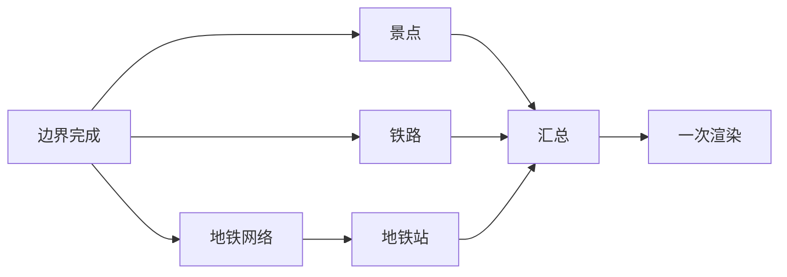

### 21.3 第二优先级：拆分大静态数据

为一个城市下载整份 39 城地铁网络和 3,367 条全国站名，首次成本接近 1.3 MB。可像区县与食行记一样构建：

- `metro/by-city/{cityId}.json`；
- 按城市或省份拆分的客运站白名单；
- 小型 manifest 负责 cityId → 文件映射和版本。

这样 `prefetch` 才能按用户当前城市做低成本预热。

### 21.4 第三优先级：统一缓存状态与重试

把 null/空数组/空 Set 从“数据状态”升级成明确结果：

```js
{ status: "ready" | "empty" | "error", value, error, fetchedAt }
```

再统一决定：网络错误多久重试、确定空数据多久缓存、session 过期是否保留可共享响应。UI 也能显示“暂无数据”和“暂时加载失败”的区别。

### 21.5 第四优先级：拆出纯领域模块

当前所有函数都嵌套在 1,134 行工厂中，只有 8 个门面方法可测。建议拆成：

```text
city-detail-controller.js   生命周期与协调
city-detail-sources.js      URL、fetch、缓存策略
city-detail-normalize.js    景点/站点纯转换
geo-point-in-polygon.js     几何纯函数
city-detail-catalogs.js     精选静态数据
```

拆分后仍保持 app → controller → map 的边界，不需要改变用户行为。

### 21.6 其他明确改进

- 进入城市后立即重置详情计数并渲染“正在加载”，不要等整条网络流水线结束才更新侧栏；
- `districtData.features.map` 目前每处理一个区县都执行一次 `upsertRuntimePlaces + syncPlaceIndex`，应先批量生成 Place，再只重建一次索引；
- 对 mapController 的 6 个方法做创建时契约验证；
- 移除未使用的 `municipalities`、注入 `hasCoordinates` 和 `subwayStationPriority` 的 name 参数；
- 删除重复正则词项；
- 移除 `queueCityDetailModuleRefresh` 的第二次日历渲染；
- 给 DataV 增加超时；
- 对地铁边界外 fallback 使用距离阈值；
- 为第三方 DataV/Overpass 请求提供隐私与来源说明；
- 在生成流程记录目录数据版本和更新时间。

---

## 22. 建议你怎样亲手读本章源码

1. 先读文件最后的 8 个公开方法，不要从 45 条景点数据开始。
2. 跳到 `enterCityView()` 和 `loadCityDetail()`，画出每个 await。
3. 对每个 await 写一句“用户此时可能做什么”，理解 isCurrent。
4. 读 `ensureCityCounties()`，区分 Promise Map 与 loaded Set。
5. 选一条景点链：catalog → OSM → normalize → boundary filter → merge。
6. 选一条铁路链：12306 Set → curated/OSM → normalize → whitelist。
7. 选一条地铁链：metro network → fallback OSM → name priority → merge。
8. 最后读三个点在多边形函数，用纸画一个有洞的方形验证奇偶规则。

如果你只记住一条异步工程原则，请记住：

> 请求成功不等于结果仍然有资格生效；异步结果必须携带并验证它所属的用户意图版本。

## 23. 下一章预告

下一章拆解食行记：文章摘要与按城市分片怎样合并，地点推荐怎样避免旧异步结果覆盖新选择，文章卡片和地图 popup 又怎样守住 HTML 安全边界。

回看：[第 3 章：一次点击怎样变成行程、路线、侧栏和本地存档](./03-click-to-trip.md)

继续阅读：[第 5 章：食行记怎样变成搜索词、推荐卡和地图标记](./05-food-content.md)
