# 第 5 章：食行记怎样变成搜索词、推荐卡和地图标记

> 本章完整拆解 `public/static-site/food-content.js`，并追踪它与 `app.js`、`app-data.js`、`city-detail.js`、`map-core.js` 以及两段数据生成脚本的协作关系。主文件共 357 行、13,533 字节；AST 识别出 49 个函数节点：25 个函数声明、4 个对象方法和 20 个箭头函数。正文会逐个解释这 49 个节点，而不是只讲两个导出函数。

## 1. 学完本章能回答什么

1. 一篇微信文章怎样变成程序能搜索和绘图的数据？
2. 为什么既有 416,615 字节的全国 summary，又有 236 个按城市拆分的 JSON？
3. summary 和城市分片先后到达时，为什么最终结果应该一致？
4. `Map`、`Set` 和普通数组在食行记模块里分别保存什么？
5. 为什么区县摘要尚未加载时，区县文章仍可能先被接纳？
6. 食物名称怎样进入城市和区县的搜索关键词？
7. 快速切换地点时，旧异步结果为什么不会覆盖新侧栏？
8. 同一城市同时被请求两次时，为什么只发一个请求？
9. 文章卡片、地图 popup 和地图 tooltip 分别在哪里生成，谁负责转义？
10. 为什么本地开发与线上环境会选择不同的文章链接？
11. 当前发布物中的本地阅读页和封面为什么实际上打不开？
12. 这套设计哪里可靠，哪里值得重新设计？

## 2. 五问核验后的架构结论

| 核验问题 | 结论 |
| --- | --- |
| 食行记模块真正拥有什么？ | 它拥有文章的合并规则、文章索引、搜索词增强、文章链接选择、侧栏卡片模型和地图标记描述；它不拥有 Leaflet 图层，也不拥有全局行程。 |
| 为什么要分 summary 与城市分片？ | summary 让全国搜索、计数、侧栏卡片和行程美食推荐可用；城市分片只在进入城市时补齐 URL、坐标、作者和图片元数据，以免首屏下载完整重记录。 |
| 谁是文章事实来源？ | 运行时以 `createFoodStore()` 内的 `store.articles` 为统一集合；summary 与城市分片只是两个输入层，城市分片的同 ID 字段优先。 |
| 异步怎样避免串台？ | 侧栏用 `createLatestAsyncRefresh()` 的 generation；城市分片用城市详情 session 传入的 `isCurrent()`。前者保护“显示哪个地点”，后者保护“哪个城市详情仍有效”。 |
| 安全边界在哪里？ | URL 先分为允许的 `http/https` 外链和同源本地路径，所有进入 `innerHTML`/popup 的文本都应转义；地图 tooltip 的标题则由 `map-core.js` 在最终落点再次转义。 |

一句话总结：

> 食行记模块像一间资料卡片室：summary 先送来全国索引卡，城市分片再补齐某座城市的完整档案；store 按文章 ID 合档，controller 再把档案投影成搜索词、推荐卡和地图标记。

## 3. 先认识本章中的 JavaScript 概念

### 3.1 `Map` 不是地图画面

本章大量出现 `new Map()`。这里的 `Map` 是 JavaScript 的“键值表”，不是 Leaflet 地图。

```js
const byId = new Map();
byId.set("article-1", article);
const result = byId.get("article-1");
```

它像带唯一编号的档案柜：给出文章 ID，可以直接取回文章。

### 3.2 `Set` 是不重复名单

```js
const loadedCityIds = new Set();
loadedCityIds.add("guangdong-guangzhou-0");
loadedCityIds.has("guangdong-guangzhou-0");
```

这里不需要为城市保存额外值，只需要回答“这个城市是否已完成有效加载”，所以 `Set` 比对象更贴切。

### 3.3 工厂与闭包

`createFoodStore()` 和 `createFoodController()` 都是工厂函数：调用工厂得到一个对象。工厂内部的变量不会暴露给所有代码，只能通过返回的方法访问。

```text
createFoodController()
├── 私有：loadedCityIds
├── 私有：cityLoadPromises
├── 私有：popupHtml()
└── 公开：ensureCity()、renderPanel()、renderMarkers()……
```

这种“函数记住创建时环境”的能力叫闭包。它相当于给每个 controller 配一间有门禁的资料室。

### 3.4 `map`、`filter`、`flatMap`、`forEach`

- `map`：每项变成另一项，数量通常不变；
- `filter`：只保留符合条件的项；
- `flatMap`：每项可以变成多项，再把结果摊平；
- `forEach`：逐项执行动作，不用它的返回值。

例如三篇文章各取三个食物名：

```js
articles.slice(0, 3).flatMap((item) => item.foods.slice(0, 3));
```

### 3.5 Promise 缓存

`cityLoadPromises` 保存的不是已经完成的数据，而是“正在加载的任务”。两个调用同时请求广州时，它们等待同一个 Promise，避免发两次网络请求。

### 3.6 XSS 与最终输出点

如果把文章标题直接放入 `innerHTML`，恶意标题可能被浏览器当成标签执行。项目用 `escapeHtml()` 把 `<` 变成 `&lt;` 等文本实体。

安全规则不是“数据进 store 时转义一次”，而是：

> 原始数据保持原义；每次进入 HTML、属性、URL 或第三方组件之前，按该输出位置的规则处理。

---

## 4. 六个模块怎样分工

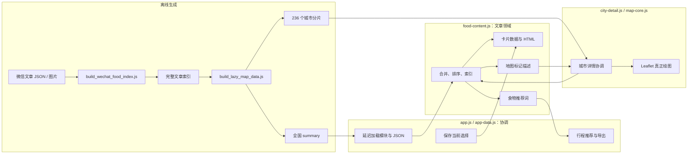

依赖方向有意保持单向：

- `app.js` 动态导入 `food-content.js`，后者不反向导入 `app.js`；
- `food-content.js` 产出 marker 描述，不调用 `L.marker()`；
- `city-detail.js` 决定何时需要某城市文章；
- `map-core.js` 才拥有 Leaflet pane、marker、tooltip 和 popup；
- 离线脚本生成 JSON，不参与浏览器运行。

测试 `module-boundaries.test.mjs` 会检查：`app.js` 只有一个记忆化的食行记动态导入，合并逻辑不能偷偷搬回 `app.js` 或 `app-data.js`。

## 5. 数据从微信文章来到浏览器的完整旅程

### 5.1 生成流水线

README 给出的预期流程是：

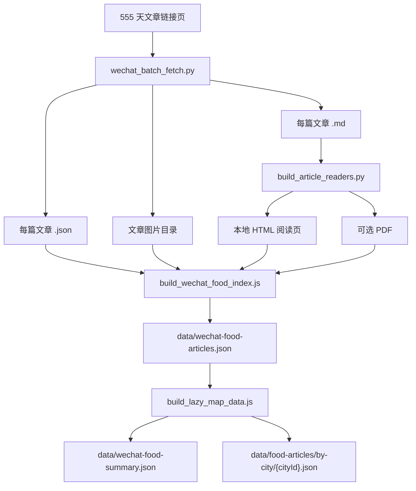

这是一条“构建时处理、运行时读取”的管道。浏览器不会现场解析微信文章，也不会现场猜城市。

### 5.2 当前数据规模

| 数据 | 当前规模 | 运行时用途 |
| --- | ---: | --- |
| 完整文章索引 | 846,606 字节，456 篇 | 城市分片的生成源；页面本身不直接加载 |
| 全国 summary | 416,615 字节，456 篇 | 全国搜索、文章计数、侧栏卡片、食物推荐 |
| 城市分片 | 236 个文件，共 673,745 字节 | 进入城市后补 URL、坐标和完整元数据 |
| 匹配到城市的文章 | 377 篇 | `placeType: "city"` |
| 匹配到区县的文章 | 79 篇 | `placeType: "county"` |
| 地点索引 | 281 个 placeId | 城市和区县的精确文章归属 |
| 未匹配记录 | 7 条 | 保留在生成报告中，不进入运行时文章集合 |
| 食物词条 | 2,378 次，2,022 个不同文本 | 搜索增强和行程推荐 |

236 个城市分片恰好覆盖 summary 里的 236 个不同 `cityId`，文章总数也都是 456；当前没有漏分片或数量不一致。

最小分片约 1.3 KB，最大分片 9.2 KB。进入一座城市只追加几 KB，比再取 846 KB 完整索引合理得多。

### 5.3 summary 与完整记录的字段差异

一条 summary 保留 14 个字段：

| 字段 | 含义 | 为什么 summary 需要 |
| --- | --- | --- |
| `id` | 文章唯一编号 | 合并和去重的主键 |
| `day` | 食行记天数 | 排序和“第 N 天”标签 |
| `title` | 标题 | 卡片、搜索 |
| `description` | 摘要 | 卡片兜底、搜索 |
| `foods` | 食物名数组 | 搜索和行程推荐 |
| `locationText` | 标题解析出的地点文字 | 卡片副标题 |
| `placeId/placeType` | 精确地点归属 | 区分城市与区县 |
| `cityId/cityName` | 所属城市 | 城市聚合与城市详情 |
| `countyName/province` | 行政上下文 | 搜索和展示 |
| `coverImage` | 本地封面路径 | 本地卡片封面 |
| `readerPath` | 本地阅读页/PDF 路径 | 没有外链时打开文章 |

完整记录再多 10 个字段：

```text
author, url, markdownPath, htmlPath, pdfPath,
imageDir, imageCount, lon, lat, matchedBy
```

最关键的差别是：summary 没有 `lat/lon` 和微信 `url`。所以它足以显示列表和推荐，却不足以生成地图文章点；进入城市后必须加载完整分片。

### 5.4 summary 中还有两套未被运行时使用的索引

summary 自带 `byCity` 和 `byPlace`，共约 78,320 字节。但当前 `food-content.js` 不读取它们，而是根据 `articles` 再构建两个 `Map`。

```text
summary 总体                    416,614 字节（JSON.stringify 口径）
articles 数组                   337,433 字节
byCity + byPlace                 78,320 字节
去掉两套索引后的 summary         338,295 字节
```

这不是功能错误，但意味着约 19% 的 summary 传输是重复索引。如果浏览器继续自行构建 Map，生成脚本可以不输出这两套索引；如果保留它们，controller 就应真正利用它们。

### 5.5 当前生成与发布链有两个真实缺口

这里必须区分“设计意图”和“当前仓库实际状态”。

第一，`package.json` 声明了 `"type": "module"`，但两个 `.js` 生成脚本仍使用：

```js
const fs = require("fs");
const root = path.resolve(__dirname, "..");
```

在 ESM `.js` 中，`require` 和 `__dirname` 都不存在。README 建议的 `node scripts\build_*.js` 命令因此缺少可执行前提。应改为 ESM `import` + `import.meta.url`，或把脚本改名为 `.cjs`。

第二，脚本写入根目录 `data/`，而 iframe 页面读取的是 `public/static-site/data/`。当前两套食行记 JSON 的 SHA-256 内容一致，但仓库里没有自动同步步骤；以后重建根目录数据，不会自动更新真正发布的数据。

更直接的发布缺口是：456 条 `readerPath` 和 456 条 `coverImage` 都指向 `exports/wechat_articles/...`，但 `public/static-site/exports/wechat_articles/` 不存在。于是：

- 本地开发环境会优先选择本地阅读页和封面，但这些请求会 404；
- 线上加载城市完整分片后，可以优先跳微信外链；
- 线上只拿到 summary、尚未加载城市分片时，没有外链，仍会得到不存在的本地路径；
- 现有浏览器测试只检查卡片可见，没有点击文章，也忽略图片资源的 404，所以没有发现它。

这是发布资源链的问题，不是 `safeLocalPath()` 的算法问题。

---

## 6. 启动时，食行记究竟何时加载

“动态导入”不等于“等用户第一次点食行记才加载”。当前真实顺序如下：

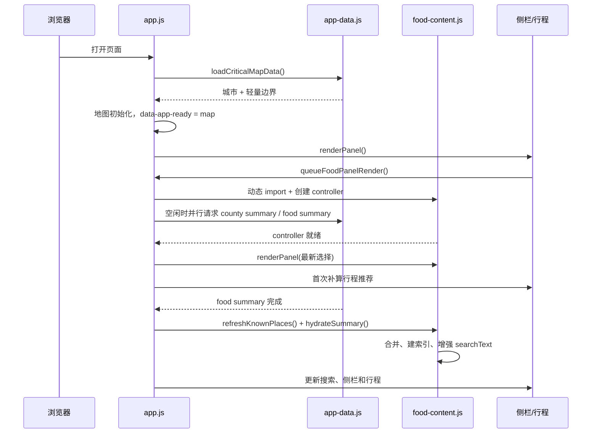

关键事实有三个：

1. 关键地图数据先完成，食行记失败不应阻止地图可用；
2. 第一次主面板渲染已经调用 `queueFoodPanelRender()`，所以模块很早就开始动态导入；
3. 文章 summary 才是真正安排在 `scheduleIdle()` 里的可选数据。

`initApp()` 在首次 `renderPanel()` 后又显式调用一次 `queueFoodPanelRender()`。这会产生两个 generation，但 `loadFoodController()` 记忆化了 Promise，所以模块只导入一次；较旧的那次侧栏应用会被判定为 stale。第二次调用没有功能必要，可以删除以减少理解成本。

## 7. `createFoodStore()`：文章事实仓库

位置：`food-content.js:52-147`

### 7.1 对外四个字段

```js
const store = {
  articles: [],
  byId: new Map(),
  byCity: new Map(),
  byPlace: new Map(),
  refreshKnownPlaces() { ... },
  hydrate() { ... }
};
```

| 字段 | 键 | 值 | 用途 |
| --- | --- | --- | --- |
| `articles` | 数组下标 | 文章对象 | 按 day、ID 排序后的全集 |
| `byId` | article ID | 一篇文章 | 合并、调试、精确查询 |
| `byCity` | city ID | 文章数组 | 城市卡片、城市 marker、计数 |
| `byPlace` | place ID | 文章数组 | 区县卡片、区县搜索徽标 |

### 7.2 三个私有辅助结构

| 结构 | 保存什么 | 为什么不公开 |
| --- | --- | --- |
| `sourceById` | 每篇文章当前是 summary 还是 city 版本 | 只服务合并优先级 |
| `baseSearchTextByPlace` | 地点尚未加入文章词时的原始搜索文本 | 防止每次重建把文章词重复叠加 |
| `placeObjectById` | 上次见到的地点对象引用 | 判断 Place 是否被 place index 换成了新对象 |

### 7.3 `hydrate()` 的五道门

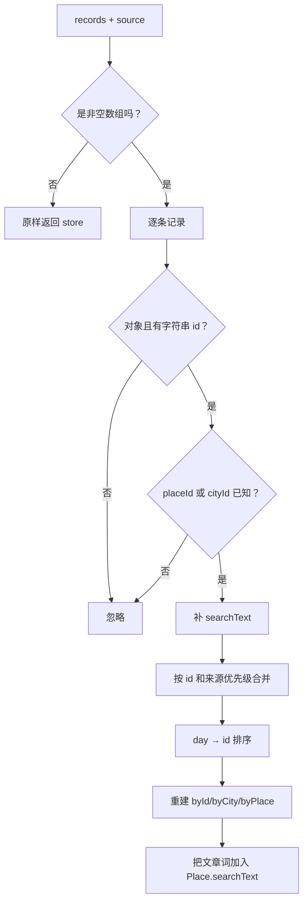

“placeId 或 cityId 已知”很重要。区县 summary 可能尚未加载，`placeId` 暂时不在地点表里；只要它所属的城市已经存在，文章仍会被接纳。等区县 Place 加载后，`refreshKnownPlaces()` 会把已有文章词补到新对象上。

### 7.4 合并矩阵

同一篇文章由 `id` 对齐，城市分片永远比 summary 更丰富：

| 旧记录 | 新记录 | 合并表达式 | 胜出的同名字段 |
| --- | --- | --- | --- |
| 无 | 任意 | `normalizedRecord` | 新记录 |
| summary | city | `{ ...previous, ...normalizedRecord }` | city |
| city | summary | `{ ...normalizedRecord, ...previous }` | city |
| summary | summary | `{ ...previous, ...normalizedRecord }` | 后到 summary |
| city | city | `{ ...previous, ...normalizedRecord }` | 后到 city |

这保证两种到达顺序得到相同的丰富字段：

```text
summary → city  = city 覆盖 summary
city → summary  = 先放 summary，再让已有 city 覆盖回来
```

测试直接比较了两种顺序的最终数组。

### 7.5 排序规则

```js
(finiteArticleDay(left.day) || 0) - (finiteArticleDay(right.day) || 0)
```

合法正数 day 升序；空白、非数字、零和负数变成 `null`，排序时按 0，所以排在有日期文章前面。day 相同再按 ID 排序，保证结果稳定。

如果产品更希望“无日期文章放最后”，应把无效值映射为 `Number.POSITIVE_INFINITY`，而不是 0。

### 7.6 搜索词增强为什么需要保存 base

假设广州原始 `searchText` 是：

```text
广州 guangzhou 广东
```

文章加入后可能变成：

```text
广州 guangzhou 广东 肠粉 牛三星 萝卜牛腩 早茶 煲仔饭
```

如果下一次直接以这个增强结果为基础再拼一次，文本会不断重复。`captureBaseSearchText()` 只在地点对象引用变化时记录新的原始文本；`enrichKnownPlaces()` 每次都从 base 重新计算。

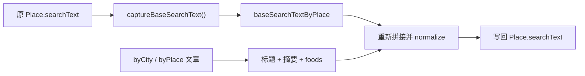

这里会直接修改 Place 对象。好处是现有搜索代码不用知道食行记；代价是 food store 与 place index 共享可变对象，数据归属不够纯粹。

---

## 8. Store 区域的 22 个函数节点逐个解释

下表覆盖 `food-content.js:1-147` 的全部函数节点，包括短箭头回调。

| 行 | 函数节点 | 输入 → 输出 | 工程作用 |
| ---: | --- | --- | --- |
| 1 | `defaultEscapeHtml(value)` | 任意值 → 安全 HTML 文本 | controller 未注入转义器时的默认保护；处理 `& < > " '`。 |
| 2 | `replace` 回调 | 一个危险字符 → 对应实体 | 为 `defaultEscapeHtml` 提供五字符映射。 |
| 11 | `finiteArticleDay(value)` | day 值 → 正数或 `null` | 集中处理空串、NaN、0、负数，防止恶意 day 被模板直接插入。 |
| 17 | `articleDayLabel(value)` | day → “第 N 天”或“食行记” | 卡片和 popup 共用标签规则。 |
| 22 | `isFoodPayload(value)` | 任意值 → boolean | 最小限度确认载荷是对象且 `articles` 为数组。 |
| 26 | `validArticle(article)` | 任意值 → boolean | 最小限度确认文章是对象且有非空字符串 ID。 |
| 30 | `articleSearchText(article, normalize)` | 文章 → 规范化搜索文本 | 优先复用已有 `searchText`，否则拼标题、摘要、城市、区县和食物。 |
| 41 | `groupArticles(articles, field)` | 文章数组 + 字段名 → `Map` | 同一算法构建 `byCity` 与 `byPlace`。 |
| 43 | `articles.forEach` 回调 | 一篇文章 → 分组副作用 | 跳过空 key，按 key 建数组并 push。 |
| 52 | `createFoodStore(options)` | knownPlaces + normalize → store | 创建统一文章仓库和所有私有合并状态。 |
| 66 | store `refreshKnownPlaces(next)` | 新 Place Map → store | place index 换对象后重新捕获基础词并增强搜索。参数不是 Map 时安全忽略。 |
| 74 | store `hydrate(records, options)` | 一批文章 → store | 校验、接纳、按来源合并、排序、重建索引的核心入口。 |
| 77 | `store.articles.map` 回调 | 文章 → `[id, article]` | 把现有数组临时恢复成便于 O(1) 合并的 Map。 |
| 80 | `records.forEach` 回调 | 一条输入 → 合并副作用 | 执行校验、地点存在性、searchText 补全和四路优先级。 |
| 105 | `sort` 比较器 | 两篇文章 → 负/零/正数 | 先按有效 day，再按 ID 稳定排序。 |
| 114 | `captureBaseSearchText()` | 当前 places → 私有缓存 | 新地点对象第一次出现时，保存未增强的原始搜索词。 |
| 115 | `places.forEach` 回调 | `[id, place]` → 缓存副作用 | 跳过空对象和同引用旧对象，防止把增强文本误当 base。 |
| 122 | `enrichKnownPlaces()` | store 索引 → 修改 Place | 区县用 `byPlace`，城市用 `byCity`，把文章文本加入搜索词。 |
| 123 | `places.forEach` 回调 | `[id, place]` → 搜索词副作用 | 为每个有效地点选择对应文章并写回 `place.searchText`。 |
| 128 | `articles.flatMap` 回调 | 一篇文章 → 多段文字 | 摊平标题、摘要和 foods，交给统一规范化。 |
| 137 | `rebuildIndexes()` | 当前 articles → 三个索引 + 搜索词 | 每次有效 hydration 后集中恢复所有派生结构。 |
| 138 | `store.articles.map` 回调 | 文章 → `[id, article]` | 重建公开的 `store.byId`。 |

这里的复杂度是：每次 hydrate 都会复制旧文章到 Map、合并后排序，再完整重建三个索引和所有地点搜索词。456 篇时成本很低；如果扩展到数万篇，应改为增量索引或批量事务。

## 9. URL 与 marker 几何的 4 个函数节点

### 9.1 `safeExternalUrl(value)` — 行 149

步骤：

1. 转成字符串并 trim；
2. 空值返回空串；
3. 用 `new URL(candidate)` 解析；
4. 只允许 `http:` 和 `https:`；
5. 解析失败返回空串。

因此 `javascript:alert(1)`、`data:text/html,...` 和相对路径都不会被当成外链。

### 9.2 `safeLocalPath(value)` — 行 160

它允许同源相对路径，但拒绝：

- 空值；
- `//evil.example` 形式的协议相对 URL；
- 原始反斜杠；
- `javascript:` 等显式协议；
- 控制字符；
- 解码后由 `/` 分段得到的 `..`；
- 解析后 origin 不再等于临时同源基地址。

### 9.3 `decodedPath.split(...).some` 回调 — 行 171

逐段寻找严格等于 `..` 的路径段。找到即拒绝，防止常见目录穿越。

当前检查仍可以加强：解码后的反斜杠没有再次拒绝，服务器若把 `%5c` 当路径分隔符，规则会因部署平台而不同。更稳妥的方案是先统一解码和斜杠，再用 URL/路径规范化后的 pathname 做白名单前缀校验。

### 9.4 `foodMarkerOffset(index)` — 行 180

同一地点的文章坐标完全相同，marker 会重叠。函数把第 2、3、4 个点沿螺旋轻微错开：

```js
angle = index * 1.9;
radius = min(0.035, 0.006 + index * 0.0025);
```

第一个点不偏移。后续用 `sin/cos` 产生纬度、经度偏移，半径最多 0.035 度。

这提高了可点击性，却会在视觉上把文章移离真实行政中心；更好的 UI 是同坐标聚合 marker，点击后展开文章列表。

---

## 10. `createFoodController()`：把 store 接到页面

位置：`food-content.js:190-357`

### 10.1 创建时的契约

必须满足：

- `state.placeById` 是 `Map`；
- `helpers.normalizeSearchText` 是函数。

否则立即抛 `TypeError`，让装配错误在创建时暴露，而不是到第一次点击才以模糊错误失败。

其他依赖有默认值：

| 依赖 | 默认行为 |
| --- | --- |
| `escapeHtml` | 使用文件顶部的 `defaultEscapeHtml` |
| `hasCoordinates` | `lat/lon` 能转成有限数字 |
| `shouldUseLocalArticleAssets` | hostname 是空、localhost 或 127.0.0.1 时为真 |
| `isFoodArticlesPayload` | 使用最小 `isFoodPayload` 校验 |
| `loadOptionalJson` | 可以缺省，此时城市分片不加载 |

### 10.2 三层内部状态

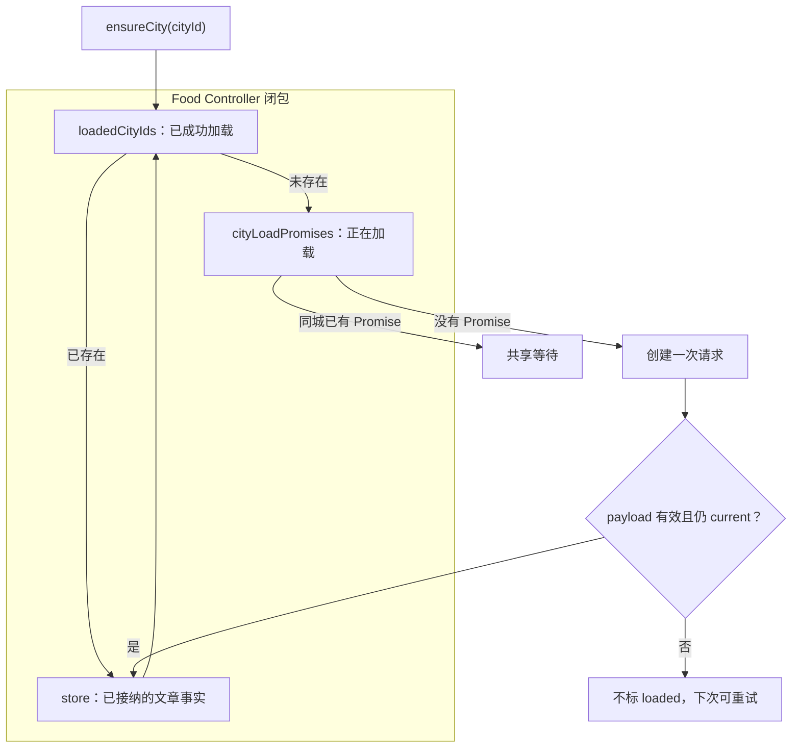

`loadedCityIds` 和 `cityLoadPromises` 不能合成一个结构：一个表示已完成结果，一个表示进行中的任务。

## 11. 文章链接和封面怎样选择

### 11.1 `articleReaderPath(article)`

候选分两组：

```text
外链：article.url，仅 http/https
本地：readerPath → pdfPath → htmlPath → markdownPath 中第一个安全路径
```

选择规则：

| 环境 | 有安全微信外链 | 有安全本地路径 | 结果 |
| --- | --- | --- | --- |
| 线上 | 是 | 任意 | 外链 |
| 线上 | 否 | 是 | 本地路径 |
| 本地 | 是 | 是 | 本地路径 |
| 任意 | 否 | 否 | `#` |

这样设计的动机是：开发者本地可阅读抓取副本，生产环境尽量回到原文；如果数据只有 summary、没有外链，仍允许同源副本兜底。

### 11.2 `articleCoverImage(article)`

只有本地环境才返回经过校验的 `coverImage`；线上始终返回空串，卡片显示“食”占位符。

这避免生产页面依赖未部署的大批本地图片，但当前 summary 仍携带每篇封面路径，传输了线上不会使用的字段。

### 11.3 一个细小标签问题

popup 的按钮文字用 `article.pdfPath ? "打开 PDF" : "打开图文页"` 判断，而真正链接由 `articleReaderPath()` 决定。若只有 `readerPath` 且它实际指向 PDF，按钮仍可能写“打开图文页”。应根据最终 URL 后缀或显式 `readerType` 决定标签。

## 12. 侧栏卡片的选择与渲染

### 12.1 `selectedArticles(selection)` 的优先级

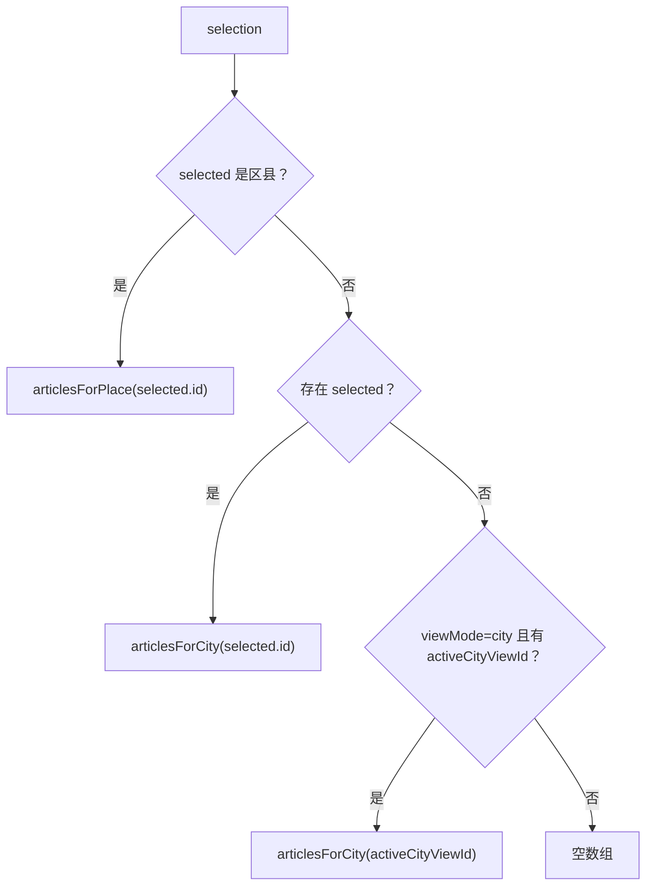

区县必须精确到 `placeId`，否则搜索福清后会看到整个福州的文章；普通城市选择按 `cityId` 聚合；城市详情没有单独选中点时，仍显示当前城市全部文章。

### 12.2 `renderPanel(selection)` 的实际动作

1. 兼容两套元素命名，取得计数、列表和空状态；
2. 缺任一关键元素则返回空数组；
3. 计算当前文章，计数显示完整篇数；
4. 清空旧卡片，按是否有文章切换 empty state；
5. 没有可用 document 时，只返回文章，便于无 DOM 测试；
6. 最多渲染前 8 篇；
7. 每篇创建一个 `<article class="food-card">`；
8. 选择链接与封面；
9. 把 day、地点、标题、食物或摘要转义后写入 `innerHTML`；
10. append 到列表。

“计数全部、只画前 8 篇”是有意的显示上限。当前每地点最多 4 篇，所以尚不会截断；未来数据增加后，用户可能看到“12 篇”却只有 8 张卡，应增加“展开全部”提示。

### 12.3 `popupHtml(article)`

popup 比卡片多显示：

- 最多 8 个食物标签；
- description；
- 本地封面；
- 阅读页按钮；
- 有安全外链时的“原文”按钮。

所有文章文字和 URL 在插入字符串时调用 `escapeHtml()`。链接还加 `target="_blank" rel="noopener"`，避免新页面通过 `window.opener` 控制原页面。

### 12.4 当前数据校验仍偏宽松

`validArticle()` 只检查对象和 ID，`isFoodPayload()` 只检查 articles 数组。因此异常数据如 `foods: "not-array"` 可能在卡片的 `.join()` 处报错。安全输出虽然挡住已知 XSS，但领域结构应在 hydration 时做完整 schema 校验或规范化：

```js
{
  id: string,
  cityId: string,
  placeId: string,
  foods: string[],
  title: string,
  lat?: finite number,
  lon?: finite number
}
```

---

## 13. 地图 marker 是怎样产生的

`renderMarkers(articles)` 不创建 Leaflet 对象，只返回普通描述：

```js
{
  title: "【第407天 广州（一）】……",
  lat: 23.1252,
  lon: 113.2806,
  popupHtml: "<article ...>...</article>"
}
```

完整链路是：

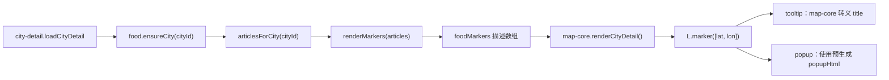

`renderMarkers()` 的步骤：

1. 非数组变空数组；
2. `filter(hasCoordinates)` 去掉无坐标文章；
3. `placeOffsets` 记录每个 placeId 已出现几次；
4. 同地点第一个不偏移，后续调用 `foodMarkerOffset()`；
5. 标题保持纯文本字符串；
6. popup 在 food 模块内生成并转义。

标题没有在 `renderMarkers()` 中转义，因为 `map-core.js` 的最终 tooltip 落点会执行：

```js
escapeHtml(`${food.title} / 食行记`)
```

这是一个跨模块安全契约：若未来另一个渲染器把 `title` 直接塞进 HTML，就会出问题。更稳妥的模型应明确字段类型，例如 `titleText` 与 `popupSafeHtml`，或让最终渲染器统一生成全部 HTML。

## 14. 城市分片并发、过期与重试

### 14.1 `ensureCity(cityId, { isCurrent })`

完整决策顺序：

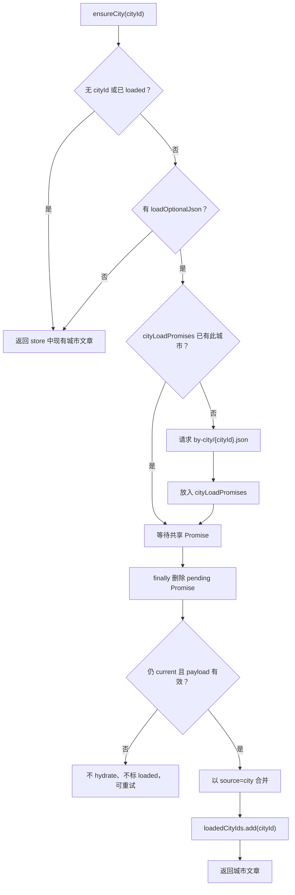

两个关键性质：

- 同城并发共享请求；
- 无效或过期响应不会进入 loaded Set，所以未来仍可重试。

请求使用 `{ quiet: true }`，失败时 `loadOptionalJson()` 返回 `null` 而不打印 warning。它没有 timeout 和 retries；与 30 秒超时、重试一次的 summary 规则不一致。

### 14.2 为什么既检查 `isCurrent()`，又不取消请求

`isCurrent()` 只禁止旧结果生效，并没有用 `AbortController` 停掉网络。好处是实现简单，且同城其他当前调用仍可共享响应；缺点是切走城市后，旧下载仍消耗带宽。

可以同时做到两点：共享请求使用引用计数或 session-aware consumer，每个 consumer 过期不应用；当没有任何有效 consumer 时再 abort。

### 14.3 A → B → A 的细节

假设第一次 A 请求尚未完成，用户进入 B，又立刻回到 A：

- 两次 A 会共享同一个 Promise；
- 每个调用带自己的 `isCurrent` 闭包；
- 第一次 A 的闭包可能为 false，第二次 A 的闭包可能为 true；
- Promise 完成后，每个调用分别检查自己的资格；
- 只要当前那次 A 仍为 true，就会 hydrate；旧 A 不会独自覆盖 B。

这比“Promise 本身只带一个 session”更正确，因为共享任务可能有多个消费者。

## 15. 行程推荐怎样使用文章

### 15.1 `suggestionsForPlace(place, city)`

- 区县：只取 `articlesForPlace(place.id)`；
- 城市：取 `articlesForCity(city.id 或 place.id)`；
- 最多取前 3 篇；
- 每篇最多取前 3 个 foods；
- 返回最多 9 个词，但 controller 本身不去重。

`app.js` 的 `currentFoodSuggestionsFor()` 再把结果交给 `uniqueByName()` 去重，并按使用场景截取：

- `placeFoodText(place, 5)`：晚餐建议最多 5 个；
- `dayFoodText(day)`：每地点最多 4 个、每天最多 3 个地点；
- Markdown/HTML 旅行指南导出也复用这些文字。

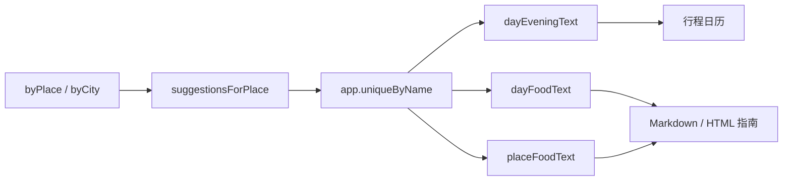

`exportMarkdownGuide()` 和 `exportPrintableHtmlGuide()` 只等待 food controller 模块创建，并不明确等待 food summary hydration。用户若在 summary 完成前很快导出，指南可能缺食物推荐；当前浏览器测试在 `data-app-ready=complete` 后执行，所以没有覆盖这个时序。

---

## 16. Controller 区域的 23 个函数节点逐个解释

下表覆盖 `food-content.js:190-357` 的全部函数节点。

| 行 | 函数节点 | 作用与重要分支 |
| ---: | --- | --- |
| 190 | `createFoodController(options)` | 校验依赖，选择默认 helper，创建加载状态与 store，最终返回公开门面。 |
| 195 | 默认 `hasCoordinates` 箭头 | 把 `lat/lon` 转 Number 后要求有限；字符串数字也会被接受。 |
| 198 | 默认 `shouldUseLocalArticleAssets` 箭头 | hostname 为空、localhost、127.0.0.1 时选择本地资产。 |
| 210 | `articleReaderPath(article)` | 校验外链和四个本地候选，按环境决定最终 href。 |
| 212 | `.map(safeLocalPath)` | 逐一清洗 reader/PDF/HTML/Markdown 路径；这是函数引用，不新增 AST 函数节点。 |
| 219 | `articleCoverImage(article)` | 只有本地策略开启时返回安全封面路径。 |
| 223 | `popupHtml(article)` | 构造预转义 popup HTML、标签和两个动作链接。 |
| 231 | foods `map` 回调 | 每个食物词变成安全 `<span>`，最多 8 个。 |
| 249 | `articlesForCity(cityId)` | O(1) 取得城市文章数组；没有 key 返回新空数组。 |
| 253 | `articlesForPlace(placeId)` | O(1) 取得精确地点文章数组；没有 key 返回新空数组。 |
| 257 | `selectedArticles(selection)` | 区县、已选城市、活动城市视图、空选择四路优先级。 |
| 264 | `renderPanel(selection)` | 更新计数/空状态，清列表，最多创建 8 张安全卡片。 |
| 276 | 卡片 `forEach` 回调 | 为一篇文章创建 DOM article、填 HTML 并 append。 |
| 297 | `renderMarkers(articles)` | 过滤坐标、计算同地点偏移、产出普通 marker 描述。 |
| 301 | marker `map` 回调 | 更新 place offset 计数，转换数字坐标并生成 popup。 |
| 314 | `ensureCity(cityId, options)` | 已加载快返、并发合并、校验时效、city 优先合并、成功标记。 |
| 314 | 默认 `isCurrent` 箭头 | 调用者未提供 session 时始终允许结果生效。 |
| 319 | Promise `finally` 回调 | 不论成功或失败都从 pending Map 删除，确保失败可重试。 |
| 329 | `suggestionsForPlace(place, city)` | 选择地点文章，最多抽取 3×3 个食物词。 |
| 333 | foods `flatMap` 回调 | 把每篇前三个 foods 摊成一个数组。 |
| 338 | controller `refreshKnownPlaces(knownPlaces)` | 转交 store 更新地点对象，返回 store 便于链式/测试使用。 |
| 342 | controller `hydrateSummary(summary)` | payload 有效才以 `source: "summary"` 注水。 |
| 351 | `articleCountForCity` 箭头 | 城市文章数组长度。 |
| 352 | `articleCountForPlace` 箭头 | 精确地点文章数组长度。 |

表内出现 24 行，是因为第 212 行说明的是传入现成函数 `safeLocalPath` 的调用点，不是额外函数节点；AST 统计仍是 23 个 controller 区域节点。加上前面的 22 个 store 区域节点和 4 个 URL/几何节点，恰好是主文件全部 49 个函数节点。

### 16.1 返回的 12 个公开入口

```text
store
refreshKnownPlaces
hydrateSummary
ensureCity
renderPanel
renderMarkers
articlesForCity
articlesForPlace
articleCountForCity
articleCountForPlace
suggestionsForPlace
articleReaderPath
articleCoverImage
```

严格说是 1 个公开字段加 12 个函数。直接暴露 `store` 方便测试和观察，但也允许外部绕过 controller 修改数组。生产级 API 更适合只暴露只读查询或冻结视图。

## 17. `app.js` 的 21 个食行记协作函数

`food-content.js` 不知道整个应用何时启动、当前选了谁、行程何时导出。这些协调工作留在 `app.js`。

| 行 | 函数 | 在食行记链中的职责 |
| ---: | --- | --- |
| 205 | `loadFoodModule()` | 只创建一次动态 `import()` Promise。失败 Promise 也会被永久记住，本次页面生命周期不再重试模块。 |
| 210 | `loadFoodController()` | 注入 state、DOM、JSON loader 和 helpers；只创建一个 controller。 |
| 459 | `syncPlaceIndex()` | place index 更新后，把新 `placeById` 通知已有/正在创建的 food controller。 |
| 474 | `hydrateDeferredSummaries()` | 区县与 food summary 并行、独立判定；food 有效时 hydrate，最后刷新搜索和面板。 |
| 553 | `searchResultHtml(item)` | 用地点优先、城市兜底的文章数生成“n 篇食行记”徽标。 |
| 1053 | `currentFoodSelection()` | 对当前选择做快照，交给异步 generation 调度器。 |
| 1061 | `reportFoodModuleFailure(error)` | 一次性报告模块失败，把计数改为“暂不可用”，进入统一可选数据错误提示。 |
| 1068 | `queueFoodPanelRender()` | 页面 map-ready 后调度最新选择；异步完成后由 generation 决定是否应用。 |
| 1076 | `foodArticleCountForCity(cityId)` | controller 未就绪时安全返回 0。供地图城市样式和详情计数使用。 |
| 1080 | `foodArticleCountForPlace(placeId)` | controller 未就绪时返回 0。供区县搜索徽标使用。 |
| 1084 | `loadFoodForCity(cityId, options)` | 城市详情适配器：创建 controller、等待分片、失败返回 null。 |
| 1095 | `ensureFoodModuleForTrip()` | 导出前确保 controller 代码已加载；没有确保 summary 数据已完成。 |
| 1104 | `renderPanel()` | 主面板总渲染尾部先渲染行程，再排队更新食行记卡片。 |
| 1432 | `dayEveningText(day)` | 优先把过夜地 foods 写入晚餐建议。 |
| 1482 | `dayFoodText(day)` | 汇总一天最多 3 个地点的食物词，无数据时给通用建议。 |
| 1494 | `currentFoodSuggestionsFor(place)` | 把 Place 转成所属 City，再调用 controller。 |
| 1499 | `placeFoodText(place, limit)` | 去重、截取并用顿号拼接，供推荐和导出。 |
| 1523 | `cityForPlace(place)` | 区县转父城市，城市保持自身；是推荐聚合的行政关系适配器。 |
| 1529 | `uniqueByName(values)` | 过滤空值并按文本去重。 |
| 2392 | `exportMarkdownGuide()` | 尝试加载 food controller 后构建 Markdown 指南。 |
| 2412 | `exportPrintableHtmlGuide()` | 同样为 HTML 指南准备食物推荐。 |

这些函数内部还有 7 个相关箭头回调：

- `loadFoodController().then(...)` 创建 controller；
- `foodInteractionRefresh.apply` 调 `controller.renderPanel(selection)`；
- `foodInteractionRefresh.refresh` 调 `renderTripPlanner()`；
- `syncPlaceIndex().then(...)` 刷新 Place Map；
- `hydrateDeferredSummaries()` 的 `filter` 和 `map` 收集 AggregateError 原因；
- `dayFoodText().map(...)` 生成每地点推荐段落；
- `uniqueByName().filter(...)` 执行去重。

`renderPanel()` 自己的路线 `forEach` 已在第 3 章解释，它不是食行记算法，只是食行记排队调用的宿主。

## 18. “只让最新选择更新侧栏”的 generation

`app-data.js:161-180` 的 `createLatestAsyncRefresh()` 是共享的通用异步调度器。本章只看它怎样服务食行记。

```js
const foodInteractionRefresh = createLatestAsyncRefresh({
  load: loadFoodController,
  apply: (controller, selection) => controller.renderPanel(selection),
  refresh: () => renderTripPlanner()
});
```

时间线示例：

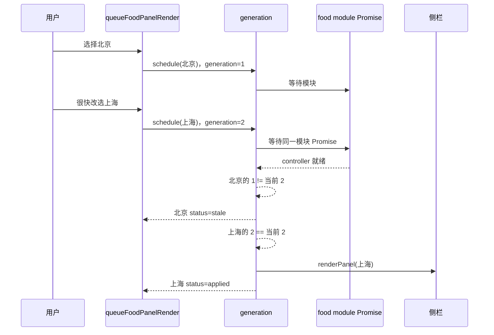

`load()` 看起来被调用两次，但 `loadFoodController()` 返回同一个记忆化 Promise，实际动态导入和 controller 创建各一次。

### 18.1 为什么首次完成后还要 `renderTripPlanner()`

模块尚未就绪时，主 `renderPanel()` 已经先画了一次行程，当时食物推荐为空。`refreshOnResolve: !foodController` 为 true，于是 controller 第一次完成并应用最新侧栏后，再补算一次行程推荐。

controller 已存在时，主渲染已经能同步读取 foods，所以不应再补算，否则会形成多余渲染链。

### 18.2 generation 的边界

它只保证“旧 selection 不 apply”，不取消模块导入，也不处理 summary 版本。它没有公开 `cancel()`，页面销毁时也无法显式终止。对当前单页生命周期足够，但可抽象为带 AbortSignal 的 latest-task controller。

## 19. `app-data.js` 中直接相关的函数

| 行 | 函数 | 食行记作用 |
| ---: | --- | --- |
| 12 | `isFoodArticlesPayload(value)` | 判断 deferred food summary 是否至少有 articles 数组。 |
| 16 | `classifyDeferredSummaryData(...)` | 把 county 与 food 分别判定，生成 complete/degraded 和 missing IDs。 |
| 68 | `createJsonLoader()` | 提供版本参数、缓存、超时、重试、AbortSignal 合并和 optional-null 降级。 |
| 139 | `createDeferredDataLoaders()` | 记忆化 food summary Promise，30 秒超时，失败前重试一次。 |
| 161 | `createLatestAsyncRefresh()` | 只允许最新 food selection 应用并决定是否补渲染行程。 |
| 182 | `scheduleIdle()` | 地图可用后再开始 summary hydration；最长等 1.5 秒空闲窗口，fallback 50 ms。 |

`loadOptionalJson()` 把所有最终失败变成 `null`，所以 `hydrateDeferredSummaries()` 必须用 payload 校验区分“成功空数组”和“请求失败”。当前只看结构，不验证 `count` 与实际数组一致。

## 20. 两段数据生成脚本的函数级导览

这些脚本不是浏览器模块，却决定运行时数据质量。本节先解释与食行记有关的全部函数节点；后续构建章节还会把整条静态资源流水线串起来。

### 20.1 `build_wechat_food_index.js` 的 14 个函数节点

| 行 | 节点 | 作用 |
| ---: | --- | --- |
| 13 | `cities.map` 回调 | 建 `cityByName`。同名城市会以后者覆盖，当前数据依赖城市名唯一。 |
| 14 | `counties.map` 回调 | 建“父城市名|区县名”精确索引。 |
| 22 | `cleanLocationPart()` | 去括号内容、去空白，得到更容易匹配的地点名。 |
| 29 | `extractDayAndLocation()` | 从标题正则提取起始 day 和 `】` 前地点；区间只保留第一天。 |
| 38 | `foodKeywords()` | 从 description 的冒号后取词，按顿号/逗号切分，最多 12 个。 |
| 45 | keywords `map` 回调 | trim 每个食物词。 |
| 50 | `firstLocalImage()` | 找文章图片目录中排序第一张可识别图片作为封面。 |
| 55 | image `filter` 回调 | 只保留 png/jpeg/gif/webp/bmp。 |
| 60 | `matchPlace()` | 先“城市·区县”精确匹配，再城市名，再唯一同名区县，否则 null。 |
| 62 | location `map` 回调 | 清理 `·` 分隔后的各地点部分。 |
| 117 | `articleMarkdownPath()` | 由 JSON 文件名生成 Markdown 相对路径。 |
| 121 | `articleReaderPaths()` | 检查 HTML/PDF 是否存在；PDF 优先，其次 HTML，最后 Markdown。 |
| 133 | `buildIndex()` | 遍历原始 JSON、提取、匹配、建完整文章和两套 ID 索引、写输出。 |
| 134 | files `filter` 回调 | 只读取文章目录顶层 `.json` 文件。 |

值得注意的当前数据质量问题：`foodKeywords()` 只按标点切分，不理解括号层级。例如“三套车（行面、腊肉、茯茶）”会被拆成三个不完整词；这解释了部分推荐词为何带半边括号。

### 20.2 `build_lazy_map_data.js` 的 16 个函数节点

| 行 | 节点 | 作用 |
| ---: | --- | --- |
| 7 | `readJson()` | 文件缺失返回 fallback，否则同步读取并解析。 |
| 13 | `writeJson()` | 建父目录并写一行压缩 JSON。 |
| 19 | `cleanDirectory()` | 删除并重建目标分片目录；这是破坏性生成步骤。 |
| 25 | `groupBy()` | 按回调返回 key 分组。 |
| 27 | `items.forEach` 回调 | 建组并 push。 |
| 36 | `countySummary()` | 裁剪区县摘要字段；属于第 1/4 章的数据链。 |
| 48 | `foodSummary()` | 把完整文章裁成前述 14 字段。 |
| 67 | `writeCountyChunks()` | 生成区县 summary 和城市分片。 |
| 70 | county key 回调 | 以 `parentCityId` 分组。 |
| 73 | county group 回调 | 为每座城市写区县文件。 |
| 98 | `writeFoodChunks()` | 生成食行记 summary、城市分片、byCity/byPlace ID 索引。 |
| 102 | food key 回调 | 以 `article.cityId` 分组。 |
| 107 | food group 回调 | 写完整城市分片并记录 byCity IDs。 |
| 117 | article `map` 回调 | 把城市文章变成 ID 数组。 |
| 120 | articles `forEach` 回调 | 构建 byPlace IDs。 |
| 144 | `main()` | 依次生成区县和食行记懒加载数据，打印汇总。 |

生成器先 `rmSync(..., recursive: true)` 清空目录，再写新分片。它适合可重复构建，但应在正确模块制式、明确输出根目录并有校验后再运行；本章没有执行它，以免在有缺口的情况下覆盖 236 个已跟踪文件。

---

## 21. 安全边界逐点审计

### 21.1 已做对的部分

| 风险点 | 当前防线 |
| --- | --- |
| 标题/描述/地点/foods 进入卡片 `innerHTML` | 每项 `escapeHtml()` |
| 相同数据进入 popup | 每项 `escapeHtml()` |
| 外部 href | `safeExternalUrl()` 只允许 http/https，再转义属性 |
| 本地 href/src | `safeLocalPath()` 拒绝协议、跨 origin、控制字符和常见 `..` |
| 新标签页反向控制 | `rel="noopener"` |
| marker tooltip 标题 | `map-core.js` 最终输出时转义 |
| 恶意 day | `finiteArticleDay()` 不把原字符串插入 HTML |

测试确实用 `` 作为 title 和 day，验证卡片、popup 和地图 tooltip 中都没有可执行标签。

### 21.2 仍然脆弱的部分

1. `popupHtml` 用字符串命名暗示“已经安全”，但类型系统不能证明；
2. `renderMarkers().title` 是原始文本，必须依赖 map-core 记得转义；
3. schema 校验太浅，异常 foods 类型会造成可用性错误；
4. `safeLocalPath` 应统一处理解码后反斜杠和部署根前缀；
5. 本地资源不存在是可用性问题，安全检查不会帮它变成真实文件；
6. 外链来源只能保证协议安全，不能保证内容可信，应在 UI 标明跳转到第三方。

### 21.3 更好的安全模型

建议把数据分为明确类型：

```text
FoodArticleRaw       构建输入
FoodArticle          完整校验后的领域对象
FoodCardViewModel    全是文本和 SafeUrl
FoodMarkerViewModel  titleText + popup 数据，不携带任意 HTML
```

最终由 DOM API 创建节点、设置 `textContent` 和 `href`，尽量不用 `innerHTML`。popup 也可以由元素节点或可信模板渲染，而不是在领域模块中拼 HTML 字符串。

## 22. 自动测试究竟证明了什么

### 22.1 `food-content.test.mjs` 的 8 个测试

| 测试 | 证明内容 | 没证明什么 |
| --- | --- | --- |
| summary/city 两种顺序 | city 字段优先且到达顺序无关 | 大规模并发性能 |
| hydration 异常记录与幂等 | null、坏 ID、重复 ID、未知地点被正确处理，索引重建 | 完整 schema |
| known places refresh | 区县后到时搜索词能补充 | 任意动态地点都不会丢文章 |
| reader path 策略 | 本地/线上优先级和危险协议被拒绝 | 路径对应文件真实存在 |
| 真实 summary readerPath | summary 路径能被函数原样接受 | 浏览器请求能返回 200 |
| retry + panel + markers | 无效分片可重试，卡片与 marker 转义 | timeout、网络取消 |
| hostile title/day | day 不执行、标题不形成恶意标签 | 所有可能的 URL 编码绕过 |
| concurrent stale completion | 同城并发只请求一次，过期结果不标 loaded | A-B-A 多消费者完整场景 |

文件里实际有 8 个 `test()`；上表也逐项列出了这 8 个测试。

### 22.2 其他测试提供的证据

- `app-data.test.mjs`：旧 selection 返回 stale，只有最新值 apply；首次 controller 完成只补算一次推荐；summary Promise 独立记忆化并带 30 秒超时、一次重试。
- `module-boundaries.test.mjs`：动态导入唯一、食行记所有权没有泄漏回 app、map 端会创建 food marker。
- `rendered-html.test.mjs`：关键地图先于可选 summary，城市分片路径保持在 food 模块，失败仍可重试。
- `browser-performance.test.mjs`：地图能在 summary 被人为阻塞时先可用；加载完成后搜索福清、进入城市详情能看到 food card。

### 22.3 当前测试空白

- 点击真实文章卡片后链接是否 200；
- 封面图片是否 200；
- production hostname 与 localhost 两套资源策略的端到端行为；
- summary 完成前立即导出是否应等待；
- 城市分片超时；
- summary 的 count、cityCount、byCity/byPlace 与 articles 是否一致；
- 生成脚本是否能在当前 `type: module` 项目中执行；
- 根 `data/` 与 `public/static-site/data/` 是否同步。

## 23. 为什么这样设计：逐层五问

### 23.1 为什么不用一个 846 KB JSON

1. 为什么拆分？首屏不需要每篇文章的 URL、坐标和图片统计。
2. 为什么还要 summary？全国搜索和行程推荐必须在未进入城市时可用。
3. 为什么 summary 仍有 416 KB？它保留标题、描述、foods、封面和阅读路径，且附带两套未使用索引。
4. 为什么城市分片按 cityId？城市详情是主要加载边界，同一城市内区县文章也要一起成为 marker。
5. 能否更好？可以把全国层再拆为轻量 manifest/搜索索引，只有选中地点时才取文章卡片字段。

结论：两层拆分方向正确，但 summary 仍偏重，且字段与实际发布策略不完全一致。

### 23.2 为什么用 ID 合并而不是替换整个城市

1. summary 可能先到，也可能城市分片先到；
2. 用户可能在 deferred summary 前快速进入城市；
3. 直接替换会让先到的丰富字段被后到 summary 丢掉；
4. 文章 ID 能稳定表示同一篇文章；
5. sourceById 记录优先级，使到达顺序不影响最终事实。

结论：按 ID、按来源合并是本模块最扎实的设计之一。

### 23.3 为什么修改 Place.searchText

1. 用户希望搜食物也找到地点；
2. 搜索引擎已经只认识 Place 的 `searchText`；
3. 直接增强可复用现有排序和 UI；
4. base 缓存避免重复叠词；
5. 代价是 food 模块修改了 place index 对象。

结论：短期低成本有效；长期更适合让搜索索引显式合并 `placeText + foodText`，保持 Place 不可变。

### 23.4 为什么 marker 描述与 Leaflet 分离

1. 食行记知道文章语义，不应知道 Leaflet API；
2. map-core 已拥有 pane、图层和视图 session；
3. 普通对象容易在 Node 测试；
4. city-detail 能把 food 与景点、站点一次性交给地图；
5. 代价是 HTML 安全责任跨模块。

结论：绘图所有权分离正确，但 marker view model 应更强类型、尽量不携带 HTML。

### 23.5 为什么旧结果不取消、只忽略

1. generation/session 能保证 UI 正确；
2. Promise 可能被多个同城消费者共享；
3. 粗暴 abort 会误伤仍有效消费者；
4. 实现忽略比实现引用计数取消简单；
5. 代价是旧请求继续占带宽。

结论：当前数据分片很小，忽略策略可接受；若内容和图片请求增长，应加入消费者感知的取消。

## 24. 更好的方案，按优先级排序

### 24.1 第一优先级：修通构建到发布的闭环

这是功能正确性，不是优化：

1. 把两个生成脚本改成 ESM，或明确改名 `.cjs`；
2. 让生成目标直接是 `public/static-site/data/`，或增加一个可验证的同步命令；
3. 决定是否发布本地 `exports/wechat_articles`：
   - 要发布：复制到 `public/static-site/exports/`，测试代表性 reader/image 返回 200；
   - 不发布：summary 移除本地 reader/cover，线上始终依赖安全外链或明确显示不可用；
4. 在 CI 中重建到临时目录并比较生成物，避免陈旧副本。

### 24.2 第二优先级：缩小 summary

可以先移除运行时未使用的 `byCity/byPlace`，从约 416 KB 降到约 338 KB。然后评估：

- 线上不使用本地封面时移除 `coverImage`；
- description 可按字符截断；
- foods 去重并做词典 ID；
- 只保留每地点文章数和少量推荐词，选中后再取文章卡片分片。

### 24.3 第三优先级：完整 schema 与不可变领域对象

在 `hydrate()` 前统一 `normalizeFoodArticle()`：

- 类型不对时给默认值或拒绝；
- foods 强制为清洗后的字符串数组；
- day、lat、lon 只保存规范值；
- URL/path 分字段验证；
- 冻结文章对象，外部不能偷偷修改。

### 24.4 第四优先级：统一异步状态

把 `loadedCityIds + cityLoadPromises + null payload` 统一成：

```js
Map<cityId, {
  status: "idle" | "loading" | "ready" | "empty" | "error",
  promise,
  value,
  error,
  fetchedAt
}>
```

同时让 summary 与 city chunk 共用 timeout、retry、AbortSignal 和可观察错误状态。UI 就能区分“没有文章”和“文章暂时加载失败”。

### 24.5 第五优先级：消除重复渲染与隐式副作用

- 删除 `initApp()` 中第二次 `queueFoodPanelRender()`；
- 把 `renderPanel()` 拆成主面板渲染和食行记/日历各自订阅，不让一个总函数触发整个页面；
- 不直接修改 `Place.searchText`，改为独立 search index；
- 导出函数显式等待 food readiness，而不是只等待模块代码；
- `renderPanel()` 返回 view state，而不是既改 DOM 又返回文章数组。

### 24.6 第六优先级：改善推荐质量

当前推荐只是“最早三篇文章的前三个词”，没有去除泛词、括号错误或重复语义。可以：

- 构建时使用支持括号层级的切词；
- 保存食物规范名与别名；
- 按文章覆盖次数、地点精确度和用户偏好打分；
- 区分早餐、正餐、小吃、甜品；
- 把文章出处与推荐词关联，用户可追溯。

## 25. 你可以怎样亲手跟读一篇广州文章

按这个顺序打开源码，不容易迷路：

1. 在 `wechat-food-summary.json` 找 `407-【第407天 广州（一）】...`，观察 14 个字段。
2. 打开 `food-articles/by-city/guangdong-guangzhou-0.json`，比较多出的 URL、坐标和图片字段。
3. 从 `hydrateSummary()` 进入 `store.hydrate()`，在纸上写下 source=`summary`。
4. 再从 `ensureCity()` 进入同一 `hydrate()`，写下 source=`city`。
5. 用合并矩阵确认 city 的 URL/坐标不会被 summary 覆盖。
6. 跟 `articlesForCity()` 到 `renderPanel()`，看它怎样成为侧栏卡片。
7. 跟 `renderMarkers()` 到 `city-detail.loadCityDetail()`，再到 `map-core.renderCityDetail()`。
8. 跟 `suggestionsForPlace()` 到 `placeFoodText()`，看“肠粉、牛三星……”怎样进入晚餐建议和导出指南。
9. 最后检查链接的实际部署路径，理解“字符串通过安全校验”与“资源真实存在”是两件不同的事。

如果只记住本章一条工程原则，请记住：

> 渐进加载不是把一个大文件随便拆小，而是先定义每一层能支持哪些用户能力，再用稳定 ID 和明确优先级把各层合成同一份事实。

## 26. 下一章预告

下一章将拆解行程领域模型 `trip-plan.js`：一天、地点停留、交通、活动与住宿怎样组成事实账本，命令为什么返回新计划而不直接改旧对象，自动排期和冲突校验又如何工作。

继续阅读：[第 6 章：`TripPlan` 怎样成为可编辑、可校验、可迁移的行程事实账本](./06-trip-plan.md)

回看：[第 4 章：双击城市后，详情怎样异步加载且不串台](./04-city-detail.md)
