# 第 6 章：`TripPlan` 怎样成为可编辑、可校验、可迁移的行程事实账本

> 本章完整拆解 `public/static-site/trip-plan.js`，并连接 `trip-controller.js`、`app.js`、`trip-editor.js` 与 `trip-archive.js` 的协作边界。主文件共 1,140 行、46,383 字节；AST 识别出 170 个函数节点：44 个函数声明、126 个箭头函数，未使用对象方法或传统函数表达式。正文先建立适合零基础读者的心智模型，再逐个登记全部 170 个节点。

## 1. 学完本章能回答什么

1. 一份行程在内存里究竟长什么样？
2. `placeId`、`visitId`、城市条目 `id` 为什么不能合并成一个 ID？
3. 为什么“连续三天在北京”和“北京—上海—北京”不是同一件事？
4. 为什么编辑命令返回一份新计划，而不直接修改旧计划？
5. 自动排期怎样判断换日，又为什么会把出发地带到下一天？
6. 用户改地图路线时，程序怎样保住已经手工编辑的内容？
7. 重复地点出现时，为什么要用“最长公共子序列”对齐？
8. 跨夜交通怎样换算成绝对时间，并参与冲突校验？
9. 八类警告分别在什么条件下产生？
10. 十种编辑命令各自会修改、拒绝或清理什么？
11. v1、无版本快照和 v2 文件怎样进入同一个规范结构？
12. `trip-plan.js`、界面、浏览器存储和导出模块分别拥有哪一部分责任？
13. 当前实现哪里可靠，哪里只是暂时可用，哪里值得优先重构？

## 2. 五问核验后的架构结论

| 核验问题 | 结论 |
| --- | --- |
| 这个模块真正拥有什么？ | 它拥有行程数据结构、ID/访问段语义、自动排期、路线协调、数据归一化、版本迁移、时间校验和命令变换；它不拥有 DOM、地图图层、确认弹窗或浏览器存储。 |
| 哪一份数据是事实来源？ | 页面运行期间，`state.tripPlan` 是当前事实；`trip-plan.js` 产生或变换这份事实，`trip-archive.js` 只负责把它序列化保存。地图路线和编辑器 HTML 都是从事实投影出来的视图。 |
| 为什么它像“账本”？ | 每个地点出现、每天的交通/活动/住宿、人工编辑标志都被显式记录；命令不是随手改 UI，而是提交一次可判断成功、失败、需确认或无变化的领域操作。 |
| 它怎样避免危险修改？ | 先克隆、后试算；删除或缩短若会影响人工内容，则返回 `requiresConfirmation`；路线协调若有任何受保护删除，则整体返回原计划，避免只改一半。 |
| 最大的架构缺口是什么？ | `applyTripCommand()` 已膨胀为 300 多行总分派器，创建/命令对元数据的校验不统一，`savedAt` 也没有随大多数保存更新；边界清楚，但规则还没有集中成单一 schema 与小型命令处理器。 |

一句话总结：

> `trip-plan.js` 是整个项目的行程“领域内核”：外界把用户意图交成命令，它在不直接触碰旧数据的前提下生成下一份事实，并把危险操作、无效时间和旧格式隔离在明确边界上。

## 3. 先认识本章需要的 JavaScript 概念

### 3.1 对象与数组：行程是一棵数据树

```js
const plan = {
  name: "我的旅行",
  days: [
    {
      cityEntries: [],
      items: []
    }
  ]
};
```

花括号 `{}` 是一张带字段名的表；方括号 `[]` 是有顺序的清单。行程不是数据库表，而是一棵可以整体保存为 JSON 的对象树。

### 3.2 引用相等：为什么“没变化”要返回原对象

```js
const a = { name: "旅行" };
const b = a;
const c = { name: "旅行" };

a === b; // true：同一个对象
a === c; // false：内容相同，但不是同一个对象
```

本项目用“是否还是同一个对象”表达命令有没有真正产生变化：

- 无效命令、未知命令或语义上没有变化：返回原来的 `plan`；
- 有效修改：返回克隆后修改的 `next`；
- 上层看到 `result.changed` 才刷新、入历史和保存。

这使“有没有变化”不必对整棵大对象做昂贵比较。

### 3.3 `structuredClone()`：给账本拍一份可编辑复印件

`cloneTripPlan(plan)` 只做一件事：`structuredClone(plan)`。它不是浅拷贝；天、条目、项目、住宿等嵌套对象都会得到新副本。

```text
旧 plan ──保留不动──> 撤销历史
   │
   └── structuredClone ──> next ──执行命令──> 新 plan
```

这正是撤销功能可靠的前提。如果只复制最外层，修改 `next.days[0].items` 仍可能把历史里的旧对象一起改坏。

### 3.4 纯变换与副作用

`trip-plan.js` 绝大多数公开函数只接收数据并返回数据，不访问 DOM，不读写 `localStorage`，也不弹确认框。这类代码容易在 Node 环境直接测试。

真正的副作用在外层：

- `app.js` 修改页面状态、重绘地图、弹 `window.confirm()`；
- `trip-archive.js` 写浏览器存储、清理 URL hash；
- `trip-editor.js` 监听点击并生成命令。

### 3.5 `Set` 与 `Map`

- `Set` 是不重复集合：适合记录“哪些 ID 已用”“哪些条目待删”；
- `Map` 是键值表：适合记录“某天要清理哪些地点”“某地点阻塞了哪些天”。

它们在删除清理中很重要，因为同一天或同一项目可能从多条关系被发现，集合可以自动去重。

### 3.6 回调函数与箭头函数

```js
day.items.filter((item) => item.type === "activity")
```

`filter` 会逐项调用箭头函数。箭头函数虽短，仍是真正的函数节点。本章的 170 个节点中有 126 个是这类回调或局部助手，所以不能只数 `function xxx()`。

### 3.7 可选链与空值回退

```js
day.cityEntries.at(-1)?.placeId ?? null
```

- `?.`：左边不存在时停止，不抛错；
- `??`：左边是 `null` 或 `undefined` 时使用右边；
- `at(-1)`：取数组最后一项。

这行的意思是：“取当天最后一个地点；若当天没有地点，则记为 `null`。”

## 4. 五个模块怎样分工

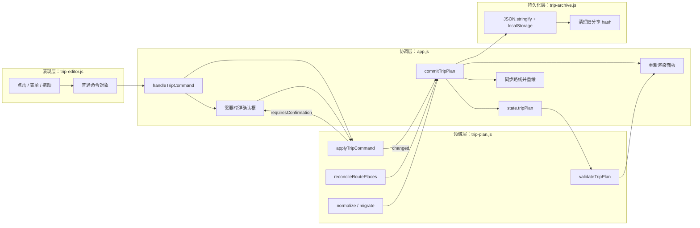

### 4.1 `trip-controller.js` 是装配入口，不是业务大脑

这个 31 行文件静态重导出 `trip-plan.js`、`trip-editor.js`、`trip-archive.js`，并把体积更大、使用频率更低的 `guide-export.js` 留到真正导出时动态加载。

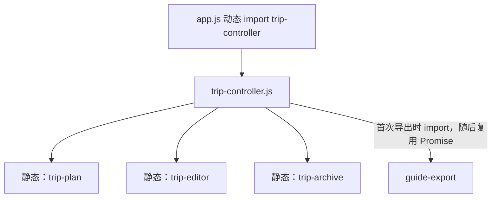

`createTripController({ onReady })` 返回冻结对象：

- `init()`：未销毁时等待 `onReady`；
- `domain`：合并三个静态模块的公开 API；
- `loadGuideModule()` / `prefetchExports()`：共享同一个延迟导入 Promise；
- `destroy()`：把闭包内 `destroyed` 设为 `true`。

冻结的是控制器外壳，不是 `domain` 里所有函数的运行结果。

## 5. 行程数据模型：先看完整树

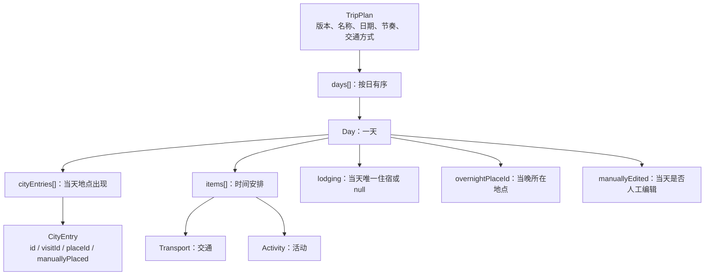

### 5.1 `TripPlan`

```js
{
  version: 2,
  id: "trip-...",
  name: "我的旅行",
  startDate: "2026-08-01", // 也可以是 null
  pace: "relaxed" | "standard" | "compact",
  transportMode: "highspeed" | "train",
  days: [],
  savedAt: "2026-07-22T...Z"
}
```

### 5.2 `Day`

```js
{
  id: "day-...",
  cityEntries: [],
  overnightPlaceId: "beijing" | null,
  items: [],
  lodging: null,
  manuallyEdited: false
}
```

没有持久化“第几天”。数组位置就是天序号；只要调整 `days` 顺序，第几天自然改变。

### 5.3 `CityEntry`

```js
{
  id: "city-entry-...",
  visitId: "visit-...",
  placeId: "beijing",
  manuallyPlaced: false
}
```

它表示“某个地点在某一天出现了一次”。它不是地点档案本身。

### 5.4 `Transport`

```js
{
  id: "item-...",
  type: "transport",
  fromPlaceId: "beijing",
  toPlaceId: "shanghai",
  serviceNo: "G1",
  startTime: "19:00",
  endTime: "00:30",
  endDayOffset: 1,
  note: "",
  manuallyEdited: true
}
```

`endDayOffset` 只能是 0 或 1：0 表示当天结束，1 表示次日结束。

### 5.5 `Activity`

```js
{
  id: "item-...",
  type: "activity",
  sourceType: "landmark" | "food" | "custom" | "free",
  sourceId: "..." | null,
  placeId: "beijing",
  title: "故宫",
  startTime: "09:00",
  endTime: "12:00",
  note: "",
  manuallyEdited: true
}
```

### 5.6 `Lodging`

```js
{
  placeId: "beijing",
  name: "酒店名",
  address: "地址",
  checkInTime: "15:00",
  checkOutTime: "12:00",
  note: ""
}
```

住宿没有独立 ID，因为当前模型规定每天最多一个住宿；命令总是整体替换这块对象。

## 6. 三种 ID 为什么不能混用

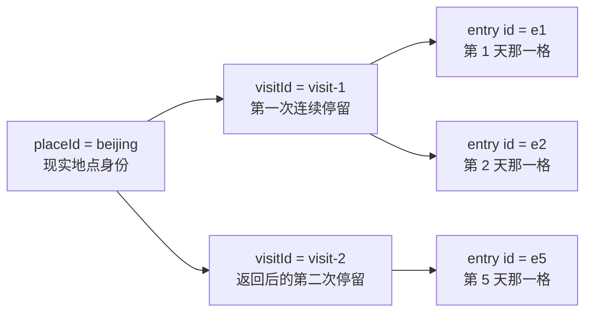

- `placeId` 回答“这是哪里”；
- `visitId` 回答“这是第几段连续停留”；
- `city-entry id` 回答“具体是哪一天里的哪一格”。

例如：

```text
第 1 天 北京 visit-A
第 2 天 北京 visit-A  ← 连续，仍是同一次停留
第 3 天 上海 visit-B
第 4 天 北京 visit-C  ← 中间离开过，必须是新访问段
```

如果只保留 `placeId`，把北京住宿从 2 天改成 3 天时，程序无法知道应延长第一次北京还是第二次北京。如果只保留 `visitId`，又无法查地点名称、坐标和文章。

## 7. 创建链：从空计划到自动排期

### 7.1 调用关系

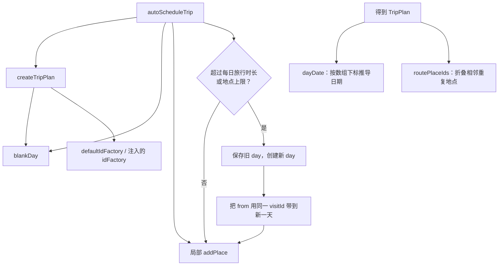

### 7.2 `defaultIdFactory(prefix)`

优先级如下：

1. 浏览器支持 `crypto.randomUUID()`：用安全 UUID；
2. 否则用 `crypto.getRandomValues()` 生成两个 32 位随机数；
3. 再不支持则退回 `Math.random()`；
4. 组合时间戳、模块计数器和随机片段，降低碰撞概率。

它允许测试注入确定性的 `idFactory`，所以测试可以断言准确 ID，而不依赖随机结果。

### 7.3 `blankDay(idFactory)`

只负责创建结构完整的空天。把默认字段集中在这里，避免自动排期、路线插入和访问时长扩展各写一套默认对象。

### 7.4 `createTripPlan(options)`

它先创建一张空白天，再把输入 `placeIds` 全放到第一天：

- 每个输入地点得到新的 `visitId` 和条目 ID；
- `overnightPlaceId` 每次被覆盖，所以最后是最后一个地点；
- 没有地点时，`days` 是空数组，而不是含一张空白天；
- `transportMode` 会校验并回退为 `highspeed`；
- `pace`、`startDate` 和 `placeIds` 在这里不做完整归一化。

这说明它是“受信任输入下的构造器”，不是文件导入的安全边界。

### 7.5 `autoScheduleTrip(options)`

它只决定地点怎样分到不同天，不自动生成交通项目。

默认相邻路段为 2 小时。新增路段前，只有当天已经至少有两个地点，并且满足以下任一条件时才换日：

- 加上新路段后超过 `dailyTravelLimitSeconds`；
- 当天地点数已达到 `maxDailyPlaces`。

换日时会把出发地 `from` 带到新一天，并保持同一个 `visitId`。这是为了表达“早上仍在出发地，随后离开”，也使连续停留跨日保持同一访问段。

相邻重复地点会被局部 `addPlace()` 忽略；离开后再返回同一地点则生成新 `visitId`。

### 7.6 `dayDate(plan, dayIndex)`

日期不保存在每一天里，而是由 `startDate + dayIndex` 推导。实现先创建 epoch 日期，再用 `setUTCFullYear()`，是为了避免 JavaScript 把 0 到 99 年自动解释为 1900 到 1999 年。

这个函数假设 `startDate` 已经合法；文件数据应先走 `normalizeTripPlan()`。

### 7.7 `routePlaceIds(plan)`

它先把所有天的城市条目摊平成一条线，再只折叠相邻重复：

```text
北京、北京、上海、北京
       ↓
北京、上海、北京
```

最后一个北京不能删除，因为它表示返回北京的新访问段。

## 8. 项目移动与城市关联规则

`canMoveTripItemToDay(plan, item, targetDayId)` 是拖动前的守门员：

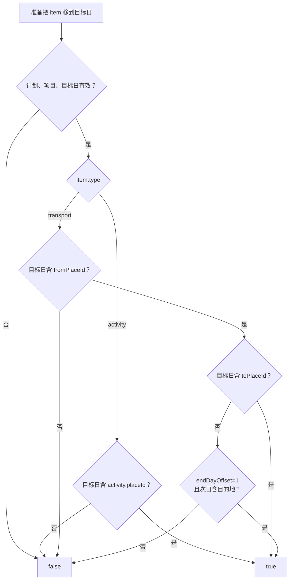

这是一条领域规则，不是 UI 规则。因此编辑器可以在拖动前禁用非法目标，命令执行器也会再次检查，避免只靠界面防守。

`dayHasPlace()` 是它的内部布尔助手；`ensureValidOvernightPlace()` 则在城市被删后，把失效的过夜地点退回到当天最后一个地点或 `null`。

## 9. 路线协调：地图路线改变时怎样保住编辑成果

### 9.1 问题为什么比数组增删复杂

假设当前路线是：

```text
北京(A) → 上海(B) → 北京(C)
```

用户把路线改成：

```text
北京(A) → 杭州(D) → 上海(B) → 北京(C)
```

程序要保留两段北京各自的 `visitId`、日期位置和人工内容，只插入杭州。若直接用 `Set`，两个北京会被错误合并；若按下标比较，插入杭州会让后面全部错位。

### 9.2 总流程

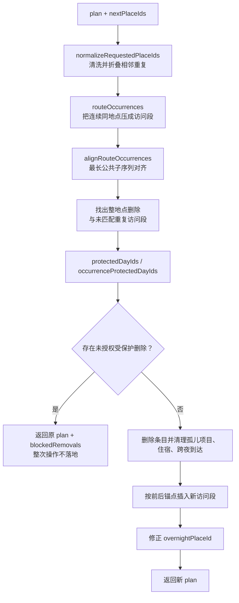

### 9.3 `normalizeRequestedPlaceIds(nextPlaceIds)`

- 输入必须是数组；
- 每项必须是非空字符串；
- 去掉首尾空白；
- 只去掉相邻重复，不去掉离开后返回的重复。

任何非法项都会在克隆和修改前抛出 `TypeError`，避免半清洗输入继续流动。

### 9.4 `routeOccurrences(plan)`

它把跨天连续出现的同地点条目压成一个 occurrence：

```text
第 1 天 北京 ┐
第 2 天 北京 ┘ occurrence 0
第 3 天 上海 ─ occurrence 1
第 4 天 北京 ─ occurrence 2
```

每个 occurrence 仍保留原条目、天 ID 和天索引，所以后续既能按访问段比较，也能定位具体内容。

### 9.5 `alignRouteOccurrences(current, requested)`

它用动态规划计算最长公共子序列（LCS）。目标不是找“地点是否存在”，而是在保持顺序的前提下尽量复用已有访问段。

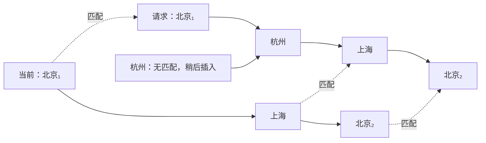

复杂度是 `O(n × m)` 时间和 `O(n × m)` 空间。行程地点通常很少，这个成本可接受；换来的是重复地点下仍稳定的身份保留。

### 9.6 两种保护检查

`protectedDayIds(plan, placeId)` 用于删除某地点的全部出现。以下内容会保护相关天：

- 当天被标记为 `manuallyEdited` 且含该地点；
- 住宿引用该地点；
- 活动、交通的任一地点字段引用该地点。

`occurrenceProtectedDayIds(...)` 用于只删除某一个重复访问段。它更细：若同一天仍有同地点的另一个条目，就不会误把共享内容判为孤儿；它还检查前一天结束于此地的跨夜交通，并把出发日和到达日一起列为受影响天。

### 9.7 为什么阻塞时返回原计划

`reconcileRoutePlaces()` 虽然早已克隆并开始计算，但只要发现一个未授权保护项，就返回调用者传入的原 `plan`，而不是返回“已经改了一半的克隆”。

这叫事务性：

```text
全部规则通过 → 一次性得到新事实
任一规则阻塞 → 事实完全不变
```

`allowRemovalIds` 是确认后的授权集合；再次调用时，允许指定地点的危险删除。

### 9.8 删除后的清理

允许删除后，不只删 `cityEntries`，还要清理：

- 引用已消失地点的活动和交通；
- 引用已消失地点的住宿；
- 前一天到达该地点的跨夜交通；
- 失效的 `overnightPlaceId`；
- 已无地点、项目和住宿的空天。

新地点则优先插在已匹配前驱之后；找不到前驱时，放在已匹配后继之前；两边都无锚点才新建一天。

## 10. 归一化：把外部 JSON 变成可信内存模型

### 10.1 为什么构造与归一化分开

构造器面向项目内部已知参数；归一化器面向文件、旧存储或用户可能改过的 JSON。后者必须防御缺字段、错类型、重复 ID、非法日期和未知项目类型。

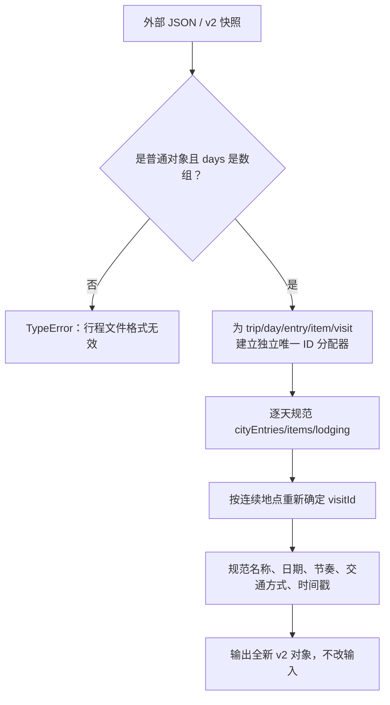

### 10.2 基础小函数

- `isRecord(value)`：只接受非空、非数组对象；
- `identifierOrNull(value)`：`null/undefined` 变 `null`，其他值转字符串；
- `trimmedId(value)`：只接受去空白后仍非空的字符串 ID；
- `stringValue(value)`：`null/undefined` 变空串，其余值用 `String(...)` 转成文本；
- `stringField(value)`：字符串原样保留（包括空串），非字符串变空串；
- `validStartDate(value)`：严格验证 `YYYY-MM-DD` 和真实日历日期；
- `normalizedSavedAt(value)`：合法时间转标准 UTC ISO，否则使用当前时间。

一个值得注意的缝隙：结构 ID 会经过 `trimmedId()`，但地点关系字段使用 `identifierOrNull()`，因此纯空白 `placeId` 可能变成空白字符串而继续存在。测试覆盖了数字转字符串，却没有覆盖纯空白地点 ID；更稳妥的方案是关系 ID 也统一走“去空白或置空”的规则。

### 10.3 `createUniqueIdAllocator(idFactory, prefix)`

每类实体有独立的 `Set`：trip、day、city-entry、item、visit 互不混用命名空间。

分配器先尝试接受一个合法且未出现的旧 ID；不行就调用 `idFactory(prefix)`。最多重试 100 次，仍冲突则抛 `TypeError`，避免死循环。

### 10.4 `normalizeTripItem()`

只接收两种项目：

- `transport`：规范出发地、目的地、班次、时间、跨日偏移和备注；
- `activity`：规范来源类型、来源 ID、地点、标题、时间和备注。

未知类型返回 `null`，随后被数组过滤。导入文件中即使混入 `{ type: "note" }` 也不会污染运行模型。

### 10.5 `normalizeLodging()`

非对象返回 `null`；对象则保留规范后的地点和文本字段。它不强制住宿地点必须等于过夜地点，因为校验器会把这种可编辑但可疑的状态报告为警告。

### 10.6 `normalizeTripPlan()` 的访问段规则

归一化时不盲信外部 `visitId`。它按路线连续性修复：

- 当前地点与上一个条目相同：尽量延续当前访问段；
- 地点改变：开始新访问段；
- 离开后返回同地点：必须再开始一个新访问段。

这样能修复重复或错误的外部访问 ID，同时维持“连续停留”的真实含义。

## 11. 版本迁移：旧路线怎样进入 v2

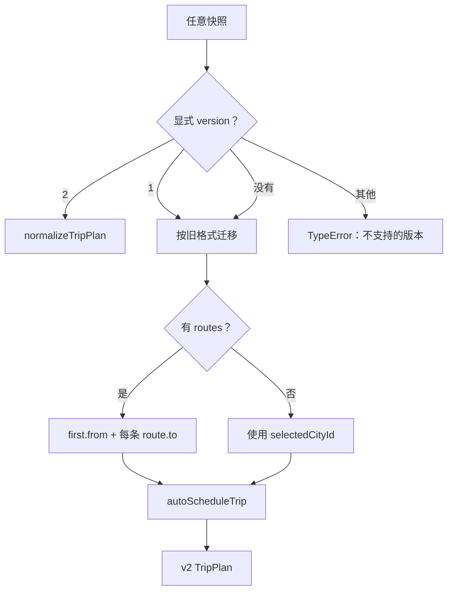

`migrateTripState(data, options)` 的关键策略：

- 显式 v2 必须按 v2 根结构合法；损坏的 v2 不会偷偷当旧版救回来；
- 显式且不支持的版本直接拒绝；
- v1 或无版本快照，从旧 `routes` 提取地点序列；
- 没有路线时退回 `selectedCityId`；
- 旧节奏和交通方式有映射与回退；
- 用 `autoScheduleTrip()` 建立新天、条目和访问段。

`app.js` 恢复和导入时会先 `migrateTripState()`，再调用一次 `normalizeTripPlan()`。对 v2 来说存在重复归一化，通常保持幂等，但多做了一遍遍历和 ID 检查。

### 11.1 `compactTripPlan()` 与 `shouldUseTripFile()`

`compactTripPlan()` 深克隆后只删除 `savedAt`，用于生成更稳定、体积略小的分享内容，不会删用户项目。

`shouldUseTripFile(url)` 只在字符串 URL 长度严格大于 12,000 时返回 `true`。它是产品阈值，不是浏览器协议的普适极限。

## 12. 时间模型：先把“每天几点”放到一条绝对时间轴

### 12.1 `timeToMinutes(value)`

只接受严格 `HH:mm`：

- `00:00` 到 `23:59` 合法；
- `9:00`、`24:00`、`12:60`、数字和空值都返回 `null`。

### 12.2 `absoluteInterval(item, dayIndex)`

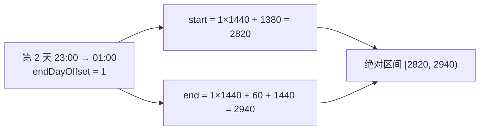

规则：

- 起止时间都必须合法；
- `endDayOffset` 只能是整数 0 或 1；
- 只有交通允许跨日；
- 结束必须严格晚于开始。

所有天放到同一条分钟轴后，跨天重叠不再需要特殊分支。

### 12.3 `previousArrivalReferences()`

它查目标日前一天里所有 `endDayOffset === 1` 且目的地匹配的交通。这里故意做“结构查询”，不要求时间合法：即使用户没填完整时间，这条交通仍引用了次日地点，删除地点时也不能悄悄留下孤儿关系。

### 12.4 `intervalUnionMinutes()`

它先按起点、终点排序，再合并重叠区间。若两段交通在游玩窗口中重叠，不能把重叠部分扣两次。

```text
交通 A：09:00 ───────── 11:00
交通 B：      10:00 ───────── 12:00
并集：  09:00 ───────────────── 12:00  = 3 小时，不是 4 小时
```

## 13. 校验链：八种警告怎样产生

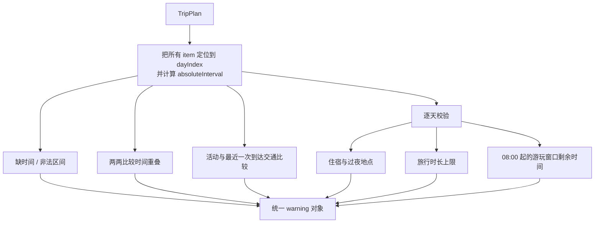

所有警告统一为：

```js
{
  code: "time-overlap",
  dayId: "day-...",
  itemIds: ["item-a", "item-b"],
  severity: "warning"
}
```

| code | 触发条件 | 为什么不是直接拒绝 |
| --- | --- | --- |
| `missing-time` | 项目缺时间、格式非法、跨日规则非法或结束不晚于开始 | 用户可能正在编辑半成品。 |
| `time-overlap` | 任意两个有效绝对区间相交 | 有时重叠是刻意并行安排，应提示而非阻断。 |
| `activity-before-arrival` | 活动开始早于最近一趟已出发、目的地匹配的到达时间 | 提醒现实不可达，但允许用户继续调整。 |
| `lodging-city-mismatch` | 住宿地点与过夜地点不同 | 可能是数据录入错误，也可能尚未完成编辑。 |
| `overnight-city-missing` | 过夜地点不在当天城市条目中 | 结构有矛盾，需要修复。 |
| `travel-over-limit` | 当天发出的跨城交通总时长超过节奏上限 | 节奏是建议，不是硬规则。 |
| `play-time-short` | 当天游玩窗口扣除交通并集后少于 2 小时 | 行程可执行但体验可能很差。 |
| `lodging-missing` | 有过夜地点却没有住宿 | 对过夜日给出补全提醒。 |

### 13.1 重叠比较

所有有效项目两两比较，复杂度 `O(k²)`。个人行程每天项目很少，这比构造复杂区间树更易读、更不易错。

### 13.2 “最近一次到达”

活动可能前面有多趟到达同城的交通。代码选择“出发时间不晚于活动开始”的候选中，出发最晚的一趟，再比较它的到达时间。这样不会拿很早以前的一趟交通遮住最近的未到达状态。

### 13.3 旅行上限与游玩窗口不是同一种计算

- `travel-over-limit`：把交通归到其项目所在的出发日，并计算完整持续时间；
- `play-time-short`：以每天 08:00 开始的窗口裁剪所有跨城交通，只扣与该窗口实际相交的部分，再求区间并集。

前者对跨夜交通会把完整时长计入出发日，后者会跨天裁剪。二者语义不完全对称；若“每日旅行负担”应按自然日衡量，前者也应按日窗口切片。

## 14. 命令链：统一入口怎样执行十种编辑

### 14.1 返回协议

`applyTripCommand(plan, command, options)` 常见返回形态：

```js
{ plan, changed: false }
{ plan: next, changed: true }
{
  plan,
  changed: false,
  requiresConfirmation: true,
  confirmationReason: "cleanup-associated-content",
  affectedDayIds: ["day-1"]
}
{ plan, changed: false, blockedReason: "item-place-mismatch" }
```

它一开始就克隆计划，但无效、未知、受阻或无变化时返回原 `plan` 引用。克隆成本已经发生，只是不会泄露半成品。

### 14.2 上层确认流程

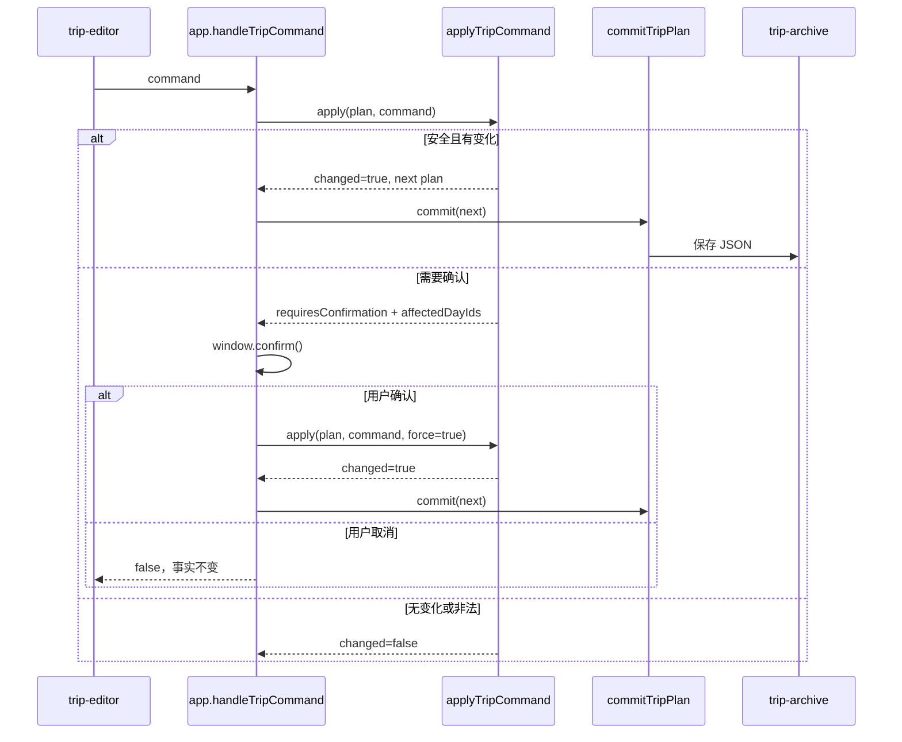

### 14.3 十种命令总表

| 命令 | 成功时做什么 | 拒绝/确认规则 |
| --- | --- | --- |
| `upsert-item` | 编辑时保留 ID；新增时丢弃外部 ID 并生成新 ID；标记项目和当天已人工编辑 | 找不到天/项目或内容语义相同则不变。 |
| `copy-item` | 复制来源项目，生成新 ID，插在来源后 | 找不到项目则不变。 |
| `remove-item` | 从原天删除项目 | 找不到项目则不变。 |
| `move-item` | 保留项目 ID，移动到目标天指定位置，标记两天已编辑 | `canMoveTripItemToDay()` 不通过则原子拒绝。 |
| `remove-city` | 删除城市条目；必要时清项目、住宿、跨夜到达；最后城市被删时删除整天 | 有关联内容时先返回确认请求，`force` 后才清理。 |
| `set-lodging` | 整体设置住宿对象或清为 `null`，标记当天 | 浅层语义相同则不变；允许地点不匹配，交给校验警告。 |
| `set-overnight` | 设置为 `null` 或当天已有地点 | 非当天地点直接拒绝；不自动删除可能遗留的住宿。 |
| `update-metadata` | 只更新显式提供的 `name/startDate/pace/transportMode` | 交通方式会校验；其余字段在此不统一校验；相同值不变。 |
| `move-city` | 同日重排或跨日移动条目，保持访问段 | 跨日若原地内容会成孤儿，需确认并清理。 |
| `set-visit-duration` | 把同一 `visitId` 扩展或缩短到 1–7 天 | 非整数拒绝、整数钳制；缩短含人工内容的天需确认。 |

### 14.4 `upsert-item`

编辑现有项目时保留原 ID，避免 DOM 焦点、警告关联和后续命令失去目标。新增时忽略调用者给的 ID，防止外部伪造或碰撞。

`shallowEqualRecord()` 比较键集合和每个字段的 `Object.is()`；若归一化后的新项目与旧项目相同，则返回原计划。

### 14.5 `copy-item`、`remove-item`、`move-item`

复制必须新 ID；移动必须保留 ID。两者语义相反：复制产生新实体，移动只是改变同一实体的位置。

同日移动先构造重排结果，再逐项比较原数组；位置没变时返回原对象。跨日移动前再次检查地点关联，防止绕过编辑器禁用状态直接调用领域函数。

### 14.6 `remove-city`

先判断删除条目后，同地点是否仍在当天存在。如果还存在，就不应清掉共享活动和住宿。如果完全消失，则检查：

- 当天项目；
- 当天住宿；
- 前一天跨夜到达交通。

首次调用只报告确认；`force: true` 后才删除并清理。若当天最后一个城市消失，而且当天也不再有其他事实，整天从 `days` 删除。

### 14.7 `set-lodging` 与 `set-overnight`

这两个命令故意没有强绑定：住宿可以暂时和过夜地点不一致，校验器显示警告；过夜地点只能指向当天已有城市。这样编辑过程可以处于“暂时不完整”状态，而不必每输入一个字段就满足全部最终约束。

### 14.8 `update-metadata`

它接受 `patch`，也兼容命令顶层字段，只考虑四个白名单键。`transportMode` 会强制落入合法集合；`pace`、`startDate`、`name` 没有在这里复用归一化规则。

因此内部 UI 先裁剪名称、日期输入控件也限制格式，但直接调用 API 仍可写入非法节奏或日期。这是边界校验不一致。

### 14.9 `move-city`

同日只重排；跨日则要判断原天删掉该地点后是否产生孤儿内容，并处理前一天跨夜到达。

一个细微不一致：`remove-city` 会删除完全空掉的天，而跨日 `move-city` 可能保留空天。界面仍能渲染，但数据模型会出现没有城市、项目或住宿的日期。

### 14.10 `set-visit-duration`

先扫描所有天，找同一 `visitId` 的位置：

- 扩展：在访问段后连续插入空白天，并放入同 `visitId` 的地点条目；
- 缩短：从后往前删多余位置，避免数组下标因先删前面而移动；
- 时长只接受整数，并钳制到 1–7；
- 若待删天有项目或住宿，先报告所有受影响天；
- 强制删除时，清理不再有地点支撑的项目并修正过夜地点。

当前保护判断主要看待删天自身的项目和住宿，没有像路线协调那样完整复用“前一天跨夜到达”检查。这是值得补测和统一的规则缝隙。

## 15. `commitTripPlan()`：领域结果怎样成为页面事实

`app.js` 的提交顺序很重要：

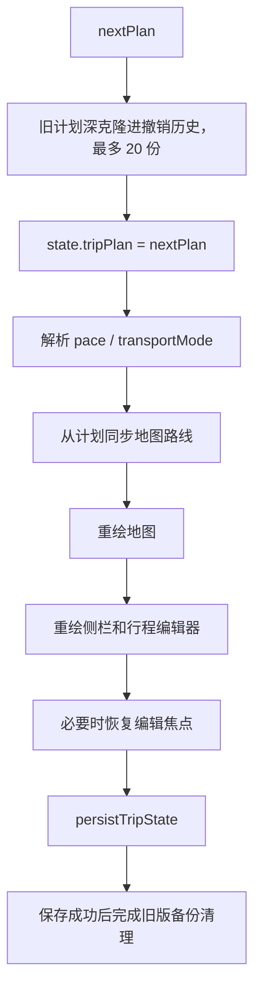

`writeTripPlanV2()` 只是 `JSON.stringify(plan)` 后写入 `TRIP_STORAGE_KEY`，再尝试清理旧分享 hash。它不会修改计划，也不会刷新时间戳。

### 15.1 `savedAt` 的真实语义

代码核对结果：

- `createTripPlan()` 设置当前时间；
- `normalizeTripPlan()` 规范旧时间，非法时换成当前时间；
- `setTripPace()` 这条 `app.js` 特殊路径手工刷新时间；
- `applyTripCommand()`、`commitTripPlan()` 和 `writeTripPlanV2()` 都不会刷新它。

因此用户新增活动、移动城市或保存文件后，`savedAt` 可能仍是创建时间。字段名暗示“最后保存时间”，实现却不保证这一点。更好的做法是让唯一持久化入口在成功写入前构造 `savedAt`，或改名为 `createdAt/importedAt`。

## 16. 44 个函数声明逐一登记

下面按源码顺序列出全部 44 个函数声明。公开表示其他模块可直接导入；私有表示只在本文件内部使用。

| # | 行 | 函数 | 可见性 | 工程作用 |
| ---: | ---: | --- | --- | --- |
| 1 | 9 | `defaultIdFactory` | 私有 | 生成带实体前缀的低碰撞 ID，逐级回退随机能力。 |
| 2 | 24 | `blankDay` | 私有 | 创建字段完整的空白日。 |
| 3 | 35 | `createTripPlan` | 公开 | 从受信任参数创建初始 v2 行程。 |
| 4 | 61 | `cloneTripPlan` | 公开 | 深克隆完整行程树。 |
| 5 | 65 | `autoScheduleTrip` | 公开 | 按路段时长和节奏把地点分配到天。 |
| 6 | 104 | `dayDate` | 公开 | 用开始日期与天索引推导日历日期。 |
| 7 | 113 | `routePlaceIds` | 公开 | 提取路线并折叠相邻重复地点。 |
| 8 | 118 | `resolveTripPace` | 公开 | 返回合法节奏，非法时安全回退。 |
| 9 | 123 | `resolveTripTransportMode` | 公开 | 返回合法交通方式，非法时安全回退。 |
| 10 | 128 | `dayHasPlace` | 私有 | 判断某天是否含指定地点。 |
| 11 | 134 | `canMoveTripItemToDay` | 公开 | 校验活动/交通能否移动到目标天。 |
| 12 | 145 | `ensureValidOvernightPlace` | 私有 | 修正删除后失效的过夜地点。 |
| 13 | 151 | `itemReferencesPlace` | 私有 | 判断项目是否引用待处理地点集合。 |
| 14 | 155 | `protectedDayIds` | 私有 | 找出整地点删除会影响的人工内容日期。 |
| 15 | 172 | `routeOccurrences` | 私有 | 把连续同地点条目压成访问段。 |
| 16 | 187 | `alignRouteOccurrences` | 私有 | 用 LCS 对齐当前与请求路线。 |
| 17 | 217 | `occurrenceProtectedDayIds` | 私有 | 精确判断某个重复访问段的受保护日期。 |
| 18 | 251 | `normalizeRequestedPlaceIds` | 私有 | 校验路线输入、去空白并折叠相邻重复。 |
| 19 | 265 | `reconcileRoutePlaces` | 公开 | 事务性协调路线增删、重复访问和内容保护。 |
| 20 | 430 | `isRecord` | 私有 | 判断值是否为普通对象形态。 |
| 21 | 434 | `identifierOrNull` | 私有 | 将关系标识转字符串或 `null`。 |
| 22 | 440 | `trimmedId` | 私有 | 接受非空字符串结构 ID。 |
| 23 | 446 | `createUniqueIdAllocator` | 私有 | 为一种实体创建全局去重 ID 分配器。 |
| 24 | 464 | `stringValue` | 私有 | 将非字符串文本字段变为空串。 |
| 25 | 468 | `stringField` | 私有 | 将非空字符串关系/可选字段保留，否则置空。 |
| 26 | 472 | `validStartDate` | 私有 | 严格验证真实 `YYYY-MM-DD` 日期。 |
| 27 | 485 | `normalizedSavedAt` | 私有 | 把可解析时间规范成 UTC ISO，非法时用现在。 |
| 28 | 490 | `normalizeTripItem` | 私有 | 规范交通或活动，过滤未知类型。 |
| 29 | 519 | `normalizeLodging` | 私有 | 规范每天唯一的住宿对象。 |
| 30 | 531 | `normalizeTripPlan` | 公开 | 把不可信 v2 形态修复为规范、唯一、不变的新对象。 |
| 31 | 594 | `migrateTripState` | 公开 | 分派 v2 归一化或 v1/无版本迁移。 |
| 32 | 635 | `compactTripPlan` | 公开 | 克隆并去掉 `savedAt`，用于紧凑分享。 |
| 33 | 641 | `shouldUseTripFile` | 公开 | URL 超过 12,000 字符时建议改用文件。 |
| 34 | 645 | `locateEntry` | 私有 | 按城市条目 ID 返回天索引和条目索引。 |
| 35 | 653 | `locateItem` | 私有 | 按项目 ID 返回天索引和项目索引。 |
| 36 | 661 | `safeInsertionIndex` | 私有 | 把插入下标限制在合法范围。 |
| 37 | 666 | `shallowEqualRecord` | 私有 | 比较两个扁平记录是否键值相同。 |
| 38 | 677 | `timeToMinutes` | 公开 | 严格解析 `HH:mm` 为当天分钟数。 |
| 39 | 684 | `absoluteInterval` | 私有 | 将项目转换为跨天绝对分钟区间。 |
| 40 | 697 | `previousArrivalReferences` | 私有 | 找目标日前一日的跨夜到达交通。 |
| 41 | 709 | `intervalUnionMinutes` | 私有 | 合并重叠区间并计算并集分钟数。 |
| 42 | 727 | `addWarning` | 私有 | 统一压入结构完整的 warning。 |
| 43 | 731 | `validateTripPlan` | 公开 | 产生时间、到达、住宿、旅行和游玩警告。 |
| 44 | 825 | `applyTripCommand` | 公开 | 统一分派十种不可变编辑命令。 |

公开函数共 16 个；加上三个公开常量，构成 `trip-plan.js` 的模块接口。

## 17. 126 个箭头函数逐一登记

箭头函数不一定有名字。表中用“所属函数 / 调用点”给它一个可理解的身份。四组计数为 `34 + 27 + 17 + 48 = 126`。

### 17.1 创建、访问段、归一化与基础助手：34 个

| # | 行 | 所属位置 | 该箭头每次被调用时做什么 |
| ---: | ---: | --- | --- |
| 1 | 21 | `defaultIdFactory` / `Array.from` 映射 | 把每个 32 位随机数转为 36 进制字符串。 |
| 2 | 44 | `createTripPlan` / `forEach` | 为每个输入地点建立访问 ID 和城市条目。 |
| 3 | 71 | `autoScheduleTrip` / `addPlace` | 向当前天加入非相邻重复地点并更新过夜地点。 |
| 4 | 114 | `routePlaceIds` / `flatMap` | 逐天取出城市条目映射结果。 |
| 5 | 114 | `routePlaceIds` / 内层 `map` | 把城市条目投影为 `placeId`。 |
| 6 | 115 | `routePlaceIds` / `filter` | 只保留第一项或与前项不同的地点。 |
| 7 | 131 | `dayHasPlace` / `some` | 判断是否有条目的地点 ID 匹配。 |
| 8 | 136 | `canMoveTripItemToDay` / `findIndex` | 定位目标天。 |
| 9 | 146 | `ensureValidOvernightPlace` / `some` | 判断当前过夜地点是否仍在当天。 |
| 10 | 159 | `protectedDayIds` / `forEach` | 逐天检查整地点删除保护。 |
| 11 | 161 | `protectedDayIds` / `some` | 判断人工编辑天是否含该地点。 |
| 12 | 163 | `protectedDayIds` / `some` | 判断某项目是否引用该地点。 |
| 13 | 174 | `routeOccurrences` / 外层 `forEach` | 按天扫描路线条目。 |
| 14 | 175 | `routeOccurrences` / 内层 `forEach` | 把每个条目并入当前访问段或新访问段。 |
| 15 | 190 | `alignRouteOccurrences` / `Array.from` 初始化器 | 为 LCS 矩阵创建每一行零数组。 |
| 16 | 218 | `occurrenceProtectedDayIds` / `map` | 提取访问段覆盖的天索引。 |
| 17 | 222 | `occurrenceProtectedDayIds` / `forEach` | 逐个受影响天检查保护条件。 |
| 18 | 225 | `occurrenceProtectedDayIds` / `some` | 判断同地点是否仍由候选外条目保留。 |
| 19 | 230 | `occurrenceProtectedDayIds` / `some` | 判断当天项目是否引用地点。 |
| 20 | 236 | `occurrenceProtectedDayIds` / `forEach` | 把跨夜交通出发日也加入影响集合。 |
| 21 | 242 | `occurrenceProtectedDayIds` / `sort` | 按天索引升序排列。 |
| 22 | 243 | `occurrenceProtectedDayIds` / `flatMap` | 转成唯一、按顺序的天 ID。 |
| 23 | 261 | `normalizeRequestedPlaceIds` / `filter` | 折叠相邻重复地点。 |
| 24 | 448 | `createUniqueIdAllocator` / 返回闭包 | 接受旧 ID 或重试生成唯一新 ID。 |
| 25 | 551 | `normalizeTripPlan` / `days.map` | 逐天生成规范 Day。 |
| 26 | 554 | `normalizeTripPlan` / `cityEntries.flatMap` | 非对象条目返回空数组，合法条目返回规范条目。 |
| 27 | 571 | `normalizeTripPlan` / `items.map` | 逐个调用 `normalizeTripItem()`。 |
| 28 | 609 | `migrateTripState` / `routes.forEach` | 从每条旧路线追加合法 `to` 地点。 |
| 29 | 647 | `locateEntry` / `findIndex` | 在某天中查城市条目 ID。 |
| 30 | 655 | `locateItem` / `findIndex` | 在某天中查项目 ID。 |
| 31 | 672 | `shallowEqualRecord` / `every` | 检查每个键在两对象中是否 `Object.is` 相等。 |
| 32 | 700 | `previousArrivalReferences` / `flatMap` | 匹配跨夜到达交通并附上来源天索引。 |
| 33 | 711 | `intervalUnionMinutes` / `sort` | 按区间起点、终点排序。 |
| 34 | 715 | `intervalUnionMinutes` / `forEach` | 逐个合并重叠区间或结算上一段。 |

### 17.2 `reconcileRoutePlaces()` 内部：27 个

| # | 行 | 调用点 | 作用 |
| ---: | ---: | --- | --- |
| 1 | 274 | `matches.map` | 提取已匹配的当前访问段索引。 |
| 2 | 276 | `matches.forEach` | 为每个请求位置记录首尾条目锚点。 |
| 3 | 286 | `currentOccurrences.map` | 给访问段附加当前索引。 |
| 4 | 287 | `.filter` | 找“地点仍被请求、但这个重复访问段未匹配”的项。 |
| 5 | 291 | `unmatchedRetainedOccurrences.forEach` | 按地点聚合候选删除条目。 |
| 6 | 293 | `occurrence.entries.forEach` | 把访问段条目加入候选集合。 |
| 7 | 299 | `next.days.map` | 保存原始天 ID 顺序。 |
| 8 | 302 | 局部 `addBlockedRemoval` | 合并某地点的阻塞日期。 |
| 9 | 304 | `dayIds.forEach` | 把日期加入地点阻塞集合。 |
| 10 | 308 | `currentOccurrences.forEach` | 识别请求中完全消失的地点。 |
| 11 | 319 | `unmatchedRetainedOccurrences.forEach` | 检查每个未匹配重复访问段能否删除。 |
| 12 | 329 | `occurrence.entries.forEach` | 登记要删的条目和对应天/地点。 |
| 13 | 337 | `blockedDayIdsByPlace.map` | 生成公开的 `blockedRemovals` 结构。 |
| 14 | 339 | `originalDayIds.filter` | 按原顺序去重并筛出阻塞天。 |
| 15 | 345 | `next.days.forEach` | 逐天删除城市条目。 |
| 16 | 346 | `cityEntries.filter` | 排除整地点删除和局部条目删除目标。 |
| 17 | 352 | `localRemovalTargets.forEach` | 计算局部删除后真正消失的地点。 |
| 18 | 354 | `placeIds.filter` | 只保留当天已无条目的地点。 |
| 19 | 355 | `cityEntries.some` | 判断同地点是否仍留在当天。 |
| 20 | 361 | `cleanupTargets.forEach` | 为每个目标日查跨夜到达清理项。 |
| 21 | 362 | `placeIds.forEach` | 逐地点查询前日到达。 |
| 22 | 363 | `previousArrivalReferences().forEach` | 按来源天聚合需删除的交通。 |
| 23 | 370 | `next.days.forEach` | 清项目、住宿、到达交通并修正过夜地点。 |
| 24 | 376 | `items.filter` | 删除引用消失地点的项目。 |
| 25 | 380 | `items.filter` | 删除已聚合的前日跨夜到达项目。 |
| 26 | 383 | `days.filter` | 删除没有地点、项目和住宿的空天。 |
| 27 | 387 | `requested.forEach` | 为未匹配请求地点寻找锚点并插入新条目。 |

### 17.3 `validateTripPlan()` 内部：17 个

| # | 行 | 调用点 | 作用 |
| ---: | ---: | --- | --- |
| 1 | 733 | `days.flatMap` | 为每一天展开已定位项目。 |
| 2 | 733 | 内层 `items.map` | 给项目附加天、天索引和绝对区间。 |
| 3 | 739 | `locatedItems.filter` | 选出有效跨城交通。 |
| 4 | 743 | `locatedItems.forEach` | 逐项目报告缺时间并发起重叠比较。 |
| 5 | 748 | `slice(...).forEach` | 与后续项目比较区间重叠。 |
| 6 | 758 | `locatedItems.filter` | 选出活动。 |
| 7 | 758 | `.forEach` | 逐活动检查到达先后。 |
| 8 | 761 | 候选交通 `.filter` | 找到达同地点且已在活动前出发的交通。 |
| 9 | 768 | `.reduce` | 选择出发最晚的候选到达交通。 |
| 10 | 782 | `plan.days.forEach` | 逐天执行住宿、过夜、旅行与游玩检查。 |
| 11 | 786 | `cityEntries.some` | 检查过夜地点是否存在。 |
| 12 | 790 | `crossCityTravelItems.filter` | 选出从当前天出发的交通。 |
| 13 | 791 | `travelItems.reduce` | 累加完整旅行秒数。 |
| 14 | 795 | `travelItems.map` | 收集超限警告涉及的项目 ID。 |
| 15 | 805 | `crossCityTravelItems.flatMap` | 把交通裁剪到当前游玩窗口。 |
| 16 | 811 | `playWindowTravel.map` | 取裁剪区间供并集计算。 |
| 17 | 814 | `playWindowTravel.map` | 收集并去重游玩时间警告项目 ID。 |

### 17.4 `applyTripCommand()` 内部：48 个

| # | 行 | 命令/调用点 | 作用 |
| ---: | ---: | --- | --- |
| 1 | 828 | `upsert-item` / `days.find` | 查目标天。 |
| 2 | 832 | `upsert-item` / `items.findIndex` | 查同 ID 现有项目。 |
| 3 | 867 | `move-item` / `days.find` | 查目标天。 |
| 4 | 884 | `move-item` / `reordered.every` | 判断同日移动后顺序是否未变。 |
| 5 | 900 | `remove-city` / `entries.filter` | 计算删除后的城市条目。 |
| 6 | 901 | `remove-city` / `some` | 判断同地点是否仍在当天。 |
| 7 | 909 | `remove-city` / `items.some` | 判断项目是否引用待删地点。 |
| 8 | 916 | `remove-city` / `previousArrivals.forEach` | 把跨夜交通来源天加入影响集合。 |
| 9 | 925 | `remove-city` / `sort` | 排序受影响天索引。 |
| 10 | 926 | `remove-city` / `map` | 将影响索引转天 ID。 |
| 11 | 930 | `remove-city` / 到达项 `forEach` | 按来源天聚合跨夜交通。 |
| 12 | 935 | `remove-city` / 聚合表 `forEach` | 逐来源天执行交通清理。 |
| 13 | 937 | `remove-city` / `items.filter` | 删除匹配的跨夜交通对象。 |
| 14 | 946 | `remove-city` / `items.filter` | 删除当天引用消失地点的项目。 |
| 15 | 954 | `set-lodging` / `days.find` | 查目标天。 |
| 16 | 968 | `set-overnight` / `days.find` | 查目标天。 |
| 17 | 969 | `set-overnight` / `cityEntries.some` | 校验新过夜地点属于当天。 |
| 18 | 984 | `update-metadata` / 白名单 `forEach` | 从 patch 或命令顶层收集显式字段。 |
| 19 | 993 | `update-metadata` / `keys.filter` | 找真正发生变化的键。 |
| 20 | 995 | `update-metadata` / `changedKeys.forEach` | 把变化写入克隆。 |
| 21 | 1002 | `move-city` / `days.find` | 查目标天。 |
| 22 | 1010 | `move-city` / `reordered.every` | 判断同日城市重排是否无变化。 |
| 23 | 1022 | `move-city` / `entries.filter` | 模拟来源天移除条目。 |
| 24 | 1023 | `move-city` / `some` | 判断来源天是否仍含同地点。 |
| 25 | 1031 | `move-city` / `items.some` | 判断来源天是否有孤儿风险。 |
| 26 | 1037 | `move-city` / 到达项 `forEach` | 收集跨夜交通影响天。 |
| 27 | 1048 | `move-city` / `sort` | 排序需确认的天索引。 |
| 28 | 1049 | `move-city` / `map` | 将索引转成天 ID。 |
| 29 | 1054 | `move-city` / 到达项 `forEach` | 按来源天聚合待清交通。 |
| 30 | 1059 | `move-city` / 聚合表 `forEach` | 逐来源天执行清理。 |
| 31 | 1061 | `move-city` / `items.filter` | 删除跨夜到达交通。 |
| 32 | 1070 | `move-city` / `items.filter` | 删除来源天孤儿项目。 |
| 33 | 1087 | `set-visit-duration` / 外层 `days.forEach` | 扫描每一天。 |
| 34 | 1087 | `set-visit-duration` / 内层 `entries.forEach` | 收集同 `visitId` 的所有位置。 |
| 35 | 1096 | `locations.map` | 把待移除位置投影为 Day。 |
| 36 | 1097 | `.filter` | 只保留含项目或住宿的危险天。 |
| 37 | 1098 | `.map` | 提取并去重危险天 ID。 |
| 38 | 1112 | `locationsToRemove.forEach` | 按天聚合待删访问条目。 |
| 39 | 1117 | `removalsByDay.sort` | 按天索引倒序准备删除。 |
| 40 | 1118 | `removalDays.forEach` | 逐天执行访问时长缩短。 |
| 41 | 1120 | `entries.map` | 建待删条目 ID 集合。 |
| 42 | 1121 | `entries.map` | 建待删地点 ID 集合。 |
| 43 | 1122 | `cityEntries.filter` | 删除指定访问条目。 |
| 44 | 1127 | `remaining cityEntries.map` | 建剩余地点集合。 |
| 45 | 1128 | `removedPlaceIds.filter` | 找当天真正消失的地点。 |
| 46 | 1129 | `items.filter` | 清理引用孤儿地点的项目。 |
| 47 | 1134 | `next.days.forEach` | 逐天标记仍属于该访问段的天。 |
| 48 | 1135 | `cityEntries.some` | 判断当天是否仍含目标 `visitId`。 |

## 18. 测试证据：不是只凭阅读猜行为

`tests/trip-plan.test.mjs` 共 1,801 行、66 个测试。当前实测结果：66 通过、0 失败。

| 行为组 | 数量 | 主要证明 |
| --- | ---: | --- |
| 创建与自动排期 | 7 | 无日期创建、弱随机环境 ID、交通元数据、日期推导、节奏换日、返回地点新访问段、相邻重复折叠。 |
| 十种命令与不变性 | 22 | 访问时长、城市/项目移动、复制删除、确认清理、跨夜关系、住宿、元数据、无操作返回原引用。 |
| 时间与可行性校验 | 7 | 严格时间、跨夜区间、最近到达、按日窗口裁剪、重叠并集和统一警告结构。 |
| 路线协调 | 11 | 新地点插入、重复访问、局部删除、保护授权、阻塞事务性、空天删除和锚点插入。 |
| 归一化、迁移与分享边界 | 19 | 根结构、类型修复、全局 ID 唯一、真实日期、低年份、版本拒绝、旧路线迁移、时间戳、紧凑分享和 URL 阈值。 |

尤其重要的工程证据：

- 多个测试先 `structuredClone(source)`，执行后断言原输入未变；
- 无操作断言返回的就是原对象，而不只是深度相等；
- ID 工厂碰撞会重试，连续 100 次无法唯一会失败；
- 重复路线 `A-B-A` 的不同 occurrence 可以独立保护和删除；
- 一次路线协调只要存在一个阻塞项，整个计划保持不变；
- `0099-01-01` 这种低年份也能正确推导下一天。

## 19. 为什么这样设计：五组逐层追问

### 19.1 为什么用不可变命令

1. 为什么不直接改对象？直接改会同时污染撤销历史和其他持有旧引用的消费者。
2. 为什么要返回 `changed`？上层只有变化时才需要重绘、入历史和保存。
3. 为什么无变化返回原引用？引用相等是便宜而明确的变化信号。
4. 为什么危险操作不在领域层弹窗？领域层不应依赖浏览器 UI，Node 测试也不应伪造弹窗。
5. 能否更好？可以把十种命令拆成独立 handler，并由统一事务壳负责克隆、确认协议和结果类型。

结论：不可变方向正确；单一巨型分派器已接近维护上限。

### 19.2 为什么单独建 `visitId`

1. 同一地点可能跨连续多天。
2. 同一地点也可能离开后再次返回。
3. `placeId` 无法区分两次停留。
4. 条目 ID 又太细，无法把连续多天作为一个整体调时长。
5. `visitId` 正好表达“连续访问段”，使 1–7 天调整成为稳定领域操作。

结论：这是模型中最关键、也最值得保留的身份层。

### 19.3 为什么路线协调用 LCS

1. 用户可能在路线中间插入地点。
2. 按下标会让插入点后的所有元素错配。
3. 地点可能重复，`Set` 或普通字典会丢失 occurrence。
4. LCS 能在保持顺序下最大化复用旧访问段。
5. 行程规模很小，二维矩阵成本远低于错误移动人工内容的风险。

结论：算法选择合理；可用带注释的匹配结果类型提高可读性。

### 19.4 为什么校验只警告不阻断

1. 用户编辑时经常处于半完成状态。
2. 强制每一步都完整会让表单难以使用。
3. 旅行时间上限和住宿缺失也不是绝对非法。
4. 统一 warning 让编辑器决定怎样展示，而领域层保持纯数据。
5. 真正结构性危险由命令守门和确认协议阻断。

结论：软校验与硬约束分层正确，但应书面定义哪条规则属于哪层。

### 19.5 为什么迁移与归一化分开

1. 迁移回答“旧概念怎样映射到新概念”。
2. 归一化回答“同版本数据怎样修复类型和缺失字段”。
3. 两者分开后，未来 v3 可以复用 v2 归一化或新增迁移步骤。
4. 损坏 v2 不回退成旧版，避免错误解释数据。
5. 当前 app 又额外归一化一次，说明调用约定还可收紧。

结论：职责划分正确；公开入口应明确保证“迁移返回的就是最终规范对象”，避免调用者重复处理。

## 20. 更好的方案，按优先级排序

### 20.1 第一优先级：统一元数据 schema 和 `savedAt`

- 让创建、命令更新、导入都复用同一套 `normalizeTripMetadata()`；
- `name` 统一裁剪到 60 字符；
- `startDate` 统一严格日期；
- `pace`、`transportMode` 统一枚举；
- 明确 `savedAt` 是事实更新时间还是持久化成功时间；
- 若是保存时间，由单一持久化事务更新，所有命令不得各自手工处理。

### 20.2 第二优先级：拆分巨型命令分派器

建议结构：

```text
applyTripCommand
├── commandHandlers.upsertItem
├── commandHandlers.moveItem
├── commandHandlers.removeCity
├── commandHandlers.moveCity
├── commandHandlers.setVisitDuration
└── ...
```

公共壳只负责：输入检查、克隆、分派、结果规范化和开发环境不变性断言。每个 handler 可单测自己的前置条件与清理规则。

### 20.3 第三优先级：集中“移除地点后的孤儿清理”

`reconcileRoutePlaces`、`remove-city`、`move-city`、`set-visit-duration` 都在做相似工作，却各自维护一套细微不同的检查。应抽成：

```js
analyzePlaceRemoval(plan, removals)
applyPlaceRemoval(next, analysis)
```

统一覆盖当天项目、住宿、过夜地点和前日跨夜到达，消除“某命令会清、另一命令漏清”的风险。

### 20.4 第四优先级：让类型或 schema 可机器检查

当前纯 JavaScript 依赖约定。可以先用 JSDoc typedef，不必立刻迁移 TypeScript：

```js
/** @typedef {{ id: string, type: "activity", placeId: string, ... }} Activity */
```

再配合一个运行时 schema 验证器，让导入错误包含字段路径，例如 `days[2].items[1].startTime`，比统一的“格式无效”更利于用户修复文件。

### 20.5 第五优先级：补齐边界测试

建议新增：

- `update-metadata` 直接写非法 `pace/startDate/name`；
- 纯空白 `placeId/fromPlaceId/toPlaceId` 的归一化；
- 缩短访问段时，前一天有跨夜交通到达待删日；
- `move-city` 移走最后事实后是否应删除空天；
- 常规命令保存后 `savedAt` 的产品期望；
- `applyTripCommand(plan, null)` 的公开 API 行为。

### 20.6 第六优先级：按自然日统一旅行负担

若产品把“每日交通上限”理解为当天实际占用，应像游玩窗口一样把跨夜交通切到各自然日，而不是全部记在出发日。可以先明确产品定义，再统一两个计算口径。

## 21. 零基础读者怎样亲手跟一条命令

建议从 `move-item` 开始，因为它连接了 UI、规则、不可变更新和保存：

1. 在 `trip-editor.js` 找生成 `{ type: "move-item" }` 的位置。
2. 写下 `itemId`、`targetDayId`、`targetIndex` 三个输入。
3. 进入 `app.js` 的 `handleTripCommand()`。
4. 看第一次调用 `applyTripCommand()`。
5. 在 `canMoveTripItemToDay()` 逐项核对活动或交通的地点规则。
6. 同日移动时，看 `safeInsertionIndex()` 与 `every()` 怎样识别无操作。
7. 跨日移动时，看项目 ID 为什么保持不变。
8. 回到 `commitTripPlan()`，观察旧计划怎样进入最多 20 份的历史。
9. 跟到 `syncRoutesFromTripPlan()`、地图重绘和编辑器重绘。
10. 最后进入 `persistTripState()` 与 `writeTripPlanV2()`，确认保存的是整份新计划。
11. 在测试中找 “copies, removes and moves items without losing their IDs”。
12. 再找 “rejects item moves that would break day and place associations atomically”。

如果只记住本章一条工程原则，请记住：

> 复杂编辑器最重要的不是“能把数组改掉”，而是先定义稳定身份、硬约束、软警告和危险操作协议，再让每次修改像一笔可验证、可撤销、可持久化的账。

## 22. 下一章预告

下一章将拆解 `trip-editor.js`：这份领域事实怎样变成每天的 HTML、警告怎样贴回具体项目、按钮和拖动怎样只产生普通命令，以及焦点为什么能在整块重新渲染后恢复。

继续阅读：[第 7 章：行程事实怎样变成可编辑、可拖动、可恢复焦点的日历](./07-trip-editor.md)

回看：[第 5 章：食行记怎样变成搜索词、推荐卡和地图标记](./05-food-content.md)
