# 第 7 章：行程事实怎样变成可编辑、可拖动、可恢复焦点的日历

> 本章完整拆解 `public/static-site/trip-editor.js`，并追踪它与 `trip-plan.js`、`app.js`、`index.html` 的协作边界。主文件共 566 行、23,316 字节；AST 识别出 59 个函数节点：31 个函数声明、28 个箭头函数，没有对象方法或传统函数表达式。正文会逐个解释全部 59 个节点，并补充 `app.js` 中负责打开表单、提交命令、重绘和恢复焦点的适配函数。

## 1. 学完本章能回答什么

1. `TripPlan` 对象怎样变成每天一张卡片的 HTML？
2. 为什么这个文件既不是纯粹的“页面”，也不是行程业务内核？
3. `data-action`、`data-day-id` 为什么能代替给每个按钮单独写监听器？
4. 添加交通、活动和住宿为什么共用一张表单？
5. 隐藏不用的表单字段时，为什么还必须把控件设为 `disabled`？
6. 按钮点击、下拉框变化和拖放怎样变成同一种领域命令？
7. 为什么“打开编辑框”不直接变成 `TripPlan` 命令？
8. 整块日历用 `innerHTML` 重建后，键盘焦点为什么不会总是跳回页面顶部？
9. `WeakMap` 怎样避免同一个编辑器重复安装监听器？
10. 外部地点名、活动标题和恶意 ID 为什么不能注入脚本？
11. 手机端不能拖拽时，为什么仍能移动城市和项目？
12. 当前编辑器有哪些字段会丢失、操作不够精确或难以维护？

## 2. 五问核验后的架构结论

| 核验问题 | 结论 |
| --- | --- |
| 编辑器真正拥有什么？ | 它拥有三套翻译规则：表单值→领域命令、行程数据→安全 HTML、DOM 事件→领域命令。它不拥有当前计划、撤销历史、确认弹窗和持久化。 |
| 谁是事实来源？ | `state.tripPlan` 才是事实。编辑器生成的 HTML 是一次投影；按钮和拖放只产生意图，必须交给 `trip-plan.js` 再次验证后才能成为新事实。 |
| 为什么所有交互都围绕 `data-*`？ | HTML 只携带动作名和稳定 ID；一个根节点监听器就能识别现在及以后生成的所有子控件。重绘后无需逐按钮重新绑定。 |
| 为什么需要焦点令牌？ | 整块 `innerHTML` 替换会销毁旧 DOM 和当前焦点。令牌保存“刚才操作的是哪类控件、哪个实体”，新 DOM 建成后可寻找等价控件或安全退路。 |
| 最大的实现缺口是什么？ | 活动表单收集 `address`，但领域归一化、日历展示和指南导出没有完整接纳它，重载后会丢失；此外 warning 的 `itemIds` 未被用于定位具体项目，拖放只能插到一天首位。 |

一句话总结：

> `trip-editor.js` 是行程领域与浏览器 DOM 之间的“协议翻译器”：一边只读事实并生成安全界面，另一边只把用户动作翻译成普通对象，真正改数据的权力仍留在领域层。

## 3. 先认识本章需要的 JavaScript 和浏览器概念

### 3.1 HTML 字符串与 DOM 元素不是一回事

`renderTripEditorMarkup()` 返回的是字符串：

```js
const html = '<button data-action="remove-item">删除</button>';
```

`app.js` 再执行：

```js
tripEditorRoot.innerHTML = html;
```

浏览器此时才把字符串解析为真正的按钮节点。渲染函数不需要浏览器 DOM，因此可以在 Node 测试里直接检查输出文本。

### 3.2 `data-*` 是写在 HTML 上的小纸条

```html
<button
  data-action="remove-item"
  data-day-id="day-1"
  data-item-id="item-7"
>删除</button>
```

浏览器会把它们放进 `element.dataset`：

```js
element.dataset.action; // "remove-item"
element.dataset.dayId;  // "day-1"
element.dataset.itemId; // "item-7"
```

连字符后的字母转成驼峰形式：`data-target-day-id` 对应 `dataset.targetDayId`。

### 3.3 事件冒泡与事件代理

点击按钮里的图标时，事件目标可能是图标，不一定是按钮。事件会沿 DOM 树向上冒泡。`delegatedTarget()` 用 `closest("[data-action]")` 向上找真正的动作控件。

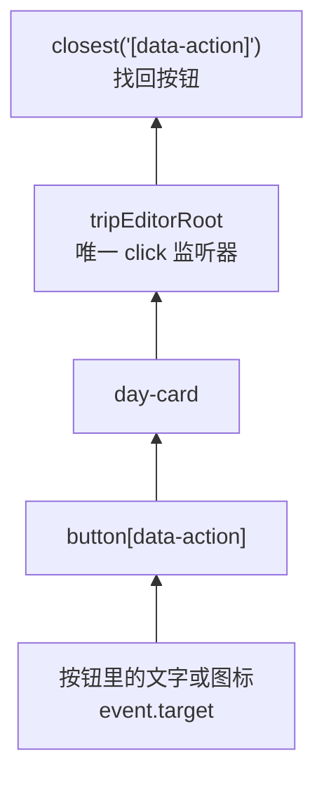

这叫事件代理：父节点代替所有后代监听事件。

### 3.4 回调注入

`mountTripEditor()` 不直接导入 `app.js`，而是接收两个函数：

```js
mountTripEditor({
  root,
  onCommand,
  onEditRequest
});
```

编辑器只决定何时调用它们；调用后怎样弹窗、改状态和保存由外层决定。这样模块不会形成循环依赖。

### 3.5 闭包

`mountTripEditor()` 里的 `onClick`、`onDrop` 和 `cleanup` 都能记住本次传入的 `root`、`onCommand` 与 `onEditRequest`。函数执行结束后这些变量仍存在，这就是闭包。

### 3.6 `WeakMap`

```js
const MOUNT_CLEANUPS = new WeakMap();
```

它以 DOM 根节点为键，记录该节点当前有效的清理函数。和普通 `Map` 相比，`WeakMap` 不会因为自己持有键而阻止一个废弃 DOM 节点被垃圾回收。

### 3.7 `requestAnimationFrame()`

它把工作安排到浏览器下一次绘制前。提交后先同步尝试恢复焦点，再在下一帧重试一次，可以跨过 DOM 布局、对话框关闭等时序差异。

### 3.8 XSS：为什么每个外部字符串都要转义

如果活动标题是：

```text
<script>alert("x")</script>
```

直接拼进 `innerHTML` 会被浏览器当标签解析。`escapeHtml()` 把 `<` 变成 `&lt;`、引号变成实体，使它只能显示为文字。

## 4. 四层怎样协作

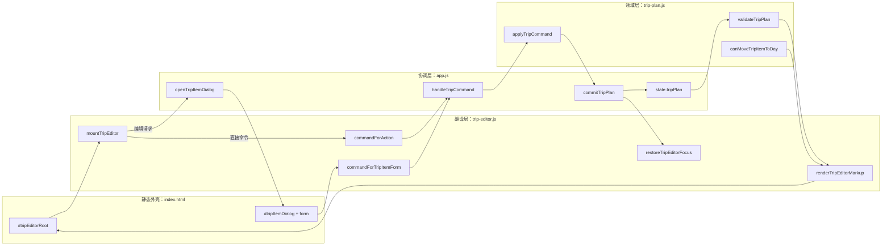

关键是单向流动：

```text
事实 → HTML → 用户动作 → 命令 → 新事实 → 新 HTML
```

编辑器不会从现有 HTML 反推整份计划，也不会把 DOM 当数据库。

## 5. 文件内部其实有三条流水线

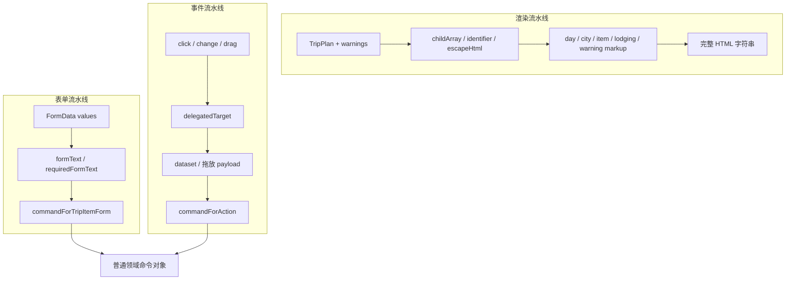

这种拆分使测试不必启动真实浏览器：表单翻译、HTML 输出、动作翻译都能作为普通函数测试；只有挂载生命周期需要一个极小的假 DOM。

## 6. 表单流水线：输入怎样成为命令

### 6.1 五个基础助手

`isRecord(value)` 只接受非空、非数组对象；`formText(value)` 把空值变空串，其余值转字符串、去首尾空白；`requiredFormText(value, fieldName)` 要求原值必须是字符串且清洗后非空，否则抛 `TypeError`。

`formItemWithId(values, item)` 处理新增与编辑的差别：

- 隐藏字段 `itemId` 有值：把 ID 放回项目，领域层会按 ID 更新；
- 没有 ID：不创建 `id: ""`，让领域层生成新 ID。

`identifier(value)` 则服务于 data 属性和渲染：它确认字符串去空白后非空，但返回原字符串，不返回 `trim()` 后的值。这在正常浏览器 dataset 中通常没问题，但作为公开函数间接输入边界并不严谨；`" item-1 "` 会被视为有效却保留空格。

### 6.2 三种表单分支

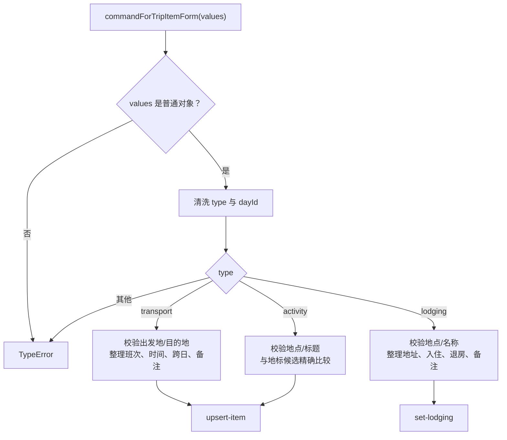

#### 交通

必填：`dayId`、`fromPlaceId`、`toPlaceId`。

可选文本统一变成无首尾空白的字符串。复选框值为 `1`、`"1"`、`true` 或 `"on"` 时，`endDayOffset` 才是 1，否则是 0。

#### 活动

必填：`dayId`、`placeId`、`title`。

地标候选名先清洗并放进 `Set`；标题精确命中候选时标为 `sourceType: "landmark"`，否则是 `"custom"`。这里只保存类型，没有保存具体地标 ID，所以同名地标无法区分，地标改名后也无法稳定追踪。

#### 住宿

必填：`dayId`、`placeId`、住宿名称。它产生 `set-lodging`，而不是伪装成 timeline item，因为领域模型规定每天只有一份住宿对象。

### 6.3 为什么隐藏字段还要禁用

`configureTripItemForm()` 不仅设置 `hidden`：

```js
field.hidden = !supported;
control.disabled = !supported;
```

原因是隐藏只影响显示，隐藏控件的旧值仍可能被 `FormData` 收集；禁用后浏览器不会提交它。例如从交通切到活动，如果不禁用 `fromPlaceId`，旧交通字段可能悄悄混入活动命令。

## 7. `app.js` 怎样打开和提交共用对话框

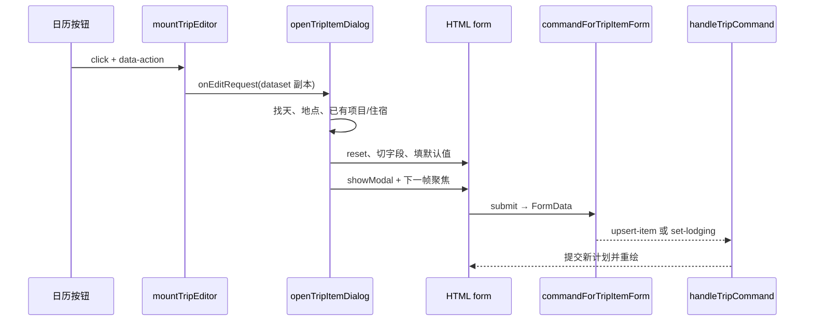

### 7.1 `openTripItemDialog()`

它先确认计划、天和当天地点存在。四种编辑请求映射为三种表单类型：

| `data-action` | 表单类型 | 初始数据 |
| --- | --- | --- |
| `add-transport` | transport | 当天首尾地点、空文本 |
| `add-activity` | activity | 过夜地点或首个地点、地标候选 |
| `edit-item` | 原项目的 transport/activity | 现有字段与稳定项目 ID |
| `edit-lodging` | lodging | 现有住宿或当天默认地点 |

地点 `<option>` 用 `document.createElement()` 和 `textContent` 建立，不通过 `innerHTML`，因此地点名即使含 `<` 也只是文字。

活动地点变化时，`renderTripLandmarkOptions()` 重新生成该地点的 datalist。候选来自内置城市地标和已加载缓存，再按名称去重。

### 7.2 `submitTripItemForm()`

它把 `FormData.entries()` 转成普通对象，调用纯函数生成命令，先关闭对话框，再交给 `handleTripCommand()`。失败统一显示“补全必填信息”。

这里的 `catch` 会同时吞掉输入错误和意外编程错误；更好的做法是只把预期的 `TypeError` 转成用户提示，其他错误记录日志或重新抛出。

### 7.3 当前表单能力的边界

- 没有“清除住宿”按钮，虽然领域层支持 `set-lodging` 的 `null`；
- 活动地址只在编辑框中可见，日历项目不显示；
- 表单只能把活动识别为 landmark/custom，重新保存导入的 food/free 活动可能改变来源类型；
- 交通地点下拉只列当天地点，领域层允许的“目的地仅在次日”的跨夜交通不一定能由表单表达。

## 8. 渲染流水线：一棵计划怎样变成 HTML 树

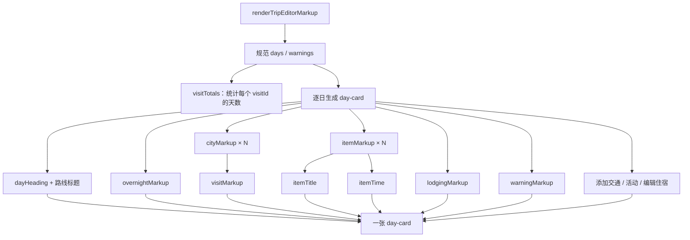

### 8.1 防御性入口

计划没有非空 `days` 时直接返回空串。每个 day 若不是对象就替换成空对象；`childArray()` 只从数组中保留普通对象。这样损坏的子数组不会让整个页面崩溃。

这不是完整 schema 校验。真正导入时仍应先走 `normalizeTripPlan()`；渲染层的防御只是最后一道“不白屏”保险。

### 8.2 日期

`safeDayDate()` 捕获 `dayDate()` 的异常；`utcWeekday()` 用 UTC 并通过 `setUTCFullYear()` 正确处理 `0099` 这类低年份；`dayHeading()` 组合：

```text
第 1 天 · 2026-10-01 · 星期四
```

没有开始日期时只显示“第 1 天”。

### 8.3 访问时长控件

`visitTotals()` 先统计每个 `visitId` 出现几天；`seenVisits` 再记录渲染到了第几次。

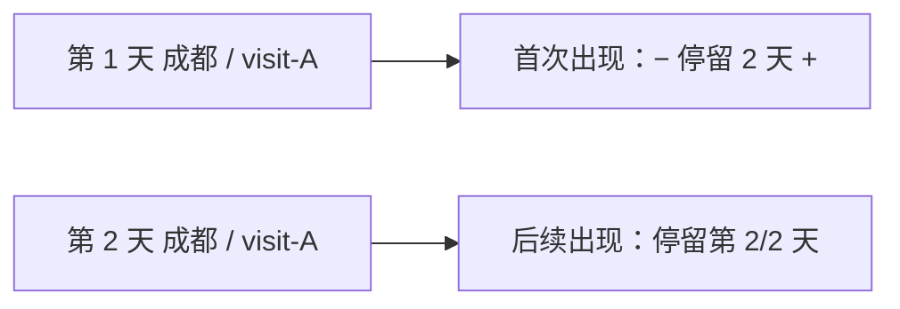

只在首次出现处放步进按钮，避免同一访问段出现多组重复控制。1 天时“减少”禁用，7 天时“增加”禁用；`commandForAction()` 仍再次检查 1–7 边界，不能只依赖按钮状态。

### 8.4 城市行

`cityMarkup()` 输出：

- 可拖动城市行与拖动种类/条目 ID；
- 安全地点名；
- 访问时长或进度；
- 手机端“移动到第几天”的下拉框；
- 删除城市按钮。

城市移动下拉包含所有天，包括当前天，目标下标固定为 0。因此选择当前天可能把城市重排到当天首位。

### 8.5 过夜地点

`overnightMarkup()` 从当天城市条目提取唯一地点。当前过夜 ID 若不存在，“待定”自动选中。它绝不会给出其他天的地点选项，这和领域层 `set-overnight` 的硬约束一致。

### 8.6 timeline 项目

`itemTitle()` 对交通显示“出发地 → 目的地 · 班次”，对活动显示标题。`itemTime()` 在两端时间完整时显示区间，跨夜时在结束前加“次日”；否则显示“待补充”。

`itemMarkup()` 输出编辑、复制、移动和删除控件。移动选项通过 `canMoveTripItemToDay()` 逐天筛选，所以 UI 会先隐藏不合法目标；领域命令执行时仍会再次校验，形成双层防守。

当前卡片不显示活动地址、项目备注或来源类型。数据即使存在，用户也必须重新打开编辑框才能看到部分字段。

### 8.7 住宿与警告

`lodgingMarkup()` 展示地点、名称、地址、入住、退房和备注；没有住宿时显示“待补充”。

`warningMarkup()` 只使用领域警告的 `code`：八个已知 code 映射为固定中文；未知 code 被转义后显示。外部 `warning.message` 完全忽略，避免不可信消息直接进入 HTML。

但领域警告中的 `itemIds` 也被忽略，因此警告只能挂到整天，不能高亮具体冲突项目。

## 9. HTML 安全边界

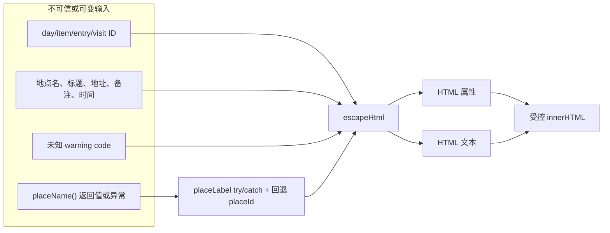

`escapeHtml()` 同时转义 `& < > " '`，所以既适合文本节点，也覆盖双引号属性。测试把恶意脚本放进天 ID、条目 ID、项目 ID、地点 ID、活动标题、住宿和 warning code，验证最终没有原始 `<script>`。

安全依赖一条纪律：所有新增插值都必须先转义。手写模板字符串很容易在未来漏掉某个字段；DOM 构建器、模板库或 Trusted Types 能把这条纪律变成更强的结构约束。

## 10. 动作协议：`data-action` 怎样变成命令

### 10.1 两类动作

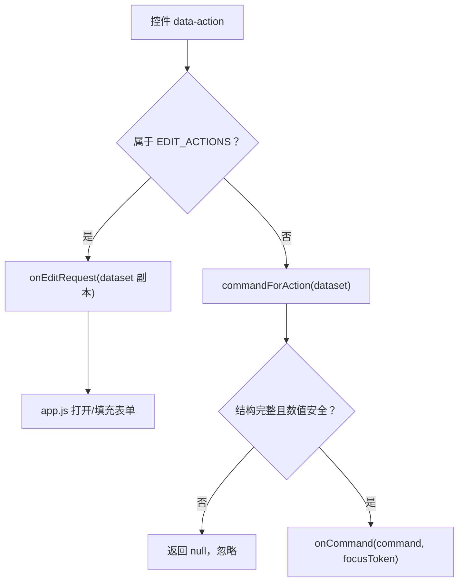

打开表单的四种动作不是领域事实变化，所以不该生成命令。删除、移动、复制、过夜地点和停留天数可以立即描述完整意图，直接生成命令。

### 10.2 完整映射

| UI 动作 | 输出 |
| --- | --- |
| `add-transport` | `onEditRequest`，打开交通表单 |
| `add-activity` | `onEditRequest`，打开活动表单 |
| `edit-item` | `onEditRequest`，按项目 ID 填表 |
| `edit-lodging` | `onEditRequest`，填住宿表单 |
| `move-city` | `{ type: "move-city", entryId, targetDayId, targetIndex }` |
| `move-item` | `{ type: "move-item", itemId, targetDayId, targetIndex }` |
| `set-overnight` | `{ type: "set-overnight", dayId, placeId }`；空值变 `null` |
| `remove-city` | `{ type: "remove-city", entryId }` |
| `copy-item` | `{ type: "copy-item", itemId }` |
| `remove-item` | `{ type: "remove-item", itemId }` |
| `increase-stay` | `set-visit-duration`，当前值 +1，最多 7 |
| `decrease-stay` | `set-visit-duration`，当前值 −1，最少 1 |
| 未知/缺字段动作 | `null` |

### 10.3 `safeInteger()` 为什么拒绝 `01` 和 `1e2`

移动下标可能来自字符串。代码只接受规范无符号十进制：`"0"`、`"12"`；拒绝空白、负号、小数、科学计数法、十六进制、前导零和超出安全整数范围的值。

这样同一个输入只有一种文本表示，不会出现浏览器、序列化或日志对 `"1e2"` 理解不一致。

## 11. 焦点协议：DOM 被重建后怎样继续操作

### 11.1 为什么普通元素引用失效

提交命令后，`renderTripPlanner()` 会清空并重新设置 `innerHTML`。旧按钮对象已经不在文档中；保存 `oldButton` 没有意义。

`focusTokenForAction()` 保存的是语义身份：

```js
{
  action: "move-item",
  dayId: "day-1",
  targetDayId: "day-2",
  itemId: "item-7"
}
```

### 11.2 恢复优先级

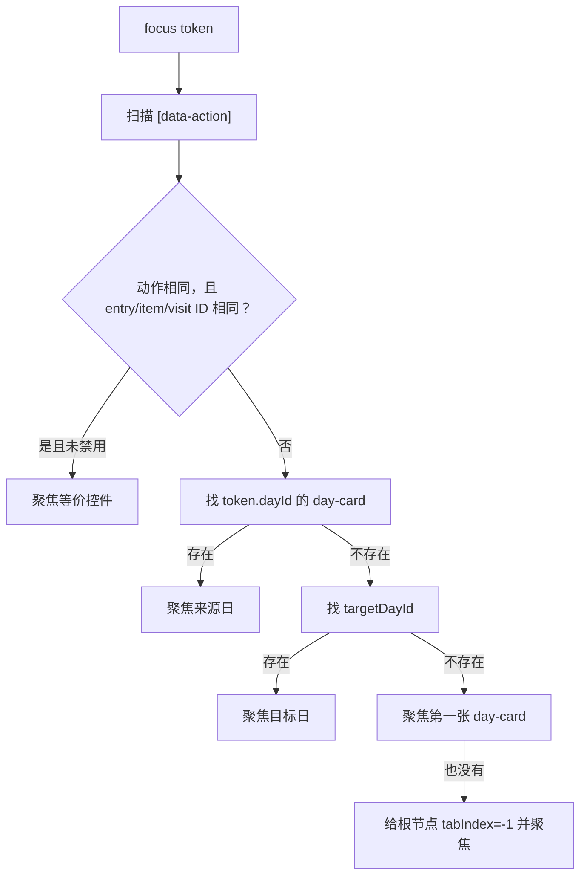

有实体 ID 时不要求 dayId 相同，这是刻意的：项目移动到另一日后，等价控件的天已经变化，但 `itemId` 仍稳定。

实现没有把任意 ID 拼进 CSS 选择器，而是取所有候选后比较 `dataset`。这样不需要处理引号、反斜杠等选择器转义，也减少恶意 ID 破坏查询的风险。

`focusElement()` 会拒绝不存在、禁用或没有 `.focus()` 的元素。

## 12. 挂载生命周期：五个监听器怎样只保留一份

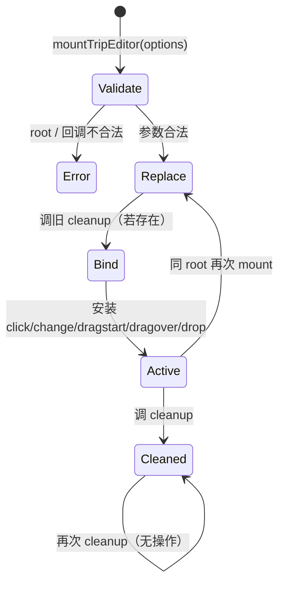

`MOUNT_CLEANUPS.get(root)?.()` 保证同一根节点不会叠加旧监听器。清理函数内部有 `active` 标志，因此幂等；它还只在 WeakMap 当前值仍是自己时删除映射，旧清理函数不会夺走新挂载的所有权。

`app.js` 每次渲染前也显式调用 `state.tripEditorDestroy()`。编辑器自身替换和 app 主动销毁形成双重防守，略有重复，但能避免生命周期调用方遗漏。

## 13. 五类 DOM 事件逐条拆解

### 13.1 `click`

`onClick` 先通过 `delegatedTarget()` 找动作控件：

- 编辑类：复制 `dataset` 后调用 `onEditRequest`；
- 直接类：调用 `commandForAction`；成功后连同焦点令牌交给 `onCommand`；
- 未知或不完整：安静忽略。

复制 `{ ...control.dataset }` 很重要。回调修改请求对象不会反向修改真实 DOM dataset，DOM 后续变化也不会修改已经交出的请求快照。

### 13.2 `change`

下拉框的当前值不在静态 `data-*` 中：

- `move-city/move-item`：把 `control.value` 写到副本 `targetDayId`；
- `set-overnight`：写到副本 `placeId`；
- 其他 change：忽略。

原 dataset 和计划都不被修改。

### 13.3 `dragstart`

只接受 `data-drag-kind` 为 `city` 或 `item` 且 ID 为非空字符串的行。写入专用 MIME：

```text
application/x-trip-entry
```

payload 只含：

```json
{"kind":"city","id":"ce-1"}
```

浏览器若拒绝自定义拖放类型，异常会被捕获，页面不会崩溃。

### 13.4 `dragover`

只有事件位于 `[data-drop-day]` 内时才 `preventDefault()`。浏览器把这视为“这里允许 drop”。

### 13.5 `drop`

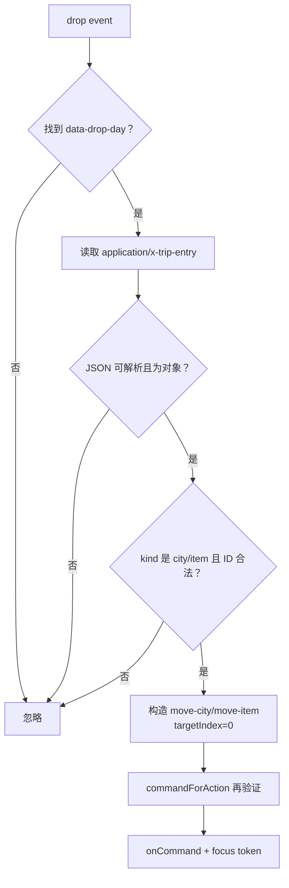

伪造 payload 仍可能写出一个“请求移动已知 ID”的命令，但不能绕过领域层：实体不存在、目标天不存在或项目地点不匹配时，`applyTripCommand()` 会拒绝。拖放 payload 是输入，不是授权。

当前 drop 总插到目标日索引 0，没有根据鼠标位置计算精确插入点，也没有拖入提示线。这是可用但较粗糙的第一版。

## 14. `renderTripPlanner()` 怎样把整个闭环接起来

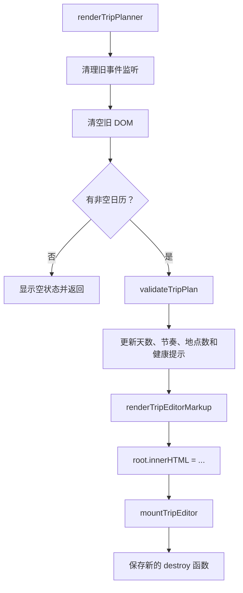

名称和日期输入框有一个细节：若它们正是 `document.activeElement`，渲染时不覆盖 `.value`，避免用户输入到一半被异步路线刷新打断。

`commitTripPlan()` 在渲染完成后调用 `restoreTripEditorFocus()`，再在下一帧调用一次。领域层、渲染层和焦点层因此构成完整反馈循环。

## 15. `app.js` 的编辑器适配函数

这些函数不属于主文件的 59 个 AST 节点，但决定编辑器如何进入整站：

| 函数 | 作用 |
| --- | --- |
| `commitTripPlan` | 保存旧计划到历史、替换事实、重绘、恢复焦点并持久化。 |
| `tripIdentifier` | 清洗 app 边界使用的字符串 ID。 |
| `affectedTripDayLabels` | 把领域层确认所涉及的天 ID 转成人类可读日期。 |
| `handleTripCommand` | 执行命令、处理确认协议、报告阻塞并提交变化。 |
| `tripFormControl` | 按 `name` 找共用表单控件。 |
| `setTripFormValue` | 区分普通控件和 checkbox 写值。 |
| `tripDayPlaceIds` | 提取当天唯一地点顺序。 |
| `populateTripPlaceSelect` | 用 DOM API 安全生成地点选项和默认值。 |
| `landmarkNamesForPlace` | 合并内置与缓存地标名并去重。 |
| `renderTripLandmarkOptions` | 重建活动标题 datalist。 |
| `configureTripItemForm` | 切换三种表单的标签、显示和禁用状态。 |
| `closeTripItemDialog` | 兼容原生 dialog 与 open 属性降级。 |
| `openTripItemDialog` | 校验请求、填充表单、打开弹窗并聚焦。 |
| `submitTripItemForm` | FormData→命令→提交，错误时给用户提示。 |
| `updateTripNameMetadata` | 裁剪名称并提交元数据命令。 |
| `updateTripStartDateMetadata` | 提交日期或 `null`。 |
| `undoTripEdit` | 从历史弹出上一计划，不重复记录历史。 |
| `routeDurationsForAutoSchedule` | 为自动排期收集当前路线时长。 |
| `autoScheduleCurrentTrip` | 必要时确认覆盖人工安排，再重建日历。 |
| `renderTripPlanner` | 校验、生成 HTML、挂载事件并保存 cleanup。 |

页面底部事件绑定再把名称、日期、自动排期、撤销、表单提交、取消和活动地点变化接入 `queueTripAction()`，保证这些用户动作沿同一个串行队列执行。

## 16. 31 个函数声明逐一登记

| # | 行 | 函数 | 可见性 | 工程作用 |
| ---: | ---: | --- | --- | --- |
| 1 | 15 | `escapeHtml` | 私有 | 把五种 HTML 特殊字符转为安全实体。 |
| 2 | 25 | `isRecord` | 私有 | 判断是否为非空、非数组对象。 |
| 3 | 29 | `identifier` | 私有 | 接受去空白后非空的字符串，但返回原字符串。 |
| 4 | 33 | `childArray` | 私有 | 从数组中只保留普通对象，否则返回空数组。 |
| 5 | 37 | `formText` | 私有 | 把表单可选值转成去空白字符串。 |
| 6 | 41 | `requiredFormText` | 私有 | 强制表单必填值为非空字符串。 |
| 7 | 48 | `formItemWithId` | 私有 | 编辑时附带清洗后的 ID，新增时省略 ID。 |
| 8 | 53 | `commandForTripItemForm` | 公开 | 把交通、活动或住宿表单转成领域命令。 |
| 9 | 112 | `placeLabel` | 私有 | 安全调用地点名函数、降级并转义。 |
| 10 | 125 | `safeDayDate` | 私有 | 捕获日期推导异常并返回 `null`。 |
| 11 | 133 | `utcWeekday` | 私有 | 从严格日期形态计算 UTC 星期，支持低年份。 |
| 12 | 142 | `dayHeading` | 私有 | 组合天序号、日期和星期。 |
| 13 | 150 | `visitTotals` | 私有 | 统计每个访问段覆盖的天数。 |
| 14 | 161 | `dayOptions` | 私有 | 生成经过允许条件筛选的日期 option。 |
| 15 | 170 | `moveDayOptions` | 私有 | 在日期选项前加入禁用的“移动到…”占位项。 |
| 16 | 174 | `visitMarkup` | 私有 | 首次访问条目生成时长步进器，后续生成进度。 |
| 17 | 194 | `cityMarkup` | 私有 | 生成一行可拖动城市及移动/删除控件。 |
| 18 | 212 | `overnightMarkup` | 私有 | 生成当天唯一地点的过夜选择器。 |
| 19 | 236 | `itemTime` | 私有 | 生成人类可读时间范围或“待补充”。 |
| 20 | 244 | `itemTitle` | 私有 | 生成交通路线/班次或活动标题。 |
| 21 | 256 | `itemMarkup` | 私有 | 生成 timeline 项目及编辑、复制、移动、删除控件。 |
| 22 | 279 | `lodgingMarkup` | 私有 | 生成住宿完整摘要或缺失提示。 |
| 23 | 299 | `warningMarkup` | 私有 | 将当天警告 code 映射成安全中文列表。 |
| 24 | 311 | `renderTripEditorMarkup` | 公开 | 把计划和警告纯投影为完整日历 HTML。 |
| 25 | 356 | `safeInteger` | 私有 | 严格解析规范、非负、安全整数。 |
| 26 | 364 | `focusTokenForAction` | 公开 | 从动作数据提取稳定焦点身份。 |
| 27 | 376 | `focusElement` | 私有 | 仅聚焦存在、未禁用且可聚焦的元素。 |
| 28 | 382 | `restoreTripEditorFocus` | 公开 | 按等价控件、相关天、首天、根节点顺序恢复焦点。 |
| 29 | 407 | `commandForAction` | 公开 | 把直接 UI 动作严格转换为领域命令。 |
| 30 | 459 | `delegatedTarget` | 私有 | 从事件目标向上寻找且限制在 root 内的匹配控件。 |
| 31 | 468 | `mountTripEditor` | 公开 | 验证协作者、安装五类代理监听并返回幂等 cleanup。 |

公开 API 共 6 个：表单命令、HTML 渲染、焦点令牌、焦点恢复、动作命令和挂载函数。

## 17. 28 个箭头函数逐一登记

| # | 行 | 所属位置 | 每次调用时做什么 |
| ---: | ---: | --- | --- |
| 1 | 16 | `escapeHtml` / `replace` 回调 | 把匹配到的特殊字符查表替换为实体。 |
| 2 | 152 | `visitTotals` / 外层 `forEach` | 逐天扫描城市条目。 |
| 3 | 153 | `visitTotals` / 内层 `forEach` | 逐条目累计 `visitId` 次数。 |
| 4 | 161 | `dayOptions` 默认参数 | 未传筛选器时允许所有天。 |
| 5 | 162 | `dayOptions` / `flatMap` | 逐天过滤并生成一个 option 或空数组。 |
| 6 | 216 | `overnightMarkup` / `forEach` | 按首次出现顺序收集唯一地点。 |
| 7 | 226 | `overnightMarkup` / `map` | 为每个地点生成带 selected 状态的 option。 |
| 8 | 271 | `itemMarkup` / 允许条件 | 调领域规则判断项目能否移到候选天。 |
| 9 | 301 | `warningMarkup` / `map` | 把每个 warning 变成安全 `<li>`。 |
| 10 | 313 | `renderTripEditorMarkup` / `plan.days.map` | 非对象 day 替换为空对象。 |
| 11 | 318 | `renderTripEditorMarkup` / 外层 `days.map` | 把每一天变成 day-card。 |
| 12 | 322 | `renderTripEditorMarkup` / `entries.map` | 把路线条目变成安全地点名。 |
| 13 | 324 | `renderTripEditorMarkup` / `warnings.filter` | 只取当前 dayId 的警告。 |
| 14 | 332 | `renderTripEditorMarkup` / 城市 `map` | 为每个城市条目生成城市行。 |
| 15 | 343 | `renderTripEditorMarkup` / 项目 `map` | 为每个 timeline 项目生成项目行。 |
| 16 | 369 | `focusTokenForAction` / `forEach` | 从白名单身份键复制有效字符串。 |
| 17 | 384 | `restoreTripEditorFocus` / `filter` | 选出令牌中可用的实体身份键。 |
| 18 | 385 | `restoreTripEditorFocus` / 动作控件 `find` | 寻找动作和身份都相同的等价控件。 |
| 19 | 388 | `restoreTripEditorFocus` / `every` | 要求所有实体身份键都匹配 dataset。 |
| 20 | 397 | `restoreTripEditorFocus` / day-card `find` | 按 fallback dayId 查对应日期卡。 |
| 21 | 481 | `mountTripEditor` / `onClick` | 区分编辑请求与直接命令。 |
| 22 | 492 | `mountTripEditor` / `onChange` | 把选择值合并到 dataset 副本并生成命令。 |
| 23 | 507 | `mountTripEditor` / `onDragStart` | 验证拖动行并写专用 JSON payload。 |
| 24 | 520 | `mountTripEditor` / `onDragOver` | 只为合法日期 drop 区允许投放。 |
| 25 | 525 | `mountTripEditor` / `onDrop` | 防御性解析 payload 并生成索引 0 移动命令。 |
| 26 | 555 | `mountTripEditor` / 安装 `forEach` | 给 root 安装五类监听器。 |
| 27 | 558 | `mountTripEditor` / `cleanup` | 幂等移除监听器并释放当前 WeakMap 所有权。 |
| 28 | 561 | `cleanup` / 移除 `forEach` | 逐类移除已安装监听器。 |

## 18. AST 复算：识别一个清单口径陷阱

人工分组容易把 `dayOptions` 默认参数 `() => true` 或 `cleanup` 内部的 `forEach` 漏掉。机器 AST 是最终口径：

```text
FunctionDeclaration      31
ArrowFunctionExpression  28
总计                     59
```

上表与 AST 精确一致。`restoreTripEditorFocus` 只有 4 个箭头：第 384、385、388、397 行；第 395 行 `.filter(identifier)` 传入的是已经存在的具名函数引用，不会新建箭头函数，因此没有在表中重复计数。

这个例子说明：

> “一次数组方法调用”不等于“新建一个函数”。`.filter(identifier)` 复用已有函数；`.filter((value) => ...)` 才会新增箭头函数节点。

## 19. 测试证据

`tests/trip-editor.test.mjs` 共 1,132 行、31 个测试。当前实测：31 通过、0 失败。

| 行为组 | 数量 | 直接证明 |
| --- | ---: | --- |
| 表单翻译 | 6 | 三种表单、文本清洗、编辑 ID、跨日复选框、地标/自定义分类和必填拒绝。 |
| HTML 渲染 | 8 | 日期、低年份、访问步进器、城市/项目控件、住宿、八种警告、XSS、不变性和损坏子数组降级。 |
| 动作翻译 | 8 | 手机移动选择、全部直接动作、1–7 天边界、未知/缺字段拒绝和严格安全整数。 |
| 挂载与浏览器事件 | 9 | 协作者校验、幂等清理、重复挂载、点击/变更代理、焦点令牌与恢复、dataset 快照、拖放和敌意 payload。 |

重要证据包括：

- 恶意脚本被放进所有主要外部字段，输出不含原始 `<script>`；
- 渲染前后深度比较计划，证明渲染不改输入；
- 同 root 第二次挂载后只剩一份监听器；
- 调用旧 cleanup 不会清掉新挂载；
- 拖放只写 `application/x-trip-entry`；
- 损坏 JSON、未知 kind、空 ID、数字 ID 和抛错的 `getData()` 都被安全忽略；
- 删除后的等价控件不存在时，焦点依次退回相关天和根节点。

## 20. 为什么这样设计：五组逐层追问

### 20.1 为什么返回 HTML 字符串

1. 日历是整棵由计划决定的视图。
2. 字符串渲染能用纯函数一次生成完整结构。
3. Node 测试只需比较文本，无需浏览器。
4. 事件代理使重建后不必逐控件绑监听。
5. 代价是焦点丢失和手工转义风险，所以又需要焦点令牌和严格 `escapeHtml`。

结论：对当前规模合理；规模继续增长时应考虑组件化或 DOM diff。

### 20.2 为什么事件只产生普通对象

1. DOM 控件不应直接修改领域对象。
2. 普通对象可以记录、测试和重放。
3. 领域层能统一执行地点关联和危险删除检查。
4. 鼠标、手机下拉和拖放可以汇入同一种命令。
5. 上层可在同一提交入口实现撤销、保存和焦点恢复。

结论：这是编辑器最坚实的架构选择。

### 20.3 为什么用事件代理

1. 每次命令后整块日历都会重建。
2. 逐按钮监听会不断销毁和重装大量回调。
3. `data-*` 足以携带动作与稳定 ID。
4. 根监听器能接住未来生成的后代事件。
5. `closest + root.contains` 又能避免把边界外控件误当编辑器动作。

结论：事件代理与当前全量重绘模型高度匹配。

### 20.4 为什么要 WeakMap 和幂等 cleanup

1. app 可能因多种状态变化重复渲染。
2. 重复监听会让一次点击提交两次命令。
3. WeakMap 按 root 找到旧 cleanup。
4. `active` 让 cleanup 调两次也安全。
5. 所有权比较避免旧 cleanup 删除新挂载记录。

结论：生命周期实现细小但严谨，值得保留。

### 20.5 为什么焦点按身份而不是 DOM 位置恢复

1. 重绘后旧 DOM 对象失效。
2. 移动后同一实体可能换到另一日。
3. `itemId/entryId/visitId` 比数组位置稳定。
4. 控件被删除时还能退回相关日。
5. 扫描 dataset 避免把不可信 ID 拼进 CSS 选择器。

结论：这是为键盘和辅助技术用户补上的关键状态连续性。

## 21. 更好的方案，按优先级排序

### 21.1 第一优先级：修复活动字段 schema 断裂

必须先决定活动是否真正拥有 `address`：

- 若拥有：在 `normalizeTripItem()`、导出模型、日历摘要和相关测试中完整保留；
- 若不拥有：从表单删除该字段，避免制造“保存成功但重载消失”的假象。

同时让 landmark/food/free 使用稳定 `sourceId`，不要只靠标题猜来源。

### 21.2 第二优先级：使用统一的动作 schema

目前 `data-*`、`commandForAction()`、`applyTripCommand()` 各自维护字符串和字段规则。可建立命令定义表或 JSDoc 判别联合：

```js
/** @typedef {{type:"move-item", itemId:string, targetDayId:string, targetIndex:number}} MoveItemCommand */
```

表单、事件和领域层共享同一 schema，错误能报告具体字段路径。

### 21.3 第三优先级：把 warning 定位到具体控件

利用领域层已有 `itemIds`：

- timeline 项目添加对应 warning class 和 `aria-describedby`；
- 天级警告仍保留摘要；
- 点击警告可聚焦冲突项目；
- 两项目重叠时同时标记两项。

### 21.4 第四优先级：精确拖放与键盘重排

- 根据 drop 位置计算 `targetIndex`，显示插入线；
- 支持同一天精确排序，不总是索引 0；
- 增加键盘“上移/下移/移到某日”按钮；
- 用 `aria-live` 宣告移动结果；
- 拖动中验证 payload 后再显示可投放状态。

### 21.5 第五优先级：降低整块 `innerHTML` 重建成本

可以先不引入框架：

- 给 day-card 建 `Map<dayId, element>`；
- 只替换受影响天；
- 保留未变化输入和展开状态；
- 焦点令牌仍作为删除/移动后的保险。

若后续采用 React，应保留领域层纯函数和稳定 ID，不把规则塞回组件事件中。

### 21.6 第六优先级：强化可观测错误

- `placeName()` 异常可回退，但开发环境应记录；
- 表单只把已知输入 `TypeError` 显示为用户提示；
- 拖放解析失败可在开发日志区分损坏 JSON 与浏览器限制；
- `identifier()` 应返回 `value.trim()`，统一 ID 语义。

### 21.7 第七优先级：补齐缺失操作

- 清除住宿；
- 活动来源选择或推荐来源保留；
- 复制城市访问段是否需要明确产品能力；
- 交通目的地允许选择次日城市；
- 备注和地址在卡片上以可折叠摘要显示。

## 22. 零基础读者怎样亲手跟一次“移动活动”

1. 在 `itemMarkup()` 找 `data-action="move-item"` 的 `<select>`。
2. 看它怎样用 `canMoveTripItemToDay()` 生成可选日期。
3. 在浏览器中选择目标日，触发根节点的 `change`。
4. 进入 `onChange`，注意它复制 dataset，而不是修改原 dataset。
5. 看 `control.value` 怎样成为 `targetDayId`。
6. 进入 `commandForAction()`，观察 `safeInteger("0", 0)`。
7. 写下生成的 `{ type: "move-item", itemId, targetDayId, targetIndex: 0 }`。
8. 看 `focusTokenForAction()` 额外保存 action、来源日、目标日和 itemId。
9. 进入 `app.handleTripCommand()`，再进入 `trip-plan.applyTripCommand()`。
10. 看领域层再次调用 `canMoveTripItemToDay()`，不能只信 UI。
11. 进入 `commitTripPlan()`，观察历史、状态、重绘和保存。
12. 旧 DOM 被清空后，看 `restoreTripEditorFocus()` 怎样按 itemId 找到新位置的移动下拉框。
13. 最后读测试 “change delegation handles the current day...” 和 “editor commands include stable focus tokens...”。

如果只记住本章一条工程原则，请记住：

> 浏览器界面应该表达和翻译用户意图，而不是偷偷拥有业务事实；稳定 ID、普通命令和可清理的事件生命周期，才让一次点击在重绘、撤销和保存之后仍然可解释。

## 23. 下一章预告

下一章将拆解 `trip-archive.js` 与 `app.js` 的恢复事务：浏览器存储、URL 分享快照、v1 备份、候选优先级、导入回滚和部分失败怎样避免用户行程被覆盖或丢失。

继续阅读：[第 8 章：行程怎样安全保存、恢复、迁移、分享与回滚](./08-trip-archive.md)

回看：[第 6 章：`TripPlan` 怎样成为可编辑、可校验、可迁移的行程事实账本](./06-trip-plan.md)
