# 第 8 章：行程怎样安全保存、恢复、迁移、分享与回滚

> 本章完整拆解 `public/static-site/trip-archive.js`，并连接 `app.js` 中的启动恢复、旧版迁移、文件导入、分享和失败回滚。主文件共 338 行、10,522 字节；AST 识别出 34 个函数节点：25 个函数声明、5 个箭头函数、3 个对象方法函数表达式和 1 个类构造方法。正文逐个登记全部 34 个节点，并用 18 项领域测试和整站边界测试核对事务顺序。

## 1. 学完本章能回答什么

1. 浏览器到底把行程保存在哪里，为什么只能保存字符串？
2. v2 存档、v1 存档、v1 迁移备份和 URL 分享快照有什么区别？
3. 为什么保存时必须先写本机存储，再清理地址栏中的旧分享快照？
4. 打开页面时同时存在分享链接、本机 v2 和旧版 v1，程序先信谁？
5. 为什么最高优先级快照缺少区县资料时要“等待”，不能直接使用次优存档？
6. 旧版行程为什么先完整验证，再备份原文，最后才提交 v2？
7. 为什么 v1 原文要原样保存，而不是重新 `JSON.stringify()`？
8. 文件导入中途失败，内存计划、撤销历史和 localStorage 怎样一起恢复？
9. “回滚成功”与数据库的真正原子事务有什么区别？
10. 清空时某个存储键删不掉，程序怎样报告部分失败？
11. 分享链接为什么放在 URL hash，内容太长时为什么自动改用文件？
12. 文件名怎样兼容 Windows 保留名、非法字符和 Unicode？
13. 紧急旧版原文为什么比当前 v2 计划有更高的导出优先级？
14. 当前存档架构哪里可靠，哪里仍可能让用户困惑或丢失信息？

## 2. 五问核验后的架构结论

| 核验问题 | 结论 |
| --- | --- |
| 存档模块真正拥有什么？ | 它拥有存储访问适配、恢复候选读取与选择、URL hash 退役、v1 原文备份、清除、存储快照/回滚、分享 URL、文件名与 JSON 文件载荷；它不拥有行程 schema 迁移和页面状态提交。 |
| 哪个来源优先？ | `#trip` 分享快照最高，其次本机 v2，最后本机 v1。高优先级无效可以降级；高优先级只因地点数据尚未加载而不可验证时必须延迟，不能降级。 |
| 安全迁移的不可破坏条件是什么？ | 旧版数据必须先成功解析、迁移、归一化并确认所有地点可识别，然后才能把精确原文写入备份；备份失败则不提交迁移。 |
| 导入回滚保护了什么？ | 它同时保护内存计划、撤销历史、交通方式、节奏、地图路线、选中地点、路线 ID 计数、v2 存档、v1 备份和相关控制标志。 |
| 最大的边界缺口是什么？ | localStorage 没有多键事务，回滚只能逐键尽力；紧急 v1 原文只在当前页面内存；分享内容不压缩、不加密、不校验完整性；恢复错误消息还混有中英文。 |

一句话总结：

> `trip-archive.js` 不是“保存按钮工具”，而是行程事实跨越内存、浏览器存储、地址栏和文件时的事务边界：先保全可恢复来源，再允许新事实取代旧事实，并把每一种部分失败显式交还给上层。

## 3. 先认识本章需要的浏览器与 JavaScript 概念

### 3.1 序列化与反序列化

浏览器 `localStorage` 只能保存字符串。对象要先变成 JSON 文本：

```js
const raw = JSON.stringify(plan); // 对象 → 字符串
storage.setItem(key, raw);

const planLike = JSON.parse(raw); // 字符串 → 普通对象
```

`JSON.parse()` 只证明文本语法合法，不证明它符合 `TripPlan` 结构。导入后仍要迁移、归一化和检查地点。

### 3.2 localStorage 的三个现实限制

- 同源隔离：协议、域名或端口不同，看到的存储不同；
- 同步 API：读写会阻塞当前 JavaScript 线程；
- 可能抛错：隐私设置、安全策略、无痕模式或容量不足都可能让读取或写入失败。

所以“浏览器提供了 localStorage”不等于“每次都能访问”。

### 3.3 URL hash

下面 `#` 之后是 fragment/hash：

```text
https://example.test/planner#trip=%7B...%7D
```

它通常不会随 HTTP 请求发送给服务器，适合纯前端分享状态；但会出现在地址栏、浏览器历史和被复制的链接中，所以不是加密保险箱。

### 3.4 快照与回滚

快照是修改前的状态副本或引用集合。若后续步骤失败，程序按快照恢复：

```text
修改前 → 拍快照 → 尝试修改 → 成功：丢弃快照
                         └→ 失败：用快照回滚
```

本项目没有数据库事务管理器，因此多键恢复可能部分成功、部分失败；返回值必须报告失败键。

### 3.5 “原子”与“尽力而为”

- 单个 `localStorage.setItem()` 在正常浏览器语义下要么替换成功，要么抛错；
- 多个 `setItem/removeItem()` 之间没有统一提交点；
- `restoreTripArchiveSnapshot()` 会尝试所有指定键，但无法保证它们一起恢复。

因此本章称其为“补偿式事务”，不是数据库级 ACID 事务。

### 3.6 自定义错误类与 `instanceof`

`MissingTripPlacesError` 不表示文件坏了，只表示恢复所需地点可能尚未异步加载。选择器用：

```js
error instanceof MissingTripPlacesError
```

把它和 JSON 损坏、版本错误区分开，决定“等待”还是“尝试下一候选”。

### 3.7 Unicode 代码点

JavaScript 字符串底层是 UTF-16，一个补充平面字符可能占两个 code unit。`Array.from(text)` 按 Unicode 代码点拆分，截断文件名时不会把字符劈成孤立代理项。

## 4. 四种存档载体先分清

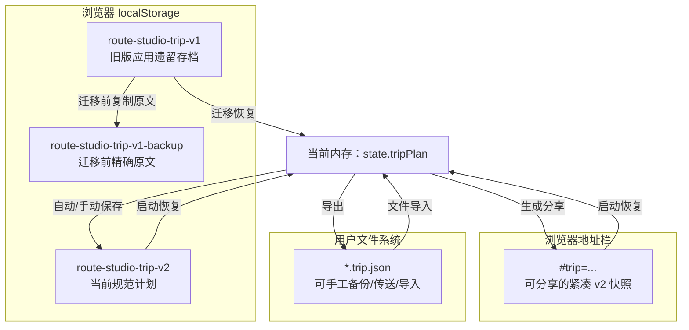

三个 localStorage 键的职责不同：

| 键 | 内容 | 何时删除 |
| --- | --- | --- |
| `route-studio-trip-v2` | 当前 v2 计划 JSON | 用户清空，或被新 v2 覆盖 |
| `route-studio-trip-v1` | 旧应用留下的 v1 | 迁移完成且下一次有效保存成功后 |
| `route-studio-trip-v1-backup` | 迁移时复制的精确 v1 原文 | 与 v1 一起最终清理 |

`IMPORT_SNAPSHOT_KEYS` 只包含 v2 和 backup，因为导入流程不会修改旧应用的 v1 键；不需要回滚未触碰的内容。

## 5. 模块之间怎样分工

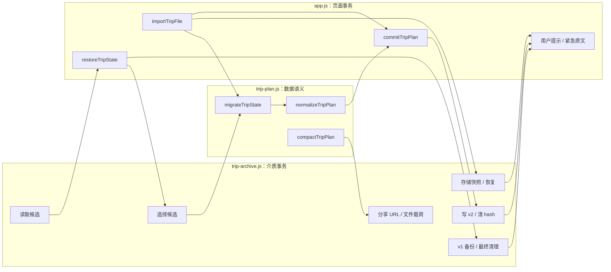

`trip-archive.js` 不自行解释 v1 路线怎样变成天；它只准备原始数据、安排候选、保护介质。真正 schema 迁移留在 `trip-plan.js`，当前页面状态和提示留在 `app.js`。

## 6. 延迟存储适配器：为什么不直接保存 `window.localStorage`

### 6.1 调用关系

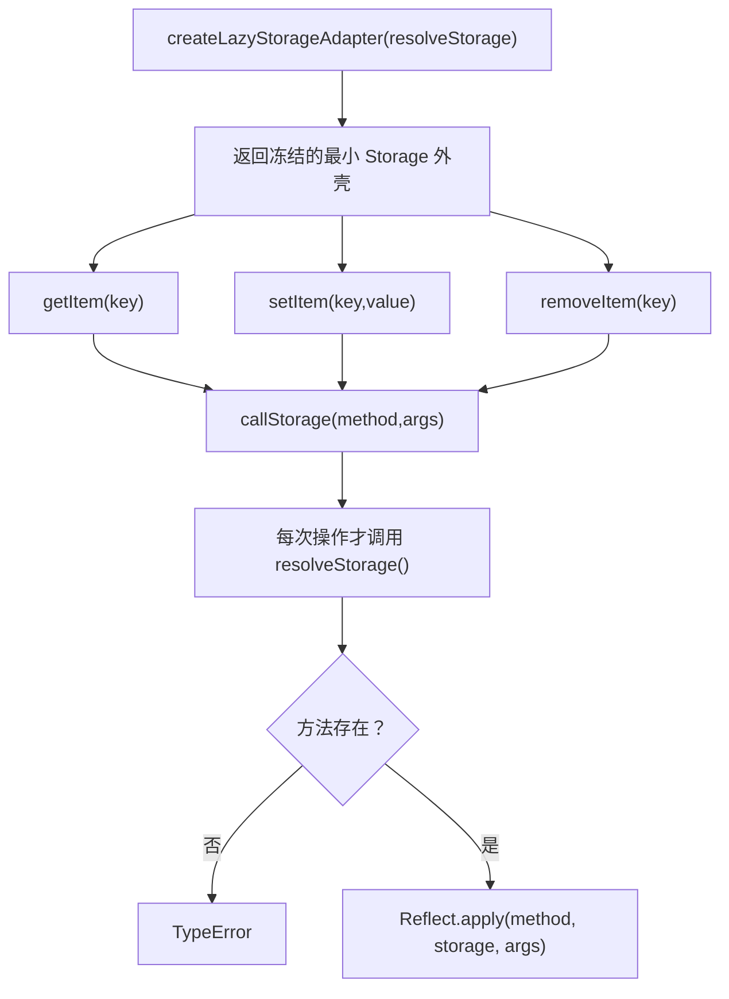

某些浏览器环境连读取 `window.localStorage` 属性本身都可能抛 `SecurityError`。app 创建适配器时传入：

```js
() => window.localStorage
```

构造阶段不读取它；第一次真正操作时才解析。恢复候选读取会分别捕获 v2、v1 的错误，所以一个拒绝访问的存储不会阻止 URL 分享快照被恢复。

每次操作都重新解析，而不是缓存第一次结果。这也允许临时权限状态在以后操作时重新尝试。

`Reflect.apply(operation, storage, args)` 保证原生方法的 `this` 仍是 storage 对象；直接把方法取出来调用，在一些宿主对象上会产生 “Illegal invocation”。

适配器只暴露 `getItem/setItem/removeItem`，并用 `Object.freeze()` 防止调用方替换方法。

## 7. 保存事务：先落盘，再退役旧 hash

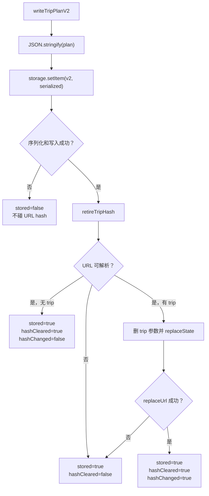

### 7.1 为什么顺序不能反过来

如果先删分享 hash，再写 localStorage，而存储因容量不足失败，两个恢复来源会一起消失。当前顺序保证：

- 写入失败：旧 v2 值和 hash 都保留；
- 写入成功、hash 清理失败：至少新的 v2 已安全落盘；
- 两者成功：下一次刷新不会让旧 hash 覆盖新 v2。

`writeTripPlanV2()` 不更新 `savedAt`，只是原样序列化当前计划；第 6 章已经说明该字段并不可靠地表示最后保存时间。

### 7.2 `retireTripHash()`

`tripHashState()` 用 `URL` 和 `URLSearchParams` 解析 fragment。退役只删除 `trip` 参数，保留例如 `tab=map` 的其他 hash 参数；然后通过注入的 `replaceUrl()` 更新地址而不新增浏览历史记录。

解析 URL 和替换地址分别捕获错误，返回的是结构化部分成功结果，而不是把已完成的存储写入伪装成整体失败。

### 7.3 app 怎样解释结果

`persistTripState()`：

- 没有计划：进入清空事务；
- `stored=false`：提示立即导出文件，返回 `false`；
- 已存但 hash 未清：提示避免刷新使用旧快照，仍返回 `true`；
- 全部成功：显示成功信息。

这说明“返回 true”表示当前 v2 已保存，不表示所有附带清理都成功。

## 8. 恢复候选：读取与评价为什么分开

### 8.1 固定优先级

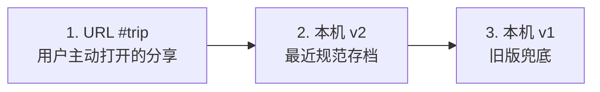

`readTripRecoveryCandidates()` 只负责读取原始文本和标记：

| source | `allowLegacy` | `requireLegacy` |
| --- | ---: | ---: |
| `hash` | false | false |
| `storage` | false | false |
| `legacy` | true | true |

存储读取异常不会让函数抛出；它会变成 `{ source, label, error }` 候选，让选择器记录失败后继续。

### 8.2 `storageCandidate()`

- `getItem()` 返回 `null`：没有候选；
- 返回字符串：候选携带 `raw`；
- 抛错：候选携带 `error`。

“不存在”和“存在但读不了”必须区分，后者需要用户检查站点数据权限。

### 8.3 三态选择器

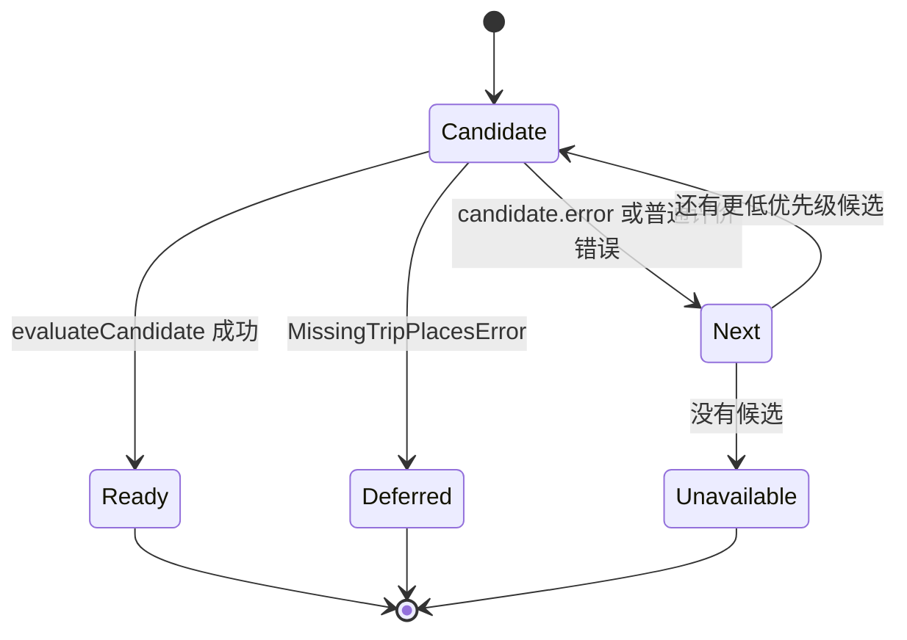

`selectTripRecoveryCandidate()` 返回：

- `ready`：第一个真正可用候选和先前失败列表；
- `deferred`：最高可评价候选只缺尚可能加载的地点；
- `unavailable`：所有候选都无效或不可读。

### 8.4 为什么 missing places 不能回退

假设分享链接想打开“成都锦江区”，启动关键数据里暂时只有城市，没有区县；本机恰好还有昨天的北京行程。

若立即回退本机 v2，异步区县数据到达后再恢复分享会突然覆盖页面，或干脆永远忽略用户主动打开的分享。当前策略暂停在最高优先级候选，等区县数据完成后重试。

`commitTripPlan()` 会把 `shouldRetryTripRestoreAfterCountyHydration` 设为 `false`。如果等待期间用户已经新建或修改行程，旧恢复任务不能再回来覆盖新事实。

## 9. 旧版形状准备与地点就绪检查

### 9.1 `isLegacyTripPayload()`

必须是普通对象，并满足：

- 若显式有 `version`，只能是 1；
- 有 `routes` 数组，或有非空 `selectedCityId`。

`{ version: 1, days: [] }` 不是旧路线形状；`{ routes: [] }` 虽形状成立，之后仍可能因没有可恢复地点被拒绝。

### 9.2 `prepareLegacyRecoveryData()`

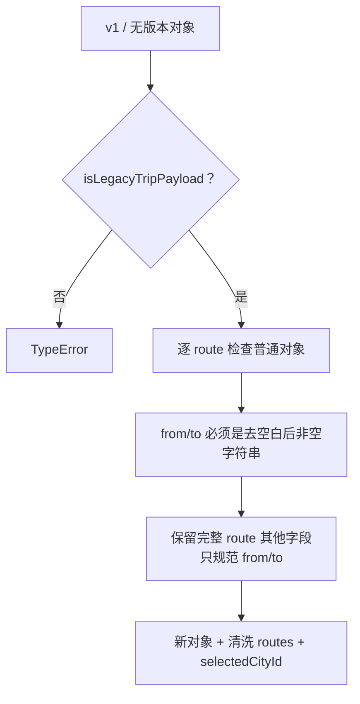

它保留城市和区县混合 ID，不在这个阶段查地图是否认识。原因是地点索引可能尚未完成异步 hydration；形状清洗与环境就绪是两种不同问题。

### 9.3 app 的完整评价回调

每个候选依次经历：

1. `JSON.parse(candidate.raw)`；
2. `prepareTripMigration()` 判断 v2 或允许的 legacy；
3. 旧版候选必须真的为 legacy；
4. `migrateTripState()`；
5. `normalizeTripPlan()`；
6. `assertTripPlanCanRender()` 检查每个路线地点已存在；
7. 旧版迁移后还必须至少有一个地点。

只有全部通过后，才可能写备份或提交状态。

## 10. v1 迁移协议：备份为什么要等到验证之后

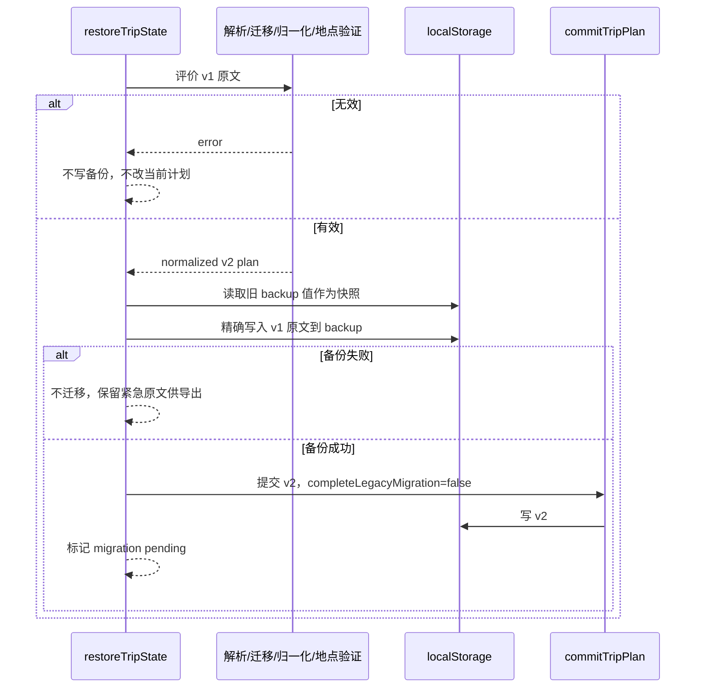

### 10.1 为什么保存精确原文

重新解析再 stringify 会：

- 改变空格和换行；
- 可能丢弃未来未知字段；
- 无法作为故障取证的原始证据；
- 若迁移器本身有 bug，重新编码后的“备份”可能已被污染。

`backupLegacyTripRaw()` 因此只接受字符串并原样写入。

### 10.2 为什么迁移后不立即删除 v1 和 backup

恢复或导入提交时传 `completeLegacyMigration: false`。页面先保留：

- 旧 v1；
- 精确 backup；
- 新 v2。

下一次真正的有效编辑成功保存后，`finalizeLegacyTripBackup()` 才调用 `finalizeLegacyMigration()` 删除两个旧来源。这给用户一个额外确认周期。

### 10.3 `legacyMigrationPending()`

是否待最终清理只看 backup 键是否存在。单独存在 v1 不代表本应用已经开始迁移；backup 是迁移协议的持久标记，页面刷新后也能恢复 pending 状态。

### 10.4 最终清理为何顺序删除

`finalizeLegacyMigration()` 先删 v1，再删 backup，遇到第一个错误立即返回：

- v1 删不掉：backup 也不删，两个来源都保留；
- v1 已删、backup 删不掉：backup 仍是完整原文；
- 两者都删掉：迁移正式结束。

任何失败都保持 pending，下一次有效保存可以再次尝试。

## 11. 启动恢复：关键数据与延迟数据之间的竞态

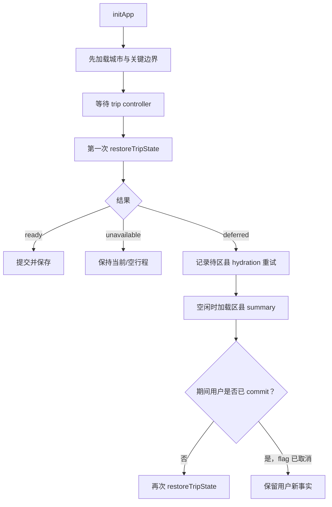

这是一种“带代际取消的延迟恢复”：不是取消网络请求，而是让过期恢复结果失去覆盖资格。

恢复候选普通无效时可以落到下一项，并在成功消息中说明前面来源不可用。当前代码在一处把失败标签拼成英文 `read failed/invalid`，其他提示是中文，属于本地化不一致。

## 12. 文件导入：先验证，再拍双重快照

### 12.1 快照包含什么

`captureTripImportSnapshot()` 保存：

| 区域 | 字段 |
| --- | --- |
| 行程事实 | `tripPlan`、`tripHistory.slice()` |
| 规划偏好 | `transportMode`、`tripPace` |
| 地图投影 | `routes`、`selectedCityId`、`nextRouteId` |
| 存储 | v2 和 legacy backup 的精确字符串/null |
| 迁移状态 | `legacyTripBackupPending` |
| 保存状态 | `lastTripPersistenceResult` |
| 紧急救援 | `emergencyLegacyTripRaw` |

计划和路线保存引用而不是深克隆，依赖前几章建立的不可变更新规则：提交会替换数组/对象，不修改旧对象。若未来有人引入原地修改，这个回滚假设会失效。

### 12.2 导入顺序

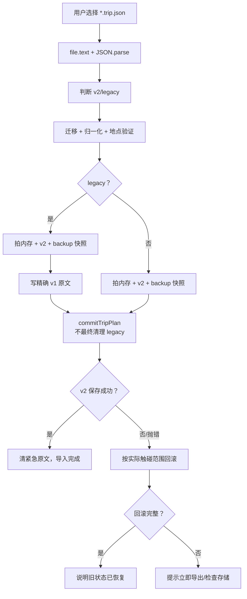

无效文件在拍快照前就被拒绝，因为此时尚未修改任何状态。v1 必须在备份前拍快照，以便备份写成功而提交失败时恢复旧 backup。

### 12.3 `rollbackTripImportSnapshot()` 的条件恢复

- `restorePlan`：提交已开始，可能改了页面内存；
- `restoreV2`：提交已开始，可能写了 v2；
- `restoreBackup`：v1 备份写成功，必须恢复旧 backup。

它先恢复控制标志，再逐键恢复存储，最后恢复计划、历史、路线并重绘。任何存储或重绘失败都会让最终结果为 `false`，页面显示“无法完全恢复”。

### 12.4 `captureTripArchiveSnapshot()` 与 `restoreTripArchiveSnapshot()`

捕获阶段不吞读取错误：如果连旧值都读不出，就不能证明以后能回到原状态，导入必须停止。

恢复阶段逐键：

1. 取快照旧值，`undefined` 也按不存在处理；
2. 当前值已相同则不写，避免无意义操作和额外失败点；
3. 旧值为 `null` 就删除，否则写回精确字符串；
4. 收集全部失败键，不因第一个失败放弃其他键。

这是补偿式、可报告的回滚，不是假装原子。

### 12.5 紧急 v1 原文

若读取 backup 旧值或写 backup 失败，app 把已选文件的原始文本保存在 `emergencyLegacyTripRaw`。导出按钮因此仍可用，用户能把原文救到文件系统。

但它只存在 JavaScript 内存：刷新、关闭标签页或崩溃都会消失。错误提示要求保持页面打开并立即导出，这是现实限制，不是持久备份。

`finally` 总把文件 input 的 `.value` 清空，使用户可以再次选择同一个文件触发 `change`。

## 13. 清空事务：每一项都尝试，失败逐项报告

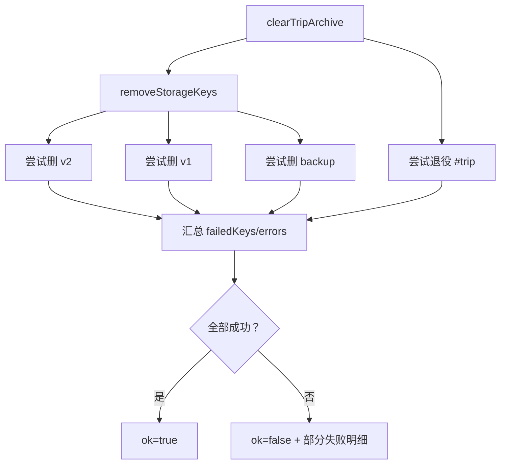

与迁移最终清理不同，用户明确“清空”时适合尽量删除所有介质，所以 `removeStorageKeys()` 不在第一个错误处停止。

`app.clearPersistedTripState()` 根据失败键判断 legacy pending 是否仍可能存在，并告诉用户部分本机存档或分享地址未能移除。部分失败意味着刷新后仍可能恢复出残留候选，不能只看页面当前已清空。

## 14. 分享链接：紧凑 JSON、长度阈值和剪贴板降级

### 14.1 `shareUrlForTrip()`


去掉 `savedAt` 可减小体积，也避免只有保存时间不同就产生不同分享内容。函数会覆盖整个旧 hash，而不是合并其中其他参数；与 `retireTripHash()` 保留其他参数的行为不对称。

内容没有压缩、加密、签名或校验码。同行者可查看和修改 hash 中的 JSON，恢复时必须把它当不可信输入重新归一化。

### 14.2 app 的分享决策

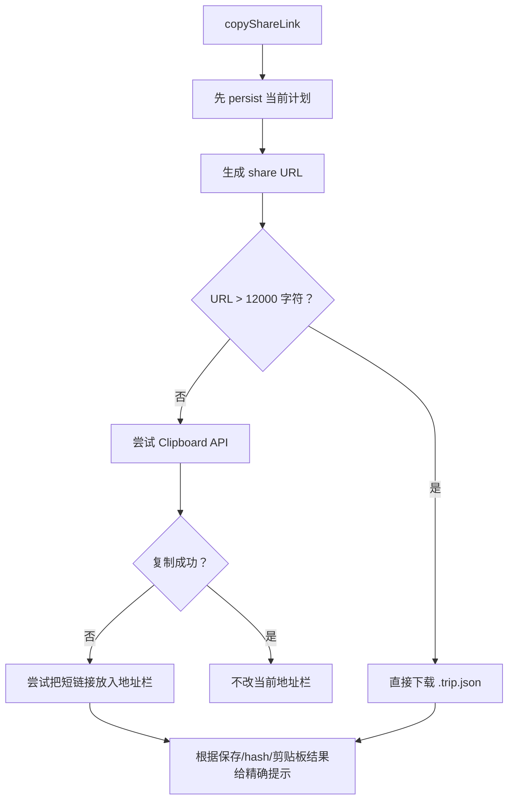

先保存能确保本机有独立副本，并清除当前地址中的旧分享快照。新分享 URL 只用于复制；剪贴板失败时才写入地址栏，避免成功复制时污染当前页面恢复来源。

12,000 是本产品保守阈值，不是所有浏览器的统一上限。

## 15. 文件导出与安全文件名

### 15.1 `safeTripNameForFile()`

清洗顺序：

1. Unicode `NFKC` 规范化，例如全角字符归一；
2. Windows 非法字符、控制字符替换为 `-`；
3. 只保留 Unicode 字母、数字、点、下划线和横线；
4. 连续横线合并；
5. 去掉开头/结尾的点和横线；
6. 按 Unicode 代码点截到默认 60；
7. 再去掉截断后尾部的点/横线；
8. 空名或 Windows 保留设备名 `CON/PRN/AUX/NUL/COM1…/LPT1…` 回退为 `trip`。

这不仅美观，还避免文件在 Windows 上无法创建或被解释为设备。

### 15.2 文件内容

`tripFileName()` 追加 UTC ISO 时间，并把冒号和小数点换成横线：

```text
南京-周末-2026-07-14T03-04-05-678Z.trip.json
```

`tripFileText()` 输出去掉 `savedAt` 的两空格缩进 JSON，并在末尾加换行，便于版本比较和文本工具处理。

### 15.3 紧急导出优先级

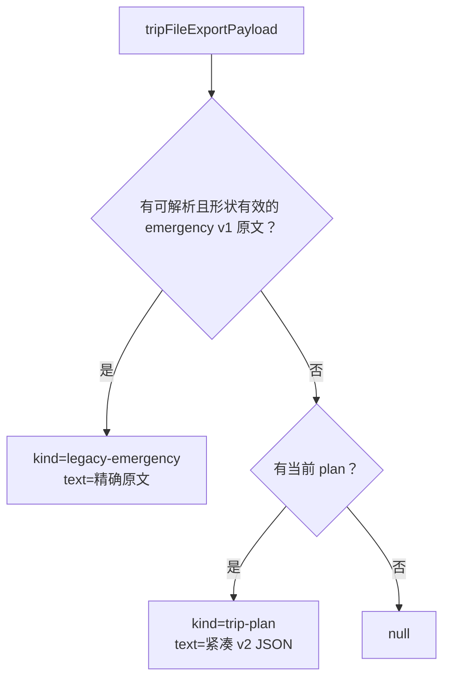

即使当前页面已有 v2，只要存在尚未安全备份的紧急 v1，导出仍优先救 v1 原文。当前 v2 往往还有 localStorage 或页面内存，而那份 v1 可能只剩这一次机会。

`canExportTripFile()` 对紧急文本先 JSON 解析和 legacy 形状检查；普通 plan 只检查 truthy，因为 app 内部计划已经经过领域边界。作为公共 API，它对任意 truthy 非计划值仍过于宽松。

## 16. 25 个函数声明逐一登记

| # | 行 | 函数 | 可见性 | 工程作用 |
| ---: | ---: | --- | --- | --- |
| 1 | 16 | `isRecord` | 私有 | 判断值是否为普通对象形态。 |
| 2 | 20 | `createLazyStorageAdapter` | 公开 | 创建延迟解析、冻结的最小 Storage 接口。 |
| 3 | 45 | `storageCandidate` | 私有 | 把存储值、缺失或读取异常包装为候选。 |
| 4 | 54 | `tripHashState` | 私有 | 解析 URL hash 参数并判断是否含 `trip`。 |
| 5 | 60 | `retireTripHash` | 私有 | 删除 trip hash，保留其他 hash 参数并报告部分失败。 |
| 6 | 82 | `removeStorageKeys` | 私有 | 尽力删除所有键并收集失败明细。 |
| 7 | 96 | `isLegacyTripPayload` | 公开 | 判断对象是否为允许的 v1/无版本旧路线形状。 |
| 8 | 104 | `tripReference` | 私有 | 把非空字符串地点引用裁剪后返回。 |
| 9 | 108 | `prepareLegacyRecoveryData` | 公开 | 清洗旧路线端点并保留其他旧字段。 |
| 10 | 133 | `selectTripRecoveryCandidate` | 公开 | 按顺序评价候选，区分 ready/deferred/unavailable。 |
| 11 | 160 | `readTripRecoveryCandidates` | 公开 | 按 hash、v2、v1 顺序读取原始候选。 |
| 12 | 190 | `writeTripPlanV2` | 公开 | 先写 v2，再退役旧 trip hash，返回分步结果。 |
| 13 | 209 | `backupLegacyTripRaw` | 公开 | 原样备份旧版文本并捕获写入错误。 |
| 14 | 219 | `finalizeLegacyMigration` | 公开 | 顺序删除 v1 与 backup，失败时保留恢复来源。 |
| 15 | 230 | `legacyMigrationPending` | 公开 | 以 backup 键判断迁移是否待最终清理。 |
| 16 | 234 | `clearTripArchive` | 公开 | 尽力清除三个存储键和 trip hash。 |
| 17 | 250 | `captureTripArchiveSnapshot` | 公开 | 读取指定键的精确旧值/null。 |
| 18 | 258 | `restoreTripArchiveSnapshot` | 公开 | 逐键补偿恢复快照并报告失败。 |
| 19 | 275 | `shareUrlForTrip` | 公开 | 将紧凑计划编码到 URL hash。 |
| 20 | 281 | `safeTripNameForFile` | 公开 | 生成跨平台安全、按代码点截断的文件名主体。 |
| 21 | 296 | `tripFileName` | 公开 | 组合安全行程名、UTC 时间与 `.trip.json` 后缀。 |
| 22 | 301 | `tripFileText` | 公开 | 生成紧凑计划的格式化 JSON 文件文本。 |
| 23 | 305 | `emergencyLegacyTripData` | 私有 | 解析并验证内存中的紧急旧版原文。 |
| 24 | 315 | `canExportTripFile` | 公开 | 判断当前计划或有效紧急旧版是否可导出。 |
| 25 | 319 | `tripFileExportPayload` | 公开 | 按紧急旧版优先生成统一下载载荷。 |

## 17. 其余 9 个函数节点逐一登记

### 17.1 五个箭头函数

| # | 行 | 所属位置 | 作用 |
| ---: | ---: | --- | --- |
| 1 | 25 | `createLazyStorageAdapter` / `callStorage` | 每次解析真实 storage、验证方法并保持 `this` 调用。 |
| 2 | 85 | `removeStorageKeys` / `keys.forEach` | 逐键尝试删除并收集异常。 |
| 3 | 110 | `prepareLegacyRecoveryData` / `routes.flatMap` | 非法 route 丢弃，合法端点返回清洗后的单项数组。 |
| 4 | 252 | `captureTripArchiveSnapshot` / `keys.forEach` | 逐键读取精确旧值写入 snapshot。 |
| 5 | 261 | `restoreTripArchiveSnapshot` / `keys.forEach` | 逐键比较并删除或写回旧值。 |

### 17.2 三个对象方法函数表达式

这三个节点位于冻结适配器对象中，Espree AST 将简写方法的值识别为 `FunctionExpression`：

| # | 行 | 方法 | 作用 |
| ---: | ---: | --- | --- |
| 1 | 33 | `getItem(key)` | 转交 `callStorage("getItem", [key])`。 |
| 2 | 36 | `setItem(key, value)` | 转交 `callStorage("setItem", [key, value])`。 |
| 3 | 39 | `removeItem(key)` | 转交 `callStorage("removeItem", [key])`。 |

### 17.3 一个类构造方法

| # | 行 | 方法 | 作用 |
| ---: | ---: | --- | --- |
| 1 | 124 | `MissingTripPlacesError.constructor` | 去重缺失地点，设置专用名称、错误码和 `missingPlaceIds`。 |

合计：25 个声明 + 5 个箭头 + 3 个函数表达式 + 1 个类方法 = 34 个函数节点。

模块公开 18 个函数、1 个错误类和 1 个备份键常量；其余 7 个函数声明只服务内部实现。

## 18. `app.js` 的存档协调函数

| 函数 | 页面层责任 |
| --- | --- |
| `hasSerializableTrip` | 判断当前是否有可保存计划。 |
| `syncTripArchiveControls` | 按计划/日历/紧急原文启停保存、分享和导出按钮。 |
| `rememberEmergencyLegacyTrip` | 验证后把危险中的 v1 原文保留在当前内存。 |
| `clearEmergencyLegacyTrip` | 清理内存救援副本并同步按钮。 |
| `archiveFailureGuidance` | 根据是否仍可导出给出救援建议。 |
| `replaceBrowserUrl` | 用 `history.replaceState` 更新地址而不新增历史项。 |
| `persistTripState` | 解释 v2 写入和 hash 清理的分步结果。 |
| `finalizeLegacyTripBackup` | 成功编辑保存后尝试完成旧版清理。 |
| `clearPersistedTripState` | 清内存紧急副本、三个键与 URL hash。 |
| `isTripStateRecord` | app 迁移边界的普通对象检查。 |
| `prepareTripMigration` | 决定 v2/legacy、版本许可和旧节奏配置。 |
| `assertTripPlanCanRender` | 确认路线地点当前可识别，必要时抛延迟错误。 |
| `captureTripImportSnapshot` | 同时捕获内存、地图、存储和迁移控制状态。 |
| `rollbackTripImportSnapshot` | 按实际触碰范围恢复并重绘。 |
| `restoredTripMessage` | 组合来源、前置失败和恢复成功说明。 |
| `restoreTripState` | 执行启动候选选择、迁移备份和提交。 |
| `downloadTripFile` | 下载当前 v2 文本并返回文件名。 |
| `exportTripFile` | 优先导出紧急旧版，否则导出当前计划。 |
| `copyShareLink` | 先保存，再在链接/文件/剪贴板/地址栏之间降级。 |
| `importTripFile` | 完整的读取、验证、备份、提交和回滚事务。 |
| `updateArchiveStatus` | 用 `textContent` 安全显示状态和语气 class。 |

## 19. 测试证据

`tests/trip-archive.test.mjs` 共 432 行、18 个测试，当前实测 18 通过、0 失败。

| 行为组 | 数量 | 直接证明 |
| --- | ---: | --- |
| 候选与旧数据准备 | 4 | hash/v2/v1 优先级、混合地点 ID、缺地点延迟、普通无效回退与失败顺序。 |
| 延迟存储、写入与 hash | 4 | localStorage getter 延迟、成功退役、写失败保留旧源、URL 替换部分失败。 |
| v1 备份生命周期 | 3 | 精确原文、容量失败不覆盖、最终清理顺序、backup pending 标记。 |
| 清空与回滚快照 | 2 | 三键/hash 尽力清除、精确恢复和失败键报告。 |
| 识别、分享与文件导出 | 5 | legacy 形状、紧凑链接、安全文件名、紧急导出可用性/优先级、Unicode 截断。 |

整站 `rendered-html.test.mjs` 还静态核对了：

- app 不直接导入存档文件，而是从延迟 trip controller 获取 API；
- 候选评价在旧版备份前；
- 迁移在备份前；
- 恢复和导入提交都禁用立即最终清理；
- 启动第一次恢复发生在关键地图数据之后、延迟 summary 之前；
- deferred 只在区县 hydration 后重试；
- 导入 input 在 `finally` 清空；
- 备份失败时必须保留紧急原文和可操作提示。

浏览器关键流程测试还确认路线规划、编辑及所有导入/导出入口在真实页面可用。

## 20. 为什么这样设计：五组逐层追问

### 20.1 为什么恢复有三个状态而不是成功/失败

1. 无效 JSON 永远不会因等待而变好。
2. 缺区县地点可能在异步数据到达后变好。
3. 把两者都当失败会错误回退旧存档。
4. 把两者都当等待会让真正损坏的 hash 阻塞本机 v2。
5. `ready/deferred/unavailable` 正好表达三种后续动作。

结论：自定义错误与三态选择是本模块最关键的正确性设计。

### 20.2 为什么 URL hash 优先于本机 v2

1. 分享链接代表用户这次导航的显式意图。
2. 本机 v2 可能是此前完全不同的行程。
3. 成功恢复分享后会保存为新的本机 v2。
4. 随后旧 hash 被清理，避免刷新重复覆盖。
5. 若分享无效才回退本机，兼顾意图与可用性。

结论：优先级合理，但 UI 应清楚提示即将用分享覆盖本机存档。

### 20.3 为什么旧版迁移要延迟删除

1. 迁移器可能有尚未发现的语义错误。
2. v2 写入也可能因浏览器存储失败。
3. 精确 v1 原文是最后兜底。
4. 下一次有效编辑保存证明新计划已被用户继续使用。
5. 最终清理失败仍保留至少一个旧来源并可重试。

结论：多保留一个保存周期换取了更高的数据安全性。

### 20.4 为什么导入要同时回滚内存和存储

1. `commitTripPlan()` 先换页面事实，再执行渲染和持久化。
2. 只恢复 localStorage 会让当前页面显示失败导入的计划。
3. 只恢复内存会让刷新后又读到失败导入的 v2。
4. 撤销历史、地图路线和 ID 计数也属于一致状态。
5. 双重快照让失败前后用户看到同一份事实。

结论：回滚范围定义全面，但应继续防止后续引入原地修改破坏引用快照。

### 20.5 为什么紧急旧版优先导出

1. 当前 v2 仍在页面内存，通常也已尝试写本机存储。
2. 备份失败的 v1 可能只存在一个内存字符串。
3. 刷新就会失去它。
4. 原样导出能让用户稍后重新导入或人工检查。
5. 先救唯一副本比重复导出已有 v2 更重要。

结论：优先级正确；更好的体验是备份失败后主动提示一键立即下载。

## 21. 更好的方案，按优先级排序

### 21.1 第一优先级：把多键事务迁到 IndexedDB

IndexedDB 支持事务，可以把当前 v2、迁移原文、迁移状态和元数据放在同一读写事务中。localStorage 可继续作为兼容读取源，但新写入进入数据库：

```text
transaction
├── trips/current
├── migrations/v1-original
├── migrations/status
└── metadata/schema-version
```

这样失败可整体 abort，而不是逐键补偿。

### 21.2 第二优先级：让紧急原文获得持久、可见的救援通道

- 备份失败立即展示固定警告条，不只是一行状态；
- 提供“一键下载原始 v1”；
- 可尝试写入 IndexedDB 或 File System Access API；
- 页面关闭前若仍有紧急原文，提示用户；
- 导出成功前不要清内存副本。

### 21.3 第三优先级：为分享载荷增加 envelope

当前 hash 只有裸 TripPlan JSON。建议：

```js
{
  format: "route-studio-share",
  version: 1,
  codec: "json+deflate",
  checksum: "...",
  payload: "..."
}
```

压缩可延后文件降级，checksum 能区分截断/损坏与 schema 不兼容。若包含私人备注，应明确提醒链接并未加密；真正敏感分享需端到端加密和密钥策略。

### 21.4 第四优先级：统一结构化错误和中文文案

不要从错误消息文字判断 `includes("备份")` 或 `includes("读取失败")`。使用：

```js
{ code: "LEGACY_BACKUP_FAILED", source: "legacy", recoverable: true }
```

UI 再统一映射中文。这样不会出现 `分享链接 invalid不可用` 一类中英混排，也便于遥测与测试。

### 21.5 第五优先级：加强公开 API 输入验证

- `canExportTripFile()` 不应只用 `Boolean(plan)`；
- `shareUrlForTrip()` 应拒绝循环或不规范对象并给结构化错误；
- `tripFileName()` 应处理无效 timestamp；
- `MissingTripPlacesError` 应清洗、去空和稳定排序 ID；
- snapshot API 应验证 snapshot/keys 形状。

### 21.6 第六优先级：建立多存档槽和显式冲突 UI

当前永远覆盖单一 v2。可以保留按 trip ID 的多份存档、更新时间和来源；打开分享时先预览：

- “用分享行程替换当前”；
- “另存为新行程”；
- “取消”。

这比隐式优先级更符合用户对重要行程的心理模型。

### 21.7 第七优先级：补齐动态失败路径测试

当前主文件事务测试很扎实，但 app 的复杂导入回滚主要由源码结构断言覆盖。应增加真实运行测试：

- commit 在渲染阶段抛错；
- v2 写成功后 backup 恢复失败；
- 内存恢复成功、地图重绘失败；
- deferred 等待期间用户创建新行程；
- backup 失败后紧急导出、刷新前状态；
- 清空部分失败后刷新选择到哪个残留候选。

## 22. 零基础读者怎样亲手跟一次 v1 文件导入

1. 从 `index.html` 找隐藏的 `#tripImportInput` 和可见导入按钮。
2. 跟到页面底部 `change` 监听器和 `queueTripAction()`。
3. 进入 `importTripFile()`，写下四个阶段：读取、验证、备份、提交。
4. 看 `prepareTripMigration()` 怎样允许文件导入 legacy，却禁止 hash 伪装成 legacy。
5. 跟 `migrateTripState()` 和 `normalizeTripPlan()`，确认迁移先于任何存储写入。
6. 在 `assertTripPlanCanRender()` 看缺地点如何变成专用错误。
7. 进入 `captureTripImportSnapshot()`，列出内存与存储两类快照。
8. 看 `backupLegacyTripRaw()` 为什么接收 `rawText` 而不是解析后的 data。
9. 跟到 `commitTripPlan(... completeLegacyMigration:false)`。
10. 假设 `writeTripPlanV2()` 返回 false，沿 catch 进入 `rollbackTripImportSnapshot()`。
11. 分别看 `restorePlan/restoreV2/restoreBackup` 为什么都是 true。
12. 看 `restoreTripArchiveSnapshot()` 如何比较当前值再写回。
13. 最后看 `finally` 清空 input，使同一文件可重试。
14. 对照测试 “archive snapshots restore exact values...” 和整站边界测试 “app wires v2 writes...”。

如果只记住本章一条工程原则，请记住：

> 用户数据迁移的第一职责不是尽快得到新格式，而是在任何失败点都能说明“旧事实在哪里、哪些步骤已成功、哪些步骤可回退”，并在覆盖之前保住精确原文。

## 23. 下一章预告

下一章将拆解 `guide-export.js`：同一份行程怎样先变成与表现无关的 GuideModel，再分别生成 Markdown 和可打印 HTML；排序、路线摘要、地点快照、警告、安全转义和跨格式一致性如何实现。

继续阅读：[第 9 章：一份行程怎样变成 Markdown 与可打印 HTML 旅行指南](./09-guide-export.md)

回看：[第 7 章：行程事实怎样变成可编辑、可拖动、可恢复焦点的日历](./07-trip-editor.md)
