# 第 9 章：一份行程怎样变成 Markdown 与可打印 HTML 旅行指南

> 本章完整拆解 `public/static-site/guide-export.js`，并连接 `trip-controller.js`、`app.js`、页面按钮、浏览器下载 API 和测试。主文件共 918 行、34,296 字节；AST 识别出 75 个函数节点：41 个函数声明和 34 个箭头函数。正文逐个登记全部 75 个节点，并用 13 项领域测试、模块边界测试、页面结构测试和浏览器下载测试核对真实行为。

## 1. 学完本章能回答什么

1. 为什么不能直接把 `TripPlan` 对象打印出来，而要先建立 `GuideModel`？
2. 同一份内容怎样同时生成 Markdown 和 HTML，而不让两种格式互相污染？
3. `Map` 中的地点资料怎样变成不依赖应用运行环境的地点快照？
4. 为什么导出模型要深复制，普通的 `{ ...object }` 为什么不够？
5. 活动按几点排序，无效时间和相同时间怎样保持稳定顺序？
6. 路线测算有多种字段名称时，程序怎样决定显示哪个值？
7. 没有路线段测算时，城市顺序怎样从每日计划中恢复出来？
8. 交通、活动、未知项目和住宿为什么要先转成“表现对象”？
9. HTML 为什么必须转义，Markdown 为什么也不能直接拼用户输入？
10. “独立 HTML”到底独立在哪里，为什么不引用应用 CSS、脚本或地图瓦片？
11. “可打印 HTML”是否会直接打印，PDF 又是谁生成的？
12. 点击按钮后，字符串怎样经过 `Blob`、临时 URL 和隐藏下载链接成为文件？
13. 为什么指南模块不在页面启动时加载，而在第一次导出时才加载？
14. 当前实现在哪些地方比最初设计更可靠，哪些地方仍有明显改进空间？

## 2. 五问核验后的架构结论

| 核验问题 | 结论 |
| --- | --- |
| 指南模块真正拥有什么？ | 它拥有导出快照、展示数据归一化、Markdown 文本生成和独立 HTML 文本生成；它不拥有页面按钮、浏览器下载、文件名、路线计算或行程修改。 |
| 为什么要有中间模型？ | `TripPlan` 主要保存稳定 ID 和可编辑事实，而指南需要地点名称、日期、星期、排序结果、路线摘要和校验提醒。`GuideModel` 把这些派生信息固定成两个渲染器共享的输入。 |
| 输出安全的不可破坏条件是什么？ | 所有进入 HTML 的动态文字必须经过 HTML 上下文转义；所有进入 Markdown 行内位置的动态文字必须消除换行、原始 HTML 和结构控制符。 |
| 为什么导出不会拖慢首屏？ | `app.js` 启动时只加载行程控制器；`trip-controller.js` 直到首次导出才动态 `import()` 34 KB 的指南模块，并复用同一个 Promise。 |
| 当前最大边界缺口是什么？ | 两种渲染器手工重复章节逻辑，可能逐渐漂移；公开的 `buildGuideModel()` 若被直接传入未归一化日期，会把 `2026-02-31` 静默变成 `2026-03-03`；导出前等待的美食模块实际未被使用；应用层缺少动态加载失败重试和真正的导出快照事务。 |

一句话总结：

> `guide-export.js` 是“行程事实”与“可阅读文档”之间的编译器：先把运行中的对象翻译成稳定的 GuideModel，再由两个后端分别生成 Markdown 和 HTML；浏览器下载只是编译完成后的交付动作。

## 3. 先认识本章需要的 JavaScript 与浏览器概念

### 3.1 纯函数

纯函数只根据参数计算结果，不读取或修改页面：

```js
const model = buildGuideModel(input);
const markdown = buildMarkdownGuide(model);
```

`guide-export.js` 没有 `document.querySelector()`、`localStorage` 或 `fetch()`。因此 Node 测试可以直接执行它，导出规则也不会暗中改动当前行程。

### 3.2 模板字符串

反引号允许把变量嵌入长文本：

```js
const title = "河南之旅";
const heading = `<h1>${escapeHtml(title)}</h1>`;
```

`${...}` 中是 JavaScript 表达式。模板字符串不会自动保证安全，所以动态内容仍必须先转义。

### 3.3 `Map`、`Set` 与 `WeakMap`

- `Map`：键可以是任意值；本项目用地点 ID 找地点快照。
- `Set`：只保留唯一成员；应用层用它收集不重复的地点 ID。
- `WeakMap`：对象作键且不阻止垃圾回收；`cloneValue()` 用它记住“原对象已经复制成哪个新对象”，从而处理循环引用。

### 3.4 深复制与浅复制

浅复制只复制第一层：

```js
const copy = { ...plan };
copy.days[0].items[0].title = "改名";
// 原 plan 中的嵌套 item 也会被改到。
```

深复制会继续复制 `days`、`items`、`lodging` 等嵌套对象。指南采用深复制，导出模型被后续处理时不会反向修改页面事实。

### 3.5 稳定排序

“稳定”表示比较结果相同时保留原顺序。这里先保存每项的原索引，再把它作为第二排序键：

```text
07:00 → 09:00 甲 → 09:00 乙 → 无效时间 → 未填时间
```

即使以后换到排序稳定性不同的环境，相同时间的“甲、乙”也不会颠倒。

### 3.6 转义不是删除文字

用户输入 `<script>` 时，不应让浏览器把它当标签执行；应显示成普通文字：

```text
输入：<script>
HTML 文本：&lt;script&gt;
页面看到：<script>
```

HTML 和 Markdown 的语法不同，因此必须使用两个不同的转义函数。

### 3.7 `Blob` 与对象 URL

浏览器不能仅凭一个字符串就自动下载文件。应用把字符串包装成 `Blob`，再创建临时地址：

```text
字符串 → Blob → blob:临时地址 → <a download> → 浏览器下载
```

下载触发后调用 `URL.revokeObjectURL()` 释放临时地址。

### 3.8 动态 `import()`

静态导入在模块启动时发生；动态导入返回 Promise，可延迟到真正需要时：

```js
const module = await import("./guide-export.js");
```

本项目把导出功能放在第二层动态加载边界后，地图先可用，导出代码后加载。

## 4. 先确定哪份代码真的运行

| 文件 | 本章中的真实责任 |
| --- | --- |
| `app/page.tsx` | Vinext/React 外壳，用 iframe 打开 `/static-site/index.html`。 |
| `public/static-site/index.html` | 提供 Markdown 和 HTML 两个按钮。 |
| `public/static-site/app.js` | 收集当前页面事实、调用指南模块、生成文件名并触发下载。 |
| `public/static-site/trip-controller.js` | 保有并缓存指南模块的动态导入 Promise。 |
| `public/static-site/guide-export.js` | 本章主角；纯数据转换与字符串渲染。 |
| `public/static-site/trip-plan.js` | 提供 `dayDate()` 和 `timeToMinutes()`。 |
| `public/static-site/trip-archive.js` | 提供安全文件名片段 `safeTripNameForFile()`。 |
| `tests/guide-export.test.mjs` | 13 项领域行为与安全测试。 |

发布运行链以 `public/static-site/` 为准。根目录也有 `guide-export.js`，当前两份业务代码只差一处：发布版导入 `trip-plan.js?v=progressive-2`，根目录版不带查询参数。查询参数用于浏览器缓存版本控制，不改变函数语义；但两份源码长期手工维护仍有漂移风险。

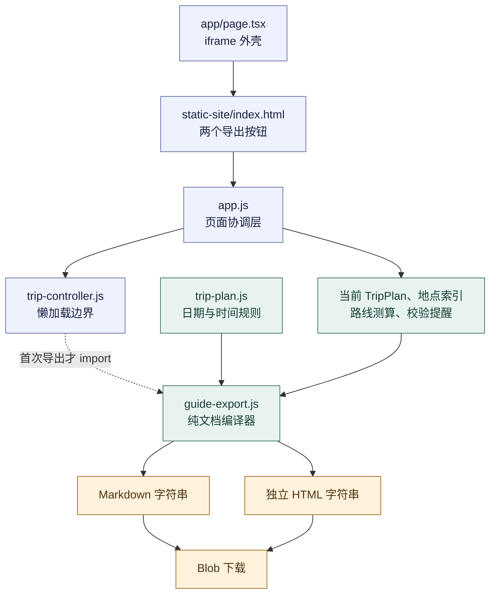

## 5. 三段式流水线：采集、规范化、渲染

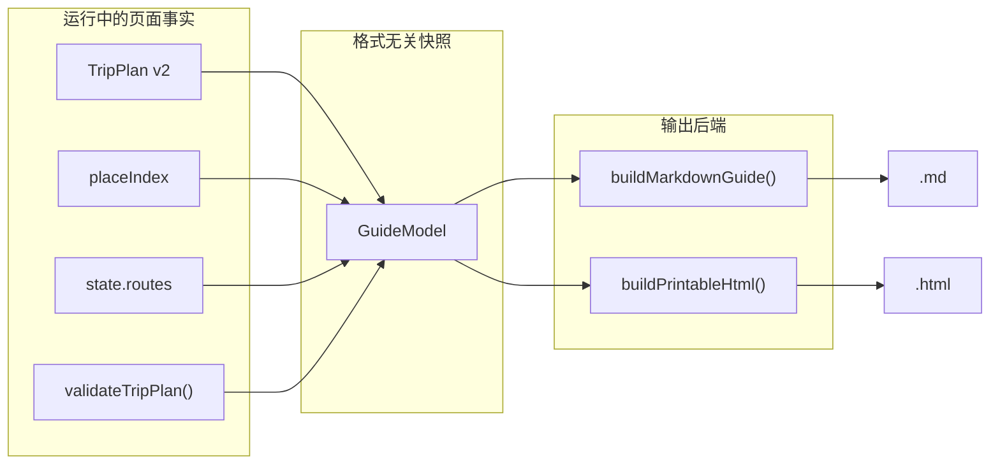

这和编译器很像：

| 编译器概念 | 本项目对应物 |
| --- | --- |
| 源程序 | 当前 `TripPlan`、地点、路线测算和警告 |
| 中间表示 | `GuideModel` |
| 后端 | Markdown 渲染器、HTML 渲染器 |
| 产物 | `.md`、`.html` 文件 |

为什么不让两个渲染器直接读取整个 `app.js state`？因为那会让纯模块依赖页面内部结构，测试困难，并且两个格式可能在不同时间读到不同状态。

## 6. `GuideModel` 到底长什么样

下面是省略次要字段后的形状，不是新的数据库 schema：

```js
{
  id: "trip-1",
  version: 2,
  title: "京豫秋游",
  startDate: "2026-10-01",
  pace: "standard",
  routeSegments: [/* 路线测算快照 */],
  totals: {/* 总距离、总时长等 */},
  days: [{
    id: "day-1",
    dayNumber: 1,
    date: "2026-10-01",
    weekday: "星期四",
    places: [{ id: "beijing", name: "北京" }],
    overnightPlace: { id: "zhengzhou", name: "郑州" },
    items: [/* 已按有效开始时间稳定排序 */],
    lodging: {/* 深复制住宿 */},
    warnings: [/* 只属于这一天的提醒 */]
  }]
}
```

### 6.1 输入与输出字段

| 输入 | 来源 | 进入模型后的处理 |
| --- | --- | --- |
| `plan` | `state.tripPlan` | 读取基础元数据和天数组；嵌套值深复制。 |
| `placeSnapshots` | 应用地点索引 | `placeId` 转成 `{ id, name, ... }` 快照；找不到就保留 ID。 |
| `warnings` | `validateTripPlan()` | 按严格相等的 `dayId` 分发到每天。 |
| `routeSegments` | `state.routes` | 整体深复制，渲染时再统一别名和单位。 |
| `totals` | `routeTotals()` | 深复制；渲染时转成标签和值。 |

### 6.2 这不是持久化模型

`GuideModel` 没有写回 localStorage，也没有导入入口。它可以包含路线估算、中文地点名和警告，这些都是可重新计算的展示资料。真正可恢复、可编辑的行程文件仍使用第 8 章的 TripPlan JSON。

## 7. 三个公开函数就是模块的大门

| 公开函数 | 输入 | 输出 | 是否接触浏览器 DOM |
| --- | --- | --- | --- |
| `buildGuideModel()` | 页面收集出的事实集合 | 普通 GuideModel 对象 | 否 |
| `buildMarkdownGuide()` | GuideModel | Markdown 字符串 | 否 |
| `buildPrintableHtml()` | GuideModel | 完整 HTML 字符串 | 否 |

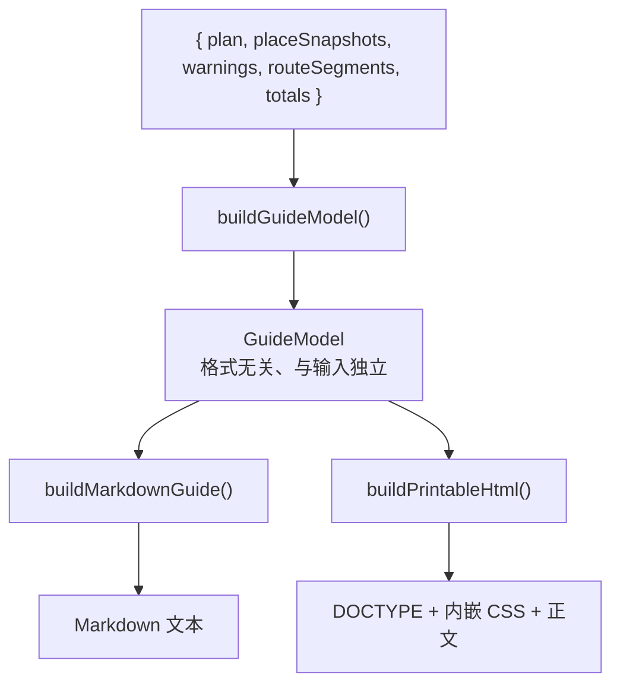

模块只公开三扇门，另外 38 个具名函数都是内部零件。这减少了外部可以依赖的表面积。

## 8. 两张翻译表与两个外部函数

### 8.1 `WEEKDAYS`

数组索引与 `Date.getUTCDay()` 对齐：0 是星期日，6 是星期六。使用 UTC 是为了避免用户所在时区把日期推到前一天或后一天。

### 8.2 `WARNING_LABELS`

把领域警告代码翻译成人话，例如：

| 代码 | 导出文字 |
| --- | --- |
| `missing-time` | 时间信息缺失 |
| `time-overlap` | 时间安排重叠 |
| `activity-before-arrival` | 活动早于抵达时间 |
| `lodging-missing` | 住宿信息缺失 |

未知代码不会被吞掉，直接显示代码本身，便于排查；代价是用户可能看到英文内部代码。

### 8.3 `PACE_LABELS`

`relaxed`、`standard`、`compact` 分别翻译为“轻松”“标准”“紧凑”。输出仍保留原代码，例如 `标准（standard）`，兼顾用户阅读和技术可追溯性。

### 8.4 `dayDate()` 与 `timeToMinutes()`

这两个函数从 `trip-plan.js` 导入，而不是重新实现：

- `dayDate(plan, index)`：起始日期顺延 `index` 天；
- `timeToMinutes("09:30")`：得到 `570`；格式不合法则返回 `null`。

复用领域函数避免“编辑器认为 24:00 无效，导出器却认为有效”之类规则分叉。

## 9. 安全与复制基础函数

### 9.1 `escapeHtml(value)`

转换顺序是 `&`、`<`、`>`、双引号、单引号。必须先处理 `&`，否则后生成的 `&lt;` 又会被二次改写。

| 输入字符 | 输出实体 | 原因 |
| --- | --- | --- |
| `&` | `&amp;` | 防止伪造实体 |
| `<` | `&lt;` | 防止开始标签 |
| `>` | `&gt;` | 防止结束标签 |
| `"` | `&quot;` | 兼容属性上下文 |
| `'` | `&#39;` | 兼容单引号属性上下文 |

当前动态文字都进入 HTML 文本节点，不进入 URL、CSS 或 JavaScript；这个函数只承诺 HTML 文本/属性字符层面的转义，不是万能安全函数。

### 9.2 `escapeMarkdown(value)`

它按四步处理：

1. 把换行替换为中文分号，阻止用户另起标题或列表；
2. 把多数不可见控制字符替换为空格；
3. 把 `& < >` 转成 HTML 实体，关闭 Markdown 中的原始 HTML 通道；
4. 在反斜杠、反引号、星号、括号、井号、竖线等结构字符前加反斜杠。

例如 `[点我](javascript:...)` 不再成为链接，而成为可见普通文字。

### 9.3 `cloneValue(value, seen)`

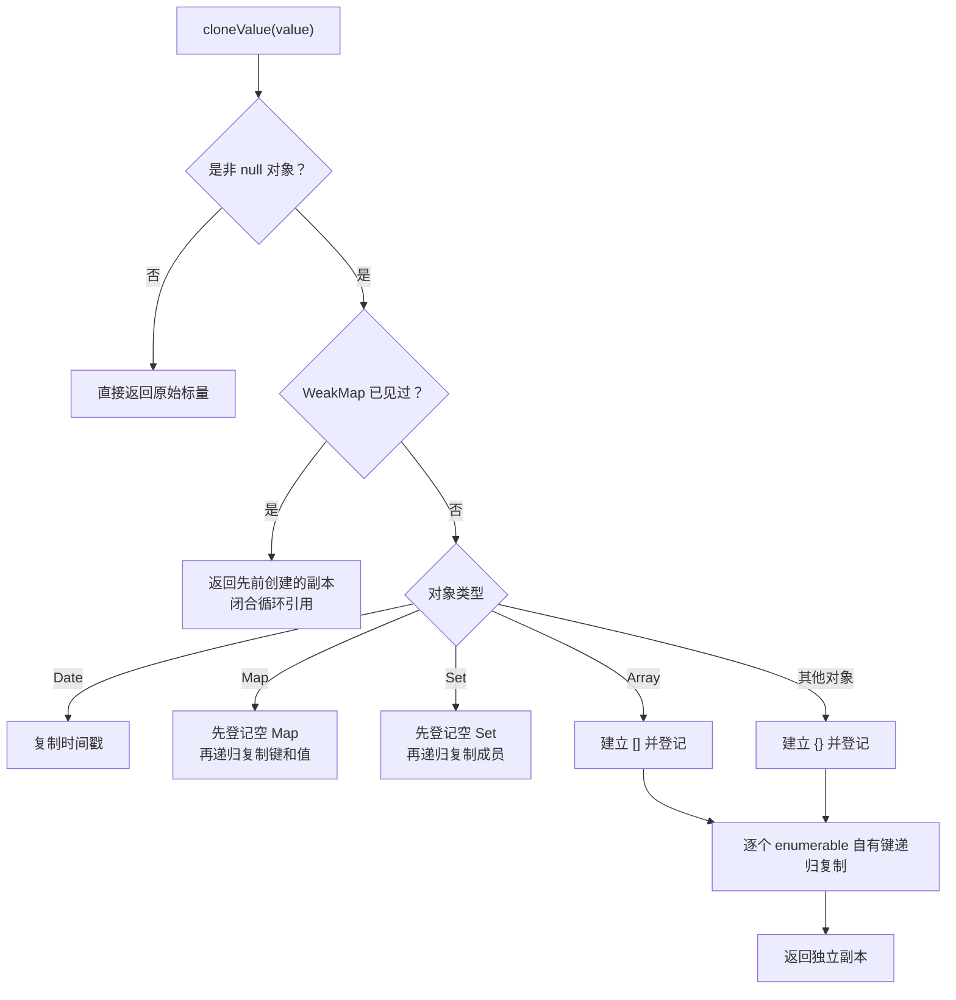

为什么不用 `structuredClone()`？自定义实现允许忽略某个读取失败的外部字段，并能在本模块控制兼容范围。代价也很明确：它不保留自定义原型、属性描述符、RegExp、ArrayBuffer 等特殊对象语义；对恶意 Proxy，`Object.keys()` 本身仍可能抛错。

三个内部箭头回调分别复制 `Map` 条目、`Set` 成员和普通对象键，后文 AST 表会逐一登记。

## 10. 把任意输入收敛成可显示文字

### 10.1 `scalarText(value)`

只接受真正适合直接展示的标量：

| 类型 | 结果 |
| --- | --- |
| string | 原字符串 |
| 有限 number | 十进制字符串 |
| bigint | 字符串 |
| boolean | “是”或“否” |
| `NaN`、`Infinity`、对象、函数、null | `null` |

这样可以从源头避免指南里出现 `[object Object]`。

### 10.2 `displayText(value, fallback)`

先调用 `scalarText()`；结果是 `null` 或空字符串就用兜底文字。它保留 `"0"` 和“否”，因为这两者是有意义的展示值。

### 10.3 `firstText(values)`

按优先级扫描候选数组，返回第一个可显示且非空的标量。路线字段存在多个历史别名时，大量函数靠它表达“先信哪个”。

```text
fromName
  → fromPlaceName
  → from.name / from.label
  → fromPlace.name / fromPlace.label
  → 各种 ID
  → 待定
```

## 11. 日期函数：防时区，但仍有输入漏洞

### 11.1 `weekdayFor(dateValue)`

它只接受精确的 `YYYY-MM-DD`：

1. 正则拆出年、月、日；
2. 使用 UTC 构造日期；
3. 再比对构造结果，拒绝 `2026-02-31` 这种不存在的日期；
4. 用星期索引查 `WEEKDAYS`。

### 11.2 `dateForDay(plan, dayIndex)`

它调用 `trip-plan.dayDate()`，任何异常都转成 `null`，避免一个坏日期让整份指南无法导出。

### 11.3 两者组合的真实缺口

运行探针确认：

```text
startDate = 2026-02-28 → 2026-02-28，星期六
startDate = 2026-02-31 → 2026-03-03，星期二
startDate = bad        → null
```

原因是 `dayDate()` 先让 JavaScript Date 自动归一化了 2 月 31 日，`weekdayFor()` 收到的已经是合法的 3 月 3 日。更好的方案是在 `dayDate()` 之前对原始 `startDate` 做严格日历日期校验，并让编辑、保存、导出共享同一验证函数。

正常页面里的 TripPlan 已经过领域层严格日期归一化，因此主路径不会主动产生这个值；这里暴露的是公开函数缺少防御性输入验证，而不是当前编辑器允许用户保存 2 月 31 日。

## 12. 地点快照与时间排序

### 12.1 `fallbackPlace(placeId)`

找不到地点资料时返回 `{ id: placeId, name: placeId }`。保留 ID 比无声丢掉地点更可追踪；如果 ID 本身也无效，后续 `placeName()` 才显示“待定”。

### 12.2 `buildPlaceResolver(placeSnapshots)`

它返回一个新的地点解析箭头函数：

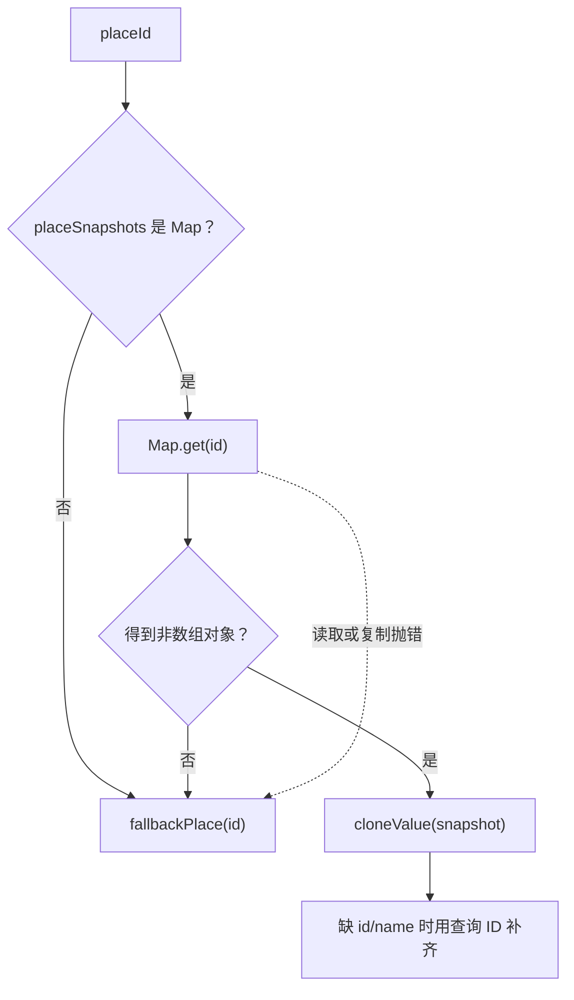

返回函数每次都深复制地点对象，所以 GuideModel 不会共享地点索引里的嵌套元数据。

### 12.3 `sortedItems(items)`


具体比较规则：

1. 两项都无效：比较原索引；
2. 左项无效：左项排后；
3. 右项无效：右项排后；
4. 都有效：先比较分钟数，再比较原索引。

## 13. `buildGuideModel()`：建立格式无关快照

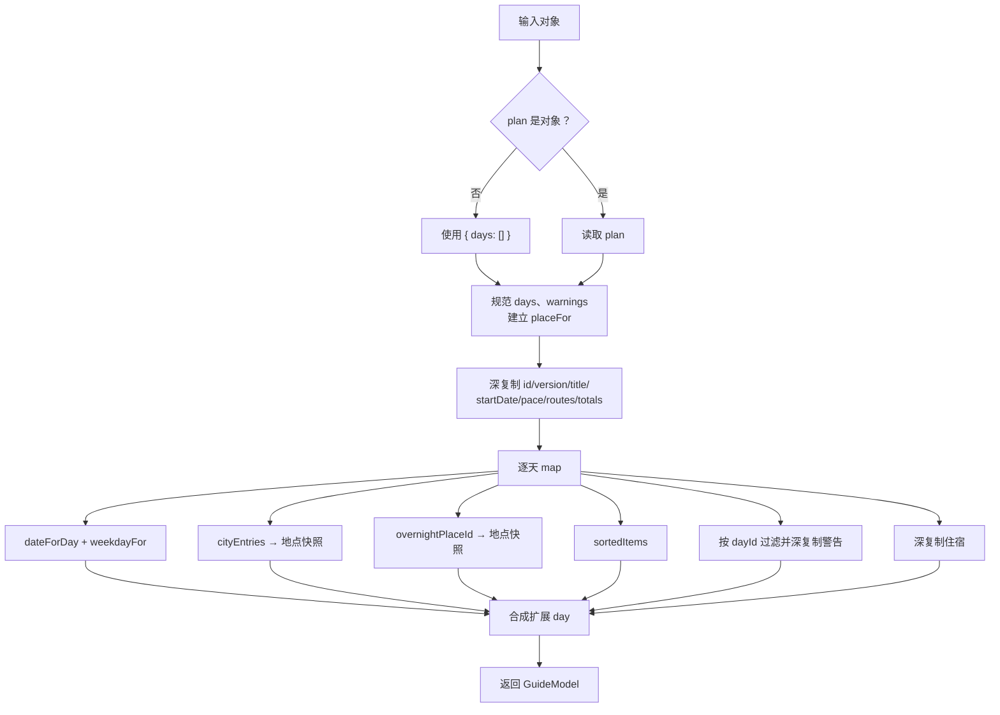

### 13.1 为什么先复制原 day，再覆盖派生字段

`const clone = cloneValue(day)` 保留未来新增但当前渲染器尚不认识的字段；随后显式覆盖 `dayNumber/date/places/items/...`，确保关键字段一定由当前规则产生。

好处是向前兼容，风险是模型仍携带不必要的未知字段。若未知字段很大或含隐私，导出模型虽然当前不会渲染它，也会增加内存占用。更严格的方案是白名单式 DTO。

### 13.2 为什么模型独立于输入

测试不仅比较值，还用 `notStrictEqual` 证明嵌套对象不是同一个引用；随后修改模型，确认原 plan、地点、路线段和 totals 全部不变。这比只测“输出文字正确”更能证明边界。

### 13.3 它不做什么

- 不校验 TripPlan 版本；
- 不保证 `day.id` 唯一；
- 不计算路线；
- 不修复行程；
- 不冻结返回对象；
- 不生成文件。

## 14. 地点名称索引

### 14.1 `placeName(place, fallbackId)`

按 `place.name → place.id → fallbackId → 待定` 选择显示名。

### 14.2 `buildPlaceNameIndex(model)`

遍历每天的 `places` 和 `overnightPlace`，建立 `Map<id, name>`。内部 `add` 箭头只在 ID 可显示且尚未登记时写入，因此第一次出现的同 ID 名称获胜。

### 14.3 `indexedPlaceName(placeIndex, placeId)`

ID 无效时显示“待定”；索引命中时显示中文名；没命中时保留原 ID。

### 14.4 `nestedName(value)`

兼容字段有时是字符串、有时是对象：对象按 `name → label → id` 取值，标量直接交给 `scalarText()`。

这组函数的本质是建立一个只服务导出的“名称缓存”，避免每个路线段和时间轴项目重复搜索所有天。

## 15. 路线概览：有测算用测算，没有就恢复路径

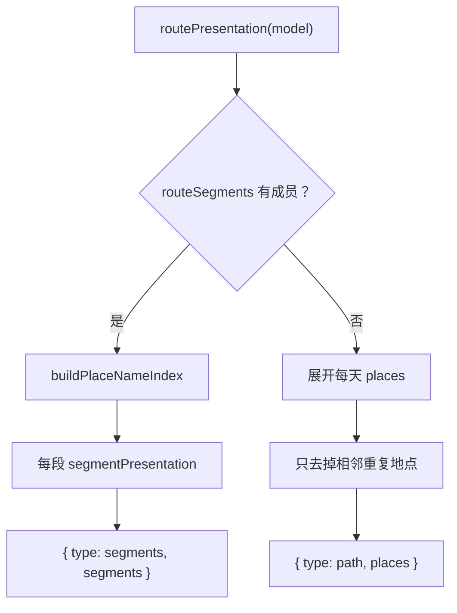

### 15.1 `segmentEndpoint(segment, side, placeIndex)`

`side` 是 `from` 或 `to`。函数兼容直接名称、地点名称、嵌套对象和多种 ID 别名。直接名称优先于 ID 查表，避免已有更具体展示名时被旧索引覆盖。

### 15.2 `formatDistanceMeters(value)`

- 非有限 number：尝试作为标量文字；
- 小于 1000：四舍五入为米；
- 至少 1000：保留一位公里精度。

通用数字字段默认按米解释。负数不会被拒绝，会显示负距离，这是输入契约过宽的边界。

### 15.3 `formatDurationSeconds(value)`

数值默认按秒解释，四舍五入成分钟；负值被夹到 0；不足一分钟显示“不足 1 分钟”；其余组合成小时和分钟。

### 15.4 `segmentDistance()` 与 `segmentDuration()`

优先级分别是：

```text
distanceText → distanceMeters → distance
durationText → durationSeconds → duration
```

显式文字最高，因为上层可能已经决定显示“待计算”。通用 `distance`、`duration` 若是 number，分别假定为米和秒；若是字符串则原样显示。更严格的 schema 应避免这种单位猜测。

### 15.5 `segmentPresentation(segment, placeIndex, index)`

它把形状不统一的路线段翻译成：

```js
{
  headline: "北京 → 郑州",
  facts: [
    { label: "方式", value: "高铁" },
    { label: "距离", value: "693 公里" }
  ]
}
```

事实项按路段别名、交通方式、班次、距离、时长、是否估算、状态、备注、错误说明的固定顺序追加。Markdown 和 HTML 都消费这个同一表现对象。

### 15.6 `fallbackRoutePlaces(model)`

它展开每天的地点，只删除相邻重复：`甲 → 甲 → 乙 → 乙 → 甲` 变成 `甲 → 乙 → 甲`。最后的甲必须保留，因为那表示真正返回甲地，不是重复数据。

### 15.7 `routePresentation(model)`

这是路线概览的总分派器。有路线段就返回结构化段列表；完全没有才退回每日城市路径。即使路线段全是错误状态，只要数组非空也不会退回路径，因为错误本身是需要展示的事实。

## 16. 总计、节奏和安全属性读取

### 16.1 `safeProperty(object, key)`

读取属性时捕获 getter/Proxy 抛出的异常，返回 `undefined`。它保护单个字段，但 `Object.keys(totals)` 仍在保护范围之外；高度敌意的 Proxy 仍可能让导出失败。

### 16.2 `totalMetric(totals, keys, formatter)`

按候选键顺序寻找第一个非空值，交给格式器；格式后仍为空就继续找下一个。这把“字段优先级循环”抽成一个函数，距离和时长共用。

### 16.3 `totalEntries(totals)`

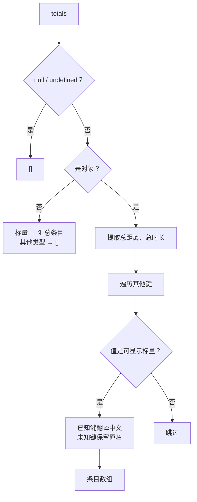

额外已知字段包括“已测路段、路段数、行程天数、预计费用、预算”。对象型 metadata 被忽略，避免 `[object Object]`；未知标量键会暴露原技术名称，属于可扩展但不够产品化的折中。

### 16.4 `paceText(pace)`

字符串代码优先翻译为 `中文（代码）`；未知字符串原样显示；对象尝试 `label/name/code/id`；其余显示“未设置”。

## 17. 每日项目的统一表现对象

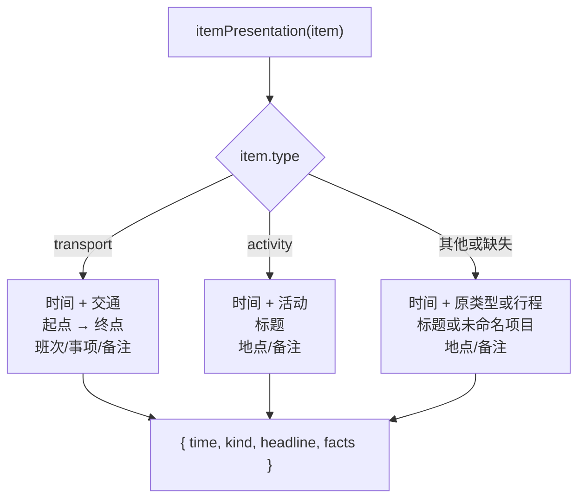

### 17.1 `timeRange(item)`

开始和结束分别缺省为“待定”；都缺失时显示“时间待定”；否则显示 `开始-结束`。`Number(endDayOffset) === 1` 时追加“（次日）”，所以数字 `1` 和字符串 `"1"` 都有效。

它不再次验证时间格式：`25:99` 会作为可见文字输出，但排序时会被视为无效并放到末尾。这种“保留原文但降低排序信任”的策略便于用户发现问题。

### 17.2 `itemPlaceName(item, prefix, placeIndex)`

交通起终点共享此函数。`prefix` 为 `from` 或 `to`，先找直接名称和嵌套地点，再用各种 ID 查地点索引。

### 17.3 `itemPresentation(item, placeIndex)`

三条分支都产出同样形状，两个渲染器无需知道原始 item 的全部 schema。当前交通分支没有输出 `transportMode`，只输出起终点、班次、可选标题和备注；如果用户关心“高铁还是飞机”，需要在模型或 facts 中补入明确字段。

### 17.4 `lodgingPresentation(lodging, placeIndex)`

非对象返回 `null`；有效对象转成 `{ name, facts }`。facts 顺序是地点、地址、入住、退房、备注；缺名称显示“住宿待定”。

### 17.5 `warningText(warning)`

先把 code 翻译成中文，再追加 `message` 或 `note`。它不输出 `severity` 和 `itemIds`，所以指南能告诉用户“有时间重叠”，但不能精确指出是哪两个项目。

### 17.6 `dayHeading(day)`

永远先放“第 N 天”；日期和星期存在才追加。无起始日期时不会生成 `Invalid Date`。

## 18. Markdown 渲染器

### 18.1 `markdownFacts(facts)`

把事实数组变成紧凑的行内片段：

```text
｜方式：高铁｜距离：693 公里｜时长：2 小时 30 分
```

标签和值逐个经过 `escapeMarkdown()`。

### 18.2 `buildMarkdownGuide(model)`

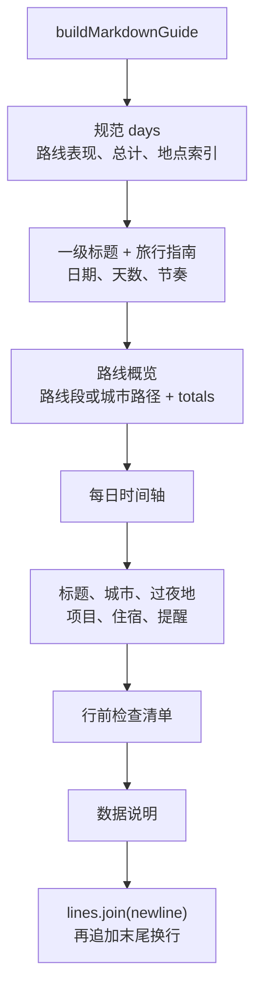

空状态也属于正式输出协议：

- 没有 totals：`暂无可用的里程与时长汇总`；
- 当天没有 items：`当天暂无时间轴安排`；
- 没有住宿：`住宿：待定`；
- 没有路线：`路线：待定`。

Markdown 适合继续编辑、贴进笔记软件或版本管理。它不包含 CSS，也不保证所有 Markdown 阅读器像本项目测试环境一样解析；安全策略因此尽量只输出简单标题、列表和纯行内文字。

## 19. HTML 渲染器

### 19.1 `htmlFacts(facts)`

空数组返回空字符串；否则用一个 `.facts` 段落包住多个 `<span>`。每个标签和值都经过 `escapeHtml()`。

### 19.2 `buildRouteHtml(route)`

- 路线段模式：有序列表、圆形序号、标题和 facts；
- 路径模式且为空：路线待定；
- 路径模式且有地点：用可见箭头连接地点名。

### 19.3 `buildTotalsHtml(totals)`

无条目显示空状态；有条目使用 `<dl><dt><dd>`，语义上表达“术语—解释”，比用无语义 `<div>` 列表更适合辅助技术。

### 19.4 `buildDayHtml(day, placeIndex)`

它一次构造完整的 `<article class="day-block">`：

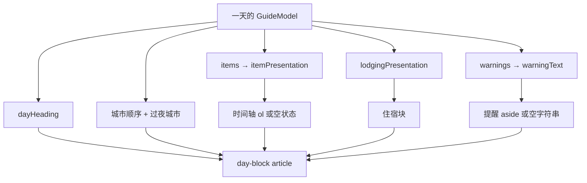

使用 `<article>`、`<header>`、`<aside>`、列表和标题层级，使文件不依赖视觉样式也有可理解结构。

### 19.5 `buildPrintableHtml(model)`

它返回从 `<!doctype html>` 到 `</html>` 的完整文件，包括：

- `lang="zh-CN"`；
- UTF-8 charset 与移动端 viewport；
- 动态但已转义的 `<title>`；
- 全部 CSS 内嵌在 `<style>`；
- 封面、路线、每天、检查清单、说明和页脚；
- 屏幕窄于 680px 的响应式规则；
- `@page` 和 `@media print` 打印规则。

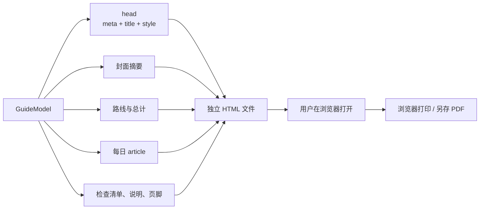

### 19.6 “独立”和“可打印”的准确含义

测试确认 HTML 不含 `<link>`、`<script>`、`href=`、`src=` 或 CSS `url(...)`：断网打开仍有完整正文和样式，也不会因跨域地图瓦片导致打印缺块。

它不会自动调用 `window.print()`，也不会直接生成 PDF。按钮下载 `.html`；用户打开后由浏览器打印引擎生成纸张或 PDF。这减少了脚本和第三方 PDF 库，但多一步人工操作。

### 19.7 打印布局的边界

CSS 尽量让一天、路线项、时间轴项和提醒避免跨页。但若单日内容高于一整页，浏览器仍必须分页；当前没有页码、重复页眉、目录或打印快照测试。

## 20. 为什么两种格式都必须在最后一公里转义

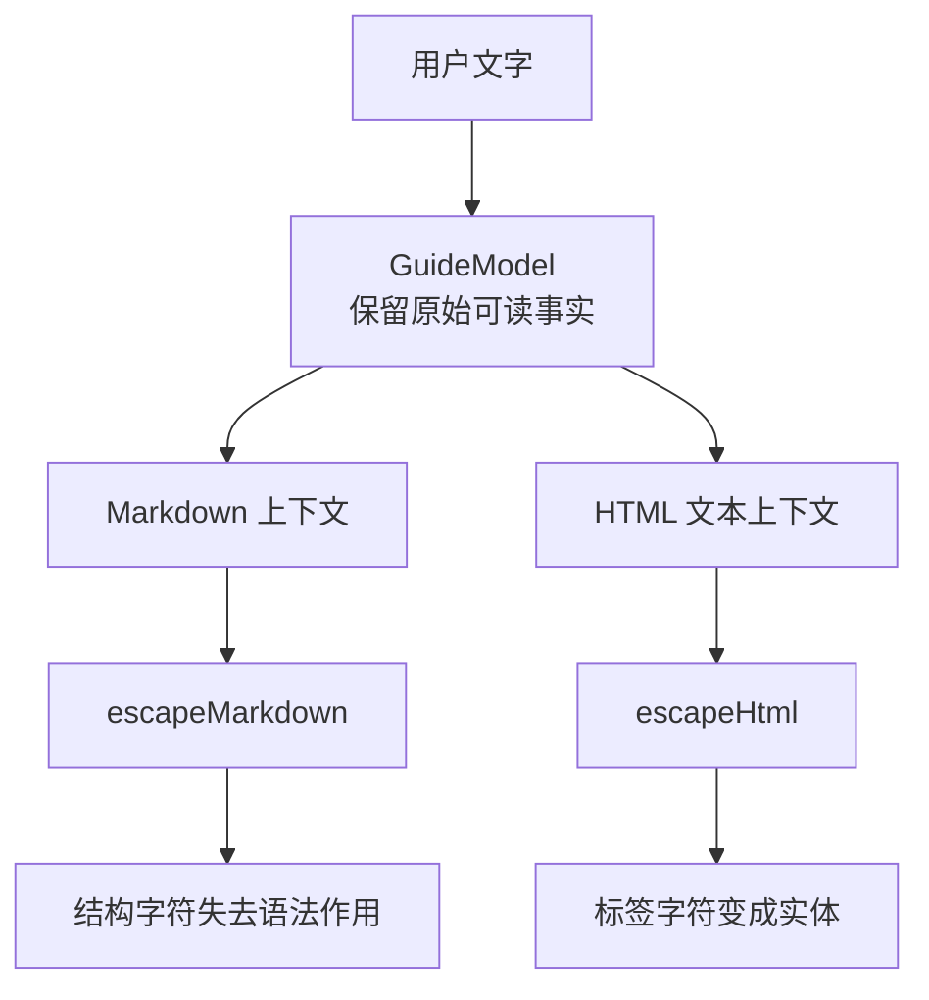

为什么不在 `buildGuideModel()` 时统一转义？因为模型不知道下游上下文。若先 HTML 转义再输出 Markdown，用户可能看到 `&lt;`；若先 Markdown 转义再输出 HTML，反斜杠会成为多余文字。安全编码必须尽量靠近具体输出位置。

## 21. 页面层怎样收集一份真实 GuideModel

### 21.1 `buildCurrentGuideModel()`

这个函数位于 `app.js`，不是纯指南模块。执行顺序如下：

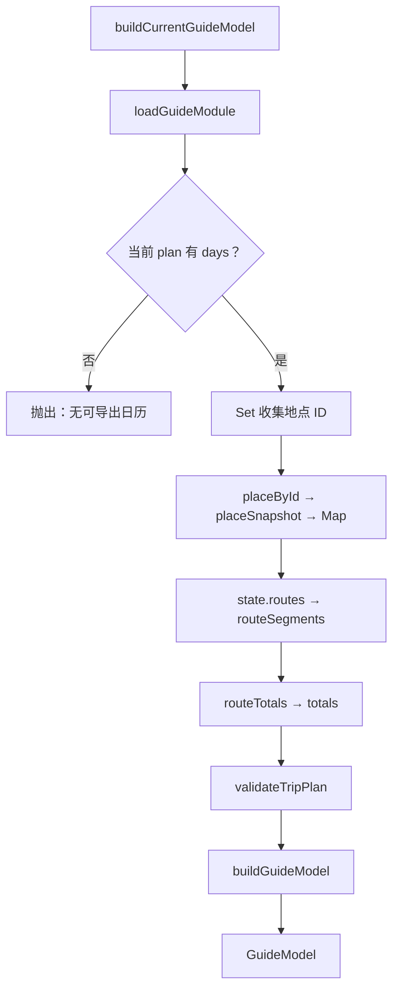

地点 ID 来自五类位置：每日城市、过夜城市、普通活动、交通起点/终点、住宿地点。`Set` 去重后再查询地点索引。

### 21.2 路线状态也进入导出

页面路线会被转换成稳定字段：

| 页面状态 | Guide 路线字段 |
| --- | --- |
| `from/to` | `fromPlaceId/toPlaceId` |
| 当前交通标签 | `transportLabel` |
| 降级测算 | `fallback: true/false` |
| success | `status: "ready"` |
| loading | `status: "计算中"` |
| error | `status: "无法估算"` 与错误说明 |
| 已有测算 | `distanceMeters/durationSeconds` |
| 尚无测算 | `distanceText/durationText: "待计算"` |

因此用户在计算未完成时点击导出，得到的是“计算中/待计算”的诚实快照，而不是伪造完成结果。

### 21.3 `placeSnapshot(place)`

只挑选地点的 ID、名称、省份、拼音、坐标、类型和父城市信息。它不会把整个运行时地点对象、图层引用或缓存塞进 GuideModel。

### 21.4 `guideFileName()` 与 `timestampForFile()`

文件名由第 8 章的 `safeTripNameForFile()`、ISO 时间戳和扩展名组成。冒号与句点被替换为连字符，避免 Windows 文件名非法。

## 22. 从点击到下载的完整时序

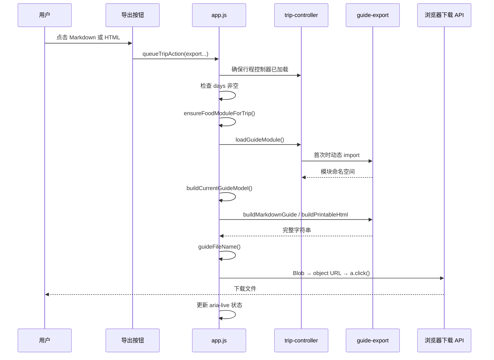

### 22.1 `loadGuideModule()`：两层懒加载

`app.js` 先确保 `trip-controller.js` 可用，再调用控制器的 `loadGuideModule()`。控制器用：

```js
guideModulePromise ||= import("./guide-export.js?v=progressive-2");
```

第一次创建 Promise，之后复用，避免两种导出按钮重复下载模块。缺点是第一次 import 若失败，拒绝的 Promise 会被永久缓存；不刷新页面就无法重试。

### 22.2 `queueTripAction(action)` 名称容易误解

它并没有维护先进先出的动作队列；只是等待行程控制器加载后执行 action，并统一捕获模块不可用错误。若多个异步导出同时触发，它们可以并发。更准确名称会是 `runWithTripModule()`。

### 22.3 `exportMarkdownGuide()` 与 `exportPrintableHtmlGuide()`

两者结构相同：

1. 没有日历就显示错误并返回；
2. 等待美食模块；
3. 懒加载相应渲染器；
4. 建立当前 GuideModel；
5. 生成字符串和文件名；
6. 下载；
7. 显示成功消息；
8. 任一步抛错都记录日志并显示“当前行程未更改”。

这里有两处可改进：两个函数可以共享通用导出模板；`ensureFoodModuleForTrip()` 的结果没有进入模型，当前只是增加等待和潜在告警。

### 22.4 `downloadTextFile(text, filename, type)`

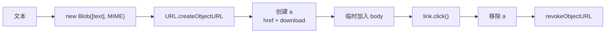

Markdown MIME 是 `text/markdown;charset=utf-8`，HTML 是 `text/html;charset=utf-8`。函数能确认下载动作被触发，不能确认用户最后把文件保存到了哪里。

### 22.5 按钮状态

`syncTripArchiveControls()` 只在 `state.tripPlan.days` 是非空数组时启用两种指南按钮。HTML 初始标记也带 `disabled`，所以应用尚未准备好时不会短暂出现可点击按钮。

## 23. 41 个函数声明逐一登记

| # | 行 | 函数 | 可见性 | 工程作用 |
| ---: | ---: | --- | --- | --- |
| 1 | 22 | `escapeHtml` | 私有 | 把动态文字编码为安全 HTML 文本。 |
| 2 | 31 | `escapeMarkdown` | 私有 | 消除换行、原始 HTML 与 Markdown 结构作用。 |
| 3 | 41 | `cloneValue` | 私有 | 深复制常见对象并用 WeakMap 处理循环引用。 |
| 4 | 77 | `scalarText` | 私有 | 只把可安全直接显示的标量转成文字。 |
| 5 | 85 | `displayText` | 私有 | 标量为空或无效时使用兜底文案。 |
| 6 | 90 | `firstText` | 私有 | 按优先级选第一个非空标量文字。 |
| 7 | 98 | `weekdayFor` | 私有 | 严格验证日期字符串并返回 UTC 星期。 |
| 8 | 119 | `dateForDay` | 私有 | 安全调用领域日期推导，异常时返回 null。 |
| 9 | 127 | `fallbackPlace` | 私有 | 地点资料缺失时用 ID 构造最小快照。 |
| 10 | 131 | `buildPlaceResolver` | 私有 | 建立 Map 地点查询、复制与降级闭包。 |
| 11 | 151 | `sortedItems` | 私有 | 深复制并按有效开始时间稳定排序项目。 |
| 12 | 168 | `buildGuideModel` | **公开** | 把页面事实编译成格式无关 GuideModel。 |
| 13 | 214 | `placeName` | 私有 | 从地点对象或后备 ID 取得显示名。 |
| 14 | 218 | `buildPlaceNameIndex` | 私有 | 从每日地点建立 ID 到名称的索引。 |
| 15 | 231 | `indexedPlaceName` | 私有 | 查名称索引，缺失时保留 ID 或显示待定。 |
| 16 | 237 | `nestedName` | 私有 | 从标量或嵌套对象中提取名称。 |
| 17 | 242 | `segmentEndpoint` | 私有 | 兼容多种路线起终点字段并解析名称。 |
| 18 | 263 | `formatDistanceMeters` | 私有 | 把米数格式化为米或公里。 |
| 19 | 270 | `formatDurationSeconds` | 私有 | 把秒数格式化为分钟或小时。 |
| 20 | 279 | `segmentDistance` | 私有 | 按字段优先级解析路线距离。 |
| 21 | 291 | `segmentDuration` | 私有 | 按字段优先级解析路线时长。 |
| 22 | 303 | `segmentPresentation` | 私有 | 把任意路线段转成标题与事实列表。 |
| 23 | 343 | `fallbackRoutePlaces` | 私有 | 从每天地点恢复只去相邻重复的路径。 |
| 24 | 356 | `routePresentation` | 私有 | 在结构化路线段与后备城市路径间分派。 |
| 25 | 368 | `safeProperty` | 私有 | 捕获属性 getter 异常并返回 undefined。 |
| 26 | 376 | `totalMetric` | 私有 | 按候选键与格式器提取一个总计指标。 |
| 27 | 386 | `totalEntries` | 私有 | 把各种 totals 形状变成标签—值数组。 |
| 28 | 431 | `paceText` | 私有 | 把节奏代码或对象变成可读文字。 |
| 29 | 442 | `timeRange` | 私有 | 生成开始—结束及次日标记。 |
| 30 | 449 | `itemPlaceName` | 私有 | 解析交通项目的 from/to 地点名。 |
| 31 | 463 | `itemPresentation` | 私有 | 统一交通、活动和未知项目的展示形状。 |
| 32 | 505 | `lodgingPresentation` | 私有 | 把住宿转成名称和事实列表。 |
| 33 | 521 | `warningText` | 私有 | 翻译警告代码并拼接说明。 |
| 34 | 528 | `dayHeading` | 私有 | 组合第几天、日期和星期。 |
| 35 | 537 | `markdownFacts` | 私有 | 把事实列表渲染为转义后的 Markdown 行内片段。 |
| 36 | 541 | `buildMarkdownGuide` | **公开** | 生成完整 Markdown 旅行指南。 |
| 37 | 618 | `htmlFacts` | 私有 | 把事实列表渲染为安全 HTML。 |
| 38 | 623 | `buildRouteHtml` | 私有 | 渲染路线段列表或城市路径。 |
| 39 | 636 | `buildTotalsHtml` | 私有 | 渲染总计定义列表或空状态。 |
| 40 | 643 | `buildDayHtml` | 私有 | 渲染一天的语义化 article。 |
| 41 | 680 | `buildPrintableHtml` | **公开** | 生成含全部打印样式的独立 HTML 文件。 |

合计 41 个声明，其中 3 个公开、38 个私有。

## 24. 34 个箭头函数逐一登记

箭头函数大多是 `map/filter/sort/forEach` 的局部规则。它们虽没有名字，仍然是会执行的函数节点。

| # | 行 | 所属位置 | 每次回调做什么 |
| ---: | ---: | --- | --- |
| 1 | 49 | `cloneValue` 的 Map `forEach` | 递归复制一个键和值并写入新 Map。 |
| 2 | 56 | `cloneValue` 的 Set `forEach` | 递归复制一个成员并加入新 Set。 |
| 3 | 62 | `cloneValue` 的对象键 `forEach` | 定义一个可写、可枚举的复制属性；单字段失败时跳过。 |
| 4 | 132 | `buildPlaceResolver` 返回值 | 按地点 ID 查询、验证、复制并降级。 |
| 5 | 154 | `sortedItems` 第一个 `map` | 给一个项目附原索引、复制值和分钟数。 |
| 6 | 159 | `sortedItems.sort` | 比较有效时间并用原索引稳定破平局。 |
| 7 | 165 | `sortedItems` 第二个 `map` | 从排序包装对象中取回 item。 |
| 8 | 188 | `buildGuideModel` 的 days `map` | 为一天计算日期、地点、项目、住宿和警告。 |
| 9 | 194 | 每日 warnings `filter` | 只保留 `warning.dayId === day.id` 的提醒。 |
| 10 | 195 | 每日 warnings `map` | 深复制一条匹配警告。 |
| 11 | 202 | cityEntries `map` | 把一个 `placeId` 解析为地点快照。 |
| 12 | 220 | `buildPlaceNameIndex` 的 `add` | 首次见到有效地点 ID 时登记名称。 |
| 13 | 224 | days `forEach` | 把一天的地点和过夜地点交给 `add`。 |
| 14 | 345 | `fallbackRoutePlaces.flatMap` | 从一天取出 places，非数组时给空数组。 |
| 15 | 347 | 展平地点 `forEach` | 去掉与前一个相同的连续地点并构造路径项。 |
| 16 | 353 | 路径 `map` | 从内部 `{ key, name }` 只取 name。 |
| 17 | 362 | routeSegments `map` | 把一段路线交给 `segmentPresentation`。 |
| 18 | 397 | 距离 `totalMetric` formatter | 文本原样；数值按米格式化。 |
| 19 | 404 | 时长 `totalMetric` formatter | 文本原样；数值按秒格式化。 |
| 20 | 422 | totals 键 `forEach` | 跳过已知指标，追加可显示的额外标量。 |
| 21 | 538 | `markdownFacts.map` | 转义并渲染一条标签—值事实。 |
| 22 | 560 | Markdown 路线段 `forEach` | 追加一行路线段。 |
| 23 | 566 | Markdown totals `forEach` | 追加一行总计。 |
| 24 | 572 | Markdown days `forEach` | 追加一天的完整章节。 |
| 25 | 574 | 当天 places `map` | 提取一个地点显示名。 |
| 26 | 581 | 当天 items `forEach` | 生成表现对象并追加一行时间轴。 |
| 27 | 620 | `htmlFacts.map` | 把一条事实转义并渲染成 span。 |
| 28 | 625 | HTML routeSegments `map` | 渲染一个带编号的路线 `<li>`。 |
| 29 | 638 | HTML totals `map` | 渲染一个 `<dt>/<dd>` 组合。 |
| 30 | 645 | `buildDayHtml` places `map` | 提取一个当天地点名称。 |
| 31 | 647 | `buildDayHtml` items `map` | 把一个原项目转成统一表现对象。 |
| 32 | 651 | 时间轴 items `map` | 把一个表现对象渲染成时间轴 `<li>`。 |
| 33 | 665 | warnings `map` | 把一条警告渲染成安全 `<li>`。 |
| 34 | 892 | `buildPrintableHtml` days `map` | 把一天交给 `buildDayHtml` 并连接所有文章。 |

合计：41 个函数声明 + 34 个箭头函数 = 75 个 AST 函数节点。

## 25. 页面协调层相关函数

这些函数不属于 75 个主模块节点，但决定用户怎样真正获得文件：

| 文件 | 函数 | 页面层责任 |
| --- | --- | --- |
| `trip-controller.js` | `loadGuideModule` | 动态导入并缓存指南模块 Promise。 |
| `app.js` | `loadGuideModule` | 先加载控制器，再转交懒加载。 |
| `app.js` | `queueTripAction` | 等待行程模块并统一报告加载错误；并非真正队列。 |
| `app.js` | `syncTripArchiveControls` | 根据日历是否非空启停两个指南按钮。 |
| `app.js` | `ensureFoodModuleForTrip` | 尝试加载美食控制器；当前导出数据未使用其结果。 |
| `app.js` | `buildCurrentGuideModel` | 收集计划、地点、路线、总计与警告。 |
| `app.js` | 内部 `addPlaceId` | 向 Set 添加非空字符串地点 ID。 |
| `app.js` | `guideFileName` | 安全行程名 + 时间戳 + 扩展名。 |
| `app.js` | `exportMarkdownGuide` | 完成 Markdown 导出事务和状态提示。 |
| `app.js` | `exportPrintableHtmlGuide` | 完成 HTML 导出事务和状态提示。 |
| `app.js` | `downloadTextFile` | 用 Blob 和临时链接触发浏览器下载。 |
| `app.js` | `placeSnapshot` | 从运行时地点摘取可移植字段。 |
| `app.js` | `timestampForFile` | 生成文件系统安全的 ISO 时间文本。 |

## 26. 13 项领域测试分别证明什么

| # | 测试主题 | 直接证据 | 没有证明什么 |
| ---: | --- | --- | --- |
| 1 | 同一日期活动出现在两种格式 | 日期、活动一致；HTML 标题已转义 | 全文逐字符语义相等 |
| 2 | 模型独立且稳定排序 | 原输入不变、嵌套引用不同、有效时间顺序稳定 | 所有特殊对象都能完美复制 |
| 3 | 无日期导出 | 日期和星期为 null，不出现 Invalid Date | 非法但可归一化日期被拒绝 |
| 4 | 完整内容 | 交通、活动、住宿、警告、路线和 totals 两端都有 | 每个字段的视觉布局 |
| 5 | HTML 转义 | 多个用户字段无原始 script/b 标签 | 所有未来新增插值点都自动安全 |
| 6 | Markdown 转义 | 无伪标题、列表、链接或原始 HTML | 所有 Markdown 方言的绝对安全 |
| 7 | HTML 独立可打印 | DOCTYPE、meta、print CSS，无外链/脚本/URL | 真正打印出的 PDF 分页质量 |
| 8 | 未知地点与警告降级 | 坏快照容器不崩，未知代码保留 | 所有恶意 Proxy |
| 9 | 无路线段时恢复路径 | 只去连续重复，往返地点保留 | 路线段与日历瞬时不一致 |
| 10 | 跨格式章节顺序 | 四个核心章节与每日核心内容一致 | 新字段未来不会单端遗漏 |
| 11 | 字符串路线端点 | ID 能通过地点快照变成中文名 | 所有历史字段组合 |
| 12 | 三种节奏 | relaxed/standard/compact 均有中文标签 | 未知节奏的产品文案 |
| 13 | 空时间轴与 totals | 两格式空状态一致 | 完全没有 days 的 HTML 分支与按钮行为 |

当前基线运行结果为 13/13 通过。

## 27. 另外三层测试提供什么证据

### 27.1 模块边界测试

确认 `app.js` 不静态导入指南模块，`trip-controller.js` 使用带版本参数的动态 import。它证明性能架构存在，不证明网络失败时可重试。

### 27.2 页面结构测试

确认：

- 两个按钮存在且初始 disabled；
- 导出按钮组有可访问名称；
- 两个 click 事件进入对应导出函数；
- CSS 保持两列且长文字不会溢出。

这些是源码结构断言，不等于真实浏览器交互。

### 27.3 浏览器测试

Playwright 实际创建行程，分别点击 JSON、Markdown 和 HTML 按钮，并确认浏览器产生可读下载流。这证明 Chromium 主路径连通；它尚未打开下载后的 HTML、检查打印预览或比对文件正文。

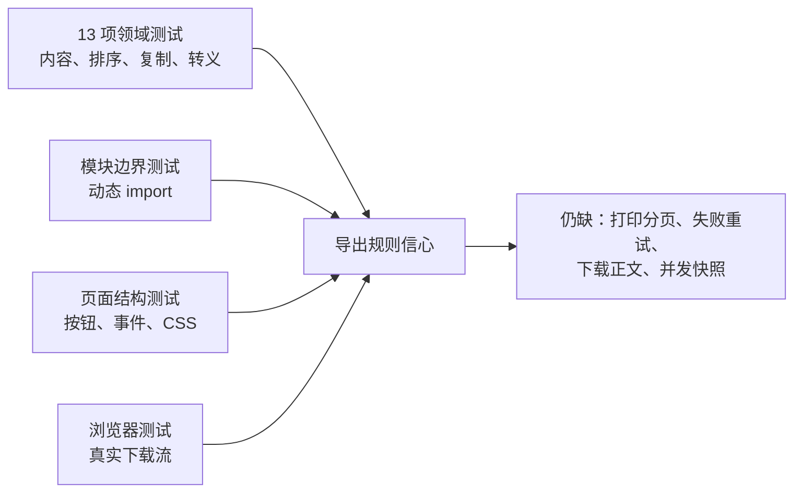

## 28. 为什么这样设计：再沿因果链追五次

### 28.1 为什么不直接导出 TripPlan JSON

1. JSON 为机器恢复设计，不为旅行途中阅读设计。
2. 它主要保存地点 ID，用户需要名称、日期和星期。
3. 时间轴原顺序可能不适合阅读，需要稳定排序。
4. 路线测算和警告来自运行时派生，不全在 TripPlan 中。
5. 因此需要一份只面向阅读的 GuideModel，再生成文档。

结论：行程 JSON 与旅行指南是不同产品，不应共用一种文件假装满足两种需求。

### 28.2 为什么 Markdown 和 HTML 共用模型

1. 用户认为它们是同一份指南的两种载体。
2. 若各自解析 TripPlan，会重复地点、日期、排序和兼容规则。
3. 重复规则会独立演化，产生内容差异。
4. 先规范化后，格式层只负责语法与布局。
5. 纯模型还可以被未来 PDF、纯文本或邮件渲染器复用。

结论：共享模型减少的是“事实分叉”，不是简单减少几行代码。

### 28.3 为什么深复制而不是共享引用

1. 页面状态会继续编辑。
2. 渲染器可能排序、补字段或被未来代码修改。
3. 共享引用会把导出过程变成隐形写操作。
4. 隐形写操作会破坏撤销、自动保存和用户正在看的页面。
5. 深复制把导出定义为只读快照边界。

结论：额外内存换来可预测性；普通规模行程值得这笔成本。

### 28.4 为什么 HTML 不嵌地图和在线资源

1. 用户可能离线打开文件。
2. 地图瓦片、字体和脚本可能跨域、过期或被拦截。
3. 打印引擎不保证等待异步资源完成。
4. 外部资源也扩大隐私与安全面。
5. 内嵌 CSS 加纯文本路线让文件长期可读、可打印。

结论：导出物优先可靠归档，而不是复制应用界面的全部视觉效果。

### 28.5 为什么模块延迟到第一次导出

1. 大多数首屏用户先看地图或选城市。
2. 指南模块约 34 KB，且包含大量打印 CSS 字符串。
3. 启动时加载会与关键地图代码竞争解析时间。
4. 动态 import 把成本推迟到用户表达导出意图之后。
5. Promise 缓存让第二次导出不再重复付费。

结论：这是按用户路径拆包；还应补上失败后清除缓存 Promise 的重试机制。

## 29. 当前设计中值得保留的部分

1. 纯模块边界清楚，没有 DOM 和存储副作用。
2. 三个公开函数足够小，内部兼容逻辑不泄漏给调用者。
3. GuideModel 与原输入深度独立，测试验证了引用隔离。
4. HTML 与 Markdown 使用各自上下文转义。
5. 路线、总计、项目和住宿先转表现对象，再由格式层消费。
6. 未知地点、未知警告和空数据有可追踪降级，不会轻易丢事实。
7. HTML 真正独立，不依赖应用 CSS、JS、图片或网络。
8. 首屏通过双层动态 import 避开导出模块成本。
9. 单元、边界、结构和浏览器四层测试各守不同风险。

## 30. 更好的方案，按优先级排序

### 30.1 第一优先级：建立正式 GuideModel schema 与单一规范化边界

使用 TypeScript 类型加运行时验证器，例如：

```ts
type GuideModel = {
  schemaVersion: 1;
  title: string;
  startDate: string | null;
  days: GuideDay[];
  route: GuideRoute;
  totals: GuideFact[];
};
```

当前渲染阶段仍在兼容各种 `segment`、`totals` 和 item 别名，说明 GuideModel 尚未完全“规范化”。理想状态是所有兼容解析都在构建阶段完成，渲染器只面对一种严格形状。

### 30.2 第二优先级：用文档树消除双渲染器事实漂移

先建立格式中立的块：

```js
[
  { type: "heading", level: 1, text: "京豫秋游" },
  { type: "facts", entries: [...] },
  { type: "day", heading: [...], timeline: [...] }
]
```

MarkdownRenderer 和 HtmlRenderer 只翻译这些块。这样新增“紧急联系人”时不会忘记给其中一个格式加内容，也可以自动做结构级一致性测试。

### 30.3 第三优先级：严格日期与单位契约

- 在领域层拒绝不存在的 `YYYY-MM-DD`；
- 数值只允许明确的 `distanceMeters`、`durationSeconds`；
- 不再猜测通用 `distance`/`duration` 的单位；
- 负距离和无效 offset 产生结构化警告。

### 30.4 第四优先级：修正应用协调边界

- 删除未使用的 `ensureFoodModuleForTrip()`，或真正把美食推荐纳入 GuideModel；
- 动态 import 失败时把缓存 Promise 清空，允许重试；
- 把两个导出函数合成参数化 `exportGuide({ format })`；
- 把 `queueTripAction()` 改名，或实现真正串行动作队列。

### 30.5 第五优先级：一次性捕获一致页面快照

当前 `buildCurrentGuideModel()` 从 `state.tripPlan`、`state.routes` 和地点 Map 分多步读取，中间包含 `await`。应在一个同步步骤先捕获版本号或不可变引用集合，再异步渲染；结束前检查版本未变化。否则极快连续编辑与导出时，理论上可能出现文件名、日历和路线来自相邻状态。

### 30.6 第六优先级：改善下载生命周期与大行程性能

- 在下一任务或短延时后 revoke 对象 URL，兼容更保守浏览器；
- 超大指南放 Web Worker 构建，避免主线程卡顿；
- 可选 UTF-8 BOM，照顾旧版 Windows 编辑器；
- 报告生成大小并阻止意外超大文件。

### 30.7 第七优先级：把“可打印”升级为可验证能力

- Playwright 打开下载后的 HTML；
- 生成 PDF 并检查页数、溢出和关键文字；
- 覆盖超长单日、长中文/英文、无路线、十几天行程；
- 加页码、重复页眉和可选目录；
- 页面可提供“打开打印预览”，同时保留下载 HTML。

### 30.8 第八优先级：补足产品内容

最初设计提到封面日期范围和城市顺序，当前封面只有出发日期、天数和节奏；美食模块虽被预加载却未输出。可把以下内容作为明确、可选章节，而不是隐式耦合：

- 结束日期与完整日期范围；
- 封面城市路径；
- 与活动关联的美食文章摘要；
- 警告关联的具体项目标题；
- 生成时间与数据版本；
- 用户可选隐私字段。

### 30.9 第九优先级：消除双静态树漂移

以 `public/static-site` 为单一源码，通过构建脚本生成根目录兼容入口，或删除旧预览路径。当前 guide 文件只差缓存查询参数，但根目录 `app.js` 与发布版架构已经明显不同；依赖人工同步会让维护者读错入口。

## 31. 零基础读者怎样亲手跟一次 Markdown 导出

1. 从 `index.html` 找 `#exportMarkdownBtn`，确认初始有 `disabled`。
2. 到 `syncTripArchiveControls()`，看非空 `days` 怎样启用按钮。
3. 跟到底部 click 监听器，再进入 `queueTripAction()`。
4. 看 `loadTripControllerModule()` 如何先准备行程领域模块。
5. 进入 `exportMarkdownGuide()`，写下“检查、加载、建模、渲染、命名、下载、提示”七步。
6. 注意 `ensureFoodModuleForTrip()` 的返回值没有被使用。
7. 进入两层 `loadGuideModule()`，确认首次才动态 import，后续复用 Promise。
8. 到 `buildCurrentGuideModel()`，列出 Set 收集地点 ID 的五个来源。
9. 看 `placeSnapshot()` 为什么只保留可移植字段。
10. 看路线 loading/error 怎样仍成为可见状态，而不是被删除。
11. 进入 `buildGuideModel()`，确认每一天都是新对象，items 已复制并排序。
12. 选一个标题含 `<script>` 的活动，沿 `itemPresentation()` 到 `escapeMarkdown()`。
13. 看 `buildMarkdownGuide()` 怎样按固定章节向 `lines` 追加文字。
14. 进入 `guideFileName()`，再回看第 8 章的 `safeTripNameForFile()`。
15. 最后进入 `downloadTextFile()`，跟完 Blob、对象 URL、临时链接、点击、清理。
16. 对照领域测试“escapes Markdown HTML and structural control characters”和浏览器测试“every import/export path remain available”。

如果只记住本章一条工程原则，请记住：

> 导出不是“把对象拼成字符串”，而是一次有边界的编译：先固定事实，再归一化含义，最后按目标语法做上下文转义；文件看起来正确、内容来源一致和用户输入不能逃逸，三者缺一不可。

## 32. 下一章预告

下一章将拆解发布版 `app.js` 的总协调架构：地图、延迟数据、城市详情、美食、行程领域、存档和指南模块怎样在一个页面生命周期内分阶段启动；哪些状态属于谁、异步结果怎样防止覆盖新状态、为什么这个 2,600 余行文件仍是当前最大的耦合中心。

继续阅读：[第 10 章：总协调器（上）——模块装配、关键数据、延迟水合与搜索](./10-app-bootstrap-data-search.md)

回看：[第 8 章：行程怎样安全保存、恢复、迁移、分享与回滚](./08-trip-archive.md)
