# 第 10 章：总协调器（上）——模块装配、关键数据、延迟水合与搜索

> 本章开始拆解发布版 `public/static-site/app.js`。整份文件共 2,591 行、99,352 字节，AST 识别出 274 个函数节点：137 个函数声明和 137 个箭头函数。为了让零基础读者能看见因果关系，而不是淹没在 274 行清单中，`app.js` 分三个连续章节讲解。本章覆盖第 1–637 行，逐一登记其中 43 个节点：18 个函数声明和 25 个箭头函数。

## 1. 为什么必须把同一个文件拆成三章

`app.js` 同时承担九类协调工作：

1. 静态模块和懒加载模块装配；
2. 关键地图数据加载；
3. 区县与美食摘要延迟水合；
4. 搜索、地图视图与城市详情切换；
5. TripPlan 提交、表单与撤销；
6. 路线摘要和旧版推荐面板；
7. 存档、恢复、分享与导入事务；
8. Markdown/HTML 指南导出；
9. 页面启动和所有 DOM 事件接线。

如果把全部 274 个节点放在一张图或一个表中，线条必然交叉、函数名失去上下文。拆章只改变阅读顺序，不改变覆盖标准：

| 章节 | 源码范围 | 函数声明 | 箭头函数 | 合计 | 主题 |
| --- | ---: | ---: | ---: | ---: | --- |
| 第 10 章 | 1–637 | 18 | 25 | 43 | 装配、关键/延迟数据、地点索引、搜索、重置视图 |
| 第 11 章 | 638–1537 | 59 | 46 | 105 | TripPlan 提交、表单、渲染、路线摘要、推荐 |
| 第 12 章 | 1538–2591 | 60 | 66 | 126 | 存档恢复、地图动作、指南导出、启动与事件 |
| **合计** | 1–2591 | **137** | **137** | **274** | 完整 `app.js` |

## 2. 学完本章能回答什么

1. 为什么 `app.js` 既有静态 import，又有动态 import？
2. 为什么动态模块的导出先声明成几十个 `let`，加载后再统一赋值？
3. Promise 为什么被缓存，缓存失败 Promise 又会带来什么问题？
4. “依赖注入”是什么，为什么城市详情模块不反向 import `app.js`？
5. 页面为什么先加载城市和轻量边界，再加载区县与美食摘要？
6. 某一块行政区边界失败，为什么地图仍能启动？
7. `Promise.allSettled()` 与 `Promise.all()` 的差别是什么？
8. 区县摘要和美食摘要怎样各自失败、各自降级？
9. 为什么区县资料到达后可能要重试一次行程恢复？
10. `placeIndex` 为什么是真实索引，`state` 里却又复制一组索引引用？
11. 50 个共享状态字段分别属于哪些责任域？
12. 50 个单元素引用和 3 组元素列表为什么在模块顶层查询？
13. 搜索结果怎样筛选、评分、排序并限制为 8 条？
14. 城市结果和区县结果点击后为什么走不同地图路径？
15. 用户快速切换选择时，哪些异步结果有“只应用最新”的保护？
16. 当前启动与搜索架构哪里稳健，哪里仍可能发生错误误报、永久失败或竞态？

## 3. 五问核验后的架构结论

| 核验问题 | 结论 |
| --- | --- |
| `app.js` 真正是什么？ | 它是页面组合根和协调器：持有共享运行时状态、DOM 引用和模块接线，不应重新拥有地点索引、地图绘制、行程规则、存档规则或美食归一化。 |
| 地图可操作标志的最小条件是什么？ | 非空城市坐标数据和成功初始化的 Leaflet 控制器；8 个轻量边界块允许部分甚至全部失败。行程模块随后才被等待，区县搜索、美食摘要与城市详情可在地图可用后补齐。 |
| 异步正确性的核心规则是什么？ | 关键数据失败则启动失败；可选数据允许独立缺失；会重绘当前选择的延迟结果必须识别陈旧 generation；城市详情还要识别地图 detail session。 |
| 共享状态为什么这么大？ | 它是旧单文件架构逐步模块化后的兼容中心：新控制器仍通过注入共享部分旧状态和 DOM，因此所有权已外移，存放位置尚未完全外移。 |
| 最大风险是什么？ | 45 个左右的行程 API 通过可变 `let` 晚绑定；加载错误与动作错误被同一 catch 误称为“模块不可用”；部分失败 Promise 永久缓存；私有搜索/启动函数难以直接单测。 |

一句话总结：

> `app.js` 像机场塔台：地图、地点索引、城市详情、美食和行程模块各自拥有专业能力；塔台不亲自完成那些工作，但决定何时加载、向谁注入什么、哪一份状态是当前事实，以及失败后页面还能提供哪些能力。

## 4. 先认识本章需要的 JavaScript 概念

### 4.1 模块求值

浏览器遇到：

```html
<script type="module" src="./app.js?v=progressive-2"></script>
```

会先加载并执行所有静态依赖，再执行 `app.js` 顶层语句。脚本位于 `body` 尾部，所以顶层 `querySelector()` 执行时，前面的 HTML 元素已经建立。

### 4.2 静态与动态 import

```js
import { createPlaceIndex } from "./place-index.js"; // 启动前必须有

const module = await import("./city-detail.js");     // 需要时再加载
```

静态 import 适合首屏必需、小而稳定的能力；动态 import 适合较大、较晚使用或可降级的能力。

### 4.3 `||=` 与 Promise 缓存

```js
modulePromise ||= import("./module.js");
```

第一次左侧为空，执行 import；以后返回同一个 Promise。好处是并发调用只发起一次加载。坏处是如果被缓存的是 rejected Promise，以后每次都会立即失败，除非明确清空缓存。

### 4.4 Promise 不是模块本身

| 变量 | 含义 |
| --- | --- |
| `foodModulePromise` | “美食源码最终能否加载”的异步票据 |
| `foodControllerPromise` | “控制器最终能否构造完成”的异步票据 |
| `foodController` | 已构造完成、可立即调用的真实对象 |

把三者分开，可以区分“正在加载”和“已经可用”，但也增加状态组合。

### 4.5 依赖注入

城市详情模块需要查城市、加载美食、操作地图，但它不 import `app.js`。协调器在创建它时传入：

```js
createCityDetailController({
  state,
  mapController,
  callbacks: { cityById, renderPanel, ... },
  helpers: { escapeHtml, loadOptionalJson, ... }
});
```

这叫依赖注入。模块明确声明“我需要什么”，调用者提供实现，避免双向 import 和隐藏全局依赖。

### 4.6 闭包提供“活的引用”

```js
getPlaceIndex: () => placeIndex
```

如果直接传 `placeIndex`，控制器可能只拿到创建当时的对象；传函数后，每次调用都会读当前变量，区县水合替换引用后仍能得到最新索引。

### 4.7 `Promise.allSettled()`

`Promise.all()` 有一个 Promise 拒绝就立刻拒绝；`allSettled()` 等全部结束，并为每个返回：

```js
{ status: "fulfilled", value: ... }
{ status: "rejected", reason: ... }
```

这适合“区县失败不应抹掉美食成功”的可选数据场景。

### 4.8 generation 与陈旧结果

用户先选 A，马上又选 B。A 的异步模块可能更晚返回。generation 计数让回调检查“我还是最新一次吗”，旧结果只返回 `stale`，不能覆盖 B。

## 5. 整个发布页面的模块所有权

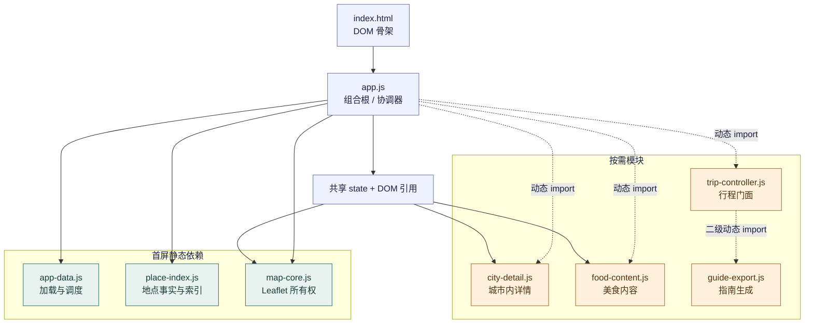

这里的“所有权”不是“谁能调用”，而是“哪一层定义规则并维护生命周期”：

- `app-data` 决定请求、超时、重试和空闲调度；
- `place-index` 决定地点怎样建立、合并和检索；
- `map-core` 决定 Leaflet 图层和详情 session；
- `city-detail` 决定区县、地标、站点和地铁详情；
- `food-content` 决定文章数据与美食面板；
- 行程四模块决定 TripPlan、编辑、存档和指南；
- `app.js` 只负责把它们接起来——虽然当前仍残留一些旧展示算法，第 11 章会看到。

## 6. 三阶段启动，而不是“一次全加载”

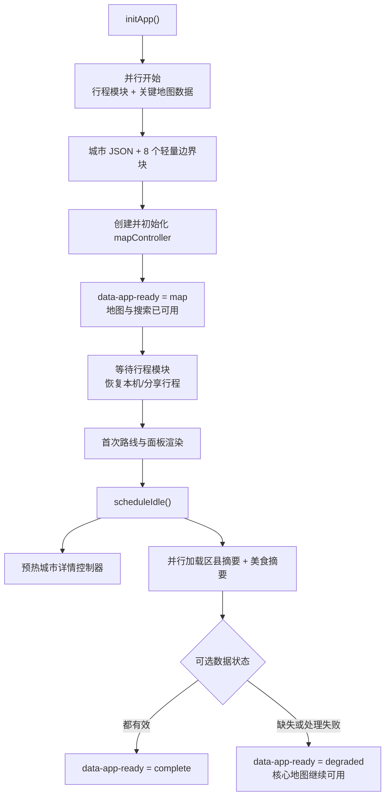

`initApp()` 位于文件末尾，第 12 章逐行拆解；本章先理解它为什么调用前 637 行中的装配和数据函数。

## 7. 三个静态依赖为什么必须首屏存在

### 7.1 `app-data.js`

静态导入七项：

| API | 作用 |
| --- | --- |
| `createJsonLoader` | 带版本、缓存、超时与重试的 JSON 读取器 |
| `createDeferredDataLoaders` | 分别缓存区县摘要和美食摘要 Promise |
| `loadCriticalMapData` | 城市与 8 个轻量边界块 |
| `classifyDeferredSummaryData` | 判断 complete/degraded |
| `createLatestAsyncRefresh` | 只应用最新异步选择 |
| `isCountyRecordsPayload` | 区县载荷形状检查 |
| `scheduleIdle` | requestIdleCallback 或 50ms 定时器 |

`loadJson`、`loadOptionalJson` 和 `deferredData` 在模块顶层创建一次，之后所有调用共享版本和缓存策略。

### 7.2 `place-index.js`

静态导入地点索引创建、水合、搜索规范化和运行时地点写入。地图启动、搜索和恢复都依赖地点 ID，因此它不能等用户第一次打开城市详情才加载。

### 7.3 `map-core.js`

只静态导入 `createMapController`。`app.js` 不直接调用 `L.map()` 或 `L.geoJSON()`；模块边界测试明确守住 Leaflet 所有权。

## 8. 动态依赖矩阵

| 能力 | 第一次加载时机 | 缓存变量 | 失败后当前页可否真正重试 |
| --- | --- | --- | --- |
| 行程控制器 | 启动时与地图数据并行 | `tripControllerModulePromise` | 否；rejected Promise 未清空 |
| 指南模块 | 第一次导出 | 控制器内 `guideModulePromise` | 否 |
| 城市详情源码 | 空闲预热或首次进城 | `cityDetailModulePromise` | import 失败后否 |
| 城市详情控制器 | 空闲预热或首次进城 | `cityDetailControllerPromise` | 构造失败可重试；import 失败仍被模块 Promise 卡住 |
| 美食源码 | 首次面板刷新或摘要水合 | `foodModulePromise` | 否 |
| 美食控制器 | 同上 | `foodControllerPromise` | 否 |

城市详情 catch 会清空控制器 Promise，但不会清空模块 Promise。因此它只能恢复“模块已加载、控制器构造失败”，不能恢复真正的网络 import 失败。

## 9. `loadTripControllerModule()`：把 45 个左右的晚绑定名字装上实现

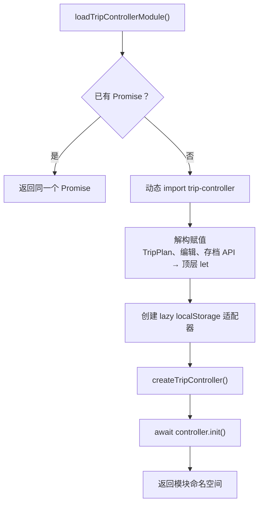

### 9.1 为什么不是普通静态 import

行程计划、编辑器和存档代码在地图首屏之前不一定需要。动态门面让地图数据与行程模块并行加载，并为指南保留第二层懒加载。

### 9.2 为什么先声明大量 `let`

文件后面的旧协调函数直接用 `applyTripCommand`、`restoreTripArchiveSnapshot` 等名字。逐步模块化时，用晚绑定 `let` 可以少改调用点。

这是迁移技巧，不是理想终态。任何漏掉 `await loadTripControllerModule()` 的路径都会调用 `undefined`；新增导出还必须手工同步这份长清单。

### 9.3 懒存储适配器为什么接收函数

```js
createLazyStorageAdapter(() => window.localStorage)
```

构造时不访问 localStorage；真正读写时才求值，并由第 8 章的适配器捕获浏览器 getter 异常。

## 10. `loadGuideModule()`：二级懒加载

它先等待行程控制器，再调用 `tripController.loadGuideModule()`。指南永远不会绕开行程门面单独加载：

```text
app → trip-controller → guide-export
```

这样模块边界集中，但也让指南加载依赖整个行程控制器成功。

## 11. `queueTripAction(action)`：不是队列

函数实际做的是：

```js
return loadTripControllerModule()
  .then(action)
  .catch(reportAsTripModuleFailure);
```

它没有数组、锁或 Promise 链来保证先进先出。多个 action 可以并发，所以更准确的名字是 `runWithTripModule()`。

更重要的是 catch 同时捕获：

1. 模块加载失败；
2. `action` 自己抛出的任何错误。

两者最终都显示“行程功能加载失败”。这会把业务错误误诊成模块错误，也吞掉调用者原本可处理的 rejection。

## 12. 城市详情依赖怎样被注入

### 12.1 `loadCityDetailModule()`

只负责缓存动态 import Promise，不创建控制器。

### 12.2 `loadCityDetailController()`

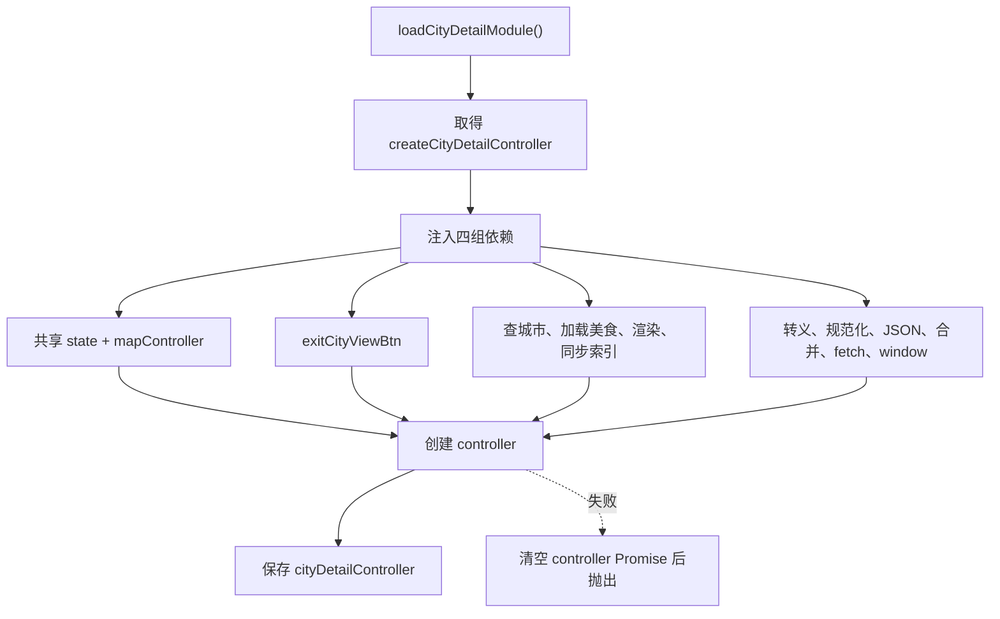

依赖注入让 `city-detail.js` 可以在测试中使用假地图、假 fetch 和最小 state，也阻止它反向依赖 `app.js`。

### 12.3 为什么传 `window.fetch.bind(window)`

把浏览器方法作为普通函数传递时，某些 Web API 可能依赖原接收者。`bind(window)` 固定调用上下文，避免“非法调用”类兼容问题。

## 13. 城市详情加载失败与延迟刷新

### 13.1 `reportCityDetailModuleFailure(error)`

第一次失败才写一次 console warning，避免反复刷屏；每次都把 `state.deferredInternalError` 设为 true，并重新渲染操作警告。地图核心不因此停止。

### 13.2 `queueCityDetailModuleRefresh()`

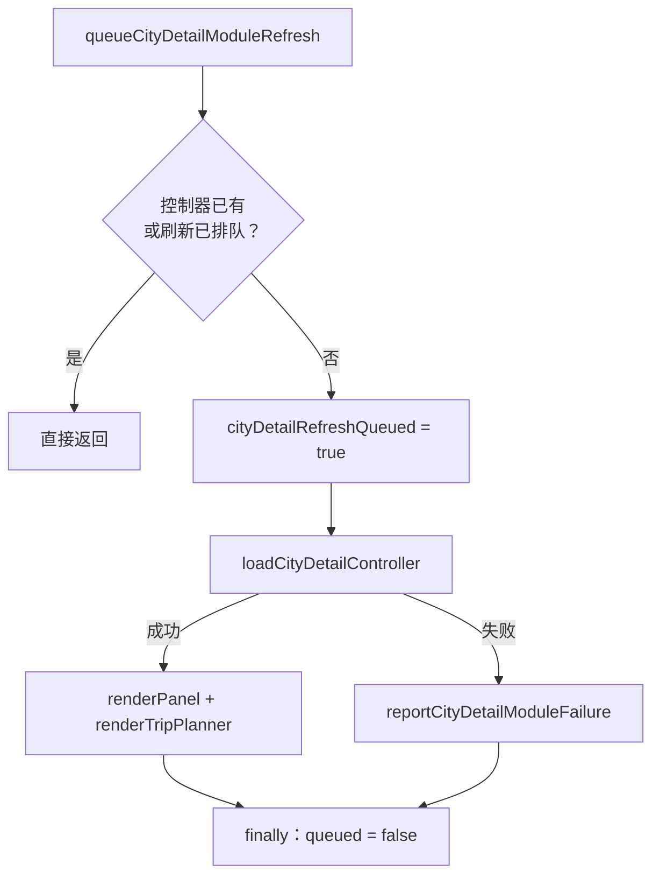

为什么成功后要重绘两处？城市详情模块可能为当前城市补上区县、地标和站点；左侧面板计数和行程推荐都依赖这些资料。

为什么需要 queued 标志？渲染过程中可能多次发现控制器未就绪；只允许一条“加载完成后重绘”链，避免重复重绘风暴。

## 14. 美食模块装配

### 14.1 `loadFoodModule()`

缓存 `food-content.js` 的动态 import Promise。

### 14.2 `loadFoodController()`

创建控制器时注入：

- 共享 `state`；
- document、文章计数、列表和空状态节点；
- `loadOptionalJson`；
- 搜索规范化、HTML 转义、坐标判断与当前 URL。

它没有 catch 清空 Promise。import、工厂或构造任一步失败后，当前页面后续调用会持续收到同一拒绝结果。

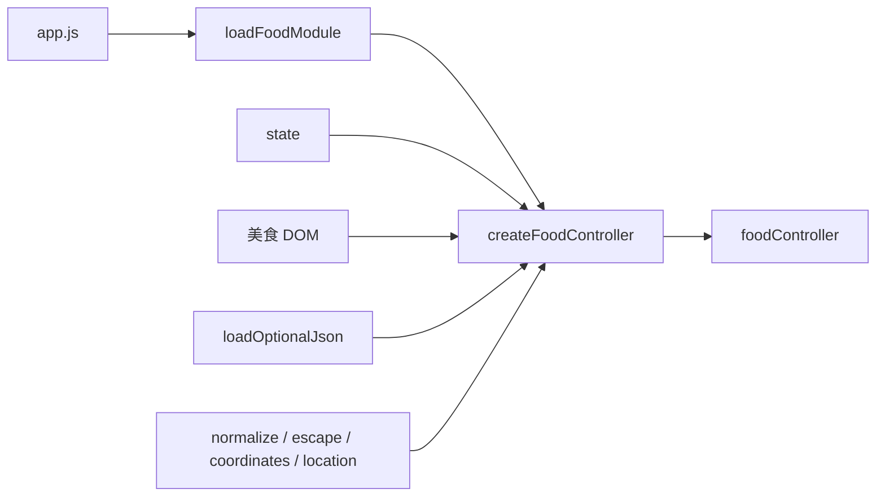

## 15. 文案、交通参数和行程节奏参数

### 15.1 `labels`

源码使用 `\uXXXX` 写中文，但运行时仍是普通中文字符串。两个箭头函数是：

- `fromCity(name)`：生成“从某地出发”；
- `segment(index)`：把零基索引转成“第 N 段”。

大量 Unicode 转义降低源码可读性，却能避免旧工具链编码问题。当前工程已统一 UTF-8，直接中文会更易维护。

### 15.2 `transportProfiles`

| 模式 | 速度 | 绕行系数 | 固定缓冲 |
| --- | ---: | ---: | ---: |
| highspeed | 300 km/h | 1.08 | 35 分钟 |
| train | 180 km/h | 1.12 | 25 分钟 |

这些不是实时车次，而是路线服务不可用或规划摘要需要估算时的产品参数。

### 15.3 `tripPaceProfiles`

三种节奏分别定义日常交通上限、硬上限、每日最多地点、可游玩窗口和说明。它们会被路线摘要和 TripPlan 校验共同消费。

### 15.4 重复默认常量

`DAILY_TRAVEL_LIMIT_SECONDS`、`MAX_DAILY_PLACES`、`CITY_PLAY_WINDOW_SECONDS` 与 standard profile 内容重复，服务后面的旧版推荐面板。重复规则可能漂移，第 11 章会追到使用点。

## 16. 50 个共享状态字段

`state` 是普通可变对象，不是 React state，也没有自动响应机制。字段变化后必须显式调用渲染函数。

### 16.1 行程与选择

| 字段 | 含义 |
| --- | --- |
| `selectedCityId` | 当前路线末端或选中地点 |
| `transportMode` | 当前交通模式 |
| `tripPace` | 当前节奏 |
| `tripPlan` | TripPlan v2 当前事实 |
| `tripHistory` | 撤销历史 |
| `tripEditorDestroy` | 编辑器事件清理函数 |
| `routes` | 地图路线测算状态 |
| `nextRouteId` | 新路线段 ID 计数 |
| `pendingCityClickTimer` | 180ms 点击延迟计时器 |

### 16.2 地图视图与详情计数

| 字段 | 含义 |
| --- | --- |
| `viewMode`、`activeCityViewId` | 中国视图或某城市详情视图 |
| `activeDistrictBoundaryCount` | 当前区县边界数 |
| `activeLandmarkCount` | 当前地标数 |
| `activeStationCount` | 当前铁路站数 |
| `activeSubwayLineCount` | 当前地铁线数 |
| `activeSubwayStationCount` | 当前地铁站数 |
| `activeFoodArticleCount` | 当前美食文章数 |

### 16.3 Leaflet 与图层句柄

`map`、`canvasRenderer`、`chinaLayer`、`cityLayer`、`labelLayer`、`routeLayer`。

这些字段由 `map-core` 控制器实际管理，但仍存放在共享 state 中，是“所有权已模块化、存储结构尚未完全模块化”的例子。

### 16.4 地点索引与详情缓存

`cityById`、`placeById`、`cityByKey`、`cityByProvinceKey`、`cityKeyEntries`、`cityFeatureLayers`、`cityAdcodes`、`cityBoundaryCache`、`stationCache`、`subwayStationCache`、`landmarkCache`、`featureCityIds`。

### 16.5 延迟资源与请求去重

`metroNetworkData`、`metroNetworkPromise`、`passengerStationNames`、`passengerStationNamesPromise`、`loadedCountyCityIds`、`countyLoadPromises`。

### 16.6 列表、原始数据与运行状态

`searchResults`、`cities`、`counties`、`hiddenMunicipalityChildren`、`mapData`、`failedBoundaryPaths`、`missingOptionalDatasets`、`deferredInternalError`、`panelBaseHint`。

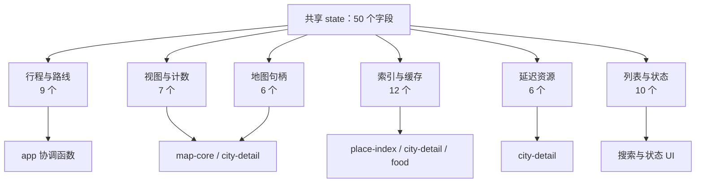

字段总数大不是罪名，问题在于没有明确的只读/可写边界。多个模块拿到同一对象后，维护者必须靠约定知道谁能改哪个字段。

## 17. DOM 引用是页面与协调器的硬契约

模块顶层查询 50 个单元素引用，另有三组列表：

- `mobileViewButtons`：所有 `[data-mobile-view]`；
- `transportButtons`：所有 `[data-mode]`；
- `paceButtons`：所有 `[data-pace]`。

可以按用途分组：

| 分组 | 代表节点 |
| --- | --- |
| 操作状态 | `selectionTitle`、`selectionHint`、`tripArchiveStatus` |
| 路线控制 | `routeList`、`undoBtn`、`clearBtn`、`resetViewBtn` |
| 存档与导出 | 保存、分享、导入、JSON、Markdown、HTML 按钮 |
| 搜索 | `citySearch`、`clearSearchBtn`、`searchResults` |
| 汇总 | 城市数、路线数、总距离、总时长、链路文字 |
| 美食 | 文章计数、列表、空状态 |
| 行程编辑 | 名称、日期、自动排期、撤销、编辑根节点、健康状态 |
| 对话框 | 表单、标题、类型/时间标签、地点、地标 datalist、取消按钮 |
| 布局与地图 | `appShell`、移动视图按钮、退出城市按钮、地图徽标 |

大多数节点没有统一的启动断言。若 HTML 改了 ID，错误可能在某个晚期操作中才表现为“读取 null 的属性”。更好的方案是 `requireElement("#citySearch")` 在启动时一次性报告缺失契约。

## 18. `foodInteractionRefresh`：只让最新选择刷新推荐

顶层调用 `createLatestAsyncRefresh()`，传入三个协作者：

- `load: loadFoodController`；
- `apply(controller, selection)`：让美食控制器渲染当前选择；
- `refresh()`：重新渲染行程推荐。

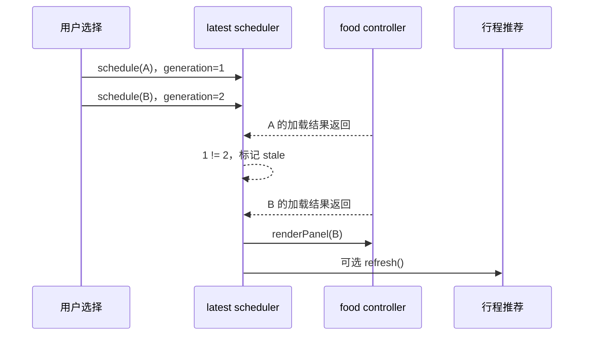

这里保护的是“美食面板和推荐使用最新选择”。它不自动保护所有 `app.js` 异步函数；搜索点击和模块动作需要各自的取消/世代策略。

## 19. `loadMapData()`：关键数据最小集

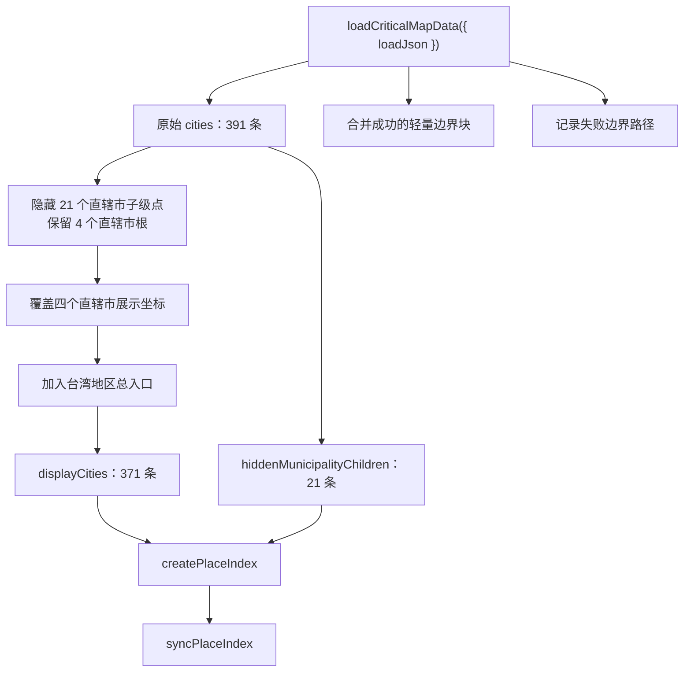

### 19.1 为什么直辖市子级城市不做全国地图主点

北京、上海、天津、重庆的数据里有区级子项。如果全部作为全国主城市圆点，会在同一区域堆叠；它们被作为 municipality children 交给地点索引，继续提供别名和查找能力。

### 19.2 为什么手工加入台湾地区入口

原始数据包含台北、高雄、台中等城市，但全国交互还需要一个统一“台湾”地区入口。它使用稳定 ID、中心坐标和 `isRegion` 标志。

### 19.3 为什么允许边界块部分失败

城市坐标仍可让用户搜索和规划；`map-core` 也能按城市坐标计算有效范围。轻量边界是视觉增强，不应因为 8 块中 1 块失败而让整个应用空白。失败路径进入 state，后续显示操作警告。

## 20. `syncPlaceIndex()`：把索引 API 映射回兼容 state

`placeIndex` 是 `createPlaceIndex()` 返回的权威索引对象。函数把其中数组和 Map 引用同步到共享 state：

```text
placeIndex.cityById  ──同一引用──> state.cityById
placeIndex.placeById ──同一引用──> state.placeById
```

这不是深复制。旧协调函数继续读 `state.cityById`，新模块可以持有 `placeIndex`，两边看到同一索引事实。

若美食控制器 Promise 已经存在，函数还会在它完成后调用 `refreshKnownPlaces(state.placeById)`。`void` 表示调用者故意不等待；失败交给 `reportFoodModuleFailure`。

边界问题：索引多次同步且控制器仍在 pending 时，会为同一个 Promise 再挂多个 `then`，完成后可能重复刷新。

## 21. `hydrateDeferredSummaries()`：两个可选数据源的补水事务

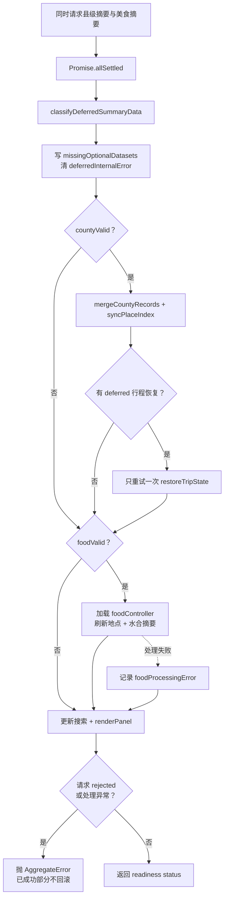

### 21.1 为什么先 `allSettled`

两个来源相互独立，不能让一个拒绝抹掉另一个结果。但当前实现仍要等两者都结束才应用任何一个；如果区县 100ms 完成、美食 30 秒超时，区县搜索也要等 30 秒。真正的渐进水合应各自 settle 后立即提交，再统一汇总最终 readiness。

### 21.2 fulfilled 但无效，与 rejected 不同

- `loadOptionalJson` 通常把网络错误转成 `null`，Promise 是 fulfilled；分类器把数据集标为缺失，函数正常返回 degraded status。
- 真正 rejected 或美食处理代码抛错，会在部分渲染之后抛 `AggregateError`；外层把它标记为 internal deferred failure。

### 21.3 为什么区县到达后重试恢复

最高优先级分享/存档可能引用区县 ID。初次只有城市索引时，第 8 章选择器返回 deferred；区县摘要合并后条件改变，恰好允许再验证一次。任何用户新提交都会提前清除重试标志，避免旧恢复覆盖新计划。

### 21.4 为什么失败不回滚已合并数据

这是可选信息水合，不是用户数据事务。区县成功、美食失败时，保留区县能力比为了“整齐”回滚更有价值；状态必须诚实报告 degraded。

## 22. 页面 readiness 是一个简化状态机

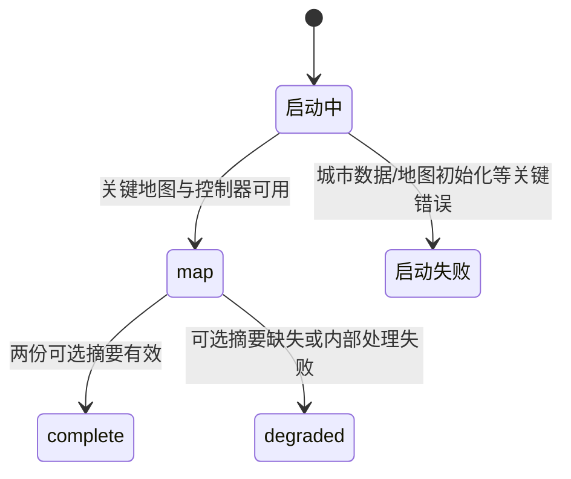

当前 fatal catch 会改标题和提示，但没有把 `data-app-ready` 设为明确的 `failed`。自动化或可访问技术只能看到“没有 ready”，不容易区分仍在加载与已经失败。

`missingOptionalDatasets` 记录具体缺少 counties 或 food；`deferredInternalError` 区分“资料本身缺失”和“本地处理代码异常”。对应 DOM dataset 的最终写入在第 12 章。

## 23. `updateSearchResults()`：搜索流水线

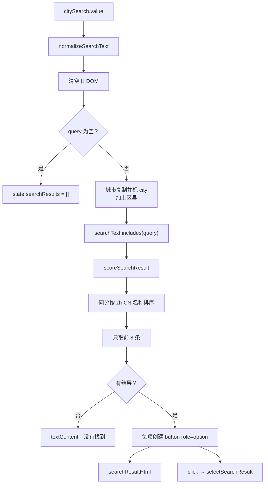

### 23.1 为什么先清 DOM 再判断空查询

用户删除搜索文字时，旧结果必须立即消失；`replaceChildren()` 同时移除旧按钮和其监听器，避免手工逐项清理。

### 23.2 为什么城市要复制再加 `searchType`

`state.cities` 的原始记录不需要知道当前 UI 分类。`{ ...city, searchType: "city" }` 建立短命视图对象，不污染地点索引。

### 23.3 为什么只显示 8 条

侧栏空间有限，过多按钮会推走核心路线操作。这里没有分页或“查看更多”，所以模糊大词可能隐藏第 9 条以后结果。

## 24. `searchResultHtml(item)`：一条搜索按钮的安全标记

城市与区县共享标题结构，区县额外显示父城市：

```text
[区县] 福清  3 篇食行记
福州 · 福建 / fuqing
```

地点名称、省份、拼音和父城市都经过 `escapeHtml()`。文章数直接插入 HTML，没有单独转义；当前美食控制器契约返回数字，因此主路径安全，但函数本身没有验证该不变量。

使用 `innerHTML` 是为了生成带 pill、strong、em 的结构；若改用 DOM API 和 `textContent`，新增字段时更不容易忘记转义。

## 25. `scoreSearchResult(item, query)`：相关性不是布尔值

只有 `searchText.includes(query)` 的项目会进入评分。分数越小越靠前：

| 命中方式 | 城市分数 | 区县分数 |
| --- | ---: | ---: |
| 名称完全相等 | 0 | 0 |
| 拼音完全相等 | 1 | 1.35 |
| 名称前缀 | 2 | 2.35 |
| 拼音前缀 | 3 | 3.35 |
| 父城市前缀 | 4 | 4.35 |
| 省份前缀 | 5 | 5.35 |
| 仅在综合 searchText 中包含 | 9 | 9 |

`typeOffset = 0.35` 让大多数同类匹配中城市略早于区县，但名称完全相等分支在加 offset 前返回，所以精确区县名仍是最高优先级。

同分时用 `localeCompare(name, "zh-CN")` 稳定按中文名称排序。它不是拼写纠错或编辑距离搜索；输错一个字通常不会命中。

## 26. `selectSearchResult(item)`：城市与区县的分叉

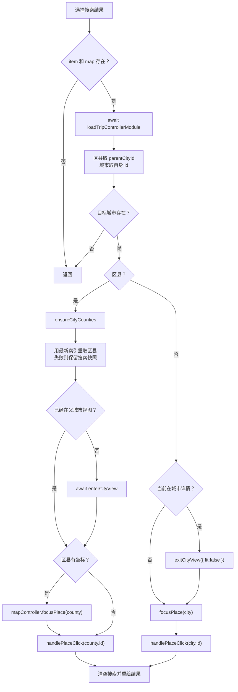

为什么点击搜索结果还要加载行程模块？选择不仅把地图居中，也会调用 `handlePlaceClick()` 把地点加入当前路线；这个函数依赖 TripPlan API。

为什么区县先确保父城市区县数据？摘要可能只包含搜索所需最小字段，进入城市视图时还需要按城市数据块和边界。

### 26.1 当前竞态

按钮监听器调用异步 `selectSearchResult(item)`，却没有 await 或 catch。快速点击两个结果时，两条选择链可并发，后完成的旧链可能改变视图或路线；任一 rejection 也可能成为 unhandled rejection。城市详情内部有 detail session 保护地图图层，但整个搜索选择事务没有统一 generation。

## 27. `escapeHtml(value)`：共享页面转义器

它先执行 `String(value)`，再用一个替换回调把 `& < > " '` 映射为实体。与第 9 章版本不同，它不会把 null/undefined 变成空字符串，而会显示 `"null"` 或 `"undefined"`；调用者应保证字段存在。


该函数还被注入 `city-detail`、`food-content` 和 `map-core`。它的安全责任横跨多个模块，因此最好提取成独立 `html-escape.js` 并用一组共享攻击样例测试，而不是由组合根拥有。

## 28. `resetMapView()`：重置不是总回全国

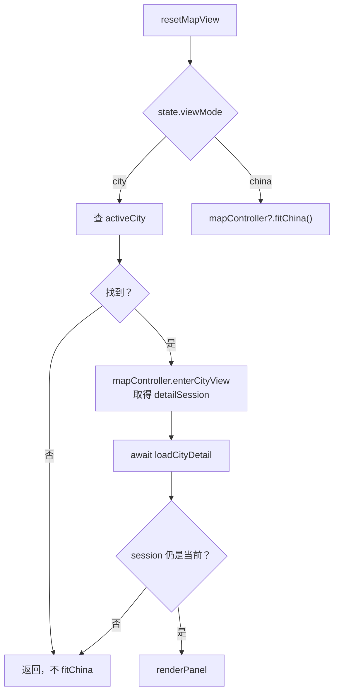

在城市视图中，“重置”表示重新装载并聚焦当前城市，不是退出到全国；只有中国视图才 `fitChina()`。detail session 防止异步旧城市结果重绘当前页面。

若 viewMode 是 city 但 `activeCityViewId` 已损坏，函数直接返回，用户看不到任何反馈；状态机应保证这两个字段成对有效。

## 29. 18 个函数声明逐一登记

| # | 行 | 函数 | 异步 | 工程作用 |
| ---: | ---: | --- | --- | --- |
| 1 | 76 | `loadTripControllerModule` | 返回 Promise | 动态装配 TripPlan、编辑和存档 API，创建行程控制器。 |
| 2 | 127 | `loadGuideModule` | 是 | 经过行程控制器二级加载指南模块。 |
| 3 | 132 | `queueTripAction` | 返回 Promise | 等行程模块后执行动作并统一 catch；并非真正队列。 |
| 4 | 141 | `loadCityDetailModule` | 返回 Promise | 缓存城市详情动态 import。 |
| 5 | 146 | `loadCityDetailController` | 返回 Promise | 注入 state、地图、回调和 helper，构造详情控制器。 |
| 6 | 181 | `reportCityDetailModuleFailure` | 否 | 一次性记录警告并标记可选功能内部失败。 |
| 7 | 190 | `queueCityDetailModuleRefresh` | 否 | 合并控制器加载后的页面重绘请求。 |
| 8 | 205 | `loadFoodModule` | 返回 Promise | 缓存美食模块动态 import。 |
| 9 | 210 | `loadFoodController` | 返回 Promise | 注入页面依赖并构造美食控制器。 |
| 10 | 436 | `loadMapData` | 是 | 加载关键城市/边界、处理直辖市与台湾并建立地点索引。 |
| 11 | 459 | `syncPlaceIndex` | 否 | 把权威地点索引引用同步到兼容 state，并刷新美食已知地点。 |
| 12 | 474 | `hydrateDeferredSummaries` | 是 | 并发读取、独立应用区县/美食摘要并报告最终降级。 |
| 13 | 517 | `updateSearchResults` | 否 | 规范查询、筛选评分、创建前 8 个结果按钮。 |
| 14 | 553 | `searchResultHtml` | 否 | 生成一条城市或区县结果的安全结构化标记。 |
| 15 | 574 | `scoreSearchResult` | 否 | 按名称、拼音、父城市和省份计算相关性分数。 |
| 16 | 589 | `selectSearchResult` | 是 | 聚焦城市/区县、切换详情视图并把地点加入路线。 |
| 17 | 615 | `escapeHtml` | 否 | 转义五种 HTML 结构字符。 |
| 18 | 625 | `resetMapView` | 是 | 在城市内重新加载当前详情，或让全国地图适配视野。 |

## 30. 25 个箭头函数逐一登记

| # | 行 | 所属位置 | 每次执行什么 |
| ---: | ---: | --- | --- |
| 1 | 77 | 行程模块 import 的 `then` | 解构全部行程 API、创建存储适配器和控制器并初始化。 |
| 2 | 119 | lazy storage resolver | 真正读写时返回 `window.localStorage`。 |
| 3 | 135 | `queueTripAction.catch` | 记录错误并显示“行程功能加载失败”。 |
| 4 | 147 | 城市详情加载 `then` | 用依赖注入创建并保存详情控制器。 |
| 5 | 158 | `getPlaceIndex` | 每次返回当前 `placeIndex` 变量。 |
| 6 | 174 | 城市详情控制器 `catch` | 清空 controller Promise 并重新抛错。 |
| 7 | 194 | 城市详情刷新 `then` | 控制器就绪后重绘面板与行程规划器。 |
| 8 | 199 | 城市详情刷新 `finally` | 无论成功失败都解除 queued 标志。 |
| 9 | 211 | 美食加载 `then` | 用注入依赖创建并保存美食控制器。 |
| 10 | 236 | `labels.fromCity` | 把地点名变成“从某地出发”。 |
| 11 | 243 | `labels.segment` | 把零基索引变成“第 N 段”。 |
| 12 | 432 | latest refresh 的 `apply` | 让美食控制器渲染指定 selection。 |
| 13 | 433 | latest refresh 的 `refresh` | 美食就绪后重算行程推荐。 |
| 14 | 441 | display cities `filter` | 隐藏直辖市子级点，只保留直辖市根。 |
| 15 | 442 | display cities `map` | 复制城市并覆盖直辖市展示坐标。 |
| 16 | 448 | hidden children `filter` | 收集被隐藏的直辖市子级记录。 |
| 17 | 469 | food Promise `then` | 地点索引更新后刷新控制器已知地点。 |
| 18 | 508 | settled results `filter` | 只保留 rejected 的可选请求结果。 |
| 19 | 509 | rejected results `map` | 从结果中提取 reason 放入 AggregateError。 |
| 20 | 527 | cities `map` | 复制城市并加 `searchType: city`。 |
| 21 | 530 | 搜索 `filter` | 只保留综合搜索文字包含查询的地点。 |
| 22 | 531 | 搜索 `sort` | 先比较相关性，再比较中文名称。 |
| 23 | 542 | 结果 `forEach` | 为一个结果创建按钮、标记、事件并加入 DOM。 |
| 24 | 548 | 结果按钮 click | 调用异步 `selectSearchResult(item)`。 |
| 25 | 616 | HTML 替换回调 | 把一个危险字符查表替换为实体。 |

合计：18 个函数声明 + 25 个箭头函数 = 本章 43 个 AST 函数节点。

## 31. 测试证据分层

### 31.1 `app-data.test.mjs`：17 项

直接测试关键/延迟数据基础设施：

- 最新 generation 才能应用；
- 固定资源版本与 8 个边界块；
- 单块失败重试后保留其他 7 块；
- 城市数据为空必须失败；
- 区县和美食请求分别缓存；
- complete/degraded 分类；
- force-cache、超时、外部 abort、HTTP 错误与重试；
- optional JSON 返回 null；
- idle callback 与 timer 降级。

这些测试的是可导入纯模块，不直接执行 `app.js` 私有函数。

### 31.2 `place-index.test.mjs`：10 项

证明索引与输入隔离、直辖市别名、县级水合幂等、运行时地点 overlay、同 ID 合并和搜索文字重算。

### 31.3 模块边界测试

源码断言保证：

- 美食只有一个动态 import；
- 城市详情拥有在线/本地详情来源；
- 行程领域位于 lazy controller 后；
- `app.js` 不直接拥有 Leaflet。

### 31.4 页面结构与浏览器测试

结构测试验证关键加载顺序存在于源码。Playwright 进一步证明：

1. 区县和美食请求被人为阻塞时，`data-app-ready=map`、地图、371 个城市和搜索先可用；
2. 延迟数据释放后变成 complete；
3. 搜索福清可进入父城市视图、看到美食卡片和地图。

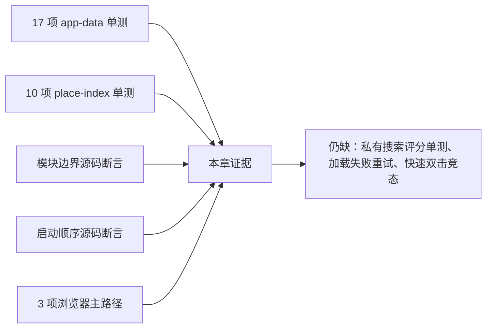

## 32. 测试没有证明什么

1. `scoreSearchResult()` 没有参数化单元测试。
2. `searchResultHtml()` 没有直接用恶意文章计数测试。
3. `selectSearchResult()` 没有快速双击、拒绝 Promise 或缺父城市测试。
4. `resetMapView()` 没有损坏 view state 和异常地图控制器测试。
5. 动态 import 失败后的当前页重试没有浏览器测试。
6. 两个可选摘要一快一慢时是否应独立提前显示，没有性能断言。
7. DOM ID 缺失时没有启动契约测试。
8. fatal 初始化没有明确 failed readiness 的测试。

源码正则能证明某段文字和调用顺序存在，不能证明运行时每条异常分支正确。

## 33. 为什么这样设计：沿五条因果链各追五次

### 33.1 为什么关键数据和可选数据分开

1. 用户首先需要看到地图和城市。
2. 区县与美食体积更大、使用频率更低。
3. 等全部数据会延迟第一次可操作时间。
4. 可选数据失败不应阻断路线规划。
5. 因此先提交最小地图事实，再在空闲阶段补水并明确 degraded。

结论：优化目标不是“所有请求最快结束”，而是“最早交付有价值的完整切片”。

### 33.2 为什么模块用依赖注入

1. 城市详情需要地图、地点、美食和 DOM。
2. 直接 import 组合根会产生循环依赖。
3. 读取全局变量会让测试必须启动整页。
4. 注入让依赖显式且可替换。
5. 模块因此可以独立测试控制器行为。

结论：依赖注入是所有权边界，不只是为了 mock。

### 33.3 为什么地点索引还要同步进 state

1. 旧函数普遍读取 `state.cityById` 等字段。
2. 一次性重写 2,591 行风险很高。
3. 新 `place-index` 已拥有合并和索引规则。
4. 把同一引用映射回 state 可保持旧调用点工作。
5. 迁移可以分阶段进行，不必“双写”两套 Map 内容。

结论：这是绞杀式重构的兼容桥；终态应让消费者直接依赖只读索引接口。

### 33.4 为什么美食刷新需要 generation

1. 模块加载和数据读取是异步的。
2. 用户选择可以比网络更快变化。
3. 返回顺序不保证等于请求顺序。
4. 旧结果若重绘，会让面板与当前选择不一致。
5. generation 让最新意图赢，而不是最慢请求赢。

结论：异步 UI 的正确性必须按用户意图排序，不能按完成时间排序。

### 33.5 为什么搜索选择同时改变地图和路线

1. 搜索是地图选点的替代入口。
2. 用户搜索城市通常是为了加入旅行路线。
3. 只聚焦地图会要求再点击一次标记。
4. 区县还必须进入父城市详情才能显示上下文。
5. 因此一次选择组合视图切换、聚焦和行程命令。

结论：这是方便的复合命令；也因此必须具备事务/取消语义，避免半完成和竞态。

## 34. 更好的方案，按优先级排序

### 34.1 第一优先级：把共享 state 拆成有所有者的 store

```text
AppRuntime
├── mapStore        ← map-core 独占写
├── placeStore      ← place-index 独占写
├── tripStore       ← TripPlan commit 独占写
├── contentStore    ← city-detail / food
└── readinessStore  ← bootstrap
```

消费者拿只读快照或订阅，不把同一个可变对象交给所有模块。

### 34.2 第二优先级：用显式模块对象代替几十个晚绑定 `let`

```js
let tripDomain;

async function requireTripDomain() {
  tripDomain ??= await loadTripControllerModule();
  return tripDomain;
}
```

调用写成 `tripDomain.applyTripCommand`，编辑器/存档/计划分组明确；TypeScript 可以检查漏项，避免未初始化全局名字。

### 34.3 第三优先级：建立可重试 loader 状态机

每个 lazy resource 使用 `idle/loading/ready/failed`，失败时清空 Promise，并区分 import 失败、构造失败和业务动作失败。`queueTripAction` 不再吞掉 action 错误。

### 34.4 第四优先级：真正独立提交可选数据

区县和美食各自：

```text
load → validate → commit → render own consumers → update aggregate readiness
```

不让一个 30 秒超时阻塞另一个 100ms 结果。

### 34.5 第五优先级：提取可直接测试的 search-domain

把候选构建、评分、限制和选择命令翻译移出 DOM 文件：

```js
rankPlaces({ cities, counties, query, limit: 8 })
commandForPlaceSelection({ item, currentView })
```

参数化覆盖中文名、拼音、区县偏移、同分、缺字段和快速选择。

### 34.6 第六优先级：让搜索选择成为可取消事务

每次选择递增 generation 或创建 AbortController；每个 await 后检查是否仍是最新选择。失败时保留原路线并显示可访问错误，不产生 unhandled rejection。

### 34.7 第七优先级：DOM 契约与安全渲染

- 启动时一次性验证必需节点；
- 用 `textContent`/DOM builder 替代搜索 `innerHTML`；
- 对 articleCount 做有限非负整数验证；
- 将共享转义函数放进独立模块；
- 使用事件代理，避免每次搜索为 8 个按钮重建监听器。

### 34.8 第八优先级：正式 readiness 状态机

加入 `loading-critical/map/loading-optional/complete/degraded/failed`，每个状态带原因和可重试动作；DOM dataset、可访问提示和遥测读取同一状态对象。

### 34.9 第九优先级：统一源码树

发布版 `public/static-site/app.js` 已采用模块化启动，根目录 `app.js` 仍是不同的单体路径。应生成兼容副本或删除旧入口，避免工程师从错误文件理解系统。

## 35. 零基础读者怎样亲手跟一次“搜索福清”

1. 从 `index.html` 找 `#citySearch` 和 `#searchResults[role=listbox]`。
2. 跳到文件末尾，看到 input 事件调用 `updateSearchResults()`；事件节点在第 12 章登记。
3. 输入“福清”，看 `normalizeSearchText()` 得到统一查询。
4. 观察城市和区县怎样合并成候选，`searchText.includes()` 先做粗筛。
5. 手工算 `scoreSearchResult()`：名称精确命中得 0。
6. 看 `slice(0, 8)` 限制结果数。
7. 进入 `searchResultHtml()`，确认外部地点字段全部转义。
8. 点击按钮，进入第 548 行箭头，再进入异步 `selectSearchResult()`。
9. 先等待行程控制器，因为选择也会加入路线。
10. 区县把 `parentCityId` 作为目标城市，调用 `ensureCityCounties()`。
11. 若不在福州详情，进入 `enterCityView("fuzhou")`。
12. 区县有坐标时调用 `mapController.focusPlace(county)`。
13. `handlePlaceClick(county.id)` 把福清加入 TripPlan/路线；其细节在第 11、12 章。
14. 最后清空输入并移除搜索结果。
15. 对照浏览器测试“deferred county food and city detail features hydrate completely”。

如果只记住本章一条工程原则，请记住：

> 页面协调器的职责不是拥有所有规则，而是让拥有规则的模块在正确时间拿到正确依赖，并保证关键能力、可选能力和失败状态彼此不撒谎；一旦协调器开始晚绑定几十个名字、共享一个无人独占的 state，它就需要更明确的生命周期和所有权。

## 36. 下一章预告

下一章继续 `app.js` 第 638–1537 行：路线如何从 TripPlan 同步、唯一 `commitTripPlan()` 怎样串起历史记录、地图重绘、持久化和焦点恢复；编辑对话框、自动排期、操作警告、美食刷新、旧版行程摘要与推荐函数怎样共同更新页面。

继续：[第 11 章：一次行程编辑怎样提交、重绘与保存](./11-app-trip-rendering.md)

回看：[第 9 章：一份行程怎样变成 Markdown 与可打印 HTML 旅行指南](./09-guide-export.md)
