# 第 11 章：总协调器（中）——一次行程编辑怎样提交、重绘与保存

> 本章继续拆解发布版 `public/static-site/app.js`，覆盖第 638–1537 行。AST 在这个连续区间识别出 **105 个函数节点**：59 个函数声明和 46 个箭头函数。第 638–1249 行是当前页面实际使用的 TripPlan 提交、表单和渲染主链；第 1251–1537 行以已经失去渲染入口的旧版“按天推荐”为主，但其中 3 个通用工具仍被前面的活跃代码调用。

回看：[第 10 章：模块装配、关键数据、延迟水合与搜索](./10-app-bootstrap-data-search.md)

## 1. 本章先给结论

用户在日历上移动一项活动时，真正发生的不是“直接改 HTML”，而是：

1. 编辑器把操作翻译成一个普通命令对象；
2. `handleTripCommand()` 把命令交给纯规则模块；
3. 规则模块返回新计划、无变化、阻止原因，或二次确认请求；
4. 唯一提交入口 `commitTripPlan()` 更新历史、共享状态和路线；
5. 地图与侧栏根据新状态重画；
6. 焦点被放回刚才操作的位置；
7. 新计划写入浏览器本机存储。

`app.js` 在这里不是“行程算法本身”，而是一个**事务协调器**：规则在 `trip-plan.js`，编辑器在 `trip-editor.js`，路线计算在地图控制器，持久化在 `trip-archive.js`，它负责让这些模块按正确顺序协作。

同时要记住一个很容易误判的事实：

> `buildItineraryDays()` 发起的旧版拆天与推荐子图虽然语法完整，却没有当前渲染入口。`renderPanel()` 调用的是新版 `renderTripPlanner()`；HTML 也没有旧代码要求的 `#itineraryList`。这不是页面上的第二套活跃行程。位于同一区间的 `routeDurationForPlanning()`、`cityForPlace()`、`uniqueByName()` 仍被活跃主链使用，不能随遗留子图一起删除。

## 2. 五问核验后的架构结论

| 核验问题 | 可以由源码验证的结论 |
| --- | --- |
| 谁能合法改变当前 TripPlan？ | 页面层最终都应汇入唯一的 `commitTripPlan()`；普通编辑先经过 `applyTripCommand()`。恢复和导入也调用该提交口，但使用不同选项。 |
| 提交后什么先、什么后？ | 先记录历史并替换内存计划，再同步节奏和交通方式、重建路线，随后重画地图和面板，最后恢复焦点并持久化。 |
| 路线为何不全部重新计算？ | `syncRoutesFromTripPlan()` 按“起点、终点、交通方式”复用旧路线；只有新路段进入估算队列。 |
| 页面上真正渲染哪套日程？ | `renderTripPlanner()` 调用 `renderTripEditorMarkup()` 和 `mountTripEditor()`；旧 `renderItineraryPanel()` 没有调用者，且依赖一个不存在的 DOM 节点。 |
| 最大工程风险是什么？ | `commitTripPlan()` 不是可回滚事务：内存和 UI 已更新后，localStorage 仍可能失败；`renderPanel()` 扇出责任很多；近 300 行旧代码会误导维护者。 |

## 3. 本章边界与函数数量

| 子区间 | 命名函数 | 箭头回调 | 作用 |
| --- | ---: | ---: | --- |
| 638–705 | 2 | 6 | 路线 ID、路线复用和新路线估算 |
| 706–775 | 4 | 3 | 唯一提交入口、命令确认与错误反馈 |
| 776–950 | 9 | 10 | 编辑对话框、控件赋值和地标候选 |
| 951–1103 | 11 | 5 | 表单提交、元数据、撤销、自动排期、警告与美食异步 |
| 1104–1249 | 5 | 12 | 总渲染、新版日历、路线合计和链条文字 |
| 1251–1537 | 28 | 10 | 旧版按天推荐主体 + 3 个跨区间活跃工具 |
| **合计** | **59** | **46** | **105 个函数节点** |

### 3.1 当前活跃主链

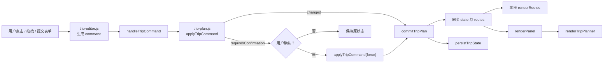

### 3.2 活跃与遗留代码的边界

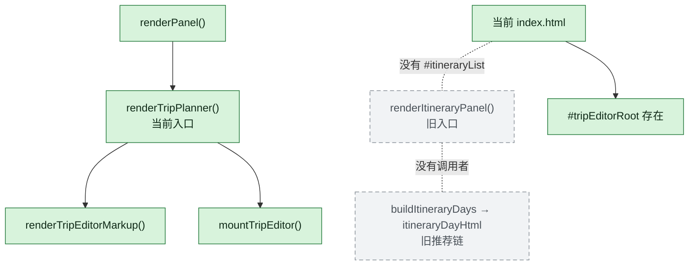

实线是能从当前页面走到的调用；灰色虚线是源码中仍存在、但当前入口无法到达的关系。

## 4. 零基础读者需要先懂的 JavaScript

### 4.1 “命令对象”只是数据

```js
{
  type: "update-metadata",
  patch: { name: "川渝五日游" }
}
```

它不是函数，也不会自己执行。`type` 告诉规则模块要做哪类操作，其余字段是参数。把用户意图变成数据，便于校验、测试、撤销和复用。

### 4.2 解构参数与默认值

```js
function commitTripPlan(nextPlan, {
  recordHistory = true,
  message = "已自动保存到本机。",
  focusToken = null
} = {}) { /* ... */ }
```

第二个参数是“选项包”。调用者可以只改一个选项：

```js
commitTripPlan(previousPlan, { recordHistory: false });
```

末尾的 `= {}` 保证完全不传第二个参数时也不会报错。

### 4.3 `structuredClone()` 是深复制

```js
state.tripHistory.push(structuredClone(state.tripPlan));
```

TripPlan 里面还有 days、items 等多层对象。只复制最外层会让历史与当前计划共享里面的数组，后来编辑当前计划可能连历史一起改变。深复制让撤销快照独立。

### 4.4 `?.` 与 `??`

```js
mapController?.renderRoutes();
const control = tripItemForm?.elements?.namedItem(name) ?? null;
```

- `?.`：左边不存在时停止，不抛错；
- `??`：左边是 `null` 或 `undefined` 时使用右边；
- 它们让可选 DOM、尚未加载的控制器可以安全缺席，但也可能把初始化错误静默隐藏。

### 4.5 回调函数

```js
state.routes.forEach((route) => mapController?.calculateRouteMetrics(route));
```

`forEach` 负责遍历；括号里的箭头函数描述“每一条路线要做什么”。第 31 节会把本章全部 46 个箭头函数逐一登记。

### 4.6 DOM 对话框与表单

浏览器原生 `<dialog>` 可以用 `showModal()` 打开，用 `close()` 关闭。`FormData(form)` 能把所有有 `name` 且未禁用的控件收集成键值对。正因如此，`configureTripItemForm()` 必须把与当前类型无关的控件设成 `disabled`，否则隐藏字段也可能混入提交。

### 4.7 派生状态

`state.tripPlan` 是主事实；`state.routes`、总距离、链条文字和健康提示都是由主事实或路线计算结果推导出的显示数据。派生状态可以缓存以提高速度，但必须在主事实改变时同步，否则页面会自相矛盾。

## 5. 一次“修改活动”完整经过哪里

以把“宽窄巷子”改成 09:00–11:00 为例：

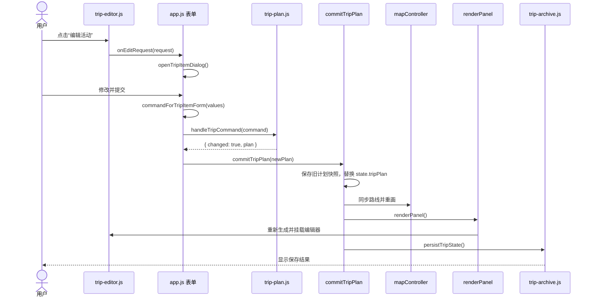

关键点是：对话框不直接改 `state.tripPlan.days[0].items[0]`。它只产生命令；纯规则模块复制、校验并返回新计划；协调器提交结果。

## 6. 路线身份与同步：第 638–705 行

### 6.1 `isValidRouteId(routeId)`

接受两种路线 ID：

- 大于 0 的安全整数；
- 去掉首尾空格后仍非空的字符串。

为什么兼容字符串？路线可能来自不同版本或导入文件。为什么不用“能转数字”就算合法？`"1x"`、`Infinity`、负数都会让编号与查重失去可靠性。

### 6.2 `syncRoutesFromTripPlan()`

它把日历计划压成地点链，再让地图路线与地点链对齐。

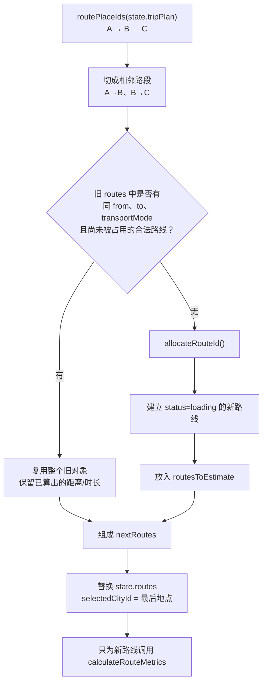

逐步看：

1. 没有计划时，地点链是空数组；
2. `previousRoutes` 暂存旧路线；
3. `claimedRoutes` 防止同一个旧对象被复用两次；
4. `claimedRouteIds` 防止两个不同对象带同一个 ID；
5. `reservedRouteIds` 收集所有旧的合法 ID，避免新编号碰撞；
6. `largestNumericId` 找旧数字 ID 的最大值；
7. `state.nextRouteId` 至少比旧最大数字 ID 大 1；
8. 地点链从第二个地点开始映射为相邻路段；
9. 查找起终点和交通方式都相同的未占用路线；
10. 没找到才创建 loading 路线并请求计算；
11. 当前选择设为路线最后一个地点。

### 6.3 为什么复用条件必须包含交通方式

北京到上海的高铁时长不能拿来表示驾车。只比较 `from` 和 `to` 会把旧计算冒充成新设置，所以条件还包括 `transportMode === state.transportMode`。

### 6.4 ID 分配为什么同时需要两个 Set

`reservedRouteIds` 关心“历史上哪些编号不能再发”；`claimedRouteIds` 关心“这次结果里哪些编号已经被一个路段拿走”。旧数据可能本身有重复 ID，两个集合解决不同问题。

### 6.5 这段设计的边界

它复用的是对象引用。地图控制器异步写回 `distance`、`duration` 时，当前 `state.routes` 能直接看见结果，这很方便；代价是路线对象不是不可变值，错误的异步回写可能污染当前状态。地图模块还必须用路线 ID 或会话检查抵御陈旧结果。

## 7. 唯一提交入口：第 706–733 行

### 7.1 `commitTripPlan(nextPlan, options)`

默认选项：

| 选项 | 默认值 | 含义 |
| --- | --- | --- |
| `recordHistory` | `true` | 是否把当前计划压入撤销栈 |
| `message` | “已自动保存到本机。” | 保存成功后的用户提示 |
| `focusToken` | `null` | 重绘后应恢复到哪个编辑控件 |
| `completeLegacyMigration` | `true` | 保存成功后是否清理旧版迁移备份 |

实际顺序不能随意交换：

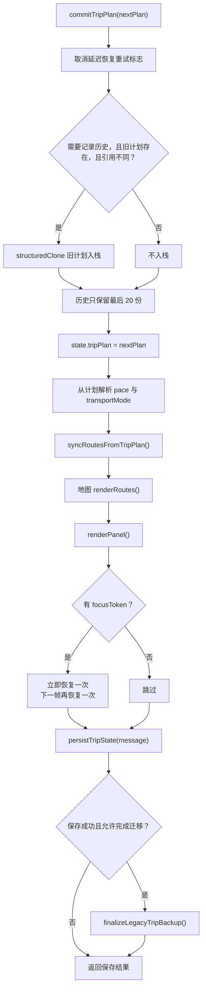

### 7.2 为什么先重绘，后持久化

localStorage 是同步 API，但归档模块还会处理 URL hash、错误状态和旧版本清理。当前实现优先让页面立即响应；即使存储失败，用户仍能继续看到并导出内存中的行程。

代价是它不是数据库意义上的原子事务：UI 已经显示“新计划”，持久层可能仍是旧计划或为空。因此错误提示明确写着“当前行程仍保留在本页，请立即导出”。

### 7.3 为什么恢复焦点两次

`renderTripPlanner()` 会销毁旧编辑器 DOM，再创建新 DOM。立即恢复处理已经同步生成的元素；`requestAnimationFrame` 在浏览器下一次绘制前再试一次，抵御挂载过程或浏览器焦点时序造成的丢失。

这是一种实用补偿，不是严格生命周期协议。更理想的方案是编辑器组件保留稳定节点或在 mount 完成后返回一个明确的“可恢复焦点”时机。

### 7.4 历史栈的真实语义

- 最多 20 个完整 TripPlan 快照；
- 仅比较对象引用，不做深相等；
- `nextPlan` 与当前计划是同一对象时不入历史；
- “内容相同但新建对象”仍可能入历史，不过普通命令会先返回 `changed: false` 来阻止；
- 撤销本身用 `recordHistory: false`，因此这里不是完整的 undo/redo 双栈。

## 8. 命令闸门：第 734–775 行

### 8.1 `tripIdentifier(value)`

只接受非空字符串并 trim；其他值返回 `null`。DOM dataset、表单和存档输入都属于外部边界，统一清洗可以避免 `" day-1 "` 与 `"day-1"` 被当成两个 ID。

### 8.2 `affectedTripDayLabels(plan, dayIds)`

它把受影响的 day ID 变成用户可读的“第 2 天（2026-10-02）”：

1. 非数组输入变空数组；
2. `Set` 去重；
3. 找每个 ID 在 `plan.days` 的下标；
4. 未找到则丢弃；
5. 尝试用 `dayDate()` 算日期；
6. 日期计算失败只退化为“第 N 天”，不阻断确认。

### 8.3 `handleTripCommand(command, focusToken)`

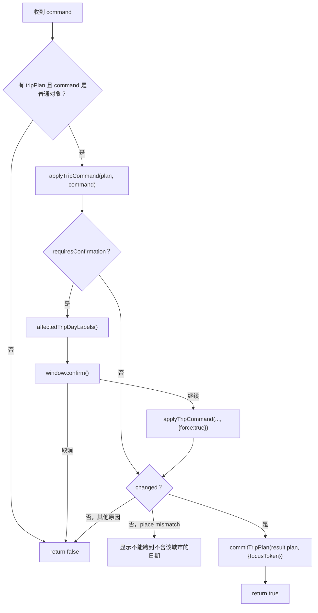

为什么规则模块不直接弹确认框？因为 `trip-plan.js` 应是可在 Node 测试、浏览器、未来移动端复用的纯规则层；它只报告“需要确认、影响哪些天、原因是什么”，浏览器协调器决定怎样问用户。

为什么二次执行要传 `force: true`？第一次只是探测危险并保持原计划；用户同意后，规则模块才真正清理关联交通、活动或住宿并产出新计划。

当前只为 `item-place-mismatch` 显示专门的阻止反馈。其他 `changed: false`（例如找不到目标或操作没有实际变化）静默返回，这能减少噪音，却让调试和无障碍反馈不够完整。

## 9. 编辑对话框：第 776–950 行

### 9.1 `tripFormControl(name)`

通过表单控件的 `name` 查元素；表单或控件不存在就返回 `null`。调用者不需要到处重复 `querySelector`。

### 9.2 `setTripFormValue(name, value)`

统一把数据放回表单：

- 找不到控件就停止；
- checkbox 接受 `1`、`"1"` 或 `true` 为选中；
- `null`/`undefined` 变成空字符串；
- 其余值用 `String()` 转成 DOM 控件能接收的文本。

这里的意义不是省三行代码，而是保证编辑已有数据时，所有空值和布尔值使用相同规则。

### 9.3 `tripDayPlaceIds(day)`

遍历当天 `cityEntries`，用 `tripIdentifier()` 清洗 `placeId`，再按首次出现顺序去重。活动、住宿、交通表单只能选择当天实际包含的地点，避免编辑器造出与日期不一致的项目。

### 9.4 `populateTripPlaceSelect(control, placeIds, preferredPlaceId)`

1. 每个地点建立一个原生 `option`；
2. 显示名优先使用 `placeById(placeId).name`，索引缺失时显示原 ID；
3. `replaceChildren()` 一次替换旧选项；
4. 首选地点合法则选它，否则选第一个；
5. 返回最终选中的 ID。

它使用 `textContent` 写名称，不把外部地点名拼进 HTML，因此不存在这一处的 HTML 注入风险。

### 9.5 `landmarkNamesForPlace(placeId)`

把一个地点映射到其所属城市，再合并两类地标：

- 城市静态数据里的 `cityLandmarks(city)`；
- 按 adcode 或 city ID 缓存在 `state.landmarkCache` 的延迟数据。

名称会 trim、丢弃空值，再由 `uniqueByName()` 去重。区县会先通过 `cityForPlace()` 找到上级城市，因此区县活动也能获得所属城市的地标候选。

### 9.6 `renderTripLandmarkOptions(placeId)`

把地标名变成 `<datalist>` 的 `option`。它只提供输入建议，不限制用户必须选现有地标；返回名称数组也便于表单命令判断输入标题是否命中地标。

### 9.7 `configureTripItemForm(type)`

三种类型共用一个对话框：

| 类型 | 标题字段 | 时间字段 | 专属区域 |
| --- | --- | --- | --- |
| `transport` | 车次或班次 | 出发 / 到达 | 起点、终点、跨日偏移 |
| `activity` | 活动标题 | 开始 / 结束 | 地点、地址、地标 datalist |
| `lodging` | 住宿名称 | 入住 / 退房 | 地点、地址 |

`[data-trip-types]` 声明一组字段支持哪些类型。函数不仅把不支持的组设为 `hidden`，还把里面的 input、select、textarea 设为 `disabled`。这是必要的：隐藏只影响视觉，禁用才会让 `FormData` 忽略它们。

如果是活动，标题输入关联 `tripLandmarkOptions`；其他类型移除 `list` 属性并清空候选。未知类型或表单缺失时返回 `false`。

### 9.8 `closeTripItemDialog(returnValue = "cancel")`

支持两种环境：

- 正常浏览器有原生 `close()`：调用并携带返回值；
- 测试替身或旧环境没有：直接移除 `open` 属性。

### 9.9 `openTripItemDialog(request = {})`

这是对话框编排核心：

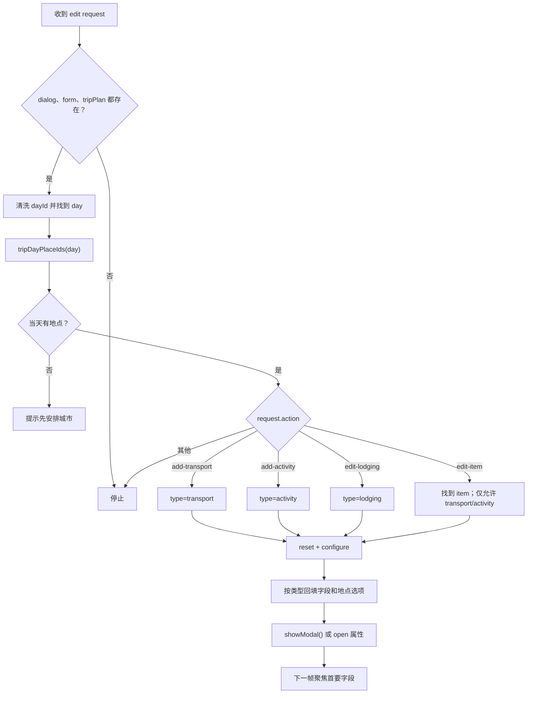

交通默认起点是当天第一个地点，终点是当天最后一个地点；活动和住宿优先用已有地点，其次是当天过夜地点，再次是第一个地点。编辑住宿时，数据来自 `day.lodging`，而交通和活动来自 `day.items`。

`isEditing` 对“已有 item”或“当天已有 lodging”成立，用来在标题中选择“编辑”还是“添加”。住宿不使用 item ID，因为 TripPlan 每天只有一个 `lodging` 槽位。

### 9.10 为什么对话框使用命令请求，而不是传完整对象

编辑器只上报：

```js
{ action: "edit-item", dayId: "day-1", itemId: "item-7" }
```

协调器再从当前 `state.tripPlan` 查真实对象。这样请求不会长期持有一个可能已经过期的对象引用，也减少编辑器对 TripPlan 内部结构的依赖。

## 10. 表单提交、元数据与撤销：第 951–993 行

### 10.1 `submitTripItemForm(event)`

1. `preventDefault()` 阻止浏览器按传统方式跳转提交；
2. `FormData` 收集启用的字段；
3. `Object.fromEntries()` 变成普通对象；
4. 活动类型额外提供当前地点的地标名；
5. `commandForTripItemForm()` 负责 trim、必填校验、字段归一化和命令构造；
6. 先关闭对话框；
7. `handleTripCommand()` 提交，并把焦点目标设为对应日期；
8. 任何转换异常统一显示“请补全必填信息”。

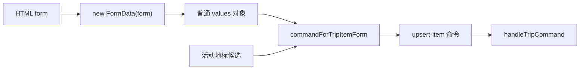

这里 catch 了所有异常，用户体验简单，但也会把程序缺陷误报成“用户没填完整”。更稳妥的规则模块应返回结构化校验错误，只捕获已知错误；未知异常应记录并显示通用故障。

### 10.2 `updateTripNameMetadata()`

- 当前计划名有效则 trim 并截到 60 字；
- 否则使用 `DEFAULT_TRIP_NAME`；
- 用户新输入也 trim 并截到 60 字；
- 新输入为空时保留当前有效名；
- 把最终值写回 input；
- 发送 `update-metadata` 命令。

这保证“清空输入框”不会把计划名变成不可读的空字符串。

### 10.3 `updateTripStartDateMetadata()`

把 date input 的值作为 `startDate`；空值转成 `null`。日期格式有效性和是否真正变化由规则层统一处理。

### 10.4 `undoTripEdit()`

从历史栈尾弹出一份快照，再用 `recordHistory: false` 提交。这样撤销不会把“撤销前状态”立刻压回同一栈。

缺少的是 redo 栈：撤销以后不能重做；执行新编辑也没有显式清理 redo，因为根本没有 redo。

## 11. 自动排期：第 994–1033 行

### 11.1 `routeDurationsForAutoSchedule(placeIds)`

为每个相邻地点生成：

```js
{
  "beijing>zhengzhou": 10800,
  "zhengzhou>wuhan": 7200
}
```

先检查相同数组下标的路线是否匹配起终点；不匹配再全数组查找；找到就用 `routeDurationForPlanning()`，否则默认 2 小时。

为什么先看下标？同步后的 routes 本来就与地点链相邻段同序，O(1) 检查是常见快路；全数组查找是对临时不同步的容错。

### 11.2 `autoScheduleCurrentTrip()`

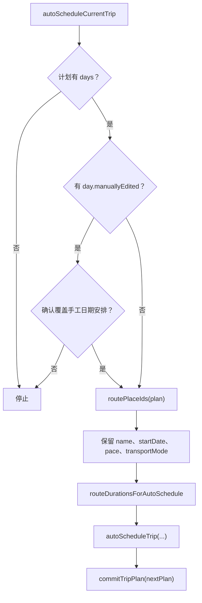

自动排期是**重新生成**，不是在原 days 上就地调整。因此它先提取路线地点和元数据，再让 `autoScheduleTrip()` 创建全新日期结构。手工安排可能被覆盖，所以只要任一天有 `manuallyEdited` 就要求确认。

默认 2 小时只是路线尚无结果时的规划占位，不是对用户承诺的实际交通时间。排期完成后 `commitTripPlan()` 会继续同步真实路线，页面健康状态会显示 loading 或 error。

## 12. 操作警告和美食异步：第 1034–1103 行

### 12.1 `renderOperationalWarnings()`

它汇总三类不会阻止地图使用的故障：

| 来源 | 显示含义 |
| --- | --- |
| `failedBoundaryPaths` | 某些地图边界分块未加载 |
| `missingOptionalDatasets` | 某些可选数据不可用 |
| `deferredInternalError` | 可选数据处理发生内部错误 |

`state.panelBaseHint` 保留当前正常提示；函数把正常提示与所有警告拼在一起，并把警告 ID 写入 `selectionHint.dataset.operationalWarnings`。这样下一次 render 不会把旧警告重复叠加。

### 12.2 `currentFoodSelection()`

返回美食控制器真正需要的最小选择快照：

- 当前选中地点对象；
- 地图是全国还是城市视图；
- 当前城市视图 ID。

传快照而不是让美食模块任意读取全部 `state`，有助于限制依赖边界。

### 12.3 `reportFoodModuleFailure(error)`

`foodModuleFailureReported` 是一次性保险丝：

1. 已报告过就不重复；
2. 计数显示“暂不可用”；
3. 转交 `applyDeferredInternalFailure(error)`，让统一警告区更新。

避免同一个 rejected Promise 在多次渲染时不断刷错误，但代价是后续不同的美食错误也不会单独呈现。

### 12.4 `queueFoodPanelRender()`

页面尚未打上 `data-app-ready` 时不调度。准备好后：

1. 拍下当前选择；
2. 交给 `foodInteractionRefresh.schedule()`；
3. 第一次控制器尚不存在时，设置 `refreshOnResolve: true`；
4. 失败交给一次性报告函数。

`foodInteractionRefresh` 在文件前部由 `createLatestAsyncRefresh()` 建立：load 加载控制器，apply 渲染美食面板，refresh 只重画新版行程编辑器。

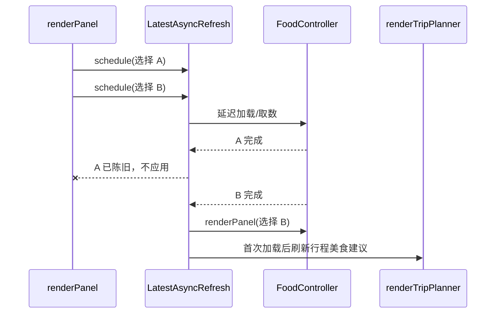

这解决“用户已切到成都，较慢的北京请求却最后覆盖面板”的竞态。

### 12.5 `foodArticleCountForCity(cityId)` 与 `foodArticleCountForPlace(placeId)`

两个小适配器：控制器未加载时返回 0；加载后分别按城市或地点取文章数。它们让调用者不需要知道控制器是否准备好。

### 12.6 `loadFoodForCity(cityId, options)`

等待控制器，再确保指定城市资料可用；成功返回控制器，失败报告并返回 `null`。调用者因此可以用“有没有控制器”判断是否继续，而不必重复 try/catch。

### 12.7 `ensureFoodModuleForTrip()`

只保证模块/控制器已加载，不要求某个城市资料。指南导出或行程推荐需要的是跨多个地点的控制器入口，所以与 `loadFoodForCity()` 分开。

两个 async 包装器的失败策略一致，但功能名称清晰表达不同前置条件。

## 13. 页面总渲染：第 1104–1167 行

### 13.1 `renderPanel()` 的责任扇出

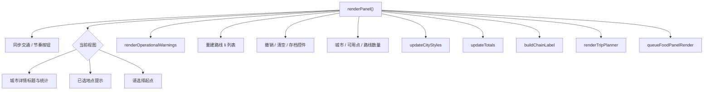

逐段解释：

1. 先按 `state.transportMode` 和 `state.tripPace` 同步按钮选中态；
2. 城市视图显示区县边界、地标、火车站、地铁和美食数量；
3. 全国视图有选择时显示地点上下文，无选择时显示起点提示；
4. 把正常提示保存为 `panelBaseHint`，再追加可降级警告；
5. 清空并重建所有路线列表项；
6. 根据路线/选择状态启用或禁用旧路线撤销、清空按钮；
7. 同步存档控件和各种计数；
8. 通知地图刷新城市样式；
9. 更新总距离、总时长和地点链；
10. 渲染当前新版日历；
11. 异步刷新美食面板，必要时稍后再刷新日历里的美食建议。

### 13.2 路线列表的 HTML 安全问题

`renderPanel()` 用 `item.innerHTML` 插入 `from.name`、`to.name`、`placeContext()`、`statusLabel()` 和 `routeMeta()`，这里没有局部 `escapeHtml()`。

当前地点名来自项目自带 JSON，路线状态和文本来自受控代码，因此现有数据边界下风险较低；但一旦地点可由用户导入或远端接口提供，这就会成为注入点。更稳妥的方案是用 `textContent` 建节点，或保证所有插值都经过统一 escaping。

### 13.3 为什么总渲染函数越来越大

这是单页应用早期常见做法：任何状态改变后调用一个函数，保证不漏更新。优点是调用者简单，缺点是一次改计划会：

- 重建路线 DOM；
- 更新地图城市样式；
- 销毁再挂载完整编辑器；
- 调度美食刷新；
- 更新多个不一定变化的统计。

数据量当前较小，所以性能尚可；工程复杂度问题比纯性能问题更突出。

## 14. 新版行程编辑器渲染：第 1168–1215 行

### 14.1 `renderTripPlanner()`

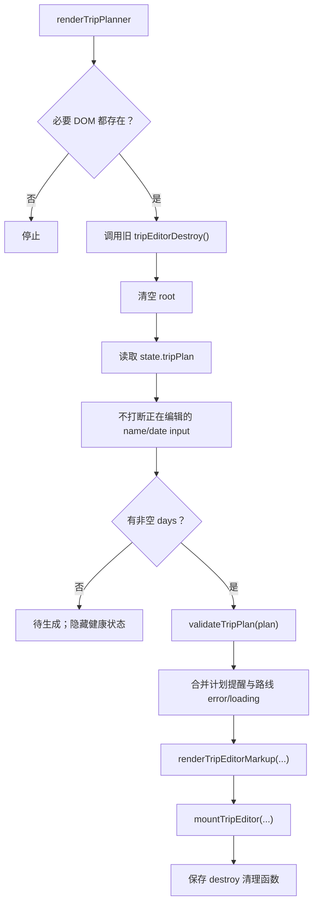

详细行为：

- 上一轮 `mountTripEditor()` 返回的销毁函数会移除事件监听，防止重绘一次就多绑定一套；
- name/date 输入正在获得焦点时，不覆盖用户尚未提交的键入；
- 是否有日历由 `plan.days` 非空决定；
- 无日历时禁用自动排期、根据历史栈禁用撤销，显示“待生成”；
- 有日历时解析节奏，提取路线地点，调用 `validateTripPlan()`；
- 健康提示同时考虑日程规则警告与路线计算错误/loading；
- `renderTripEditorMarkup()` 是纯字符串渲染器；
- `mountTripEditor()` 接入真实的 `handleTripCommand` 和 `openTripItemDialog`。

### 14.2 为什么“生成 HTML”和“挂事件”分两步

`renderTripEditorMarkup()` 只接收数据并返回字符串，Node 测试不需要真实浏览器；`mountTripEditor()` 只负责事件委托、拖拽、键盘和焦点。分开后，显示规则与交互生命周期可分别测试。

### 14.3 为什么每次销毁再挂载

重新生成整个日历最容易保证 DOM 与计划一致，也不会留下指向旧节点的监听器。当前实现用事件委托降低监听器数量，并保存 destroy 函数防泄漏。

更好的长期方案不是盲目引入框架，而是先把“路线摘要、元数据、日期列表、单日卡片”的 render 拆成可按 key 更新的区域；只有测到性能或焦点问题再考虑虚拟 DOM。

## 15. 路线摘要：第 1217–1249 行

### 15.1 `updateTotals()`

调用 `routeTotals()` 后：

- 有已测路段才显示格式化的距离与时长；
- 有 loading 加“正在计算”后缀；
- 否则有 fallback 加“约”后缀；
- 一段都没有测出时显示“待计算”。

loading 的优先级高于 fallback，因为只要仍有未完成路段，总数就是暂时值。

### 15.2 `routeTotals()`

只对 `hasMetrics(route)` 的路线求和，返回：

| 字段 | 算法 |
| --- | --- |
| `distanceMeters` | 已测路段 distance 相加 |
| `durationSeconds` | 已测路段 duration 相加 |
| `measuredSegmentCount` | 已测路段数量 |
| `hasFallback` | 任一已测路段使用降级估算 |
| `hasLoading` | 任一路段仍在 loading |

错误路段既没有伪造 0 距离进入合计，也不会让已成功路段的部分结果消失。

### 15.3 `buildChainLabel()`

没有 routes 时显示当前单一选择，或“尚未开始”；有路线时从第一条的 from 开始，再依次追加每条 to，得到“成都 → 重庆 → 西安”。

这里直接读取 `placeById(...).name`，假定 routes 已经由 `syncRoutesFromTripPlan()` 保证地点合法。若导入/水合短暂产生悬空地点，会抛错；相比之下 `routePlaces()` 会过滤空地点，防御更强。

### 15.4 `routePlaces()`

把路线数组还原成地点对象数组；有路线时是首个 from 加全部 to，并过滤查不到的地点。没有路线但有选择时返回单地点数组，否则空数组。

它主要服务下方旧推荐代码，当前新版日历直接使用 `routePlaceIds(plan)`。

## 16. 退役的旧版“按天推荐”管线：第 1251–1537 行

### 16.1 为什么确定它不可达

证据不是“看起来旧”，而是三点同时成立：

1. 全工程检索 `renderItineraryPanel`，只有它自己的定义，没有调用；
2. 当前 `renderPanel()` 明确调用 `renderTripPlanner()`；
3. `renderItineraryPanel()` 首先要求 `itineraryList`，但当前 `index.html` 没有 `id="itineraryList"`。

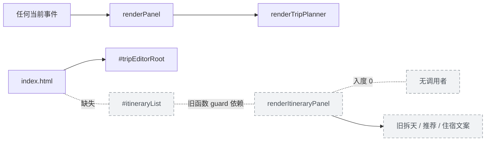

因此下面 28 个命名函数和 10 个箭头回调必须登记和理解，因为它们仍属于源码；但不要把它们当成当前用户路径。

### 16.2 `buildItineraryDays()`

它从 `state.routes` 而不是 `state.tripPlan.days` 重新拆天：

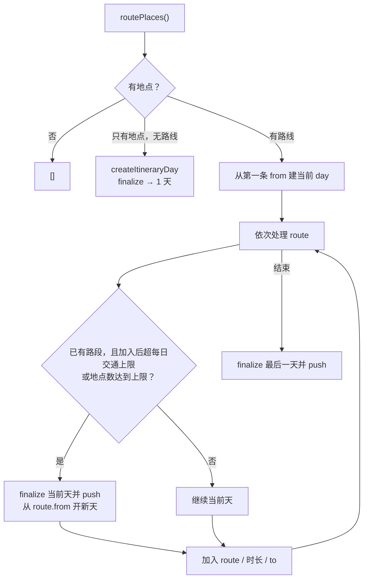

这就是旧架构与新 TripPlan 的根本冲突：同一个页面理论上可能有两套“第几天”的算法。新版已经把日期、住宿、活动和手工编辑保存在 TripPlan；旧版只根据路线时长临时推导。

### 16.3 `createItineraryDay(startPlace)`

建立可变工作对象：

- `index: 0`，最终再填；
- `places` 先放起点；
- `routes: []`；
- `travelSeconds: 0`；
- `overnight` 暂设起点。

### 16.4 `finalizeItineraryDay(day, index, pace)`

就地补齐：

- 天序号；
- 节奏配置；
- 最后地点作为过夜地；
- 游玩时间 = 游玩窗口减交通时间，最低为 0；
- 由 `itineraryDayWarnings()` 生成警告。

它修改传入对象而不返回值，是典型的旧式可变 builder；对小范围循环方便，但不如返回新对象容易测试和组合。

### 16.5 `routeDurationForPlanning(route)`

有真实 metrics 就用 route.duration，否则一律按 2 小时。新版自动排期仍调用这个函数，因此它虽然位于旧代码区，**本身仍被第 994 行的活跃函数复用**。

这说明“整段不可达”要精确表述：旧 UI 入口和其推荐分支不可达，但 `routeDurationForPlanning()` 由活跃 `routeDurationsForAutoSchedule()` 调用，仍是活函数。

### 16.6 `itineraryDayWarnings(day, pace)`

按顺序添加：

1. 有 loading 路线：先把当天当草稿；
2. 有 fallback：出发前核对真实车次；
3. 超 hard 上限：建议拆两天；
4. 否则超当前节奏上限：当天只留 1–2 个核心点。

这是旧版临时天模型的提醒；新版实际界面使用 `validateTripPlan()`，能检查项目重叠、抵达前活动、住宿城市不匹配等更丰富规则。

### 16.7 `renderItineraryPanel()`

旧总入口：

1. guard 检查 `itineraryList` 等节点；
2. `buildItineraryDays()`；
3. 清空列表并控制空状态；
4. 显示天数、节奏和日均交通上限；
5. `itineraryHealth()` 汇总健康状态；
6. 每天建 `li.day-card`，用 `itineraryDayHtml()` 填 HTML。

即使未来有人误调用它，当前也会因为 `itineraryList === null` 在第一行返回。

### 16.8 `itineraryHealth(days)`

- 有警告天：显示警告天数和第一条警告；
- 只有一个起点、没有路线：提示继续选城市；
- 其余：显示节奏描述并提醒核对票务与开放时间。

它只显示第一条警告，信息密度低于新版按日警告列表。

### 16.9 `itineraryDayHtml(day)`

生成旧日卡片字符串：

- 标题是地点链和过夜城市；
- 摘要是跨城段数、交通时长和剩余游玩时长；
- `dayPlanItems()` 生成上午、下午、晚上、住宿四行；
- 页脚显示第一条警告或通用弹性提示。

地点名、摘要、警告和计划正文大多经过 `escapeHtml()`。四行标签是源码常量，因此直接插入。

### 16.10 `dayPlanItems(day)` 与 `dayScheduleBlocks(day)`

前者把后者的 morning/afternoon/evening 文本包装成带中文标签的数组，再补一条住宿文本；后者只是三个时段函数的聚合适配器。

### 16.11 `dayMorningText(day)`

- 有跨城路线：上午用于退房、取票、移动、寄存或入住；
- 无跨城路线：取过夜地或首地点，优先推荐两个地标；
- 没有地标：建议先熟悉酒店、车站和商圈。

### 16.12 `dayAfternoonText(day)`

优先为当天目标地点推荐三个地标；有目标但无地标时给主城区/车站的通用建议；连目标也没有才退回 `dayHighlightText()`。

### 16.13 `dayEveningText(day)`

优先取目标地点最多五条美食建议；没有就调用 `dayFoodText()` 聚合全日地点，再追加就近用餐和休息建议。

### 16.14 `dayTransportText(day)`

无跨城时返回本地游玩说明；有路线时逐段显示“起点 → 终点、交通方式约时长”。有 metrics 使用格式化时长，否则显示“待计算”。

### 16.15 `dayHighlightText(day)`

按 `dayRecommendationPlaces()` 遍历最多三个地点，每地最多两个亮点。找不到地标时，过夜地获得主城区/车站通用建议；全部为空时提示进入城市视图继续细化。

### 16.16 `cityHighlightsForPlace(place)`

先用 `cityForPlace()` 把区县映射到上级城市；优先返回前三个地标，如果没有地标才返回前三个下辖区域名。

### 16.17 `placeHighlightText(place, limit = 3)`

在上一个函数结果上截断并用顿号连接。它是“数组 → 可展示短句”的小适配器。

### 16.18 `dayFoodText(day)`

按推荐地点收集美食：

- 每地去重并最多四条；
- 最多三个地点；
- 有结果时用分号连接；
- 无结果时给“当地小吃街或车站周边”的通用兜底。

### 16.19 `currentFoodSuggestionsFor(place)`

找到地点所属城市，把地点和城市一起交给美食控制器；控制器未加载时返回空数组。

### 16.20 `placeFoodText(place, limit = 5)`

取当前地点美食建议、去重、截断、用顿号连接。

### 16.21 `dayLodgingText(day)`

- 没有过夜地点：显示“暂未选定”；
- 所属城市有车站：建议住在首个车站或主商圈附近；
- 没车站：建议主城区或交通枢纽附近。

它没有读取新版 `day.lodging` 的酒店名和地址，再次证明这是旧推荐模型而非当前日历数据。

### 16.22 `dayRecommendationPlaces(day)`

过夜地点优先放首位，再按 `day.places` 原顺序追加还没出现的地点。内部用 ID 去重。

### 16.23 `cityForPlace(place)`

空输入返回 `null`；区县且有 `parentCityId` 时优先返回上级城市；否则按自身 ID 找城市；索引找不到时保留原地点对象。

### 16.24 `uniqueByName(values)`

用 `Set` 按字符串本身去重，保留第一次出现的顺序，并丢弃 falsy 值。名字为 `"成都"` 与 `" 成都 "` 会被视为不同，但上游地标函数已经 trim；美食建议是否规范取决于美食控制器。

### 16.25 遗留链应怎样处理

建议先加一个回归测试证明当前 HTML 只使用新版编辑器，再删除：

- `routePlaces()`；
- `buildItineraryDays()`、旧 day builder 和旧 warnings；
- `renderItineraryPanel()`、`itineraryHealth()`、`itineraryDayHtml()`；
- 所有旧上午/下午/晚上/地标/美食/住宿文案函数。

保留并移动仍活跃的 `routeDurationForPlanning()`。删除前不要只凭“没有直接调用”判断，因为它就是跨区间被活跃代码调用的反例。

还要保留并移动 `cityForPlace()` 与 `uniqueByName()`：前面的活动地标候选会调用它们。安全删除单位应是“从入口可达的调用子图”，不是一个连续行号区间。

## 17. 59 个函数声明逐一登记

状态说明：

- **活跃**：当前页面入口能调用；
- **活跃工具**：定义在遗留区域，但被前面活跃函数调用；
- **遗留**：只属于当前不可达的旧推荐子图。

| 行 | 函数 | 状态 | 输入 → 输出 / 副作用 |
| ---: | --- | --- | --- |
| 638 | `isValidRouteId` | 活跃 | 任意 ID → 是否为正安全整数或非空字符串 |
| 643 | `syncRoutesFromTripPlan` | 活跃 | 当前 TripPlan → 重建 `state.routes`，只估算新路段 |
| 706 | `commitTripPlan` | 活跃 | 新计划 + 选项 → 历史、状态、地图、面板、存储全部同步 |
| 734 | `tripIdentifier` | 活跃 | 外部值 → trim 后字符串或 `null` |
| 738 | `affectedTripDayLabels` | 活跃 | 计划 + day IDs → 去重后的用户可读日期标签 |
| 753 | `handleTripCommand` | 活跃 | 命令 + 焦点 token → 确认、规则执行、提交是否成功 |
| 776 | `tripFormControl` | 活跃 | 控件 name → 表单控件或 `null` |
| 780 | `setTripFormValue` | 活跃 | name + 值 → 回填 checkbox 或普通控件 |
| 790 | `tripDayPlaceIds` | 活跃 | day → 当天去重地点 ID |
| 799 | `populateTripPlaceSelect` | 活跃 | select + IDs + 首选值 → 重建选项并返回选中 ID |
| 814 | `landmarkNamesForPlace` | 活跃 | place ID → 所属城市静态/缓存地标去重名称 |
| 827 | `renderTripLandmarkOptions` | 活跃 | place ID → 更新 datalist 并返回名称 |
| 839 | `configureTripItemForm` | 活跃 | transport/activity/lodging → 切换标签、显隐和禁用状态 |
| 866 | `closeTripItemDialog` | 活跃 | 可选返回值 → 关闭原生或降级 dialog |
| 875 | `openTripItemDialog` | 活跃 | 编辑请求 → 校验日期、回填相应类型并打开 dialog |
| 951 | `submitTripItemForm` | 活跃 | submit event → 表单归一化命令并提交 |
| 966 | `updateTripNameMetadata` | 活跃 | 无参数 → 清洗名称并发元数据命令 |
| 977 | `updateTripStartDateMetadata` | 活跃 | 无参数 → 日期值或 null 的元数据命令 |
| 985 | `undoTripEdit` | 活跃 | 无参数 → 弹出历史并无记录地重新提交 |
| 994 | `routeDurationsForAutoSchedule` | 活跃 | 地点链 → `from>to` 到秒数的映射 |
| 1007 | `autoScheduleCurrentTrip` | 活跃 | 无参数 → 确认覆盖、重建计划、统一提交 |
| 1034 | `renderOperationalWarnings` | 活跃 | 共享故障状态 → 合并选择提示和降级警告 |
| 1053 | `currentFoodSelection` | 活跃 | 当前 state → 美食模块最小选择快照 |
| 1061 | `reportFoodModuleFailure` | 活跃 | error → 一次性故障状态和计数降级 |
| 1068 | `queueFoodPanelRender` | 活跃 | 无参数 → 调度“只应用最新”的美食刷新 |
| 1076 | `foodArticleCountForCity` | 活跃 | city ID → 文章数，未加载为 0 |
| 1080 | `foodArticleCountForPlace` | 活跃 | place ID → 文章数，未加载为 0 |
| 1084 | `loadFoodForCity` | 活跃 | city ID + 选项 → 控制器或失败后的 `null` |
| 1095 | `ensureFoodModuleForTrip` | 活跃 | 无参数 → 控制器或失败后的 `null` |
| 1104 | `renderPanel` | 活跃 | 当前共享状态 → 重绘侧栏、地图样式、日历并调度美食 |
| 1168 | `renderTripPlanner` | 活跃 | 当前 TripPlan → 校验、HTML、事件挂载和健康提示 |
| 1217 | `updateTotals` | 活跃 | 当前 routes → 更新总距离/时长 DOM |
| 1225 | `routeTotals` | 活跃 | 当前 routes → 已测总数、fallback/loading 标志 |
| 1236 | `buildChainLabel` | 活跃 | 当前 routes/选择 → 地点箭头链文字 |
| 1244 | `routePlaces` | 遗留 | 当前 routes/选择 → 地点对象链，仅供旧拆天 |
| 1251 | `buildItineraryDays` | 遗留 | 路线链 + 节奏 → 旧临时 day 数组 |
| 1287 | `createItineraryDay` | 遗留 | 可选起点 → 旧 day 工作对象 |
| 1297 | `finalizeItineraryDay` | 遗留 | 旧 day + 序号 + 节奏 → 就地补齐过夜、游玩、警告 |
| 1305 | `routeDurationForPlanning` | 活跃工具 | route → 真实 duration 或 2 小时占位 |
| 1310 | `itineraryDayWarnings` | 遗留 | 旧 day + 节奏 → loading/fallback/超限警告 |
| 1326 | `renderItineraryPanel` | 遗留 | 旧 day 数组 → 不可达的旧卡片 DOM |
| 1353 | `itineraryHealth` | 遗留 | 旧 days → 总体健康对象 |
| 1373 | `itineraryDayHtml` | 遗留 | 旧 day → 旧卡片 HTML 字符串 |
| 1393 | `dayPlanItems` | 遗留 | 旧 day → 上午/下午/晚上/住宿四项 |
| 1403 | `dayScheduleBlocks` | 遗留 | 旧 day → 三时段文案对象 |
| 1411 | `dayMorningText` | 遗留 | 旧 day → 上午交通或地标建议 |
| 1422 | `dayAfternoonText` | 遗留 | 旧 day → 下午核心景点建议 |
| 1432 | `dayEveningText` | 遗留 | 旧 day → 晚餐和轻活动建议 |
| 1439 | `dayTransportText` | 遗留 | 旧 day → 各段交通文字 |
| 1450 | `dayHighlightText` | 遗留 | 旧 day → 多地点亮点或通用兜底 |
| 1469 | `cityHighlightsForPlace` | 遗留 | place → 城市地标或区县名称 |
| 1477 | `placeHighlightText` | 遗留 | place + 上限 → 顿号连接亮点 |
| 1482 | `dayFoodText` | 遗留 | 旧 day → 多地点美食或通用兜底 |
| 1494 | `currentFoodSuggestionsFor` | 遗留 | place → 控制器建议数组 |
| 1499 | `placeFoodText` | 遗留 | place + 上限 → 去重美食短句 |
| 1503 | `dayLodgingText` | 遗留 | 旧 day → 车站/主城区住宿建议 |
| 1514 | `dayRecommendationPlaces` | 遗留 | 旧 day → 过夜地优先的去重地点 |
| 1523 | `cityForPlace` | 活跃工具 | place → 区县上级城市、城市本身或原对象 |
| 1529 | `uniqueByName` | 活跃工具 | 值数组 → 保序去空去重数组 |

### 17.1 登记表揭示的架构债

仅看文件行号，会把 1305、1523、1529 三个函数误删；仅看“有没有测试名称”，又可能保留整片死代码。可靠重构需要：

1. 从真实 DOM 事件和启动函数建立入口集合；
2. 建静态调用图；
3. 对动态回调和注入回调补人工边；
4. 用覆盖率或运行追踪验证；
5. 先补回归测试，再删除不可达子图。

## 18. 46 个箭头函数逐一登记

箭头函数通常不是新的业务能力，而是“把一个动作交给数组、浏览器或控制器稍后调用”。仍要逐个理解，因为复用、查重和竞态保护常藏在回调里。

| 行 | 所在函数 / 变量 | 每次回调做什么 |
| ---: | --- | --- |
| 649 | `reservedRouteIds` 的 `map` | 从每条旧路线取可选 `id` |
| 652 | `largestNumericId` 的 `reduce` | 只比较安全整数 ID，保留最大值 |
| 660 | `allocateRouteId` | 跳过保留 ID，发出下一个编号并登记 |
| 668 | `nextRoutes` 的 `map` | 把地点链第二项起逐一变成相邻路段 |
| 670 | `reusable` 的 `find` | 找未占用、ID 合法唯一、起终点和交通方式相同的旧路线 |
| 703 | `routesToEstimate.forEach` | 只把新路线交给地图计算 metrics |
| 727 | `requestAnimationFrame` | 下一帧第二次恢复编辑器焦点 |
| 740 | `uniqueDayIds.flatMap` | 每个 day ID 转成 0 或 1 个显示标签 |
| 741 | `plan.days.findIndex` | 找 day ID 对应的数组位置 |
| 792 | `cityEntries.forEach` | 清洗地点 ID，并保序去重加入结果 |
| 801 | `placeIds.map` | 为每个地点创建安全的 `option` 节点 |
| 822 | `landmarks.map` | 从地标对象取 trim 后名称或空字符串 |
| 830 | `names.map` | 为 datalist 建立 `option` 节点 |
| 851 | `querySelectorAll("[data-trip-types]")` | 逐字段组判断是否支持当前类型 |
| 854 | 字段组内控件 `forEach` | 将不支持的 input/select/textarea 设为 disabled |
| 878 | `plan.days.find` | 按已清洗 day ID 找当前日期 |
| 893 | `day.items.find` | 按 item ID 找待编辑交通/活动 |
| 948 | `requestAnimationFrame` | 打开 dialog 后聚焦车次或标题输入 |
| 996 | `placeIds.slice(1).forEach` | 为每个相邻地点填一条排期时长 |
| 1001 | `state.routes.find` | 下标快路失败后按起终点找路线 |
| 1010 | `plan.days.some` | 判断是否存在手工编辑日期 |
| 1130 | `state.routes.forEach` | 为每条有效路线建立并追加列表项 |
| 1194 | `errorCount` 的 `filter` | 统计路线计算错误 |
| 1195 | `loadingCount` 的 `filter` | 统计正在计算的路线 |
| 1208 | 注入的 `placeName` | place ID → 名称，找不到保留 ID |
| 1228 | `distanceMeters.reduce` | 累加已测距离 |
| 1229 | `durationSeconds.reduce` | 累加已测时长 |
| 1231 | `hasFallback.some` | 判断任一已测路段是否降级估算 |
| 1232 | `hasLoading.some` | 判断任一路段是否仍在计算 |
| 1240 | `state.routes.forEach` | 依次把每条 to 的名称加入链条 |
| 1246 | `state.routes.map` | 把每条 to ID 映射为地点对象 |
| 1263 | 旧 `state.routes.forEach` | 按节奏上限把路线分配到旧 day |
| 1312 | 旧 warnings 的 `some` | 判断当天是否有 loading 路线 |
| 1315 | 旧 warnings 的 `some` | 判断当天是否有 fallback 路线 |
| 1345 | 旧 `days.forEach` | 建立并追加每张旧 day card |
| 1354 | `warningDays.filter` | 选出至少有一条警告的旧 day |
| 1374 | `day.places.map` | 转义地点名，供旧标题连接 |
| 1387 | `dayPlanItems.map` | 把四项计划变成旧 `li` 字符串 |
| 1441 | `day.routes.map` | 把每段路线变成交通短句 |
| 1452 | `dayRecommendationPlaces.map` | 每个推荐地点生成亮点段落 |
| 1472 | `cityLandmarks.map` | 地标对象 → 名称 |
| 1474 | `citySubareas.map` | 区域对象 → 名称 |
| 1484 | `dayRecommendationPlaces.map` | 每个地点生成美食段落 |
| 1517 | `day.places.forEach` | 向推荐地点数组追加尚未出现的地点 |
| 1518 | `places.some` | 用地点 ID 检查是否已经存在 |
| 1531 | `values.filter` | 丢弃空值和重复值，并把首次值写入 Set |

### 18.1 箭头函数的“名字”为何有时奇怪

AST 能从变量推断：

```js
const allocateRouteId = () => { /* ... */ };
```

所以它可登记为 `allocateRouteId`。但：

```js
routes.forEach((route) => doSomething(route));
```

回调没有源码名字，只能用“所在调用 + 行号”识别。它仍然是一个真实函数节点：`forEach` 会在之后为每个元素调用它。

## 19. 当前设计为什么这样形成

### 19.1 为什么要有唯一 `commitTripPlan()`

因为一次计划变化至少影响六个观察者：撤销历史、交通方式、路线数组、地图、日历、存储。散落在每个按钮里会很快漏掉一个。集中提交能建立固定顺序和一致提示。

### 19.2 为什么规则模块返回结果对象

一个布尔值无法表达：

- 没变化；
- 目标不合法；
- 需要确认；
- 确认原因；
- 受影响日期；
- 成功后的新计划。

结构化结果让纯规则和浏览器交互解耦。

### 19.3 为什么路线保留独立于 TripPlan

TripPlan 保存用户意图和日程；距离/时长可能来自异步地图服务、会 loading、失败或 fallback。把暂态网络计算塞入可导出的 TripPlan 会污染存档，也让同一行程在不同时间产生不必要差异。

### 19.4 为什么美食允许晚到

地图选择和日历编辑是关键路径，美食文章是增强信息。延迟加载缩短首屏，并允许美食失败时行程仍能使用。因为晚到结果会重绘当前选择，所以必须加“只接受最新请求”的代次保护。

### 19.5 为什么遗留代码仍在

从源码演化可以推断：早期页面只有路线链，需临时按节奏拆天并生成通用推荐；引入 TripPlan 日历后，入口切到了 `renderTripPlanner()`，旧函数没有同步删除。保留当时降低迁移风险，但长期增加理解、体积和误改成本。

这最后一点是基于调用图和数据结构作出的工程推断；Git 历史若有对应提交，可进一步验证作者当时的迁移动机。

## 20. 可以怎样设计得更好

### 20.1 第一优先级：删除已证明不可达的旧推荐子图

预计可删除约 250 行，减少第二套 day 模型。先加三项保护：

1. 页面只挂载 `#tripEditorRoot` 的结构测试；
2. 关键编辑、自动排期、健康提示的浏览器测试；
3. 调用图确认 `routeDurationForPlanning`、`cityForPlace`、`uniqueByName` 被移到活跃工具模块。

### 20.2 第二优先级：把提交拆成显式阶段

建议接口：

```js
const result = prepareTripCommit({ currentPlan, nextPlan, history });
applyTripCommitToMemory(result);
renderTripCommit(result);
const persistence = persistTripCommit(result);
reportTripCommit(persistence);
```

这样可以单测每个阶段，并明确“内存成功、持久化失败”是一种受支持状态。若希望强一致，可在持久化成功后再公布；若希望立即响应，则应显式显示“未保存”状态并提供重试。

### 20.3 第三优先级：把 `renderPanel()` 分成小型投影

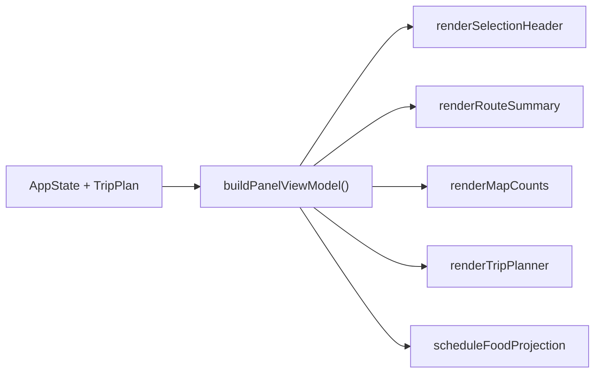

纯 `buildPanelViewModel()` 可在 Node 中测试所有文字和可用状态；DOM 函数只负责把 view model 写入节点。

### 20.4 第四优先级：结构化表单错误

`commandForTripItemForm()` 可以返回：

```js
{
  ok: false,
  errors: [
    { field: "fromPlaceId", code: "required", message: "请选择出发地点" }
  ]
}
```

协调器把错误关联到具体控件和 `aria-describedby`，未知异常则进入故障日志。这样不会把代码 bug 伪装成用户漏填。

### 20.5 第五优先级：路线计算采用不可变结果

用 route key 与 generation：

```js
{ key: "beijing>shanghai|highspeed", generation: 12 }
```

计算完成后只有 key 和 generation 都等于当前请求才合并成新 route 对象。这样不依赖异步任务修改共享旧对象，也更容易解释和调试。

### 20.6 第六优先级：补 redo 与带标签的历史

历史条目保存：

```js
{
  plan: structuredClone(plan),
  label: "移动活动到第 2 天",
  committedAt: "2026-07-22T..."
}
```

用 undo/redo 两个栈，执行新命令时清空 redo；恢复、导入是否进入历史由产品规则明确决定。

### 20.7 第七优先级：缩小协调器共享状态

让各控制器拥有自己的状态：

- route store：路线、nextRouteId、计算 generation；
- trip store：TripPlan、history、保存状态；
- view store：viewMode、activeCity；
- food store：控制器生命周期与错误。

`app.js` 只订阅事件并组合 view model，不继续承担 50 字段全局对象的维护。

### 20.8 第八优先级：避免不受控 `innerHTML`

项目内置 JSON 也应当作数据而不是可信 HTML。路线列表改用 `createElement` + `textContent`；纯字符串渲染器继续保留 `escapeHtml` 并由测试覆盖每个外部插值。

## 21. 失败如何传播

| 失败点 | 当前结果 | 用户还能做什么 | 缺口 |
| --- | --- | --- | --- |
| 命令对象非法 | `handleTripCommand` 返回 false | 原计划不变 | 无解释 |
| 移动物品到不含其城市的日期 | 显示专门错误 | 修改目标日期或城市 | 反馈只在存档状态区 |
| 危险城市调整被取消 | 原计划不变 | 继续编辑 | 正确 |
| 表单转换抛错 | 显示“补全必填” | 修正表单 | 未区分程序错误 |
| 路线计算 loading | 部分合计 + loading 后缀 | 继续编辑 | 正确 |
| 路线计算 error | 日历健康提示错误段数 | 继续使用其他功能 | 路线列表有状态但重试入口需在地图层看 |
| 美食模块失败 | 一次性“暂不可用”与操作警告 | 地图、行程继续 | 后续不同错误不再单独报告 |
| localStorage 写失败 | 内存/UI 保留，提示立即导出 | 导出备份 | 刷新可能丢失 |
| URL 旧 hash 清理失败 | 存储仍算成功，但显示警告 | 导出并避免旧快照 | 状态组合较复杂 |

## 22. 测试证据与测试缺口

### 22.1 已有自动测试证明了什么

| 测试文件 | 与本章有关的证据 |
| --- | --- |
| `tests/trip-plan.test.mjs` | 自动排期按节奏拆天、重复地点 visit、命令复制/移动/删除、危险清理确认、校验警告和元数据更新 |
| `tests/trip-editor.test.mjs` | 三类表单转命令、trim 与空值、跨日交通、markup 转义、真实事件委托、拖拽/键盘和 destroy 清理 |
| `tests/rendered-html.test.mjs` | `commitTripPlan` 唯一、路线同步存在、交通元数据先同步再渲染、日历使用真实回调、焦点恢复、阻止反馈、最新美食刷新 |
| 浏览器测试 | 页面加载、地图交互、延迟数据完整水合等端到端路径 |

### 22.2 结构测试的局限

`rendered-html.test.mjs` 中不少断言是正则检查源码，例如“函数体里出现 `validateTripPlan()`”。它能防止接线被误删，却不能证明：

- 调用顺序在所有分支都正确；
- localStorage 失败后的 DOM 状态；
- dialog 三类型在真实浏览器中的完整交互；
- 快速连续编辑时焦点一定恢复；
- 旧 `renderItineraryPanel()` 确实永远不会被动态路径调用。

### 22.3 最值得补的测试

1. `commitTripPlan()` 的可注入协调器单测：精确断言历史、同步、render、persist 顺序；
2. 本机存储失败浏览器测试：新计划仍显示，错误提示可见，导出可用；
3. dialog 对活动/交通/住宿各一条真实填写与重开回填路径；
4. 连续两次美食选择只显示最新结果；
5. 静态调用图/覆盖率守卫，确认删除旧推荐函数不会影响当前功能；
6. route ID 含重复数字、字符串 ID、交通方式切换时的复用测试；
7. 无地点索引或悬空 route 时 `buildChainLabel()` 的降级测试。

## 23. 手工跟踪练习：把活动拖到另一天

1. 在 `trip-editor.js` 找 `mountTripEditor()`。
2. 看拖拽结束怎样由 `commandForAction()` 生成 `move-item` 命令。
3. 回到 `app.js` 第 753 行，进入 `handleTripCommand()`。
4. 在 `trip-plan.js` 第 825 行进入 `applyTripCommand()`。
5. 如果目标天不含活动地点，看到 `blockedReason: "item-place-mismatch"`。
6. 如果合法，规则模块复制计划、移动 item，并把相关日期标成手工编辑。
7. 新计划回到 `commitTripPlan()`。
8. 旧计划深复制进入最多 20 项的历史栈。
9. `syncRoutesFromTripPlan()` 通常会复用相同路线，因为仅移动活动没有改变地点链。
10. `renderPanel()` 重建侧栏并调用 `renderTripPlanner()`。
11. 新 markup 生成后，`mountTripEditor()` 重新挂事件。
12. `restoreTripEditorFocus()` 立即和下一帧各尝试一次。
13. `persistTripState()` 写 v2 本机存档并清理旧分享 hash。
14. 点击“撤销行程编辑”，`undoTripEdit()` 弹回旧快照且不再压一份历史。

## 24. 本章应记住的工程原则

> 用户操作不是状态；命令描述意图，规则模块决定合法的新状态，提交入口协调所有观察者。任何看似完整的函数都不一定在运行——理解工程必须同时看入口、调用图、DOM 契约和测试，而不能只按文件从上到下猜。

## 25. 下一章预告

下一章继续 `app.js` 第 1538–2591 行：本机存档与旧版迁移怎样恢复，导入为何要像事务一样备份，地图点击、交通与节奏按钮怎样进入提交链，指南导出怎样调用第 9 章模块，页面启动和所有 DOM 事件最终怎样把整个工程接通。

继续：[第 12 章：存档事务、地图动作、指南桥梁、启动与事件接线](./12-app-archive-events.md)
