# 第 12 章：总协调器（下）——存档事务、地图动作、指南桥梁、启动与事件接线

> 本章完成发布版 `public/static-site/app.js` 的拆解，覆盖第 1538–2591 行。AST 在该区间识别出 **126 个函数节点**：60 个函数声明和 66 个箭头函数。前三章合起来已经逐一登记 `app.js` 全部 274 个函数节点。

回看：[第 11 章：一次行程编辑怎样提交、重绘与保存](./11-app-trip-rendering.md)

## 1. 本章先给结论

页面最末这一千多行做了五件事：

1. 决定行程按钮何时可用，并在本机存储失败时保留可导出的应急副本；
2. 从 URL 分享快照、本机 v2 或旧版 v1 中选择恢复来源；
3. 把文件导入实现成带内存与存储快照的尽力回滚事务；
4. 把地图点击、交通方式、节奏和路线撤销送入第 11 章的统一提交链；
5. 在 `initApp()` 中按“地图先可用、行程随后恢复、可选数据空闲时补齐”的顺序启动，并在文件末尾接上全部 DOM 事件。

这段最重要的设计不是某个 API，而是**失败语义不相同**：

| 场景 | 失败后承诺 |
| --- | --- |
| 普通编辑自动保存失败 | 内存和页面保留新计划，明确要求立即导出 |
| 启动恢复后保存 v2 失败 | 内容仍恢复到页面，状态为 `restored-with-persistence-error` |
| 文件导入提交失败 | 尽力恢复导入前计划、历史、路线、v2 存档和 v1 备份 |
| 旧版原文无法写入备份 | 不允许迁移；把精确原文暂存在页面内存供应急导出 |
| 可选区县/美食失败 | 地图继续工作，`data-app-ready` 进入 degraded |
| 关键地图或行程模块失败 | 启动 catch 显示失败，关键交互不可用 |

## 2. 五问核验后的架构结论

| 核验问题 | 由源码与测试共同支持的结论 |
| --- | --- |
| 页面里哪一份行程算主事实？ | 运行时是 `state.tripPlan`；跨刷新事实是 localStorage v2；URL hash 是一次性高优先级恢复输入；v1 与迁移备份只服务兼容和回滚。 |
| 为什么恢复和导入不能共用一个简单函数？ | 恢复的目标是尽量把已有内容展示出来，即使再次保存失败也有价值；导入会覆盖用户当前工作，失败时必须尽量回到导入前状态。 |
| 为什么城市单击要等 180ms？ | 地图同时把单击定义为“加入行程”、双击定义为“进入城市详情”。延迟单击给双击处理器机会取消待执行加入动作。 |
| 为什么指南导出先建立快照模型？ | TripPlan 保存稳定 ID；导出需要地点名称、坐标、校验提醒、路线状态和合计。`buildCurrentGuideModel()` 是运行态到第 9 章 GuideModel 的边界。 |
| 最大工程风险是什么？ | 多键 localStorage 没有真正事务；`queueTripAction()` 名为 queue 却不串行；路线 metrics 每完成一段就重写存档；导出快照跨多个 await 不完全原子；`handleCityClick()` 已无调用者。 |

一句话总结：

> `app.js` 的最后一段像机场的到达、转机和出发大厅：它不制造地图、行程规则或文档格式，却负责验证旅客来自哪里、行李是否有备份、失败时退回哪一步，并把每个按钮送到正确的专业模块。

## 3. 范围与节点分组

| 源码范围 | 函数声明 | 箭头函数 | 主题 |
| --- | ---: | ---: | --- |
| 1538–1743 | 14 | 2 | 控件、保存、迁移验证、导入快照与回滚 |
| 1744–2056 | 6 | 4 | 启动恢复、文件导出、分享、文件导入事务 |
| 2057–2314 | 30 | 7 | 状态文字、格式化、地图/详情适配、配置与路线动作 |
| 2315–2483 | 9 | 6 | GuideModel、两种指南下载、readiness |
| 2484–2591 | 1 | 47 | 启动组合根与所有 DOM 事件接线 |
| **合计** | **60** | **66** | **126** |

### 3.1 全段调用地图

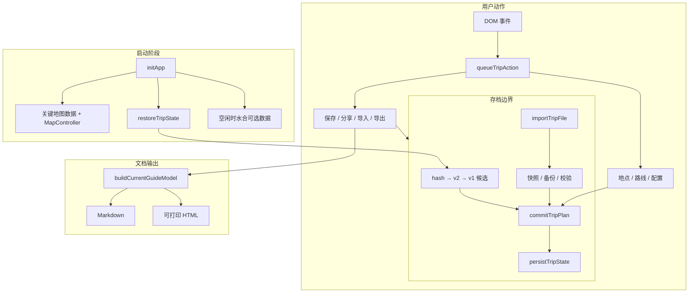
```mermaid
flowchart TB
  subgraph START["启动阶段"]
    INIT["initApp"] --> MAP["关键地图数据 + MapController"]
    INIT --> RECOVER["restoreTripState"]
    INIT --> IDLE["空闲时水合可选数据"]
  end

  subgraph ARCHIVE["存档边界"]
    RECOVER --> CAND["hash → v2 → v1 候选"]
    CAND --> COMMIT["commitTripPlan"]
    IMPORT["importTripFile"] --> SNAP["快照 / 备份 / 校验"]
    SNAP --> COMMIT
    COMMIT --> PERSIST["persistTripState"]
  end

  subgraph ACTION["用户动作"]
    EVENTS["DOM 事件"] --> QUEUE["queueTripAction"]
    QUEUE --> CLICK["地点 / 路线 / 配置"]
    QUEUE --> IO["保存 / 分享 / 导入 / 导出"]
    CLICK --> COMMIT
    IO --> ARCHIVE
  end

  subgraph GUIDE["文档输出"]
    IO --> MODEL["buildCurrentGuideModel"]
    MODEL --> MD["Markdown"]
    MODEL --> HTML["可打印 HTML"]
  end
```

## 4. 零基础读者需要先懂的概念

### 4.1 内存、本机存储、URL 和文件不是同一层

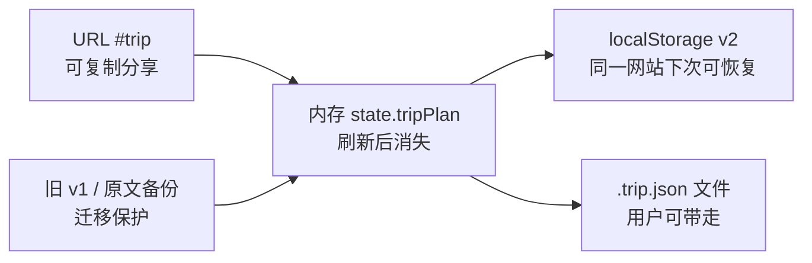
```mermaid
flowchart LR
  RAM["内存 state.tripPlan<br/>刷新后消失"] --> LOCAL["localStorage v2<br/>同一网站下次可恢复"]
  HASH["URL #trip<br/>可复制分享"] --> RAM
  V1["旧 v1 / 原文备份<br/>迁移保护"] --> RAM
  RAM --> FILE[".trip.json 文件<br/>用户可带走"]
```

- 内存最快，但关闭/刷新页面就没了；
- localStorage 只属于当前网站与浏览器，可能因权限或容量失败；
- URL hash 能随链接传递，但长度有限，也不是加密；
- 文件由用户掌握，最适合作为故障逃生出口。

### 4.2 `try / catch / finally`

```js
try {
  // 可能失败的导入步骤
} catch (error) {
  // 回滚并告诉用户
} finally {
  input.value = "";
}
```

`finally` 无论成功、失败，甚至 try 中提前 return 都会执行。清空 file input 后，用户才能再次选择同一个文件并触发 change 事件。

### 4.3 “事务”在这里是尽力回滚

数据库可以保证一组写入全部成功或全部失败；localStorage 只有逐个键的同步操作。这个项目只能：

1. 修改前读取快照；
2. 依次执行；
3. 失败后逐项恢复；
4. 报告是否有恢复失败。

所以文档称它为“事务协调”，不是宣称浏览器拥有真正原子事务。

### 4.4 `event.currentTarget`

`event.target` 是真正触发事件的最深节点；`currentTarget` 是监听器绑定的节点。文件 change 监听器直接绑在 input 上，所以 `event.currentTarget` 稳定指向文件输入框。

### 4.5 Blob 与 object URL

浏览器不能直接“下载一个 JavaScript 字符串”。`downloadTextFile()` 先把字符串包装成 `Blob`，再用 `URL.createObjectURL(blob)` 得到临时地址，让带 `download` 属性的 `<a>` 点击，最后释放地址。

### 4.6 事件回调为什么出现三层箭头

```js
button.addEventListener("click", () =>
  queueTripAction(() =>
    setTransportMode(button.dataset.mode)
  )
);
```

三层职责不同：

1. `forEach(button => ...)`：为每个按钮接线；
2. 浏览器 click 回调：等用户点击；
3. 交给 `queueTripAction` 的 action：等行程模块加载后执行。

第 19 节会逐一登记全部 66 个箭头函数，而不是把同一行的三层误算成一个。

### 4.7 `queueTripAction()` 实际不是串行队列

它定义在第 10 章覆盖的第 132 行：

```js
function queueTripAction(action) {
  return loadTripControllerModule()
    .then(action)
    .catch(/* ... */);
}
```

名称里的 queue 表示“等模块准备好再执行”，没有保存上一项 Promise，也没有让动作 A 完成后才开始动作 B。模块已加载后，快速点击两个 async 导出或导入动作可以并发。更准确的名字应是 `runWhenTripReady()`；若真要串行，需要显式 Promise chain 或互斥锁。

## 5. 三类一致性承诺

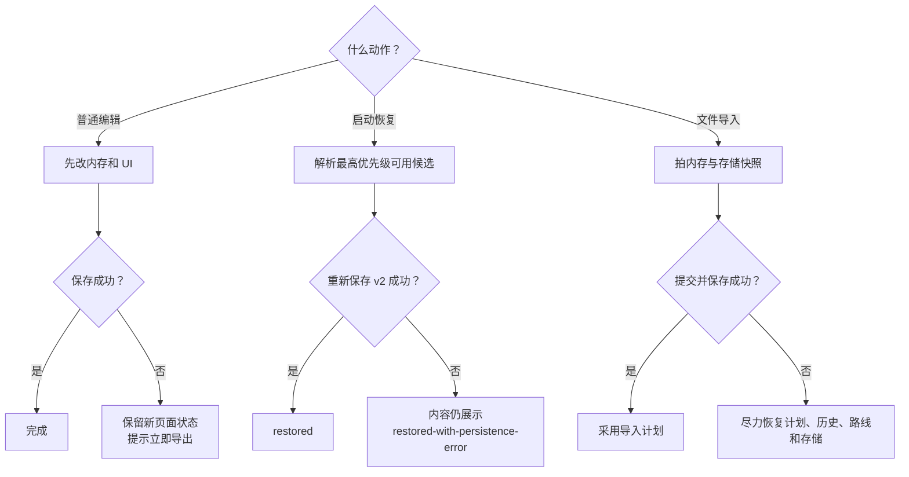
```mermaid
flowchart TB
  CHANGE{"什么动作？"}
  CHANGE -->|普通编辑| EDIT["先改内存和 UI"]
  EDIT --> EP{"保存成功？"}
  EP -->|是| OK1["完成"]
  EP -->|否| KEEP["保留新页面状态<br/>提示立即导出"]

  CHANGE -->|启动恢复| RESTORE["解析最高优先级可用候选"]
  RESTORE --> RP{"重新保存 v2 成功？"}
  RP -->|是| OK2["restored"]
  RP -->|否| KEEP2["内容仍展示<br/>restored-with-persistence-error"]

  CHANGE -->|文件导入| IMPORT["拍内存与存储快照"]
  IMPORT --> IP{"提交并保存成功？"}
  IP -->|是| OK3["采用导入计划"]
  IP -->|否| ROLLBACK["尽力恢复计划、历史、路线和存储"]
```

为什么导入最严格？普通编辑的新内容就是用户刚做的，丢掉反而更糟；启动恢复没有覆盖正在编辑的工作；文件导入会替换当前计划，所以失败时“不新不旧”的状态不可接受。

## 6. 存档按钮与应急原文：第 1538–1582 行

### 6.1 `hasSerializableTrip()`

返回 `Boolean(state.tripPlan)`。它只判断是否有计划对象，不重复做 schema 校验；计划进入 state 前应已由创建、迁移或命令规则保证合法。

### 6.2 `syncTripArchiveControls()`

按钮条件并不相同：

| 按钮 | 启用条件 |
| --- | --- |
| 手动保存、分享 | 有任意 TripPlan |
| Markdown、HTML 指南 | 有计划且 `days` 非空 |
| JSON 行程文件 | 有计划，或内存中有可验证的应急 v1 原文 |

指南需要日历内容；JSON 文件即使只有空日历也能保存结构；旧版迁移备份失败时，当前甚至可以没有 v2 计划，但仍必须允许用户抢救 v1 原文。

### 6.3 `rememberEmergencyLegacyTrip(raw)`

先用 `canExportTripFile({ emergencyLegacyRaw: raw })` 验证原文确实能形成旧版文件载荷；合法才放进模块级变量 `emergencyLegacyTripRaw`，刷新按钮并返回 true。

它不是 localStorage 备份，而是“本页还开着时的最后逃生副本”。刷新页面后会消失，所以错误提示要求立刻导出。

### 6.4 `clearEmergencyLegacyTrip()`

清空内存原文并同步按钮。成功迁移/导出或明确清空行程后调用，避免旧原文一直压过当前 v2 导出。

### 6.5 `archiveFailureGuidance()`

如果当前计划或应急 v1 仍可导出，返回“请先导出文件”；否则要求保持页面打开并检查浏览器站点数据权限。它把恢复能力转成具体用户动作。

### 6.6 `replaceBrowserUrl(nextUrl)`

调用 `history.replaceState` 替换当前地址，不新增浏览器历史条目。存档模块通过注入这个函数来清理旧 `#trip`，从而不直接依赖全局 window，也便于单测。

## 7. 保存、旧备份完成与清空：第 1583–1640 行

### 7.1 `persistTripState(message)`

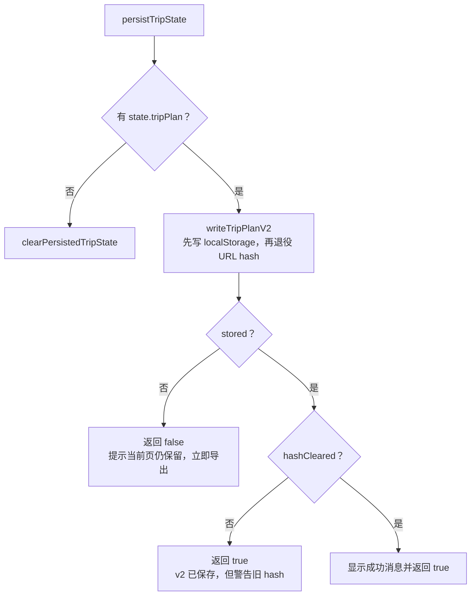
```mermaid
flowchart TD
  A["persistTripState"] --> HAS{"有 state.tripPlan？"}
  HAS -->|否| CLEAR["clearPersistedTripState"]
  HAS -->|是| WRITE["writeTripPlanV2<br/>先写 localStorage，再退役 URL hash"]
  WRITE --> STORED{"stored？"}
  STORED -->|否| ERR1["返回 false<br/>提示当前页仍保留，立即导出"]
  STORED -->|是| HASH{"hashCleared？"}
  HASH -->|否| ERR2["返回 true<br/>v2 已保存，但警告旧 hash"]
  HASH -->|是| SUCCESS["显示成功消息并返回 true"]
```

`stored` 与 `hashCleared` 分开很重要：本机 v2 已写成功但地址栏清理失败，不应谎称整次保存失败；它返回 true，让迁移逻辑知道 v2 有可靠副本，同时向用户显示 URL 风险。

### 7.2 `finalizeLegacyTripBackup(message)`

只有 `legacyTripBackupPending` 为 true 才工作。它删除：

- 旧版 v1 主存档；
- v1 精确原文迁移备份。

删除失败就保持 pending，以便后续有效编辑保存再次重试。若 v2 写成功但 hash 未清，消息会同时说明两个维度的结果。

为什么不在首次恢复时立刻删 v1？迁移后的计划刚写 v2，至少等用户进行一次有效编辑并再次成功保存，才把旧来源退役，给迁移留一个额外安全窗口。

### 7.3 `clearPersistedTripState()`

1. 清空内存应急原文；
2. 调 `clearTripArchive()` 删除 v2、v1、备份和 URL hash；
3. 从失败键判断旧迁移是否仍 pending；
4. 全成功显示完整清除；
5. 部分失败明确提醒检查站点数据。

它返回布尔值，但内存计划是否清空由调用它的 `commitTripPlan(null)` 先决定。即使存储删除失败，当前页面仍显示空计划。

### 7.4 清空不是可撤销编辑

`clearRoutes()` 会先把 `state.tripHistory = []`，再提交 null 且不记录历史。也就是说“清空全部”明确越过普通撤销机制。当前代码没有二次确认，属于高风险 UX；更好的方案见第 21 节。

## 8. 迁移前验证：第 1642–1684 行

### 8.1 `isTripStateRecord(value)`

合法根只能是非空普通对象：

- `null` 不行；
- 数组不行；
- 数字、字符串不行。

它只是第一道外形检查，后续迁移和归一化负责字段级验证。

### 8.2 `prepareTripMigration(data, { allowLegacy })`

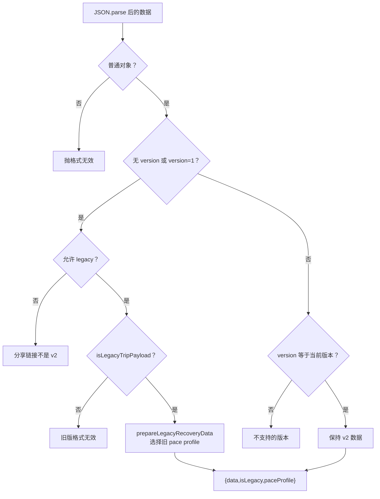
```mermaid
flowchart TD
  DATA["JSON.parse 后的数据"] --> ROOT{"普通对象？"}
  ROOT -->|否| BAD["抛格式无效"]
  ROOT -->|是| LEG{"无 version 或 version=1？"}
  LEG -->|是| ALLOW{"允许 legacy？"}
  ALLOW -->|否| BAD2["分享链接不是 v2"]
  ALLOW -->|是| SHAPE{"isLegacyTripPayload？"}
  SHAPE -->|否| BAD3["旧版格式无效"]
  SHAPE -->|是| PREP["prepareLegacyRecoveryData<br/>选择旧 pace profile"]
  LEG -->|否| V2{"version 等于当前版本？"}
  V2 -->|否| BAD4["不支持的版本"]
  V2 -->|是| KEEP["保持 v2 数据"]
  PREP --> OUT["{data,isLegacy,paceProfile}"]
  KEEP --> OUT
```

分享 URL 候选明确 `allowLegacy: false`，避免把无版本的任意对象误当作可迁移分享；旧存储键和文件导入才允许 v1。

旧版预处理不查 `placeById()`。这是有意分层：先把旧结构转成迁移输入，地点数据是否已加载由后面的 renderability 检查决定。

### 8.3 `assertTripPlanCanRender(plan, { isLegacy })`

1. 从计划取完整路线地点 ID；
2. 找所有当前地点索引无法识别的 ID；
3. 有缺失时抛 `MissingTripPlacesError`，携带缺失列表；
4. 旧版迁移若一个地点都没有，抛普通格式错误；
5. 通过则原样返回 plan。

为什么缺地点用专门错误类？启动时区县摘要可能还没水合。恢复选择器遇到这个错误会返回 deferred，不会错误地跳到低优先级存档；区县数据到达后再重试。

文件导入发生在应用可用后，缺地点错误会进入导入失败并保持旧状态，而不是无限等待。

## 9. 导入快照与回滚：第 1686–1742 行

### 9.1 `captureTripImportSnapshot()`

快照覆盖：

| 域 | 字段 |
| --- | --- |
| 计划 | `tripPlan`、`tripHistory` |
| 配置 | `transportMode`、`tripPace` |
| 路线 | `routes`、`selectedCityId`、`nextRouteId` |
| 存储 | `captureTripArchiveSnapshot()` 的 v2 和备份键 |
| 迁移状态 | `legacyTripBackupPending` |
| 最近保存结果 | `lastTripPersistenceResult` |
| 应急原文 | `emergencyLegacyTripRaw` |

`tripHistory` 复制数组；`tripPlan` 与 `routes` 保存引用。当前导入路径用新对象替换这些字段，所以可回滚；但若并发路线计算在事务期间修改旧 route 对象，快照并非完全不可变。

### 9.2 `rollbackTripImportSnapshot(snapshot, options)`

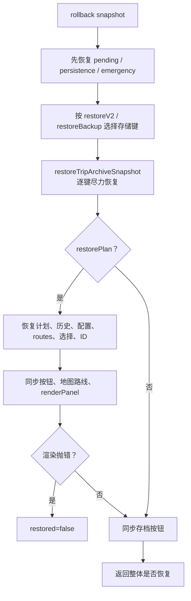
```mermaid
flowchart TD
  A["rollback snapshot"] --> FLAGS["先恢复 pending / persistence / emergency"]
  FLAGS --> KEYS["按 restoreV2 / restoreBackup 选择存储键"]
  KEYS --> STORAGE["restoreTripArchiveSnapshot<br/>逐键尽力恢复"]
  STORAGE --> PLAN{"restorePlan？"}
  PLAN -->|是| STATE["恢复计划、历史、配置、routes、选择、ID"]
  STATE --> UI["同步按钮、地图路线、renderPanel"]
  UI --> CATCH{"渲染抛错？"}
  CATCH -->|是| FALSE["restored=false"]
  CATCH -->|否| CONTROLS["同步存档按钮"]
  PLAN -->|否| CONTROLS
  CONTROLS --> OUT["返回整体是否恢复"]
```

选项允许按失败发生的位置最小化回滚：

- 还没碰计划，就不重画计划；
- 没写 v2，就不恢复 v2；
- 没碰备份，就不恢复备份。

错误 catch 没使用 `error`，只把返回值设为 false。用户能知道“没有完全恢复”，开发者却缺少具体渲染故障日志。

## 10. 恢复成功消息：第 1744–1751 行

### `restoredTripMessage(source, failures)`

把先前无效/读取失败的高优先级候选作为前缀，再按最终来源选择正文：

- `hash`：从分享链接恢复并保存；
- `legacy`：迁移 v1，备份会在下一次有效编辑后清理；
- 其他：从本机 v2 恢复。

例如分享 hash 无效、随后 v2 成功，用户会知道“分享链接不可用；已从本机 v2 恢复”，而不是误以为打开的分享内容生效。

## 11. 启动恢复：第 1753–1879 行

### 11.1 `restoreTripState()` 的候选优先级

`readTripRecoveryCandidates()` 按顺序返回：

1. 当前 URL 的 `#trip` 分享快照；
2. localStorage v2；
3. localStorage v1。

`selectTripRecoveryCandidate()` 对每个候选执行 app 层 evaluator：

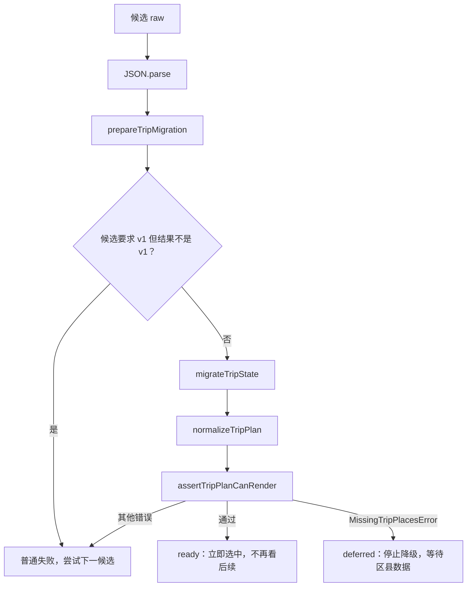
```mermaid
flowchart TD
  C["候选 raw"] --> JSON["JSON.parse"]
  JSON --> PREP["prepareTripMigration"]
  PREP --> LEGACY{"候选要求 v1 但结果不是 v1？"}
  LEGACY -->|是| FAIL["普通失败，尝试下一候选"]
  LEGACY -->|否| MIGRATE["migrateTripState"]
  MIGRATE --> NORMAL["normalizeTripPlan"]
  NORMAL --> RENDER["assertTripPlanCanRender"]
  RENDER -->|通过| READY["ready：立即选中，不再看后续"]
  RENDER -->|MissingTripPlacesError| DEFER["deferred：停止降级，等待区县数据"]
  RENDER -->|其他错误| FAIL
```

“缺地点时停止降级”很关键。假设分享链接包含福清，而首屏尚未加载区县；若直接降级到本机旧计划，用户打开的分享内容会被悄悄忽略。延迟水合完成后，第 10 章的 `hydrateDeferredSummaries()` 会重试恢复。

### 11.2 迁移 pending 读取

函数先调用 `legacyMigrationPending()`。读取 localStorage 也可能抛错：

- catch 后把 pending 设为 false；
- 在 failures 中记录“旧版迁移状态读取失败”；
- 继续尝试其他恢复来源。

存储元信息失败不会立即让整个恢复崩溃。

### 11.3 recovery 的三种状态

| 状态 | app 层行为 |
| --- | --- |
| `deferred` | 显示 pending，返回来源和缺失地点 ID |
| `ready` | 把唯一胜出候选放入后续提交流程 |
| `unavailable` | 没有候选可用，最后显示自动保存或失败汇总 |

ready 之后仍使用 `for...of`，但数组最多只有一个元素。这个循环是旧结构残留；直接处理 `recovery.candidate` 会更清楚。

### 11.4 旧版候选为什么先备份

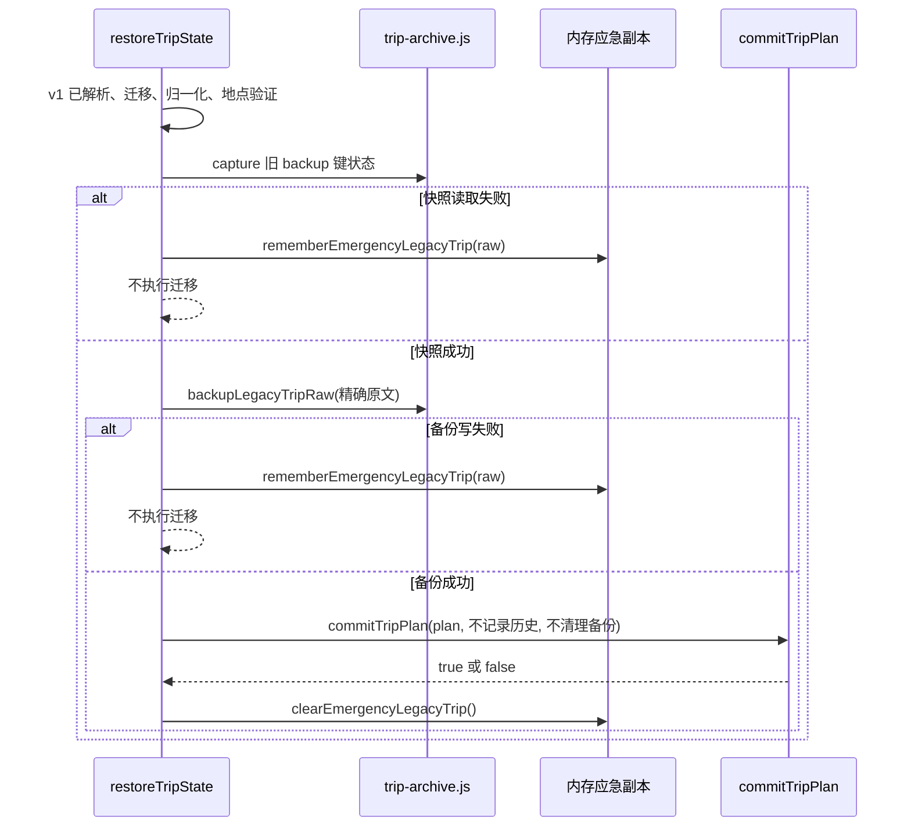
```mermaid
sequenceDiagram
  participant R as restoreTripState
  participant A as trip-archive.js
  participant M as 内存应急副本
  participant C as commitTripPlan

  R->>R: v1 已解析、迁移、归一化、地点验证
  R->>A: capture 旧 backup 键状态
  alt 快照读取失败
    R->>M: rememberEmergencyLegacyTrip(raw)
    R-->>R: 不执行迁移
  else 快照成功
    R->>A: backupLegacyTripRaw(精确原文)
    alt 备份写失败
      R->>M: rememberEmergencyLegacyTrip(raw)
      R-->>R: 不执行迁移
    else 备份成功
      R->>C: commitTripPlan(plan, 不记录历史, 不清理备份)
      C-->>R: true 或 false
      R->>M: clearEmergencyLegacyTrip()
    end
  end
```

注意顺序：v1 必须先完整验证，避免把垃圾写成“迁移备份”；但真正提交 v2 前，精确原文必须已经安全保存。

### 11.5 提交结果为什么有两个“恢复成功”

`commitTripPlan()` 返回：

- true：v2 写入成功，可能仅 hash 清理有警告；
- false：v2 写入失败，但计划已经进入内存并渲染。

恢复函数分别返回：

```js
{ status: "restored", source }
{ status: "restored-with-persistence-error", source }
```

这是有意保留内容，不是忘记回滚。用户至少能在当前页面看到并导出恢复出的行程。

### 11.6 catch 中的备份回滚边界

只有 `backupTouched && !commitAttempted` 时，函数回滚旧 backup 键。进入 `commitTripPlan()` 后发生的失败不在这里恢复计划，因为恢复本身没有要保护的“当前用户编辑事务”。

若备份回滚也失败：

- pending 保持 true；
- 原始 v1 放入内存应急副本；
- failures 增加回滚失败。

### 11.7 最终错误汇总

有 failures 时：

- 判断是否包含“备份”或“读取失败”；
- 若有应急 v1，建议立即导出；
- 若是存储读取失败，建议保持页面打开并检查权限；
- 强调当前行程未改变。

没有候选也没有失败时，显示“行程会自动保存到本机”。

当前 messages 混有中文和 `read failed / invalid` 英文，这是边界层可见的国际化缺口。

## 12. JSON 文件导出：第 1881–1909 行

### 12.1 `downloadTripFile(plan)`

用于“分享内容过长”的 v2 路径：

1. `tripFileName(plan, new Date())` 建 `.trip.json` 文件名；
2. `tripFileText(plan)` 序列化；
3. `downloadTextFile()` 触发下载；
4. 返回文件名供消息显示。

### 12.2 `exportTripFile()`

显式“导出行程”按钮使用更完整的 `tripFileExportPayload()`：

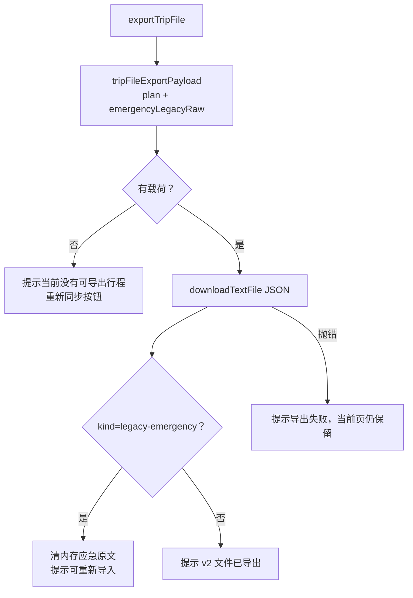
```mermaid
flowchart TD
  A["exportTripFile"] --> PAY["tripFileExportPayload<br/>plan + emergencyLegacyRaw"]
  PAY --> NONE{"有载荷？"}
  NONE -->|否| ERR["提示当前没有可导出行程<br/>重新同步按钮"]
  NONE -->|是| DL["downloadTextFile JSON"]
  DL --> KIND{"kind=legacy-emergency？"}
  KIND -->|是| CLEAR["清内存应急原文<br/>提示可重新导入"]
  KIND -->|否| V2["提示 v2 文件已导出"]
  DL -->|抛错| FAIL["提示导出失败，当前页仍保留"]
```

应急 v1 优先于当前 v2，因为它存在的原因就是浏览器无法安全备份旧原文；用户最需要先把不可替代的旧来源拿走。成功下载后立即清空应急内存，假设浏览器已接受下载动作。

## 13. 分享链接：第 1911–1968 行

### 13.1 `copyShareLink()` 的完整决策

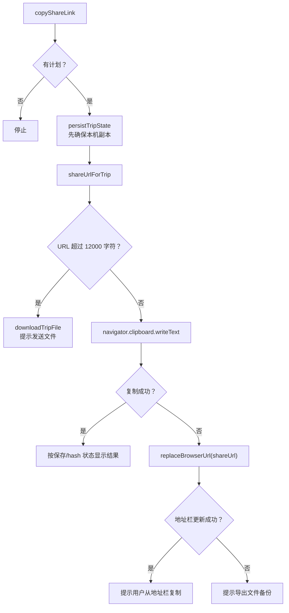
```mermaid
flowchart TD
  A["copyShareLink"] --> HAS{"有计划？"}
  HAS -->|否| STOP["停止"]
  HAS -->|是| SAVE["persistTripState<br/>先确保本机副本"]
  SAVE --> URL["shareUrlForTrip"]
  URL --> LONG{"URL 超过 12000 字符？"}
  LONG -->|是| FILE["downloadTripFile<br/>提示发送文件"]
  LONG -->|否| CLIP["navigator.clipboard.writeText"]
  CLIP --> COPIED{"复制成功？"}
  COPIED -->|是| MSG["按保存/hash 状态显示结果"]
  COPIED -->|否| ADDRESS["replaceBrowserUrl(shareUrl)"]
  ADDRESS --> UPDATED{"地址栏更新成功？"}
  UPDATED -->|是| FALLBACK["提示用户从地址栏复制"]
  UPDATED -->|否| FAIL["提示导出文件备份"]
```

### 13.2 为什么先保存，再生成分享 URL

`persistTripState()` 会先写 v2，再清理地址栏已有的旧 `#trip`。随后用最新 `window.location.href` 生成分享 URL，避免在旧分享快照上继续叠加。

### 13.3 大内容为什么改用文件

`shouldUseTripFile()` 在最终 URL 超过 12,000 字符时返回 true。地址栏、聊天软件和二维码对超长链接支持不一致；文件更可靠，也避免浏览器在复制/导航时截断 JSON。

### 13.4 剪贴板失败为何修改地址栏

Clipboard API 可能因非 HTTPS、权限或用户设置失败。短链接仍可放入当前地址栏，让用户手动复制。使用 `replaceState` 不刷新页面。

这一 fallback 会改变当前页面 URL，但不会把浏览器历史增加一项。若地址栏也无法更新，当前计划完全不受影响。

## 14. 文件导入事务：第 1970–2055 行

### 14.1 正常路径

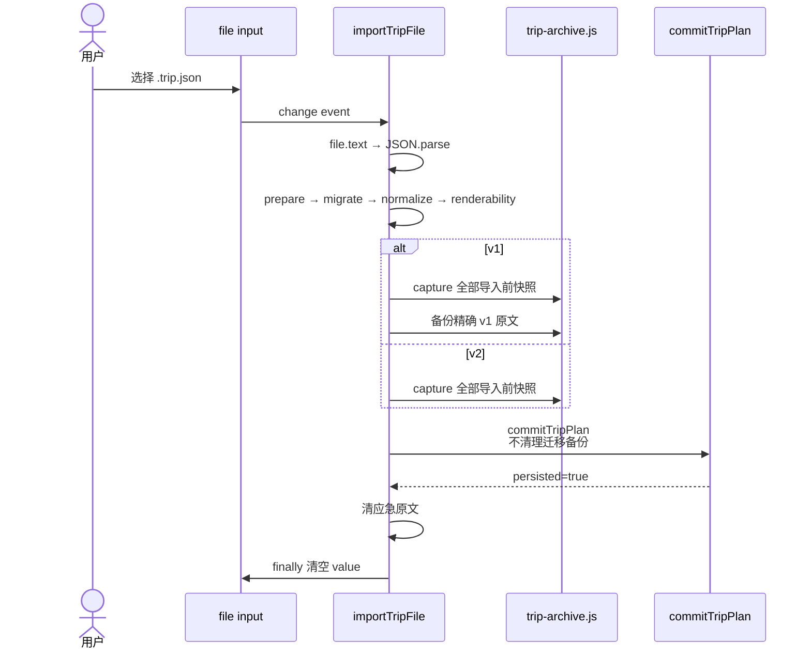
```mermaid
sequenceDiagram
  actor User as 用户
  participant Input as file input
  participant App as importTripFile
  participant Archive as trip-archive.js
  participant Commit as commitTripPlan

  User->>Input: 选择 .trip.json
  Input->>App: change event
  App->>App: file.text → JSON.parse
  App->>App: prepare → migrate → normalize → renderability
  alt v1
    App->>Archive: capture 全部导入前快照
    App->>Archive: 备份精确 v1 原文
  else v2
    App->>Archive: capture 全部导入前快照
  end
  App->>Commit: commitTripPlan<br/>不清理迁移备份
  Commit-->>App: persisted=true
  App->>App: 清应急原文
  App->>Input: finally 清空 value
```

### 14.2 四类 failureReason

| 值 | 发生位置 | 面向用户的含义 |
| --- | --- | --- |
| `invalid` | 读文件、JSON、版本、迁移、归一化、地点验证 | 文件无效，旧状态未改 |
| `backup` | v1 快照读取或精确原文写入失败 | 不执行导入，要求先导出应急 v1 |
| `storage` | v2 导入前快照读取失败 | 无法保证安全回滚，所以不导入 |
| `commit` | 已开始提交但 v2 保存失败/抛错 | 回滚计划、历史和存档 |

### 14.3 为什么 v1 更早拍快照

v1 在写迁移备份前就可能改变 localStorage，所以必须先拍快照；v2 不需要写 v1 backup，只要在提交前拍即可。

### 14.4 `backupTouched` 与 `commitAttempted`

两个布尔值决定回滚范围：

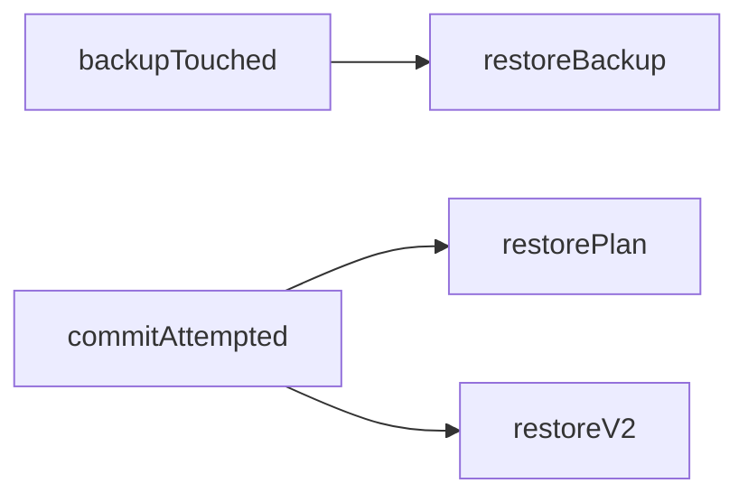
```mermaid
flowchart LR
  B["backupTouched"] --> RB["restoreBackup"]
  C["commitAttempted"] --> RP["restorePlan"]
  C --> RV2["restoreV2"]
```

- 备份写过，恢复旧 backup 键；
- 提交开始过，恢复内存/UI 和 v2；
- 没碰过的域不做无意义写入。

### 14.5 提交为何把持久化失败当成整个导入失败

普通编辑可以留在当前页；导入若只进入内存却没保存，用户可能误以为刷新后仍存在。因此：

```js
if (!committed) {
  throw new Error("trip import commit failed");
}
```

catch 随即使用快照回滚。这就是导入与启动恢复的核心语义差异。

### 14.6 回滚也可能失败

`rollbackTripImportSnapshot()` 逐键写存储、重画 UI，任何一部分失败就返回 false。消息不再声称“状态未更改”，而是明确“无法完全恢复”，并根据当前是否仍可导出给出下一步。

### 14.7 为什么 finally 清空 file input

浏览器通常只在文件选择值变化时触发 change。若导入失败后用户再次选择同一文件，未清空 input 可能不触发事件。`finally` 保证每条路径都允许重试。

## 15. 状态文字与格式化：第 2057–2106 行

### 15.1 `updateArchiveStatus(message, tone)`

安全地用 `textContent` 写消息，并把 class 重置为：

```text
archive-status
archive-status success
archive-status error
archive-status pending
```

重设完整 className 可避免上一次 error 与下一次 success 同时残留。

### 15.2 `placeContext(place)`

- 空地点 → 空字符串；
- 区县 → “上级城市或省份 / 区县名”；
- 城市 → 省份。

它用于选择提示与路线状态，为同名区县提供上级上下文。

### 15.3 `statusLabel(route)`

- success：交通标签 + 成功文字；
- error：优先 route.error，否则 fallback 文案；
- 其他：loading。

未知 status 会被当作 loading；这是宽容策略，也可能掩盖新增状态未适配。

### 15.4 `routeMeta(route, index)`

先取“第 N 段”前缀：

- loading → 正在计算；
- 没 metrics → 待计算；
- 有 metrics → 交通方式、距离、时长。

它不单独显示 error 文本，错误详情由 `statusLabel()` 展示。

### 15.5 `hasMetrics(route)`

只检查 distance 和 duration 的 `typeof === "number"`。`NaN`、`Infinity`、负数也会通过，这是一个真实边界缺口。地图控制器当前产生有限非负值，但该 helper 本身不安全。

更稳妥：

```js
Number.isFinite(route.distance) &&
route.distance >= 0 &&
Number.isFinite(route.duration) &&
route.duration >= 0
```

### 15.6 `formatDistance(meters)`

- 100 km 及以上：四舍五入到整数 km，并使用中文千位分隔；
- 更短：保留一位小数。

### 15.7 `formatDuration(seconds)`

1. 秒转分钟并四舍五入，最低显示 1 分钟；
2. 小于 60 分钟只显示分钟；
3. 小于 24 小时显示小时和余分钟；
4. 24 小时以上显示天和余小时。

它假定输入有效。`NaN` 会最终生成带 NaN 的文案，再次说明校验应放在 `hasMetrics()`。

## 16. 地点索引与单击延迟：第 2108–2134 行

### 16.1 `cityById(id)` 与 `placeById(id)`

`cityById` 查城市 map；`placeById` 先查统一地点 map（城市、区县、运行时地点），再回退城市 map。双查是兼容旧状态索引的保护。

### 16.2 `queuePlaceClick(placeId)`

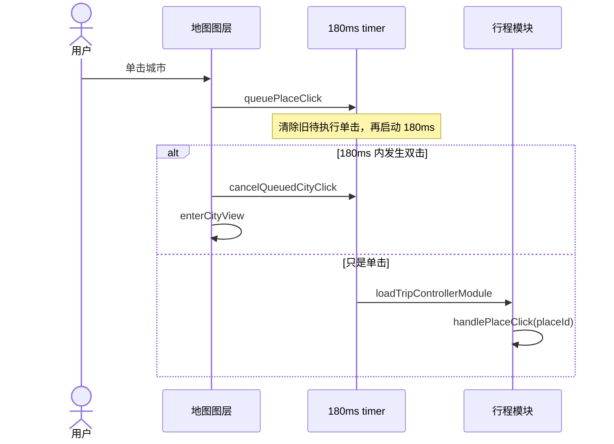
```mermaid
sequenceDiagram
  actor User as 用户
  participant Leaflet as 地图图层
  participant Timer as 180ms timer
  participant Trip as 行程模块

  User->>Leaflet: 单击城市
  Leaflet->>Timer: queuePlaceClick
  Note over Timer: 清除旧待执行单击，再启动 180ms
  alt 180ms 内发生双击
    Leaflet->>Timer: cancelQueuedCityClick
    Leaflet->>Leaflet: enterCityView
  else 只是单击
    Timer->>Trip: loadTripControllerModule
    Trip->>Trip: handlePlaceClick(placeId)
  end
```

定时器执行时先把 state 中 timer ID 清空，再加载行程模块。失败只写 console，没有在页面提供与 `queueTripAction()` 一致的加载错误提示。

### 16.3 `queueCityClick(cityId)`

单纯调用 `queuePlaceClick(cityId)`，是给地图控制器的城市专用兼容名字。

### 16.4 `cancelQueuedCityClick()`

有定时器才 clear 并置 null。进入城市详情、回全国视图、销毁地图都会调用，保证被双击取代的单击不会稍后把城市加入行程。

## 17. 城市详情适配器：第 2137–2197 行

### 17.1 `enterCityView(cityId)`

等待城市详情控制器加载，然后启动 `controller.enter(cityId)`，给该 Promise 单独挂失败报告，并立即返回 true。

它没有 `await controller.enter()`；因此 true 的准确含义是“控制器已加载且进入动作已发起”，不是“所有区县、车站、地铁和美食已完成”。

### 17.2 `exitCityView(options)`

控制器已加载就由它退出；否则直接调用地图控制器 `enterChinaView`。即使懒模块没到，也能回全国视图。

### 17.3 `loadCityDetail(city, detailSession)`

等待控制器并等待真正的 `controller.load`；失败报告后返回 false。`detailSession` 用于拒绝已经切换城市后的陈旧异步结果。

### 17.4 `citySubareas(city)`

控制器存在时委托；否则：

1. 从已水合 counties 找 parentCityId 相同且有坐标的区县；
2. 有直接区县就返回；
3. 对 region 类型，回退到同省其他城市；
4. 否则空数组。

### 17.5 `cityLandmarks(city)`

控制器存在就取地标；不存在则调度懒模块刷新并暂时返回空数组。它是“先给可用空结果，模块到达后重画”的渐进增强。

### 17.6 `cityDetailCounts(city)`

控制器存在就委托；否则调度加载，并用当前共享 state 拼一个降级计数对象：区县、活动地标、车站、地铁站、美食文章。

### 17.7 `ensureCityCounties(cityId, options)`

控制器成功时确保城市区县数据；失败时报告并回退 `citySubareas(cityById(cityId))`，让已有摘要数据仍可用。

## 18. 配置、按钮和路线动作：第 2199–2314 行

### 18.1 `hasCoordinates(place)`

用 `Number()` 转换 lon/lat，再要求 `Number.isFinite`。这允许数字字符串；但空字符串会转成 0，若外部数据存在 `lon: ""`、`lat: ""`，会被误判为有效坐标。更严格应先拒绝 null 和空白字符串。

### 18.2 `transportProfile(mode)` 与 `tripPaceProfile(mode)`

分别从配置表取 profile；未知值回退高铁和标准节奏。所有显示/计算通过适配器取默认值，避免到处重复 fallback。

### 18.3 `setTransportMode(mode)`

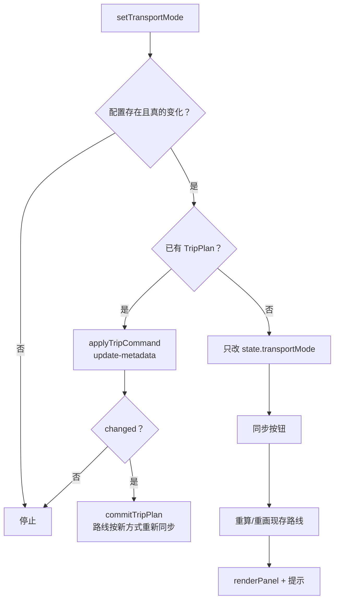
```mermaid
flowchart TD
  A["setTransportMode"] --> VALID{"配置存在且真的变化？"}
  VALID -->|否| STOP["停止"]
  VALID -->|是| PLAN{"已有 TripPlan？"}
  PLAN -->|是| CMD["applyTripCommand<br/>update-metadata"]
  CMD --> CHANGED{"changed？"}
  CHANGED -->|是| COMMIT["commitTripPlan<br/>路线按新方式重新同步"]
  CHANGED -->|否| STOP
  PLAN -->|否| STATE["只改 state.transportMode"]
  STATE --> BTN["同步按钮"]
  BTN --> RECALC["重算/重画现存路线"]
  RECALC --> PANEL["renderPanel + 提示"]
```

有计划时走规则命令，交通方式成为可保存元数据；无计划时只是未来创建计划的默认偏好。

### 18.4 `setTripPace(pace)`

先验证并更新 `state.tripPace`、按钮；有计划时深复制计划，直接改 `pace` 与 `savedAt`，再提交；没有计划只重画和提示。

它与交通方式不一致：交通走 `applyTripCommand()`，节奏直接 clone。两条路径都有效，但规则所有权不统一。更好是都发 `update-metadata` 命令。

### 18.5 `syncTransportButtons()` 与 `syncPaceButtons()`

遍历按钮：

- data 值等于当前 state 就切换 `active`；
- 同步 `aria-checked` 字符串。

视觉状态与辅助技术状态来自同一布尔值。

### 18.6 `handlePlaceClick(placeId)`

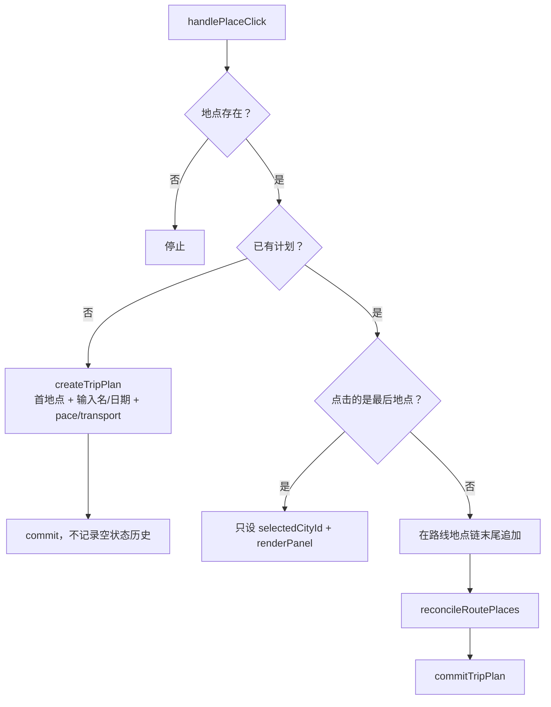
```mermaid
flowchart TD
  A["handlePlaceClick"] --> PLACE{"地点存在？"}
  PLACE -->|否| STOP["停止"]
  PLACE -->|是| PLAN{"已有计划？"}
  PLAN -->|否| CREATE["createTripPlan<br/>首地点 + 输入名/日期 + pace/transport"]
  CREATE --> FIRST["commit，不记录空状态历史"]
  PLAN -->|是| LAST{"点击的是最后地点？"}
  LAST -->|是| SELECT["只设 selectedCityId + renderPanel"]
  LAST -->|否| IDS["在路线地点链末尾追加"]
  IDS --> REC["reconcileRoutePlaces"]
  REC --> COMMIT["commitTripPlan"]
```

第一次选择不把“没有计划”压入撤销历史。重复点击当前末点只刷新选择，不制造重复地点。回到先前城市则会作为新的路线 occurrence 加到末尾，由领域模块分配新 visit。

### 18.7 `handleCityClick(cityId)`

只是 `handlePlaceClick(cityId)` 的别名。全工程标识符计数只有定义本身；当前地图注入的是 `queueCityClick`，因此它是确定的无调用遗留函数，可安全删除（先保留回归测试）。

### 18.8 `undoRoute()`

- 没计划或不足两个地点时不做；
- 去掉地点链最后一项；
- `reconcileRoutePlaces` 若报告受保护删除，提示末尾地点有手工安排并停止；
- 否则提交并显示已撤销。

它不是第 11 章的 `undoTripEdit()`：前者只撤销最后一个路线地点，后者回到上一次完整 TripPlan 编辑快照。

### 18.9 `clearRoutes()`

清空编辑历史，再 `commitTripPlan(null, { recordHistory: false })`。提交链会清 routes、重画 UI，并调用 `clearPersistedTripState()` 清理所有本机存档与分享 hash。

没有确认、没有撤销、可能遇到存储部分删除失败；按钮虽然使用 danger 样式，仍建议增加确认与导出提醒。

## 19. 从运行态建立 GuideModel：第 2315–2386 行

### 19.1 `buildCurrentGuideModel()`

这是 `app.js` 与第 9 章 `guide-export.js` 的桥：

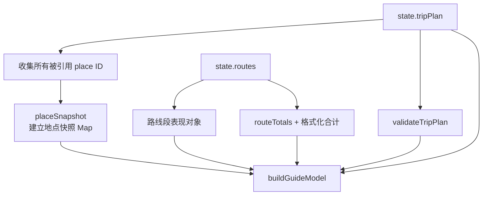
```mermaid
flowchart TB
  PLAN["state.tripPlan"] --> IDS["收集所有被引用 place ID"]
  IDS --> SNAP["placeSnapshot<br/>建立地点快照 Map"]
  ROUTES["state.routes"] --> SEG["路线段表现对象"]
  ROUTES --> TOTAL["routeTotals + 格式化合计"]
  PLAN --> WARN["validateTripPlan"]
  SNAP --> MODEL["buildGuideModel"]
  SEG --> MODEL
  TOTAL --> MODEL
  WARN --> MODEL
  PLAN --> MODEL
```

第一步先懒加载指南模块；若当前没有非空 days，抛错，调用者统一显示导出失败。

### 19.2 地点 ID 从哪里收集

每个 day 的：

- `cityEntries[].placeId`；
- `overnightPlaceId`；
- `items[].placeId`；
- `items[].fromPlaceId`；
- `items[].toPlaceId`；
- `lodging.placeId`。

使用 `Set` 保序去重。这样即使某活动或交通引用的地点不在当日城市条目里，导出仍尽可能带名称快照。

### 19.3 `placeSnapshots` 为什么是 Map

ID 是引用键，GuideModel 需要用 ID 快速查名称和上下文。只对当前计划实际引用的地点拍快照，避免把 371 个城市、全部区县和运行时详情都塞进导出模型。

查不到地点时不加入 Map；第 9 章渲染器会用 ID 或“未知地点”降级。正常提交与导入已经做一致性校验，缺失主要属于运行时异常。

### 19.4 route segment 转换

运行时路线 status 与导出表现不同：

| 运行时 | GuideModel status |
| --- | --- |
| `success` | `ready` |
| `loading` | “计算中” |
| `error` | “无法估算” |
| 其他 | 原值或“待计算” |

每段都保留起终点、交通标签、fallback、error。有 metrics 时写数值字段；没有时写已格式化的“待计算”字段。

### 19.5 totals 与 warnings

合计只使用已测路段，但 `segmentCount` 是全部路线数量；`dayCount` 来自计划。警告重新调用 `validateTripPlan(plan, { paceProfile })`，确保导出与页面当前节奏一致。

### 19.6 快照并不完全原子

函数先 `await loadGuideModule()`，随后读取 plan、place index 和 routes。外层导出还先 `await ensureFoodModuleForTrip()`。虽然大多数用户动作经过 `queueTripAction`，路线 metrics 回调可以在期间更新 `state.routes`；计划也可能被并发 async action 替换。

更稳妥做法是在导出动作最开始同步捕获：

```js
const snapshot = {
  plan: structuredClone(state.tripPlan),
  routes: structuredClone(state.routes),
  places: /* 所需地点快照 */
};
```

后续 await 和渲染都只读 snapshot。

## 20. 指南文件名与下载：第 2388–2461 行

### 20.1 `guideFileName(plan, extension)`

组合：

```text
安全行程名-UTC时间戳.md
安全行程名-UTC时间戳.html
```

`safeTripNameForFile()` 处理 Windows 非法字符、保留名、Unicode 和长度；`timestampForFile()` 替换冒号与小数点，保证文件系统兼容。

### 20.2 `exportMarkdownGuide()`

1. 无日历立即显示错误；
2. 等待美食模块；
3. 懒加载 `buildMarkdownGuide`；
4. 建唯一共享 GuideModel；
5. 生成 Markdown；
6. 建文件名并以 `text/markdown;charset=utf-8` 下载；
7. 成功或 catch 后显示状态。

### 20.3 `exportPrintableHtmlGuide()`

流程相同，只换：

- `buildPrintableHtml`；
- `html` 扩展名；
- `text/html;charset=utf-8` MIME。

两个导出都复用同一模型构建器，因此内容事实保持一致，格式差异留给第 9 章两个渲染器。

### 20.4 为什么等待美食模块值得质疑

当前 `buildCurrentGuideModel()` 没有从 `foodController` 读取任何美食建议，GuideModel 也只来自计划、地点快照、警告和路线。`ensureFoodModuleForTrip()` 失败会被内部吞掉并返回 null，导出继续。

这次 await 只增加首次导出的网络等待，没有贡献数据。若未来确实加入美食章节，应显式把美食快照传给 GuideModel；否则应删除等待。

### 20.5 `downloadTextFile(text, filename, type)`


```mermaid
flowchart LR
  TEXT["字符串"] --> BLOB["new Blob"]
  BLOB --> URL["createObjectURL"]
  URL --> A["临时 a<br/>href + download"]
  A --> DOM["append → click → remove"]
  DOM --> REVOKE["revokeObjectURL"]
```

它同步 revoke。主流浏览器在 click 已排队后可以下载；若要覆盖某些旧 Safari 行为，可在下一任务再 revoke。

### 20.6 `placeSnapshot(place)`

只复制导出需要的稳定字段：

- id、name、province、pinyin；
- lon、lat；
- placeType，缺失默认 city；
- parentCityId、parentCityName，缺失为 null。

不把地图 marker、Leaflet layer、缓存或控制器引用带入 GuideModel。

### 20.7 `timestampForFile()`

用当前时间的 ISO UTC 字符串，并把 `:` 与 `.` 换成连字符。例如：

```text
2026-07-22T10-20-30-123Z
```

UTC 保证跨时区稳定，但用户看到的文件时间可能与北京时间相差 8 小时。若面向普通用户，可用本地时间生成可读文件名，同时保留排序友好的年月日顺序。

## 21. 延迟数据 readiness：第 2463–2482 行

### 21.1 `applyDeferredReadiness(status)`

- 把 `status.readiness` 写到 `html[data-app-ready]`；
- 有缺失数据集就写逗号列表；
- 无缺失就删除旧属性；
- 清除 `data-deferred-error`。

这表示“延迟水合完成并得到结构化结果”，即使结果是 degraded。

### 21.2 `applyDeferredInternalFailure(error)`

处理水合流程本身抛出的未知错误：

1. `state.deferredInternalError = true`；
2. readiness 强制 degraded；
3. 标记 `data-deferred-error="internal"`；
4. 保留已知 missing dataset 列表；
5. 重画操作警告；
6. console.warn 记录原始 error。

结构化缺失与内部异常使用不同 dataset，测试和诊断工具可以区分。

## 22. 应用启动：第 2484–2545 行

### 22.1 `initApp()` 的严格顺序

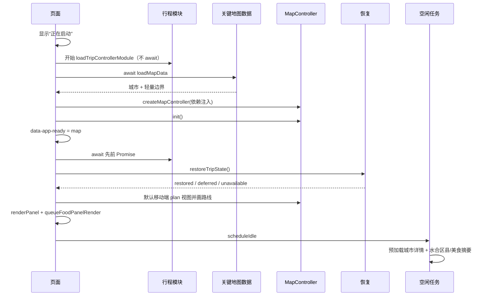
```mermaid
sequenceDiagram
  participant DOM as 页面
  participant Trip as 行程模块
  participant Data as 关键地图数据
  participant Map as MapController
  participant Archive as 恢复
  participant Idle as 空闲任务

  DOM->>DOM: 显示“正在启动”
  DOM->>Trip: 开始 loadTripControllerModule（不 await）
  DOM->>Data: await loadMapData
  Data-->>DOM: 城市 + 轻量边界
  DOM->>Map: createMapController(依赖注入)
  DOM->>Map: init()
  DOM->>DOM: data-app-ready = map
  DOM->>Trip: await 先前 Promise
  DOM->>Archive: restoreTripState()
  Archive-->>DOM: restored / deferred / unavailable
  DOM->>Map: 默认移动端 plan 视图并画路线
  DOM->>DOM: renderPanel + queueFoodPanelRender
  DOM->>Idle: scheduleIdle
  Idle->>Idle: 预加载城市详情 + 水合区县/美食摘要
```

测试精确校验了这些调用在函数体中的相对顺序。

### 22.2 为什么行程模块与地图数据并行启动

`const tripModuleLoading = loadTripControllerModule()` 先拿 Promise，不立即 await；同时加载关键地图 JSON。两个独立网络/模块任务重叠，缩短总等待。

地图数据先到就创建地图并设 readiness=map；然后才等待行程模块并恢复。浏览器性能测试证明可选摘要被人为阻塞时，地图仍已可操作。

### 22.3 MapController 注入了什么

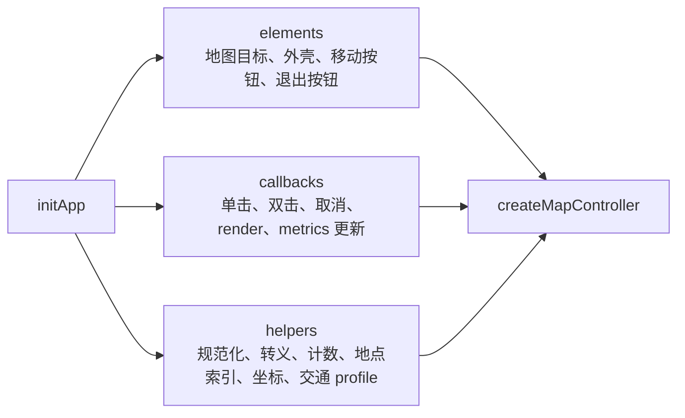
```mermaid
flowchart LR
  INIT["initApp"] --> E["elements<br/>地图目标、外壳、移动按钮、退出按钮"]
  INIT --> C["callbacks<br/>单击、双击、取消、render、metrics 更新"]
  INIT --> H["helpers<br/>规范化、转义、计数、地点索引、坐标、交通 profile"]
  E --> MAP["createMapController"]
  C --> MAP
  H --> MAP
```

地图模块不 import `app.js`，而是通过注入调用页面能力，避免循环依赖。

### 22.4 `routeMetricsUpdated` 回调

每当一段路线 metrics 更新：

1. `renderPanel()`；
2. `persistTripState()`。

TripPlan 本身不保存 metrics，所以第二步通常只是重写同一份计划并刷新状态/hash。多段路线逐一完成会产生多次同步 localStorage 写和全量重绘。更好是：

- metrics 更新只刷新路线投影；
- 对持久化做去重，计划内容没变就不写；
- 或明确把可缓存 metrics 存到独立 route cache。

### 22.5 注入的 transportProfile 箭头

返回 profile 所有字段，并补一个规范化 mode；未知 mode 使用 highspeed。地图控制器因此始终得到“显示参数 + 实际规范 mode”的完整对象。

### 22.6 恢复为什么在区县水合前

大多数计划只含首屏城市，可立即恢复。若确实引用区县，`MissingTripPlacesError` 让恢复返回 deferred，并把 `shouldRetryTripRestoreAfterCountyHydration` 设为 true；区县摘要到达后只重试那一种情况。

### 22.7 idle 回调

同一空闲任务里：

- 预加载城市详情控制器，失败单独报告；
- 水合区县与美食摘要；
- 正常完成交给 `applyDeferredReadiness`；
- 未知异常交给 `applyDeferredInternalFailure`。

城市详情加载 Promise 没有被等待，因此不阻塞摘要 readiness。

### 22.8 关键启动 catch

任何 try 内关键步骤抛错：

- console.error；
- 标题变“地图渲染启动失败”；
- hint 显示 error.message；
- 城市计数归零。

它没有设置明确的 `data-app-ready="failed"`，也没有重试按钮；自动化或辅助工具可能只能从文字推断失败。正式 readiness 状态机应增加 failed 和原因。

## 23. 文件末尾的事件接线：第 2547–2591 行

### 23.1 为什么接线放在函数外

脚本位于 HTML body 尾部，DOM 已建立；模块求值时立即挂监听，再调用 `initApp()`。用户极快点击时，大多数行程动作仍会通过 `queueTripAction()` 等模块加载。

### 23.2 事件总图

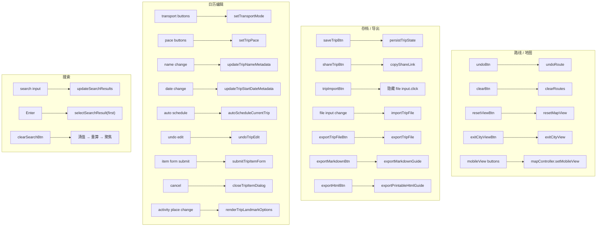
```mermaid
flowchart TB
  subgraph ROUTE["路线 / 地图"]
    U["undoBtn"] --> UR["undoRoute"]
    C["clearBtn"] --> CR["clearRoutes"]
    R["resetViewBtn"] --> RV["resetMapView"]
    X["exitCityViewBtn"] --> XV["exitCityView"]
    MV["mobileView buttons"] --> MVS["mapController.setMobileView"]
  end

  subgraph ARCH["存档 / 导出"]
    S["saveTripBtn"] --> PS["persistTripState"]
    SH["shareTripBtn"] --> CSL["copyShareLink"]
    IB["tripImportBtn"] --> FI["隐藏 file input.click"]
    IF["file input change"] --> IMP["importTripFile"]
    J["exportTripFileBtn"] --> EXJ["exportTripFile"]
    MD["exportMarkdownBtn"] --> EXM["exportMarkdownGuide"]
    HT["exportHtmlBtn"] --> EXH["exportPrintableHtmlGuide"]
  end

  subgraph EDIT["日历编辑"]
    T["transport buttons"] --> STM["setTransportMode"]
    P["pace buttons"] --> STP["setTripPace"]
    N["name change"] --> UN["updateTripNameMetadata"]
    D["date change"] --> UD["updateTripStartDateMetadata"]
    A["auto schedule"] --> AS["autoScheduleCurrentTrip"]
    UE["undo edit"] --> UTE["undoTripEdit"]
    F["item form submit"] --> SF["submitTripItemForm"]
    FC["cancel"] --> CD["closeTripItemDialog"]
    PL["activity place change"] --> LO["renderTripLandmarkOptions"]
  end

  subgraph SEARCH["搜索"]
    SI["search input"] --> US["updateSearchResults"]
    KE["Enter"] --> FIRST["selectSearchResult(first)"]
    CS["clearSearchBtn"] --> CLR["清值 → 重算 → 聚焦"]
  end
```

### 23.3 哪些动作经过 `queueTripAction`

经过：

- 路线撤销、清空；
- 手动保存、分享、导入、三种导出；
- 交通、节奏、名称、日期、自动排期、编辑撤销；
- 表单提交、取消、活动地点候选刷新。

不经过：

- 重置地图、退出城市视图、移动端面板切换；
- 搜索 input/Enter/清空。

后一组不依赖 TripPlan 懒模块，直接执行更快。

### 23.4 表单 submit 为什么 prevent 两次

外层事件回调先 `event.preventDefault()`，`submitTripItemForm(event)` 内又调用一次。`preventDefault` 是幂等的，不会出错，但属于重复责任。保留一处即可；更清晰的是外层阻止浏览器，内层只处理业务值。

### 23.5 活动地点变化

place select change 后，通过 queue 等待行程模块；只有隐藏 type 控件值是 activity 才重建地标 datalist。住宿也使用同一地点 select，但不需要地标建议。

### 23.6 搜索 Enter

只有 Enter 且有结果才阻止默认行为，直接选择排序第一项。它没有 await/catch `selectSearchResult()` 返回的 Promise；该函数内部对流程做 await，但若出现未捕获异常，事件层可能产生 unhandled rejection。点击搜索结果的处理器同样应统一错误边界。

### 23.7 清空搜索

清 input，立即重算空结果，再把焦点留在搜索框，便于键盘用户继续输入。

## 24. 60 个函数声明逐一登记

| 行 | 函数 | 输入 → 输出 / 副作用 |
| ---: | --- | --- |
| 1538 | `hasSerializableTrip` | 当前 state → 是否存在可保存计划 |
| 1542 | `syncTripArchiveControls` | 当前计划/应急原文 → 同步保存、分享、导出按钮 |
| 1557 | `rememberEmergencyLegacyTrip` | v1 原文 → 验证后暂存内存并刷新按钮 |
| 1564 | `clearEmergencyLegacyTrip` | 无参数 → 清应急原文并刷新按钮 |
| 1569 | `archiveFailureGuidance` | 当前可导出能力 → 恢复指导文字 |
| 1579 | `replaceBrowserUrl` | URL → `history.replaceState` |
| 1583 | `persistTripState` | 消息 → 写 v2、退役 hash、报告结果 |
| 1606 | `finalizeLegacyTripBackup` | 消息 → 删除旧 v1/备份或保持 pending |
| 1624 | `clearPersistedTripState` | 无参数 → 清所有存档与 hash，返回完整成功 |
| 1642 | `isTripStateRecord` | 任意值 → 是否为非数组对象 |
| 1646 | `prepareTripMigration` | 解析数据 + legacy 权限 → 迁移输入、类型、pace profile |
| 1671 | `assertTripPlanCanRender` | plan → 验证地点可识别或抛专用错误 |
| 1686 | `captureTripImportSnapshot` | 无参数 → 内存、路线、存储和控制状态快照 |
| 1702 | `rollbackTripImportSnapshot` | 快照 + 恢复范围 → 尽力恢复并返回布尔值 |
| 1744 | `restoredTripMessage` | 来源 + 先前失败 Set → 恢复结果文字 |
| 1753 | `restoreTripState` | 无参数 → 恢复状态对象并可能提交计划 |
| 1881 | `downloadTripFile` | v2 plan → 下载 JSON 并返回文件名 |
| 1887 | `exportTripFile` | 无参数 → 优先导出应急 v1 或当前 v2 |
| 1911 | `copyShareLink` | 无参数 → 保存、短链复制/地址栏或长内容文件 |
| 1970 | `importTripFile` | file change event → 验证、备份、提交或回滚 |
| 2057 | `updateArchiveStatus` | 消息 + tone → 安全更新状态 DOM |
| 2063 | `placeContext` | place → 省份或“上级 / 区县” |
| 2069 | `statusLabel` | route → 成功、错误或 loading 文案 |
| 2075 | `routeMeta` | route + 下标 → 分段距离/时长摘要 |
| 2084 | `hasMetrics` | route → distance/duration 是否为 number |
| 2088 | `formatDistance` | 米 → 整数或一位小数 km |
| 2093 | `formatDuration` | 秒 → 分钟、小时或天文字 |
| 2108 | `cityById` | ID → 城市对象 |
| 2112 | `placeById` | ID → 统一地点或城市对象 |
| 2116 | `queuePlaceClick` | place ID → 延迟 180ms 加入行程 |
| 2126 | `queueCityClick` | city ID → 委托地点单击 |
| 2130 | `cancelQueuedCityClick` | 无参数 → 取消待执行单击 |
| 2137 | `enterCityView` | city ID → 发起详情进入，返回是否启动 |
| 2148 | `exitCityView` | 选项 → 控制器或地图退出城市视图 |
| 2153 | `loadCityDetail` | city + session → 等待详情加载或 false |
| 2163 | `citySubareas` | city → 控制器区县或摘要 fallback |
| 2171 | `cityLandmarks` | city → 地标或空数组并调度模块 |
| 2177 | `cityDetailCounts` | city → 完整或降级详情计数 |
| 2189 | `ensureCityCounties` | city ID + 选项 → 确保区县或已有 fallback |
| 2199 | `hasCoordinates` | place → lon/lat 是否可转有限数 |
| 2203 | `transportProfile` | mode → 配置或 highspeed 默认 |
| 2207 | `tripPaceProfile` | mode → 节奏配置或 standard 默认 |
| 2211 | `setTransportMode` | mode → 更新偏好或计划元数据并提交 |
| 2233 | `setTripPace` | pace → 更新偏好/计划副本并提交 |
| 2250 | `syncTransportButtons` | 无参数 → active 与 aria-checked |
| 2258 | `syncPaceButtons` | 无参数 → active 与 aria-checked |
| 2266 | `handlePlaceClick` | place ID → 创建、选择或扩展 TripPlan |
| 2294 | `handleCityClick` | city ID → 无调用的旧别名 |
| 2298 | `undoRoute` | 无参数 → 删除路线末点或阻止 |
| 2310 | `clearRoutes` | 无参数 → 清历史并提交 null |
| 2315 | `buildCurrentGuideModel` | 当前运行态 → GuideModel |
| 2388 | `guideFileName` | plan + 扩展名 → 安全文件名 |
| 2392 | `exportMarkdownGuide` | 无参数 → 建模型并下载 Markdown |
| 2412 | `exportPrintableHtmlGuide` | 无参数 → 建模型并下载独立 HTML |
| 2432 | `downloadTextFile` | 文本 + 文件名 + MIME → 浏览器下载 |
| 2444 | `placeSnapshot` | place → 可序列化导出快照 |
| 2459 | `timestampForFile` | 当前时间 → 文件安全 UTC 字符串 |
| 2463 | `applyDeferredReadiness` | 水合状态 → readiness/missing dataset |
| 2473 | `applyDeferredInternalFailure` | error → degraded、警告、console |
| 2484 | `initApp` | 无参数 → 组合并启动整个应用 |

## 25. 66 个箭头函数逐一登记

表中的“序号 + 行号”用于区分同一源码行里的多层回调。

| # | 行 | 所在位置 | 每次回调做什么 |
| ---: | ---: | --- | --- |
| 1 | 1631 | `failedKeys.some` | 判断失败键是不是旧 v1 或迁移备份 |
| 2 | 1673 | `missingPlaceIds.filter` | 选出地点索引无法识别的 place ID |
| 3 | 1766 | recovery evaluator | 解析、准备、迁移、归一化并检查一个候选 |
| 4 | 1778 | `recovery.failures.forEach` | 把候选读失败/无效加入页面 failures Set |
| 5 | 1864 | `backupFailure.some` | 判断任一失败文字是否含“备份” |
| 6 | 1865 | `storageFailure.some` | 判断任一失败文字是否含“读取失败” |
| 7 | 2118 | 180ms timer | 清 timer，再懒加载行程模块并处理地点 |
| 8 | 2121 | module `then` | 模块就绪后调用 `handlePlaceClick(placeId)` |
| 9 | 2122 | module `catch` | 将行程控制器加载错误写入 console |
| 10 | 2165 | counties `filter` | 取当前城市直属且有坐标的区县 |
| 11 | 2167 | region cities `filter` | 取同省但不是当前 region 自身的城市 |
| 12 | 2251 | transportButtons `forEach` | 同步一个交通按钮 active 与 aria-checked |
| 13 | 2259 | paceButtons `forEach` | 同步一个节奏按钮 active 与 aria-checked |
| 14 | 2323 | `addPlaceId` | 非空字符串地点 ID 加入 Set |
| 15 | 2326 | `plan.days.forEach` | 收集一天所有地点引用 |
| 16 | 2327 | `cityEntries.forEach` | 收集一个城市条目的 placeId |
| 17 | 2329 | `items.forEach` | 收集 item 的 place/from/to ID |
| 18 | 2338 | referenced IDs `forEach` | 建地点快照并按 ID 写入 Map |
| 19 | 2343 | `state.routes.map` | 把运行时 route 转成导出 segment |
| 20 | 2505 | `routeMetricsUpdated` | 路线结果变化后重画面板并持久化 |
| 21 | 2517 | 注入 `transportProfile` | 合并 profile 并规范化 mode |
| 22 | 2532 | `scheduleIdle` | 预加载城市详情并水合延迟摘要 |
| 23 | 2535 | 水合 `then` | 把结构化状态应用到 readiness |
| 24 | 2536 | 水合 `catch` | 把未知异常应用为 degraded |
| 25 | 2547 | undo click listener | 把路线撤销交给 `queueTripAction` |
| 26 | 2547 | undo action | 真正调用 `undoRoute()` |
| 27 | 2548 | clear click listener | 把清空交给 `queueTripAction` |
| 28 | 2548 | clear action | 真正调用 `clearRoutes()` |
| 29 | 2550 | save click listener | 把手动保存交给 `queueTripAction` |
| 30 | 2550 | save action | 调 `persistTripState` 并使用手动保存消息 |
| 31 | 2551 | share click listener | 把分享交给 `queueTripAction` |
| 32 | 2551 | share action | 调 async `copyShareLink()` |
| 33 | 2553 | import button listener | 代理点击隐藏 file input |
| 34 | 2555 | file change listener | 保存 event 并把导入交给模块就绪动作 |
| 35 | 2555 | import action | 调 `importTripFile(event)` |
| 36 | 2556 | JSON export listener | 把 JSON 导出交给 `queueTripAction` |
| 37 | 2556 | JSON export action | 调 `exportTripFile()` |
| 38 | 2557 | Markdown listener | 把 Markdown 导出交给 queue |
| 39 | 2557 | Markdown action | 调 `exportMarkdownGuide()` |
| 40 | 2558 | HTML listener | 把 HTML 导出交给 queue |
| 41 | 2558 | HTML action | 调 `exportPrintableHtmlGuide()` |
| 42 | 2559 | exit-city listener | 直接调 `exitCityView()` |
| 43 | 2560 | transport `forEach` | 为每个交通按钮注册 click |
| 44 | 2560 | transport click listener | 把设置交通方式交给 queue |
| 45 | 2560 | transport action | 读取按钮 dataset 并调 `setTransportMode` |
| 46 | 2561 | pace `forEach` | 为每个节奏按钮注册 click |
| 47 | 2561 | pace click listener | 把设置节奏交给 queue |
| 48 | 2561 | pace action | 读取按钮 dataset 并调 `setTripPace` |
| 49 | 2562 | mobile `forEach` | 为每个移动端视图按钮注册 click |
| 50 | 2562 | mobile click listener | 直接调 `mapController.setMobileView` |
| 51 | 2563 | name change listener | 把名称更新交给 queue |
| 52 | 2563 | name action | 调 `updateTripNameMetadata()` |
| 53 | 2564 | date change listener | 把日期更新交给 queue |
| 54 | 2564 | date action | 调 `updateTripStartDateMetadata()` |
| 55 | 2565 | auto-schedule listener | 把自动排期交给 queue |
| 56 | 2565 | auto-schedule action | 调 `autoScheduleCurrentTrip()` |
| 57 | 2566 | undo-edit listener | 把编辑撤销交给 queue |
| 58 | 2566 | undo-edit action | 调 `undoTripEdit()` |
| 59 | 2567 | form submit listener | 阻止默认提交并把表单处理交给 queue |
| 60 | 2569 | submit action | 调 `submitTripItemForm(event)` |
| 61 | 2571 | dialog cancel listener | 把关闭对话框交给 queue |
| 62 | 2571 | dialog cancel action | 调 `closeTripItemDialog()` |
| 63 | 2573 | place change listener | 把活动地标刷新交给 queue |
| 64 | 2574 | place change action | 仅活动类型重建当前地点的地标候选 |
| 65 | 2580 | search keydown listener | Enter 时选择排序第一条搜索结果 |
| 66 | 2585 | clear-search listener | 清输入、重算结果并重新聚焦 |

### 25.1 为什么事件区箭头数量突然变多

第 1538–2483 行只有 19 个箭头回调，第 2484–2591 行有 47 个。不是最后一百行突然拥有最多业务规则，而是事件式编程把“什么时候执行”也表达成函数。

业务函数与调度函数要分开阅读：

```mermaid
flowchart LR
  DOM["浏览器事件"] --> LISTENER["listener 回调<br/>捕获 event / button"]
  LISTENER --> READY["queueTripAction<br/>等待模块"]
  READY --> ACTION["action 回调"]
  ACTION --> BUSINESS["命名业务函数"]
```

## 26. 为什么当前设计这样形成

### 26.1 为什么存档规则在模块，事务编排在 app

`trip-archive.js` 能测试字符串、键、URL、快照和回滚，不应知道 DOM、地图或共享 state；`app.js` 知道用户当前工作、按钮和渲染顺序，所以负责决定“什么时候备份、哪些状态一起回滚、显示什么消息”。

### 26.2 为什么优先级是 hash → v2 → v1

- 用户打开分享链接，显式意图应高于这台机器原来的计划；
- 没分享时，当前 schema v2 高于待迁移 v1；
- 高优先级真正无效才降级；
- 只是缺延迟地点资料时不能当成无效。

### 26.3 为什么旧原文要逐字备份

重新 `JSON.stringify` 迁移后的对象会丢掉未知字段、原始空白和可能用于兼容的细节。精确 raw 才能让未来版本或人工工具重新尝试。

### 26.4 为什么地图层拿 callbacks 和 helpers

地图拥有 Leaflet 生命周期，但地点索引、行程模块和页面状态属于组合根。注入依赖能让 map-core 在 Node 测试中使用替身，也避免 map-core 反向 import app.js。

### 26.5 为什么事件先挂、最后才 init

模块脚本求值是同步的；监听器先存在，可以覆盖启动早期的用户输入。`initApp()` 是唯一主动启动点，所有前面函数只是定义和接线。

## 27. 更好的方案：按优先级改进

### 27.1 第一优先级：真正串行化破坏性行程动作

当前 `queueTripAction` 只等待模块，不等待上一个 action。可改为：

```js
let tripActionTail = Promise.resolve();

function enqueueTripAction(action) {
  const run = () => loadTripControllerModule().then(action);
  tripActionTail = tripActionTail.then(run, run);
  return tripActionTail.catch(reportTripActionFailure);
}
```

导入、清空、恢复、保存要么串行，要么使用 generation/互斥锁；纯导出可使用捕获快照并并发。

### 27.2 第二优先级：给导入事务独立协调器

把 `captureTripImportSnapshot`、`rollbackTripImportSnapshot` 和 `importTripFile` 移入可注入的 `createTripImportCoordinator`：

```mermaid
flowchart LR
  FILE["File text"] --> COORD["ImportCoordinator"]
  COORD --> DOMAIN["migrate / normalize / validate"]
  COORD --> ARCH["Archive transaction"]
  COORD --> APPLY["applyPlan callback"]
  COORD --> RESULT["结构化 ImportResult"]
  RESULT --> UI["app.js 只显示消息"]
```

Node 测试可以精确模拟每一步失败，不再依赖正则查看 app 源码。

### 27.3 第三优先级：建立明确 readiness 状态机

建议状态：

```mermaid
stateDiagram-v2
  [*] --> loadingCritical
  loadingCritical --> mapReady
  loadingCritical --> failed
  mapReady --> loadingOptional
  loadingOptional --> complete
  loadingOptional --> degraded
  degraded --> loadingOptional: 重试
  failed --> loadingCritical: 重试
```

每个状态带原因、可重试动作和时间戳；DOM dataset、用户提示、测试与日志读取同一个对象。

### 27.4 第四优先级：导出使用单一不可变快照

先同步捕获 plan、routes、places、warnings，再懒加载渲染器。文件名、Markdown/HTML 与模型必须读同一快照。删除目前无贡献的美食等待，或真正把美食内容加入模型。

### 27.5 第五优先级：持久化按计划版本去重

给 TripPlan 提交分配 revision，只有 revision 改变才写 localStorage。路线 metrics 属于独立状态，不应触发同一计划重复序列化；URL hash 退役也只需首次成功处理。

### 27.6 第六优先级：清空前确认并提供短期恢复

至少显示：

- 将清除当前计划、撤销历史、本机 v2、旧备份和分享 hash；
- 若有未安全保存/应急 v1，先建议导出；
- 支持 10–30 秒内“撤销清空”，或把删除改成带 expiry 的回收站记录。

### 27.7 第七优先级：统一配置命令

`setTransportMode` 与 `setTripPace` 都应发送 `update-metadata`，由同一领域函数更新 `savedAt`、校验是否变化并生成历史标签。

### 27.8 第八优先级：强化 metrics 和坐标验证

```js
function isNonNegativeFinite(value) {
  return Number.isFinite(value) && value >= 0;
}

function hasStrictCoordinates(place) {
  if (place?.lon === "" || place?.lat === "") return false;
  const lon = Number(place?.lon);
  const lat = Number(place?.lat);
  return Number.isFinite(lon) && lon >= -180 && lon <= 180 &&
    Number.isFinite(lat) && lat >= -90 && lat <= 90;
}
```

### 27.9 第九优先级：删除 `handleCityClick()`

它只有定义，没有任何引用。删除小函数本身收益不大，但能建立“调用图无入度遗留函数必须解释或移除”的代码卫生规则。

### 27.10 第十优先级：统一异步错误边界

`queuePlaceClick`、搜索 Enter、城市进入和各种 action 应返回结构化结果，由统一 reporter 区分：

- 模块加载失败；
- 用户数据错误；
- 存储失败；
- 网络降级；
- 未知程序异常。

不要把所有错误写 console，也不要把所有异常都误报成用户输入问题。

## 28. 测试证据与缺口

### 28.1 已有证据

| 测试 | 数量 | 证明范围 |
| --- | ---: | --- |
| `trip-archive.test.mjs` | 18 | 候选优先级、写入顺序、hash、备份、清除、快照回滚、文件名与应急载荷 |
| `guide-export.test.mjs` | 13 | GuideModel、Markdown/HTML 一致性、转义、路线和 totals |
| `rendered-html.test.mjs` | 26 | 页面控件、懒加载边界、启动顺序、恢复/导入接线、两种指南按钮、焦点与元数据 |
| `browser-performance.test.mjs` | 3 | 地图先于可选数据可用、路线编辑与所有导入导出路径、区县/美食/城市详情完整水合 |

完整默认测试还包括地点索引、地图、食记、TripPlan 和编辑器，共 200 项。

### 28.2 强证据

- archive 模块使用真实替身 storage 模拟逐键抛错；
- 浏览器测试真正下载 JSON、重新导入，再下载 Markdown 和 HTML；
- 启动性能测试故意阻塞区县/美食请求，确认 readiness=map 与 canvas 已可用；
- TripPlan 领域测试证明 protected removal 不会部分修改计划。

### 28.3 较弱证据

`rendered-html.test.mjs` 很多检查是源码正则：

- 函数体里是否出现某 API；
- 调用文本是否按顺序；
- listener 是否指向真实函数。

它能防接线意外消失，却没有真正执行 `restoreTripState()`、`importTripFile()`、`copyShareLink()` 的 app 层 DOM/共享状态组合。

### 28.4 最值得补的测试

1. app 协调器可注入测试：恢复三状态与精确 UI 消息；
2. 导入在 backup、snapshot、commit、rollback UI 四阶段逐一失败；
3. 两个快速 async action 的并发竞态；
4. Clipboard 失败、地址栏成功/失败、长链接转文件三个分支；
5. clear 持久化部分失败与确认流程；
6. `NaN`、Infinity、负 metrics 和空字符串坐标；
7. 路线 metrics 多段完成只做一次必要持久化；
8. 启动关键失败设置 failed readiness 并可重试；
9. 静态调用图断言 `handleCityClick` 不再存在；
10. 导出过程中路线更新也只能使用同一捕获快照。

## 29. 手工跟踪练习一：打开含福清的分享链接

1. `initApp()` 先并行开始行程模块与地图数据加载。
2. 地图关键城市索引建立时尚没有福清区县。
3. `restoreTripState()` 先读 `#trip`。
4. JSON、v2 版本、迁移与归一化通过。
5. `assertTripPlanCanRender()` 找不到福清，抛 `MissingTripPlacesError`。
6. `selectTripRecoveryCandidate()` 返回 deferred，不尝试本机 v2。
7. `shouldRetryTripRestoreAfterCountyHydration = true`。
8. 地图 readiness 已是 map，用户仍能看到全国地图。
9. idle 水合 county summary，`placeIndex` 加入福清。
10. `hydrateDeferredSummaries()` 只在标志为 true 时重试恢复。
11. 同一分享候选这次通过地点验证。
12. `commitTripPlan()` 不记录历史，重建路线并渲染。
13. v2 写本机，旧 hash 被退役。
14. 页面提示从分享链接恢复。

## 30. 手工跟踪练习二：导入 v1 但 localStorage 已满

1. 用户选择文件，`FormData` 不参与；这里直接读取 `File.text()`。
2. JSON 解析、v1 识别、迁移、归一化、地点检查全部通过。
3. `captureTripImportSnapshot()` 先读取当前计划与存储。
4. `backupLegacyTripRaw()` 因 quota 失败。
5. `failureReason = "backup"`。
6. 精确 raw 放入 `emergencyLegacyTripRaw`。
7. `commitAttempted` 仍为 false，所以当前计划、历史与 v2 没动。
8. catch 显示“原文备份失败，未执行导入”。
9. 导出行程按钮仍启用，并优先导出应急 v1。
10. finally 清 file input，允许用户再次选同一文件。

## 31. `app.js` 三章总核对

| 章节 | 行号 | 函数声明 | 箭头函数 | 合计 |
| --- | ---: | ---: | ---: | ---: |
| 第 10 章 | 1–637 | 18 | 25 | 43 |
| 第 11 章 | 638–1537 | 59 | 46 | 105 |
| 第 12 章 | 1538–2591 | 60 | 66 | 126 |
| **总计** | **1–2591** | **137** | **137** | **274** |

AST 的 274 个节点现已全部出现在对应章节登记表中。这个数字只证明 `app.js` 覆盖完整，不等于整个仓库已经完成覆盖；下一阶段会以源码清单为准，对全部 JS/MJS、Next 外壳、HTML/CSS 和数据生成路径做总审计。

## 32. 本章应记住的工程原则

> 边界代码最重要的不是“调用成功时能走通”，而是每一个失败点都明确：哪些事实已经改变、哪些仍可恢复、用户下一步能做什么。事件回调只是入口，真正的工程结构藏在状态所有权、事务顺序、异步竞态和可验证的降级承诺中。

## 33. 下一阶段

接下来不再假设现有 13 章已经覆盖整个项目。我会从仓库实际文件树与 AST 重新盘点：

1. 每个运行时源码文件有多少函数节点；
2. 哪一章逐一登记了它们；
3. Next.js 外壳、构建脚本、测试辅助、HTML/CSS 和数据资产是否还有未解释入口；
4. 现有章节间是否有死链接、数字漂移或架构结论与当前源码不符；
5. 最终建立一个从“零基础第一天”到“能修改并验证项目”的总目录。

第一项新增运行时审计已经落到下一章：

- [第 13 章：微信小程序的 57 个函数、两层状态与 Web 分叉](./13-mini-program.md)
