# 第 13 章：微信小程序——同一产品怎样用原生 `map` 重新实现

> 本章完整拆解 `miniprogram/`。主页面脚本 `pages/index/index.js` 共 459 行、15,236 字节；AST 识别出 **57 个函数节点**：9 个函数声明、23 个 Page 方法函数表达式和 25 个箭头函数。正文逐个登记全部节点，并连接 WXML、WXSS、三个内置数据模块和微信开发者工具生命周期。

回看：[第 12 章：存档事务、地图动作、指南桥梁、启动与事件接线](./12-app-archive-events.md)

## 1. 先纠正一个最容易产生的误解

微信小程序不是网页版塞进微信后的同一份应用，也不是 React/iframe 页面。

它是一套独立实现：

| 网页发布版 | 微信小程序 |
| --- | --- |
| Leaflet Canvas | 微信原生 `<map>` 组件 |
| ES module / 动态 import | CommonJS `require` + `Page({...})` |
| TripPlan v2 日历 | 只有 `routesRaw` 路线数组 |
| localStorage、分享 hash、JSON 导入导出 | 没有持久化和分享恢复 |
| 城市详情异步分片 | 数据全部内置，详情同步计算 |
| 美食、景点、车站、活动、住宿、指南 | 只有区县与地铁展示 |
| 精细领域校验和自动排期 | 直线距离 × 绕行系数的即时估算 |

所以“网页功能正常”不能证明小程序正常，网页测试也不会执行小程序代码。

## 2. 五问核验后的架构结论

| 核验问题 | 结论 |
| --- | --- |
| 小程序真正的状态中心是什么？ | 可渲染状态在 `this.data`；地图索引、原始路线和活动城市放在 Page 实例字段。所有页面变化最终通过 `setData()` 传到 WXML。 |
| 地图怎样产生路线？ | 用户第一次点地点只选起点；后续每次点击都用 haversine 球面距离、交通 profile 和二次贝塞尔曲线同步生成一段 fallback 路线。 |
| 城市详情为何不需要异步 session？ | 城市、区县和地铁全部打包在小程序本地，没有网络请求；切换城市是同步筛选与数组转换，不存在 A→B→A 请求串台。 |
| 它与网页版共享什么？ | 共享产品概念和相似数据字段，不共享运行时代码、TripPlan、控制器、存档或测试。搜索、距离、视图和路线逻辑各写一份。 |
| 当前最大风险是什么？ | 1.45 MB 左右原始 JS 数据进入包体；数据无明确再生脚本；无自动测试；撤销没有同步 `canEnterCity`；搜索每次输入重建 3,180 个候选；功能与网页明显漂移。 |

一句话总结：

> 小程序是一辆轻型接驳车：把“找地点、点路线、看区县和地铁”这条最短产品链搬到微信原生地图；它启动直接、依赖少，但没有继承网页版后来建立的行程事实、持久化与安全边界。

## 3. 文件与数据全景

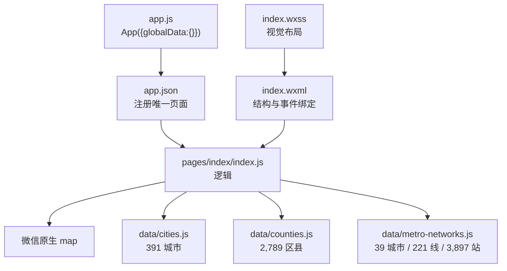

| 文件 | 作用 | 函数 |
| --- | --- | ---: |
| `miniprogram/app.js` | 注册空全局对象 | 0 |
| `miniprogram/app.json` | 注册页面、导航栏和 sitemap | 0 |
| `pages/index/index.js` | 页面状态、地图和所有交互 | 57 |
| `pages/index/index.wxml` | 声明 map、搜索、按钮、摘要和路线列表 | 0 |
| `pages/index/index.wxss` | rpx 响应式样式 | 0 |
| 三个 `data/*.js` | `module.exports = {...}` 的生成数据 | 0 |

三个数据文件总计约 1.45 MB 源文本。当前仓库脚本没有引用 `miniprogram/data`，说明生成来源和刷新步骤没有成为可复现构建任务。

## 4. 零基础先懂五个小程序概念

### 4.1 `App({...})`

`miniprogram/app.js`：

```js
App({
  globalData: {}
});
```

微信运行时提供全局 `App`。它注册整个小程序；当前没有生命周期函数或全局业务状态。

### 4.2 `Page({...})`

`Page` 注册一个页面。对象里的：

- `data`：会参与 WXML 渲染的状态；
- `onLoad`：微信自动调用的页面生命周期；
- 其他方法：由 WXML 事件或页面内部调用。

对象方法在 AST 中是 `FunctionExpression`，不是顶层 `FunctionDeclaration`。

### 4.3 `this.data` 与 `this.setData()`

```js
this.setData({ query, searchResults });
```

`this.data` 是当前渲染状态；`setData` 把变化传给视图层。直接写 `this.data.query = ...` 不会可靠触发 WXML 更新。

### 4.4 Page 实例的非渲染字段

这些不放在 data：

```text
markerSeq、markerLookup
cityById、countyById、placeById、cityByPinyin
cities、counties、routesRaw、activeCity
```

它们不需要直接显示，放实例字段可避免频繁序列化到视图线程。

### 4.5 WXML 事件绑定

```xml
<map bindmarkertap="onMarkerTap" />
<input bindinput="onSearchInput" />
<button bindtap="undoRoute">撤销</button>
```

字符串不是随意函数名；微信会在当前 Page 对象里找同名方法。改 JS 方法名却不改 WXML，点击就会失效。

### 4.6 `rpx`

WXSS 的 `rpx` 是响应式像素单位，屏幕宽度按 750rpx 设计。它不是网页 CSS 的 px，也不经过浏览器媒体查询。

## 5. 页面生命周期与两层状态

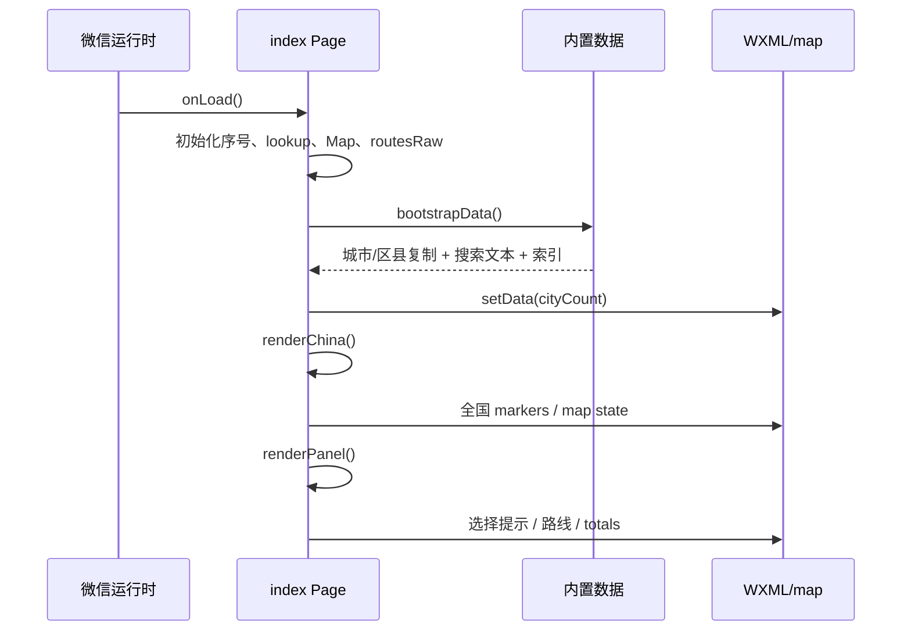

### 5.1 为什么状态分两层


这是简化的“模型 → 投影 → 视图”。问题是没有明确 store 类，任何 Page 方法都能同时改实例字段和 data，容易漏同步。撤销的 `canEnterCity` 漏洞就是例子。

## 6. 九个顶层基础函数：第 19–101 行

### 6.1 `normalizeSearchText(value)`

1. 空值变空字符串；
2. 小写；
3. Unicode NFD 分解；
4. 删除组合重音；
5. 删除所有空白。

用于“用户查询是否包含于预计算搜索文本”。中文保持原样，拼音可忽略空格和重音。

### 6.2 `normalizeKey(value)`

前四步相同，最后删除所有非 a-z/0-9。它只适合机器 key，不适合中文搜索；用于拼音和地铁网络键。

### 6.3 `toRadians(degrees)`

角度 × π / 180，把经纬度角度变成三角函数需要的弧度。

### 6.4 `haversineDistance(from, to)`

使用地球半径 6,371,000 米与 haversine 公式估算两点球面最短距离：


它不是铁路里程：山脉、线路弯曲和站点路径都未包含。

### 6.5 `formatDistance(meters)`

- falsy 值显示“待计算”；
- 小于 1,000 米显示整数 m；
- 其他显示四舍五入整数 km。

0 米被当成待计算；同地点不会建路线，所以正常路径看不到 0。负数会显示负 m，NaN 显示待计算。

### 6.6 `formatDuration(seconds)`

- falsy → 待计算；
- 秒四舍五入为分钟，最低 1；
- 小于一小时显示分钟；
- 其余显示小时与余分钟。

不像网页版，它不支持超过 24 小时转天。

### 6.7 `estimateRoute(from, to, mode)`

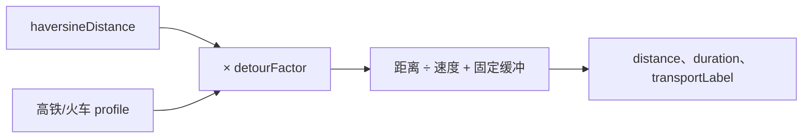

| 模式 | 速度 | 绕行 | 固定缓冲 |
| --- | ---: | ---: | ---: |
| 高铁 | 300 km/h | 1.08 | 35 分钟 |
| 火车 | 180 km/h | 1.12 | 25 分钟 |

未知 mode 回退高铁。结果始终是 fallback 估算，不查询真实铁路路线。

### 6.8 `routeCurve(from, to)`

用起终点构造二次贝塞尔曲线：

1. 算经纬差和二维距离；
2. 两点相同则返回两个相同端点；
3. 控制点放在中点的垂直方向；
4. 弯曲量不超过 0.16 度；
5. `Array.from` 采样 18 个点；
6. 每点用贝塞尔公式计算纬度和经度。

曲线只是视觉分离，不代表真实轨道。

### 6.9 `metroColor(color)`

去掉开头 `#` 并 trim；只有 6 位十六进制才接受，否则使用青绿色 `#0f8f83`。后面 `metroPolylines()` 再加 `dd` 透明度。

## 7. Page 初始 data：第 103–125 行

`data` 里有 20 个字段：

| 域 | 字段 |
| --- | --- |
| 地图视图 | `viewMode`、`mapCenter`、`mapScale`、`markers`、`polylines`、`includePoints`、`badgeCount` |
| 数据统计 | `cityCount` |
| 搜索 | `query`、`searchResults` |
| 路线偏好 | `transportMode` |
| 当前选择 | `selectedPlaceId`、`selectedCityId`、`canEnterCity` |
| 路线投影 | `routes`、`chainLabel`、`totalDistanceText`、`totalDurationText` |
| 状态文字 | `selectionTitle`、`selectionHint` |

`routes` 是给 WXML 的展示对象；`routesRaw` 是实例字段里的原始路线。两者必须由 `renderPanel()` 保持同步。

## 8. 启动与数据索引：第 127–165 行

### 8.1 `onLoad()`

微信打开页面时自动调用：

1. marker ID 从 1 开始；
2. marker lookup 用普通对象；
3. 建城市、区县、统一地点、拼音四个 Map；
4. 原始路线为空；
5. `bootstrapData()`；
6. `renderChina()`；
7. `renderPanel()`。

### 8.2 `bootstrapData()`

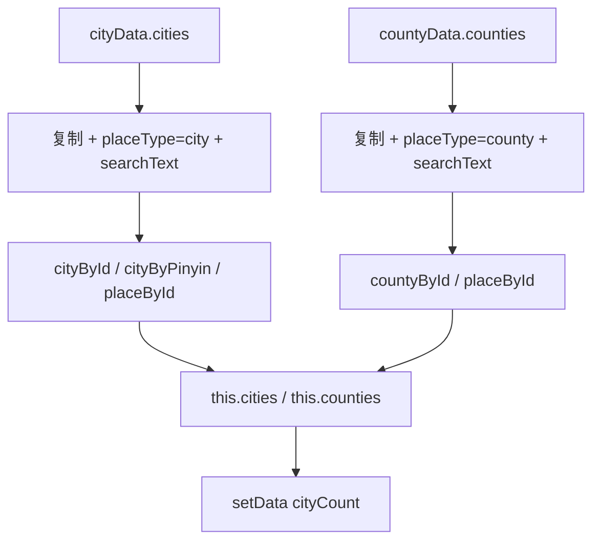

复制避免给 `require` 返回的原始记录直接加字段。搜索文本包含名称、省份、拼音；区县还包含上级城市名与拼音。

`municipalityNames` 在第 10 行建立却从未使用，`cityByPinyin` 也只写不读。这是两处可确认的遗留状态。

## 9. 全国地图、marker 与路线线条：第 167–225 行

### 9.1 `renderChina()`

重置 marker 序号与 lookup，为每个城市调用 `markerForPlace(city, "city")`，再一次 `setData`：

- 切回 china；
- 中心经纬度与缩放恢复全国值；
- markers 换成全部城市；
- polylines 保留当前旅行路线；
- includePoints 清空；
- badge 显示城市总数。

它不清 activeCity；正常退出先在 `exitCityView()` 清，直接 reset 到全国时则 activeCity 可能仍保留，但 viewMode 已是 china。

### 9.2 `markerForPlace(place, kind)`

每个 marker 要有数字 ID，微信 marker tap 只回传 markerId。函数：

1. 分配递增 ID；
2. `markerLookup[id] = { kind, placeId }`；
3. 建经纬度、尺寸、标题和 callout。

城市 18×18，其他地点 14×14。`display: kind === "city" ? "BYCLICK" : "BYCLICK"` 两支相同，是可删除的冗余条件。

### 9.3 `routePolylines()`

逐条 `routesRaw`：

- 查起终点；
- 任一缺失返回 null；
- `routeCurve` 生成 18 点；
- error 用红色，否则青色；
- status success 时 `dottedLine: true`；
- 启用 arrowLine；
- 最后过滤空线。

“成功路线反而虚线”与常见视觉语义相反。因为所有当前路线 status 都是 success，用户看到的始终是虚线估算，可能是用虚线表达“仅估算”；若是这个意图，应改字段说明或注释，而不是借用 success 判断。

### 9.4 `onMarkerTap(event)`

从 `event.detail.markerId` 查 lookup：

- 没记录停止；
- metro marker 直接忽略；
- 城市/区县按 placeId 找地点并 `selectPlace`。

地铁站有 callout，但不能加入路线或触发详情。

## 10. 点击地点怎样形成路线：第 227–265 行

### 10.1 `selectPlace(place)` 的三分支

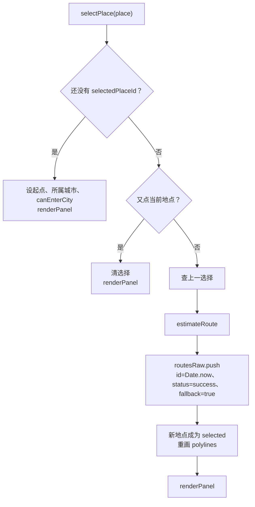

第一次只选起点，不创建“零长度路线”。第二次开始，每个点击都从上一个选择连到新地点。

### 10.2 选择字段

- 城市：`selectedCityId = place.id`，`canEnterCity = true`；
- 区县：`selectedCityId = parentCityId`，但 `canEnterCity = false`。

也就是说点区县后知道所属城市，却不显示“城市详情”按钮；搜索区县会先自动进入上级城市视图，所以这可能是有意避免重复按钮，但规则不够直观。

### 10.3 路线 ID

`Date.now()` 使用毫秒时间戳。普通手指点击很难在同一毫秒发生两次，但程序化调用或未来批量导入可能碰撞；稳定序号或 UUID 更明确。

### 10.4 没有 TripPlan

这里直接 `routesRaw.push`，所以不存在：

- 访问 occurrence；
- 多日计划；
- 活动/住宿关联保护；
- 命令、不可变副本、历史快照；
- 保存失败与恢复。

小程序撤销只是数组 `pop`。

## 11. 组合地铁线与旅行线：第 267–272 行

### `currentPolylines()`

城市视图返回：

```text
[...地铁线路, ...旅行路线]
```

全国视图只返回旅行路线。它假定 viewMode=city 时 `activeCity` 有值；当前所有进入路径都满足，但状态没有类型系统保护。

## 12. 侧栏投影：第 274–309 行

### 12.1 `renderPanel()`

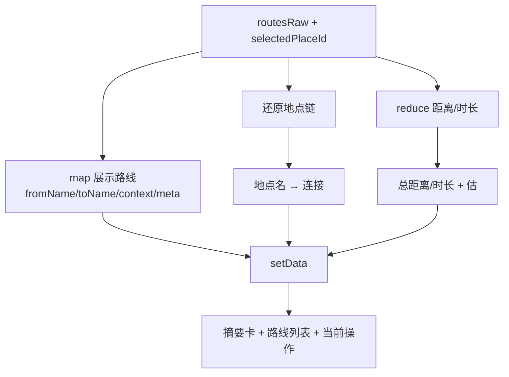

有路线时，地点链由第一段 from 加所有段 to；没有路线但有选择时显示单地点。totals 直接累加所有 raw 数值。

展示路线增加：

- `fromName` / `toName`；
- `contextText`：地点上下文与“估算行程”；
- `meta`：段号、交通方式、距离、时长。

最后设置路线、链条、合计、标题和 hint。

### 12.2 可能抛错的位置

函数假定每条路线两端都仍在 `placeById`：

```js
from.name
to.name
```

当前路线只由已知地点创建，成立；若以后加入文件恢复或数据版本升级，应过滤/修复悬空路线，不能直接访问。

### 12.3 `placeContext(place)`

与网页版同名函数重复实现：

- 空 → 空；
- 区县 → “上级城市或省 / 区县”；
- 城市 → 省。

功能相同却不能共享测试，是双实现漂移的缩影。

## 13. 搜索：第 311–339 行

### 13.1 `onSearchInput(event)`

每次输入：

1. 取 `event.detail.value`；
2. 规范查询；
3. 为全部城市复制对象并加 subtitle；
4. 为全部区县复制对象并加 subtitle；
5. 合并约 3,180 项；
6. `includes` 筛选；
7. 取前 8；
8. `setData` 更新 query 与结果。

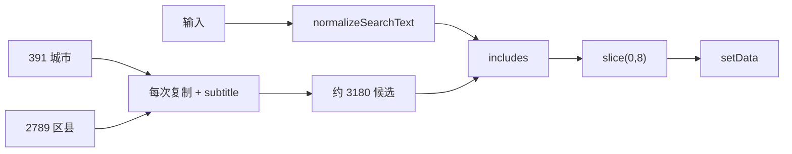

相比网页版：

- 没有评分；
- 没有精确命中优先；
- 没有 debounce；
- 每个按键都重建所有候选对象。

应在 bootstrap 时预建带 subtitle 的 searchPool，再只 filter；数据量更大时加倒排索引或至少延迟 100–150ms。

### 13.2 `clearSearch()`

query 和结果一起清空。WXML 的清除按钮只在 query 非空时出现。

### 13.3 `selectSearchResult(event)`

从按钮 `data-id` 查地点：

- 区县先同步进入上级城市，`fit=false`；
- 再把地点交给 `selectPlace`，可能创建路线；
- 清搜索；
- 地图中心移到目标，缩放设 9。

`enterCityView` 先 setData 一次，`selectPlace` 又 setData/渲染，最后本函数再 setData；一次区县选择会跨视图线程多次通信。可合并成一次状态事务。

## 14. 交通方式、撤销、清空与重置：第 341–385 行

### 14.1 `setTransportMode(event)`

验证 data-mode 后，遍历全部 routesRaw：

1. 查起终点；
2. 用新 profile 重新 estimate；
3. 合并回旧 route，保留 ID/from/to/status；
4. 更新 transportMode、fallback；
5. 重画当前 polylines；
6. renderPanel。

所有路线会同时换交通方式；没有“每段不同交通方式”。

### 14.2 `undoRoute()`

`pop` 最后一段；若有 removed：

- 选择回到 removed.from；
- selectedCityId 根据 from 是城市还是区县上级；
- 重画线。

然后 renderPanel。

真实漏洞：它没有更新 `canEnterCity`。

| 撤销前末点 | 撤销后起点 | 遗留 canEnterCity | 应有 |
| --- | --- | --- | --- |
| 区县（false） | 城市 | false | true |
| 城市（true） | 区县 | true | 取决于产品规则，当前直接选择区县时是 false |

此外，removed.from 查两次且不判空。建议先取 `previous`，统一通过 `selectionPatch(previous)` 计算三个选择字段。

### 14.3 `clearRoutes()`

清 raw，清选择和 canEnterCity，保留当前 viewMode；`currentPolylines()` 在城市视图仍保留地铁线。最后刷新侧栏。

### 14.4 `resetView()`

- 城市视图且有 activeCity：重新进入同一城市并 fit；
- 否则渲染全国。

它重置地图视野，不清路线或选择。

### 14.5 `enterSelectedCity()`

selectedCityId 存在就进入对应城市，fit=true。按钮由 `canEnterCity` 控制。

## 15. 城市详情和地铁：第 387–458 行

### 15.1 `enterCityView(cityId, fit)`

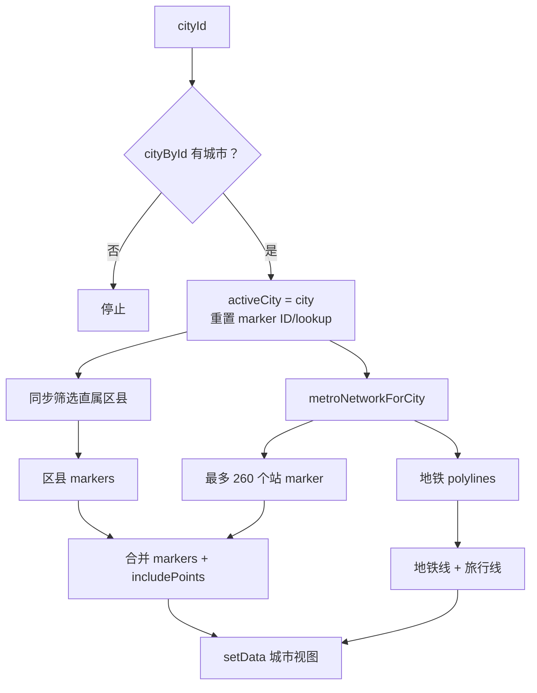

`fit=true` 只影响写入的 mapScale 是 9 还是旧值；同时传了 includePoints，微信 map 可能按所有点自动调整视野，因此 scale 的实际优先级需在真机验证。

marker 只取前 260 个站，badge 和 hint 却使用全部站数。大型网络会显示“389 个站”，地图实际只画 260 个，这应明确写成“已显示 260 / 共 389”。

### 15.2 `markerForMetroStation(station)`

分配 ID，在 lookup 保存整条 station，创建 10×10 marker；callout 显示“站名 / 线路名”。`onMarkerTap` 主动忽略 metro，所以 lookup 中 station 当前只用于标记类型，整对象没有后续读取。

### 15.3 `metroNetworkForCity(city)`

候选键按顺序：

1. 拼音 alias；
2. 标准化拼音；
3. 标准化中文名。

去空、Set 去重，再找第一个 `metroData.networks[key]`。找不到返回空 lines/stations。

`metroCityAliases` 中 `haerbin: "haerbin"` 等自映射没有改变 key；只有 hongkong → xianggang 之类真正不同的 alias 有意义。

### 15.4 `metroPolylines(city)`

每条线路：

1. 坐标对转成 `{longitude, latitude}`；
2. 过滤非有限数；
3. 颜色规范后加 dd alpha；
4. 宽度 4；
5. 最后只保留至少两个点的线。

没有切片线路，所有 221 条网络线路只在当前城市按需转换。

### 15.5 `exitCityView()`

清 activeCity，renderChina，再 renderPanel。路线和选择保留。

## 16. WXML：事件与数据的硬契约

| WXML 元素 | 绑定 | Page 方法 |
| --- | --- | --- |
| `map` | `bindmarkertap` | `onMarkerTap` |
| 搜索 input | `bindinput` | `onSearchInput` |
| 清搜索 | `bindtap` | `clearSearch` |
| 搜索结果按钮 | `bindtap` | `selectSearchResult` |
| 两个交通按钮 | `bindtap` | `setTransportMode` |
| 撤销 | `bindtap` | `undoRoute` |
| 清空 | `bindtap` | `clearRoutes` |
| 重置 | `bindtap` | `resetView` |
| 城市详情 | `bindtap` | `enterSelectedCity` |
| 返回全国 | `bindtap` | `exitCityView` |

`wx:if` 会真正创建/销毁节点，`wx:for` 依据数组生成搜索结果与路线行。`wx:key="id"` 依赖 marker/route ID 唯一。

### 16.1 UI 没有覆盖哪些脚本能力

脚本没有隐藏的额外入口；反而 WXML 也暴露了全部主要 Page 事件。地铁 marker tap 被 JS 忽略，所以不存在站点详情 UI。

## 17. WXSS：为什么地图在上、面板在下

- `.page` 纵向 flex；
- `.map-wrap` 固定 48vh，最小 560rpx；
- `.panel` 在地图下方纵向排列；
- 搜索结果和路线列表用 grid；
- 交通和控制按钮固定两列；
- 摘要固定两列；
- 路线链与段名用省略号防溢出。

没有 media query 或横屏方案；在平板/桌面开发者工具中仍是上下布局。相比网页的双栏/移动切换，小程序样式更简单。

## 18. 57 个可执行函数的完整账本

这一节是本章的“点名册”。前文按业务流程讲过主要函数，这里再按语法类型逐个登记，防止匿名函数被遗漏。

为什么要区分三类：

1. 顶层函数不依赖页面实例，负责纯计算或格式化；
2. `Page({...})` 里的普通方法持有页面上下文，可以读写 `this.data`；
3. 箭头函数大多是 `map/filter/reduce/find` 的短回调，只完成数组加工中的一步。

> 行号以当前 `miniprogram/pages/index/index.js` 为准。总数是 9 + 23 + 25 = 57。

### 18.1 九个顶层函数

| # | 行 | 函数 | 输入 → 输出 | 在工程中的职责 |
| ---: | ---: | --- | --- | --- |
| 1 | 19 | `normalizeSearchText` | 任意值 → 小写搜索文本 | 把 `null/undefined` 安全变空串，去首尾空白并转小写，是中文、拼音搜索的统一入口 |
| 2 | 27 | `normalizeKey` | 任意值 → 只含字母数字的键 | 在搜索规范化基础上删除空格和标点，用于把城市名、拼音和地铁数据键对齐 |
| 3 | 35 | `toRadians` | 角度 → 弧度 | 给三角函数换单位；它不认识地点，只做数学换算 |
| 4 | 39 | `haversineDistance` | 两个经纬度对象 → 米 | 按地球球面近似计算直线距离，是估算路线的地理基础 |
| 5 | 49 | `formatDistance` | 米 → 可读字符串 | 小距离显示米，大距离显示公里；只影响界面文字 |
| 6 | 55 | `formatDuration` | 秒 → 可读字符串 | 把秒拆成小时和分钟；只影响界面文字 |
| 7 | 64 | `estimateRoute` | 起点、终点、模式 → 估算结果 | 给直线距离乘绕行系数，再用速度和固定缓冲估算时间 |
| 8 | 74 | `routeCurve` | 起点、终点 → 21 个坐标点 | 用二次贝塞尔曲线生成视觉路线，不是真实道路导航线 |
| 9 | 98 | `metroColor` | 任意颜色值 → `#RRGGBB` | 校验地铁颜色；无效值回退蓝色，避免地图组件收到坏颜色 |

这九个函数中，`toRadians`、`haversineDistance`、`formatDistance`、`formatDuration`、`routeCurve` 和 `metroColor` 接近纯函数：同样输入会得到同样输出，也不改页面状态，最容易单独测试。`estimateRoute` 也是确定性的，但依赖外部常量 `TRANSPORT_PROFILES`。

### 18.2 二十三个 Page 方法

| # | 行 | 方法 | 谁触发它 | 直接副作用或返回值 |
| ---: | ---: | --- | --- | --- |
| 1 | 127 | `onLoad` | 小程序页面生命周期 | 建立运行时索引和 marker 容器，然后调用启动渲染 |
| 2 | 140 | `bootstrapData` | `onLoad` | 复制城市/区县数据，建立四个索引，进入全国视图 |
| 3 | 167 | `renderChina` | 启动、重置、退出城市 | 生成全国城市 marker，写地图中心、缩放、线条和视图模式 |
| 4 | 182 | `markerForPlace` | 全国/城市渲染 | 分配 marker ID、建立反查表并返回地图 marker 配置 |
| 5 | 204 | `routePolylines` | 多个渲染动作 | 把 `routesRaw` 转成地图组件接受的旅行线条 |
| 6 | 219 | `onMarkerTap` | WXML 的地图 marker 点击 | 通过 marker ID 反查地点；地铁站直接忽略，地点交给 `selectPlace` |
| 7 | 227 | `selectPlace` | marker 或搜索结果 | 设置第一次选择，或从上次选择到新地点创建一段路线 |
| 8 | 267 | `currentPolylines` | 地图刷新动作 | 全国视图只返回旅行线；城市视图返回地铁线加旅行线 |
| 9 | 274 | `renderPanel` | 选择、路线、交通等动作 | 从原始状态计算摘要、列表和按钮状态，再一次写入 UI |
| 10 | 305 | `placeContext` | `renderPanel` | 把地点转换成“城市 / 省份”等上下文字串 |
| 11 | 311 | `onSearchInput` | 搜索框输入 | 生成候选、匹配名称/拼音、截取前 12 条并显示结果层 |
| 12 | 324 | `clearSearch` | 清除按钮或选择结果 | 清空查询、结果和结果层 |
| 13 | 328 | `selectSearchResult` | 搜索结果点击 | 找地点，必要时进入上级城市，再复用 `selectPlace` 并移动地图 |
| 14 | 341 | `setTransportMode` | 驾车/步行按钮 | 用新模式重新估算全部已有路线，并刷新线条和面板 |
| 15 | 354 | `undoRoute` | 撤销按钮 | 删除最后一段路线，把选择点退回该段起点 |
| 16 | 364 | `clearRoutes` | 清空按钮 | 清除路线和当前选择，但不退出当前地图视图 |
| 17 | 375 | `resetView` | 重置视图按钮 | 重新适配当前城市或回到全国，不删除路线 |
| 18 | 383 | `enterSelectedCity` | 城市详情按钮 | 按 `selectedCityId` 进入城市视图 |
| 19 | 387 | `enterCityView` | 详情按钮或区县搜索 | 找直属区县和地铁数据，生成城市内 marker、线条和视野点 |
| 20 | 413 | `markerForMetroStation` | `enterCityView` | 分配地铁站 marker ID，保存反查记录，返回小尺寸 marker |
| 21 | 435 | `metroNetworkForCity` | `enterCityView` | 用拼音、别名和中文名依次寻找城市地铁网络 |
| 22 | 445 | `metroPolylines` | `enterCityView` | 把地铁网络坐标转为地图线条，过滤坏点和不足两点的线路 |
| 23 | 454 | `exitCityView` | 返回全国按钮 | 清城市上下文，恢复全国地图，再刷新侧栏 |

这里最重要的工程关系是：事件方法并不各自实现一套业务。`onMarkerTap` 和 `selectSearchResult` 最终都汇入 `selectPlace`；多个改变状态的方法最终都调用 `renderPanel`。这种“入口可以不同，核心动作尽量复用”的方向是正确的。

但复用还不彻底。全国渲染和城市渲染分别拼装大量 `setData` 字段；选择状态也由多个方法各自修改，才造成 `undoRoute` 遗漏 `canEnterCity` 的问题。

### 18.3 二十五个匿名箭头函数

箭头函数也是函数。只是作者没有给它们名字，而是直接传给数组方法。读法如下：

```js
items.map((item) => transform(item))
```

意思是：“对 `items` 中每个 `item` 执行一次右边的小函数，并收集结果。”

| # | 行 | 所属函数 | 数组操作 | 这个匿名函数每次做什么 |
| ---: | ---: | --- | --- | --- |
| 1 | 88 | `routeCurve` | `Array.from` | 根据索引计算参数 `t`，再计算贝塞尔曲线上的一个经纬度点 |
| 2 | 141 | `bootstrapData` | `map` | 浅复制一个城市对象，避免直接把导入对象当页面工作对象 |
| 3 | 146 | `bootstrapData` | `map` | 浅复制一个区县对象，并附上 `kind: "county"` |
| 4 | 152 | `bootstrapData` | `forEach` | 把一个城市按 ID 写入 `cityById`，同时写中文名和拼音搜索键 |
| 5 | 157 | `bootstrapData` | `forEach` | 把一个区县按 ID 写入 `countyById`，同时登记多种搜索键 |
| 6 | 170 | `renderChina` | `map` | 把一个城市交给 `markerForPlace`，得到一个全国 marker |
| 7 | 205 | `routePolylines` | `map` | 把一条原始路线包装成颜色、宽度、虚线和点数组配置 |
| 8 | 216 | `routePolylines` | `filter` | 只保留坐标点至少两个的有效地图线条 |
| 9 | 277 | `renderPanel` | `map` | 从每条路线的终点对象取一个目的地，供行程文字使用 |
| 10 | 279 | `renderPanel` | `reduce` | 把全部路线的距离和时长累加成总计 |
| 11 | 283 | `renderPanel` | `map` | 把原始路线变成 WXML 列表所需的显示对象 |
| 12 | 297 | `renderPanel` | `map` | 从路线列表抽取地点名，拼成“起点 → 终点”的链 |
| 13 | 315 | `onSearchInput` | `map` | 给一个城市候选补 `display` 字段，供结果按钮显示 |
| 14 | 316 | `onSearchInput` | `map` | 给一个区县候选补“区县 · 上级城市”显示文本 |
| 15 | 319 | `onSearchInput` | `filter` | 检查候选的规范化名称或拼音是否包含查询串 |
| 16 | 344 | `setTransportMode` | `map` | 用新交通参数重算一条路线，同时保留它的身份和端点 |
| 17 | 393 | `enterCityView` | `filter` | 只留下 `parentId` 等于当前城市 ID 的直属区县 |
| 18 | 395 | `enterCityView` | `map` | 把一个直属区县转换成地点 marker |
| 19 | 396 | `enterCityView` | `map` | 把一个地铁站转换成地铁 marker |
| 20 | 398 | `enterCityView` | `map` | 从 marker 配置抽出经纬度，形成地图自动适配视野的点 |
| 21 | 441 | `metroNetworkForCity` | `find` | 从候选键中找到第一个在 `metroData.networks` 真实存在的键 |
| 22 | 447 | `metroPolylines` | `map` | 把一条原始地铁线路转换成地图 polyline 对象 |
| 23 | 448 | `metroPolylines` | 内层 `map` | 把原始坐标对 `[经度, 纬度]` 转成具名坐标对象 |
| 24 | 448 | `metroPolylines` | 内层 `filter` | 丢弃经纬度不是有限数的坏坐标 |
| 25 | 451 | `metroPolylines` | `filter` | 丢弃剩余坐标不足两个、无法成线的线路 |

这 25 个回调大多只有一项职责，适合保持内联。第 22 个回调同时做颜色、点转换和对象包装，已经比较密集；如果以后加入线路点击、站点分段或性能缓存，应该提取成有名字的 `metroLineToPolyline(line)`，错误栈也会更好读。

### 18.4 不是函数的“看起来像函数”的东西

- `Page({...})` 和 `App({...})` 是微信运行时提供的注册函数调用，不是本项目定义的函数；
- `require(...)` 是模块加载调用；
- `this.setData(...)`、`Math.sin(...)` 等是调用点，不是新函数声明；
- JSON、WXML 和 WXSS 中没有 JavaScript 函数；
- 数据文件的 `module.exports = {...}` 是导出一份对象，不会新建函数。

因此，“57 个”统计的是这份页面脚本真正声明出来、运行时可以执行的函数节点，不是文件里出现了多少对括号。

## 19. 从一次点击看完整调用链

假设用户先点北京，再点上海：

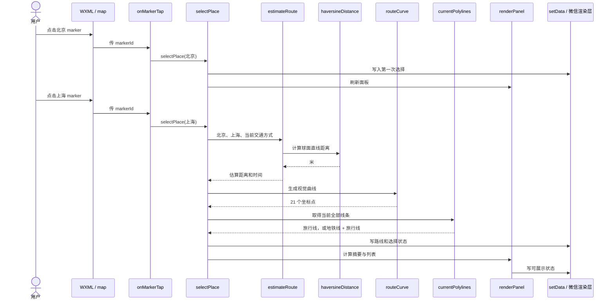

这条链里有两个容易混淆的事实：

1. `estimateRoute` 计算的是数字，`routeCurve` 计算的是画线用的点；二者互不保证一致；
2. `setData` 只是把数据交给微信渲染层，WXML 才决定这些字段最终显示成什么。

如果是点击搜索结果，入口会从 `selectSearchResult` 开始；如果是地铁站 marker，`onMarkerTap` 会提前返回，不进入这条链。

## 20. 小程序版与当前 Web 版不是同一套产品

两者共享“地图旅行”的概念，但没有共享运行时代码，也没有共享完整业务模型。

| 能力 | 当前 Web 版 | 小程序版 |
| --- | --- | --- |
| 全国城市和区县 | 有 | 有 |
| 城市内地铁 | 有 | 有 |
| 真实道路路线请求 | 有异步 provider 与回退 | 没有，始终本地估算 |
| 活动、酒店、餐饮 | 有 | 没有 |
| 按天行程 | 有 `TripPlan` | 没有，只是一条线性路线链 |
| 编辑器 | 有 | 没有 |
| 归档与恢复 | 有 | 没有 |
| 指南导出 | 有 | 没有 |
| 搜索架构 | 预建地点索引 | 每次输入重新拼候选 |
| UI 运行时 | 浏览器 DOM + Leaflet | 微信 `Page/setData` + 原生 map |
| 代码复用 | Web 模块之间有复用 | 与 Web 完全复制/分叉 |

可以把两者理解成：


这不是“Web 已经有 100 分，小程序只是换了一层外壳”；更接近“Web 是完整产品，小程序是保留地图核心概念的独立简化实现”。

### 20.1 分叉带来的真实成本

- 距离计算、路线曲线、搜索规范化等概念被重复实现；
- Web 修复一个规则，小程序不会自动得到修复；
- 数据生成链只服务部分目录，小程序数据找不到对应生成脚本；
- 两边功能名相似，容易让维护者误以为行为相同；
- 测试只覆盖 Web，不会阻止小程序回归。

独立实现并非一定错误。微信 map 组件和浏览器 Leaflet 的 API 差别很大，UI 适配层本来就应分开。真正值得共享的是不依赖 UI 的领域函数和数据 schema，而不是强行共享所有渲染代码。

## 21. 为什么会这样设计

### 21.1 为什么所有代码集中在一个页面文件

对原型来说，单文件有三个直接好处：

- 不需要设计模块边界；
- 打开一个文件就能看完整交互；
- 微信开发者工具中的调试路径短。

代价会随功能增长快速放大：页面方法、状态约束和地图转换混在一起，任何改动都可能漏同步字段。`undoRoute` 的 `canEnterCity` 漏洞就是典型信号。

### 21.2 为什么使用实例字段保存大对象

`cities`、索引表、marker 反查表、`routesRaw` 不直接展示。若都放 `data`，每次 `setData` 都可能产生不必要的序列化和渲染层通信。把它们留在逻辑层是合理的性能选择。

风险是形成“双状态源”：`routesRaw` 是真相，`data.routes` 是投影；`selectedPlaceId` 在 `data`，对应对象却要去索引找。每次修改必须知道哪些投影需要重算。

### 21.3 为什么路线完全本地估算

可能的工程动机包括：

- 无需地图服务密钥；
- 无网络也能即时回应；
- 无接口配额、费用和域名白名单配置；
- 演示环境稳定。

但它不能声称是导航结果。绕行系数和平均速度对跨海、山地、步行不可达区域都可能严重失真。界面使用“估算”一词是必要的。

### 21.4 为什么地铁站只画前 260 个

最可能是控制 marker 数量和首屏性能。问题不在限制本身，而在限制没有成为显式配置，也没有在 UI 中说明“只显示部分”。这会让数据数字和视觉结果互相矛盾。

### 21.5 为什么每次搜索重新组合候选

实现简单，而且约 3,180 个地点在现代设备上未必立刻卡顿。但输入事件会高频发生，每个字符都重新创建城市副本、区县副本、显示字符串和规范化文本，属于可以预先计算却反复计算的工作。

## 22. 更好的方案：按优先级改，而不是推倒重写

### P0：先修状态正确性

提取一个统一选择补丁：

```js
function selectionPatch(place) {
  return {
    selectedPlaceId: place ? place.id : "",
    selectedCityId: place
      ? (place.kind === "city" ? place.id : place.parentId)
      : "",
    canEnterCity: Boolean(place && place.kind === "city"),
  };
}
```

`selectPlace`、`undoRoute` 和 `clearRoutes` 都使用它。这样三个相关字段不能被分别忘记。

同时给 `renderPanel` 的索引读取加防御：数据缺项时跳过或显示“未知地点”，不要直接访问 `undefined.name`。

### P1：建立可测试的领域模块

把以下纯逻辑移到 `utils` 或共享包：

- 文本与键规范化；
- 球面距离；
- 路线估算；
- 曲线采样；
- 颜色规范化；
- 选择状态推导；
- 地铁网络键匹配。

Page 文件只负责“收到事件 → 调用领域函数 → `setData`”。这样微信开发者工具以外的 Node 测试也能运行。

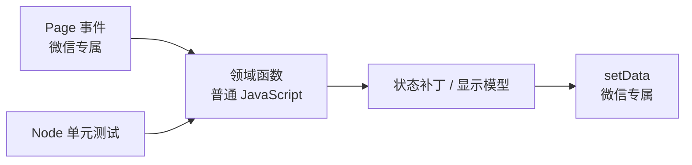

### P1：预建搜索索引

在 `bootstrapData` 中一次生成：

```js
{
  id,
  place,
  display,
  searchableText
}
```

输入时只做：

1. 规范化 query；
2. 在预建的 `searchableText` 上过滤；
3. 截前 12 个。

如果真机仍有延迟，再加 100–200ms 防抖；不要一开始就引入复杂搜索库。

### P1：把硬编码限制说清楚

将 `260`、全国中心、默认缩放、路线采样点数、交通参数变成有名字的配置常量。面板显示“已显示 260 / 共 389 个站”，避免把性能折中伪装成完整结果。

### P2：共享 schema，不强绑 UI

推荐边界：

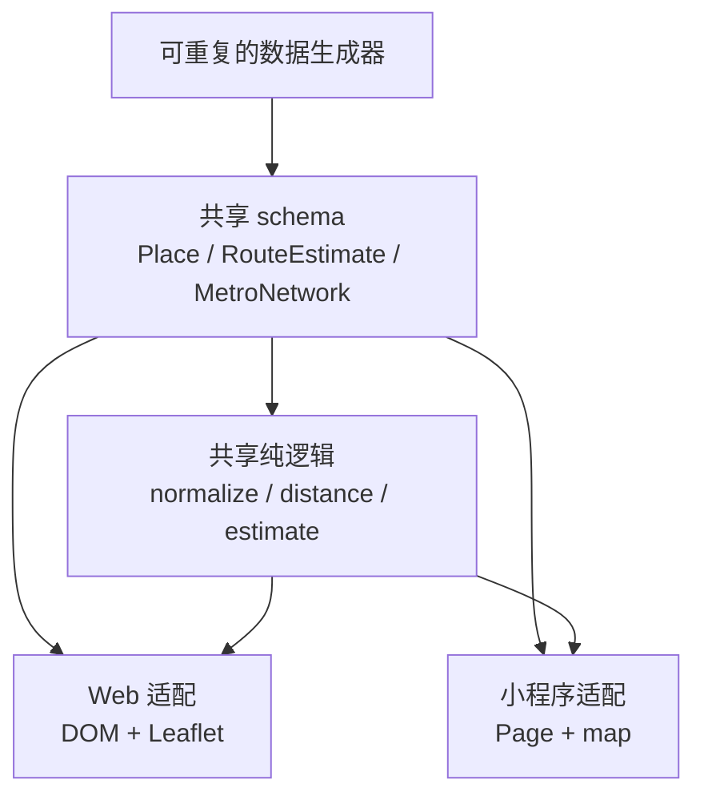

Web 和小程序应保留各自渲染适配器。共享部分必须不访问 `document`、`wx`、Leaflet 或 `this.setData`。

### P2：给数据建立可追溯生成链

当前小程序三个数据文件是结果，却找不到“从什么源、用什么脚本、什么版本”生成。至少应记录：

- 上游来源和许可；
- 原始文件哈希或版本；
- 生成脚本；
- 字段 schema；
- 生成日期；
- 统计数量；
- 校验命令。

否则下一位维护者只能手改 1.45MB 的导出对象，无法可靠更新。

### P3：真实导航应是可替换 provider

如果产品需要真实驾车/步行路线，可采用：

```text
routeProvider.getRoute(from, to, mode)
  ├─ 成功：真实道路距离、时间、几何线
  └─ 失败：本地 estimateRoute + routeCurve
```

界面必须标记结果来源。Web 已有类似“服务优先、估算回退”的方向，小程序可以复用协议和数据结构，不必复制浏览器 API。

## 23. 验证证据与目前的测试空白

### 23.1 可以静态确认的事实

- 页面脚本语法可由 Node 解析；
- AST 中正好有 57 个可执行函数节点；
- WXML 绑定的十类主要事件都能在 Page 对象中找到对应方法；
- 城市、区县、地铁数据能被本地 `require`；
- 三个数据文件合计约 1.45MB；
- mini 程序目录没有自动化测试；
- 仓库脚本没有引用 `miniprogram/data`，生成链缺失。

### 23.2 静态阅读不能证明的事实

- 微信开发者工具是否接受当前完整包体和分包配置；
- 真机上 260 个 marker 与多条地铁线的帧率；
- `includePoints` 与显式 `scale` 同时设置时的最终优先关系；
- iOS、Android 上 callout、颜色 alpha、虚线效果是否一致；
- 用户连续快速点击时 `setData` 的视觉顺序；
- 约 3,180 个候选的每次输入搜索在低端设备上的耗时。

这些必须用微信开发者工具和至少一台真机验证。把“代码看起来会运行”写成“已经在所有设备验证”是不严谨的。

### 23.3 建议的最小自动化测试矩阵

| 模块 | 必测案例 |
| --- | --- |
| 文本规范化 | 空值、中文、大小写拼音、空格、标点 |
| 球面距离 | 同一点为 0、北京到上海在合理范围、经纬度顺序错误能被发现 |
| 格式化 | 999/1000 米、59/60 分钟等边界 |
| 路线估算 | 驾车与步行参数、未知模式回退、坏坐标 |
| 曲线 | 恰好 21 点、首末点准确、相同起终点 |
| 选择状态 | 城市、区县、空选择三个补丁 |
| 撤销 | 城市→区县、区县→城市、多段到零段 |
| 地铁匹配 | 拼音、中文名、真实 alias、找不到网络 |
| 搜索 | 中文、拼音、最多 12 条、无结果、清空 |

另外需要少量开发者工具端到端测试：点击 marker、搜索选择、进入/退出城市、切交通方式、撤销和重置。

## 24. 给零基础读者的动手跟踪法

不要一开始给 460 行代码每行加断点。按一条用户故事跟踪：

1. 在 `onLoad` 看数据何时准备好；
2. 在 `markerForPlace` 看一个城市如何变成地图标记；
3. 在 `onMarkerTap` 看微信事件对象带来什么；
4. 在 `selectPlace` 看第一次点击与第二次点击为何不同；
5. 在 `estimateRoute` 看距离和时间只是估算；
6. 在 `routePolylines` 看原始路线怎样变成地图线；
7. 在 `renderPanel` 看同一份路线怎样变成文字列表；
8. 最后打开 WXML，逐个找到这些 `data` 字段在哪里显示。

建议在微信开发者工具控制台临时观察：

```js
console.log({
  selectedPlaceId: this.data.selectedPlaceId,
  routesRaw: this.routesRaw,
  polylines: this.data.polylines,
});
```

这段只用于学习和调试，不应长期保留在生产代码。它同时展示三层：

- `selectedPlaceId`：页面公开状态；
- `routesRaw`：逻辑层真实路线；
- `polylines`：地图层显示投影。

## 25. 本章结论

小程序的核心并不复杂：它把本地城市、区县和地铁数据装入内存，用 marker 反查表连接地图点击，以“上次选中的地点”为起点形成线性路线链，再把路线分别投影成地图线和面板文字。

真正需要警惕的不是 JavaScript 语法，而是四个工程边界：

1. `data` 与实例字段是两层状态，必须统一维护不变量；
2. 画出来的曲线不是道路，距离和时长也只是估算；
3. 小程序与 Web 是分叉实现，功能和修复不会自动同步；
4. 数据生成、自动化测试和真机性能证据目前都不完整。

下一章离开用户运行时，转向仓库里的构建与数据脚本：它们怎样生成数据、预压缩静态资源，以及 Next.js、Vite 和 Cloudflare Worker 怎样把成品送到用户面前。

- [第 14 章：离线工具与发布外壳——数据怎样被制造，页面怎样到达用户](./14-tooling-and-deployment.md)
