# 第 14 章：离线工具与发布外壳——数据怎样被制造，页面怎样到达用户

> 本章覆盖 `scripts/*.py` 中 71 个 Python 函数节点，以及 `app/*.tsx`、`vite.config.ts`、`build/sites-vite-plugin.ts`、`worker/index.ts` 中 10 个可执行 TypeScript/TSX 函数节点。第 5 章已经逐个解释两个 Node 数据生成脚本，本章只把它们放回总流水线，不重复冒充新增覆盖。

## 1. 先分清“用户运行时”和“工程工具”

你在浏览器里点击城市时，运行的是 `public/static-site/*.js`。Python 脚本、Vite 配置和构建插件不会因为用户点了地图就突然执行。

它们分别活在三个时间段：

| 时间段 | 谁在运行 | 目的 |
| --- | --- | --- |
| 数据准备时 | Python / Node 脚本 | 抓文章、下载图片、简化边界、生成索引 |
| 开发和构建时 | Node、Vite、vinext、TypeScript 配置 | 把源码编译、复制并打成部署目录 |
| 用户访问时 | Cloudflare Worker 或 Nginx，再到浏览器 | 接请求、返回静态文件或服务端结果 |

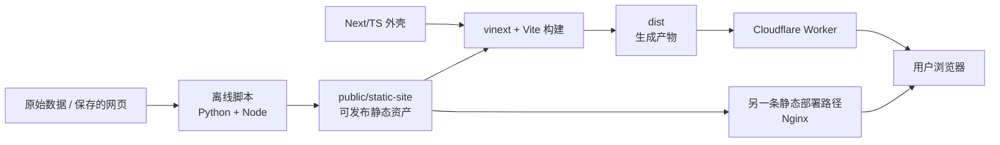

如果把项目比作餐厅：

- 浏览器业务代码是前厅服务；
- 数据脚本是备菜间；
- Vite/vinext 是装箱线；
- Worker 或 Nginx 是把餐送到门口的人。

## 2. 五问核验后的架构结论

### 为什么有 Python，主体却是 JavaScript

因为批量文件、HTML 解析、图片下载、几何处理和调用本机浏览器属于离线任务。它们不需要跟网页一起下载给用户，作者选择自己方便的 Python 标准库实现。

### 为什么同时有 Next、Vite 和一套原生静态网页

当前 React 页面本身只返回一个全屏 `iframe`，iframe 再加载 `/static-site/index.html`。Next 提供宿主和部署协议，真正成熟的产品逻辑仍留在原生静态站点。

### 为什么还要 Cloudflare Worker

vinext 的产物需要一个边缘运行入口。Worker 特判图片优化请求，其余请求交给 vinext 的 App Router handler。

### 为什么仓库里又有 Nginx

这是另一条部署方案：绕过 Next/Worker，直接把 `public/static-site` 放到普通服务器。`deploy/nginx.conf` 和预压缩脚本服务这条路径。

### 为什么这些路径容易让新人困惑

因为仓库没有一个统一命令把“生成数据 → 预压缩 → 构建 → 部署”串起来；一些文件还是模板遗留。必须根据导入、输出路径和生成目录判断真实关系，不能只看文件名。

结论：

> 当前架构不是单一流水线，而是“一个主要 Cloudflare/vinext 外壳 + 一个独立 Nginx 静态部署方案 + 若干手动离线工具”。

## 3. 本章源码清单与函数数量

### 3.1 Python

| 文件 | 声明函数 | lambda | 合计 | 角色 |
| --- | ---: | ---: | ---: | --- |
| `scripts/wechat_batch_fetch.py` | 23 | 0 | 23 | 当前微信公众号文章批量抓取器 |
| `scripts/1.py` | 23 | 0 | 23 | 抓取器的旧副本，存在确定性启动错误 |
| `scripts/build_article_readers.py` | 14 | 1 | 15 | Markdown 转本地 HTML，并用 Chrome/Edge 打 PDF |
| `scripts/build_lightweight_prefectures.py` | 6 | 4 | 10 | 简化 GeoJSON 行政区并均衡拆成 8 片 |
| `scripts/precompress_static_assets.py` | 0 | 0 | 0 | 顶层循环直接生成确定性 `.gz` 文件 |
| **合计** | **66** | **5** | **71** |  |

`1.py` 和 `wechat_batch_fetch.py` 各自真的声明了 23 个节点。虽然 22 个函数实现完全相同，覆盖统计仍不能把其中一个文件“消失”；后文会先解释共同函数，再单独解释两个 `main` 的差异。

### 3.2 TypeScript / TSX

| 文件 | 可执行函数节点 | 角色 |
| --- | ---: | --- |
| `app/layout.tsx` | 1 | Next 根布局 |
| `app/page.tsx` | 1 | 返回全屏 iframe 的首页 |
| `vite.config.ts` | 1 | 异步产生 Vite 配置 |
| `build/sites-vite-plugin.ts` | 4 | 打包 hosting 元数据和可选数据库迁移 |
| `worker/index.ts` | 3 | Worker 请求入口和图片优化回调 |
| **合计** | **10** |  |

`Env`、`ExecutionContext` 中看起来像方法签名的行只是 TypeScript 类型说明，运行时没有函数体，因此不计为可执行节点。

## 4. 微信文章流水线全景

入口是一份用户在浏览器保存下来的微信公众号链接页，默认名为 `555天图文快速链接.html`。

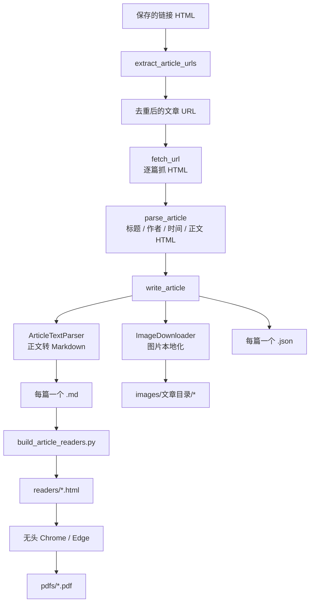

这是内容采集工具，不是地图核心数据生成器。它与第 5 章的餐饮内容脚本有概念联系，但生成的 `exports/wechat_articles` 不会被网页运行时自动加载。

## 5. 两份批量抓取器：为什么说它们是复制而非两个设计

`scripts/1.py` 和 `scripts/wechat_batch_fetch.py` 的前 389 行相同，类、正则、网络函数和写文件函数也相同。差异只集中在 `main`：

| 行为 | `1.py` | `wechat_batch_fetch.py` |
| --- | --- | --- |
| 声明 `--start` 参数 | 没有 | 有 |
| 读取 `args.start` | 有 | 有 |
| 起始位置越界检查 | 没有 | 有 |
| 列表输出带原始序号 | 没有 | 有 |
| 进度同时显示批次序号和原始序号 | 没有 | 有 |
| 延迟条件 | 用 `index < len(urls)`，起点非 1 时错误 | 用批次 `offset`，正确 |

`1.py` 的确定性错误是：

```text
参数解析器没有创建 args.start
        ↓
代码执行 start = max(1, args.start)
        ↓
AttributeError: Namespace 没有 start 属性
```

语法检查发现不了它，因为语法本身合法；只有执行到属性读取才会失败。当前 README 使用有语义名字的 `wechat_batch_fetch.py`，所以 `1.py` 应视为未清理的旧副本。

更好的处理不是同时修两份，而是：

1. 保留 `wechat_batch_fetch.py` 为唯一实现；
2. 删除或把 `1.py` 改成只转调新入口并给出弃用提示；
3. 给参数解析和空链接输入加测试；
4. 不让两个 450 行文件继续各自漂移。

## 6. 批量抓取器前六个函数：先找到正确文章

### 6.1 `strip_fragment(url)`

步骤：

1. 用 `urlsplit` 把 URL 拆成协议、域名、路径、查询和锚点；
2. 强制协议为 HTTPS；
3. 保留域名、路径和查询；
4. 丢掉 `#fragment`。

输入：

```text
http://mp.weixin.qq.com/s?mid=1#wechat_redirect
```

输出：

```text
https://mp.weixin.qq.com/s?mid=1
```

锚点只影响浏览器滚到页面哪个位置，不代表另一篇文章，所以去掉有利于去重。函数假设输入是绝对 URL；对相对路径强制 HTTPS 没有实际意义。

### 6.2 `canonical_key(url)`

它尝试从查询参数取四个微信文章身份字段：

- `__biz`：公众号身份；
- `mid`：消息 ID；
- `idx`：一组消息中的文章序号；
- `sn`：文章校验标识。

只要其中任意一个存在，就用四段 `|` 拼成去重键；都没有才退回完整规范 URL。

设计原因：同一文章链接可能带不同追踪参数或跳转参数，只比较整条 URL 会重复抓取。

风险：只带部分身份字段的异常 URL 可能产生过宽的键；更稳妥的做法是要求一组最小身份字段齐全，否则使用清理过追踪参数的 URL。

### 6.3 `extract_article_urls(source_html)`

它执行两轮扫描：

1. 用 `ATTR_URL_RE` 找 `href/data-link/data-url` 属性；
2. 用 `ARTICLE_URL_RE` 找散落在文本或脚本中的绝对微信文章 URL。

然后逐个：

- HTML 反转义，把 `&amp;` 还原为 `&`；
- 丢弃含模板占位符 `\${...}` 的假 URL；
- 调用 `strip_fragment`；
- 调用 `canonical_key` 去重；
- 保留第一次出现的顺序。

两轮扫描是为了兼容“标准链接”和“页面脚本里藏的链接”。正则不是完整 HTML 解析器，但这里输入是固定来源的保存页，属于有意识的轻量实现。

### 6.4 `first_match(patterns, text)`

按顺序尝试多个正则，找到第一个就把捕获组交给 `clean_inline_text`。全部失败返回空串。

它表达的是“元数据有多个历史写法，优先相信最明确的写法”。例如标题先找 Open Graph，再找页面标题节点，最后找 `<title>`。

### 6.5 `clean_inline_text(value)`

三步清理：

1. HTML 实体反转义；
2. 用正则删除标签；
3. 连续空白折叠为一个空格并去首尾空白。

适合标题、作者等短文本，不适合正文。正文中标签代表段落和图片，直接删除会丢结构。

### 6.6 `extract_article_body(raw_html)`

先用较严格正则找 `id="js_content"` 到外层结束和后续脚本之间的内容；失败后退回一个更宽松的“到第一个 `</div>`”版本。

为什么两级：

- 第一种尽量拿完整正文；
- 第二种在页面包装结构变化时至少拿到一部分。

为什么脆弱：HTML 可以嵌套很多 `div`，正则不知道标签层级。页面结构一变，它可能过早结束或拿过多内容。更可靠的方案是用 HTML parser 找 ID 节点并遍历其子树。

## 7. `ArticleTextParser` 的六个方法：事件式读 HTML

这个类继承 Python 标准库 `HTMLParser`。解析器不会一次返回整棵 DOM 树，而是像播报员一样依次通知：

```text
看见开始标签 → handle_starttag
看见文字     → handle_data
看见结束标签 → handle_endtag
```

类把通知逐段追加到 `self.parts`，最后拼成 Markdown。

### 7.1 `ArticleTextParser.__init__(image_resolver)`

初始化四件事：

- 调父类构造器，并让字符引用自动转换；
- `parts` 保存输出片段；
- `link_stack` 保存嵌套链接地址；
- `image_resolver` 是可选图片地址转换函数。

`image_resolver` 使用“依赖注入”：解析器不负责网络下载，只在遇到图片时询问外部函数“这个 URL 应该写成什么”。因此同一解析器既可保留远程图片，也可改成本地路径。

### 7.2 `handle_starttag(tag, attrs)`

每遇到开始标签：

1. 把属性列表转成小写键字典；
2. 块级标签前插入段落分隔；
3. `a` 标签把链接地址压入栈；
4. `img` 标签读取 `alt` 和多个可能的懒加载地址；
5. 有 resolver 就尝试本地化；
6. 写 Markdown 图片语法，再换段。

为什么图片地址有三个来源：微信公众号常把真实图片放在 `data-src`，`src` 可能只是占位图。

### 7.3 `handle_endtag(tag)`

- 结束 `a` 时从栈弹出地址；
- 非微信文章链接会以 ` (URL)` 追加在链接文字之后；
- 块级结束标签后插入段落分隔。

它没有输出标准 Markdown `[文字](URL)`，而是输出“文字 (URL)”。这样实现简单，但语义和可访问性较弱。

### 7.4 `handle_data(data)`

把文字内部连续空白折叠为一个空格；只要不是纯空白，就追加到 `parts`。

HTMLParser 已经负责把标签与文本分开，这里不再用正则删标签。

### 7.5 `_newline()`

仅当已有内容且最后一段还不以两个换行结尾时，追加 `\n\n`。前导空行和重复空行都被抑制。

下划线表示“类内部辅助方法”，Python 仍允许外部调用，它不是强制私有。

### 7.6 `markdown()`

把所有片段连接后：

1. 清掉换行前多余空格；
2. 三个以上连续换行压成两个；
3. 去首尾空白；
4. 返回最终 Markdown。

这个解析器保留文字、段落、图片和外链，但不会保留粗体、表格结构、列表层级、代码块等全部富文本语义。它是“可读文本提取器”，不是完整 HTML→Markdown 转换器。

## 8. 从正文到文章对象：三个函数

### 8.1 `html_to_markdown(article_html, image_resolver=None)`

这是类的简化门面：

1. 创建 `ArticleTextParser`；
2. 喂入正文 HTML；
3. 返回 `parser.markdown()`。

调用方无需知道事件回调和内部列表。

### 8.2 `parse_article(raw_html, url)`

分别用 `first_match` 提取：

- 标题；
- 作者；
- 发布时间；
- 描述。

再用 `extract_article_body` 取得正文 HTML，返回一个字典。

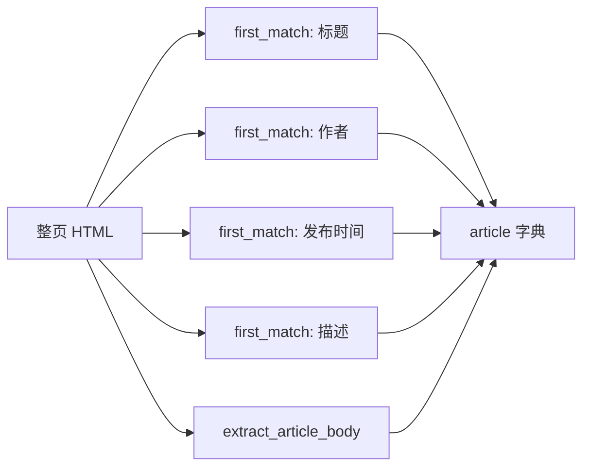

发布时间的回退值可能是 `ct` Unix 时间戳字符串，函数没有统一转成人类日期。因此同一字段可能是格式化日期，也可能是秒数；这是 schema 不稳定。

### 8.3 `safe_filename(title, index, url)`

文件名由三部分组成：

```text
三位序号 - 清理后的标题 - URL 的 8 位 SHA-1 摘要
```

它：

- 替换 Windows 禁止字符；
- 合并空白；
- 标题最多 72 个字符；
- 空标题用 `wechat-article`；
- 摘要用于避免相同标题互相覆盖。

SHA-1 在这里不是做密码安全，只做短去重标识，使用合理。序号前缀也让输出按原链接顺序排序。

## 9. 网络和图片：六个函数/方法

### 9.1 `fetch_url(url, timeout, retries)`

构造类似桌面 Chrome 的请求头，最多尝试 `retries + 1` 次：

1. 发请求；
2. 从响应头取字符集，缺省 UTF-8；
3. 解码错误用替换字符而不是终止；
4. 成功返回状态码与文字；
5. 网络错误或超时按 1.5、3.0……秒线性退避；
6. 全部失败抛 `RuntimeError`。

优点是每篇文章的失败不会立即结束整个批次。限制是没有总下载大小、重定向域名、状态内容类型或速率响应头校验。

### 9.2 `image_extension(url, content_type)`

图片扩展名按可信度顺序推断：

1. 查询参数 `wx_fmt/tp/fmt`；
2. URL 路径后缀；
3. HTTP `Content-Type`；
4. 都不认识时默认 `.jpg`。

这样兼容微信图片 URL 常把格式写在查询参数里的情况。默认 JPG 只改变文件名，不会转换字节；如果服务端实际返回别的格式，扩展名可能说谎。

### 9.3 `normalize_asset_url(url)`

HTML 反转义并去空白；`//example.com/a.jpg` 这种“协议相对 URL”补成 HTTPS。其他值原样返回。

### 9.4 `fetch_binary(url, referer, timeout, retries)`

结构与 `fetch_url` 相同，但：

- `Accept` 偏向图片；
- 携带原文章 `Referer`；
- 返回原始字节和 `Content-Type`；
- 不做字符解码。

文章和图片下载逻辑高度重复，可以提取一个通用“带重试的请求”辅助函数，减少两处策略漂移。

### 9.5 `ImageDownloader.__init__(...)`

保存：

- 本地输出目录；
- 写入 Markdown 的相对目录；
- 文章 URL，供 Referer 使用；
- 超时和重试配置；
- URL→结果路径缓存；
- 尝试计数；
- 失败列表。

缓存同时记成功和失败：同一失败图片以后直接继续使用远程 URL，不会重复请求。

### 9.6 `ImageDownloader.localize(src)`

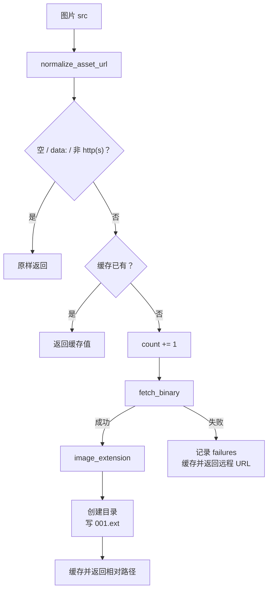

它采用“图片失败不拖垮文章”的降级策略，这是批量采集的合理选择。

但 `count` 在下载前加一，所以 `image_count` 实际是“尝试本地化的唯一远程图片数”，不是“成功下载数”。如果全部失败，`image_dir` 仍可能被写入元数据。字段名应该更明确，或分别记录 `attempted/succeeded/failed`。

## 10. `write_article(...)`：一次文章落盘事务

它是共同实现的第 22 个函数：

1. `safe_filename` 生成 stem；
2. 确定 Markdown 和 JSON 路径；
3. 按参数决定是否创建 `ImageDownloader`；
4. `html_to_markdown` 转正文，图片回调会在解析途中下载；
5. 把图片计数、目录、失败信息写回 `article`；
6. 组装标题和四行元数据；
7. 正文为空时写明降级原因；
8. 写 `.md`；
9. 删除 `article_html` 后写 `.json`。

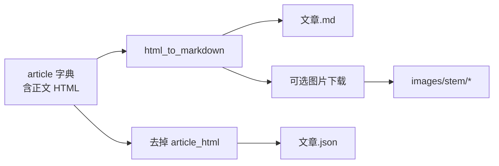

工程问题：

- 函数会原地修改传入的 `article`，调用者不容易预料；
- Markdown 和 JSON 分两次写，不是原子事务；第二次失败会留下半套产物；
- `image_failures` 被 JSON 序列化成字符串，再放进外层 JSON，而不是数组；
- 同名旧文件不会先备份；
- 没有写临时文件后 rename 的完整提交动作。

更稳妥的做法是构造新的 metadata 对象，两个临时文件都成功后再替换目标。

## 11. 两个 `main()`：当前入口和坏掉的旧入口

### 11.1 当前 `wechat_batch_fetch.main()`

参数：

| 参数 | 含义 |
| --- | --- |
| `--input` | 保存的链接 HTML |
| `--out` | 输出目录 |
| `--limit` | 最多处理多少篇，0 为全部 |
| `--start` | 从第几篇开始，1 基 |
| `--delay` | 文章之间等待秒数 |
| `--timeout` | 单次请求超时 |
| `--retries` | 每个请求重试次数 |
| `--images-dir` | 图片子目录名 |
| `--skip-images` | 不下载图片 |
| `--list-only` | 只列链接，不抓取 |

主流程：

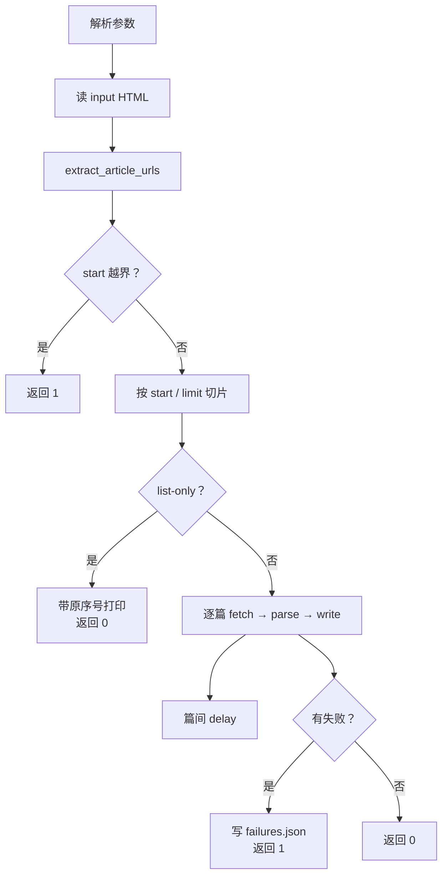

它逐篇捕获宽泛异常并继续，适合长批次；输入文件读取失败则发生在循环外，会直接终止。返回 1 告诉 shell “批次不完全成功”，同时保留成功文章。

空链接文件也被视为 `--start 1` 越界并返回 1。若 `--list-only` 用于检查空文件，返回成功可能更自然，产品语义需要明确。

### 11.2 旧 `1.main()`

参数表缺少 `--start`，随后却读取 `args.start`，因此只要不使用 `--help`，读完输入文件后就会崩溃。

它还有一个潜在延迟判断错误：

```python
if index < len(urls):
    time.sleep(...)
```

`index` 是原文章序号，`len(urls)` 是本批数量；一旦起始序号不为 1，这两个量不在同一坐标系。新脚本改用 `offset + 1 < len(urls)` 才正确。

### 11.3 23 个节点的共同账本

下面每一行在两个文件中各出现一次：

| # | 函数/方法 | 层次 |
| ---: | --- | --- |
| 1 | `strip_fragment` | URL 规范化 |
| 2 | `canonical_key` | 文章身份去重 |
| 3 | `extract_article_urls` | 链接发现 |
| 4 | `first_match` | 元数据回退匹配 |
| 5 | `clean_inline_text` | 短文本清理 |
| 6 | `extract_article_body` | 正文定位 |
| 7 | `ArticleTextParser.__init__` | 解析器状态初始化 |
| 8 | `handle_starttag` | 开始标签事件 |
| 9 | `handle_endtag` | 结束标签事件 |
| 10 | `handle_data` | 文本事件 |
| 11 | `_newline` | 段落去重 |
| 12 | `markdown` | 汇总输出 |
| 13 | `html_to_markdown` | 解析器门面 |
| 14 | `parse_article` | 文章字段聚合 |
| 15 | `safe_filename` | 输出名 |
| 16 | `fetch_url` | HTML 网络请求 |
| 17 | `image_extension` | 图片类型推断 |
| 18 | `normalize_asset_url` | 图片 URL 规范化 |
| 19 | `fetch_binary` | 图片网络请求 |
| 20 | `ImageDownloader.__init__` | 下载器状态 |
| 21 | `localize` | 图片本地化 |
| 22 | `write_article` | 单篇产物写入 |
| 23 | `main` | CLI 编排 |

所以两个文件合计是 46 个函数节点，不是 23 个；“相同”不等于“源码里不存在”。

## 12. 文章阅读器：15 个函数怎样把 Markdown 变成 HTML/PDF

`build_article_readers.py` 读取抓取器输出的 Markdown，不依赖通用 Markdown 库，而是实现一个满足当前产物格式的小转换器。

### 12.1 `safe_print(text)`

按当前终端编码先 encode、再以 `errors="replace"` decode，然后打印。无法显示的字符会变成替代符，而不是让 Windows 控制台报编码错误。

代价是日志可能丢字符；文件内容不受影响。

### 12.2 `chrome_candidates()`

候选来源：

1. Windows 三个常见目录下的 Chrome；
2. Windows 三个常见目录下的 Edge；
3. `PATH` 中的 `chrome/chrome.exe/msedge/msedge.exe`。

最后只返回真实存在的路径。它不去重，所以同一浏览器可能出现多次；主流程只取第一个。

### 12.3 `file_url(path)`

把本地路径转成绝对 `file:///...` URL，供无头浏览器打开。使用 `Path.as_uri()` 比自己拼斜杠和转义安全。

### 12.4 `reader_image_src(markdown_image_path)`

- HTML 反转义；
- Windows 反斜杠转正斜杠；
- `http/https/data` 保持；
- 本地路径前加 `../`。

因为 HTML 放在 `readers/` 子目录，而图片目录与 `readers` 同级，所以本地图片要先返回上一级。

### 12.5 `image_html(match)`

从 Markdown 图片正则的捕获组取 alt 和路径，分别 HTML 转义，返回：

```html
<figure></figure>
```

`loading="lazy"` 对普通 HTML 阅读有帮助；打印 PDF 时浏览器可能需要确保懒加载图片已经加载，当前脚本没有等待页面网络空闲或图片完成。

### 12.6 `inline_markup(text)`

处理顺序：

1. 去掉 `{data-source-line=数字}` 标记；
2. 扫描 Markdown 图片；
3. 普通文字做 HTML 转义；
4. 图片调用 `image_html`；
5. 拼接后，用 `URL_RE` 把裸 HTTP URL 变成新窗口链接。

这里存在一个已经用最小输入复现的缺陷：如果一张远程图片出现在文字行内，图片 HTML 先被插入，后续 URL 正则会再次匹配 `src="https://..."` 中的地址，把标签内部替换成 `<a>`。

实际会形成类似：

```html

```

这是损坏的 HTML。整行只有一张图片时走另一分支，不触发；下载成功后路径是本地相对路径，也不触发。`--skip-images`、下载失败或文字与远程图片同一行时最危险。

正确修法是先把文本解析成 token，分别渲染文字、链接、图片；不要在已经生成的 HTML 字符串上再跑 URL 正则。

### 12.7 行 69 的匿名 `lambda m`

它是 `URL_RE.sub` 的替换函数。每匹配一个裸 URL，就生成：

- HTML 转义的 `href`；
- `target="_blank"`；
- `rel="noopener"`；
- 转义后的可见 URL。

`noopener` 防止新页面通过 `window.opener` 控制原页，属于正确的安全细节。

查询串里的 `&` 在前一步已经转成 `&amp;`，这里可能再次转义为 `&amp;amp;`。这也是“先转义整段、再在 HTML 上找 URL”的顺序问题。

### 12.8 `markdown_to_html(markdown)`

它只识别五类结构：

- 一级标题；
- 二级标题；
- `- ` 开头的无序列表项；
- 独占一行的图片；
- 其他内容组成段落。

空行会结束当前段落和列表。文件末尾再主动 flush 一次，避免最后一块丢失。

这不是完整 Markdown：

- 不支持三级标题；
- 不支持粗体、斜体、代码、引用和表格；
- 不支持标准 `[文字](URL)`；
- 不支持嵌套列表；
- 连续普通行会用空格连接。

由于上游抓取器本来也只产生很窄的 Markdown 子集，这个选择能工作，但两个脚本之间形成了没有声明的私有格式契约。

### 12.9 嵌套 `flush_list()`

`markdown_to_html` 内部函数，能访问外层 `list_items` 和 `blocks`：

- 有列表项就用 `<ul>...</ul>` 包住；
- 追加到 blocks；
- 把列表项重置为空。

`nonlocal` 表示赋值的是外层变量，不是创建同名局部变量。

### 12.10 嵌套 `flush_paragraph()`

同样是闭包：

- 把段落行用空格连接；
- 调 `inline_markup`；
- 包成 `<p>`；
- 清空段落缓存。

两个 flush 函数被提取出来，避免空行、标题、图片、文件末尾四处重复收尾逻辑。

### 12.11 `page_html(title, body)`

返回完整 HTML 文档，内联包含：

- 中文语言和 viewport；
- 820px 阅读宽度；
- 中文衬线优先字体；
- 标题、段落、列表、图片和链接样式；
- `@page` PDF 页边距；
- `@media print` 打印样式。

标题用 `html.escape`；正文必须由前面的转换器保证安全。当前正文普通文本会转义，但一旦手工 Markdown 中含作者期望的 HTML，它也只会作为文字显示。

### 12.12 `article_title(markdown, stem)`

返回第一个 `# ` 标题；没有则用文件名 stem。它不跳过代码块，因为当前私有 Markdown 不产生代码块。

### 12.13 `build_html(md_path, html_path)`

读 Markdown → 取标题 → 转正文 → 创建输出目录 → 写完整页面 → 返回标题。

返回标题只用于进度日志，不是后续 PDF 的输入；PDF 直接打开写出的 HTML。

### 12.14 `print_pdf(browser, html_path, pdf_path)`

创建 PDF 目录，组装无头浏览器命令：

```text
浏览器
  --headless=new
  --disable-gpu
  --no-first-run
  --no-default-browser-check
  --print-to-pdf=目标
  file:///文章.html
```

`subprocess.run(check=True)` 表示浏览器退出码非 0 就抛异常。标准输出和错误都被丢弃，所以失败时缺少诊断信息。

没有设置超时；浏览器卡住会让整个批次一直等待。建议增加超时、保留失败 stderr，并用临时 PDF 完成后再替换目标。

### 12.15 `main()`

参数：

- `--input`：文章 Markdown 目录；
- `--limit`：最多处理多少篇；
- `--skip-pdf`：只建 HTML；
- `--force`：覆盖已存在产物。

流程：

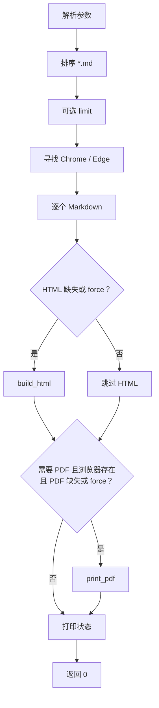

一个隐蔽边界：HTML 已不存在重建需求、但 PDF 需要新建时，脚本默认相信旧 HTML 存在。如果用户只留下 Markdown 和旧 PDF 状态异常，最好在打印前显式确认 HTML。

主循环没有逐篇 try/catch；任何一篇转换或浏览器失败都会终止整个批次，不像抓取器会继续。这两个批处理工具的失败策略不一致。

### 12.16 十五个节点总表

| # | 节点 | 说明 |
| ---: | --- | --- |
| 1 | `safe_print` | 终端编码降级 |
| 2 | `chrome_candidates` | 浏览器发现 |
| 3 | `file_url` | 路径转 URL |
| 4 | `reader_image_src` | 图片路径换基准 |
| 5 | `image_html` | 图片标签 |
| 6 | `inline_markup` | 行内图片和裸链接 |
| 7 | `lambda m` | 裸链接替换回调 |
| 8 | `markdown_to_html` | 块级转换器 |
| 9 | `flush_list` | 嵌套列表收尾函数 |
| 10 | `flush_paragraph` | 嵌套段落收尾函数 |
| 11 | `page_html` | 完整页面模板 |
| 12 | `article_title` | 标题回退 |
| 13 | `build_html` | 单篇 HTML 编排 |
| 14 | `print_pdf` | 浏览器打印 |
| 15 | `main` | 批量 CLI 编排 |

## 13. 行政区边界瘦身：为什么 3.26MB 会变成八个约 24KB 文件

`build_lightweight_prefectures.py` 读取：

```text
public/static-site/data/china-prefectures.json
```

当前源文件约 3.26MB、372 个 Feature。脚本简化形状并输出：

```text
china-prefectures-lite-1.json
...
china-prefectures-lite-8.json
```

当前八片各约 24KB。`app-data.js` 在运行时并行加载它们；这条产物关系是可追溯的。

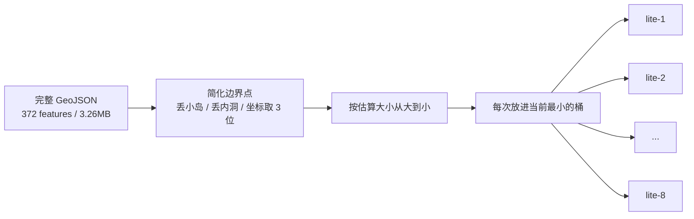

### 13.1 `point_segment_distance_squared(point, start, end)`

计算一个点到线段的最短距离平方：

1. 取线段方向；
2. 若起终点相同，直接算到这个点；
3. 用点积求投影比例；
4. 把比例夹在 0–1，确保落在线段上；
5. 返回点到投影点的平方距离。

返回平方是性能选择：比较大小时不用开平方。它不处理经纬度球面曲率，而把度数当平面坐标；对行政区轮廓简化属于近似。

### 13.2 `simplify_line(points, tolerance)`

这是 Ramer–Douglas–Peucker 思想的递归简化：

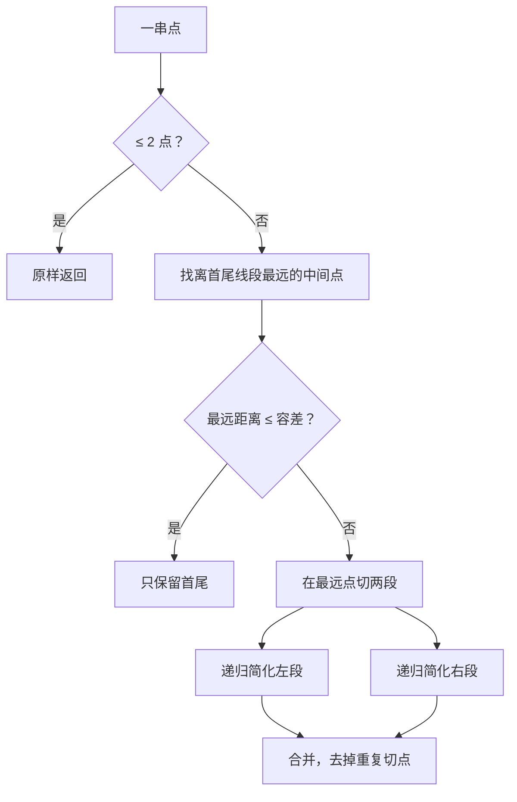

`TOLERANCE = 0.08` 是经纬度“度”，不是米。南北方向约相当于 9 公里，东西方向还随纬度变化；这是面向全国概览的强简化，不适合精细边界判定。

### 13.3 `ring_area(ring)`

用鞋带公式计算闭合环的平面面积绝对值。它用于丢弃极小多边形。

经纬度平面面积不是平方公里，`MIN_POLYGON_AREA = 0.005` 也是度平方阈值，随纬度意义变化。其目标是控制视觉和体积，不是做测绘。

### 13.4 `simplify_ring(ring)`

步骤：

1. 若首尾重复，暂时去掉末尾；
2. 少于三个点直接返回；
3. 算所有点的平均中心；
4. 选离中心最远的点作为旋转起点；
5. 重排环并再次补上起点形成闭合；
6. 调 `simplify_line`；
7. 结果少于四点就退回旋转后的原环；
8. 坐标保留三位小数。

选择稳定起点是因为闭合环没有天然“第一点”，而线简化算法需要首尾锚点。当前方法仍是对闭环的近似处理。

### 13.5 行 62 的 `lambda index`

传给 `max(..., key=...)`，计算某个候选点到平均中心的平方距离。返回最大的 index 作为环起点。

### 13.6 `simplify_geometry(geometry)`

若类型是 `Polygon`：

- 只简化 `coordinates[0]` 外环；
- 返回一个 Polygon。

否则按 `MultiPolygon` 处理：

- 只检查每个 polygon 的第一个环；
- 面积低于阈值的整个小 polygon 被丢弃；
- 若全部被丢，至少保留最大的一个；
- 简化保留项的外环。

这里明确丢弃所有内洞。例如湖中岛、行政区包围的空洞不会出现在轻量版。地图只用于点击和概览时可能可接受，但不能用于精确空间分析。

函数没有对未知 geometry 类型报清晰错误；`LineString/GeometryCollection` 会按 MultiPolygon 结构访问并产生难懂异常。

### 13.7 行 84 的 `lambda polygon`

给 `max` 提供比较键：用 polygon 的外环面积选择“被过滤完时仍应保留的最大岛块”。

### 13.8 `main()`

执行：

1. 读完整 GeoJSON；
2. 对 372 个 Feature 保留 properties、简化 geometry；
3. 创建 8 个桶和 8 个字节计数；
4. 特征按紧凑 JSON 长度降序排列；
5. 每个特征放进当前累计字节最小的桶；
6. 删除旧单文件 `china-prefectures-lite.json`；
7. 写 8 个紧凑 FeatureCollection；
8. 打印 features、chunks、最大文件字节和路径。

这是 LPT 风格的贪心负载均衡。它让八个网络请求大小接近，避免一片特别大拖慢整体。

写入不是原子的：脚本中途失败可能留下新旧混合的八片。应先写临时目录、逐片校验，再整体替换。

### 13.9 行 103 的 `lambda item`

把一个 Feature 序列化成紧凑 JSON，返回字符数，供降序排序。

细节问题：这里量的是 Python 字符数，后面的桶累计量的是 UTF-8 字节数。中文属性一个字符占多个字节，两种单位不一致。当前输出仍很均衡，但应该统一使用 `len(...encode("utf-8"))`。

### 13.10 行 106 的 `lambda index`

返回某个桶当前累计字节数，`min` 用它选择最小桶。

### 13.11 当前产物是否真的可重复

我没有运行会覆盖文件的生成器，而是在内存里用同一算法重新计算，再逐字节比较现有八片：

| 检查 | 结果 |
| --- | --- |
| 源 Feature | 372 |
| geometry 类型 | 只有 Polygon / MultiPolygon |
| 八片内容与内存重算 | 8 / 8 完全一致 |
| 当前文件大小范围 | 24,006–24,194 字节 |

这证明当前轻量文件确实来自现有算法；不证明简化后的地理形状满足所有产品精度要求。

### 13.12 十个节点总表

| # | 节点 | 作用 |
| ---: | --- | --- |
| 1 | `point_segment_distance_squared` | 点到线段距离平方 |
| 2 | `simplify_line` | 递归折线简化 |
| 3 | `ring_area` | 环面积 |
| 4 | `simplify_ring` | 闭环旋转、简化和取整 |
| 5 | 行 62 `lambda index` | 选离中心最远点 |
| 6 | `simplify_geometry` | Polygon/MultiPolygon 处理 |
| 7 | 行 84 `lambda polygon` | 选最大 polygon |
| 8 | `main` | 读取、简化、分桶、写入 |
| 9 | 行 103 `lambda item` | 按序列化大小排序 |
| 10 | 行 106 `lambda index` | 选最小字节桶 |

## 14. 预压缩脚本：零个函数，不等于没有行为

`precompress_static_assets.py` 没有 `def` 或 `lambda`。模块顶层直接执行一个循环：

1. 从 `public/static-site` 递归找 HTML、JS、CSS、JSON、SVG；
2. 按路径排序；
3. 目标名为原名加 `.gz`；
4. 用 gzip level 9 覆盖写；
5. `filename=""` 不把源文件名写进 gzip 头；
6. `mtime=0` 不把当前时间写进 gzip 头；
7. 一次读取整个源文件并压缩。

后两点让相同源文件得到相同 gzip 字节，便于缓存、校验和可重复构建。

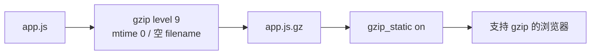

### 14.1 为什么 Nginx 同时开 `gzip` 和 `gzip_static`

- `gzip_static on`：若旁边已有 `.gz`，直接发预压缩文件，省服务器 CPU；
- `gzip on`：没有 `.gz` 时，服务器可以现场压缩。

当前 `public/static-site` 中 `.gz` 文件数量是 0，而且 package scripts 没有调用该脚本。因此现状会依赖 Nginx 动态 gzip，除非部署流程在服务器另行手动运行脚本。

### 14.2 设计问题

- 顶层执行意味着“导入这个模块”也会覆盖所有 `.gz`；
- 没有 `main` 和参数，不能选择源目录或 dry-run；
- 读取整个文件，大资产会占双份以上内存；
- 没有成功统计、原文件/压缩文件大小或校验；
- 不是 `npm run build` 的一部分；
- 如果中途失败，会留下部分新、部分旧压缩文件。

建议封装 `compress_file` 和 `main`，先输出临时文件，再原子替换；部署 CI 明确调用并检查每个目标。

## 15. 从源码到 Cloudflare：构建链与请求链

构建方向：

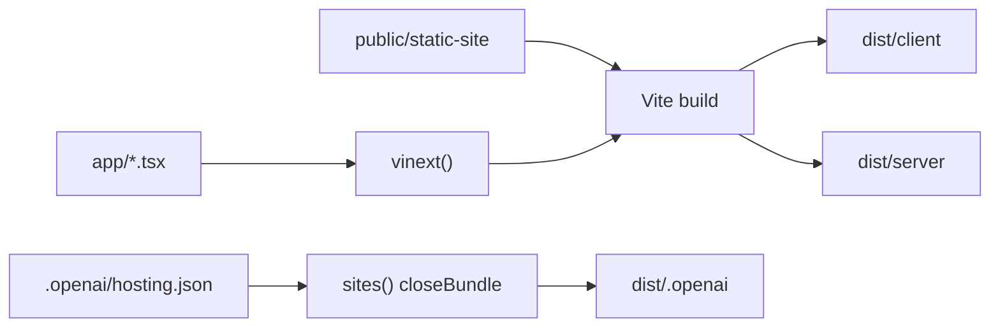

请求方向：

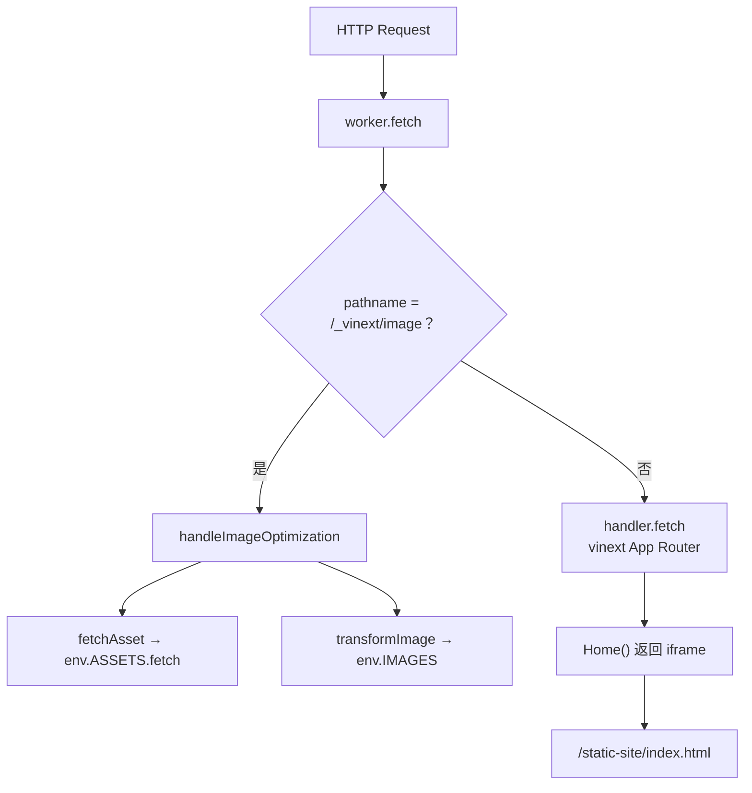

## 16. Next 外壳的两个函数

### 16.1 `RootLayout({ children })`

文件：`app/layout.tsx`。

它返回整个 Next 应用最外层 HTML：

```tsx
<html lang="zh-CN">
  <body>{children}</body>
</html>
```

`children` 是 Next 传入的当前页面内容。`lang="zh-CN"` 帮助浏览器、搜索引擎和读屏软件理解语言。

同文件的 `metadata` 是数据对象，不是函数；Next 用它生成标题和描述。

### 16.2 `Home()`

文件：`app/page.tsx`。

它只返回：

```tsx
<iframe src="/static-site/index.html" />
```

`app/globals.css` 让 html/body 无滚动、iframe 占满 `100vw × 100vh`。因此 React/Next 没有重写地图业务，只提供全屏宿主。

优点：

- 迁移风险低；
- 旧静态站点可独立开发；
- 快速接入当前托管平台。

代价：

- 父页面与 iframe 是两个文档；
- 无障碍焦点、标题、浏览器历史和深链接更难统一；
- React 依赖和服务端 bundle 很大，但页面业务几乎没使用；
- 跨文档通信需要 `postMessage`；
- 错误边界、主题和全局样式不能自然共享。

如果产品长期只有这一页，直接静态托管更简单；若未来要 Next 路由、服务端数据和账户体系，则应逐步把业务迁入 React，而不是永久只套 iframe。

## 17. `vite.config.ts` 的一个异步箭头函数

`defineConfig(async () => {...})` 接收的箭头函数是此文件唯一可执行函数节点。Vite 启动时调用它，等待动态导入后得到配置对象。

### 17.1 顶层准备

文件先：

- 导入 `vinext`；
- 导入 `defineConfig`；
- 读取 `.openai/hosting.json`；
- 导入自定义 `sites` 插件；
- 从 hosting 配置解构 `d1/r2`；
- 判断是否处于 macOS Codex Seatbelt 沙箱；
- 组装 Worker 本地绑定配置。

当前 hosting 文件只有 `project_id`，没有 `d1` 或 `r2`，所以生成的 Wrangler 配置中 D1 和 R2 数组都为空。

还有一个类型层问题：JSON 导入被 TypeScript 推断为 `{ project_id: string }`，因此 `const { d1, r2 } = hostingConfig` 会产生两个 `TS2339`。运行时 JavaScript 读取缺失属性只得到 `undefined`，构建器又没有执行完整类型检查，所以 `npm run build` 仍能成功。这种“能打包、类型检查失败”不应被长期接受。

修法是给 hosting 配置定义明确 schema，例如 `d1?: string`、`r2?: string`，解析后再使用；不要用类型断言掩盖完全未知的数据。

### 17.2 箭头函数执行顺序

1. 用 `??=` 设置三个工具环境变量，只在外部没有设置时写默认值；
2. 动态导入 `@cloudflare/vite-plugin`；
3. 按 Seatbelt 条件决定是否使用轮询监听；
4. 注册 `vinext()`；
5. 注册 `sites()`；
6. 注册 `cloudflare(...)`；
7. 返回配置。

为什么 Cloudflare 插件动态导入：注释说明 Wrangler 在模块导入时就快照日志路径，因此必须先设置环境变量。

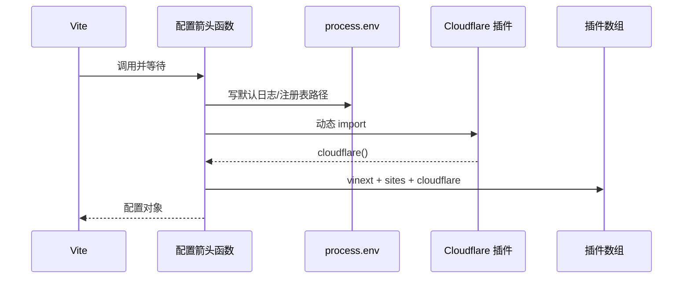

### 17.3 模板遗留

`SITE_CREATOR_PLACEHOLDER_DATABASE_ID`、D1/R2 分支和 `db:generate` 暗示这是 site-creator 模板能力。当前仓库：

- 没有 `drizzle/`；
- 没有 Drizzle 配置文件；
- 业务代码没有导入 `drizzle-orm`；
- 没有使用 `react-loading-skeleton`；
- Worker 也没有读取 `env.DB`。

这些依赖和类型会增加理解及安装成本。若没有近期数据库计划，应删除；若计划使用，应补配置、迁移和真实业务入口。

## 18. 构建插件的四个函数

### 18.1 `exists(path)`

异步调用 `access(path)`：

- 成功返回 true；
- `ENOENT` 返回 false；
- 权限错误等其他异常重新抛出。

这比“任何错误都当不存在”严谨，因为权限问题不应被静默忽略。

### 18.2 `sites()`

导出的 Vite 插件工厂：

1. 初始 root 取当前工作目录；
2. 返回插件对象；
3. `name = "sites"`；
4. `apply = "build"`，只在构建时启用；
5. 提供 `configResolved` 和 `closeBundle` 生命周期方法。

### 18.3 `configResolved(config)`

Vite 解析完最终配置后，把真实 `config.root` 保存进闭包变量。这样后续路径不依赖启动命令恰好在哪个目录执行。

### 18.4 `closeBundle()`

Vite 完成 bundle 后：

1. 解析 `dist/.openai`；
2. 解析源 `.openai/hosting.json`；
3. 解析可选 `drizzle/`；
4. 强制递归删除旧 `dist/.openai`；
5. 重建空目录；
6. hosting 存在就复制；
7. drizzle 存在就递归复制。

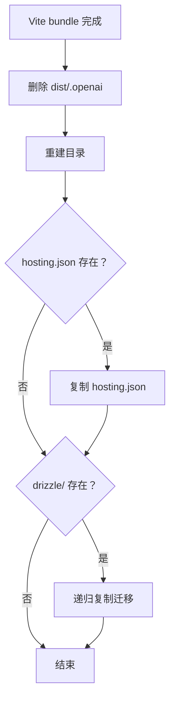

清理目标固定在 build 输出目录，方向合理；但这是构建的破坏性步骤。若复制 hosting 后、复制 drizzle 时失败，`dist/.openai` 会处于不完整状态。临时目录完成后 rename 更接近事务。

当前实际结果只有 `dist/.openai/hosting.json`，因为 `drizzle/` 不存在。

## 19. Cloudflare Worker 的三个函数

### 19.1 `worker.fetch(request, env, ctx)`

这是边缘请求入口：

1. 解析 URL；
2. 若路径精确等于 `/_vinext/image`，走图片优化；
3. 其他请求全部转给 `handler.fetch(request, env, ctx)`。

“精确等于”意味着查询参数不影响判断，因为判断的是 pathname。

### 19.2 `fetchAsset: (path) => ...`

传给图片优化器的箭头函数：

1. 以当前 request URL 为基准解析图片 path；
2. 创建新的 Request；
3. 交给 `env.ASSETS.fetch` 读取构建后的静态资产。

它没有自己实现路径白名单；路径和安全校验责任主要交给 `handleImageOptimization` 与 ASSETS binding。

### 19.3 `transformImage: async (body, options) => ...`

接收图片流和宽度/格式/质量：

1. `env.IMAGES.input(body)`；
2. 宽度大于 0 才加 resize；
3. 指定输出格式和质量；
4. 等待 Cloudflare 图片处理；
5. 返回 Response。

Worker 把 vinext 的通用图片协议适配到 Cloudflare Images binding。

### 19.4 当前绑定边界

`Env` 类型宣称有 `ASSETS`、`DB` 和 `IMAGES`。但当前生成的 `dist/server/wrangler.json`：

- 静态 assets 目录存在；
- D1 数组为空；
- 没有看到 Images binding；
- 当前页面没有使用 Next `<Image>`。

因此普通 iframe 路径不依赖 `DB/IMAGES`；若未来命中 `/_vinext/image`，必须先确认部署环境确实提供 `env.IMAGES`，否则类型声明不能阻止运行时 undefined。

类型像合同草稿：它告诉 TypeScript“假设会有这些东西”，不会替你在 Cloudflare 后台真的创建资源。

当前合同本身也无法通过独立 TypeScript 检查：项目没有让 `Fetcher` 和 `D1Database` 类型进入全局作用域，分别产生 `TS2304` 和 `TS2552`。应安装/生成对应 Cloudflare Worker 类型并在 tsconfig 中纳入，或从正确包显式导入。

## 20. 没有函数，但会改变工程行为的配置

### 20.1 `package.json`

- Node 要求 `>=22.13.0`；
- `dev/build/start` 全部由 vinext 执行；
- `test` 跑九个 Node 测试文件；
- `test:browser` 跑 Playwright；
- `lint` 忽略 `dist/.next`；
- `db:generate` 当前缺少可见 Drizzle 配置。

没有 `typecheck` 命令，`build` 也没有先调用 `tsc --noEmit`。这正是四个类型错误没有阻止成功打包的原因。

### 20.2 `next.config.ts`

空的 `NextConfig` 对象。没有图片域名、redirect、header 或实验选项。它证明 Next 目前主要使用默认行为。

### 20.3 `tsconfig.json`

关键含义：

- `strict: true`：较严格类型检查；
- `noEmit: true`：TypeScript 自己不输出 JS，由 Vite/vinext 构建；
- `allowJs: true`：项目可以同时包含 JS；
- `moduleResolution: "bundler"`：按现代打包器规则解析；
- `jsx: "react-jsx"`：转换 JSX；
- `@/*` 指向仓库根目录。

### 20.4 `postcss.config.mjs`

启用 Tailwind PostCSS 插件，但 `app/globals.css` 只是 244 字节普通 CSS，没有 Tailwind 指令。它更像模板基础设施。

### 20.5 `.openai/hosting.json`

只有项目 ID。Vite 对 `d1/r2` 的条件分支当前不会建立绑定。

### 20.6 `deploy/nginx.conf`

它是独立静态部署方案：

- 根目录 `/usr/share/nginx/html`；
- 首页不缓存；
- 带 `?v=...` 的 JS/CSS/JSON/SVG/woff2 缓存一年且 immutable；
- 不带版本参数的资产不缓存；
- 开动态 gzip 和预压缩 gzip；
- 未找到的资源返回 404，不做单页应用 fallback。

这里有两段 `location /`：Nginx 按配置规则选择同前缀时的处理需要谨慎，重复块也会增加维护疑惑。可以合并成一段，明确首页和普通文件策略。

## 21. 两条部署路径应怎样理解

| 维度 | vinext + Cloudflare | Nginx 静态站 |
| --- | --- | --- |
| 输入 | Next 外壳 + `public` | `public/static-site` |
| 构建 | `npm run build` | 可直接复制，预压缩需手动 |
| 入口 | Worker `fetch` | Nginx 配置 |
| React/Next | 有 | 无 |
| 图片优化 | 预留 Cloudflare 路径 | 无专门服务 |
| 服务端扩展 | 可加入 RSC、数据库、API | 主要是静态文件 |
| 当前地图能力 | iframe 内相同静态站 | 直接打开静态站 |
| 复杂度 | 高 | 低 |

在当前功能下，二者给用户的地图主体几乎相同。差别主要在宿主、部署平台和未来扩展能力。

这解释了一个看似矛盾的事实：

- `package.json` 把 vinext 当主要命令；
- 部署文档又推荐 Nginx 托管静态目录。

它们不是同一命令的两个步骤，而是两个可选交付方案。工程上应明确写成“Cloudflare 部署”和“自建静态部署”，分别列前置条件、构建命令、产物目录和验证 URL。

## 22. 为什么采用这种设计，以及什么时候不再合适

### 22.1 提交生成后的轻量数据

好处：

- 普通开发者无需 3.26MB 源数据处理就能启动；
- 浏览器直接取得分片；
- 构建不依赖 Python；
- 部署结果稳定。

代价：

- 源与产物可能漂移；
- PR 会同时出现大数据变更；
- 如果没有校验，维护者不知道该运行哪个脚本。

当前八片与脚本重算一致，说明这次没有漂移；建议 CI 固定做只读重算比较。

### 22.2 手写小转换器

文章抓取和阅读器只处理受控格式，标准库实现减少依赖，部署方便。但 HTML 和 Markdown 边界比看起来复杂；远程行内图片损坏证明维护成本已经超过“几十行简单代码”的表象。

只要需求继续增长，应采用成熟解析器/Markdown 库，并把允许的 HTML 做安全清理。

### 22.3 iframe 迁移桥

它适合“先把成熟静态产品接进新托管平台”。当开始需要：

- Next 内部路由；
- 用户账户；
- SSR 数据；
- 父页面与地图共享状态；
- 统一可访问性和埋点；

iframe 就从迁移工具变成阻碍。届时应该分模块迁移，而不是一次重写 929 个 Web 运行时函数。

### 22.4 模板基础设施

保留 D1/R2/Drizzle/图片优化可以降低未来启用成本，但现在会制造虚假复杂度。判断标准不是“以后也许会用”，而是是否有明确近期需求、负责人和测试。

## 23. 更好的方案：从消除确定性缺陷开始

### P0：旧入口和损坏 HTML

1. 删除或弃用 `scripts/1.py`，只保留一个抓取实现；
2. 用 token 化转换替代 `inline_markup` 在生成 HTML 后再次匹配 URL；
3. 测试文字 + 远程图片、`--skip-images`、下载失败、带查询参数 URL；
4. 给 `print_pdf` 加超时和错误日志。

这些是已证实错误，不需要先大改架构。

### P1：所有写文件动作变成可恢复事务

通用模式：

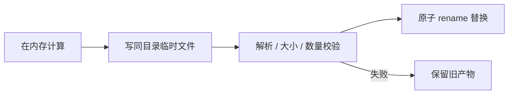

适用于：

- 文章 Markdown/JSON；
- PDF；
- 八个边界分片；
- `.gz`；
- `dist/.openai`。

八个分片是一组，应先在临时目录全部成功，再整体提交。

### P1：建立工具测试

不访问网络也能测：

- URL 反转义和去重；
- 微信元数据多种 HTML 写法；
- 嵌套标签正文提取；
- 图片扩展名优先级；
- 图片缓存和失败降级，可用假的 fetch；
- Markdown 私有子集；
- 几何简化端点、闭环、孔洞策略；
- 八桶确定性和字节上限；
- gzip 两次输出哈希一致；
- Vite 插件在无 hosting/drizzle 时的行为。

同时新增 `typecheck: "tsc --noEmit"`，并让 CI 和正式 build 前执行。先给 hosting JSON 定义可选字段 schema，再引入 Cloudflare Worker 类型，使当前四个错误归零；不能用“Vite 能转译”代替类型验证。

### P1：给每条流水线一个正式命令

例如：

```json
{
  "scripts": {
    "data:prefectures": "python scripts/build_lightweight_prefectures.py",
    "assets:precompress": "python scripts/precompress_static_assets.py",
    "verify:generated": "node scripts/verify_generated_assets.mjs",
    "build:cloudflare": "vinext build",
    "build:nginx": "npm run verify:generated && npm run assets:precompress"
  }
}
```

名字必须表达产物和部署目标。是否真的把 Python 命令放进 npm 不是重点，重点是仓库有唯一、可发现、可验证的入口。

### P2：清理模板残留

若暂不使用数据库和 Next 图片：

- 移除 Drizzle 依赖与 `db:generate`；
- 移除未用的 `react-loading-skeleton`；
- 从 `Env` 删除虚假必填 `DB`；
- 明确图片优化绑定，或禁用不可达入口；
- 简化 hosting 条件分支。

若要使用，则反过来补齐真实配置和集成测试，不要停留在类型声明。

### P2：为离线数据记录 provenance

每类数据应有：

- 来源 URL/版本/许可；
- 原始文件哈希；
- 生成脚本版本；
- 参数；
- 产物数量和大小；
- 验证日期。

小程序数据缺少生成链，第 13 章已经指出；Web 边界分片有脚本，但仍缺上游来源记录。

### P3：按需求决定是否移除 iframe

先抽共享领域模块，再迁一条用户链，例如搜索或路线展示。不要同时迁地图、归档、编辑器和指南，否则很难判断行为差异来自哪一层。

## 24. 十个 TypeScript/TSX 函数节点总表

| # | 文件 | 行 | 节点 | 工程职责 |
| ---: | --- | ---: | --- | --- |
| 1 | `app/layout.tsx` | 9 | `RootLayout` | Next 根 HTML 与 children 插槽 |
| 2 | `app/page.tsx` | 1 | `Home` | 全屏静态站 iframe |
| 3 | `vite.config.ts` | 36 | 异步配置箭头函数 | 环境默认值、动态导入和插件组装 |
| 4 | `sites-vite-plugin.ts` | 5 | `exists` | 路径存在检查 |
| 5 | `sites-vite-plugin.ts` | 18 | `sites` | Vite 插件工厂 |
| 6 | `sites-vite-plugin.ts` | 24 | `configResolved` | 记录真实项目 root |
| 7 | `sites-vite-plugin.ts` | 27 | `closeBundle` | 重建并复制 `dist/.openai` |
| 8 | `worker/index.ts` | 29 | `worker.fetch` | Worker 请求分流 |
| 9 | `worker/index.ts` | 35 | `fetchAsset` 箭头 | 从 ASSETS binding 取源图 |
| 10 | `worker/index.ts` | 36 | `transformImage` 箭头 | 调 Cloudflare Images 转换 |

## 25. 81 个节点的覆盖核算

| 类别 | 计算 | 总数 |
| --- | --- | ---: |
| 两份微信抓取器 | 23 × 2 | 46 |
| 文章阅读器 | 14 def + 1 lambda | 15 |
| 边界生成器 | 6 def + 4 lambda | 10 |
| 预压缩器 | 顶层语句，无函数 | 0 |
| TS/TSX 外壳 | 2 + 1 + 4 + 3 | 10 |
| **本章合计** | **46 + 15 + 10 + 0 + 10** | **81** |

本章没有把 JSON、类型接口、React metadata、Vite 配置对象或顶层 for 循环伪装成函数。`precompress_static_assets.py` 虽然函数数是 0，其全部可执行顶层行为仍已解释。

## 26. 本章验证证据和没有做的事

已做的只读或无业务写入验证：

- Python AST 逐文件统计：23、23、15、10、0，共 71；
- TypeScript/TSX AST 统计可执行节点，共 10；
- 五个 Python 文件都能被 Python 3.8 语法编译；
- 两个抓取器逐行差异确认旧入口缺 `--start`；
- 用最小字符串复现远程行内图片 HTML 损坏；
- 372 个边界 Feature 在内存重算后，八个现有分片逐字节全匹配；
- 当前 `public/static-site` 没有 `.gz`；
- 当前生成的 Wrangler 配置无 D1/R2；
- `npm run build` 成功，实际重建了 client、server、RSC、SSR 和 `dist/.openai/hosting.json`；
- `npx tsc --noEmit` 失败：hosting 的 `d1/r2` 两错，Worker 的 `Fetcher/D1Database` 两错；
- 业务源码没有因本章文档工作发生变化。

这两个结果并不矛盾：当前 vinext/Vite 构建只转译 TypeScript，没有把完整 `tsc` 作为质量门。工程结论应写成“发布包目前能生成，但类型合同不健康”，而不是只取其中一个结果。

验证结束后，本次 build 改写的 6 个已跟踪生成文件已还原，本次新增的 18 个静态产物和 `tsconfig.tsbuildinfo` 已清理；它们都可再次由 build 生成，手写源码和用户原有修改没有被覆盖。

没有做：

- 没有联网抓微信公众号文章；
- 没有覆盖现有文章、图片、边界或 gzip 产物；
- 没有宣称 PDF 在所有 Chrome/Edge 版本打印一致；
- 没有宣称 Cloudflare 线上一定配置 `IMAGES` binding；
- 没有把模板遗留直接删掉，因为本阶段目标是理解和审计，不是未经选择改发布架构。

Python 语法检查产生的 `scripts/__pycache__` 被 `.gitignore` 明确忽略，不属于提交内容。

## 27. 零基础动手路线

### 先学一个纯函数

打开 `build_lightweight_prefectures.py`，给 `point_segment_distance_squared` 三组简单点，在纸上算一遍。它没有网络和文件副作用。

### 再看一个流水线

用 `wechat_batch_fetch.py --list-only --limit 10` 只检查链接，不下载文章。先理解输入和切片，再考虑网络。

### 再看生成与展示分离

取一篇已有 Markdown：

1. `build_html` 生成阅读器；
2. 浏览器打开 HTML；
3. `print_pdf` 只是把同一页面打印。

### 最后跟一次网页请求

1. 浏览器请求根路径；
2. Worker 交给 vinext；
3. `Home` 返回 iframe；
4. iframe 请求 `/static-site/index.html`；
5. 静态 HTML 再加载第 1–12 章解释的 Web 模块。

到这里，你就能回答“我改了哪个文件，需要重新生成数据、重新 build，还是只刷新浏览器”。

## 28. 本章结论

项目的幕后工程不是一条线：

1. 微信采集工具把外部文章变成 Markdown/JSON/图片，再变 HTML/PDF；
2. 行政区生成器把完整 GeoJSON 强力简化并均衡分片；
3. 预压缩器为 Nginx 静态部署准备可重复 gzip，但当前未接入命令；
4. Next 只提供 iframe 宿主；
5. Vite/vinext 生成 Cloudflare client/server 产物；
6. Worker 只特判图片优化，其余交给框架；
7. Nginx 是独立的直接静态部署方案。

从工程角度，优先级最高的不是增加更多工具，而是消除旧副本和确定性转换缺陷、让所有生成步骤可测试且原子、明确两种部署方案的正式入口。

下一章将审计根目录 `index.html/app.js/trip-*.js`：它们看起来像当前 Web 站点，实际是更旧、函数更多的可运行副本。我们会测量它与 `public/static-site` 的漂移，而不是把两套源码混着讲。

- [第 15 章：根目录旧版 Web——一份被冻结的历史发布快照](./15-root-legacy-snapshot.md)
