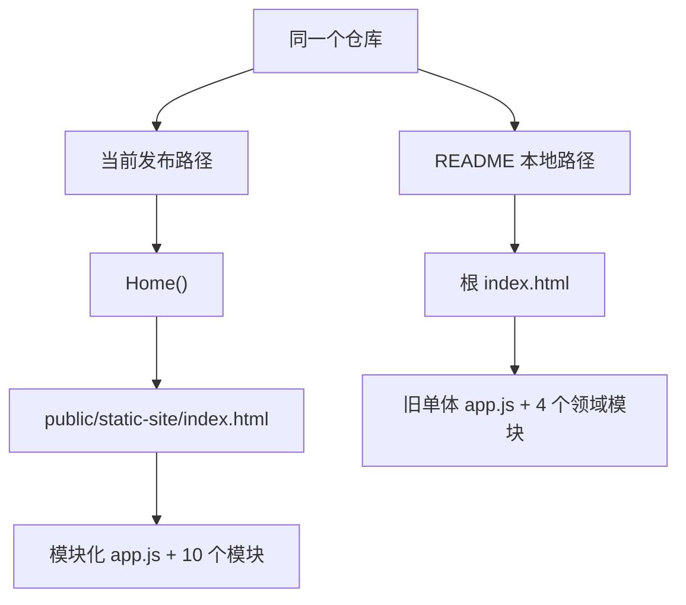
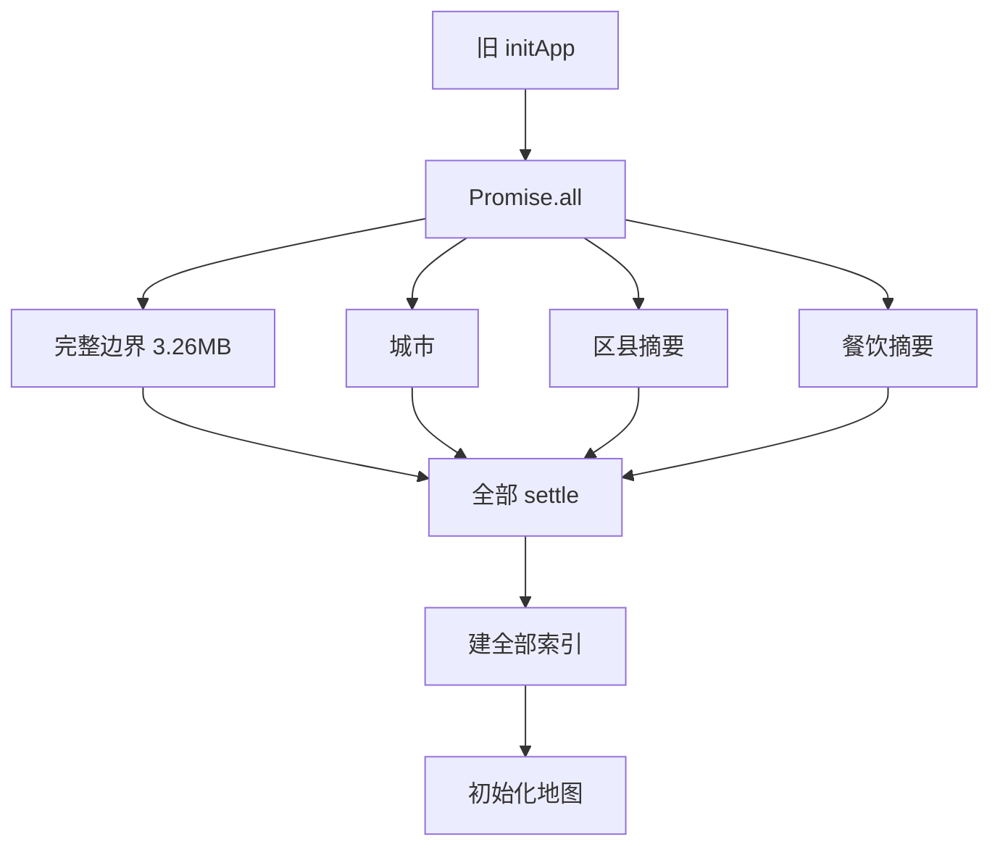
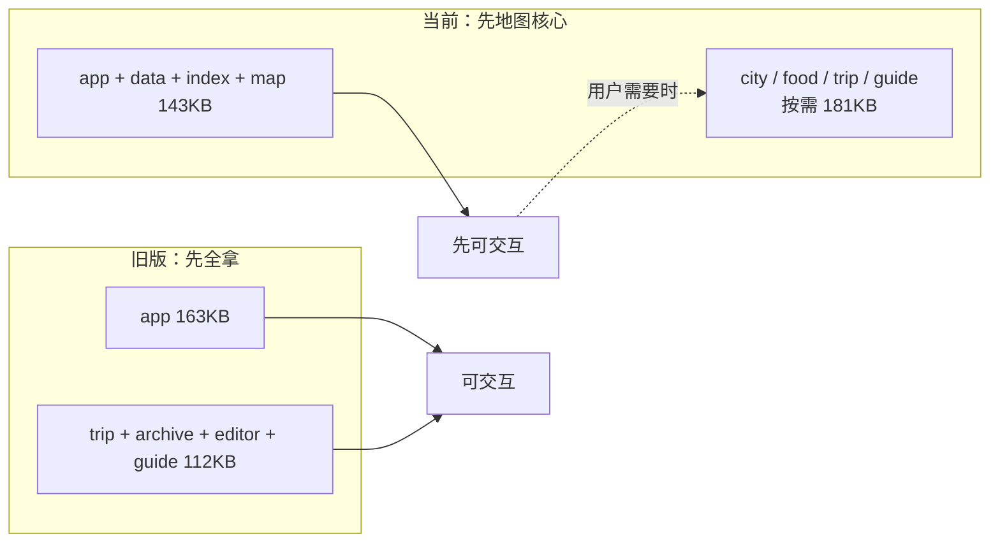
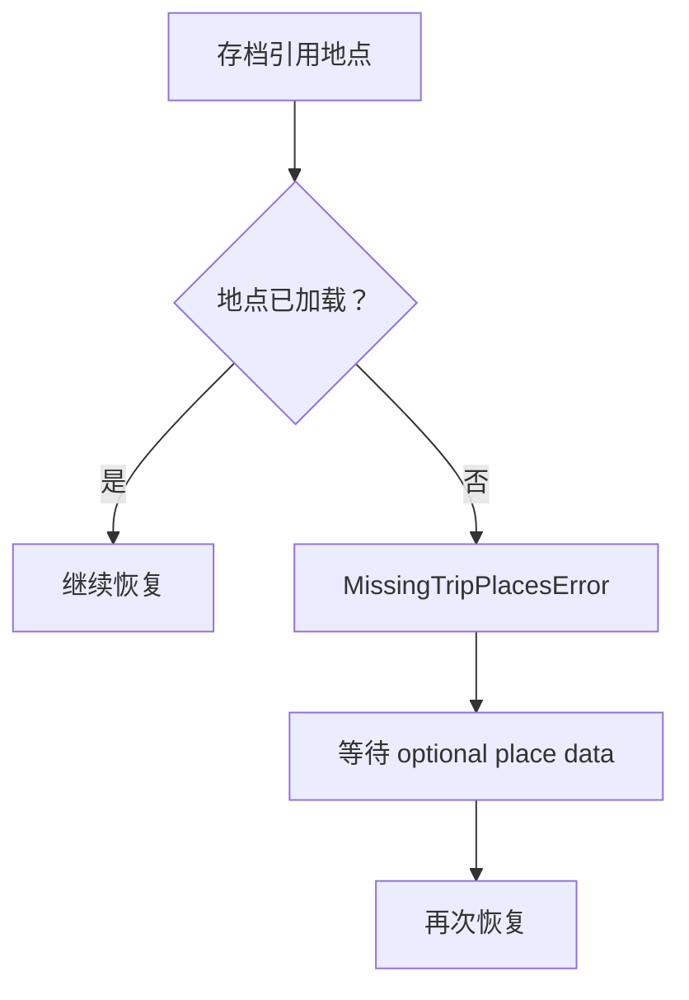
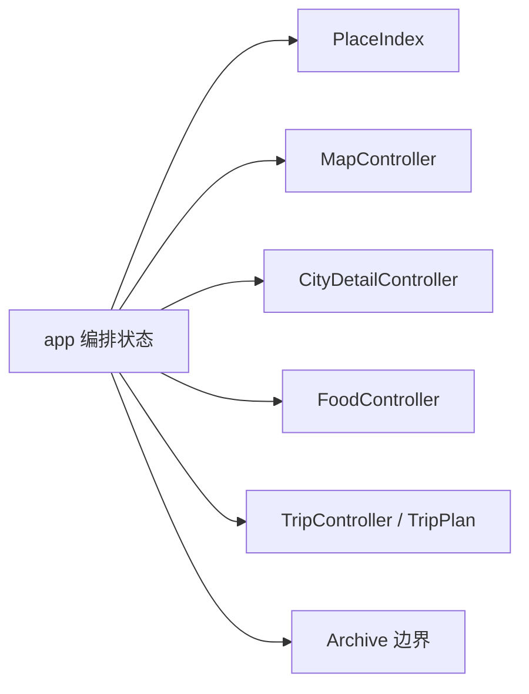
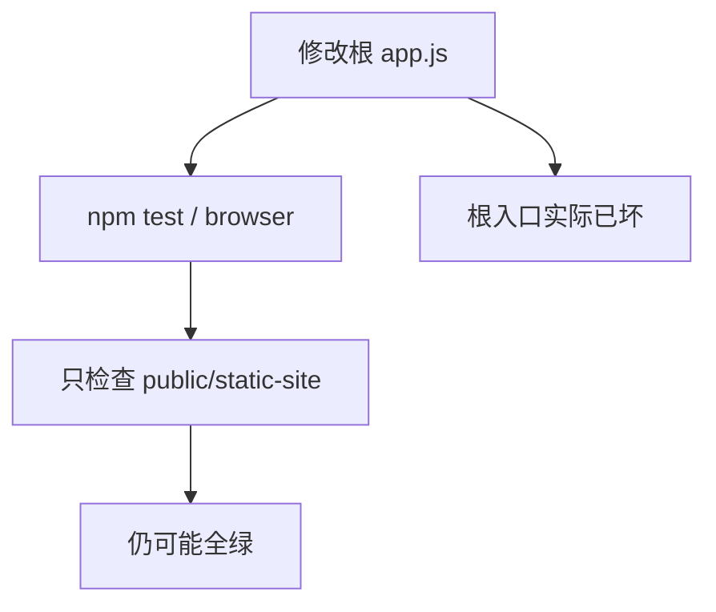
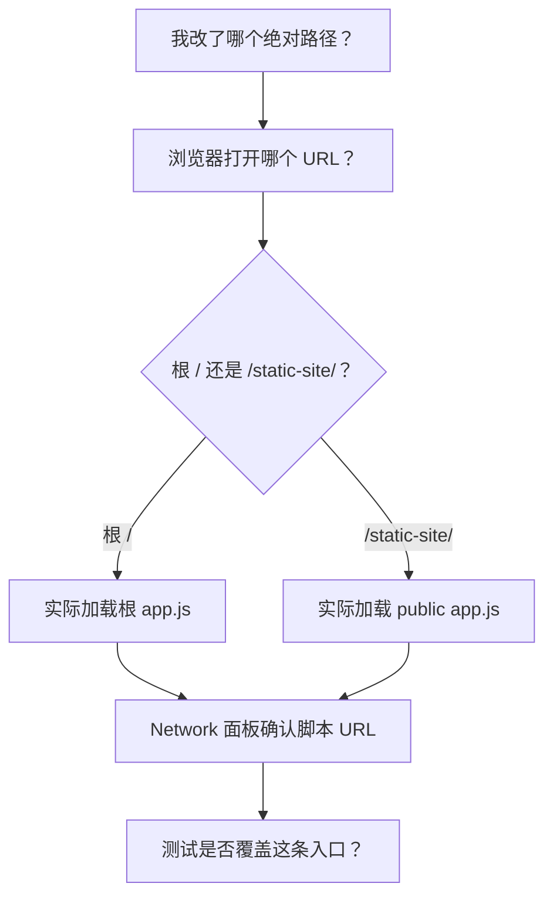

# 第 15 章：根目录旧版 Web——一份被冻结的历史发布快照

> 本章解释根目录的 `index.html`、`app.js`、`styles.css`、`trip-*.js` 和 `guide-export.js`。它们仍能组成网页，但不是 Next iframe、Cloudflare build 和自动化测试使用的当前实现。

## 1. 先给结论：不是“两套都同样新”

当前真实发布入口：

```text
app/page.tsx
  → iframe /static-site/index.html
  → public/static-site/app.js
```

README 当前教你的本地入口：

```text
python -m http.server 4177
  → /
  → 根目录 index.html
  → 根目录 app.js
```

两条路径会打开外观相似的产品，但加载的 JavaScript 不同。



对新人最危险的不是旧文件完全不能运行，而是它能运行、长得也像当前产品，却没有后续性能重构和修复。

## 2. 五问核验后的架构判断

### 为什么根目录文件存在

它们曾经就是已发布站点。后来部署副本放进 `public/static-site`，根目录仍保留。

### 为什么能确定它是历史快照

忽略 Windows CRLF 与 Git LF 换行差异，根目录七个 Web 文件与提交 `f16fb1f9` 当时的 `public/static-site` 文件逐字相同。

### 为什么不是当前源码

这个提交时间是 2026-07-14 21:42:12 +08:00。此后到当前 HEAD 有 27 个仓库提交；其中至少 15 个直接改了已发布 Web 的主脚本、行程模块或入口。

### 为什么两边功能看起来仍相同

后续大部分工作是渐进加载和模块所有权重构。旧函数大量被原样移动到 `map-core`、`city-detail` 等模块，DOM 结构和样式则几乎没变。

### 为什么必须单独讲

如果你修改根 `app.js`，Next/Cloudflare 页面不会变化；如果你只改 `public/static-site/app.js`，按 README 启动根目录又看不到变化。这个“双真相”会制造最难排查的“我明明改了代码”问题。

结论：

> 根目录是一份可运行的 2026-07-14 历史发布快照；`public/static-site` 是当前权威 Web 源码。

## 3. 精确来源证据

| 根文件 | 当前发布文件 | 根文件状态 |
| --- | --- | --- |
| `index.html` | `public/static-site/index.html` | 历史入口，当前差 7 行 |
| `styles.css` | `public/static-site/styles.css` | 仍逐字相同 |
| `app.js` | `public/static-site/app.js` + 提取模块 | 历史单体，已严重分叉 |
| `guide-export.js` | 同名发布模块 | 逻辑函数全部相同，仅 import URL 版本不同 |
| `trip-editor.js` | 同名发布模块 | 逻辑函数全部相同，仅 import URL 版本不同 |
| `trip-archive.js` | 同名发布模块 | 旧版是当前 29 个函数的严格子集 |
| `trip-plan.js` | 同名发布模块 | 168 个节点原样；ID 工厂已修复并多 1 个箭头函数 |

`styles.css` 相同不代表整个应用相同。HTML 元数据、模块入口、加载策略、归档恢复和 ID 生成已经分叉。

## 4. 文件和函数规模

### 4.1 七个 Web 文件

| 文件 | 根目录行数 | 根函数 | 当前行数 | 当前同名文件函数 |
| --- | ---: | ---: | ---: | ---: |
| `index.html` | 272 | 0 | 269 | 0 |
| `styles.css` | 1,716 | 0 | 1,716 | 0 |
| `app.js` | 4,136 | 406 | 2,592 | 274 |
| `guide-export.js` | 919 | 75 | 919 | 75 |
| `trip-archive.js` | 283 | 29 | 339 | 34 |
| `trip-editor.js` | 567 | 59 | 567 | 59 |
| `trip-plan.js` | 1,128 | 169 | 1,141 | 170 |

旧网页运行时总函数数：

```text
406 + 75 + 29 + 59 + 169 = 738
```

当前已发布 Web 的 11 个运行时模块共有 929 个函数节点。当前总数更高，不是因为主文件更臃肿，而是增加了加载器、控制器、失败降级、恢复协调和模块边界。

### 4.2 旧 `app.js` 内部分区

| 行号 | 旧单体职责 | 声明 | 箭头 | 合计 |
| --- | --- | ---: | ---: | ---: |
| 1–579 | import、常量、大型目录、DOM 引用 | 0 | 3 | 3 |
| 580–742 | 数据下载、索引、餐饮摘要 | 12 | 22 | 34 |
| 743–1239 | Leaflet 初始化、全国图、搜索、路线绘制 | 26 | 31 | 57 |
| 1240–2081 | TripPlan、编辑表单、行程与侧栏渲染 | 51 | 48 | 99 |
| 2082–2586 | 存档、恢复、导入、分享 | 20 | 6 | 26 |
| 2587–2674 | 状态文字、格式化、点击队列 | 13 | 2 | 15 |
| 2675–3551 | 城市详情、边界、景点、铁路、地铁 | 51 | 53 | 104 |
| 3552–3729 | 餐饮文章和 marker | 15 | 7 | 22 |
| 3730–3933 | 交通模式与路线估算 | 16 | 3 | 19 |
| 3934–4076 | 指南模型和下载 | 7 | 6 | 13 |
| 4077–4135 | 初始化与事件绑定 | 1 | 13 | 14 |
| **合计** |  | **212** | **194** | **406** |

这张表解释了为什么旧文件难维护：地图、数据、城市详情、餐饮、路线、存档、指南和事件都共享同一个文件级状态。

## 5. 数据和第三方库有没有一起漂移

递归哈希结果：

| 目录对比 | 根文件数 | 当前文件数 | 相同 | 当前额外 | 内容变化 |
| --- | ---: | ---: | ---: | ---: | ---: |
| `data` vs `public/static-site/data` | 585 | 593 | 585 | 8 | 0 |
| `vendor` vs `public/static-site/vendor` | 7 | 7 | 7 | 0 | 0 |

当前额外八个文件正是：

```text
china-prefectures-lite-1.json
...
china-prefectures-lite-8.json
```

因此：

- 城市、区县、铁路、地铁、餐饮等 585 个原有数据文件没有内容漂移；
- Leaflet 第三方资产没有漂移；
- 主要差别是当前站点新增轻量边界加载路径；
- 在根目录维护一份完全重复的数据和 vendor 仍会增加体积与误改风险。

## 6. 旧启动：为什么必须等全部大数据

旧 `loadMapData()` 用一个 `Promise.all` 同时等待：

- 完整 `china-prefectures.json`；
- 城市数据；
- 区县摘要；
- 餐饮摘要。

完整行政区文件约 3.26MB，gzip 后约 1.05MB。只要关键地图或城市失败，启动失败；两个摘要虽用 optional loader 降级，但仍阻塞 `Promise.all` 完成。



当前第 1 章讲过的新路径：

1. 先加载城市和八片轻量边界；
2. 先让地图可用；
3. 区县和餐饮摘要延后；
4. 区县详情、餐饮、行程领域按需动态加载；
5. 每一层有独立失败状态。

八片轻量边界合计约 193KB，gzip 合计约 59KB；相对完整边界，原始和 gzip 体积都下降约 94%。

## 7. JavaScript 首屏体积变化

旧入口顶层静态 import 行程计划、归档、编辑器和指南，`app.js` 自己又内置地图、城市详情和餐饮。

| 入口 | 初始 JS 文件 | 原始字节 | 各文件 gzip 合计 |
| --- | ---: | ---: | ---: |
| 根目录旧版 | 5 | 275,103 | 67,099 |
| 当前发布版 eager | 4 | 142,878 | 35,772 |
| 当前发布版 lazy 能力 | 7 | 181,351 | 44,192 |

当前所有模块加起来不一定更小；它把非首屏能力推迟到真正需要时。首屏 eager JS 原始体积约少 48%，gzip 合计约少 47%。



## 8. 406 个旧 app 函数去了哪里

用 AST 取出每个旧函数节点，再把规范化函数源码与当前六个相关模块比较：

| 分类 | 节点数 | 含义 |
| --- | ---: | --- |
| 函数体原样存在 | 272 | 只是移动文件或行号，行为主体没变 |
| 同名但函数体改写 | 68 | 为依赖注入、控制器、懒加载或失败状态调整 |
| 没有同名对应 | 66 | 匿名回调上下文变化，或旧接口被新控制器取代 |
| **合计** | **406** |  |

原样节点落点至少包括：

- 当前 `app.js`：166；
- `place-index.js`：11；
- `map-core.js`：27；
- `city-detail.js`：70；
- `food-content.js`：2。

这里的落点计数可能大于 272，因为很短的通用回调可能在多个文件出现相同源码。

### 8.1 为什么“同名改写”很多

例如旧 `renderRoutes()` 直接读全局 `state` 和 Leaflet layer；新版本位于 map controller 内，需要通过控制器状态和依赖操作。业务名字相同，所有权不同。

旧：

```text
app.js 函数 → 直接读写 map / layer / state
```

新：

```text
app.js 编排 → mapController 方法 → Leaflet
```

### 8.2 没同名不等于能力删除

典型替代：

| 旧函数 | 当前替代 |
| --- | --- |
| `hydrateFoodArticles` | deferred loader + food controller 初始化 |
| `mergeCountyRecords` | `hydrateCountySummary` 经 import alias |
| `initMap` | `createMapController` |
| `foodSuggestionsForPlace` | food controller 查询 + `currentFoodSuggestionsFor` |
| `renderMetroLines` | map controller 的城市详情渲染输入 |
| `renderFoodPanel` | food controller 的 `renderPanel` |
| `updateRouteMetrics` | map controller 的指标回调与 TripPlan 同步 |

“函数名消失”可能表示职责合并、接口反转或方法归属改变，必须沿调用链判断。

## 9. 旧单体与当前模块的职责映射

| 旧 `app.js` 区域 | 当前主要文件 | 已有细讲 |
| --- | --- | --- |
| 数据下载和渐进摘要 | `app-data.js` | 第 1 章、第 10 章 |
| 地点规范化和索引 | `place-index.js` | 第 1 章 |
| Leaflet 图层与路线 provider | `map-core.js` | 第 2 章 |
| 城市详情、景点、铁路、地铁 | `city-detail.js` | 第 4 章 |
| 餐饮数据与面板 | `food-content.js` | 第 5 章 |
| 点击地点到 TripPlan | `trip-controller.js` | 第 3 章 |
| TripPlan 与编辑器 | `trip-plan.js`、`trip-editor.js` | 第 6、7 章 |
| 存档恢复 | `trip-archive.js` + 当前 app | 第 8、12 章 |
| 指南导出 | `guide-export.js` + 当前 app | 第 9、12 章 |
| 当前壳层编排 | 当前 `app.js` | 第 10–12 章 |

所以学习顺序仍应以第 1–12 章的当前模块为主。本章的 406 节点账本用于历史追踪，不建议把旧单体当第一份 JavaScript 教材。

## 10. `index.html`：只有 7 行差异，含义却不小

根入口比当前入口多三个 meta：

```html
<meta http-equiv="Cache-Control" content="no-store" />
<meta http-equiv="Pragma" content="no-cache" />
<meta http-equiv="Expires" content="0" />
```

并使用旧资源版本：

- CSS：`itinerary-guide-4`；
- app：`calendar-planner-1`。

当前入口去掉 meta，统一使用 `progressive-2`。

为什么：

- HTML meta 不能可靠替代服务器 Cache-Control；
- 当前 Nginx/托管层已经区分首页与版本化资产；
- `?v=progressive-2` 让缓存键随发布变化；
- 旧入口的 app query 不会加载当前拆分模块。

HTML 主体表单和按钮只差这几行，因此两版外观很难靠肉眼区分。

## 11. `styles.css`：目前真正相同

SHA-256 相同、字节数相同、1,716 行相同。无须重复解释两遍。

但这是一种偶然同步，不是自动保证。仓库没有脚本声明“根 CSS 必须复制到 public”，以后任何一边修改都可能漂移。

正确做法应是只有一份源文件，另一条部署路径引用或由构建复制；不应靠维护者记得手工改两处。

## 12. `guide-export.js` 与 `trip-editor.js`：逻辑完全相同

差异各只有 import 一行：

```js
// 根目录
from "./trip-plan.js"

// 当前发布
from "./trip-plan.js?v=progressive-2"
```

验证结果：

- 根 guide 75 / 75 个函数体在当前文件原样存在；
- 根 editor 59 / 59 个函数体在当前文件原样存在。

因此第 7 章和第 9 章的逐函数解释也适用于根副本。唯一运行差异是模块 URL 缓存键；浏览器会把带 query 和不带 query 视为不同模块地址。

## 13. `trip-plan.js`：一个函数修复，新增一个箭头

根版本 169 个节点；当前 170 个。根版本中 168 个函数体仍原样存在，唯一改写的具名函数是 `defaultIdFactory(prefix)`。

### 13.1 根版本

```js
return `${prefix}-${crypto.randomUUID()}`;
```

`crypto.randomUUID()` 依赖浏览器安全上下文。localhost 通常被当作可信来源，所以 README 的本机地址可能正常；普通公网 HTTP 地址可能没有这个方法，创建行程 ID 时会失败。

### 13.2 当前版本

顺序回退：

1. `globalThis.crypto.randomUUID`；
2. `crypto.getRandomValues` 生成两个 32 位随机数；
3. 再没有就 `Math.random`；
4. 组合时间、递增计数和随机片段。

新增的第 170 个节点是：

```js
Array.from(randomPart, (value) => value.toString(36))
```

这个箭头把随机整数转成 36 进制短字符串。

更好的长期方案取决于需求：

- 只需页面内唯一：当前回退足够；
- 需要跨设备强唯一：服务端 UUID 或成熟 UUID 实现；
- 安全相关 token：不能退回 `Math.random`。

当前 ID 只是行程实体标识，不是密码或授权凭据。

## 14. `trip-archive.js`：当前多出的五个节点

根版本 29 个函数体全部在当前 34 个节点中原样存在。新增：

| 节点 | 作用 |
| --- | --- |
| `tripReference` | 清理旧行程中的地点引用 |
| `prepareLegacyRecoveryData` | 保留结构合法的旧路线，但暂不要求地点已经加载 |
| 其中 `flatMap` 箭头 | 每条旧路线返回 0 或 1 条清理结果 |
| `MissingTripPlacesError.constructor` | 携带缺失地点 ID |
| `selectTripRecoveryCandidate` | 区分 ready、deferred、unavailable |

为什么需要：当前站点先显示地图，再延后加载完整地点。恢复逻辑可能在某个区县记录到达前运行。

旧逻辑在 `prepareTripMigration` 中直接过滤：

```text
placeById(from/to) 当前不存在
        ↓
把旧路线当无效丢掉
```

当前逻辑：



这不是为了增加格式复杂度，而是为了让“渐进加载”和“准确恢复”同时成立。

## 15. 旧 `app.js` 的关键架构差异

### 15.1 同步 import 所有行程能力

根 app 启动前浏览器必须下载、解析：

- TripPlan；
- archive；
- guide；
- editor。

当前 `loadTripControllerModule` 首次真正使用行程能力才动态 import；guide 又在需要导出时加载。

### 15.2 直接拥有 Leaflet 对象

旧 `initMap`、`renderCities`、`renderRoutes`、`renderMetroLines` 共享大量文件级 layer 和 lookup。

当前 `createMapController` 把 Leaflet 所有权关进一个控制器，app 只调用方法。第 2 章讲的 `destroy`、generation 防旧异步写回等能力旧单体没有。

### 15.3 城市详情与餐饮不能独立失败

旧城市详情和餐饮函数就在 app 内；相关数据/网络错误容易穿透主流程。

当前：

- `loadCityDetailController`；
- `loadFoodController`；
- 分别记录 module promise、controller promise、failure reported；
- 当前 app 可以显示模块失败提示而不让整个地图失效。

### 15.4 全局状态投影更多

旧单体直接维护地图 layer、地点索引、食物分组、行程、表单、存档和详情视图。一个函数能顺手改多个区域，调用短但不变量隐藏。

当前依然有 app 状态，但重要所有权拆到：



边界变多的代价是异步协调函数增加；收益是每个子系统可以单独测试和降级。

## 16. 当前已修而根版本没有的风险

### 16.1 公网 HTTP 行程 ID

根 `crypto.randomUUID` 可能不可用；当前有回退。

### 16.2 首屏等待和流量

根先拿完整边界和所有领域模块；当前轻量边界 + lazy modules。

### 16.3 渐进数据恢复

根可能把尚未加载的地点误判为无效；当前可 deferred。

### 16.4 地图控制器生命周期

当前经历了 “consolidate Leaflet rendering ownership” 和 “harden map controller lifecycle” 提交；根版本没有这些后续修复。

### 16.5 自动化测试

Node 测试全部导入 `public/static-site`；Playwright 的本地服务器也明确以它为目录。没有测试会在根副本漂移或损坏时失败。



这比“旧代码本身不好”更危险：CI 会给错误的安全感。

## 17. README 为什么会误导

README 明确写：

- 网页版基于根 `index.html/app.js/styles.css`；
- 在仓库根目录运行 `python -m http.server 4177`；
- 打开 `http://127.0.0.1:4177/`。

这条命令确实启动旧快照。与当前 package、Next iframe、测试和 build 的真实权威路径冲突。

当前至少应区分三种命令：

| 目的 | 推荐入口 |
| --- | --- |
| 开发完整当前宿主 | `npm run dev` |
| 只调试当前静态地图 | `python -m http.server --directory public/static-site` |
| 回看历史快照 | 根目录 server，明确标“legacy” |

“能打开”不能作为 README 正确的证明；入口必须和测试、构建、部署指向同一源。

## 18. 为什么当初会保留双副本

可能的工程过程很自然：

1. 项目最初就是根静态站；
2. 为 Sites/Next 部署复制到 `public/static-site`；
3. 为避免破坏原启动方式，根副本暂时保留；
4. 后续性能重构只改发布目录；
5. README 和旧副本没有一起退役。

短期保留能降低迁移风险。问题在于“暂时兼容”没有结束条件，也没有同步检查，最终变成两个入口。

## 19. 更好的方案

### P0：先声明唯一权威源

建议明确：

```text
Web source of truth = public/static-site
```

README、开发命令、测试和部署全部指向它。

### P0：处理旧根 URL

三种方案，从推荐到折中：

1. 删除根 Web 副本，根入口明确跳转到 `/static-site/`；
2. 构建时从唯一源生成兼容副本，并禁止手改；
3. 暂时保留，但加 CI 哈希检查和醒目 legacy 标记。

不推荐继续手工双改。

### P1：去掉数据/vendor 重复

585 个数据文件和 7 个第三方文件当前逐字重复。保留一份，通过服务器路径或构建复制解决兼容。

### P1：给 README 加架构入口表

至少写清：

- `app/page.tsx` 是外层；
- `public/static-site/index.html` 是当前地图入口；
- 根副本是 2026-07-14 快照；
- 小程序是另一运行时；
- `dist/.next/exports/work` 是生成或工作目录。

### P1：CI 禁止再次漂移

如果暂时必须保留根副本：

- 对应文件逐项比较；
- 允许的 import query/HTML cache 差异显式列白名单；
- 根目录没有测试就至少做浏览器烟测；
- PR 中根和 public 单边变化直接失败。

### P2：迁移历史价值到 Git，而不是工作树

Git 已经完整保存 `f16fb1f9`。通常无需在当前工作树保留整份快照；需要回看时可以用 tag、branch 或 `git show`。

## 20. 怎样读后面的 406 节点账本

账本每行有五项：

1. 旧行号；
2. 语法类型；
3. 可读标签；
4. 当前去向；
5. 对应讲解章节。

状态定义：

- **原样**：规范化空白后，当前某个函数节点源码相同；
- **同名改写**：当前仍有同名函数，但函数体改变；
- **接口取代**：没有可靠同名节点，由控制器、加载器或新回调接管。

匿名箭头的“名字”由外层函数和数组/Promise/事件调用生成，例如：

```text
loadMapData · map 回调
```

它不是源码里的正式名字，而是帮助你定位“这个小函数服务于谁”。

## 21. 旧 `app.js` 的 406 节点完整账本

> 下面的表由 AST 生成，顺序严格按旧源码行号。`FD` 是函数声明，`AF` 是箭头函数。

| # | 旧行 | 类型 | 可读标签 | 这个小函数做什么 | 当前去向 | 讲解 |
| ---: | ---: | --- | --- | --- | --- | --- |
| 1 | 49 | AF | 顶层 · createLazyStorageAdapter 回调 1 | 为 createLazyStorageAdapter 提供回调 | 原样 → app.js:119 | [第 10 章](./10-app-bootstrap-data-search.md) |
| 2 | 54 | AF | fromCity 属性箭头 | 为对象字段计算值 | 原样 → app.js:236 | [第 10 章](./10-app-bootstrap-data-search.md) |
| 3 | 61 | AF | segment 属性箭头 | 为对象字段计算值 | 原样 → app.js:243 | [第 10 章](./10-app-bootstrap-data-search.md) |
| 4 | 580 | FD | `loadJson` | 具名流程或辅助函数 | 同名改写 → app-data.js:69 | [第 1 章](./01-data-and-place-index.md) |
| 5 | 586 | FD | `loadOptionalJson` | 具名流程或辅助函数 | 同名改写 → app-data.js:93 | [第 1 章](./01-data-and-place-index.md) |
| 6 | 595 | FD | `loadMapData` | 具名流程或辅助函数 | 同名改写 → app.js:436 | [第 10 章](./10-app-bootstrap-data-search.md) |
| 7 | 608 | AF | loadMapData · filter 回调 1 | 判断当前元素是否保留 | 原样 → app.js:441 | [第 10 章](./10-app-bootstrap-data-search.md) |
| 8 | 609 | AF | loadMapData · map 回调 1 | 把当前元素转换成新值 | 原样 → app.js:442 | [第 10 章](./10-app-bootstrap-data-search.md) |
| 9 | 615 | AF | loadMapData · filter 回调 1 | 判断当前元素是否保留 | 原样 → app.js:448 | [第 10 章](./10-app-bootstrap-data-search.md) |
| 10 | 617 | AF | loadMapData · map 回调 1 | 把当前元素转换成新值 | 接口取代 / 上下文重写 | [第 1/5 章](./01-data-and-place-index.md) |
| 11 | 625 | AF | loadMapData · map 回调 1 | 把当前元素转换成新值 | 原样 → place-index.js:155 | [第 1 章](./01-data-and-place-index.md) |
| 12 | 629 | AF | loadMapData · sort 回调 1 | 比较两个元素的顺序 | 原样 → place-index.js:170 | [第 1 章](./01-data-and-place-index.md) |
| 13 | 633 | FD | `hydrateFoodArticles` | 具名流程或辅助函数 | 接口取代 / 上下文重写 | [第 1/5 章](./01-data-and-place-index.md) |
| 14 | 636 | AF | hydrateFoodArticles · filter 回调 1 | 判断当前元素是否保留 | 接口取代 / 上下文重写 | [第 1/5 章](./01-data-and-place-index.md) |
| 15 | 638 | AF | hydrateFoodArticles · sort 回调 1 | 比较两个元素的顺序 | 接口取代 / 上下文重写 | [第 1/5 章](./01-data-and-place-index.md) |
| 16 | 640 | AF | hydrateFoodArticles · map 回调 1 | 把当前元素转换成新值 | 接口取代 / 上下文重写 | [第 1/5 章](./01-data-and-place-index.md) |
| 17 | 646 | FD | `normalizeFoodArticleRecord` | 具名流程或辅助函数 | 接口取代 / 上下文重写 | [第 1/5 章](./01-data-and-place-index.md) |
| 18 | 653 | FD | `mergeFoodArticleRecords` | 具名流程或辅助函数 | 接口取代 / 上下文重写 | [第 1/5 章](./01-data-and-place-index.md) |
| 19 | 655 | AF | mergeFoodArticleRecords · map 回调 1 | 把当前元素转换成新值 | 接口取代 / 上下文重写 | [第 1/5 章](./01-data-and-place-index.md) |
| 20 | 656 | AF | mergeFoodArticleRecords · map 回调 1 | 把当前元素转换成新值 | 接口取代 / 上下文重写 | [第 1/5 章](./01-data-and-place-index.md) |
| 21 | 662 | AF | mergeFoodArticleRecords · sort 回调 1 | 比较两个元素的顺序 | 接口取代 / 上下文重写 | [第 1/5 章](./01-data-and-place-index.md) |
| 22 | 668 | FD | `groupArticlesBy` | 具名流程或辅助函数 | 接口取代 / 上下文重写 | [第 1/5 章](./01-data-and-place-index.md) |
| 23 | 670 | AF | groupArticlesBy · forEach 回调 1 | 逐个执行副作用 | 接口取代 / 上下文重写 | [第 1/5 章](./01-data-and-place-index.md) |
| 24 | 679 | FD | `enrichPlaceSearchTextWithArticles` | 具名流程或辅助函数 | 接口取代 / 上下文重写 | [第 1/5 章](./01-data-and-place-index.md) |
| 25 | 680 | AF | enrichPlaceSearchTextWithArticles · appendArticleText | 具名内联辅助函数 | 接口取代 / 上下文重写 | [第 1/5 章](./01-data-and-place-index.md) |
| 26 | 686 | AF | appendArticleText · flatMap 回调 1 | 把当前元素转换成零到多个值 | 接口取代 / 上下文重写 | [第 1/5 章](./01-data-and-place-index.md) |
| 27 | 694 | FD | `buildMunicipalityCountyEntries` | 具名流程或辅助函数 | 同名改写 → place-index.js:20 | [第 1 章](./01-data-and-place-index.md) |
| 28 | 695 | AF | buildMunicipalityCountyEntries · filter 回调 1 | 判断当前元素是否保留 | 接口取代 / 上下文重写 | [第 1/5 章](./01-data-and-place-index.md) |
| 29 | 695 | AF | buildMunicipalityCountyEntries · map 回调 1 | 把当前元素转换成新值 | 原样 → place-index.js:29 | [第 1 章](./01-data-and-place-index.md) |
| 30 | 696 | AF | buildMunicipalityCountyEntries · flatMap 回调 1 | 把当前元素转换成零到多个值 | 接口取代 / 上下文重写 | [第 1/5 章](./01-data-and-place-index.md) |
| 31 | 714 | FD | `buildPlaceMap` | 具名流程或辅助函数 | 同名改写 → place-index.js:64 | [第 1 章](./01-data-and-place-index.md) |
| 32 | 716 | AF | buildPlaceMap · forEach 回调 1 | 逐个执行副作用 | 接口取代 / 上下文重写 | [第 1/5 章](./01-data-and-place-index.md) |
| 33 | 717 | AF | buildPlaceMap · forEach 回调 1 | 逐个执行副作用 | 接口取代 / 上下文重写 | [第 1/5 章](./01-data-and-place-index.md) |
| 34 | 721 | FD | `normalizeCountyRecord` | 具名流程或辅助函数 | 同名改写 → place-index.js:51 | [第 1 章](./01-data-and-place-index.md) |
| 35 | 730 | FD | `mergeCountyRecords` | 具名流程或辅助函数 | 接口取代 / 上下文重写 | [第 1/5 章](./01-data-and-place-index.md) |
| 36 | 732 | AF | mergeCountyRecords · map 回调 1 | 把当前元素转换成新值 | 原样 → place-index.js:220 | [第 1 章](./01-data-and-place-index.md) |
| 37 | 733 | AF | mergeCountyRecords · map 回调 1 | 把当前元素转换成新值 | 接口取代 / 上下文重写 | [第 1/5 章](./01-data-and-place-index.md) |
| 38 | 743 | FD | `initMap` | 具名流程或辅助函数 | 接口取代 / 上下文重写 | [第 2 章](./02-map-core.md) |
| 39 | 777 | FD | `renderChinaLayer` | 具名流程或辅助函数 | 同名改写 → map-core.js:155 | [第 2 章](./02-map-core.md) |
| 40 | 782 | AF | renderChinaLayer · onEachFeature 属性箭头 | 为对象字段计算值 | 同名改写 → map-core.js:160 | [第 2 章](./02-map-core.md) |
| 41 | 795 | AF | onEachFeature · click 属性箭头 | 为对象字段计算值 | 同名改写 → map-core.js:173 | [第 2 章](./02-map-core.md) |
| 42 | 796 | AF | onEachFeature · dblclick 属性箭头 | 为对象字段计算值 | 同名改写 → map-core.js:174 | [第 2 章](./02-map-core.md) |
| 43 | 800 | AF | onEachFeature · mouseover 属性箭头 | 为对象字段计算值 | 原样 → map-core.js:178 | [第 2 章](./02-map-core.md) |
| 44 | 801 | AF | onEachFeature · mouseout 属性箭头 | 为对象字段计算值 | 原样 → map-core.js:179 | [第 2 章](./02-map-core.md) |
| 45 | 807 | FD | `normalizeKey` | 具名流程或辅助函数 | 原样 → place-index.js:1 | [第 1 章](./01-data-and-place-index.md) |
| 46 | 818 | FD | `normalizeSearchText` | 具名流程或辅助函数 | 原样 → place-index.js:12 | [第 1 章](./01-data-and-place-index.md) |
| 47 | 826 | FD | `buildCityKeyMap` | 具名流程或辅助函数 | 同名改写 → place-index.js:75 | [第 1 章](./01-data-and-place-index.md) |
| 48 | 835 | AF | buildCityKeyMap · forEach 回调 1 | 逐个执行副作用 | 接口取代 / 上下文重写 | [第 2 章](./02-map-core.md) |
| 49 | 840 | AF | buildCityKeyMap · forEach 回调 1 | 逐个执行副作用 | 接口取代 / 上下文重写 | [第 2 章](./02-map-core.md) |
| 50 | 841 | AF | buildCityKeyMap · find 回调 1 | 判断是否为目标元素 | 原样 → place-index.js:92 | [第 1 章](./01-data-and-place-index.md) |
| 51 | 846 | AF | buildCityKeyMap · forEach 回调 1 | 逐个执行副作用 | 原样 → place-index.js:97 | [第 1 章](./01-data-and-place-index.md) |
| 52 | 853 | FD | `buildCityProvinceKeyMap` | 具名流程或辅助函数 | 同名改写 → place-index.js:104 | [第 1 章](./01-data-and-place-index.md) |
| 53 | 855 | AF | buildCityProvinceKeyMap · setCity | 具名内联辅助函数 | 原样 → place-index.js:107 | [第 1 章](./01-data-and-place-index.md) |
| 54 | 861 | AF | buildCityProvinceKeyMap · forEach 回调 1 | 逐个执行副作用 | 接口取代 / 上下文重写 | [第 2 章](./02-map-core.md) |
| 55 | 866 | AF | buildCityProvinceKeyMap · forEach 回调 1 | 逐个执行副作用 | 接口取代 / 上下文重写 | [第 2 章](./02-map-core.md) |
| 56 | 867 | AF | buildCityProvinceKeyMap · find 回调 1 | 判断是否为目标元素 | 原样 → place-index.js:92 | [第 1 章](./01-data-and-place-index.md) |
| 57 | 876 | FD | `matchFeatureToCity` | 具名流程或辅助函数 | 同名改写 → map-core.js:103 | [第 2 章](./02-map-core.md) |
| 58 | 887 | AF | matchFeatureToCity · filter 回调 1 | 判断当前元素是否保留 | 原样 → map-core.js:113 | [第 2 章](./02-map-core.md) |
| 59 | 888 | AF | matchFeatureToCity · sort 回调 1 | 比较两个元素的顺序 | 原样 → map-core.js:114 | [第 2 章](./02-map-core.md) |
| 60 | 889 | AF | matchFeatureToCity · find 回调 1 | 判断是否为目标元素 | 原样 → map-core.js:115 | [第 2 章](./02-map-core.md) |
| 61 | 900 | AF | matchFeatureToCity · find 回调 1 | 判断是否为目标元素 | 原样 → map-core.js:122 | [第 2 章](./02-map-core.md) |
| 62 | 904 | FD | `provinceNameFromFeature` | 具名流程或辅助函数 | 原样 → map-core.js:98 | [第 2 章](./02-map-core.md) |
| 63 | 909 | FD | `featureStyle` | 具名流程或辅助函数 | 原样 → map-core.js:127 | [第 2 章](./02-map-core.md) |
| 64 | 912 | AF | featureStyle · some 回调 1 | 判断是否至少一个满足 | 原样 → map-core.js:130 | [第 2 章](./02-map-core.md) |
| 65 | 922 | FD | `renderCities` | 具名流程或辅助函数 | 同名改写 → map-core.js:185 | [第 2 章](./02-map-core.md) |
| 66 | 925 | AF | renderCities · forEach 回调 1 | 逐个执行副作用 | 接口取代 / 上下文重写 | [第 2 章](./02-map-core.md) |
| 67 | 939 | AF | renderCities · on 回调 2 | 为 on 提供回调 | 接口取代 / 上下文重写 | [第 2 章](./02-map-core.md) |
| 68 | 940 | AF | renderCities · on 回调 2 | 为 on 提供回调 | 接口取代 / 上下文重写 | [第 2 章](./02-map-core.md) |
| 69 | 949 | FD | `cityStyle` | 具名流程或辅助函数 | 原样 → map-core.js:140 | [第 2 章](./02-map-core.md) |
| 70 | 950 | AF | cityStyle · flatMap 回调 1 | 把当前元素转换成零到多个值 | 原样 → map-core.js:141 | [第 2 章](./02-map-core.md) |
| 71 | 964 | FD | `updateCityStyles` | 具名流程或辅助函数 | 同名改写 → map-core.js:342 | [第 2 章](./02-map-core.md) |
| 72 | 965 | AF | updateCityStyles · forEach 回调 1 | 逐个执行副作用 | 接口取代 / 上下文重写 | [第 2 章](./02-map-core.md) |
| 73 | 972 | FD | `updateSearchResults` | 具名流程或辅助函数 | 原样 → app.js:517 | [第 10 章](./10-app-bootstrap-data-search.md) |
| 74 | 982 | AF | updateSearchResults · map 回调 1 | 把当前元素转换成新值 | 原样 → app.js:527 | [第 10 章](./10-app-bootstrap-data-search.md) |
| 75 | 985 | AF | updateSearchResults · filter 回调 1 | 判断当前元素是否保留 | 原样 → app.js:530 | [第 10 章](./10-app-bootstrap-data-search.md) |
| 76 | 986 | AF | updateSearchResults · sort 回调 1 | 比较两个元素的顺序 | 原样 → app.js:531 | [第 10 章](./10-app-bootstrap-data-search.md) |
| 77 | 997 | AF | updateSearchResults · forEach 回调 1 | 逐个执行副作用 | 原样 → app.js:542 | [第 10 章](./10-app-bootstrap-data-search.md) |
| 78 | 1003 | AF | updateSearchResults · addEventListener 回调 2 | 响应浏览器事件 | 原样 → app.js:548 | [第 10 章](./10-app-bootstrap-data-search.md) |
| 79 | 1008 | FD | `searchResultHtml` | 具名流程或辅助函数 | 同名改写 → app.js:553 | [第 10 章](./10-app-bootstrap-data-search.md) |
| 80 | 1029 | FD | `scoreSearchResult` | 具名流程或辅助函数 | 原样 → app.js:574 | [第 10 章](./10-app-bootstrap-data-search.md) |
| 81 | 1044 | FD | `selectSearchResult` | 具名流程或辅助函数 | 同名改写 → app.js:589 | [第 10 章](./10-app-bootstrap-data-search.md) |
| 82 | 1069 | FD | `updateVisibleLabels` | 具名流程或辅助函数 | 同名改写 → map-core.js:210 | [第 2 章](./02-map-core.md) |
| 83 | 1081 | AF | updateVisibleLabels · forEach 回调 1 | 逐个执行副作用 | 接口取代 / 上下文重写 | [第 2 章](./02-map-core.md) |
| 84 | 1100 | FD | `escapeHtml` | 具名流程或辅助函数 | 原样 → app.js:615 | [第 10 章](./10-app-bootstrap-data-search.md) |
| 85 | 1101 | AF | escapeHtml · replace 回调 2 | 生成正则替换值 | 原样 → app.js:616 | [第 10 章](./10-app-bootstrap-data-search.md) |
| 86 | 1110 | FD | `landmarkPopupHtml` | 具名流程或辅助函数 | 原样 → city-detail.js:322 | [第 4 章](./04-city-detail.md) |
| 87 | 1135 | FD | `landmarkDescription` | 具名流程或辅助函数 | 原样 → city-detail.js:347 | [第 4 章](./04-city-detail.md) |
| 88 | 1163 | FD | `cleanLandmarkText` | 具名流程或辅助函数 | 原样 → city-detail.js:375 | [第 4 章](./04-city-detail.md) |
| 89 | 1169 | FD | `safeExternalUrl` | 具名流程或辅助函数 | 原样 → city-detail.js:381 | [第 4 章](./04-city-detail.md) |
| 90 | 1180 | FD | `fitChina` | 具名流程或辅助函数 | 同名改写 → map-core.js:271 | [第 2 章](./02-map-core.md) |
| 91 | 1189 | FD | `resetMapView` | 具名流程或辅助函数 | 同名改写 → app.js:625 | [第 10 章](./10-app-bootstrap-data-search.md) |
| 92 | 1201 | FD | `renderRoutes` | 具名流程或辅助函数 | 同名改写 → map-core.js:315 | [第 2 章](./02-map-core.md) |
| 93 | 1204 | AF | renderRoutes · forEach 回调 1 | 逐个执行副作用 | 原样 → map-core.js:318 | [第 2 章](./02-map-core.md) |
| 94 | 1230 | FD | `curvedRoutePoints` | 具名流程或辅助函数 | 原样 → map-core.js:291 | [第 2 章](./02-map-core.md) |
| 95 | 1246 | AF | curvedRoutePoints · from 回调 2 | 按索引生成数组元素 | 原样 → map-core.js:305 | [第 2 章](./02-map-core.md) |
| 96 | 1256 | FD | `isValidRouteId` | 具名流程或辅助函数 | 原样 → app.js:638 | [第 11 章](./11-app-trip-rendering.md) |
| 97 | 1261 | FD | `syncRoutesFromTripPlan` | 具名流程或辅助函数 | 同名改写 → app.js:643 | [第 11 章](./11-app-trip-rendering.md) |
| 98 | 1267 | AF | syncRoutesFromTripPlan · map 回调 1 | 把当前元素转换成新值 | 原样 → app.js:649 | [第 11 章](./11-app-trip-rendering.md) |
| 99 | 1270 | AF | syncRoutesFromTripPlan · reduce 回调 1 | 把当前元素累积到结果 | 原样 → app.js:652 | [第 11 章](./11-app-trip-rendering.md) |
| 100 | 1278 | AF | syncRoutesFromTripPlan · allocateRouteId | 具名内联辅助函数 | 原样 → app.js:660 | [第 11 章](./11-app-trip-rendering.md) |
| 101 | 1286 | AF | syncRoutesFromTripPlan · map 回调 1 | 把当前元素转换成新值 | 原样 → app.js:668 | [第 11 章](./11-app-trip-rendering.md) |
| 102 | 1288 | AF | syncRoutesFromTripPlan · find 回调 1 | 判断是否为目标元素 | 原样 → app.js:670 | [第 11 章](./11-app-trip-rendering.md) |
| 103 | 1321 | AF | syncRoutesFromTripPlan · forEach 回调 1 | 逐个执行副作用 | 接口取代 / 上下文重写 | [第 11 章](./11-app-trip-rendering.md) |
| 104 | 1324 | FD | `commitTripPlan` | 具名流程或辅助函数 | 同名改写 → app.js:706 | [第 11 章](./11-app-trip-rendering.md) |
| 105 | 1342 | AF | commitTripPlan · requestAnimationFrame 回调 1 | 为 requestAnimationFrame 提供回调 | 原样 → app.js:727 | [第 11 章](./11-app-trip-rendering.md) |
| 106 | 1349 | FD | `tripIdentifier` | 具名流程或辅助函数 | 原样 → app.js:734 | [第 11 章](./11-app-trip-rendering.md) |
| 107 | 1353 | FD | `affectedTripDayLabels` | 具名流程或辅助函数 | 原样 → app.js:738 | [第 11 章](./11-app-trip-rendering.md) |
| 108 | 1355 | AF | affectedTripDayLabels · flatMap 回调 1 | 把当前元素转换成零到多个值 | 原样 → app.js:740 | [第 11 章](./11-app-trip-rendering.md) |
| 109 | 1356 | AF | affectedTripDayLabels · findIndex 回调 1 | 为 findIndex 提供回调 | 原样 → app.js:741 | [第 11 章](./11-app-trip-rendering.md) |
| 110 | 1368 | FD | `handleTripCommand` | 具名流程或辅助函数 | 原样 → app.js:753 | [第 11 章](./11-app-trip-rendering.md) |
| 111 | 1391 | FD | `tripFormControl` | 具名流程或辅助函数 | 原样 → app.js:776 | [第 11 章](./11-app-trip-rendering.md) |
| 112 | 1395 | FD | `setTripFormValue` | 具名流程或辅助函数 | 原样 → app.js:780 | [第 11 章](./11-app-trip-rendering.md) |
| 113 | 1405 | FD | `tripDayPlaceIds` | 具名流程或辅助函数 | 原样 → app.js:790 | [第 11 章](./11-app-trip-rendering.md) |
| 114 | 1407 | AF | tripDayPlaceIds · forEach 回调 1 | 逐个执行副作用 | 原样 → app.js:792 | [第 11 章](./11-app-trip-rendering.md) |
| 115 | 1414 | FD | `populateTripPlaceSelect` | 具名流程或辅助函数 | 原样 → app.js:799 | [第 11 章](./11-app-trip-rendering.md) |
| 116 | 1416 | AF | populateTripPlaceSelect · map 回调 1 | 把当前元素转换成新值 | 原样 → app.js:801 | [第 11 章](./11-app-trip-rendering.md) |
| 117 | 1429 | FD | `landmarkNamesForPlace` | 具名流程或辅助函数 | 原样 → app.js:814 | [第 11 章](./11-app-trip-rendering.md) |
| 118 | 1437 | AF | landmarkNamesForPlace · map 回调 1 | 把当前元素转换成新值 | 原样 → app.js:822 | [第 11 章](./11-app-trip-rendering.md) |
| 119 | 1442 | FD | `renderTripLandmarkOptions` | 具名流程或辅助函数 | 原样 → app.js:827 | [第 11 章](./11-app-trip-rendering.md) |
| 120 | 1445 | AF | renderTripLandmarkOptions · map 回调 1 | 把当前元素转换成新值 | 原样 → app.js:830 | [第 11 章](./11-app-trip-rendering.md) |
| 121 | 1454 | FD | `configureTripItemForm` | 具名流程或辅助函数 | 原样 → app.js:839 | [第 11 章](./11-app-trip-rendering.md) |
| 122 | 1466 | AF | configureTripItemForm · forEach 回调 1 | 逐个执行副作用 | 原样 → app.js:851 | [第 11 章](./11-app-trip-rendering.md) |
| 123 | 1469 | AF | configureTripItemForm · forEach 回调 1 | 逐个执行副作用 | 原样 → app.js:854 | [第 11 章](./11-app-trip-rendering.md) |
| 124 | 1481 | FD | `closeTripItemDialog` | 具名流程或辅助函数 | 原样 → app.js:866 | [第 11 章](./11-app-trip-rendering.md) |
| 125 | 1490 | FD | `openTripItemDialog` | 具名流程或辅助函数 | 原样 → app.js:875 | [第 11 章](./11-app-trip-rendering.md) |
| 126 | 1493 | AF | openTripItemDialog · find 回调 1 | 判断是否为目标元素 | 原样 → app.js:878 | [第 11 章](./11-app-trip-rendering.md) |
| 127 | 1508 | AF | openTripItemDialog · find 回调 1 | 判断是否为目标元素 | 原样 → app.js:893 | [第 11 章](./11-app-trip-rendering.md) |
| 128 | 1563 | AF | openTripItemDialog · requestAnimationFrame 回调 1 | 为 requestAnimationFrame 提供回调 | 原样 → app.js:948 | [第 11 章](./11-app-trip-rendering.md) |
| 129 | 1566 | FD | `submitTripItemForm` | 具名流程或辅助函数 | 原样 → app.js:951 | [第 11 章](./11-app-trip-rendering.md) |
| 130 | 1581 | FD | `updateTripNameMetadata` | 具名流程或辅助函数 | 原样 → app.js:966 | [第 11 章](./11-app-trip-rendering.md) |
| 131 | 1592 | FD | `updateTripStartDateMetadata` | 具名流程或辅助函数 | 原样 → app.js:977 | [第 11 章](./11-app-trip-rendering.md) |
| 132 | 1600 | FD | `undoTripEdit` | 具名流程或辅助函数 | 原样 → app.js:985 | [第 11 章](./11-app-trip-rendering.md) |
| 133 | 1609 | FD | `routeDurationsForAutoSchedule` | 具名流程或辅助函数 | 原样 → app.js:994 | [第 11 章](./11-app-trip-rendering.md) |
| 134 | 1611 | AF | routeDurationsForAutoSchedule · forEach 回调 1 | 逐个执行副作用 | 原样 → app.js:996 | [第 11 章](./11-app-trip-rendering.md) |
| 135 | 1616 | AF | routeDurationsForAutoSchedule · find 回调 1 | 判断是否为目标元素 | 原样 → app.js:1001 | [第 11 章](./11-app-trip-rendering.md) |
| 136 | 1622 | FD | `autoScheduleCurrentTrip` | 具名流程或辅助函数 | 原样 → app.js:1007 | [第 11 章](./11-app-trip-rendering.md) |
| 137 | 1625 | AF | autoScheduleCurrentTrip · some 回调 1 | 判断是否至少一个满足 | 原样 → app.js:1010 | [第 11 章](./11-app-trip-rendering.md) |
| 138 | 1649 | FD | `renderPanel` | 具名流程或辅助函数 | 同名改写 → app.js:1104 | [第 11 章](./11-app-trip-rendering.md) |
| 139 | 1673 | AF | renderPanel · forEach 回调 1 | 逐个执行副作用 | 原样 → app.js:1130 | [第 11 章](./11-app-trip-rendering.md) |
| 140 | 1711 | FD | `renderTripPlanner` | 具名流程或辅助函数 | 原样 → app.js:1168 | [第 11 章](./11-app-trip-rendering.md) |
| 141 | 1737 | AF | renderTripPlanner · filter 回调 1 | 判断当前元素是否保留 | 原样 → app.js:1194 | [第 11 章](./11-app-trip-rendering.md) |
| 142 | 1738 | AF | renderTripPlanner · filter 回调 1 | 判断当前元素是否保留 | 原样 → app.js:1195 | [第 11 章](./11-app-trip-rendering.md) |
| 143 | 1751 | AF | renderTripPlanner · placeName 属性箭头 | 为对象字段计算值 | 原样 → app.js:1208 | [第 11 章](./11-app-trip-rendering.md) |
| 144 | 1760 | FD | `updateTotals` | 具名流程或辅助函数 | 原样 → app.js:1217 | [第 11 章](./11-app-trip-rendering.md) |
| 145 | 1768 | FD | `routeTotals` | 具名流程或辅助函数 | 原样 → app.js:1225 | [第 11 章](./11-app-trip-rendering.md) |
| 146 | 1771 | AF | routeTotals · reduce 回调 1 | 把当前元素累积到结果 | 原样 → app.js:1228 | [第 11 章](./11-app-trip-rendering.md) |
| 147 | 1772 | AF | routeTotals · reduce 回调 1 | 把当前元素累积到结果 | 原样 → app.js:1229 | [第 11 章](./11-app-trip-rendering.md) |
| 148 | 1774 | AF | routeTotals · some 回调 1 | 判断是否至少一个满足 | 原样 → app.js:1231 | [第 11 章](./11-app-trip-rendering.md) |
| 149 | 1775 | AF | routeTotals · some 回调 1 | 判断是否至少一个满足 | 原样 → app.js:1195 | [第 11 章](./11-app-trip-rendering.md) |
| 150 | 1779 | FD | `buildChainLabel` | 具名流程或辅助函数 | 原样 → app.js:1236 | [第 11 章](./11-app-trip-rendering.md) |

| 151 | 1783 | AF | buildChainLabel · forEach 回调 1 | 逐个执行副作用 | 原样 → app.js:1240 | [第 11 章](./11-app-trip-rendering.md) |
| 152 | 1787 | FD | `routePlaces` | 具名流程或辅助函数 | 原样 → app.js:1244 | [第 11 章](./11-app-trip-rendering.md) |
| 153 | 1789 | AF | routePlaces · map 回调 1 | 把当前元素转换成新值 | 原样 → app.js:1246 | [第 11 章](./11-app-trip-rendering.md) |
| 154 | 1794 | FD | `buildItineraryDays` | 具名流程或辅助函数 | 原样 → app.js:1251 | [第 11 章](./11-app-trip-rendering.md) |
| 155 | 1806 | AF | buildItineraryDays · forEach 回调 1 | 逐个执行副作用 | 原样 → app.js:1263 | [第 11 章](./11-app-trip-rendering.md) |
| 156 | 1830 | FD | `createItineraryDay` | 具名流程或辅助函数 | 原样 → app.js:1287 | [第 11 章](./11-app-trip-rendering.md) |
| 157 | 1840 | FD | `finalizeItineraryDay` | 具名流程或辅助函数 | 原样 → app.js:1297 | [第 11 章](./11-app-trip-rendering.md) |
| 158 | 1848 | FD | `routeDurationForPlanning` | 具名流程或辅助函数 | 原样 → app.js:1305 | [第 11 章](./11-app-trip-rendering.md) |
| 159 | 1853 | FD | `itineraryDayWarnings` | 具名流程或辅助函数 | 原样 → app.js:1310 | [第 11 章](./11-app-trip-rendering.md) |
| 160 | 1855 | AF | itineraryDayWarnings · some 回调 1 | 判断是否至少一个满足 | 原样 → app.js:1195 | [第 11 章](./11-app-trip-rendering.md) |
| 161 | 1858 | AF | itineraryDayWarnings · some 回调 1 | 判断是否至少一个满足 | 原样 → app.js:1231 | [第 11 章](./11-app-trip-rendering.md) |
| 162 | 1869 | FD | `renderItineraryPanel` | 具名流程或辅助函数 | 原样 → app.js:1326 | [第 11 章](./11-app-trip-rendering.md) |
| 163 | 1888 | AF | renderItineraryPanel · forEach 回调 1 | 逐个执行副作用 | 原样 → app.js:1345 | [第 11 章](./11-app-trip-rendering.md) |
| 164 | 1896 | FD | `itineraryHealth` | 具名流程或辅助函数 | 原样 → app.js:1353 | [第 11 章](./11-app-trip-rendering.md) |
| 165 | 1897 | AF | itineraryHealth · filter 回调 1 | 判断当前元素是否保留 | 原样 → app.js:1354 | [第 11 章](./11-app-trip-rendering.md) |
| 166 | 1916 | FD | `itineraryDayHtml` | 具名流程或辅助函数 | 原样 → app.js:1373 | [第 11 章](./11-app-trip-rendering.md) |
| 167 | 1917 | AF | itineraryDayHtml · map 回调 1 | 把当前元素转换成新值 | 原样 → app.js:1374 | [第 11 章](./11-app-trip-rendering.md) |
| 168 | 1930 | AF | itineraryDayHtml · map 回调 1 | 把当前元素转换成新值 | 原样 → app.js:1387 | [第 11 章](./11-app-trip-rendering.md) |
| 169 | 1936 | FD | `dayPlanItems` | 具名流程或辅助函数 | 原样 → app.js:1393 | [第 11 章](./11-app-trip-rendering.md) |
| 170 | 1946 | FD | `dayScheduleBlocks` | 具名流程或辅助函数 | 原样 → app.js:1403 | [第 11 章](./11-app-trip-rendering.md) |
| 171 | 1954 | FD | `dayMorningText` | 具名流程或辅助函数 | 原样 → app.js:1411 | [第 11 章](./11-app-trip-rendering.md) |
| 172 | 1965 | FD | `dayAfternoonText` | 具名流程或辅助函数 | 原样 → app.js:1422 | [第 11 章](./11-app-trip-rendering.md) |
| 173 | 1975 | FD | `dayEveningText` | 具名流程或辅助函数 | 原样 → app.js:1432 | [第 11 章](./11-app-trip-rendering.md) |
| 174 | 1982 | FD | `dayTransportText` | 具名流程或辅助函数 | 原样 → app.js:1439 | [第 11 章](./11-app-trip-rendering.md) |
| 175 | 1984 | AF | dayTransportText · map 回调 1 | 把当前元素转换成新值 | 原样 → app.js:1441 | [第 11 章](./11-app-trip-rendering.md) |
| 176 | 1993 | FD | `dayHighlightText` | 具名流程或辅助函数 | 原样 → app.js:1450 | [第 11 章](./11-app-trip-rendering.md) |
| 177 | 1995 | AF | dayHighlightText · map 回调 1 | 把当前元素转换成新值 | 原样 → app.js:1452 | [第 11 章](./11-app-trip-rendering.md) |
| 178 | 2012 | FD | `cityHighlightsForPlace` | 具名流程或辅助函数 | 原样 → app.js:1469 | [第 11 章](./11-app-trip-rendering.md) |
| 179 | 2015 | AF | cityHighlightsForPlace · map 回调 1 | 把当前元素转换成新值 | 原样 → app.js:1472 | [第 11 章](./11-app-trip-rendering.md) |
| 180 | 2017 | AF | cityHighlightsForPlace · map 回调 1 | 把当前元素转换成新值 | 原样 → app.js:1474 | [第 11 章](./11-app-trip-rendering.md) |
| 181 | 2020 | FD | `placeHighlightText` | 具名流程或辅助函数 | 原样 → app.js:1477 | [第 11 章](./11-app-trip-rendering.md) |
| 182 | 2025 | FD | `dayFoodText` | 具名流程或辅助函数 | 同名改写 → app.js:1482 | [第 11 章](./11-app-trip-rendering.md) |
| 183 | 2027 | AF | dayFoodText · map 回调 1 | 把当前元素转换成新值 | 接口取代 / 上下文重写 | [第 11 章](./11-app-trip-rendering.md) |
| 184 | 2037 | FD | `foodSuggestionsForPlace` | 具名流程或辅助函数 | 接口取代 / 上下文重写 | [第 11 章](./11-app-trip-rendering.md) |
| 185 | 2040 | AF | foodSuggestionsForPlace · flatMap 回调 1 | 把当前元素转换成零到多个值 | 接口取代 / 上下文重写 | [第 11 章](./11-app-trip-rendering.md) |
| 186 | 2043 | FD | `placeFoodText` | 具名流程或辅助函数 | 同名改写 → app.js:1499 | [第 11 章](./11-app-trip-rendering.md) |
| 187 | 2047 | FD | `dayLodgingText` | 具名流程或辅助函数 | 原样 → app.js:1503 | [第 11 章](./11-app-trip-rendering.md) |
| 188 | 2058 | FD | `dayRecommendationPlaces` | 具名流程或辅助函数 | 原样 → app.js:1514 | [第 11 章](./11-app-trip-rendering.md) |
| 189 | 2061 | AF | dayRecommendationPlaces · forEach 回调 1 | 逐个执行副作用 | 原样 → app.js:1517 | [第 11 章](./11-app-trip-rendering.md) |
| 190 | 2062 | AF | dayRecommendationPlaces · some 回调 1 | 判断是否至少一个满足 | 原样 → app.js:1518 | [第 11 章](./11-app-trip-rendering.md) |
| 191 | 2067 | FD | `cityForPlace` | 具名流程或辅助函数 | 原样 → app.js:1523 | [第 11 章](./11-app-trip-rendering.md) |
| 192 | 2073 | FD | `uniqueByName` | 具名流程或辅助函数 | 原样 → app.js:1529 | [第 11 章](./11-app-trip-rendering.md) |
| 193 | 2075 | AF | uniqueByName · filter 回调 1 | 判断当前元素是否保留 | 原样 → app.js:1531 | [第 11 章](./11-app-trip-rendering.md) |
| 194 | 2082 | FD | `hasSerializableTrip` | 具名流程或辅助函数 | 原样 → app.js:1538 | [第 12 章](./12-app-archive-events.md) |
| 195 | 2086 | FD | `syncTripArchiveControls` | 具名流程或辅助函数 | 原样 → app.js:1542 | [第 12 章](./12-app-archive-events.md) |
| 196 | 2101 | FD | `rememberEmergencyLegacyTrip` | 具名流程或辅助函数 | 原样 → app.js:1557 | [第 12 章](./12-app-archive-events.md) |
| 197 | 2108 | FD | `clearEmergencyLegacyTrip` | 具名流程或辅助函数 | 原样 → app.js:1564 | [第 12 章](./12-app-archive-events.md) |
| 198 | 2113 | FD | `archiveFailureGuidance` | 具名流程或辅助函数 | 原样 → app.js:1569 | [第 12 章](./12-app-archive-events.md) |
| 199 | 2123 | FD | `replaceBrowserUrl` | 具名流程或辅助函数 | 原样 → app.js:1579 | [第 12 章](./12-app-archive-events.md) |
| 200 | 2127 | FD | `persistTripState` | 具名流程或辅助函数 | 原样 → app.js:1583 | [第 12 章](./12-app-archive-events.md) |
| 201 | 2150 | FD | `finalizeLegacyTripBackup` | 具名流程或辅助函数 | 原样 → app.js:1606 | [第 12 章](./12-app-archive-events.md) |
| 202 | 2168 | FD | `clearPersistedTripState` | 具名流程或辅助函数 | 原样 → app.js:1624 | [第 12 章](./12-app-archive-events.md) |
| 203 | 2175 | AF | clearPersistedTripState · some 回调 1 | 判断是否至少一个满足 | 原样 → app.js:1631 | [第 12 章](./12-app-archive-events.md) |
| 204 | 2186 | FD | `isTripStateRecord` | 具名流程或辅助函数 | 原样 → app.js:1642 | [第 12 章](./12-app-archive-events.md) |
| 205 | 2190 | FD | `prepareTripMigration` | 具名流程或辅助函数 | 同名改写 → app.js:1646 | [第 12 章](./12-app-archive-events.md) |
| 206 | 2207 | AF | prepareTripMigration · filter 回调 1 | 判断当前元素是否保留 | 接口取代 / 上下文重写 | [第 12 章](./12-app-archive-events.md) |
| 207 | 2213 | AF | prepareTripMigration · map 回调 1 | 把当前元素转换成新值 | 接口取代 / 上下文重写 | [第 12 章](./12-app-archive-events.md) |
| 208 | 2231 | FD | `assertTripPlanCanRender` | 具名流程或辅助函数 | 同名改写 → app.js:1671 | [第 12 章](./12-app-archive-events.md) |
| 209 | 2233 | AF | assertTripPlanCanRender · some 回调 1 | 判断是否至少一个满足 | 原样 → app.js:1673 | [第 12 章](./12-app-archive-events.md) |
| 210 | 2242 | FD | `captureTripImportSnapshot` | 具名流程或辅助函数 | 原样 → app.js:1686 | [第 12 章](./12-app-archive-events.md) |
| 211 | 2258 | FD | `rollbackTripImportSnapshot` | 具名流程或辅助函数 | 同名改写 → app.js:1702 | [第 12 章](./12-app-archive-events.md) |
| 212 | 2300 | FD | `restoredTripMessage` | 具名流程或辅助函数 | 原样 → app.js:1744 | [第 12 章](./12-app-archive-events.md) |
| 213 | 2309 | FD | `restoreTripState` | 具名流程或辅助函数 | 同名改写 → app.js:1753 | [第 12 章](./12-app-archive-events.md) |
| 214 | 2394 | AF | restoreTripState · some 回调 1 | 判断是否至少一个满足 | 原样 → app.js:1864 | [第 12 章](./12-app-archive-events.md) |
| 215 | 2395 | AF | restoreTripState · some 回调 1 | 判断是否至少一个满足 | 原样 → app.js:1865 | [第 12 章](./12-app-archive-events.md) |
| 216 | 2411 | FD | `downloadTripFile` | 具名流程或辅助函数 | 原样 → app.js:1881 | [第 12 章](./12-app-archive-events.md) |
| 217 | 2417 | FD | `exportTripFile` | 具名流程或辅助函数 | 原样 → app.js:1887 | [第 12 章](./12-app-archive-events.md) |
| 218 | 2441 | FD | `copyShareLink` | 具名流程或辅助函数 | 原样 → app.js:1911 | [第 12 章](./12-app-archive-events.md) |
| 219 | 2500 | FD | `importTripFile` | 具名流程或辅助函数 | 同名改写 → app.js:1970 | [第 12 章](./12-app-archive-events.md) |
| 220 | 2587 | FD | `updateArchiveStatus` | 具名流程或辅助函数 | 原样 → app.js:2057 | [第 12 章](./12-app-archive-events.md) |
| 221 | 2593 | FD | `setMobileView` | 具名流程或辅助函数 | 同名改写 → map-core.js:669 | [第 2 章](./02-map-core.md) |
| 222 | 2597 | AF | setMobileView · forEach 回调 1 | 逐个执行副作用 | 原样 → map-core.js:673 | [第 2 章](./02-map-core.md) |
| 223 | 2604 | FD | `placeContext` | 具名流程或辅助函数 | 原样 → app.js:2063 | [第 12 章](./12-app-archive-events.md) |
| 224 | 2610 | FD | `statusLabel` | 具名流程或辅助函数 | 原样 → app.js:2069 | [第 12 章](./12-app-archive-events.md) |
| 225 | 2616 | FD | `routeMeta` | 具名流程或辅助函数 | 原样 → app.js:2075 | [第 12 章](./12-app-archive-events.md) |
| 226 | 2625 | FD | `hasMetrics` | 具名流程或辅助函数 | 原样 → app.js:2084 | [第 12 章](./12-app-archive-events.md) |
| 227 | 2629 | FD | `formatDistance` | 具名流程或辅助函数 | 原样 → app.js:2088 | [第 12 章](./12-app-archive-events.md) |
| 228 | 2634 | FD | `formatDuration` | 具名流程或辅助函数 | 原样 → app.js:2093 | [第 12 章](./12-app-archive-events.md) |
| 229 | 2649 | FD | `cityById` | 具名流程或辅助函数 | 原样 → app.js:2108 | [第 12 章](./12-app-archive-events.md) |
| 230 | 2653 | FD | `placeById` | 具名流程或辅助函数 | 原样 → app.js:2112 | [第 12 章](./12-app-archive-events.md) |
| 231 | 2657 | FD | `queuePlaceClick` | 具名流程或辅助函数 | 同名改写 → app.js:2116 | [第 12 章](./12-app-archive-events.md) |
| 232 | 2659 | AF | queuePlaceClick · setTimeout 回调 1 | 延迟执行 | 接口取代 / 上下文重写 | [第 12 章](./12-app-archive-events.md) |
| 233 | 2665 | FD | `queueCityClick` | 具名流程或辅助函数 | 原样 → app.js:2126 | [第 12 章](./12-app-archive-events.md) |
| 234 | 2669 | FD | `cancelQueuedCityClick` | 具名流程或辅助函数 | 原样 → app.js:2130 | [第 12 章](./12-app-archive-events.md) |
| 235 | 2675 | FD | `enterCityView` | 具名流程或辅助函数 | 同名改写 → city-detail.js:392 | [第 4 章](./04-city-detail.md) |
| 236 | 2683 | AF | enterCityView · forEach 回调 1 | 逐个执行副作用 | 原样 → map-core.js:355 | [第 2 章](./02-map-core.md) |
| 237 | 2693 | FD | `exitCityView` | 具名流程或辅助函数 | 同名改写 → city-detail.js:404 | [第 4 章](./04-city-detail.md) |
| 238 | 2705 | AF | exitCityView · forEach 回调 1 | 逐个执行副作用 | 原样 → map-core.js:659 | [第 2 章](./02-map-core.md) |
| 239 | 2715 | FD | `renderCityDetail` | 具名流程或辅助函数 | 同名改写 → map-core.js:415 | [第 2 章](./02-map-core.md) |
| 240 | 2734 | AF | renderCityDetail · style 属性箭头 | 为对象字段计算值 | 原样 → map-core.js:443 | [第 2 章](./02-map-core.md) |
| 241 | 2750 | AF | renderCityDetail · onEachFeature 属性箭头 | 为对象字段计算值 | 同名改写 → map-core.js:160 | [第 2 章](./02-map-core.md) |
| 242 | 2760 | AF | onEachFeature · click 属性箭头 | 为对象字段计算值 | 同名改写 → map-core.js:173 | [第 2 章](./02-map-core.md) |
| 243 | 2761 | AF | onEachFeature · mouseover 属性箭头 | 为对象字段计算值 | 原样 → map-core.js:474 | [第 2 章](./02-map-core.md) |
| 244 | 2762 | AF | onEachFeature · mouseout 属性箭头 | 为对象字段计算值 | 原样 → map-core.js:475 | [第 2 章](./02-map-core.md) |
| 245 | 2770 | AF | renderCityDetail · forEach 回调 1 | 逐个执行副作用 | 接口取代 / 上下文重写 | [第 4 章](./04-city-detail.md) |
| 246 | 2788 | AF | renderCityDetail · on 回调 2 | 为 on 提供回调 | 接口取代 / 上下文重写 | [第 4 章](./04-city-detail.md) |
| 247 | 2799 | AF | renderCityDetail · forEach 回调 1 | 逐个执行副作用 | 接口取代 / 上下文重写 | [第 4 章](./04-city-detail.md) |
| 248 | 2829 | AF | renderCityDetail · forEach 回调 1 | 逐个执行副作用 | 接口取代 / 上下文重写 | [第 4 章](./04-city-detail.md) |
| 249 | 2859 | AF | renderCityDetail · forEach 回调 1 | 逐个执行副作用 | 接口取代 / 上下文重写 | [第 4 章](./04-city-detail.md) |
| 250 | 2891 | FD | `districtBoundaryStyle` | 具名流程或辅助函数 | 同名改写 → map-core.js:363 | [第 2 章](./02-map-core.md) |
| 251 | 2903 | FD | `fetchCityDistrictBoundaries` | 具名流程或辅助函数 | 同名改写 → city-detail.js:464 | [第 4 章](./04-city-detail.md) |
| 252 | 2922 | FD | `districtLabelPoint` | 具名流程或辅助函数 | 原样 → city-detail.js:483 | [第 4 章](./04-city-detail.md) |
| 253 | 2929 | FD | `districtPlaceFromFeature` | 具名流程或辅助函数 | 同名改写 → city-detail.js:531 | [第 4 章](./04-city-detail.md) |
| 254 | 2936 | AF | districtPlaceFromFeature · find 回调 1 | 判断是否为目标元素 | 原样 → city-detail.js:538 | [第 4 章](./04-city-detail.md) |
| 255 | 2961 | FD | `addDetailLabel` | 具名流程或辅助函数 | 同名改写 → map-core.js:385 | [第 2 章](./02-map-core.md) |
| 256 | 2974 | FD | `citySubareas` | 具名流程或辅助函数 | 原样 → city-detail.js:564 | [第 4 章](./04-city-detail.md) |
| 257 | 2975 | AF | citySubareas · filter 回调 1 | 判断当前元素是否保留 | 原样 → city-detail.js:565 | [第 4 章](./04-city-detail.md) |
| 258 | 2977 | AF | citySubareas · filter 回调 1 | 判断当前元素是否保留 | 原样 → city-detail.js:567 | [第 4 章](./04-city-detail.md) |
| 259 | 2981 | FD | `hasCoordinates` | 具名流程或辅助函数 | 原样 → city-detail.js:571 | [第 4 章](./04-city-detail.md) |
| 260 | 2985 | FD | `catalogEntry` | 具名流程或辅助函数 | 原样 → city-detail.js:575 | [第 4 章](./04-city-detail.md) |
| 261 | 2992 | AF | catalogEntry · map 回调 1 | 把当前元素转换成新值 | 原样 → city-detail.js:582 | [第 4 章](./04-city-detail.md) |
| 262 | 2995 | FD | `cityLandmarks` | 具名流程或辅助函数 | 原样 → city-detail.js:585 | [第 4 章](./04-city-detail.md) |
| 263 | 3001 | FD | `resolveCityLandmarks` | 具名流程或辅助函数 | 同名改写 → city-detail.js:591 | [第 4 章](./04-city-detail.md) |
| 264 | 3005 | AF | resolveCityLandmarks · map 回调 1 | 把当前元素转换成新值 | 原样 → city-detail.js:595 | [第 4 章](./04-city-detail.md) |
| 265 | 3007 | AF | resolveCityLandmarks · filter 回调 1 | 判断当前元素是否保留 | 原样 → city-detail.js:597 | [第 4 章](./04-city-detail.md) |
| 266 | 3013 | FD | `mergeLandmarks` | 具名流程或辅助函数 | 原样 → city-detail.js:603 | [第 4 章](./04-city-detail.md) |
| 267 | 3016 | AF | mergeLandmarks · filter 回调 1 | 判断当前元素是否保留 | 原样 → city-detail.js:606 | [第 4 章](./04-city-detail.md) |
| 268 | 3017 | AF | mergeLandmarks · sort 回调 1 | 比较两个元素的顺序 | 原样 → city-detail.js:607 | [第 4 章](./04-city-detail.md) |
| 269 | 3018 | AF | mergeLandmarks · filter 回调 1 | 判断当前元素是否保留 | 原样 → city-detail.js:608 | [第 4 章](./04-city-detail.md) |
| 270 | 3027 | FD | `landmarkPriority` | 具名流程或辅助函数 | 原样 → city-detail.js:617 | [第 4 章](./04-city-detail.md) |
| 271 | 3039 | FD | `fetchTourismLandmarksFromOsm` | 具名流程或辅助函数 | 同名改写 → city-detail.js:629 | [第 4 章](./04-city-detail.md) |
| 272 | 3059 | FD | `normalizeOsmLandmarks` | 具名流程或辅助函数 | 原样 → city-detail.js:649 | [第 4 章](./04-city-detail.md) |
| 273 | 3063 | AF | normalizeOsmLandmarks · forEach 回调 1 | 逐个执行副作用 | 原样 → city-detail.js:653 | [第 4 章](./04-city-detail.md) |
| 274 | 3090 | FD | `isTourismLandmark` | 具名流程或辅助函数 | 原样 → city-detail.js:680 | [第 4 章](./04-city-detail.md) |
| 275 | 3099 | FD | `landmarkTypeFromTags` | 具名流程或辅助函数 | 原样 → city-detail.js:689 | [第 4 章](./04-city-detail.md) |
| 276 | 3111 | FD | `cityStations` | 具名流程或辅助函数 | 原样 → city-detail.js:701 | [第 4 章](./04-city-detail.md) |
| 277 | 3116 | FD | `resolveCityStations` | 具名流程或辅助函数 | 同名改写 → city-detail.js:706 | [第 4 章](./04-city-detail.md) |
| 278 | 3123 | AF | resolveCityStations · filter 回调 1 | 判断当前元素是否保留 | 原样 → city-detail.js:713 | [第 4 章](./04-city-detail.md) |
| 279 | 3129 | AF | resolveCityStations · filter 回调 1 | 判断当前元素是否保留 | 原样 → city-detail.js:719 | [第 4 章](./04-city-detail.md) |
| 280 | 3134 | FD | `resolveCityMetroNetwork` | 具名流程或辅助函数 | 同名改写 → city-detail.js:724 | [第 4 章](./04-city-detail.md) |
| 281 | 3140 | AF | resolveCityMetroNetwork · find 回调 1 | 判断是否为目标元素 | 原样 → city-detail.js:730 | [第 4 章](./04-city-detail.md) |
| 282 | 3144 | FD | `loadMetroNetworkData` | 具名流程或辅助函数 | 同名改写 → city-detail.js:734 | [第 4 章](./04-city-detail.md) |
| 283 | 3149 | AF | loadMetroNetworkData · then 回调 1 | 处理异步成功结果 | 原样 → city-detail.js:738 | [第 4 章](./04-city-detail.md) |
| 284 | 3153 | AF | loadMetroNetworkData · then 回调 1 | 处理异步成功结果 | 接口取代 / 上下文重写 | [第 4 章](./04-city-detail.md) |
| 285 | 3157 | AF | loadMetroNetworkData · catch 回调 1 | 处理异步失败 | 接口取代 / 上下文重写 | [第 4 章](./04-city-detail.md) |
| 286 | 3166 | FD | `metroCityKeys` | 具名流程或辅助函数 | 原样 → city-detail.js:752 | [第 4 章](./04-city-detail.md) |
| 287 | 3180 | FD | `renderMetroLines` | 具名流程或辅助函数 | 接口取代 / 上下文重写 | [第 4 章](./04-city-detail.md) |
| 288 | 3181 | AF | renderMetroLines · forEach 回调 1 | 逐个执行副作用 | 接口取代 / 上下文重写 | [第 4 章](./04-city-detail.md) |
| 289 | 3183 | AF | renderMetroLines · map 回调 1 | 把当前元素转换成新值 | 原样 → map-core.js:563 | [第 2 章](./02-map-core.md) |
| 290 | 3184 | AF | renderMetroLines · filter 回调 1 | 判断当前元素是否保留 | 原样 → map-core.js:564 | [第 2 章](./02-map-core.md) |
| 291 | 3186 | AF | renderMetroLines · forEach 回调 1 | 逐个执行副作用 | 原样 → map-core.js:566 | [第 2 章](./02-map-core.md) |
| 292 | 3217 | FD | `metroColor` | 具名流程或辅助函数 | 原样 → map-core.js:375 | [第 2 章](./02-map-core.md) |
| 293 | 3222 | FD | `resolveCitySubwayStations` | 具名流程或辅助函数 | 同名改写 → city-detail.js:766 | [第 4 章](./04-city-detail.md) |
| 294 | 3227 | AF | resolveCitySubwayStations · map 回调 1 | 把当前元素转换成新值 | 原样 → city-detail.js:771 | [第 4 章](./04-city-detail.md) |
| 295 | 3235 | AF | resolveCitySubwayStations · map 回调 1 | 把当前元素转换成新值 | 原样 → city-detail.js:779 | [第 4 章](./04-city-detail.md) |
| 296 | 3237 | AF | resolveCitySubwayStations · filter 回调 1 | 判断当前元素是否保留 | 原样 → city-detail.js:719 | [第 4 章](./04-city-detail.md) |
| 297 | 3243 | FD | `citySubwayStations` | 具名流程或辅助函数 | 原样 → city-detail.js:787 | [第 4 章](./04-city-detail.md) |
| 298 | 3247 | FD | `fetchPassengerStationNames` | 具名流程或辅助函数 | 同名改写 → city-detail.js:791 | [第 4 章](./04-city-detail.md) |
| 299 | 3254 | AF | fetchPassengerStationNames · then 回调 1 | 处理异步成功结果 | 原样 → city-detail.js:738 | [第 4 章](./04-city-detail.md) |
| 300 | 3258 | AF | fetchPassengerStationNames · then 回调 1 | 处理异步成功结果 | 接口取代 / 上下文重写 | [第 4 章](./04-city-detail.md) |

| 301 | 3260 | AF | fetchPassengerStationNames · forEach 回调 1 | 逐个执行副作用 | 原样 → city-detail.js:803 | [第 4 章](./04-city-detail.md) |
| 302 | 3269 | AF | fetchPassengerStationNames · catch 回调 1 | 处理异步失败 | 接口取代 / 上下文重写 | [第 4 章](./04-city-detail.md) |
| 303 | 3278 | FD | `addPassengerStationName` | 具名流程或辅助函数 | 原样 → city-detail.js:821 | [第 4 章](./04-city-detail.md) |
| 304 | 3283 | FD | `fetchRailwayStationsFromOsm` | 具名流程或辅助函数 | 同名改写 → city-detail.js:826 | [第 4 章](./04-city-detail.md) |
| 305 | 3302 | FD | `fetchSubwayStationsFromOsm` | 具名流程或辅助函数 | 同名改写 → city-detail.js:845 | [第 4 章](./04-city-detail.md) |
| 306 | 3318 | AF | fetchSubwayStationsFromOsm · flatMap 回调 1 | 把当前元素转换成零到多个值 | 原样 → city-detail.js:861 | [第 4 章](./04-city-detail.md) |
| 307 | 3318 | AF | fetchSubwayStationsFromOsm · map 回调 1 | 把当前元素转换成新值 | 原样 → city-detail.js:861 | [第 4 章](./04-city-detail.md) |
| 308 | 3332 | FD | `fetchJsonWithTimeout` | 具名流程或辅助函数 | 原样 → city-detail.js:875 | [第 4 章](./04-city-detail.md) |
| 309 | 3334 | AF | fetchJsonWithTimeout · setTimeout 回调 1 | 延迟执行 | 原样 → city-detail.js:877 | [第 4 章](./04-city-detail.md) |
| 310 | 3344 | FD | `normalizeOsmStations` | 具名流程或辅助函数 | 原样 → city-detail.js:887 | [第 4 章](./04-city-detail.md) |
| 311 | 3349 | AF | normalizeOsmStations · forEach 回调 1 | 逐个执行副作用 | 原样 → city-detail.js:892 | [第 4 章](./04-city-detail.md) |
| 312 | 3370 | AF | normalizeOsmStations · sort 回调 1 | 比较两个元素的顺序 | 原样 → city-detail.js:913 | [第 4 章](./04-city-detail.md) |
| 313 | 3374 | FD | `normalizeOsmSubwayStations` | 具名流程或辅助函数 | 原样 → city-detail.js:917 | [第 4 章](./04-city-detail.md) |
| 314 | 3377 | AF | normalizeOsmSubwayStations · forEach 回调 1 | 逐个执行副作用 | 原样 → city-detail.js:920 | [第 4 章](./04-city-detail.md) |
| 315 | 3404 | AF | normalizeOsmSubwayStations · map 回调 1 | 把当前元素转换成新值 | 原样 → city-detail.js:947 | [第 4 章](./04-city-detail.md) |
| 316 | 3405 | AF | normalizeOsmSubwayStations · sort 回调 1 | 比较两个元素的顺序 | 原样 → city-detail.js:913 | [第 4 章](./04-city-detail.md) |
| 317 | 3409 | FD | `mergeSubwayStations` | 具名流程或辅助函数 | 原样 → city-detail.js:952 | [第 4 章](./04-city-detail.md) |
| 318 | 3412 | AF | mergeSubwayStations · filter 回调 1 | 判断当前元素是否保留 | 原样 → city-detail.js:955 | [第 4 章](./04-city-detail.md) |
| 319 | 3413 | AF | mergeSubwayStations · sort 回调 1 | 比较两个元素的顺序 | 原样 → city-detail.js:956 | [第 4 章](./04-city-detail.md) |
| 320 | 3414 | AF | mergeSubwayStations · filter 回调 1 | 判断当前元素是否保留 | 原样 → city-detail.js:957 | [第 4 章](./04-city-detail.md) |
| 321 | 3423 | FD | `isSubwayStation` | 具名流程或辅助函数 | 原样 → city-detail.js:966 | [第 4 章](./04-city-detail.md) |
| 322 | 3438 | FD | `subwayStationPriority` | 具名流程或辅助函数 | 原样 → city-detail.js:981 | [第 4 章](./04-city-detail.md) |
| 323 | 3448 | FD | `normalizeSubwayStationName` | 具名流程或辅助函数 | 原样 → city-detail.js:991 | [第 4 章](./04-city-detail.md) |
| 324 | 3459 | FD | `isDisallowedSubwayStationName` | 具名流程或辅助函数 | 原样 → city-detail.js:1002 | [第 4 章](./04-city-detail.md) |
| 325 | 3463 | FD | `isRailwayTrainStation` | 具名流程或辅助函数 | 原样 → city-detail.js:1006 | [第 4 章](./04-city-detail.md) |
| 326 | 3475 | FD | `normalizeStationName` | 具名流程或辅助函数 | 原样 → city-detail.js:1018 | [第 4 章](./04-city-detail.md) |
| 327 | 3480 | FD | `normalizeStationLookupName` | 具名流程或辅助函数 | 原样 → city-detail.js:1023 | [第 4 章](./04-city-detail.md) |
| 328 | 3484 | FD | `isPassengerStationName` | 具名流程或辅助函数 | 原样 → city-detail.js:1027 | [第 4 章](./04-city-detail.md) |
| 329 | 3488 | FD | `isDisallowedRailwayFacilityName` | 具名流程或辅助函数 | 原样 → city-detail.js:1031 | [第 4 章](./04-city-detail.md) |
| 330 | 3492 | FD | `distanceToCity` | 具名流程或辅助函数 | 同名改写 → city-detail.js:1035 | [第 4 章](./04-city-detail.md) |
| 331 | 3496 | FD | `pointInGeoJson` | 具名流程或辅助函数 | 原样 → city-detail.js:1039 | [第 4 章](./04-city-detail.md) |
| 332 | 3499 | AF | pointInGeoJson · some 回调 1 | 判断是否至少一个满足 | 原样 → city-detail.js:1042 | [第 4 章](./04-city-detail.md) |
| 333 | 3503 | AF | pointInGeoJson · some 回调 1 | 判断是否至少一个满足 | 原样 → city-detail.js:1046 | [第 4 章](./04-city-detail.md) |
| 334 | 3507 | FD | `pointInPolygonCoordinates` | 具名流程或辅助函数 | 原样 → city-detail.js:1050 | [第 4 章](./04-city-detail.md) |
| 335 | 3509 | AF | pointInPolygonCoordinates · some 回调 1 | 判断是否至少一个满足 | 原样 → city-detail.js:1052 | [第 4 章](./04-city-detail.md) |
| 336 | 3512 | FD | `pointInRing` | 具名流程或辅助函数 | 原样 → city-detail.js:1055 | [第 4 章](./04-city-detail.md) |
| 337 | 3529 | FD | `landmarkTypeLabel` | 具名流程或辅助函数 | 原样 → city-detail.js:1072 | [第 4 章](./04-city-detail.md) |
| 338 | 3541 | FD | `landmarkSymbol` | 具名流程或辅助函数 | 原样 → city-detail.js:1084 | [第 4 章](./04-city-detail.md) |
| 339 | 3552 | FD | `cityDetailCounts` | 具名流程或辅助函数 | 同名改写 → app.js:2177 | [第 12 章](./12-app-archive-events.md) |
| 340 | 3562 | FD | `articlesForCity` | 具名流程或辅助函数 | 同名改写 → food-content.js:249 | [第 5 章](./05-food-content.md) |
| 341 | 3566 | FD | `articlesForPlace` | 具名流程或辅助函数 | 同名改写 → food-content.js:253 | [第 5 章](./05-food-content.md) |
| 342 | 3570 | FD | `ensureCityCounties` | 具名流程或辅助函数 | 同名改写 → app.js:2189 | [第 12 章](./12-app-archive-events.md) |
| 343 | 3575 | AF | ensureCityCounties · then 回调 1 | 处理异步成功结果 | 接口取代 / 上下文重写 | [第 5 章](./05-food-content.md) |
| 344 | 3581 | AF | ensureCityCounties · finally 回调 1 | 执行异步收尾 | 原样 → city-detail.js:1109 | [第 4 章](./04-city-detail.md) |
| 345 | 3587 | FD | `ensureCityFoodArticles` | 具名流程或辅助函数 | 接口取代 / 上下文重写 | [第 5 章](./05-food-content.md) |
| 346 | 3592 | AF | ensureCityFoodArticles · then 回调 1 | 处理异步成功结果 | 接口取代 / 上下文重写 | [第 5 章](./05-food-content.md) |
| 347 | 3598 | AF | ensureCityFoodArticles · finally 回调 1 | 执行异步收尾 | 接口取代 / 上下文重写 | [第 5 章](./05-food-content.md) |
| 348 | 3604 | FD | `articleCountForCity` | 具名流程或辅助函数 | 同名改写 → food-content.js:351 | [第 5 章](./05-food-content.md) |
| 349 | 3608 | FD | `articleCountForPlace` | 具名流程或辅助函数 | 同名改写 → food-content.js:352 | [第 5 章](./05-food-content.md) |
| 350 | 3612 | FD | `selectedFoodArticles` | 具名流程或辅助函数 | 接口取代 / 上下文重写 | [第 5 章](./05-food-content.md) |
| 351 | 3620 | FD | `renderFoodPanel` | 具名流程或辅助函数 | 接口取代 / 上下文重写 | [第 5 章](./05-food-content.md) |
| 352 | 3627 | AF | renderFoodPanel · forEach 回调 1 | 逐个执行副作用 | 接口取代 / 上下文重写 | [第 5 章](./05-food-content.md) |
| 353 | 3647 | FD | `renderFoodArticleMarkers` | 具名流程或辅助函数 | 接口取代 / 上下文重写 | [第 5 章](./05-food-content.md) |
| 354 | 3654 | AF | renderFoodArticleMarkers · forEach 回调 1 | 逐个执行副作用 | 接口取代 / 上下文重写 | [第 5 章](./05-food-content.md) |
| 355 | 3686 | FD | `foodMarkerOffset` | 具名流程或辅助函数 | 原样 → food-content.js:180 | [第 5 章](./05-food-content.md) |
| 356 | 3696 | FD | `foodArticlePopupHtml` | 具名流程或辅助函数 | 接口取代 / 上下文重写 | [第 5 章](./05-food-content.md) |
| 357 | 3702 | AF | foodArticlePopupHtml · map 回调 1 | 把当前元素转换成新值 | 原样 → food-content.js:231 | [第 5 章](./05-food-content.md) |
| 358 | 3718 | FD | `articleReaderPath` | 具名流程或辅助函数 | 同名改写 → food-content.js:210 | [第 5 章](./05-food-content.md) |
| 359 | 3723 | FD | `articleCoverImage` | 具名流程或辅助函数 | 同名改写 → food-content.js:219 | [第 5 章](./05-food-content.md) |
| 360 | 3727 | FD | `shouldUseLocalArticleAssets` | 具名流程或辅助函数 | 接口取代 / 上下文重写 | [第 5 章](./05-food-content.md) |
| 361 | 3731 | FD | `transportProfile` | 具名流程或辅助函数 | 原样 → app.js:2203 | [第 12 章](./12-app-archive-events.md) |
| 362 | 3735 | FD | `tripPaceProfile` | 具名流程或辅助函数 | 原样 → app.js:2207 | [第 12 章](./12-app-archive-events.md) |
| 363 | 3739 | FD | `setTransportMode` | 具名流程或辅助函数 | 同名改写 → app.js:2211 | [第 12 章](./12-app-archive-events.md) |
| 364 | 3761 | FD | `setTripPace` | 具名流程或辅助函数 | 原样 → app.js:2233 | [第 12 章](./12-app-archive-events.md) |
| 365 | 3778 | FD | `syncTransportButtons` | 具名流程或辅助函数 | 原样 → app.js:2250 | [第 12 章](./12-app-archive-events.md) |
| 366 | 3779 | AF | syncTransportButtons · forEach 回调 1 | 逐个执行副作用 | 原样 → app.js:2251 | [第 12 章](./12-app-archive-events.md) |
| 367 | 3786 | FD | `syncPaceButtons` | 具名流程或辅助函数 | 原样 → app.js:2258 | [第 12 章](./12-app-archive-events.md) |
| 368 | 3787 | AF | syncPaceButtons · forEach 回调 1 | 逐个执行副作用 | 原样 → app.js:2259 | [第 12 章](./12-app-archive-events.md) |
| 369 | 3794 | FD | `recalculateRoutesForTransport` | 具名流程或辅助函数 | 同名改写 → map-core.js:718 | [第 2 章](./02-map-core.md) |
| 370 | 3795 | AF | recalculateRoutesForTransport · forEach 回调 1 | 逐个执行副作用 | 接口取代 / 上下文重写 | [第 2/12 章](./02-map-core.md) |
| 371 | 3823 | FD | `handlePlaceClick` | 具名流程或辅助函数 | 原样 → app.js:2266 | [第 12 章](./12-app-archive-events.md) |
| 372 | 3851 | FD | `handleCityClick` | 具名流程或辅助函数 | 原样 → app.js:2294 | [第 12 章](./12-app-archive-events.md) |
| 373 | 3855 | FD | `calculateRouteMetrics` | 具名流程或辅助函数 | 同名改写 → map-core.js:709 | [第 2 章](./02-map-core.md) |
| 374 | 3883 | FD | `updateRouteMetrics` | 具名流程或辅助函数 | 接口取代 / 上下文重写 | [第 2/12 章](./02-map-core.md) |
| 375 | 3891 | FD | `estimateRailRoute` | 具名流程或辅助函数 | 同名改写 → map-core.js:680 | [第 2 章](./02-map-core.md) |
| 376 | 3903 | FD | `haversineDistance` | 具名流程或辅助函数 | 原样 → map-core.js:779 | [第 2 章](./02-map-core.md) |
| 377 | 3913 | FD | `toRadians` | 具名流程或辅助函数 | 原样 → map-core.js:789 | [第 2 章](./02-map-core.md) |
| 378 | 3917 | FD | `undoRoute` | 具名流程或辅助函数 | 原样 → app.js:2298 | [第 12 章](./12-app-archive-events.md) |
| 379 | 3929 | FD | `clearRoutes` | 具名流程或辅助函数 | 原样 → app.js:2310 | [第 12 章](./12-app-archive-events.md) |
| 380 | 3934 | FD | `buildCurrentGuideModel` | 具名流程或辅助函数 | 同名改写 → app.js:2315 | [第 12 章](./12-app-archive-events.md) |
| 381 | 3941 | AF | buildCurrentGuideModel · addPlaceId | 具名内联辅助函数 | 原样 → app.js:2323 | [第 12 章](./12-app-archive-events.md) |
| 382 | 3944 | AF | buildCurrentGuideModel · forEach 回调 1 | 逐个执行副作用 | 原样 → app.js:2326 | [第 12 章](./12-app-archive-events.md) |
| 383 | 3945 | AF | buildCurrentGuideModel · forEach 回调 1 | 逐个执行副作用 | 原样 → app.js:2327 | [第 12 章](./12-app-archive-events.md) |
| 384 | 3947 | AF | buildCurrentGuideModel · forEach 回调 1 | 逐个执行副作用 | 原样 → app.js:2329 | [第 12 章](./12-app-archive-events.md) |
| 385 | 3956 | AF | buildCurrentGuideModel · forEach 回调 1 | 逐个执行副作用 | 原样 → app.js:2338 | [第 12 章](./12-app-archive-events.md) |
| 386 | 3961 | AF | buildCurrentGuideModel · map 回调 1 | 把当前元素转换成新值 | 原样 → app.js:2343 | [第 12 章](./12-app-archive-events.md) |
| 387 | 4006 | FD | `guideFileName` | 具名流程或辅助函数 | 原样 → app.js:2388 | [第 12 章](./12-app-archive-events.md) |
| 388 | 4010 | FD | `exportMarkdownGuide` | 具名流程或辅助函数 | 同名改写 → app.js:2392 | [第 12 章](./12-app-archive-events.md) |
| 389 | 4028 | FD | `exportPrintableHtmlGuide` | 具名流程或辅助函数 | 同名改写 → app.js:2412 | [第 12 章](./12-app-archive-events.md) |
| 390 | 4046 | FD | `downloadTextFile` | 具名流程或辅助函数 | 原样 → app.js:2432 | [第 12 章](./12-app-archive-events.md) |
| 391 | 4058 | FD | `placeSnapshot` | 具名流程或辅助函数 | 原样 → app.js:2444 | [第 12 章](./12-app-archive-events.md) |
| 392 | 4073 | FD | `timestampForFile` | 具名流程或辅助函数 | 原样 → app.js:2459 | [第 12 章](./12-app-archive-events.md) |
| 393 | 4077 | FD | `initApp` | 具名流程或辅助函数 | 同名改写 → app.js:2484 | [第 12 章](./12-app-archive-events.md) |
| 394 | 4099 | AF | 顶层 · addEventListener 回调 2 | 响应浏览器事件 | 原样 → app.js:2550 | [第 12 章](./12-app-archive-events.md) |
| 395 | 4102 | AF | 顶层 · addEventListener 回调 2 | 响应浏览器事件 | 原样 → app.js:2553 | [第 12 章](./12-app-archive-events.md) |
| 396 | 4108 | AF | 顶层 · addEventListener 回调 2 | 响应浏览器事件 | 原样 → app.js:2559 | [第 12 章](./12-app-archive-events.md) |
| 397 | 4109 | AF | 顶层 · forEach 回调 1 | 逐个执行副作用 | 接口取代 / 上下文重写 | [第 12 章](./12-app-archive-events.md) |
| 398 | 4109 | AF | 顶层 · addEventListener 回调 2 | 响应浏览器事件 | 原样 → app.js:2560 | [第 12 章](./12-app-archive-events.md) |
| 399 | 4110 | AF | 顶层 · forEach 回调 1 | 逐个执行副作用 | 接口取代 / 上下文重写 | [第 12 章](./12-app-archive-events.md) |
| 400 | 4110 | AF | 顶层 · addEventListener 回调 2 | 响应浏览器事件 | 原样 → app.js:2561 | [第 12 章](./12-app-archive-events.md) |
| 401 | 4111 | AF | 顶层 · forEach 回调 1 | 逐个执行副作用 | 接口取代 / 上下文重写 | [第 12 章](./12-app-archive-events.md) |
| 402 | 4111 | AF | 顶层 · addEventListener 回调 2 | 响应浏览器事件 | 接口取代 / 上下文重写 | [第 12 章](./12-app-archive-events.md) |
| 403 | 4117 | AF | 顶层 · addEventListener 回调 2 | 响应浏览器事件 | 原样 → app.js:2571 | [第 12 章](./12-app-archive-events.md) |
| 404 | 4119 | AF | 顶层 · addEventListener 回调 2 | 响应浏览器事件 | 原样 → app.js:2574 | [第 12 章](./12-app-archive-events.md) |
| 405 | 4124 | AF | 顶层 · addEventListener 回调 2 | 响应浏览器事件 | 原样 → app.js:2580 | [第 12 章](./12-app-archive-events.md) |
| 406 | 4129 | AF | 顶层 · addEventListener 回调 2 | 响应浏览器事件 | 原样 → app.js:2585 | [第 12 章](./12-app-archive-events.md) |

## 22. 旧运行时另外 332 个节点怎样覆盖

| 根模块 | 节点 | 与当前关系 | 逐函数解释 |
| --- | ---: | --- | --- |
| `trip-plan.js` | 169 | 168 个原样，`defaultIdFactory` 本章已讲 | [第 6 章](./06-trip-plan.md) + 本章第 13 节 |
| `trip-archive.js` | 29 | 29 个全部原样，当前另加 5 个 | [第 8 章](./08-trip-archive.md) + 本章第 14 节 |
| `trip-editor.js` | 59 | 59 个全部原样 | [第 7 章](./07-trip-editor.md) |
| `guide-export.js` | 75 | 75 个全部原样 | [第 9 章](./09-guide-export.md) |
| **合计** | **332** |  |  |

加上本章表中的 406 个，旧 Web 的 738 个函数节点都有对应解释或迁移去向。这里复用已有章节不是省略：哈希验证证明这些函数体相同；重复粘贴 332 行只会制造另一份可能漂移的说明。

## 23. 验证证据

### 23.1 静态证据

- 根七文件与 `f16fb1f9:public/static-site/*` 规范化换行后逐字相同；
- 当前 HEAD 比该快照晚 27 个提交；
- 根 app AST：212 声明 + 194 箭头 = 406；
- 406 行账本逐节点覆盖，无漏号和重号；
- 272 原样、68 同名改写、66 接口取代，合计 406；
- 根旧运行时合计 738 个节点；
- 585 个 data 文件与 7 个 vendor 文件两边哈希相同；
- 当前 public 额外 8 个轻量边界；
- 所有自动化测试路径都指向 public，根入口没有正式覆盖。

### 23.2 浏览器烟测

用临时本地静态服务器打开根 `/`，等待 `availableCityCount > 0`：

| 观察 | 结果 |
| --- | --- |
| HTTP | 200 |
| 本机就绪时间 | 约 263ms，仅供本次诊断 |
| 可用城市 / 已显示城市 | 371 / 371 |
| Leaflet 容器 | 1 |
| Canvas 图层 | 1 |
| 页面异常 | 0 |
| console error | 0 |
| 失败请求 | 0 |

旧版使用 Leaflet Canvas，所以“没有 SVG `.leaflet-interactive`”不是地图没渲染；正确证据是容器、Canvas、pane 和城市计数。

本机就绪时间不能推导公网速度：所有文件来自同一台电脑，没有真实延迟、带宽、缓存和移动设备 CPU 限制。

### 23.3 没有改源码

烟测服务器已经关闭。审计只新增文档；根目录和 `public/static-site` 的业务、数据和第三方文件没有被同步、删除或重写。

## 24. 零基础读者应怎样使用这章

如果目标是学当前项目：

1. 不要先读 4,136 行根 `app.js`；
2. 先按第 1–12 章理解当前模块；
3. 回到本章第 9 节看旧职责迁到哪里；
4. 只在追查历史行为时查 406 节点账本；
5. 启动静态地图时明确指定 `public/static-site`。

如果你改了代码却看不到变化，按这个顺序检查：



这比反复清浏览器缓存更可靠。

## 25. 本章结论

根目录旧版不是垃圾代码，也不是当前第二实现；它是一份有明确 Git 来源、仍可运行但缺少后续 27 个提交的历史发布快照。

最关键的工程结论：

1. 当前唯一应该继续学习和修改的 Web 源是 `public/static-site`；
2. 旧 406 个 app 节点多数被迁移或改写，领域能力没有凭空消失；
3. 新架构用更多边界函数换来约一半的首屏 JS、约 94% 的关键边界数据缩减和独立降级；
4. 根入口缺少 ID、渐进恢复和地图生命周期后续修复；
5. README、测试和部署的入口不一致，是当前最直接的维护风险；
6. Git 已经保存历史，工作树不应长期靠手工双副本保存历史。

下一章审计测试源码本身：九个 Node 测试文件和一个 Playwright 文件里的 665 个函数节点分别验证了什么、没有验证什么，以及为什么“200 个测试通过”仍不能覆盖根旧版、小程序、Python 工具和 TypeScript 类型合同。

- [第 16 章：测试架构——项目怎样证明自己没有悄悄坏掉](./16-test-architecture.md)
