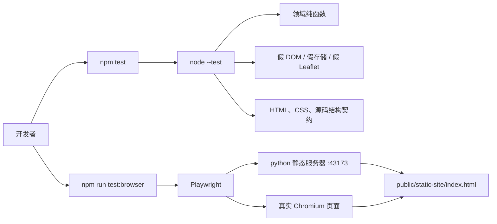
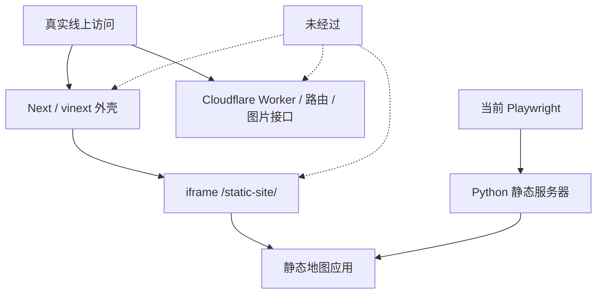
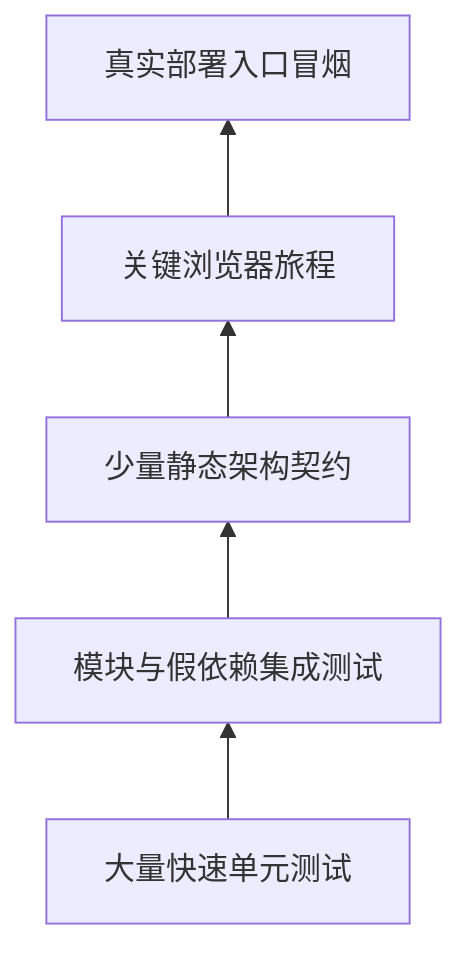

# 第 16 章：测试架构——项目怎样证明自己没有悄悄坏掉

> 本章解释 `tests/`、`package.json` 和 `playwright.config.mjs`。对象仍是第一次接触 JavaScript 的读者：先学会看懂一条测试，再理解 10 个测试文件各守哪一层，最后用 665 节点台账查到每个函数。

## 1. 先给结论

这个项目有两套不会自动互相包含的测试入口：

```text
npm test
  = Node 自带测试运行器
  = 9 个文件 / 200 个测试

npm run test:browser
  = Playwright + Chromium
  = 1 个文件 / 3 个测试
```

合起来是 **10 个文件、203 个测试用例**。源码语法树里则有 **665 个函数节点**：

| 节点类别 | 数量 | 初学者可以怎样理解 |
| --- | ---: | --- |
| 测试体 | 203 | 一个写着“我要证明什么”的实验 |
| 模块级辅助函数 | 22 | 多个实验共用的量具、样品制造器 |
| 测试内回调 / 假对象方法 | 440 | 为某个实验临时搭出的按钮、网络、存储或 Leaflet 替身 |
| **合计** | **665** | 函数节点数，不等于测试用例数 |

Node 测试中有 1,129 次 `assert.*` 调用，浏览器测试中有 40 次以 `expect(...)` 为根的检查。次数多不自动等于质量高：重复检查同一件容易的事，仍可能漏掉一个关键入口。

最重要的边界是：

> 这些测试主要保护 `public/static-site` 的当前 Web 业务。它们没有完整运行 Next 外壳、Cloudflare Worker、根目录旧站、小程序、Python 数据工具或 TypeScript 类型检查。

## 2. 五问核验：为什么需要这一层

### 第一问：为什么写了代码还要写测试

因为“现在看起来能用”只证明当前手工操作没碰到问题。测试把一次期望保存成可重复执行的程序。

### 第二问：为什么不能只打开网页点几下

行程迁移、跨日交通、ID 冲突、网络超时和恶意 HTML 等分支很难稳定地靠手工重现。Node 测试能直接构造这些极端输入。

### 第三问：为什么又不能只写 Node 测试

纯函数正确，不代表真实浏览器中的 DOM、事件代理、文件下载、Canvas 地图和异步请求顺序能配合。浏览器测试补了三条完整用户路径。

### 第四问：为什么 203 个测试仍不能宣布整个工程安全

测试只会保护它实际启动、导入或观察过的东西。本项目的浏览器测试直接托管 `public/static-site`，绕过了 Next iframe、Worker 和 Nginx；`npm test` 也不包含 Playwright。

### 第五问：为什么还要逐函数看测试代码

测试本身也会写错。夹具可能过度简化真实浏览器，源码正则可能被格式变化击碎，断言也可能只证明“没有抛错”而没证明结果正确。看清每个回调和假对象，才能知道证据的有效范围。

结论：测试不是“真理生成器”，而是一组有明确实验条件的可执行证据。

## 3. 两条执行链



这里有四个容易混淆的名词：

- **运行器**：找到测试、执行并汇总结果的程序；这里是 `node --test` 或 Playwright。
- **断言**：把“应该怎样”写成检查；例如 `assert.equal(actual, expected)`。
- **夹具（fixture）**：为了测试而准备的输入和环境；例如一份固定行程或假 `localStorage`。
- **替身（fake/mock）**：不用真实依赖，提供测试刚好需要的接口；例如假 Leaflet 地图。

## 4. 精确盘点

| 测试文件 | 用例 | 函数节点 | 断言调用 | 主要保护对象 |
| --- | ---: | ---: | ---: | --- |
| `app-data.test.mjs` | 17 | 52 | 64 | 首屏与延迟数据加载、重试、超时 |
| `browser-performance.test.mjs` | 3 | 11 | 40 | 真实浏览器中的三条用户流程 |
| `food-content.test.mjs` | 8 | 33 | 50 | 美食文章合并、懒加载与安全渲染 |
| `guide-export.test.mjs` | 13 | 17 | 54 | Markdown / HTML 攻略导出 |
| `module-boundaries.test.mjs` | 11 | 196 | 88 | 模块所有权、懒加载、地图控制器生命周期 |
| `place-index.test.mjs` | 10 | 18 | 56 | 地点索引、搜索、区县合并 |
| `rendered-html.test.mjs` | 26 | 38 | 177 | HTML/CSS/源码接线契约 |
| `trip-archive.test.mjs` | 18 | 40 | 102 | 存档、恢复、迁移、分享和文件导出 |
| `trip-editor.test.mjs` | 31 | 112 | 145 | 编辑器表单、事件、拖放和安全输出 |
| `trip-plan.test.mjs` | 66 | 148 | 393 | 行程领域规则与迁移 |
| **合计** | **203** | **665** | **1,169** | Node 1,129 + Playwright 40 |

`module-boundaries.test.mjs` 只有 11 个用例，却有 196 个函数节点，原因不是它偷偷运行 196 个测试，而是它在文件内部手工造了大量 Leaflet 方法、图层方法和事件回调。

## 5. `package.json` 到底启动了什么

### 5.1 `npm test`

它展开后等价于：

```text
node --test
  tests/app-data.test.mjs
  tests/place-index.test.mjs
  tests/food-content.test.mjs
  tests/module-boundaries.test.mjs
  tests/trip-plan.test.mjs
  tests/trip-editor.test.mjs
  tests/guide-export.test.mjs
  tests/rendered-html.test.mjs
  tests/trip-archive.test.mjs
```

注意列表里没有 `browser-performance.test.mjs`。所以看到 `npm test` 全绿，只能说 200 个 Node 用例通过。

### 5.2 `npm run test:browser`

它调用 `playwright test`，再由 `playwright.config.mjs` 决定：

- 只匹配 `browser-performance.test.mjs`；
- 只启一个 worker，三个用例串行运行；
- 单个测试最多 150 秒，单个 `expect` 最多等 60 秒；
- 没提供 `STATIC_SITE_URL` 时，用 Python 在 43173 端口直接托管 `public/static-site`；
- 失败时保留 trace，帮助回放浏览器现场。

### 5.3 `npm run test:build`

它只串联：

```text
npm test && npm run build
```

这里也没有浏览器测试、`tsc --noEmit`、Python 工具测试或小程序测试。

## 6. 一条 Node 测试怎样阅读

典型结构可以拆成三段：

```js
test("一条可以读懂的行为描述", () => {
  // Arrange：准备样品和环境
  const plan = createTripPlan(...);

  // Act：执行被测动作
  const next = applyTripCommand(plan, command);

  // Assert：核对可观察结果
  assert.equal(next.days.length, 2);
});
```

阅读顺序不要从语法细节开始。先问：

1. 标题承诺证明什么？
2. Arrange 制造了怎样的世界？
3. Act 真正调用了哪个生产函数？
4. Assert 观察的是结果、错误、调用次数还是副作用？
5. 有没有真实世界条件被假对象省略？

`async () => { ... }` 表示实验里要等待异步工作；`await` 表示“等这一步完成再继续”。`assert.rejects(...)` 则是在证明异步操作应当失败。

## 7. 十个文件分别守什么

### 7.1 `app-data.test.mjs`：数据装卸队

17 个用例集中回答四件事：

- 首屏只等城市与 8 个轻量边界，不被区县、美食摘要拖住；
- 失败请求怎样重试、超时、组合外部取消信号；
- 可选数据失败只警告并返回 `null`，关键城市数据失败则阻止继续；
- 多轮延迟加载竞争时，只有最新一轮可以更新界面。

`pendingUntilAborted` 是唯一模块级辅助函数：它制造一个永远等待、直到收到取消信号才拒绝的 Promise，用来测试超时和外部取消。

### 7.2 `place-index.test.mjs`：地点字典

10 个用例保护文字规范化、拼音/别名搜索、市与区县映射、运行时地点覆盖层和重复 ID 合并。它没有模块级 helper，8 个额外函数都是单个实验里的映射、查找或排序回调。

关键设计理由：索引属于派生数据，可以随原始地点重建；测试因此反复验证“输入不被修改”和“重建后每张表一致”。

### 7.3 `food-content.test.mjs`：延迟到达的美食内容

8 个用例覆盖摘要和城市详情以不同顺序到达、坏记录过滤、文章 URL 选择、失败重试、并发请求合并、过期结果抛弃和 HTML 转义。

5 个 helper 分成两类：`normalizeSearchText`、`knownPlaces`、`article` 造数据；`fakePanelElements`、`controllerForHostname` 造控制器环境。这里的替身没有真的解析 HTML，所以安全性主要通过输出字符串中不存在可执行片段来判断。

### 7.4 `guide-export.test.mjs`：把同一行程翻译成两种文档

13 个用例比较 Markdown 与可打印 HTML 的日期、交通、活动、住宿、警告、路线、总计和章节顺序，并专门检查用户文本转义。

`buildDetailedPlan` 是共用的大样品制造器。测试关心两种 renderer 是否读取同一个 guide model，而不是逐像素比较浏览器打印结果。

### 7.5 `module-boundaries.test.mjs`：架构边界与地图替身实验室

前 5 个用例读取源码，确认美食、城市详情、Trip 和 Leaflet 分别归哪个模块，以及动态 import 是否仍然存在。后 6 个用例用注入的假 Leaflet、假图层、假状态和假回调运行 `map-controller`。

它的 185 个内部节点大部分是这种形状：

```js
const fakeLayer = {
  addTo() { return fakeLayer; },
  clearLayers() {},
  on(event, callback) { /* 保存回调供实验触发 */ }
};
```

设计优点是 Node 中不需要真正打开地图；代价是假对象只实现了测试作者想到的 Leaflet 行为，不能替代真实浏览器兼容性测试。

### 7.6 `trip-plan.test.mjs`：最厚的领域规则安全网

66 个用例覆盖新建、排期、访问天数、命令处理、交通/活动/住宿、时间窗口、警告、路线协调、重复城市、受保护内容、旧版本迁移、全局 ID 修复、紧凑分享和 12,000 字符边界。

这里的 393 次断言最多，因为一个命令往往必须同时保证：返回值正确、旧对象不变、ID 不丢、关联关系不坏、警告结构完整。

`ids` 返回可预测的 ID 工厂，让测试不受随机 UUID 影响。

### 7.7 `trip-editor.test.mjs`：把 DOM 动作翻译成领域命令

31 个用例覆盖表单解析、日历 HTML、警告中文、按钮动作、访问天数边界、事件委托、焦点恢复、`dataset` 快照、`change`、拖放和恶意 payload。

7 个 helper 主要是轻量 DOM 替身。测试没有启动完整浏览器，而是直接触发保存下来的 listener，因此能精确检查“一个点击发出哪条 command”，但不能证明所有浏览器的原生拖放实现一致。

### 7.8 `trip-archive.test.mjs`：不可丢失的数据

18 个用例保护候选恢复优先级、缺地点时延迟恢复、惰性 `localStorage`、v2 写入、hash 清退、旧版备份与最终清理、回滚快照、紧急导出和 Unicode 文件名。

`fixedPlan` 提供稳定存档样品。大量测试故意让存储读写或 URL 替换抛错，以证明部分失败时仍能报告真实状态并尽量保住旧数据。

### 7.9 `rendered-html.test.mjs`：静态契约检查员

26 个用例读取 HTML、CSS、`app.js` 和 `package.json` 文本，检查重复 ID、缓存版本、可访问控件、动态加载接线、恢复流程、样式规则和 npm 测试列表。

`balancedCodeBlock`、`matchingParen`、`functionSource`、`arrowCallCallbackSource` 是简化版源码切片器。它们不是完整 JavaScript 解析器，只是跳过注释、字符串和模板文本后寻找括号边界。

这类测试便宜且擅长守“代码必须仍放在这里”，但比较脆：等价重构、改用不同语法或只调整源码形状，都可能让它失败；反过来，字符串存在也不必然证明运行时真的走到该路径。

### 7.10 `browser-performance.test.mjs`：三条真实浏览器证据

三个用例依次证明：

1. **首屏先可用**：拦住区县与美食数据，请求未完成时地图已进入 `data-app-ready="map"`，371 个城市可搜索；再释放请求并等完整就绪。
2. **行程全链路**：加入北京、上海，改名与节奏，导出/导入 JSON，下载 Markdown 与 HTML，再撤销。
3. **延迟城市详情**：搜索福清，进入城市详情，看到美食卡片和 Canvas 地图，再退出。

`failOnBrowserErrors` 收集页面异常、console error 和失败响应；`addRoutePlace` 负责像用户一样输入地点并选择候选。

## 8. 浏览器测试实际绕过了哪些层



因此 Playwright 能证明当前静态应用在 Chromium 中工作，却不能证明：

- Next 首页正确渲染和 iframe 地址正确；
- Worker 路由、D1/R2 绑定或图片代理正常；
- Nginx 的压缩、缓存头和回退规则正确；
- 外部 OpenStreetMap 在真实网络环境可用。

## 9. 三种证据不要互相冒充

| 证据类型 | 本项目例子 | 擅长证明 | 不擅长证明 |
| --- | --- | --- | --- |
| 行为测试 | `trip-plan.test.mjs` | 给定输入会得到什么结果 | 浏览器界面是否可操作 |
| 源码契约 | `rendered-html.test.mjs` 前后多项、边界测试前五项 | 文件所有权、接线和静态标记仍存在 | 运行时一定执行成功 |
| 端到端浏览器 | `browser-performance.test.mjs` | DOM、事件、网络和下载能协作 | 未经过的部署层与长尾组合 |

更健康的组合不是只保留其中一种，而是让便宜的纯函数测试承担大量分支，让少量浏览器测试守关键用户旅程，再用部署冒烟测试守真实入口。

## 10. 覆盖矩阵：现在能信到哪里

| 工程区域 | Node 行为 | 源码契约 | 浏览器 | 当前判断 |
| --- | --- | --- | --- | --- |
| `trip-plan` 领域规则 | 强 | 少量 | 一条主流程 | 本项目最强区域 |
| 编辑器命令/事件 | 强 | 有 | 主流程部分覆盖 | 浏览器长尾仍少 |
| 存档/恢复/导出 | 强 | 有 | JSON/攻略主流程 | 配额与真实下载环境仍有限 |
| 地点索引/延迟数据 | 强 | 有 | 首屏和福清流程 | 网络组合仍不完整 |
| 地图控制器 | 假 Leaflet 较强 | 有 | Canvas 冒烟 | 真 Leaflet 交互场景较少 |
| Next/vinext 外壳 | 无 | 极少 | 无 | 明显空白 |
| Cloudflare Worker / D1 / R2 | 无 | 无 | 无 | 明显空白 |
| 根目录旧站 | 无 | 只确认未纳入 | 无 | 没有正式回归保护 |
| 小程序 | 无 | 无 | 无 | 没有自动化测试 |
| Python 数据工具 | 无 | 无 | 无 | 没有自动化测试 |
| TypeScript 类型 | `npm test` 不检查 | 无 | 无 | `tsc --noEmit` 当前另有错误 |
| 手机、无障碍、视觉回归 | 无 | CSS 文本少量 | 单一 Chromium 尺寸 | 覆盖不足 |

## 11. 665 个函数节点怎样编号

下面的台账来自 Acorn 对 10 个测试文件的语法树扫描，而不是正则猜测。分类规则是：

- 直接作为 `test(title, callback)` 参数的函数记为“测试体”；
- 模块最外层声明或赋给模块最外层变量的函数记为“工具”；
- 其余函数记为“夹具/回调”，包括对象方法、数组回调、事件回调和用于断言抛错的函数。

同一行可以有多个小函数，所以定位键是“编号 + 文件 + 行号 + 标签”，不只靠行号。`所属 / 作用` 会告诉你它在哪个测试或 helper 中、被交给谁调用。

## 12. 逐函数台账（665 / 665）

### 12.1 `app-data.test.mjs`（52 个）

| # | 行 | 类别 | 标签 | 所属 / 作用 |
| ---: | ---: | --- | --- | --- |
| 1 | 18 | 测试体 | `T01` | deferred module completion applies only the latest render and recomputes recommendations once |
| 2 | 21 | 夹具/回调 | `N001 anonymous` | 属于 T01；为该实验提供临时行为 |
| 3 | 25 | 夹具/回调 | `N002 method load` | 属于 T01；实现测试替身的 load 方法 |
| 4 | 29 | 夹具/回调 | `N003 method apply` | 属于 T01；实现测试替身的 apply 方法 |
| 5 | 30 | 夹具/回调 | `N004 method refresh` | 属于 T01；实现测试替身的 refresh 方法 |
| 6 | 51 | 测试体 | `T02` | exports the progressive asset and boundary chunk versions |
| 7 | 56 | 测试体 | `T03` | critical map data requests only cities and all eight boundary chunks |
| 8 | 58 | 夹具/回调 | `N005 loadJson` | 属于 T03；保存为局部函数 loadJson，供该场景稍后调用 |
| 9 | 72 | 夹具/回调 | `N006 requested.map callback` | 属于 T03；把集合中的每一项转换成新值 |
| 10 | 83 | 夹具/回调 | `N007 requested.every callback` | 属于 T03；对集合逐项判断真假条件 |
| 11 | 86 | 测试体 | `T04` | critical map data has no public boundary chunk count override |
| 12 | 89 | 夹具/回调 | `N008 method loadJson` | 属于 T04；实现测试替身的 loadJson 方法 |
| 13 | 93 | 夹具/回调 | `N009 method get` | 属于 T04；实现测试替身的 get 方法 |
| 14 | 104 | 测试体 | `T05` | one exhausted boundary chunk retries once and returns the other seven features |
| 15 | 106 | 夹具/回调 | `N010 fetchImpl` | 属于 T05；保存为局部函数 fetchImpl，供该场景稍后调用 |
| 16 | 112 | 夹具/回调 | `N011 method json` | 属于 T05；实现测试替身的 json 方法 |
| 17 | 116 | 夹具/回调 | `N012 method json` | 属于 T05；实现测试替身的 json 方法 |
| 18 | 139 | 测试体 | `T06` | city data remains mandatory when boundaries settle successfully |
| 19 | 140 | 夹具/回调 | `N013 loadJson` | 属于 T06；保存为局部函数 loadJson，供该场景稍后调用 |
| 20 | 150 | 测试体 | `T07` | deferred county and food requests are independently memoized |
| 21 | 152 | 夹具/回调 | `N014 loadOptionalJson` | 属于 T07；保存为局部函数 loadOptionalJson，供该场景稍后调用 |
| 22 | 176 | 夹具/回调 | `N015 calls.filter callback` | 属于 T07；判断集合中的一项是否保留 |
| 23 | 177 | 夹具/回调 | `N016 calls.filter callback` | 属于 T07；判断集合中的一项是否保留 |
| 24 | 178 | 夹具/回调 | `N017 calls.every callback` | 属于 T07；对集合逐项判断真假条件 |
| 25 | 181 | 测试体 | `T08` | deferred summary status identifies county and food failures independently |
| 26 | 224 | 测试体 | `T09` | versioned JSON uses force-cache, combines signals, and retries once |
| 27 | 226 | 夹具/回调 | `N018 fetchImpl` | 属于 T09；保存为局部函数 fetchImpl，供该场景稍后调用 |
| 28 | 229 | 夹具/回调 | `N019 method json` | 属于 T09；实现测试替身的 json 方法 |
| 29 | 248 | 测试体 | `T10` | versioned JSON appends a question-mark query when none exists |
| 30 | 251 | 夹具/回调 | `N020 method fetchImpl` | 属于 T10；实现测试替身的 fetchImpl 方法 |
| 31 | 253 | 夹具/回调 | `N021 method json` | 属于 T10；实现测试替身的 json 方法 |
| 32 | 263 | 工具 | `H01 pendingUntilAborted` | 制造一个只在收到 abort 时失败的等待 Promise |
| 33 | 264 | 夹具/回调 | `N022 anonymous` | 属于 H01；为该实验提供临时行为 |
| 34 | 264 | 夹具/回调 | `N023 anonymous` | 属于 H01；为该实验提供临时行为 |
| 35 | 266 | 夹具/回调 | `N024 rejectAbort` | 属于 H01；保存为局部函数 rejectAbort，供该场景稍后调用 |
| 36 | 272 | 测试体 | `T11` | the JSON loader does not require AbortSignal static composition methods |
| 37 | 277 | 测试体 | `T12` | an external abort reaches the combined fetch signal and rejects loadJson |
| 38 | 280 | 夹具/回调 | `N025 anonymous` | 属于 T12；为该实验提供临时行为 |
| 39 | 283 | 夹具/回调 | `N026 pendingUntilAborted callback` | 属于 T12；作为 pendingUntilAborted 的函数参数被调用 |
| 40 | 301 | 测试体 | `T13` | a request timeout aborts a pending fetch and rejects loadJson |
| 41 | 304 | 夹具/回调 | `N027 pendingUntilAborted callback` | 属于 T13；作为 pendingUntilAborted 的函数参数被调用 |
| 42 | 315 | 测试体 | `T14` | non-ok JSON responses reject with path and status |
| 43 | 317 | 夹具/回调 | `N028 method fetchImpl` | 属于 T14；实现测试替身的 fetchImpl 方法 |
| 44 | 324 | 测试体 | `T15` | optional JSON retries, returns null, and warns on failure without memoizing |
| 45 | 328 | 夹具/回调 | `N029 assign console.warn` | 属于 T15；赋给 console.warn，供该场景稍后调用 |
| 46 | 331 | 夹具/回调 | `N030 method fetchImpl` | 属于 T15；实现测试替身的 fetchImpl 方法 |
| 47 | 350 | 测试体 | `T16` | idle scheduling passes a 1500ms deadline to requestIdleCallback |
| 48 | 351 | 夹具/回调 | `N031 task` | 属于 T16；保存为局部函数 task，供该场景稍后调用 |
| 49 | 354 | 夹具/回调 | `N032 method requestIdleCallbackImpl` | 属于 T16；实现测试替身的 requestIdleCallbackImpl 方法 |
| 50 | 365 | 测试体 | `T17` | idle scheduling falls back to a 50ms timer |
| 51 | 367 | 夹具/回调 | `N033 scheduleIdle callback` | 属于 T17；作为 scheduleIdle 的函数参数被调用 |
| 52 | 369 | 夹具/回调 | `N034 method setTimeoutImpl` | 属于 T17；实现测试替身的 setTimeoutImpl 方法 |

### 12.2 `browser-performance.test.mjs`（11 个）

| # | 行 | 类别 | 标签 | 所属 / 作用 |
| ---: | ---: | --- | --- | --- |
| 53 | 3 | 工具 | `H01 failOnBrowserErrors` | 收集页面异常、console error 与失败响应，并在用例结束统一断言 |
| 54 | 5 | 夹具/回调 | `N001 page.on callback` | 属于 H01；响应测试环境中的事件 |
| 55 | 9 | 夹具/回调 | `N002 page.on callback` | 属于 H01；响应测试环境中的事件 |
| 56 | 15 | 夹具/回调 | `N003 page.on callback` | 属于 H01；响应测试环境中的事件 |
| 57 | 21 | 夹具/回调 | `N004 anonymous` | 属于 H01；为该实验提供临时行为 |
| 58 | 24 | 工具 | `H02 addRoutePlace` | 模拟用户搜索地点并把候选加入路线 |
| 59 | 31 | 测试体 | `T01` | map becomes usable before optional summaries finish |
| 60 | 34 | 夹具/回调 | `N005 anonymous` | 属于 T01；为该实验提供临时行为 |
| 61 | 36 | 夹具/回调 | `N006 page.route callback` | 属于 T01；拦截并控制浏览器网络请求 |
| 62 | 53 | 测试体 | `T02` | route planning editing and every import/export path remain available |
| 63 | 87 | 测试体 | `T03` | deferred county food and city detail features hydrate completely |

### 12.3 `food-content.test.mjs`（33 个）

| # | 行 | 类别 | 标签 | 所属 / 作用 |
| ---: | ---: | --- | --- | --- |
| 64 | 10 | 工具 | `H01 normalizeSearchText` | 提供与生产索引一致的最小搜索文字规范化能力 |
| 65 | 12 | 工具 | `H02 knownPlaces` | 制造城市与区县的已知地点集合 |
| 66 | 13 | 夹具/回调 | `N001 ids.map callback` | 属于 H02；把集合中的每一项转换成新值 |
| 67 | 16 | 工具 | `H03 article` | 制造一篇可覆盖字段的美食文章样品 |
| 68 | 31 | 测试体 | `T01` | summary and city hydration preserve richer city fields in both arrival orders |
| 69 | 47 | 测试体 | `T02` | hydration ignores malformed records, is idempotent by ID, and rebuilds every index |
| 70 | 61 | 夹具/回调 | `N002 store.articles.map callback` | 属于 T02；把集合中的每一项转换成新值 |
| 71 | 67 | 测试体 | `T03` | known places can refresh after county or runtime-place hydration |
| 72 | 82 | 工具 | `H04 fakePanelElements` | 制造城市详情控制器需要的轻量 DOM 元素 |
| 73 | 85 | 夹具/回调 | `N003 method createElement` | 属于 H04；实现测试替身的 createElement 方法 |
| 74 | 94 | 夹具/回调 | `N004 method replaceChildren` | 属于 H04；实现测试替身的 replaceChildren 方法 |
| 75 | 95 | 夹具/回调 | `N005 method append` | 属于 H04；实现测试替身的 append 方法 |
| 76 | 101 | 工具 | `H05 controllerForHostname` | 按 hostname 组装可测试的美食控制器 |
| 77 | 108 | 测试体 | `T04` | reader paths preserve safe same-origin summaries and safe external URL precedence |
| 78 | 123 | 测试体 | `T05` | production resolves a representative summary readerPath without an external URL |
| 79 | 126 | 夹具/回调 | `N006 summary.articles.find callback` | 属于 T05；判断是否找到目标项 |
| 80 | 140 | 测试体 | `T06` | controller retries invalid city chunks and renders safe local article assets and marker descriptors |
| 81 | 155 | 夹具/回调 | `N007 method loadOptionalJson` | 属于 T06；实现测试替身的 loadOptionalJson 方法 |
| 82 | 163 | 夹具/回调 | `N008 method escapeHtml` | 属于 T06；实现测试替身的 escapeHtml 方法 |
| 83 | 164 | 夹具/回调 | `N009 String(...).replace callback` | 属于 T06；作为 String(...).replace 的函数参数被调用 |
| 84 | 166 | 夹具/回调 | `N010 method hasCoordinates` | 属于 T06；实现测试替身的 hasCoordinates 方法 |
| 85 | 167 | 夹具/回调 | `N011 method shouldUseLocalArticleAssets` | 属于 T06；实现测试替身的 shouldUseLocalArticleAssets 方法 |
| 86 | 192 | 测试体 | `T07` | hostile article day and title cannot create executable food card or popup markup |
| 87 | 209 | 夹具/回调 | `N012 controller.articlesForCity(...).map callback` | 属于 T07；把集合中的每一项转换成新值 |
| 88 | 215 | 夹具/回调 | `N013 elements.articleList.children.map callback` | 属于 T07；把集合中的每一项转换成新值 |
| 89 | 223 | 夹具/回调 | `N014 markers.find callback` | 属于 T07；判断是否找到目标项 |
| 90 | 224 | 夹具/回调 | `N015 markers.find callback` | 属于 T07；判断是否找到目标项 |
| 91 | 233 | 测试体 | `T08` | controller coalesces concurrent city loads and ignores stale completion without marking the city loaded |
| 92 | 236 | 夹具/回调 | `N016 anonymous` | 属于 T08；为该实验提供临时行为 |
| 93 | 240 | 夹具/回调 | `N017 method loadOptionalJson` | 属于 T08；实现测试替身的 loadOptionalJson 方法 |
| 94 | 241 | 夹具/回调 | `N018 method isFoodArticlesPayload` | 属于 T08；实现测试替身的 isFoodArticlesPayload 方法 |
| 95 | 244 | 夹具/回调 | `N019 method isCurrent` | 属于 T08；实现测试替身的 isCurrent 方法 |
| 96 | 245 | 夹具/回调 | `N020 method isCurrent` | 属于 T08；实现测试替身的 isCurrent 方法 |

### 12.4 `guide-export.test.mjs`（17 个）

| # | 行 | 类别 | 标签 | 所属 / 作用 |
| ---: | ---: | --- | --- | --- |
| 97 | 20 | 测试体 | `T01` | exports the same dated activity to markdown and html |
| 98 | 36 | 工具 | `H01 buildDetailedPlan` | 制造包含交通、活动、住宿和日期的完整行程样品 |
| 99 | 90 | 测试体 | `T02` | buildGuideModel keeps inputs independent and sorts valid times stably |
| 100 | 122 | 夹具/回调 | `N001 model.days[0].items.map callback` | 属于 T02；把集合中的每一项转换成新值 |
| 101 | 123 | 夹具/回调 | `N002 model.days[0].warnings.map callback` | 属于 T02；把集合中的每一项转换成新值 |
| 102 | 136 | 测试体 | `T03` | exports undated days without producing Invalid Date |
| 103 | 149 | 测试体 | `T04` | renders transport activity lodging warning route and totals in both formats |
| 104 | 178 | 测试体 | `T05` | escapes every user-facing HTML field and emits no raw user script |
| 105 | 230 | 测试体 | `T06` | escapes Markdown HTML and structural control characters |
| 106 | 261 | 测试体 | `T07` | printable HTML is self-contained and print ready |
| 107 | 274 | 测试体 | `T08` | falls back safely for unknown places warnings and invalid snapshot stores |
| 108 | 295 | 夹具/回调 | `N003 model.days[0].warnings.map callback` | 属于 T08；把集合中的每一项转换成新值 |
| 109 | 303 | 测试体 | `T09` | uses continuous day places when route segments are absent |
| 110 | 320 | 测试体 | `T10` | keeps section order and daily core content aligned across formats |
| 111 | 343 | 测试体 | `T11` | resolves string route segment endpoints through place snapshots |
| 112 | 361 | 测试体 | `T12` | renders every supported pace with the matching Chinese label |
| 113 | 379 | 测试体 | `T13` | keeps empty timeline and totals messages aligned across formats |

### 12.5 `module-boundaries.test.mjs`（196 个）

| # | 行 | 类别 | 标签 | 所属 / 作用 |
| ---: | ---: | --- | --- | --- |
| 114 | 11 | 测试体 | `T01` | food ownership lives behind one memoized dynamic import |
| 115 | 27 | 测试体 | `T02` | city detail owns live and local fallbacks behind one lazy module |
| 116 | 48 | 测试体 | `T03` | city detail controller keeps curated fallbacks and shared county state available |
| 117 | 59 | 夹具/回调 | `N001 noop` | 属于 T03；保存为局部函数 noop，供该场景稍后调用 |
| 118 | 62 | 夹具/回调 | `N002 method distanceBetween` | 属于 T03；实现测试替身的 distanceBetween 方法 |
| 119 | 64 | 夹具/回调 | `N003 method cityById` | 属于 T03；实现测试替身的 cityById 方法 |
| 120 | 64 | 夹具/回调 | `N004 method loadFoodForCity` | 属于 T03；实现测试替身的 loadFoodForCity 方法 |
| 121 | 65 | 夹具/回调 | `N005 method foodArticleCountForCity` | 属于 T03；实现测试替身的 foodArticleCountForCity 方法 |
| 122 | 66 | 夹具/回调 | `N006 method getPlaceIndex` | 属于 T03；实现测试替身的 getPlaceIndex 方法 |
| 123 | 69 | 夹具/回调 | `N007 method normalizeKey` | 属于 T03；实现测试替身的 normalizeKey 方法 |
| 124 | 70 | 夹具/回调 | `N008 method normalizeSearchText` | 属于 T03；实现测试替身的 normalizeSearchText 方法 |
| 125 | 71 | 夹具/回调 | `N009 method hasCoordinates` | 属于 T03；实现测试替身的 hasCoordinates 方法 |
| 126 | 72 | 夹具/回调 | `N010 method loadOptionalJson` | 属于 T03；实现测试替身的 loadOptionalJson 方法 |
| 127 | 72 | 夹具/回调 | `N011 method isCountyRecordsPayload` | 属于 T03；实现测试替身的 isCountyRecordsPayload 方法 |
| 128 | 73 | 夹具/回调 | `N012 method fetchImpl` | 属于 T03；实现测试替身的 fetchImpl 方法 |
| 129 | 78 | 夹具/回调 | `N013 controller.subareas(...).map callback` | 属于 T03；把集合中的每一项转换成新值 |
| 130 | 79 | 夹具/回调 | `N014 controller.landmarks(...).some callback` | 属于 T03；对集合逐项判断真假条件 |
| 131 | 83 | 测试体 | `T04` | trip domain and guide export stay behind the lazy trip controller |
| 132 | 101 | 测试体 | `T05` | Leaflet ownership lives in the public map-core module |
| 133 | 143 | 测试体 | `T06` | map controller owns cohesive city-detail rendering and lifecycle |
| 134 | 149 | 夹具/回调 | `N015 method extend` | 属于 T06；实现测试替身的 extend 方法 |
| 135 | 150 | 夹具/回调 | `N016 method isValid` | 属于 T06；实现测试替身的 isValid 方法 |
| 136 | 151 | 夹具/回调 | `N017 method pad` | 属于 T06；实现测试替身的 pad 方法 |
| 137 | 153 | 夹具/回调 | `N018 makeLayer` | 属于 T06；保存为局部函数 makeLayer，供该场景稍后调用 |
| 138 | 155 | 夹具/回调 | `N019 method addTo` | 属于 T06；实现测试替身的 addTo 方法 |
| 139 | 156 | 夹具/回调 | `N020 method bindTooltip` | 属于 T06；实现测试替身的 bindTooltip 方法 |
| 140 | 157 | 夹具/回调 | `N021 method bindPopup` | 属于 T06；实现测试替身的 bindPopup 方法 |
| 141 | 158 | 夹具/回调 | `N022 method on` | 属于 T06；实现测试替身的 on 方法 |
| 142 | 159 | 夹具/回调 | `N023 method setStyle` | 属于 T06；实现测试替身的 setStyle 方法 |
| 143 | 160 | 夹具/回调 | `N024 method getBounds` | 属于 T06；实现测试替身的 getBounds 方法 |
| 144 | 161 | 夹具/回调 | `N025 method clearLayers` | 属于 T06；实现测试替身的 clearLayers 方法 |
| 145 | 169 | 夹具/回调 | `N026 method hasLayer` | 属于 T06；实现测试替身的 hasLayer 方法 |
| 146 | 170 | 夹具/回调 | `N027 method removeLayer` | 属于 T06；实现测试替身的 removeLayer 方法 |
| 147 | 171 | 夹具/回调 | `N028 method fitBounds` | 属于 T06；实现测试替身的 fitBounds 方法 |
| 148 | 172 | 夹具/回调 | `N029 method getBounds` | 属于 T06；实现测试替身的 getBounds 方法 |
| 149 | 172 | 夹具/回调 | `N030 method pad` | 属于 T06；实现测试替身的 pad 方法 |
| 150 | 172 | 夹具/回调 | `N031 method contains` | 属于 T06；实现测试替身的 contains 方法 |
| 151 | 173 | 夹具/回调 | `N032 method getZoom` | 属于 T06；实现测试替身的 getZoom 方法 |
| 152 | 174 | 夹具/回调 | `N033 method off` | 属于 T06；实现测试替身的 off 方法 |
| 153 | 175 | 夹具/回调 | `N034 method remove` | 属于 T06；实现测试替身的 remove 方法 |
| 154 | 179 | 夹具/回调 | `N035 assign layer.addTo` | 属于 T06；赋给 layer.addTo，供该场景稍后调用 |
| 155 | 182 | 夹具/回调 | `N036 method latLngBounds` | 属于 T06；实现测试替身的 latLngBounds 方法 |
| 156 | 183 | 夹具/回调 | `N037 method geoJSON` | 属于 T06；实现测试替身的 geoJSON 方法 |
| 157 | 188 | 夹具/回调 | `N038 method marker` | 属于 T06；实现测试替身的 marker 方法 |
| 158 | 189 | 夹具/回调 | `N039 method circleMarker` | 属于 T06；实现测试替身的 circleMarker 方法 |
| 159 | 190 | 夹具/回调 | `N040 method polyline` | 属于 T06；实现测试替身的 polyline 方法 |
| 160 | 191 | 夹具/回调 | `N041 method divIcon` | 属于 T06；实现测试替身的 divIcon 方法 |
| 161 | 213 | 夹具/回调 | `N042 method queuePlaceClick` | 属于 T06；实现测试替身的 queuePlaceClick 方法 |
| 162 | 214 | 夹具/回调 | `N043 method articleCountForCity` | 属于 T06；实现测试替身的 articleCountForCity 方法 |
| 163 | 230 | 夹具/回调 | `N044 events.find callback` | 属于 T06；判断是否找到目标项 |
| 164 | 236 | 夹具/回调 | `N045 calls.filter callback` | 属于 T06；判断集合中的一项是否保留 |
| 165 | 237 | 夹具/回调 | `N046 calls.filter callback` | 属于 T06；判断集合中的一项是否保留 |
| 166 | 238 | 夹具/回调 | `N047 calls.filter callback` | 属于 T06；判断集合中的一项是否保留 |
| 167 | 239 | 夹具/回调 | `N048 calls.filter callback` | 属于 T06；判断集合中的一项是否保留 |
| 168 | 240 | 夹具/回调 | `N049 calls.some callback` | 属于 T06；对集合逐项判断真假条件 |
| 169 | 241 | 夹具/回调 | `N050 calls.some callback` | 属于 T06；对集合逐项判断真假条件 |
| 170 | 242 | 夹具/回调 | `N051 calls.some callback` | 属于 T06；对集合逐项判断真假条件 |
| 171 | 243 | 夹具/回调 | `N052 calls.some callback` | 属于 T06；对集合逐项判断真假条件 |
| 172 | 244 | 夹具/回调 | `N053 calls.some callback` | 属于 T06；对集合逐项判断真假条件 |
| 173 | 245 | 夹具/回调 | `N054 calls.some callback` | 属于 T06；对集合逐项判断真假条件 |
| 174 | 246 | 夹具/回调 | `N055 calls.some callback` | 属于 T06；对集合逐项判断真假条件 |
| 175 | 249 | 测试体 | `T07` | map controller initializes Leaflet layers and renders routes through injected state |
| 176 | 253 | 夹具/回调 | `N056 layerGroup` | 属于 T07；保存为局部函数 layerGroup，供该场景稍后调用 |
| 177 | 254 | 夹具/回调 | `N057 method addTo` | 属于 T07；实现测试替身的 addTo 方法 |
| 178 | 255 | 夹具/回调 | `N058 method clearLayers` | 属于 T07；实现测试替身的 clearLayers 方法 |
| 179 | 256 | 夹具/回调 | `N059 method addLayer` | 属于 T07；实现测试替身的 addLayer 方法 |
| 180 | 257 | 夹具/回调 | `N060 method remove` | 属于 T07；实现测试替身的 remove 方法 |
| 181 | 260 | 夹具/回调 | `N061 method setPrefix` | 属于 T07；实现测试替身的 setPrefix 方法 |
| 182 | 261 | 夹具/回调 | `N062 method createPane` | 属于 T07；实现测试替身的 createPane 方法 |
| 183 | 262 | 夹具/回调 | `N063 method getPane` | 属于 T07；实现测试替身的 getPane 方法 |
| 184 | 263 | 夹具/回调 | `N064 method on` | 属于 T07；实现测试替身的 on 方法 |
| 185 | 264 | 夹具/回调 | `N065 method off` | 属于 T07；实现测试替身的 off 方法 |
| 186 | 265 | 夹具/回调 | `N066 method fitBounds` | 属于 T07；实现测试替身的 fitBounds 方法 |
| 187 | 266 | 夹具/回调 | `N067 method getBounds` | 属于 T07；实现测试替身的 getBounds 方法 |
| 188 | 266 | 夹具/回调 | `N068 method pad` | 属于 T07；实现测试替身的 pad 方法 |
| 189 | 266 | 夹具/回调 | `N069 method contains` | 属于 T07；实现测试替身的 contains 方法 |
| 190 | 267 | 夹具/回调 | `N070 method getZoom` | 属于 T07；实现测试替身的 getZoom 方法 |
| 191 | 268 | 夹具/回调 | `N071 method hasLayer` | 属于 T07；实现测试替身的 hasLayer 方法 |
| 192 | 269 | 夹具/回调 | `N072 method removeLayer` | 属于 T07；实现测试替身的 removeLayer 方法 |
| 193 | 270 | 夹具/回调 | `N073 method remove` | 属于 T07；实现测试替身的 remove 方法 |
| 194 | 273 | 夹具/回调 | `N074 method bindTooltip` | 属于 T07；实现测试替身的 bindTooltip 方法 |
| 195 | 274 | 夹具/回调 | `N075 method on` | 属于 T07；实现测试替身的 on 方法 |
| 196 | 275 | 夹具/回调 | `N076 method setStyle` | 属于 T07；实现测试替身的 setStyle 方法 |
| 197 | 279 | 夹具/回调 | `N077 method addTo` | 属于 T07；实现测试替身的 addTo 方法 |
| 198 | 280 | 夹具/回调 | `N078 method getBounds` | 属于 T07；实现测试替身的 getBounds 方法 |
| 199 | 280 | 夹具/回调 | `N079 method isValid` | 属于 T07；实现测试替身的 isValid 方法 |
| 200 | 281 | 夹具/回调 | `N080 method setStyle` | 属于 T07；实现测试替身的 setStyle 方法 |
| 201 | 282 | 夹具/回调 | `N081 method remove` | 属于 T07；实现测试替身的 remove 方法 |
| 202 | 285 | 夹具/回调 | `N082 method bindTooltip` | 属于 T07；实现测试替身的 bindTooltip 方法 |
| 203 | 286 | 夹具/回调 | `N083 method on` | 属于 T07；实现测试替身的 on 方法 |
| 204 | 287 | 夹具/回调 | `N084 method addTo` | 属于 T07；实现测试替身的 addTo 方法 |
| 205 | 288 | 夹具/回调 | `N085 method setStyle` | 属于 T07；实现测试替身的 setStyle 方法 |
| 206 | 291 | 夹具/回调 | `N086 method canvas` | 属于 T07；实现测试替身的 canvas 方法 |
| 207 | 292 | 夹具/回调 | `N087 method map` | 属于 T07；实现测试替身的 map 方法 |
| 208 | 293 | 夹具/回调 | `N088 method layerGroup` | 属于 T07；实现测试替身的 layerGroup 方法 |
| 209 | 294 | 夹具/回调 | `N089 method geoJSON` | 属于 T07；实现测试替身的 geoJSON 方法 |
| 210 | 295 | 夹具/回调 | `N090 method circleMarker` | 属于 T07；实现测试替身的 circleMarker 方法 |
| 211 | 296 | 夹具/回调 | `N091 method marker` | 属于 T07；实现测试替身的 marker 方法 |
| 212 | 297 | 夹具/回调 | `N092 method divIcon` | 属于 T07；实现测试替身的 divIcon 方法 |
| 213 | 298 | 夹具/回调 | `N093 method polyline` | 属于 T07；实现测试替身的 polyline 方法 |
| 214 | 298 | 夹具/回调 | `N094 method addTo` | 属于 T07；实现测试替身的 addTo 方法 |
| 215 | 299 | 夹具/回调 | `N095 method latLngBounds` | 属于 T07；实现测试替身的 latLngBounds 方法 |
| 216 | 299 | 夹具/回调 | `N096 method isValid` | 属于 T07；实现测试替身的 isValid 方法 |
| 217 | 300 | 夹具/回调 | `N097 method stop` | 属于 T07；实现测试替身的 stop 方法 |
| 218 | 323 | 夹具/回调 | `N098 method queueCityClick` | 属于 T07；实现测试替身的 queueCityClick 方法 |
| 219 | 324 | 夹具/回调 | `N099 method enterCityView` | 属于 T07；实现测试替身的 enterCityView 方法 |
| 220 | 327 | 夹具/回调 | `N100 method normalizeKey` | 属于 T07；实现测试替身的 normalizeKey 方法 |
| 221 | 328 | 夹具/回调 | `N101 method escapeHtml` | 属于 T07；实现测试替身的 escapeHtml 方法 |
| 222 | 329 | 夹具/回调 | `N102 method articleCountForCity` | 属于 T07；实现测试替身的 articleCountForCity 方法 |
| 223 | 344 | 夹具/回调 | `N103 calls.filter callback` | 属于 T07；判断集合中的一项是否保留 |
| 224 | 345 | 夹具/回调 | `N104 calls.filter callback` | 属于 T07；判断集合中的一项是否保留 |
| 225 | 346 | 夹具/回调 | `N105 calls.filter callback` | 属于 T07；判断集合中的一项是否保留 |
| 226 | 347 | 夹具/回调 | `N106 calls.some callback` | 属于 T07；对集合逐项判断真假条件 |
| 227 | 348 | 夹具/回调 | `N107 calls.some callback` | 属于 T07；对集合逐项判断真假条件 |
| 228 | 349 | 夹具/回调 | `N108 calls.filter callback` | 属于 T07；判断集合中的一项是否保留 |
| 229 | 352 | 测试体 | `T08` | map controller applies injected route profiles and mobile view state |
| 230 | 357 | 夹具/回调 | `N109 method toggle` | 属于 T08；实现测试替身的 toggle 方法 |
| 231 | 358 | 夹具/回调 | `N110 method setAttribute` | 属于 T08；实现测试替身的 setAttribute 方法 |
| 232 | 360 | 夹具/回调 | `N111 method toggle` | 属于 T08；实现测试替身的 toggle 方法 |
| 233 | 376 | 夹具/回调 | `N112 method routeMetricsUpdated` | 属于 T08；实现测试替身的 routeMetricsUpdated 方法 |
| 234 | 378 | 夹具/回调 | `N113 method transportProfile` | 属于 T08；实现测试替身的 transportProfile 方法 |
| 235 | 399 | 测试体 | `T09` | city-detail generations reject stale A-B-A and post-China completions |
| 236 | 401 | 夹具/回调 | `N114 deferred` | 属于 T09；保存为局部函数 deferred，供该场景稍后调用 |
| 237 | 403 | 夹具/回调 | `N115 anonymous` | 属于 T09；为该实验提供临时行为 |
| 238 | 407 | 夹具/回调 | `N116 method clearLayers` | 属于 T09；实现测试替身的 clearLayers 方法 |
| 239 | 407 | 夹具/回调 | `N117 method addTo` | 属于 T09；实现测试替身的 addTo 方法 |
| 240 | 409 | 夹具/回调 | `N118 method hasLayer` | 属于 T09；实现测试替身的 hasLayer 方法 |
| 241 | 409 | 夹具/回调 | `N119 method removeLayer` | 属于 T09；实现测试替身的 removeLayer 方法 |
| 242 | 409 | 夹具/回调 | `N120 method fitBounds` | 属于 T09；实现测试替身的 fitBounds 方法 |
| 243 | 409 | 夹具/回调 | `N121 method getBounds` | 属于 T09；实现测试替身的 getBounds 方法 |
| 244 | 409 | 夹具/回调 | `N122 method pad` | 属于 T09；实现测试替身的 pad 方法 |
| 245 | 409 | 夹具/回调 | `N123 method contains` | 属于 T09；实现测试替身的 contains 方法 |
| 246 | 409 | 夹具/回调 | `N124 method getZoom` | 属于 T09；实现测试替身的 getZoom 方法 |
| 247 | 411 | 夹具/回调 | `N125 method latLngBounds` | 属于 T09；实现测试替身的 latLngBounds 方法 |
| 248 | 411 | 夹具/回调 | `N126 method isValid` | 属于 T09；实现测试替身的 isValid 方法 |
| 249 | 423 | 夹具/回调 | `N127 a1Deferred.promise.then callback` | 属于 T09；处理 Promise 完成后的结果 |
| 250 | 425 | 夹具/回调 | `N128 bDeferred.promise.then callback` | 属于 T09；处理 Promise 完成后的结果 |
| 251 | 427 | 夹具/回调 | `N129 a2Deferred.promise.then callback` | 属于 T09；处理 Promise 完成后的结果 |
| 252 | 438 | 夹具/回调 | `N130 leaving.promise.then callback` | 属于 T09；处理 Promise 完成后的结果 |
| 253 | 444 | 测试体 | `T10` | destroy cancels callbacks, clears Leaflet references, and suppresses pending clicks |
| 254 | 450 | 夹具/回调 | `N131 method addTo` | 属于 T10；实现测试替身的 addTo 方法 |
| 255 | 450 | 夹具/回调 | `N132 method clearLayers` | 属于 T10；实现测试替身的 clearLayers 方法 |
| 256 | 450 | 夹具/回调 | `N133 method setStyle` | 属于 T10；实现测试替身的 setStyle 方法 |
| 257 | 450 | 夹具/回调 | `N134 method getBounds` | 属于 T10；实现测试替身的 getBounds 方法 |
| 258 | 450 | 夹具/回调 | `N135 method isValid` | 属于 T10；实现测试替身的 isValid 方法 |
| 259 | 452 | 夹具/回调 | `N136 method setPrefix` | 属于 T10；实现测试替身的 setPrefix 方法 |
| 260 | 452 | 夹具/回调 | `N137 method createPane` | 属于 T10；实现测试替身的 createPane 方法 |
| 261 | 452 | 夹具/回调 | `N138 method getPane` | 属于 T10；实现测试替身的 getPane 方法 |
| 262 | 453 | 夹具/回调 | `N139 method on` | 属于 T10；实现测试替身的 on 方法 |
| 263 | 453 | 夹具/回调 | `N140 method off` | 属于 T10；实现测试替身的 off 方法 |
| 264 | 453 | 夹具/回调 | `N141 method fitBounds` | 属于 T10；实现测试替身的 fitBounds 方法 |
| 265 | 453 | 夹具/回调 | `N142 method getBounds` | 属于 T10；实现测试替身的 getBounds 方法 |
| 266 | 453 | 夹具/回调 | `N143 method pad` | 属于 T10；实现测试替身的 pad 方法 |
| 267 | 453 | 夹具/回调 | `N144 method contains` | 属于 T10；实现测试替身的 contains 方法 |
| 268 | 453 | 夹具/回调 | `N145 method getZoom` | 属于 T10；实现测试替身的 getZoom 方法 |
| 269 | 454 | 夹具/回调 | `N146 method remove` | 属于 T10；实现测试替身的 remove 方法 |
| 270 | 458 | 夹具/回调 | `N147 method canvas` | 属于 T10；实现测试替身的 canvas 方法 |
| 271 | 458 | 夹具/回调 | `N148 method map` | 属于 T10；实现测试替身的 map 方法 |
| 272 | 458 | 夹具/回调 | `N149 method layerGroup` | 属于 T10；实现测试替身的 layerGroup 方法 |
| 273 | 459 | 夹具/回调 | `N150 method geoJSON` | 属于 T10；实现测试替身的 geoJSON 方法 |
| 274 | 460 | 夹具/回调 | `N151 method bindTooltip` | 属于 T10；实现测试替身的 bindTooltip 方法 |
| 275 | 460 | 夹具/回调 | `N152 method on` | 属于 T10；实现测试替身的 on 方法 |
| 276 | 460 | 夹具/回调 | `N153 method setStyle` | 属于 T10；实现测试替身的 setStyle 方法 |
| 277 | 463 | 夹具/回调 | `N154 method circleMarker` | 属于 T10；实现测试替身的 circleMarker 方法 |
| 278 | 463 | 夹具/回调 | `N155 method bindTooltip` | 属于 T10；实现测试替身的 bindTooltip 方法 |
| 279 | 463 | 夹具/回调 | `N156 method on` | 属于 T10；实现测试替身的 on 方法 |
| 280 | 463 | 夹具/回调 | `N157 method addTo` | 属于 T10；实现测试替身的 addTo 方法 |
| 281 | 463 | 夹具/回调 | `N158 method setStyle` | 属于 T10；实现测试替身的 setStyle 方法 |
| 282 | 464 | 夹具/回调 | `N159 method marker` | 属于 T10；实现测试替身的 marker 方法 |
| 283 | 464 | 夹具/回调 | `N160 method addTo` | 属于 T10；实现测试替身的 addTo 方法 |
| 284 | 464 | 夹具/回调 | `N161 method divIcon` | 属于 T10；实现测试替身的 divIcon 方法 |
| 285 | 465 | 夹具/回调 | `N162 method latLngBounds` | 属于 T10；实现测试替身的 latLngBounds 方法 |
| 286 | 465 | 夹具/回调 | `N163 method isValid` | 属于 T10；实现测试替身的 isValid 方法 |
| 287 | 465 | 夹具/回调 | `N164 method stop` | 属于 T10；实现测试替身的 stop 方法 |
| 288 | 475 | 夹具/回调 | `N165 method queueCityClick` | 属于 T10；实现测试替身的 queueCityClick 方法 |
| 289 | 475 | 夹具/回调 | `N166 method cancelQueuedCityClick` | 属于 T10；实现测试替身的 cancelQueuedCityClick 方法 |
| 290 | 476 | 夹具/回调 | `N167 method normalizeKey` | 属于 T10；实现测试替身的 normalizeKey 方法 |
| 291 | 493 | 测试体 | `T11` | map controller validates collaborators and safely escapes marker HTML by default |
| 292 | 496 | 夹具/回调 | `N168 assert.throws callback` | 属于 T11；执行供断言捕获成功或失败的动作 |
| 293 | 497 | 夹具/回调 | `N169 assert.throws callback` | 属于 T11；执行供断言捕获成功或失败的动作 |
| 294 | 498 | 夹具/回调 | `N170 assert.throws callback` | 属于 T11；执行供断言捕获成功或失败的动作 |
| 295 | 499 | 夹具/回调 | `N171 assert.throws callback` | 属于 T11；执行供断言捕获成功或失败的动作 |
| 296 | 503 | 夹具/回调 | `N172 method extend` | 属于 T11；实现测试替身的 extend 方法 |
| 297 | 503 | 夹具/回调 | `N173 method isValid` | 属于 T11；实现测试替身的 isValid 方法 |
| 298 | 503 | 夹具/回调 | `N174 method pad` | 属于 T11；实现测试替身的 pad 方法 |
| 299 | 504 | 夹具/回调 | `N175 method clearLayers` | 属于 T11；实现测试替身的 clearLayers 方法 |
| 300 | 504 | 夹具/回调 | `N176 method addTo` | 属于 T11；实现测试替身的 addTo 方法 |
| 301 | 506 | 夹具/回调 | `N177 method latLngBounds` | 属于 T11；实现测试替身的 latLngBounds 方法 |
| 302 | 507 | 夹具/回调 | `N178 method marker` | 属于 T11；实现测试替身的 marker 方法 |
| 303 | 510 | 夹具/回调 | `N179 method bindTooltip` | 属于 T11；实现测试替身的 bindTooltip 方法 |
| 304 | 511 | 夹具/回调 | `N180 method bindPopup` | 属于 T11；实现测试替身的 bindPopup 方法 |
| 305 | 512 | 夹具/回调 | `N181 method addTo` | 属于 T11；实现测试替身的 addTo 方法 |
| 306 | 515 | 夹具/回调 | `N182 method divIcon` | 属于 T11；实现测试替身的 divIcon 方法 |
| 307 | 518 | 夹具/回调 | `N183 method hasLayer` | 属于 T11；实现测试替身的 hasLayer 方法 |
| 308 | 518 | 夹具/回调 | `N184 method removeLayer` | 属于 T11；实现测试替身的 removeLayer 方法 |
| 309 | 524 | 夹具/回调 | `N185 method normalizeSearchText` | 属于 T11；实现测试替身的 normalizeSearchText 方法 |

### 12.6 `place-index.test.mjs`（18 个）

| # | 行 | 类别 | 标签 | 所属 / 作用 |
| ---: | ---: | --- | --- | --- |
| 310 | 21 | 测试体 | `T01` | normalizes Chinese search text and accented/spaced pinyin keys |
| 311 | 26 | 测试体 | `T02` | exposes only the stable place-index API |
| 312 | 36 | 测试体 | `T03` | isolates the index from input arrays and their records |
| 313 | 37 | 夹具/回调 | `N001 cities.map callback` | 属于 T03；把集合中的每一项转换成新值 |
| 314 | 39 | 夹具/回调 | `N002 municipalityChildren.map callback` | 属于 T03；把集合中的每一项转换成新值 |
| 315 | 62 | 测试体 | `T04` | creates municipality counties, aliases, and city key maps without a DOM |
| 316 | 73 | 夹具/回调 | `N003 ArrayExpression.sort callback` | 属于 T04；比较两项的排列顺序 |
| 317 | 76 | 测试体 | `T05` | hydrates counties idempotently, deduplicates by id, and preserves cities |
| 318 | 89 | 夹具/回调 | `N004 index.counties.filter callback` | 属于 T05；判断集合中的一项是否保留 |
| 319 | 94 | 测试体 | `T06` | runtime places survive cross-city county hydration without entering canonical collections |
| 320 | 118 | 夹具/回调 | `N005 index.counties.some callback` | 属于 T06；对集合逐项判断真假条件 |
| 321 | 128 | 夹具/回调 | `N006 index.counties.find callback` | 属于 T06；判断是否找到目标项 |
| 322 | 139 | 测试体 | `T07` | same-id raw county records merge before deriving searchable identity |
| 323 | 166 | 测试体 | `T08` | only non-empty string search text overrides derived county search text |
| 324 | 185 | 测试体 | `T09` | county replacement recomputes derived search text and retains omitted fields |
| 325 | 227 | 测试体 | `T10` | ignores malformed county records and rebuilds every derived map |
| 326 | 235 | 夹具/回调 | `N007 merged.map callback` | 属于 T10；把集合中的每一项转换成新值 |
| 327 | 239 | 夹具/回调 | `N008 index.counties.some callback` | 属于 T10；对集合逐项判断真假条件 |

### 12.7 `rendered-html.test.mjs`（38 个）

| # | 行 | 类别 | 标签 | 所属 / 作用 |
| ---: | ---: | --- | --- | --- |
| 328 | 25 | 夹具/回调 | `N001 ArrayExpression.map callback` | 属于 module；把集合中的每一项转换成新值 |
| 329 | 28 | 夹具/回调 | `N002 Array.from callback` | 属于 module；作为 Array.from 的函数参数被调用 |
| 330 | 56 | 工具 | `H01 balancedCodeBlock` | 从源码中提取括号平衡的代码块并跳过字符串与注释 |
| 331 | 99 | 工具 | `H02 matchingParen` | 寻找一对调用圆括号的结束位置 |
| 332 | 109 | 工具 | `H03 functionSource` | 按函数名截取函数源码 |
| 333 | 120 | 工具 | `H04 arrowCallCallbackSource` | 截取某次调用中的箭头回调源码 |
| 334 | 130 | 测试体 | `T01` | arrow callback extraction excludes statements after the scheduled callback |
| 335 | 137 | 测试体 | `T02` | arrow callback extraction ignores braces in templates and comments with destructured args |
| 336 | 153 | 测试体 | `T03` | static page exposes each calendar planner control exactly once |
| 337 | 162 | 测试体 | `T04` | static page loads the versioned app entry as a module |
| 338 | 171 | 测试体 | `T05` | release assets use one immutable cache version |
| 339 | 174 | 夹具/回调 | `N003 applicationModuleUrls.map callback` | 属于 T05；把集合中的每一项转换成新值 |
| 340 | 189 | 测试体 | `T06` | static page contains accessible trip editing, import and JSON export controls |
| 341 | 218 | 测试体 | `T07` | static page exposes distinct Markdown and printable HTML guide exports |
| 342 | 237 | 测试体 | `T08` | static page does not contain duplicate element IDs |
| 343 | 239 | 夹具/回调 | `N004 ArrayExpression.map callback` | 属于 T08；把集合中的每一项转换成新值 |
| 344 | 240 | 夹具/回调 | `N005 ids.filter callback` | 属于 T08；判断集合中的一项是否保留 |
| 345 | 244 | 测试体 | `T09` | app coordinates TripPlan through the calendar modules and one commit entry |
| 346 | 269 | 测试体 | `T10` | app renders critical map data before hydrating optional summaries |
| 347 | 352 | 测试体 | `T11` | app persists runtime district places through the place index overlay |
| 348 | 363 | 测试体 | `T12` | app wires deferred recovery, merge precedence, retryability and readiness policies |
| 349 | 418 | 测试体 | `T13` | deferred food completion refreshes only the latest trip recommendations |
| 350 | 428 | 测试体 | `T14` | lightweight prefecture boundaries retain every city within the startup budget |
| 351 | 430 | 夹具/回调 | `N006 litePrefectureUrls.map callback` | 属于 T14；把集合中的每一项转换成新值 |
| 352 | 437 | 夹具/回调 | `N007 chunks.every callback` | 属于 T14；对集合逐项判断真假条件 |
| 353 | 438 | 夹具/回调 | `N008 chunks.reduce callback` | 属于 T14；把多项累计为一个结果 |
| 354 | 441 | 测试体 | `T15` | app delegates archive behavior through the lazy trip controller |
| 355 | 473 | 测试体 | `T16` | app wires visible trip import and JSON export controls |
| 356 | 487 | 测试体 | `T17` | app lazily builds one TripPlan v2 guide model and wires both guide renderers |
| 357 | 530 | 测试体 | `T18` | app wires v2 writes, recovery and legacy lifecycle through archive transactions |
| 358 | 553 | 测试体 | `T19` | default npm test includes the trip archive regression suite |
| 359 | 560 | 测试体 | `T20` | short sharing updates the address only in the clipboard fallback |
| 360 | 573 | 测试体 | `T21` | app commits transport metadata and synchronizes transport state before rendering |
| 361 | 585 | 测试体 | `T22` | calendar rendering uses validation and real edit callbacks |
| 362 | 595 | 测试体 | `T23` | calendar dialog styles include a scrollable mobile drawer and touch controls |
| 363 | 605 | 测试体 | `T24` | guide export actions keep two bounded columns without text overflow |
| 364 | 618 | 测试体 | `T25` | renderPanel delegates calendar output and metadata controls use the commit path |
| 365 | 627 | 测试体 | `T26` | calendar command wiring preserves focus and exposes blocked move feedback |

### 12.8 `trip-archive.test.mjs`（40 个）

| # | 行 | 类别 | 标签 | 所属 / 作用 |
| ---: | ---: | --- | --- | --- |
| 366 | 33 | 夹具/回调 | `N001 method constructor` | 属于 module；实现测试替身的 constructor 方法 |
| 367 | 40 | 夹具/回调 | `N002 method getItem` | 属于 module；实现测试替身的 getItem 方法 |
| 368 | 45 | 夹具/回调 | `N003 method setItem` | 属于 module；实现测试替身的 setItem 方法 |
| 369 | 50 | 夹具/回调 | `N004 method removeItem` | 属于 module；实现测试替身的 removeItem 方法 |
| 370 | 56 | 工具 | `H01 fixedPlan` | 制造稳定、可重复比较的存档行程 |
| 371 | 61 | 夹具/回调 | `N005 ArrowFunctionExpression callback` | 属于 H01；作为 ArrowFunctionExpression 的函数参数被调用 |
| 372 | 63 | 夹具/回调 | `N006 anonymous` | 属于 H01；为该实验提供临时行为 |
| 373 | 68 | 测试体 | `T01` | recovery candidates keep hash, v2 and v1 priority while isolating storage read errors |
| 374 | 81 | 夹具/回调 | `N007 candidates.map callback` | 属于 T01；把集合中的每一项转换成新值 |
| 375 | 88 | 夹具/回调 | `N008 withFailure.map callback` | 属于 T01；把集合中的每一项转换成新值 |
| 376 | 93 | 测试体 | `T02` | legacy recovery preparation retains mixed city and county endpoint IDs |
| 377 | 114 | 测试体 | `T03` | missing places defer the highest-priority candidate without falling back |
| 378 | 121 | 夹具/回调 | `N009 selectTripRecoveryCandidate callback` | 属于 T03；作为 selectTripRecoveryCandidate 的函数参数被调用 |
| 379 | 135 | 测试体 | `T04` | invalid candidates still fall back while preserving failure order |
| 380 | 141 | 夹具/回调 | `N010 selectTripRecoveryCandidate callback` | 属于 T04；作为 selectTripRecoveryCandidate 的函数参数被调用 |
| 381 | 149 | 夹具/回调 | `N011 result.failures.map callback` | 属于 T04；把集合中的每一项转换成新值 |
| 382 | 152 | 测试体 | `T05` | lazy storage adapter defers and contains a throwing localStorage getter |
| 383 | 157 | 夹具/回调 | `N012 method get` | 属于 T05；实现测试替身的 get 方法 |
| 384 | 163 | 夹具/回调 | `N013 createLazyStorageAdapter callback` | 属于 T05；作为 createLazyStorageAdapter 的函数参数被调用 |
| 385 | 171 | 夹具/回调 | `N014 candidates.map callback` | 属于 T05；把集合中的每一项转换成新值 |
| 386 | 182 | 夹具/回调 | `N015 method replaceUrl` | 属于 T05；实现测试替身的 replaceUrl 方法 |
| 387 | 190 | 测试体 | `T06` | a successful v2 write retires the trip hash before future recovery |
| 388 | 201 | 夹具/回调 | `N016 method replaceUrl` | 属于 T06；实现测试替身的 replaceUrl 方法 |
| 389 | 218 | 测试体 | `T07` | a failed v2 write preserves both the previous storage value and trip hash |
| 390 | 229 | 夹具/回调 | `N017 method replaceUrl` | 属于 T07；实现测试替身的 replaceUrl 方法 |
| 391 | 240 | 测试体 | `T08` | a hash replacement failure is reported after the v2 write succeeds |
| 392 | 247 | 夹具/回调 | `N018 method replaceUrl` | 属于 T08；实现测试替身的 replaceUrl 方法 |
| 393 | 258 | 测试体 | `T09` | legacy backup stores exact source text and reports quota failures without mutation |
| 394 | 271 | 测试体 | `T10` | legacy finalization retires both v1 records and stays pending after any removal failure |
| 395 | 301 | 测试体 | `T11` | legacy migration pending survives reload only when the migration backup marker remains |
| 396 | 310 | 夹具/回调 | `N019 assert.throws callback` | 属于 T11；执行供断言捕获成功或失败的动作 |
| 397 | 313 | 测试体 | `T12` | clear removes v2, v1, backup and trip hash while exposing partial failures |
| 398 | 323 | 夹具/回调 | `N020 method replaceUrl` | 属于 T12；实现测试替身的 replaceUrl 方法 |
| 399 | 338 | 夹具/回调 | `N021 method replaceUrl` | 属于 T12；实现测试替身的 replaceUrl 方法 |
| 400 | 347 | 测试体 | `T13` | archive snapshots restore exact values and report rollback storage failures |
| 401 | 373 | 测试体 | `T14` | legacy payload detection requires a v1 version and legacy snapshot shape |
| 402 | 381 | 测试体 | `T15` | share URLs use compact plans and trip file exports use safe readable names |
| 403 | 394 | 测试体 | `T16` | trip file export availability includes a validated emergency legacy source |
| 404 | 402 | 测试体 | `T17` | emergency legacy export preserves exact importable source and takes priority over v2 |
| 405 | 426 | 测试体 | `T18` | safe trip names truncate by Unicode code point without creating lone surrogates |

### 12.9 `trip-editor.test.mjs`（112 个）

| # | 行 | 类别 | 标签 | 所属 / 作用 |
| ---: | ---: | --- | --- | --- |
| 406 | 84 | 工具 | `H01 openingTags` | 从 HTML 片段中提取开始标签 |
| 407 | 88 | 工具 | `H02 openingTagWith` | 寻找含指定属性文本的开始标签 |
| 408 | 89 | 夹具/回调 | `N001 openingTags(...).find callback` | 属于 H02；判断是否找到目标项 |
| 409 | 89 | 夹具/回调 | `N002 needles.every callback` | 属于 H02；对集合逐项判断真假条件 |
| 410 | 92 | 工具 | `H03 elementWith` | 制造带属性和 DOM 方法的轻量元素替身 |
| 411 | 94 | 夹具/回调 | `N003 elements.find callback` | 属于 H03；判断是否找到目标项 |
| 412 | 94 | 夹具/回调 | `N004 needles.every callback` | 属于 H03；对集合逐项判断真假条件 |
| 413 | 97 | 工具 | `H04 namedPlace` | 制造带稳定字段的地点样品 |
| 414 | 101 | 工具 | `H05 datasetKey` | 把 data-* 属性名转换成 dataset 键名 |
| 415 | 102 | 夹具/回调 | `N005 attributeName.replace callback` | 属于 H05；作为 attributeName.replace 的函数参数被调用 |
| 416 | 105 | 工具 | `H06 fakeElement` | 制造支持监听器、属性和焦点的 DOM 元素替身 |
| 417 | 110 | 夹具/回调 | `N006 method closest` | 属于 H06；实现测试替身的 closest 方法 |
| 418 | 112 | 夹具/回调 | `N007 ArrayExpression.map callback` | 属于 H06；把集合中的每一项转换成新值 |
| 419 | 115 | 夹具/回调 | `N008 keys.every callback` | 属于 H06；对集合逐项判断真假条件 |
| 420 | 124 | 夹具/回调 | `N009 method constructor` | 属于 module；实现测试替身的 constructor 方法 |
| 421 | 128 | 夹具/回调 | `N010 method addEventListener` | 属于 module；实现测试替身的 addEventListener 方法 |
| 422 | 134 | 夹具/回调 | `N011 method removeEventListener` | 属于 module；实现测试替身的 removeEventListener 方法 |
| 423 | 138 | 夹具/回调 | `N012 method contains` | 属于 module；实现测试替身的 contains 方法 |
| 424 | 142 | 夹具/回调 | `N013 method emit` | 属于 module；实现测试替身的 emit 方法 |
| 425 | 143 | 夹具/回调 | `N014 ArrayExpression.forEach callback` | 属于 module；对集合中的每一项重复操作 |
| 426 | 146 | 夹具/回调 | `N015 method listenerCount` | 属于 module；实现测试替身的 listenerCount 方法 |
| 427 | 152 | 夹具/回调 | `N016 method constructor` | 属于 module；实现测试替身的 constructor 方法 |
| 428 | 157 | 夹具/回调 | `N017 method setData` | 属于 module；实现测试替身的 setData 方法 |
| 429 | 162 | 夹具/回调 | `N018 method getData` | 属于 module；实现测试替身的 getData 方法 |
| 430 | 167 | 工具 | `H07 assertContainsNoUndefined` | 递归断言结构里没有 undefined |
| 431 | 169 | 夹具/回调 | `N019 value.forEach callback` | 属于 H07；对集合中的每一项重复操作 |
| 432 | 173 | 夹具/回调 | `N020 Object.entries(...).forEach callback` | 属于 H07；对集合中的每一项重复操作 |
| 433 | 179 | 测试体 | `T01` | converts a trimmed transport form and preserves the edited item ID |
| 434 | 211 | 测试体 | `T02` | normalizes transport optional text and end-day offset |
| 435 | 237 | 测试体 | `T03` | converts an activity candidate to a landmark command |
| 436 | 268 | 测试体 | `T04` | marks a self-entered activity as custom and normalizes empty text |
| 437 | 297 | 测试体 | `T05` | converts lodging form values to set-lodging |
| 438 | 324 | 测试体 | `T06` | rejects invalid form types, day IDs, and required place relationships |
| 439 | 335 | 夹具/回调 | `N021 invalidValues.forEach callback` | 属于 T06；对集合中的每一项重复操作 |
| 440 | 336 | 夹具/回调 | `N022 assert.throws callback` | 属于 T06；执行供断言捕获成功或失败的动作 |
| 441 | 340 | 测试体 | `T07` | renders dated day controls and visit duration |
| 442 | 341 | 夹具/回调 | `N023 method placeName` | 属于 T07；实现测试替身的 placeName 方法 |
| 443 | 349 | 测试体 | `T08` | maps a mobile move selection to a domain command |
| 444 | 358 | 测试体 | `T09` | renders one visit stepper and later visit progress with duration boundaries |
| 445 | 360 | 夹具/回调 | `N024 openingTags(...).filter callback` | 属于 T09；判断集合中的一项是否保留 |
| 446 | 378 | 夹具/回调 | `N025 Array.from callback` | 属于 T09；作为 Array.from 的函数参数被调用 |
| 447 | 401 | 测试体 | `T10` | renders city drag rows, move menus, deletion, and overnight choices |
| 448 | 441 | 测试体 | `T11` | renders timeline details, item commands, day actions, and lodging summary |
| 449 | 508 | 夹具/回调 | `N026 buttons.forEach callback` | 属于 T11；对集合中的每一项重复操作 |
| 450 | 511 | 测试体 | `T12` | maps every warning code to a day-scoped Chinese label |
| 451 | 512 | 夹具/回调 | `N027 ArrayExpression.map callback` | 属于 T12；把集合中的每一项转换成新值 |
| 452 | 514 | 夹具/回调 | `N028 warningLabels.forEach callback` | 属于 T12；对集合中的每一项重复操作 |
| 453 | 517 | 夹具/回调 | `N029 warningLabels.forEach callback` | 属于 T12；对集合中的每一项重复操作 |
| 454 | 520 | 测试体 | `T13` | renders undated and low-year UTC weekday headings without century remapping |
| 455 | 537 | 测试体 | `T14` | escapes all external markup and leaves the plan unchanged |
| 456 | 575 | 夹具/回调 | `N030 method placeName` | 属于 T14；实现测试替身的 placeName 方法 |
| 457 | 593 | 测试体 | `T15` | returns empty markup without days and tolerates malformed child arrays |
| 458 | 608 | 夹具/回调 | `N031 assert.doesNotThrow callback` | 属于 T15；执行供断言捕获成功或失败的动作 |
| 459 | 616 | 测试体 | `T16` | maps every supported action to its domain command |
| 460 | 657 | 测试体 | `T17` | rejects decreasing a one-day visit below the duration minimum |
| 461 | 665 | 测试体 | `T18` | rejects increasing a seven-day visit above the duration maximum |
| 462 | 673 | 测试体 | `T19` | allows decreasing a two-day visit to one day |
| 463 | 681 | 测试体 | `T20` | allows increasing a six-day visit to seven days |
| 464 | 689 | 测试体 | `T21` | rejects unknown, incomplete, and numerically unsafe actions |
| 465 | 710 | 夹具/回调 | `N032 invalidActions.forEach callback` | 属于 T21；对集合中的每一项重复操作 |
| 466 | 713 | 测试体 | `T22` | accepts only canonical unsigned decimal move indexes |
| 467 | 728 | 夹具/回调 | `N033 invalidIndexes.map callback` | 属于 T22；把集合中的每一项转换成新值 |
| 468 | 734 | 夹具/回调 | `N034 invalidIndexes.map callback` | 属于 T22；把集合中的每一项转换成新值 |
| 469 | 737 | 夹具/回调 | `N035 validIndexes.map callback` | 属于 T22；把集合中的每一项转换成新值 |
| 470 | 745 | 测试体 | `T23` | mount validates collaborators and returns an idempotent full cleanup |
| 471 | 746 | 夹具/回调 | `N036 callback` | 属于 T23；保存为局部函数 callback，供该场景稍后调用 |
| 472 | 748 | 夹具/回调 | `N037 assert.throws callback` | 属于 T23；执行供断言捕获成功或失败的动作 |
| 473 | 752 | 夹具/回调 | `N038 assert.throws callback` | 属于 T23；执行供断言捕获成功或失败的动作 |
| 474 | 756 | 夹具/回调 | `N039 assert.throws callback` | 属于 T23；执行供断言捕获成功或失败的动作 |
| 475 | 772 | 测试体 | `T24` | mounting the same root replaces old listeners without giving old cleanup ownership |
| 476 | 778 | 夹具/回调 | `N040 method onCommand` | 属于 T24；实现测试替身的 onCommand 方法 |
| 477 | 779 | 夹具/回调 | `N041 method onEditRequest` | 属于 T24；实现测试替身的 onEditRequest 方法 |
| 478 | 783 | 夹具/回调 | `N042 method onCommand` | 属于 T24；实现测试替身的 onCommand 方法 |
| 479 | 784 | 夹具/回调 | `N043 method onEditRequest` | 属于 T24；实现测试替身的 onEditRequest 方法 |
| 480 | 806 | 测试体 | `T25` | click delegation separates edit requests from domain commands |
| 481 | 812 | 夹具/回调 | `N044 method onCommand` | 属于 T25；实现测试替身的 onCommand 方法 |
| 482 | 813 | 夹具/回调 | `N045 method onEditRequest` | 属于 T25；实现测试替身的 onEditRequest 方法 |
| 483 | 822 | 夹具/回调 | `N046 editDatasets.forEach callback` | 属于 T25；对集合中的每一项重复操作 |
| 484 | 851 | 测试体 | `T26` | editor commands include stable focus tokens from their source controls |
| 485 | 856 | 夹具/回调 | `N047 method onCommand` | 属于 T26；实现测试替身的 onCommand 方法 |
| 486 | 857 | 夹具/回调 | `N048 method onEditRequest` | 属于 T26；实现测试替身的 onEditRequest 方法 |
| 487 | 894 | 测试体 | `T27` | focus restoration prefers equivalent controls and falls back to a day or root |
| 488 | 898 | 夹具/回调 | `N049 focusable` | 属于 T27；保存为局部函数 focusable，供该场景稍后调用 |
| 489 | 901 | 夹具/回调 | `N050 method focus` | 属于 T27；实现测试替身的 focus 方法 |
| 490 | 907 | 夹具/回调 | `N051 method querySelectorAll` | 属于 T27；实现测试替身的 querySelectorAll 方法 |
| 491 | 912 | 夹具/回调 | `N052 method focus` | 属于 T27；实现测试替身的 focus 方法 |
| 492 | 941 | 夹具/回调 | `N053 method querySelectorAll` | 属于 T27；实现测试替身的 querySelectorAll 方法 |
| 493 | 941 | 夹具/回调 | `N054 method focus` | 属于 T27；实现测试替身的 focus 方法 |
| 494 | 946 | 测试体 | `T28` | edit requests receive a detached dataset snapshot |
| 495 | 952 | 夹具/回调 | `N055 method onCommand` | 属于 T28；实现测试替身的 onCommand 方法 |
| 496 | 953 | 夹具/回调 | `N056 method onEditRequest` | 属于 T28；实现测试替身的 onEditRequest 方法 |
| 497 | 966 | 测试体 | `T29` | change delegation handles the current day without mutating datasets or plans |
| 498 | 972 | 夹具/回调 | `N057 method onCommand` | 属于 T29；实现测试替身的 onCommand 方法 |
| 499 | 973 | 夹具/回调 | `N058 method onEditRequest` | 属于 T29；实现测试替身的 onEditRequest 方法 |
| 500 | 1022 | 测试体 | `T30` | dragstart writes only the private trip payload for valid city and item rows |
| 501 | 1024 | 夹具/回调 | `N059 method onCommand` | 属于 T30；实现测试替身的 onCommand 方法 |
| 502 | 1024 | 夹具/回调 | `N060 method onEditRequest` | 属于 T30；实现测试替身的 onEditRequest 方法 |
| 503 | 1049 | 夹具/回调 | `N061 assert.doesNotThrow callback` | 属于 T30；执行供断言捕获成功或失败的动作 |
| 504 | 1053 | 夹具/回调 | `N062 assert.doesNotThrow callback` | 属于 T30；执行供断言捕获成功或失败的动作 |
| 505 | 1060 | 测试体 | `T31` | dragover and drop emit index-zero move commands and ignore hostile payloads |
| 506 | 1065 | 夹具/回调 | `N063 method onCommand` | 属于 T31；实现测试替身的 onCommand 方法 |
| 507 | 1066 | 夹具/回调 | `N064 method onEditRequest` | 属于 T31；实现测试替身的 onEditRequest 方法 |
| 508 | 1073 | 夹具/回调 | `N065 method preventDefault` | 属于 T31；实现测试替身的 preventDefault 方法 |
| 509 | 1083 | 夹具/回调 | `N066 method preventDefault` | 属于 T31；实现测试替身的 preventDefault 方法 |
| 510 | 1112 | 夹具/回调 | `N067 hostilePayloads.forEach callback` | 属于 T31；对集合中的每一项重复操作 |
| 511 | 1113 | 夹具/回调 | `N068 assert.doesNotThrow callback` | 属于 T31；执行供断言捕获成功或失败的动作 |
| 512 | 1115 | 夹具/回调 | `N069 method preventDefault` | 属于 T31；实现测试替身的 preventDefault 方法 |
| 513 | 1119 | 夹具/回调 | `N070 assert.doesNotThrow callback` | 属于 T31；执行供断言捕获成功或失败的动作 |
| 514 | 1121 | 夹具/回调 | `N071 method preventDefault` | 属于 T31；实现测试替身的 preventDefault 方法 |
| 515 | 1122 | 夹具/回调 | `N072 method getData` | 属于 T31；实现测试替身的 getData 方法 |
| 516 | 1124 | 夹具/回调 | `N073 assert.doesNotThrow callback` | 属于 T31；执行供断言捕获成功或失败的动作 |
| 517 | 1126 | 夹具/回调 | `N074 method preventDefault` | 属于 T31；实现测试替身的 preventDefault 方法 |

### 12.10 `trip-plan.test.mjs`（148 个）

| # | 行 | 类别 | 标签 | 所属 / 作用 |
| ---: | ---: | --- | --- | --- |
| 518 | 21 | 工具 | `H01 ids` | 返回按顺序产生可预测 ID 的测试工厂 |
| 519 | 23 | 夹具/回调 | `N001 anonymous` | 属于 H01；为该实验提供临时行为 |
| 520 | 26 | 测试体 | `T01` | creates a versioned trip without requiring a start date |
| 521 | 60 | 测试体 | `T02` | creates unique IDs when randomUUID is unavailable on a public HTTP origin |
| 522 | 65 | 夹具/回调 | `N002 method getRandomValues` | 属于 T02；实现测试替身的 getRandomValues 方法 |
| 523 | 75 | 夹具/回调 | `N003 plan.days[0].cityEntries.flatMap callback` | 属于 T02；把集合中的每一项转换成新值 |
| 524 | 78 | 夹具/回调 | `N004 ids.every callback` | 属于 T02；对集合逐项判断真假条件 |
| 525 | 85 | 测试体 | `T03` | keeps transport mode as normalized TripPlan metadata |
| 526 | 109 | 测试体 | `T04` | derives calendar dates without persisting day numbers |
| 527 | 121 | 测试体 | `T05` | auto schedule splits a route at the pace limit |
| 528 | 130 | 夹具/回调 | `N005 plan.days.map callback` | 属于 T05；把集合中的每一项转换成新值 |
| 529 | 130 | 夹具/回调 | `N006 day.cityEntries.map callback` | 属于 T05；把集合中的每一项转换成新值 |
| 530 | 137 | 测试体 | `T06` | auto schedule starts a new visit when returning to a place |
| 531 | 143 | 夹具/回调 | `N007 plan.days.flatMap callback` | 属于 T06；把集合中的每一项转换成新值 |
| 532 | 143 | 夹具/回调 | `N008 plan.days.flatMap(...).filter callback` | 属于 T06；判断集合中的一项是否保留 |
| 533 | 148 | 测试体 | `T07` | auto schedule ignores an adjacent repeated place |
| 534 | 158 | 测试体 | `T08` | sets one visit to three consecutive days |
| 535 | 164 | 夹具/回调 | `N009 result.plan.days.every callback` | 属于 T08；对集合逐项判断真假条件 |
| 536 | 167 | 测试体 | `T09` | rejects invalid visit durations without changing the plan |
| 537 | 170 | 夹具/回调 | `N010 ArrayExpression.forEach callback` | 属于 T09；对集合中的每一项重复操作 |
| 538 | 178 | 测试体 | `T10` | clamps integer visit durations and returns the original plan for no-ops |
| 539 | 196 | 测试体 | `T11` | reports every manually populated day before shortening a visit |
| 540 | 228 | 测试体 | `T12` | force shortening cleans a removed place from a shared day |
| 541 | 262 | 夹具/回调 | `N011 result.plan.days[1].cityEntries.map callback` | 属于 T12；把集合中的每一项转换成新值 |
| 542 | 263 | 夹具/回调 | `N012 result.plan.days[1].items.map callback` | 属于 T12；把集合中的每一项转换成新值 |
| 543 | 269 | 测试体 | `T13` | moves a city entry to another day without changing its visit |
| 544 | 284 | 测试体 | `T14` | returns the original plan for unknown commands and missing targets |
| 545 | 302 | 夹具/回调 | `N013 commands.forEach callback` | 属于 T14；对集合中的每一项重复操作 |
| 546 | 310 | 测试体 | `T15` | adds transport, activity and lodging through commands |
| 547 | 327 | 测试体 | `T16` | reports overlap, arrival and lodging warnings |
| 548 | 337 | 夹具/回调 | `N014 validateTripPlan(...).map callback` | 属于 T16；把集合中的每一项转换成新值 |
| 549 | 343 | 测试体 | `T17` | upserts items with stable IDs and immutable inputs |
| 550 | 373 | 夹具/回调 | `N015 method idFactory` | 属于 T17；实现测试替身的 idFactory 方法 |
| 551 | 389 | 测试体 | `T18` | returns the original plan for semantic item and lodging no-ops |
| 552 | 422 | 夹具/回调 | `N016 commands.forEach callback` | 属于 T18；对集合中的每一项重复操作 |
| 553 | 431 | 测试体 | `T19` | copies, removes and moves items without losing their IDs |
| 554 | 450 | 夹具/回调 | `N017 method idFactory` | 属于 T19；实现测试替身的 idFactory 方法 |
| 555 | 454 | 夹具/回调 | `N018 copied.plan.days[0].items.map callback` | 属于 T19；把集合中的每一项转换成新值 |
| 556 | 465 | 夹具/回调 | `N019 movedWithinDay.plan.days[0].items.map callback` | 属于 T19；把集合中的每一项转换成新值 |
| 557 | 474 | 夹具/回调 | `N020 movedAcrossDays.plan.days.flatMap callback` | 属于 T19；把集合中的每一项转换成新值 |
| 558 | 474 | 夹具/回调 | `N021 day.items.map callback` | 属于 T19；把集合中的每一项转换成新值 |
| 559 | 484 | 夹具/回调 | `N022 removed.plan.days[0].items.map callback` | 属于 T19；把集合中的每一项转换成新值 |
| 560 | 485 | 夹具/回调 | `N023 movedAcrossDays.plan.days[0].items.some callback` | 属于 T19；对集合逐项判断真假条件 |
| 561 | 488 | 测试体 | `T20` | rejects item moves that would break day and place associations atomically |
| 562 | 520 | 测试体 | `T21` | allows overnight transport only when its destination is on the same or following day |
| 563 | 587 | 测试体 | `T22` | confirms and cleans related content before moving the final city occurrence |
| 564 | 645 | 夹具/回调 | `N024 moved.plan.days[1].cityEntries.map callback` | 属于 T22；把集合中的每一项转换成新值 |
| 565 | 646 | 夹具/回调 | `N025 moved.plan.days[1].items.map callback` | 属于 T22；把集合中的每一项转换成新值 |
| 566 | 649 | 夹具/回调 | `N026 moved.plan.days[2].cityEntries.map callback` | 属于 T22；把集合中的每一项转换成新值 |
| 567 | 654 | 测试体 | `T23` | confirms and consistently cleans a city with related content |
| 568 | 657 | 夹具/回调 | `N027 day.cityEntries.find callback` | 属于 T23；判断是否找到目标项 |
| 569 | 680 | 夹具/回调 | `N028 removed.plan.days[0].cityEntries.map callback` | 属于 T23；把集合中的每一项转换成新值 |
| 570 | 681 | 夹具/回调 | `N029 removed.plan.days[0].items.map callback` | 属于 T23；把集合中的每一项转换成新值 |
| 571 | 688 | 测试体 | `T24` | confirms and removes overnight transport linked to a removed city occurrence |
| 572 | 746 | 夹具/回调 | `N030 removed.plan.days[0].items.map callback` | 属于 T24；把集合中的每一项转换成新值 |
| 573 | 750 | 夹具/回调 | `N031 removed.plan.days.some callback` | 属于 T24；对集合逐项判断真假条件 |
| 574 | 750 | 夹具/回调 | `N032 day.items.some callback` | 属于 T24；对集合逐项判断真假条件 |
| 575 | 753 | 夹具/回调 | `N033 removed.plan.days[0].cityEntries.some callback` | 属于 T24；对集合逐项判断真假条件 |
| 576 | 758 | 测试体 | `T25` | treats an untimed previous-day overnight transport as a structural arrival |
| 577 | 811 | 夹具/回调 | `N034 forced.plan.days.some callback` | 属于 T25；对集合逐项判断真假条件 |
| 578 | 812 | 夹具/回调 | `N035 forced.plan.days[0].items.map callback` | 属于 T25；把集合中的每一项转换成新值 |
| 579 | 814 | 夹具/回调 | `N036 forced.plan.days.find callback` | 属于 T25；判断是否找到目标项 |
| 580 | 814 | 夹具/回调 | `N037 forced.plan.days.find(...).items.map callback` | 属于 T25；把集合中的每一项转换成新值 |
| 581 | 820 | 测试体 | `T26` | removes a day when its final city is removed |
| 582 | 832 | 测试体 | `T27` | sets lodging and limits overnight places to the current day |
| 583 | 861 | 测试体 | `T28` | updates only explicit metadata and can clear the start date |
| 584 | 894 | 测试体 | `T29` | resolves plan pace consistently across compact edits and undo |
| 585 | 918 | 测试体 | `T30` | parses only valid HH:mm values |
| 586 | 936 | 夹具/回调 | `N038 ArrayExpression.forEach callback` | 属于 T30；对集合中的每一项重复操作 |
| 587 | 941 | 测试体 | `T31` | accepts overnight transport and rejects invalid or crossing activities |
| 588 | 962 | 夹具/回调 | `N039 warnings.filter callback` | 属于 T31；判断集合中的一项是否保留 |
| 589 | 963 | 夹具/回调 | `N040 warnings.filter(...).flatMap callback` | 属于 T31；把集合中的每一项转换成新值 |
| 590 | 967 | 夹具/回调 | `N041 warnings.filter callback` | 属于 T31；判断集合中的一项是否保留 |
| 591 | 976 | 测试体 | `T32` | uses the most recent departed transport for arrival warnings |
| 592 | 1012 | 夹具/回调 | `N042 validateTripPlan(...).find callback` | 属于 T32；判断是否找到目标项 |
| 593 | 1017 | 测试体 | `T33` | does not deduct overnight transport outside daytime play windows |
| 594 | 1042 | 夹具/回调 | `N043 validateTripPlan(...).filter callback` | 属于 T33；判断集合中的一项是否保留 |
| 595 | 1046 | 测试体 | `T34` | charges cross-day transport only to the day windows it intersects |
| 596 | 1071 | 夹具/回调 | `N044 validateTripPlan(...).filter callback` | 属于 T34；判断集合中的一项是否保留 |
| 597 | 1071 | 夹具/回调 | `N045 validateTripPlan(...).filter(...).map callback` | 属于 T34；把集合中的每一项转换成新值 |
| 598 | 1075 | 测试体 | `T35` | does not double count overlapping transport inside a play window |
| 599 | 1086 | 夹具/回调 | `N046 validateTripPlan(...).filter callback` | 属于 T35；判断集合中的一项是否保留 |
| 600 | 1090 | 测试体 | `T36` | reports daily feasibility warnings with a complete structure |
| 601 | 1103 | 夹具/回调 | `N047 warnings.map callback` | 属于 T36；把集合中的每一项转换成新值 |
| 602 | 1104 | 夹具/回调 | `N048 ArrayExpression.forEach callback` | 属于 T36；对集合中的每一项重复操作 |
| 603 | 1107 | 夹具/回调 | `N049 warnings.forEach callback` | 属于 T36；对集合中的每一项重复操作 |
| 604 | 1122 | 夹具/回调 | `N050 validateTripPlan(...).map callback` | 属于 T36；把集合中的每一项转换成新值 |
| 605 | 1127 | 测试体 | `T37` | inserts a new route place without moving manually edited days |
| 606 | 1135 | 测试体 | `T38` | rejects invalid route place inputs before changing a plan |
| 607 | 1138 | 夹具/回调 | `N051 ArrayExpression.forEach callback` | 属于 T38；对集合中的每一项重复操作 |
| 608 | 1140 | 夹具/回调 | `N052 assert.throws callback` | 属于 T38；执行供断言捕获成功或失败的动作 |
| 609 | 1150 | 测试体 | `T39` | inserts a repeated route occurrence with a distinct visit |
| 610 | 1157 | 夹具/回调 | `N053 entries.filter callback` | 属于 T39；判断集合中的一项是否保留 |
| 611 | 1166 | 测试体 | `T40` | removes only an unmatched repeated route occurrence |
| 612 | 1176 | 夹具/回调 | `N054 result.plan.days[0].cityEntries.map callback` | 属于 T40；把集合中的每一项转换成新值 |
| 613 | 1177 | 夹具/回调 | `N055 result.plan.days[0].cityEntries.some callback` | 属于 T40；对集合逐项判断真假条件 |
| 614 | 1182 | 测试体 | `T41` | blocks and authorizes removal of only the protected repeated occurrence |
| 615 | 1215 | 夹具/回调 | `N056 removed.plan.days.some callback` | 属于 T41；对集合逐项判断真假条件 |
| 616 | 1219 | 测试体 | `T42` | aggregates protection when multiple unmatched occurrences leave a day |
| 617 | 1250 | 夹具/回调 | `N057 removed.plan.days.find callback` | 属于 T42；判断是否找到目标项 |
| 618 | 1252 | 夹具/回调 | `N058 tailDay.cityEntries.map callback` | 属于 T42；把集合中的每一项转换成新值 |
| 619 | 1259 | 测试体 | `T43` | keeps blocked route reconciliation transactional during reordering |
| 620 | 1296 | 测试体 | `T44` | migrates the existing route snapshot to v2 |
| 621 | 1307 | 测试体 | `T45` | uses a trip file when the final URL exceeds 12000 characters |
| 622 | 1312 | 测试体 | `T46` | blocks protected route removals with unique ordered day IDs |
| 623 | 1356 | 夹具/回调 | `N059 removed.plan.days[0].items.map callback` | 属于 T46；把集合中的每一项转换成新值 |
| 624 | 1359 | 夹具/回调 | `N060 removed.plan.days[1].items.map callback` | 属于 T46；把集合中的每一项转换成新值 |
| 625 | 1365 | 测试体 | `T47` | removes an unprotected route place and its empty day |
| 626 | 1386 | 测试体 | `T48` | creates a day when reconciling a route without existing anchors |
| 627 | 1395 | 测试体 | `T49` | recomputes the target day overnight place after route insertion |
| 628 | 1401 | 测试体 | `T50` | rejects invalid trip plan roots |
| 629 | 1402 | 夹具/回调 | `N061 ArrayExpression.forEach callback` | 属于 T50；对集合中的每一项重复操作 |
| 630 | 1404 | 夹具/回调 | `N062 assert.throws callback` | 属于 T50；执行供断言捕获成功或失败的动作 |
| 631 | 1410 | 测试体 | `T51` | normalizes missing fields and filters unsupported items |
| 632 | 1498 | 测试体 | `T52` | repairs non-string structure IDs and fills empty relationship fields |
| 633 | 1545 | 测试体 | `T53` | normalizes target IDs globally and assigns visits by route occurrence |
| 634 | 1569 | 夹具/回调 | `N063 result.days.flatMap callback` | 属于 T53；把集合中的每一项转换成新值 |
| 635 | 1570 | 夹具/回调 | `N064 result.days.flatMap callback` | 属于 T53；把集合中的每一项转换成新值 |
| 636 | 1571 | 夹具/回调 | `N065 result.days.map callback` | 属于 T53；把集合中的每一项转换成新值 |
| 637 | 1572 | 夹具/回调 | `N066 entries.map callback` | 属于 T53；把集合中的每一项转换成新值 |
| 638 | 1573 | 夹具/回调 | `N067 items.map callback` | 属于 T53；把集合中的每一项转换成新值 |
| 639 | 1578 | 夹具/回调 | `N068 ArrayExpression.forEach callback` | 属于 T53；对集合中的每一项重复操作 |
| 640 | 1592 | 测试体 | `T54` | retries colliding generated IDs and fails when uniqueness is exhausted |
| 641 | 1597 | 夹具/回调 | `N069 method idFactory` | 属于 T54；实现测试替身的 idFactory 方法 |
| 642 | 1598 | 夹具/回调 | `N070 result.days.map callback` | 属于 T54；把集合中的每一项转换成新值 |
| 643 | 1602 | 夹具/回调 | `N071 assert.throws callback` | 属于 T54；执行供断言捕获成功或失败的动作 |
| 644 | 1605 | 夹具/回调 | `N072 method idFactory` | 属于 T54；实现测试替身的 idFactory 方法 |
| 645 | 1610 | 测试体 | `T55` | accepts only real strict calendar dates including years below 100 |
| 646 | 1611 | 夹具/回调 | `N073 normalizedDate` | 属于 T55；保存为局部函数 normalizedDate，供该场景稍后调用 |
| 647 | 1612 | 夹具/回调 | `N074 ArrayExpression.forEach callback` | 属于 T55；对集合中的每一项重复操作 |
| 648 | 1615 | 夹具/回调 | `N075 ArrayExpression.forEach callback` | 属于 T55；对集合中的每一项重复操作 |
| 649 | 1620 | 测试体 | `T56` | derives normalized dates below year 100 without remapping the century |
| 650 | 1629 | 测试体 | `T57` | normalizes v2 trip data during migration |
| 651 | 1658 | 测试体 | `T58` | rejects malformed v2 snapshots instead of treating them as legacy data |
| 652 | 1659 | 夹具/回调 | `N076 ArrayExpression.forEach callback` | 属于 T58；对集合中的每一项重复操作 |
| 653 | 1661 | 夹具/回调 | `N077 assert.throws callback` | 属于 T58；执行供断言捕获成功或失败的动作 |
| 654 | 1667 | 测试体 | `T59` | rejects unsupported explicit trip versions without mutating snapshots |
| 655 | 1668 | 夹具/回调 | `N078 ArrayExpression.forEach callback` | 属于 T59；对集合中的每一项重复操作 |
| 656 | 1681 | 夹具/回调 | `N079 assert.throws callback` | 属于 T59；执行供断言捕获成功或失败的动作 |
| 657 | 1688 | 测试体 | `T60` | migrates explicit v1 and unversioned legacy snapshots |
| 658 | 1694 | 夹具/回调 | `N080 ArrayExpression.forEach callback` | 属于 T60；对集合中的每一项重复操作 |
| 659 | 1704 | 测试体 | `T61` | migrates legacy transport modes and falls back from invalid values |
| 660 | 1721 | 测试体 | `T62` | migrates a selected city when an old snapshot has no routes |
| 661 | 1731 | 测试体 | `T63` | canonicalizes saved timestamps and legacy pace values |
| 662 | 1746 | 测试体 | `T64` | compacts a trip without mutating or dropping user content |
| 663 | 1776 | 测试体 | `T65` | normalizes and updates transport mode metadata |
| 664 | 1795 | 测试体 | `T66` | uses a trip file only beyond the 12000 character boundary |
| 665 | 1798 | 夹具/回调 | `N081 ArrayExpression.forEach callback` | 属于 T66；对集合中的每一项重复操作 |
## 13. 台账之后再看风险

### 13.1 最大盲区不是某个 `if`，而是入口

当前测试分别从领域模块和 `public/static-site/index.html` 进入。生产链更外面的 Next、Worker、Nginx 没有一条自动化用例把它们串起来。一个 iframe 地址或 Worker 绑定错误，203 个测试仍可能全绿。

### 13.2 源码字符串测试维护成本偏高

`rendered-html.test.mjs` 和部分 `module-boundaries.test.mjs` 直接寻找 import、函数片段和源码文字。它们适合作为重构警报，但失败信息常常表达“写法变了”，不一定表达“行为坏了”。

### 13.3 浏览器样本太少

三条旅程价值很高，却没覆盖移动端 drawer、键盘操作、恢复冲突、失败网络、拖放、打印排版、多个区县反复切换和真实线上缓存。

### 13.4 工具链没有测试闭环

Python 脚本生成的数据会进入 Web，但没有固定小样本的生成器单测；TypeScript 也不在默认检查里。这使“生成成功但字段错了”和“构建能过但类型契约坏了”更晚暴露。

## 14. 为什么这样设计，以及更好的演进方案

现有设计有合理的历史路径：项目核心是静态 Web，大量业务函数可以直接由 Node 导入；地图库难在 Node 运行，于是使用依赖注入和假 Leaflet；最后补三条 Playwright 路径验证真实 DOM。它用较低运行成本换来了很强的领域回归能力。

建议按风险而不是按数量继续增加测试：

1. **先统一验证入口**：新增 `npm run verify`，串联 lint、类型检查、200 个 Node 测试、构建和 3 个浏览器测试；CI 只调用这一条。
2. **补生产入口冒烟**：对 `vinext start` 或 Worker 本地预览访问首页，确认 iframe、静态资源、关键响应头和 `/api/images/*`。
3. **给 Python 生成器做小样本测试**：固定 2～3 条边界、城市和文章输入，比较结构化输出，不提交巨大的 golden file。
4. **给小程序建立最小测试层**：先测纯数据/状态函数，再加一条开发者工具或可用的端到端冒烟。
5. **逐步减少源码正则**：架构规则可用 ESLint/import graph；关键接线尽量改成模块导出测试或浏览器可观察行为。
6. **扩浏览器风险场景**：移动端、键盘可访问性、存档恢复、网络失败、拖放和打印各补一条，不追求把 200 条都搬进浏览器。

一个更完整但仍可控的验证漏斗应当是：



越向上运行越慢、数量越少，但环境越接近用户。

## 15. 零基础读者的实操路线

不要一开始读 1,802 行的 `trip-plan.test.mjs`。建议顺序：

1. 在台账里找一个标题最直白的测试体，例如“parses only valid HH:mm values”；
2. 打开对应行，只区分 Arrange、Act、Assert；
3. 跟进它调用的一个生产函数；
4. 故意把一个期望值改错，运行单文件观察失败报告，再撤销修改；
5. 读一个含假对象的测试，比较“真实接口”和“测试只实现的接口”；
6. 最后再读 Playwright，观察它怎样等待页面状态而不是固定睡眠。

只运行一个 Node 文件：

```powershell
node --test tests/place-index.test.mjs
```

按测试名筛选：

```powershell
node --test --test-name-pattern="strict calendar dates" tests/trip-plan.test.mjs
```

只运行浏览器文件仍应使用配置好的脚本：

```powershell
npm run test:browser
```

## 16. 本章验证证据

本章审计使用了三类独立证据：

- `package.json` 与 `playwright.config.mjs` 的真实命令和边界；
- Acorn AST 对 10 个文件、203 个测试体和 665 个函数节点的定位；
- 实际执行 Node 与 Playwright 测试的结果。

2026-07-22 的本机复跑结果：

| 命令 | 结果 | 本次耗时 |
| --- | --- | ---: |
| `npm test` | 200 通过，0 失败、0 跳过 | 约 149ms（Node 报告值） |
| `npm run test:browser` | 3 通过，0 失败 | 约 3.7s（Playwright 报告值） |

耗时只描述这台电脑的本次运行，不能当作其他电脑或 CI 的性能承诺。验证过程没有修改业务源码。

## 17. 本章结论

测试层的真实结构不是“有 203 个测试，所以项目都测过了”，而是：

1. 200 个快速 Node 用例深入保护当前静态 Web 的领域规则和模块协作；
2. 3 个 Playwright 用例保护三条高价值浏览器旅程；
3. 665 个函数节点中，440 个是实验环境与回调，理解它们才能判断测试证据是否逼真；
4. 源码契约测试守住架构形状，但不等价于运行时行为；
5. 部署外壳、旧站、小程序、Python 和类型检查仍是明确空白。

总索引、全工程函数覆盖矩阵和推荐阅读路线见下一章：

- [第 17 章：项目总地图——2,500 个函数节点怎样组成一套产品](./17-project-atlas.md)
