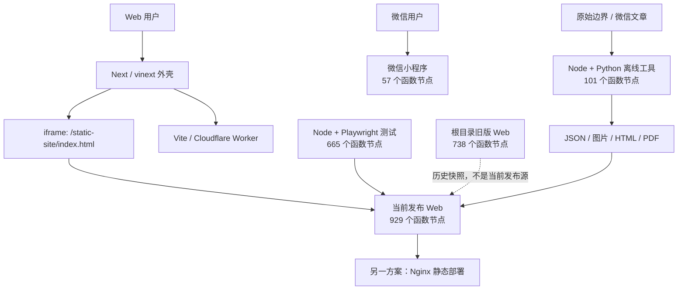
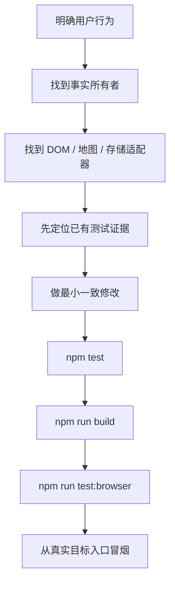

# 第 17 章：项目总地图——2,500 个函数节点怎样组成一套产品

> 这是前 17 章的总索引、覆盖证明和修改指南。它不再重复每个函数的实现，而是回答三个最终问题：项目到底由哪些系统组成；每个第一方函数去哪里查；想改一个功能时应该沿哪条链路走。

## 1. 先给最终结论

这个仓库不是“一个 JavaScript 网页”，而是六个性质不同的代码区域：

| 区域 | 函数节点 | 它是什么 |
| --- | ---: | --- |
| 当前发布 Web：`public/static-site` | 929 | 用户真正操作的地图与行程应用 |
| Next / Vite / Worker 外壳 | 10 | 承载、构建和部署静态应用 |
| 离线数据工具：Node + Python | 101 | 抓取、清洗、切片、阅读器和压缩工具 |
| 微信小程序 | 57 | 与 Web 分叉的独立地图应用 |
| 自动化测试 | 665 | 验证当前 Web 的可执行实验 |
| 根目录旧版 Web | 738 | 2026-07-14 的可运行历史发布快照 |
| **仓库第一方合计** | **2,500** | 不含第三方、生成目录和数据文件 |

如果只讨论“当前仍应继续维护的第一方代码”，暂不把根目录 738 个历史节点算进去，则是：

```text
929 + 10 + 101 + 57 + 665 = 1,762
```

这里的“函数节点”采用各语言语法树口径：普通函数、箭头函数、传统函数表达式、对象/类方法和 Python lambda 都算；TypeScript 的纯类型方法签名没有函数体，不算。

## 2. 五问核验：为什么总数必须分层看

### 第一问：为什么不能只说项目有 2,500 个函数

因为其中 665 个是测试，738 个是历史副本。把它们和当前产品逻辑混在一起，会让人误以为线上页面要执行全部代码。

### 第二问：为什么根目录旧版仍计入仓库总数

它确实是仓库里的第一方可执行源码，能够单独启动，也可能被 README 误导性地启动。覆盖审计不能因为它“应该淘汰”就假装它不存在。

### 第三问：为什么第三方 Leaflet 不逐函数登记

Leaflet 是外部依赖，仓库保存的是供应商副本和解包工作副本。维护者应理解它提供地图、图层、marker 和事件接口，但不应把阅读第三方压缩源码当作理解本项目业务的必经路。

### 第四问：为什么 JSON、HTML 和 CSS 不进入函数总数

它们会影响产品，却没有 JavaScript/Python 函数节点。函数覆盖和工程覆盖不是同一个概念，所以本章另列非函数资产。

### 第五问：为什么可以说第一方函数已经全部有去处

因为全仓扫描到 50 个第一方源码/配置文件，其中 38 个含函数、12 个为零函数文件；下方逐文件矩阵的函数数相加正好是 2,500，并且每个非零文件都链接到逐函数章节。

结论：2,500 是仓库审计数，不是页面负载数，也不是“需要一次读完”的学习任务。

## 3. 一张完整架构图



这张图里只有 `public/static-site` 是当前地图产品的权威 Web 源。根目录 `app.js` 不是它的入口文件；小程序也不是它的移动皮肤。

## 4. 当前发布 Web：929 / 929

| 文件 | 节点 | 主要职责 | 逐函数解释 |
| --- | ---: | --- | --- |
| `public/static-site/app.js` | 274 | 总调度、搜索、行程界面、存档事件 | [第 10–12 章](./10-app-bootstrap-data-search.md) |
| `public/static-site/app-data.js` | 27 | 关键/延迟数据、重试、超时、最新轮次 | [第 1 章](./01-data-and-place-index.md) |
| `public/static-site/place-index.js` | 39 | 地点规范化、索引、搜索和增量水合 | [第 1 章](./01-data-and-place-index.md) |
| `public/static-site/map-core.js` | 88 | Leaflet 初始化、图层、marker、路线、视图 | [第 2 章](./02-map-core.md) |
| `public/static-site/trip-controller.js` | 4 | 懒加载 Trip 领域模块并组合公开接口 | [第 3 章](./03-click-to-trip.md) |
| `public/static-site/city-detail.js` | 110 | 城市/区县进入退出、详情与局部地图 | [第 4 章](./04-city-detail.md) |
| `public/static-site/food-content.js` | 49 | 美食 store、文章加载、卡片和 marker | [第 5 章](./05-food-content.md) |
| `public/static-site/trip-plan.js` | 170 | 行程事实、命令、校验、排期与迁移 | [第 6 章](./06-trip-plan.md) |
| `public/static-site/trip-editor.js` | 59 | 日历 HTML、表单、事件委托与拖放 | [第 7 章](./07-trip-editor.md) |
| `public/static-site/trip-archive.js` | 34 | 保存、恢复、分享、备份和回滚 | [第 8 章](./08-trip-archive.md) |
| `public/static-site/guide-export.js` | 75 | guide model、Markdown 和打印 HTML | [第 9 章](./09-guide-export.md) |
| `public/static-site/data/china-cities.js` | 0 | 生成的数据导出模块 | [第 1 章](./01-data-and-place-index.md) |
| `public/static-site/data/china-prefectures.js` | 0 | 生成的边界数据导出模块 | [第 2 章](./02-map-core.md) |
| **合计** | **929** |  | **929 / 929** |

`app.js` 的 274 个节点不是另一个独立领域；它们是把其余 10 个运行时模块、DOM 和用户事件接起来的胶水。因此推荐最后读第 10–12 章，而不是先顺读 2,592 行总文件。

## 5. 发布外壳：10 / 10

| 文件 | 节点 | 主要职责 | 解释 |
| --- | ---: | --- | --- |
| `app/layout.tsx` | 1 | Next 根布局和页面元数据 | [第 14 章](./14-tooling-and-deployment.md) |
| `app/page.tsx` | 1 | 输出静态站 iframe | [第 0 章](./00-zero-to-project.md)、[第 14 章](./14-tooling-and-deployment.md) |
| `build/sites-vite-plugin.ts` | 4 | 调整构建环境与 Cloudflare hosting 配置 | [第 14 章](./14-tooling-and-deployment.md) |
| `vite.config.ts` | 1 | 组合 vinext 与 Cloudflare Vite 插件 | [第 14 章](./14-tooling-and-deployment.md) |
| `worker/index.ts` | 3 | 图片请求特判，其余交给框架 Worker | [第 14 章](./14-tooling-and-deployment.md) |
| `next.config.ts` | 0 | Next 配置对象 | [第 14 章](./14-tooling-and-deployment.md) |
| `postcss.config.mjs` | 0 | Tailwind/PostCSS 配置对象 | [第 14 章](./14-tooling-and-deployment.md) |
| **合计** | **10** |  | **10 / 10** |

这层函数很少，但权限很大：一个路径、绑定或构建钩子错误可以让 929 个业务函数完全到不了用户浏览器。

## 6. 离线数据工具：101 / 101

### 6.1 Node 数据生成器

| 文件 | 节点 | 产物 | 解释 |
| --- | ---: | --- | --- |
| `scripts/build_wechat_food_index.js` | 14 | 全国美食文章索引 | [第 5 章第 20 节](./05-food-content.md) |
| `scripts/build_lazy_map_data.js` | 16 | 区县/美食按城市分片与 summary | [第 5 章第 20 节](./05-food-content.md) |
| **小计** | **30** |  | **30 / 30** |

### 6.2 Python 工具

| 文件 | 节点 | 产物/作用 | 解释 |
| --- | ---: | --- | --- |
| `scripts/1.py` | 23 | 旧版微信文章批量抓取 | [第 14 章](./14-tooling-and-deployment.md) |
| `scripts/wechat_batch_fetch.py` | 23 | 修正版微信文章批量抓取 | [第 14 章](./14-tooling-and-deployment.md) |
| `scripts/build_article_readers.py` | 15 | Markdown → HTML / PDF 阅读器 | [第 14 章](./14-tooling-and-deployment.md) |
| `scripts/build_lightweight_prefectures.py` | 10 | 简化并均衡切分行政区边界 | [第 14 章](./14-tooling-and-deployment.md) |
| `scripts/precompress_static_assets.py` | 0 | 顶层循环生成 `.gz` | [第 14 章](./14-tooling-and-deployment.md) |
| **小计** | **71** |  | **71 / 71** |

Python 的零函数文件仍有可执行行为：导入它就会从顶层开始扫描并写 gzip。这正说明“函数节点为零”绝不等于“文件无副作用”。

## 7. 微信小程序：57 / 57

| 文件 | 节点 | 主要职责 | 解释 |
| --- | ---: | --- | --- |
| `miniprogram/pages/index/index.js` | 57 | 地图、搜索、marker、路线和页面状态 | [第 13 章](./13-mini-program.md) |
| `miniprogram/app.js` | 0 | 注册空的全局 App | [第 13 章](./13-mini-program.md) |
| `miniprogram/data/cities.js` | 0 | 城市静态数据 | [第 13 章](./13-mini-program.md) |
| `miniprogram/data/counties.js` | 0 | 区县静态数据 | [第 13 章](./13-mini-program.md) |
| `miniprogram/data/metro-networks.js` | 0 | 地铁网络静态数据 | [第 13 章](./13-mini-program.md) |
| **合计** | **57** |  | **57 / 57** |

它与 Web 共享产品主题和部分数据形状，却不共享运行时模块。Web 的存档、日历、美食懒加载和安全修复不会自动进入小程序。

## 8. 自动化测试：665 / 665

| 文件 | 节点 | 测试数 | 解释 |
| --- | ---: | ---: | --- |
| `tests/app-data.test.mjs` | 52 | 17 | [第 16 章](./16-test-architecture.md) |
| `tests/browser-performance.test.mjs` | 11 | 3 | [第 16 章](./16-test-architecture.md) |
| `tests/food-content.test.mjs` | 33 | 8 | [第 16 章](./16-test-architecture.md) |
| `tests/guide-export.test.mjs` | 17 | 13 | [第 16 章](./16-test-architecture.md) |
| `tests/module-boundaries.test.mjs` | 196 | 11 | [第 16 章](./16-test-architecture.md) |
| `tests/place-index.test.mjs` | 18 | 10 | [第 16 章](./16-test-architecture.md) |
| `tests/rendered-html.test.mjs` | 38 | 26 | [第 16 章](./16-test-architecture.md) |
| `tests/trip-archive.test.mjs` | 40 | 18 | [第 16 章](./16-test-architecture.md) |
| `tests/trip-editor.test.mjs` | 112 | 31 | [第 16 章](./16-test-architecture.md) |
| `tests/trip-plan.test.mjs` | 148 | 66 | [第 16 章](./16-test-architecture.md) |
| `playwright.config.mjs` | 0 | — | [第 16 章](./16-test-architecture.md) |
| **合计** | **665** | **203** | **665 / 665** |

这里再次强调：203 是测试用例数；665 是测试文件中的全部函数节点数。

## 9. 根目录历史快照：738 / 738

| 文件 | 节点 | 与当前关系 | 解释 |
| --- | ---: | --- | --- |
| `app.js` | 406 | 旧单体总文件 | [第 15 章](./15-root-legacy-snapshot.md) |
| `guide-export.js` | 75 | 逻辑同当前，import 版本不同 | [第 9 章](./09-guide-export.md)、[第 15 章](./15-root-legacy-snapshot.md) |
| `trip-archive.js` | 29 | 当前 34 节点的严格历史子集 | [第 8 章](./08-trip-archive.md)、[第 15 章](./15-root-legacy-snapshot.md) |
| `trip-editor.js` | 59 | 逻辑同当前 | [第 7 章](./07-trip-editor.md)、[第 15 章](./15-root-legacy-snapshot.md) |
| `trip-plan.js` | 169 | 当前为 170，ID 工厂已修复 | [第 6 章](./06-trip-plan.md)、[第 15 章](./15-root-legacy-snapshot.md) |
| `data/china-cities.js` | 0 | 旧站数据导出 | [第 15 章](./15-root-legacy-snapshot.md) |
| `data/china-prefectures.js` | 0 | 旧站完整边界导出 | [第 15 章](./15-root-legacy-snapshot.md) |
| **合计** | **738** |  | **738 / 738** |

第 15 章没有重复粘贴后四个文件全部 332 行台账，而是用哈希证明相同节点并链接回原逐函数章节；旧 `app.js` 的 406 个节点则有独立迁移台账。这个做法保留可验证性，也避免两份解释未来漂移。

## 10. 2,500 节点算式复核

```text
当前发布 Web            929
Next / 构建 / Worker     10
Node 离线生成器          30
Python 工具              71
微信小程序               57
测试                    665
根目录历史快照          738
---------------------------
合计                  2,500
```

另一种按“当前代码”和“历史副本”拆法：

```text
当前第一方代码  1,762
历史快照          738
----------------------
仓库第一方总数  2,500
```

这两套加法结果相同，说明没有把 Node 生成脚本、测试回调或旧版模块漏出，也没有把零函数配置伪装成函数。

## 11. 不进入函数总数、但必须理解的资产

| 资产 | 为什么重要 | 去哪里读 |
| --- | --- | --- |
| `public/static-site/index.html` | 定义真实 DOM、控件、脚本入口和可访问属性 | 第 0、10–12 章 |
| `public/static-site/styles.css` | 决定桌面/移动布局、drawer、打印和状态可见性 | 第 7、9、12 章 |
| `app/globals.css` | Next 外壳的最小页面样式 | 第 14 章 |
| `deploy/nginx.conf` | 另一套静态部署、缓存和 gzip 策略 | 第 14 章 |
| `package.json` | 唯一可发现的开发、构建和测试命令表 | 第 14、16 章 |
| `tsconfig.json` | TypeScript 编译合同 | 第 14 章 |
| `project.config.json` | 微信开发者工具工程配置 | 第 13 章 |
| `data/**/*.json` 与 `public/static-site/data/**/*.json` | 城市、边界、区县、美食和交通事实 | 第 1、2、4、5、14 章 |
| `vendor/leaflet/**` | 第三方地图引擎 | 第 2 章 |

`dist/`、`.wrangler/` 是构建产物，`exports/` 是内容工具产物，`work/leaflet-package/` 是第三方解包工作目录。它们不是本项目第一方源代码的第二份权威实现，因此不纳入逐函数总账。

## 12. 17 章应该怎样读

### 路线 A：完全零基础，按因果顺序


### 路线 B：只想先看懂产品主链

读：第 0 → 1 → 2 → 3 → 6 → 10 → 11 → 12 → 17 章。

这条路线先跳过城市详情、美食、编辑器细节和导出格式，能最快建立“数据怎样到地图、点击怎样到行程、事件怎样启动”的主骨架。

### 路线 C：准备修改代码

先在下一节按问题找到章节，再同时打开：

1. 负责事实的领域模块；
2. 负责 DOM/地图的适配模块；
3. 对应测试文件；
4. 数据或存档兼容边界。

不要只改看得见的 UI 函数。

## 13. 按问题查章节

| 我想弄懂或修改…… | 先读 | 再读 | 应跑的测试 |
| --- | --- | --- | --- |
| 城市搜索、拼音、区县合并 | 第 1 章 | 第 10 章 | `place-index`、`app-data` |
| 全国地图、marker、路线曲线 | 第 2 章 | 第 3、10 章 | `module-boundaries`、浏览器测试 |
| 点击地点后加入路线 | 第 3 章 | 第 6、11 章 | `trip-plan`、浏览器测试 |
| 城市/区县详情切换 | 第 4 章 | 第 2、5 章 | `module-boundaries`、`food-content` |
| 美食文章与推荐 | 第 5 章 | 第 11、14 章 | `food-content`、`rendered-html` |
| 行程规则、排期、警告 | 第 6 章 | 第 11 章 | `trip-plan` |
| 日历编辑、按钮、拖放 | 第 7 章 | 第 6、11 章 | `trip-editor`、浏览器测试 |
| 保存、恢复、分享、导入 | 第 8 章 | 第 12 章 | `trip-archive`、`rendered-html` |
| Markdown / HTML 攻略 | 第 9 章 | 第 12 章 | `guide-export`、浏览器测试 |
| 首屏加载、搜索接线 | 第 10 章 | 第 1、2 章 | `app-data`、`rendered-html` |
| 行程面板和推荐渲染 | 第 11 章 | 第 5–7 章 | `trip-plan`、`trip-editor` |
| 启动、存档事件、文件下载 | 第 12 章 | 第 8、9 章 | `trip-archive`、浏览器测试 |
| 微信小程序 | 第 13 章 | 第 1–3 章作对比 | 当前没有自动测试 |
| 数据生产、构建、部署 | 第 14 章 | 第 5、16 章 | 构建 + 待补工具测试 |
| 为什么改了代码页面没变 | 第 15 章 | 第 0、14 章 | 确认实际入口后再跑 |
| 测试到底证明了什么 | 第 16 章 | 本章 | `npm test` + `npm run test:browser` |

## 14. 修改功能时的工程闭环



“事实所有者”是这套架构里最有用的概念：

- 路线和天数事实属于 `trip-plan.js`，不属于按钮；
- DOM 事件属于 `trip-editor.js` 或 `app.js`，不应自己重写领域规则；
- 地图图层属于 `map-core.js` / `city-detail.js`；
- 数据到达和失败策略属于 `app-data.js`；
- 存储事务属于 `trip-archive.js`；
- 文档格式属于 `guide-export.js`。

只要先找到所有者，大部分修改都能避免“同一规则修了三遍仍不一致”。

## 15. 当前架构为什么会长成这样

它经历的是渐进演化，不是一次性设计：

1. 最早是根目录单体静态站，所有地图、搜索和行程胶水挤在一个 `app.js`；
2. 静态站被复制到 `public/static-site`，再由 Next iframe 承载；
3. 地点、地图、详情、美食、行程、编辑、存档和导出逐步拆成模块；
4. 大数据改成关键轻量分片先到、可选详情后到；
5. Node 测试先保护纯领域，再用三条 Playwright 路径补真实浏览器；
6. 小程序和离线工具作为独立路径留在同一仓库。

这解释了它的优点和债务：

- 优点：静态站部署简单，领域函数可测，懒加载失败可以局部降级；
- 债务：双 Web 副本、两个部署方案、Web/小程序重复逻辑、工具命令分散、默认验证入口不完整。

## 16. 是否有更好的方案

更好的方案不是立即重写，而是按风险收紧边界。

### P0：先消除“入口不一致”

1. 明确 README 只启动 `public/static-site` 或正式 Next 入口；
2. 删除或归档根目录旧副本，历史交给 Git；
3. 增加唯一 `npm run verify`；
4. 修复当前四个 TypeScript 类型错误，让类型检查进入验证链。

### P1：补生成与部署证据

1. 为 Node/Python 数据生成器建立固定小样本测试；
2. 生成写入先到临时目录，校验后原子替换；
3. 给 Next/Worker 真实入口加一条冒烟测试；
4. 把缓存版本、数据 schema 与生成器版本写入 manifest。

### P2：减少重复和隐式合同

1. 抽出 Web 与小程序可共享的纯地点/路线规则；
2. 用 schema 校验 JSON，不靠多个模块各自猜字段；
3. 用 import graph/ESLint 规则替代一部分源码字符串测试；
4. 为移动端、键盘可访问性、打印和真实网络增加少量高价值浏览器测试。

不建议先把 929 个 Web 函数全部改成 React。当前最大的风险是入口、数据合同和验证闭环，不是“没有使用足够新的 UI 技术”。

## 17. 最终验证状态

本次总审计的静态证据：

- 50 个第一方源码/配置文件被纳入清单；
- 38 个函数文件共 2,500 个节点；
- 12 个零函数文件仍按整体行为登记；
- 当前 Web 929、工具 101、小程序 57、测试 665、外壳 10、旧版 738，算式闭合；
- 第三方、生成目录和纯数据资产有明确排除理由；
- 章节内部逐函数台账与总表相互链接。

本次动态证据：

| 检查 | 结果 |
| --- | --- |
| `npm test` | 200 / 200 通过 |
| `npm run test:browser` | 3 / 3 通过 |
| `npm run build` | 第 14 章复跑成功 |
| `npx tsc --noEmit` | 第 14 章记录 4 个现存类型错误 |
| 根目录旧版静态冒烟 | 第 15 章通过 |

“构建成功、类型检查失败”不是矛盾：当前构建器会转译 TypeScript，却没有把完整类型检查作为失败条件。

## 18. 最后给初学者的一句话

不要把这 2,500 个函数想成 2,500 道必须背下来的题。工程阅读的关键是先分清：

> 哪份代码是当前入口，哪一层拥有事实，哪一层只是把事实画出来，哪条测试真正观察了它。

做到这四点后，函数会从一堆陌生语法变成一张有道路、有分区、有路标的城市地图。前 17 章和本章总账，就是这张地图。

返回入口：[项目零基础拆解目录](./README.md)
