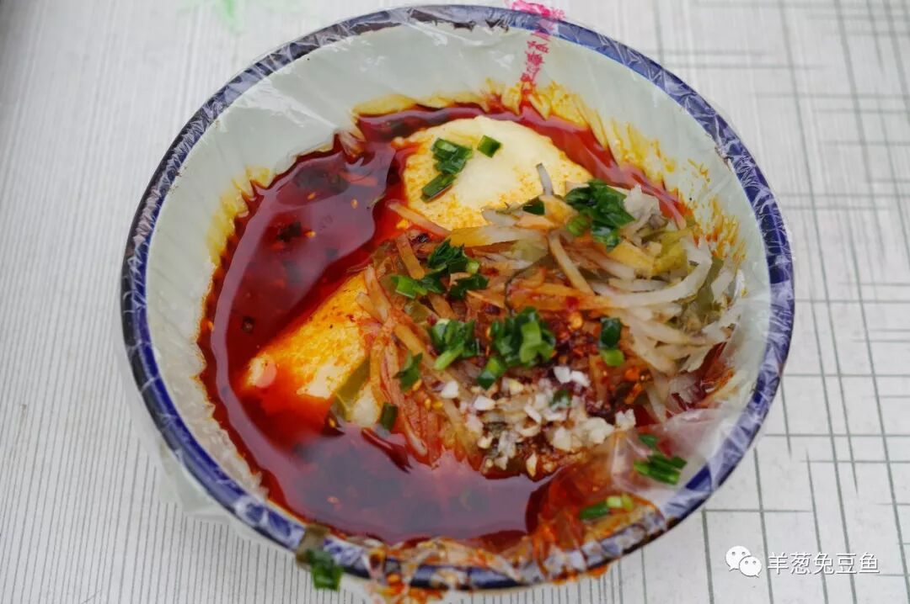
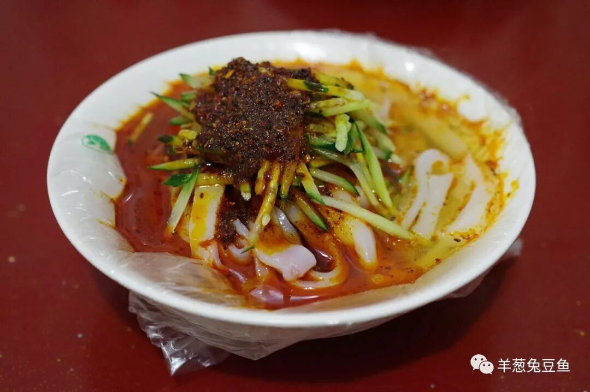
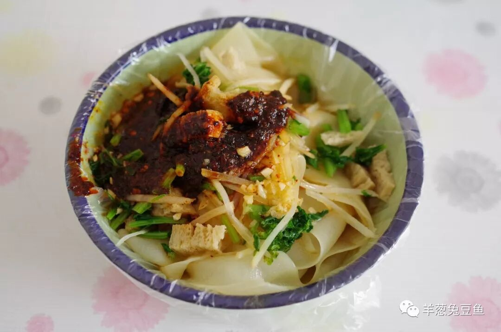
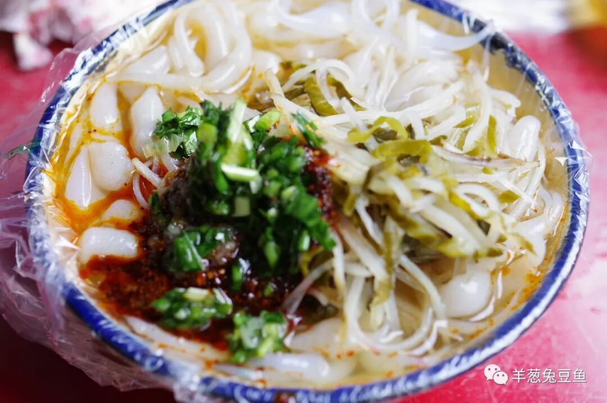
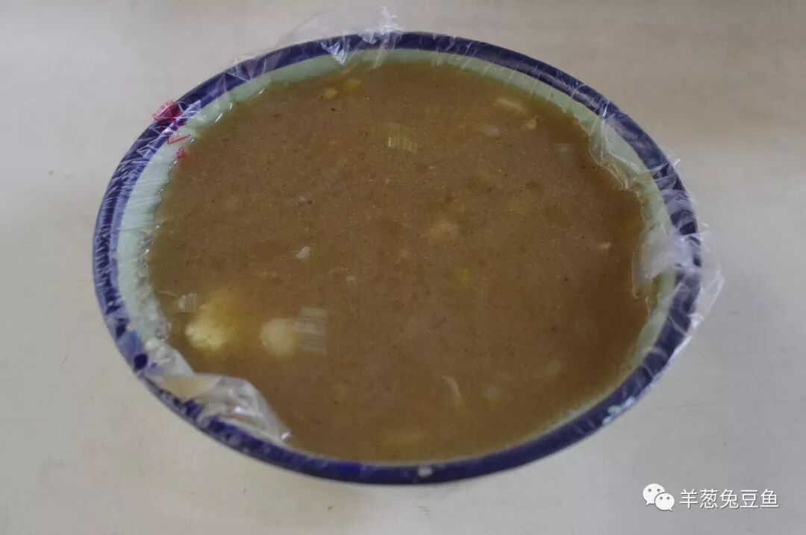
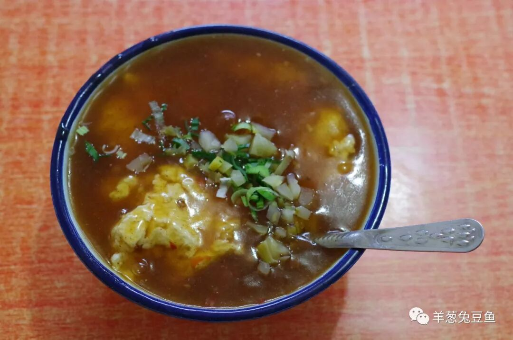
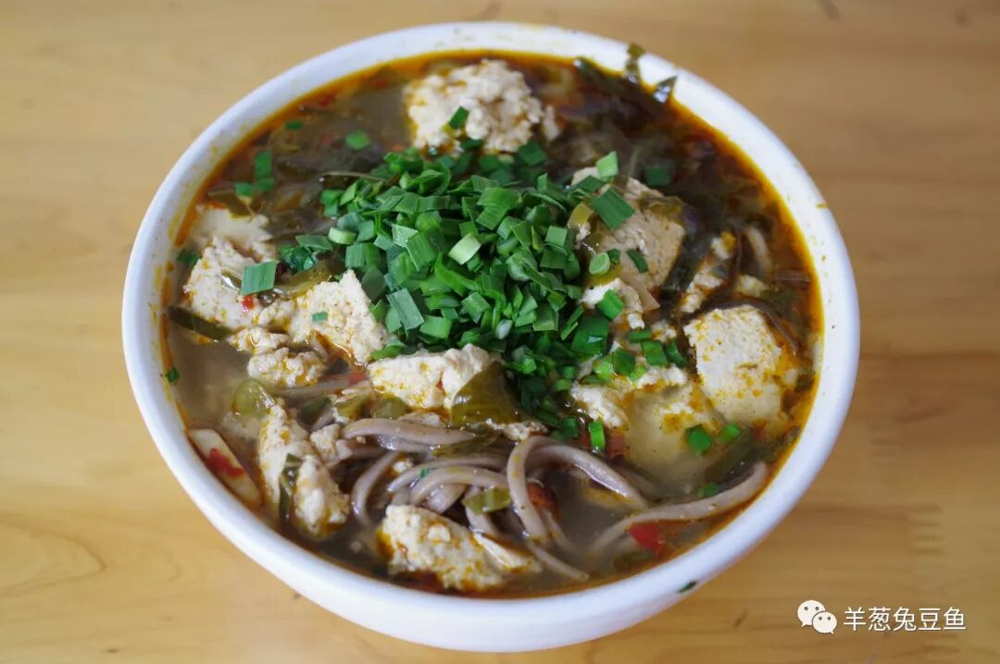
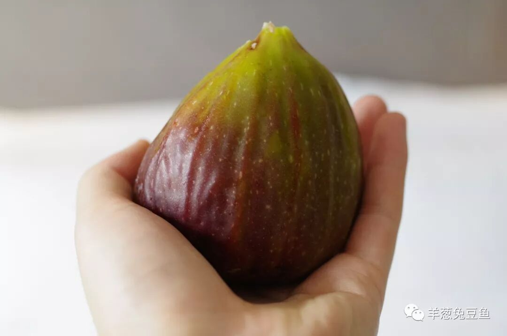
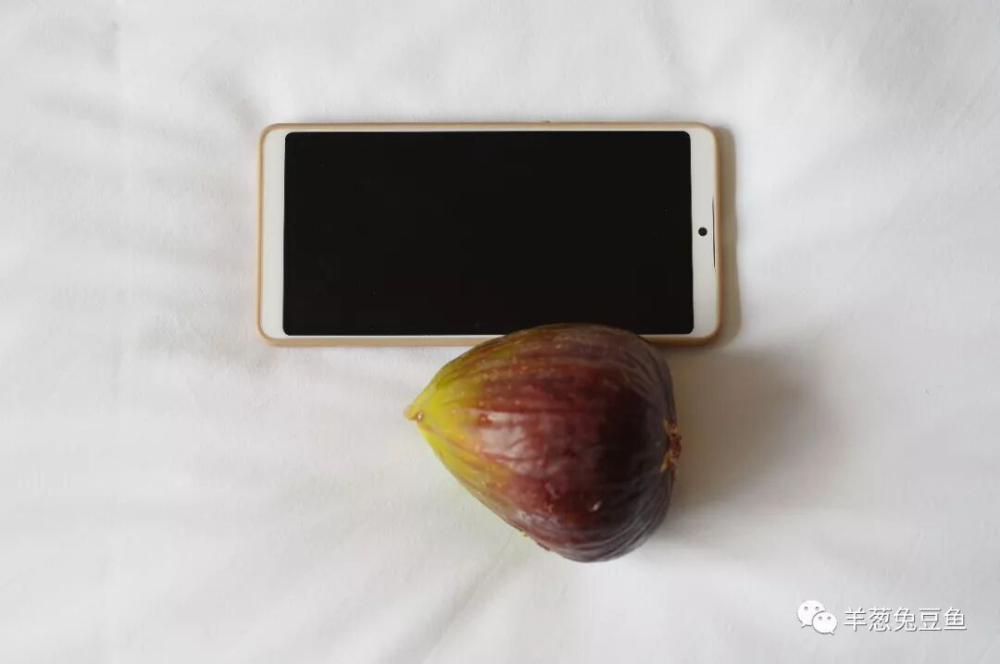

# 【第001天 陇南·武都】白龙江畔的洋芋搅团

- 原文链接: https://mp.weixin.qq.com/s?__biz=MzA3MTM2Mjk3NA==&mid=2247503858&idx=1&sn=a9b6f83e1986b04e3ba80acc40b88ca8&chksm=9f2c3f03a85bb615204f5003879bd9dfdb81f897f98caf739d9041040b43cb3b708e454339da&scene=21
- 作者: 宇哥食行记
- 发布时间: 未知
- 图片数量: 12

甘肃篇引言

甘肃，其实是中国相当受冷落的一个省。至少在饮食上。

若随便抓一个非甘肃人问“你知道甘肃有什么特色饮食吗？”，他可能脱口而出“兰州拉面！”。诚然，随着这两年媒体的不断扫盲，很多人已经知道兰州并没有“兰州拉面”，有的只是牛肉面，甚至还能颇地道地叫出“牛大”之名。但若继续追问，怕多半是只得摇摇头了。

“等等，我还知道羊杂碎、甜醅子和牛奶鸡蛋醪糟！”

“嗯，我知道你去过正宁路夜市了

。”

“……”

哪儿有这么简单？羊杂碎绝不是兰州的最好，甜醅子几乎整个甘肃都吃，而牛奶鸡蛋醪糟正宁路之外有的是。从全省的视角看，甘肃的饮食既存在高度统一的部分，如酿皮、甜醅、浆水面等；同时存在更多高度分异的部分，如天水的呱呱、武威的“三套车”、张掖的牛肉小饭，这部分饮食极富地域特色，凡说出口无需地名前缀，便知道代表了哪个地方。

今年年初，《纽约时报》将甘肃评选为“2018全球必去的52个目的地”之一，中国再无其他省份入选，其景致已经得到了充分的认可。而这一次，我想用21天的时间，为甘肃的饮食正名。

正文

这是行程的第一站，也是甘肃的第一站。陇南陇南，陇上江南，但这里的人，更习惯叫它武都。两岸的高山挤压着白龙江，一座小城就在这样的夹缝中生长出来。

天还未亮便已到达，下着稀稀落落的小雨，依稀可见两旁的山巅不断变换的云雾。我喜欢有山的城市，不仅是城市景观更加丰富、层次分明，更重要的是大山给我的那种踏实与厚重感。

从火车站出来，沿着路灯渐渐熄灭的街道往旧城走，偶尔瞥见一个正在揉着面饼的妇女、或是一个正在往蒸屉下方加着柴火的大叔，我深吸一口气，一种真实感席卷全身。我思索着：这一定是个不会让我失望的城市。

所以就开始了。

（1）

洋芋搅团

（少看两便，看多了会上瘾。）

如果一定要用一种食物代表武都，那一定是洋芋搅团。尽管陕南地区也有洋芋糍粑，但将其发展为日常小吃、在各小吃市场都能听到此起彼的“哐，哐，哐”声音的地方，仅武都一处。

所谓洋芋搅团，就是将煮熟的洋芋剥皮后放入木槽中反复捶打，直到洋芋的性状发生改变，获得一种类似糍粑、打糕的质感。一碗武都的洋芋搅团，现砸现买，盛入碗中后加大料、辣子、蒜泥与一小撮土豆丝。

初尝一口，确有糍粑的软糯之感，但粘度远不如糍粑，轻轻一咬便可脱离本体。搅团并不能入味，汁水只是包裹着它而无法渗透，当咽下汁水，再咀嚼口中那一点搅团，洋芋的甜香瞬间袭来，让人无法抗拒。

（2）

米皮

米皮本是汉中产物（在汉中叫热面皮），传入武都后又得到了发扬光大。今天的武都街头，卖米皮的店铺和小摊比比皆是，从数量上看已经远超过了搅团。如果你从清晨的武都街头经过，一定能看到一层层码放起来的蒸屉上，米浆正在完成它米生重要的转化。

切一碗现蒸的米皮，再加上调料（与搅团的调料基本一致），撒上一把黄瓜丝，稍微搅拌，再轻轻地挑起缓缓送入嘴中，米皮的糯韧适中、油泼辣子的浓香再加上黄瓜丝所赋予的一层清新、爽脆的口感，一碗下肚不过三五分钟。如果觉得油泼辣子的味道过于厚重，也不妨加一小勺醋中和而食。

（3）

面皮

卖米皮的店家多半也卖面皮，尽管与米皮的调料并无区别，面皮更强的韧性、更耐嚼的口感也俘获了它自己的粉丝。是米还是面，君且随便选；今日米，明日面，反正都是一样钱。

（4）

漏鱼子

陕甘地区的人对这种食物再熟悉不过了，多用白面、荞面制作，形如小鱼、蝌蚪。它可以叫漏鱼、也可以叫鱼鱼儿，漏鱼子是陇南人给它的称呼。漏鱼子与凉粉一样属消暑良品，燥热的夏季来一碗暑气便悄然离去。

武都的漏鱼子所使用的调料仍不过是大料辣子蒜泥之流，一把酸菜增添了一丝酸爽的脆感，不过与你想象的酸辣口一定会有出入。但这就是武都人最执着的味道，无关好坏，喜恶随意。

（5）

油茶

油茶也是广泛流行于陕甘地区的食物，但做法与味道就天差地别了。说得简单些，就是炒熟的面粉（也可能是其他谷物）加上各种香料熬煮而成的一碗糊汤。

别看这碗面茶其貌不扬，一碗滚烫的面茶一定是冬日清晨的一抹浓烈阳光。浓稠度适中的面茶充满了香料的味道，葱花与蛋花依稀漂浮其中，顺着喉咙慢慢吞下，感受那略带颗粒质感的糊汤带给你的滋润。就着麻花与馍馍，一顿便宜管饱的早餐，齐活。

（6）

豆花子

终究是与四川相邻的城市，如果饮食没有一点四川的色彩也说不过去。这碗豆花子就算是比较好的例证了。豆花子也是武都人早餐的高频选择之一。

现点的豆花，浇上芬芳四溢的卤子，用勺子将豆花碾碎与卤子充分混合，吃时可要小心烫嘴。芡糊状的卤子与颗粒分明的豆花立刻充满整个口腔，胡椒的香、大料的香也不示弱。武都人更喜欢在里面放上一两根麻花同食，我想，那应该也是极佳的口感体验。

（7）

酸菜豆花荞面

我会记住这一碗面。

酸菜、豆花、荞面，没有哪一样是多么独特的食物，组合在一起却变换出如此惊艳的风采。微酸微辣的口味，豆花的粉与荞面的韧组合出层次鲜明的口感。一碗面口味出众而又营养丰富，实在是一顿主食的不二之选。

（8）

无花果

这就纯粹是意外的发现了。今天在街头巷尾穿梭时，发现到处是卖无花果的小贩，水果店也将其展示在显眼的位置，一排排新鲜的无花果堆放起来煞是好看。走近一看发现这无花果竟如此巨大，着实吃了一惊（南方人少见无花果，少见多怪嘛）。

心生好奇便上网查询了一番，发现武都是甘肃省唯一的无花果产地，而我竟赶上了六七月这上市的时节。没有犹豫，买了两个，真大！再尝一口，真甜！曾在山东吃过的袖珍无花果，一下子就失了宠。

发完这篇文章，我就再去买两个。

（把它和6寸屏幕的手机一起比较，是真大！）

武都的一天到这里就可以结束了。我并未穷尽武都所有常见的饮食，还有如凉粉、拌汤、砂锅、以及各种清真馍馍、大饼等。这些食物很难谈得上是武都特色，我将在之后的行程中为你介绍，我并非遗漏了。

武都不大，如果你愿意，花个三两小时便能将其走穿。但你绝想不到，步行距离20分钟的地区内，竟容得下七八条小吃街（小吃市场），而这，也是武都。如果你生活在这里，你的早餐绝不会只囿于包子馒头豆浆油条的选择。你也根本不用担心找不到吃处，因为目之所及，全是小吃街。这里的小吃街不为游人服务，这就是普通的武都市民每天谱写他们名为日常的曲所固定前往的地方。所以根本用不着我推荐，你来，就有的吃。

再会吧武都。你可真是个特别的城市。

顺带说一句，今天吃的所有东西一共花了35元。没错，35元。

想知道我在干啥，请点这个链接：吃货的决心——555天中国饮食探索之行

想知道我要去哪，请点这个链接：555天行程计划（2018-06-20更新）

欢迎转发分享和关注~

（长按识别二维码点击关注哦）

 var first_sceen__time = (+new Date()); if ("" == 1 && document.getElementById('js_content')) { document.getElementById('js_content').addEventListener("selectstart",function(e){ e.preventDefault(); }); }

 if ("0" == 1) { document.addEventListener("keydown",function(e){ if ((e.metaKey || e.ctrlKey) && (e.key === 'c' || e.key === 'C' || e.key === 'x' || e.key === 'X' || e.key === 'a' || e.key === 'A')) { if (e.target.tagName === 'INPUT' || e.target.tagName === 'TEXTAREA') { return; } e.preventDefault(); } }); document.addEventListener("copy",function(e){ var sel = window.getSelection(); var content = document.getElementById('js_content'); if (sel && sel.rangeCount > 0 && content && content.contains(sel.getRangeAt(0).commonAncestorContainer)) { e.preventDefault(); } }); }

预览时标签不可点

微信扫一扫

关注该公众号

知道了 (javascript:;)
