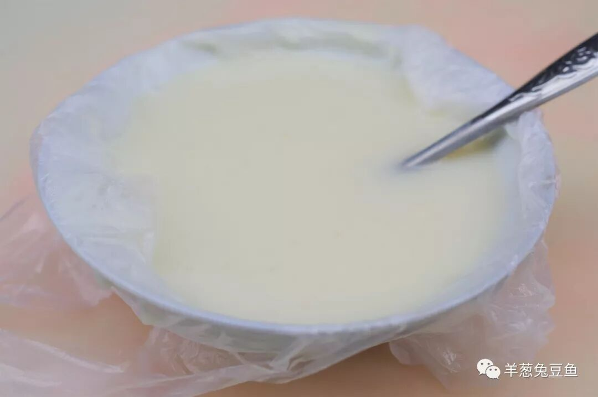
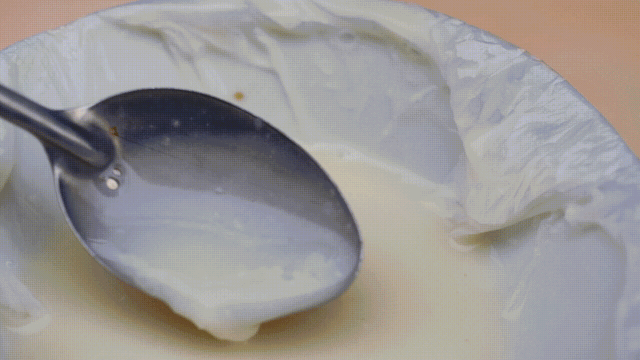
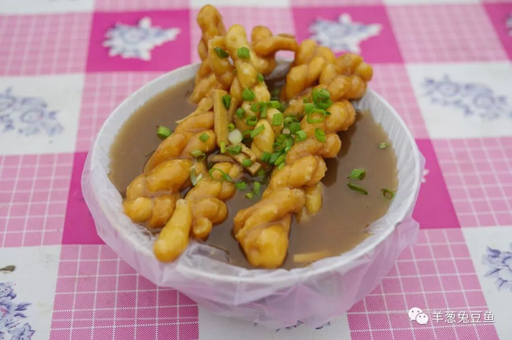
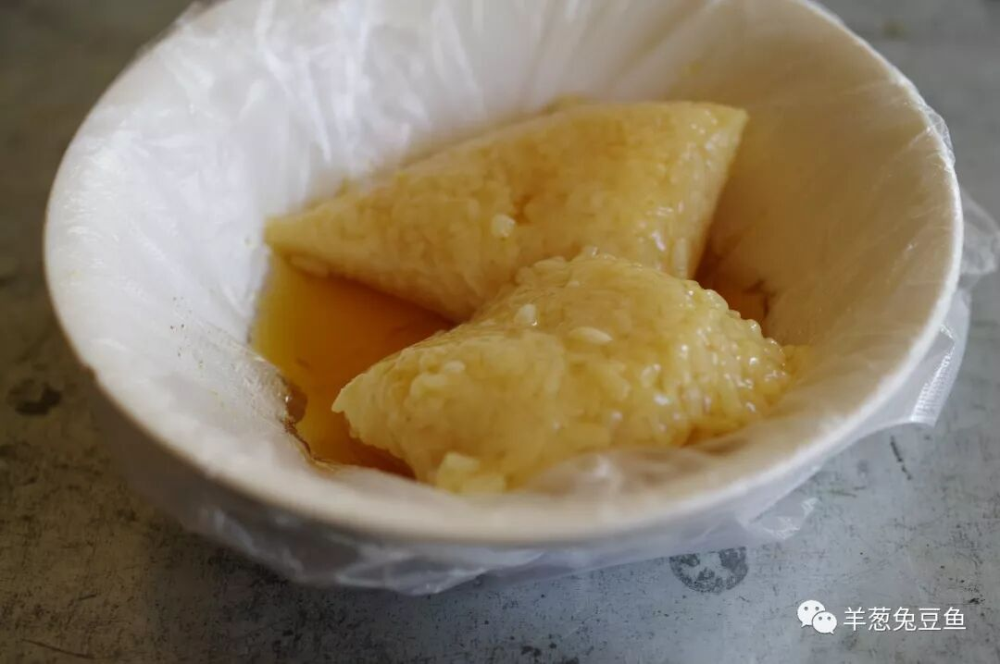
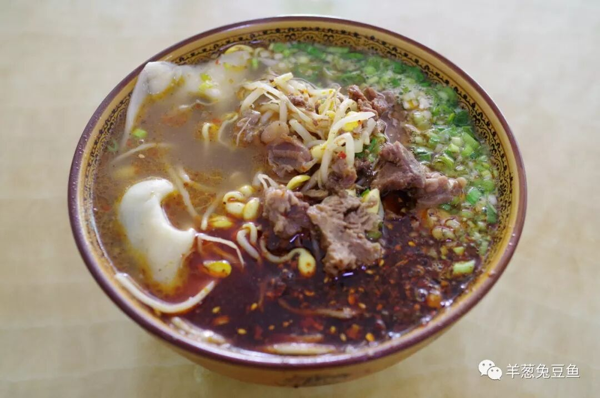
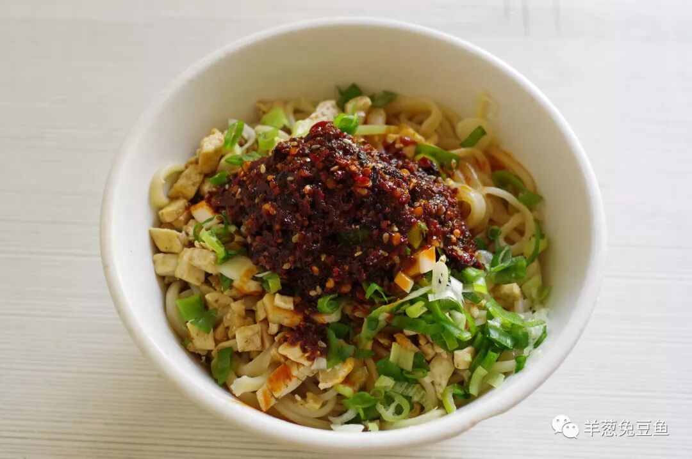
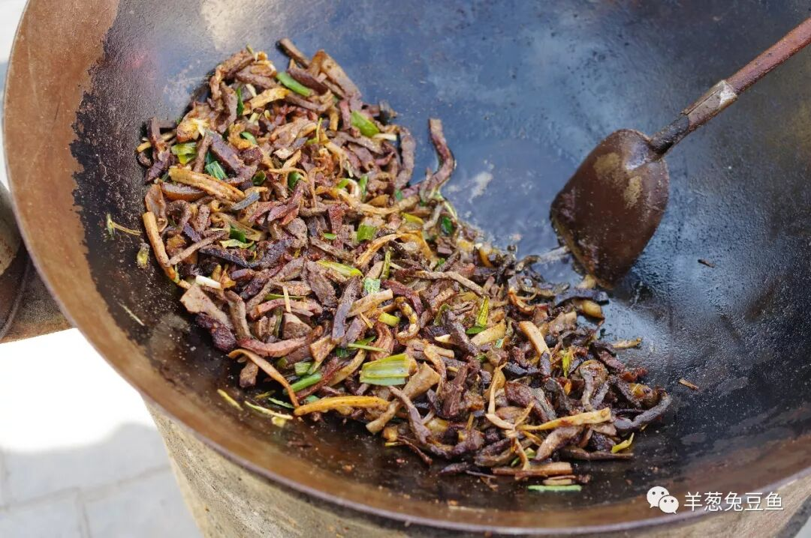
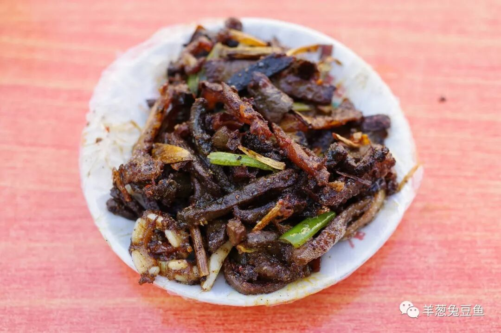

# 【第002天 陇南·成县】甜浆甜，牛肉馄饨香辣咸

- 原文链接: https://mp.weixin.qq.com/s?__biz=MzA3MTM2Mjk3NA==&mid=2247503857&idx=1&sn=e8eec722b8efd710938da0cdbddef23e&chksm=9f2c3f00a85bb6165e1a8fbc1cf95083084b2941195a1d115c568231f581dc1c9502ce3fa4e8&scene=21
- 作者: 宇哥食行记
- 发布时间: 未知
- 图片数量: 9

成县是陇南下辖的一个县，曾与现在的市政府驻地武都有过一段有趣的故事，感兴趣的话不妨去搜搜看。

从武都前往成县的高速，一半在明，一半在暗。大巴穿梭在群山之间，明烈的阳光穿过车窗，车上的乘客也自顾自做着若隐若现的梦。突然钻出一个隧道，大雾弥漫，却隐隐约约已不见密集的山峦，大抵是快要到了。成县地处徽成盆地，雾天本就是盆地地区的家常便饭，又何况身处秦岭之中。

成县的市区摊得挺大，与武都的逼仄之感截然不同，多了三分北方城市的敞亮。老街区的砖瓦房又兀自顶着坡度不小的斜坡，仍带着两分南方城市之感。大巴刚驶进城关，我的眼球立马被街旁一口口升腾者热气的大锅吸引去了，忙叫住师傅：“我就在这儿下了！”

（1）

甜浆

不就是一碗豆浆吗？是，也不是。在中国，要寻找豆浆实在不是一件难事，可要寻找甜浆，你就只能来成县了。

所谓甜浆，就是在豆浆中加入大米熬煮而成的一碗流食。可不能叫它豆浆粥，连稀饭也谈不上，一碗盛上来的甜浆看上去仍旧是豆浆，米只是稀稀落落地分布在豆浆中，偶尔得见一两颗黄豆。

加入一勺白糖，略微搅拌，用勺子轻轻地勾起一勺，米粒能看得更加分明。习以为常的豆浆加入一些米粒却成就了独特的口感，爽滑甜香，一碗下肚通体温润。我想，这一碗甜浆应该是成县人骨子里的家乡味道。

（2）

油茶麻花

成县的早点之王，油茶麻花。油茶的味道与武都的味道并没有太大差别，少了分香料味多了分面香。在成县，油茶与麻花总是捆绑出售，喝一口油茶、咬一口麻花，感受油茶的滑、麻花表层的软和里层的脆所组成的三重口感。麻花与油条相比有一个巨大的优势，就是久泡不软，表层在浸润汤汁变得绵软之后内里仍能长时间保持酥脆之感。

（3）

蜂蜜凉粽子

在东部地区一直为到底是北方的蜜枣粽还是南肉的肉粽更胜一筹争得不可开交之时，蜂蜜凉粽子却并没有获得太大的曝光度。这种粽子在陕甘地区较为流行，今日在成县街头有幸偶遇。

冰凉的粽子淋上冰凉的蜂蜜，绝对是炎炎夏日一道上好的甜品。甜度适中的蜂蜜（应该是稀释过）包裹着微微清香的白粽，比蘸白糖能让甜蜜分布得更加均匀，冰凉的口感又进一步化解了甜腻，连吃2~3个一气呵成。

（4）

牛肉馄饨

兰州人酷爱的那一口略为寡淡的牛肉面，在成县俨然无迹可寻。成县人更偏爱口味较重的牛肉馄饨与牛肉面片。

说是牛肉馄饨，其实牛肉指的是牛肉汤与牛肉浇头，馄饨也不过是包裹着少量韭菜馅的菜馄饨，与我们熟悉的皮薄馅大的馄饨截然不同。牛肉汤打底，馄饨作主角，豆芽葱花与牛肉伴之，最后再浇上重重一勺油泼辣子，食之香辣咸，并带有轻轻的麻味，而馄饨中的韭菜又贡献了其独特的香，成就了相当复合的味道。再配上几颗生蒜佐食，既解油腻，又添新味。

馄饨皮厚馅小，十分耐嚼，如果不喜欢这过硬的口感，也可选择片片分明的牛肉面片。若你在周边县市看到招牌为“成州牛肉面片”、“成州馄饨”之类的小店，不必怀疑，他们就从这里走出。

推荐食处：马占祥馄饨

（5）

棒棒面

棒棒面是徽、成两县较为普遍的一种面食。面条如棒，面如其名，在其他地方也可能叫做棍棍面。对于西北人来说，面条的劲道与否常常是一条相当苛刻的标准，而棒棒面绝对是最劲道的几种面条之一。

这碗成县的棒棒面，加入豆腐丁、蒜苗和油泼辣子，充分搅拌后色泽红亮。松软的豆腐丁与硬质的面条相互配合，互不抢谁的风头。呲溜呲溜吸上两口再慢慢咀嚼，口舌之欲得以满足。

除棒棒面外，成县的扯面、手擀面也较为流行，若是有机会，定当再来尝试。

（6）

牛杂小炒

如果你足够幸运，也许能像我一样在成县街头找到这样一种小食——牛杂小炒。牛肉、牛肝、牛肚、牛肺等切成丝，与蒜苗一起就这么在街边支起的铁锅中反复煸炒，直至炒得焦脆。

炒焦后的牛杂有了一种奇异的口感，动物油脂的焦香在口中瞬间炸开，让人根本停不下筷，连炒焦的任何一根蒜段都不愿放过。不过焦糊的食物总是多食无益，来上这么小小一盘浅尝辄止，足矣。

这就是成县街头的“辣条”，小心上瘾。

这就是成县，一个处在南北过渡地带的城市，一个饮食既有显著的陇南陕西特点、又开始呈现部分陇上气息的城市。

成县有不少小吃密布、仍保留着浓厚旧城气息的小巷子，如果你来，不妨在其中寻觅一番，也许，还会有不同的发现呢。

也发现一个有意思的事，今天在成县街头擦腿而过的每一只狗，双眼都往下耷拉着，颇带着几分慵懒和忧郁的气质，不知道是不是和这个城市的气质有关呢？不得而知。

想知道我在干啥，请点击：吃货的决心——555天中国饮食探索之行

想知道我要去哪，请点击：555天行程计划（2018-06-20更新）

爱你哦~

（长按识别二维码点击关注哦）

 var first_sceen__time = (+new Date()); if ("" == 1 && document.getElementById('js_content')) { document.getElementById('js_content').addEventListener("selectstart",function(e){ e.preventDefault(); }); }

 if ("0" == 1) { document.addEventListener("keydown",function(e){ if ((e.metaKey || e.ctrlKey) && (e.key === 'c' || e.key === 'C' || e.key === 'x' || e.key === 'X' || e.key === 'a' || e.key === 'A')) { if (e.target.tagName === 'INPUT' || e.target.tagName === 'TEXTAREA') { return; } e.preventDefault(); } }); document.addEventListener("copy",function(e){ var sel = window.getSelection(); var content = document.getElementById('js_content'); if (sel && sel.rangeCount > 0 && content && content.contains(sel.getRangeAt(0).commonAncestorContainer)) { e.preventDefault(); } }); }

预览时标签不可点

微信扫一扫

关注该公众号

知道了 (javascript:;)
