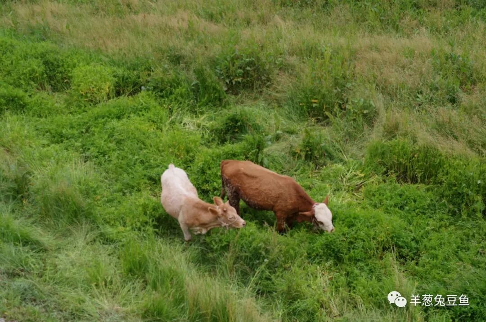
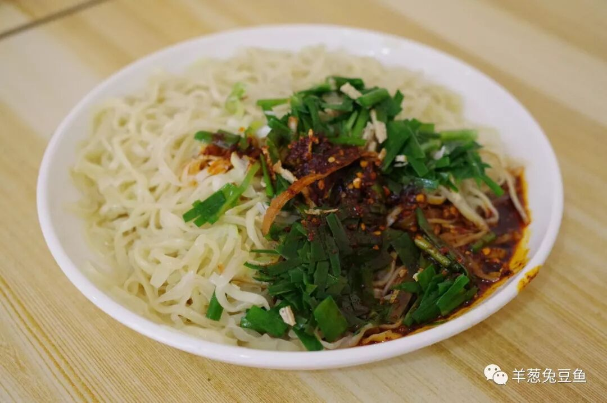
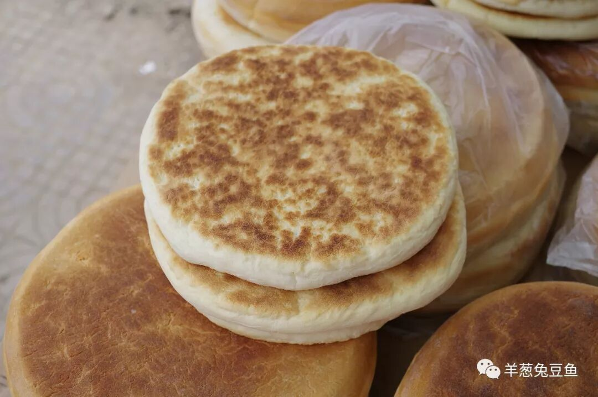
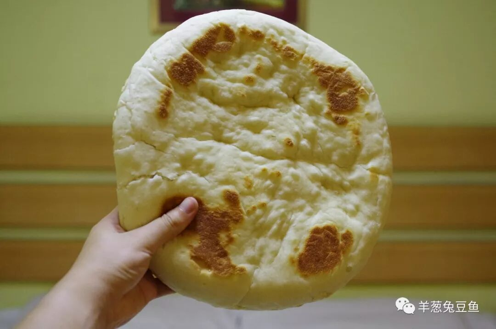
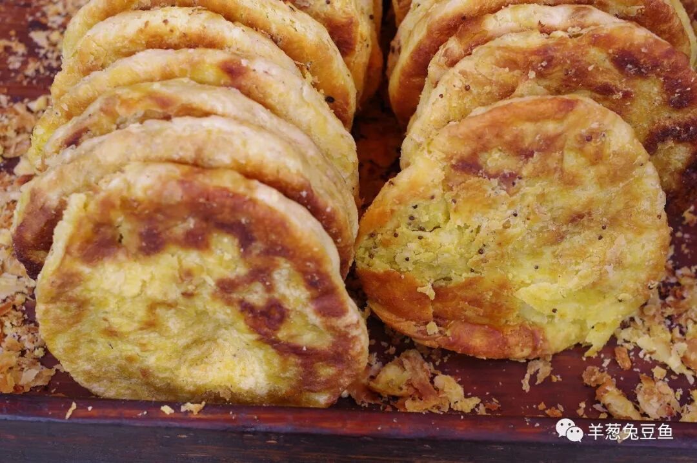
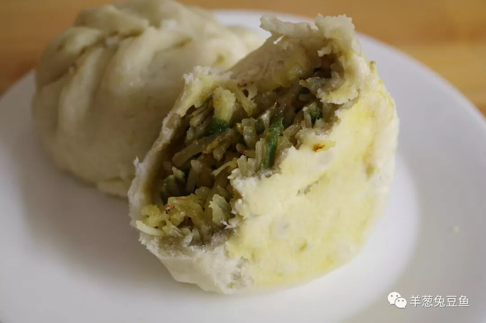
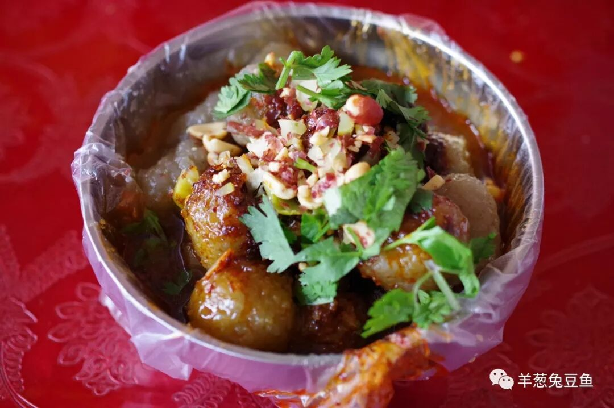
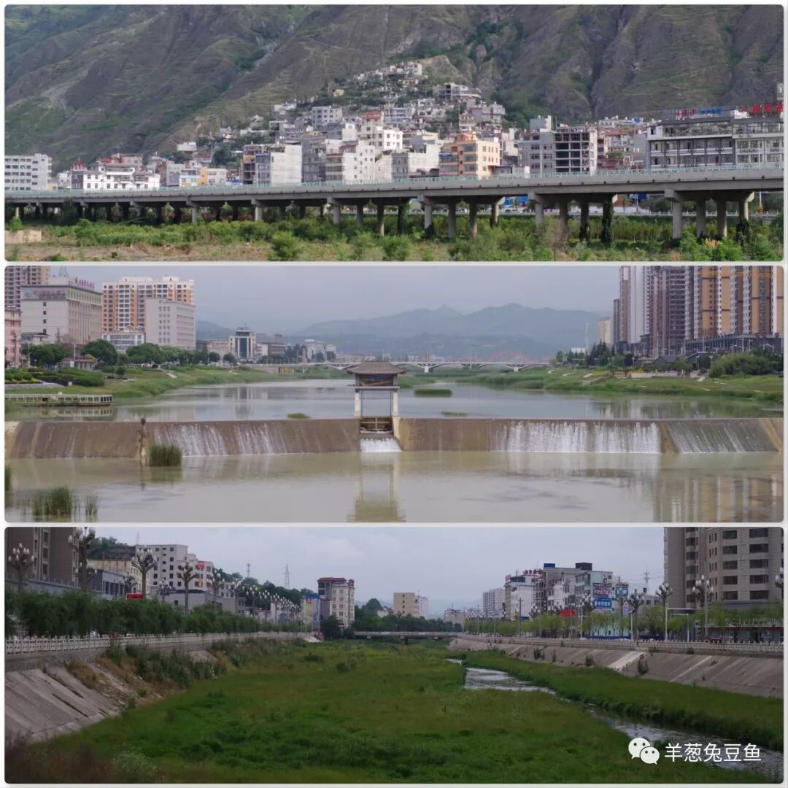

# 【第003天 陇南·西和】杠杠杠子面大大大锅盔

- 原文链接: https://mp.weixin.qq.com/s?__biz=MzA3MTM2Mjk3NA==&mid=2247503856&idx=1&sn=7c50ff786f12bf9ffca17bd15abc93c3&chksm=9f2c3f01a85bb617a02e00cdb9e3c504f48d792e1dd1dce3dba711dae033c60084d2c97ec3b2&scene=21
- 作者: 宇哥食行记
- 发布时间: 未知
- 图片数量: 9

大巴从成县出发，开始向北。绵延的群山仍是满目葱绿，植被渐渐变得低矮，红棕、青褐色的岩层更多地裸露在外，偶见一片小小的金色麦田。我还在心里抱怨大巴没有走高速而走省道，在山路上蜿蜒前行，却因没有隧道，一路通透，成塔的砖块、成堆的圆木、成排的蜂箱倏然闪过，多了分生活气息，急躁的情绪也就默然平静了。

西和的街道谈不上太多特别之处，宽阔且干净是有，棚户与新楼并存。倒是这沿着城边缓慢流淌的小河道吸引了我的注意，竟有几只牛在其中自在地吃着草，让人不禁心生欢喜。

安宁祥和的表面下往往隐藏了难以估量的力量，这西和的饮食可就是个极好的例证了。

（1）

杠子面

西和杠子面乃西和县的两大饮食标志之一。所谓杠子面即是人骑在杠子上反复上下压（擀）面，类似广东竹升面的制作方法。杠子压出来的面十分紧实，自然造就了杠子面无可挑剔的劲道口感。

西和县城的杠子面馆遍布街头，有门脸“光明正大”的，也有暗藏在三弯五折的小巷中的，随便走进一家即可品尝。比较遗憾没有亲眼看见杠子面的制作过程，只能点上一碗用口舌之满足弥补眼耳之遗憾。

实话实话，这碗面刚端上来时我有一些小小失落。用筷子搅了搅，发现这不过就是面、蒜苗、辣子的简单组合，与想象中有所差异。尝一筷我忽然明白了，像这样一碗面，又哪里需要太复杂的味道来衬托呢。简单的调味、最劲的面条，满足西北人对面条的口感要求，足矣。

（2）

大锅盔

西和县的又一饮食标志——大锅盔。说起这锅盔，那可真是脸盆般大。图片所展示的是小号，其下所压着的大号是小号的三倍大，直让人看得目瞪口呆。

西和锅盔虽不如新疆的馕耐储存（据老板说锅盔在夏季常温下可放个4~5天），但是质地相对较软，牙口不好的人也能无压力食用。掰开看发现气孔较多，若是放置于汤汁中定能充分吸收。一个大锅盔（小号），一盆牛羊肉汤，一家4口人的午饭也就差不多了吧。

（和我的手比比，你就知道有多大了！）

（3）

猪油饼

由于发现猪油饼的时候已过正午，已没有刚出炉的饼子，稍有遗憾，不过这似乎不太削弱它的滋味。

只需咬上一口，猪油香夹带着芝麻香瞬间蹦出，吃得时候饼渣止不住地往下掉，像极了小时候偷吃威化饼干时的狼狈姿态。不过这有什么关系呢，反正没人在看。几乎可以想象它刚出炉时的那种酥脆难挡。

西和还有一种麻烧饼，不过也是因为太晚已经售罄。你若来西和，可要赶早哦。

（4）

洋芋饺饺

先讲个笑话：

我走进一家早点铺问老板娘：“还有洋芋饺饺吗？”

老板娘说：“有，一块钱一个。”

我心里想这不是就是饺子吗，干脆来五个尝尝吧，但又担心有诈，便问老板娘：“一个多大啊？”

老板娘回答说：“你先来两个吧，不够再加。”

“好。”

……

还好只要了两个，不然我今天一半的胃口都要献给这洋芋饺饺了。端上桌一看，这分明就是柳叶包，吃上两口才发现其大不同。要说用料其实也不复杂，洋芋丝与蒜苗，但是使用的胡麻油给整个饺饺增添了奇香，也不会掩盖洋芋本身的清甜，实在是非常好味的“柳叶包”。若想更接近当地人的味觉体验，不妨往馅儿里加入一勺油辣子，大口咬下。

豆腐包子也是西和早点的头牌之一，值得一试。

（5）

洋芋丸子

这可不是炸洋芋，而是洋芋淀粉搓成的丸子。将洋芋丸子在热水中煮熟，调入油泼辣子，再加上花生碎、香菜等辅料即成。

把丸子、调料在碗中混合均匀，将一颗丸子送至嘴边，轻轻咬下一半，在口中慢慢咀嚼，丸子的表层软糯，内里竟还带有一丝原始洋芋的沙沙的口感，十分奇特。不过丸子并不能入味，一定要记得饱蘸汤汁。

与西和的一面匆匆结束。除了以上介绍的食物外，西和街头也密布擀面皮、凉粉、漏鱼、蜂蜜凉粽子等小吃，若是有幸前来，你定不会空腹而回。

陇南是一个在饮食上相当复杂的城市，一方面因为其复杂的地形造成的天然阻隔，另一方面则是因为建国后行政区划的不断调整（天水、定西同）。八县一区默默满足于各自的不同饮食中，却鲜有关注与传播。此次我选择了最典型的武都、成县、西和三地为大家呈现陇南的饮食，虽不完整，已能窥个大概。其他县的独特饮食，如礼县的热面皮、康县的面节节，只得留到以后有机会再行品尝了。

（从上到下分别为武都、成县、西和）

想知道我在干啥，请点击：吃货的决心——555天中国饮食探索之行

想知道我要去哪，请点击：555天行程计划（2018-06-20更新）

谢谢你滴关注转发支持

（长按识别二维码点击关注哦）

 var first_sceen__time = (+new Date()); if ("" == 1 && document.getElementById('js_content')) { document.getElementById('js_content').addEventListener("selectstart",function(e){ e.preventDefault(); }); }

 if ("0" == 1) { document.addEventListener("keydown",function(e){ if ((e.metaKey || e.ctrlKey) && (e.key === 'c' || e.key === 'C' || e.key === 'x' || e.key === 'X' || e.key === 'a' || e.key === 'A')) { if (e.target.tagName === 'INPUT' || e.target.tagName === 'TEXTAREA') { return; } e.preventDefault(); } }); document.addEventListener("copy",function(e){ var sel = window.getSelection(); var content = document.getElementById('js_content'); if (sel && sel.rangeCount > 0 && content && content.contains(sel.getRangeAt(0).commonAncestorContainer)) { e.preventDefault(); } }); }

预览时标签不可点

微信扫一扫

关注该公众号

知道了 (javascript:;)
