# 【第004天 天水】天水呱呱呱呱叫

- 原文链接: https://mp.weixin.qq.com/s?__biz=MzA3MTM2Mjk3NA==&mid=2247503855&idx=1&sn=145e73f49cedee57ae00110477c871ca&chksm=9f2c3f1ea85bb60894a5e00116cebab4fda8c48f930fb70e3297b1997c10aa1371cdf6a4b160&scene=21
- 作者: 宇哥食行记
- 发布时间: 未知
- 图片数量: 14

了解天水可以有很多由头，或因为它是甘肃第二大城市，或因为它有麦积山石窟，或因为它是伏羲故里。但爱上天水仿佛不需要什么理由，只消把它的名字念上两遍，“天水天水，天一生水”，磅礴而秀美。

仰仗着这独一无二的美名，不知天水是否也想让它的饮食体会一下好名字所带来的快感，于是便有了用呱呱、然然、捞捞、削削等让外来者瞪大眼挠两腮的AA式叠词所命名的食物。诧异之余，不禁感慨，天水会玩。

起了个大早，前往秦州老城区的各个小街巷中寻找天水的晨间味道。天明前下过雨，街上的水凼一个接一个，微风还将行道树上的水珠顽皮地推下，让人误以为小雨又起。传言中熙熙攘攘的各大早点聚集地，却只有零零散散几个食客在埋头咀嚼，摊主也有空招揽过往的行人了。也好，无人争抢，静静享用。

那你准备好了吗？

（1）

呱呱

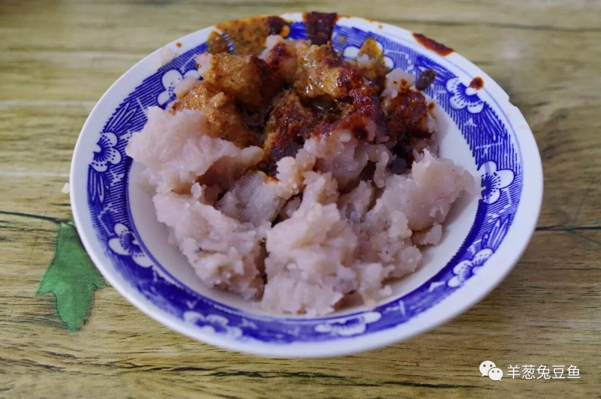

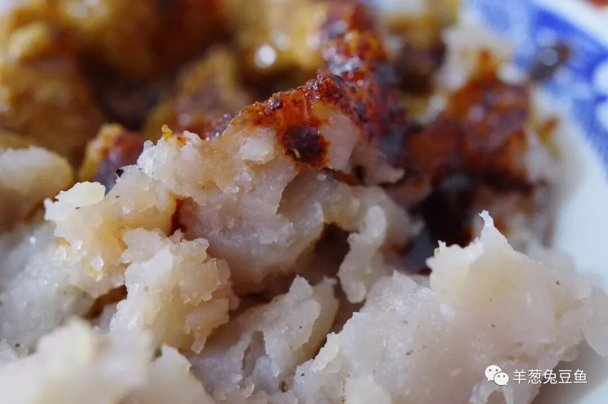

呱呱，多么俏皮的名儿。最常见的呱呱是用荞麦淀粉加水烧煮后冷却而成，食用时用手抓取放入碗中，调入油辣子、芝麻酱、蒜泥、醋等调料。一碗呱呱上桌，实在是难以抑制那一半红亮、一半粉褐的诱惑。

当你尝试用筷子搅拌时，这呱呱竟在碗里微微蹦弹起来，像“呱呱”一般的跳不禁使人在心里也耐不住“呱呱”叫。食之香、辣、绵、软、凉，一咬即断、一抿即化，无需费力的咬合。不过这口味也尤为浓重，若吃不得，记得叫店家少油少辣。

如果要用一种食物来代表天水，只能是呱呱。

（2）

然然

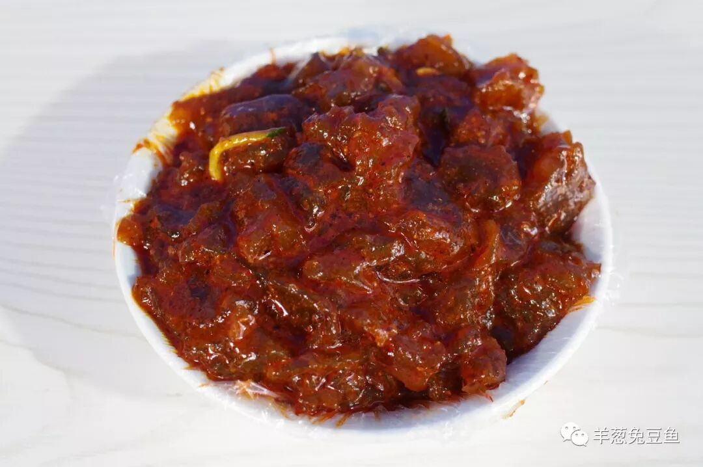

然然（也常见写作“嘫嘫”）算得上是呱呱的孪生兄弟，只不过把荞麦淀粉换成了洋芋淀粉。比起呱呱，然然在碗里安分了许多，看起来似乎口感会更加软糯，而实际上，然然更加韧、弹，也更有嚼头，口感较接近魔芋。搅拌均匀的然然比呱呱更加酸辣，还是要记得做好心理准备。这两兄弟，都不是省油的灯。

除了呱呱、然然外，一同售卖的往往还有面皮和凉粉。捞捞、削削也就是凉粉，只不过一个条状、一个片状，大概实在是怕这名字太过隐晦，小摊上基本也就标注“凉粉”了。这类食物在天水的标配就是油泼辣子+芝麻酱，也是天水区别于甘肃其他地方的味道标志。

至于锅（guō）鲰（zǒu）（即漏鱼、面鱼），如今在天水街头可能要走上好几条街才能发现一家，有点式微的感觉了。

（3）

杏茶

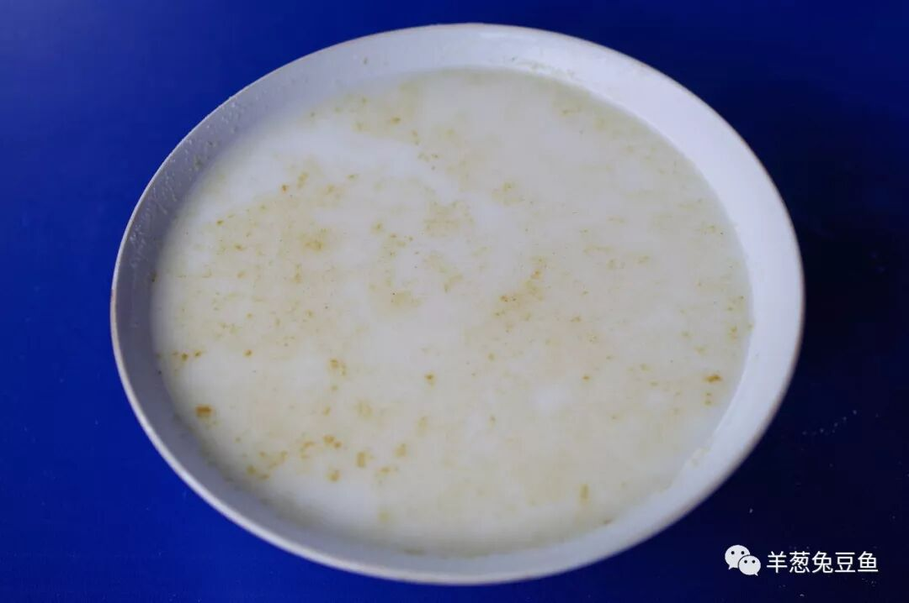

早点无汤，心里就慌。这杏茶便是天水人搭配呱呱然然的首选。不知是否受杏仁露之流的影响过深，我预期的杏茶应是清甜之味。真正得以品尝才大彻大悟，这一口咸香，不输半分。杏茶的表面撒了薄薄一层茴香粉，既增添了浓厚的香味，又与碗中的杏仁渣一起合力在口中刺激着每一平方毫米的内壁，那口感无与伦比。

（4）

荏子馍

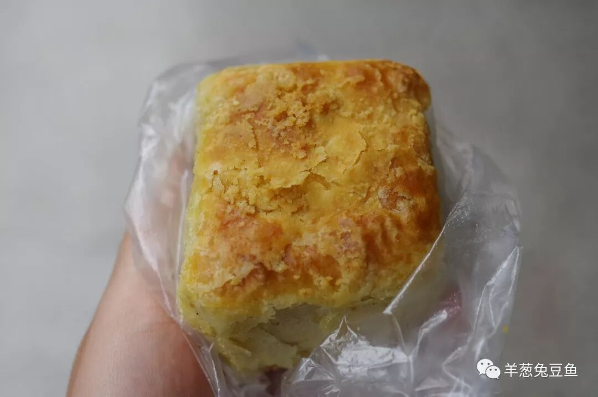

各种馍、饼也常驻天水的各大早点市场，最常见的要属大黄馍与猪油盒子了。此次觅食正好看见了荏子馍，想来这应该是更难寻得的味道，便相中了它。

荏子是一种中药，加入了荏子粉的馍有了中药材特有的草本清香，使原本略微油腻的馍多了一分爽口。而馍本身顶部酥脆，内里层层分明，吃起来很是利口。不过馍十分吸水，净吃一个难免口干，若是配上一碗汤水，会更加顺畅。

（5）

浆水面

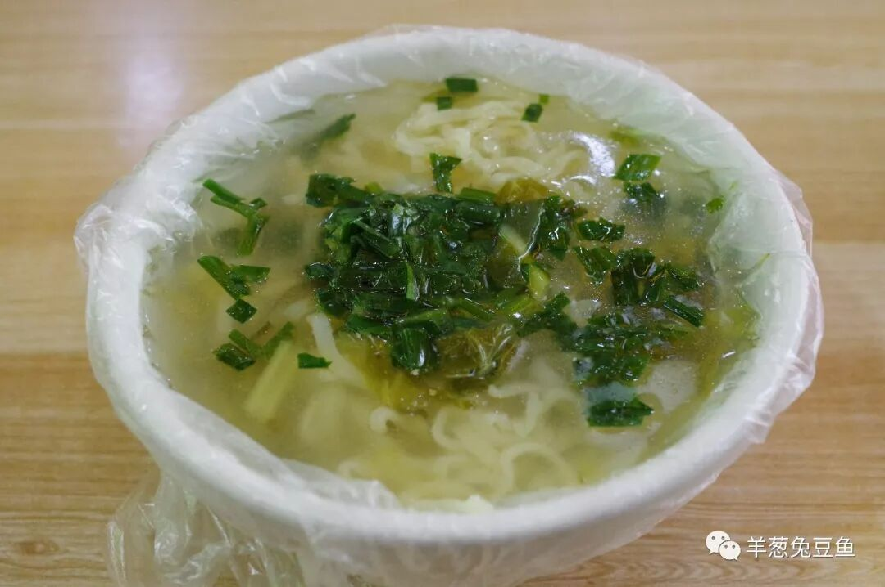

浆水面是甘肃极为常见的夏季面食，可以一路从天水吃到敦煌。所谓浆水，其实就是将各种蔬菜放入容器内，加入引子发酵一段时间所成的食物。由于各地使用的蔬菜不同，所谓浆水并没有一个统一的范式。而且和腌制泡菜一样，温度、湿度、引子等条件的轻微改变都会使最后的成品在味道上有所差异。

一碗清凉酸爽的浆水面，用不上其他食材的陪衬，就这么品咂那蔬菜的清香、浆水的酸香，无需汗流浃背，便可暑气消去、口舌生津。

除浆水面外，天水最流行的还有大卤面、炝锅面等，喜欢面条的你一定不要错过。

（6）

素扁食

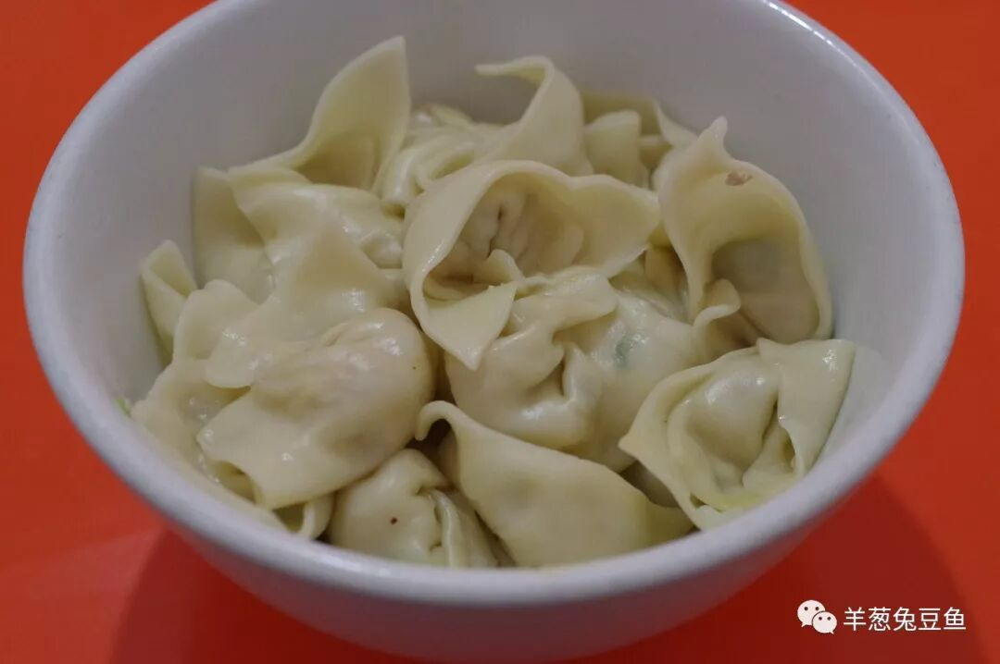

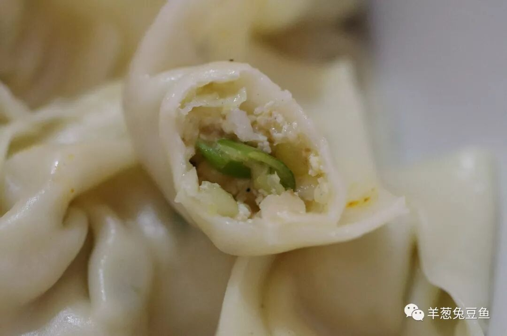

据说素扁食应是清水县名吃，如今已在天水市区遍地开花，似乎也就没人再去纠结它的源头了。为了更好地品尝素扁食的原味，我尝试了蘸汁的吃法，就像饺子那样。干拌、打卤等也是常见的选择。

这素扁食的馅儿并不复杂，白萝卜、豆腐与蒜苗，更令我惊喜的地方在它的皮儿，比饺子薄、比馄饨厚，这居中的厚度让素扁食既获得了饺子的韧、又有馄饨的软，相当独特。如果不能用饺子或馄饨与它划等号，就让它默默地做素扁食吧。

再谈这沾水，看起来再平常不过，却在我搅拌均匀后试味时感受到一种颗粒物的刺激。我将碗拿近，仔细观察碗壁上的粘留物，发现几粒玉米糠，原来如此！本是一碗西北地区任何餐馆都能轻易调出的油泼辣子酸醋蘸水，却因为这玉米糠的加入而变得与众不同，实在是非常讨巧。

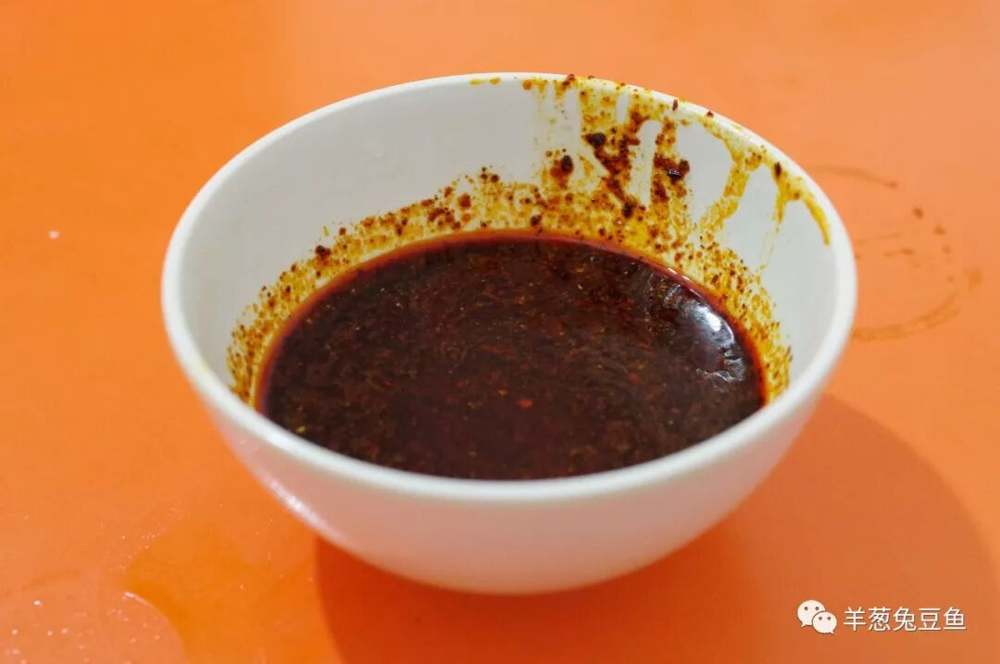

（7）

甜醅

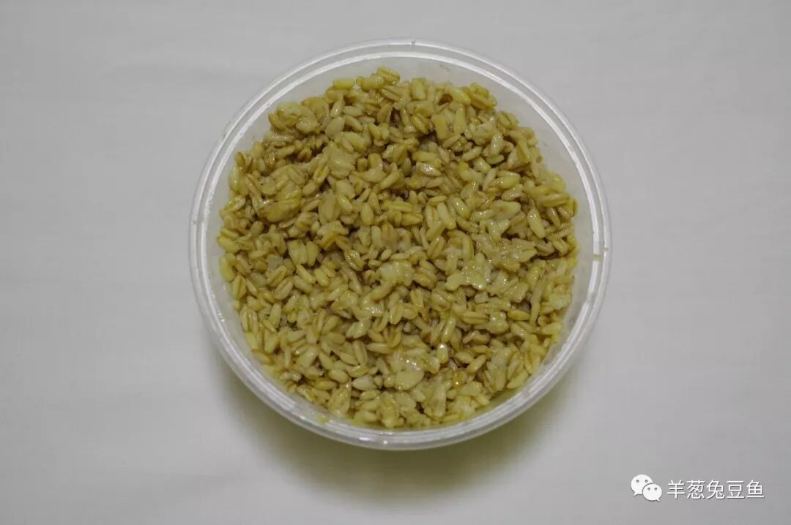

凡吃过甜醅之人，无一能忘记那甘甜清爽的滋味。常见的甜醅主要由莜麦、小麦和青稞加甜醅曲发酵制成，陇上地区以莜麦、小麦为主，甘南藏区和青海则以青稞为主。天水不算是甜醅特别盛行的地区，但比起陇南的难寻踪影，已经为天水人的饮食版图中增添了一道极佳的夏季甜品。

这碗偶然获得的甜醅，粒粒分明，食在口中除甘甜的滋味外，还能尝到一颗颗小冰渣，口感更加爽脆。不得不感慨，才下胃头，又上心头。

（8）

大樱桃

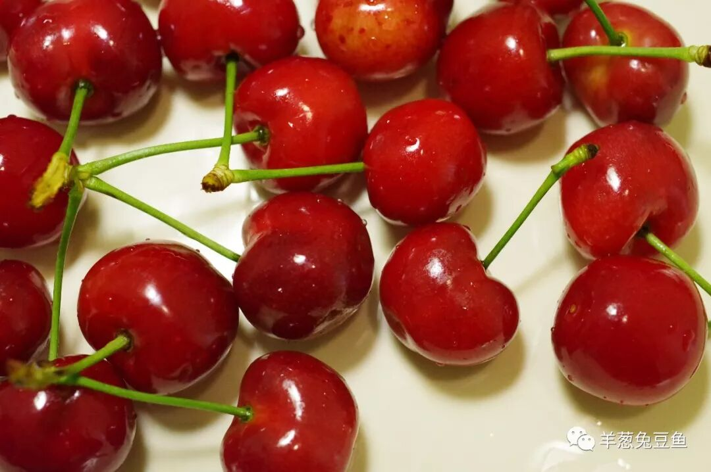

不来，我就不曾知道。天水是甘肃的樱桃产区，虽非自古以来长期种植，近些年也已在周边地区收获了不小的名气。此时大樱桃的上市期还未过，正巧被我赶上，可真是只幸运狗啊。若你有幸在五月下旬到六月下旬来到天水，可千万要尝尝这大樱桃，然后再不要说“甘肃只有瓜”这样的傻话了。

（9）

罐罐茶

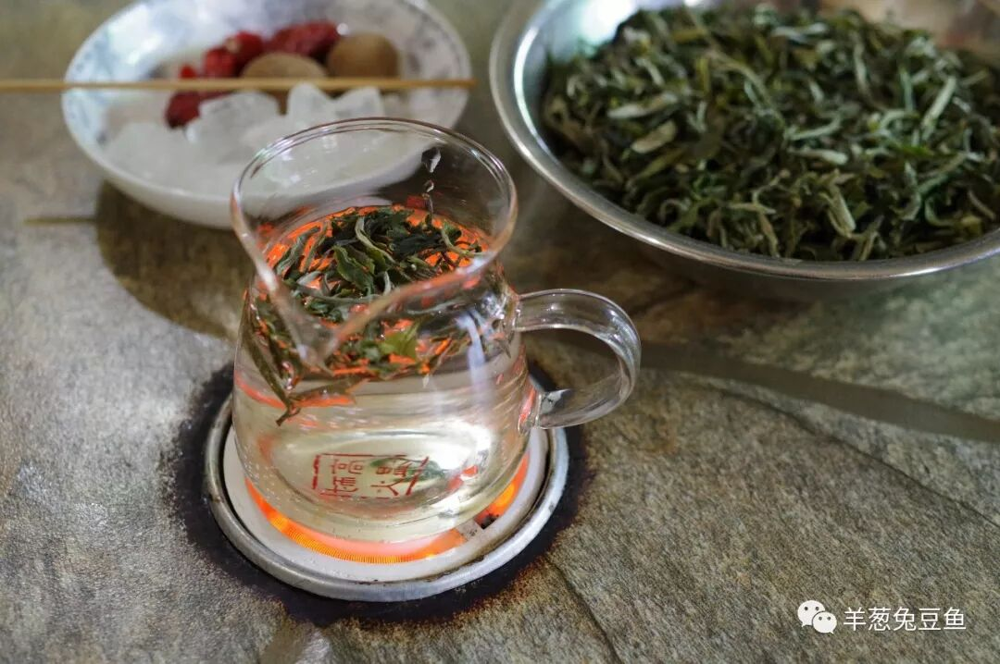

早就把罐罐茶安排在了天水这天的行程中，可是在秦州老城区寻觅一圈未果。在网上查询一番发现麦积反而有不少罐罐茶店，便驱车前往20公里外的麦积，果然寻得。

走在天水站北面的区府路上，一家家罐罐茶店门脸破败，有的还门庭紧闭，像饱经沧桑的老人咬紧了牙关。推开一家店的门帘，一下子由外在的冷清变成了内在的热闹。这热闹倒也不是人声鼎沸，座无虚席的几张小桌上，有侃着大山的三两好友，有吃着鸡的男男女女，也有拖着腮帮子看着眼前的透明罐子咕噜咕噜的人（我）。

一碗并不名贵的茶叶，一盘冰糖、枸杞、红枣、龙眼干组成的甜蜜之源，一个空罐再加一瓶水。甜与不甜，浓与不浓，君且随意。就这样坐着，一个下午的时光悄然逝去。虽不再是那传统的罐罐与炭火，这样更加节能、环保的方式也未尝不可取，至少，罐罐茶的本质还在。

又想到秦州已难寻罐罐茶的踪影，麦积虽易寻却不乏破败与冷清，很怕这美好的生活方式突然地离我们而去。如果你下次来到天水，来到麦积，不妨走上这么个十几分钟，来到火车站后面的区府路，闯入其中一处然后沉醉其中。我想，这会成为你铭刻于心的体验。

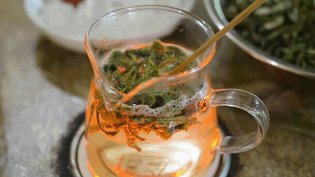

还有网友推荐了天水的丸子馍，可实在不凑巧，今天恰逢周日，天水一中门口冷冷清清，只有一只手数的过来的家长，在校门口长长的成绩墙上寻觅着他们孩子的大头照与三位数。就把这留作一个遗憾吧，怕什么呢？天水，本来就是个还会再来的城市。

天水就是这么特立独行，你不能简单地用关中风味或是甘肃风味去定义它的饮食。天水就是天水，来过便知，离开便不复得。

渭水常流，天水常守候。

想知道我在干啥，请点击：吃货的决心——555天中国饮食探索之行

想知道我要去哪，请点击：555天行程计划（2018-06-20更新）

我爱天水，你爱我吗？

（长按识别二维码点击关注哦）

 var first_sceen__time = (+new Date()); if ("" == 1 && document.getElementById('js_content')) { document.getElementById('js_content').addEventListener("selectstart",function(e){ e.preventDefault(); }); }

 if ("0" == 1) { document.addEventListener("keydown",function(e){ if ((e.metaKey || e.ctrlKey) && (e.key === 'c' || e.key === 'C' || e.key === 'x' || e.key === 'X' || e.key === 'a' || e.key === 'A')) { if (e.target.tagName === 'INPUT' || e.target.tagName === 'TEXTAREA') { return; } e.preventDefault(); } }); document.addEventListener("copy",function(e){ var sel = window.getSelection(); var content = document.getElementById('js_content'); if (sel && sel.rangeCount > 0 && content && content.contains(sel.getRangeAt(0).commonAncestorContainer)) { e.preventDefault(); } }); }

预览时标签不可点

微信扫一扫

关注该公众号

知道了 (javascript:;)
