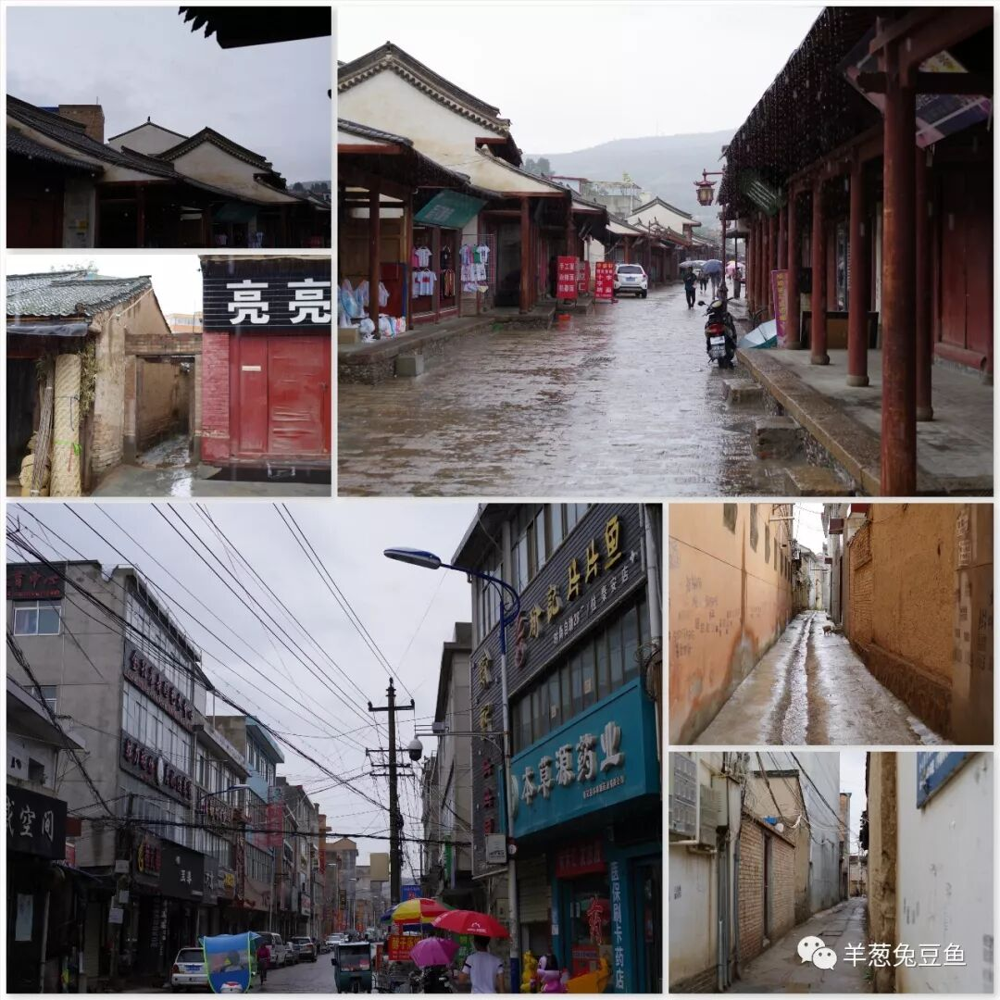
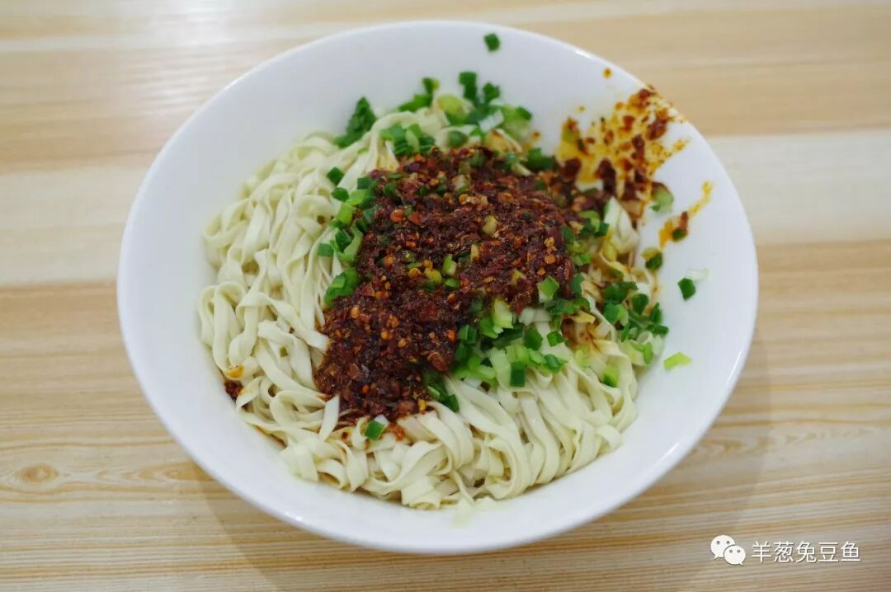
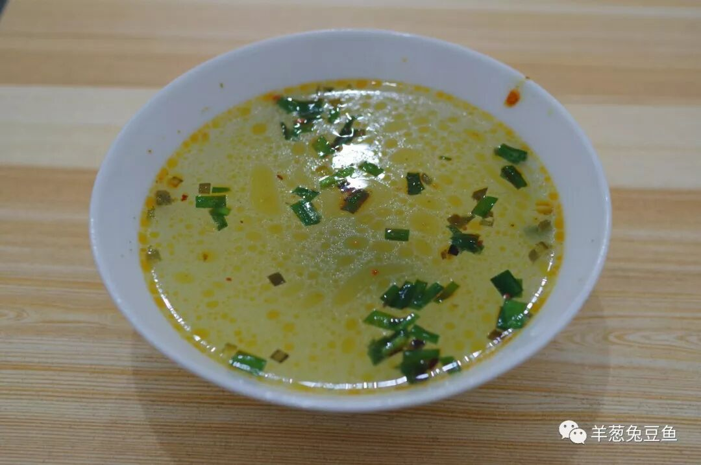
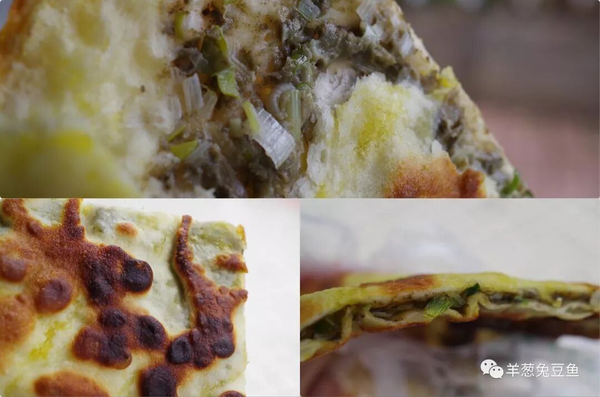
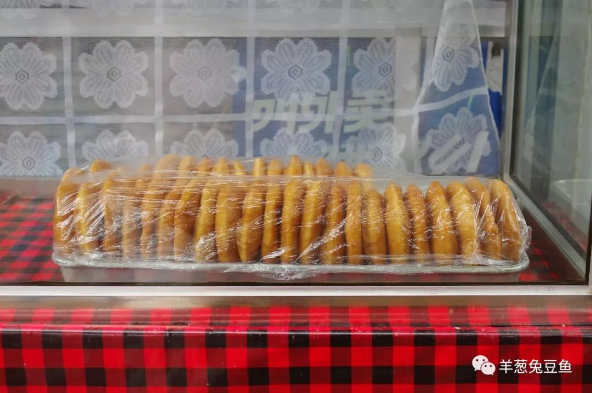
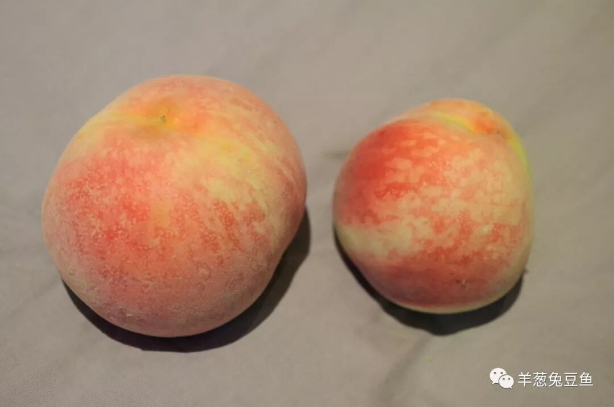
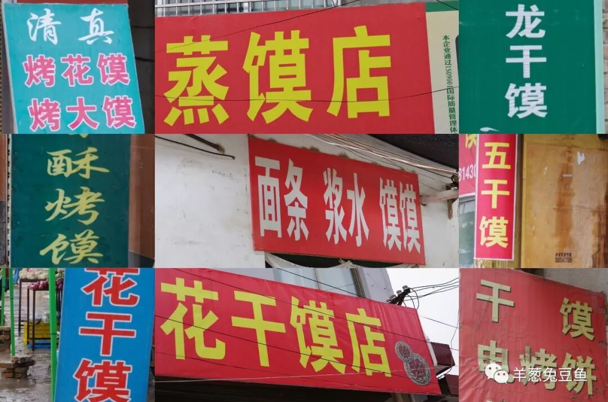
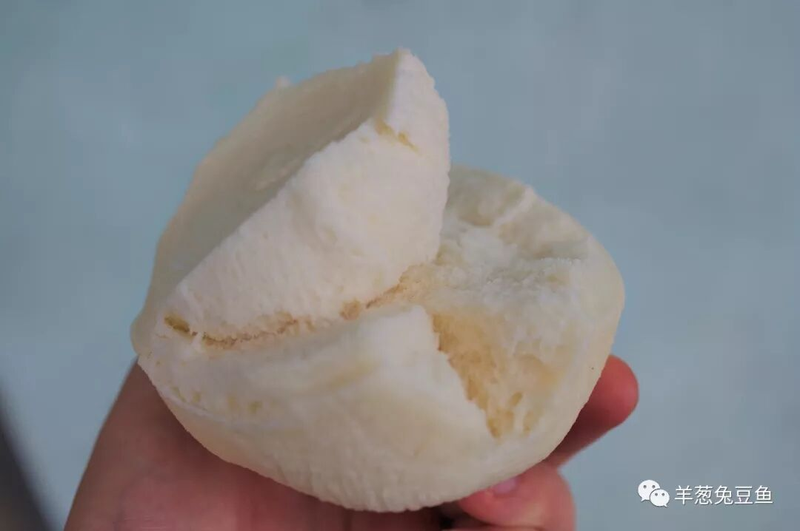

# 【第005天 天水·秦安】我以馍的名义呼唤你

- 原文链接: https://mp.weixin.qq.com/s?__biz=MzA3MTM2Mjk3NA==&mid=2247503854&idx=1&sn=34cdf495004a685aa77c690a92109905&chksm=9f2c3f1fa85bb609effefbbbf583f2cc4b37e5b68cd72ecfb175930e48b74c475e550cfd9f64&scene=21
- 作者: 宇哥食行记
- 发布时间: 未知
- 图片数量: 10

秦安，大雨一整天。

因未计划在秦安过夜，背着登山包、撑着伞、踏在泥泞路上觅食，一副狼狈模样。抬头眺望远山，乌云压顶、云雾环绕，有三分压抑也有三分奇幻的美。

一路走着，一路经过各种雕刻出的标语：娲皇故里，仿佛在用尽全力向行人宣告着，这是一座有着厚重历史的城市。从大路拐进小巷，竟一瞬间深陷进去，原来，这才是秦安！

古旧的街巷连成片，未经刻意的开发或是改造，没有游客，只有我一个背着打包的人显得格格不入。尽管大雨侵盆，人们仍旧撑着伞踩在泥坑中前进，毫无退缩。各个市场仍旧热闹非凡，谈话声穿透雨声向四面八方扩散而去。

是啊，怕什么呢，我也该前进。

（1）

辣子面

又是一碗简单朴素的西北面条，看似貌不惊人却暗藏玄机。油泼辣子与蒜苗静静躺着，面条是棒棒面的形状，一饭搅拌后送入最终，才觉这不同之处。调料中加入了茴香，面的味道变得更加丰富，而面条也有了些南方面条的绵软之感，去契合这更加复杂的味道。不过茴香即如香菜，爱者大快朵颐，恨者避之不及，吃之前可一定要先掂量自己。

一碗香辣的辣子面，再配上一碗酸爽的浆水汤，这样一餐简单的主食，直让人胃口大开、通体舒畅。

（2）

麻腐饼

麻腐对甘肃以外的人来说，应当是极其罕见的食物。它既不是豆腐，也不是麻豆腐，而是用（亚）麻籽加工调味而成，最后成品呈粉颗粒状，常作面点的馅儿。

秦安人好食麻腐，麻腐饼、麻腐包子等十分常见，来到秦安可不要错过这麻腐的麻香之味。

（3）

油饼

油饼也是秦安十分常见的面点，分甜、咸两口。没有吃过的人可能会以为油饼的口感和油条类似，但实际上油饼除表面的一层酥脆表皮外，内里洁白，尝起来接近硬质的面包。这清甜或淡淡咸香的味道，柔韧的口感，实在是一种极好的面食选择。

（4）

蜜桃

说起桃子，最著名的可能是无锡的阳山水蜜桃，殊不知天水秦安县也有个“中国蜜桃之乡”的名号。每年7、8月是秦安蜜桃集中上市的时间，这次前往虽提前了一些，大街上仍已是数不胜数的卖桃小贩。清脆甘甜而个大多汁，绝非虚有其名。甘肃的水果地图上又增加了一个新的坐标。

（5）

馍

（蒸馍）

随便在大街上采访一个西北人，他或许就能说出自己关于“馍”的各种认知。而秦安最让我震惊的地方在于，步行三十分钟即可环绕一圈的老县城内，竟遍布着大约上百家馍店或馍摊，出售干膜、蒸馍、花馍等。一个城市的人要对馍有何等程度的热爱，才能催生出这样的布局。我不禁想，要是突然有一天馍从世界上消失，秦安这个小城是否也要不复存在了？开个玩笑。

这次前往，除了买个蒸馍试试，也再没有买其他大的干膜之类了。因为啊，那大大大大大锅盔，还没有吃完呢。

在饮食上，秦安不算是一座大放异彩的城市，但它又确实独具特色。如果你在这不加修饰、原汁原味的陈旧街头走上一圈，路过一个馍摊端详一番，再端起一碗辣子面小啜一顿，这种简单而真实的体验是游人如织、熙熙攘攘的旅游城市永远也取代不了的。

当然，我也衷心的祝愿你下次光顾时，秦安是个晴好天。不是烟雨朦胧不好，而是这泥土路真的......

想知道我在干啥，请点击：吃货的决心——555天中国饮食探索之行

想知道我要去哪，请点击：555天行程计划（2018-06-20更新）

淋了一天雨，需要安慰

（长按识别二维码点击关注哦）

 var first_sceen__time = (+new Date()); if ("" == 1 && document.getElementById('js_content')) { document.getElementById('js_content').addEventListener("selectstart",function(e){ e.preventDefault(); }); }

 if ("0" == 1) { document.addEventListener("keydown",function(e){ if ((e.metaKey || e.ctrlKey) && (e.key === 'c' || e.key === 'C' || e.key === 'x' || e.key === 'X' || e.key === 'a' || e.key === 'A')) { if (e.target.tagName === 'INPUT' || e.target.tagName === 'TEXTAREA') { return; } e.preventDefault(); } }); document.addEventListener("copy",function(e){ var sel = window.getSelection(); var content = document.getElementById('js_content'); if (sel && sel.rangeCount > 0 && content && content.contains(sel.getRangeAt(0).commonAncestorContainer)) { e.preventDefault(); } }); }

预览时标签不可点

微信扫一扫

关注该公众号

知道了 (javascript:;)
