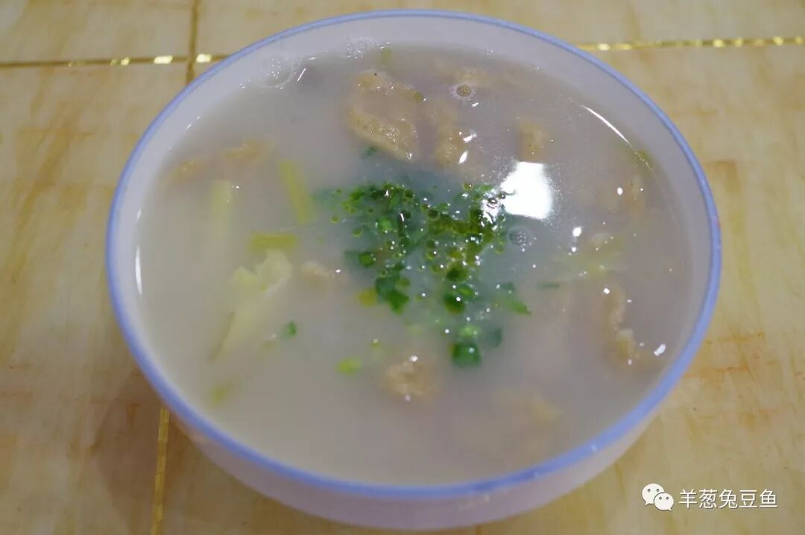
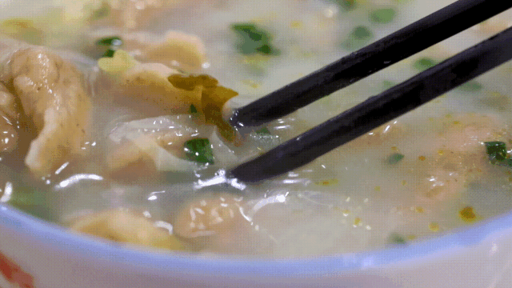
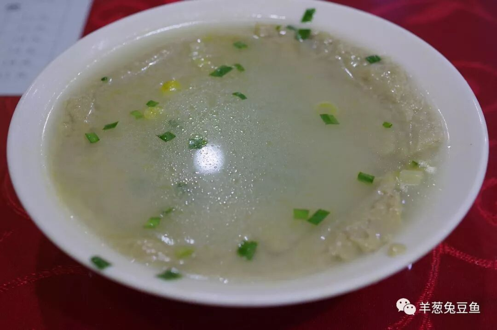
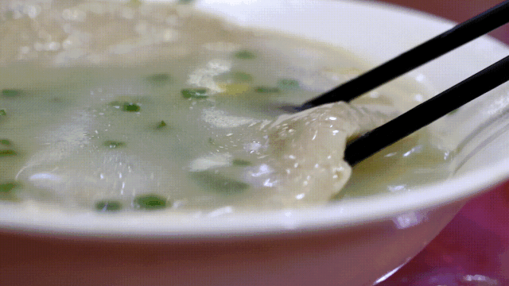
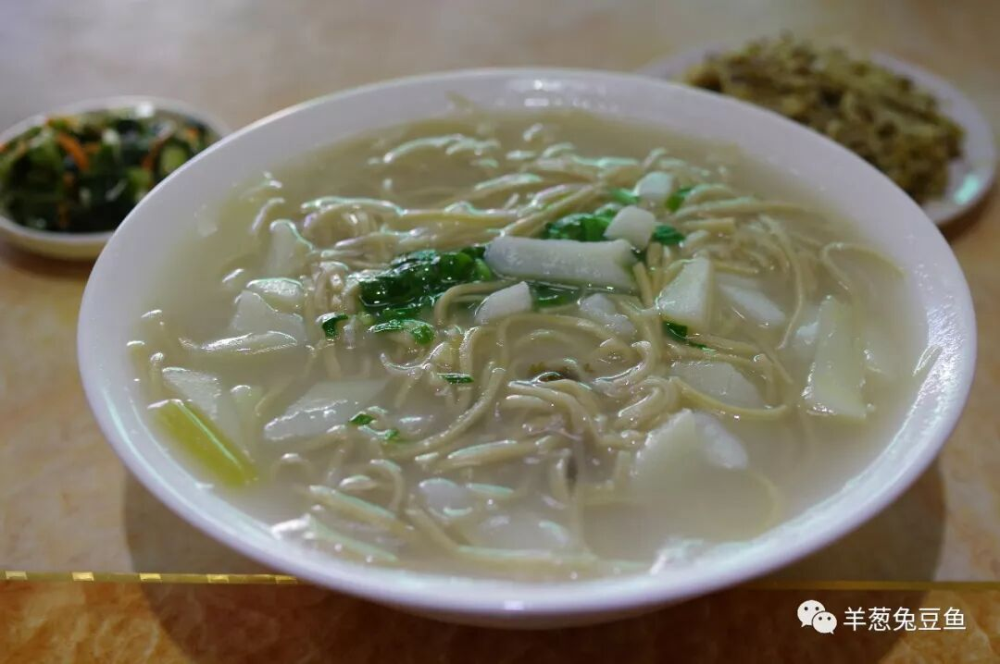
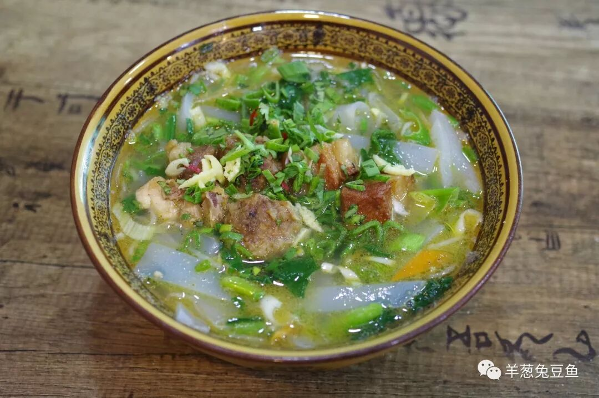
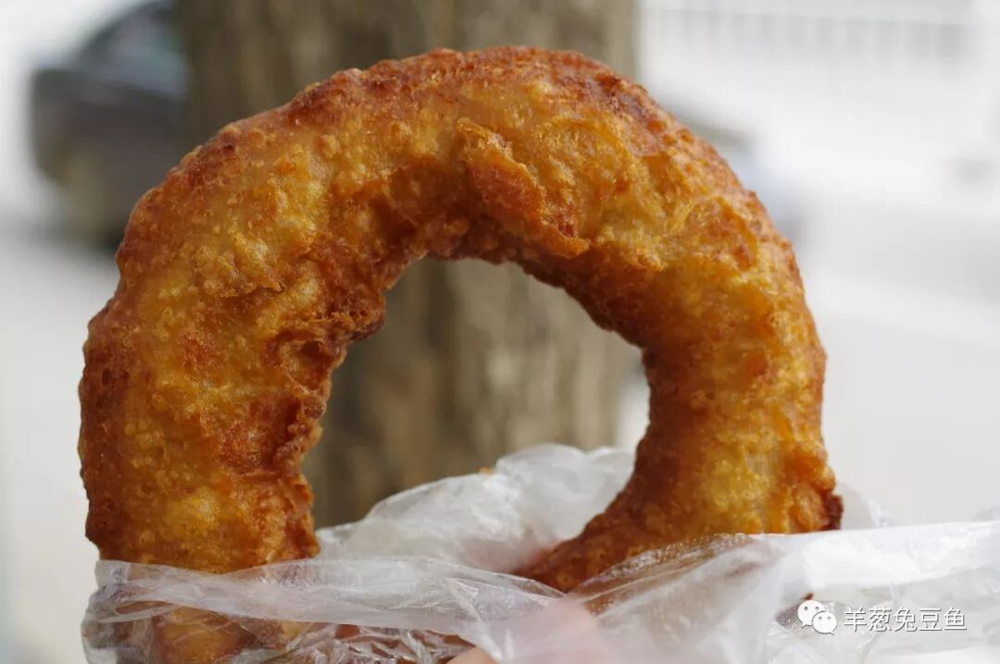
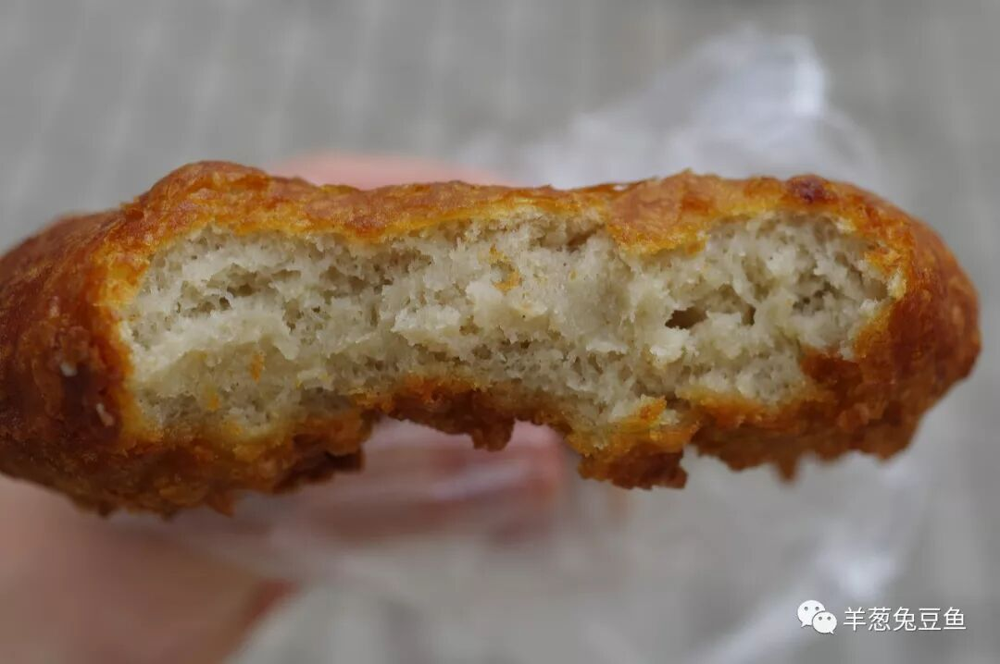
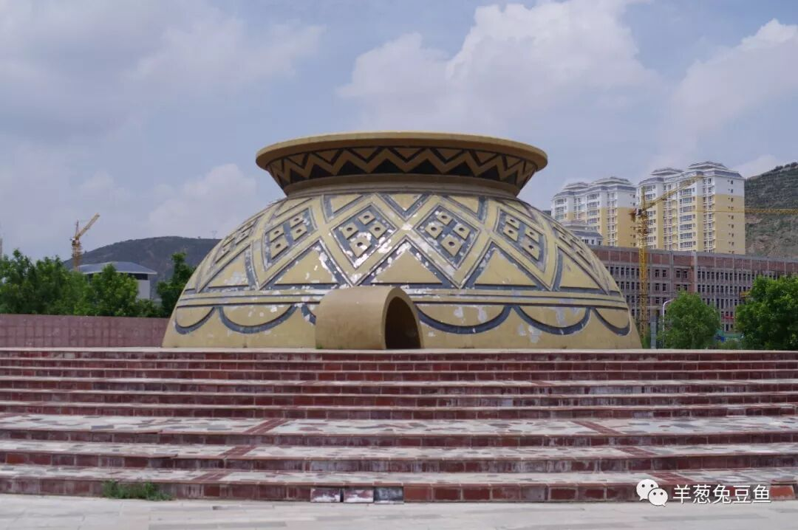

# 【第006天 定西】杂粮的N种变化

- 原文链接: https://mp.weixin.qq.com/s?__biz=MzA3MTM2Mjk3NA==&mid=2247503853&idx=1&sn=9dfb4dad8d08f9aefbb73fba802fdcf3&chksm=9f2c3f1ca85bb60a559e00b94111927b3d79bdd11e1ff0184f7c65a3ad3de63ebe1fcb4d7a05&scene=21
- 作者: 宇哥食行记
- 发布时间: 未知
- 图片数量: 10

沟壑俞深，土坡俞黄，这里是陇中定西。

上有兰州，下有天水，定西就处在这么一个相对尴尬的位置，游人或有意或无意地与之错过，鲜有人问津，大概它在外最响的名头，也就是“中国马铃薯之乡”了。这次我将用三天时间为你呈现定西的部分饮食，今日在主城区安定，明天与后天将前往陇西县和岷县，让你看看这个低调的城市并不低落的饮食魅力。

安定区的饮食与渭源县及邻近的白银会宁县高度接近，以各种杂粮面食为主，这些杂粮面食有着略微奇特的名字，往往让初听着直冒黑人问号。不信？那就试试看。

（1）

懒疙瘩

懒疙瘩的名字其实十分生动地表明了其制作过程的简便、快捷，即“懒”。将杂面（通常是白面、荞面及豌豆面等）和成糊状后，用筷子往热水里拨成疙瘩状即成。无需复杂的调料，煮好后直接捞起放入面汤中再加入浆水，就是一碗微酸清爽、饱腹充饥的懒疙瘩。

杂面制作的疙瘩比起单纯的白面更多了几分香气，而且更加耐嚼。在口中细细咀嚼，原始的粮食香气充满口腔，确实是作为调剂饮食的上佳选择。不过，如果觉得味道过于寡淡，加上一勺油泼辣子也未尝不可。

（2）

搅团

搅团所使用的原料与懒疙瘩基本一致，但制作方法上相去甚远。搅团的制作是将水烧开，然后将杂粮面粉一点点倒入锅中黏糊，不停地搅拌，煮至黏糊状时就成了馓饭。继续熬煮，待面糊结成团状，就成了搅团。

与懒疙瘩一样，不需要复杂的调味，一些浆水既能成就一碗搅团。搅团的口感像是结块的芝麻糊，但是颗粒感会弱很多，不用费力咀嚼，用嘴一抿即在嘴中散开，其实从吃感上，比懒疙瘩“懒”多了。

（3）

雀舌面

雀舌面，形如雀舌，因此而得名，这样的名字就算不能激起食欲也至少能激起好奇。在其他地方也叫做碎面。定西的雀舌面仍是由杂粮面制作，面条细而短，煮熟的面较为软糯，就着浆水面汤往嘴里一大口一大口地送，十分过瘾。

除了懒疙瘩、搅团、雀舌面外，定西最常见的杂粮吃法还有馓饭、酸棒棒等，变化多端，将杂粮面做到了极致。

（4）

粉汤

如今要在安定找到一碗粉汤，已经不是件太容易的事了。寻了好多条街，才找到一家卖粉汤的店。粉汤上桌，一下子就被这苍翠欲滴的颜色和油香四溢的鸡汤给吸引了。

粉汤中的粉其实就是凉粉，滚烫的凉粉并没有丧失其韧劲和Q弹的口感，吃起来弹牙爽脆。浓香的鸡汤再配上凉粉、青菜、蒜苗，就是一碗荤素搭配适宜、口味丰富的主食。吃完浑身冒汗，精力充沛。

（5）

荞圈圈

据说荞圈圈是每一个通渭人对家乡最深厚的味觉念想，在定西城区，荞圈圈也十分容易寻得。这样一个貌不惊人、卖相平平的荞圈圈，怎么就获得了那么高的饮食地位呢？吃到嘴里，才能见分晓。

幸运地买到了一个刚出炉的荞圈圈，张大嘴咬下一口，先是表皮的滚烫酥脆，而这微微呈麦褐色的内里，竟是绵软化渣的口感，带着浓郁的荞面香气，清甜而不过分。不知不觉吃完了一个圈圈，竟想再转头回去买一个，可惜已经走出太远，只得作罢了。

这一天就这样在杂粮的左右拥抱中结束了。在安定区的街头也常能见到面皮、甜醅之类的食物，但那些都是明显的舶来品，并不能代表这个城市最根本的饮食文化。没太多灯红酒绿，没太多车水马龙，连最有特色的饮食也不过是拿着杂粮做各种物理的化学的变化，它就这么安居一隅、悄无声息。

但不管你爱与不爱，它一直在这里，定西永定。

想知道我在干啥，请点击：吃货的决心——555天中国饮食探索之行

想知道我要去哪，请点击：555天行程计划（2018-06-20更新）

这一天吃的杂粮抵过去一年的量

（长按识别二维码点击关注哦）

 var first_sceen__time = (+new Date()); if ("" == 1 && document.getElementById('js_content')) { document.getElementById('js_content').addEventListener("selectstart",function(e){ e.preventDefault(); }); }

 if ("0" == 1) { document.addEventListener("keydown",function(e){ if ((e.metaKey || e.ctrlKey) && (e.key === 'c' || e.key === 'C' || e.key === 'x' || e.key === 'X' || e.key === 'a' || e.key === 'A')) { if (e.target.tagName === 'INPUT' || e.target.tagName === 'TEXTAREA') { return; } e.preventDefault(); } }); document.addEventListener("copy",function(e){ var sel = window.getSelection(); var content = document.getElementById('js_content'); if (sel && sel.rangeCount > 0 && content && content.contains(sel.getRangeAt(0).commonAncestorContainer)) { e.preventDefault(); } }); }

预览时标签不可点

微信扫一扫

关注该公众号

知道了 (javascript:;)
