# 【第007天 定西·陇西】腊肉与烧鸡粉的色与香

- 原文链接: https://mp.weixin.qq.com/s?__biz=MzA3MTM2Mjk3NA==&mid=2247503852&idx=1&sn=34dd122e7c77b18e4fd8931b805f7c54&chksm=9f2c3f1da85bb60bb1c3f6620fd9cabb85fb23f9bbe8209d21a88619362353f3f75f7aecc582&scene=21
- 作者: 宇哥食行记
- 发布时间: 未知
- 图片数量: 13

陇西，是一个已经知道很久的地方。六年前第一次来甘肃，在天水开往兰州的火车上，乘务员突然嘶吼一般地叫道：“陇西到了！陇西！”。当年的我惊讶于这到底是个什么站，值得乘务员如此声嘶力竭。而今天，我终于到达。

李氏故里也好，西部药都也罢，它确实顶着大大小小的名号，矗立在县城中心的威远楼，也在静静诉说着它的过去。而就连公交车的线路数量，都超过定西市区安定，你说，它能是个配角儿吗？

在饮食上，陇西也是个独具地方特色的城市，以至于周边县市常有驱车而至就为了品尝这一口陇西味道的人。同样作为一个造访者，今天的陇西在我的舌尖留下了什么呢？

（1）

腊肉

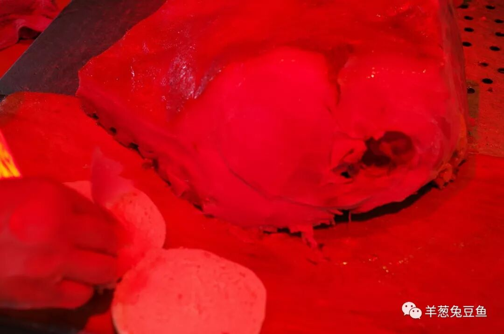

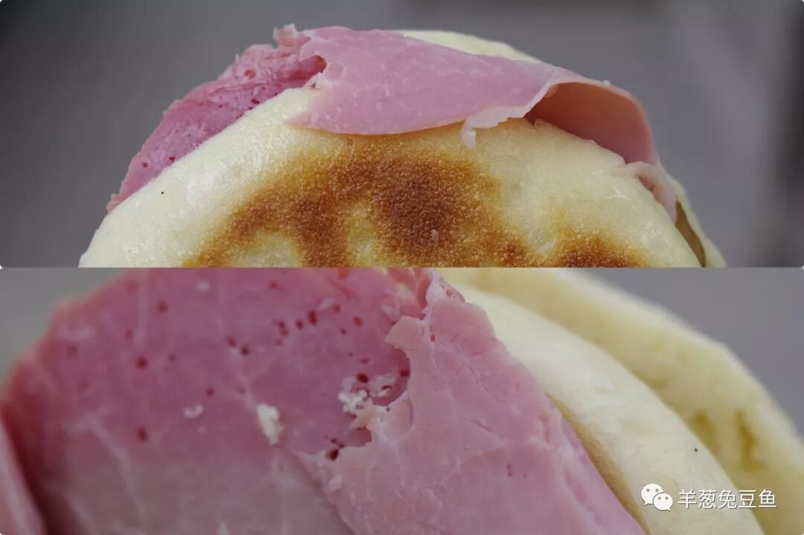

在甘肃，陇西腊肉的名声大概无人不知无人不晓。今日走进小吃市场，远远地就嗅到了腊肉香，忙冲上前去。只见各卖家都将腊肉置于魅惑的深红色灯光之下，仿佛是种脱去衣裳而又略带羞怯的勾引。

对于一个人的食客，只买肉显然是不经济又齁嗓子的，所以更受欢迎的往往是“腊肉夹馍”。只见手起刀落，片片腊肉滑下，一层层铺在对半开的馍中。将其拿到天日之下，终于得见这腊肉的真面目。退去深红色的遮掩，粉红而略带紫色的肉令人口水直流。咬下一丝肉细细咀嚼，腌渍肉特有的香伴着复杂香料的香满溢口腔，瘦肉不柴，肥膘不腻，比起川式腊肉咸味较轻，更加适口。确实是，一块好腊肉！

除了腊猪肉外，腊羊肉、腊驴肉等衍生品也可在陇西寻得，但相对而言就不那么普遍了。

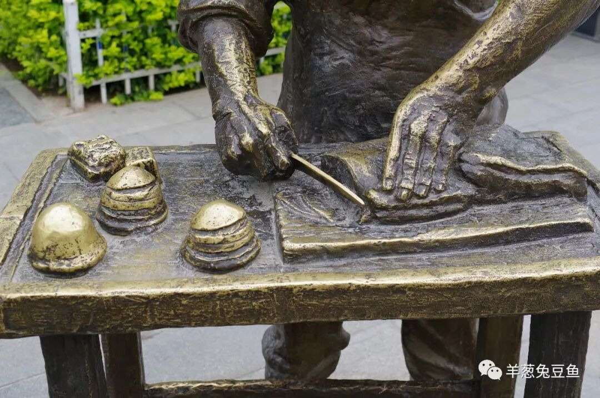

（连街上的雕塑都是切腊肉）

（2）

烧鸡粉

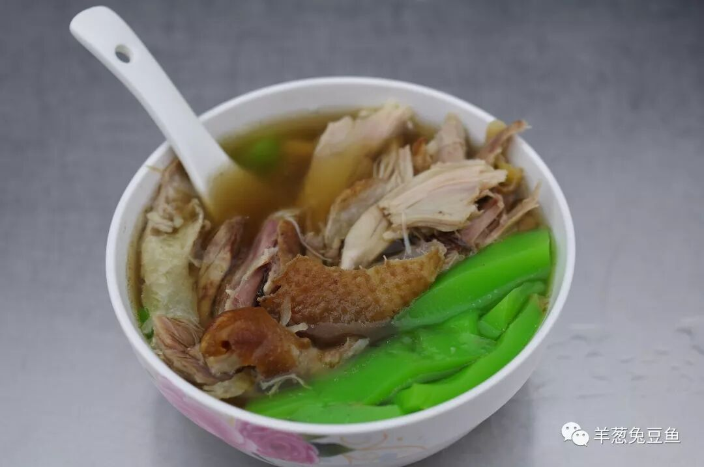

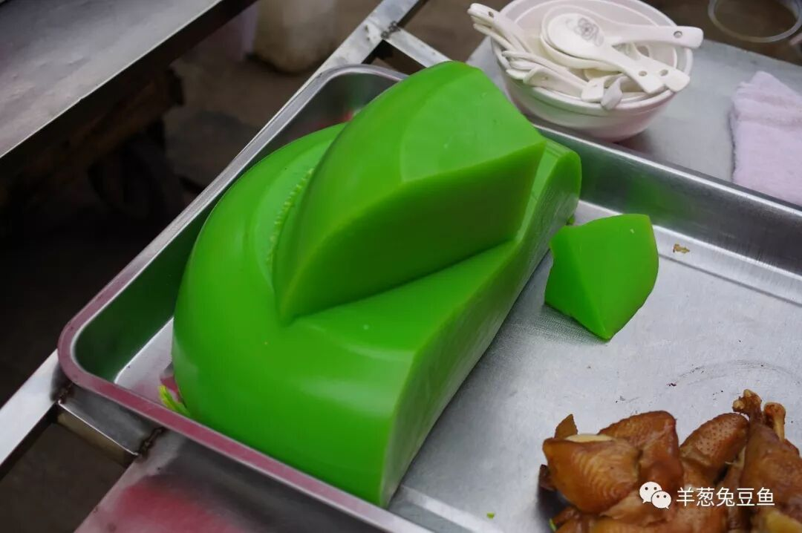

又是一次色与香的双重诱惑。所谓烧鸡粉，可以理解为烧鸡加粉。烧鸡并无特殊，奇就奇在这透亮的绿粉上，而绿色的来源其实并不复杂，只是在制作过程中加入了菠菜汁。

这样一碗褐绿搭配的烧鸡粉，鸡汤咸鲜，鸡肉入味，粉爽滑Q弹并带着特殊的清香，嘴未消停碗已空空。话说回来，作为一个肉食爱好者，你真的能拒绝这碗一半是肉一半是粉的类主食小吃吗？

（3）

大肉面

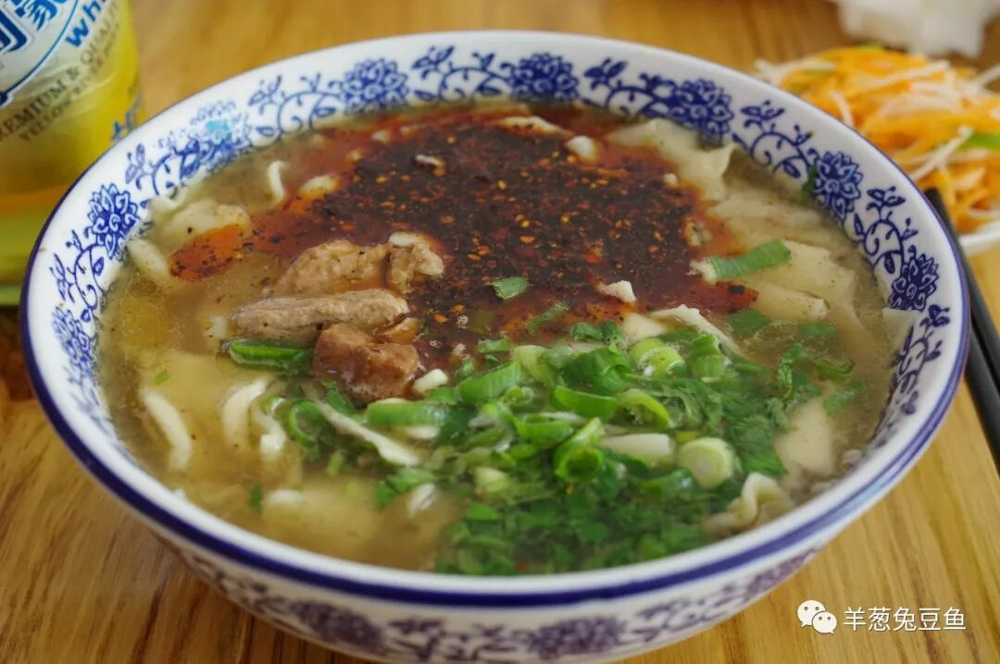

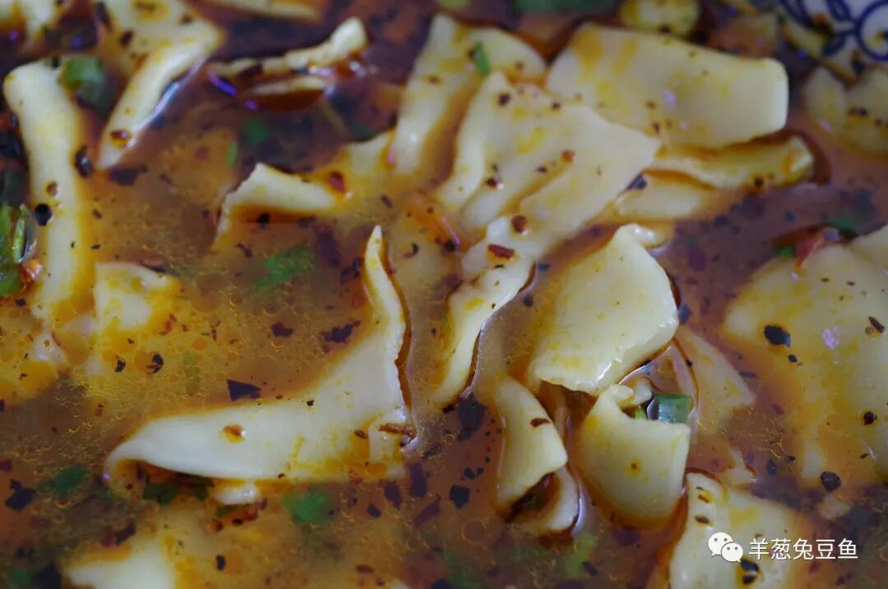

牛肉面之于兰州人，或许大肉面之于陇西人。大肉即猪肉，卤肉做的臊子十分入味，卤汤鲜香味十足，再配上油泼辣子与蒜苗，一切配料准备妥当。大肉面的另一大标志，是用手一块一块揪成的面片。与面条相比，面片更加绵软，口感更加丰盈，直接用筷子带着汤汁往嘴里一块接一块地送，别提有多畅快。

（4）

热凉面（担担面）

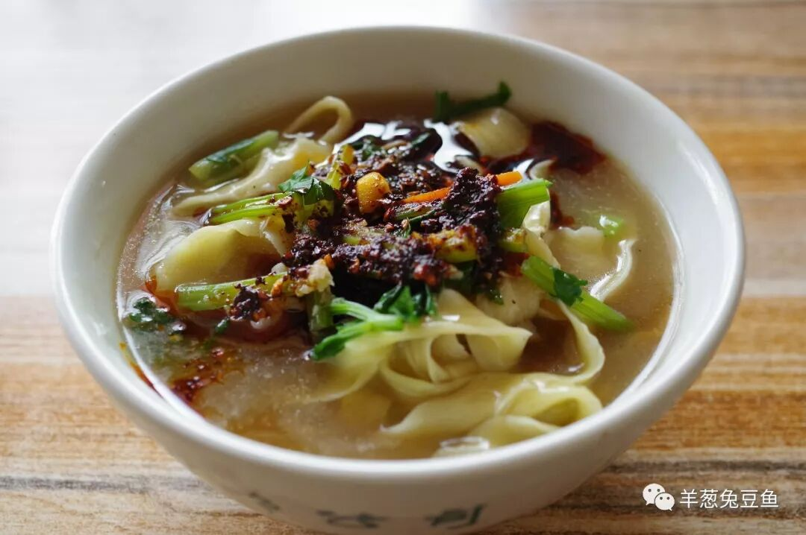

热凉面也叫担担面，是独具陇西风味的又一种面条。其实热凉面的名字能更直观地表明其制作过程，因为这种面条是提前将一指宽的面条煮熟晾干放凉堆放起来，需要食用时将面条抓入碗中，浇上热汤汁把面瞬间淘热即可。

热凉面所使用的汤汁是较为粘稠的糊汤，汤汁的鲜美能够很好地与面条捆绑起来。由于面条只是用热汤汁瞬间回温，吃起来虽热却并不烫口，可以放肆地大口吮吸。

（5）

荞粉

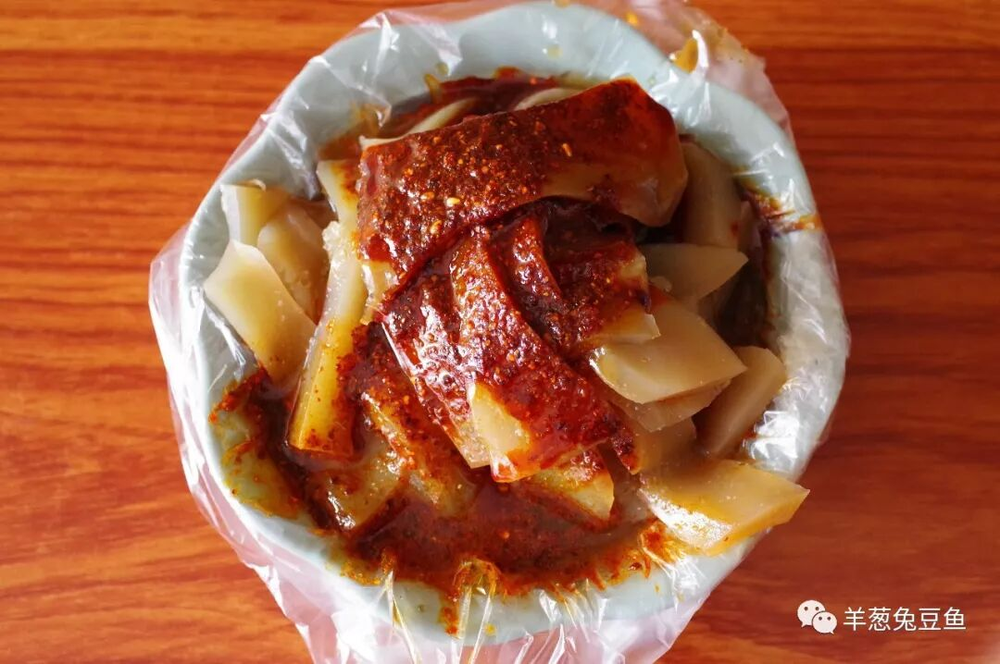

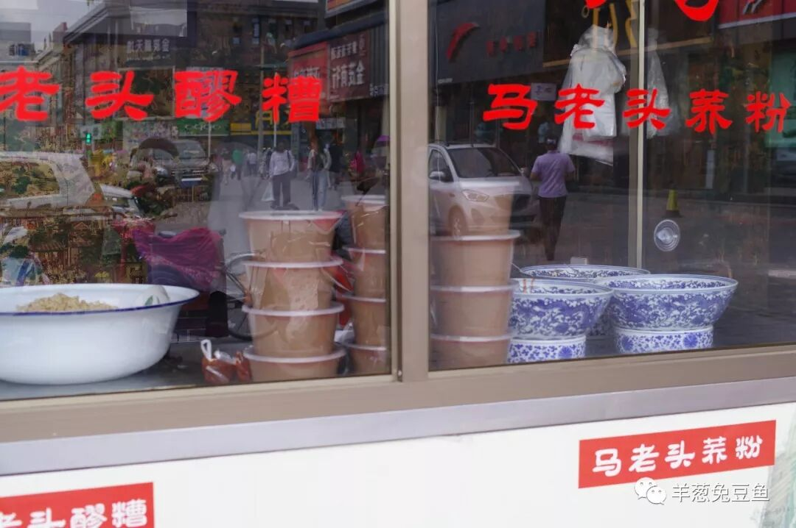

尽管如今荞粉已可以轻易地在甘肃其他地区寻得，但总是或多或少地打着“陇西荞粉”的旗号，由此可见其地位。

荞粉即荞麦凉粉，食用方法与一般凉粉差异不大，调入卤汁、辣子、蒜泥和醋等调料即可。荞麦凉粉比起其他淀粉制作的凉粉，口感上会更加韧而弹，并带有荞麦面特有的麦香，是凉粉中的上品。

（6）

醪糟

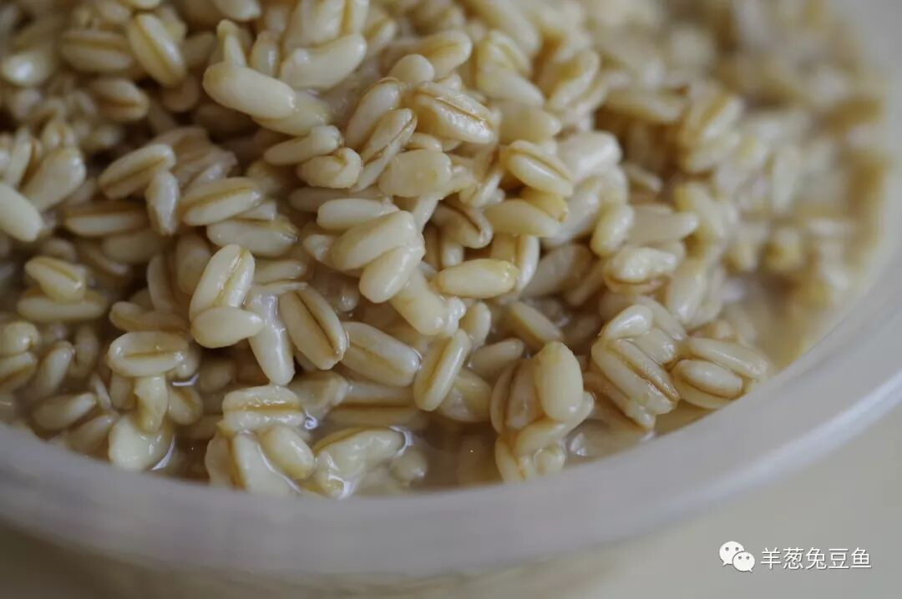

陇西的醪糟即甜醅，但本地人通常还是称醪糟。陇醪糟比起一般的甜醅会发酵得更加过度，带有更多的汁水、更浓郁的甜味和酒糟味，但脆韧感较干甜醅会弱很多，是一种居于干甜醅和我们熟知的醪糟中间的存在。两种甜醅风格各异，各有其追捧者，无关孰优孰劣。

周边县市也常见挂着“陇西醪糟”名头的醪糟小摊，其影响度也可见一斑了。

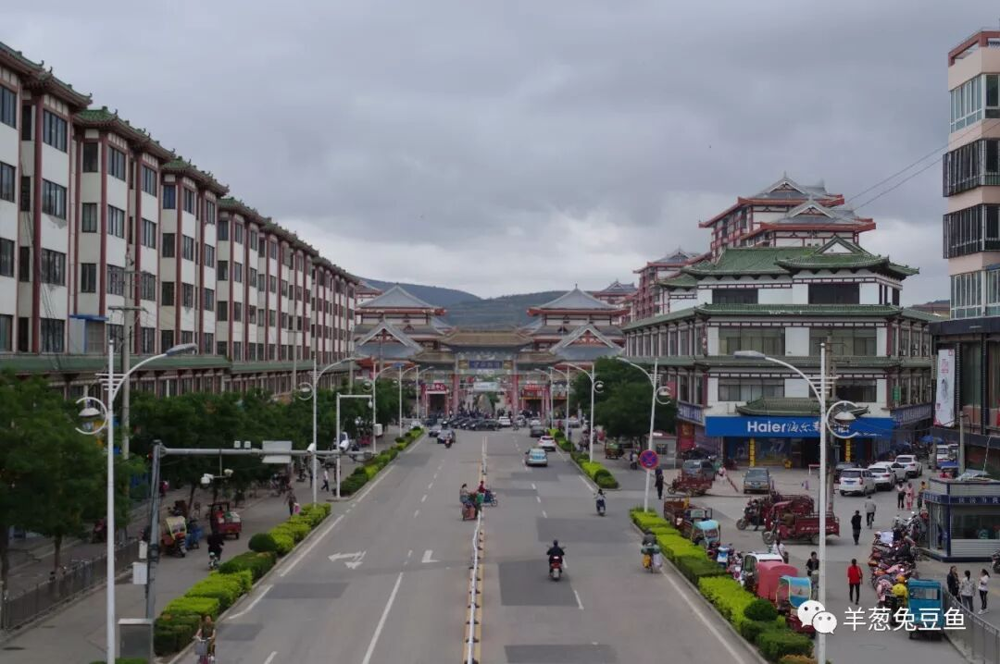

曾经的陇西，是宝兰铁路上重要的大站，也是曾经在这条铁路上，陇西的名字被一位乘务员深深地种在了我心里。现在宝兰高铁、兰渝铁路都已经开通运行，它们均绕过了陇西，对于一般的游人而言，又少了一个可以来此驻足停留一番的理由。

但我还是希望，你也可以听到那一声“陇西到了！”的强烈呼喊，你也可以走在这小吃街里、这市场中，被一块块香气逼人的腊肉吸引了去，然后吃着一碗烧鸡粉，不时回头看看，是否有人在觊觎你这碗中满满的肉。

再会陇西。

想知道我在干啥，请点击：吃货的决心——555天中国饮食探索之行

想知道我要去哪，请点击：555天行程计划（2018-06-20更新）

刚离开烧鸡粉，就已开始想念。

（长按识别二维码点击关注哦）

 var first_sceen__time = (+new Date()); if ("" == 1 && document.getElementById('js_content')) { document.getElementById('js_content').addEventListener("selectstart",function(e){ e.preventDefault(); }); }

 if ("0" == 1) { document.addEventListener("keydown",function(e){ if ((e.metaKey || e.ctrlKey) && (e.key === 'c' || e.key === 'C' || e.key === 'x' || e.key === 'X' || e.key === 'a' || e.key === 'A')) { if (e.target.tagName === 'INPUT' || e.target.tagName === 'TEXTAREA') { return; } e.preventDefault(); } }); document.addEventListener("copy",function(e){ var sel = window.getSelection(); var content = document.getElementById('js_content'); if (sel && sel.rangeCount > 0 && content && content.contains(sel.getRangeAt(0).commonAncestorContainer)) { e.preventDefault(); } }); }

预览时标签不可点

微信扫一扫

关注该公众号

知道了 (javascript:;)
