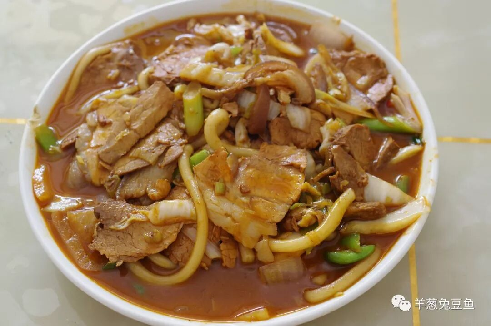
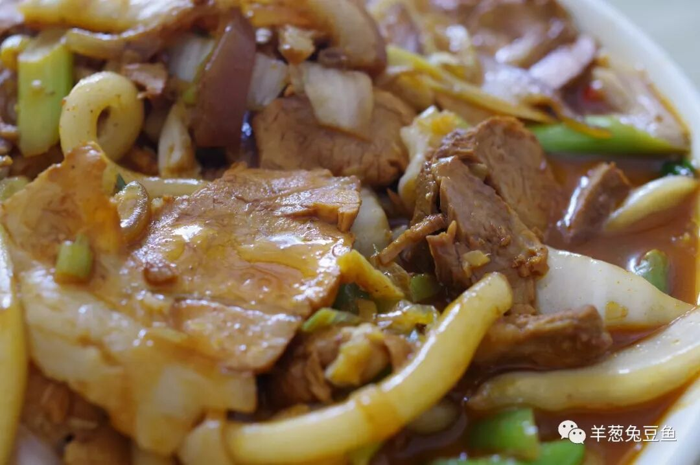
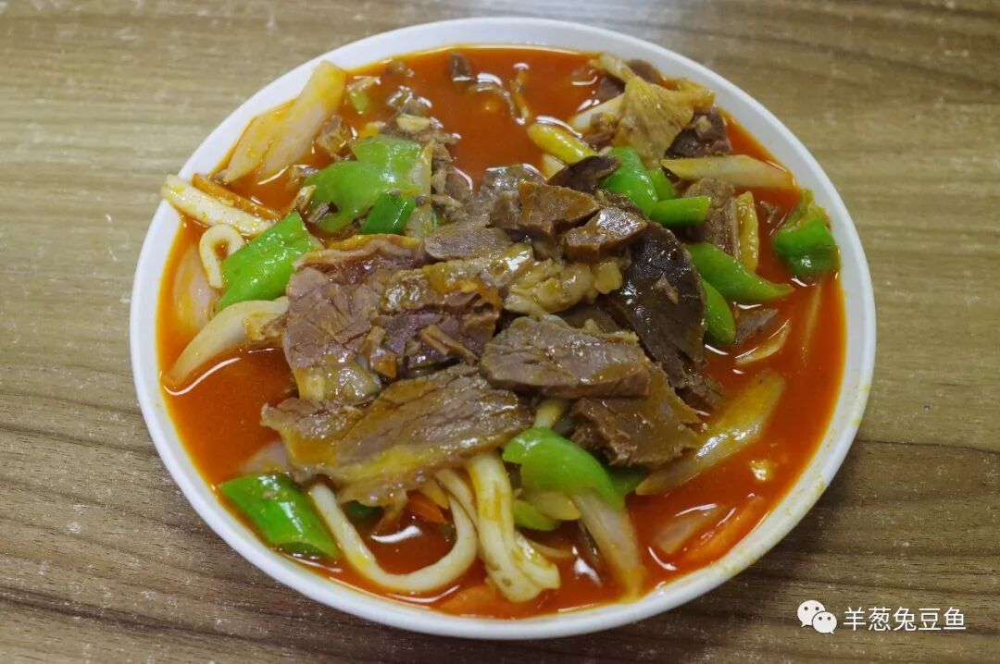
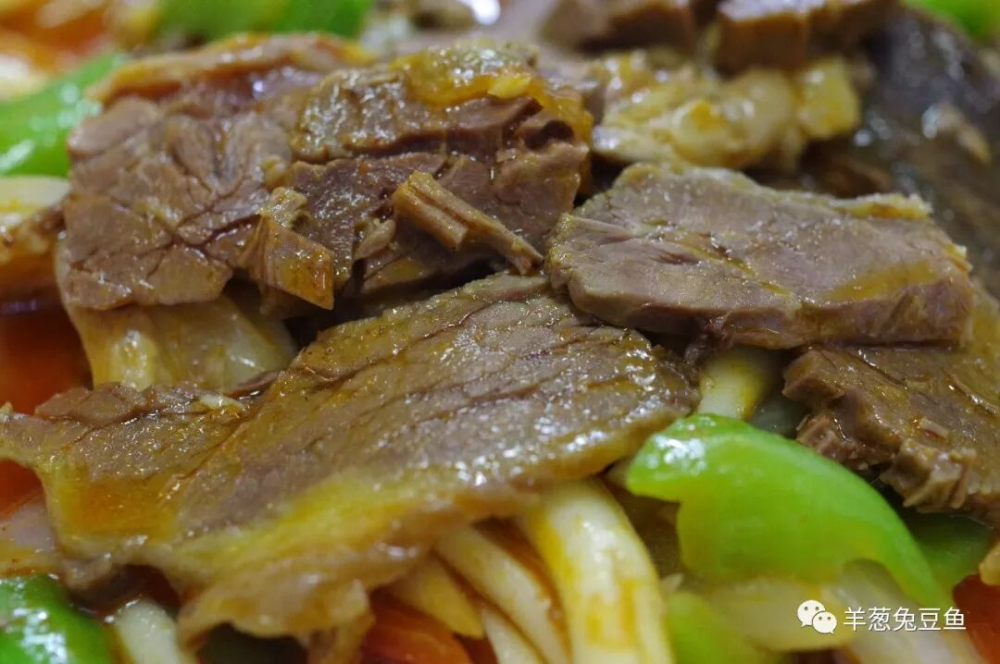
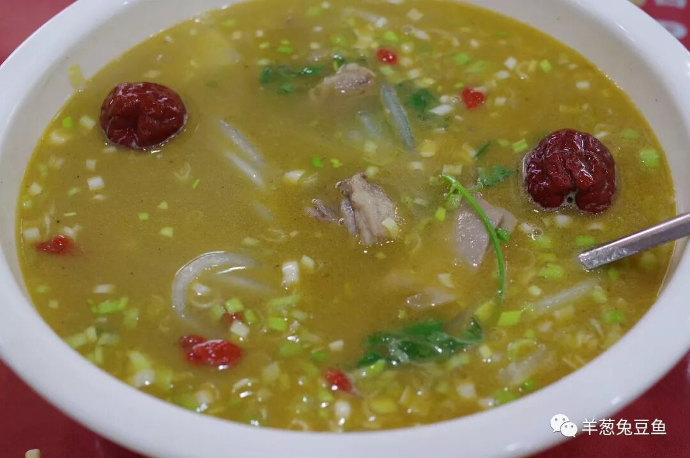
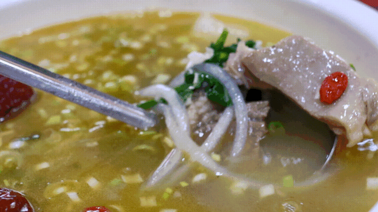
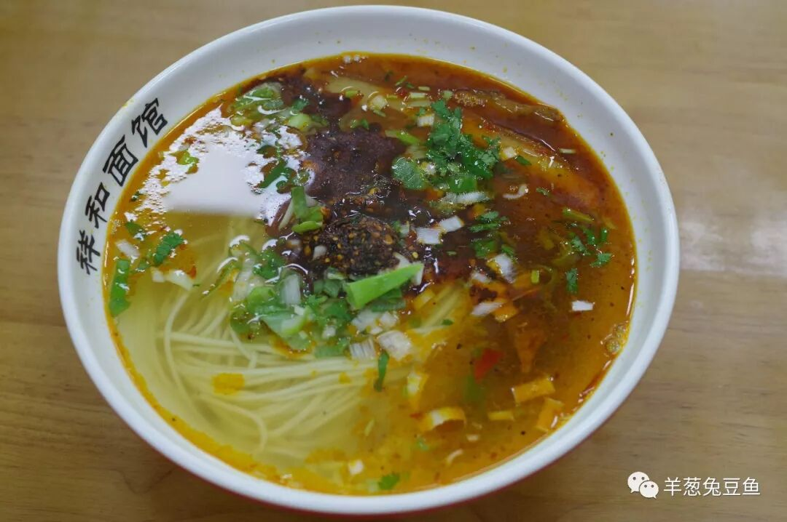
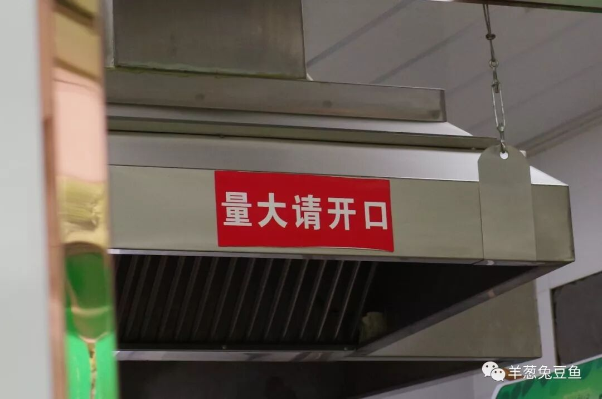
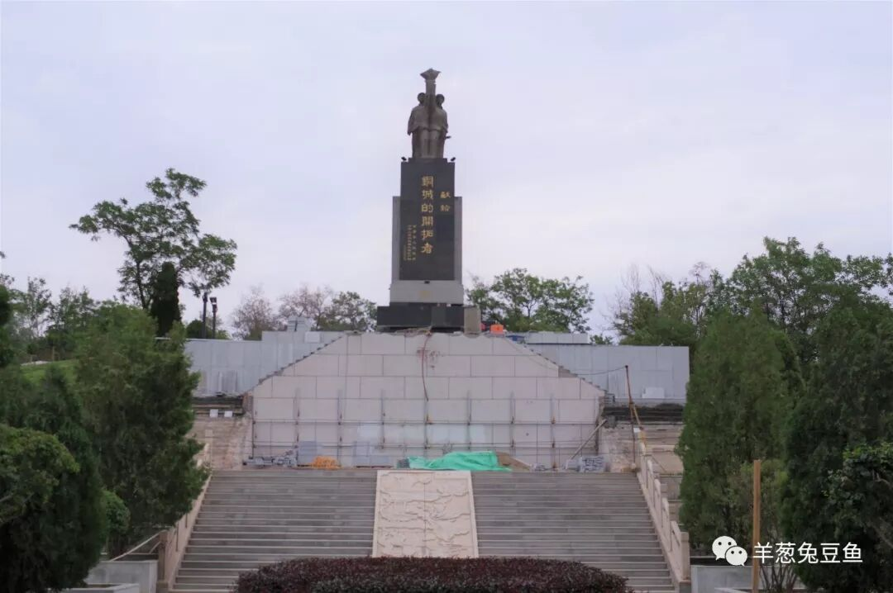

# 【第009天 白银】肉肉肉肉

- 原文链接: https://mp.weixin.qq.com/s?__biz=MzA3MTM2Mjk3NA==&mid=2247503850&idx=1&sn=9e537f96870be8453c578bae99f6ab02&chksm=9f2c3f1ba85bb60d93a67d3faeef21860de8698da9123b6b043d530bdf9c5eddd660650e4613&scene=21
- 作者: 宇哥食行记
- 发布时间: 未知
- 图片数量: 10

白银又叫铜城，是一座典型的资源城市，位于“面朝黄土背朝天”的沟壑包围之中，与景色迤逦沾不上半点儿边。基本上纯资源城市和建国后兴起的移民城市都不会在我这次555天的行程范围中，白银算是例外之一。

尽管它的饮食文化完全算不上丰富，但一只手就数得过来的这些地方饮食，可以很轻易的打破一个肉食动物的心理防线，哪怕没有其他事由也愿意只身前往，吃得个拍腹而归。今天的食物在数量上只有4个，但个个过硬，请一定要有心理准备。

那就开始吧。

（1）

酸烂肉

酸烂肉或许可以算是白银的市菜了，走在任何一条市区的街上，凡看得到的家常菜馆，基本能出品这道菜，算得上是来白银的必点菜。

西北的菜从不讲究卖相，连取名也很随意，酸烂酸烂，似乎听起来就不大靠谱，只有吃在嘴里才知其至味几何。大肉、酸菜、洋葱、蒜苗、洋芋粉，原料十分丰富。大肉肥而不腻，酸辣可口，芡汁浓稠，完全就是白银的下饭神器。

（2）

东湾驴肉

东湾驴肉并非菜名，而是泛指白银市东湾镇出产的驴肉品种，在白银市区可轻易寻得烹饪东湾驴肉的馆子。

驴肉素有“天上龙肉，地下驴肉”的美誉，有无过誉暂且不论，但确实表明了其精贵与营养丰富。驴肉的口感与牛肉较为接近，但是肉的绵度明显低于牛肉，因此不需费力咀嚼肉即可以散开，同时还保留了极好的韧劲。驴肉本身带有较重的“骚味”，因此更适合调味重些的烹饪方式，此次尝试了红烧的做法，味重但不过，满口咸香。若是再配上一瓶汉斯小木屋或大窑嘉宾（非白银本土饮品，但在白银的餐厅中常见），光盘不过分分钟。

（3）

靖远羊羔肉

若是在甘肃提羊羔肉，第一个被想起的大概就是靖远羊羔肉了。靖远是白银下属的一个县，与宁夏毗邻，盛产羊肉。在白银市区也能找到地道的靖远羊羔肉餐厅。

羊羔肉既可清蒸也可爆炒，此次为了品尝羊羔肉的原始鲜味，我选择了较为清淡的清炖做法。鲜香微甜的汤汁十分顺滑，羊羔肉块炖得软烂，细细咀嚼也未察觉明显的膻味。无需额外的蘸料就这么大口吃肉，是对原料质量无声的赞扬。

（4）

鸡汤大肉面

在白银，鸡汤大肉面是能与牛肉面分庭抗礼的存在，也是白银人在味觉习惯上有别于兰州人的重要标志。

鸡汤大肉面鸡汤咸鲜，辣子油香，面条软糯而不散，卤肉臊子穿梭其间，再配上一块肥瘦相间的把子肉，美哉美哉！什么？一块不够？那就再来一块。

（要不是此次我不是为了吃饱而来，我真的会...）

白银的街道冷冷清清，道路虽宽敞却家家店铺门庭紧闭，这仿佛是资源型城市的通病。但它仿佛也从没要去争什么，只是按着自己的城市定位，清清白白地存在着。

游客大概不会有的，只有生活在这里的市民一天天平静地活着。可是作为肉食动物的你，真的能错过吗？毕竟，从兰州出发，到这里只要一个小时多一些啊。

我只知道，我今天大约吃了两斤肉吧，嗝~

想知道我在做啥，请点击：吃货的决心——555天中国饮食探索之行

想知道我要去哪，请点击：555天行程计划（2018-06-20更新）

为肉食动物干杯！

（长按识别二维码点击关注哦）

 var first_sceen__time = (+new Date()); if ("" == 1 && document.getElementById('js_content')) { document.getElementById('js_content').addEventListener("selectstart",function(e){ e.preventDefault(); }); }

 if ("0" == 1) { document.addEventListener("keydown",function(e){ if ((e.metaKey || e.ctrlKey) && (e.key === 'c' || e.key === 'C' || e.key === 'x' || e.key === 'X' || e.key === 'a' || e.key === 'A')) { if (e.target.tagName === 'INPUT' || e.target.tagName === 'TEXTAREA') { return; } e.preventDefault(); } }); document.addEventListener("copy",function(e){ var sel = window.getSelection(); var content = document.getElementById('js_content'); if (sel && sel.rangeCount > 0 && content && content.contains(sel.getRangeAt(0).commonAncestorContainer)) { e.preventDefault(); } }); }

预览时标签不可点

微信扫一扫

关注该公众号

知道了 (javascript:;)
