# 【第010天 临夏】弥漫在空气里的河州清真味

- 原文链接: https://mp.weixin.qq.com/s?__biz=MzA3MTM2Mjk3NA==&mid=2247503849&idx=1&sn=52d2ff728d67c94ae44b421be573e89a&chksm=9f2c3f18a85bb60e0fd90223f1b76847da3763d7f1472b73d6051fd8adbe66371b52014c4f77&scene=21
- 作者: 宇哥食行记
- 发布时间: 未知
- 图片数量: 17

这里是甘肃临夏，不是宁夏。临夏旧称河州，是丝绸之路上的重要节点城市，自古就是兵家重地、繁盛商埠。今天的临夏已然丧失了过往的辉煌，以至于就算甘南已经成为了游人来到甘肃除河西走廊线之外的又一频繁选择之时，临夏依旧是常被冷落一旁。

今天的临夏，画风是这般：

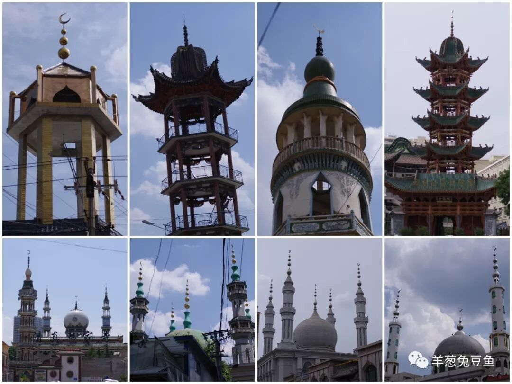

走在临夏的街头，常会有置身异域的错觉，但擦身而过的人说着明显的甘肃方言，一瞬间又把人拉了回来。

不论我们来自何方，在成长的过程中都或多或少接触过清真饮食或受过其强烈影响，北方地区尤甚。清真饮食在具有高度统一性的基础之上，也发展出了独具地域特色的饮食，临夏便是其中一个代表。事实证明，临夏，是一个不把你吃趴下绝不放你离开的地方。不入河州，焉得河食？

（1）

东乡手抓

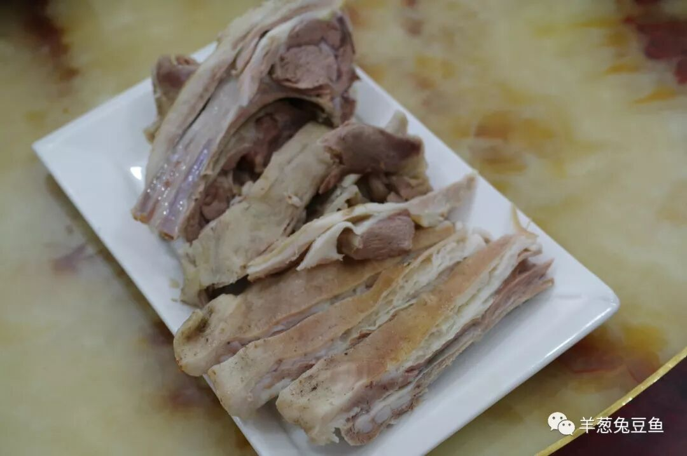

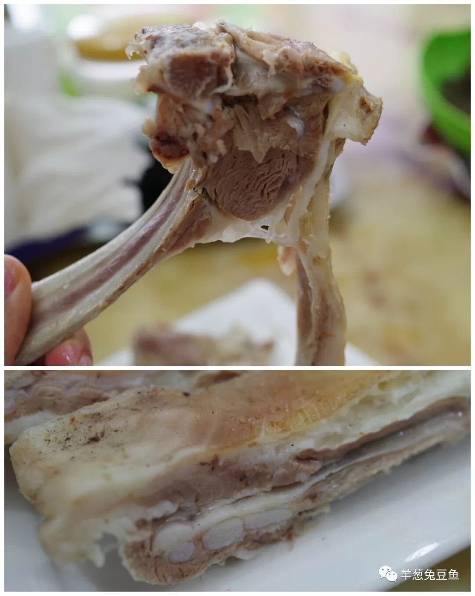

最硬的食物，理所应当放在第一个。

如果你问甘肃最有名的手抓是什么？答案多半是东乡手抓。东乡手抓在哪里吃？答案则是临夏。这里打着“手抓”名号的餐馆鳞次栉比，对于肉食动物而言，根本无需四处寻觅，那诱人的手抓将在下一个街角与你偶遇。

上好的羊肉根本犯不着复杂的烹饪，清水煮熟后撒点盐即是肉中至味。放凉的羊肉羊皮脆韧、油脂爽滑、瘦肉劲道而不柴，羊的鲜味在口腔内肆意流窜。也无需餐具，就这么用手抓起来一口口撕咬，再将粘连着骨头的筋肉剥离下来，那感觉就如同接吻一般美妙。

再配上一碗盖碗茶，一口茶，一口羊肉，清甜与鲜美就这么畅快地轮换着。

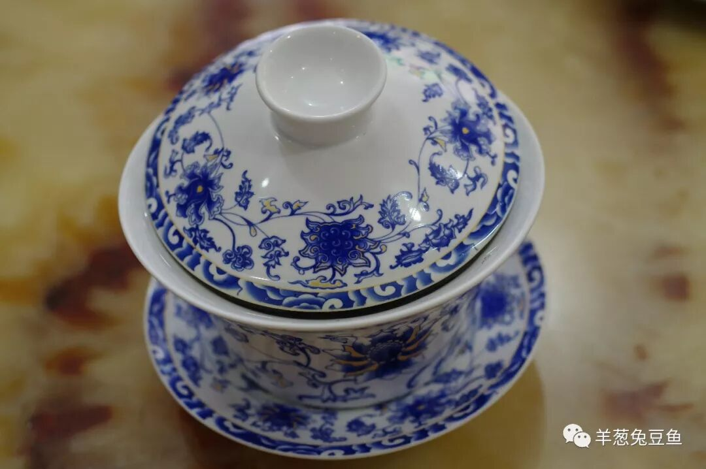

（2）

发子面肠

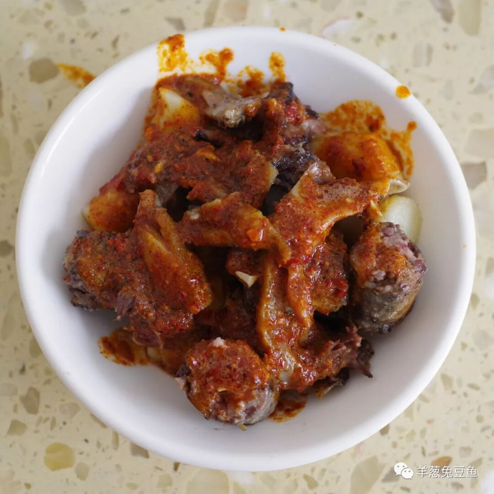

发子面肠是只能在临夏吃到的食物。发子面肠其实是两种食物的组合，即发子加面肠。所谓发子，是在羊肠中灌入剁碎的肉、心、肝、肺等，已调入各类调味料和香料；而面肠则是在肠衣中灌入面粉加水搅拌成的面糊。

食用时将发子与面肠切成段在锅中煎熟，然后调入羊油辣子、蒜泥和醋。发子的口感十分复杂，由于肉与各种内脏具有不同的质地，吃起来各种颗粒在口中跳跃，宛如一首羊杂的交响曲。而面肠拥有酥脆的表皮与绵软的内里，嚼劲十足、口齿生香。一碗发子面肠油气十足，味重而不腻，无论是作为主食或打牙祭小食都是上好的选择。

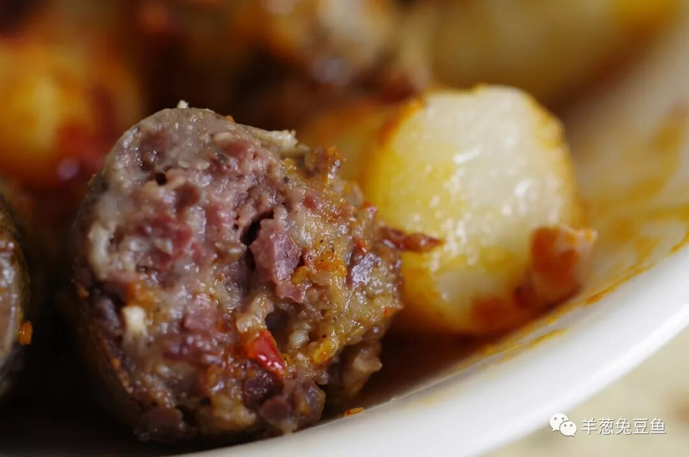

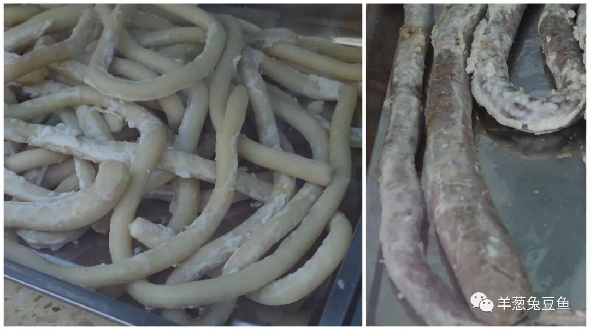

（生的发子和面肠）

（3）

河州包子

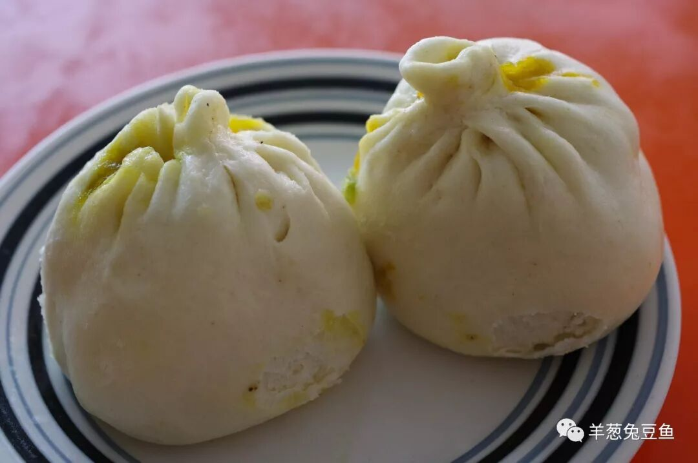

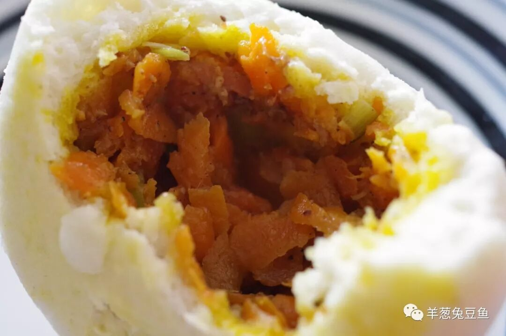

河州包子是临夏的著名早点。比起素面朝天的包子，河州包子但是从外形上就已经先俘获了人心，看那从顶部渗出的黄黄油脂，又怎忍得住不咬上一口呢？饱满的胡萝卜馅儿，淡淡的洋葱味，依稀散落其中的羊肉粒，看似油气吃起来却只觉口齿生津大呼过瘾。再配上一杯热茶，那就只叫个肠胃饱足而神清气爽。

（4）

粘糕

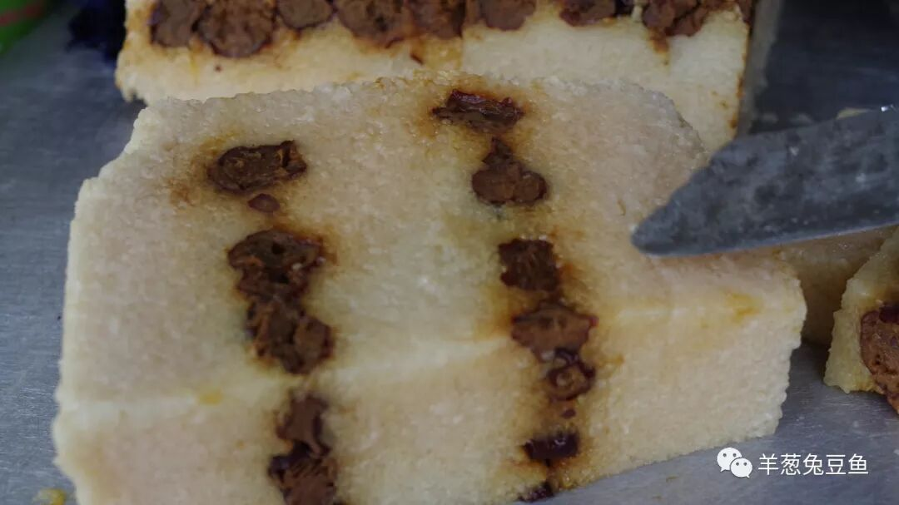

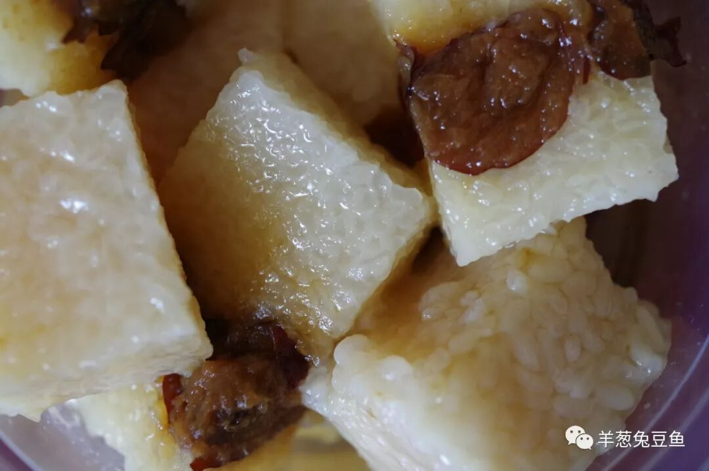

粘糕是临夏常见的清真甜品，常于蜂蜜粽子、甜麦子等一同售卖。粘糕用糯米和酸枣制作而成，吃时淋上厚厚一层蜂蜜，糯米的软糯、蜂蜜的香甜再带上一些轻轻的酸味，在暑气逼人的夏日吃上一碗身心舒畅。

（5）

甜麦子

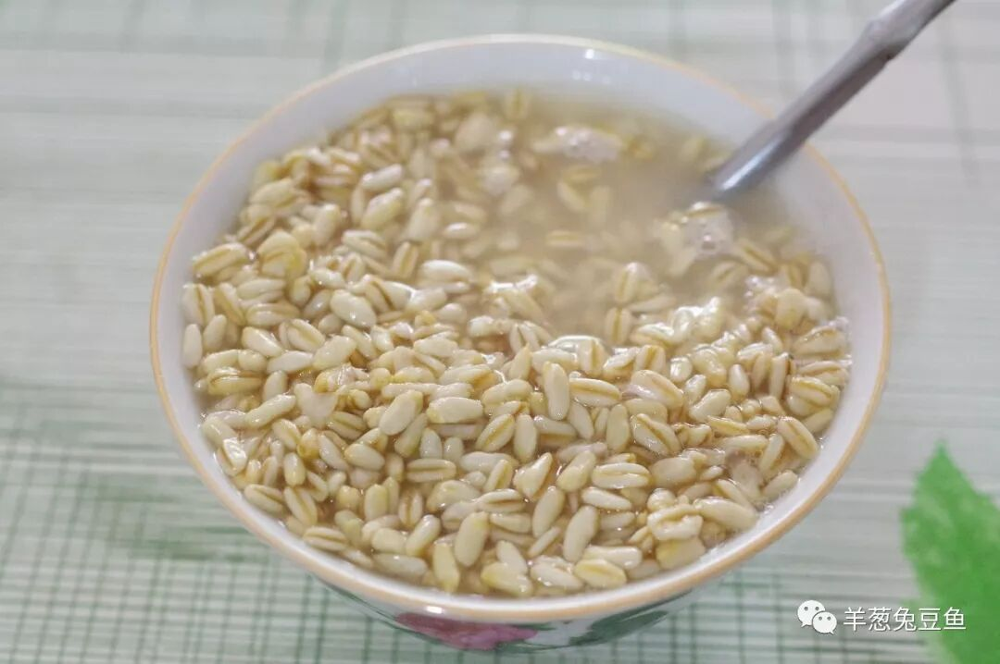

临夏的甜醅称甜麦子，也是十分常见的甜品。比起甘肃其他地区的甜醅，临夏的甜醅在口味上酒糟味很轻，只有明显的酸甜味，不知是否与穆斯林不饮酒的习俗有那么些关系呢？大汗淋漓之时，大口解决一碗甜麦子，就可仰天而叹，生活真美好啦！

（6）

清真面点

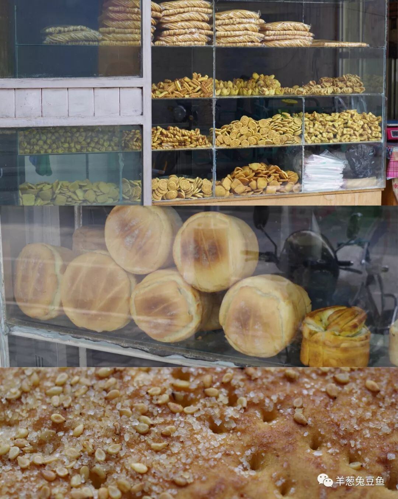

在临夏，各类清真面点以更加密集的姿态出现，而实际上，常能在甘肃其他地区看见以“临夏馍馍”之类的名称作招牌的店，可见其在甘肃的地位。

清真面点对原料和制作工艺一直有着极高的要求，虽没有复杂的味道，却满是纯粹与简单。若是你对回族的面点锅盔、馍馍、焜锅、糖酥饼、馓子、油香、馃馃等充满兴趣，那临夏一定是你不可错过的地方。

（7）

辣条

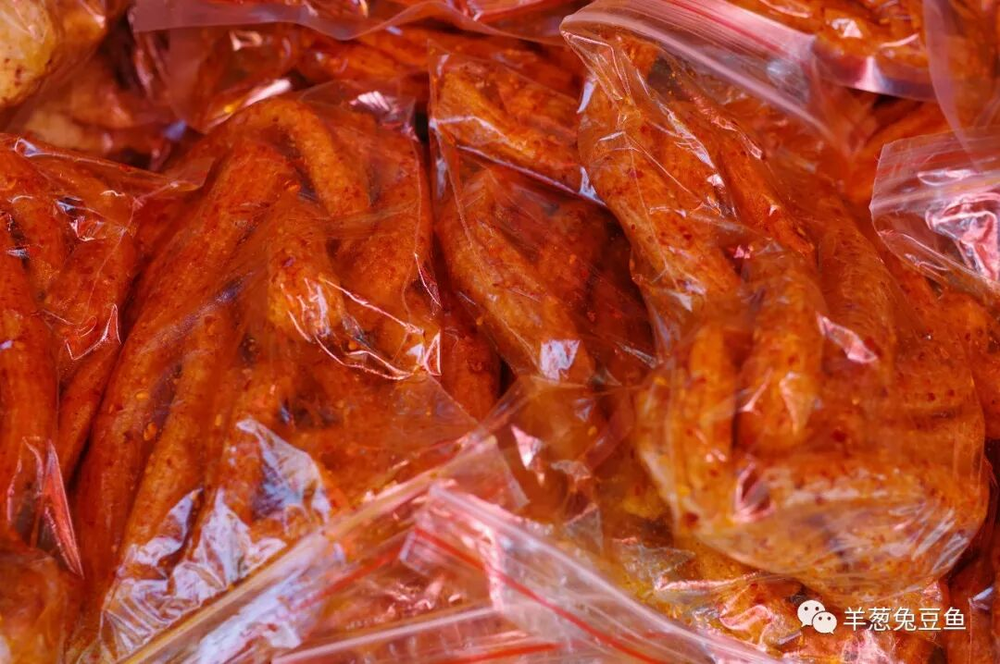

请相信你的眼睛，是辣条。我不知道某牌的辣条是多少人嘴馋之际或夜晚饥饿之际的一种慰藉，在临夏，你会有另外一种选择——清真辣条。

辣条的制作就在你的眼皮底下进行，你根本不用担心你手上的这包辣条是否经过了某些小黑屋、是否加入了某些不知名的成分，至少从心理上，你能吃个更加安心。而临夏的辣条，拉可成丝，香辣咸味亦不输某牌半分，有过之而无不及。

售卖辣条的商家往往也制作炸土豆片，即清真薯片，那也是留给薯片爱好者的狂欢。

（在认真考虑要不要做辣条的代购事业呢哼）

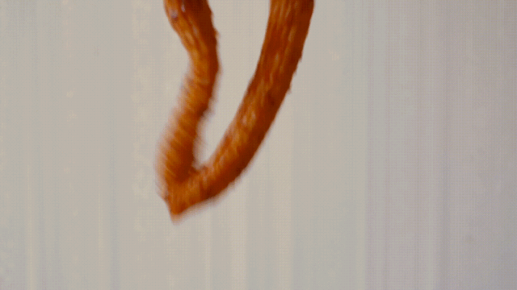

（来一段辣条之舞！）

（8）

牛杂割

有些事实，确实只有亲身来到某个地方后才会发现。就比如我下午两点钟走进一家卖牛杂割的店，问老板娘还有牛杂割吗，得到的回答却是明天来吧，5:30开始卖卖到11点结束。今日便遗憾错过了这临夏最受欢迎的早点。但没有关系，明天我定会起个大早，去抓住与它的一面之缘。

至于夜市上售卖的牛杂，我想，那已经是另一种东西了吧。

这就是临夏，一个空气中弥漫着牛羊肉气息的城市，一个打嗝儿都是牛羊肉味的城市。它是如此低调而不争风华，它是如此沉默而蕴藏力量，它让人觉得如此陌生又熟悉。

我不知道三五年后，它是否还是如这般冷清，这般独自安好。至少今日，我来过了，我品过了它的味道。味觉的记忆是人类最深刻的记忆类型之一，我想，三年五年后，我至少还会记得，那独一无二的河州清真味。

像梦一样，我来过了。

想知道我在做啥，请点击：吃货的决心——555天中国饮食探索之行

想知道我要去哪，请点击：555天行程计划（2018-06-20更新）

来块儿羊肉？

（长按识别二维码点击关注哦）

 var first_sceen__time = (+new Date()); if ("" == 1 && document.getElementById('js_content')) { document.getElementById('js_content').addEventListener("selectstart",function(e){ e.preventDefault(); }); }

 if ("0" == 1) { document.addEventListener("keydown",function(e){ if ((e.metaKey || e.ctrlKey) && (e.key === 'c' || e.key === 'C' || e.key === 'x' || e.key === 'X' || e.key === 'a' || e.key === 'A')) { if (e.target.tagName === 'INPUT' || e.target.tagName === 'TEXTAREA') { return; } e.preventDefault(); } }); document.addEventListener("copy",function(e){ var sel = window.getSelection(); var content = document.getElementById('js_content'); if (sel && sel.rangeCount > 0 && content && content.contains(sel.getRangeAt(0).commonAncestorContainer)) { e.preventDefault(); } }); }

预览时标签不可点

微信扫一扫

关注该公众号

知道了 (javascript:;)
