# 【第011天 甘南·合作（一）】从牦牛奶出发

- 原文链接: https://mp.weixin.qq.com/s?__biz=MzA3MTM2Mjk3NA==&mid=2247503848&idx=1&sn=aef2a9c9f94a5f80f686e43010ab8820&chksm=9f2c3f19a85bb60f20abb94f296e46c983ba1e34b337436ed568bc408e93f0d6e00606596d93&scene=21
- 作者: 宇哥食行记
- 发布时间: 未知
- 图片数量: 13

随着海拔越过3000，我也到达了甘南，这里是比青藏两省更容易抵达的藏区。五彩缤纷的经幡，绵延不断的草场，大地用它的语言在告诉我，已是另一番天地了。

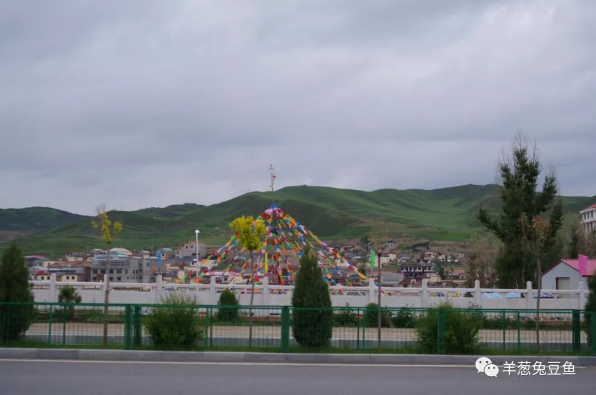

藏区的传统饮食具有高度的统一性，基本是围绕着牛、羊、青稞做加减乘除法，尽管各藏区仍有自己特有的部分饮食，在整个藏餐食谱中所占的比例毕竟较小，在此次甘南的两日行程结束后，我将尽量不再前往其他藏区进行饮食探索，算是做一个不完整的呈现吧。

而今天，在甘南所尝试的藏族饮食，就要从牦牛奶开始了。

（1）

牦牛奶

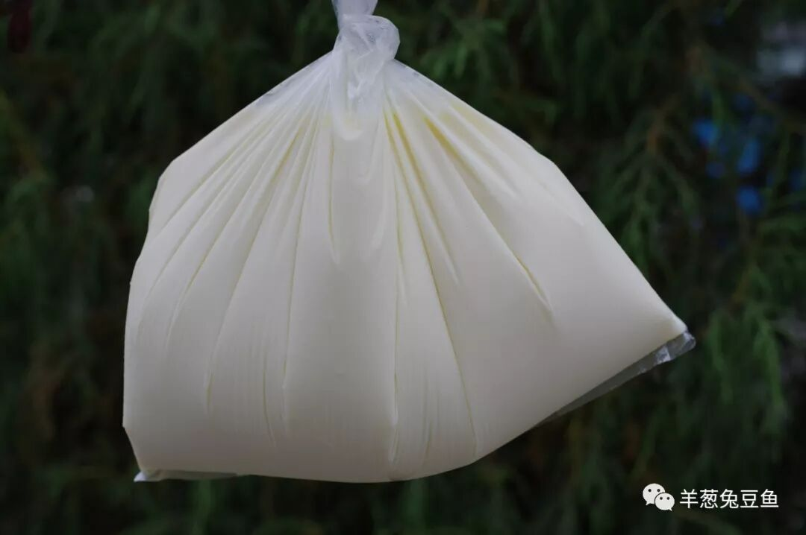

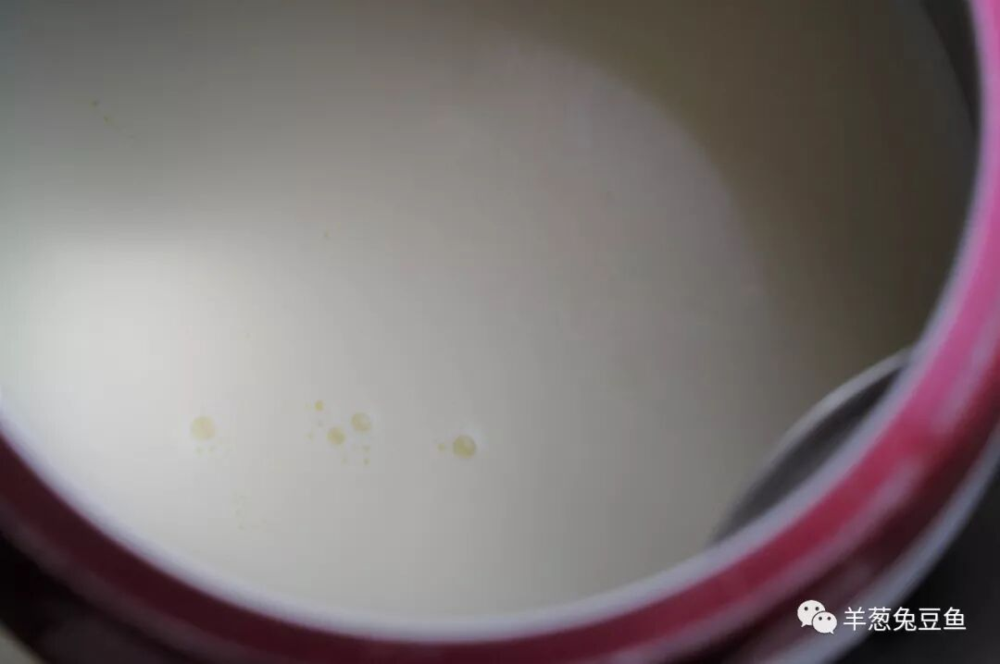

今天在购买牦牛奶时，遇到了一位买酸奶的藏族大妈，她这样告诉我：“你一定要尝尝这边的牦牛奶，你们内地买不到的！”。她的措辞很值得玩味，但这至少充分说明了她对这奶源的巨大信心。

这里的牦牛奶都是生乳，论斤出售，就这么粗暴地装在塑料袋子里，加热后才可食用。比起超市或便利店上售卖的鲜牛奶，牦牛奶的奶味大约是两到三倍，且咽下后口腔内有明显的回甘。且加热后的牦牛奶有一个特性，静置几分钟表面会起一层薄薄的奶皮，喝时又增加了一层口感，十分奇妙。

要问这牦牛奶有多好喝？一口气喝掉两斤的我，不知道算不算一个好的答案。

（2）

酥油

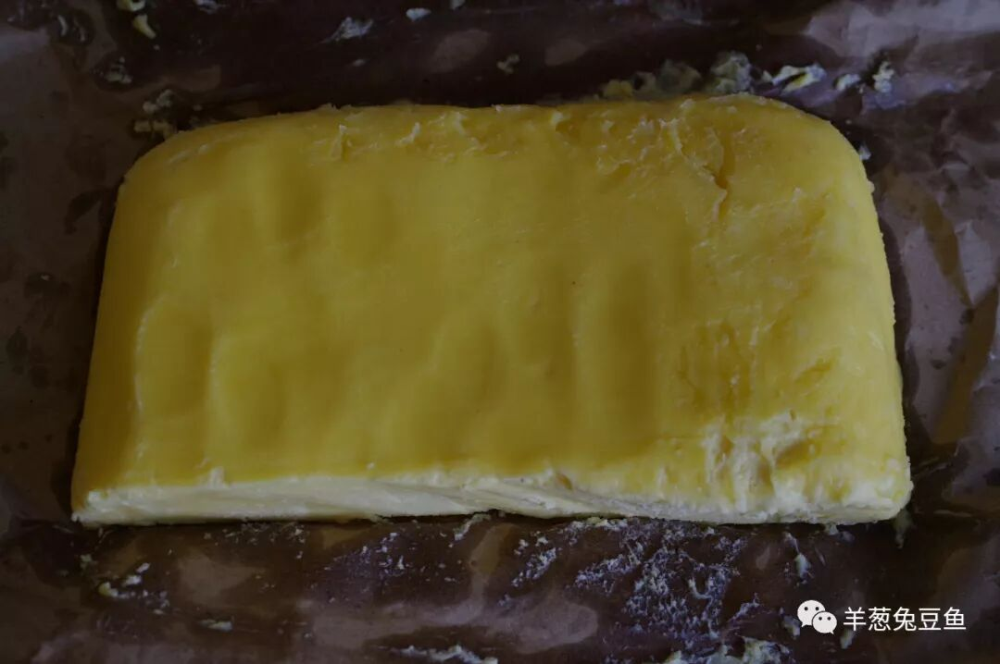

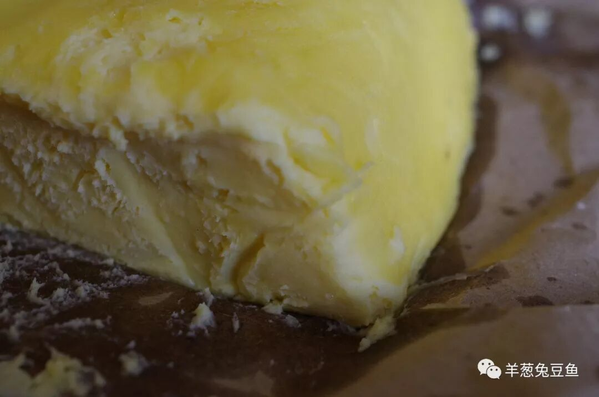

酥油源于牦牛奶，是打出来的，不过在市里是无法目睹这一制作过程。酥油有多重要？凡我们能想象的藏族主食，几乎都离不了它。好的酥油色泽金黄而发亮，尝起来油润奶香，有着类似于黄油的绵密口感，口味独特而营养丰富。

本是只想买一小坨常常口味，藏族大叔手起刀落割了一斤，可以带着它走一段路了。这磨人的小东西。

（3）

曲拉

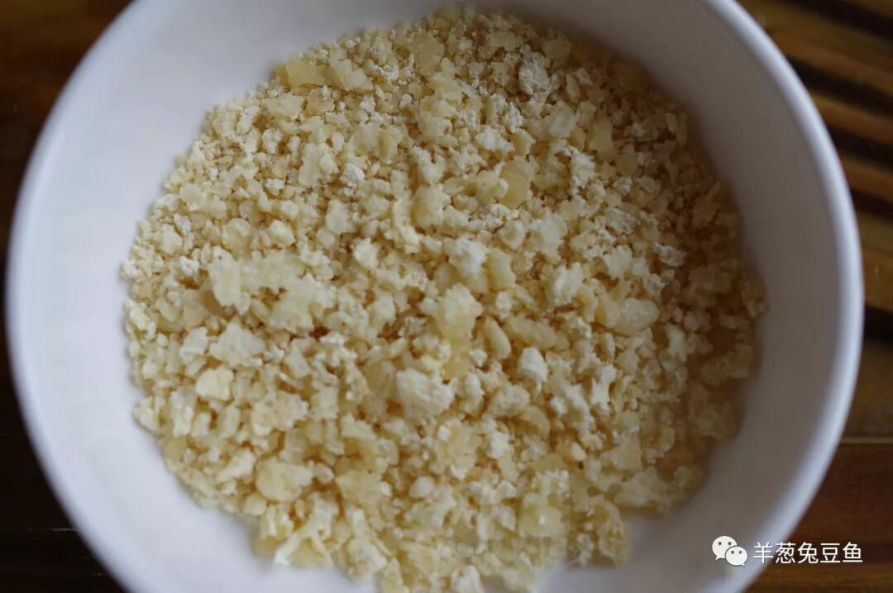

曲拉是打酥油的副产品，通俗一点理解就是奶渣，口感较硬而带有浓郁的奶香味。曲拉很少单独使用，常用于糌粑的制作或在喝奶茶时撒入碗中食用，为糌粑和奶茶增添一层硬质口感，丰富饮食体验。

（4）

酸奶

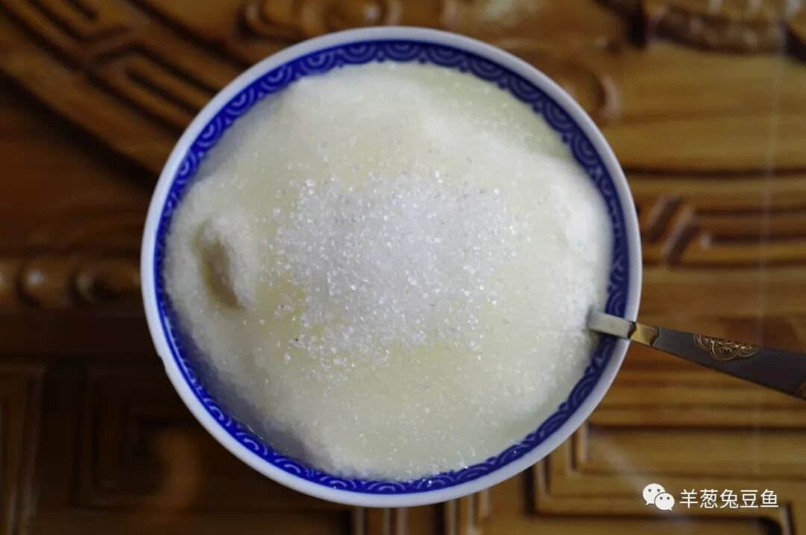

曾不只一人说过，凡喝过高原的酸奶以后，再也无法对大都市货架上的快消酸奶产生太多兴趣，如今，我也可以昂首加入他们的队伍了。

藏式酸奶通常由牦牛奶发酵而成，带有非常强烈的酸味，因此在食用时往往会撒上厚厚一层白砂糖。初见者望着这满满一碗白糖难免会却步，担心味道是否会齁甜。事实上，当你用勺子将白砂糖与酸奶充分混合均匀后，舀起一勺放入嘴中，酸甜的搭配完全平衡，酸奶香四溢，而白砂糖如跳跳糖般在口腔中蹦跶，真是绝妙的配合！

（5）

糌粑

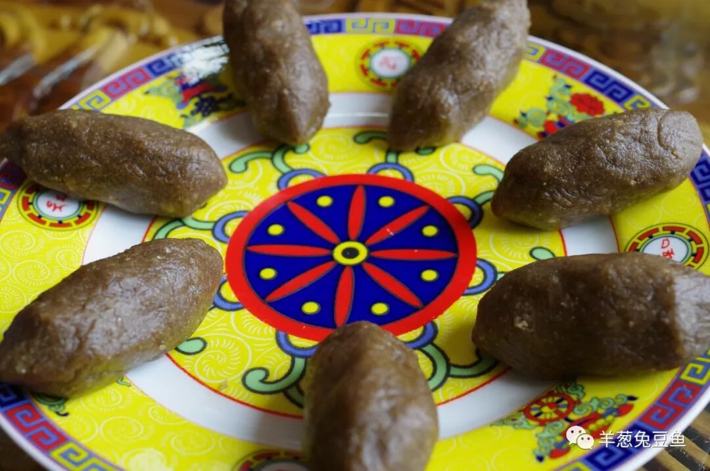

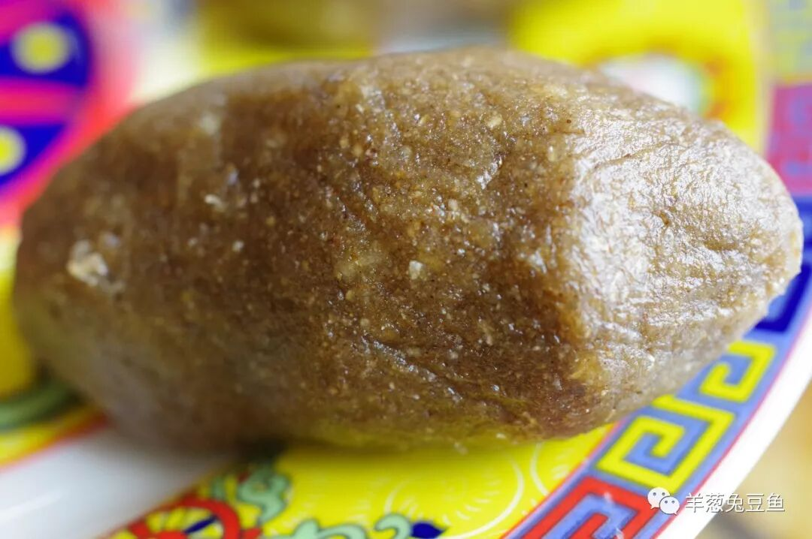

糌粑是藏族的头号主食，如同汉族的面条与米饭。制作糌粑，需要将青稞面、酥油、白砂糖（可选）和曲拉（可选）加水进行搅拌，然后用手捏成团状。对于这个团状其实并没有特殊的要求，怎么喜欢怎么来即可。

糌粑的口感十分像不加水的芝麻糊粉，但具有较为明显的青稞面香，如果加入了砂糖和曲拉还会带有较硬的颗粒脆感。糌粑发热量十分巨大，别看貌不惊人，稍微吃上几个就会很很强的饱腹感，可要记得量胃而吃哦。

（6）

蕨麻米饭

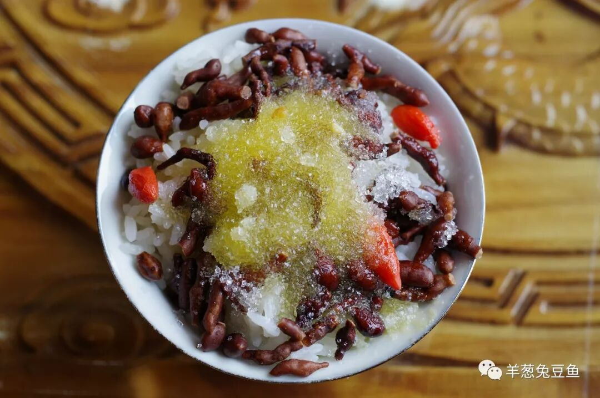

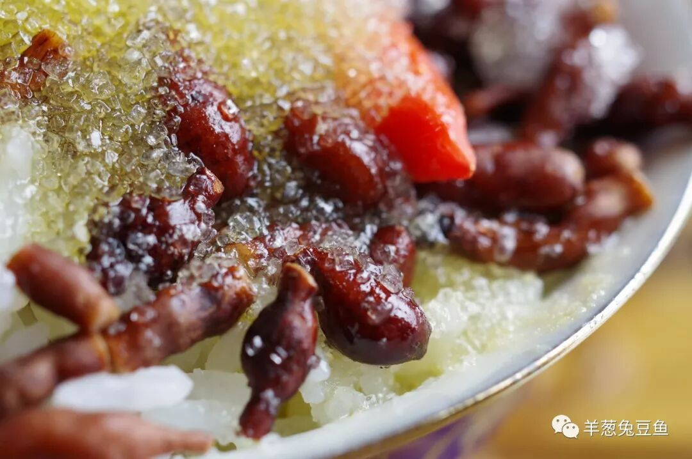

蕨麻又名人参果，是一种蔷薇科植物，其根茎可食用，即藏区常食的蕨麻。蕨麻富含丰富的淀粉，口感接近于土豆，但具有较明显的甜味。

蕨麻米饭是将蕨麻和大米蒸熟后放入碗中，在上面淋上酥油汁和白砂糖。食用时将蕨麻米饭搅匀，吃上一口，即有大米的软糯、又有蕨麻的脆粉之感，白砂糖又增加了一层颗粒脆感，除甘甜之味外又带有酥油的奶香。无论是作为主食还是甜点，都能让人只顾碗中食无视桌边人哪。

甘南的第一天就先到此为止。以上的所有食物都与牦牛奶有着或直接或间接的关联，不得不感慨这一物种为高原藏区所带来的伟大馈赠。

今天的所有食物都相对较软，没有涉及到肉食，明天，我将带来藏区与肉相关的部分食物，不要错过哦。

向牦牛君致敬！

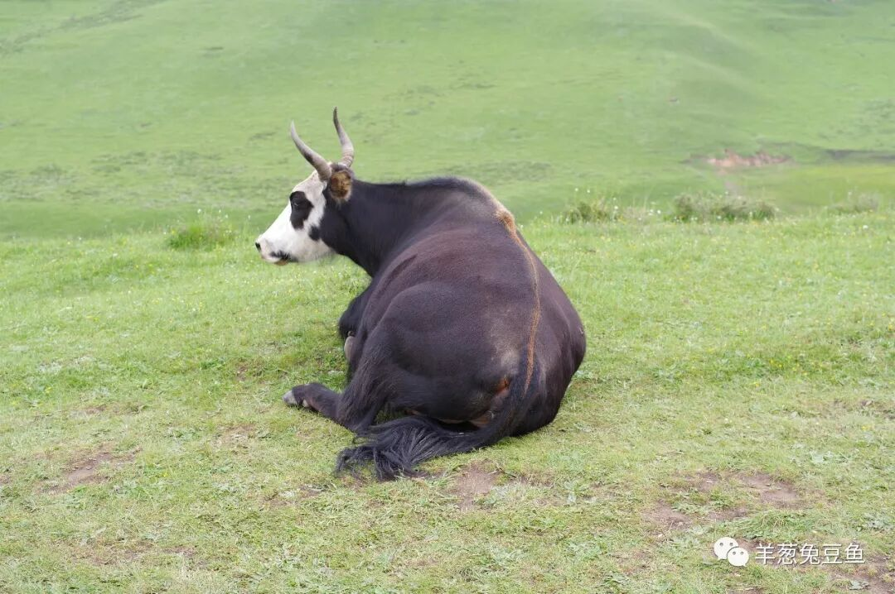

想知道我在做啥，请点击：吃货的决心——555天中国饮食探索之行

想知道我要去哪，请点击：555天行程计划（2018-06-20更新）

今天吃了好多奶

（长按识别二维码点击关注哦）

 var first_sceen__time = (+new Date()); if ("" == 1 && document.getElementById('js_content')) { document.getElementById('js_content').addEventListener("selectstart",function(e){ e.preventDefault(); }); }

 if ("0" == 1) { document.addEventListener("keydown",function(e){ if ((e.metaKey || e.ctrlKey) && (e.key === 'c' || e.key === 'C' || e.key === 'x' || e.key === 'X' || e.key === 'a' || e.key === 'A')) { if (e.target.tagName === 'INPUT' || e.target.tagName === 'TEXTAREA') { return; } e.preventDefault(); } }); document.addEventListener("copy",function(e){ var sel = window.getSelection(); var content = document.getElementById('js_content'); if (sel && sel.rangeCount > 0 && content && content.contains(sel.getRangeAt(0).commonAncestorContainer)) { e.preventDefault(); } }); }

预览时标签不可点

微信扫一扫

关注该公众号

知道了 (javascript:;)
