# 【第012天 甘南·合作（二）】藏餐的肉与饮

- 原文链接: https://mp.weixin.qq.com/s?__biz=MzA3MTM2Mjk3NA==&mid=2247503847&idx=1&sn=e9ac0210e20364ad7782f7236f4f9307&chksm=9f2c3f16a85bb6002b57a37da05ba16b9438f706e62609be68b0e92c8ec05d5abf4f57f2781c&scene=21
- 作者: 宇哥食行记
- 发布时间: 未知
- 图片数量: 13

毕竟是高原，一夜小雨后，出门竟需要穿上外套了，一不留神便让人忘了夏天。

合作的街头冷冷清清，丝毫没有进入旅游旺季的那种游人如织，或许凡计划甘南旅行的人，都多多少少会选择略过这里，除了一个不要门票的当周草原和一个三十年前修建的米拉日巴佛阁，它再没有更多引人前往的景点。

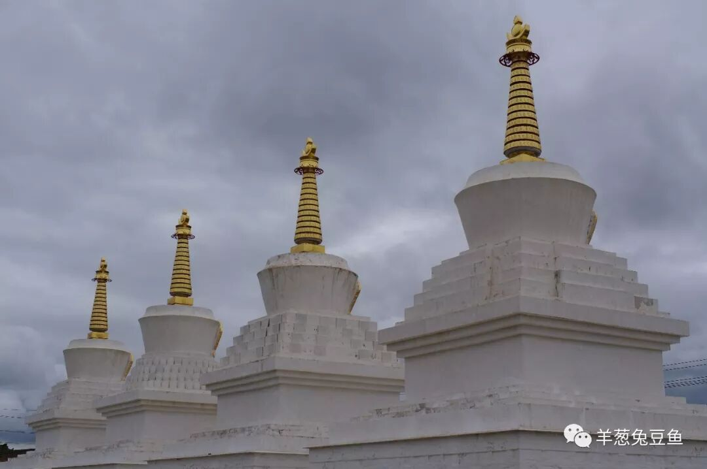

但对于寻找藏餐来说，合作可能是甘南最好的去处之一。一方面，越靠近景点，饮食往往就会具有越低的性价比，这是符合经济学规律的，也无可厚非；另一方面，甘南的旅游旺季就这么两三月，旺季一过，酒店、餐馆就可能面临无人光顾的局面而不得不歇业，盈利就在这转瞬之间，你说，商家能让你捡便宜吗？而合作作为甘南州的首府，有着他稳定的居住人群与消费人群，开在这里的餐厅多半不是为游人服务。同时据我观察，进出这里藏餐厅的也基本是当地人，所以想吃藏餐，来这里合适。

（1）

烤羊排

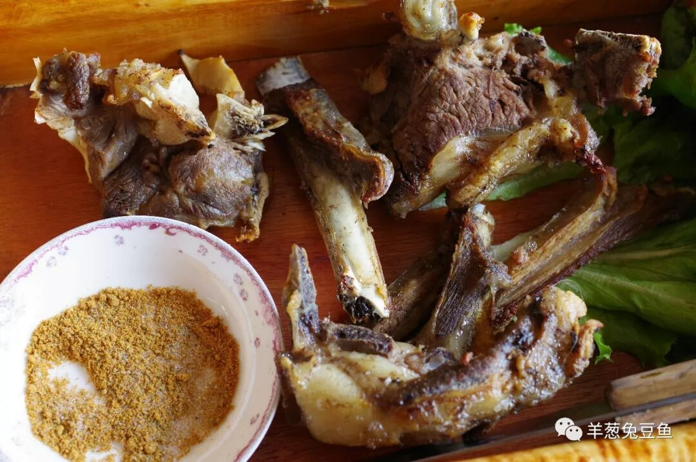

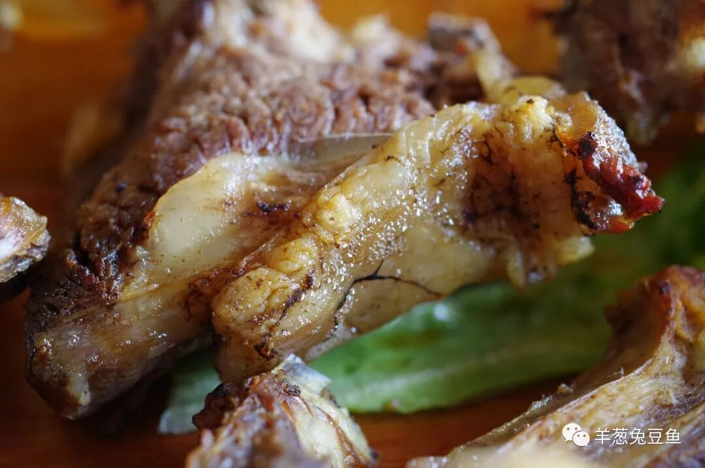

试问有谁可以拒绝烤羊排？羊皮焦香酥脆，肥膘肥而不腻，瘦肉韧而不柴，焦香、油香、鲜香味就这么一同涌出。虽然提供了刀具，但对于一个肉食动物来说，双手与嘴就是最好的工具。反正没有人在看。

吃着烤羊排时，我也在思考一个问题，它为什么这么美味？除了羊排本身的味道外，我觉得很重要的还在吃时的运动体验：反复咀嚼着肥厚的羊肉直到两腮发酸，用手拽着骨头用力地将关节处的蹄筋撕咬下来，像一个钟表匠般精密地将紧贴着羊骨的那一层薄膜剥离下来......味道与体验的完美结合，无法拒绝。

（2）

羊肉肠

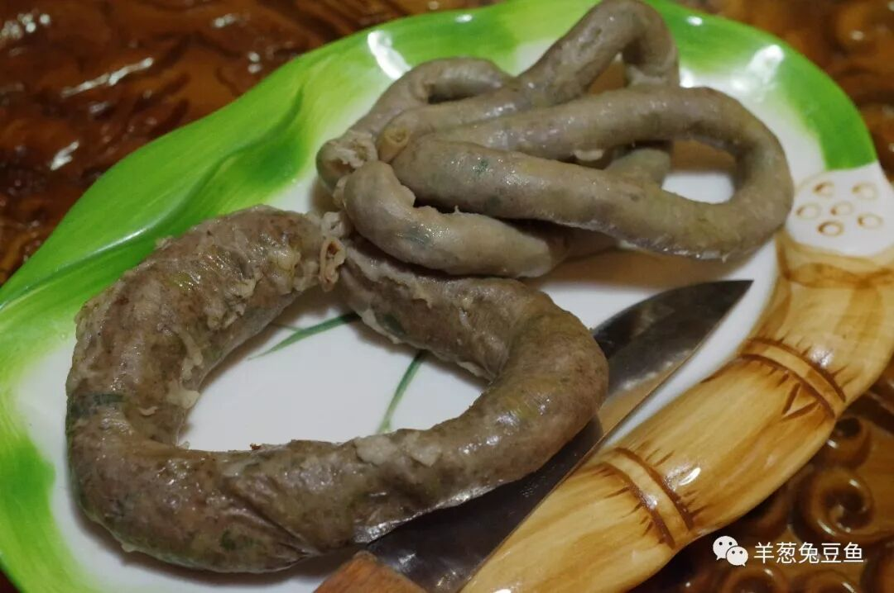

游牧民族基本善做肉肠，且各具风味。藏式羊肉肠的风味则厚重而简单，简单在于它并没有使用过多的香料进行调味，也没有将肉的各个部位或内脏大量混合；而厚重则在于其浓重的羊油味道，对于除尝的外地游客往往太过猛烈。不过，蘸上一些辣子或醋，这种厚重感会得到有效的缓解，只不过就要以牺牲其本来的一些味道作为代代价了。

大肠与小肠所包的内容并无区别，但吃起来口感上就具有明显差异。以同样的深度咬下一口，小肠的肠衣所占的比重显然要大得多，因此吃起来会有更明显的脆感；而大肠则主要是肉，吃起来则相对饱满，汁水也更加丰富。

（3）

藏包子

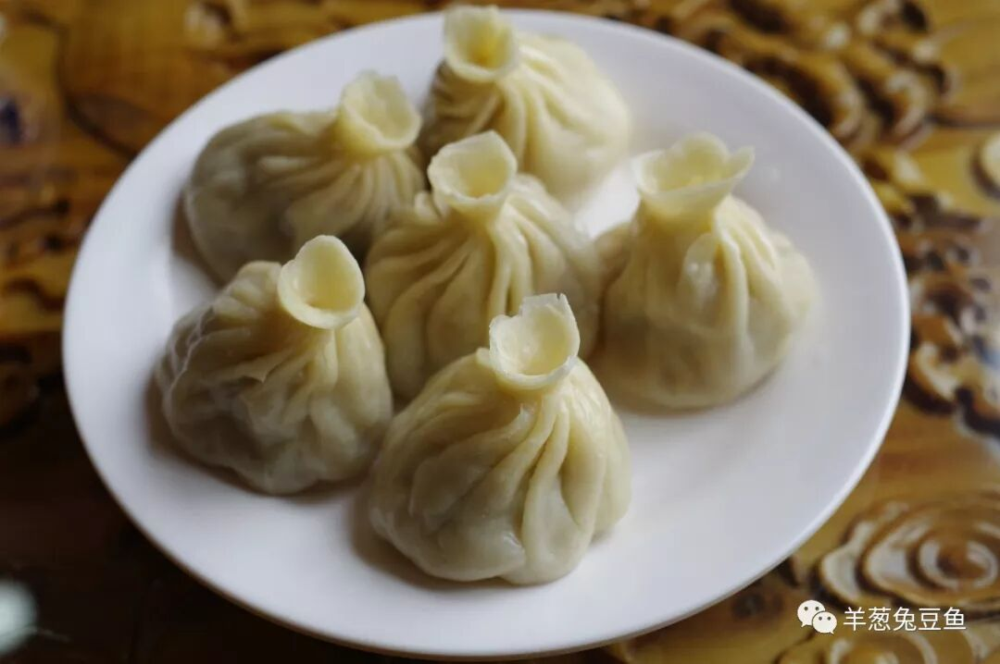

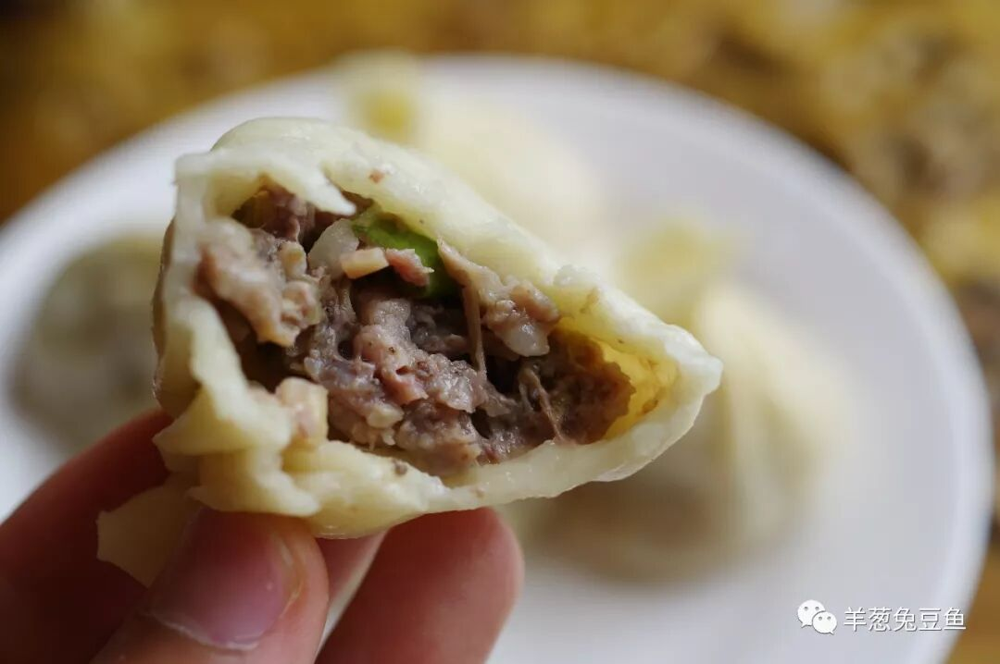

对于部分曾经来过甘南的伙伴而言，可以说是谈藏包子而色变。用他们的话来说，这味儿实在太“冲”了，而这种“冲”味其实是来自羊板油。想要缓解，辣子和醋仍是救星。

藏包子皮儿是死面做的，且偏厚，轻轻咬下一口，伴着浓烈的“冲”味，油脂会飞溅出来，吃时可要当心。和糌粑一样，藏包子非常顶饱，可不要吃得太多哦。

（4）

巴勒

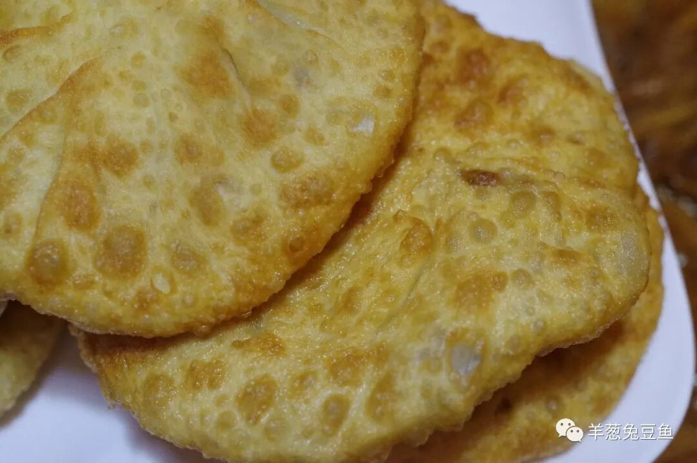

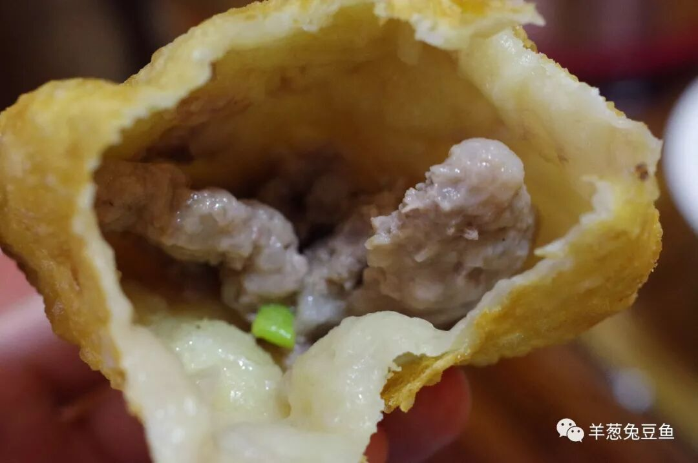

巴勒其实就是藏式肉饼，表皮十分酥软，而馅儿与藏包子一样是羊肉馅（也可用牛肉馅），同样具有厚重的油脂，和浓烈的羊油味。巴勒个大馅饱，也是实实在在的硬食，上来一盘7个确实是有点为难我了。

（5）

酥油茶

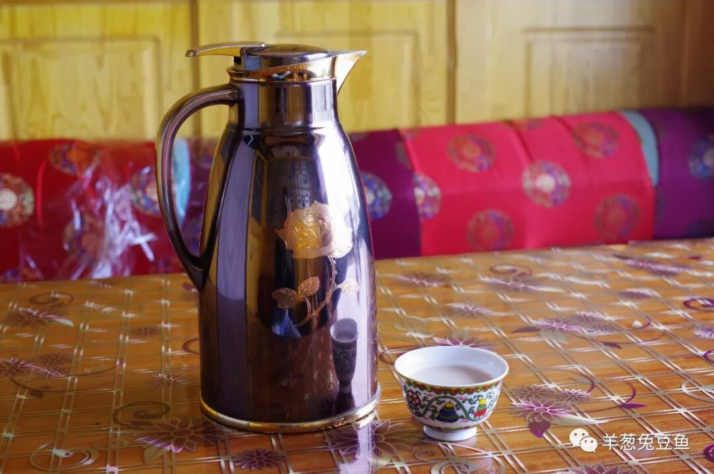

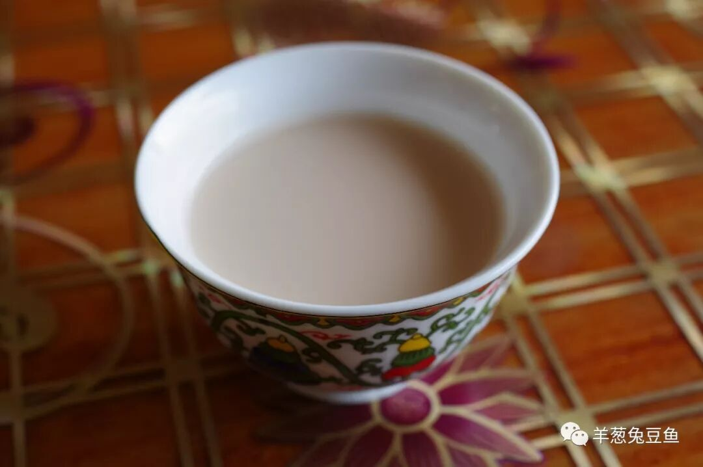

对于藏式饮料，名声最大的莫过于酥油茶了。酥油茶往往呈淡褐色，偶尔还带有微微的粉色，颜色上十分讨人喜欢。喝上一口，淡淡的茶香，伴着酥油独特的油香，再加上一丝不易察觉的咸味，温润和舒畅。但是酥油的味道并非人人可以接受，所以也能常听见喝不惯酥油茶的言论，爱与不爱，就只能等你亲自来评判了。

（6）

奶茶

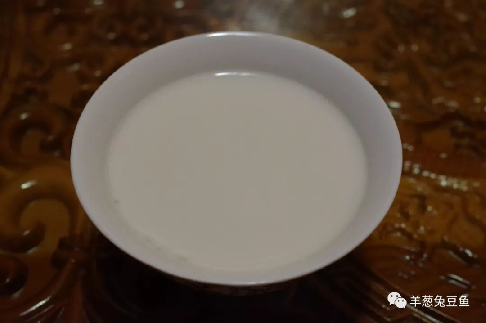

比起酥油茶，藏式奶茶就没有什么明显的“排他性”了，就是牦牛奶与茶的简单组合，而其胜就胜在这牦牛奶上。对于牦牛奶，昨天的文章已经有了很高的评价，今天就不再赘述了。只是，我发现煮牦牛奶似乎对火候和器具有着明显的要求，有机会可得向藏民好好取取经呢。

对于藏餐的探索就告一段落了，即使我继续探索下去，其变化也必将越来越少，此次能窥个大概也算基本满足。而关于牦牛肉，在甘南确实十分少见，但转念一想也能说的通。牦牛本身生长缓慢，数量本就偏少，而藏民日常的能量来源几乎都需要靠牦牛的产品——牦牛奶来进行满足，杀牛吃肉显然是不太妥帖的做法。不过，之后在青海西宁，我将再寻找，或许会有新的发现。

我想，我与正在阅读这篇文章的你，以后若前往藏区旅行，想要寻找藏餐，心里也有了更多的谱。那我这两天的行程，也就值得了。

高原的盛景啊，你是多么令人难忘，但我，也要准备好继续上路了。

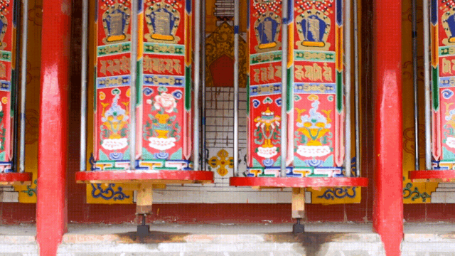

想知道我在做啥，请点击：吃货的决心——555天中国饮食探索之行

想知道我要去哪，请点击：555天行程计划（2018-06-20更新）

再见甘南

（长按识别二维码点击关注哦）

 var first_sceen__time = (+new Date()); if ("" == 1 && document.getElementById('js_content')) { document.getElementById('js_content').addEventListener("selectstart",function(e){ e.preventDefault(); }); }

 if ("0" == 1) { document.addEventListener("keydown",function(e){ if ((e.metaKey || e.ctrlKey) && (e.key === 'c' || e.key === 'C' || e.key === 'x' || e.key === 'X' || e.key === 'a' || e.key === 'A')) { if (e.target.tagName === 'INPUT' || e.target.tagName === 'TEXTAREA') { return; } e.preventDefault(); } }); document.addEventListener("copy",function(e){ var sel = window.getSelection(); var content = document.getElementById('js_content'); if (sel && sel.rangeCount > 0 && content && content.contains(sel.getRangeAt(0).commonAncestorContainer)) { e.preventDefault(); } }); }

预览时标签不可点

微信扫一扫

关注该公众号

知道了 (javascript:;)
