# 【第013天 兰州（一）】兰州的咸不止牛大碗

- 原文链接: https://mp.weixin.qq.com/s?__biz=MzA3MTM2Mjk3NA==&mid=2247503846&idx=1&sn=723e0e536e666d5792f1396c7dd2fbb4&chksm=9f2c3f17a85bb6018e81b7adc6deaed7a5ff597dc7f662357a9d6d928d3ab657b3e990ee205f&scene=21
- 作者: 宇哥食行记
- 发布时间: 未知
- 图片数量: 15

黄河汹涌穿城而过，这里是兰州，这里是中国大陆版图的几何中心，这里是古丝绸之路也是今一带一路上的重要枢纽。兰州就是这么一座怎么都绕不过关注的城市。

与印象中的烈日灼身、尘土飞扬不同，今天兰州下了一整日雨，多了分南方城市的柔。可走到黄河边，浑黄而湍急的水疯狂地向东奔去，果然还是它骨子里的刚。

谈及美食，这几年兰州可谓是频繁被放置在了聚光灯下。一方面，人们终于知道了真正的“兰州拉面”是何物；而另一方面，牛肉面的过度颂赞也掩盖了它所拥有的其他饮食的光芒。这次，我将用两天的时间，呈现一幅更完整的兰州饮食图。

今天，是关于兰州的咸。明天，是关于兰州的甜。

（1）

牛肉面

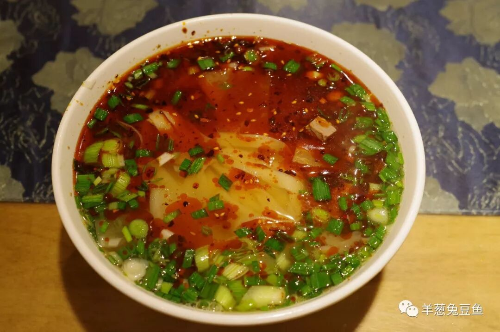

（面型：韭叶）

兰州牛肉面即兰州人口中的牛大碗，我想，它已经不需要更多的赞美诗。无论是“一清二白三红四绿五黄”的色，还是“面条劲道、汤汁浓香、牛肉软烂”的味，尝过或未尝过的你恐怕早已熟稔于心。未尝过时，满怀期待；尝过以后，念念不忘。这就是一碗牛大碗与人的情感交互。而于兰州人，它早就是骨子里、血液里的东西了。

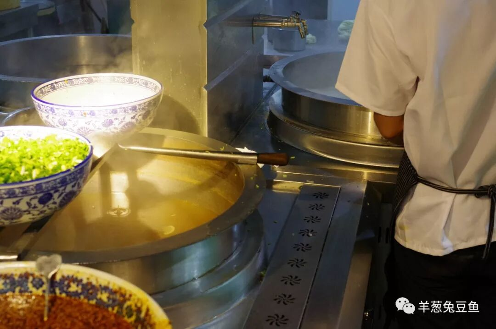

（面型的选择）

第一次吃牛大碗的人，往往会对这拉面师傅的一句“下什么面”狂挠腮帮子。即使吃过一次两次，也未必清楚这饶有趣味的名字到底代表什么。我想，我也就趁着这次机会介绍一下吧。

兰州牛肉面的面条按照横截面的形状可以分成圆形、扁形和棱形三种。圆形面由细到粗分为毛细、细的、三细、二细、二柱子，扁形面由窄到宽分为韭叶、薄宽、宽的、大宽、皮带宽，而棱形面则根据形状分为荞麦棱、三棱子、四棱子等。过细或过粗的面其实都不太有人点，而棱形面十分考验师傅的手艺，如果不是有强迫症，还是不要为难拉面师傅了。

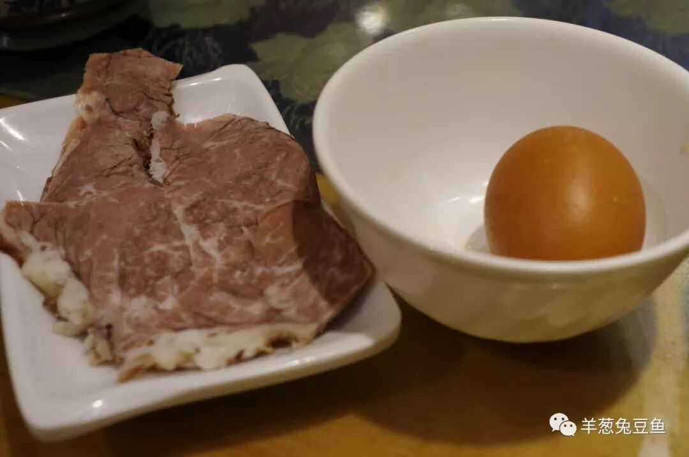

（加个肉蛋双飞才是王道！）

（2）

肥肠面

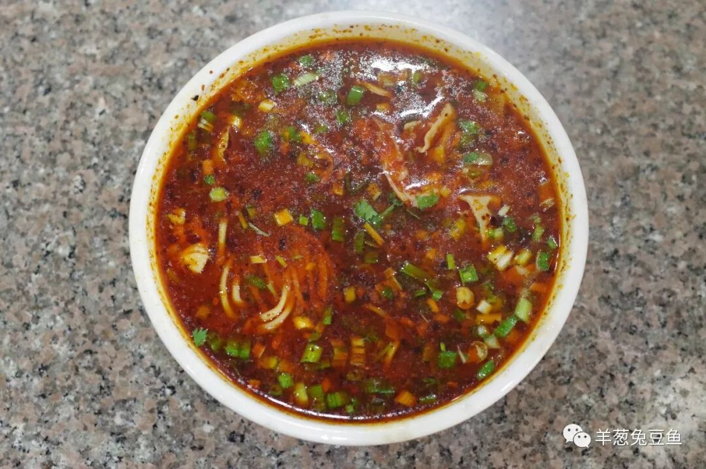

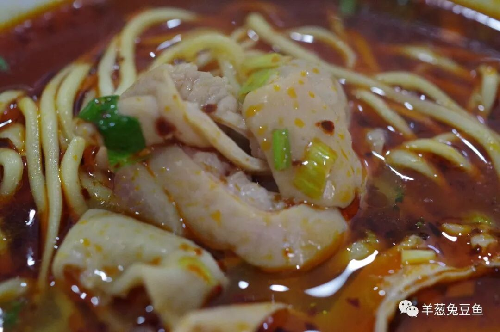

在牛肉面的圣光之下，兰州肥肠面就显得黯淡了许多。在兰州，牛肉面馆有上千家，而肥肠面馆不过寥寥几十家。

其实尝试过之后就能明白，肥肠面是典型的牛肉面的演化物。“一清二白三红四绿五黄”的描述放到肥肠面上，唯独这“一清”不符，其他完全相同。肥肠面所使用的汤底是几种高汤的混合（据做面阿姨所说），所以尝起来具有十分复合的味道。煮面时也没了那么多讲究，统一粗细的面，你只需要选择面的多少、蒜苗的多少、辣子的多少即可。

肥肠面的出现，可能更多算是种饮食上的调剂吧，也许吃腻了牛肉面也想偶尔换换口味呢。它没有盛名，它更难寻觅，但仍是值得品尝的一碗面。

（3）

羊肉泡

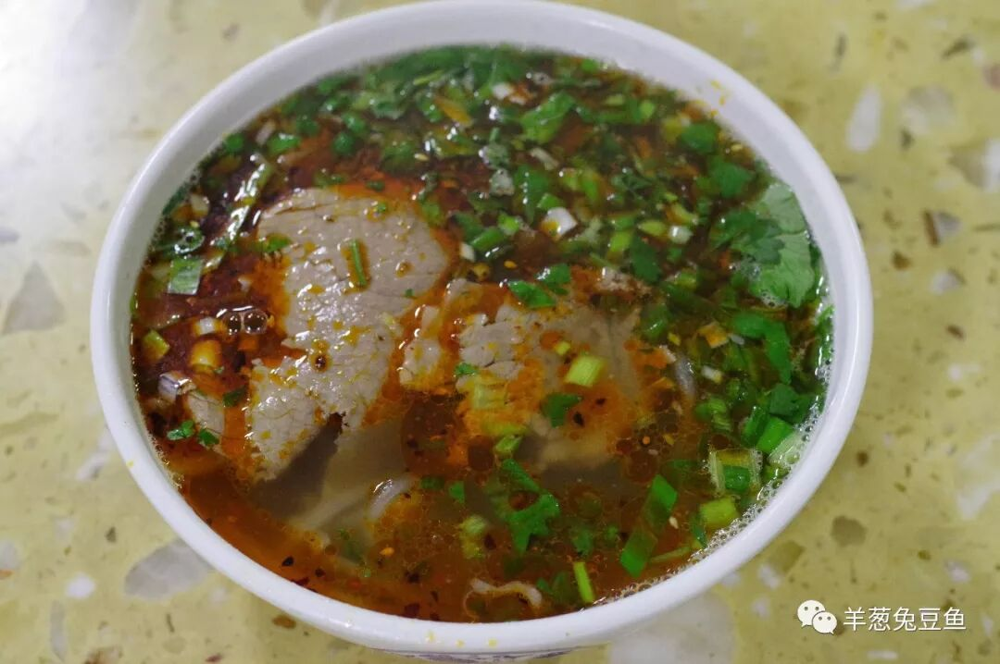

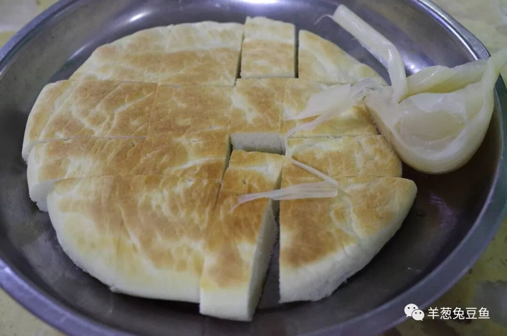

如果一定要将兰州人与西安人拉到一起因羊肉泡而干上一架，怕是免不了你死我活。其实兰州人心里也十分委屈，凭什么只认西安而不认我大金城呢？谁让你的牛大碗名气太大了呢。

（关于羊肉泡，之后还将有银川、运城、安康等城市加入战斗，在此先预告一下。）

兰州的羊肉泡，骨子里仍然有那牛肉面的基因，看起来像极了一碗加了肉片的牛大碗。但这味道一点儿也不含糊！汤汁鲜香味浓，肉片不膻不柴，这馍馍也不像西安那般需要耐心地自己掰开，而是麻利地几刀下去切成十几块。将馍馍丢进汤中浸泡半分钟，汤汁充盈其中，而馍的韧劲还有所保留，吃在口中饱满充实。不时咬上一颗糖蒜，解腻而酸甜爽口。可以说，这份羊肉泡无可挑剔。

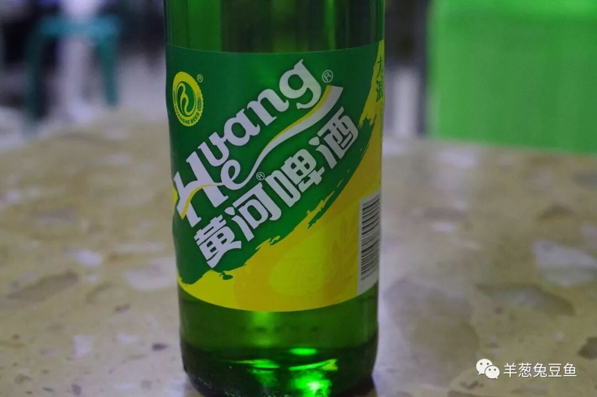

（再来上一瓶黄河啤酒吧，爽快！）

（4）

酿皮

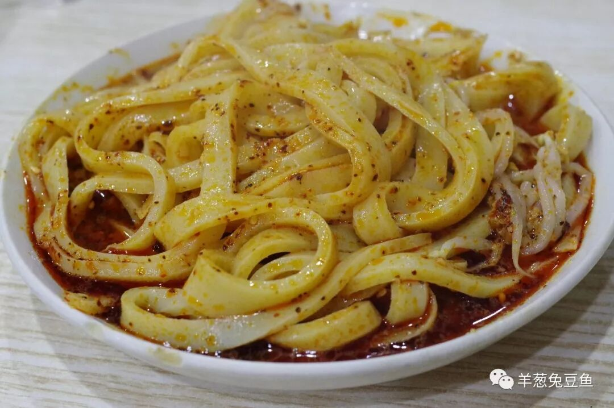

酿皮（酿，甘肃人读作rǎng）是具有浓烈甘肃色彩的小吃，各地在制作酿皮的技法和酿皮调料的选择上都有所差异，兰州的酿皮是其中的一个流派。兰州酿皮分为高担酿皮和水洗酿皮，其差别在于是否洗出面团中的面筋。从成品上看，两者也具有比较明显的颜色区别，高担酿皮的颜色呈卖黄色，而水洗酿皮的颜色则泛白。而口感上，高担酿皮会更加劲道，但实际差异不大。

酿皮入口爽滑柔韧而有嚼劲，并带有轻微的碱味，配上蒜汁、醋、辣子、芝麻酱等作料，味道酸辣爽口，是夏季常食的消暑食物。

（5）

洋芋片

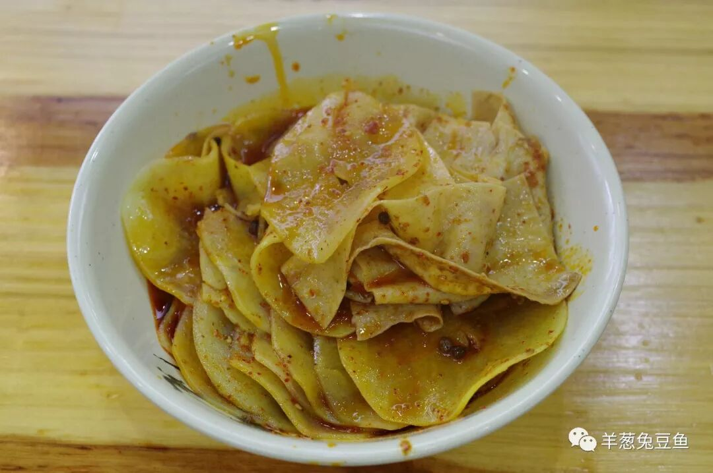

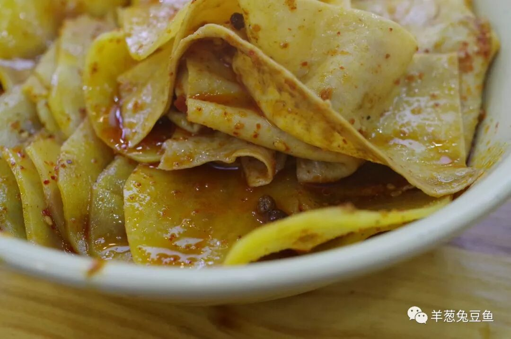

如果粗暴地去理解，这就是兰州版本的“麻辣拌”吧。只不过食材非常简单，洋芋片，顶多再加上豆皮。切得很薄的洋芋片饱蘸了酱汁，微微的辣、微微的甜、微微的麻，一种并不复杂的味道，却让人吃得合不拢嘴。据说，这小小的洋芋片是很多兰州人小时候的美好回忆，那种镌刻在心里的简单、却深刻的味觉回忆。不妨试试看吧，也许，这也能成为你关于兰州的一种回忆。

（马三洋芋片总店）

除以上五种食物外，兰州街头十分常见的还有炒凉粉、凉面、浆水面等咸口食物，相对而言就不那么具有地方特色。而且如果继续吃下去，今天摄入的碳水化合物量差不多也能突破天际了，适时打住才是正道。

牛肉面的确是兰州最棒的食物，但如果某一天你来到这里，也想试试牛肉面之外的其他主食，不妨就着这份清单去寻觅看看吧。

明天，我将会带来兰州的诸多甜蜜之味。甜，或许从来都是更无法被抗拒的呢。

想知道我在做啥，请点击：吃货的决心——555天中国饮食探索之行

想知道我要去哪，请点击：555天行程计划（2018-06-20更新）

师傅，下碗二细，多蒜苗多辣

（长按识别二维码点击关注哦）

 var first_sceen__time = (+new Date()); if ("" == 1 && document.getElementById('js_content')) { document.getElementById('js_content').addEventListener("selectstart",function(e){ e.preventDefault(); }); }

 if ("0" == 1) { document.addEventListener("keydown",function(e){ if ((e.metaKey || e.ctrlKey) && (e.key === 'c' || e.key === 'C' || e.key === 'x' || e.key === 'X' || e.key === 'a' || e.key === 'A')) { if (e.target.tagName === 'INPUT' || e.target.tagName === 'TEXTAREA') { return; } e.preventDefault(); } }); document.addEventListener("copy",function(e){ var sel = window.getSelection(); var content = document.getElementById('js_content'); if (sel && sel.rangeCount > 0 && content && content.contains(sel.getRangeAt(0).commonAncestorContainer)) { e.preventDefault(); } }); }

预览时标签不可点

微信扫一扫

关注该公众号

知道了 (javascript:;)
