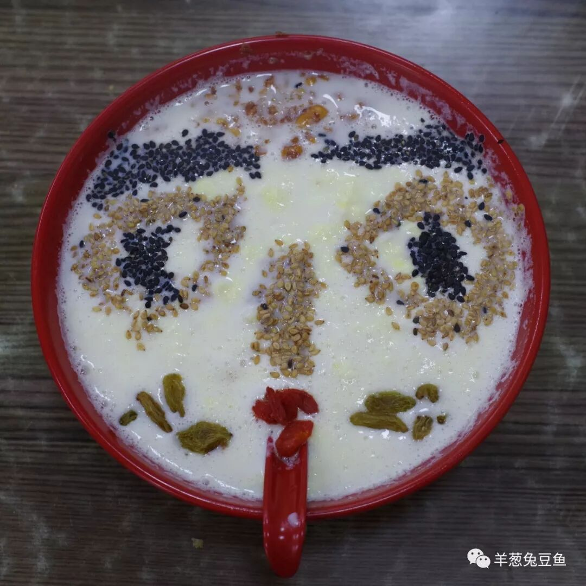
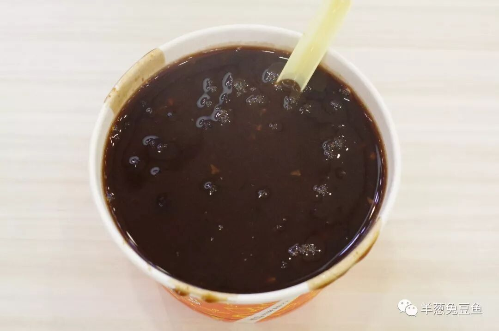
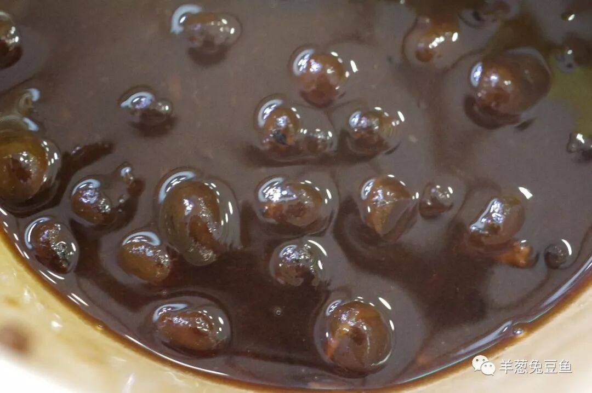
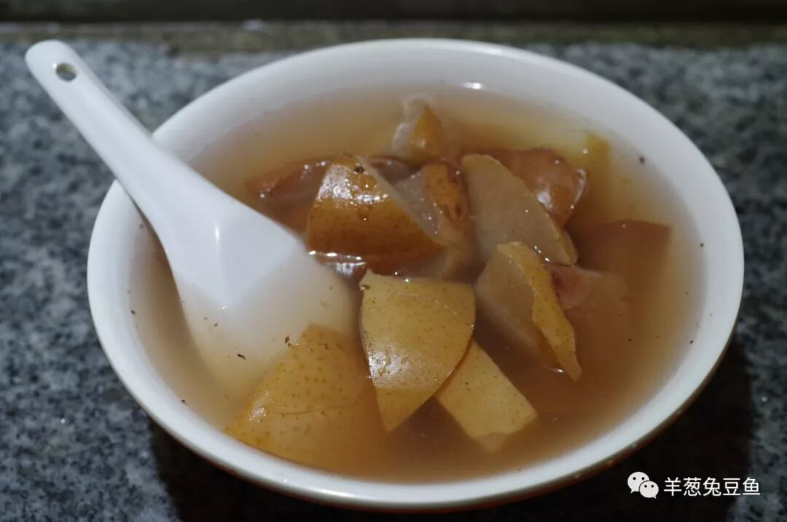
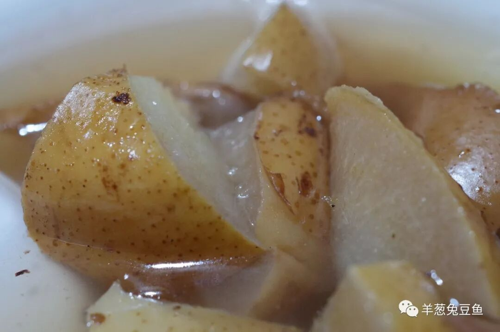
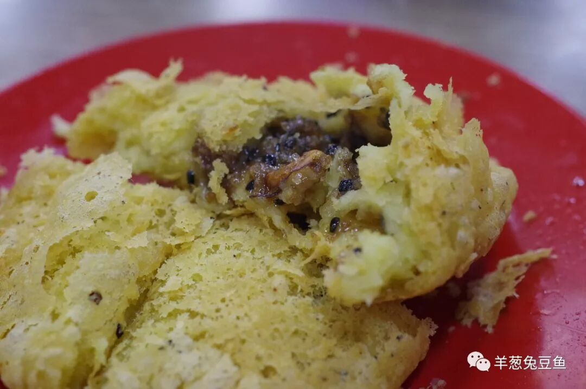
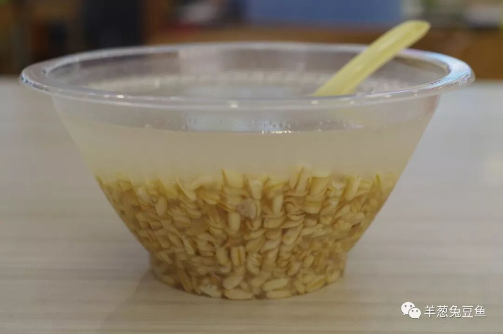
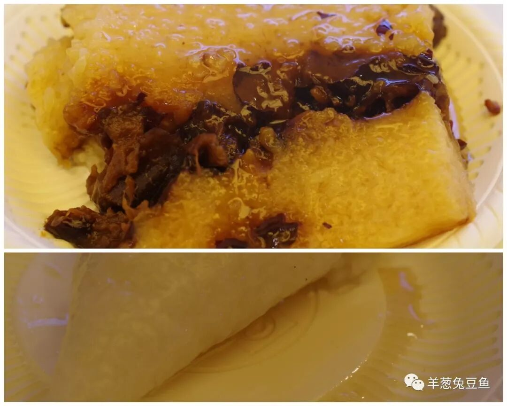
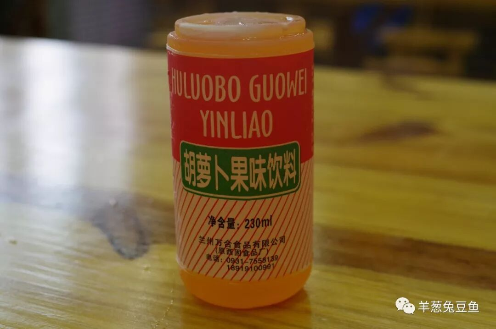

# 【第014天 兰州（二）】兰州的甜甜到心

- 原文链接: https://mp.weixin.qq.com/s?__biz=MzA3MTM2Mjk3NA==&mid=2247503845&idx=1&sn=56e6eb6562b389d5f9e81baf338f30b3&chksm=9f2c3f14a85bb60249ce347b7dd491b91f725cfab8150a3b02c8d285d4690304ed1f1f71a893&scene=21
- 作者: 宇哥食行记
- 发布时间: 未知
- 图片数量: 11

天晴了，它终于卸下伪装，穿上西北城市的衣裳。据说，晴朗的日子与甜食更配哦。

镶嵌在大西北的兰州，孕育了为数不算多却别具风味的甜食，这本身就是件值得宣扬而自豪的事。至少在饮食上，兰州因此而成为了一个刚柔并济的城市。

与南方精挑细选、精雕细琢的各式甜品不同，兰州的甜品在制作上大多简单而粗犷，仍是满满的西北之气。但那简单而厚重的味道，却可以直击人的内心。

（1）

牛奶鸡蛋醪糟

按照各种兰州旅游攻略，认识兰州的甜食要么从牛奶鸡蛋醪糟开始，要么从一碗甜醅子开始。但对于金城兰州而言，一碗牛奶鸡蛋醪糟显然更加独特。

而认识牛奶鸡蛋醪糟，绝大多数游客会选择从正宁路夜市开始。早已从兰州当地人和资深驴友的口中耳闻，今天的正宁路已经黑化，早不是当年那个寻觅地道美食的夜晚去处。为了验证，便亲自走了一遭，从头走到尾，标榜着“舌尖上的中国推荐美食——牛奶鸡蛋醪糟”字眼的小摊反复出现了七八次，而游客们排着长队望着那明火上的一口口铁锅里白色液体猛烈翻动，我却瞬间失了兴趣。离开这里吧，一定有更好的。

有些偏题了，说回这牛奶鸡蛋醪糟吧。今晨在一家老字号甜品店中点了一碗，端上后我着实被这种淳朴的可爱给震惊了，忙不迭地拿出相机拍照。而店长悄悄走到我身后，说了声：“怎么样？摆的可以吧？”。当然可以，就这么稍微动点小手脚，让人眼前一亮，食欲大开。

将牛奶、鸡蛋、醪糟在锅中一同熬煮，最后撒上芝麻、花生、葡萄干、枸杞等辅料即可，没有固定范本，就这么简单而随意。平淡的牛奶因为蛋花、醪糟和各种干货的加入，变得异彩纷呈，香甜温润，口感极为丰富，成就了一碗不管春夏秋冬、无论风霜雨雪都能大快朵颐的一碗甜食。

（2）

灰豆子

可不要将它认作了红豆粥。灰豆并非红豆，甚至不是一种豆，灰指蓬灰、而豆是豌豆。一碗灰豆子呈棕黑色，豆子粒粒饱满而油光发亮，吃在口中甜度适中、一颗颗豆子随着牙齿的咬合而破裂，绵软的豆沙冲击着口腔，浓烈的豆香也随之而出。这种保留完整豆粒的制作方法意味着豆子不可能实现充分的入味，与红绿豆沙之类是两种截然不同的味觉体验，哪一种是你的偏好呢？

（3）

热冬果

热冬果是过去兰州街头冬日常见的甜食，是过去兰州人在寒冷天可以轻易盼得的暖身之物。如今再没有小贩挑着担子售卖了，但这种吃食还是保留了下来。

与常见的冰糖雪梨不同，兰州的热冬果使用的梨是当地所产的冬果梨，热冬果之名也由此而来。梨皮入口即落、梨肉入口即化、汁水温润滑溜，没有腻人的甜，夹带一丝淡淡的香料气息。如今，想吃热冬果，不需要再等冬天，但那种与时令相匹配的体验，此次无法获得，算一种小小遗憾吧。

（4）

糖油糕

兰州的糖油糕，一定算得上是中式面点的一种代表。外皮酥脆掉渣，外皮之下是一层绵软滚烫入口化渣的内皮，内馅粘稠香甜、并带着淡淡的玫瑰花香，这种典型的三层结构活生生就是一曲绝美的三重奏，在口腔内此起彼伏、高潮迭起。当你沉浸于这种滋味无法自拔之时，乐声却戛然而止，糖油糕，吃完了。

（5）

甜醅子

从进入甘肃开始，甜醅子就可以一路吃不停，兰州有着它自己的特色。从外形上看，兰州的甜醅子十分容易辨识，汤多麦少。由于加入了较多的水，往往需要撒上一两勺白糖，避免味道寡淡。可以想象，兰州的甜醅子尝起来不会具有太浓烈的酸甜味，是一种清爽中的适度甘甜。谈不上好坏，如果非要比较，也许干甜醅更适合做解馋之食，而兰州式的湿甜醅，更适合作解渴之食吧。

（6）

晶糕&粽子

晶糕与粽子也是兰州各甜食店内的长期驻场嘉宾。晶糕与临夏的粘糕十分相似，用糯米与大枣制成，淋上蜂蜜或撒上白糖食之均可，冷食热食均可，软糯粘嘴、酸甜可口。而粽子即是甘肃十分普遍的蜂蜜粽子，冰凉的粽子淋上厚厚的蜂蜜，清凉甘甜的滋味让暑气消去。喜欢粘食的吃货，可千万不要错过。

（7）

胡萝卜饮料

据说，北冰洋之于北京，冰峰之于西安，胡萝卜素之于兰州，中国的城市似乎常有这样能唤起一代人集体味觉记忆的饮品。对本地人而言，往往已经分不清是在喝味道、喝习惯还是喝情怀了，又或者这根本就成为如同人的呼吸一般地存在，成为了本能。

作为外来者，喝情怀是谈不上的。品咂这简单的清甜味道之余，尝试着去设想如果我也将眼前这瓶貌不惊人的饮料喝了十年、二十年会怎么样呢？也会像真正经历过的人那样吧，我想是的。这就是味道的力量。

两天，品过了兰州的咸与甜，是时候前往下一站了。作为甘肃省省会，我们有充分的理由相信在兰州的大街小巷里还能找到甘肃其他地区的地方饮食，但那些显然不是我此次将要探寻的东西了。

一般来访兰州，也少有人会呆上十天半月，不妨就去试试这金城的独特味道吧，也够吃上个三四天了。毕竟，此食只应金城有，西出黄河不复得。

拜拜兰州，我们还会有下一次。

想知道我在做啥，请点击：吃货的决心——555天中国饮食探索之行

想知道我要去哪，请点击：555天行程计划（2018-06-20更新）

忍不住再看一眼牛奶鸡蛋醪糟

（长按识别二维码点击关注哦）

 var first_sceen__time = (+new Date()); if ("" == 1 && document.getElementById('js_content')) { document.getElementById('js_content').addEventListener("selectstart",function(e){ e.preventDefault(); }); }

 if ("0" == 1) { document.addEventListener("keydown",function(e){ if ((e.metaKey || e.ctrlKey) && (e.key === 'c' || e.key === 'C' || e.key === 'x' || e.key === 'X' || e.key === 'a' || e.key === 'A')) { if (e.target.tagName === 'INPUT' || e.target.tagName === 'TEXTAREA') { return; } e.preventDefault(); } }); document.addEventListener("copy",function(e){ var sel = window.getSelection(); var content = document.getElementById('js_content'); if (sel && sel.rangeCount > 0 && content && content.contains(sel.getRangeAt(0).commonAncestorContainer)) { e.preventDefault(); } }); }

预览时标签不可点

微信扫一扫

关注该公众号

知道了 (javascript:;)
