# 【第015天 武威】三套车拉动凉州胃

- 原文链接: https://mp.weixin.qq.com/s?__biz=MzA3MTM2Mjk3NA==&mid=2247503844&idx=1&sn=ecdbe246d698f37306bdb0b50d750158&chksm=9f2c3f15a85bb603af366b3ebbad7c8ca18ef3f6134f979eea3ea710351b70df2f3afeff9076&scene=21
- 作者: 宇哥食行记
- 发布时间: 未知
- 图片数量: 19

凉州词二首·其一

王翰

葡萄美酒夜光杯，欲饮琵琶马上催。

醉卧沙场君莫笑，古来征战几人回？

河西走廊，故地重走，第一站仍是武威。它曾是河西重镇，它的历史由一层层沙土堆积，它是静默而庄重的凉州。今日的武威也许没了往日之雄风，但它的影响力仍旧声势浩大——如果你来自中国的任何一个优秀旅游城市，那你对下面这个物件一定不会陌生，它便出土自武威：

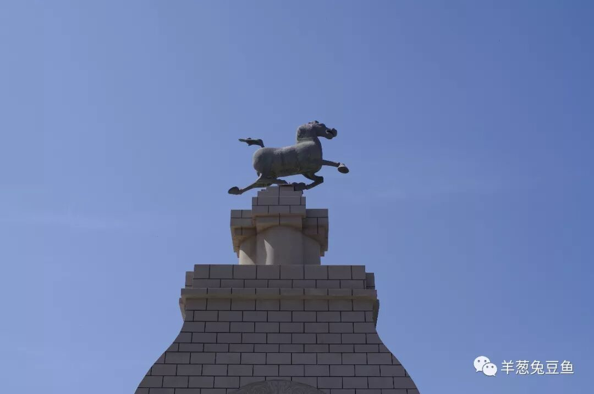

（马踏飞燕——中国优秀旅游城市标志）

近代武威遭受了两次大的浩劫，一是1927年的古浪大地震，二是52年前开始的“曲折十年”。两次浩劫的双重打击让这座曾经遍布文物古迹的千年古城失去了大量宝贵的文化财产，它的悠远历史只能交给烈日、大风、尘土和回荡在空气中的铁骑戎马之声来无力诉说。

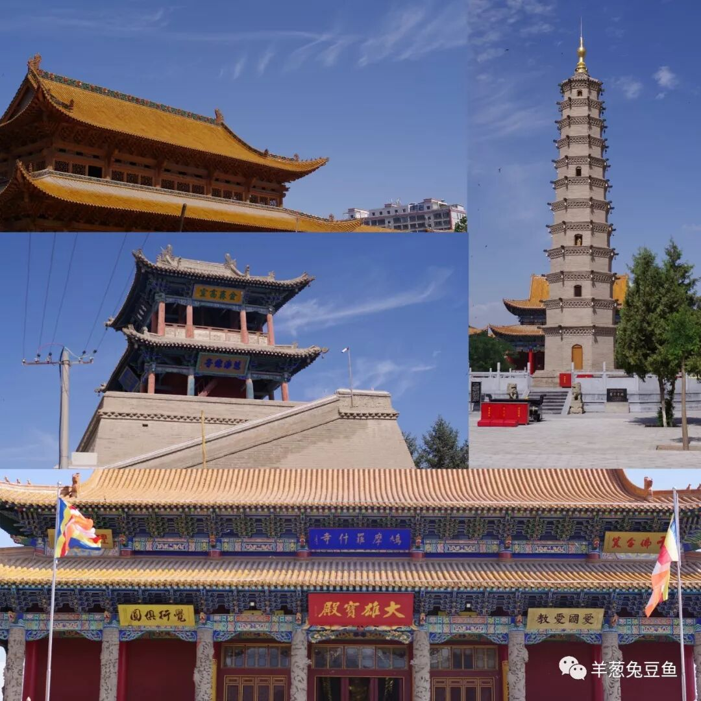

（武威市区仍保留的几处古迹，大多经过翻修）

就像武威这厚重的历史一般，他的吃食也绝不轻薄，甚至带上三分磅礴之气，往往令初访者啧啧称奇。今天，就与我来一探究竟。

（1）

三套车

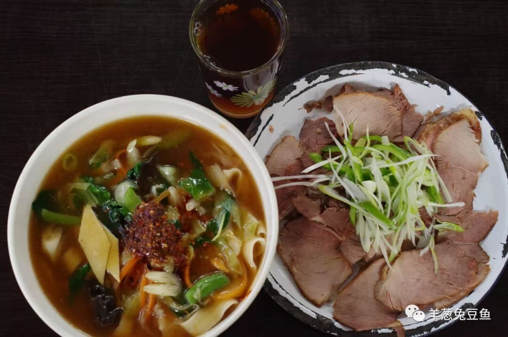

三套车是武威最负盛名的地方饮食，早已成为武威的舌尖名片。三套车有哪三套呢？一是行面，二是腊肉，三是茯茶。至于这三套车之名是从何而来，流传着不同的版本，若是感兴趣不妨自行搜索，我在此就不赘述了。

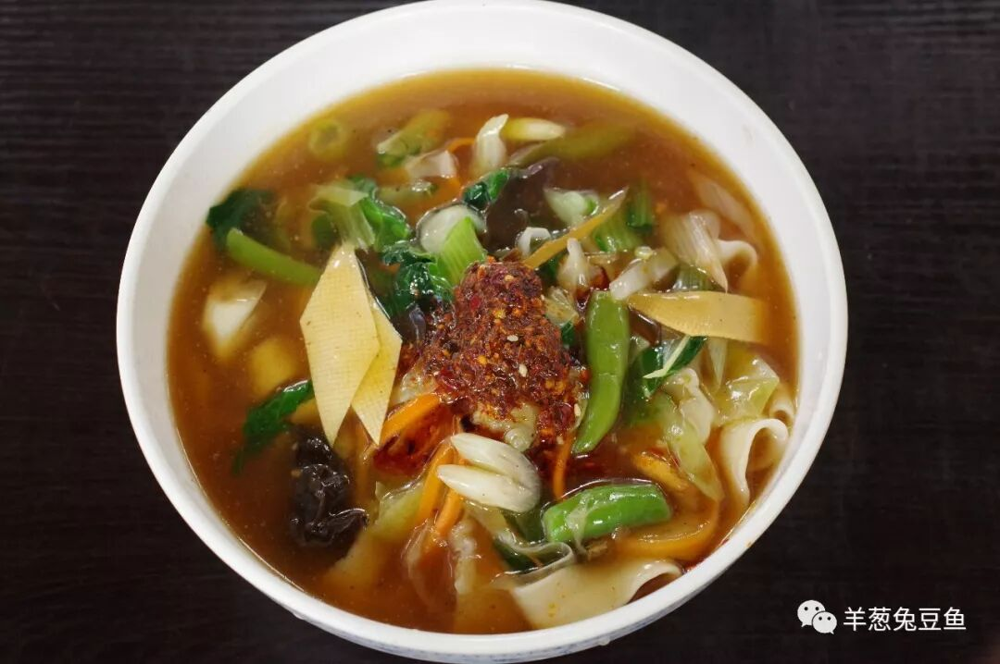

行面也作饧面，是武威最常见的面条，呈一厘米宽的长条状。三套车中的行面做法是打卤，用多种素菜制作的卤汁与面条充分地融合在一起，吃时面条绵软入味、各种素菜带来不同的口感与面条交织在一起，香、辣、酸、粘十分开胃顺口。

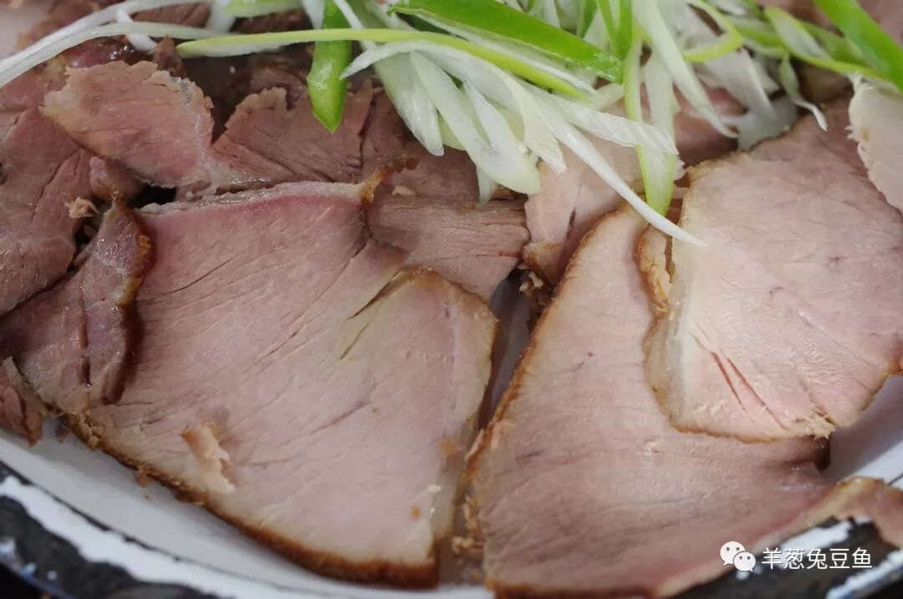

三套车中的腊肉也称卤肉，与陇西腊肉一样是卤制肉而非腌渍肉。腊肉几乎不见肥，瘦肉嫩而不柴，味道微咸，与浓稠的打卤行面配合反而起到了清口的作用。也可将腊肉蘸上卤汁，吃起来外滑内韧，滋味独特。

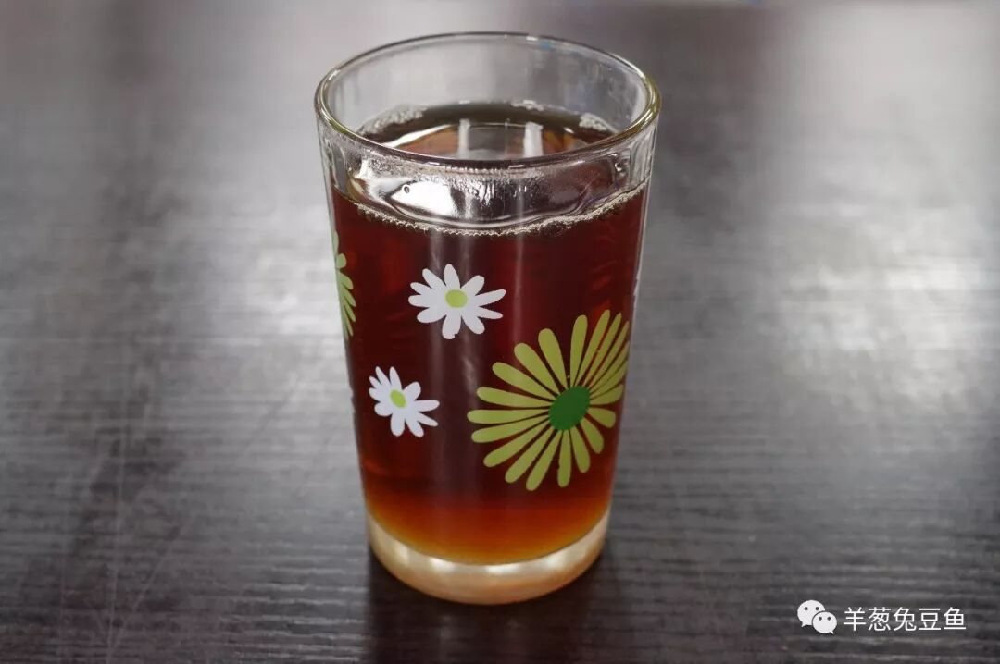

行面与腊肉均为咸口，多吃易口干，这时再来上一杯由砖茯茶、红枣、枸杞、冰糖、桂圆等材料熬制的茯茶，甘甜解渴、中和口腔之味，实在是完美的搭配。

这三套车，口味调和、营养搭配均衡，确是中式套餐中优秀的一个存在。

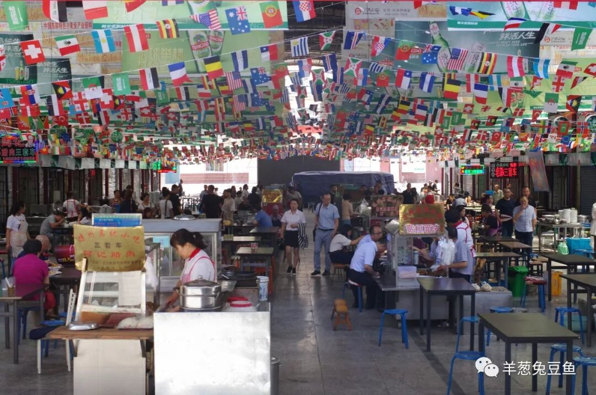

（武威北关市场，三套车的集中售卖地）

（2）

转百刀

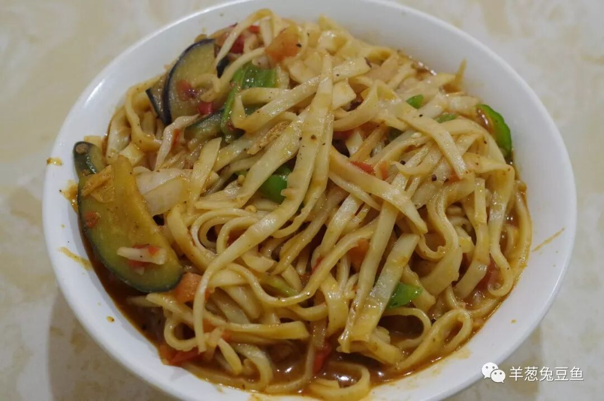

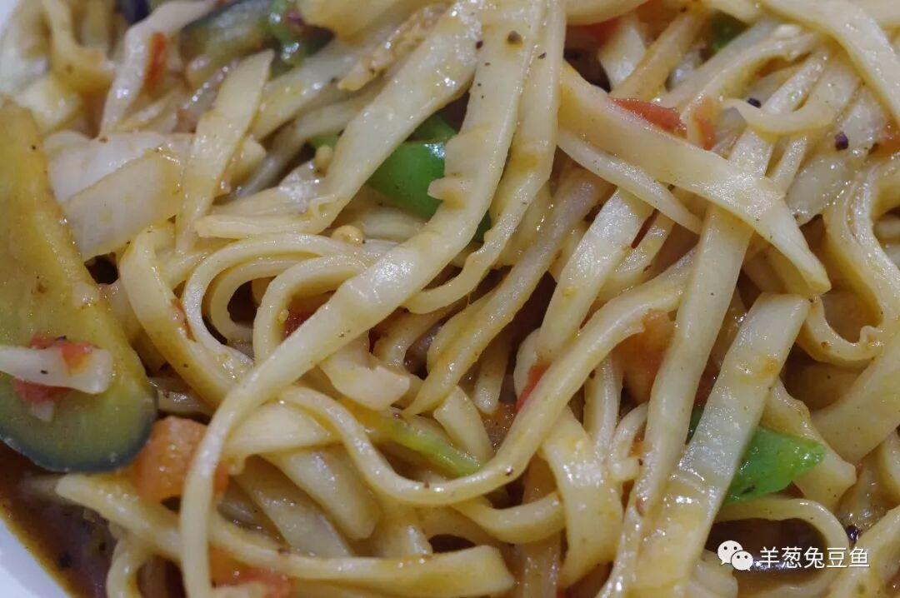

进入河西走廊后，面条的花样也开始增多，虽比不得山西的千变万化，河西走廊的这些花式面条，仍造就了其独特的饮食文化。对武威而言，最具特色的面条应该要数转百刀，其实这是个十分形象的名字，但仍需要说明一下，为此我做了下面这幅动图：

（圆是擀薄的面，蓝色横线代表切面方式）

这样切出来的面有一个典型特点，即两头窄、中间宽，且呈不规则形状。由于这种特殊形状，吃时的口感并不统一，会觉得忽宽忽窄、忽软忽硬，非常奇特。武威当地还有一种面叫拨鱼子，与转百刀形态上有类似之处，但制作方法不同，是用筷子拨出来的，也十分普遍。

（3）

牛肉菜面

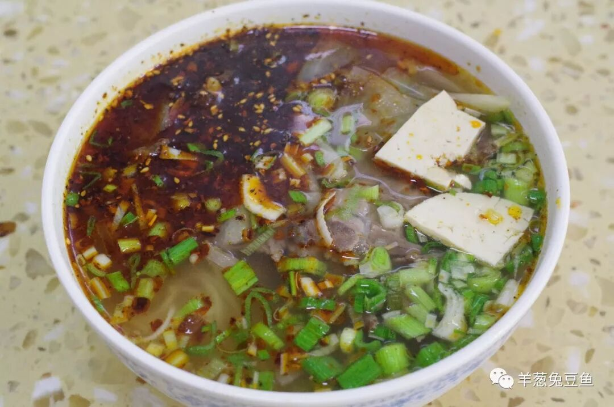

兰州牛肉面确实是很厉害的角色，武威的牛肉菜面即是从其改进而来。在主要的烹制方法上并无大的改动，牛肉菜面就体现在一个“菜”字上，不像兰州牛肉面中孤零零的白萝卜，武威牛肉菜面还会加入豆腐、豆角、凉粉等与之作伴。尽管这种改良看起来十分随便，但它确确实实取代了兰州牛肉面而成为武威人心中牛肉面的头牌。实际上，这种取代也是合情合理，它满足了人们对一碗主食提供更多食材、更多口感和更多营养的需求，而这种趋势在今天是不可逆的。

（4）

米汤油馓子

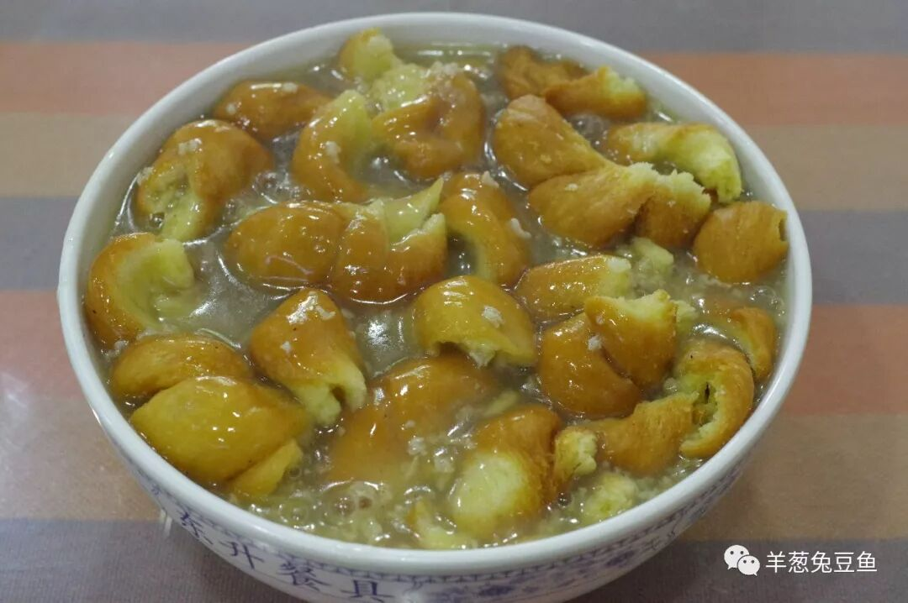

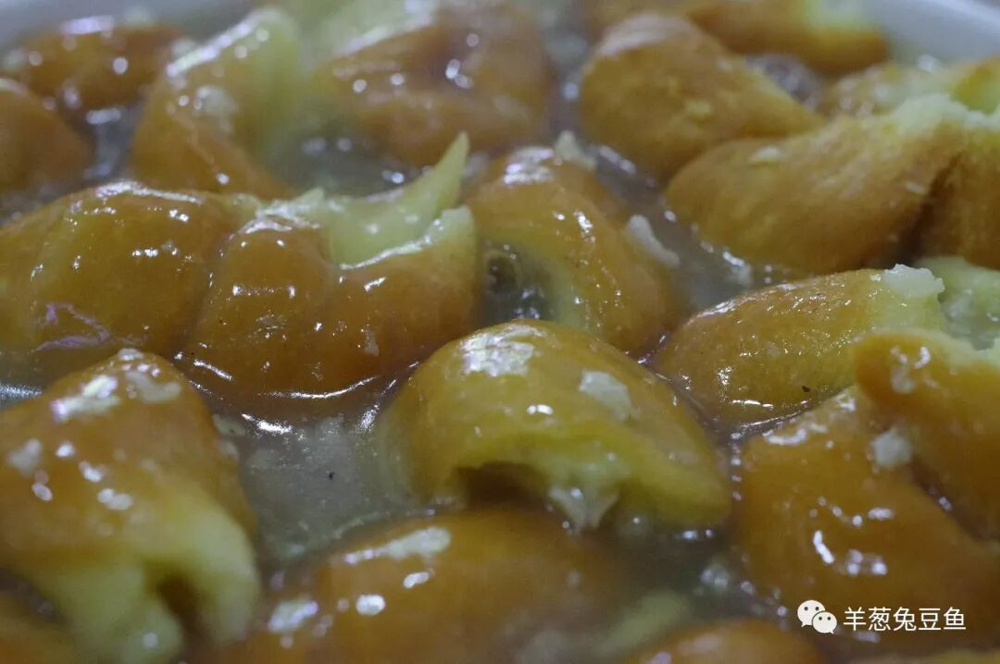

进入河西走廊后，还有一个明显的变化就是：菜量变大！当这用大海碗装得满满的米汤油馓子端上桌时，我还是悄悄咽了口受惊的唾液。

米汤油馓子是武威的一道著名早点，米汤使用武威当地的黄米熬制而成的糊汤，油馓子其实就是麻花。米汤滚烫、轻轻吸一口能感觉到非常明显的黄米香气，浸在其中的油馓子饱吸汤汁后表层变得粘软。真要是吃完这一整碗米汤油馓子，怕是只到下午都不用再吃饭了，实在是太实诚。

（5）

面皮子

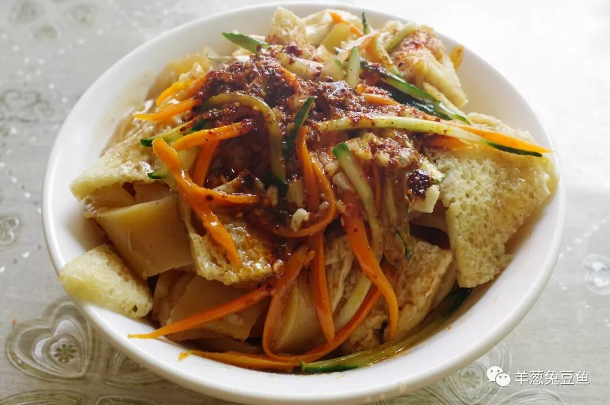

武威的面皮子算是河西面皮（酿皮）风味的代表，与陇上的兰州、天水等地不同，武威已经不再使用芝麻酱进行调味，面皮的酸辣味变得更加突出，这样的口味更加适合在炎炎夏日来上一碗，清爽生津。当然，与米汤油馓子类似，面皮子的分量较兰州已有了明显增大。

（6）

凉粉

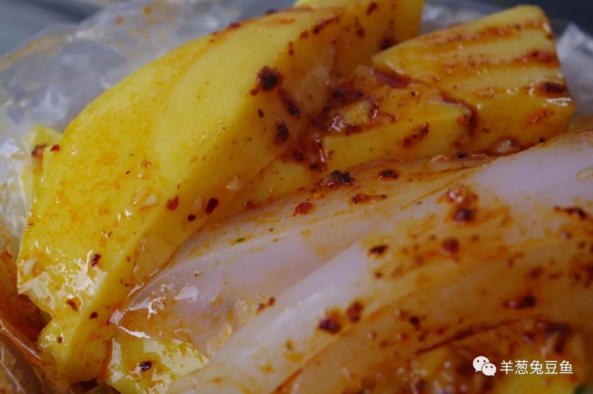

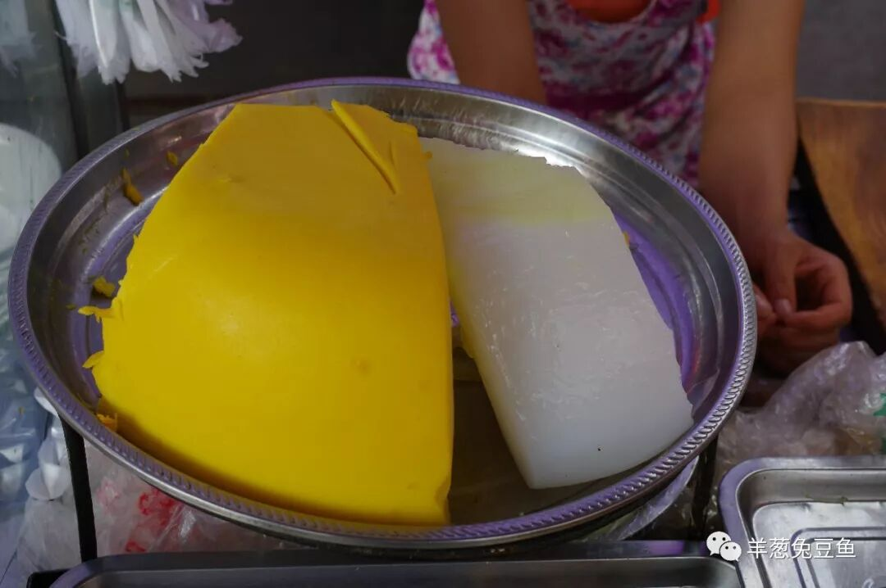

武威常见的凉粉有两种，一种是白凉粉，与其他地方的凉粉类似，另一种是黄粉，由豌豆粉制作而成（还有一种沙米凉粉，将在明天前往民勤县寻找）。这白凉粉倒中规中矩、无功无过，但这黄粉却有着从未品尝过的口感。虽能保持固体形状，入口即刻化为粉渣，并保留着浓郁的豌豆粉清香，绝对是非常值得一试的凉粉。

（7）

西凉姜饮

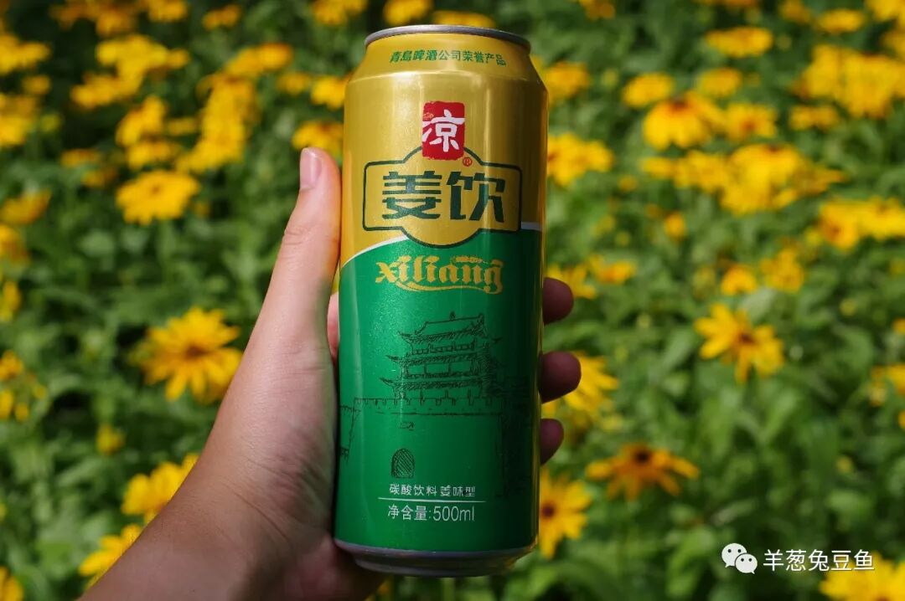

武威本土的姜味碳酸饮料，是具有浓郁地方特色的饮品，酸甜可口，酷暑难档之时来上一罐冰镇姜饮，那可叫一个通体舒畅。西凉品牌旗下还出产有西凉啤酒，是武威餐桌上的头号啤酒，这次未得尝试。

尽管酒越饮越暖，水越饮越寒，天天喝酒总不好，下次再同你举杯吧。

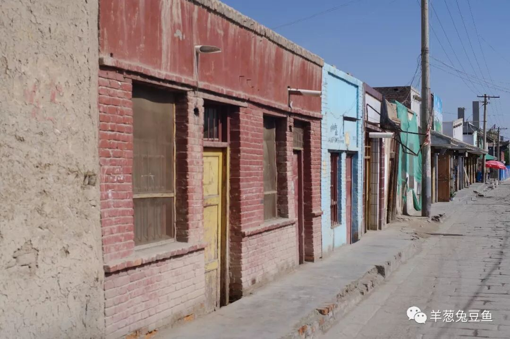

（武威老街区一景）

上一次来武威，已是六年前了，也是第一次。那时的武威给我的感觉是破败、荒凉、冷清。六年后再次到访，它也有了更繁华的街道，更便利的设施，更浓郁的生活气。

它的光辉历史已是过去式，今天的武威只在拼命地往上生长。我想，这些吃着如此有力量的食物的人们，有一天也许能再次把它推向辉煌。我希望能有这样一天。

毕竟，武威威武。

想知道我在做啥，请点击：吃货的决心——555天中国饮食探索之行

想知道我要去哪，请点击：555天行程计划（2018-06-20更新）

三套车，驾！

（长按识别二维码点击关注哦）

 var first_sceen__time = (+new Date()); if ("" == 1 && document.getElementById('js_content')) { document.getElementById('js_content').addEventListener("selectstart",function(e){ e.preventDefault(); }); }

 if ("0" == 1) { document.addEventListener("keydown",function(e){ if ((e.metaKey || e.ctrlKey) && (e.key === 'c' || e.key === 'C' || e.key === 'x' || e.key === 'X' || e.key === 'a' || e.key === 'A')) { if (e.target.tagName === 'INPUT' || e.target.tagName === 'TEXTAREA') { return; } e.preventDefault(); } }); document.addEventListener("copy",function(e){ var sel = window.getSelection(); var content = document.getElementById('js_content'); if (sel && sel.rangeCount > 0 && content && content.contains(sel.getRangeAt(0).commonAncestorContainer)) { e.preventDefault(); } }); }

预览时标签不可点

微信扫一扫

关注该公众号

知道了 (javascript:;)
