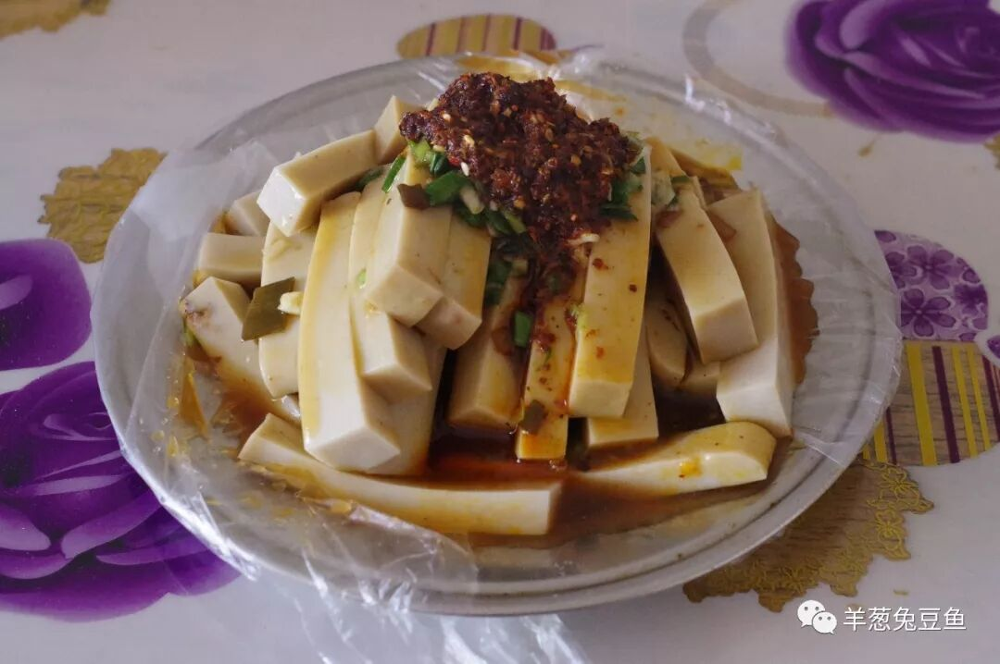
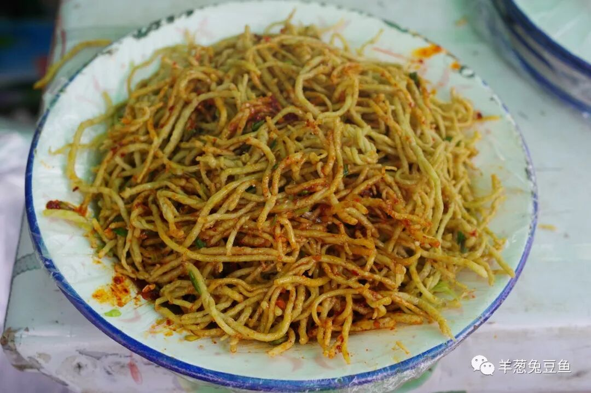
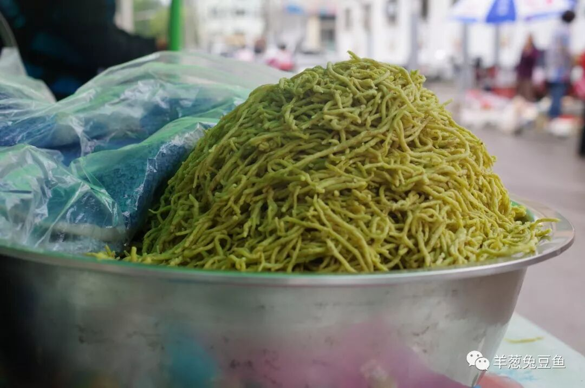
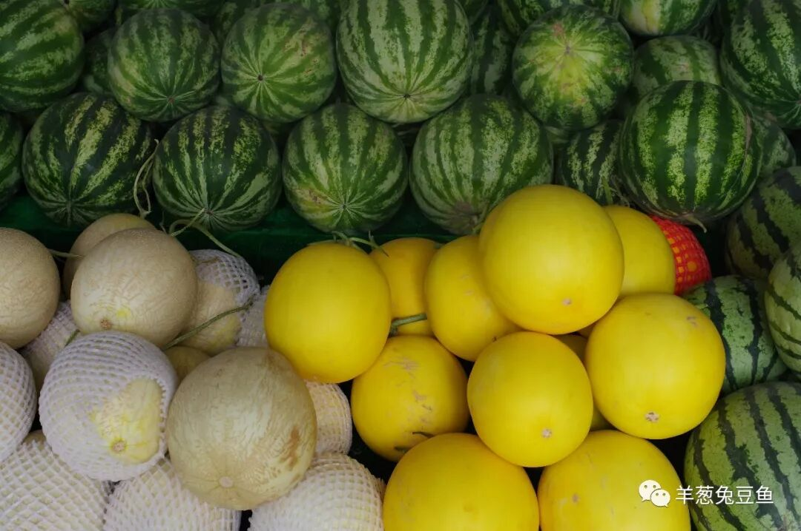
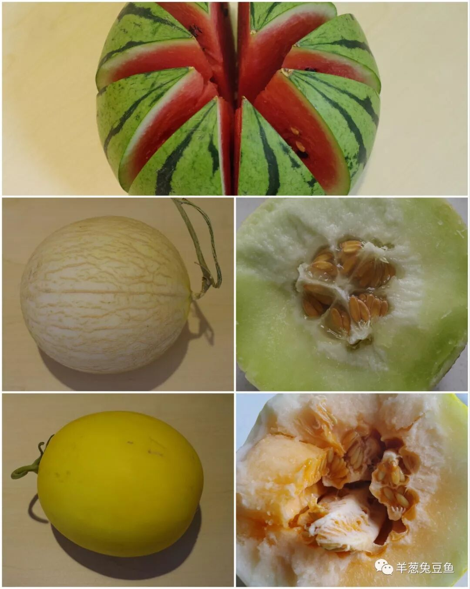

# 【第016天 武威·民勤】苏武牧羊处，今日瓜甜香

- 原文链接: https://mp.weixin.qq.com/s?__biz=MzA3MTM2Mjk3NA==&mid=2247503843&idx=1&sn=8c399d27d807f80b7e7713e755c3e538&chksm=9f2c3f12a85bb6044e581d451582b0a36a496f4b41bcbb0d267e12a6c278ebe203a7ba0e4013&scene=21
- 作者: 宇哥食行记
- 发布时间: 未知
- 图片数量: 8

明明是个年降水量100毫米的地方，却偏偏在我前往的这天下起了雨，不知是好运还是歹运，只觉空气里充盈着沙子被打湿后所散发出的那种味道。民勤处在河西走廊的东北部，西北东三面都被浩渺的沙漠所包围着，也常被叫作“沙乡”。谁能想象，当年的北海，就在这里呢？

（“决不能让民勤成为‘第二个罗布泊’”）

当中国的吃羊五省（新、青、甘、宁、蒙）在为到底哪里的羊肉最好争得火热之时，甘肃的这个小县已暗地里背上了“中国羊肉之乡”之名，这是官方对其的认可。因此在我计划行程时，觉得无论如何都必须亲自前往民勤，看看这“中国羊肉之乡”能把羊肉玩出什么花样。然而当我真正在民勤县城苦苦寻觅之后，却只发现了为数寥寥的几家烹饪羊肉的店，亦没有任何一家店打出“民勤羊肉”之类的招牌，再一回想一路走过的甘肃十几个城市，“靖远羊羔肉”“东乡手抓”“广河手抓”倒是频繁地露面了。

我不禁反问自己，这究竟是官方为了纪念中国史上最著名的“牧羊人”，而强行加给这座城市的名头？还是它确实默默出产着优质的羊肉，却懒得冠名而随它去也？今日我无法回答。但好在，除了羊，民勤还有其他。

（1）

沙米凉粉

沙米是一种生在生长在干旱沙漠中的植物所产的籽实，个头与小米一般大甚至比小米还小。将沙米磨成米浆放入锅中加热，冷却后即成沙米凉粉。

成型的沙米凉粉呈淡灰褐色，切成条状调入葱、蒜、辣椒、醋等调料即可。沙米凉粉入口微韧、一抿即化，并带有特殊的香气。这种香气十分接近豆腐干，但并不一样，吃在口中酸辣爽口，让人仿佛觉着在吃一种特制的超软豆腐干。

（2）

羊肉沙米面

在民勤，沙米与面一起烹饪是十分常见的做法，羊肉沙米面条在民勤街头十分常见。面的做法并无奇特之处，即传统的汤面做法，可用长面也可用面片，但加入一粒粒沙米散布在整碗面中，无疑增添了一层刺激口腔的颗粒口感。尤其是当端起碗喝下一口汤汁时，一粒粒沙米在口腔里忽然活灵活现、四处乱蹦，而你若想在碗里发现它们，则需要凑近仔细观察，毕竟，他们真的很小。

（3）

麦索

为什么一定要出发？为什么一定要亲自去发现？这就是一个很好的答案。无论是网络的信息还是我之前所笃信的，麦索都是一种在高原或接近高原的地区才会制作的食物。然而在民勤，它又出现了，以另一种姿态。以至于我问了小摊主两遍：“这是青稞做的吗？民勤也产青稞吗？”，得到的都是肯定的答复。

民勤的麦索搓得很细，像一般的拉面般细，也不在菜场上出售，而是推着小车在街边作为小吃叫卖。吃时直接抓起一大把放入盘中，撒上辣椒和醋，搅拌均匀干拌了吃。青稞的香依然浓烈，再加入酸辣之味就更加爽口，加之青稞的热量高，绝对是夏季良好的类主食小吃。

（4）

民勤的瓜

民勤在甘肃最大的名气，多半还是由它所出产的瓜所带来的，至少我六年前来到武威就已耳闻。地处荒漠地区，降水量少，昼夜温差大，对于瓜类水果来说积累糖分实在是绝佳。而比起新疆，民勤的位置要显著靠近中东部地区得多，出产的瓜也能以更低的物流成本被运输出去。

作为一个吃瓜群众，你有什么理由拒绝这“白菜价，白糖甜”的瓜呢？一个西瓜，一个香瓜，一个蜜瓜，真的只要20块钱。

（请不要吐槽不规则的形状，毕竟是徒手剖开的）

在民勤，酿皮和洋芋饼是另外两种十分常见的食物，售卖的小店比比皆是。但是由于今天把胃容量大都献给瓜去了，实在不得品尝。

这个身居在沙漠中的小县城，默默无闻，只有着人的平静生活与瓜果的年年飘香。也许一万个前往河西走廊旅行的人中，只有一个会到这里来打探一番，但这都不要紧。飞沙走石，耐寒的植物在荒漠戈壁中顽强的生长着，而这个小地方大概永远像它的名字一样，民勤。

（额外说一句：从武威到民勤的公路有一段非常像美国西部的荒漠公路，就是，很适合拍结婚照的那种。）

想知道我在做啥，请点击：吃货的决心——555天中国饮食探索之行

想知道我要去哪，请点击：555天行程计划（2018-06-20更新）

一日三瓜，肚涨梆梆

（长按识别二维码点击关注哦）

 var first_sceen__time = (+new Date()); if ("" == 1 && document.getElementById('js_content')) { document.getElementById('js_content').addEventListener("selectstart",function(e){ e.preventDefault(); }); }

 if ("0" == 1) { document.addEventListener("keydown",function(e){ if ((e.metaKey || e.ctrlKey) && (e.key === 'c' || e.key === 'C' || e.key === 'x' || e.key === 'X' || e.key === 'a' || e.key === 'A')) { if (e.target.tagName === 'INPUT' || e.target.tagName === 'TEXTAREA') { return; } e.preventDefault(); } }); document.addEventListener("copy",function(e){ var sel = window.getSelection(); var content = document.getElementById('js_content'); if (sel && sel.rangeCount > 0 && content && content.contains(sel.getRangeAt(0).commonAncestorContainer)) { e.preventDefault(); } }); }

预览时标签不可点

微信扫一扫

关注该公众号

知道了 (javascript:;)
