# 【第017天 金昌·永昌】杂碎与垫卷子子子子

- 原文链接: https://mp.weixin.qq.com/s?__biz=MzA3MTM2Mjk3NA==&mid=2247503842&idx=1&sn=de5d775ee78679df4e6d8b9e760284e2&chksm=9f2c3f13a85bb6054c43dfe85bcb185b149388f12bf5b4ba594ddefcf77e082b9e67aa5528ca&scene=21
- 作者: 宇哥食行记
- 发布时间: 未知
- 图片数量: 13

河西走廊的雨，下得让人心碎。这种心碎并非来自斜雨打、冷风吹，而是干旱如河西走廊之地，从来都不善于（也可能是懒）将自己准备得可以自如应对雨水的光临，一场南方人眼里的细雨，便可让城市面目全非，使行人前路崎岖。

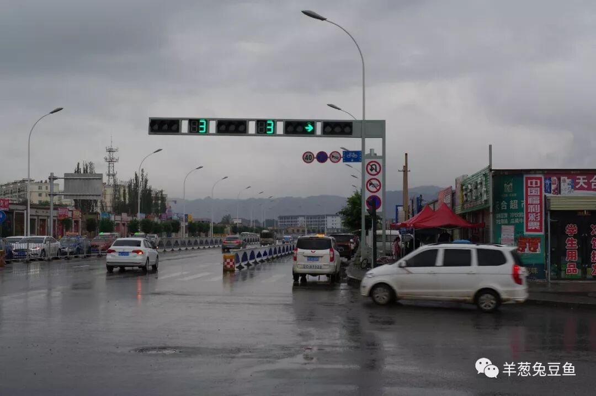

永昌是什么地方？左接金张掖，右临银武威，大多数人对河西走廊的了解往往也直接从武威跳至张掖，而留下永昌这个断层。尽管它的文明历史至少可以往前追溯2000年，如今其名气却敌不过建市仅三十多年的金昌市，一个因镍矿而兴起发展的资源型移民城市，确实令人唏嘘。

它的历史与文化积淀，只待以后再好好挖掘罢。今日，我只谈谈永昌的饮食。可能也是你难以想象的呢。

（1）

羊杂碎

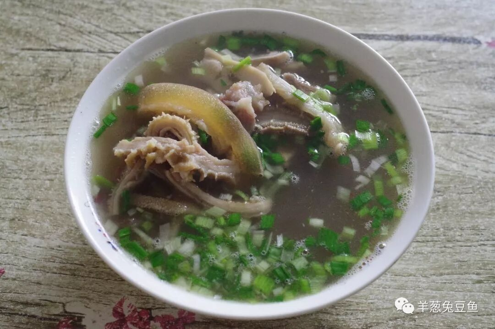

当你在兰州正宁路夜市吃了30块一碗的羊杂碎后，忍不住向四邻亲朋抱怨起这兰州的羊杂碎怎么怎么坑爹之时，兰州人无语，永昌人摇头。在甘肃，真的敢将羊杂碎捆绑上城市之名的地方，也仅永昌了。在这里，羊杂碎（以及牛杂碎）就是日常的早餐之选。由于靠近牧场，永昌县兴盛与羊相关的饮食也就不足为奇。

一碗滚烫的羊杂碎上桌，热气不断往上升腾。沿着碗边轻轻一吹，小心喝上一口，鲜香之味扩散开来。由于原材料的质量问题，在远离优质羊肉产区的地方所喝的羊杂汤往往带有浓烈的膻味，但在永昌，这是不会存在的事，只有肝、肚、筋、蹄的美妙口感加上那纯粹的鲜香。外国人很难理解中国人吃动物下水的心态，但若你并不拒绝这口，来永昌你定能爱上这口。

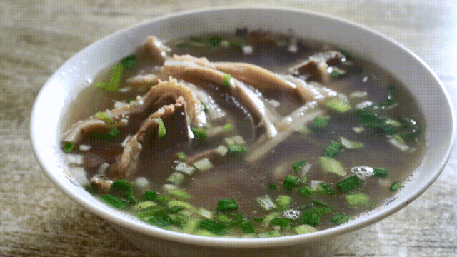

（冒着热气的羊杂碎）

（2）

羊肉垫卷子

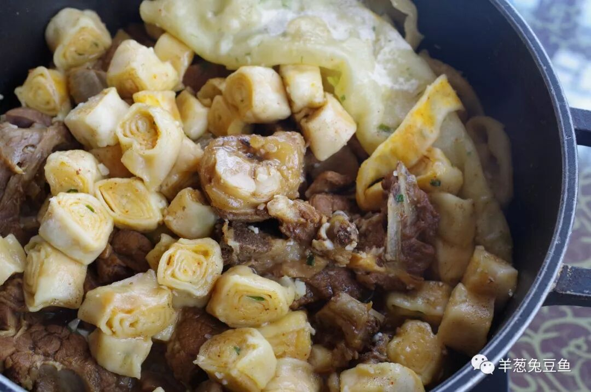

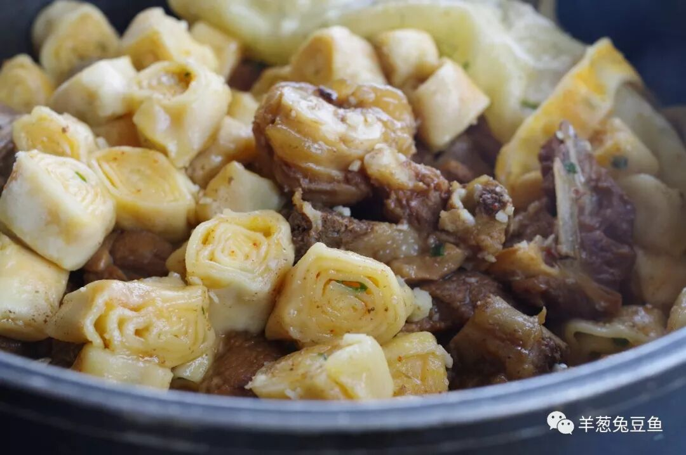

期待已久的西北硬菜之一，这就是只能在永昌及周边部分县市才能吃到的羊肉垫卷子。羊肉垫起卷子，卷子垫在羊肉之上，这菜名可以说取得简单直接。

羊肉垫卷子中的羊肉通常使用羊羔肉，而卷子则是面卷。羊肉与卷子在锅中不停地烧着，随着时间流逝，羊肉越来越入咸鲜之味却旧煮不老，羊肉的油汁不断渗入卷子中，让卷子也获得了越来越浓烈的羊肉香。一肉一面，每一口下去都是满满的饱足感，让人不禁幻想骑着骏马奔驰了三五十里后，前方一口大铁锅里烧着满满的羊肉与卷子，恨不得从马上跳下飞奔而去一吃而尽。

除羊肉垫卷子外，还能寻得羊肉垫饺子、鸡肉垫卷子（在张掖叫卷子鸡）等，算是一种变体，依然值得尝试。

（3）

面辣子

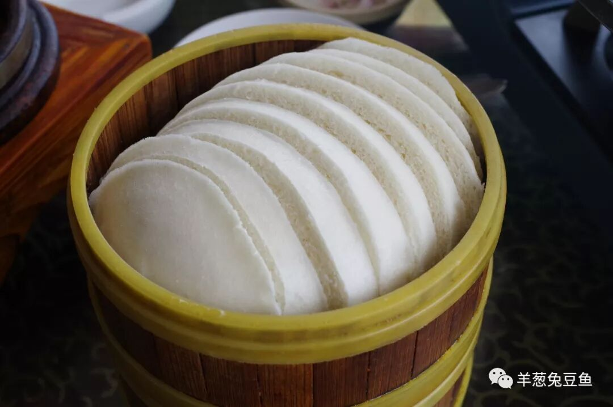

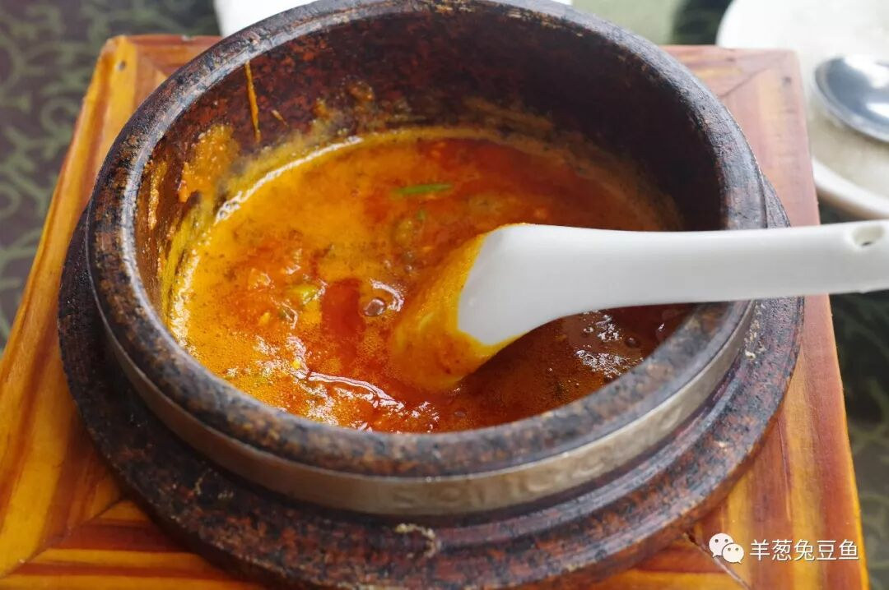

面辣子或许在陕西更加著名，但在甘肃永昌，其实也是具有多年历史的食物。所谓面辣子，指的是那碗用辣子、面粉、芝麻、蒜等搅成的辣子糊糊，常与馍馍同食。别看这绯红吓人的颜色，面辣子除了辣子本身的香以及面粉所带来的粉质口感外，并没有明显的辣味，大可以放心的将馍馍掰碎丢进面辣子中，或直接粗暴得舀起一大勺涂抹在馍片上。吃在口中，辣子的粉与馍馍的松软，辣子的香与馍馍的甜交相辉映，能激起人大口吃主食的欲望。不过，馍馍是面、辣子有面，让人极易饱腹，实在是西北饮食的典型特征啊。

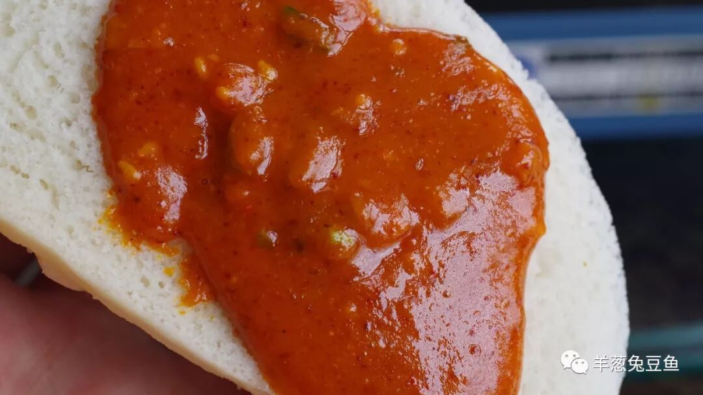

（真的不想来一口吗？）

（4）

卜拉子

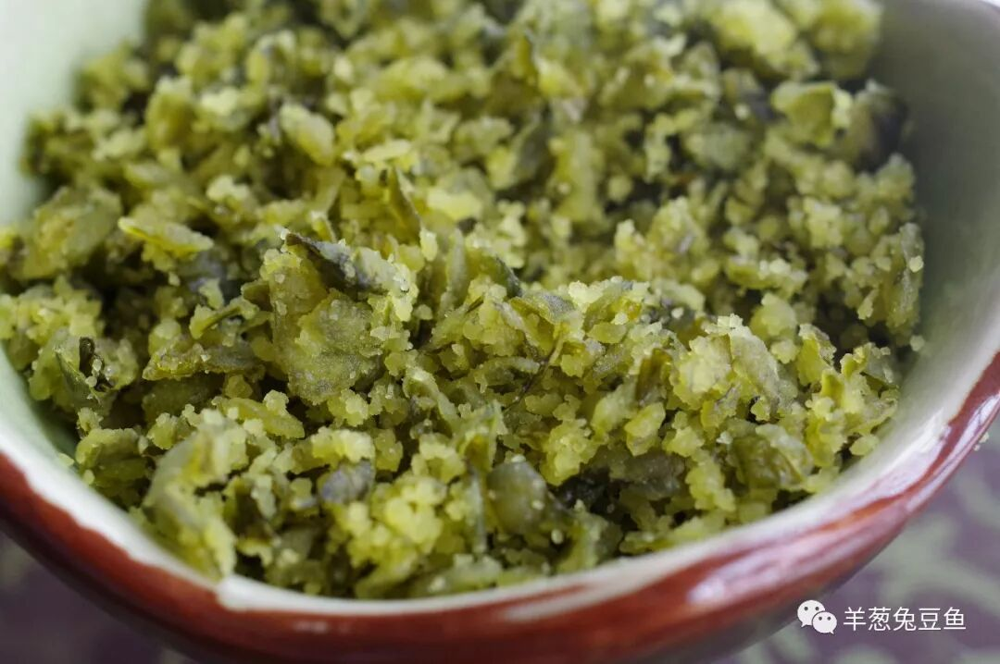

（香豆子卜拉子）

卜拉子是一类食物，而非某一种，可以使用多种蔬菜制作，如香豆、胡萝卜、榆钱等。制作方法也并不复杂，将原材料切成沫后与面粉搅拌上锅蒸熟即可，是以前农家常见的吃食。由于并未对原材料做过多处理，吃时具有浓郁的蔬菜原始香气，而面粉又增加柔韧和嚼劲，十分利口，当然也十分管饱、能提供充足的能量。

（5）

糖花子

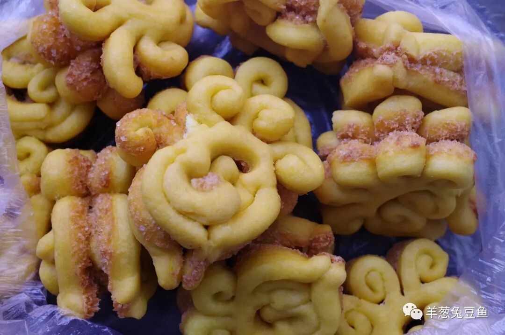

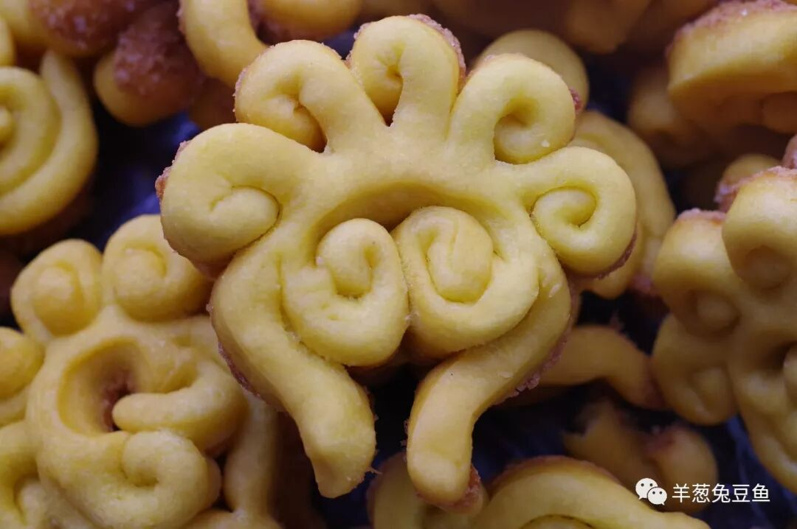

永昌的传统点心——糖花子。没有过于浮夸和过度修饰的外表，但也能轻易看出确是经过一双巧手的耐心制作，让人看着这可爱的形状不由得会心一笑。从味道上说，也依然拥有典型西北面点的特征，恰如其分的甜味，简单自然的清油香，初咬时酥脆，随着唾液的浸入而变得绵软。像这样的点心唤不起人的大喜大悲，却能在任何一个平常的时刻带给人平凡的滋润。

永昌的食物，总喜欢以“AB子”这样的格式命名，既让人觉得俏皮，又着实给这些食物蒙上了一层浅红色的面纱。你仿佛能看得清，又似乎看不清，但那魅惑的浅红色一直在对你轻声引诱着：“快来揭下我吧！快来揭下我吧！”。除了以上所呈现的几种，常见的还有漏鱼子、炕锅子（铁板猪杂）、面皮子等，鉴于胃容量和停留时间的限制，留到他日再入我虎口吧。

甘肃的城市总取些大气磅礴之名，正如永昌的永远昌盛之意。在今天看，这样的名字似乎有些名不符实，但谁知道将来呢？至少在吃食上，永昌绝非轻飘飘之地，倘若能以吃食作为引子而吸引你来到这祁连山下的小城，我的永昌之行也能博得满意而去了。

永昌啊永昌，你需要更多的目光与倾听。

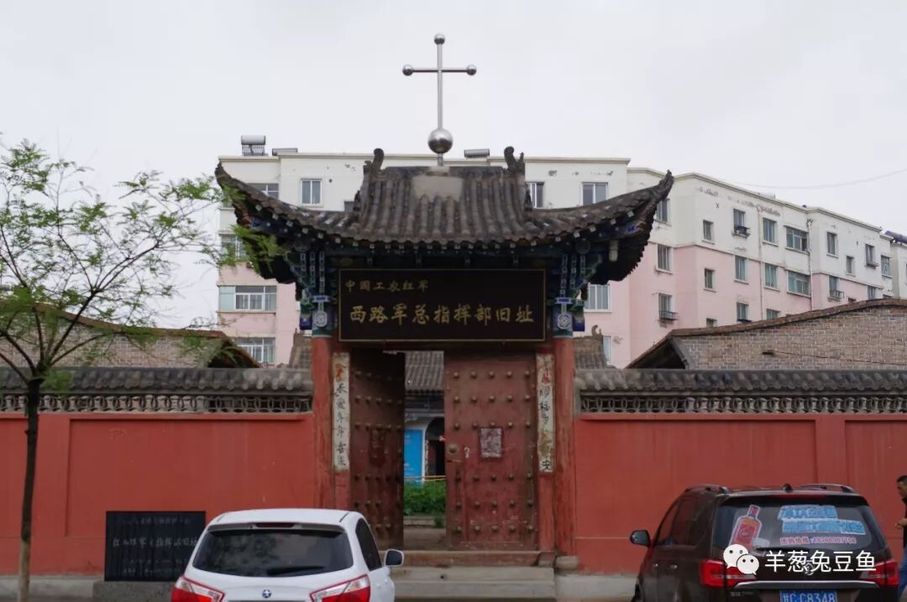

（西路军总指挥部旧址@永昌）

想知道我在做啥，请点击：吃货的决心——555天中国饮食探索之行

想知道我要去哪，请点击：555天行程计划（2018-06-20更新）

羊肉垫卷子，真心垫肚子

（长按识别二维码点击关注哦）

 var first_sceen__time = (+new Date()); if ("" == 1 && document.getElementById('js_content')) { document.getElementById('js_content').addEventListener("selectstart",function(e){ e.preventDefault(); }); }

 if ("0" == 1) { document.addEventListener("keydown",function(e){ if ((e.metaKey || e.ctrlKey) && (e.key === 'c' || e.key === 'C' || e.key === 'x' || e.key === 'X' || e.key === 'a' || e.key === 'A')) { if (e.target.tagName === 'INPUT' || e.target.tagName === 'TEXTAREA') { return; } e.preventDefault(); } }); document.addEventListener("copy",function(e){ var sel = window.getSelection(); var content = document.getElementById('js_content'); if (sel && sel.rangeCount > 0 && content && content.contains(sel.getRangeAt(0).commonAncestorContainer)) { e.preventDefault(); } }); }

预览时标签不可点

微信扫一扫

关注该公众号

知道了 (javascript:;)
