# 【第018天 张掖（一）】小饭炒炮面喷香

- 原文链接: https://mp.weixin.qq.com/s?__biz=MzA3MTM2Mjk3NA==&mid=2247503841&idx=1&sn=f00d98e682e81d8eb2335edc3160f9cc&chksm=9f2c3f10a85bb606d824209696028261dfc0be80c2831206b822443eab24702bc117b1d90251&scene=21
- 作者: 宇哥食行记
- 发布时间: 未知
- 图片数量: 15

金色的季节，金色的张掖。

昨晚入住酒店，与前台大妈聊起，我曾在六年前来过张掖，这次可算是故地重游。她兴奋地告诉我，那出去好好逛逛吧，张掖现在变化可大了。

变化是挺大的。曾经杂乱不堪的小吃街被改造成了在夜空下闪烁金光的美食市场，强行规划出的“明清街”“欧风街”貌似给这个古城又添了新风貌，那年7月街上三三两两的背包客如今也换作了扎堆出现的跨年龄大型旅行团。

可金张掖毕竟是金张掖，再怎么折腾，也掩盖不住它那耀眼的光。

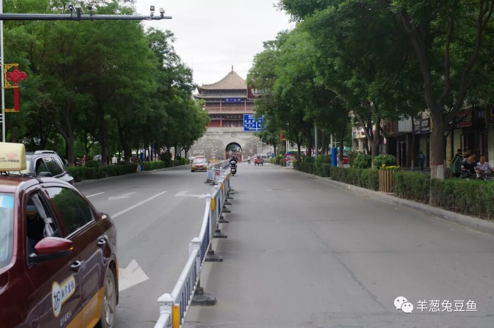

（镇远楼）

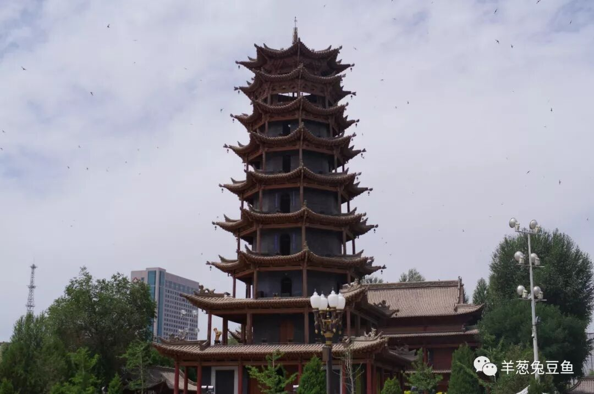

（木塔寺）

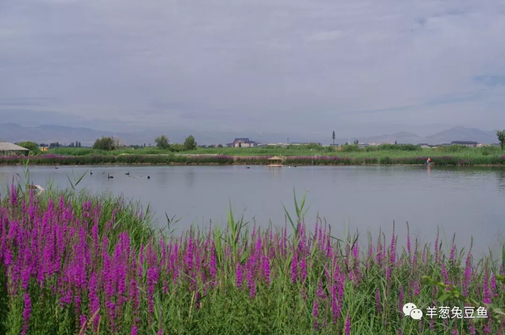

（张掖国家湿地公园）

在饮食上，张掖亦是有着独特而迷人色彩的地方。尽管大多是面食变换的花样，对游人而言，也值得用心探索一番了。我将用两天，即两篇图文，来为你呈现这甘州饮食。（甘州是张掖旧称）

（1）

牛肉小饭

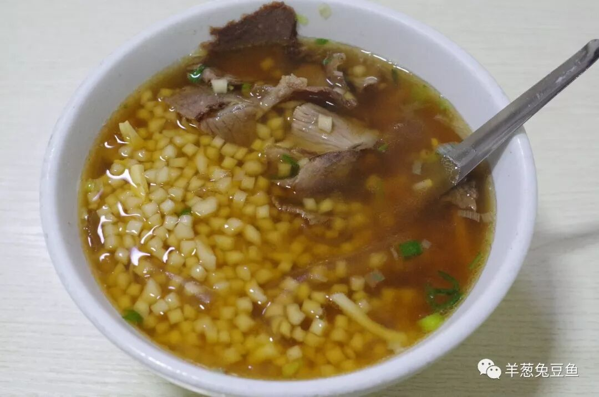

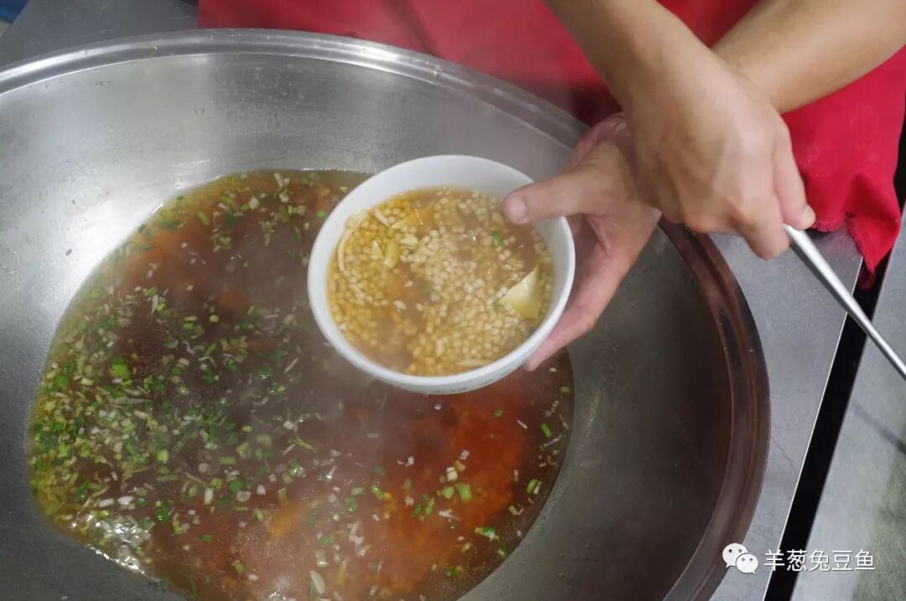

如果没有亲自见过并品尝过，大概永远也想不到小饭到底为何物。张掖的小饭其实就是切成小指甲盖大小的面丁，在锅中或碗中粒粒分明、油光发亮。

牛肉小饭是张掖人的日常早点之一，店家往往在店门口支起一口大锅，小饭在滚烫的骨汤中保持着温度。有客人点餐时，店家拿起碗，用大铁勺舀上小饭与汤，再勾出几块卤牛肉铺于其上，就是一碗牛肉小饭。吃时骨汤咸香味浓，一粒粒小饭在嘴中肆意流窜，当你的牙齿抓住几个逃兵咬下之时，依然有明显的劲道之感，而偶尔出现其中的粉皮，又给小饭增加了一丝爽滑之感。

由于小饭的既吃感与汤饭十分类似，很容易“囫囵吞枣”、不加咀嚼就统统咽下，那紧致的面疙瘩可并不好消化，吃的时候定要细嚼慢咽哪。

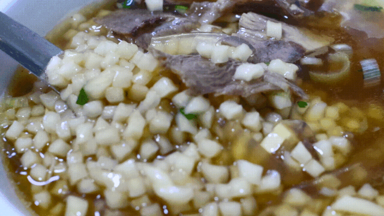

（2）

羊肉粉皮面筋

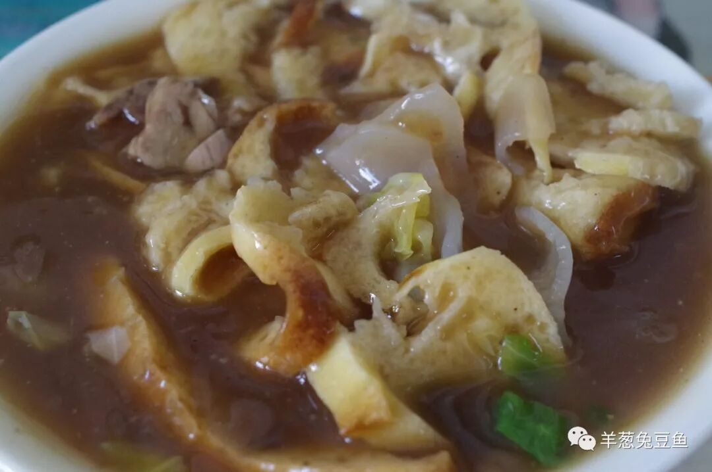

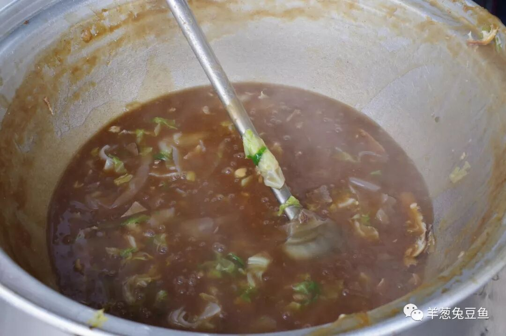

与小饭相比，羊肉粉皮面筋不那么普遍，但仍是张掖的日常早点选择之一。卖粉皮面筋的店家依然会在店门口放一口大锅，将羊肉、粉皮、包菜等组成的大杂烩糊糊咕噜咕噜加热给食客看，要吃之时丢几块面筋下锅，再用勺子连同糊糊一起盛入碗中。

要谈卖相，这羊肉粉皮面筋可以说是一无是处。但若论滋味，只有亲自尝过方可明其中美妙。羊肉的鲜韧、粉皮的滑嫩、包菜的爽脆，再加上充满胡椒香气的糊汁与吸饱了糊汁的面筋，口感的丰富度无与伦比，吃后迅速饱腹而身体发汗发热，完全算得上一碗顶好的早餐。

（3）

炒炮

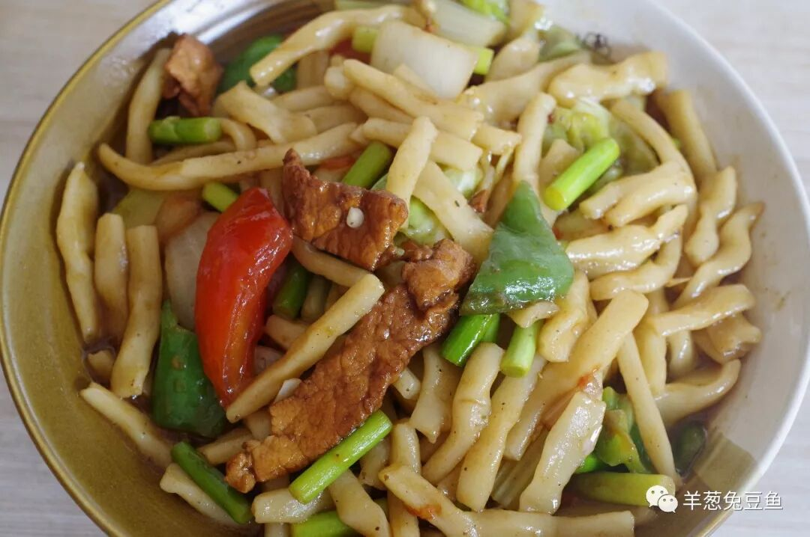

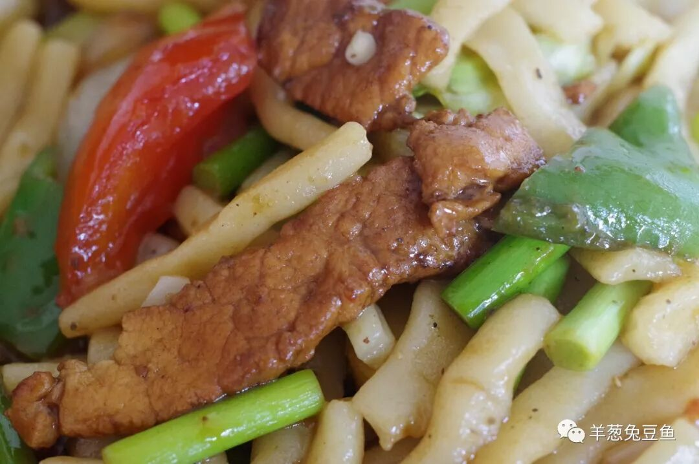

炒炮乃炒炮仗子的简称，但即便如此，你大概仍不知道这究竟是什么。其实炮仗子就是一种形态的面，因其形如炮仗而得名。炒炮是张掖当地的最常见主食之一，与西北地区常见的炒面在做法和最终呈现的口感上无太大差异，咸香的汤汁与劲韧的炮仗搭配得正好，同时也有荤有素，是典型的“一碗主食”应该具有的姿态。

（4）

搓鱼子

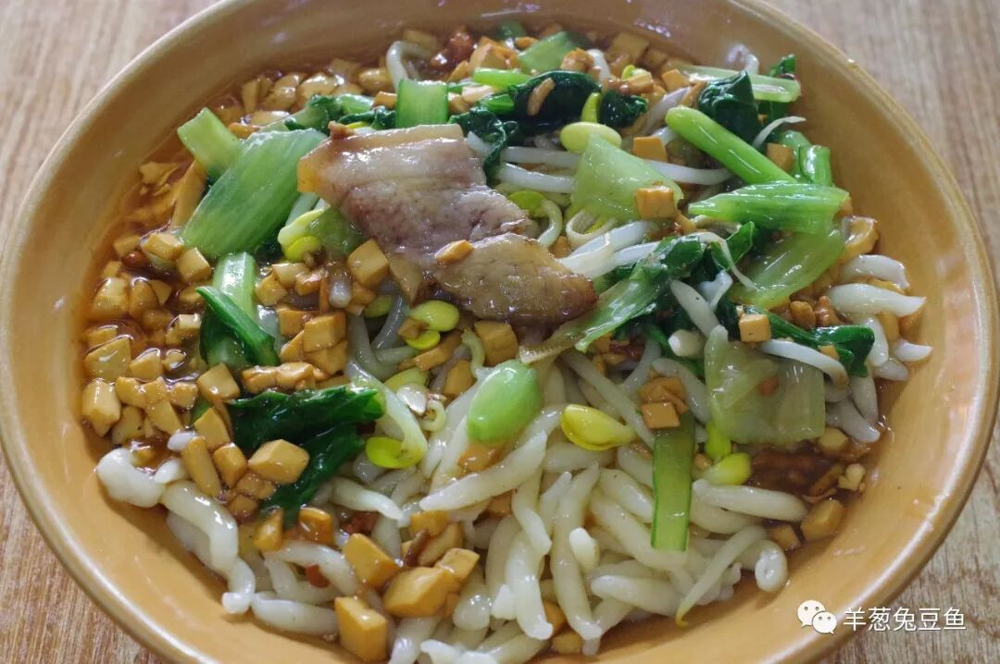

与炮仗子一样，搓鱼子也对应了一种面型，即两头窄中间款像一条小鱼儿一样。张掖的搓鱼子与武威的拨鱼子在形态上类似，但做法并不相同。搓鱼子较为通常的吃法是“拌”，即将汤汁或卤汁直接倒在煮好的面上。与炮仗子相比，搓鱼子个头更小，且得益于其两头窄的形状，吃起来十分顺滑爽口。

在张掖，面条的形态变化自然不止这两种，还有拉条子、揪片子、鸡肠子、槐耳子、香头子、烧壳子、糍耳子、面蛋子等，名字都十分俏皮可爱，又是各种“AB子”式的名字。不过，在街市上常见的，仍只有炮仗子和搓鱼子。据说，会不会做这些邢台千变万化的面食，是张掖的婆家考察儿媳妇是否合格的重要标准之一呢。

（5）

炒拨拉

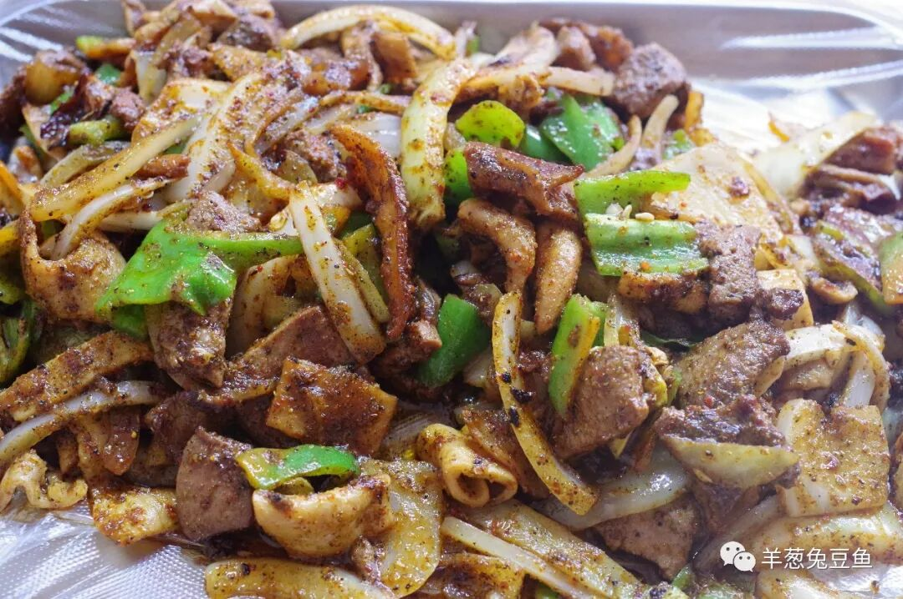

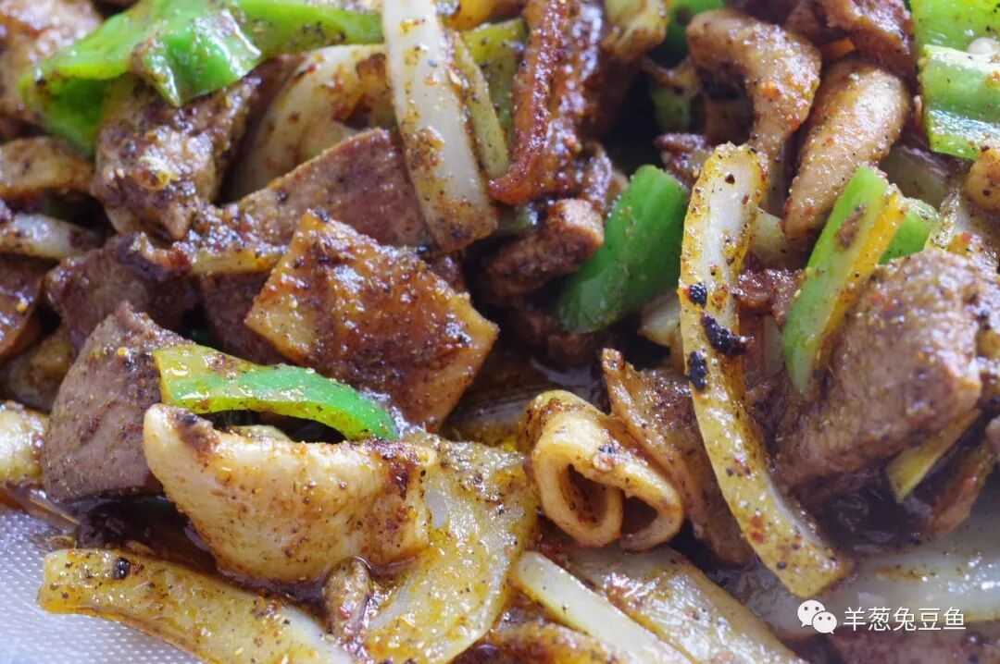

炒拨拉起源自张掖山丹县，是当地极负盛名的街头小食。若为方便理解，可以讲炒拨拉解释成铁板羊杂。只不过这铁板是圆形的铁鏊子，与摊煎饼的类似。

张掖靠近优质羊肉产区，这炒拨拉中的心、肝、肚、肠等全无膻味，只有这麻辣油香、及之下的羊杂鲜味。口味较轻的人，吃上两口炒拨拉，难免会觉得油盐略重，不妨来一瓶西凉姜饮或啤酒清清口；但若你是来自西南等口味偏重的地区，相信我，这盘炒拨拉你一定会吃得连一块青椒都不剩。

河西走廊的食物，本就量大而厚重，这张掖之饮食也不例外。今日所呈现的5种食物，是甘州街头极易寻得的物美价廉之物，也定是你来到张掖不愿错过之物。明天，我将带来张掖的其他吃食，有的更硬，而有的，则是甜蜜。

晚安，金张掖。

想知道我在做啥，请点击：吃货的决心——555天中国饮食探索之行

想知道我要去哪，请点击：555天行程计划（2018-06-20更新）

炒拨拉没吃够怎么破啊？

（长按识别二维码点击关注哦）

 var first_sceen__time = (+new Date()); if ("" == 1 && document.getElementById('js_content')) { document.getElementById('js_content').addEventListener("selectstart",function(e){ e.preventDefault(); }); }

 if ("0" == 1) { document.addEventListener("keydown",function(e){ if ((e.metaKey || e.ctrlKey) && (e.key === 'c' || e.key === 'C' || e.key === 'x' || e.key === 'X' || e.key === 'a' || e.key === 'A')) { if (e.target.tagName === 'INPUT' || e.target.tagName === 'TEXTAREA') { return; } e.preventDefault(); } }); document.addEventListener("copy",function(e){ var sel = window.getSelection(); var content = document.getElementById('js_content'); if (sel && sel.rangeCount > 0 && content && content.contains(sel.getRangeAt(0).commonAncestorContainer)) { e.preventDefault(); } }); }

预览时标签不可点

微信扫一扫

关注该公众号

知道了 (javascript:;)
