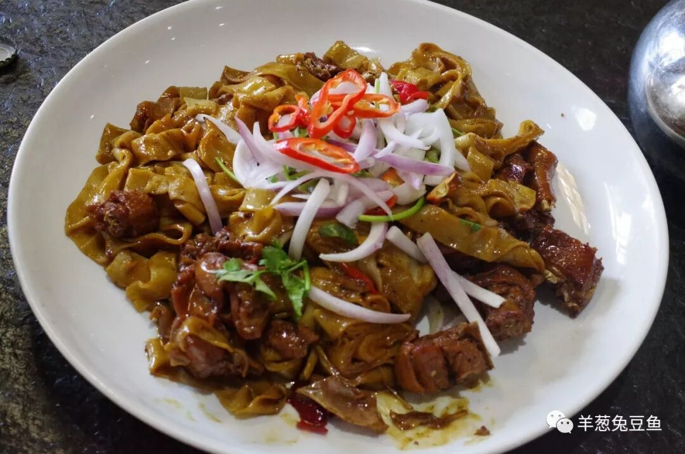
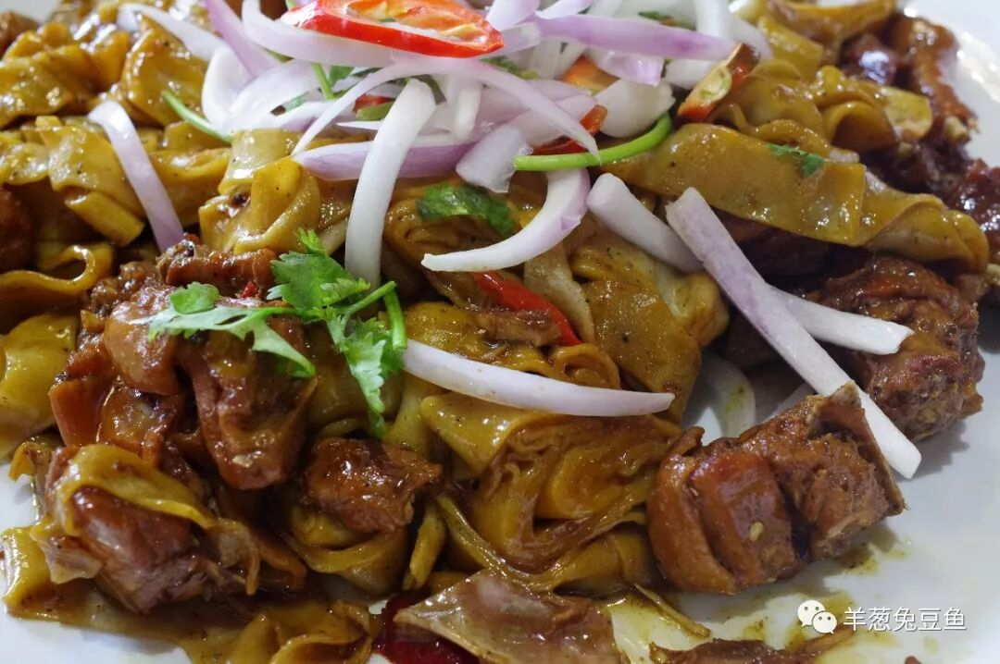
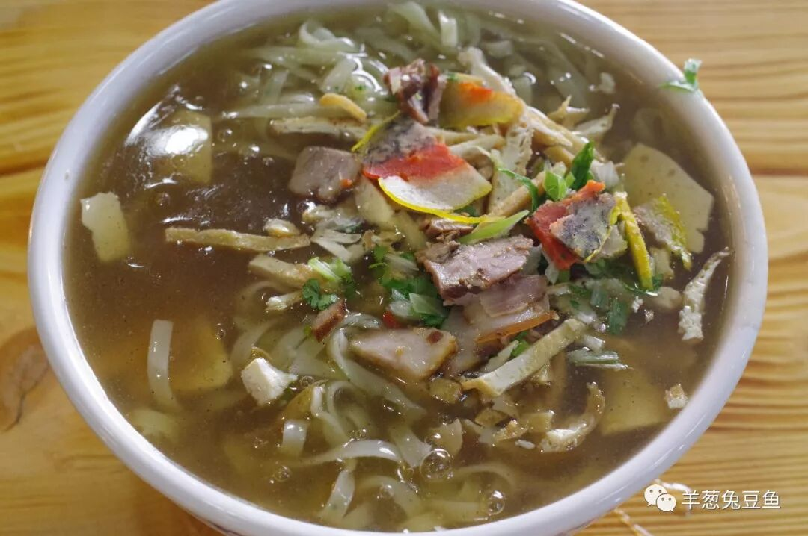
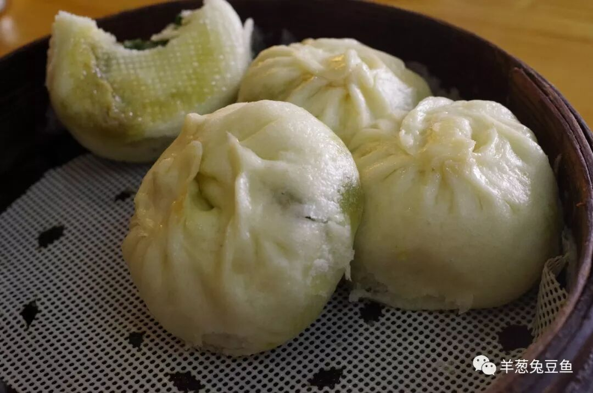
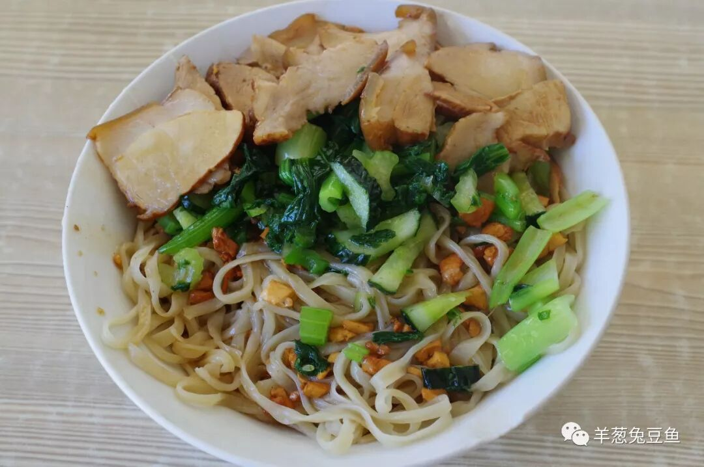
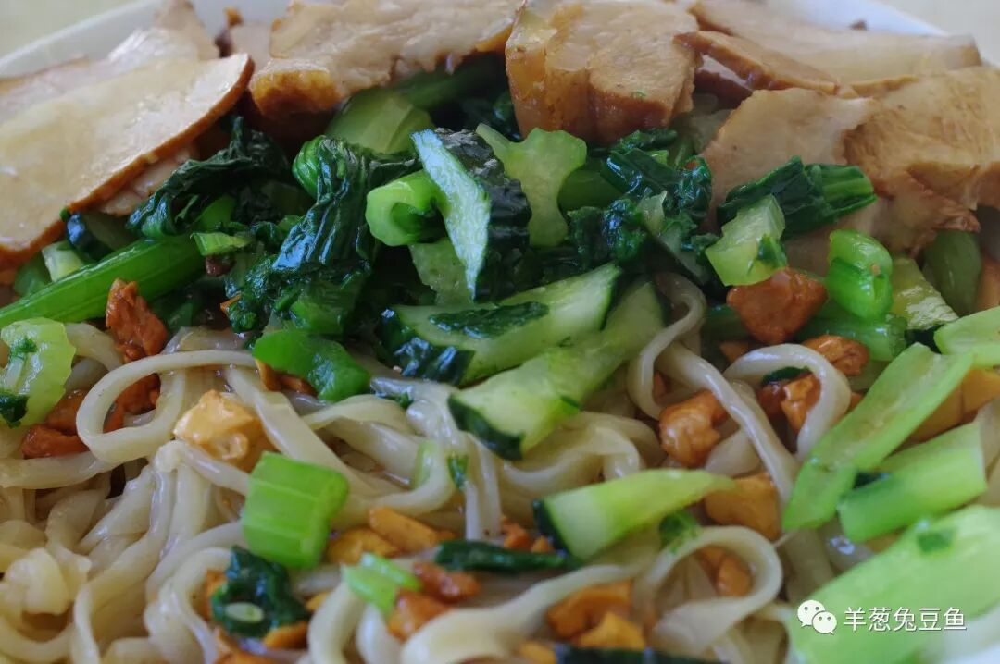
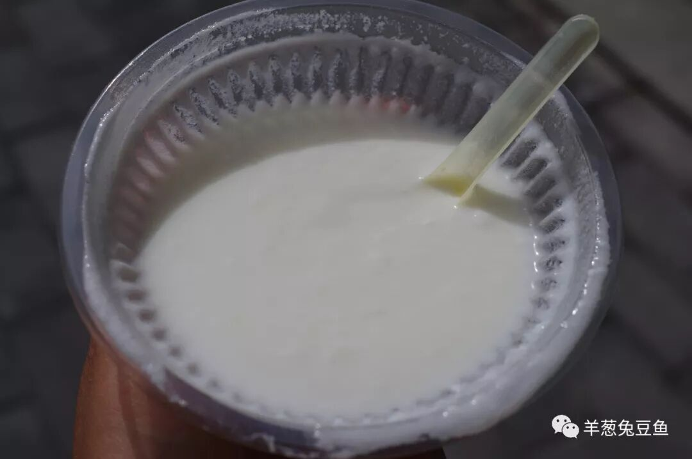
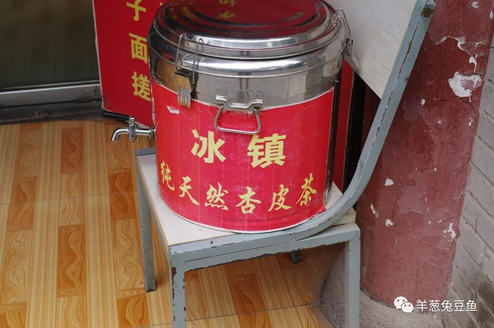

# 【第019天 张掖（二）】卷子鸡与杏皮茶的咸甜印记

- 原文链接: https://mp.weixin.qq.com/s?__biz=MzA3MTM2Mjk3NA==&mid=2247503840&idx=1&sn=c797c9a9f23fa27161fdd9e8d203b302&chksm=9f2c3f11a85bb607ad4b2a14656140c7bf9bfd87d2a3412700ee77d6e2b6e0657f2ca455e586&scene=21
- 作者: 宇哥食行记
- 发布时间: 未知
- 图片数量: 11

在河西走廊，唤醒我的是干燥的风、是湛蓝的天、是低压的云，闹钟成了无作用的存在。

昨日的面香仍残留身内，蠢蠢欲动的胃又忍不住要去寻找新的猎物了。这是我在张掖的第二天，这是我与甘州饮食的更深入触碰。

（1）

卷子鸡

这是无可争议的张掖硬菜第一代表。我一直以为卷子鸡是羊肉垫卷子的孪生兄弟，真正见到后我更愿意相信它是张掖版的大盘鸡。至于究竟有多大，这么说吧，旁边一桌四个人吃了个中盘，我一个人吃了个小盘，大概就是这么大。

咸香微辣而入味的鸡块，肉质韧而不柴。面卷子顺滑劲道，裹卷着鸡肉的香，即使是单吃面卷仍是上好的口味。西北人的豪放与不拘一格，完完全全地投射在了这一盘油光发亮的卷子鸡上。在吃完这一整盘的瞬间，我仿佛以为自己就是半个西北人了，在这天地辽阔之间，快意吃喝。

（2）

臊面

比之小饭与粉皮面筋，臊面是张掖街头分布更加密集的早点。臊面之名无疑让人联想起臊子面，唯亲眼见后才知其与臊子面可谓天壤之别。

臊面勾着浓稠的芡糊汤汁，咸香微辣。面条很薄，呈现出了与炮仗子搓鱼子截然不同的软糯之感，容易咀嚼也容易消化。面上撒着肉片、面筋片、豆腐片等，具有非典型的“臊子”形状。吃前将面条拌匀，将挂满汤汁的面条送入口中，顿觉精神饱满、身体温润，能毫不费力的唤醒新的一天。

当地人常将臊面与包子（韭菜馅最为常见）同食，俨然成了一顿量大管饱的早点。

（3）

灰碱面

灰碱面是张掖面食家族中的又一成员，因和面时加入灰碱而得名，与兰州的蓬灰面有异曲同工之妙。因灰碱的加入，面条变得韧劲十足、弹力劲道，与卤汁相拌再配上一定的荤素菜，就成为了张掖餐桌上的日常主食选择之一。

谈到这里，不得不感慨张掖人对于一日三餐安排的合理性，早点之如粉皮面筋臊面等，容易消化而温暖身体，食后让人焕发活力；而正餐之如炒炮灰碱面，荤素皆有，面条量足，既提供三餐中最多的能量，也不失西北人对面条爽滑劲道口感的永恒追求。

（4）

马场酸奶

得益于山丹军马场的存在，张掖成为了非高原地区能够获得优质奶源的少量城市之一。在张掖市区，常能看见售卖马场酸奶的小店或推车小贩，若是遇上，可千万别错过。由于酸奶的奶质优良，张掖的酸奶同高原的酸奶一样，食用时需要撒上大量的白糖以中和其中的酸味。不要惊慌，因为那酸甜之味，刚刚好。

（5）

杏皮茶

张掖的杏皮茶，在我的心目中是甘肃最好的。我永远都记得2012年的夏天，在中心广场旁的小摊上喝的那杯两块钱的杏皮茶。因为那杯杏皮茶，2012年的我在完成甘肃之行后，只记得兰州牛大和这一碗简单而泛着纯粹果香的酸甜。

今天的张掖街头已大变了模样，推着小车卖的杏皮茶也无迹可寻了，不过仍能在美食广场或社区市场中寻到其踪影。虽然每家的味道不尽相同，但这依然解不了那年夏天被杏皮茶种下的毒。这毒有多深呢？大概就是在张掖呆两天却喝了六杯杏皮茶那么深吧。

如果北上也有此物，我大概愿意一辈子不喝咖啡奶茶呢。

两天时间，我相信我已尽量完整地呈现了张掖之饮食，而如酿皮粉鱼之类，在张掖依然十分普遍，但算不上地方独有，反复尝试意义不大。

如果要写一封给张掖的情书，或许少则三五千字。无论是它的秀色，还是它的可餐，都是当年的我与今天的我意识中抹不去的美好印记。遗憾的是，两次都很匆匆，顾不得更多看它几眼。

不过聚散就如同祸福之相依相变，有一天我会归来的，像游子归乡的那般。

张国臂掖，以通西域。夕日甘州，今日梦州。

（土塔寺）

想知道我在做啥，请点击：吃货的决心——555天中国饮食探索之行

想知道我要去哪，请点击：555天行程计划（2018-06-20更新）

老板，再来一盘卷子鸡。

我开玩笑的。

（长按识别二维码点击关注哦）

 var first_sceen__time = (+new Date()); if ("" == 1 && document.getElementById('js_content')) { document.getElementById('js_content').addEventListener("selectstart",function(e){ e.preventDefault(); }); }

 if ("0" == 1) { document.addEventListener("keydown",function(e){ if ((e.metaKey || e.ctrlKey) && (e.key === 'c' || e.key === 'C' || e.key === 'x' || e.key === 'X' || e.key === 'a' || e.key === 'A')) { if (e.target.tagName === 'INPUT' || e.target.tagName === 'TEXTAREA') { return; } e.preventDefault(); } }); document.addEventListener("copy",function(e){ var sel = window.getSelection(); var content = document.getElementById('js_content'); if (sel && sel.rangeCount > 0 && content && content.contains(sel.getRangeAt(0).commonAncestorContainer)) { e.preventDefault(); } }); }

预览时标签不可点

微信扫一扫

关注该公众号

知道了 (javascript:;)
