# 【第020天 酒泉·敦煌】醉在沙州肉与果

- 原文链接: https://mp.weixin.qq.com/s?__biz=MzA3MTM2Mjk3NA==&mid=2247503839&idx=1&sn=9246624f7501657dc593176c40ee7094&chksm=9f2c3f2ea85bb638f4f8dc89c0f17a79adfba3194e7ae1fc2c29882ab1cc73997adc2bce958d&scene=21
- 作者: 宇哥食行记
- 发布时间: 未知
- 图片数量: 14

黄沙绵延无穷远，莫忘沙州近眼前。

敦煌，是大量游人来甘肃的第一个理由。它有太多的胜迹，有太多的历史，有太多的心酸，也有太多的甘甜。

而无论你是为莫高窟而来，为鸣沙山而来，为月牙泉而来，还是为玉门关而来，留恋于大漠的苍凉或悲壮之余，敦煌绝不让你只得视觉圆满、留下味觉空乏而归。舌尖之上的敦煌，仍不失辉煌。

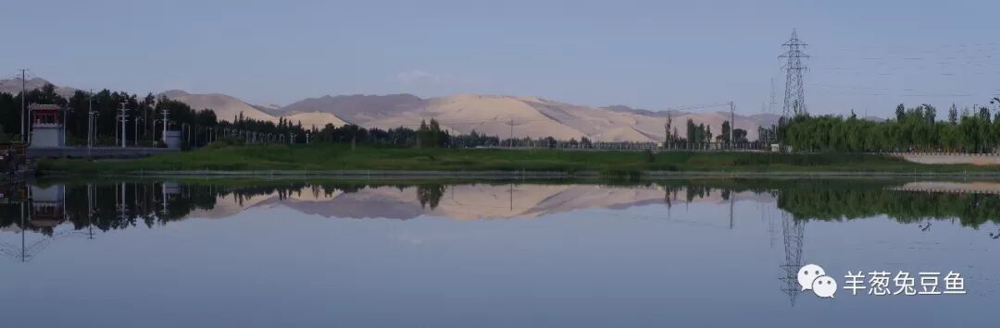

（党河一景）

（1）

驴肉黄面

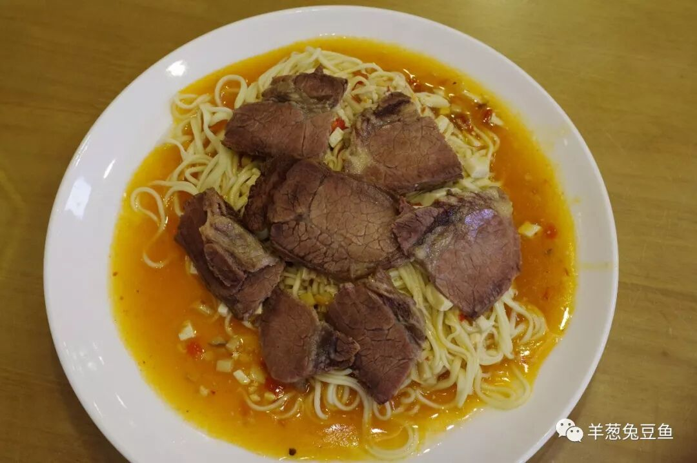

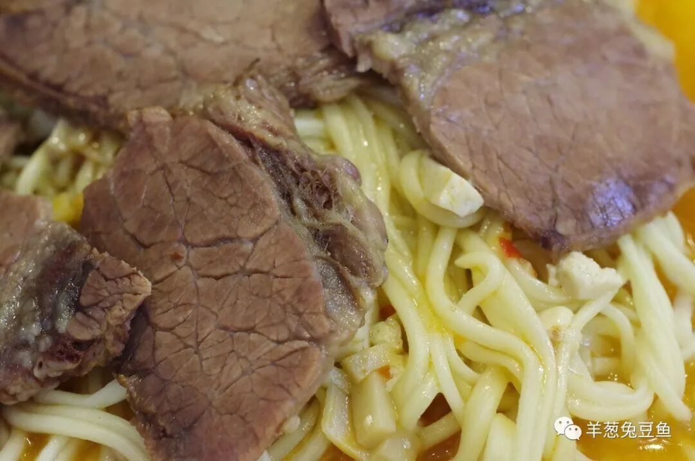

无论是出镜率还是辨识度，最高的敦煌饮食非驴肉黄面莫属。黄面晶莹淡黄，驴肉深沉暗褐，臊子卤汁润泽而油亮。尝一口驴肉，韧而不柴，酱香浓郁，夹杂其中的筋肉让驴肉更加耐嚼；再尝一口黄面，粘稠咸香的卤汁完全包裹着面条，而黄面粗细适中、软硬适中，拥有居于劲道和软糯之间的平衡口感。在沙漠包围之中，大口吃肉，大口吃面，畅快之感如同从鸣沙山顶倏然冲下月牙泉边，一气呵成而痛快至极。

（2）

胡羊焖饼

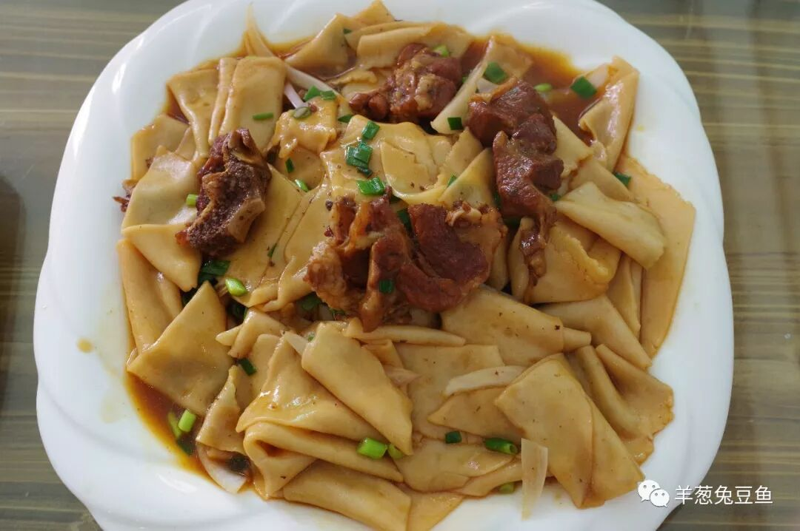

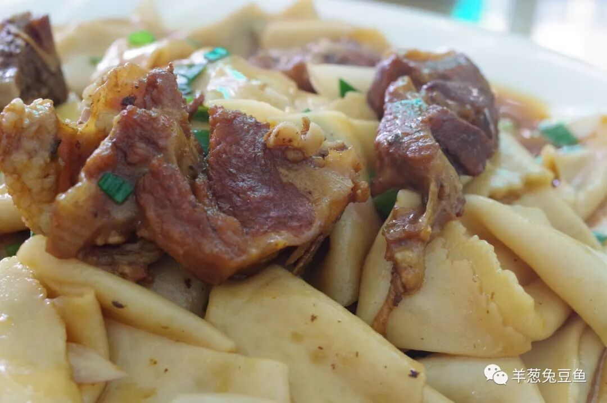

越靠近新疆，大盘家族的菜品就越发常见，胡羊焖饼便是这一家族在敦煌的掌门。敦煌地区盛产羊肉，与羊肉相关的菜肴也不胜枚举，但都不及这胡羊焖饼之名气与口碑。

吸饱了羊肉汤汁的面饼，在入口的一瞬间就能将味觉俘获，沾满油水的面皮十分爽滑，咀嚼之时又韧感十足。大块的羊肉瘦肉鲜嫩、肥膘油香，烧煮地相当入味，几乎渗透了每一丝肉的纹理之间。用一瓶啤酒或果饮与之相配，再上一次鸣沙山，再奔一次月牙泉，不在话下。

（3）

羊肉合汁

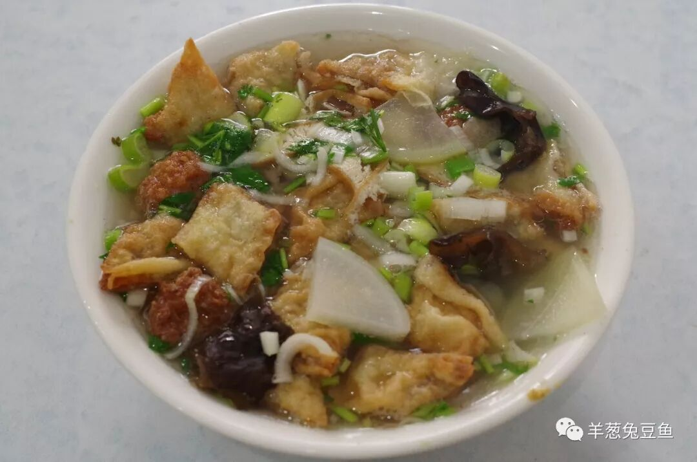

羊肉合汁与羊肉粉汤是敦煌最具地方特色的早点，两者都是羊肉汤打底，粉汤仅有羊肉与粉条，而合汁却还要再加上肉丸子、夹沙肉、木耳、萝卜、豆腐等，俨然一碗“全家福”，若是尝鲜，羊肉合汁定是更好的选择。

当各种食材带着自己本来的独特口感，浸润在羊肉汤中变得更加饱满与鲜香时，你或许会不经意觉得，这碗合汁是添加各种香料、味精、鸡精等制作的麻辣烫永远也比不上的。设想一个寒冬的清晨，刮着凌冽的风，吃上这么一碗合汁，荤素齐全、能量充足而身心俱暖，那该是一种多么美好的体验。

（4）

泡儿油糕

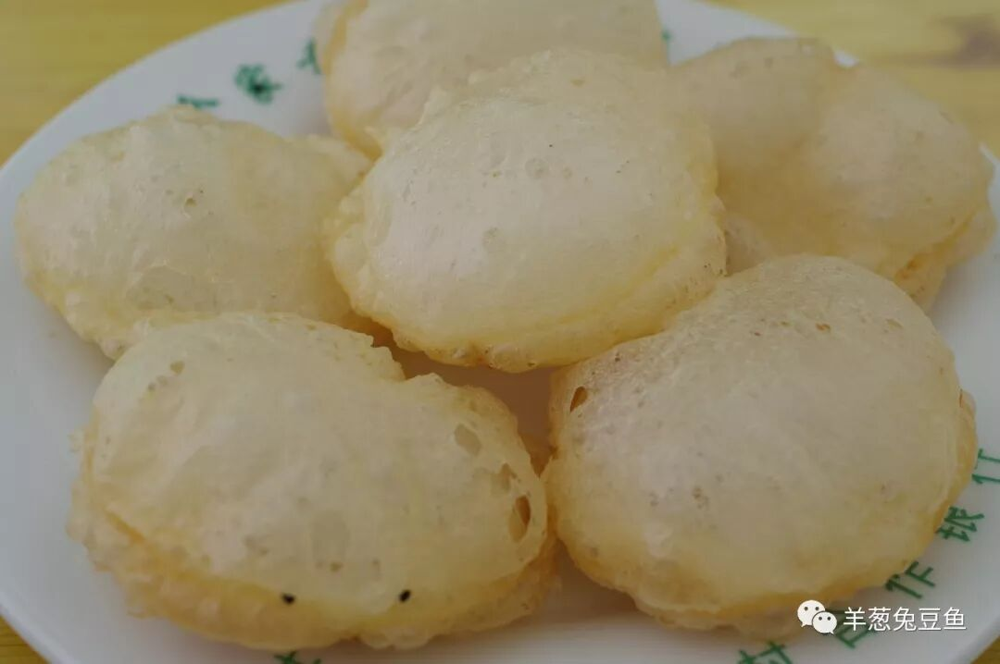

大漠中的敦煌甜点——泡儿油糕，其制作过程需要十分精细的手艺，稍有差池便不能呈现这蓬松的面貌。用筷子轻轻一捺，鼓胀的酥皮便坍塌下去，化作大大小小的皮渣。而中间实心的一层色如鲜奶，白中透着微微的黄，柔软而不变形。

刚出油锅的油糕虽不冒热气，吃时可千万要小心烫口，膨胀的表皮虽散热极快，无法对口腔形成工程，但当你的牙齿接触到内里时，鲜活的滚烫热气势不可挡。用嘴稍事吹凉，再轻轻咬下，油香甘甜而软糯的滋味再无处遁形。

由于泡儿油糕只是个头唬人，实际上吃下的量并不多，哪怕是胃口小的姑娘，一口气吃下五六个也是不在话下呢。

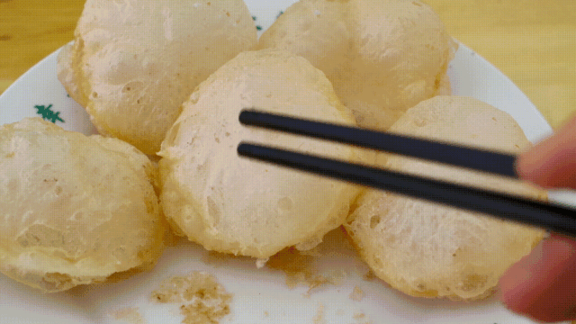

（5）

李广杏

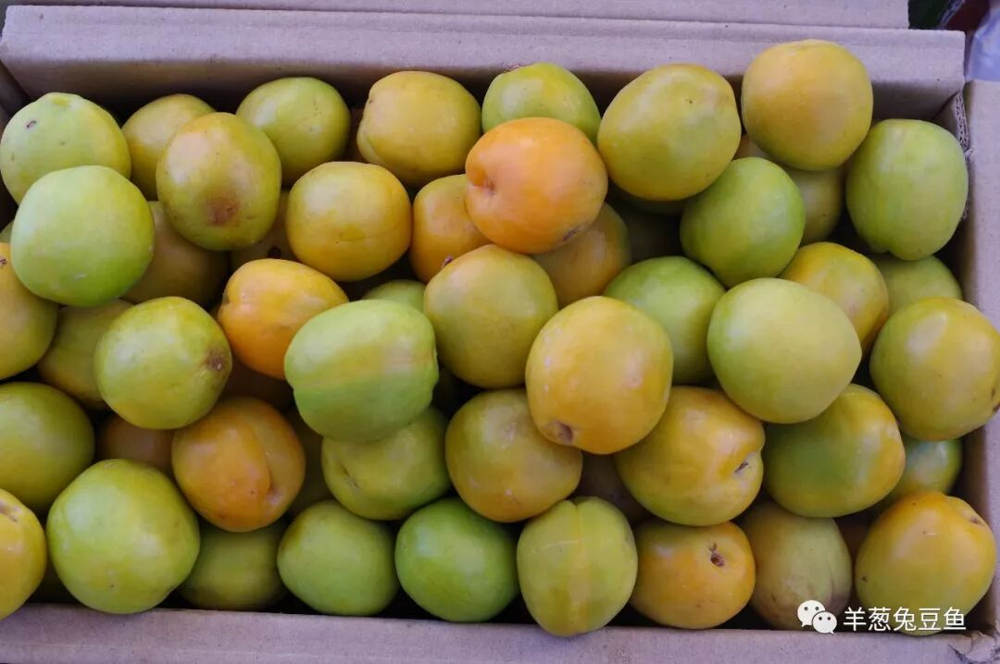

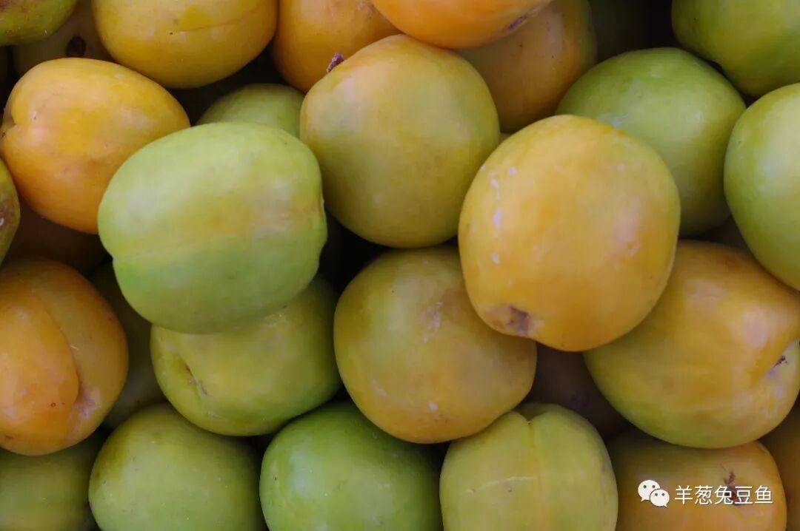

处在极度干旱少雨地区的敦煌盛产香甜的瓜果并不足为奇，但在瓜、葡萄等水果上，敦煌无论是质量和产量，都竞争不过更向西北的新疆。却有一种水果一枝独秀，那就是李广杏。

一旦吃过敦煌的李广杏，外乡人十有八九会改变从小到大培养起来的对那种表皮柔软并带有毛质感的杏的期待。李广杏具有类似于李子一样的表其，食之有强烈的脆感，而其内里又是绵软的杏肉之感，这一催脆软口感之结合是李广杏区别去其他杏的最重要特征，更别提这昼夜温差巨大之地所帮助它们积累起的重组糖分。

不过李广杏这果子娇弱得很，保鲜期极短，发飞起来的快递也会让其口味大打折扣。而今年敦煌又遭遇厉害的霜冻，严重影响了杏的产量，往年几块钱一斤的杏今年便宜的也要卖到二三十，吃得直让人叫唤肾疼。所以，要吃上最好的李广杏，一是得来敦煌，二是得有缘分。

排雷提示：

如果有人推荐你来敦煌喝杏皮水，请一定要谢绝他。敦煌街头售卖的都是饮料厂流水线上生产的添加了各种杂物的糖精杏皮水，尽管便宜，那种化学的甜味活生生就是对“杏皮”两个字的侮辱。恳请官方尽快将“杏皮水”从敦煌名优特产中除名，否则真是砸自己好不容易建立起来的金字招牌呀。

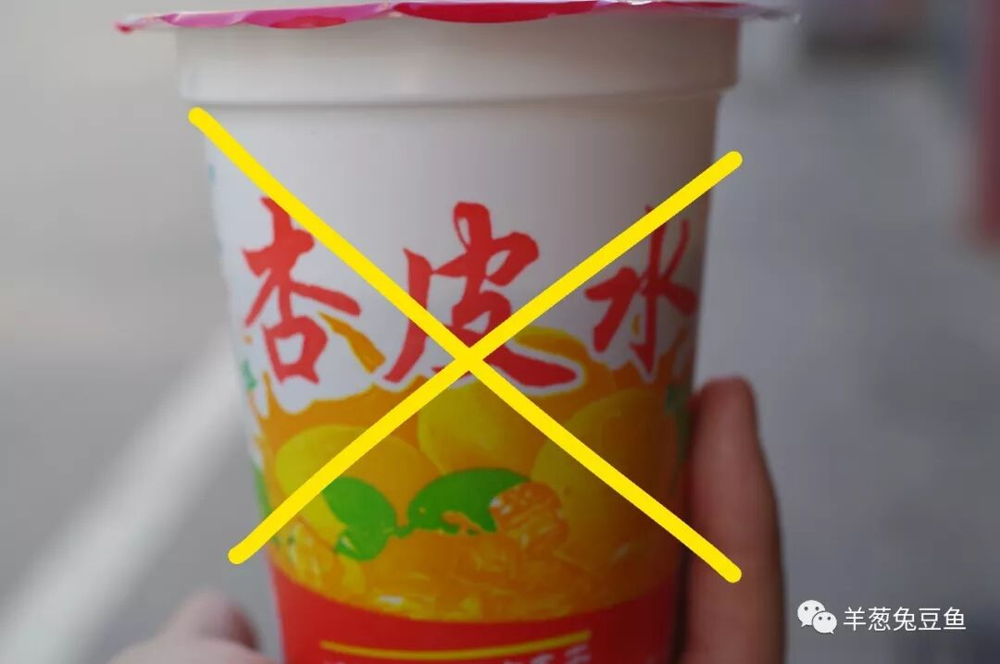

敦煌作为热门旅游城市，餐饮业十分发达，小小的城区密布了大量的餐厅酒水店，这其中难免鱼龙混杂，还需要擦亮眼睛仔细甄别。至于敦煌夜市（曾经的沙洲夜市），听我一句，别去。

除以上所提及之食物，浆水面、臊子面、酿皮等也是敦煌日常的饮食，也可寻得沙葱、苜蓿、榆钱等干旱地区独有的食材，满足口舌之欲绰绰有余。

像我这般来敦煌晃荡一天只为吃哪儿也不去的人大概从未有过，但我相信下次，当你要起身前往敦煌之时，面对该吃什么的问题不会再发憷，那就是我最得意的事了。下次，也让我当一个传统的背包客，再流连于这风沙土石之中吧。

今次，我就先退下了·。

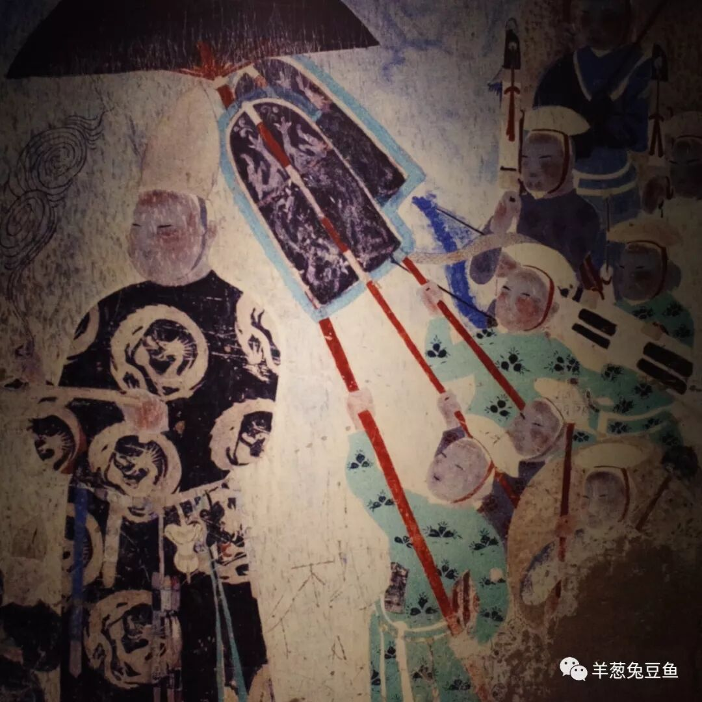

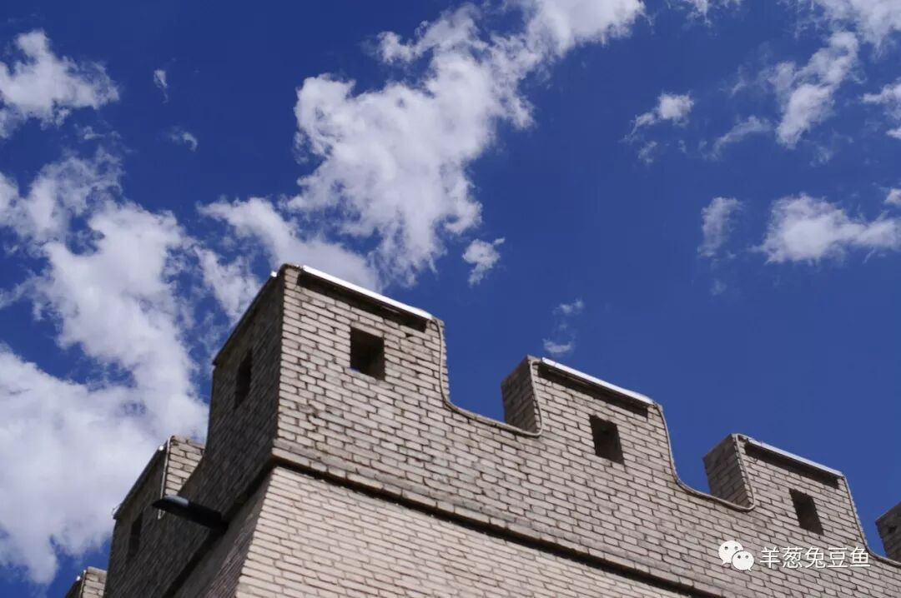

想知道我在做啥，请点击：吃货的决心——555天中国饮食探索之行

想知道我要去哪，请点击：555天行程计划（2018-06-20更新）

下一次，敦煌见吧。

（长按识别二维码点击关注哦）

 var first_sceen__time = (+new Date()); if ("" == 1 && document.getElementById('js_content')) { document.getElementById('js_content').addEventListener("selectstart",function(e){ e.preventDefault(); }); }

 if ("0" == 1) { document.addEventListener("keydown",function(e){ if ((e.metaKey || e.ctrlKey) && (e.key === 'c' || e.key === 'C' || e.key === 'x' || e.key === 'X' || e.key === 'a' || e.key === 'A')) { if (e.target.tagName === 'INPUT' || e.target.tagName === 'TEXTAREA') { return; } e.preventDefault(); } }); document.addEventListener("copy",function(e){ var sel = window.getSelection(); var content = document.getElementById('js_content'); if (sel && sel.rangeCount > 0 && content && content.contains(sel.getRangeAt(0).commonAncestorContainer)) { e.preventDefault(); } }); }

预览时标签不可点

微信扫一扫

关注该公众号

知道了 (javascript:;)
