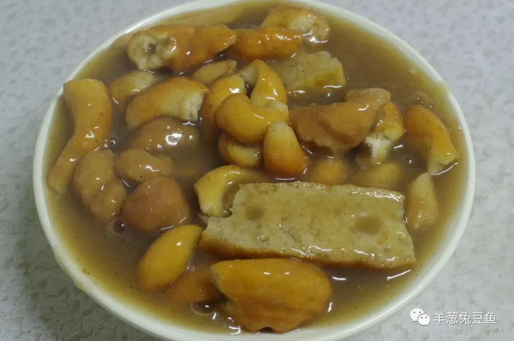
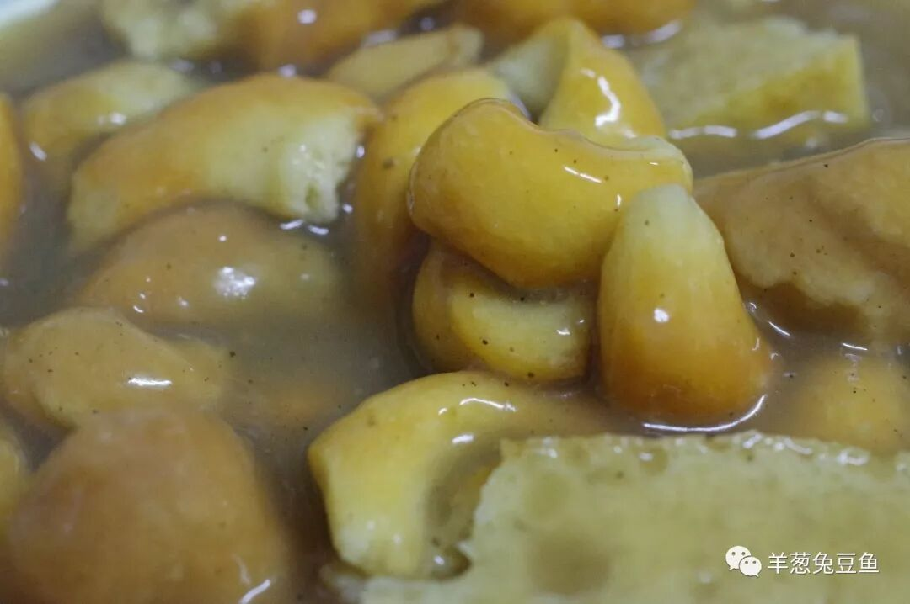
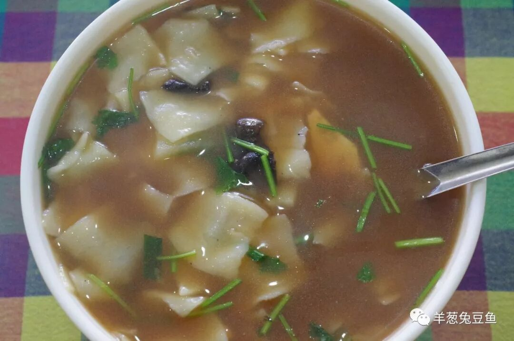
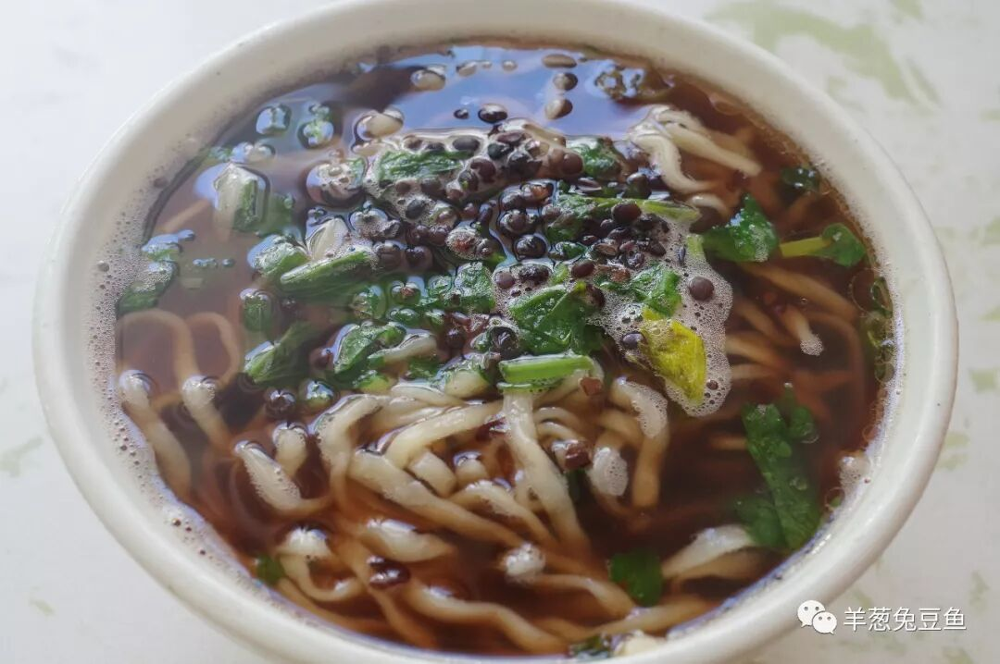
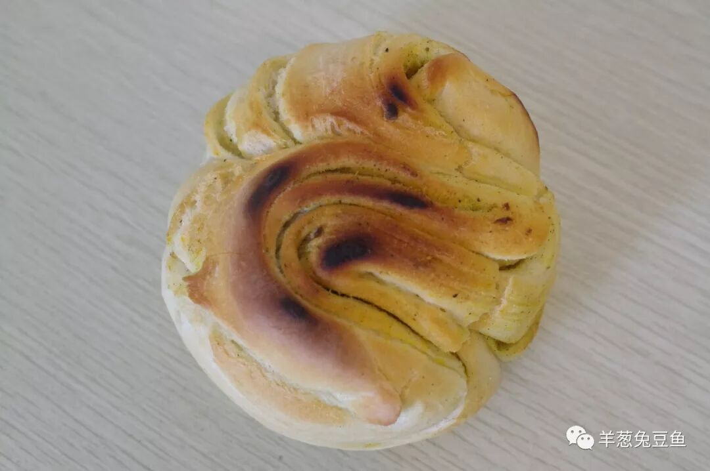
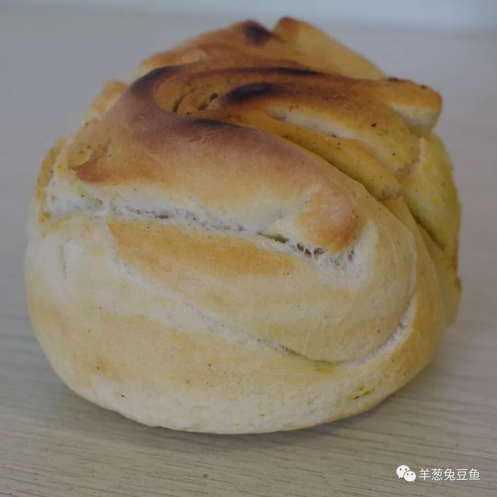
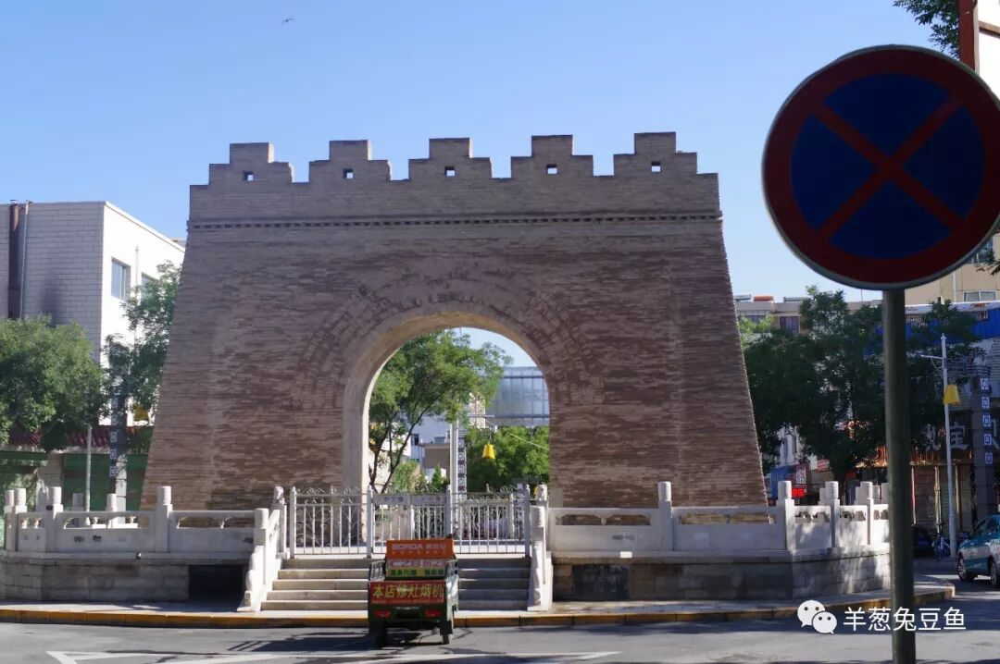

# 【第021天 酒泉】甘肃面食的最后一役

- 原文链接: https://mp.weixin.qq.com/s?__biz=MzA3MTM2Mjk3NA==&mid=2247503838&idx=1&sn=5143d82516d103f83c0b3636d78535a9&chksm=9f2c3f2fa85bb639867e3996d4f9078814db86ef22202a2997075682edccc2e2d92bbf9bccbf&scene=21
- 作者: 宇哥食行记
- 发布时间: 未知
- 图片数量: 8

不知不觉来到甘肃的最后一站，由于行程安排紧凑，这最后一站也只能匆匆一瞥。虽然匆匆，也用力了。

近些年的酒泉可以说是频繁抛头露面，哪怕到山村里随便问一个上了年纪的人，估计也能轻易说出酒泉卫星发射中心之名。但若要问一个甘肃非酒泉地区的人酒泉有什么特色饮食，就不见得能道出一二了。

酒泉近些年有大量移民涌入，但它本身并不是严格的移民城市，这样的交融使得酒泉的饮食既有明显的甘肃特色，由沾染上了如宁夏、陕西、山西等省的特点，不过终还是能归于“面食为王”。

（1）

糊锅

糊锅是酒泉最典型的早餐，在张掖这种食物叫糊粕，但远不能与酒泉遍布大街小巷的糊锅相提并论。麻花、粉皮、面筋和肉片沉浸在泛着胡椒香气的糊汤之中，色彩虽不丰富却泛着诱人的油光。吃上一口吸入糊汤的麻花，软糯之外，脆韧之内；吃上一口汤汁饱满的面筋，每一个空隙里都是粘稠的咸香；再吃上一口爽滑的粉皮，那呲溜一下入口的快感无与伦比。据说，这是酒泉人对家乡最深的味觉习惯与记忆，简单的食物最打动人心。

（2）

野蘑菇面片

吃野蘑菇面片，就像是一场饭桌上的寻宝探险。面片本无特别，汤汁也不过是番茄酸咸口的粘稠面汤，一切都如同一碗西北的普通面片一般。可是一旦仔细观察，就会发现有黑色的块状物体穿梭面片与汤汁之间，没错，那就是野蘑菇了。

找到一块野蘑菇就像小孩子发现大人藏起来的糖果那样兴奋，放入嘴里轻轻拒绝，山野的味道止不住地往外溢。尽管是晒干的干蘑，失了新鲜物的滋润水灵，但那种鲜美并未丢失，甚至那因为晒干而成的褶皱，都成了口腔里另一番带点风吹日晒的别样滋味。

（3）

扁豆面

扁豆面并非酒泉特有，但它在酒泉的出镜率明显高于定西、白银等亦食用扁豆面的地区，自然成为了酒泉日常主食的频繁选择之一。

扁豆面的味道并不复杂，但成就它的味道就在这汤汁中满满的扁豆香气，这种香气并不浓烈但绝对抓人口舌。撒于面上的一颗颗扁豆壳，又给面条增加一层若隐若现的颗粒口感，十分讨巧。滚烫的一碗面下肚，全身冒汗，大呼过瘾。

（4）

烧壳子

在甘肃一路向西北，大大小小的清真锅盔、馍馍店铺见了一个又一个，我想，以一个这样的食物来结束甘肃的饮食之行还算适宜。

先不论味道，这波浪般一层又一层的外形抓人眼球，颜色由浅至深的过渡十分自然。烧壳子表皮脆硬，内里松软，轻轻掰下一块，软硬结合的口感既不失韧劲又不亏牙口，焦香味与面的甜味完美结合。

我想，若是常住甘肃，这样的面点应该会毫无疑问地成为我的主食。但只能想想，该离开了。

酒泉的面条也呈现许多花样，除野蘑菇面片、扁豆面外，稍子面（臊子面）、甜面条、酸拌面、麻什子、拨疙瘩等也十分日常，这些面食在甘肃其他地区并不多见。可惜仓促的一瞥并无法让我一一尝遍，只能交给下次了。

肃州，我来过了。

（酒泉老城门）

甘肃篇结语

21天，18个市县。我自不敢说我走遍了甘肃，但我相信我所呈现的内容也约莫能呈现个甘肃饮食之十之七八。

甘肃这一段，既有意外的收获，也有意外的失落。这更加印证了在吃这件不算大的事上，只有走出去才能获得最真实的信息，只有亲自寻觅吃到嘴里，才敢说这是一二那是三四。

放弃金昌与嘉峪关，是因为这两个城市是明显的新兴移民城市，并未形成自己独特的饮食习惯，又或者说虽已形成，但所食之物为舶来品。对于此次出行而言，是没有必要的。而放弃平凉与庆阳，则完全是因为甘肃省过于独特的行政区划版图，为了实现每个省连续的行程，不得不将其放弃，实属遗憾。

我希望，这21天，能让你对甘肃的饮食有更多的向往与期待呢。哪怕一点，也好。

想知道我在干啥，请点这个链接：吃货的决心——555天中国饮食探索之行

想知道我要去哪，请点这个链接：555天行程计划（2018-06-20更新）

再见酒泉，再见甘肃。

（长按识别二维码点击关注哦）

 var first_sceen__time = (+new Date()); if ("" == 1 && document.getElementById('js_content')) { document.getElementById('js_content').addEventListener("selectstart",function(e){ e.preventDefault(); }); }

 if ("0" == 1) { document.addEventListener("keydown",function(e){ if ((e.metaKey || e.ctrlKey) && (e.key === 'c' || e.key === 'C' || e.key === 'x' || e.key === 'X' || e.key === 'a' || e.key === 'A')) { if (e.target.tagName === 'INPUT' || e.target.tagName === 'TEXTAREA') { return; } e.preventDefault(); } }); document.addEventListener("copy",function(e){ var sel = window.getSelection(); var content = document.getElementById('js_content'); if (sel && sel.rangeCount > 0 && content && content.contains(sel.getRangeAt(0).commonAncestorContainer)) { e.preventDefault(); } }); }

预览时标签不可点

微信扫一扫

关注该公众号

知道了 (javascript:;)
