# 【第028天 伊犁·伊宁（二）】锡伯味与更多

- 原文链接: https://mp.weixin.qq.com/s?__biz=MzA3MTM2Mjk3NA==&mid=2247503831&idx=1&sn=bec18cfabab818baa7776883a797ca3f&chksm=9f2c3f26a85bb630b0cc414a66637bc866b28eb74d832930cc2dfa9d5b8b388de7689858cb0f&scene=21
- 作者: 宇哥食行记
- 发布时间: 未知
- 图片数量: 15

尽管甘肃与新疆同为西北省份，在饮食的时间习惯上却具有十分明显的差异。在甘肃，想要吃到大部分特色食物，就需要起个大早迎着黎明的曙光而去；而在新疆，即便在天已大亮的九点钟，也难寻觅到理想中的果腹之处。

起了个大早，沿着伊犁河边晃晃悠悠，顶着烈日挨到十点，才拖着受饥的胃开始觅食。尽管已酷热当头，闭门羹仍吃了不少，若不是这伊犁河的风景勉强化作精神食粮，怕是早已气得以头抢地了。

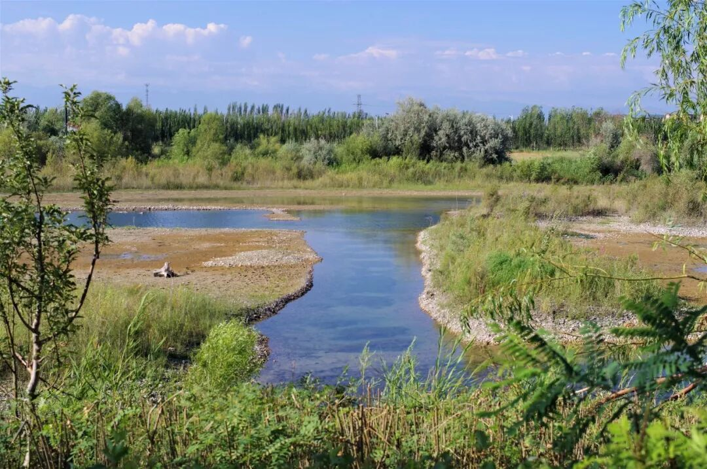

终于寻得一家售卖锡伯族早点的小店，那今天的食物也就得从这锡伯大饼说起了。

（1）

锡伯大饼

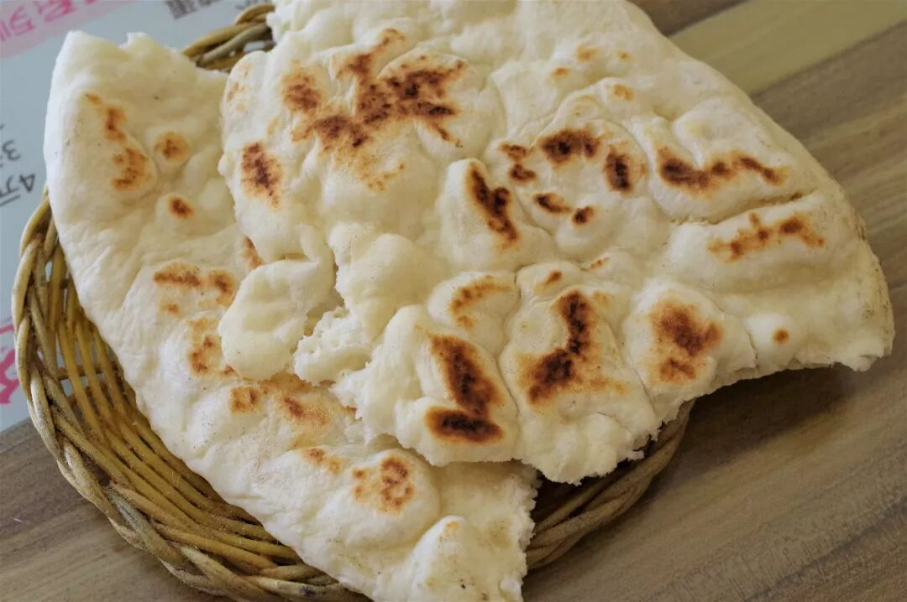

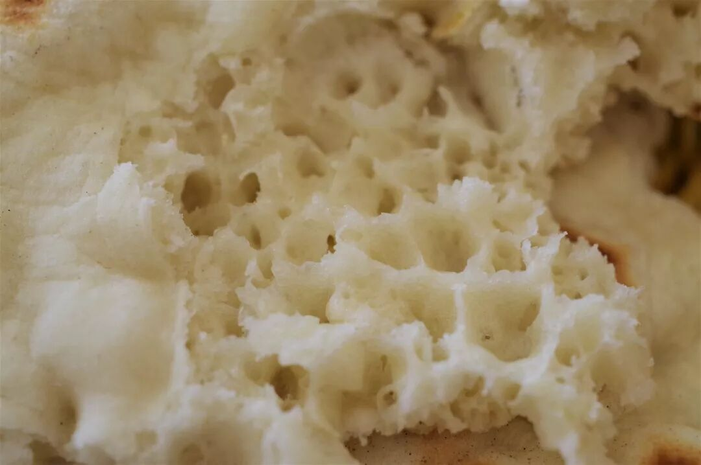

大饼是锡伯族最负盛名的主食，使用发面制作，现烙现吃，在各锡伯族餐厅都能吃到。刚出锅的饼还冒着热气，用手指轻轻一按柔软蓬松。咬下一口香气逼人，带有微微的清甜，饼的质地绵软柔韧，且口感不单调、具有不受控制的变化性。轻轻揭开饼的表层，能看到分布得极不均匀的内里，一个个大小不一的气孔分布其间，像极了喀斯特地貌，这应该便是其丰富口感的原因。

当地人吃大饼往往配上店家自制的凉拌小菜，或是配上一碗奶茶，一顿早餐就这么愉快地解决。

（2）

爆炒羊杂

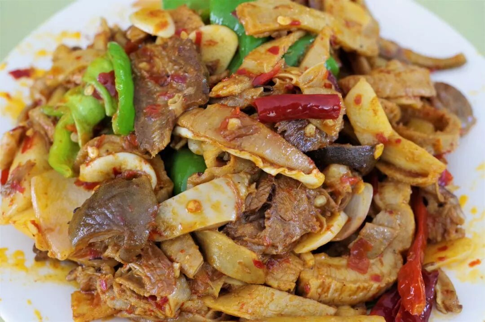

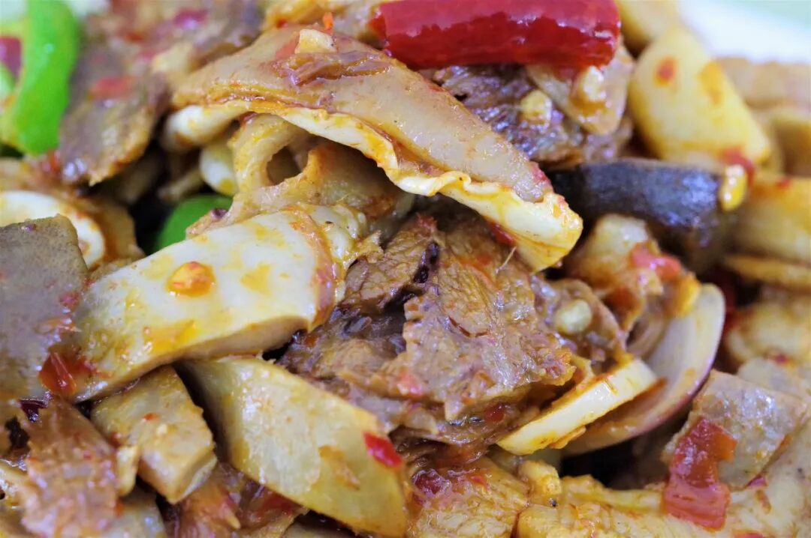

爆炒羊杂或许是锡伯餐厅嘴为普遍的一道菜了，使用羊肚、羊肠、羊心、羊板筋、面肺子等羊杂与大蒜、鲜辣椒、辣椒酱等调料一同爆炒而成。

锡伯口味的爆炒羊杂在新疆绝对算得上一道重口的菜了，炒制得入味的羊杂带有非常明显的香辣味，由于使用了辣椒酱，还带有较为突出而特别的酱香味，与其他地区的爆炒羊杂有显著区别。由于口味较重，已经无法分辨羊杂本身是否具有膻味，只留下那香、鲜、爽、脆。而不擅吃辣的朋友，在想要尝试以前或许得三思。

（3）

面肺子

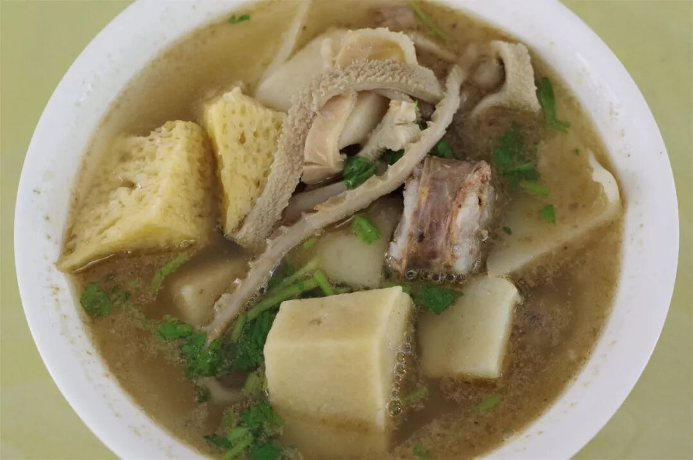

面肺子的出镜率在伊宁要明显高于南疆地区，我想，这应该是在伊犁州更被普遍食用的食物，而当地最常见的便要属汤面肺子了。吸收汤汁后的面肺子仍不失型，且保持有外脆里韧绵密的口感，十分充实。若嫌汤水寡淡，大可加入一勺当地特有的辣子，给面肺子增加一些酸辣酱香的味道。

不过，面肺子终究是将面浆灌入羊肺中制成的，不喜内脏杂碎一类事物的朋友怕也是无福消受了。

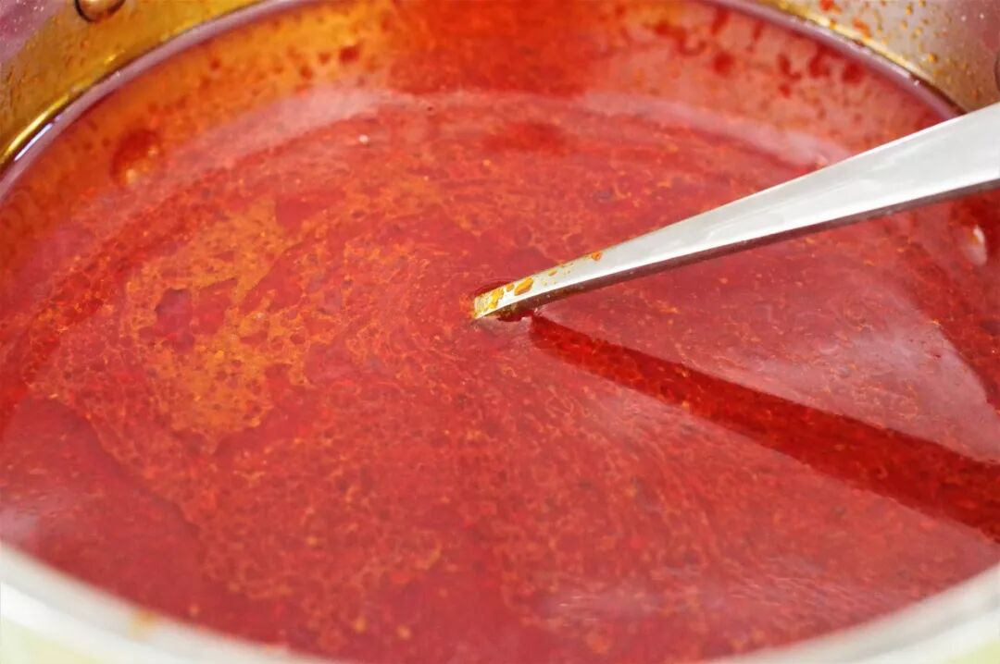

（4）

雪花凉

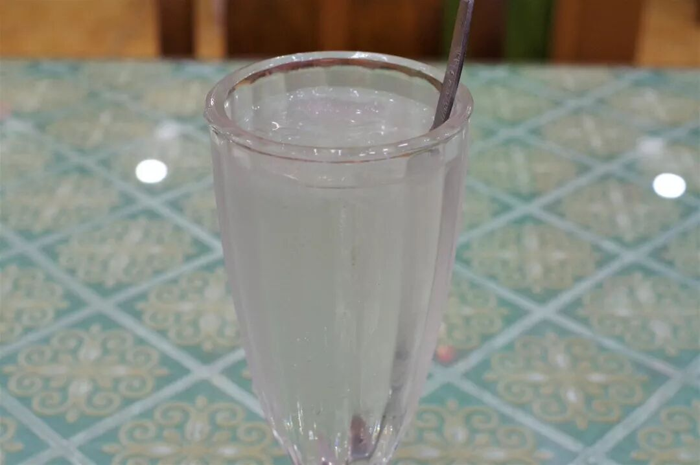

雪花凉算是新疆较为传统的一种夏季饮品，在未能尝试之前我对其曾有过各种各样的幻想，好奇这究竟是一种具有什么味道的饮料。今日一见，也未能从视觉上获得对其更进一步的味道线索，不过是接近透明的冰水里飘着几个冰坨子。直到喝上一口才恍然大悟，原来这不过就是融化后的“老冰棍”。这样一来就全明白了，不管当今时代各种口味的冷饮、雪糕或是冰淇淋如何层出不穷，仍旧有一大批人偏好那“老冰棍”简单的清甜味道，就那一口冰凉的甘甜，最能消去积累一天的暑气。

也许正在阅读这段文字的你，就是这么一个执着的老冰棍呢。

（5）

果丹皮、马琳酱

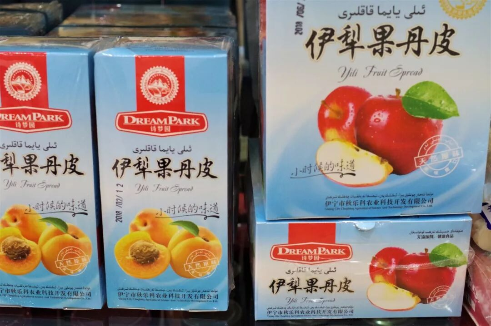

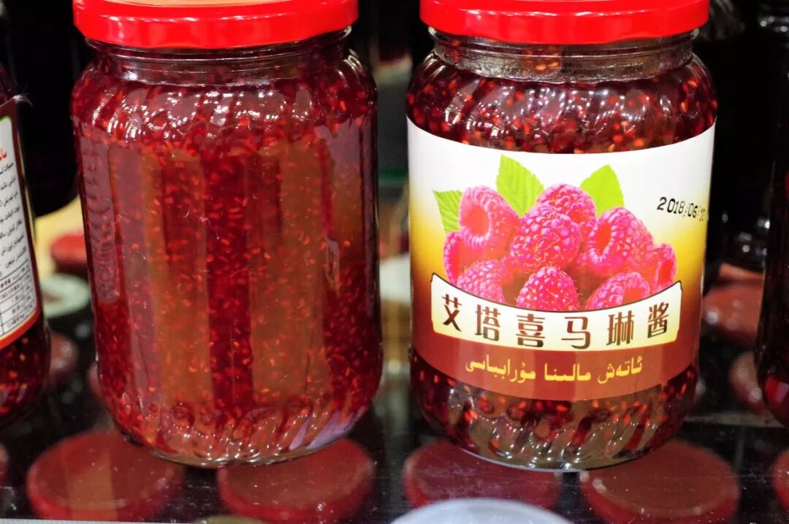

果丹皮和马琳酱（马琳即树莓、覆盆子）是伊犁当地的特产，也是少数可以被带走的食物，若是来到伊犁不妨带上一些，我相信这来自边疆的酸甜滋味定不会让你失望。

尽管这两天呈现的食物基本是哈萨克族、锡伯族风味的饮食，但这并不代表伊犁州只有这些。其实走在伊宁街头，能够看到的维族餐厅数量是要远远多于这些风味的，它们大都与南疆无异。要是一不小心吃够了奶制品，想要换换口味也是有充分的选择的。如果你再仔细寻觅一番，说不定还能找到各种诱人垂涎的肉，就像这样：

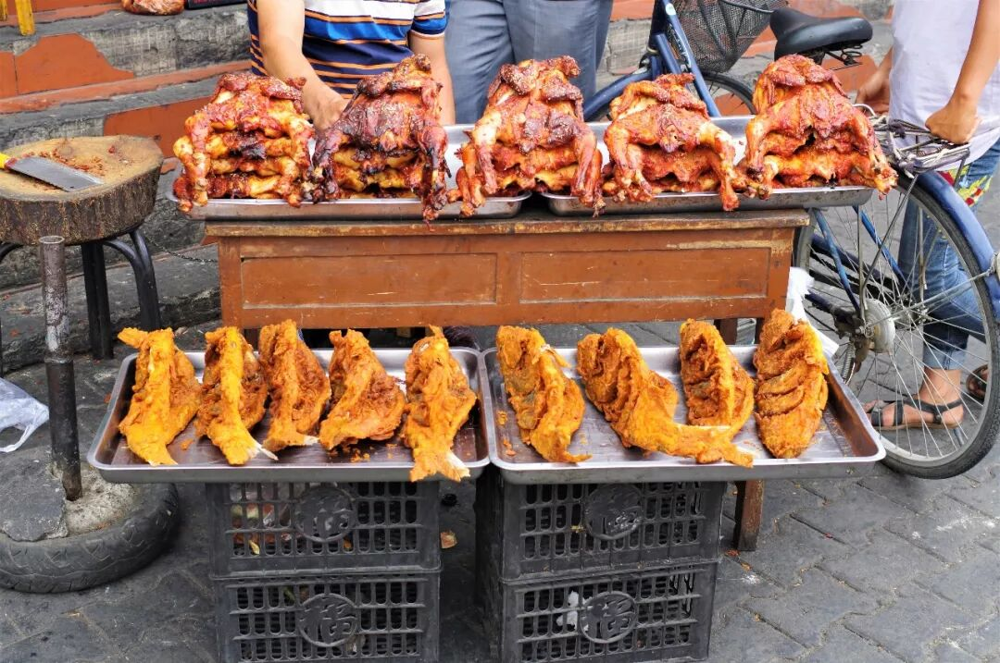

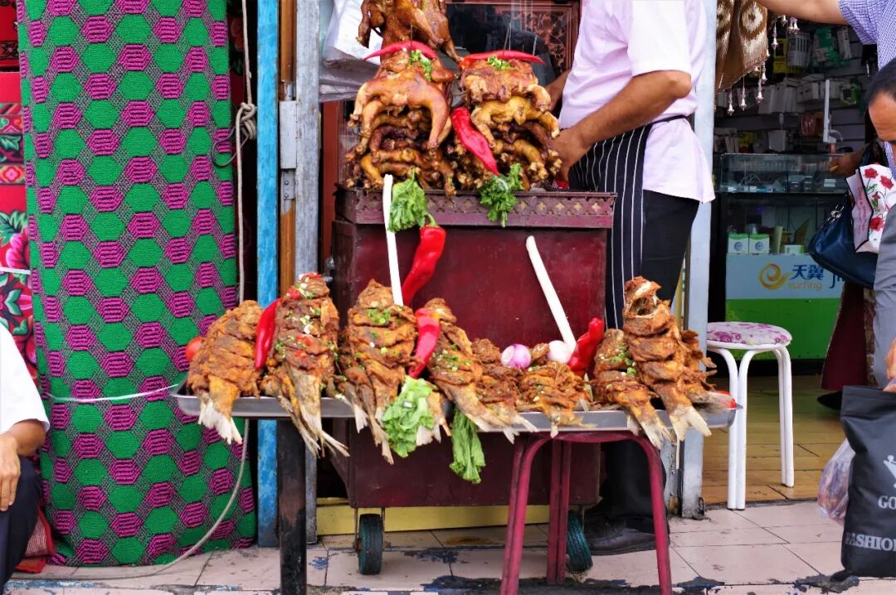

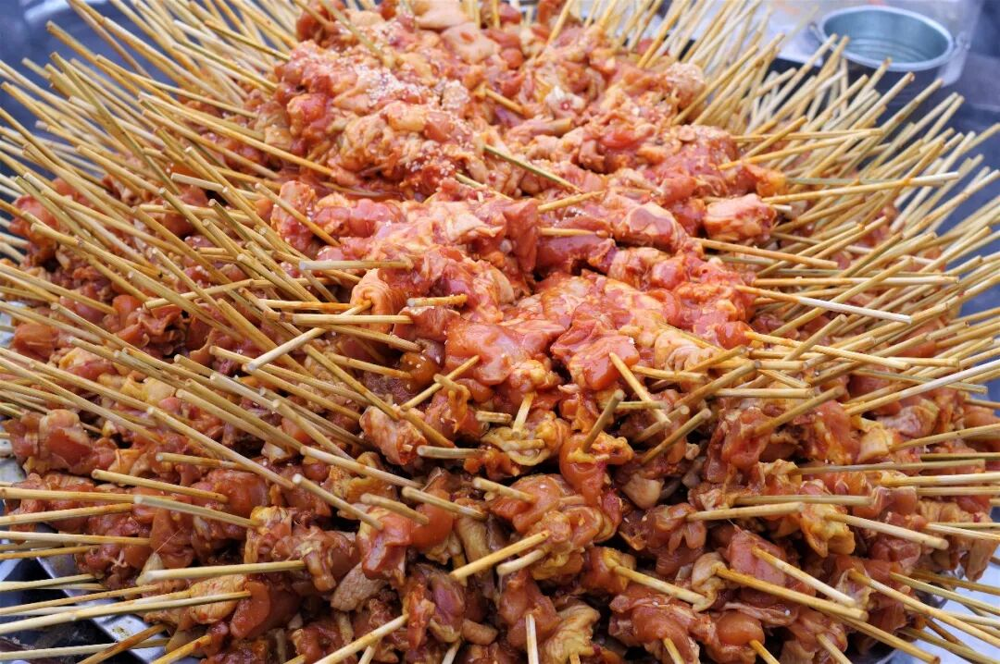

当伊犁用它的绝世美景盛情欢迎你时，别忘了它的食物也毫不含糊。它的青草香、绿树香、薰衣草香之外，还弥散着乳香、肉香和果香，小心别嫌太深，若是不愿离去可就糟了。

不过，伊犁才不怕呢。

想知道我在干啥，请点这个链接：吃货的决心——555天中国饮食探索之行

想知道我要去哪，请点这个链接：555天行程计划（2018-06-20更新）

下次，我要呆一个月再走。

（长按识别二维码点击关注哦）

 var first_sceen__time = (+new Date()); if ("" == 1 && document.getElementById('js_content')) { document.getElementById('js_content').addEventListener("selectstart",function(e){ e.preventDefault(); }); }

 if ("0" == 1) { document.addEventListener("keydown",function(e){ if ((e.metaKey || e.ctrlKey) && (e.key === 'c' || e.key === 'C' || e.key === 'x' || e.key === 'X' || e.key === 'a' || e.key === 'A')) { if (e.target.tagName === 'INPUT' || e.target.tagName === 'TEXTAREA') { return; } e.preventDefault(); } }); document.addEventListener("copy",function(e){ var sel = window.getSelection(); var content = document.getElementById('js_content'); if (sel && sel.rangeCount > 0 && content && content.contains(sel.getRangeAt(0).commonAncestorContainer)) { e.preventDefault(); } }); }

预览时标签不可点

微信扫一扫

关注该公众号

知道了 (javascript:;)
