# 【第029天 塔城】边陲的风，带着肉香与甜蜜

- 原文链接: https://mp.weixin.qq.com/s?__biz=MzA3MTM2Mjk3NA==&mid=2247503830&idx=1&sn=17e4894769ff0f4ed90845447e3f9da6&chksm=9f2c3f27a85bb6317c73a663999bbd722adc5bfd683875e7496fd7b4819bccd9ff599e64195a&scene=21
- 作者: 宇哥食行记
- 发布时间: 未知
- 图片数量: 16

我想，先补习一下地理是有必要的。塔城在新疆的位置如下：

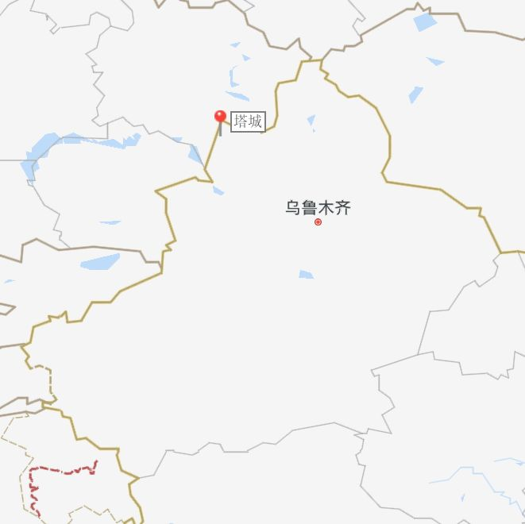

（图片截取自百度地图）

塔城往西再去10公里，就是哈萨克斯坦了。

这是个鲜有人光顾的小城，街上行人三三两两，不悠哉也无慌忙。这也是个交通不太方便的小城，在寒冬里常因为周边道路封冻无法进入也无法离开，更增加了其遗世独立之感。可是就这样一个名不见经传的弹丸之地，却藏着能让人千里奔赴只为一品的饮食，而后，再难忘却。

（塔城双塔）

（1）

风干肉抓饭

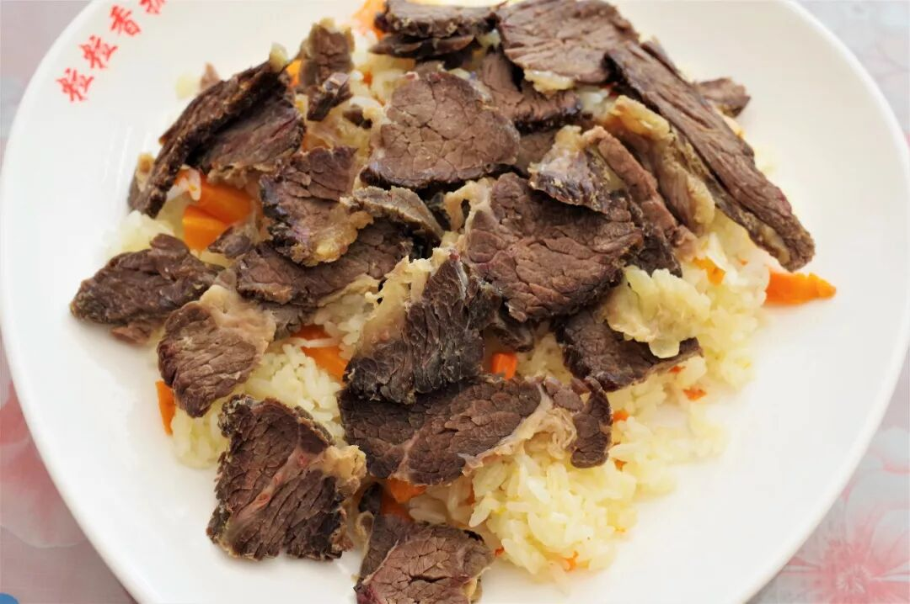

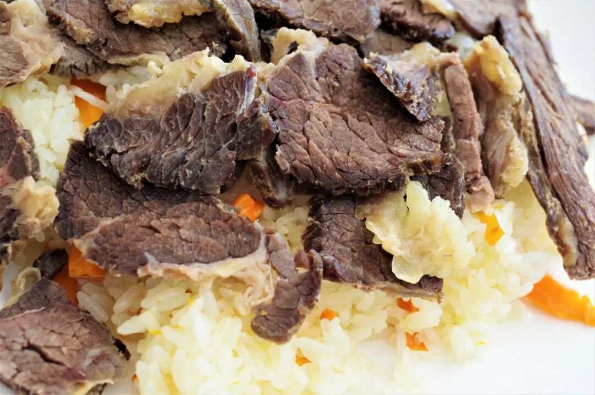

塔城在很大程度上是一个因风而闻名的城市，也正是常年盘旋在塔城周边的风，造就了这个城市最为新疆人所熟知的风之味——风干肉。这种味道有多迷幻呢？据说，只有塔城的风能吹出这样的味道，一旦离开就不再一样。

品尝风干肉最佳的季节是冬季，若以塔城本地人绝对权威的眼光来看，春节一过，吃风干肉的时节也就过去了，同样的味道只得再次等到冬季的来临。今日，作为一个拜访者，自不能再以这样的标准去要去，至少，也应该来一碗风干肉抓饭，看看那大概的形，尝尝那大概的味。

风干肉系牛肉制作，也偶有使用马肉。从外形上看，风干肉与一般牛肉干有明显的区别，其最大的特点是一块肉上每一个小部分都微微翘起，像极了有定向风吹过的森林里数目都往一个方向倾斜，或沙漠中沙粒都往一个方向堆积。轻轻咬下一口，那一块块翘起的肉就这么在口腔中分离解体，四处乱窜，一种深沉而又不过度的肉香弥散开来，那是不同于卤肉、腌肉或熏肉的味道，也许这就是那神奇的北风吹过的味道。无法确切描述，只能用你的舌尖来亲自触碰。

但是，我已经有了在深冬腊月，再来一次塔城的充足理由。

（2）

玛洛什

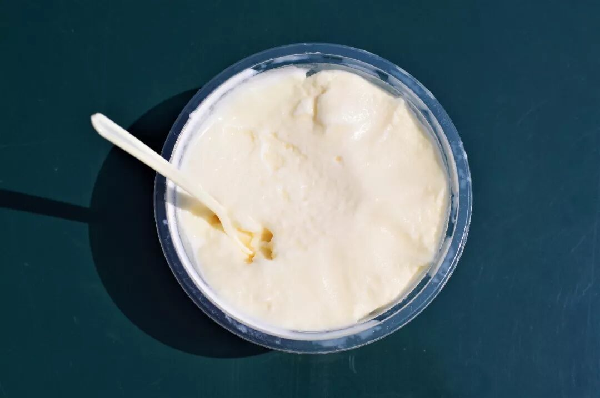

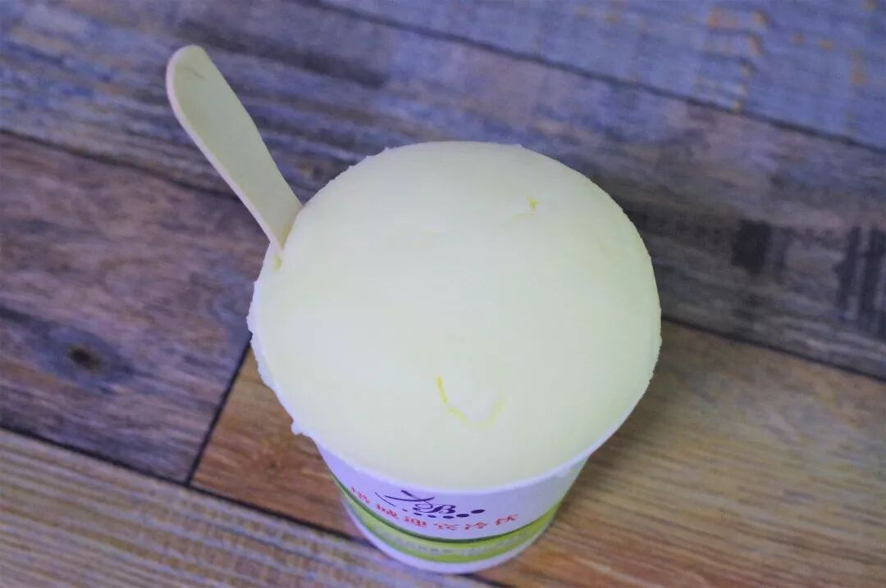

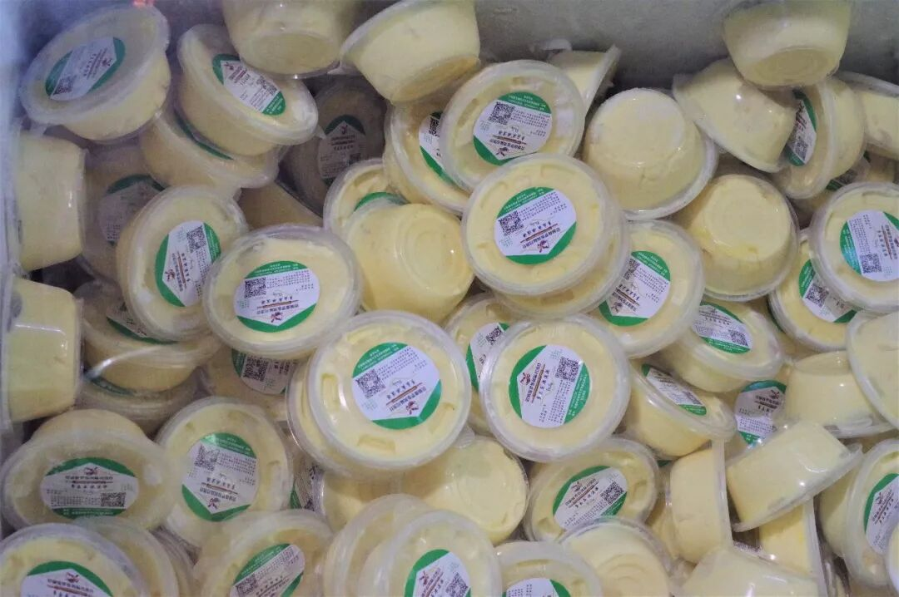

如果说风干肉代表了塔城冬天的味道，那玛洛什就一定代表了塔城夏天的味道。玛洛什是俄语冰淇淋的音译，最初由定居在塔城的俄罗斯族人创制，如今已成为了塔城夏季的味觉名片。常有克拉玛依（离塔城最近的地级市）的食客驱车来回五六个小时就为了吃上一口或采购一堆回去倒卖，不难设想其魅力。

玛洛什的制作原料极其简单，仅牛奶、鸡蛋、白砂糖，最后的成品也不过是简单而统一的淡乳黄色，鲜有其他味道（如果有，也是不地道的）。玛洛什不像常见的冰淇淋那样紧致、绵密，其质感较为松软，舀上一勺放入嘴中瞬间化开，带有泡沫的口感。而这种简单的奶味、蛋味和甜味的组合，竟带有三分“老冰棍”的感觉，质朴而又奇妙。

（3）

俄式面包

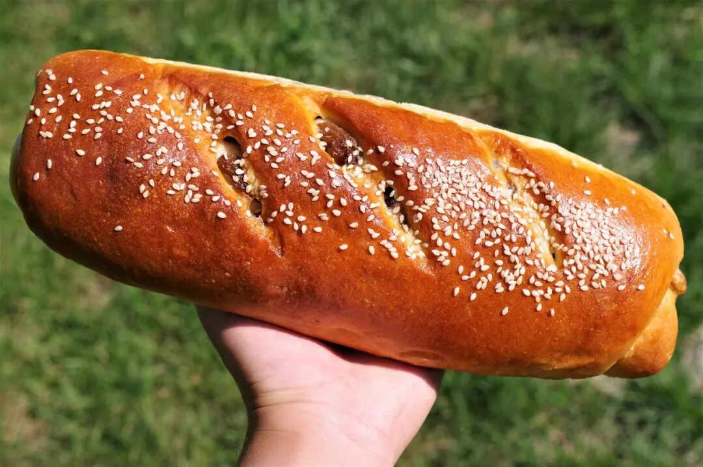

（大列巴）

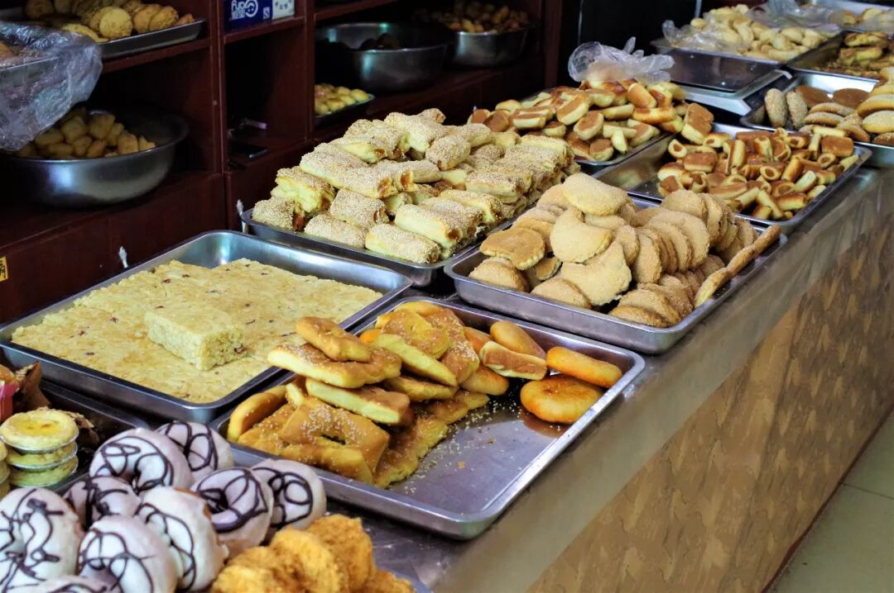

（各式面包）

除了冰淇淋，俄罗斯族也给塔城人民带了俄式面包这一大。在这个小小的城市街头可以找到大量的面包蛋糕店，无疑给这个城市再次打上一个大大的“甜”字烙印。而俄式面包中最著名的就要属大列（liě）巴（ba）了，尝试了一个甜味大列巴，大约是巴掌的三倍大，里面散布着大大小小的葡萄干和核桃，香甜可口，也算是带上了新疆特色、入乡随俗了。

来到塔城，可千万要尝试下这些俄式面包，这是在内陆无法获得的味道。

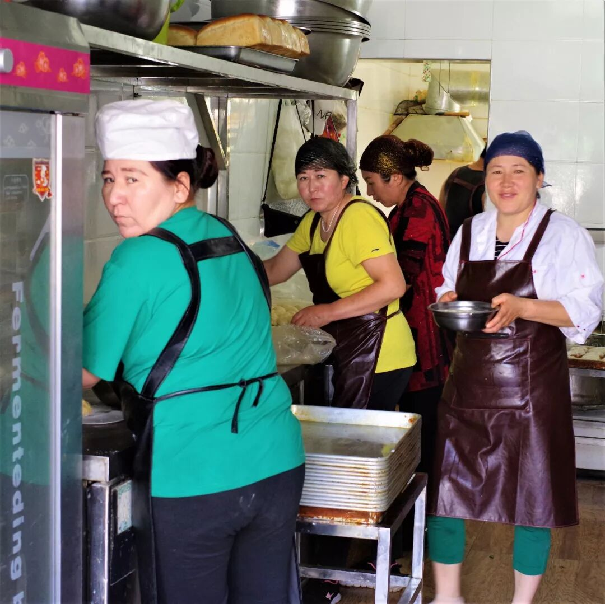

（被偷拍的面包房妇女）

（4）

酸梅汤

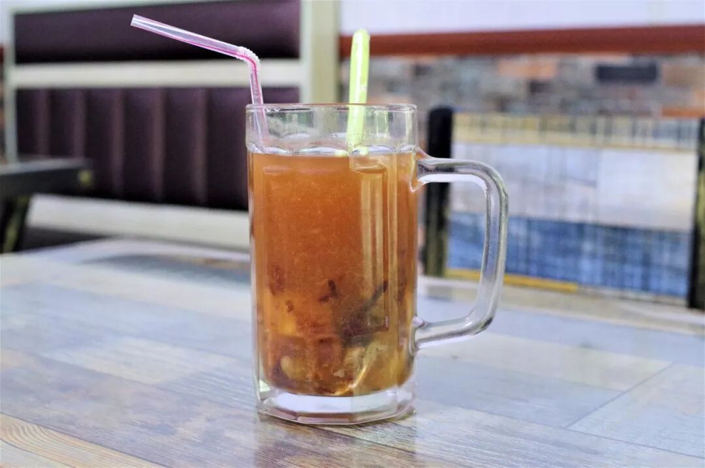

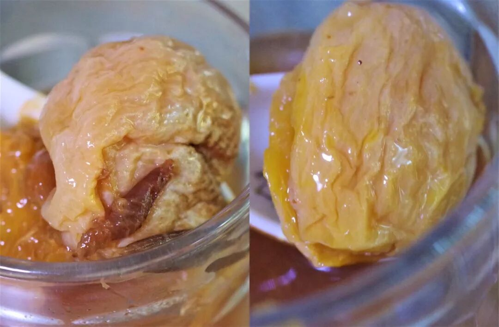

（超大的杏）

还有一种极其普通的饮料，成为了背井离乡的塔城人或曾经来过塔城的人（比如我）魂牵梦萦的味道，这就是塔城酸梅汤。

要说这酸梅汤加了什么特殊的调料，我相信绝没有。但是这样浓郁、协调的酸甜味道，再加上粒粒分明而鲜艳欲滴的一颗颗葡萄干、杏干、乌梅，在炎热的夏季一阵冰爽的风就这么从身体中席卷而过，暑气、倦气、疲气，全没了。这种一锅锅亲手熬、经过时间凝练的味道，是不会说谎的，而你的舌头，也不会骗你。

那些用酸梅粉调的酸梅汤，都见鬼去吧。

塔城，仿佛没有那么特别。塔城，貌似没有那么丰富。可我控制不了自己，吃了两碗玛洛什，喝了两杯酸梅汤，吃了一份加肉的风干肉抓饭，吃下了一整个大列巴。还说它不够特别吗？我一定是在骗自己。

一座仅靠味觉就能征服我的城市，一定是特别的。如果人生的清单上要再加一个目标的话，再来塔城吃一次一定会进入其中。

这边陲的风啊，你该再强劲一些，把这小城，刮进更多人的目光中。顺便，再刮到胃里去罢。

再见，塔尔巴哈台城。

想知道我在干啥，请点这个链接：吃货的决心——555天中国饮食探索之行

想知道我要去哪，请点这个链接：555天行程计划（2018-06-20更新）

没吃够喝够

（长按识别二维码点击关注哦）

 var first_sceen__time = (+new Date()); if ("" == 1 && document.getElementById('js_content')) { document.getElementById('js_content').addEventListener("selectstart",function(e){ e.preventDefault(); }); }

 if ("0" == 1) { document.addEventListener("keydown",function(e){ if ((e.metaKey || e.ctrlKey) && (e.key === 'c' || e.key === 'C' || e.key === 'x' || e.key === 'X' || e.key === 'a' || e.key === 'A')) { if (e.target.tagName === 'INPUT' || e.target.tagName === 'TEXTAREA') { return; } e.preventDefault(); } }); document.addEventListener("copy",function(e){ var sel = window.getSelection(); var content = document.getElementById('js_content'); if (sel && sel.rangeCount > 0 && content && content.contains(sel.getRangeAt(0).commonAncestorContainer)) { e.preventDefault(); } }); }

预览时标签不可点

微信扫一扫

关注该公众号

知道了 (javascript:;)
