# 【第030天 昌吉】别，别动我的椒麻鸡

- 原文链接: https://mp.weixin.qq.com/s?__biz=MzA3MTM2Mjk3NA==&mid=2247503829&idx=1&sn=908788b285243ec860d242e0a25e9a76&chksm=9f2c3f24a85bb6320058bcbf296533a7895c40a60313a81b2598d4fdf06c6b1c6af7feb6a536&scene=21
- 作者: 宇哥食行记
- 发布时间: 未知
- 图片数量: 18

说来惭愧，第一次知道昌吉，还是因为上海的昌吉路。后来才知，它与乌市（乌鲁木齐）不过咫尺之遥，却没有显赫的名声。

要说昌吉，美景美物实谈不上，作为中国唯二的回族自治州之一（另一个是甘肃临夏），它实实在在贡献了新疆饮食图谱上绝对够分量的一部分。而这，必须从一碗椒麻鸡说起。

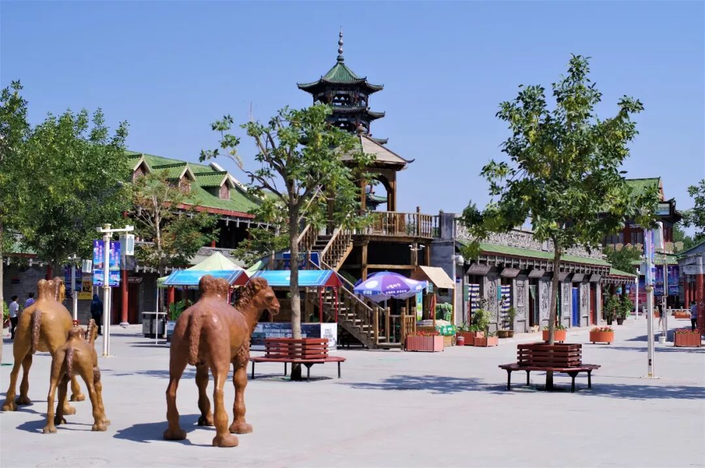

（1）

椒麻鸡

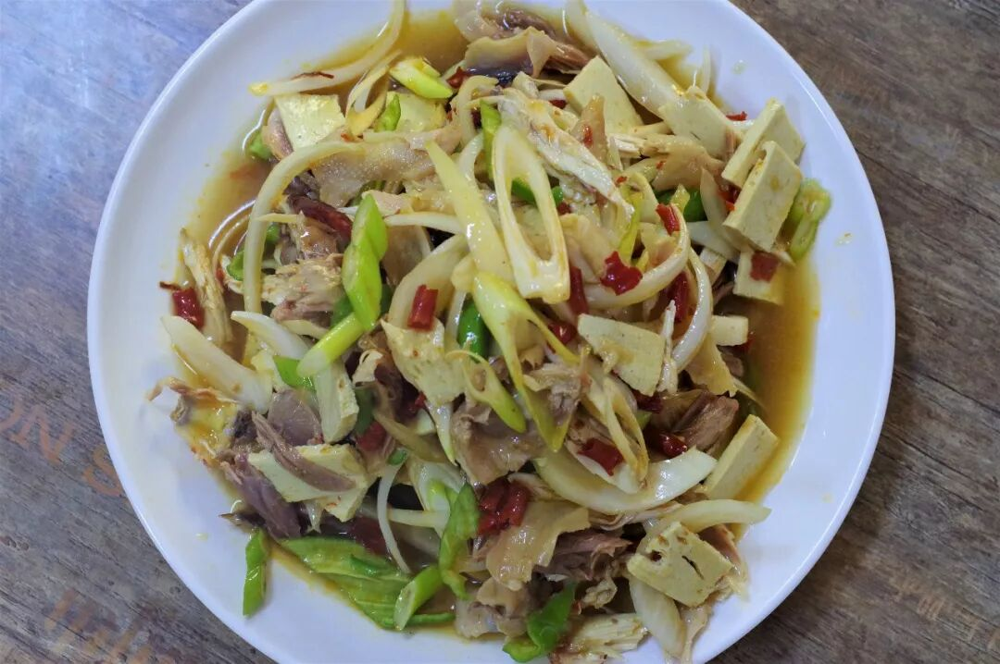

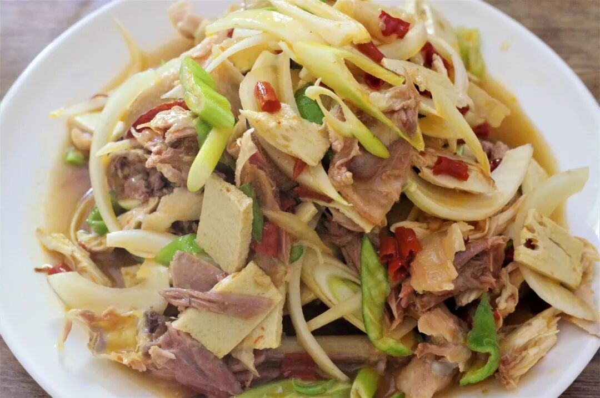

在新疆，最好的椒麻鸡在昌吉，这是公认的事实。这是一道不“典型”的新疆菜，因为它的味型里加入了一个极其特别的成分——麻。但新疆本就是一个由各地移民重新解构融合分化而形成的新的文化共同体，其饮食很难被划归某一大类也就不足为奇。

一盘好的椒麻鸡应该使用当天现杀的活鸡，在上料前用双手沿着鸡肉的纹理撕成一条一条，不破坏鸡肉的顺畅之感，而使用菜刀或机器切割出来的鸡肉将大打折扣。在撕好的鸡肉与辣子、皮牙子（羊葱）、大葱等辅料中加入盐、香油、花椒油等调料充分和匀后即成。

鸡皮的脆、皮牙子的脆、辣子的脆、大葱的脆与鸡肉的柔韧构成一种多脆一韧的复杂口感，再与那咸香微麻微辣的味道一配合，吃得让人大呼过瘾、箸动不停。这种味道的把控是极其困难的，麻味过度则吃到后程口腔已完全麻痹，辣味过度则显然是曲解了新疆人的味觉习惯，所以制作过程虽不复杂，真正能做好的店却寥寥。再配上一瓶新疆的乌苏啤酒，谁说这炎炎夏日不能大酒大肉？

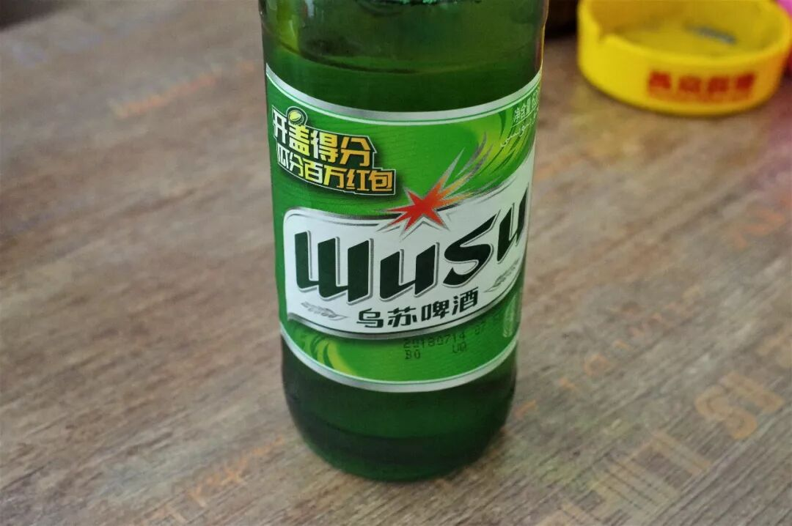

（2）

丸子汤、油塔子

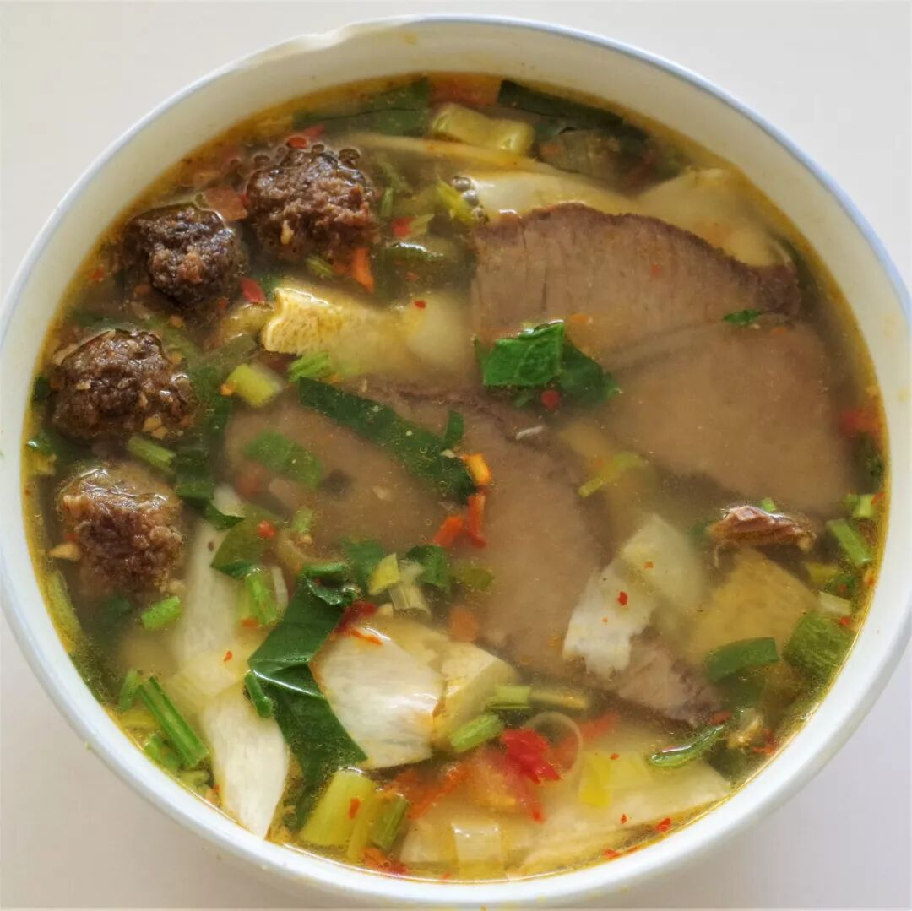

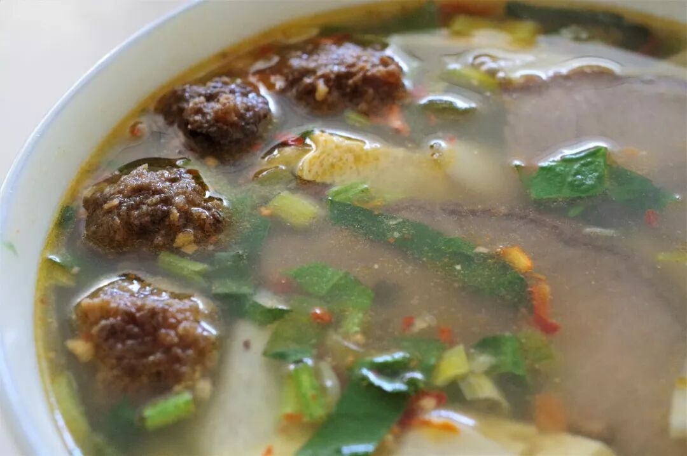

丸子汤是新疆回民的传统小吃，如今在新疆各地已遍地开花，不过最好的仍在昌吉。丸子汤的汤底乃牛骨熬制，鲜香味浓。而丸子则是牛肉丸子，肉质紧实，外焦里嫩。再加入牛肉片、豆腐、蘑菇、粉块等即是一碗食材丰富的丸子汤。其口味咸酸微辣，滚烫地吃下后身体微微冒汗发热，十分舒爽。

而丸子汤有一样标配，那就是油塔子。若粗暴地理解，油塔子就是新疆回族的花卷，但是在制作时因抹上了羊油而呈现独一无二的味道，吃时有十分明显的羊油香气。两个油塔子，一碗丸子汤，就是昌吉一顿丰富而管饱的正餐。

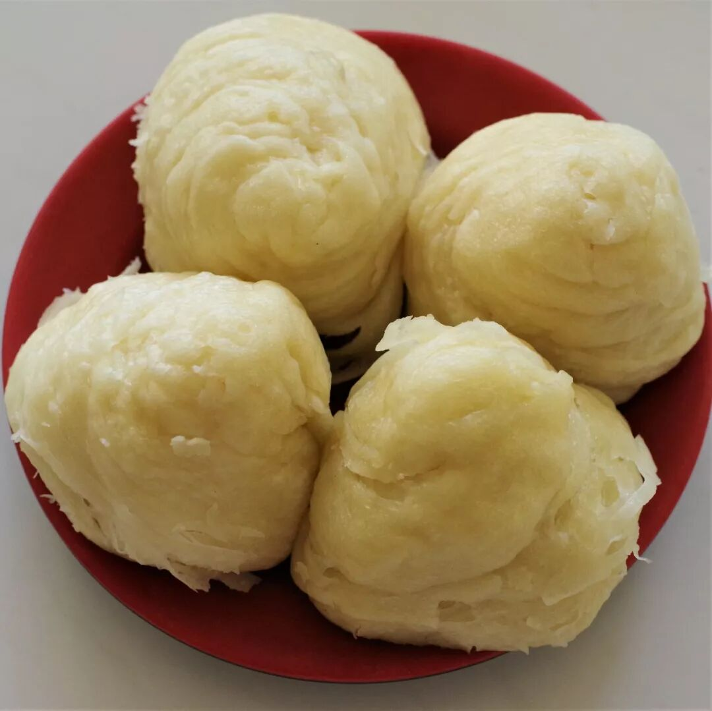

（3）

扁豆面旗子

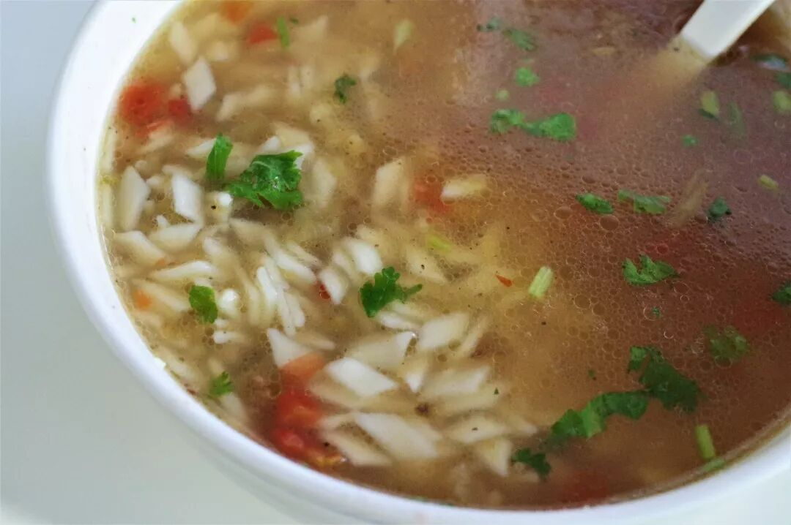

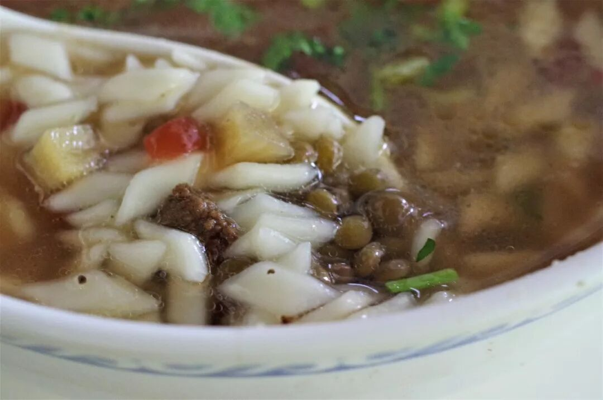

扁豆面旗子属于新疆汤饭的一种，也是新疆回族著名的主食之一。面旗子之名生动形象，指代的是碗中那切成一厘米见长五毫米见宽的菱形面片。又因汤底中加入了扁豆，因而得名扁豆面旗子。

牛骨熬制的汤味道浓郁，因加入了番茄而带上较为明显的酸味，且面汤中加入了胡椒，吃起来也具有较重的胡椒香，也是种极其暖身的食物。据说，当地人常在饮酒后来上一碗扁豆面旗子，发汗解酒。我想，在寒冬腊月吃上一碗，也定是能温润身子一整天吧。

（4）

胡辣羊蹄

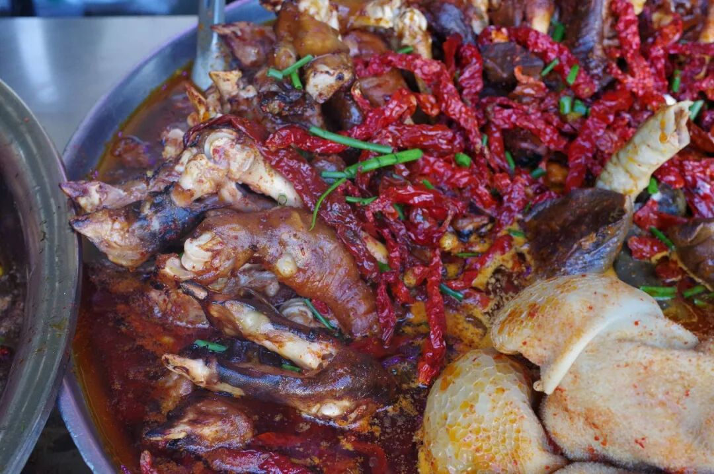

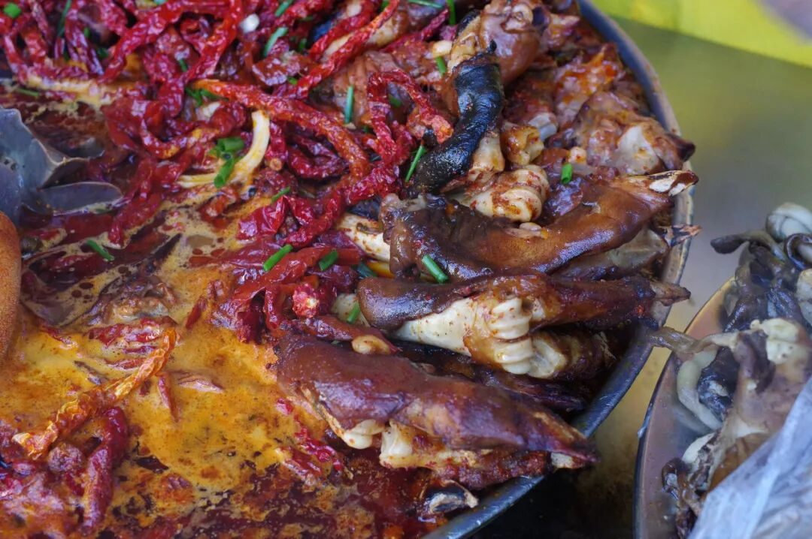

羊蹄，有多少人爱之深情之切，就有多少人唯恐避之不及。羊蹄是一只羊身上膻味积累最重的部分，无论用多重的调味去掩盖这种味道，仍旧会有那么三分从味道的空隙之中逃窜出来。但若你能接受这三分膻味，那胡辣羊蹄可就绝对是美味了。

羊蹄上有许多细小的毛，在烹制前需要用火烧将毛去掉，这一步骤本身就给羊蹄添上了一层炭火处理后的特殊香气。将处理好的羊蹄放至滚烫鲜红的汤料中持续炖煮，直到变得软烂。羊蹄的肉并不丰腴，只是一层紧贴着骨的薄皮，但是那香辣软烂粘糯，只需一口便让人惊叹。然后，一只又一只，眼前一片骨堆狼藉。

（5）

油糕、油香

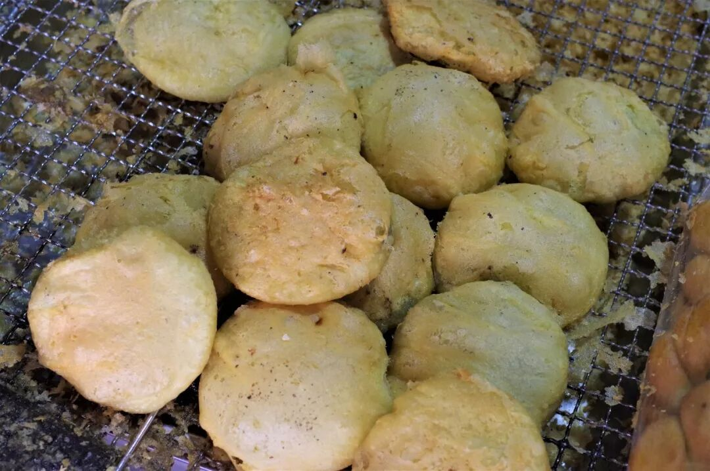

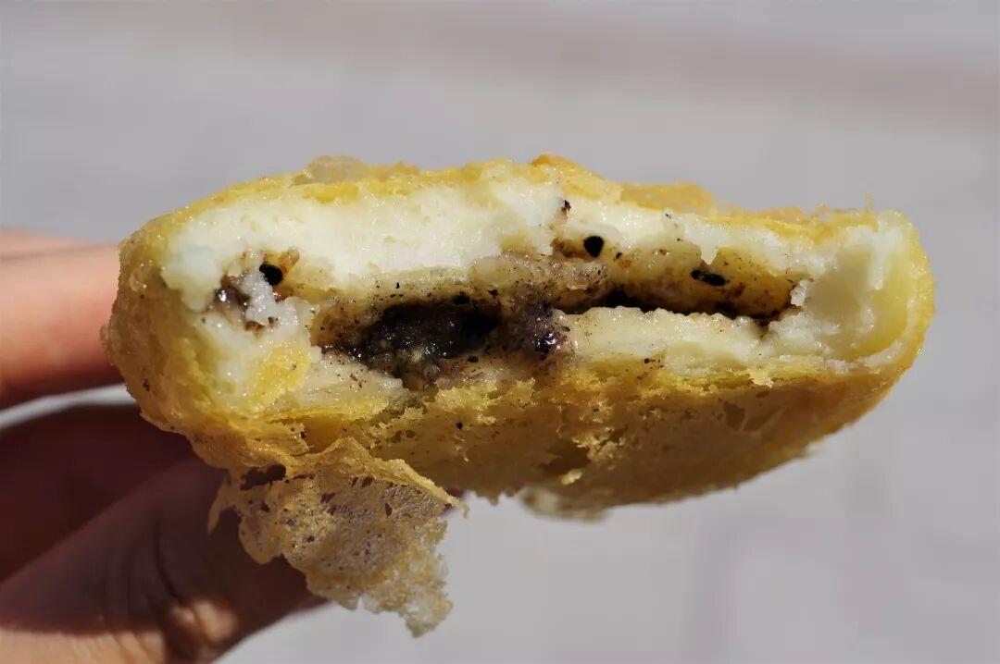

油糕是一种流传范围极广的食物，各地都有制作，在口味上有细微差异。在昌吉的回民小吃街上，油糕是一定要尝试一下的。表层焦酥掉渣，内层滚烫而软糯，再配上香甜的芝麻白糖馅，吃得满嘴是油却回味无穷。

除油糕外，在昌吉还能轻易获得回族的传统面点，如油香、馓子、麻花等，好与坏都得由你亲自评判呢。

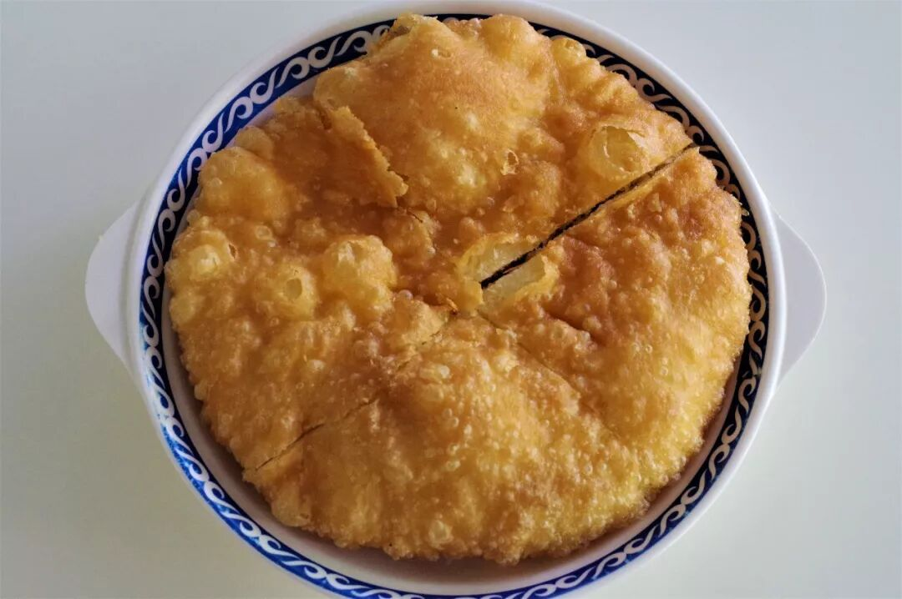

（油香）

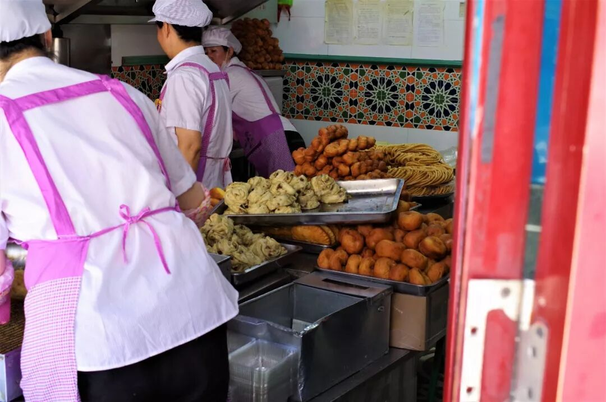

（馓子、麻花等）

（6）

雪花凉

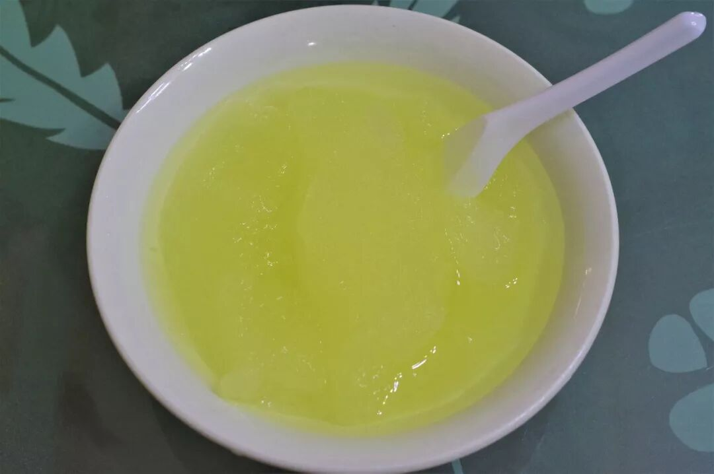

据闻，雪花凉是昌吉有着多年历史的夏季消暑甜品，在今天的昌吉街头也是俯拾皆是。这里的雪花凉呈现的是一种冰沙的状态，吃在嘴里颗粒感十足，并伴着那让人心旷神怡的“老冰棍”般的简单甜味，确是炎炎夏日能轻易获得的舌尖享受。

昌吉较为著名的回民饮食还有粉汤、九碗三行子等，这次不能一一尝尽，略有遗憾。不过这九碗三行子可是九个大碗九道菜，真要尝试，还是得找上三两同道中人，再约昌吉。

昌吉的东三县（吉木萨尔、奇台、木垒）也具有一些独特的地方饮食，构成了北疆风味中独特的又一篇，对于这三县的食物我将在乌市的三天中去尝试寻找与呈现。至于昌吉，记住你，一盘椒麻鸡就够了。

谁让你动我的椒麻鸡了？手拿开！

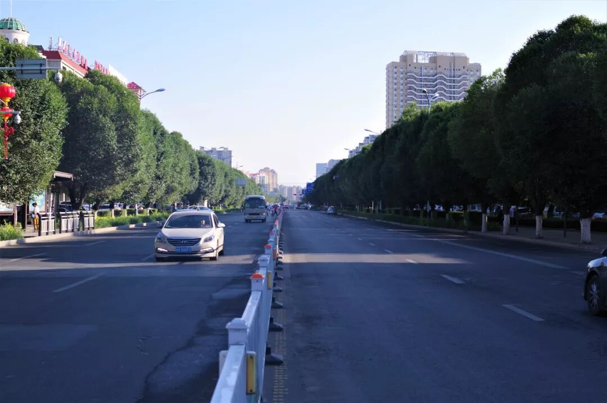

想知道我在干啥，请点这个链接：吃货的决心——555天中国饮食探索之行

想知道我要去哪，请点这个链接：555天行程计划（2018-06-20更新）

老板，再来半只鸡！

（长按识别二维码点击关注哦）

 var first_sceen__time = (+new Date()); if ("" == 1 && document.getElementById('js_content')) { document.getElementById('js_content').addEventListener("selectstart",function(e){ e.preventDefault(); }); }

 if ("0" == 1) { document.addEventListener("keydown",function(e){ if ((e.metaKey || e.ctrlKey) && (e.key === 'c' || e.key === 'C' || e.key === 'x' || e.key === 'X' || e.key === 'a' || e.key === 'A')) { if (e.target.tagName === 'INPUT' || e.target.tagName === 'TEXTAREA') { return; } e.preventDefault(); } }); document.addEventListener("copy",function(e){ var sel = window.getSelection(); var content = document.getElementById('js_content'); if (sel && sel.rangeCount > 0 && content && content.contains(sel.getRangeAt(0).commonAncestorContainer)) { e.preventDefault(); } }); }

预览时标签不可点

微信扫一扫

关注该公众号

知道了 (javascript:;)
