# 【第031天 乌鲁木齐（一）】新疆之魂——炒米粉

- 原文链接: https://mp.weixin.qq.com/s?__biz=MzA3MTM2Mjk3NA==&mid=2247503828&idx=1&sn=1a187b656b8d29e1bb4a0c45471d24b8&chksm=9f2c3f25a85bb633055e0d25c7aef15f94f5d1f501694fae497930a4013029c76d6e01fc150d&scene=21
- 作者: 宇哥食行记
- 发布时间: 未知
- 图片数量: 18

新疆的行程已接近尾声，绝大多数新疆的味道已被收入胃中，计划中剩下的食物已屈指可数。不过，想要完整地呈现新疆饮食，这寥寥的几样必不可少。

在大多数新疆人眼中，乌鲁木齐的饮食并未有较高的地位。我想，在人流量巨大的地方，做餐饮的存活成本并不高，所以即使不对味道有过高的追逐也能良好地经营下去。但是，乌市作为新疆的首府，自然地汇聚了新疆各地的饮食，即使不走遍全疆也能在乌市吃遍全疆；另一方面，即便对新疆人来说不那么“精细”“地道”的乌鲁木齐饮食，对于一个外来者来说，已经是相当权威的新疆味道，已经是一个了解新疆饮食的敞亮窗口。

这最后的三天，我将在乌鲁木齐完成这“查漏补缺”的最后一步，给新疆之行划下一个尽量完整的句号。

今天，从一碗炒米粉说起。

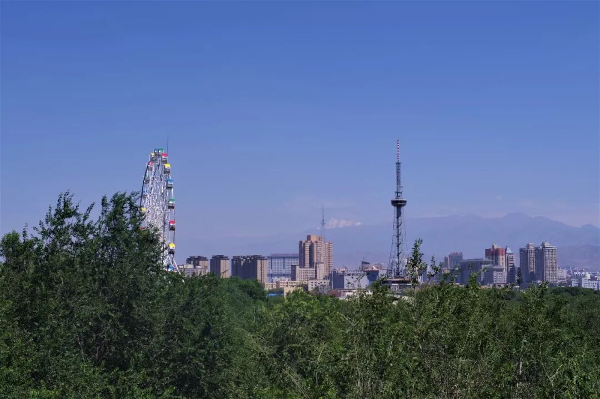

（远眺天山）

（1）

炒米粉

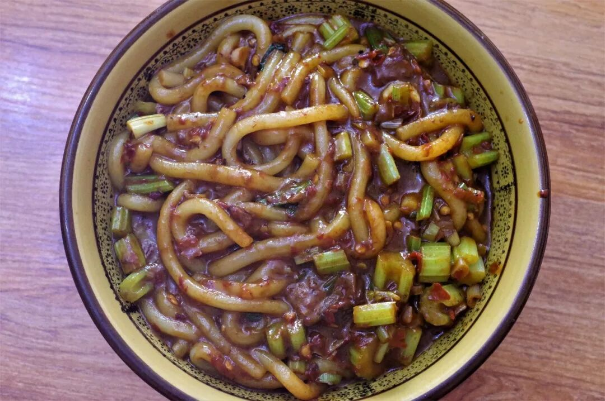

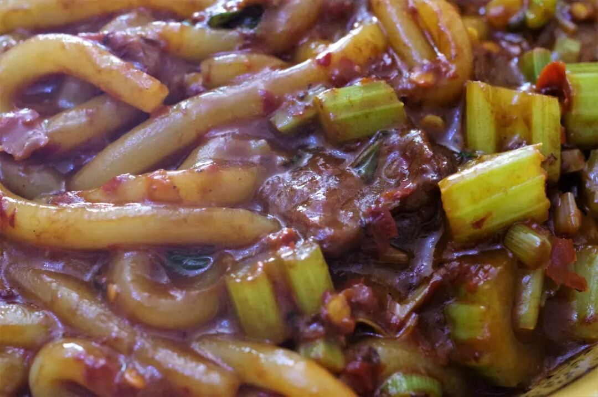

“一份牛炒（cǎo），微辣！”

令人意外的是，根据小规模调查的结果显示，如今离家在外的新疆人更念念不忘的新疆味道可能已不再是抓饭、拉条子、大盘鸡，而是这一碗貌不惊人甚至可以说毫无卖相的炒米粉。

米粉粗如细棒，挂着深红油亮的酱汁，刚一上桌那浓浓的酱香味便顺着升腾的热气扩散开来，直诱得人唾液疯狂分泌。挑起一簇粘稠的米粉送入嘴中，一瞬间竟感动得几欲落泪，那明显的豆瓣酱之味带着浓浓的四川印记。但是具体的味道却不同于四川食物的味道，是一种更加复合的香辣之味。还有一点不得不提的是，这微辣的辣度，已经与四川食物的平均辣度持平，若是再增加辣椒，怕是要吃得让人口吐三味真火了。

这样香而重的味道替代了抓饭、拉条子成为新的新疆人记忆中最深刻的味道，也是理所当然的吧。那一次次涕泗横流、吃到全身通透舒爽的体验，就是一次次深刻的烙印，深不见底。

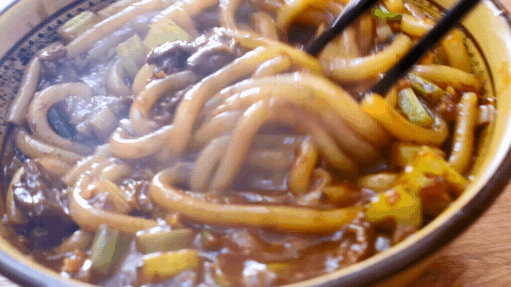

（2）

石河子凉皮

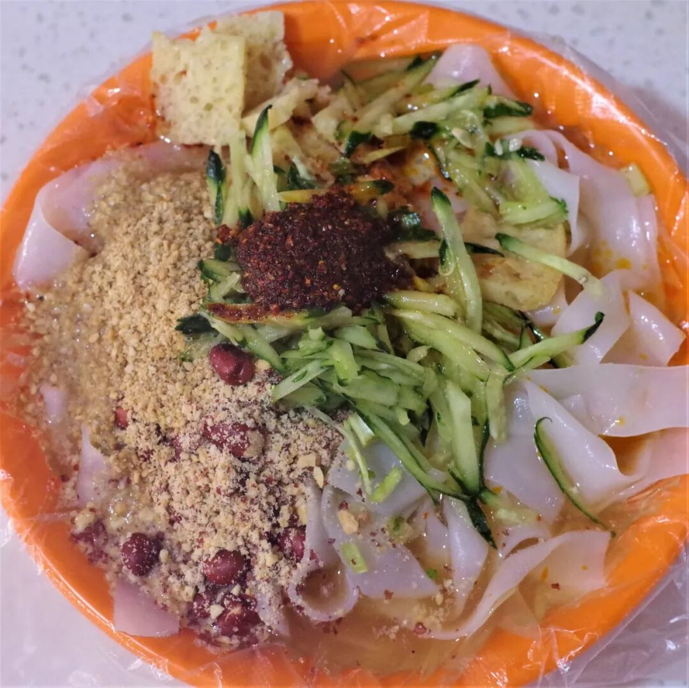

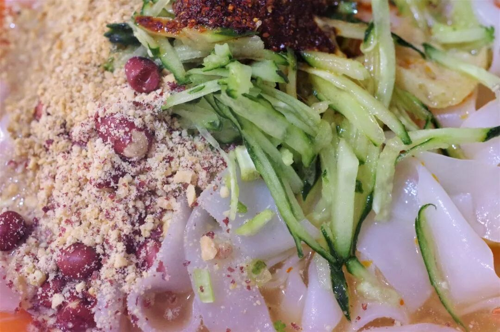

从秦岭淮河线往北，还吃着米粉的地方恐怕只有新疆了，这种跨地理常规界限的迁徙着实给新疆这片饮食宝地又添了新的色彩。（此段往上）

石河子凉皮其实是水洗面皮，切得薄如纸片、几近透明，但却保留了相当的脆韧之感。吃时调上醋汁、蒜泥、辣子、花生碎、黄瓜丝等，口感丰富，酸辣爽口，是夏季极好的清凉之食。

（3）

烤肉+黄面

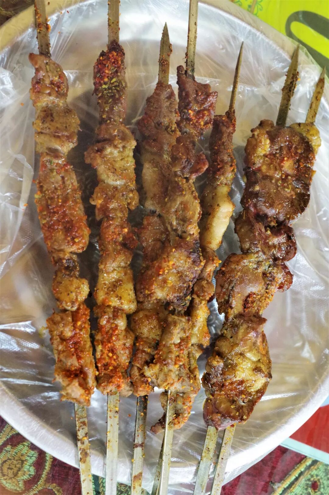

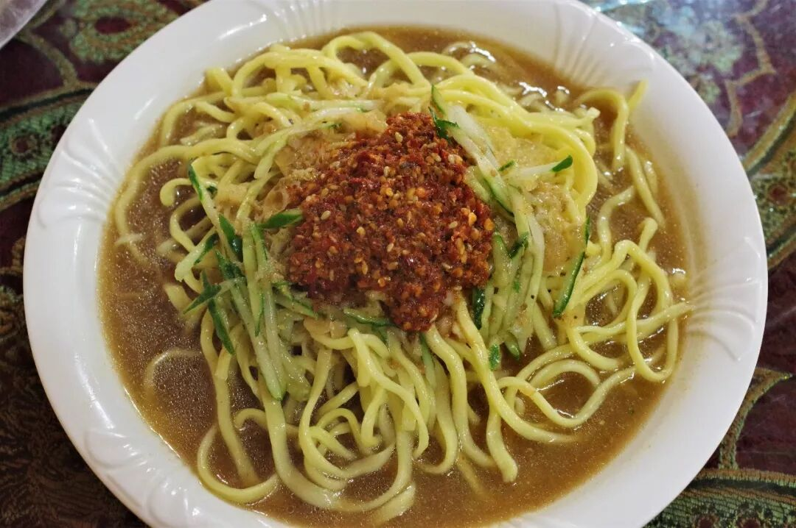

烤肉在新疆并不特别，但在北疆却有一种独特的搭配，即烤肉加黄面，据闻源于昌吉市奇台县。黄面的口味并不复杂，不过是简单的酸辣口带点蒜香，与烤肉相配却能起到极好的去油解腻之用。另一方面，吃几口黄面还能占掉一部分胃容量，不至于烤肉吃得太猛摄入太多油脂与蛋白质。

至于新疆的烤肉，你若问我吃得腻吗？我会说，这根本不成为一个问题。

今天吃？还是明天吃？这才是一个问题。

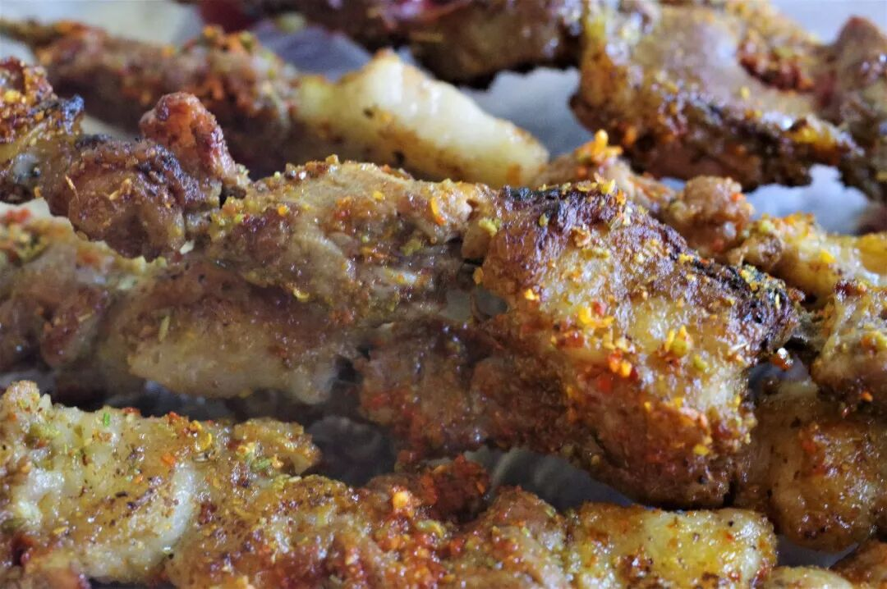

（羊肉）

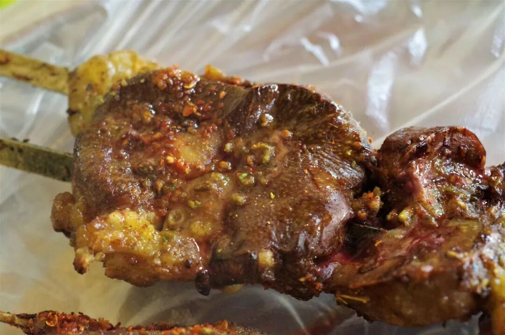

（羊腰）

（4）

蟠桃、葡萄

除了肉，新疆最诱人的永远还有瓜果。无论是绵软多汁的蟠桃，还是香脆蜜甜的葡萄，都是你绝不愿意错过的汁水诱惑。多说无用，直接上图：

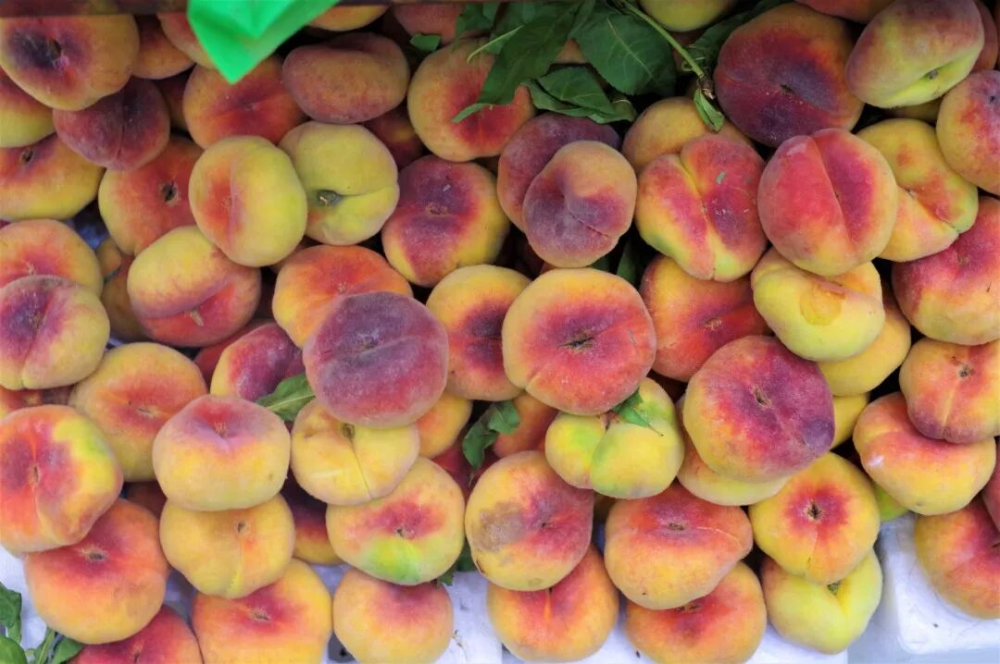

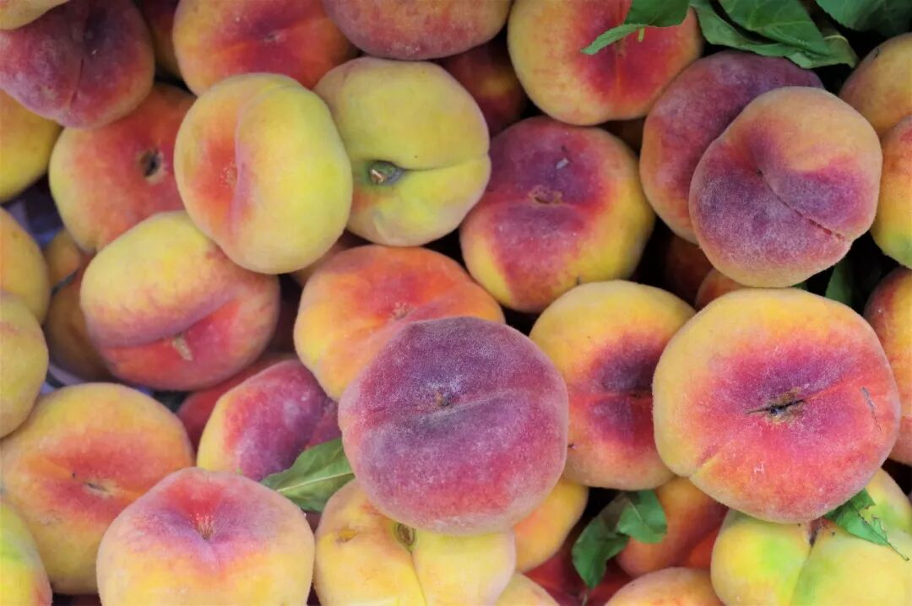

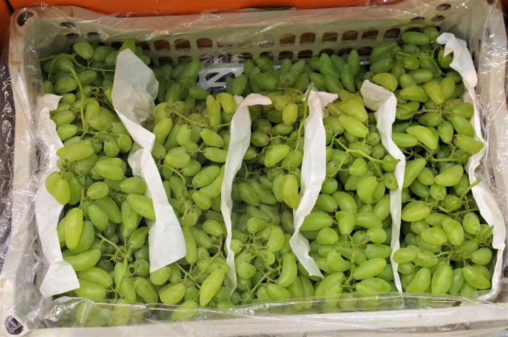

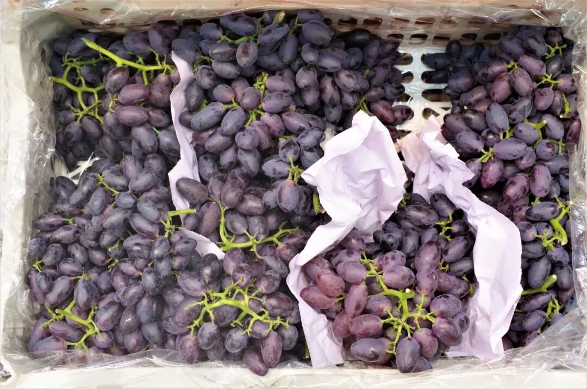

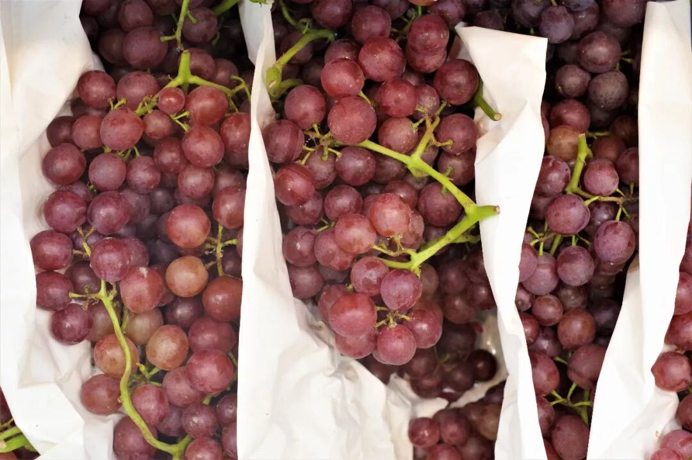

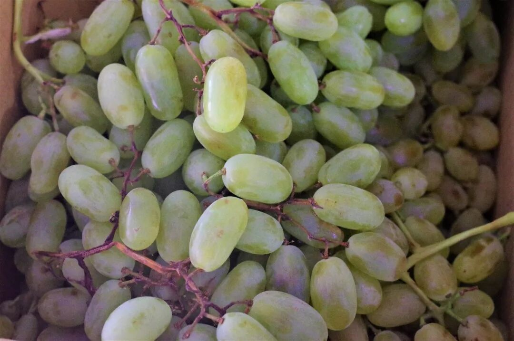

今日之食，就到这里。明天，将会有大菜出现。毕竟，椒麻鸡只是新疆的三鸡之一呢。

而我，则要躺下一颗一颗吸葡萄了。

想知道我在干啥，请点这个链接：吃货的决心——555天中国饮食探索之行

想知道我要去哪，请点这个链接：555天行程计划（2018-06-20更新）

炒米粉，真辣。

（长按识别二维码点击关注哦）

 var first_sceen__time = (+new Date()); if ("" == 1 && document.getElementById('js_content')) { document.getElementById('js_content').addEventListener("selectstart",function(e){ e.preventDefault(); }); }

 if ("0" == 1) { document.addEventListener("keydown",function(e){ if ((e.metaKey || e.ctrlKey) && (e.key === 'c' || e.key === 'C' || e.key === 'x' || e.key === 'X' || e.key === 'a' || e.key === 'A')) { if (e.target.tagName === 'INPUT' || e.target.tagName === 'TEXTAREA') { return; } e.preventDefault(); } }); document.addEventListener("copy",function(e){ var sel = window.getSelection(); var content = document.getElementById('js_content'); if (sel && sel.rangeCount > 0 && content && content.contains(sel.getRangeAt(0).commonAncestorContainer)) { e.preventDefault(); } }); }

预览时标签不可点

微信扫一扫

关注该公众号

知道了 (javascript:;)
