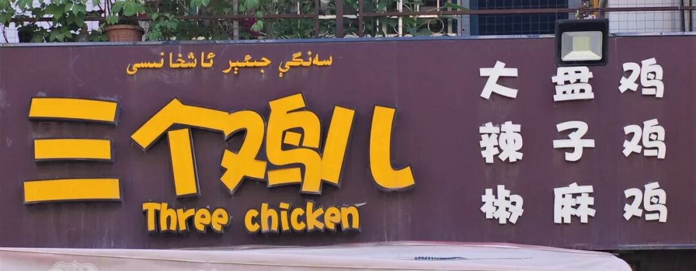
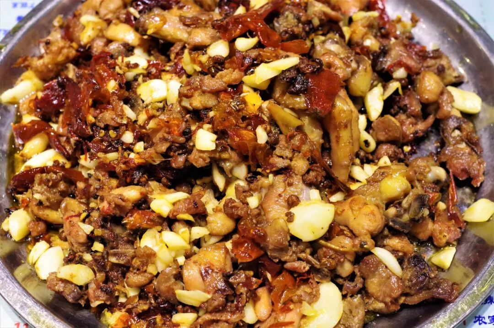
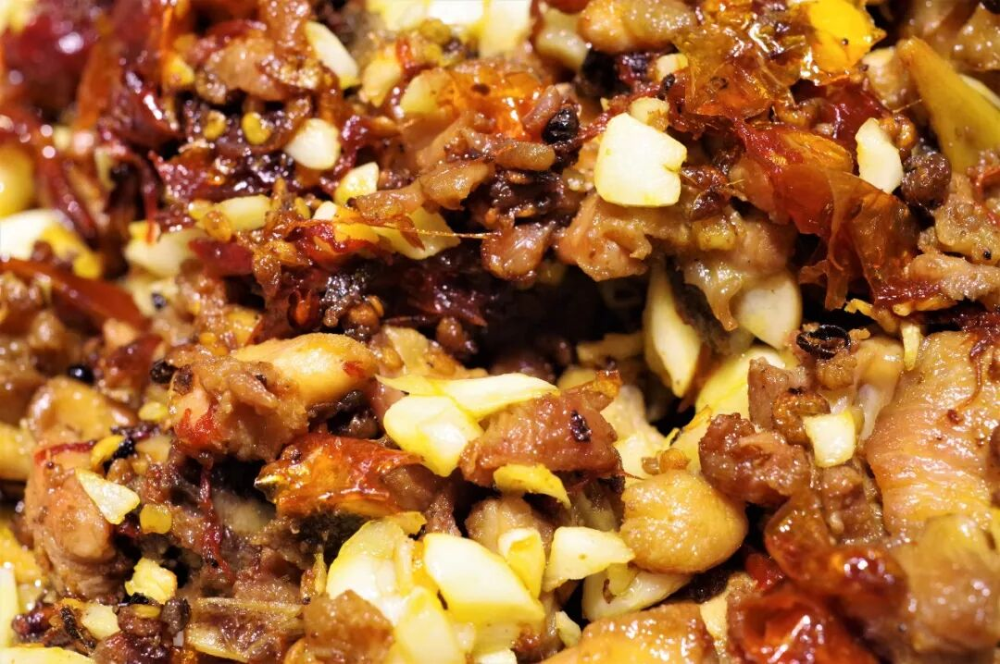
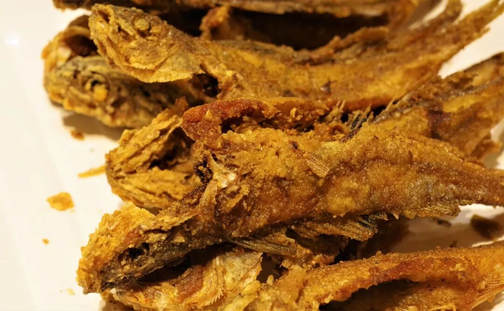
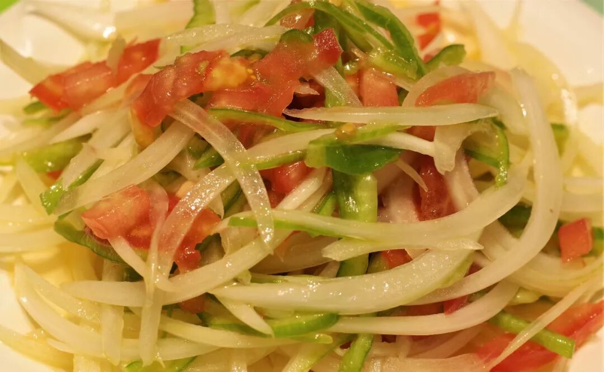
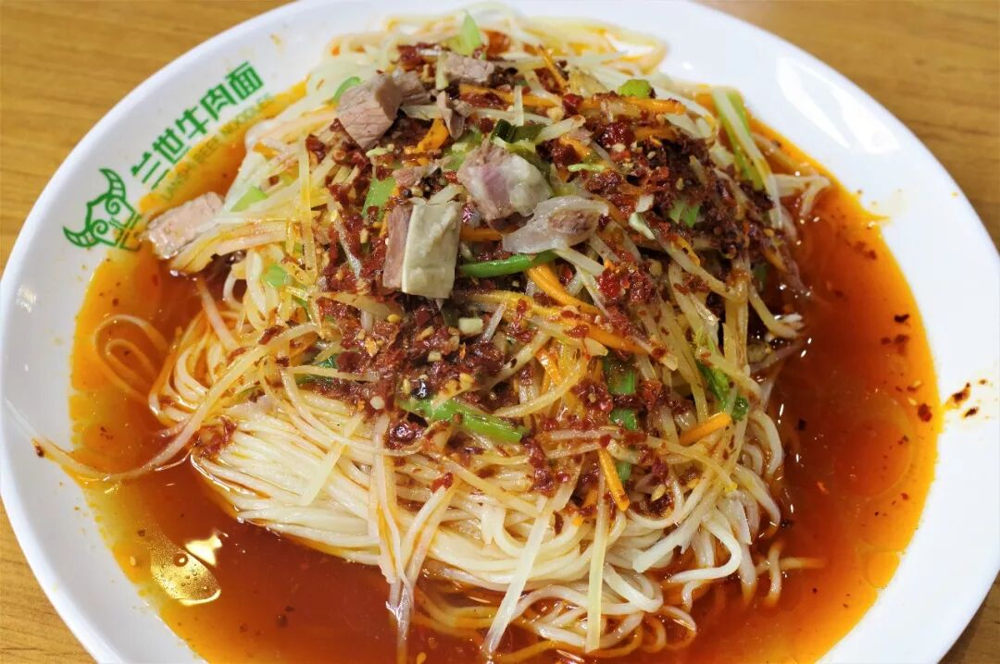
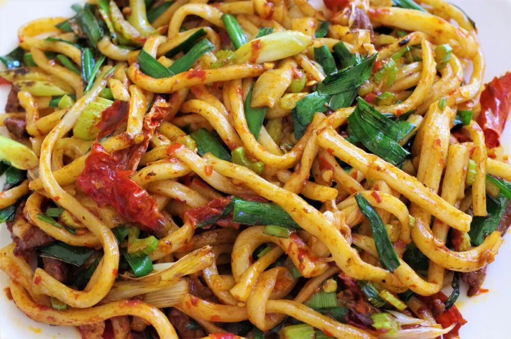
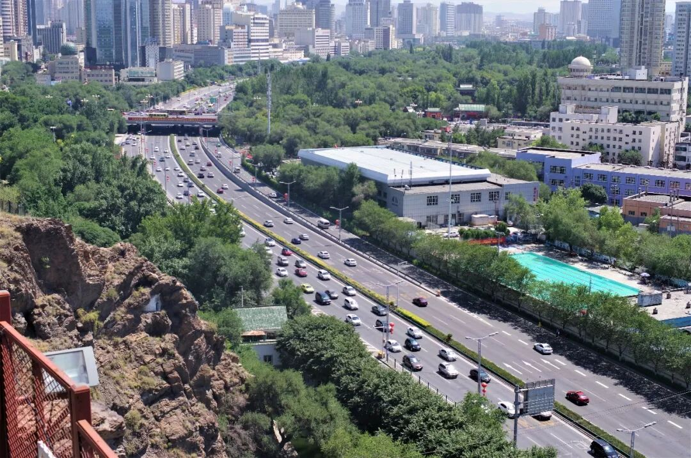

# 【第032天 乌鲁木齐（二）】新疆辣子鸡知多少？

- 原文链接: https://mp.weixin.qq.com/s?__biz=MzA3MTM2Mjk3NA==&mid=2247503827&idx=1&sn=9a8f32644dadf1945e66fbb63bade610&chksm=9f2c3f22a85bb634dbcdb47b8f6f168dd53c1de42f1b7163a4d52930b61f51eecae900ca41e3&scene=21
- 作者: 宇哥食行记
- 发布时间: 未知
- 图片数量: 11

烈日当空，伴着地铁修建的尘土飞扬，乌鲁木齐的热难免带上几分魔幻现实主义之色。虽然身居内陆，今天的乌鲁木齐与中东部的二三线城市乍眼似乎已不见多少分别，味道之上的分异因而显得更加明晰。

说起新疆的大菜，最广为人熟知的或许就是三大鸡：椒麻鸡、辣子鸡、大盘鸡。今日之食，则要从这第二大鸡——辣子鸡开始。

（1）

柴窝堡辣子鸡

说起辣子鸡，名气最大的应该是以重庆为代表的渝派川菜辣子鸡，其次是以贵阳、安顺等地为代表的黔菜辣子鸡，若是说起新疆的辣子鸡，外省人多半会挠头示问，其知名度远低于椒麻鸡与大盘鸡。

新疆辣子鸡最初起源于乌鲁木齐东南郊柴窝堡镇的312国道旁，是以川味辣子鸡为蓝本加以改进和本土化而创制的改良菜肴，如今在新疆流传范围最广泛的也是柴窝堡辣子鸡。交通要道是一片非常容易催生优良菜品的徒土地，中国有大量具有地方影响力的饮食最初诞生于各种国道、省道之旁，所以说“要致富，先修路”之外，也应有“要吃菜，先修路”呢。

话说回柴窝堡辣子鸡，晃眼一看与川味辣子鸡并无太大区别，但干辣椒的数量明显减少，且分布着密集的蒜块。尝一口鸡肉，辣椒的香味浓郁但辣味较轻，同时带有厚重的蒜味和轻微的麻味，鸡肉鲜嫩柔韧，既不老柴也有嚼劲。吃两口鸡肉再来几块蒜，去油解腻。比起重辣重麻的川味辣子鸡，柴窝堡辣子鸡的口味能适应更大规模的食客，也难怪会火遍新疆。

（2）

干炸五道黑

五道黑是一种冷水鱼，体型较小，在中国仅分布于新疆北部以阿勒泰地区为主的冷水河湖中，此次得以在乌市品尝到实属幸运。由于其较小的体型，油炸是最为普遍推崇的烹制方法。冷水鱼普遍拥有紧实的肉质，经过油炸后五道黑鱼表皮焦香酥脆，而鱼肉丰满爽韧，吃时满口留香。

（3）

老虎菜

最能够体现新疆特色的一道凉菜，非老虎菜莫属。老虎菜又被叫做皮辣红，是用三种新疆极为常见和普遍使用的蔬菜，即皮牙子（洋葱）、辣椒、西红柿切丝凉拌而成。老虎菜并不需要复杂的调味，只需简单的盐、糖、醋即可充分激发出清脆的口感、酸爽的口味，是一顿大鱼大肉宴之上极佳的开胃、调剂或解腻的小菜。

（4）

干拌牛肉面

兰州牛肉面传入新疆已有多年，如今在新疆各大城市的街头都能找到或多或少的牛肉面馆，除了传统的兰州式清汤牛肉面得以保留外，新疆也发展出了独具自身特色的牛肉面吃法，干拌牛肉面便是一例。

所谓干拌，无非是将牛骨汤的量减少，再加上等量的辣子，附上些红黄萝卜丝等拌而食之。汤的鲜香之味并未改变，面条的爽滑劲道也未改变，但更加浓重的油辣味、更加丰富的口感确给一碗牛肉面披上了新疆的衣裳。若你并不为较为清淡的兰州式清汤牛肉面而狂热，不妨试试这新疆版本的干拌牛肉面，或许有不一样的评价。

（5）

干煸炒面

在新疆，除了汤饭、拌面，另一种极为平常的面食吃法便是炒面，这其中又以干煸炒面最为普遍。新疆的食物大多会给人一种极其重口的既视感，但往往尝后才知其“形式大于内容”的特点，就像这干煸炒面，虽看上去鲜红油辣，吃起来只是带有轻微的辣味，更多是咸香油润，令人完全可以想象在饥饿之时呲溜着吸完一大盘面条的畅快之感。

又是碳水、蛋白质大量摄入的一天，在新疆，这实在就是种再正常不过的状态，总令人既痛快，又悔恨。痛快比较多，悔恨有一丁点儿。

明天便是在新疆的最后一天了，要用哪一鸡收尾，也是明摆着的事。不过，还是要期待一下，毕竟没有入嘴，纸上谈食才没有意思呢。

跑步去了。

想知道我在干啥，请点这个链接：吃货的决心——555天中国饮食探索之行

想知道我要去哪，请点这个链接：555天行程计划（2018-06-20更新）

辣子鸡什么的，一个人干一个中盘就好了。

（长按识别二维码点击关注哦）

 var first_sceen__time = (+new Date()); if ("" == 1 && document.getElementById('js_content')) { document.getElementById('js_content').addEventListener("selectstart",function(e){ e.preventDefault(); }); }

 if ("0" == 1) { document.addEventListener("keydown",function(e){ if ((e.metaKey || e.ctrlKey) && (e.key === 'c' || e.key === 'C' || e.key === 'x' || e.key === 'X' || e.key === 'a' || e.key === 'A')) { if (e.target.tagName === 'INPUT' || e.target.tagName === 'TEXTAREA') { return; } e.preventDefault(); } }); document.addEventListener("copy",function(e){ var sel = window.getSelection(); var content = document.getElementById('js_content'); if (sel && sel.rangeCount > 0 && content && content.contains(sel.getRangeAt(0).commonAncestorContainer)) { e.preventDefault(); } }); }

预览时标签不可点

微信扫一扫

关注该公众号

知道了 (javascript:;)
