# 【第033天 乌鲁木齐（二）】我挥一挥衣袖，带走一胃新疆

- 原文链接: https://mp.weixin.qq.com/s?__biz=MzA3MTM2Mjk3NA==&mid=2247503826&idx=2&sn=1e6a6f026642352cca1adbbf17fd2e78&chksm=9f2c3f23a85bb6359a032da6e8690edd8ac2430bae3d891d56dbbab0facaccbb027e0e880457&scene=21
- 作者: 宇哥食行记
- 发布时间: 未知
- 图片数量: 15

即便在新疆已呆上十天，两个小时的时差仍未习惯，一入深夜便有内心的声音告诉我要早睡早起早吃饭。但已经是最后一天了。

新疆最常见的大大小小酸甜咸辣已几近尝遍，只剩下一声声jer的呼唤在耳旁久久不削弱。该是与你深入接触的时候了，大盘鸡。

（1）

大盘鸡

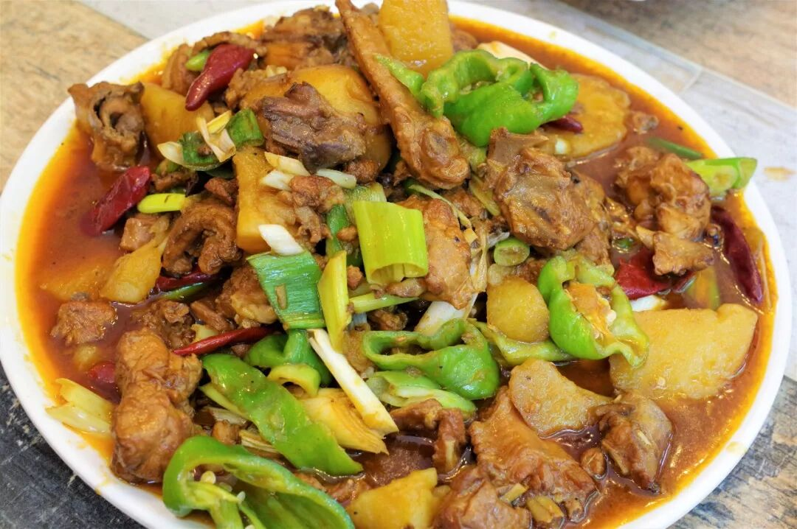

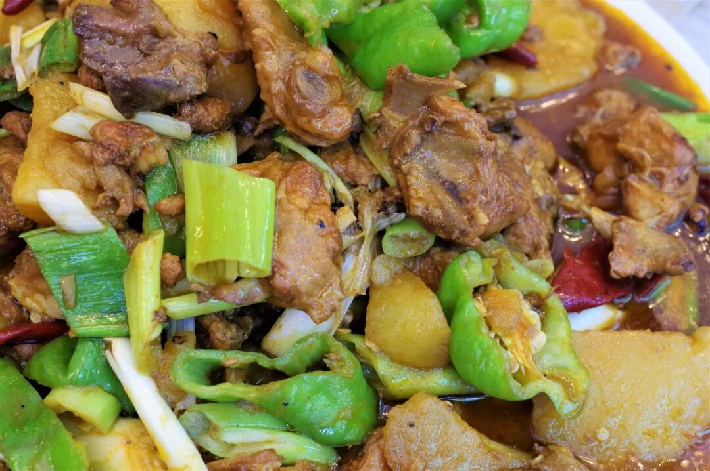

新疆大盘鸡最初起源于沙湾县，具体年代已不可考，但最多不过三五十年历史。若谈新疆的第一大菜，大盘鸡的地位当仁不让，在口外（疆外）的任何一家餐厅，椒麻鸡可能缺席，辣子鸡可能隐身，但大盘鸡之名一定会出现在显眼之处，令你的目光无处躲闪。

大盘鸡的原料并不复杂，无论进行何种改良或食材增减，一盘地道的大盘鸡至少需要鸡块、土豆与辣椒，三味一体，缺一不可。刚出锅的大盘鸡冒着热气，色泽红艳油量，散发出诱人的肉香。至于大盘鸡之味，若对其抱以过高的期待，也是不合适的。由于其流传的实在太过广泛，再加上并不复杂的烹饪方式，要将一盘大盘鸡做出惊世骇俗之味几乎不可能，但要将其做得难以下咽也同样不容易，一份烹制得恰当的大盘鸡，在入口咸香油润、鸡肉鲜嫩柔韧、土豆入味软耙之余，给人的感觉应该不过是“啊！这就是新疆，我来了，也吃在了嘴里！”这般。

没错，这里是新疆，我来了。大盘鸡，我也吃过了。不遗憾了。

当然，作为大盘鸡标配的纳仁面，也不会缺席。

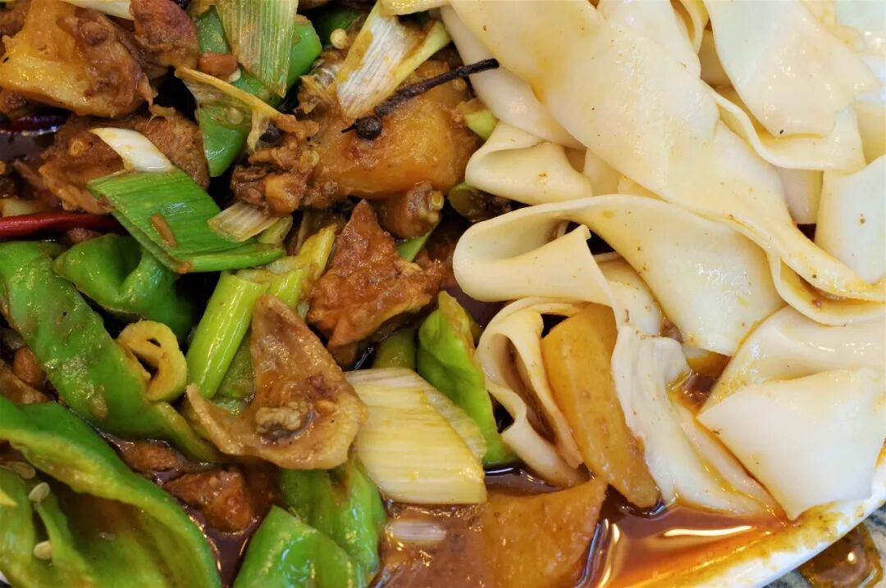

（2）

野蘑菇汤饭

在新疆的汤饭家族中，野蘑菇汤饭是极其重要的一员。这是种不复杂的面食，通俗理解不过是番茄面片加点野蘑菇丁，清淡的咸酸味中加点山野的气息。在新疆普遍重荤腥的日常饮食中，这口略显寡淡的吃食显得更加弥足珍贵，无论是作为油荤之余的调和型饮食，还是作为天寒体虚之时的暖身之食，都是相当合适的选择。

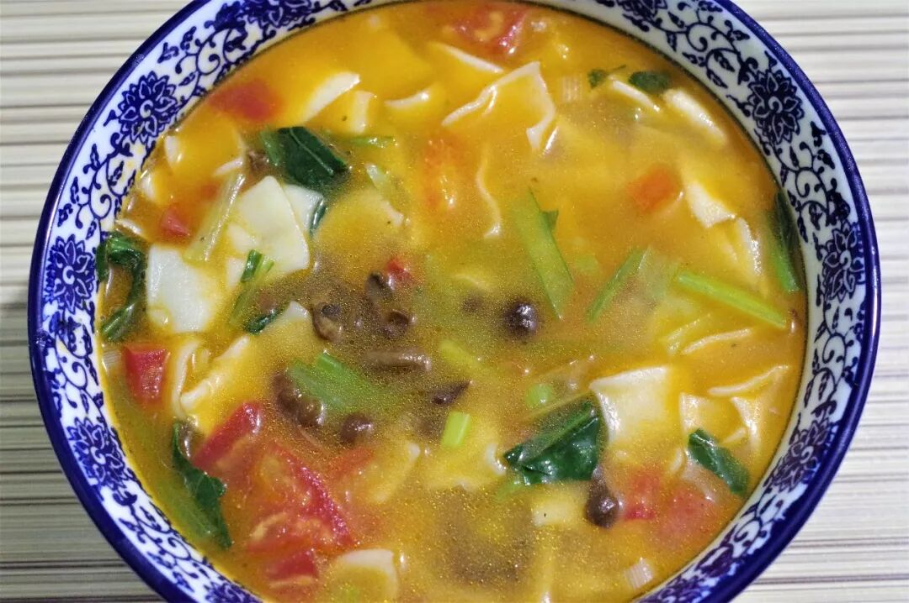

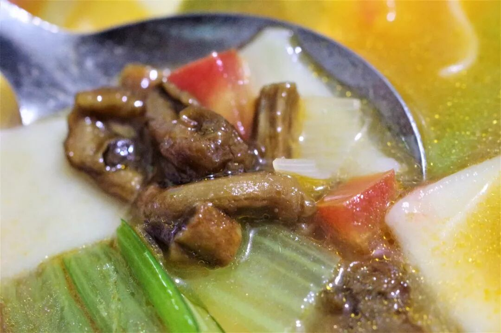

（3）

块肉抓饭

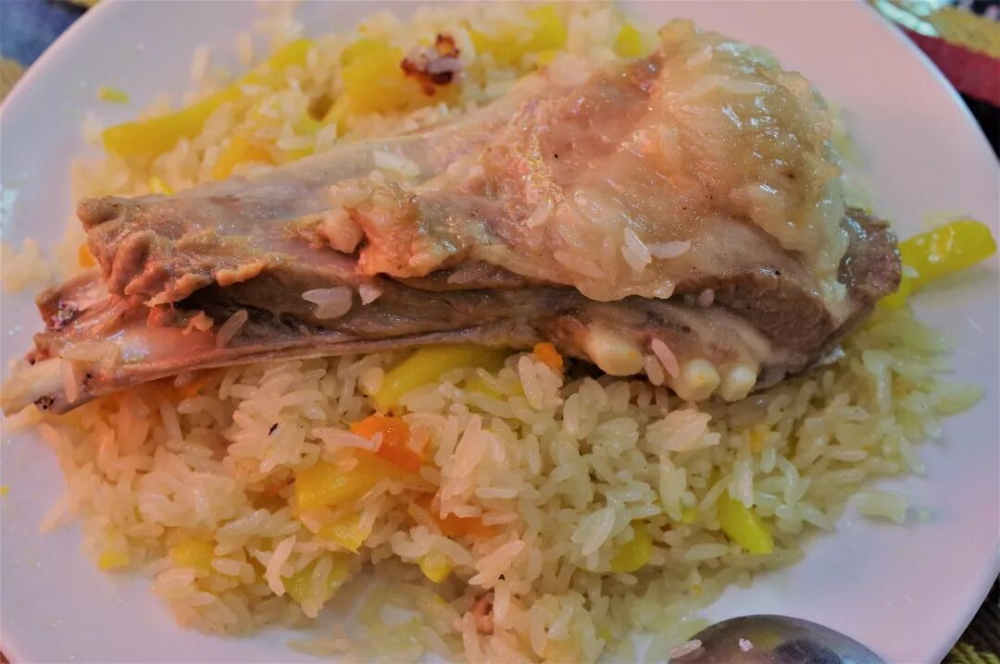

新疆的抓饭有多少种，没人数的清，也没人专门做过统计。这种食物的制作方式本身就决定了其原材料的普适性，所以你在新疆吃到任何抓饭都不应过于惊诧。不过，最普遍和食用范围最广的抓饭仍旧是羊肉抓饭。

普通的羊肉抓饭按照肉的形状与多少往往分为块肉抓饭和碎肉抓饭，命名简洁明了，块肉抓饭更能体现这西北饮食的粗犷与放荡不羁。一块几乎占掉整个盘子一半大小的羊腿肉，就这么不加掩饰地躺在油亮的抓饭之上，尽展婀娜丰腴之姿。吃一口油香四溢粒粒分明的抓饭，再把着骨头抓起羊肉大大地撕咬一口，成为神仙的体验也不过就这样吧。

（4）

馕、干果

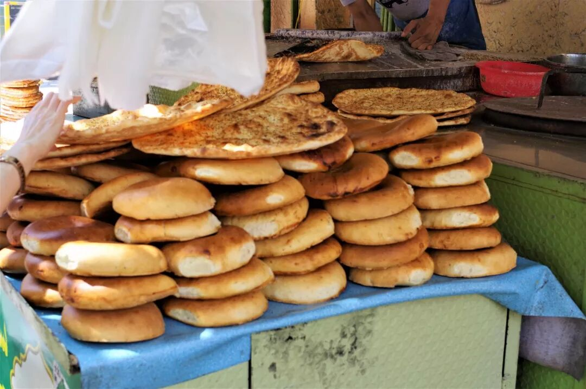

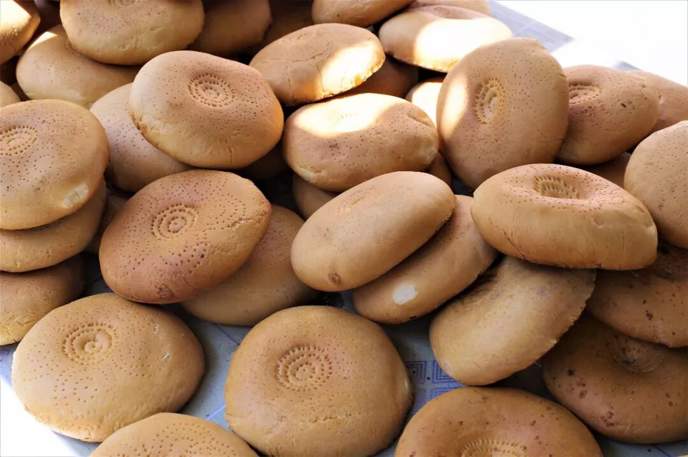

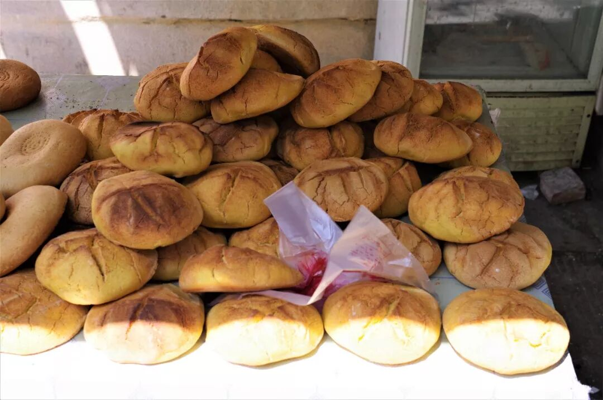

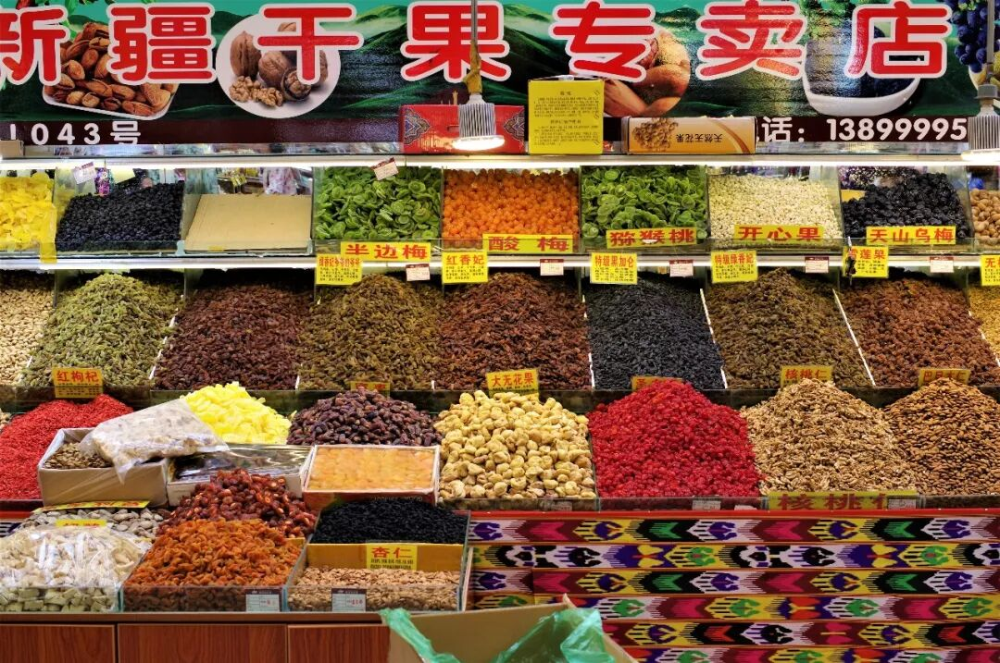

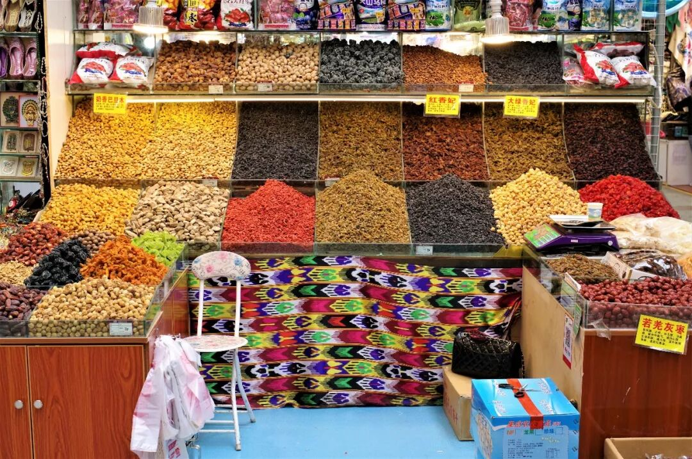

带走一个馕吧，咬下一口用力咀嚼，仿佛新疆还在我嘴里。

带走一包葡萄干吧，吃下一口回味甘甜，仿佛新疆还在我舌尖。

用吃来记住一个地方，恐怕是对这个地方一种极大的敬意了吧，一个吃货如是说。

那个吃货当然是我。

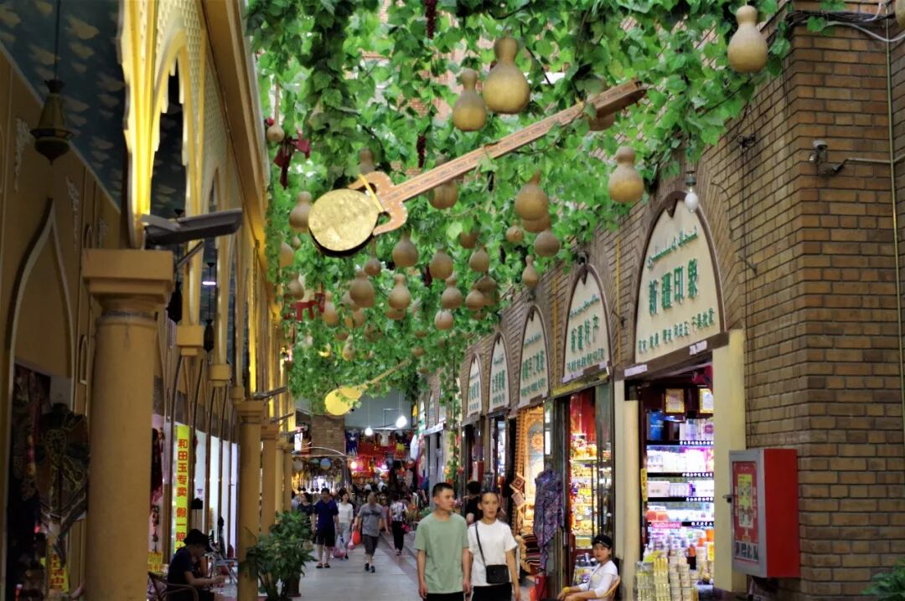

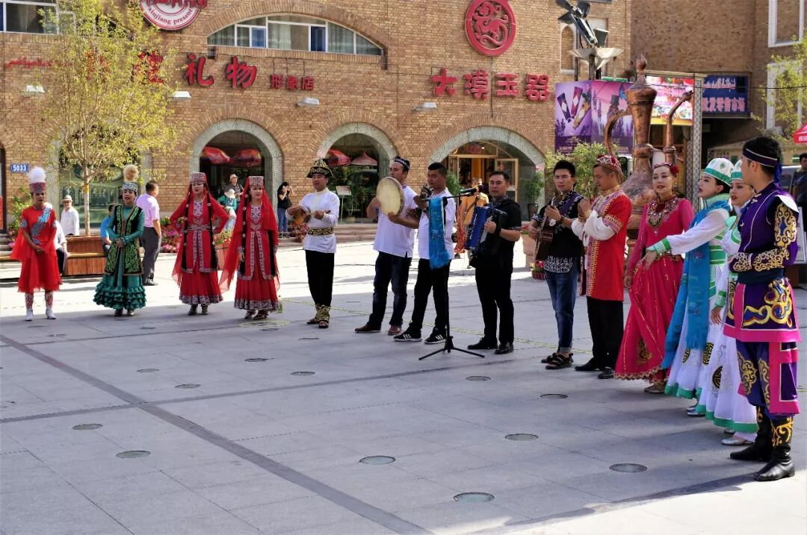

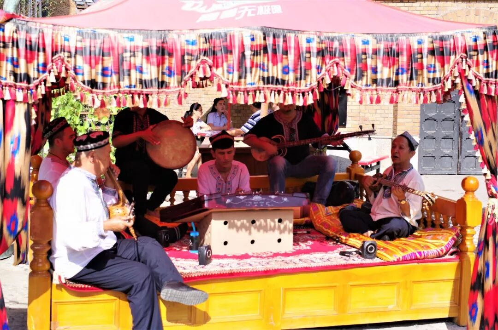

（新疆国际大巴扎）

新疆篇结语

新疆12天，匆忙是一定的。但这12天中嘴几乎没有闲着的时候，胃也几乎没有空着的时候。新疆有多好吃？我想这是一个不差的答案。

尽管南疆、北疆、牧区的吃食仍有各自的特点，今天的新疆饮食大融合之势已相当强烈，全然不必执着于一定要去某个地方吃某样东西。来到新疆，它不会让你饿肚子，只会让你掏钱买消食片，就是这么任性。

8月，是新疆最好的季节。你的各种假期差不多可以凑在一起，来一场西域之行了。如果这还没有诱惑到你，那你一定是一个假的吃货。打假不能停！

新疆，再会了！

想知道我在干啥，请点这个链接：吃货的决心——555天中国饮食探索之行

想知道我要去哪，请点这个链接：555天行程计划（2018-06-20更新）

在新疆，最大的危险应该是吃太撑。

（长按识别二维码点击关注哦）

 var first_sceen__time = (+new Date()); if ("" == 1 && document.getElementById('js_content')) { document.getElementById('js_content').addEventListener("selectstart",function(e){ e.preventDefault(); }); }

 if ("0" == 1) { document.addEventListener("keydown",function(e){ if ((e.metaKey || e.ctrlKey) && (e.key === 'c' || e.key === 'C' || e.key === 'x' || e.key === 'X' || e.key === 'a' || e.key === 'A')) { if (e.target.tagName === 'INPUT' || e.target.tagName === 'TEXTAREA') { return; } e.preventDefault(); } }); document.addEventListener("copy",function(e){ var sel = window.getSelection(); var content = document.getElementById('js_content'); if (sel && sel.rangeCount > 0 && content && content.contains(sel.getRangeAt(0).commonAncestorContainer)) { e.preventDefault(); } }); }

预览时标签不可点

微信扫一扫

关注该公众号

知道了 (javascript:;)
