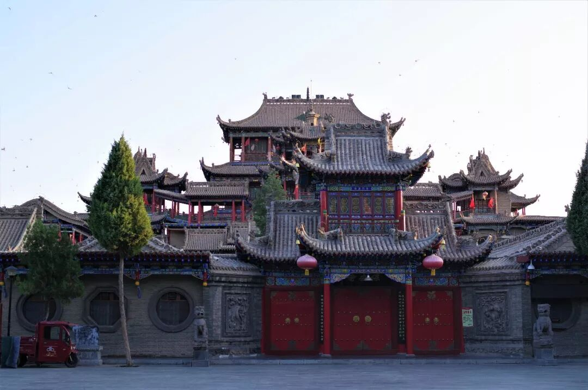
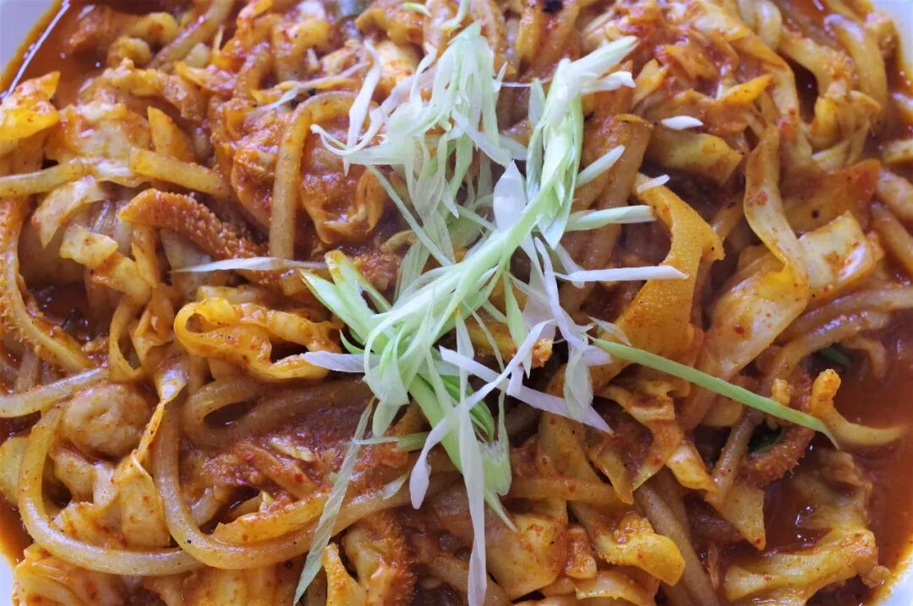
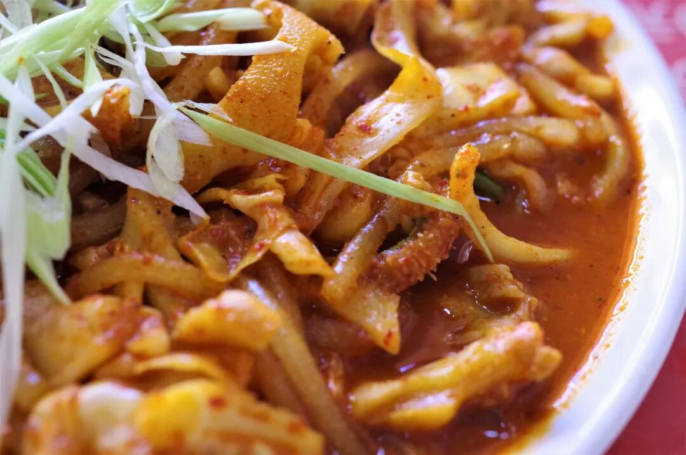
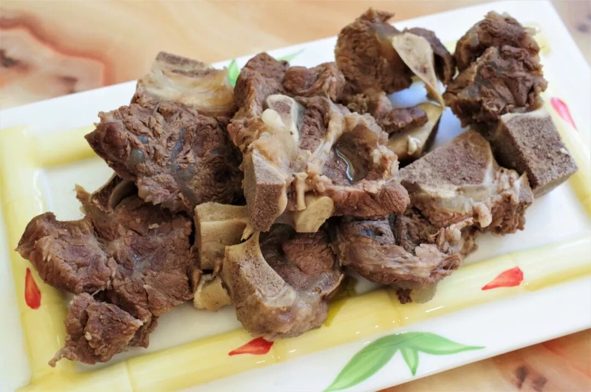
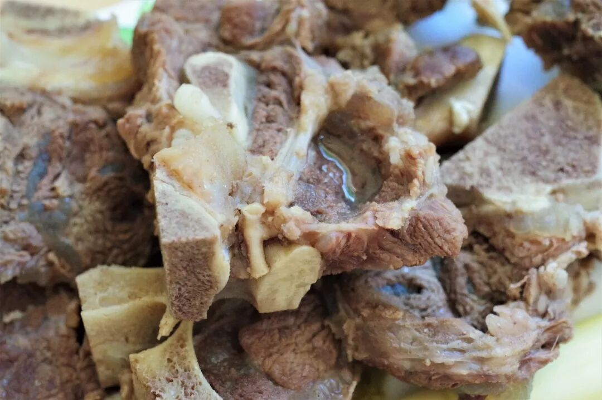
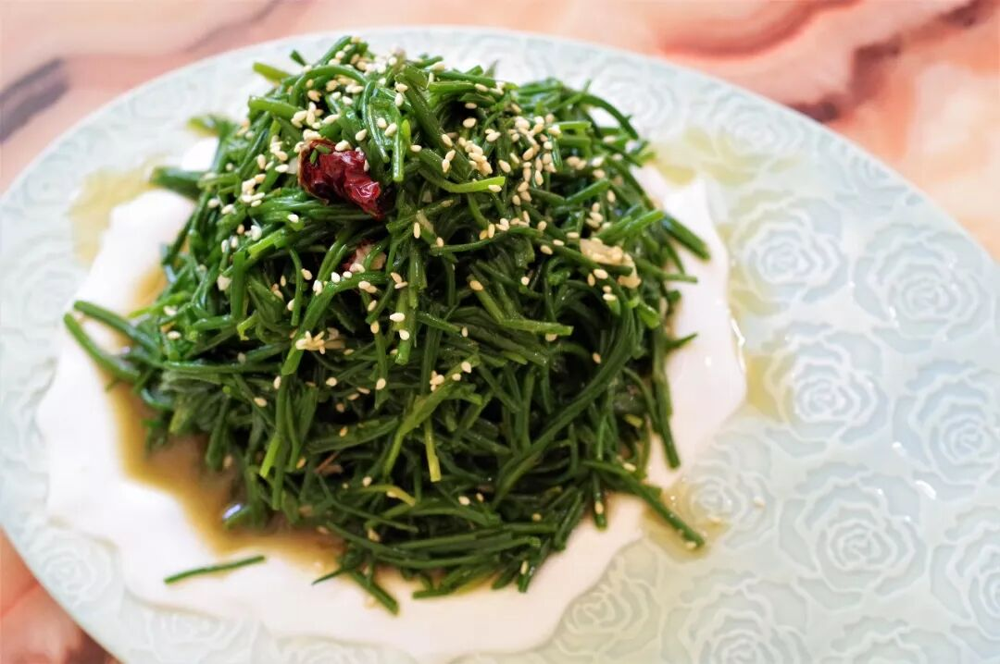
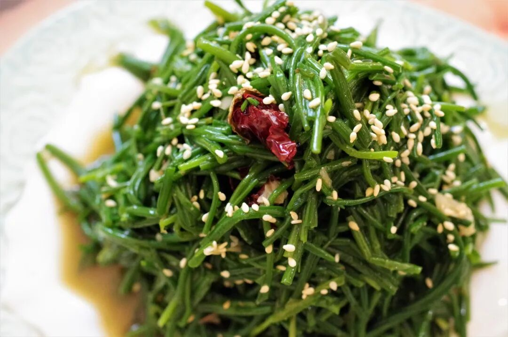
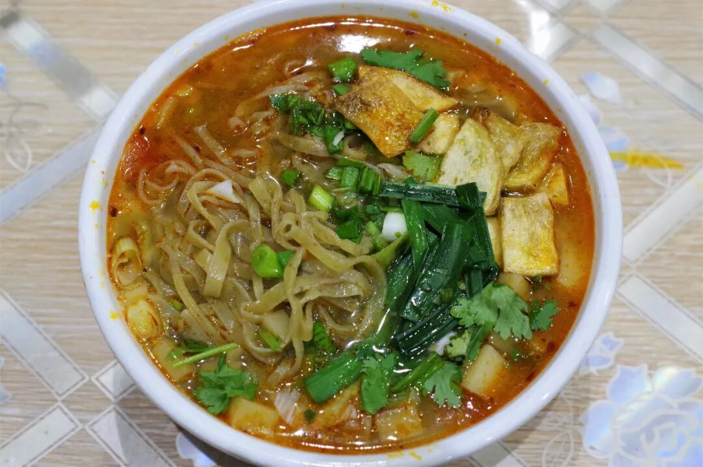
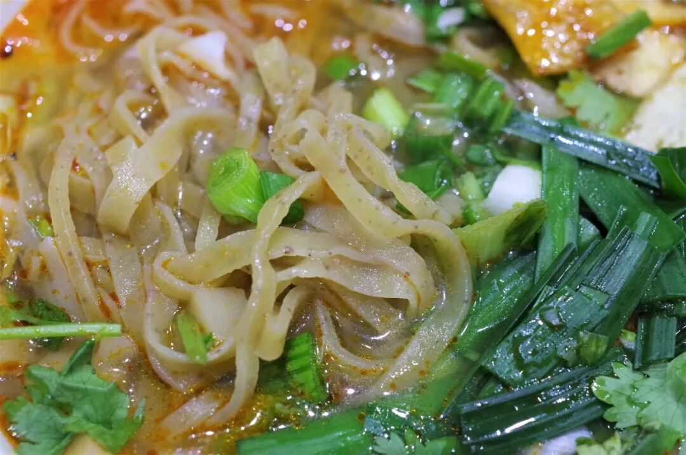
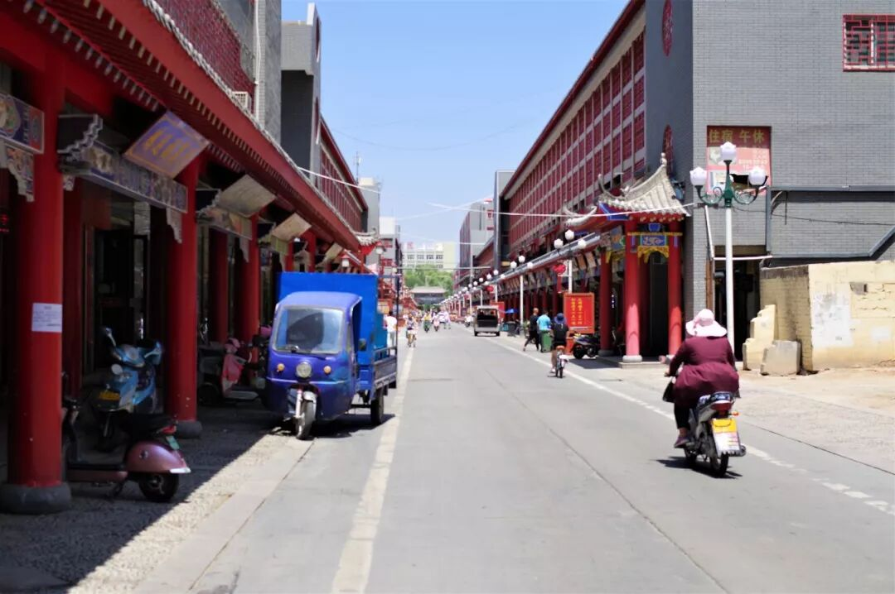

# 【第037天 中卫（一）】不去沙坡头就不能吃肉吗？

- 原文链接: https://mp.weixin.qq.com/s?__biz=MzA3MTM2Mjk3NA==&mid=2247503823&idx=1&sn=15319fed3ec9ba5737123bbbbecc3c92&chksm=9f2c3f3ea85bb6281de1a3b6e72c628e64bb889b6eedce391250ae14272db2c4c2b55a4c17b1&scene=21
- 作者: 宇哥食行记
- 发布时间: 未知
- 图片数量: 13

宁夏篇引言

宁夏回族自治区，光是这个名头就足以引发人对其清真饮食的无限遐想。回民清真饮食对整个中国北方日常地方饮食的影响从西北一路延伸至东北，基于这样一个前提，宁夏就绝不能是一笔带过的站点。

9天时间，走完宁夏的5个地级市，我将试图去呈现一幅尽量完整的宁夏清真饮食图，去证明塞上江南不只是型、色，还有那波澜壮阔的味。

宁夏之夏安能宁？

正文

这几年中卫的名声已不大不小，要说出沙坡头、腾格里沙漠之类的地名或不是难事，但若要谈及中卫的饮食，怕是把后脑勺抓坏了也蹦不出个准确的名词。

中卫处于甘肃、宁夏、内蒙交界之地，也是黄土坡向隔壁沙漠过渡之地，这种地理上的复杂性使得中卫的饮食也呈现出一种无法划归一类、各类皆有几味的特点。

来到这，有的吃。

（高庙保安寺）

（1）

酸菜炒肚丝

中卫最家常的菜之一，也是许多中卫人印记最深刻的一道家乡菜肴。这又一次证明了口味较重的食物更容易成为一个地方的人对于故乡味道的第一记忆。

酸菜炒肚丝有着明显的酸烂肉（白银第一菜）的影子，毕竟两地相邻，这种味道的传递和交融再正常不过。酸味极重的酸菜（大约是东北式酸菜酸度的2~3倍）、与肚丝（牛羊肚皆可）、粉条在锅中一通爆炒，最终呈上这样一盘其貌不扬的酸菜炒肚丝。

一旦吃上一口，强烈的酸辣味和强烈的爽脆刺激倏然袭来，令人猝不及防，只是疯狂地吃着这盘菜，毛孔顿开、汗流不止。若不是理智告诉我适可而止，连续吃上五六碗米饭也根本不在话下。你瞧，它就是这么厉害。

（2）

牛骨头

牛骨头是宁夏清真餐厅著名的硬食，是能与手抓羊肉分庭抗礼的存在。其制作与食用方法与手抓羊肉也有异曲同工之妙，即采用简单的清汤煮制，力求保持牛肉原始的香气，食用时蘸上些许醋蒜汁即可。

牛肉韧劲强、肉质硬，连着骨头的筋尤其顽固，因此吃牛骨头绝对算得上一场与其角力的比赛。用力地撕咬、把脸涨得通红也未必能将一块牛骨啃食干净，但是这种放纵的体验，不就是吃带骨肉最大的乐趣所在吗？更别提，肉是真正的香。

（3）

凉拌沙葱

久闻沙葱之大名，但我敢说，在未入口前没有人可以准确地想象出沙葱的具体滋味，因沙葱之名难免误导人将其与其他带“葱”字的蔬菜进行联想。实际上，在仔细品咂几口之后，我得出的结论是，沙葱的口感最接近空心菜与芹菜的混合口感。

中卫有大片的沙漠，沙葱是这里常见的蔬菜，而最常见的做法便是凉拌沙葱。清爽的酸辣味配上沙葱那独一无二的脆爽口感和淡淡的芳香，绝对能让你一口上瘾，也许一盘沙葱就能狂干三五瓶啤酒。

（4）

蒿子面

蒿子面源于中卫市中宁县，因和面时加入蒿面而得名，面条呈黄褐色并带有零星的褐色小点。当地蒿子面的煮制与臊子面无太大差异，使用时令蔬菜臊子做浇头，面汤咸酸微辣。而蒿子面本身则质地较硬，口感上较为接近荞面，吃起来嚼头十足。

蒿子面仅中卫有，用它来开启热乎乎的一天，何如？

（5）

西夏啤酒、金河奶啤

宁夏本地的啤酒与饮料，是每一个来到宁夏的游人更接近当地人饮食体验的重要一步，佐餐解渴有何不可。

夜幕已降临，那些沙漠里的游人或许已归来，他们或许也在大街小巷中穿梭着要找寻一些蛋白质与酒精来慰藉疲乏的身体。

我已经走在前了，虽未前往沙坡头，肉已在我胃里头。

我才是赢家呢，哈哈。

想知道我在干啥，请点这个链接：吃货的决心——555天中国饮食探索之行

想知道我要去哪，请点这个链接：555天行程计划（2018-07-26更新）

你啃牛骨头的样子真好看。

（长按识别二维码点击关注哦）

 var first_sceen__time = (+new Date()); if ("" == 1 && document.getElementById('js_content')) { document.getElementById('js_content').addEventListener("selectstart",function(e){ e.preventDefault(); }); }

 if ("0" == 1) { document.addEventListener("keydown",function(e){ if ((e.metaKey || e.ctrlKey) && (e.key === 'c' || e.key === 'C' || e.key === 'x' || e.key === 'X' || e.key === 'a' || e.key === 'A')) { if (e.target.tagName === 'INPUT' || e.target.tagName === 'TEXTAREA') { return; } e.preventDefault(); } }); document.addEventListener("copy",function(e){ var sel = window.getSelection(); var content = document.getElementById('js_content'); if (sel && sel.rangeCount > 0 && content && content.contains(sel.getRangeAt(0).commonAncestorContainer)) { e.preventDefault(); } }); }

预览时标签不可点

微信扫一扫

关注该公众号

知道了 (javascript:;)
