# 【第038天 中卫（二）】你不知道的酸甜苦辣

- 原文链接: https://mp.weixin.qq.com/s?__biz=MzA3MTM2Mjk3NA==&mid=2247503822&idx=1&sn=c0e0fa7cd25b546972f52b2879076b8b&chksm=9f2c3f3fa85bb629758429a94b9bead78edfee48a2d873d8898450f6d53a36888f455d09e0ec&scene=21
- 作者: 宇哥食行记
- 发布时间: 未知
- 图片数量: 17

中卫，是西北一路来就城市建设而言令我最舒服的城市之一。禁止机动车同行的中轴观景线，整齐划一的建筑外立面，全日遮阴的两排行道树，以及那几乎可以作为大量城市学习模板的公园，都不禁让人遐想，若是安居于此幸福指数恐不会低。

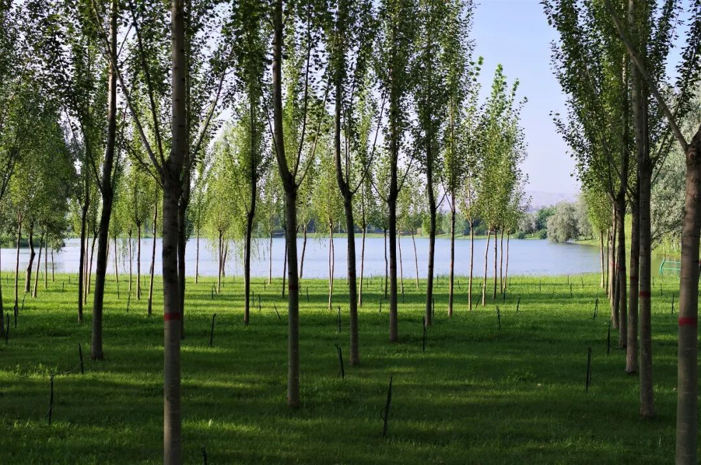

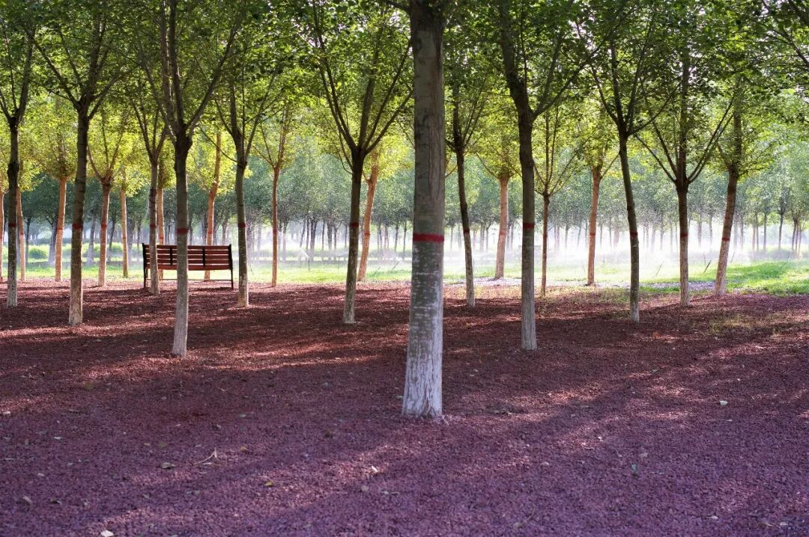

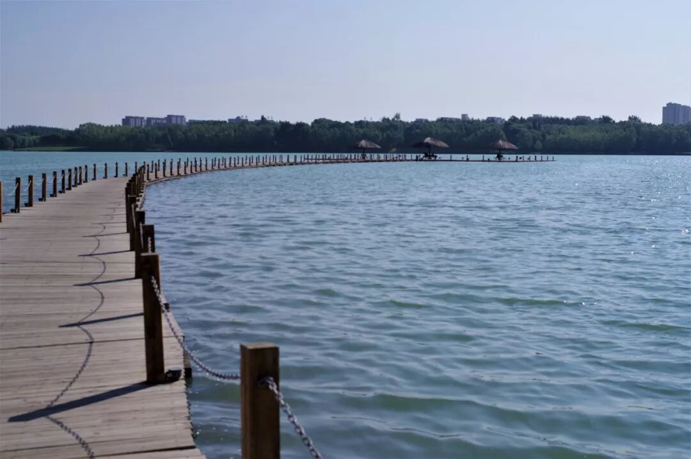

（香山公园）

令人意外的是，作为一个靠近甘肃的西北城市，中卫并没有发展出丰富的早点文化，若是清晨七八点钟行于街头，能看见的只有一幅门庭紧闭略微冷清的画面。与此相对应，太阳落山后这座城市却愈发热闹，当地人与外来者一同加入这场夜幕下的狂欢，不醉不休。

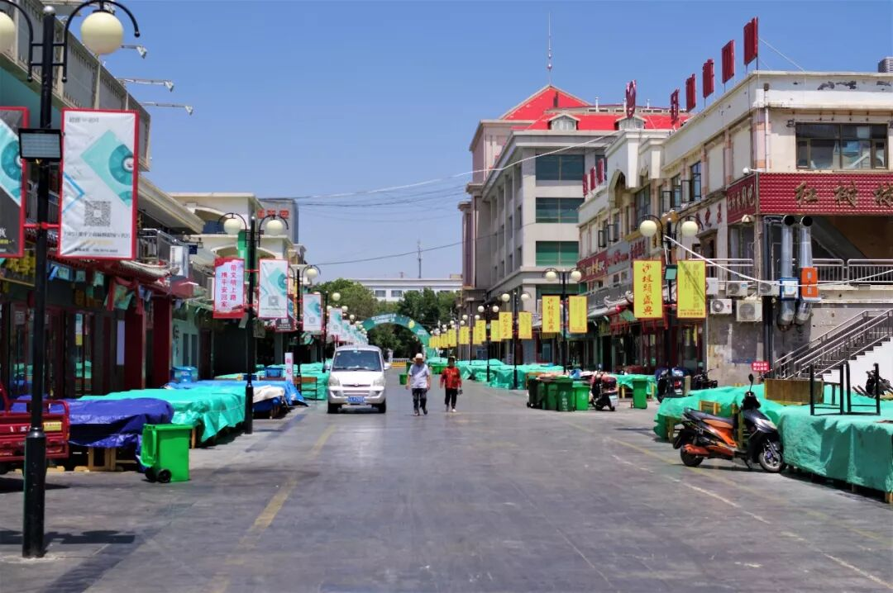

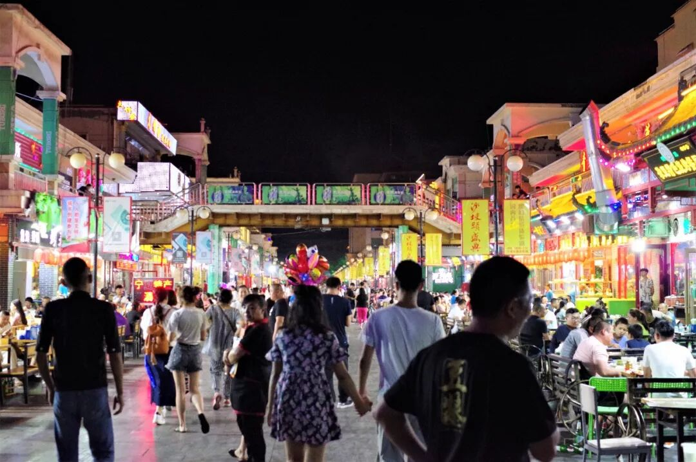

（昼与夜）

不过，烧烤啤酒终非来到中卫的意义，那计划中的几种味道在哪里呢？

（1）

炒拉条

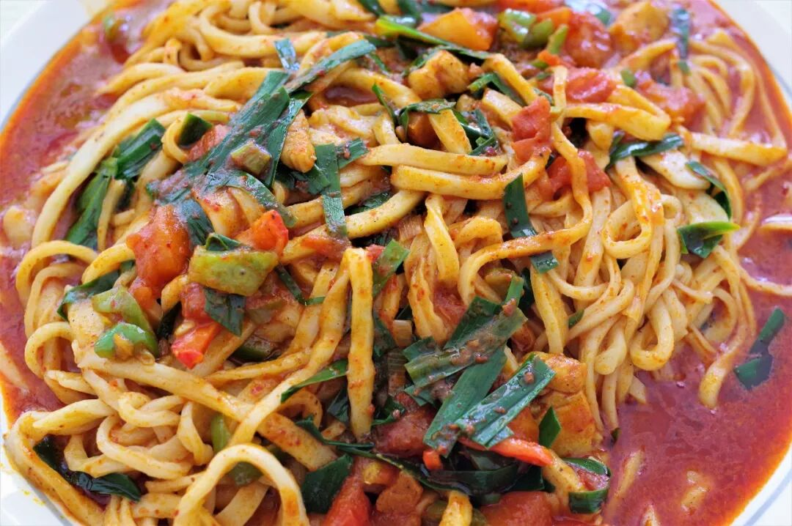

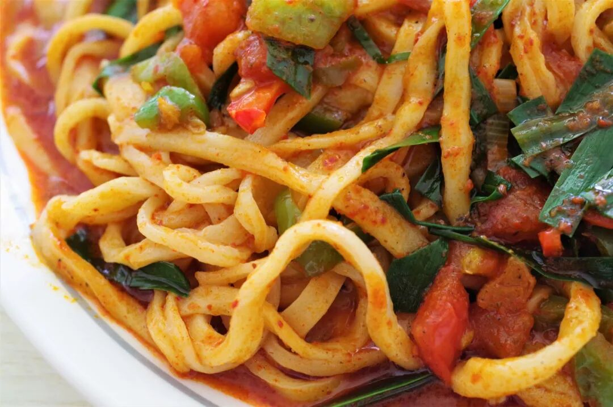

拉条面乃西北地区尤其常见的面食种类，形状较为粗大。而中卫炒拉条则是富有当地特色的一种主食。

与西北通常的炒面类似，中卫炒辣条汤汁浓稠，颜色红艳，韭菜段又点缀出一缕缕绿色。将面条充分搅拌大吸一口，强烈的酸、辣之香席卷口腔，附带阵阵韭菜的清香穿梭其间，令人忍不住吸干面上所挂的每一点汤汁。再配上极富嚼劲的面条，只得大呼过瘾。

（2）

烩小吃

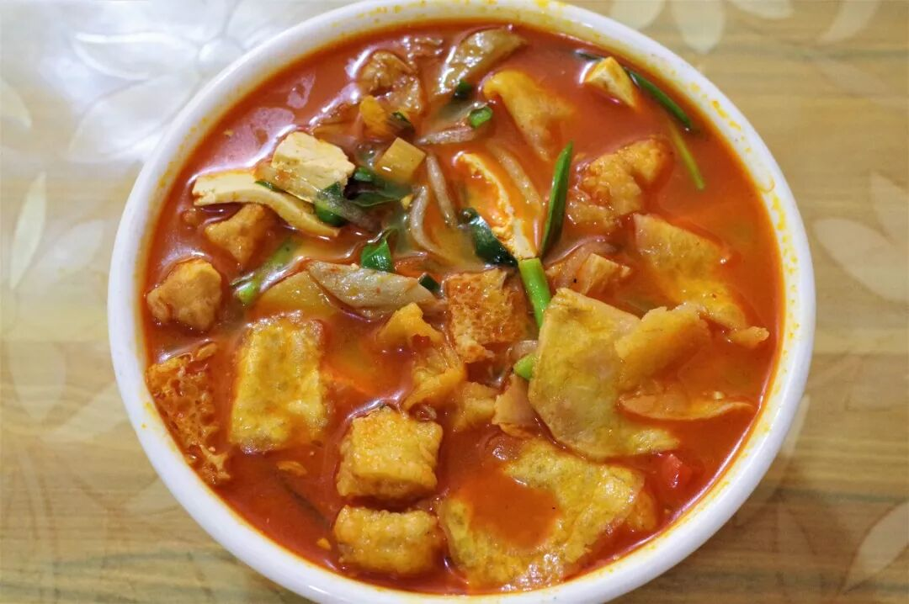

大概没有人会想到“烩小吃”竟是一道菜的名字，这种命名的模棱两可，大概就像“烩主食”“烩甜点”一般，但它的确是中卫当地家喻户晓的家常菜，在中卫大大小小的餐厅中都可以轻易吃到。烩小吃又叫素杂烩，若是看到后者，也是一样的东西。

烩小吃并没有固定的食材构成，夹板子、豆腐、粉条、面筋等是比较通用的几样，往往还会加上其他时蔬。这道不拘泥于食材、形式的汤菜，其实尽显了西北人在食物制作上的气概，不管你认同或欣赏与否，一碗物美价廉的烩小吃再配上一两碗米饭，配得上一顿令人心满意足的午饭。

（3）

烤羊排

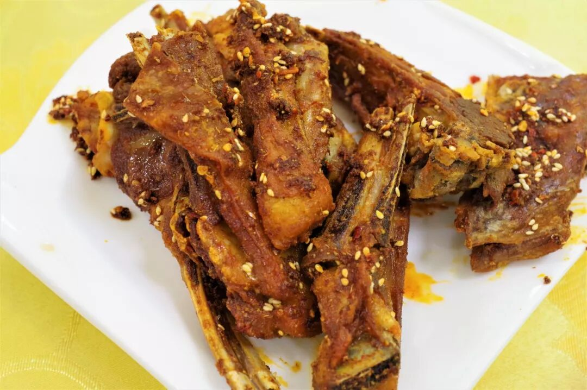

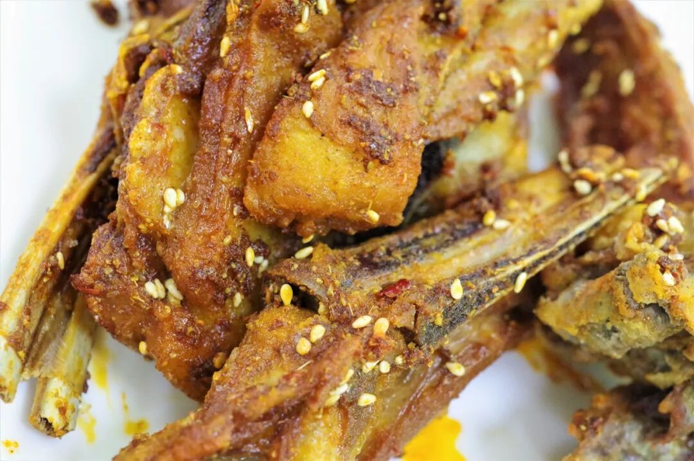

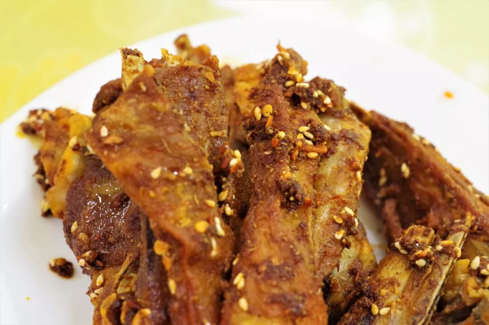

中卫并非回民聚居区，无法与宁夏其他地区大规模食用牛羊肉的阵势相提并论，但要在此品尝清真肉食之味亦并非难事。总觉得不来一顿大大的肉心里就千万只虫蚁再爬，一斤烤羊排足矣消解。

焦酥的羊排上裹着厚厚的酱，孜然与芝麻的香锦上添花，举起一块块羊排大口撕咬疯狂咀嚼，这才是来宁夏应有的姿态，这才对盘中那静默的肉肉最大的敬意。

（4）

苦苦菜

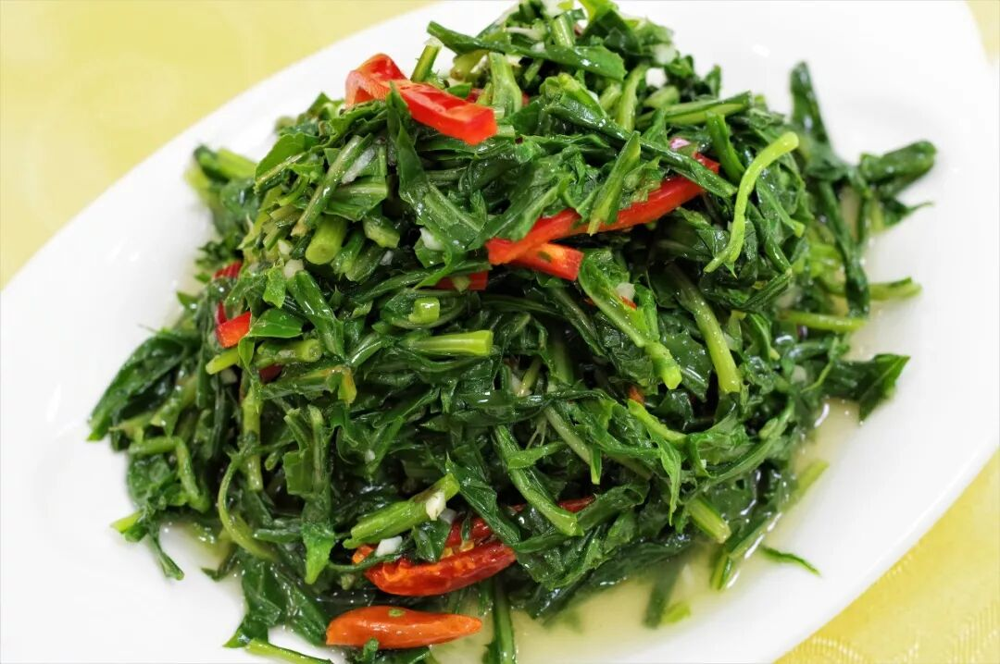

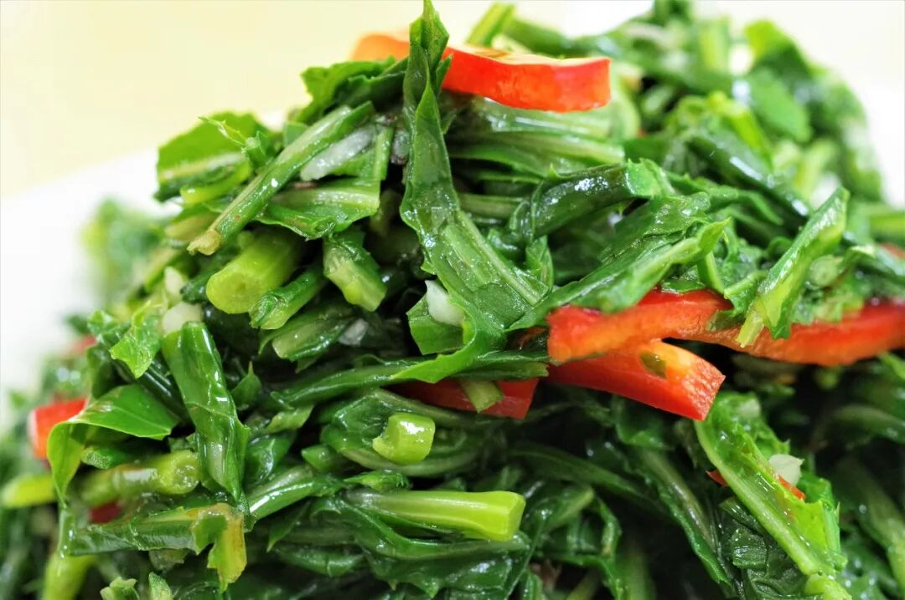

苦苦菜是中卫常见的野味，常凉拌而食之，可在中卫的餐馆轻易寻得。苦苦菜口感爽脆，接近茼蒿菜的口感，咀嚼之时有浓烈的清香味，待咽下后又有一阵苦味泛上，在口腔内略作停留。有充分的理由相信这并非一种人人可接纳的味道，但若你喜好一口田野之味、草本之味，这种清香微苦的组合定能俘获你的味蕾。无需太多调料，用简单的蒜醋盐油调味，就能成就一盘夏季清热爽口解腻的凉菜。

（5）

硒砂瓜

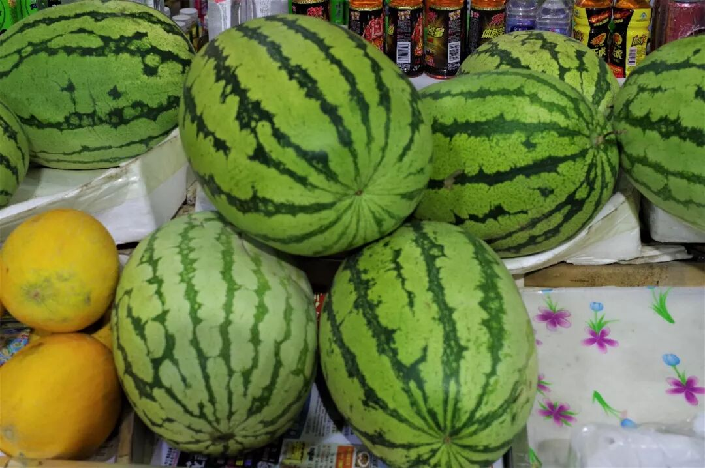

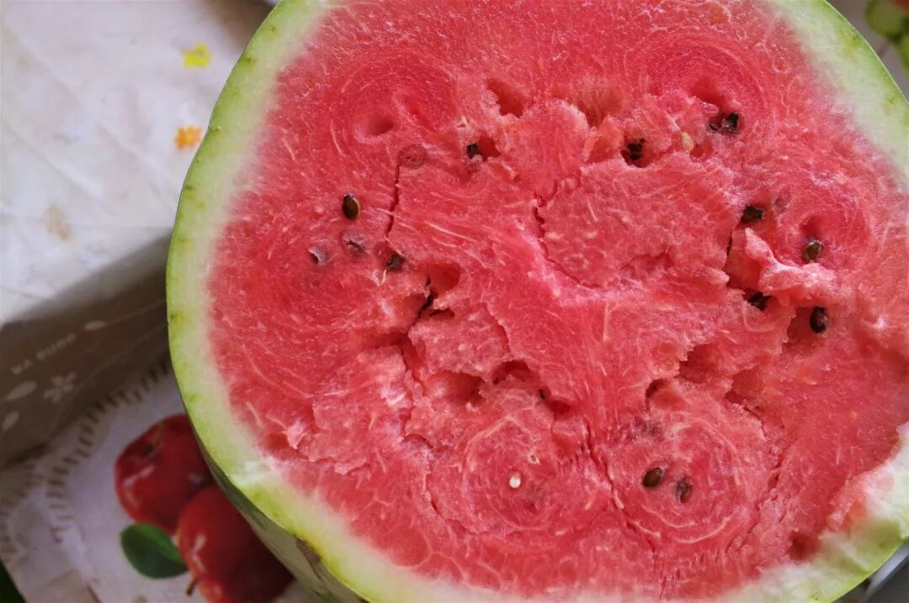

孙悟空是从石头缝里蹦出来的，硒砂瓜则是从石头缝里长出来的。这种瓜来头极大，据说是当年北京奥运会、上海世博会的特供水果之一，若是在夏季瓜熟之时来到中卫，吃瓜群众可有口福了。

常见的硒砂瓜长度约在40cm左右，仅从个头上便非省油的瓜，从中间一刀剖开，内里却并无惊艳之貌，颜色不均匀而有大量白筋。尝试用勺子挖食，往下一杵塑料勺子却一折为二，这硬度可见一斑。好不容易吃上一口，那种紧实、密致之感使人口舌一新，脆的西瓜不少，但如此耐嚼的西瓜真不多，再加上那干旱土地上日积月累的甜蜜，确为当之无愧的好瓜。

大概没有人会理解，来到中卫两天竟然只在市区闲逛的人是怎样的心态。酸甜苦辣都尝尽，何须再顾心态，只留好心情足矣。

顺带着一提，中宁县的枸杞大概是全中国最好的，养生一族的伙伴了解了吗？

下一次，我决定要带上一拨人，带着几十个硒砂瓜，穿越腾格里沙漠。

现在开始报名，截止日期待定，嘻嘻。

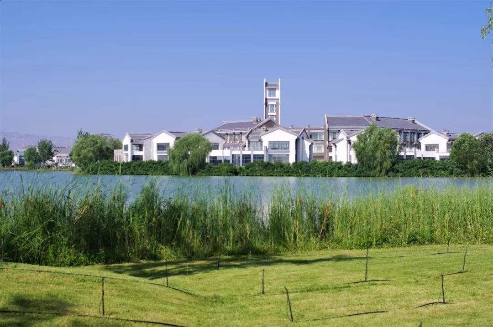

想知道我在干啥，请点这个链接：吃货的决心——555天中国饮食探索之行

想知道我要去哪，请点这个链接：555天行程计划（2018-07-26更新）

吃，吃个大西瓜？

（长按识别二维码点击关注哦）

 var first_sceen__time = (+new Date()); if ("" == 1 && document.getElementById('js_content')) { document.getElementById('js_content').addEventListener("selectstart",function(e){ e.preventDefault(); }); }

 if ("0" == 1) { document.addEventListener("keydown",function(e){ if ((e.metaKey || e.ctrlKey) && (e.key === 'c' || e.key === 'C' || e.key === 'x' || e.key === 'X' || e.key === 'a' || e.key === 'A')) { if (e.target.tagName === 'INPUT' || e.target.tagName === 'TEXTAREA') { return; } e.preventDefault(); } }); document.addEventListener("copy",function(e){ var sel = window.getSelection(); var content = document.getElementById('js_content'); if (sel && sel.rangeCount > 0 && content && content.contains(sel.getRangeAt(0).commonAncestorContainer)) { e.preventDefault(); } }); }

预览时标签不可点

微信扫一扫

关注该公众号

知道了 (javascript:;)
