# 【第039天 固原】比兔头更生猛的头

- 原文链接: https://mp.weixin.qq.com/s?__biz=MzA3MTM2Mjk3NA==&mid=2247503821&idx=1&sn=551b0206989d759cc2e4cae6ed67c077&chksm=9f2c3f3ca85bb62ac4ffb6db3e36f541f109635e06b80fc913191125029387f6ec957ad15fe8&scene=21
- 作者: 宇哥食行记
- 发布时间: 未知
- 图片数量: 16

固原地处宁夏的最南端，就像矛尖一般刺入陇东地区，将甘肃版图的东部割裂成今天这般奇异的模样。而实际上，直到建国后，固原才从甘肃省划出归属于新成立的宁夏回族自治区，今天的固原的饮食还具有浓烈的陇东色彩（陇东饮食接近陕北、关中地区）。

在已经走过的几十个西北城市中，固原可以算得上是一顶一的破旧，但这种破旧也不全然是坏事，在今天的固原市区还能见到大量当年保留下的古城墙、城楼等，反而让这种旧平添韵味。

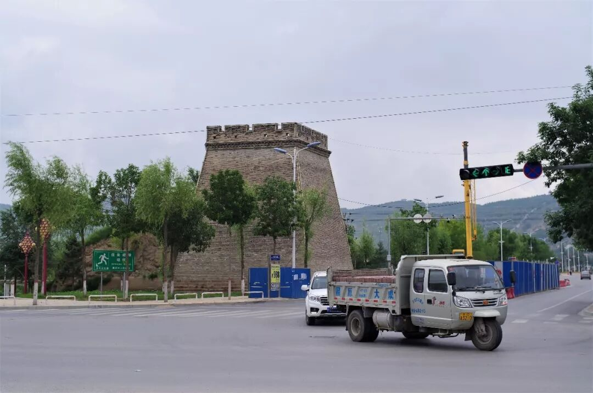

然而，这种平静却突然被一种生猛的食物打破，令人猝不及防。

（1）

羊羔头

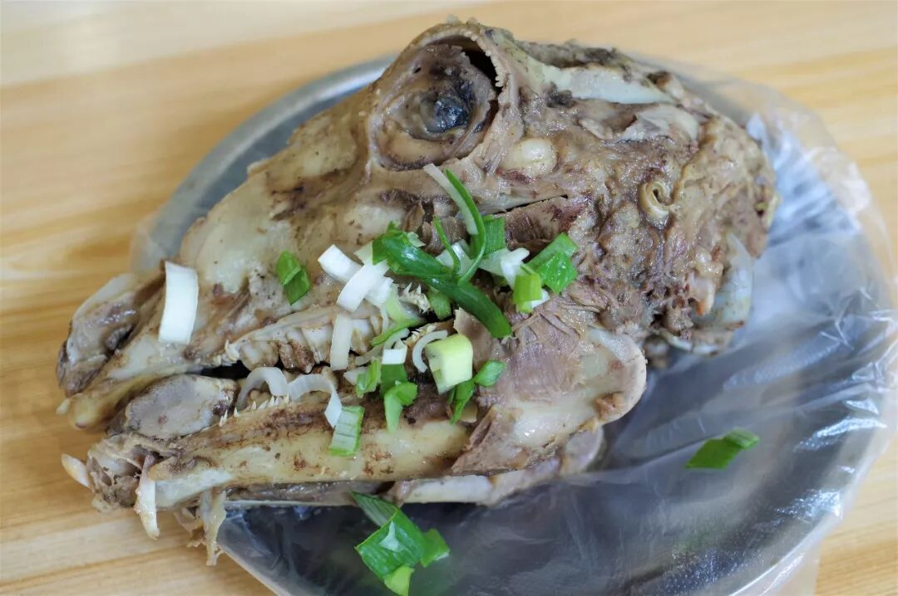

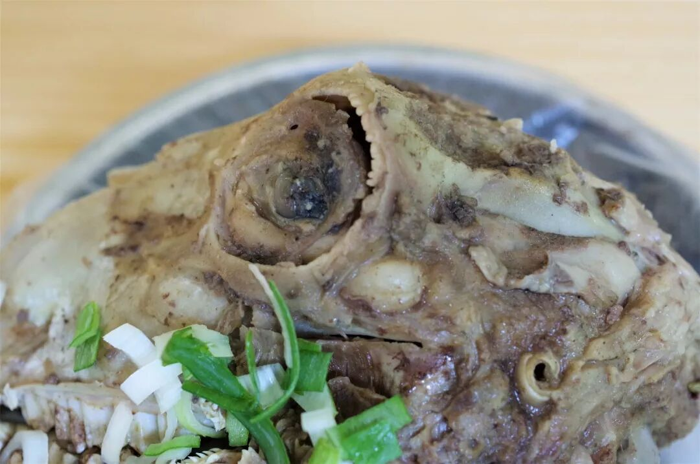

（放大，特写）

这是什么我想无需更多解释了。羊羔头，羊羔的头。

如果对兔头已敬而远之，面对这样一颗硕大的、仿佛盯着你看的羊羔头，怕是无从下口。但若你愿意拾起梁静茹给的勇气，戴上塑料手套就像戴上拳击手套，准备着迎接这生猛的舌尖刺激，那你就太幸运了。

庞大的头颅拆解起来确毫不费力，根本无需提前了解羊脑的构造，就顺着直觉胡乱掰扯，一颗羊羔头就可被拆解成大小不一十几块。肉、筋、膘、硬骨、脆骨、血管、脑花全都集结在这一颗头颅上，你几乎可以品尝到所有能想象的荤食的口感，同时这种拆解、舔舐的进食体验，又几乎是一次就会上瘾，叫人如何拒绝？

不过，由于这羊羔头为白水煮成，不加调料直接吃容易腻（因肥膘多、异味重），蘸上辣椒粉再就着生蒜一切问题便迎刃而解，最后只留下一桌碎骨、一口亮油。

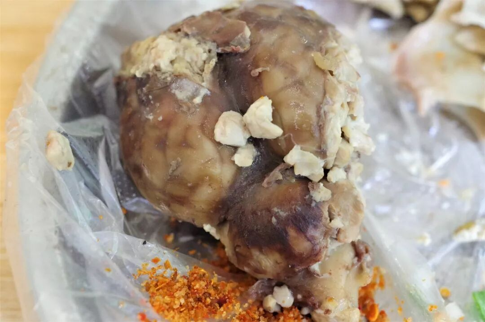

（完整剥离出的羊脑）

（2）

燕面糅糅

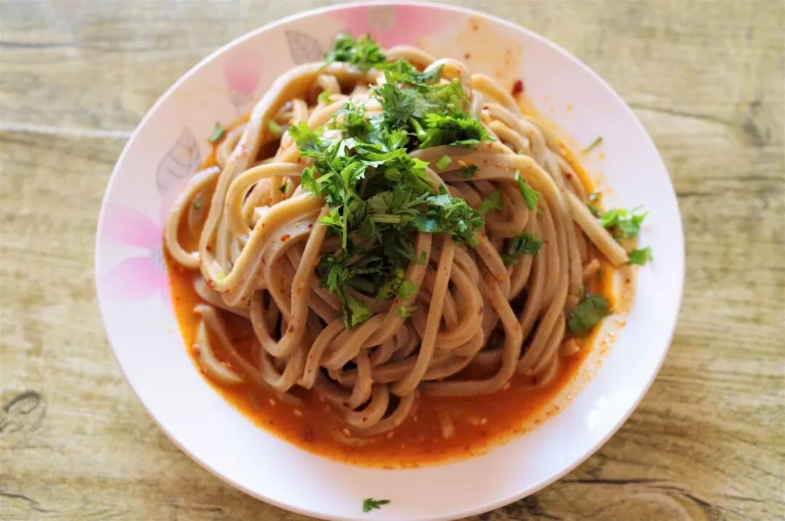

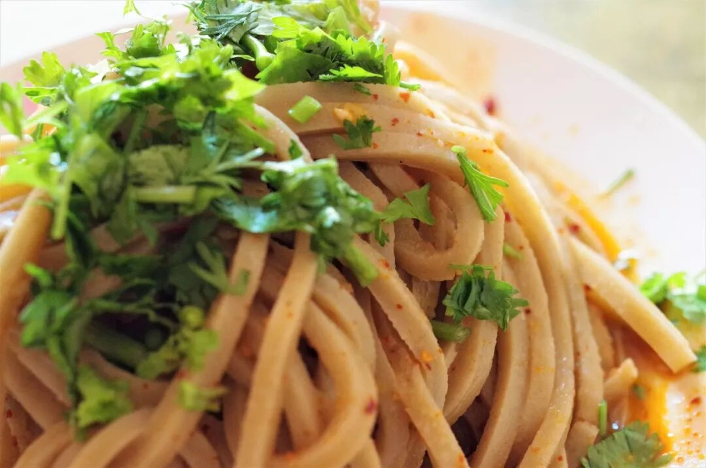

初看此名往往让人不知所云，其实燕面糅糅即莜麦面，是固原地区极富特色的地方面食。将挤压成型的莜麦面煮熟捞出后，调上简单的蒜、醋和辣子便成。莜麦面口感偏硬，负有韧劲，吃起来十分劲道爽口，与酸辣的口味是天作之合。

（3）

生汆（cuān）面

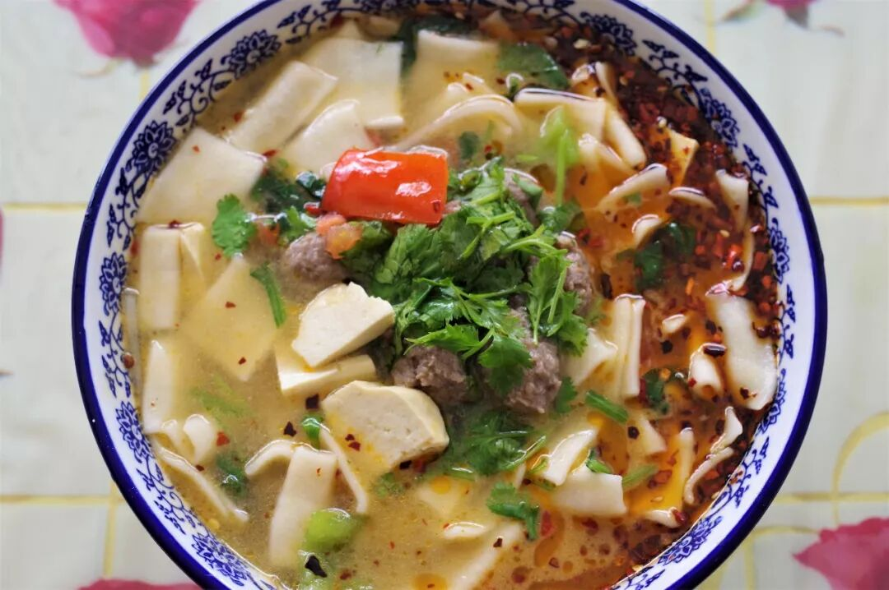

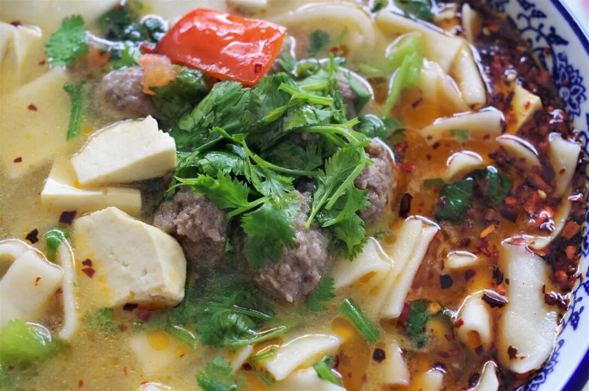

生汆面乃发源于固原的一种汤面片，现广泛流行于周边地区。清亮的汤底、白如纸片的揪面片、圆润的肉丸子、碧绿的香菜再加上深红的辣子，面一上桌便已香气四溢，再品上一口鲜香爽滑，确是一碗色香味俱全的面食。

（4）

烩麻食

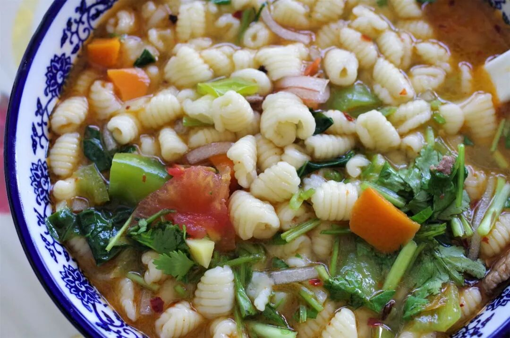

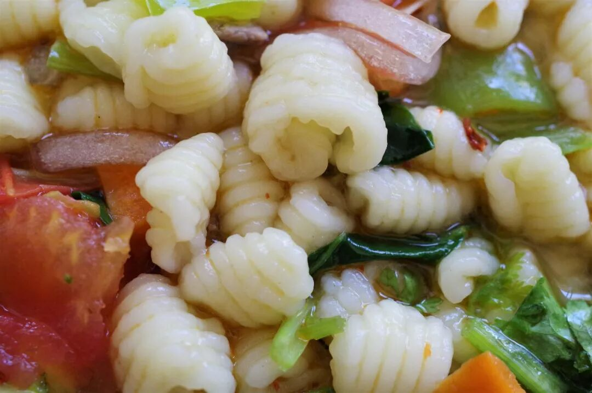

从这一碗面食中便可看出浓浓的陕西色彩。麻食是用大拇指将面坨在案板上按压而成，因其形如猫儿也被称作猫耳朵。常见的麻食做法为炒麻食和烩麻食，是固原地区极其日常的主食。因麻食形状特殊，吃起来与其他面食有着较为不同的口感，也有着自己的大量拥趸。

（5）

荞麦油圈

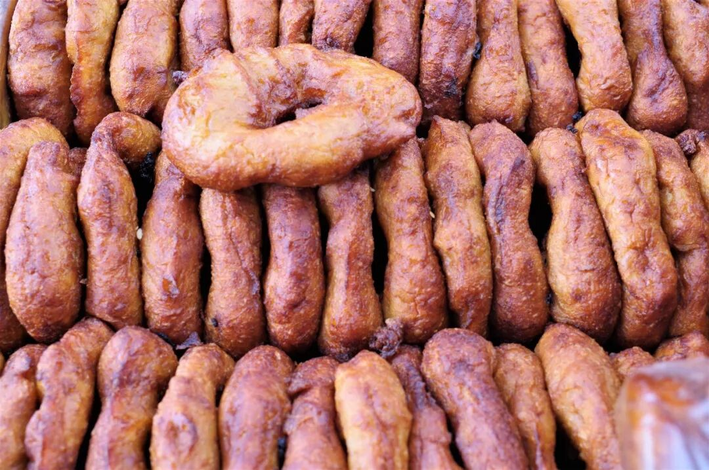

在固原的大街小巷中也常能见到售卖清真面点的小店或小摊，除了油香、锅盔、馍馍一类遍地都有的面点外，这红棕色的荞麦圈圈更加吸引眼球。咬上一口，油气较大，紧随而来的是荞麦面那特有的清甜香气，这样一中和反而吃上几个也不会腻嘴。虽然简单，这种小食却往往有着不可思议的魔力俘获人心。

除了一个霸气的羊羔头外，固原的饮食大都是在白面、杂面中做着各种各样的形态变换，这是黄土高原之上的城市所具有的统一饮食特性。以丰富度不够去苛责这样的地区是不合理的，因为它们几乎都在自己现有条件的基础上做了尽力的创新与花样。

若是能在这样一个安宁的小城呆上几天也是安逸的，只可惜步履还要向前。

但我终究是来过了。

想知道我在干啥，请点这个链接：吃货的决心——555天中国饮食探索之行

想知道我要去哪，请点这个链接：555天行程计划（2018-07-26更新）

想吃羊羔头吗？

（长按识别二维码点击关注哦）

 var first_sceen__time = (+new Date()); if ("" == 1 && document.getElementById('js_content')) { document.getElementById('js_content').addEventListener("selectstart",function(e){ e.preventDefault(); }); }

 if ("0" == 1) { document.addEventListener("keydown",function(e){ if ((e.metaKey || e.ctrlKey) && (e.key === 'c' || e.key === 'C' || e.key === 'x' || e.key === 'X' || e.key === 'a' || e.key === 'A')) { if (e.target.tagName === 'INPUT' || e.target.tagName === 'TEXTAREA') { return; } e.preventDefault(); } }); document.addEventListener("copy",function(e){ var sel = window.getSelection(); var content = document.getElementById('js_content'); if (sel && sel.rangeCount > 0 && content && content.contains(sel.getRangeAt(0).commonAncestorContainer)) { e.preventDefault(); } }); }

预览时标签不可点

微信扫一扫

关注该公众号

知道了 (javascript:;)
