# 【第040天 吴忠·同心】我在回乡吃羊鸡

- 原文链接: https://mp.weixin.qq.com/s?__biz=MzA3MTM2Mjk3NA==&mid=2247503820&idx=1&sn=54ef4ee6765bfaf6b6a28cca0c79016b&chksm=9f2c3f3da85bb62b6e5a79df2588e693487b70afc9eab8d114fd32f90d5a0de0a71ea5072fd6&scene=21
- 作者: 宇哥食行记
- 发布时间: 未知
- 图片数量: 16

吴忠，是公认的中国回民之乡，而其所辖的同心县，是全国拥有回族人口比例最高的县，更是回乡中的回乡。所以我心想无论如何，都要来同心看一看，哪怕它并未拥有数量惊人的美食，也至少作为我对清真饮食的一种朝圣般的造访。

从进入同心开始，尖圆顶便不断地映入眼帘，无论是平屋稀疏的乡间，还是楼房紧密的县城。大街上的男男女女也大都戴着小帽、戴着头巾，再配上这一阵阵尘土飞扬，竟一瞬间有了一种不真实的朦胧感。

（同心清真大寺）

顶着烈日走了好长的路，再也拗不过偶尔飘入的肉香之气，便忽地转身走进了刚才瞥见的那家餐厅。

（1）

碗蒸羊羔肉

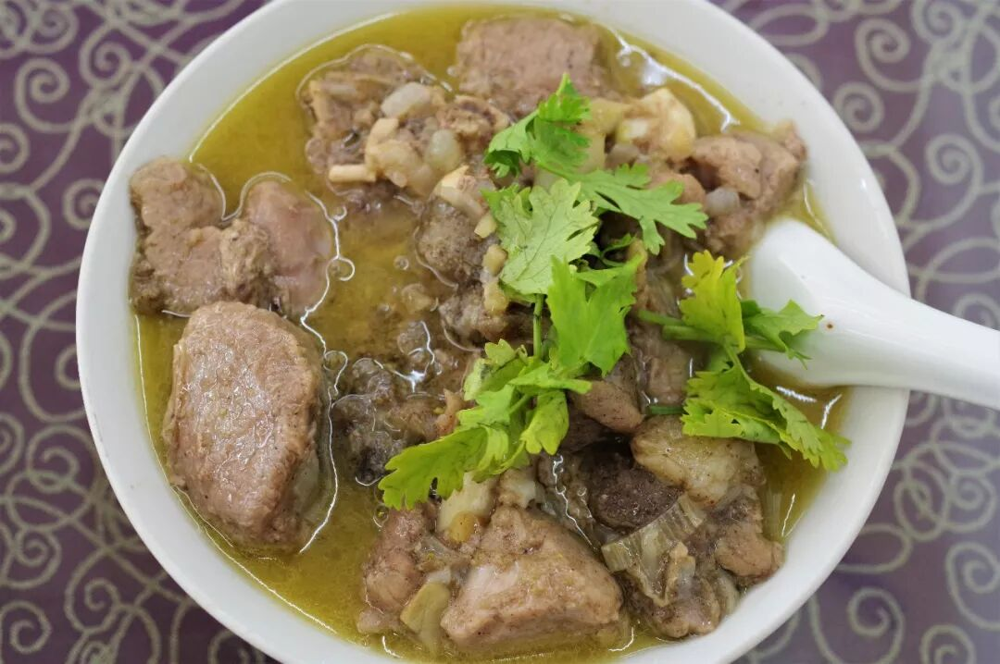

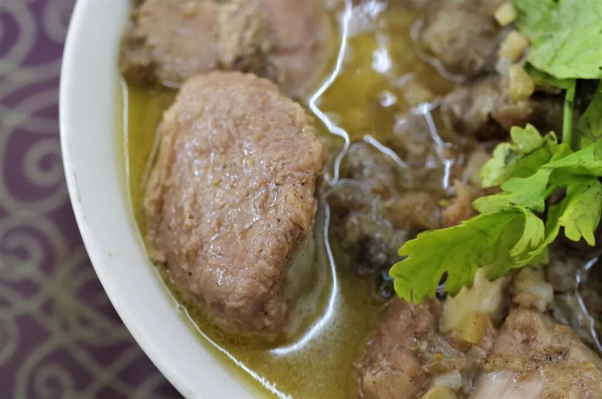

碗蒸羊羔肉是同心富有盛名的一道菜，在同心的大部分回民餐厅中都能吃到，一个品碗中装着满满的肉，除了一些姜粒和香菜，再不见其他明显的辅料，一点儿也不含糊。一碗碗蒸羊羔肉配一碗米饭，便是当地最盛行的一顿主食的选择之一。

羊羔肉烧得软烂，汤汁深入每一条肉纤维之间的缝隙，孜然与茴香的香味在口中散开，还有那浓烈的姜的辛辣味，让人吃得浑身冒汗。要是在天寒之时吃上一碗定能滋补暖身，也难怪这碗肉会成为当地人贴秋膘的首选。

（2）

烧鸡

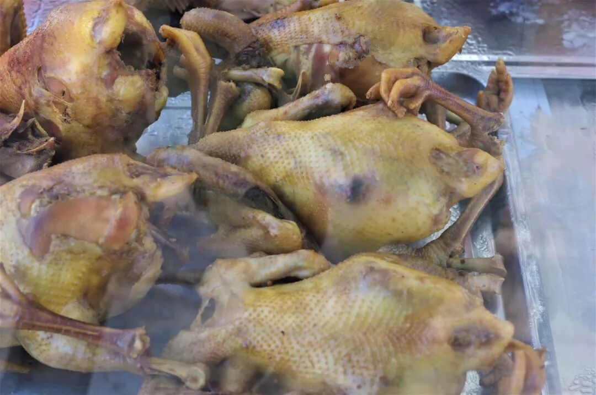

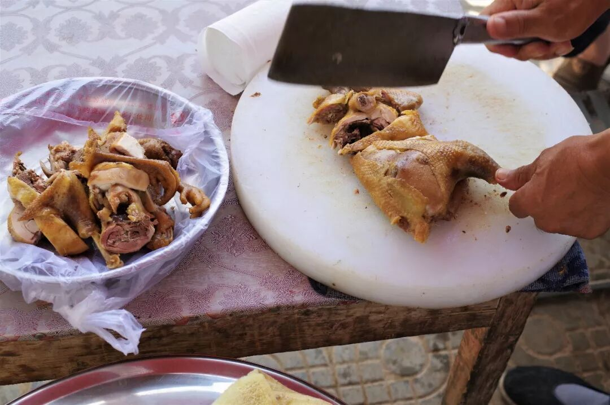

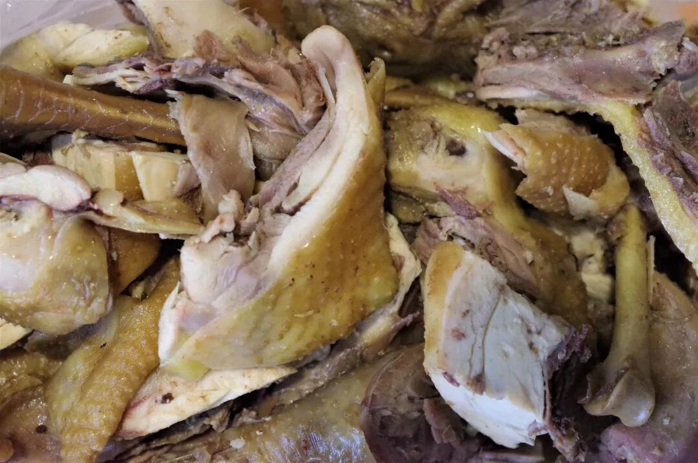

烧鸡几乎存在于中国的每一个城市，多由当地的某些烧卤店或地方烧鸡名店制作，而如同心这般一排售卖烧鸡的小车在路边依次排开，一个汉子蹲坐在小车后面就这么撕扯卷食着烧鸡的城市，实不多见。

回民烹制烧鸡大多不会使用复杂的香料，因此这烧鸡吃起来除了明显的咸味外其他香味就显得若隐若现了，更多的是去品咂这鸡肉的原始之味。我一直相信并充分欣赏穆斯林对食材选择的严格和烹制过程的严谨，让这味道并不多变的烧鸡吃在嘴里也有种难以言说的踏实感。

（3）

炒糊饽

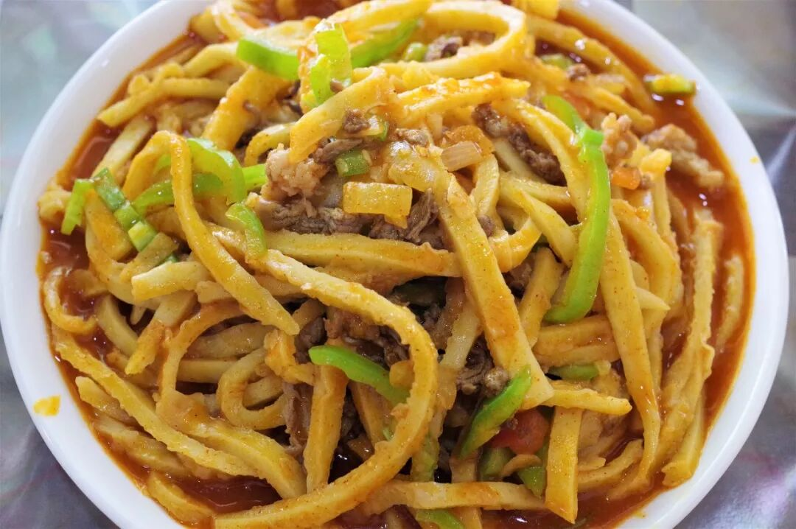

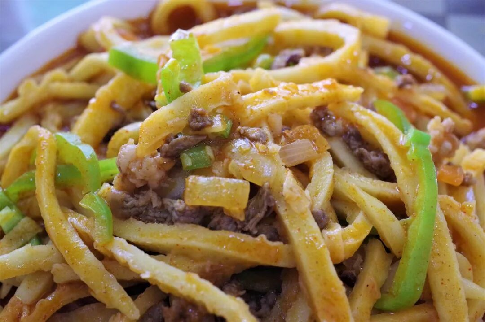

糊饽即烙饼切成的饼条，并非高深莫测之物，但确实难以仅通过名字揣测。炒糊饽流行于宁夏平原地区，是当地极为日常的“菜饭合一”的主食。比起面条，糊饽更加劲、韧，口感也更加爽利，而炒糊饽的调味则是比较惯常的西北口味，以咸、酸、辣口为主，汤汁浓稠。

（4）

馓子、油香、麻花

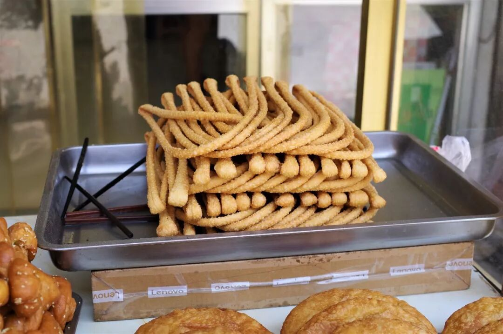

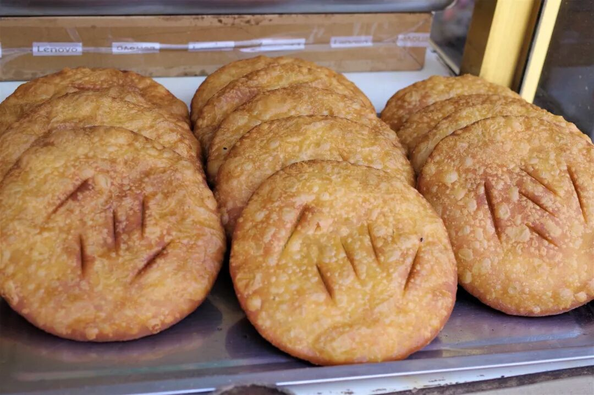

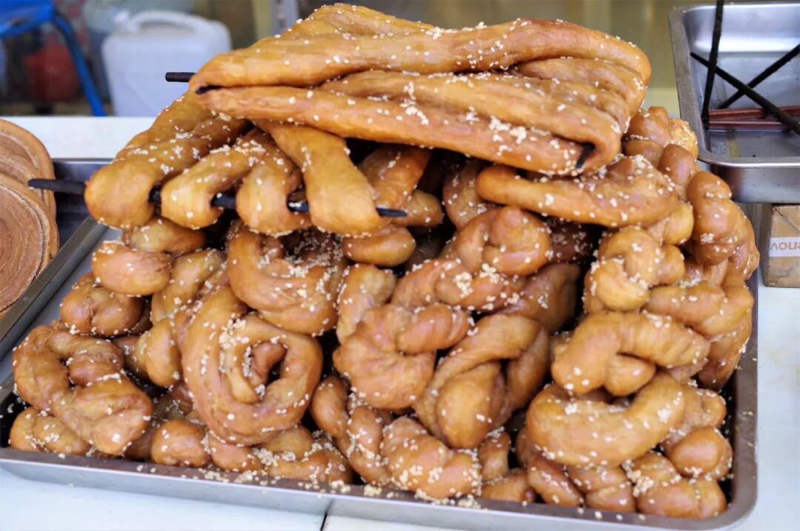

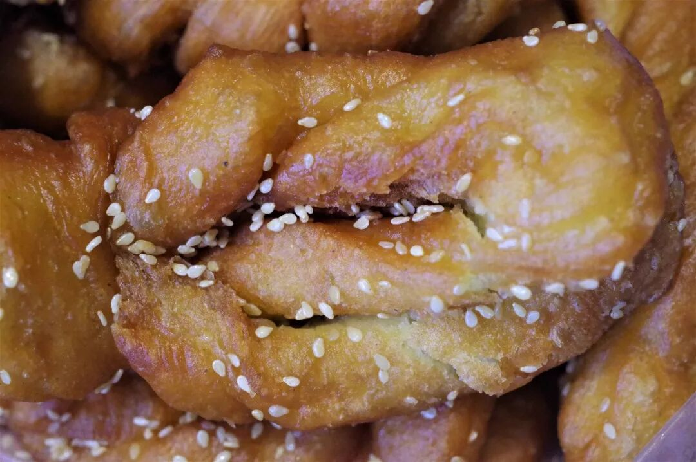

作为回乡中的回乡，在同心要寻找回民面点可以说是易如反掌，但是像这般一条百米长的街道一旁二三十家同样卖着馓子、油香、麻花的店挤在一起的画面，也确实令我吃了一惊。不时有一辆车经过，从其中的某家店铺了搬个三两箱面点扬长而去。

这些简单的面点有着重要的节日象征意义，虽无法感同身受或加入他们的庆贺，买上一些品尝一下那简单的油、韧之感，又有何不可呢？

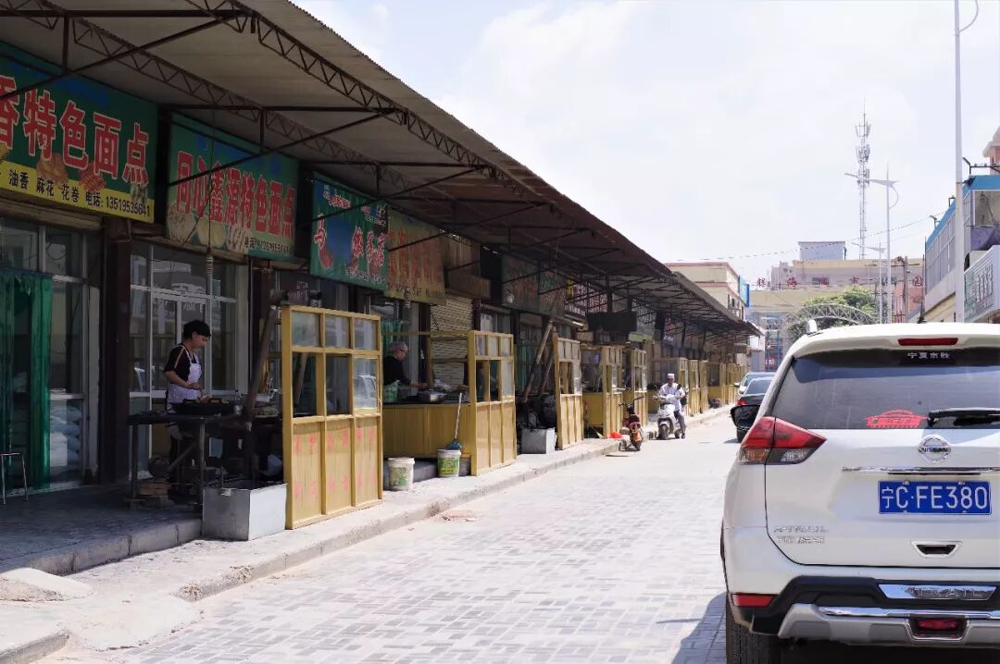

（富兴市场，一条街全是回族面点）

同心，是一个极其素面朝天的城市，这种不加修饰可以说是对外来者的一种“不友好”。但正是这种“不友好”，反而让它保留了一种纯粹，你不用担心在这里遭遇中国式旅游景点的坑，就这么凭着感觉走也好，吃也好。

说句不相干的话，同心这个地名，怎么就没吸引中国万千情侣、新婚夫妇的注意呢？毕竟，永结同心啊。

想知道我在干啥，请点这个链接：吃货的决心——555天中国饮食探索之行

想知道我要去哪，请点这个链接：555天行程计划（2018-07-26更新）

永结同心......之食

（长按识别二维码点击关注哦）

 var first_sceen__time = (+new Date()); if ("" == 1 && document.getElementById('js_content')) { document.getElementById('js_content').addEventListener("selectstart",function(e){ e.preventDefault(); }); }

 if ("0" == 1) { document.addEventListener("keydown",function(e){ if ((e.metaKey || e.ctrlKey) && (e.key === 'c' || e.key === 'C' || e.key === 'x' || e.key === 'X' || e.key === 'a' || e.key === 'A')) { if (e.target.tagName === 'INPUT' || e.target.tagName === 'TEXTAREA') { return; } e.preventDefault(); } }); document.addEventListener("copy",function(e){ var sel = window.getSelection(); var content = document.getElementById('js_content'); if (sel && sel.rangeCount > 0 && content && content.contains(sel.getRangeAt(0).commonAncestorContainer)) { e.preventDefault(); } }); }

预览时标签不可点

微信扫一扫

关注该公众号

知道了 (javascript:;)
