# 【第041天 吴忠（一）】手抓！手抓！还有八宝茶

- 原文链接: https://mp.weixin.qq.com/s?__biz=MzA3MTM2Mjk3NA==&mid=2247503819&idx=1&sn=3f557e0e6be5273a911e0cce17cbc15d&chksm=9f2c3f3aa85bb62c082d3dc07c7dd8f2f5d90315d4a71f83f9fbc50843a0d6ba5cff98bc4aee&scene=21
- 作者: 宇哥食行记
- 发布时间: 未知
- 图片数量: 22

昨日已言，吴忠乃中国回民之乡，但这种名号对于一个游人往往无法产生直接的吸引力。如果我说，吴忠是宁夏美食的中心，结果还是如此吗？

什么？不相信？那就随便问一个宁夏人吧。即使在首府银川，人们也会对吴忠人开的餐厅产生一种条件反射式的信心。若来宁夏逛吃，而未前往吴忠，宁夏的味道至少就错过一半了吧。

所以这次，我来了。

（满城尽是清真寺）

（1）

手抓羊肉（热）

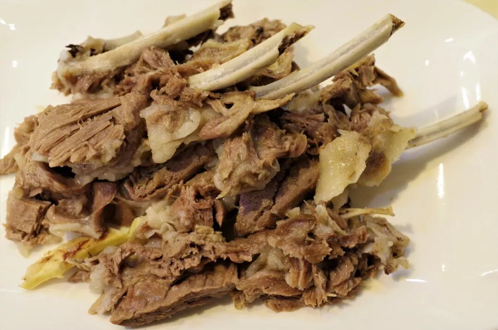

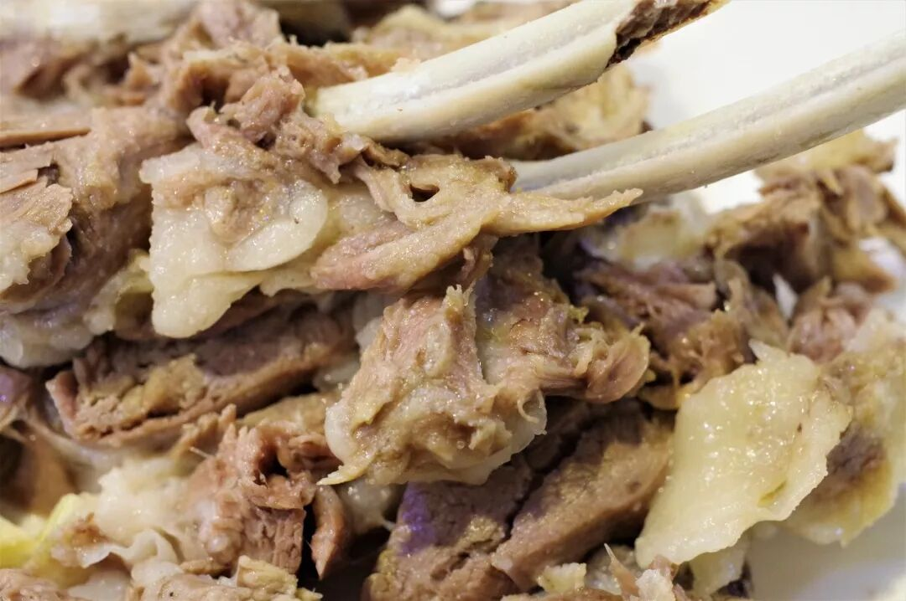

在宁夏，几乎无人不知吴忠手抓的大名，这也是撑起吴忠清真饮食地位的第一硬食。手抓分热手抓与凉手抓，从肉的质地和颜色可轻易区分开来，吃在嘴里更不必说。最为常见的手抓部位为羊肋条，即上图所示。

普通的羊肋条肥瘦肉比例较为接近，蘸上一点酸醋汁吃在嘴里鲜香油润，不见一丝羊膻味。不过由于肥膘较多，并非所有人都能欣赏这种手抓，也可以选择去除了油脂的瘦肉肋条，少了油腻，多了瘦肉的劲道柔韧。

（2）

手抓羊脖（凉）

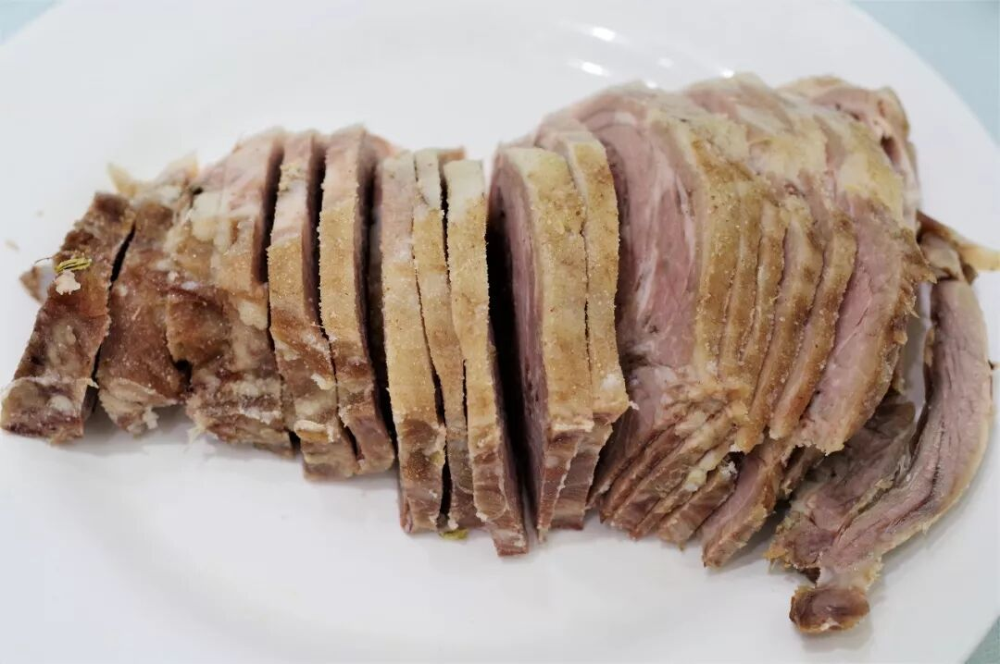

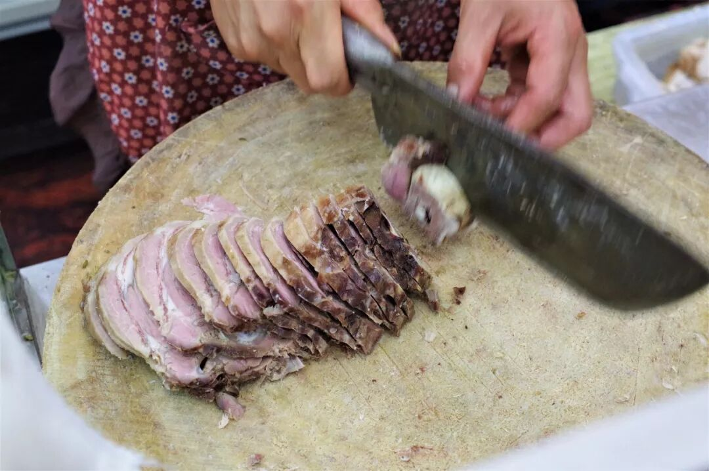

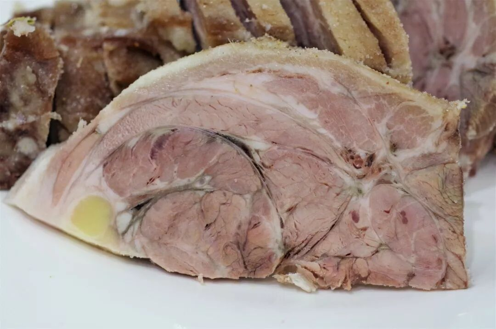

羊脖也是常以手抓方式使用的羊肉部位之一，比起羊肋条，羊脖没有明显的肥膘层，只有部分肥肉穿梭于筋肉之间。从羊脖的横截面可以看出，羊脖肉并不像其他部位的肉一样呈现一种均匀的、顺滑排列的状态，而是筋将肉分割成大大小小的部分。因此吃起来会有一种筋与肉交错重叠的复杂口感，再加上羊脖上一层厚厚的脆韧表皮，使得羊脖肉的口感更加丰富。

放凉的肉比冒着热气的肉具有更加紧实的质感，且油脂凝固后腻口度会降低，更加适合在炎热的夏天进行食用。对于第一次尝试手抓却又心怀忌惮的人，不妨从凉手抓开始尝试。也许，一口下去，就再也停不下了。

（3）

八宝茶

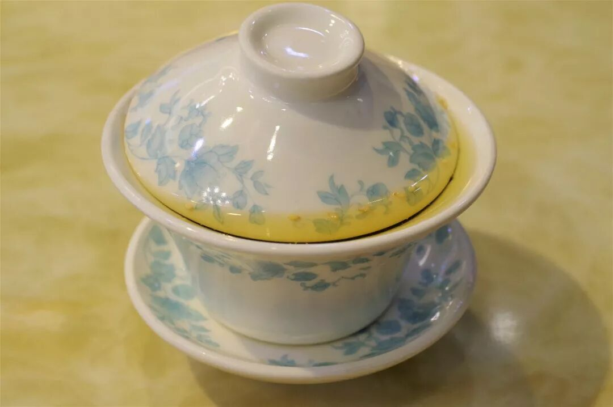

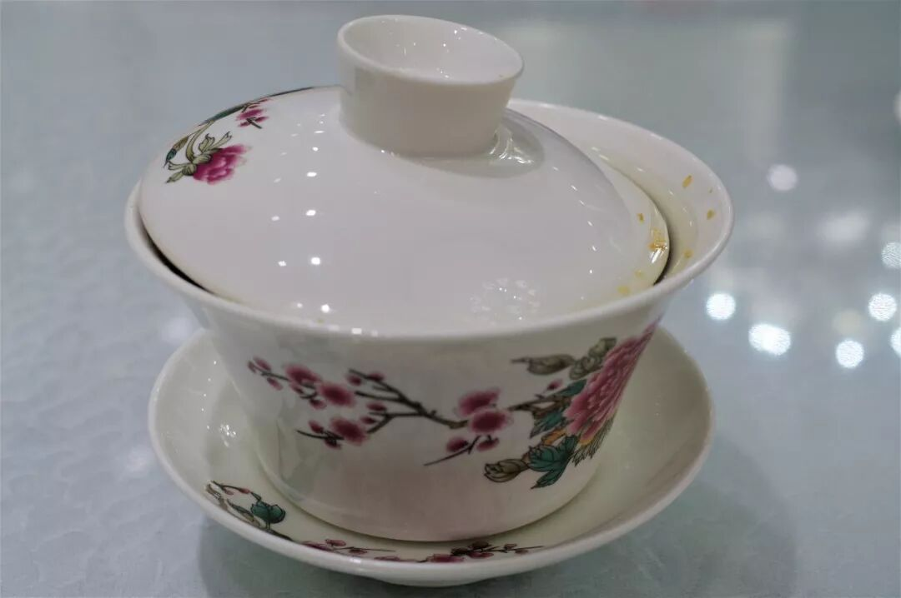

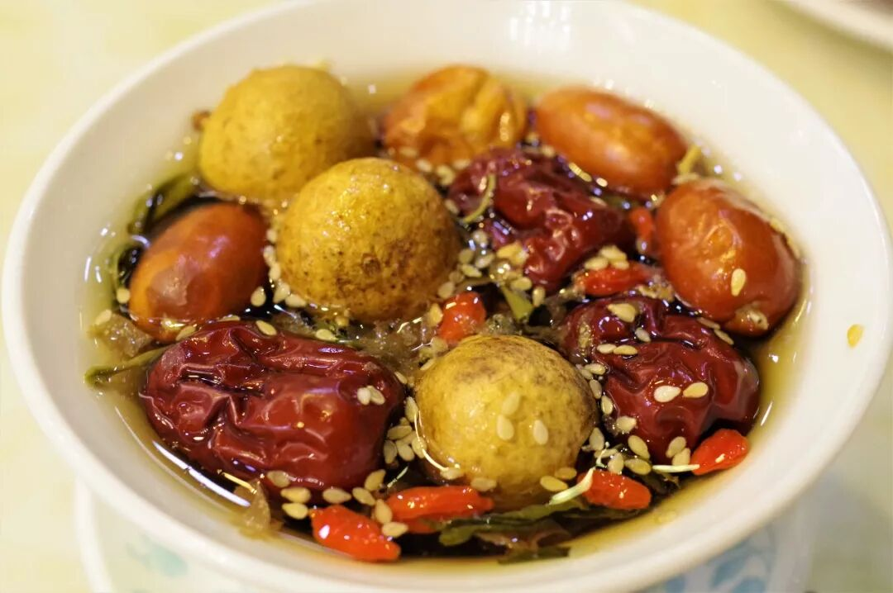

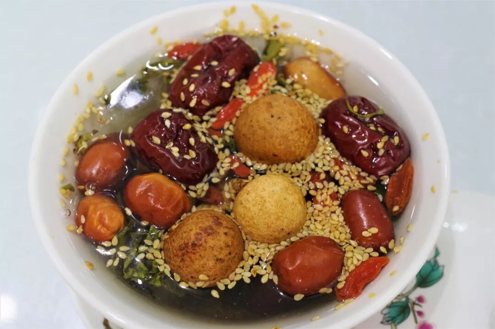

八宝茶又叫盖碗茶（在兰州地区又叫“三炮台”），是西北回民的传统饮品，在吴忠，它已经成为了一种可以从清晨喝到深夜、一日不喝上房揭瓦的精神寄托一般的存在。如果一定要用一种味道来形容吴忠，那一天是飘荡在空气里、穿梭在人们谈吐之间的甘甜茶香。

八宝茶是哪八宝并无强制规定，甚至无需正正好用上八种食材，最基本的是白糖、红枣、枸杞、桂圆、芝麻、核桃、葡萄干等，再加上每个店家有自己的食材选择和配比，几乎没有可能在不同地方喝到一模一样的八宝茶。但无论这些怎么变，和八宝茶的精神不会变，那份对甘甜的期待不会变。

轻轻举起碗盖，拨上一拨，沿着碗边喝下一口甘甜的茶水，什么烦躁都去了，什么油腻都借了，只需往下一瘫，长舒一口带点甜味的气。

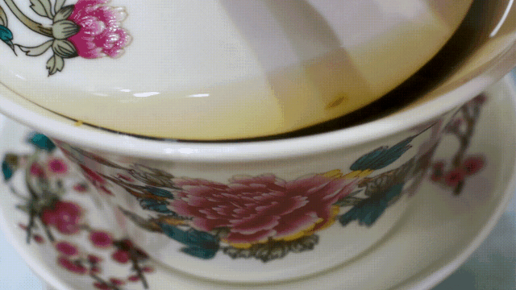

（4）

羊杂碎

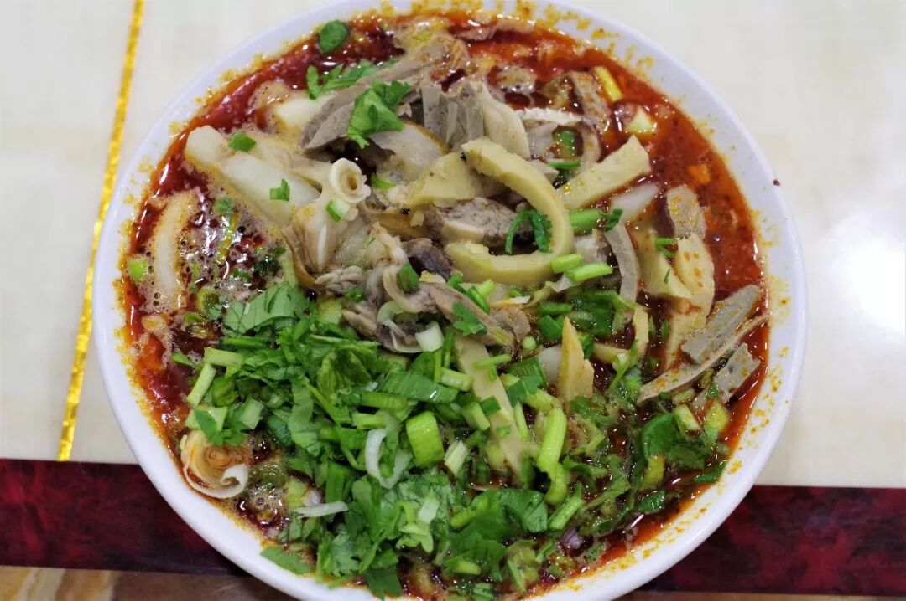

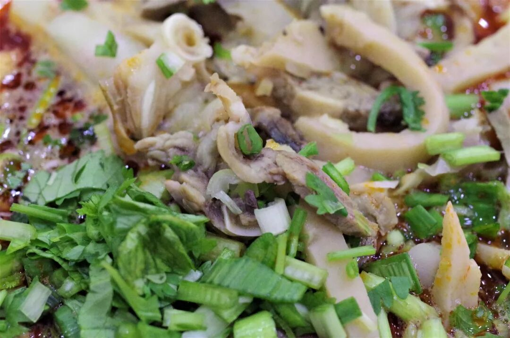

羊杂碎是吴忠地区除牛肉面外最盛行的早餐，就像我之前所说，尽管整个西北几乎都有吃羊杂碎的习惯，对杂碎品类的选择和味道的设计则各地全不相同。

吴忠的羊杂碎主要使用羊肝、羊肚和羊头肉等，切成条状，另外，最具特色的便是对肺子的使用（与新疆的面肺子相同，但新疆不会将其用在羊杂碎中）。在调味上，吴忠羊杂碎会放上相当重的辣子，与其他地区的清汤寡水截然不同，吃起来香辣爽口。不能吃辣的朋友若要尝试得记得叮嘱店家少放辣子，但对我这样的四川人而言，以这样一碗鲜红油辣的重口之食开启一天，实在是令人欣慰。

（5）

臊子饸饹面

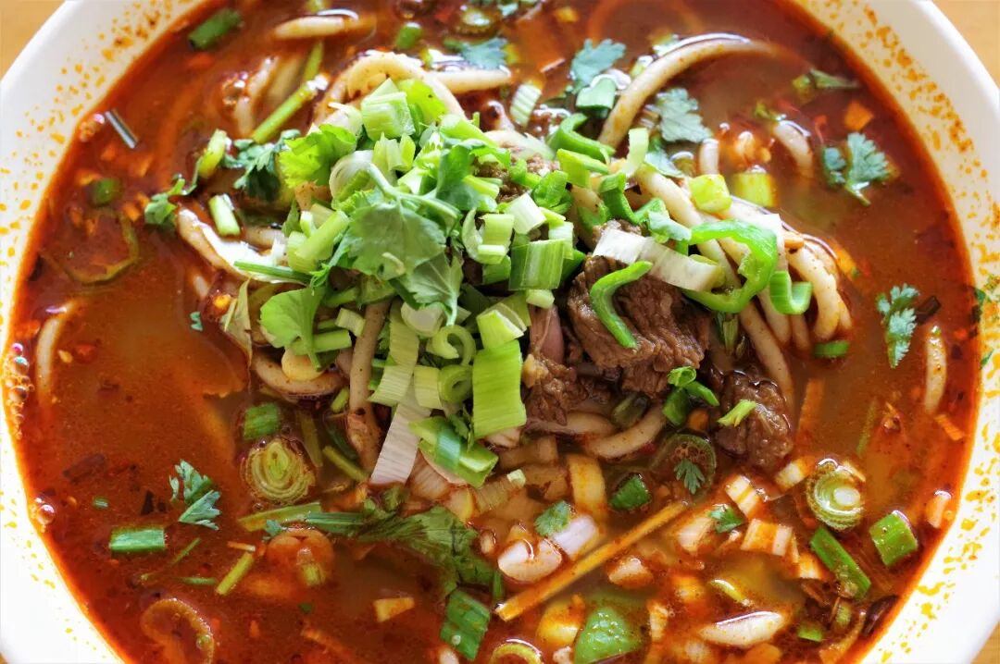

售卖羊杂碎的店也常常会一同售卖臊子饸饹面，说明白点，应该叫羊杂臊子荞面饸饹。臊子饸饹面的汤底与羊杂碎的汤底相同，端上来也是一碗鲜红油亮不见底的硬货，再配上荞面那独特的劲道口感，算得上一碗在西北地区少见的既重面条之感、又重汤汁之味的面条，值得一试！

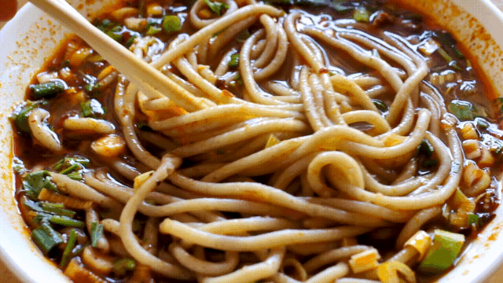

（6）

茴香饼

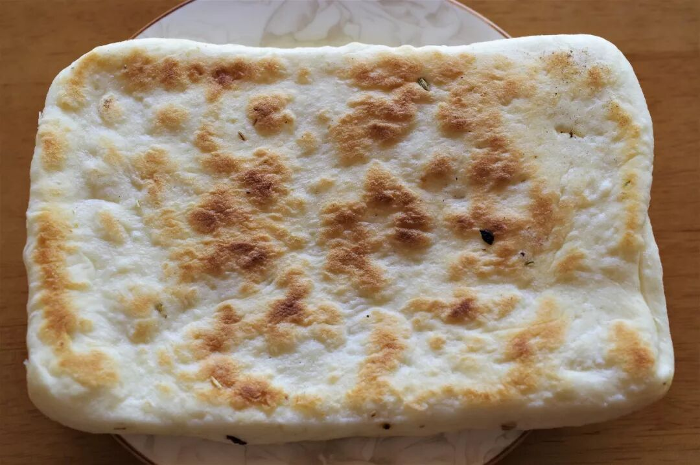

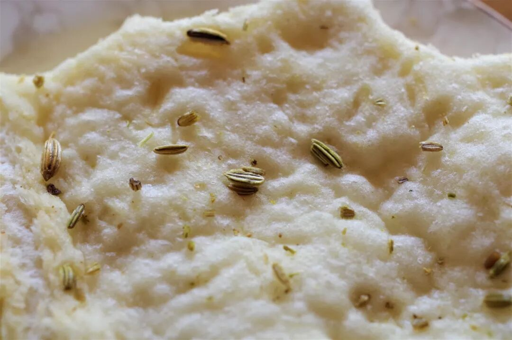

茴香，一种有多少人爱就有多少人恨的香料，与香菜之流算是一帮难兄难弟。吴忠当地的茴香饼呈长方形状，约一厘米厚，将其掰开可见一粒粒分明的茴香。吃上一口，茴香的气味并不浓厚，只有淡淡的香气从中溢出。但是，若不小心用牙齿将一颗茴香从中间断开，那强烈的味道就会瞬间澎涌而出，对不爱这口的人来说绝对是一大杀器。当地人常将茴香饼与羊杂碎同食，除了饼本身的劲韧之感外，茴香与羊杂也是极好的搭配，真是种讨巧的吃法。

（7）

麻辣条

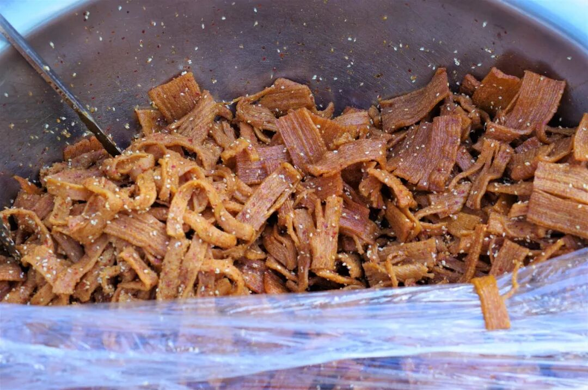

在吴忠闹市街区，常能看见一辆辆卖清真麻辣条的小车，一堆辣条就这么装在一个大铁盆了，吃多少便称上多少。没有复杂的味道，只有简单的咸香味与令人上瘾的嚼头，但绝对是打牙祭的上佳之选。

茶足肉饱，我的胃说，它今天很满意。

也没有什么需要刻意去总结的，毕竟还有第二天呢。现在，就让我继续摸着小肚子，继续瘫坐下去吧。

呼~

想知道我在干啥，请点这个链接：吃货的决心——555天中国饮食探索之行

想知道我要去哪，请点这个链接：555天行程计划（2018-07-26更新）

我说手抓你说哟

（长按识别二维码点击关注哦）

 var first_sceen__time = (+new Date()); if ("" == 1 && document.getElementById('js_content')) { document.getElementById('js_content').addEventListener("selectstart",function(e){ e.preventDefault(); }); }

 if ("0" == 1) { document.addEventListener("keydown",function(e){ if ((e.metaKey || e.ctrlKey) && (e.key === 'c' || e.key === 'C' || e.key === 'x' || e.key === 'X' || e.key === 'a' || e.key === 'A')) { if (e.target.tagName === 'INPUT' || e.target.tagName === 'TEXTAREA') { return; } e.preventDefault(); } }); document.addEventListener("copy",function(e){ var sel = window.getSelection(); var content = document.getElementById('js_content'); if (sel && sel.rangeCount > 0 && content && content.contains(sel.getRangeAt(0).commonAncestorContainer)) { e.preventDefault(); } }); }

预览时标签不可点

微信扫一扫

关注该公众号

知道了 (javascript:;)
