# 【第042天 吴忠（二）】被牛肉面与麻辣烫攻陷的城市

- 原文链接: https://mp.weixin.qq.com/s?__biz=MzA3MTM2Mjk3NA==&mid=2247503818&idx=1&sn=71d8d6315a61a53e12bf1500087647cd&chksm=9f2c3f3ba85bb62dba57ba34a1354d0662004554bdb5811a0e810121317c5d74346905b0f10d&scene=21
- 作者: 宇哥食行记
- 发布时间: 未知
- 图片数量: 17

吴忠这个城市，与游玩没有多大干系，除了路过时侧目端详一番大小不一形状各异的清真寺，似乎再无其他。

但对于从未来过之人而言，也极难想象这东西、南北向也不过就延展三五公里的小城中，竟密布了那样多的美食街、小吃市场和大大小小的餐厅。

在吃这件事儿上，吴忠绝不是无中生有。昨日之食，已见吴忠在饮食之上的一方天地，而今天，还有更多什么呢？

（1）

牛肉面早茶

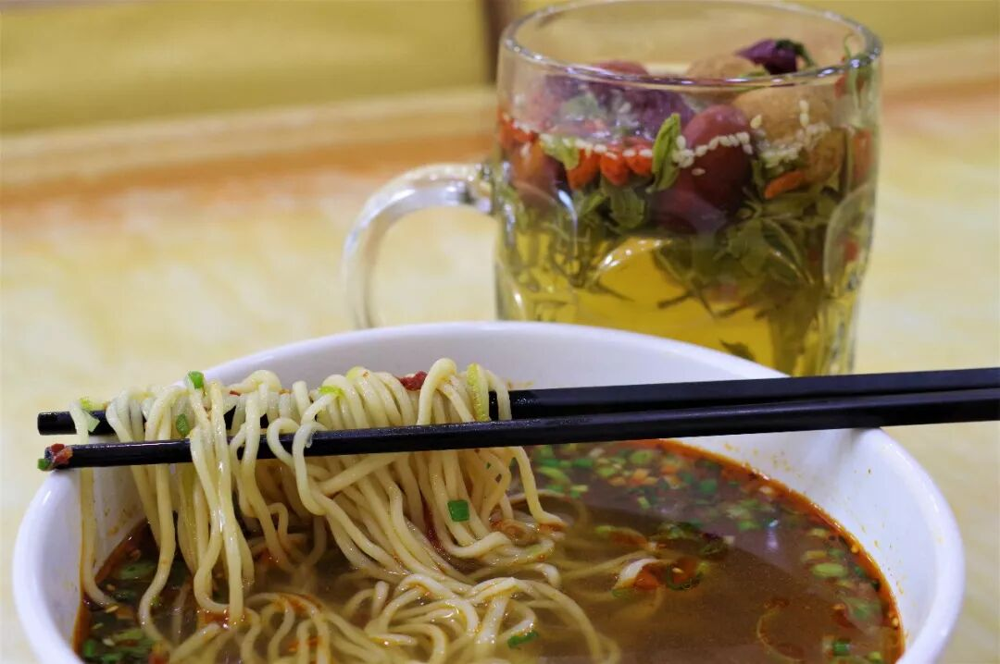

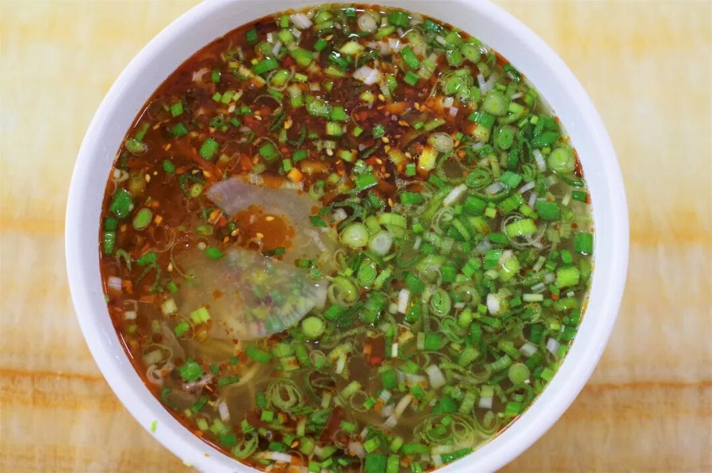

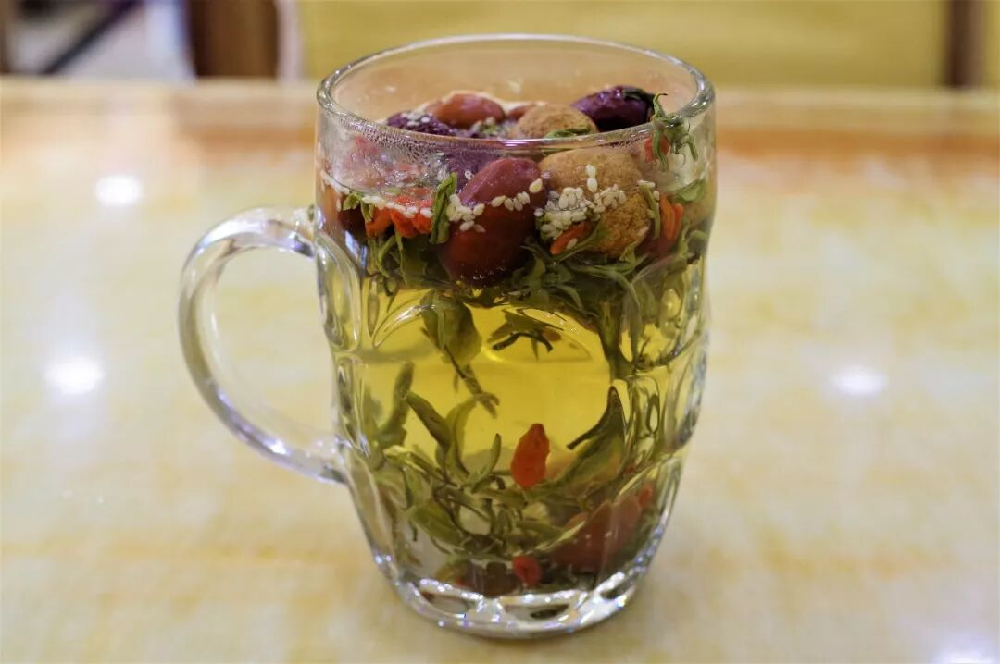

在吴忠街头，常能见到带着“XXX牛肉面早茶”字样招牌的面馆，这代表了吴忠人对于早餐的选择。其实就像这名字一般，不过是一碗牛肉面与八宝茶的简单结合，也许在扬州、广州等地的人看来这，早茶之名也未免取得太过草率，怎比起那鳞次栉比各不重样的花式早点。但吃这件事本没有对错，也无需较个高下，当这种搭配已经成为一种习惯时，它就是一种不可被撼动的事物。

吴忠的牛肉面与兰州牛肉面在味道上并无太大差异，同样的爽滑咸香微辣，可能唯独在面条上缺了一点那蓬灰特有的滋味，但对于非吃牛肉面长大的人来说，这种差异几乎可以忽略不计。只可惜兰州牛肉面的名声太大，吴忠牛肉面只能静静地与吴忠人一起，在八宝茶的香甜中，平静地向前走去。

（2）

麻辣烫

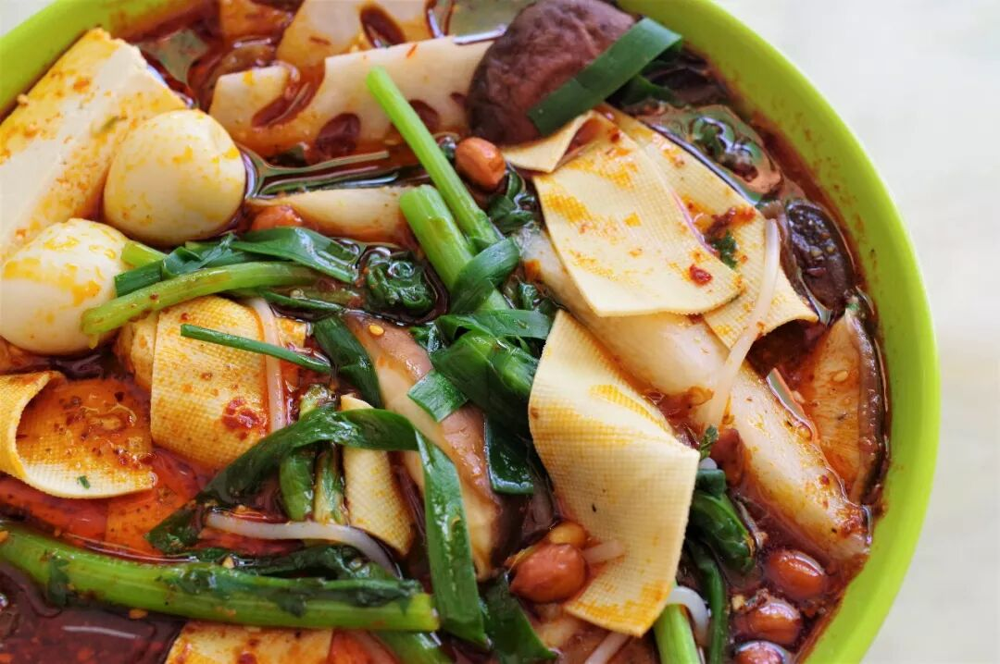

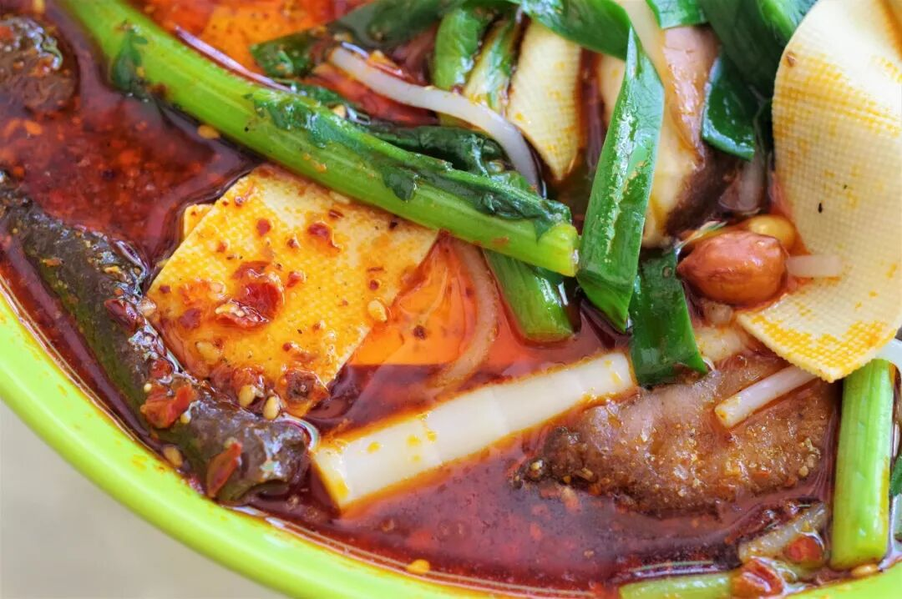

吴忠绝对能算得上中国最嗜麻辣烫的城市之一！很难在其他城市看到，七八家麻辣烫并排开着，转过一条街又是四五家连在一起的壮观景象。这种强烈的喜爱与竞争无疑会将吴忠整体的麻辣烫水平推高，以至于周边地区的人来到吴忠也常常要吃上一碗麻辣烫。

就像羊杂碎一般，吴忠麻辣烫一端上来便是一副深红油亮的模样，辣子的辛香往上扩散刺激鼻腔，还未动箸口水便要先留上一阵。吃上一口，骨汤的鲜与辣子的香是最先的刺激，辣味紧随而上，没有过多的香料味，简单却厚重。不过，由于吴忠下辣子的手普遍较重，不擅吃辣的朋友务必向店家好好叮嘱。

麻辣烫毕竟算得上吴忠的食物名片之一，也发展出了盆烩、干炒等不同的吃法，单凭这一点，中国就没有多少城市敢在麻辣烫上与吴忠叫板。

（3）

手撕土鸡

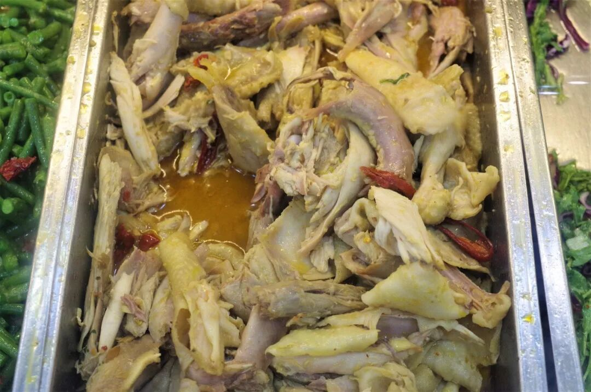

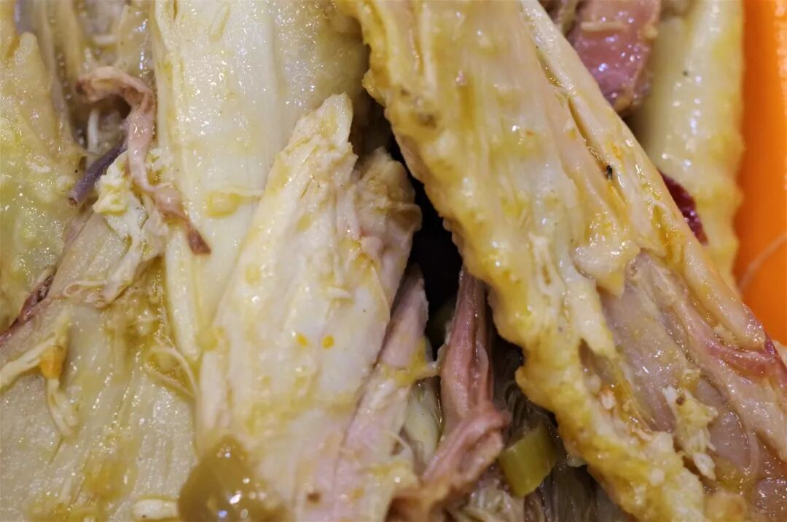

在吴忠做炒菜的餐厅内，基本可以见到手撕土鸡这道菜，甚至不少店家直接就将手撕土鸡作为店名注视着路人。手撕的鸡肉能最大限度保持鸡肉纤维的完整，与拦腰斩断的切割方式呈现出的质感截然不同。吴忠的手撕土鸡不会调上太复杂的调料，吃起来油而不腻鸡肉鲜香，鸡皮的爽脆与鸡肉的柔韧组合成一种的极佳口感，作为下饭菜或是佐酒小食皆可。

（4）

肉丁拌面

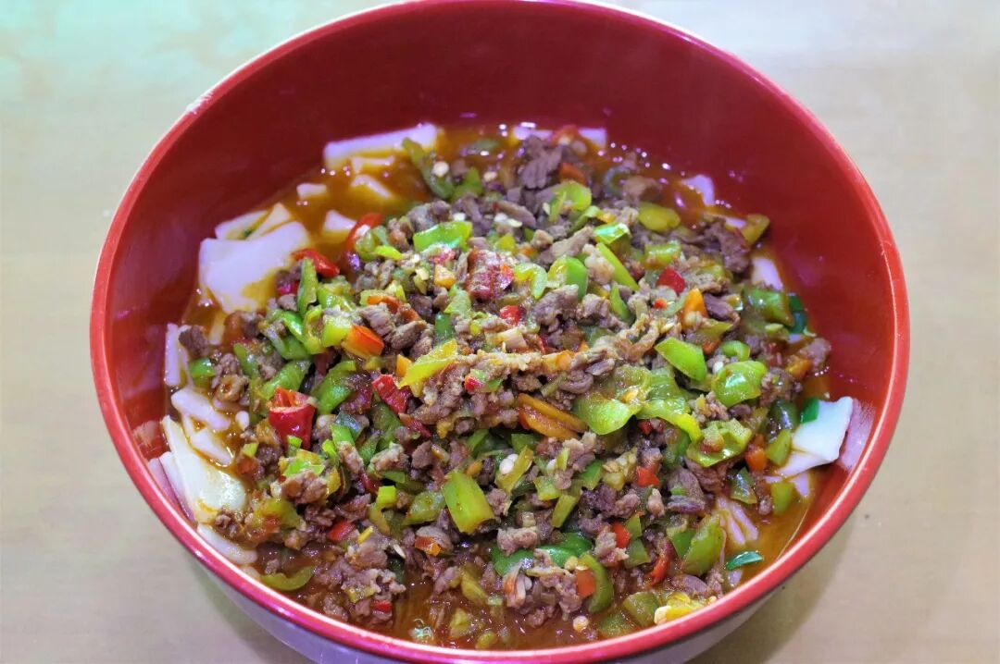

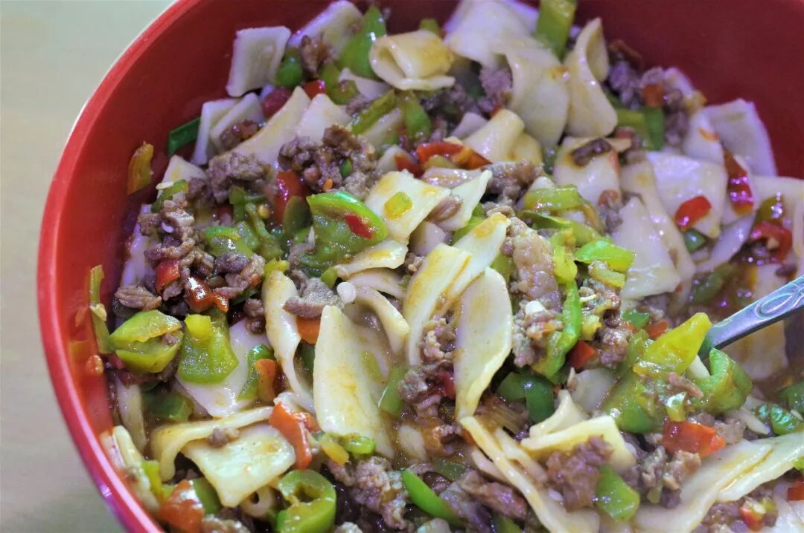

吴忠的肉丁拌面在宁夏也小有名气。肉丁为牛肉臊子，面是揪面片，在煮好的面片上浇上一层厚厚的肉臊子，光是这肉臊子的厚度就足以让人摩拳擦掌磨嘴霍霍了。牛肉臊子的口味是西北常见的咸香微辣，与揪片子充分混合后，吃在嘴里四处乱窜，好不容易捉住一颗牛肉还要被它那筋韧的口感给调戏一番，实在令人欲罢不能。

（5）

羊肝凉皮

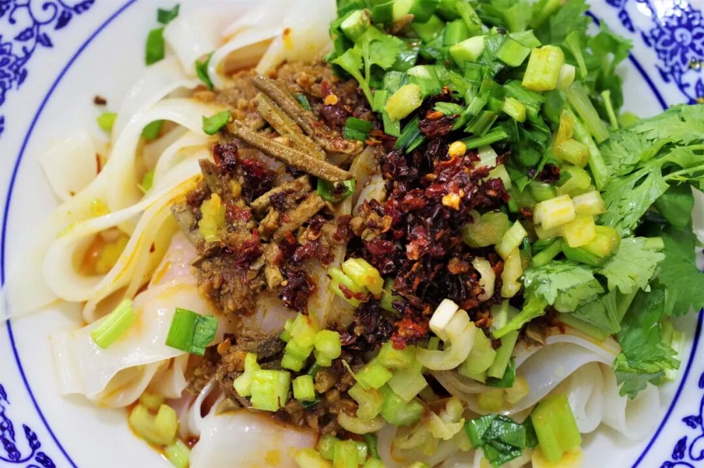

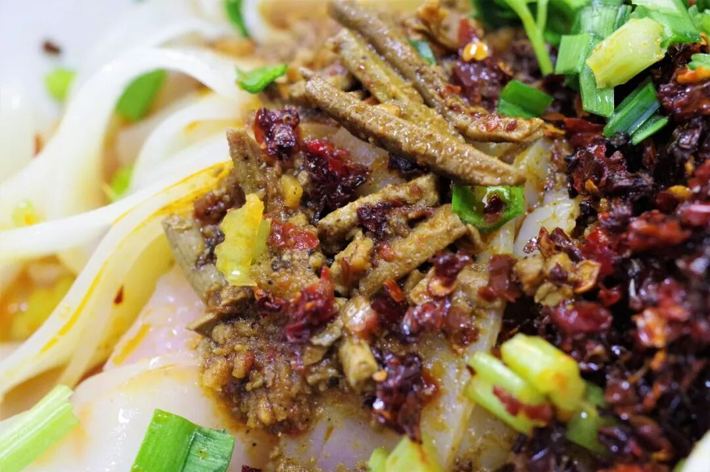

凉皮、酿皮、凉面等也是吴忠地区极为普遍的食物，乍看与西北其他地区并无二致，但羊肝的加入让它们呈现出了明显的地方特色。羊肝凉皮起源于盐池、定边一带，在凉皮之上加入炒制的羊肝，给一道素食添上一抹不重不浅的荤色，也给口感稍显单调的凉皮加上了一些粉嫩之感。

在吴忠街头，还常能看见许多出售清真糕点的小店，由于品类实在太多无法一一品尝，如果喜欢那简单的清甜油香之味，那吴忠也一定能满足你。

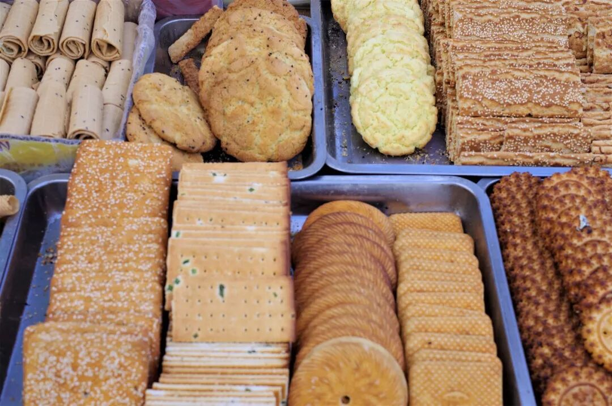

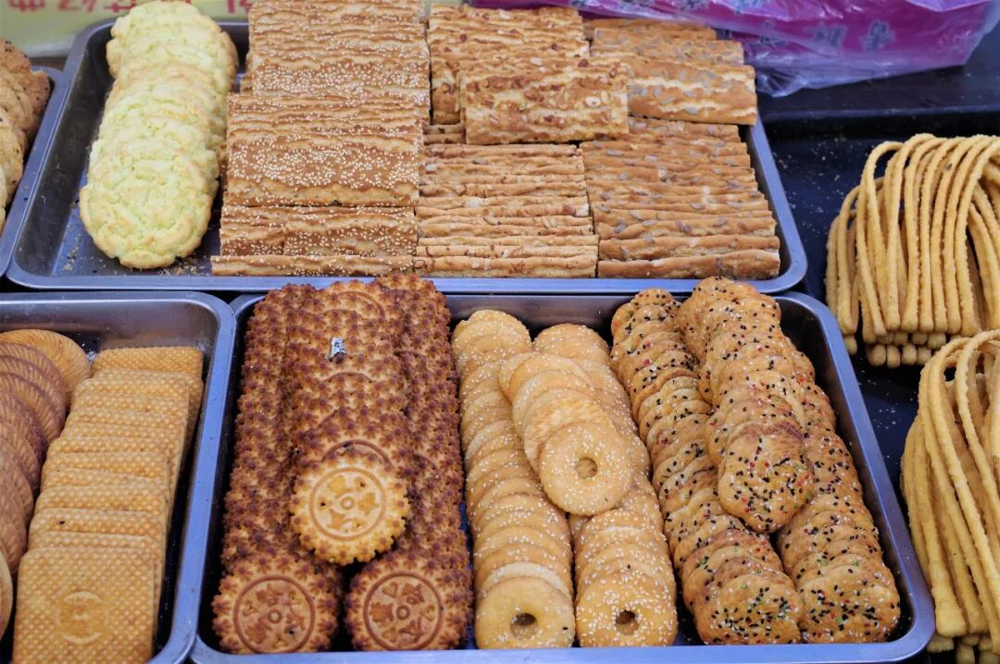

就这样告一段路吧，吴忠。关于饮食，你太过低调也太过隐忍。但这一次我发现了你，也品尝了你，你将注定成为这漫长行程中浓墨重彩的一笔。

也许还有所遗漏，也许还有失偏颇，但不要紧。我想我会归来的。

再见。

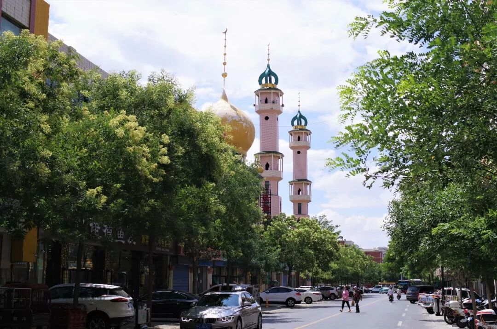

想知道我在干啥，请点这个链接：吃货的决心——555天中国饮食探索之行

想知道我要去哪，请点这个链接：555天行程计划（2018-07-26更新）

吃在吴忠，中！

（长按识别二维码点击关注哦）

 var first_sceen__time = (+new Date()); if ("" == 1 && document.getElementById('js_content')) { document.getElementById('js_content').addEventListener("selectstart",function(e){ e.preventDefault(); }); }

 if ("0" == 1) { document.addEventListener("keydown",function(e){ if ((e.metaKey || e.ctrlKey) && (e.key === 'c' || e.key === 'C' || e.key === 'x' || e.key === 'X' || e.key === 'a' || e.key === 'A')) { if (e.target.tagName === 'INPUT' || e.target.tagName === 'TEXTAREA') { return; } e.preventDefault(); } }); document.addEventListener("copy",function(e){ var sel = window.getSelection(); var content = document.getElementById('js_content'); if (sel && sel.rangeCount > 0 && content && content.contains(sel.getRangeAt(0).commonAncestorContainer)) { e.preventDefault(); } }); }

预览时标签不可点

微信扫一扫

关注该公众号

知道了 (javascript:;)
